# 第十二章：Drupal 中的 RESTful 网络服务

*Drupal 8 中的一个主要新开发者特性是内置对 REST 的支持。在本章中，我们将探索和配置内置的 REST 支持。然后我们将通过安装 RESTful 模块来扩展它。最后，我们将开发一个自定义的 Recipe AngularJS 应用程序，该应用程序将消费我们食谱网站的 REST API。*

在本章中，我们将学习以下主题：

+   互联网服务简介

+   REST 简介

+   什么是无头 Drupal？

+   何时以及为什么要解耦 Drupal？

+   Drupal 中的 RESTful 网络服务

+   如何在 Drupal 中创建 RESTful API

+   创建一个基本的 Angular 网站，该网站将消费我们食谱的 REST API

# 互联网服务简介

网络服务可以被定义为网络中两个应用程序之间的通信桥梁。W3C 通常将网络服务定义为：

> *"一个设计用于支持网络中可互操作机器间交互的软件系统。"*

互联网服务创新是组织之间以及与客户沟通的重要途径。与传统的客户/服务器模型不同，例如网络服务器或网页框架，网络服务不向用户提供图形用户界面。相反，它们通过网络上的自动接口提供业务逻辑、数据和流程。应用程序相互连接，而不是与客户连接。工程师可以将网络服务添加到 GUI（例如网页或可执行系统），以向用户提供特定功能。

让我们来看看本章中我们将要遵循的示例。我们的 Drupal 网站包含食谱内容，它们包含有关不同食谱的数据。我们希望其他应用程序和网站能够使用这些内容和数据，并在它们各自的应用程序中显示。现在，由于他们希望根据需要显示数据，他们将尝试获取数据的原始值，并按照他们的要求显示。

在此过程中，我们需要注意尝试从我们的 Drupal 应用程序获取数据的应用程序的认证，以确保我们的数据没有受到第三方攻击。

提供数据和消费它的整个场景是通过网络服务实现的，它作为我们的 Drupal 应用程序和外部世界之间的桥梁。

许多组织使用不同的编程框架进行管理。不同的编程框架通常需要相互交换信息，而网络服务是实现两个软件系统通过互联网交换这种信息的通信策略。需要信息的产品框架被称为**服务请求者**，在本章中是 Angular 网页，而准备请求并提供信息的产品框架被称为服务提供者，在我们的例子中是 Drupal。

简而言之，网络服务使外部应用程序和设备能够与我们的应用程序（在这种情况下，我们的 Drupal）通信，以执行**CRUD**操作（即**创建**、**读取**、**更新**和**删除**）。

# REST 简介

**REST**是**表示性状态转移**的缩写，这是创建网络服务最受欢迎的方式之一。

REST 是面向服务架构的架构设计之一，它使用简单的 HTTP 调用与机器进行所有 CRUD 操作。仅在过去几年中，REST 因其简洁性而成为主导的网络服务设计模型，取代了大多数基于 SOAP 和 WSDL 的服务。

REST 的四个基本设计原则如下：

+   **显式使用 HTTP 方法**：REST 遵循纯 HTTP 方法，并鼓励开发者明确使用它，这与协议定义一致。这种基本的 REST 设计理论在 CRUD 函数和 HTTP 方法之间建立了一对一的映射，匹配以下映射：

    +   `POST`：创建资源

    +   `GET`：检索资源

    +   `PUT`：更新资源

    +   `DELETE`：删除资源

+   **无状态**：无状态网络服务创建一个响应，该响应链接到集合中的另一页，并允许客户端执行所需操作以维护此值。这种 RESTful 网络服务设计的特点可以分为两个任务单元：

    +   **服务器**：这生成包含链接到其他资产的响应，允许应用程序在相关资源之间导航。服务器还包括 Cache-Control 和 Last-Modified 系统，以确定要缓存哪些数据以减少服务器负载。

    +   **客户端**：这使用 Cache-Control 和 Last-Modified 系统来确定是否保留本地副本并缓存资源。

    客户端应用程序与服务之间的这种协作对于 RESTful 网络服务的无状态性至关重要。它通过节省带宽和减少服务器端应用程序状态来提高性能。

    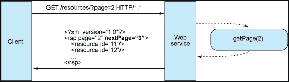

+   **暴露类似目录结构的 URL**：另一个 RESTful 网络服务的属性完全关乎 URL。RESTful 网络服务的 URL 需要直观到简单易猜的程度。将 URL 视为一种自我文档化的接口，它需要非常少的，如果有的话，解释或参考，以便任何开发者都能理解它所考虑的内容以及如何获取相关资源。例如，在我们的食谱服务中，我们将有如下结构的 URI：

    +   `http://www.headless.dev/api/recipes/snacks/{recipe_name}`，它公开了特定食谱的详细信息

    +   `http://www.headless.dev/api/recipes/{recipe_type}`，它提供了与食谱类型相关的食谱

    +   URI 也应该保持静态，这样当资源发生变化或服务的实现发生变化时，链接保持不变。

+   **传输 XML、JavaScript 对象表示法（JSON）或两者**：客户端需要一种表示格式来消费 Web 服务并在其表示层上显示它们。在 RESTful 互联网服务设计中，最后一组约束与应用程序和服务在请求/响应有效负载或 HTTP 主体中交换的数据结构有关。这正是保持简单、可读性和关联性真正有益的地方。为了提供客户端应用程序请求特定文章类型的能力，以便它们能够得到完美的结果，请按照以下顺序构建您的服务：使用内置的 HTTP Recognize 标头，其中标头的优势是 MIME 类型。这里展示了 RESTful 服务中使用的某些常见 MIME 类型：

    | MIME 类型 | 内容类型 |
    | --- | --- |
    | **JSON** | `application/json` |
    | **XML** | `application/xml` |
    | **XHTML** | `application/xhtml+xml` |

# 无头 Drupal

“无头 Drupal”这个术语被用来指代 Drupal 应用程序后端和前端之间的解耦。在无头 Drupal 中，网站访客不会直接与 Drupal 交互。

从网站访客的角度来看，用户并不是直接连接到 Drupal，而是连接到一个前端 JavaScript 框架，例如 KnockoutJS 或 AngularJS。因此，网站访客看不到生成的 Drupal 主题（即头部），这不被使用：*无头*。

在这种情况下，Drupal 仅用作后端内容管理系统，由前端 JavaScript 框架、移动应用或其他第三方应用程序读取。因此，Drupal 后端正如您所知，但前端完全是非 Drupal 的。

数据交换几乎总是通过 JSON 进行。

关于 Drupal 未来的一份宣言已经制定，包含四个目标：

+   我们希望 Drupal 成为设计师和前端开发者的*首选*后端内容管理系统。

+   我们相信 Drupal 的主要优势在于其后端的力量和灵活性；其对用户的主要价值在于其构建和显示复杂内容模型的能力。

+   我们相信客户端前端框架是 Web 的未来。

+   对于 Drupal 来说，首先应该是面向服务的——而不是面向 HTML 的——否则可能会变得无关紧要。

一张无头 Drupal 网站的示意图可以解释 Pantheon 构建的大量内容：

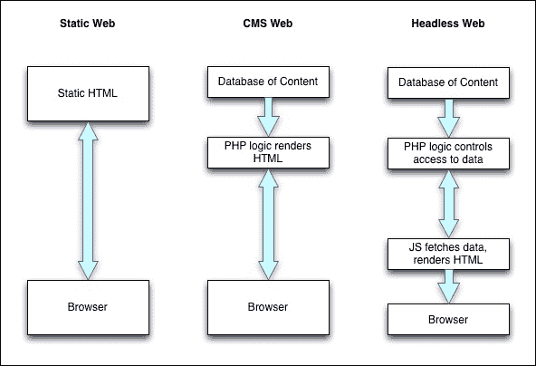

无头 Drupal 将通过使用 REST 服务器创建 API 来实现 Web 服务概念，这些 API 将被其他应用程序或单个应用程序消费，以在前端提供服务。

在 Drupal 8 之前，可以使用 services 和 RESTWS 等模块构建无头网站，但 Drupal 8 内置了 REST API，这很好地满足了这一目的。

## 何时解耦 Drupal 或何时使用无头 Drupal

如前所述，无头 Drupal 将解耦后端架构和前端架构，这样前端就可以根据需求灵活地显示内容。但何时应该使用这种方法？我们特别在 Drupal 拥有强大的自身主题层时使用它。

让我们来看看使用无头 Drupal 的一些优缺点：

+   **优点**:

    +   为所有人提供干净的 API，因为它是一致的，任何应用程序都可以用来表示数据。

    +   升级前端将需要后端的所有更改，同样，升级后端也不会影响前端。然而，在设计内容 API 时需要格外小心。

    +   由于前端与 Drupal 分离，对 Drupal 专业知识的依赖性减少。

+   **缺点**:

    +   解耦结构的工程更难以理解和调试。弄清楚为什么某些东西出了问题是非常困难的。

    +   Drupal 的即用功能需要从头开始构建。例如，Facebook 插件，它提供 Facebook 访问和登录功能，功能强大且稳定。但在解耦环境中使用时，整个功能需要重新构建。

    +   由于后端团队与前端团队分离，高效开发所需的最小团队规模更大。

那么为什么无头 Drupal 让我们感到高兴呢？

+   Drupal 的安装更容易维护

+   系统的可扩展性变得更容易

+   与不同团队一起工作和为团队工作变得更加容易

+   性能得到提升

+   它使项目具有未来保障

自 Drupal 启动以来，它已经从仅仅是一个博客平台发展到成为一个强大的内容管理系统，无头 Drupal 的概念进一步加强了其内容管理能力。但在跳入解耦 Drupal 之前，你需要对项目有一个清晰的理解。尽管它看起来很有吸引力，并且具有很大的优势，但它也有缺点。

# Drupal 中的 RESTful Web 服务

如前所述，在 Drupal 8 之前，可以使用 Services 模块或 RESTWS 模块在 Drupal 7 中实现 RESTful Web 服务。这些模块（使用 REST 服务器）可以用来构建强大的无头 Drupal 网站。但随着 Drupal 8 的发展，这一功能已被附加到 Drupal 8 默认捆绑包的核心中，以及其他推送到核心的贡献特性、模块，如 Views、Link、WYSIWYG 编辑器等。

Drupal 8 通过核心中的四个模块实现了设置基本 Web 服务环境以提供 API 的完整功能。它们如下：

+   **RESTful Web 服务 (REST)**: 这通过 RESTful Web API 公开实体和其他资源。它依赖于 Serialization 模块来序列化发送到和从 API 发送的数据。

+   **Serialization**: 这提供了一种将数据序列化到 JSON 和 XML 等格式以及从这些格式中反序列化的服务。

+   **超文本应用语言（HAL）**：使用超文本应用语言序列化实体。Drupal 核心目前使用此格式，增加了两个关键字：`_link`用于链接关系，`_embedded`用于嵌入媒体。

+   **HTTP 基本认证（basic_auth）**：此模块通过 HTTP 基本认证提供者实现基本用户认证，使用用户名和密码进行认证以进行 API 调用。

## Drupal 中的 RESTful API

在 Drupal 中创建 RESTful API 是一个相对简单的工作，因为整个 Web 服务的力量已经移至核心。为了创建 API，我们将使用为这本书构建的食谱内容类型。

我们将创建三个基本 API；这些将提供以下信息：

+   获取所有食谱类型

+   获取特定食谱类型下的所有食谱

# 执行时间 – 获取所有食谱类型

这是我本地 Vagrant（`http://www.headless.dev`）开发服务器上运行的食谱类型列表：

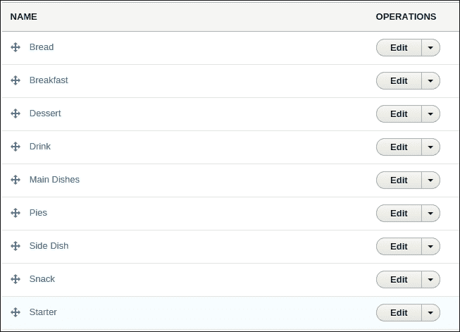

我们将创建一个 API URL，结构为`http://www.headless.dev/recipes`，这将给出我网站上的食谱列表。让我们开始吧：

1.  我们需要从模块页面启用 Web 服务模块。

1.  点击管理菜单栏中的**管理**，然后点击**扩展**。

1.  一旦你进入**模块**页面，搜索**RESTful Web 服务**和**序列化**。启用这两个模块：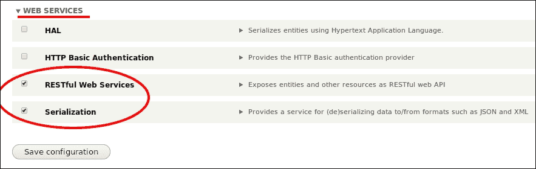

1.  接下来，我们需要为我们的食谱类型创建 REST 导出视图。视图现在是 Drupal 8 的核心，它使用 REST 导出模式创建 Web 服务 API。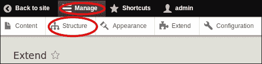

1.  然后点击**视图**：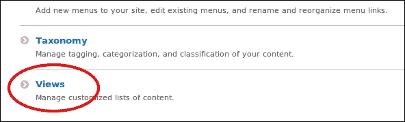

1.  你将看到**视图**页面，在这里你可以管理、配置和添加新的视图。Drupal 8 广泛使用视图来在网站上显示不同的数据和内容。然而，**Web 服务**模块默认不提供任何视图。

1.  继续操作，点击**视图**页面的**添加新视图**：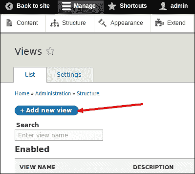

1.  在视图配置页面，按照下一张截图所示填写表单。我们已选择**显示**为**分类术语**，以及**类型**为**食谱类型**，以创建一个用于显示网站中食谱类型的 Web 服务 API。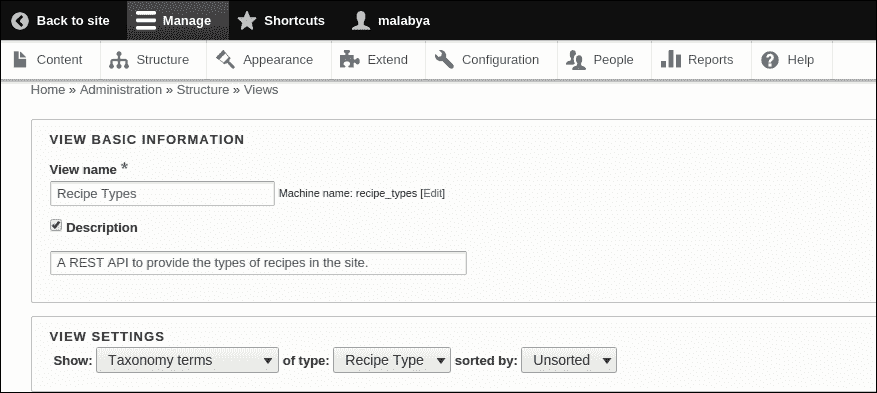

1.  填写完表单后，我们需要选择 REST 导出显示，通过 URL 导出或公开 API。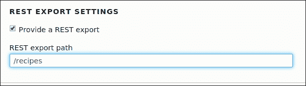

1.  点击**保存并编辑**以配置视图。

1.  现在，默认情况下，视图将提供关于分类术语的完整实体信息。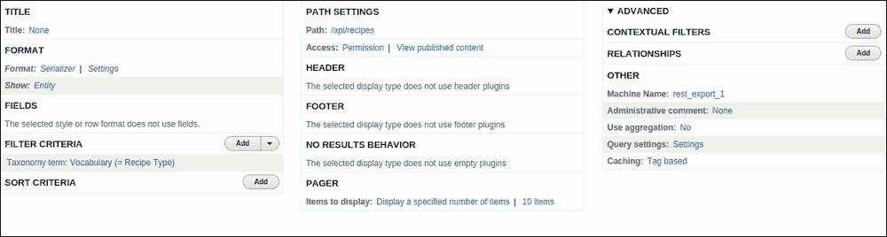

1.  预览视图的结果非常混乱，难以阅读。它以一个平铺的列表形式显示。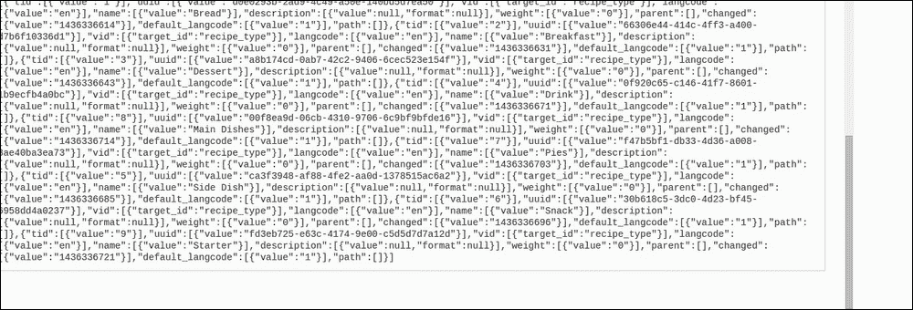

    为了使其更易于阅读，您需要安装一个名为 **JSONview** 的谷歌插件，该插件以更易读的方式渲染 JSON 对象。

    一旦安装了插件，您可以通过点击此 URL 在浏览器中查看响应：`http://www.headless.dev/api/recipes`。

    由于它提供了所有关于术语的信息，我们需要从响应中过滤掉不必要的字段，使其更易于阅读和消费。

1.  我们将公开食谱类型的标题、tid 和描述以供消费。在 **Views** 设置中，在 **FORMAT** 下选择 **Show** 属性，并选择 **Fields** 而不是 **Entity**。

1.  从提供的选项中选择 **Fields**，以便您可以将字段添加到您的 REST 导出中：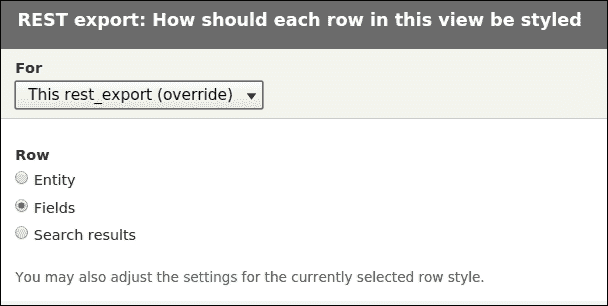

1.  选择 **Apply**，在下一屏幕上，它会询问您是否需要为字段标签创建别名。但保留为 name 即可。

1.  接下来，我们需要在 **FIELDS** 设置下添加剩余的字段。在 **FIELDS** 下选择 **Add** 并添加 `tid` 和 `description` 字段：

1.  选择 **Taxonomy term: Term ID** 字段以在您的 REST 导出中获取术语 ID。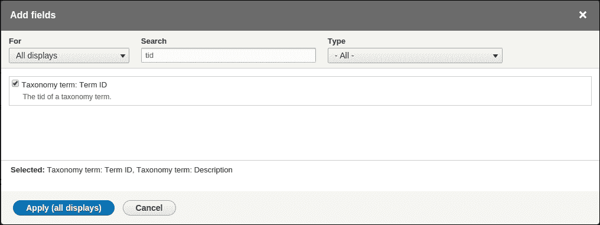

1.  然后从字段列表中选择 **Taxonomy term: Description** 字段：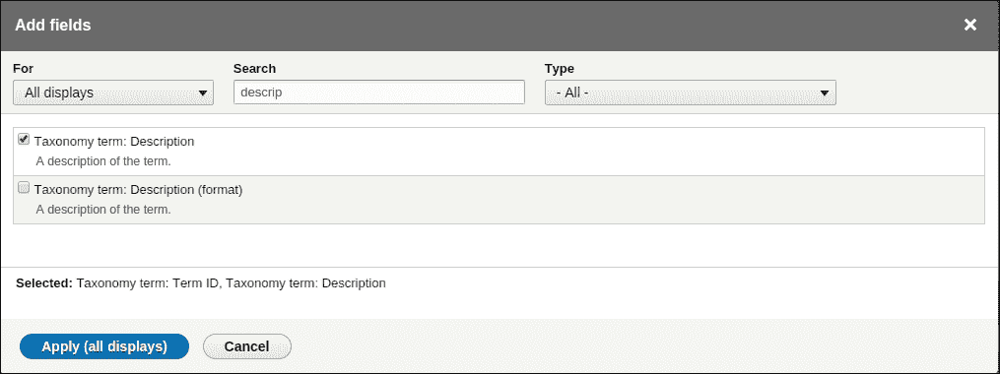

1.  应用设置并保存字段为默认值，除非您需要为字段做更特殊的事情。

1.  接下来，我们将重新排列字段，以便字段的顺序为 tid、name 和 description。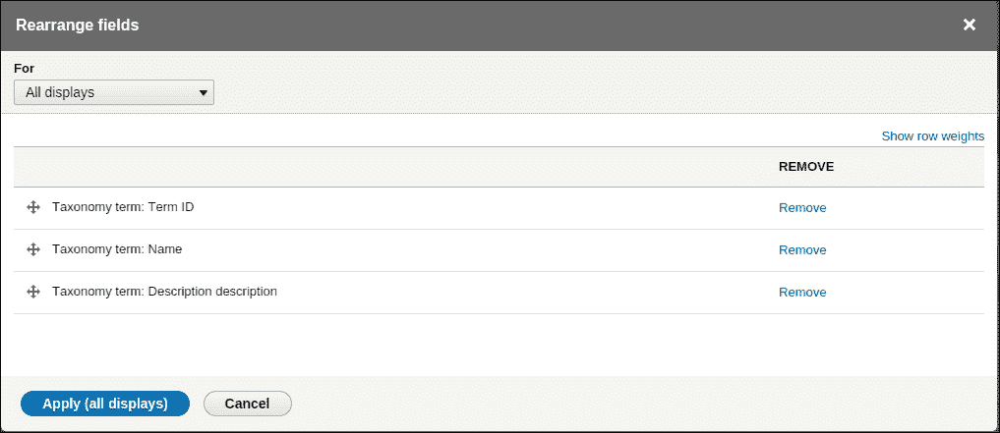

1.  现在，如果我们访问浏览器中的 `http://www.headless.dev/api/recipes`，我们将得到一个更精确且易于阅读的 JSON 对象，可以由任何应用程序消费。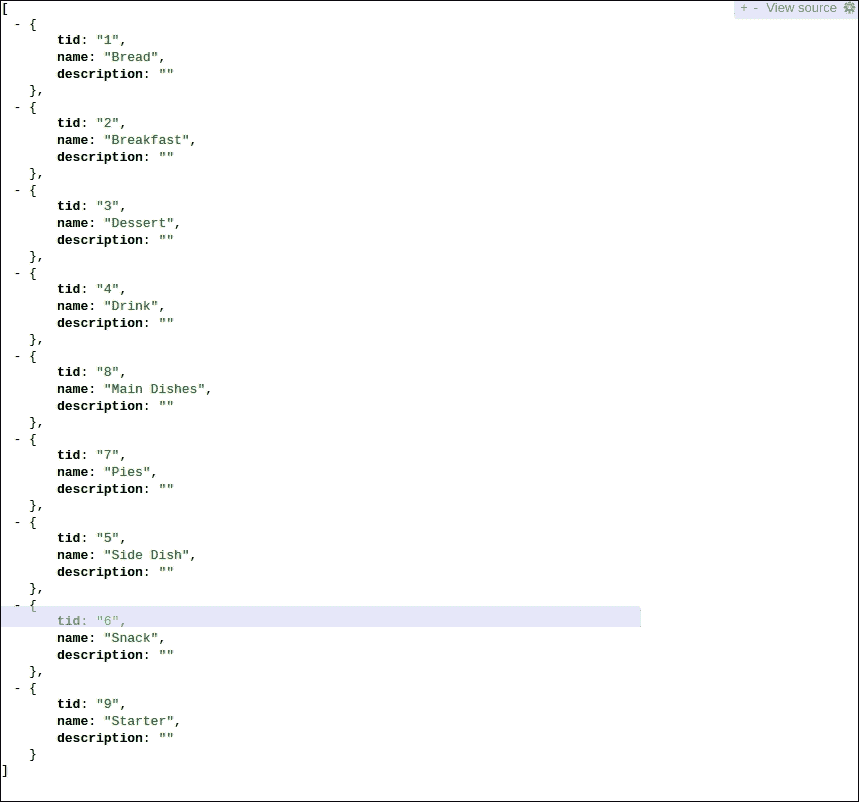

## *刚才发生了什么？*

我们使用 Drupal REST 服务模块和 REST 视图导出创建了一个 API，它为我们提供了 Drupal 网站上可用的食谱类型的 JSON，供消费使用。

# 行动时间 – 创建一个 API 以获取所有食谱类型下的食谱

现在，我们将创建我们的下一个 API，该 API 用于公开所有食谱类型下的食谱：

1.  我们将以相同的方式创建一个新的视图，但我们将选择所有类型食谱的内容而不是选择分类术语。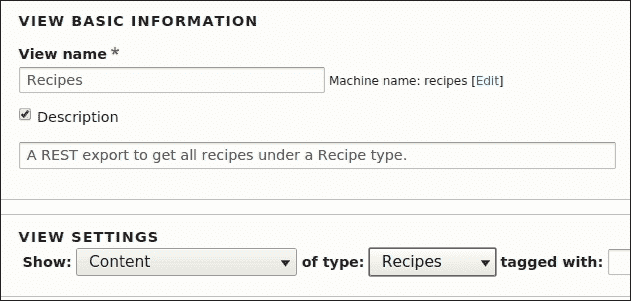

1.  在 REST 导出设置中，将 URL 设置为`api/recipes/%`。百分号`%`符号作为通配符，将食谱类型 tid 作为参数。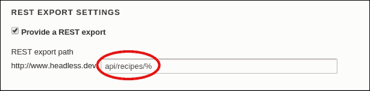

1.  在视图设置页面，我们配置视图就像我们为食谱类型所做的那样。我们将显示的字段是：

    +   **节点 ID**

    +   **标题**

    +   **发布状态**

    +   **食谱类型**

    +   **食谱图片**

    +   **准备时间**

    +   **烹饪时间**

    +   **总时间**

    +   **正文**

    +   **成分**

    +   **说明**

    +   **产量**

    +   **评论**

1.  要获取与特定食谱相关的食谱，我们将使用食谱内容中的食谱类型字段，该字段引用了食谱类型词汇表。

1.  在视图配置页面的高级部分，在**上下文过滤器**下，点击**添加**以将食谱类型 tid 作为参数添加：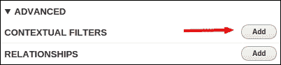

1.  在上下文过滤器形式中，搜索`食谱类型`并选择要配置的字段：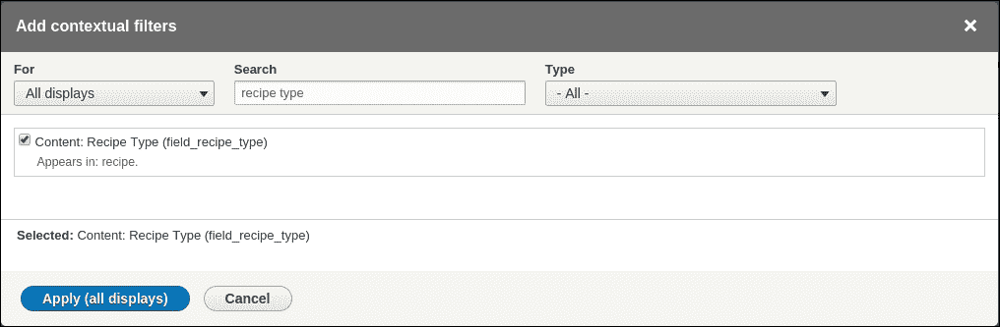

1.  在上下文过滤器配置表单中，选择**提供默认值**单选按钮，并从**类型**下拉菜单中选择**从 URL 获取分类术语 ID**作为参数：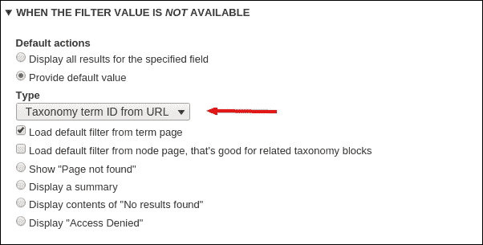

1.  JSON 对象将给出索引作为字段的机器名。因此，我们将字段别名化以使索引名称相关。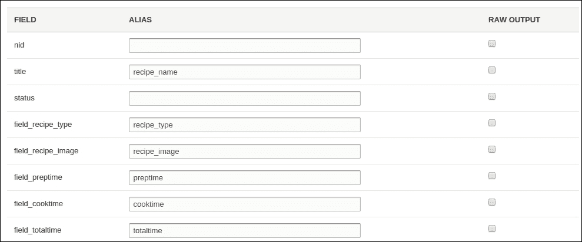

1.  现在，如果你通过点击 URL `http://www.headless.dev/api/recipes/6` 在浏览器中检查结果，你将获得与术语 ID `6` 相关的节点 JSON 对象，该 ID 对应于 Snack 食谱类型：

    ```php
    {
    nid: "3",
    recipe_name: "<a href="/node/3" hreflang="en">Oven-Roasted Falafel</a>",
    status: "On",
    recipe_type: "Snack",
    recipe_image: "http://www.headless.dev/sites/default/files/oven-roasted-fallafel_330.png",
    preptime: "10Minutes",
    cooktime: "35Minutes",
    totaltime: "1Hours",
    summary: "<p>Crisp chickpeas balls are stuffed in soft pita bread along with juicy cucumbers and refreshing sauces.</p>",
    ingredients: "<ul><li class="ingredient">1 can chickpeas, rinsed and drained<br /><br />
      1 small onion, chopped<br /><br />
      2-4 garlic cloves, peeled<br /><br />
      2 Tbsp chopped fresh parsley <br /><br />
      2 Tbsp chopped fresh cilantro <br /><br />
      1 tsp ground cumin <br /><br />
      1/4 tsp salt <br /><br />
      Pinch of dried chili flakes<br /><br />
      1/4 cup whole wheat flour (plus extra, if needed) <br /><br />
      1 tsp baking powder <br /><br />
      Canola oil for cooking<br /><br /><br /><strong>Accompaniments:</strong><br /><br />
      Fresh pitas<br /><br />
      Tzatziki<br /><br />
      Chopped cucumber<br /><br />
      Tomatoes<br /><br />
      Red onion </li>
    </ul>",
    instructions: "<p><span>Preheat oven to 425 ˚F (220 ˚C).</span><br /><br /><span>Place chickpeas, onion, garlic, parsley, cilantro, cumin, salt, and chili flakes in bowl of food processor and pulse until combined but still chunky. </span><br /><br /><span>Add flour and baking powder and pulse until it turns into soft mixture that you can roll into balls without sticking to your hands. </span><br /><br /><span>(Add another spoonful of flour if it seems too sticky.)</span><br /><br /><span>Roll dough into meatball-sized balls and gently flatten each into little patty. </span><br /><br /><span>Place patties on heavy-rimmed baking sheet, preferably one that's dark in color.</span><br /><br /><span>Brush each patty with canola oil, flip them over and brush other side. </span><br /><br /><span>Roast for 15 minutes, then flip them over and roast for another 10 minutes, until crisp and golden on both sides. </span><br /><br /><span>Serve warm, wrapped in pitas, with tzatziki, chopped cucumber, tomatoes and red onion. </span></p>",
    yield: "3",
    review: ""
    }
    ```

## *刚刚发生了什么？*

我们创建了一个提供所有食谱类型的 API，以及一个提供特定食谱类型下所有食谱类型的 API。现在我们将看看我们如何使用 AngularJS 来消费这个 REST 导出的 JSON 输出并在网页上显示。

# 执行时间 – 使用 AngularJS 消费 RESTful Web 服务

现在我们有一个 API，它提供了包含食谱、食谱类型和单个食谱的 JSON 数据的 JSON 数据服务，让我们看看我们如何使用 HTML 和 AngularJS 在页面上显示这些数据：

1.  由于它是针对 Drupal 受众的，我们不会深入研究服务的消费。

1.  因此，让我们首先在 Drupal 根目录中创建一个名为`recipes`的目录。在目录中，我们将有两个文件，`recipe.js`和`index.html`。

1.  `recipe.js`文件将包含调用 API URL 并解析数据对象以供消费的代码。`index.html`文件将包含读取解析数据并在页面上显示的 AngularJS 代码和 HTML。

1.  文件夹结构应类似于这个：

    ```php
    Drupal Root
    --recipe
    ----recipe.js
    ----index.html
    ```

1.  让我们来看看 `recipe.js` 文件，这是 AngularJS 控制器。正如所说，它将包含创建 Angular 控制器模块的 JavaScript 代码，从 API URL 获取 JSON 对象并将其解析为从 JSON 对象提供原始内容：

    ```php
    function Recipe($scope, $http) {
        $http.get('http://www.headless.dev/api/recipes/6').
            success(function(data) {
                $scope.recipes = data[0];
            });
    }
    ```

1.  上述代码是 Angular 中的一个控制器，一个 JavaScript 函数。这个函数使用了两个变量，`$http` 和 `$scope`。

    +   `$http` 使用 `get` 方法调用 REST API URL

    +   `$scope` 包含从 API 返回的 JSON，并将其传递给页面中的元素数组 `recipe`

1.  现在我们有了 AngularJS 控制器，我们将创建一个 HTML 页面，该页面将加载控制器到网页浏览器中：

    ```php
    <!doctype html>
    <html ng-app>
      <head>
        <title>Recipes</title>
        <script src="img/angular.min.js"></script>
          <script src="img/recipe.js"></script>
      </head>

      <body>
        <div ng-controller="Recipe">
          <h1>{{recipes.recipe_name}}</h1>
          <p>{{recipes.summary}}</p>
        </div>
      </body>
    </html>
    ```

1.  第一个脚本标签从 **内容分发网络**（**CDN**）加载了最小化的 AngularJS 库（`angular.min.js`），这样我们就不必下载 AngularJS 并将其放置在项目中。

1.  第二个脚本从应用程序的路径加载控制器代码（`recipe.js`）。

1.  AngularJS 使用两个属性与 HTML DOM 交互：

    +   `ng-app` 属性用于指示此页面是 AngularJS 应用程序

    +   `ng-controller` 属性用于定义要使用的控制器

1.  占位符引用了食谱模型对象的 `recipe_name` 和 `summary` 属性，这些属性将在成功消费 REST 服务后设置：

    +   `<h1>{{recipes.recipe_name}}</h1>`

    +   `<p>{{recipes.summary}}</p>`

要运行客户端，你只需要在网页浏览器中打开目录。由于我们的 Angular 应用程序位于 Drupal 根目录中，我们可以通过打开此 URL 来运行它：`http://www.headless.dev/api/recipes/6/recipes`。

这将显示以下结果：

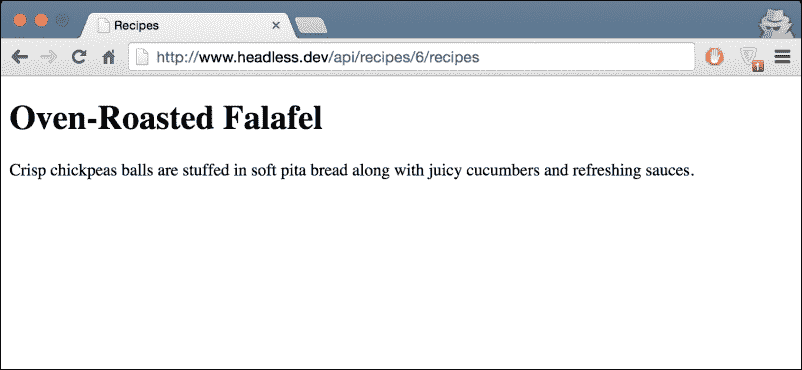

因此，这是使用 Angular JS 消费 RESTful API 的简单方法。

需要记住的一个要点：由于 Angular 应用程序位于 Drupal 根目录中，因此运行 Angular 应用程序时没有跨域问题。但如果 Angular 应用程序位于托管 web 服务的服务器之外，那么必须在托管 web 服务的服务器上启用 CORS（跨域资源共享）。这允许受限制的资源在 Angular 应用程序服务器上显示。

## *发生了什么？*

我们创建了一个 AngularJS 应用程序，它消费了从 Drupal 实例创建的 REST 导出的 JSON 结果。此 JSON 响应被 Angular 应用程序用来在 HTML 页面上显示由 Angular 应用程序提供的输出。这有助于我们以更快的速度显示数据，并且我们可以控制页面显示和设计。

# 摘要

因此，我们现在有一个用于数据存储的 Drupal 网站。Drupal 网站将被用来生成内容和数据。这些数据将使用 Drupal 内置的 web 服务模块和视图以 JSON 格式表示，创建 RESTful JSON 导出，该导出可以被应用程序用来消费此 JSON 输出并在应用程序中显示。
