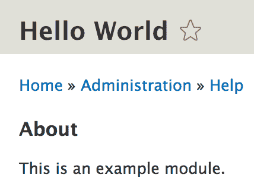
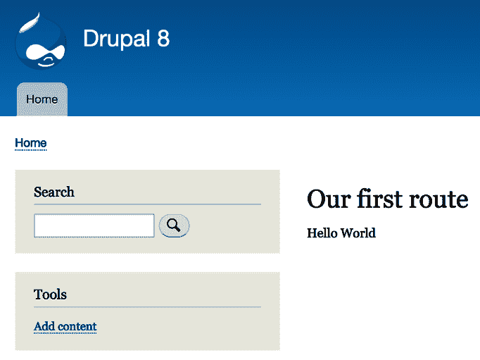
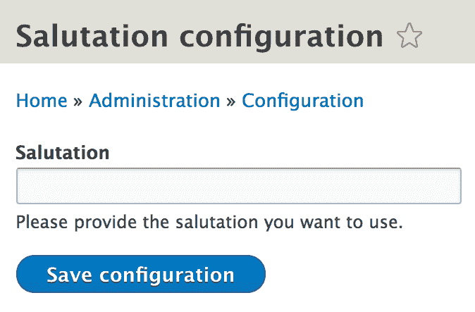

# 第二章：创建您的第一个模块

现在我们已经了解了 Drupal 8 模块开发的一些入门方面，现在是时候深入探讨我们在这里所做的工作的核心——模块创建。

在本章中，我们将涵盖的一些重要主题包括：

+   创建新的 Drupal 8 模块——启动所需的文件

+   创建路由和控制器

+   创建和使用服务

+   创建表单

+   创建自定义块

+   与链接一起工作

+   使用事件调度器

具体来说，在本章中，我们将创建一个名为 *Hello World* 的新自定义模块。在这个模块中，我们将定义一个路由，它映射到一个控制器并输出古老的编程信息。所以，这将是我们第一次的成功。

接下来，我们将定义一个控制器将使用的服务来提升我们的消息。毕竟，我们不想整天向用户展示相同的信息。然而，这个简单的例子将说明服务是什么以及如何与服务容器交互以使用它们。

然后，我们将创建一个表单，管理员将能够覆盖我们页面上显示的消息。它将存储在配置中，我们将修改我们的服务以利用该配置。这里的关键收获将是 Form API 的使用。然而，我们还将讨论如何存储一些基本的配置值并添加依赖到我们现有的服务中。

最后，我们希望变得更加灵活。为什么用户只能在特定的页面上被问候呢？我们将创建一个自定义块，它可以放置在网站的任何位置并显示相同的信息。在这里，我们将看到如何定义块插件以及它们如何暴露自己的配置表单以实现更大的灵活性。

虽然这与我们的 *Hello World* 示例没有严格的关系，但我们还将探讨如何在 Drupal 8 中以编程方式处理链接。这对于任何 Drupal 8 开发者来说都是非常常见的任务，他们需要经常执行。此外，我们还将探讨使用事件调度器组件，更重要的是，订阅事件。我们将通过一个相当常见的例子来说明这一点——执行来自传入请求的重定向。

到本章结束时，你应该具备构建自己模块所需的基础知识。此外，你应该能够理解和实现 Drupal 8 模块开发中最常用的技术。

# 创建模块

创建一个简单的 Drupal 8 模块并不困难。你只需要一个文件就能让核心安装识别它，并能够启用它。在这个状态下，它不会做很多事情，但它将是可安装的。让我们首先看看如何做到这一点，然后我们将逐步添加内容，以达到本章开头设定的目标。

自定义 Drupal 8 模块通常位于根 Drupal 安装中`/modules`文件夹内的`/custom`目录中。您会将贡献模块放在一个`/contrib`目录中，以便有明确的区分。这是一个标准做法，所以我们将把我们的自定义模块放在那里，称为*Hello World*。

我们将首先创建一个名为`hello_world`的文件夹。这也将是模块在许多其他地方使用的机器名。在里面，我们需要创建一个*信息*文件来描述我们的模块。此文件命名为`hello_world.info.yml`。这种命名结构很重要——首先，模块名称，然后是`info`，最后是`.yml`扩展名。您经常会听到这个文件被称为模块的`info`文件（因为过去版本的 Drupal 中它有`.info`扩展名）。

在此文件中，我们需要添加一些最小信息来描述我们的模块。我们将采用如下方式：

```php
name: Hello World
description: Hello World module
type: module
core: 8.x
package: Custom
```

其中一些是自解释的，但让我们看看这些行意味着什么：

+   前两个代表模块的可读名称和描述。

+   `type`关键字表示这是一个模块*信息*文件，而不是主题。在 Drupal 8 中，这已成为强制性的。

+   `core`关键字指定此模块与 Drupal 8 版本兼容，并且它无法在先前或未来的版本上安装。

+   最后，我们将它放在通用的`Custom`包中，以便它在模块管理屏幕的这个组中分类。

大概就是这样。现在，您可以通过`/admin/modules`界面或使用`drush en hello_world`命令通过 Drush 启用此模块。

在我们继续之前，让我们看看您可以在信息文件中添加哪些其他选项（并且可能需要在某个时候添加）：

*模块依赖性:* 如果您的模块依赖于其他模块，您可以在其信息文件中指定，如下所示：

```php
dependencies:
  - drupal:views
  - ctools:ctools
```

依赖项应按`project:module`格式命名，其中`project`是 Drupal.org 上项目 URL 中出现的项目名称，`module`是模块的机器名。您甚至可以包括版本限制，例如，`ctools:ctools (>=8.x-3.x)`。

*配置:* 如果您的模块有一个集中配置选项的一般配置表单，您可以在信息文件中指定该表单的路由。这样做将在安装模块的`admin/modules` UI 页面上添加到该表单的链接。

# 您的第一个钩子实现

按照目前的状态，此模块并没有做什么。实际上，它什么也不做。然而，请给自己鼓掌，因为您已经创建了您的第一个 Drupal 8 模块。在我们继续到我们计划的有意思的内容之前，让我们实现我们的第一个钩子，它负责提供有关我们模块的一些有用信息。

如我们在第一章中暗示的那样，当 Drupal 遇到一个存在钩子的事件（并且有数百个这样的事件）时，它会遍历所有模块以查找匹配的钩子实现。那么，它是如何找到匹配的实现呢？它会寻找以`module_name_hook_name`格式命名的函数，其中`hook_name`被正在实现的钩子名称所替换。钩子的名称是`hook_`之后的内容。我们将在实现`hook_help()`时看到一个示例。然而，一旦找到实现，它将依次执行每个实现。一旦所有钩子实现都执行完毕，Drupal 将继续其处理。

根据模块的大小，建议你将所有的钩子实现放在一个`.module`文件中。然而，在某些情况下，你可能会将它们组织在其他文件中，要么是你自己将这些文件包含在`.module`文件中，要么是使用特定的文件命名约定，让 Drupal 包含它们。但是，目前我们坚持使用默认设置。

因此，让我们在我们的模块文件夹中创建一个名为`hello_world.module`的`.module`文件，并在顶部放置一个 PHP 标签。然后，我们可以在其中放置以下`hook_help()`实现（以及通常所有其他钩子实现）：

```php
use Drupal\Core\Routing\RouteMatchInterface;

/**
 * Implements hook_help().
 */
function hello_world_help($route_name, RouteMatchInterface $route_match) {
  switch ($route_name) {
    case 'help.page.hello_world':
      $output = '';
      $output .= '<h3>' . t('About') . '</h3>';
      $output .= '<p>' . t('This is an example module.') . '</p>';
      return $output;

    default:
  }
}
```

如您所见，函数的名称遵循上述格式——`module_name_hook_name`——因为我们正在实现`hook_help`。所以，我们将`hook`替换为模块名称，将`hook_name`替换为`help`。此外，这个特定的钩子接受两个参数，我们可以在其中使用它们；尽管在我们的情况下，我们只使用一个，即路由名称。

此钩子的目的是为 Drupal 提供一些关于此模块做什么的帮助文本。你并不总是需要实现此钩子，但了解它是有好处的。它的工作方式是，每个新模块都在主模块内部获得自己的路由，用户可以浏览这些信息——我们的路由是`help.page.hello_world`。因此，在这个实现中，我们将告诉 Drupal（以及更具体地说，核心`Help`模块）以下内容：如果用户正在查看我们的模块的帮助路由（页面），则显示`$output`变量中包含的信息。就是这样。

根据 Drupal 编码标准，钩子实现上方的 DocBlock 消息需要保持简短和简洁，就像前面的例子一样。我们通常不会为 Drupal 核心钩子或流行的`contrib`模块钩子添加任何其他文档，因为它们应该在别处进行文档化。然而，如果你正在实现你模块中定义的自定义钩子，添加一个描述其功能的第二段是可以的。

用户现在可以通过点击每个实现此钩子的模块的帮助链接，从模块管理页面访问此页面。简单，对吧？



尽管我们并没有通过这个钩子提供任何有用的信息，但实现它帮助我们理解了钩子的工作原理以及使用它们的命名约定。此外，我们还看到了一个传统（过程式）的 Drupal 扩展点的示例，模块开发者可以使用它。通过这样做，我们实际上扩展了帮助模块的功能，允许它向用户提供更多信息。

现在，让我们继续创建我们自己的内容。

# 路由和控制器

我们最初着手创建的功能性内容是一个简单的 Drupal 页面，它输出那个古老的 *Hello World* 字符串。为了做到这一点，我们需要两样东西——一个路由和一个控制器。所以，让我们从第一个开始。

# 路由

在我们的模块中，我们需要创建一个包含所有静态定义的路由的路由文件。这个文件的名称将是 `hello_world.routing.yml`。到现在为止，我假设你已经理解了 Drupal 8 模块中的文件命名约定。然而，无论如何，这又是一个我们需要放入 YAML 格式数据的 YAML 文件：

```php
hello_world.hello:
  path: '/hello'
  defaults:
    _controller: '\Drupal\hello_world\Controller\HelloWorldController::helloWorld'
    _title: 'Our first route'
  requirements:
    _permission: 'access content'
```

这是我们的第一个路由定义。它以路由名称（`hello_world.hello`）开始，然后在其下方以 YAML 格式的多维数组形式提供所有必要的信息。标准做法是让路由名称以它所在的模块名称开始，然后根据需要添加路由限定符。

那么，路由定义包含什么呢？这里可以有多个选项，但为了现在，我们将坚持使用那些为我们服务的简单选项。

想要了解更多关于所有路由配置选项的信息，请访问[`www.drupal.org/docs/8/api/routing-system/structure-of-routes`](https://www.drupal.org/docs/8/api/routing-system/structure-of-routes)的相关文档页面。这是一个很好的参考资料，可以随时查阅。

首先，我们有一个路径键，它表示我们希望这个路由在此路径上工作。然后，我们有一个 `defaults` 部分，它通常包含在访问此路由时需要传递给处理器的相关信息。在我们的例子中，我们设置了负责传递页面的控制器和方法，以及它的标题。最后，我们有一个 `requirements` 部分，它通常与使此路由可访问（或被触发）需要满足的条件有关——例如权限和格式。在我们的例子中，我们将要求用户拥有 `access content` 权限，这大多数访客都会有。不用担心；我们将在后面的章节中详细介绍关于访问的内容。

这就是我们的第一个路由定义所需的所有内容。现在，我们需要创建一个控制器，它将映射到这个路由，并向用户传递一些内容。

在我们这样做之前，让我们看看一个非常常见的路由要求示例，你很可能很快就会用到它。我们在这个章节中构建的功能不需要这个，所以我不会将其包含在最终的代码中。然而，了解它是如何工作的非常重要。

# 路由变量

一个非常常见的需求是拥有一个变量路由参数（或更多），该参数被映射到路由的代码所使用，例如，你想显示的页面的 ID 或路径别名。这些参数可以通过将某个路径元素包裹在花括号中来添加，如下所示：

```php
path: '/hello/{param}' 
```

在这里，`{param}` 将映射到一个 `$param` 变量，该变量作为参数传递给负责此路由的控制器或处理器。因此，如果用户访问 `hello/jack` 路径，`$param` 变量将具有 `jack` 值，控制器可以使用它。

此外，Drupal 8 还附带了一些参数转换器，可以将参数转换成更有意义的东西。例如，一个实体可以被自动加载并直接传递给控制器，而不是一个 ID。如果没有找到实体，路由将充当 404，从而节省了我们一些好的代码行。为了实现这一点，我们还需要描述该参数，以便 Drupal 知道如何自动加载它。我们可以通过为该参数添加路由选项来实现：

```php
options:
   parameters:
     param:
       type: entity:node
```

因此，我们现在已经将 `{param}` 参数映射到了节点实体类型。因此，如果用户访问 `hello/1`，将加载 ID 为 1 的节点（如果存在）。

我们可以做得更好。如果我们不是用 `{param}` 而是用 `{node}`（实体类型的机器名）来命名参数，我们就可以完全避免在路由中编写参数选项。Drupal 会推断出它是一个实体，并会尝试自行加载该节点。很酷，不是吗？

所以，下次你需要编写动态路由时，请记住这些要点。

# 命名空间

在我们着手编写控制器之前，让我们先分析一下 Drupal 8 中的命名空间情况以及模块内部文件夹结构应该如何组织。

Drupal 8 使用 PSR-4 命名空间自动加载标准。实际上，这意味着所有 Drupal 核心和模块类的命名空间都以 `\Drupal` 开头。对于模块，基本命名空间是 `\Drupal\module_name`，其中 `module_name` 是模块的机器名。然后它映射到模块目录内的 `/src` 文件夹（对于主要集成文件）。对于 PHPUnit 测试，我们有一个不同的命名空间，正如我们在本书后面将要看到的。

因此，本质上，我们将在我们的模块中需要一个 `/src` 文件夹来放置所有需要自动加载的类。因此，我们可以继续创建它。

# 控制器

现在我们已经大致知道了我们需要放置控制器的地方，让我们首先在我们的模块的 `/src` 文件夹内创建一个 `Controller` 文件夹。虽然这不是强制性的，但这是控制器放置的标准做法。在这个文件夹内，我们可以放置我们的第一个控制器类文件：`HelloWorldController.php`。

在文件内部，我们再次有了一些简单的内容（在 PHP 开头标签之后）：

```php
namespace Drupal\hello_world\Controller;

use Drupal\Core\Controller\ControllerBase;

/**
 * Controller for the salutation message.
 */
class HelloWorldController extends ControllerBase {

  /**
   * Hello World.
   *
   * @return array
   */
  public function helloWorld() {
    return [
      '#markup' => $this->t('Hello World')
    ];
  }
}
```

如预期的那样，我们首先声明命名空间。如果你阅读了前面的部分，命名空间的选择将变得有意义。然后，我们有我们的控制器类，它扩展了 Drupal 8 的`ControllerBase`，它恰好提供了一些辅助工具（例如`StringTranslationTrait`，我将在本书后面讨论语言时解释）。如果你记得我们的路由定义，我们有一个返回数组的`helloWorld`方法。

如果你曾经使用过 Drupal 的早期版本，这个数组（称为*渲染数组*）将很熟悉。否则，你现在需要知道的是，我们正在返回简单的标记，其中包含在上一段中提到的翻译服务包裹的`Hello World`文本。在控制器返回这个数组后，将有一个`EventSubscriber`来接收这个数组，将其通过 Drupal 主题层运行，并返回作为响应的 HTML 页面。控制器实际返回的内容将被包裹在通常放置在主题主要内容区域的`主页面内容`块中。

现在，我们简单的控制器已经完成。如果我们清除缓存并访问`/hello`，我们应该会遇到一个新页面，该页面输出我们的第一个路由标题和 Hello World 内容。成功！



# 服务

为什么我不喜欢这种方法？

我不希望控制器决定如何问候我的用户。首先，因为控制器需要保持简洁。我希望我的用户能够根据一天中的时间动态地被问候，这将增加复杂性。其次，也许我还会希望这种问候在其他地方也能实现，而我绝对不想在其他地方复制粘贴这段逻辑，也不会为了能够调用该方法而滥用控制器。解决方案？我们将构建问候的逻辑委托给一个服务，并在我们的控制器中使用该服务来输出问候。

# 什么是服务？

服务是一个由服务容器实例化的对象，用于以可重用的方式处理操作，例如执行计算和与数据库、外部 API 或任何数量的东西交互。此外，它还可以接受依赖项（其他服务）并使用它们来提供帮助。服务是现代 PHP 应用程序和 Drupal 8 中常用的一种核心原则——**依赖注入**（**DI**）的一部分。

如果你对这些概念没有经验，需要注意的是，它们也是全局注册在服务容器中，并且每个请求只实例化一次。这意味着在你从容器中请求它们之后修改它们，它们会保持修改后的状态，即使你再次请求它们。本质上，它们是单例。因此，你应该以保持不可变的方式编写你的服务，并且它们需要处理的大部分数据要么来自依赖项，要么从使用它的客户端传递进来（并且不影响它）。

许多 Drupal 8 核心服务定义可以在位于根 `/core` 文件夹中的 `core.services.yml` 文件中找到。所以，如果你在寻找要使用的服务名称，最好的办法就是查看那里。此外，核心模块也有它们各自的 `*.services.yml` 文件中的服务定义。所以，请确保你也查看那里。

# HelloWorldSalutation 服务

现在我们对服务有一个大致的了解，让我们创建一个服务来实际看看这一切。

如我之前提到的，我希望我的问候语更加动态，也就是说，我希望问候语取决于一天中的时间。因此，我们将创建一个 (`HelloWorldSalutation`) 类来负责这个功能，并将其放置在 `/src` 文件夹中（我们的模块命名空间根，文件自然命名为 `HelloWorldSalutation.php`）：

```php
namespace Drupal\hello_world;

use Drupal\Core\StringTranslation\StringTranslationTrait;

/**
 * Prepares the salutation to the world.
 */
class HelloWorldSalutation {

  use StringTranslationTrait;

  /**
   * Returns the salutation
   */
  public function getSalutation() {
    $time = new \DateTime();
    if ((int) $time->format('G') >= 00 && (int) $time->format('G') < 12) {
      return $this->t('Good morning world');
    }

    if ((int) $time->format('G') >= 12 && (int) $time->format('G') < 18) {
      return $this->t('Good afternoon world');
    }

    if ((int) $time->format('G') >= 18) {
      return $this->t('Good evening world');
    }
  }
}
```

从现在起，我不再总是提及特定类所属的文件名。因此，你可以安全地假设每个类对应一个文件，文件名与类名相同。

到现在为止，我假设命名空间的问题已经清楚，所以我就不再解释了。让我们看看我们还做了什么。首先，我们使用了 `StringTranslationTrait` 来公开翻译函数（我稍后会解释）。其次，我们创建了一个基本的方法，根据一天中的时间返回不同的问候语。这也许可以做得更好，但就这个例子而言，它已经足够好了。

在这个例子中，我使用了原生的 PHP 函数 `time()` 来获取当前时间。这是可以的。但你应该知道 Drupal 有它自己的 `Drupal\Component\Datetime\Time` 服务，我们可以用它来获取当前时间。它还有额外的请求特定时间信息的方法，所以请确保你查看它并在适当的时候使用。

现在我们有了我们的类，是时候将其定义为服务了。我们不想在我们的代码库中到处使用 `new HelloWorldSalutation()`，而是将其注册到服务容器中，并从那里作为依赖项使用。我们如何做到这一点？

首先，我们还需要一个 `YAML` 文件：`hello_world.services.yml`。这个文件以 `services` 键开始，下面将包含我们模块的所有服务定义。所以，我们的文件现在看起来是这样的（目前）：

```php
services:
  hello_world.salutation:
    class: Drupal\hello_world\HelloWorldSalutation
```

这是你可能拥有的最简单的服务定义。你给它一个名字（`hello_world.salutation`），并将其映射到要实例化的类。通常的做法是让服务名称以你的模块名称开头。

一旦我们清除缓存，服务将注册到服务容器中，并可供使用。

如果有理由相信你将拥有多个问候服务，你应该创建一个这个类可以实现的接口。这样，你就可以始终使用该接口而不是类进行类型提示，并使实现可交换。

# 标签服务

服务定义也可以被标记，以便通知容器它们是否服务于特定目的。通常，这些会被一个收集服务拾取，用于特定的子系统。例如，如果我们想标记`hello_world.salutation`服务，它看起来会是这样：

```php
hello_world.salutation:
  class: Drupal\hello_world\HelloWorldSalutation
  tags:
    - {name: tag_name}
```

标签也可以获得优先级，正如我们将在本书后面的某些示例中看到的那样。

# 在 Drupal 8 中使用服务

在我们使用我们创建的控制器中的服务之前，让我们喘口气，回顾一下一旦服务注册后你可以如何利用服务。

实际上有两种方式——静态和注入。第一种是通过对服务容器的静态调用完成的，而第二种则使用依赖注入通过构造函数（或在某些罕见情况下，设置器方法）传递对象。然而，让我们来看看如何、为什么以及真正的区别是什么。

静态地，你会使用全局的`Drupal`类来实例化一个服务：

```php
$service = \Drupal::service('hello_world.salutation');  
```

这就是我们如何在`.module`文件和类中使用服务，这些类没有暴露给服务容器，也无法注入。后者的实例很少见，大多数时候我们只从静态上下文中使用静态调用。

一些流行的服务在`\Drupal`类上也有简写方法：例如，`\Drupal::entityTypeManager()`。我建议你检查`\Drupal`类，并查看具有简写方法的那些。

在控制器、服务、插件或其他任何依赖注入是选项的类中使用服务实例化的静态方法并不是最佳实践，对我来说，这是个人无法接受的。原因是它破坏了使用服务的大部分目的，因为它将两者耦合在一起，使得测试变得噩梦般。另一方面，在钩子实现和其他 Drupal 特定的过程代码中，我们没有选择，这样做是正常的。

只因为代码在`.module`文件中，并不意味着它应该在那里。一般来说，这些模块应仅包含诸如钩子实现或任何其他需要遵守特定命名约定的实现。它们也应该精简，并将工作委托给服务。

正确使用服务的方法是在需要的地方注入它们。诚然，这种方法稍微耗时一些，但随着你的进步，它将变得自然而然。此外，由于有几种不同的依赖注入方式（基于接收者），我们在这里不会涵盖它们。相反，我们将在本书中适当的时候查看它们是如何工作的。我们现在将在下一节中查看一个非常重要的例子。

# 将服务注入我们的控制器

让我们现在继续我们的模块，看看如何将新创建的服务注入到我们的控制器中。

我们需要在控制器（通常在类开始处，这样我们可以在查看时立即识别出这段代码的存在）中添加一些代码：

```php
/**
 * @var \Drupal\hello_world\HelloWorldSalutation
 */
protected $salutation;

/**
 * HelloWorldController constructor.
 *
 * @param \Drupal\hello_world\HelloWorldSalutation $salutation
 */
public function __construct(HelloWorldSalutation $salutation) {
  $this->salutation = $salutation;
}

/**
 * {@inheritdoc}
 */
public static function create(ContainerInterface $container) {
  return new static(
    $container->get('hello_world.salutation')
  );
}
```

此外，确保在文件顶部包含相关的*use*语句：

```php
use Drupal\hello_world\HelloWorldSalutation;
use Symfony\Component\DependencyInjection\ContainerInterface;
```

那么，这里发生了什么？首先，我们给控制器一个构造函数，它接受我们的服务作为参数并将其存储为一个属性。对我来说，这通常是类中的第一个方法。但是这个构造函数是如何获取它的参数的呢？它是通过`create()`方法获取的，这个方法接收服务容器作为参数，并且可以自由选择控制器构造函数所需的服务。这通常是我类中的第二个方法。我更喜欢这种顺序，因为它很容易检查它们是否存在。此外，它们的存在很重要，尤其是在继承和观察父类注入的内容时。

好的，但是这种注入业务在现实中是如何工作的呢？

简而言之，在找到路由并解析出负责的控制器之后，会检查后者是否实现了`ContainerInjectionInterface`。我们的控制器通过其父类`ControllerBase`做到了这一点。如果是的话，控制器将通过`create()`方法实例化，并将容器传递给它。从那里，它负责使用容器中的所需服务创建一个新的静态版本自己——实际上并不复杂！

`create()`方法是 Drupal 8 依赖注入模式的标准实践，所以你会经常看到它。然而，有一点需要注意，你不应该将整个容器传递给你用它实例化的类，因为那时你不再进行依赖注入了。

关于我们扩展的`ControllerBase`的一些说明——扩展它是标准实践。它提供了一些很好的特性，实现了所需接口，并立即显示了类的用途。然而，从依赖注入的角度来看，我建议不要使用返回服务的辅助方法（例如，`entityTypeManager()`）。不幸的是，它们静态地加载服务，这在这种情况下不是最佳实践。你应该像我们刚才做的那样自己注入它们。

好吧，让我们回到我们的例子。现在我们已经注入了服务，我们可以使用它来渲染动态问候语：

```php
return [
  '#markup' => $this->salutation->getSalutation(),
];
```

就这样。现在，我们的问候语取决于一天中的时间，我们的控制器取决于我们的问候语服务。

关于我们的示例，我想特别说明的是，为了简单起见，我忽略了缓存。如果开启缓存，页面将被缓存，并可能使用错误的问候语提供服务。然而，在第十一章，“缓存”，我们将涵盖所有这些复杂性，所以现在没有必要使我们的示例复杂化。

# 调用的控制器

现在我们知道了路由、控制器和服务的概念，我还想快速指出，控制器可以被定义为服务，并由路由系统*调用*。换句话说，就像我们定义了 `hello_world.salutation` 服务一样，我们还可以定义另一个充当控制器的作用的服务，并在路由文件中引用该服务 ID 而不是完全限定的类名。然后，为了使 Drupal 知道当用户访问路由时在服务中调用哪个方法，我们需要在服务中实现神奇的 `__invoke` 方法。其余的将基本上以相同的方式工作。

这种功能是在 Drupal 8.7 中引入的，并且是 [Action-Domain-Responder](https://en.wikipedia.org/wiki/Action%E2%80%93domain%E2%80%93responder) 架构模式的典型特征。我们将来不会使用它，但了解它的可用性是好的。

# 表单

我们的页面根据一天中的时间动态显示问候语。然而，我们现在希望管理员指定问候语的实际内容，换句话说，如果他们选择的话，可以覆盖我们问候语的默认行为。

实现这一点的要素如下：

+   一个路由（一个新页面），显示一个表单，管理员可以设置问候语

+   一个将存储问候语的配置对象

在构建这个功能时，我们还将看看如何向我们的现有服务添加依赖项。所以，让我们开始我们的新路由，它自然位于我们已创建的 `hello_world.routing.yml` 文件中：

```php
hello_world.greeting_form:
  path: '/admin/config/salutation-configuration'
  defaults:
    _form: '\Drupal\hello_world\Form\SalutationConfigurationForm'
    _title: 'Salutation configuration'
  requirements:
    _permission: 'administer site configuration'
```

这条路由定义的大部分内容与我们之前看到的相同。不过，有一个变化，那就是它映射到一个表单而不是控制器。这意味着整个页面都是一个表单页面。此外，由于路径位于管理空间内，它将使用站点的管理主题。现在需要做的只是在我们命名空间中的 `/Form` 文件夹内创建我们的表单类（这是一个存储表单的标准实践目录，但不是强制性的）。

由于继承的力量，我们的表单实际上非常简单。然而，我将解释后台发生的事情，并指导你构建更复杂的表单的道路。所以，这里是我们的表单：

```php
namespace Drupal\hello_world\Form;

use Drupal\Core\Form\ConfigFormBase;
use Drupal\Core\Form\FormStateInterface;

/**
 * Configuration form definition for the salutation message.
 */
class SalutationConfigurationForm extends ConfigFormBase {

  /**
   * {@inheritdoc}
   */
  protected function getEditableConfigNames() {
    return ['hello_world.custom_salutation'];
  }

  /**
   * {@inheritdoc}
   */
  public function getFormId() {
    return 'salutation_configuration_form';
  }

  /**
   * {@inheritdoc}
   */
  public function buildForm(array $form, FormStateInterface $form_state) {
    $config = $this->config('hello_world.custom_salutation');

    $form['salutation'] = array(
      '#type' => 'textfield',
      '#title' => $this->t('Salutation'),
      '#description' => $this->t('Please provide the salutation you want to use.'),
      '#default_value' => $config->get('salutation'),
    );

    return parent::buildForm($form, $form_state);
  }

  /**
   * {@inheritdoc}
   */
  public function submitForm(array &$form, FormStateInterface $form_state) {
    $this->config('hello_world.custom_salutation')
      ->set('salutation', $form_state->getValue('salutation'))
      ->save();

    parent::submitForm($form, $form_state);
  }
}
```

在进行解释之前，我应该说明的是，这就是全部内容。清除缓存并导航到 `admin/config/salutation-configuration` 将会通过一个简单的配置表单展示给你，你可以通过这个表单保存自定义问候消息：



之后，我们将使用这个值。然而，首先，让我们先谈谈表单的一般情况，然后再具体谈谈这个表单。

Drupal 8 中的表单由一个实现 `FormInterface` 的类表示。通常，我们根据其用途要么从 `FormBase` 扩展，要么从 `ConfigFormBase` 扩展。在这种情况下，我们创建了一个配置表单，因此我们从后者类扩展。

在此接口中，有四种主要方法被使用：

+   `getFormId()`: 返回表单的唯一、机器可读的名称。

+   `buildForm()`: 返回表单定义（一个表单元素定义的数组和一些额外的元数据，如有必要）。

+   `validateForm()`: 调用来验证表单提交的处理器。它接收表单定义和一个 `$form_state` 对象，其中包含提交的值等。你可以在相应的表单元素上标记无效的值，这意味着表单不会被提交，而是刷新（带有被标记的元素）。

+   `submitForm()`: 当表单提交时（如果验证通过且没有错误）会被调用的处理器。它接收与 `validateForm()` 相同的参数。你可以执行诸如保存提交的值或触发其他类型的流程等操作。

简而言之，定义一个表单意味着创建一个表单元素定义的数组。生成的表单与我们之前提到的渲染数组非常相似，我们将在第二章“创建您的第一个模块”中更深入地描述它。在创建表单时，你有大量的表单元素类型可供选择。关于它们是什么以及它们的选项（它们的定义特定性）的完整参考可以在 Drupal 表单 API 参考页面上找到（[`api.drupal.org/api/drupal/elements/8.7.x`](https://api.drupal.org/api/drupal/elements/8.7.x)）。在整个 Drupal 8 开发过程中，请将此页面放在手边。

从依赖注入的角度来看，表单可以从服务容器接收参数，就像我们将问候服务注入到我们的控制器中一样。事实上，我们在前面的表单中扩展的 `ConfigFormBase` 注入了 `config.factory` 服务，因为它需要用它来读取和存储配置值。这就是我们为什么要从那个表单扩展的原因。Drupal 充满了我们可以扩展的这些有用的类，它们提供了一堆在 Drupal 生态系统中非常常用的有用样板代码。

如果你正在构建的表单不存储或处理你的配置，你通常会从`FormBase`扩展，它提供了一些静态方法和特性，并实现了某些接口。对于其辅助服务方法，与`ControllerBase`一样，同样的警告也适用：如果你需要服务，你应该始终注入它们。

让我们转向我们之前的形式类，现在既然我们对表单有了点了解，就稍微剖析一下它。

我们有`getFormId()`方法。检查。我们还有`buildForm()`和`submitForm()`，但没有`validateForm()`。后者不是必需的，而且在我们这个例子中实际上并不需要它，但如果需要，我们可以有类似这样的东西：

```php
/**
 * {@inheritdoc}
 */
public function validateForm(array &$form, FormStateInterface $form_state) {
  $salutation = $form_state->getValue('salutation');
  if (strlen($salutation) > 20) {
    $form_state->setErrorByName('salutation', $this->t('This salutation is too long'));
  }
}

```

在这个验证处理程序中，我们基本上检查提交给`salutation`元素的值是否超过 20 个字符。如果是这样，我们在该元素上设置一个错误（通常使其变红）并指定一个针对此错误的表单状态特定错误消息。然后表单将被刷新，错误将被显示，在这种情况下，提交处理程序将不会被调用。

然而，对于我们的示例来说，这并不是必要的，所以我将不会将其包含在最终的代码中。

默认情况下，表单验证错误消息会在页面顶部打印。然而，使用核心**内联表单错误**模块，我们可以将表单错误直接打印在实际元素下方。这对于可访问性来说要好得多，而且在处理大型表单时也更为清晰。请注意，标准的 Drupal 8 安装没有启用此模块，所以如果你想使用它，你必须自己启用它。

如果我们回到我们的表单类，我们还会看到一个奇怪的`getEditableConfigNames()`方法。这是由我们扩展的`ConfigFormBase`类中使用的`ConfigFormBaseTrait`要求的，它需要返回一个配置对象名称数组，这个表单打算编辑。这是因为有两种加载配置对象的方式：用于编辑和用于读取（不可变）。通过这个方法，我们通知它我们想要编辑那个配置项。

正如我们在`buildForm()`的第一行看到的，我们正在使用上述特性中的`config()`方法从 Drupal 配置工厂加载我们的可编辑配置对象。这是为了检查其中当前存储的值。然后，我们定义我们的表单元素（在我们的例子中，只有一个——一个简单的文本字段）。作为`#default_value`（用户访问表单时元素中存在的值），我们放入配置对象中的任何内容。其余的元素选项都是不言自明的，并且在整个元素类型中都很标准。请参考表单 API 参考以了解其他可用的选项以及适用于哪些元素类型。最后，在方法末尾，我们也调用了父方法，因为这样提供了表单的提交按钮，这对于我们的目的来说已经足够了。

我们编写的最后一个方法是提交处理程序，它基本上加载可编辑的配置对象，将提交的值放入其中，然后保存它。最后，它还调用父方法，该方法简单地使用`Messenger`服务将成功消息设置到用户屏幕上——这是从代码上下文中向用户显示成功或错误消息的标准方式。

大概就是这样；这会正常工作。

在 Drupal 的大部分生命周期中，向用户输出此类消息的方式是通过`drupal_set_message()`全局函数。这种情况在 Drupal 8 中也是如此，但从版本 8.5 开始已经弃用，转而使用`Messenger`服务（通过`messenger`服务名称访问）。对于 Drupal 7 的老用户来说，这是一个很大的调整，但重要的是要理解，尽管使用`drupal_set_message()`仍然有效，但它将在 Drupal 9 中被移除。因此，最好已经开始使用正确的服务。向前看，我将使用旧版本以避免在书中编写大量样板代码。但你不应该在您的代码中使用它。

从配置的角度来看，我们使用了`ConfigFormBase`来使我们的生活更轻松，并将表单方面与配置存储结合起来。在后面的章节中，我们将更详细地讨论不同类型的存储方式，以及如何更详细地处理配置对象，以及这些包含的内容。

# 改变形式

在继续我们的提议功能之前，我想开一个括号，更详细地讨论一下表单。作为模块开发者，你将要做的一件重要的事情是更改其他模块或 Drupal 核心定义的表单。因此，我们最好早点讨论这个问题，什么时候比现在更好，当我们定义表单时，它仍然在我们脑海中清晰。

显然，我们刚刚创建的表单属于我们，我们可以随意更改它。然而，许多表单都是由其他模块定义的，你将有很多次想要更改它们。Drupal 为我们提供了一个非常灵活的、尽管仍然是程序化的方法来做这件事——一套*alter*钩子；但什么是*alter*钩子？

在本章中，我们首先实现了`hook_help()`。这是一个调用钩子的例子，调用者（Drupal 核心或任何模块）要求所有其他模块提供输入。然后以某种方式聚合这些输入并加以利用。Drupal 中我们还有另一种类型的钩子，即*alter*钩子，它用于允许其他模块在数组或对象被用于任何目的之前对其进行更改。因此，在表单的情况下，有一些 alter 钩子允许模块在表单被处理以进行渲染之前对其进行更改。

你可能想知道我为什么说，为了修改表单，我们有多于一个的*alter*钩子。让我通过一个例子来解释其他模块如何修改我们刚刚定义的表单：

```php
/**
 * Implements hook_form_alter().
 */
function my_module_form_alter(&$form, \Drupal\Core\Form\FormStateInterface $form_state, $form_id) {
  if ($form_id == 'salutation_configuration_form') {
    // Perform alterations. 
  }
}

```

在前面的代码中，我们在名为`my_module`的模块中实现了通用的`hook_form_alter()`，它在构建表单时对所有表单都会触发。前两个参数是表单和表单状态（与我们在表单定义中看到的一样），前者是通过引用传递的。这是典型的*alter*概念——我们修改一个现有的变量，不返回任何内容。第三个参数是表单 ID，我们在表单类的`getFormId()`方法中定义的。我们检查以确保表单是正确的，然后我们可以对表单进行修改。

然而，这几乎总是错误的方法，因为钩子会为所有表单无差别地触发。即使我们实际上对其中大多数没有做任何事情，这仍然是一个无用的函数调用，更不用说如果我们想在模块中修改 10 个表单，那么将会有很多`if`条件——这是我们为过程函数付出的代价。不过，我们可以这样做：

```php
/**
 * Implements hook_form_FORM_ID_alter().
 */
function my_module_form_salutation_configuration_form_alter(&$form, \Drupal\Core\Form\FormStateInterface $form_state, $form_id) {
  // Perform alterations. 
}
```

这里，我们正在实现`hook_form_FORM_ID_alter()`，这是一个动态的修改钩子，因为它的名字包含了我们要修改的实际表单 ID。所以，通过这种方法，我们确保这个函数只在我们需要修改表单的时候被调用，另一个好处是，如果我们需要修改另一个表单，我们可以为它实现同样的逻辑，并且使我们的逻辑整洁地分离。

# 自定义提交处理程序

到目前为止，我们已经看到了其他模块如何修改我们的表单。这意味着添加新的表单元素，更改现有的元素等。但是，关于我们的验证和提交处理程序（当表单提交时被调用的方法）怎么办？如何修改它们？

通常情况下，对于像我们这样定义的表单，这很简单。一旦我们修改了表单并检查了`$form`数组，我们就可以找到一个`#submit`键，它是一个包含一个项目的数组——`::submitForm`。这仅仅是表单类上的`submitForm()`方法。所以，我们可以做的是要么移除这个项目并添加我们自己的函数，或者简单地向那个数组中添加另一个项目：

```php
/** 
 * Implements hook_form_FORM_ID_alter(). */ function my_module_form_salutation_configuration_form_alter(&$form, \Drupal\Core\Form\FormStateInterface $form_state, $form_id) { // Perform alterations. $form['#submit'][] = 'hello_world_salutation_configuration_form_submit'; } 
```

我们添加到`#submit`数组中的回调函数可以看起来像这样：

```php
/** 
 * Custom submit handler for the form_salutation_configuration form. 
 * 
 * @param $form 
 * @param \Drupal\Core\Form\FormStateInterface $form_state 
 */ 
function my_module_salutation_configuration_form_submit(&$form, \Drupal\Core\Form\FormStateInterface $form_state) { 
  // Do something when the form is submitted. 
} 
```

所以，酷的地方在于你可以选择添加自己的回调函数或者替换现有的一个。记住，它们在数组中的顺序就是它们被执行的顺序。因此，如果你想的话，也可以改变这个顺序。

尽管如此，还有另一种情况。如果表单上的提交按钮具有指定其自身处理器的`#submit`属性，那么我们刚才看到的默认表单`#submit`处理器将不再触发。我们的表单并非如此。因此，在这种情况下，您需要将您自己的处理器添加到该数组中。因此，唯一的区别是您将提交处理器附加的位置。此类表单的一个显著例子是 Node 添加/编辑表单。

最后，当涉及到验证处理器时，它与提交处理器的工作方式完全相同，但它都发生在`#validate`数组键下。

随意尝试修改现有的表单并检查它们作为参数接收的变量。我强烈建议您熟悉常见的表单数据，并将表单元素的文档放在附近（[`api.drupal.org/api/drupal/elements/8.7.x`](https://api.drupal.org/api/drupal/elements/8.7.x)）。

# 渲染表单

在表单上停留一段时间，让我们快速学习如何程序化地渲染表单。我们已经看到如何将表单映射到路由定义，以便在访问路由路径时构建的页面包含表单。然而，有时我们需要在控制器内部、块或其他任何地方程序化地渲染表单。我们可以使用`FormBuilder`服务来完成此操作。

可以使用`form_builder`服务键注入表单构建器，或者通过简写方式静态使用：

```php
$builder = \Drupal::formBuilder(); 
```

一旦我们有了它，我们就可以构建一个表单，如下所示：

```php
$form = $builder->getForm('Drupal\hello_world\Form\SalutationConfigurationForm'); 
```

在前面的代码中，`$form`将是我们可以返回的表单的渲染数组，例如，在控制器内部。我们稍后会更多地讨论渲染数组，您将了解它们是如何转换为实际表单标记的。然而，现在，您只需要了解关于程序化渲染表单的所有信息——您从表单构建器中获取表单，并使用表单类的完全限定名称从它请求表单。

通过这种方式，我们可以关闭表单的括号。

# 服务依赖

在前面的部分中，我们创建了一个允许管理员设置要在页面上显示的自定义问候消息的表单。此消息存储在一个配置对象中，我们现在可以在我们的`HelloWorldSalutation`服务中加载它。所以，让我们通过两步过程来完成这个操作。

首先，我们需要修改我们的服务定义，为我们提供服务一个参数——Drupal 8 配置工厂（负责加载配置对象的服务的服务）。这是我们的服务定义现在应该看起来像这样：

```php
hello_world.salutation:
  class: Drupal\hello_world\HelloWorldSalutation
  arguments: ['@config.factory']
```

添加的是参数的键，它是一个以`@`开头的服务名称数组。在这种情况下，`config.factory`是负责的服务名称，如果我们检查`core.services.yml`文件，我们会注意到它映射到`Drupal\Core\Config\ConfigFactory`类。

因此，通过这个更改，`HelloWorldSalutation`类将传递一个`ConfigFactory`实例。我们现在需要做的就是调整我们的类以实际接收它：

```php
/**
 * @var \Drupal\Core\Config\ConfigFactoryInterface
 */
protected $configFactory;

/**
 * HelloWorldSalutation constructor.
 *
 * @param \Drupal\Core\Config\ConfigFactoryInterface $config_factory
 */
public function __construct(ConfigFactoryInterface $config_factory) {
  $this->configFactory = $config_factory;
}
```

这里没有发生什么太复杂的事情。我们添加了一个构造函数，并在一个属性上设置了配置工厂服务。我们现在可以使用它来加载我们在表单中保存的配置对象。然而，在我们这样做之前，我们应该在文件顶部`use``ConfigFactoryInterface`类：

```php
use Drupal\Core\Config\ConfigFactoryInterface;  
```

现在，在`getSalutation()`方法的顶部，我们可以添加以下内容：

```php
$config = $this->configFactory->get('hello_world.custom_salutation');
$salutation = $config->get('salutation');
if ($salutation != "") {
  return $salutation;
}
```

通过这个添加，我们正在加载我们在表单中保存的配置对象，并从中请求`salutation`键，如果你记得，我们在这里存储了我们的消息。如果其中有一个值，我们将返回它。否则，代码将继续，并应用我们之前基于时间的问候逻辑。

因此，现在如果我们重新加载我们的初始页面，通过表单保存的消息应该会显示出来。如果我们然后返回到表单并删除消息，这个页面应该默认回到原始的动态问候。不错，对吧？

现在，让我们看看我们如何创建一个自定义块，我们可以将其放置在我们喜欢的任何位置，并且它将输出与我们的页面相同的内容。

# 块

Drupal 8 中的块是插件。然而，你在 UI 中创建的块是内容实体，而它们在块布局中的位置都是配置实体。因此，块系统是实体和插件如何在 Drupal 8 中协同工作的一个很好的例子。我们将在本书的后面更详细地讨论插件类型和实体。

Drupal 8 中的块系统与其前辈相比是一个巨大的转变。在此之前，如果你想使块具有配置，你必须实现两个必需的钩子以及两个可选的钩子，后者总是保存在与块本身无关的地方。在 Drupal 8 中，我们使用一个简单的插件类，它可以被容器感知（也就是说，我们可以将其依赖项注入其中），并且我们可以以逻辑的方式存储配置。

那么，我们如何创建一个自定义块插件？我们只需要一个类，放置在正确的命名空间中——`Drupal\module_name\Plugin\Block`。在这种情况下（与插件一起），文件夹命名很重要。插件的发现性取决于插件类型本身，而这个有一个`Plugin\Block`命名空间的部分。但别再说了，让我们创建一个简单的块，它只渲染与我们的控制器之前所做的相同，我会在过程中解释。

# 我们的第一个块插件

因此，这是我们插件类——`HelloWorldSalutationBlock`——它正是这样做的：

```php
namespace Drupal\hello_world\Plugin\Block;

use Drupal\Core\Block\BlockBase;
use Drupal\Core\Plugin\ContainerFactoryPluginInterface;
use Symfony\Component\DependencyInjection\ContainerInterface;
use Drupal\hello_world\HelloWorldSalutation as HelloWorldSalutationService;

/**
 * Hello World Salutation block.
 *
 * @Block(
 *  id = "hello_world_salutation_block",
 *  admin_label = @Translation("Hello world salutation"),
 * )
 */
class HelloWorldSalutationBlock extends BlockBase implements ContainerFactoryPluginInterface {

  /**
   * The salutation service.
   *
   * @var \Drupal\hello_world\HelloWorldSalutation
   */
  protected $salutation;

  /**
   * Construct.
   *
   * @param array $configuration
   *   A configuration array containing information about the plugin instance.
   * @param string $plugin_id
   *   The plugin_id for the plugin instance.
   * @param string $plugin_definition
   *   The plugin implementation definition.
   * @param \Drupal\hello_world\HelloWorldSalutation $salutation   *   The salutation service.
   */
  public function __construct(array $configuration, $plugin_id, $plugin_definition, HelloWorldSalutationService $salutation) {
    parent::__construct($configuration, $plugin_id, $plugin_definition);
    $this->salutation = $salutation;
  }

  /**
   * {@inheritdoc}
   */
  public static function create(ContainerInterface $container, array $configuration, $plugin_id, $plugin_definition) {
    return new static(
      $configuration,
      $plugin_id,
      $plugin_definition,
      $container->get('hello_world.salutation')
    );
  }

  /**
   * {@inheritdoc}
   */
  public function build() {
    return [
      '#markup' => $this->salutation->getSalutation(),
    ];
  }
}
```

在进行解释之前，你应该知道，清除缓存并通过 UI 块管理器放置此块将完成我们想要的功能。然而，让我们首先了解这里发生了什么。

可能最奇怪的是，在类顶部的 DocBlock 注释。这被称为*注解*，表示这个类是一个`Block`插件。正如我在第一章中提到的，注解是 Drupal 核心中插件最常见的发现机制。在这种情况下，我们需要的是由 ID 和管理标签组成的插件定义。

正确定义的插件类型有一个`AnnotationInterface`实现，它描述了可以在注解中使用或应该使用的属性。所以如果你不确定需要有什么，可以查找这个特定插件类型的这个类。

然后，我们发现我们的类扩展了`BlockBase`并实现了`ContainerFactoryPluginInterface`。前者，类似于我们之前看到的 Controller 和 Form，为块插件提供了一系列有用的功能。然而，我们实际上无法绕过扩展这个类，因为块插件相当复杂，需要处理诸如上下文和配置等问题。所以，请确保您始终扩展这个类。然而，后者是可选的。这个接口使得这个块插件容器感知，也就是说，在实例化的那一刻，它使用`create()`方法通过容器来构建自身，并且确实，我们在下面有我们的`create()`方法。

在继续实际构建块之前，我们需要谈谈插件中的依赖注入。正如你所看到的，这个`create()`方法的签名与我们在 Controller 中看到的不同。这也是为什么我们使用了一个不同的容器感知接口。原因是插件是用一些额外的参数构建的：`$configuration`、`$plugin_id`和`$plugin_definition`。第一个包含与插件存储的任何配置值（或在构建时传递的），第二个是插件注解中设置的 ID（或其他发现机制），第三个是一个包含此插件元数据的数组（包括在注解中找到的所有信息）。然而，除了这个之外，当涉及到依赖注入时，一切照旧。如果一个插件类型的基类没有实现这个接口，你可以在你的插件中直接这样做。并且这适用于大多数插件，除了少数不能被容器感知的异常，但这非常罕见。

最后，我们有一个`build()`方法，它负责构建块内容。它需要返回一个渲染数组（就像我们的 Controller 一样），正如你所看到的，我们正在使用我们注入的服务并返回相同的问候语。这就是我们实现目标所需做的。关于块插件的其他重要方面，我们将在后面的章节中介绍，例如缓存和访问，但我们有专门章节来讨论这些主题。

# 块配置

在我们结束对自定义块插件的讨论之前，让我们看看如何向其添加配置表单。这样，我们可以练习使用更多的表单 API 元素，并了解如何存储和使用块配置。

尽管我们的功能（目前）已经完整，但让我们想象一下，我们需要在我们的块配置上添加一个类似于布尔的控制，以便当管理员放置该块时，他们可以切换某个选项，并且这个值可以在 `build()` 方法中使用。我们可以通过在我们的插件类中添加三个到四个方法来实现这一点。

首先，我们需要实现 `defaultConfiguration()` 方法，在其中我们描述了为这个块存储的配置项及其默认值。因此，我们可以有如下内容：

```php
/**
 * {@inheritdoc}
 */
public function defaultConfiguration() {
  return [
    'enabled' => 1,
  ];
}
```

我们返回一个键和值的数组，这些键和值将包含在配置中。由于我们说我们将使用布尔字段，我们使用数字 1 作为名为 `enabled` 的虚构键的值。

接下来，我们需要实现 `blockForm()` 方法，它为我们提供这个配置项的表单定义：

```php
/**
 * {@inheritdoc}
 */
public function blockForm($form, FormStateInterface $form_state) {
  $config = $this->getConfiguration();

  $form['enabled'] = array(
    '#type' => 'checkbox',
    '#title' => t('Enabled'),
    '#description' => t('Check this box if you want to enable this feature.'),
    '#default_value' => $config['enabled'],
  );

  return $form;
}
```

在文件顶部添加适当的额外 *use* 语句：

```php
use Drupal\Core\Form\FormStateInterface;  
```

如您所见，这是一个典型的表单 API 定义，用于类型为 `checkbox` 的一个表单元素。此外，我们使用了方便的 `getConfiguration()` 方法

的父类来加载与这个块一起保存的配置值。如果没有保存任何内容，请注意，`enabled` 键将包含在其中，其默认值为我们上面设置的（1）。

最后，我们需要一个提交处理程序来完成“存储”配置所需的操作。我使用了引号，因为我们实际上不需要做任何与存储相关的操作，只需将表单中提交的值映射到配置中的相关键即可。块系统会为我们完成这个操作：

```php
/**
 * {@inheritdoc}
 */
public function blockSubmit($form, FormStateInterface $form_state) {
  $this->configuration['enabled'] = $form_state->getValue('enabled');
}

```

这一点再简单不过了。现在如果我们将我们的自定义块放置在某个位置，我们看到的表单将包含我们的表单元素，允许我们切换 `enabled` 键。剩下要做的就是在这个 `build()` 方法中使用这个值。我们可以像在 `buildForm()` 方法中加载配置值那样做：

```php
$config = $this->getConfiguration();
```

唉，在我们的示例块中我们实际上并不需要这个配置，所以我们不会将其添加到我们的代码中。然而，了解如何进行这一操作对你来说很重要，因此我们在这里进行了说明。此外，在继续之前，我还想明确指出，你可以使用一个可选的方法来处理配置表单的验证。该方法名为 `blockValidate()`，与 `blockSubmit()` 具有相同的签名，并且与我们在构建独立表单时看到的验证处理程序工作方式相同。所以，这里我就不再重复了。

# 处理链接

网络应用的一个主要特征是其资源之间错综复杂的链接。实际上，它们是将其粘合在一起的东西。因此，在本节中，我想向你展示一些在 Drupal 8 中以编程方式处理链接时常用的技术。

当谈论 Drupal 中的链接构建时，有两个主要方面——URL 和实际的链接标签本身。因此，创建一个链接涉及两个步骤，但也可以通过一些辅助方法缩短为一个调用。

# URL

Drupal 8 中的 URL 由 `Drupal\Core\Url` 类表示，它有几个静态方法，允许你创建一个实例。其中最重要的是 `::fromRoute()`，它接受一个路由名称、路由参数（如果该路由需要这些参数），以及一个选项数组来创建一个新的 `Url` 实例。还有其他这样的方法可以将各种其他东西转换为 `Url`，最值得注意的是 `::fromUri()` 方法，它接受一个内部或外部 URI。这些方法非常有帮助，尤其是在处理动态获取的数据时。然而，在硬编码时，始终最好使用路由名称，因为这允许你在以后更改该路由背后的实际路径，而不会影响你的代码。

在实例化 `Url` 时，可以向 `$options` 数组传递许多选项。你可以传递查询参数数组、片段等。这些将帮助你构建一个复杂到你需要而没有必要自己处理字符串的 URL。我建议你查看 `::fromUri()` 方法上面的文档，因为它描述了所有这些选项。此外，请注意，无论你使用哪种方法创建 `Url` 对象，选项基本上都是相同的。

# 链接

现在我们有了 `Url` 对象，我们可以用它来生成链接。我们可以通过两种方式来做这件事：

+   使用名为 `link_generator` 的 `LinkGenerator` 服务，并通过传递链接文本和我们获得的 `Url` 对象来调用其 `generate()` 方法。这将返回一个 `GeneratedLink` 对象，它包含链接的实际字符串表示以及一些缓存元数据。

+   使用 `\Drupal\Core\Link` 类，它包装一个渲染元素（我们将在“主题”章节中更多地讨论渲染元素）来表示链接。

让我们从头到尾看看这两个示例。

考虑这个使用服务生成链接的示例：

```php
$url = Url::fromRoute('my_route', ['param_name' => $param_value]);
$link = \Drupal::service('link_generator')->generate('My link', $url);
```

我们可以直接打印 `$link`，因为它实现了 `__toString()` 方法。

现在，考虑这个使用 `Link` 类生成链接的示例：

```php
$url = Url::fromRoute('my_other_route');
$link = Link::fromTextAndUrl('My link', $url);
```

现在 `$link` 是一个 `Link` 对象，其 `toRenderable()` 方法返回一个包含 `#type => 'link'` 的渲染数组。在幕后，在渲染时，它也会使用链接生成器将其转换为链接字符串。

如果我们有一个 `Link` 对象，我们也可以自己使用链接生成器根据其自身数据生成链接：

```php
$link = \Drupal::service('link_generator')->generateFromLink($linkObject); 
```

# 链接方式有哪些？

正如我们所见，我们有多种方式来创建链接和 URL 表示，但当涉及到创建链接时，我们应该使用哪种方法呢？每种方法都有其优缺点。

当涉及到 URL 时，如前所述，坚持使用硬编码路由而不是 URI 是一个好主意。然而，如果你正在处理动态数据，例如用户输入或存储的字符串，其他方法也是完全有效的。我建议你详细查看`Url`类，因为你开发 Drupal 8 模块时将会大量使用它。

关于实际的链接，使用服务生成链接意味着你在代码的该点创建了一个字符串。这意味着在后续过程中无法更改。然而，使用`Link`类很好地符合整个渲染数组的理由，即在最后可能的时间点延迟实际生成。我们将在稍后更多地讨论渲染数组。因此，你做出的选择取决于你需要生成的链接以及你对以下问题的回答：这个链接是否可能需要由其他模块/主题进行更改？如果是这样，请使用渲染数组。否则，你可能考虑如果可以正确注入服务的话生成链接。

当涉及到实体时，始终最好使用基类实体上的辅助方法来生成指向这些实体的链接和 URL。我们将在本书的后面部分更多地讨论实体。

# 事件调度器和重定向

作为模块开发者，你必须经常执行的一个常见操作是拦截一个给定的请求并将其重定向到另一个页面，而且通常这将是动态的，取决于当前用户或其他上下文信息。Drupal 7 开发者非常清楚这始终是一个简单的任务。只需实现`hook_init()`，它在每个请求上被调用，然后使用著名的`drupal_goto()`函数。然而，在 Drupal 8 中，情况不再是这样了。我们现在必须订阅`kernel.request`事件（记得上一章提到的吗？）然后直接更改响应。然而，在看到示例之前，让我们看看我们如何在控制器内部执行一个更简单的重定向。你知道，既然我们在讨论这个话题。

# 从控制器进行重定向

在本章中，我们编写了一个返回渲染数组的控制器。我们从上一章知道，这是由主题系统拾取并转换为响应的。在第四章“主题”中，我们将更详细地探讨这个过程。然而，如果控制器直接返回响应，也可以绕过这个渲染管道。让我们考虑以下示例：

```php
return new \Symfony\Component\HttpFoundation\Response('my text');  
```

这将绕过大部分处理，并返回一个只有“my text”字符串的空白白页。我们使用的`Response`类来自 Symfony HTTP 基础组件。

然而，我们还有一个方便的`RedirectResponse`类可以使用，它将浏览器重定向到另一个页面：

```php
return new \Symfony\Component\HttpFoundation\RedirectResponse('node/1')  
```

第一个参数是我们想要重定向的 URL。通常，这应该是一个绝对 URL；然而，现在的浏览器足够智能，可以处理相对路径。因此，在这种情况下，控制器将重定向我们到那个路径。

通常，当你返回重定向响应时，你会想使用`RedirectResponse`的子类。例如，我们有`LocalRedirectResponse`和`TrustedRedirectResponse`类，这两个类都扩展自`SecuredRedirectResponse`。这些实用工具的目的是确保重定向的安全性。

# 从订阅者中进行重定向

许多时候，我们的业务逻辑要求我们在各种条件匹配的情况下，从某个页面重定向到另一个页面。对于这些情况，我们可以订阅请求事件并简单地更改响应，本质上绕过正常的流程，该流程会通过 Drupal 的所有层。然而，在我们看到示例之前，让我们简要谈谈事件调度器。

这个系统中的核心角色是`event_dispatcher`服务，它是一个`ContainerAwareEventDispatcher`类的实例。这个服务允许分发命名事件，这些事件以`Event`对象的形式传递负载，该对象封装了需要传递的数据。通常，在分发事件时，你会创建一个带有一些方便方法访问需要传递数据的`Event`子类。最后，`EventSubscriberInterface`的实例监听具有特定名称的事件，并可以修改已传递的`Event`对象。本质上，这个系统允许订阅者在业务逻辑使用数据之前更改数据。在这方面，它是 Drupal 8 中扩展点的典型例子。最后，注册事件订阅者只需创建一个带有`event_subscriber`标签并实现该接口的服务即可。

现在我们来看一个示例事件订阅者，它监听`kernel.request`事件，如果具有特定角色的用户尝试访问我们的*Hello World*页面，则会重定向到主页。这将演示如何订阅事件以及如何执行重定向。它还将展示我们如何使用当前路由匹配服务来检查当前路由。

让我们首先编写这个订阅者的服务定义来创建这个订阅者：

```php
hello_world.redirect_subscriber:
  class: \Drupal\hello_world\EventSubscriber\HelloWorldRedirectSubscriber
  arguments: ['@current_user']
  tags:
    - { name: event_subscriber }
```

如您所见，我们有一个常规的服务定义，有一个参数，并且带有`event_subscriber`标签。依赖关系实际上是服务，它指向当前用户（无论是登录还是匿名）的形式为`AccountProxyInterface`。这是一个对`AccountInterface`的包装，它代表实际的当前用户。此外，当我提到*用户*时，我指的是具有某些用户数据的对象，而不是具有所有字段数据的实际实体对象（即用户会话）。然而，用户的一些信息可以通过`AccountInterface`访问，例如 ID、姓名、角色和电子邮件。我建议您查看该接口以获取更多信息。然而，在我们的示例中，我们将使用它来检查用户是否具有`non_grata`角色，这将触发我提到的重定向。

接下来，让我们看看事件订阅者类本身：

```php
namespace Drupal\hello_world\EventSubscriber;

use Drupal\Core\Session\AccountProxyInterface;
use Symfony\Component\EventDispatcher\EventSubscriberInterface;
use Symfony\Component\HttpFoundation\RedirectResponse;
use Symfony\Component\HttpKernel\Event\GetResponseEvent;
use Symfony\Component\HttpKernel\KernelEvents;

/**
 * Subscribes to the Kernel Request event and redirects to the homepage
 * when the user has the "non_grata" role.
 */
class HelloWorldRedirectSubscriber implements EventSubscriberInterface {

  /**
   * @var \Drupal\Core\Session\AccountProxyInterface
   */
  protected $currentUser;

  /**
   * HelloWorldRedirectSubscriber constructor.
   *
   * @param \Drupal\Core\Session\AccountProxyInterface $currentUser
   */
  public function __construct(AccountProxyInterface $currentUser) {
    $this->currentUser = $currentUser;
  }

  /**
   * {@inheritdoc}
   */
  public static function getSubscribedEvents() {
    $events['kernel.request'][] = ['onRequest', 0];
    return $events;
  }

  /**
   * Handler for the kernel request event.
   *
   * @param \Symfony\Component\HttpKernel\Event\GetResponseEvent $event
   */
  public function onRequest(GetResponseEvent $event) {
    $request = $event->getRequest();
    $path = $request->getPathInfo();
    if ($path !== '/hello') {
      return;
    }

    $roles = $this->currentUser->getRoles();
    if (in_array('non_grata', $roles)) {
      $event->setResponse(new RedirectResponse('/'));
    }
  }
}
```

如预期的那样，我们将当前用户存储为类属性，以便我们可以在以后使用它。然后，我们实现`EventSubscriberInterface::getSubscribedEvents()`方法。此方法需要返回一个多维数组，这基本上是事件名称与如果拦截该事件要调用的类方法的映射。这就是我们实际上注册方法以监听一个事件或另一个事件的方式，如果我们想的话，我们可以在同一个订阅者类中监听多个事件。然而，通常将它们分开到不同的、更专题的类中是一个好主意。回调方法名称在一个数组中，其第二个值表示与其他您或其他模块可能定义的回调相比的优先级。数字越高，优先级越高，它在过程中的运行越早。请检查该接口的文档，以获取有关您可以如何订阅事件的良好描述。

在我们的示例中，我们监听上一章中提到的`kernel.request`事件。此事件由 Symfony 的`HttpKernel`分发，传递一个`GetResponseEvent`实例，它基本上包装了`Request`对象。`Event`类的名称通常很好地描述了事件的目的。在这种情况下，它正在寻找要发送到浏览器的`Response`对象。如果我们检查该类，我们可以注意到它上面有一个`setResponse()`方法，我们可以使用它来设置响应。如果订阅者提供了一个，它将停止事件传播（没有其他具有较低优先级的监听器被给予机会）并且返回响应。

因此，在我们的`onRequest()`回调方法中，我们检查当前请求的路径，如果它是我们的，并且当前用户具有`non_grata`角色，我们将`RedirectResponse`设置到事件中，将其重定向到主页。这将完成我们设定的任务。如果你以具有该角色的用户身份访问`/hello`页面，你应该被重定向到主页。话虽如此，我不喜欢这个实现中的许多方面。所以，让我们来修复它们。

首先，我们硬编码了`kernel.request`事件名称（是我做的，不能怪你）。任何派发事件的合格代码都会使用类常量来定义事件名称，订阅者也应该引用该常量。Symfony 有一个`KernelEvents`类就是为了这个目的。查看它并看看 HttpKernel 派发了哪些其他事件，因为它们都在那里被引用。

因此，我们不再硬编码字符串，而是可以这样做：

```php
$events[KernelEvents::REQUEST][] = ['onRequest', 0];
```

第二点，我们在`onRequest()`方法中处理路径的方式全是错误的。我们在这种情况下硬编码了`/hello`路径。如果我们因为老板想要路径为`/greeting`而更改路由路径怎么办？我也不喜欢我们传递路径到`RedirectResponse`的方式。同样的事情也适用（尽管在主页的情况下不是那么严重）：如果我们想要重定向的路径发生变化怎么办？让我们使用路由而不是路径来修复这些问题。它们是系统特定的，并且不太可能因为业务需求而更改。

问题是我们无法从`Request`对象中理解正在访问哪个路由。因此，我们可以使用`current_route_match`服务——一个非常流行的服务，你经常会用到——它提供了关于当前路由的大量信息。所以，让我们将其注入到我们的事件订阅者中。到现在为止，你应该知道如何自己做到这一点（如果还有困难，请查看最终代码）。一旦完成，我们可以这样做：

```php
public function onRequest(GetResponseEvent $event) {
  $route_name = $this->currentRouteMatch->getRouteName();

  if ($route_name !== 'hello_world.hello') {
    return;
  }

  $roles = $this->currentUser->getRoles();
  if (in_array('non_grata', $roles)) {
    $url = Url::fromUri('internal:/');
    $event->setResponse(new LocalRedirectResponse($url->toString()));
  }
}
```

从`CurrentRouteMatch`服务中，我们可以找出当前路由的名称、整个路由对象、URL 中的参数以及其他有用信息。请查看该类以获取更多关于你可以做什么的信息，因为我保证它们会很有用。

我们现在检查的是路由名称而不是路径名称。所以，如果我们更改路由定义中的路径，我们的代码仍然会工作。然后，我们不再只是将路径添加到`RedirectResponse`中，而是可以使用我们在上一节中了解到的`Url`类先构建它。当然，在我们的例子中，这可能有点过度，但如果我们将其重定向到已知的路由，我们就可以基于它构建，我们的代码就会更加健壮。此外，使用`Url`类，我们还可以检查其他事情，例如访问权限，它的`toString()`方法简单地将它转换成一个可以用于`RedirectResponse`的字符串。最后，我们不再使用简单的`RedirectResponse`，而是使用`LocalRedirectResponse`类，因为我们正在重定向到本地（安全）路径。

这样，我们将得到相同的重定向，但方式更加干净和健壮。当然，这需要在顶部调整`use`语句，通过删除对`RedirectResponse`的引用并添加以下内容：

```php
use Drupal\Core\Routing\CurrentRouteMatch; 
use Drupal\Core\Routing\LocalRedirectResponse; 
use Symfony\Component\HttpKernel\KernelEvents; 
use Drupal\Core\Url; 
```

# 事件分发

既然我们已经讨论了如何在 Drupal 8 中订阅事件，我们也应该看看我们如何可以分发我们自己的事件。毕竟，Symfony 事件调度组件是 Drupal 8 中扩展性的主要途径之一。

为了演示这一点，我们将创建一个事件，每当我们的 `HelloWorldSalutation::getSalutation()` 方法被调用时，该事件将被触发。其目的是通知其他模块这一事件的发生，并可能允许它们更改配置对象输出的消息——这并不是一个真正的用例，但足以演示我们如何分发事件。

我们首先需要做的是创建一个将被分发的事件类。它可以放在我们模块命名空间的最顶层：

```php
namespace Drupal\hello_world; 

use Symfony\Component\EventDispatcher\Event; 

/** 
 * Event class to be dispatched from the HelloWorldSalutation service. 
 */ 
class SalutationEvent extends Event { 

  const EVENT = 'hello_world.salutation_event'; 

  /** 
   * The salutation message. 
   * 
   * @var string 
   */ 
  protected $message; 

  /** 
   * @return mixed 
   */ 
  public function getValue() { 
    return $this->message; 
  } 

  /** 
   * @param mixed $message 
   */ 
  public function setValue($message) { 
    $this->message = $message; 
  } 
}  
```

此事件类的主要目的是使用它的一个实例来传输我们的问候消息的值。这就是为什么我们在类中创建了 `$message` 属性，并添加了获取器和设置器方法。此外，我们用它来定义将要分发的事件的实际名称的常量。最后，该类按照标准实践扩展了事件调度组件提供的基类 `Event`。我们也可以直接使用那个类，但我们的数据将不会像现在这样存储在其中。

接下来，是时候将事件调度器服务注入到我们的 `HelloWorldSalutation` 服务中。我们已经有 `config.factory` 的注入，所以我们只需要在服务定义中添加一个新的参数：

```php
arguments: ['@config.factory', '@event_dispatcher'] 
```

当然，我们也会在构造函数中接收它，并将其存储为类属性：

```php
/** 
 * @var \Symfony\Component\EventDispatcher\EventDispatcherInterface 
 */ 
protected $eventDispatcher; 

/** 
 * HelloWorldSalutation constructor. 
 * 
 * @param \Drupal\Core\Config\ConfigFactoryInterface $config_factory 
 * @param \Symfony\Component\EventDispatcher\EventDispatcherInterface $eventDispatcher 
 */ 
public function __construct(ConfigFactoryInterface $config_factory, EventDispatcherInterface $eventDispatcher) { 
  $this->configFactory = $config_factory; 
  $this->eventDispatcher = $eventDispatcher; 
} 
```

我们还将在文件顶部添加对 `EventDispatcherInterface` 的强制 `use` 语句：

```php
use Symfony\Component\EventDispatcher\EventDispatcherInterface;  
```

现在，我们可以使用调度器了。所以，在 `getSalutation()` 方法内部，我们不再需要以下代码：

```php
if ($salutation != "") { 
  return $salutation; 
}  
```

我们可以有以下几种情况：

```php
if ($salutation != "") { 
  $event = new SalutationEvent(); 
  $event->setValue($salutation); 
  $event = $this->eventDispatcher->dispatch(SalutationEvent::EVENT, $event); 
  return $event->getValue(); 
}
```

因此，根据以上内容，我们决定，如果我们需要从配置对象返回一个问候消息，我们希望通知其他模块并允许它们更改它。我们首先创建我们的事件类的一个实例，并给它提供相关数据（消息）。然后，我们分发命名事件，并传递事件对象。事件调度器返回已分发的事件，以及可能由订阅者对其应用过的任何更改。最后，我们从该实例中获取数据并返回它。

非常简单，不是吗？订阅者能做什么？这与我们在上一节中关于重定向示例中看到的情况非常相似。订阅者需要做的只是监听 `SalutationEvent::EVENT` 事件并根据它执行某些操作。它能做的最主要的事情是使用接收到的事件对象上的 `setValue()` 方法来更改问候消息。它还可以使用基类 `Event` 中的 `stopPropagation()` 方法来通知事件调度器不再触发已订阅此事件的其它监听器。

# 摘要

在本章中，我们详细介绍了在开发 Drupal 8 模块时你需要了解的大量信息。我们首先创建了一个可以安装在 Drupal 8 网站上的自己的模块骨架。然后，我们看到了如何在特定的路径（路由）上创建一个新页面，并在该页面上显示一些基本数据。这并不复杂，但足以说明你作为模块开发者将要执行的最常见任务之一。然后，我们将这一概念提升到新的水平，并将数据计算逻辑抽象成一个服务。不仅如此，我们还看到了如何使用该服务，更重要的是，如何 *应该* 使用它。接下来，我们看到了如何使用 Drupal 8 中的表单 API 与管理员一起添加一些配置到网站中。在这里的一个重要收获是，Drupal 8 中的表单 API 页面将非常有价值，因为你有很多不同类型的表单元素可供使用。所以，请将其放在手边。此外，既然我们谈到了表单，我们还看到了如何修改其他模块定义的现有表单——这对于任何模块开发者来说都是一项有用的技术。

接下来，我们创建了第一个自定义块，这使得我们可以重用我们的服务，并在显示数据的位置上更加灵活。

然后，我们探讨了如何在 Drupal 8 中以编程方式创建 URL 和链接。在我们构建的这个模块的功能中，我们目前不需要任何链接。然而，与它们一起工作是一种常见的做法，因此我们不得不早期学习如何在 Drupal 8 中正确地生成链接和处理 URL。

在最后一节中，我们探讨了 Symfony 的 *事件分发器* 组件，这个组件允许我们分发和订阅事件。我们看到了一些如何订阅主要内核事件以重定向页面的例子，但也看到了如何分发我们自己的事件。后者旨在允许订阅者对我们的数据进行更改。

本章中我们讨论的大部分主题都是为了给你一个初步的推动，并提供在 Drupal 8 中开发模块的工具。它们代表了——我相信——任何新的 Drupal 开发者都会遇到并需要完成的最常见的事情。

在下一章中，我们将探讨大多数应用程序将需要使用的两个重要方面。一个是日志记录——你的网站记录错误和重要操作得越好，调试和追踪问题就会越容易。另一个是邮件发送——网站通常需要以某种方式向用户发送电子邮件，因此了解 Drupal 8 中它是如何工作的非常重要。
