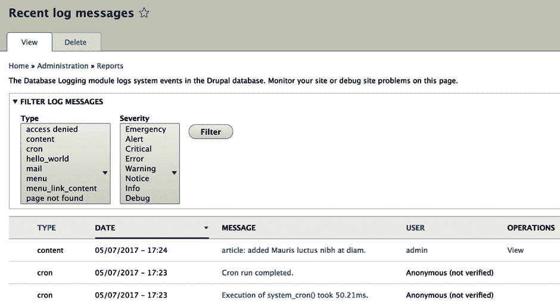

# 第三章：记录和邮件

在上一章中，我们学习了大多数 Drupal 8 模块开发者必须了解的一些更常见的事情，从基础知识开始，即创建一个 Drupal 模块。

在本章中，我们将进一步探讨一些开发者必须执行的其他重要任务：

+   我们将探讨 Drupal 8 中记录的工作原理。为此，我们将通过扩展我们的 *Hello World* 模块来涵盖一些示例。

+   我们将探讨 Drupal 8 中的邮件 API，即如何使用默认设置（PHP 邮件）发送电子邮件。然而，不仅如此，我还会向你展示如何创建自己的电子邮件系统，以便与你的（可能是外部的）邮件服务集成；还记得插件吗？这将是使用插件扩展现有功能的另一个好例子。

+   在本章末尾，我们还将探讨 Drupal 8 的令牌系统。我们将在此背景下，用上下文数据替换某些 *令牌*，以便我们发送的电子邮件更具动态性。

到本章结束时，你应该能够向你的 Drupal 8 模块添加记录，并能够舒适地以编程方式发送电子邮件。此外，你将了解令牌的工作原理，并且作为额外奖励，将了解如何定义你自己的令牌。

# 记录

Drupal 中的主要记录机制是通过数据库记录，客户端代码可以使用 API 将消息保存到 `watchdog` 表中。当消息达到一定数量后，这些消息会被清除，但与此同时，可以通过一个方便的界面（在 `admin/reports/dblog`）在浏览器中查看：



或者，一个默认禁用的核心模块，Syslog，可以用来补充/替换此记录机制，使用运行该网站的服务器的 Syslog。为了本书的目的，我们将关注任何机制下的记录工作原理，但也会探讨如何在 Drupal 8 中实现我们自己的记录系统。

Drupal 7 开发者非常熟悉他们用于记录消息的 `watchdog()` 函数。这是一个用于记录的进程式 API，它暴露了一个简单的函数，该函数接受一些参数：`$type`（消息的类别）、`$message`、`$variables`（一个值数组，用于替换消息中找到的占位符）、`$severity`（一个常量）和 `$link`（一个链接，从 UI 中链接到消息）。很明显，这个解决方案非常特定于 Drupal，并不真正适用于更广泛的 PHP 社区。

在 Drupal 8 中，这已经改变。数据库记录模块仍然存在，存储消息的表仍然称为 `watchdog`，但这个记录目的地只是可以完成的一种可能实现。这是因为 Drupal 8 的记录框架已经被重构为面向对象和 PSR-3 兼容。在这种情况下，数据库记录只是默认实现。

# Drupal 8 记录理论

在我们继续我们的例子之前，让我们先了解一下 Drupal 8 中日志框架的一些理论概念。这样做时，我们将尝试理解我们需要与之交互的关键*参与者*。

首先，我们有`LoggerChannel`，它代表一组日志消息。它们类似于 Drupal 7 的`watchdog()`函数之前的`$type`参数。然而，一个关键的区别是，它们是通过日志插件本身进行实际日志记录的对象。在这方面，它们被我们的第二个主要参与者`LoggerChannelFactory`使用，这是一个服务，通常作为客户端代码，我们与日志框架的主要接触点。

为了更好地理解这些内容，让我们考虑以下简单使用的例子：

```php
\Drupal::logger('hello_world')->error('This is my error message'); 
```

就这些了。我们只是使用了可用的已注册的日志记录器通过`hello_world`通道记录了一个错误消息。这是我们刚刚即兴想出的自定义通道，它只是将这条消息分类为属于`hello_world`类别（我们在上一章中开始的模块）。此外，您会看到我使用了静态调用。在底层，加载了日志工厂服务，从它那里请求了一个通道，并在该通道上调用`error()`方法：

```php
\Drupal::service('logger.factory')->get('hello_world')->error('This is my error message');
```

当您从`LoggerChannelFactory`请求一个通道时，您给它一个名字，然后根据这个名字，它创建一个`LoggerChannel`的新实例，这是默认的通道类。然后它会将所有可用的日志记录器传递给这个通道，这样当我们调用它上面的任何`RfcLoggerTrait`日志方法时，它就会委托给它们。

我们也有创建我们自己的通道的选项。这样做的一个优点是我们可以直接将其注入到我们的类中，而不是整个工厂，我们可以从那里请求通道。此外，我们可以以一种甚至不需要创建新类的方式来做这件事，而是从默认的一个继承。我们将在下一节中看到如何做到这一点。

第三大主要参与者是`LoggerInterface`的实现，它遵循 PSR-3 标准。如果我们看看我们之前提到的数据库日志实现`DbLog`类，我们会注意到它也使用了`RfcLoggerTrait`，这个特质负责所有必要的函数，使得实际的`LoggerInterface`实现只需处理主要的`log()`方法。然后这个类被注册为一个带有`logger`标签的服务，它反过来又注册到`LoggerChannelFactory`（它也充当服务收集器）。

正如我们在第二章中看到的，*创建您的第一个模块*，标签可以用来对服务定义进行分类，并且我们可以让它们被另一个服务为了特定目的收集。在这种情况下，所有带有`logger`标签的服务都有一个目的，并且它们被`LoggerChannelFactory`收集和使用。

我知道已经讲了很多理论，但这些都是需要理解的重要概念。然而，不用担心；像往常一样，我们将通过一些示例来讲解。

# 我们自己的日志通道

我之前提到过，我们可以定义自己的日志通道，这样我们就不必总是注入整个工厂。那么，让我们看看如何为现在正在编写的 *Hello World* 模块创建一个。

大多数时候，我们只需要在服务定义文件中添加这样的定义：

```php
hello_world.logger.channel.hello_world:
  parent: logger.channel_base
  arguments: ['hello_world']
```

在讨论实际的日志通道之前，让我们看看这个奇怪的服务定义实际上意味着什么，因为这不是我们之前见过的。我的意思是，类在哪里？

`parent` 键表示我们的服务将继承另一个服务的定义。在我们的例子中，`parent` 键是 `logger.channel_base`，这意味着使用的类将是 `Drupal\Core\Logger\LoggerChannel`（默认）。如果我们仔细查看 `core.services.yml` 中的 `logger.channel_base` 服务定义，我们也会看到一个 `factory` 键。这意味着这个服务类不是由服务容器实例化，而是由另一个服务，即 `logger.factory` 服务的 `get()` 方法实例化。

`arguments` 键也有所不同。首先，我们没有 `@` 符号。这是因为这个符号用来表示服务名称，而我们的参数是一个简单的字符串。作为额外的小贴士，如果字符串前后有 `%` 符号，它表示可以在任何 `*.services.yml` 文件中定义的参数。

回到我们的例子，如果你还记得日志理论，这个服务定义意味着请求这个服务将执行以下任务：

```php
\Drupal::service('logger.factory')->get('hello_world'); 
```

它使用日志工厂加载一个带有特定参数的通道。因此，现在我们可以注入我们的 `hello_world.logger.channel.hello_world` 服务，并在客户端代码中直接调用任何 `LoggerInterface` 方法。

# 我们自己的日志记录器

现在我们已经有了模块的通道，假设我们还想在其他地方记录消息。它们可以存储在数据库中，但每当遇到错误日志时，我们还想发送电子邮件。在本节中，我们将只涵盖为此所需的日志架构，并将实际的邮件实现推迟到本章的第二部分，当我们讨论邮件时再进行。

我们首先需要创建的是 `LoggerInterface` 实现，这通常放在我们命名空间的 `Logger` 文件夹中。所以，让我们称它为 `MailLogger`。它可以看起来像这样：

```php
namespace Drupal\hello_world\Logger;

use Drupal\Core\Logger\RfcLoggerTrait;
use Psr\Log\LoggerInterface;

/**
 * A logger that sends an email when the log type is "error".
 */
class MailLogger implements LoggerInterface {

  use RfcLoggerTrait;

  /**
   * {@inheritdoc}
   */
  public function log($level, $message, array $context = array()) {
    // Log our message to the logging system.
  }
}
```

首先要注意的是，我们正在实现 PSR-3 `LoggerInterface`。这将需要很多方法，但我们将通过 `RfcLoggerTrait` 处理大部分方法。唯一剩下要实现的是 `log()` 方法，它将负责实际的日志记录。目前，我们将保持它为空。

仅凭这个类本身并没有什么作用。我们需要将其注册为一个标记服务，以便 `LoggingChannelFactory` 能够捕获它，并在需要记录日志时将其传递给日志通道。让我们看看这个定义是什么样的：

```php
hello_world.logger.hello_world:
  class: Drupal\hello_world\Logger\MailLogger
  tags:
    - { name: logger }
```

就目前而言，我们的日志记录器不需要任何依赖项。然而，请注意名为 `tags` 的属性，我们使用 `logger` 标签标记这个服务。这将使其成为一个特定的服务，另一个服务（称为收集器）会寻找这个服务。就像我们在上一章讨论的那样。在这种情况下，收集器是 `LoggingChannelFactory`。

清除缓存应该能够启用我们的日志记录器。这意味着当通过任何通道记录消息时，我们的日志记录器也会被使用，连同任何其他启用的日志记录器（默认情况下是数据库日志记录器）。所以，如果我们想让我们的日志记录器是唯一的，我们需要从 Drupal 核心中禁用 DB Log 模块。

我们将在本章后面继续对这个类进行工作，那时我们将介绍如何以编程方式发送电子邮件。

# Hello World 的日志记录

现在我们已经拥有了所有工具，更重要的是，我们理解了 Drupal 8 中的日志记录工作原理，让我们在我们的模块中添加一些日志记录。

有一个地方我们可以记录一个可能有用的操作。当管理员通过我们编写的表单更改问候消息时，让我们记录一条信息消息。这应该在 `SalutationConfigurationForm` 的提交处理程序中自然发生。

如果您还记得我在上一章中的抱怨，如果我们能够注入服务而不是静态使用服务，我们就应该避免使用静态服务，并且我们可以轻松地将服务注入到我们的表单中。所以，让我们现在就做这个。

首先，`FormBase` 已经实现了 `ContainerInjectionInterface`，因此我们不需要在我们的类中实现它，因为我们从它那里继承。其次，我们直接继承的 `ConfigFormBase` 类已经注入了 `config.factory`，这使得事情对我们来说有点复杂——好吧，其实并不复杂。我们只需要复制构造函数和 `create()` 方法，添加我们自己的服务，将其存储在一个属性中，并将父类所需的服务传递给父构造函数调用。它看起来是这样的：

```php
/**
 * @var \Drupal\Core\Logger\LoggerChannelInterface
 */
protected $logger;

/**
 * SalutationConfigurationForm constructor.
 *
 * @param \Drupal\Core\Config\ConfigFactoryInterface $config_factory
 *   The factory for configuration objects.
 * @param \Drupal\Core\Logger\LoggerChannelInterface $logger
 *   The logger.
 */
public function __construct(ConfigFactoryInterface $config_factory, LoggerChannelInterface $logger) {
  parent::__construct($config_factory);
  $this->logger = $logger;
}

/**
 * {@inheritdoc}
 */
public static function create(ContainerInterface $container) {
  return new static(
    $container->get('config.factory'),
    $container->get('hello_world.logger.channel.hello_world')
  );
}
```

并且在顶部相关的 *使用* 声明：

```php
use Drupal\Core\Config\ConfigFactoryInterface;
use Drupal\Core\Logger\LoggerChannelInterface;
use Symfony\Component\DependencyInjection\ContainerInterface;
```

如您所见，我们通过 `create()` 方法获取了所有父类需要的所有服务，以及我们想要的（日志通道）。此外，在我们的构造函数中，我们将通道存储为一个属性，然后将父参数传递给父构造函数。现在，我们在配置表单类中有了 `hello_world` 日志通道。所以，让我们使用它。

在 `submitForm()` 方法的末尾，让我们添加以下行：

```php
$this->logger->info('The Hello World salutation has been changed to @message.', ['@message' => $form_state->getValue('salutation')]);
```

我们正在记录一条常规信息消息。然而，由于我们还想记录已经设置的消息，我们使用了第二个参数，它代表一个上下文值数组。在底层，数据库日志记录器将提取以 `@`、`!` 或 `%` 开头的上下文变量，并从整个上下文数组中获取其值。这是通过使用 `LogMessageParser` 服务来完成的，但我们将在讨论国际化时看到更多关于它的内容。如果你实现自己的日志插件，你也将必须自己处理这一点——但我们很快就会看到这一点。

现在我们已经完成了在问候配置表单保存时记录消息的工作。

# 日志总结

在本节的第一部分，我们看到了 Drupal 8 中日志记录是如何工作的。具体来说，我们介绍了一些理论，以便你理解事物是如何相互作用的，并且你不会无意识地使用日志工厂，而不真正了解底层发生了什么。

作为例子，我们创建了自己的日志通道，这使得我们可以在需要的地方注入它，而不必总是通过工厂。我们将从现在开始使用这个通道来处理 *Hello World* 模块。此外，我们还创建了自己的日志实现。目前它不会做很多事情，除了注册之外，但我们在下一节中会使用它来在错误被记录到网站上时发送电子邮件。

最后，我们在问候配置表单中使用了日志框架（以及我们的通道）来记录消息，每当表单被提交时都会记录消息。在这个过程中，我们还传递了保存的消息，以便它也被包含在日志中。这应该已经与数据库日志一起工作，所以请继续保存配置表单，然后检查日志用户界面以获取该信息消息。

# 邮件 API

现在我们已经知道了如何在我们的应用程序中记录事物，让我们将注意力转向 Drupal 8 的邮件 API。本节的目标是了解我们如何在 Drupal 8 中以编程方式发送电子邮件。为了实现这一目标，我们将探索核心安装中附带的标准邮件系统（它使用 PHP 邮件），并创建我们自己的系统，理论上可以使用外部 API 来发送邮件。我们不会深入探讨后者，因为它超出了本书的范围。我们将停止在从 Drupal 视角介绍需要完成的事情之后。

在下一节和最后一节中，我们将研究令牌，以便我们可以使我们的邮件发送更加动态。然而，在我们这样做之前，让我们先深入了解 Drupal 8 的邮件 API。

# 邮件 API 的理论

如前所述，让我们首先从理论角度介绍这个 API。在深入研究示例之前，了解架构是很重要的。

在 Drupal 中程序化发送电子邮件是一个两步的工作。我们首先需要做的是在我们的模块中定义电子邮件的某种*模板*。这并不是传统意义上的模板，而是一个用于你想要发送的电子邮件的过程性数据包装器。在代码中，它被称为*键*或*消息 ID*，但我认为*模板*是一个更好的词来描述它。而且，不出所料，它是通过实现钩子来工作的。

我们接下来需要做的是使用 Drupal 邮件管理器，通过定义的其中一个*模板*发送电子邮件，并指定定义它的模块。如果你觉得这很困惑，不要担心，随着后面解释的例子，它将会变得清晰。

*模板*是通过实现`hook_mail()`创建的。这个钩子是一个特殊的钩子，因为它不像大多数其他钩子那样工作。它是由邮件管理器在客户端（一些代码）尝试为实现它的模块发送电子邮件时被调用的。

`MailManager`实际上是一个插件管理器，它还负责使用邮件系统（插件）发送电子邮件。默认的邮件系统是`PhpMail`，它使用 PHP 的本地`mail()`函数发送电子邮件。如果我们创建自己的邮件系统，那就意味着创建一个新的插件。此外，插件本身是实际发送电子邮件的，管理器只是简单地委托给它。正如你所见，我们甚至不能不创建插件就前进到下一章。

每个邮件插件都需要实现`MailInterface`，它公开了两个方法——`format()`和`mail()`。第一个方法负责邮件内容的初始准备（消息连接等），而后者负责最终化和发送。

然而，邮件管理器是如何知道使用哪个插件的？它检查一个名为`system.mail`的配置对象，该对象存储默认插件（`PhpMail`），还可以存储每个单独模块以及任何模块和*模板* ID 组合的覆盖。因此，我们可以有多个邮件插件，每个插件用于不同的事情。这个配置对象的一个奇特之处在于，没有管理员表单可以指定哪个插件做什么。你需要根据需要程序化地调整这个配置对象。你可以通过`hook_install()`和`hook_uninstall()`钩子来操作这个。这些钩子用于在模块安装/卸载时执行一些任务。所以，这就是我们稍后更改配置对象以添加我们自己的邮件插件的地方。

然而，现在我们已经看了一些理论知识，让我们看看我们如何使用默认的邮件系统来程序化地发送电子邮件。你还记得上一节中未完成的记录器吗？这就是我们将在记录的消息是错误时发送电子邮件的地方。

# 实现`hook_mail()`

如我之前提到的，在 Drupal 8 中发送邮件的第一步是实现`hook_mail()`。在我们的例子中，它可以看起来像这样：

```php
/**
 * Implements hook_mail().
 */
function hello_world_mail($key, &$message, $params) {
  switch ($key) {
    case 'hello_world_log':
      $message['from'] = \Drupal::config('system.site')->get('mail');
      $message['subject'] = t('There is an error on your website');
      $message['body'][] = $params['message'];

      break;
  }
}
```

此钩子接收三个参数：

+   用于发送邮件的消息键（模板）

+   需要填写在内的电子邮件消息

+   从客户端代码传递的参数数组

如您所见，我们正在定义一个名为`hello_world_log`的键（或*模板*），它有一个简单的静态主题，正文将包含来自`$parameters`数组中的消息键中的任何内容。由于电子邮件*From*始终相同，我们将使用可在`system.site`配置对象中找到的全局电子邮件地址。您会注意到，我们不在可以像构建表单时那样注入配置工厂的上下文中。相反，我们可以使用静态辅助函数来加载它。

此外，您会注意到正文本身也是一个数组。这是因为我们可以构建（如果我们想的话）该数组中的多个项目，这些项目可以在邮件插件的`format()`方法中作为段落 imploded。无论如何，这是默认邮件插件所做的事情，所以在这里我们需要构建一个数组。

`$message`数组中另一个有用的键是`header`键，您可以使用它向邮件添加一些自定义头。在这种情况下，我们不需要这样做，因为默认的`PhpMail`插件已经添加了所有必要的头。所以如果我们编写自己的邮件插件，我们也可以在那里添加我们的头——以及`$message`数组中的所有其他键。这是因为后者作为引用传递，所以它从客户端调用到`hook_mail()`实现再到插件的过程中不断构建。

这就是我们需要对`hook_mail()`做的所有事情。现在让我们看看如何使用它来发送电子邮件。

# 发送电子邮件

我们希望使用我们的`MailLogger`在记录错误时发送电子邮件。所以让我们回到我们的类中并添加这个逻辑。

这就是我们的`log()`方法现在可能的样子：

```php
/**
 * {@inheritdoc}
 */
public function log($level, $message, array $context = array()) {
  if ($level !== RfcLogLevel::ERROR) {
    return;
  }

  $to = $this->configFactory->get('system.site')->get('mail');
  $langcode = $this->configFactory->get('system.site')->get('langcode');
  $variables = $this->parser->parseMessagePlaceholders($message, $context);
  $markup = new FormattableMarkup($message, $variables);
  \Drupal::service('plugin.manager.mail')->mail('hello_world', 'hello_world_log', $to, $langcode, ['message' => $markup]);
}
```

首先，我们说我们只想发送错误邮件，所以在前几行中，我们检查尝试记录的级别是否为该级别，如果不是则提前返回。换句话说，如果我们不处理错误，则不执行任何操作，并依赖其他已注册的记录器来处理这些错误。

接下来，我们确定要发送电子邮件的对象以及发送的语言代码（这两个都是邮件管理器`mail()`方法的必填参数）。我们选择使用全局电子邮件地址（正如我们在*From*值中所做的那样）。我们还使用与之前在`hook_mail()`实现中使用的相同配置对象。不用担心，我们很快就会将配置工厂注入到类中。

当我们提到 langcode 时，我们指的是语言对象的机器名。在这种情况下，这就是为网站默认语言存储的内容。此外，我们将默认使用它来发送电子邮件。在后面的章节中，我们将介绍有关 Drupal 8 国际化的更多方面。

然后，我们准备要发送的消息。为此，我们使用`FormattableMarkup`辅助类，我们传递消息字符串和一个可以用来替换我们消息中占位符的变量值数组。我们可以像`DbLog`记录器一样使用`LogMessageParser`服务来检索这些值。所以，我们基本上是从记录消息的整个上下文字符数组中提取占位符变量。

最后，我们使用邮件管理器插件来发送邮件。它的`mail()`方法的第一个参数是我们想要用于邮件的模块。第二个是我们想要使用的密钥（或*模板*），我们已经在`hook_mail()`中定义了它。第三个和第四个是显而易见的，而第五个是我们在`hook_mail()`中遇到的`$params`数组。如果你回顾一下，你会注意到我们使用了`message`键作为正文。在这里，我们用我们的标记对象填充这个键，这个对象有一个`_toString()`方法，它会用所有占位符替换后渲染它。

你可能想知道为什么我没有像对其他依赖项那样注入 Drupal 邮件管理器。不幸的是，核心邮件管理器本身使用记录器通道工厂，这反过来又依赖于我们的`MailLogger`服务。所以如果我们让邮件管理器成为后者的依赖项，我们会发现自己陷入了一个循环。所以当容器重建时，会抛出一个大错误。它可能仍然可以工作，但这并不好。所以我选择静态地使用它，因为无论如何，这种方法非常小，并且由于其预期的结果很难断言（发送电子邮件）而难以测试。有时，你必须做出这些选择，因为替代方案是注入整个服务容器来欺骗它。然而，这是一个代码味道，而且即使我想为这个类编写测试，也不会有帮助。

即使我没有注入邮件管理器，我也注入了其余的部分。所以，让我们看看我们现在在类顶部需要什么：

```php
/**
 * @var \Drupal\Core\Logger\LogMessageParserInterface
 */
protected $parser;

/**
 * @var \Drupal\Core\Config\ConfigFactoryInterface
 */
protected $configFactory;

/**
 * MailLogger constructor.
 *
 * @param \Drupal\Core\Logger\LogMessageParserInterface $parser
 * @param \Drupal\Core\Config\ConfigFactoryInterface $config_factory
 */
public function __construct(LogMessageParserInterface $parser, ConfigFactoryInterface $config_factory) {
  $this->parser = $parser;
  $this->configFactory = $config_factory;
}
```

最后，所有我们缺失的相关*use*语句：

```php
use Drupal\Core\Logger\LogMessageParserInterface;
use Drupal\Core\Config\ConfigFactoryInterface;
use Drupal\Component\Render\FormattableMarkup;
use Drupal\Core\Logger\RfcLogLevel;
```

最后，让我们快速调整我们的邮件记录器服务定义：

```php
hello_world.logger.hello_world:
  class: Drupal\hello_world\Logger\MailLogger
  arguments: ['@logger.log_message_parser', '@config.factory']
  tags:
    - { name: logger }
```

我们只是有两个新的参数——对你来说现在没有什么新鲜的。

清除缓存并记录错误应该会将带有替换占位符的记录消息发送到网站电子邮件地址（并从同一地址发送）使用 PHP 原生的`mail()`函数。恭喜！你刚刚在 Drupal 8 中程序化地发送了第一封电子邮件。

# 修改他人的电子邮件

Drupal 之所以强大，不仅因为它允许我们添加自己的功能，还因为它允许我们修改现有功能。实现这一目标的一个重要途径是*alter*钩子系统。还记得第二章中的这些内容吗，*创建您的第一个模块*？这些是在使用之前用于更改数组或对象值的钩子。当涉及到发送邮件时，我们有一个 alter 钩子，允许我们在邮件定义发出之前更改内容：`hook_mail_alter()`。对于我们的模块，我们不需要实现此钩子。然而，为了使其完整，让我们看看我们如何可以使用此钩子来更改现有发出的电子邮件的标题：

```php
/**
 * Implements hook_mail_alter().
 */
function hello_world_mail_alter(&$message) {
  switch ($message['key']) {
    case 'hello_world_log':
      $message['headers']['Content-Type'] = 'text/html; charset=UTF-8; format=flowed; delsp=yes';
      break;
  }
}
```

那么，这里发生了什么？首先，这个钩子实现被调用在每个实现它的模块中。在这方面，它与`hook_mail()`不同，因为它允许我们修改来自任何模块发出的邮件。然而，在我们的示例中，我们只会修改我们之前定义的邮件。

唯一参数（作为它通常与 alter 钩子一起传递的引用）是`$message`数组，它包含我们在`hook_mail()`中构建的所有内容，以及邮件管理器本身添加的键（*模板*）和其他事物，例如标题。因此，在我们的示例中，我们正在设置一个 HTML 标题，以便发送出去的内容*可以*被渲染为 HTML。在此钩子被调用后，邮件系统格式化器也会被调用，在`PhpMail`插件的情况下，它将所有 HTML 标签转换为纯文本，本质上取消了我们的标题。然而，如果我们实现自己的插件，我们可以防止这种情况发生，并成功发送带有适当标签的 HTML 电子邮件。

因此，这就是修改现有发出的邮件的全部内容。接下来，我们将看看我们如何创建自己的邮件插件，该插件使用自定义的外部邮件系统。我们不会在这里详细介绍，但我们将准备一个架构，这将使我们能够引入所需的 API 并轻松使用它。

# 自定义邮件插件

在上一节中，我们看到了如何使用 Drupal 8 邮件 API 在 Drupal 8 中程序化发送电子邮件。在这样做的时候，我们使用了默认的 PHP 邮件发送器，尽管对于我们的示例来说足够好，但可能不适合我们的应用程序。例如，我们可能想通过 API 使用外部服务。

在本节中，我们将了解这是如何工作的。为此，我们将编写自己的邮件插件，使其仅执行此操作，然后简单地告诉 Drupal 使用该系统而不是默认系统。这又是一个基于插件、非侵入性的扩展点。

在我们开始之前，我想提到，我们不会深入探讨任何与潜在的外部 API 相关的细节。相反，我们将停留在 Drupal 8 特定的部分，所以你将在仓库中找到的代码不会做很多事情——它只作为示例使用。如果你需要，使用这项技术取决于你。

# 邮件插件

因此，让我们首先创建我们的`Mail`插件类，如果你记得，插件应该放在我们的模块命名空间中的`Plugin`文件夹里。邮件插件应该放在一个`Mail`文件夹里。所以一个简单的邮件插件类骨架可能看起来是这样的：

```php
namespace Drupal\hello_world\Plugin\Mail;

use Drupal\Core\Mail\MailFormatHelper;
use Drupal\Core\Mail\MailInterface;
use Drupal\Core\Plugin\ContainerFactoryPluginInterface;
use Symfony\Component\DependencyInjection\ContainerInterface;

/**
 * Defines the Hello World mail backend.
 *
 * @Mail(
 *   id = "hello_world_mail",
 *   label = @Translation("Hello World mailer"),
 *   description = @Translation("Sends an email using an external API specific to our Hello World module.")
 * )
 */
class HelloWorldMail implements MailInterface, ContainerFactoryPluginInterface {

  /**
   * {@inheritdoc}
   */
  public static function create(ContainerInterface $container, array $configuration, $plugin_id, $plugin_definition) {
    return new static();
  }

  /**
   * {@inheritdoc}
   */
  public function format(array $message) {
    // Join the body array into one string.
    $message['body'] = implode("\n\n", $message['body']);
    // Convert any HTML to plain-text.
    $message['body'] = MailFormatHelper::htmlToText($message['body']);
    // Wrap the mail body for sending.
    $message['body'] = MailFormatHelper::wrapMail($message['body']);

    return $message;
  }

  /**
   * {@inheritdoc}
   */
  public function mail(array $message) {
    // Use the external API to send the email based on the $message array
    // constructed via the `hook_mail()` implementation.
  }
}
```

如你所见，我们有一个相对简单的插件注释；没有不寻常的参数。然后，你会注意到我们实现了强制性的`MailInterface`，它包含在类中实现的两个方法。

我之前提到过`format()`方法，并说过它负责在消息准备好发送之前进行某些处理。之前的实现是从`PhpMail`插件复制过来的，以展示那里可能进行的任务类型。然而，你可以在这里做任何你想做的事情，例如，允许 HTML 标签。将正文压缩成数组是你在`hook_mail()`中可能想要做的，因为通常期望邮件正文是由`hook_mail()`构建为一个数组。

另一方面，`mail()`方法留空。这是因为使用外部 API 发送电子邮件取决于你。为此，你可以使用我们在`hook_mail()`实现中遇到的`$message`数组。

最后，请注意，`ContainerFactoryPluginInterface`是我们类实现的另一个接口。如果你记得，这就是插件需要实现以便它们成为容器感知的（以便依赖项可以被注入）。由于这只是一个示例代码，它没有任何依赖项，所以我没有包含构造函数，并留空了`create()`方法。很可能会需要注入某些东西，比如一个与你的外部 API 一起工作的 PHP 客户端库。所以，再次查看这没有坏处。

对于我们的插件类来说，这就差不多了。现在，让我们看看我们如何使用它，因为到目前为止，我们的`hello_world_log`电子邮件仍然是通过默认的 PHP 邮件发送器发送的。

# 使用邮件插件

如我之前提到的，Drupal 中没有 UI 可以选择邮件管理器在发送电子邮件时应该使用哪个插件。它通过检查`system.mail`配置对象来在`getInstance()`方法中自行确定，更具体地说，是检查那个对象中的`interface`键（它是一个数组）。

默认情况下，这个数组只包含一条记录，即`'default' => 'php_mail'`。这意味着默认情况下，所有邮件都使用`php_mail`插件 ID 发送。为了在我们的插件中混入，我们有几种选择：

+   我们可以用我们的插件 ID 替换这个值，这意味着所有邮件都将通过我们的插件发送

+   我们可以使用`module_name_key_name`格式的键来添加一个新的记录，这意味着所有发送给具有特定键（或*模板*）的模块的电子邮件都将使用该插件

+   我们可以使用`module_name`格式的键添加一个新的记录，这意味着所有发送给模块的电子邮件都将使用该插件（无论它们的键是什么）

对于我们的示例，我们将设置从`hello_world`模块发送的所有电子邮件都使用我们新的插件。我们可以通过使用模块安装时运行的`hook_install()`实现来完成这项工作。

安装（和卸载）钩子需要放在我们模块根目录下的`.install` PHP 文件中。因此，下一个函数将放在一个新的`hello_world.install`文件中。此外，如果我们的模块已经被启用，我们需要首先卸载它，然后再次安装它，以便触发此函数：

```php
/**
 * Implements hook_install().
 */
function hello_world_install() {
  $config = \Drupal::configFactory()->getEditable('system.mail');
  $mail_plugins = $config->get('interface');
  if (in_array('hello_world', array_keys($mail_plugins))) {
    return;
  }

  $mail_plugins['hello_world'] = 'hello_world_mail';
  $config->set('interface', $mail_plugins)->save();
}
```

如您所见，我们以可编辑的方式加载配置对象（因此我们可以更改它），如果我们还没有在设置的邮件插件数组中包含`hello_world`的记录，我们将设置它并将我们的插件 ID 映射到它。最后，我们保存对象。

与此函数相反的是`hook_uninstall()`，它位于同一文件中，并且预期在模块卸载时被触发。由于我们不希望更改全局配置对象并将其绑定到我们的模块插件，我们应该实现此钩子。否则，如果我们的模块被卸载，邮件系统将失败，因为它将尝试使用不存在的插件。所以，让我们把我们的尾巴系好：

```php

/**
 * Implements hook_uninstall().
 */
function hello_world_uninstall() {
  $config = \Drupal::configFactory()->getEditable('system.mail');
  $mail_plugins = $config->get('interface');
  if (!in_array('hello_world', array_keys($mail_plugins))) {
    return;
  }

  unset($mail_plugins['hello_world']);
  $config->set('interface', $mail_plugins)->save();
}
```

如您所见，我们在这里所做的基本上是相反的。如果之前设置的记录存在，我们将取消设置它并保存配置对象。

因此，现在，任何以编程方式发送给`hello_world`模块的邮件都将使用此插件。简单，对吧？然而，由于我们编写的插件尚未准备好，您在存储库中找到的代码将从`hook_install()`实现中的相关行注释掉，这样我们实际上就不会使用它。

# Token

本章我们将要讨论的最后一件事是 Drupal 8 中的 Token API。我们将介绍一些理论知识，并像往常一样，通过在我们现有的*Hello World*模块代码中的示例来演示。我们将在发送错误日志邮件的上下文中这样做。

如果我们能够在不硬编码模块代码或配置的情况下在邮件文本中包含一些个性化信息，那将很棒。例如，在我们的情况下，我们可能想在电子邮件中包含触发错误日志的当前用户的用户名。

在进入我们的*Hello World*模块之前，让我们首先了解 Token API 是如何工作的。

# Token API

Drupal 中的 Token 是一个标准格式的占位符，可以在字符串内部找到，并可以由从相关对象中提取的真实值替换。Token 使用的格式是`type:token`，其中`type`是 Token 类型的机器可读名称（一组相关 Token），而`token`是此组中 Token 的机器可读名称。

Drupal 中 Token API 的力量不仅在于其灵活性，还在于它已经是一个流行的 API。它的灵活性在于你可以定义包含相关标记的组，这些标记通过包含它们值的对象（例如，节点对象或用户对象）相互链接。它的流行是因为在 Drupal 的早期版本中，它是许多其他模块依赖的模块来定义自己的标记，而现在它已经包含在 Drupal 8 的核心中，并且已经预定义了许多标记。因此，你会在你的代码中找到许多可以使用的现有标记，如果没有，你也可以定义自己的标记。

从 Drupal 8 模块开发者的角度来看，这个 API 有三个主要组件。这些组件是两个钩子——`hook_token_info()`和`hook_tokens()`——以及用于执行替换的`Token`服务。

第一个钩子用于定义一个或多个标记类型和标记。它本质上是在系统中注册它们。第二个钩子在找到字符串中的标记（服务尝试替换）时触发，并用于根据从服务传递给它的数据替换标记。例如，用户模块在`user_token_info()`中定义了两种标记类型和多个标记。通过`user_tokens()`，它检查标记是否是其自己的标记，并尝试用上下文数据（要么是用户对象，要么是当前登录的用户对象）替换它。要详细了解每个相关的文档并查看扩展示例，你可以在 Drupal.org API 页面或`token.api.php`文件中找到它们。在那里，你还可以找到与这两个相对应的*alter*钩子，可以用来修改定义的标记信息或替换其他模块或 Drupal 核心中编写的标记的逻辑。

Token 服务是我们作为模块开发者可以使用来替换字符串中找到的标记的。我们将在下一节中看到它是如何使用的。

# 使用标记

为了快速演示我们如何使用标记，让我们在我们的`hello_world_log`邮件中包含一些关于在发送电子邮件时当前用户的信息。这自然会与在记录错误时登录的用户相一致。

为了做到这一点，我们需要修改我们的`hook_mail()`实现。在那里，我们将请求`current_user`服务当前用户的`AccountProxy`，向我们的邮件正文添加另一个字符串，当然，替换一个标记：

```php
/**
 * Implements hook_mail().
 */
function hello_world_mail($key, &$message, $params) {
  switch ($key) {
    case 'hello_world_log':
      $message['from'] = \Drupal::config('system.site')->get('mail');
      $message['subject'] = t('There is an error on your website');
      $message['body'][] = $params['message'];
      $user_message = 'The user that was logged in: [current-user:name].';
      $message['body'][] = \Drupal::token()->replace($user_message, ['current-user' => \Drupal::currentUser()]);

      break;
  }
}
```

正如你所见，我们正在向我们的电子邮件添加一个新的“段落”。这是一个简单的字符串，告诉我们登录的用户。然而，在这样做的时候，我们使用`token`服务（静态地）将这段字符串替换为标记值。服务的`replace()`方法接受一个字符串，并可选地接受一个按标记（组）类型键控的数据对象数组。

在这种情况下，标记和类型的选择很重要。用户模块定义了`user`和`current-user`类型。如果你检查`user_tokens()`函数，两者的区别在于后者在加载完整的用户实体后，简单地委托给前者。我们也可以自己这样做，然后传递`user`类型，但为什么要这样做呢？如果有人已经为我们做了，我们就没必要再做了。而且我们传递给`current-user`标记类型作为替换过程中的数据对象的是`AccountProxy`（当前用户会话）。

所以，就是这样。现在，电子邮件消息将多一行，包含在发生错误时当前登录用户的动态生成的用户名。在底层，标记服务扫描字符串，提取标记，并调用所有`hook_tokens()`实现。用户模块是能够根据接收到的用户对象返回此标记替换的那个模块。

# 定义新标记

我们刚刚看到了如何在字符串中程序化地使用现有标记，并轻松地将它们替换。我们需要的只是标记服务和可以用来替换标记的数据对象。记住，有些标记由于其全局性质甚至不需要任何数据对象。`hook_tokens()`实现将负责这一点——让我们看看。

在上一章中，我们为动态的*Hello World*消息创建了功能：要么即时计算，要么从配置对象中加载。我们是否可以将该消息作为标记公开？这将使其使用更加灵活，因为我们的字符串现在可以暴露给整个标记系统。

如前所述，我们将从`hook_token_info()`实现开始：

```php
/**
 * Implements hook_token_info().
 */
function hello_world_token_info() {
  $type = [
    'name' => t('Hello World'),
    'description' => t('Tokens related to the Hello World module.'),
  ];

  $tokens['salutation'] = [
    'name' => t('Salutation'),
    'description' => t('The Hello World salutation value.'),
  ];

  return [
    'types' => ['hello_world' => $type],
    'tokens' => ['hello_world' => $tokens],
  ];
}
```

在这里，我们需要定义两件事——类型和标记。在我们的例子中，我们定义了一个类型和一个标记。类型是`hello_world`，如果需要在 UI 中渲染，它还带有可读的名称和描述。标记是`salutation`，属于`hello_world`类型。它也获得一个名称和描述。最后，我们返回一个包含两者的数组。

接下来是`hook_tokens()`函数的实现，其中我们处理了我们的标记替换：

```php
/**
 * Implements hook_tokens().
 */
function hello_world_tokens($type, $tokens, array $data, array $options, \Drupal\Core\Render\BubbleableMetadata $bubbleable_metadata) {
  $replacements = [];
  if ($type == 'hello_world') {
    foreach ($tokens as $name => $original) {
      switch ($name) {
        case 'salutation':
          $replacements[$original] = \Drupal::service('hello_world.salutation')->getSalutation();
          $config = \Drupal::config('hello_world.custom_salutation');
          $bubbleable_metadata->addCacheableDependency($config);
          break;

      }
    }
  }

  return $replacements;
}
```

这里还有更多的事情在进行中，但我将解释一切。这个钩子会在尝试在字符串上替换标记时被触发。并且它为字符串中找到的每个类型触发，`$type`是第一个参数。在`$tokens`中，我们得到一个数组，其中包含字符串中的标记，属于`$type`。`$data`数组包含替换标记所需的对象（并传递给`replace()`方法），按类型键控。这个数组可以是空的（在我们的情况下就是这样）。

在函数内部，我们遍历这个组中的每个标记并尝试替换它。我们只知道一个，我们使用我们的`HelloWorldSalutation`服务来确定替换字符串。

最后，函数需要返回所有找到的替换项的数组（如果字符串中找到多个相同类型的标记，则可能有多个）。

`bubbleable_metadata`参数是一个特殊的缓存元数据对象，它描述了在缓存系统中这个标记。这是必需的，因为标记会被缓存，所以如果任何依赖对象发生变化，缓存也需要为此标记进行失效。默认情况下，`$data`数组中的所有对象都被读取并包含在这个对象中。然而，在我们的情况下，它是空的，但我们仍然依赖于一个可能会改变的配置对象——存储覆盖问候信息的那个对象。因此，即使我们计算问候信息的实际值使用的是之前使用的相同的`HelloWorldSalutation`服务，我们仍然需要添加对这个配置对象的依赖。所以，这里有一个简单的例子，但有一个复杂的转折。我们将在本书的后面部分更多地讨论缓存。

那就是定义我们的标记的全部内容。现在它也可以在字符串内部使用，并使用`Token`服务进行替换。例如：

```php
$final_string = \Drupal::token()->replace('The salutation text is: [hello_world:salutation]'); 
```

如您所见，我们没有传递其他参数。如果我们的标记依赖于实体对象，例如，我们将在第二个参数数组中传递它，并在`hook_tokens()`内部使用它来计算替换。

# 标记摘要

标记系统是 Drupal 的重要组成部分，因为它允许我们使用占位符字符串轻松地将原始数据转换为有用的值。它是一个广泛使用且灵活的系统，许多贡献模块都是基于它（并将基于它）构建的。标记的伟大之处在于 UI 组件。有一些模块将允许用户在 UI 中定义字符串，但使其能够填充各种标记，这些标记将进行替换。此外，这也是作为模块开发者您可以做的事情。

# 摘要

在本章中，我们讨论了许多内容。我们看到了在 Drupal 8 中日志是如何工作的，如何编程使用邮件 API（以及如何扩展），以及如何使用标记系统使我们的文本更加动态。

在阅读本章的过程中，我们还丰富了我们的*Hello World*模块。因此，除了理解关于日志的理论外，我们还创建了自己的日志通道服务和日志插件。对于后者，我们决定当日志消息类型为*error*时发送电子邮件。在这个过程中，我们查看了一下邮件 API 以及我们如何编程使用它。我们看到，默认情况下，PHP 的本地`mail()`函数用于发送电子邮件，但我们可以非常容易地创建自己的插件来使用我们想要的任何外部服务——这是通过插件实现扩展性的另一个绝佳例子。

最后，我们探讨了 Drupal 8 中的标记（tokens）。我们了解了构成 API 的组件，如何程序化地使用现有的标记（通过上下文数据将它们替换），以及如何定义自己的标记供他人使用。这些都是可扩展性（和共享）的主要原则——使用他人向你暴露的东西，并为他人提供使用的东西。

在下一章中，我们将探讨另一个重要主题——主题化。尽管你可能认为这属于前端开发者的范畴，模块开发者也扮演着重要的角色。是的，大部分的样式、客户端脚本和视觉架构都可以，并且确实是由我们所说的*主题开发者*完成的。然而，模块开发者需要理解和使用主题化工具，以确保他们的数据以正确的方式呈现。因此，在下一章中，我们将专注于这一点。
