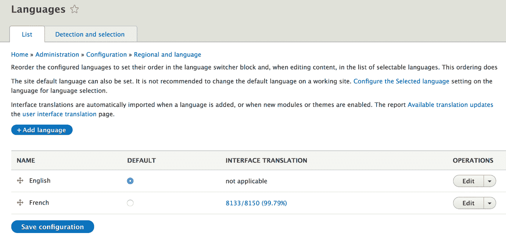
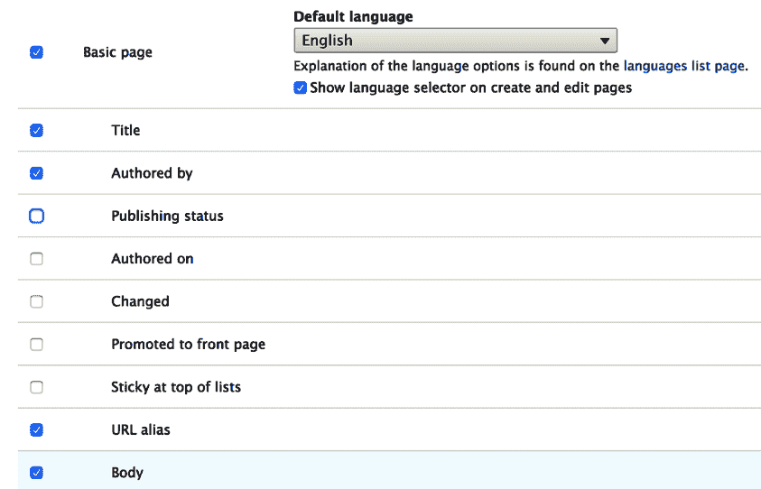
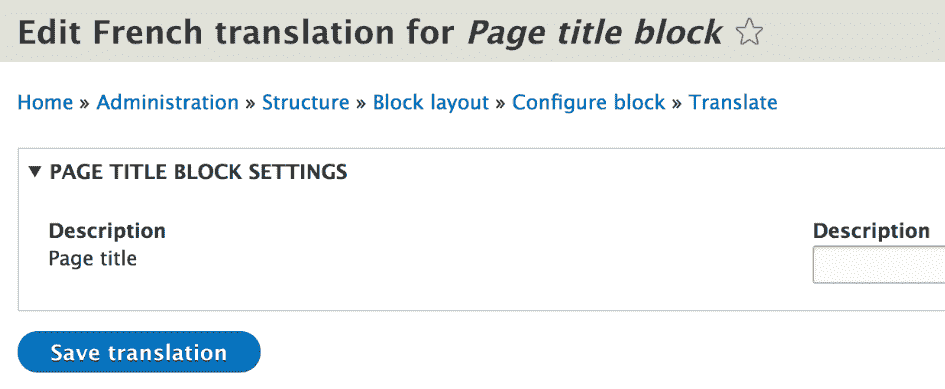
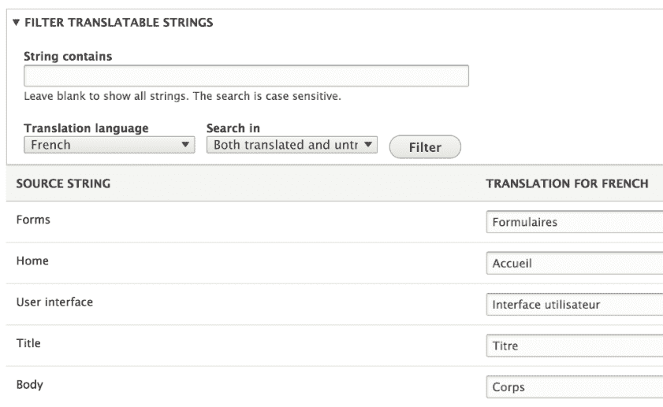
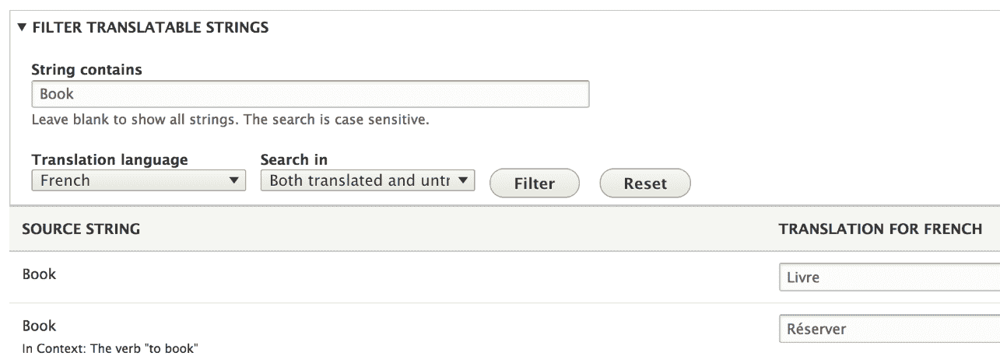

# 第十三章：国际化和语言

尽管在各方面都取得了巨大进步，但与前辈相比，Drupal 8 有几项几乎是革命性的发展。其中最值得注意的是配置 API 和缓存系统，它们在 Drupal 7 中已经遥遥领先。另一个是旨在使 Drupal 完全多语言化的多语言倡议，而不是需要使用 20 个贡献模块才能达到类似的效果。这还包括国际化（i18n：[`www.w3.org/standards/webdesign/i18n`](https://www.w3.org/standards/webdesign/i18n)）方面，它允许网站翻译成任何已安装的语言。

在本章中，我们将从模块开发者的角度讨论 Drupal 8 中的国际化和多语言功能。该系统的许多内置功能都是针对网站构建者的——启用语言、翻译内容和配置实体，以及 Drupal 界面（适用于管理员和访客）。我们的重点将是我们作为模块开发者需要做什么来确保网站构建者和编辑者可以使用上述功能。为此，本章将更多地作为参考指南，包含各种提示、技巧，甚至我们在编写代码时需要遵循的规则。尽管如此，我们也会简要谈谈我们如何以编程方式与语言一起工作。

然而，首先，我们将从开箱即用的多语言生态系统及其负责各个部分的模块的介绍开始。

# 多语言生态系统的介绍

多语言和国际化系统基于四个 Drupal 核心模块。让我们快速浏览一下它们，看看它们的作用：

+   语言

+   内容翻译

+   配置翻译

+   界面翻译

# 语言

*语言*模块负责处理网站上的可用语言。网站构建者可以从广泛的选项中选择安装一种或多种语言。如果需要，他们甚至可以创建自己的自定义语言。安装的语言可以添加到实体和菜单链接等项目中，以便根据当前语言控制它们的可见性。除了已安装的语言外，Drupal 8 还附带两种额外的特殊语言：*未指定*和*不适用*。

该模块还根据各种标准处理上下文语言选择，并提供语言切换器以更改网站的当前语言：



# 内容翻译

*内容*翻译模块负责实现用户翻译内容的功能。内容实体是内容的主要载体，并且通过此模块，数据可以在字段级别进行翻译（并对其进行细粒度配置）。换句话说，用户可以控制哪些字段和哪些实体类型包应该可翻译：



# 配置翻译

*配置*翻译模块负责通过接口提供用户翻译配置值的功能。这些可以是简单的配置对象或配置实体。我们已经在之前的章节中看到如何确保我们的配置值可以被翻译，所以在这里我们不再深入探讨。

我建议您参考第六章中关于配置架构的部分，*数据建模和存储*：



# 接口翻译

*接口翻译*模块负责提供一个界面，允许用户将网站上安装的所有语言中的任何字符串或文本输出进行翻译。此外，它提供了一个连接到[localize.drupal.org](https://localize.drupal.org/)平台，从中可以下载许多常见接口字符串的翻译：



这四个模块并不是在多语言系统中独立存在的，而是依赖于一个跨应用标准，以确保所有编写的代码都能很好地与之协同工作。换句话说，整个 Drupal 代码库在多个层面上与国际化系统交织在一起，并且以这种方式编写，即任何应该可翻译或可本地化的内容都可以。这意味着我们编写的所有代码都需要遵守相同的标准。

# 国际化

国际化的理念是确保网站上输出的所有内容都可以通过一个共同的机制翻译成已启用的语言——在这种情况下，使用接口翻译模块。这指的是内容、可见的配置值以及来自模块和主题的字符串和文本。但是，这可以通过许多不同的方式实现，所以让我们看看在每个这些情况下我们如何确保我们的信息可以被翻译。

在编写 Drupal 模块或主题时，一个主要的*规则*是始终使用英语作为代码语言。这是为了确保一致性，并保持其他开发者可能不会说特定语言的情况下，其他开发者可以在此代码库上工作的可能性。这也适用于用于在 UI 中显示的文本。代码输出翻译文本的责任不应落在代码上，而应始终保持一致性，即使用英语。

当然，这取决于正确执行，以便允许通过界面翻译进行翻译。根据具体情况，有多种方式可以确保这一点。

我们需要特别注意的最常见情况是我们必须向用户打印出一段 PHP 文本字符串。Drupal 7 开发者应该已经通过 `t()` 函数熟悉了这些字符串的处理方式。这个函数仍然存在，并且在我们不在类上下文内部时应该使用它：

```php
return t('The quick brown fox'); 
```

然而，当我们处于类内部时，我们应该检查是否有任何父类使用了 `StringTranslationTrait`。如果没有，我们应该在我们的类中使用它，然后我们就能这样做：

```php
return $this->t('The quick brown fox'); 
```

更好的是，我们应该将 `TranslationManager` 服务注入到我们的类中，因为上述特性正是使用了它。

之前给出的所有示例对我们来说都不应该陌生，因为我们一直在本书编写的代码中使用这些示例。但是，幕后实际上发生了什么？

`t()` 和 `StringTranslationTrait::t()` 函数都会创建并返回一个 `TranslatableMarkup` 实例（本质上是将职责委托给其构造函数），在渲染（被转换为字符串）时，将返回格式化和翻译后的字符串。实际的翻译责任被委托给 `TranslationManager` 服务。这个过程分为两个部分。静态分析器会检测这些文本字符串并将它们添加到数据库中，作为需要本地化的字符串列表。然后，用户可以通过用户界面进行翻译。其次，在运行时，根据当前的语言上下文，字符串会被格式化，并显示翻译后的版本。由于第一部分，我们永远不应该这样做：

```php
return $this->t($my_text); 
```

原因在于静态分析器无法再检测到需要翻译的字符串。此外，如果文本来自用户输入，在输出到用户之前如果没有得到适当的清理，可能会导致 XSS 攻击。

话虽如此，我们仍然可以使用这种方法来输出动态的、即格式化的文本，我们已经在实际操作中看到了这一点：

```php
$count = 5; 
return $this->t('The quick brown fox jumped @count times', ['@count' => $count]);  
```

在这种情况下，我们有一个动态变量，它将被用来替换文本中的 `@count` 占位符。Drupal 会负责在输出字符串到用户之前清理这个变量。或者，我们也可以使用 `%` 前缀来定义一个 Drupal 应该用 `<em class="placeholder">` 包裹的占位符。酷的地方在于，在进行翻译时，用户可以根据语言特定性调整句子中的占位符。

静态分析器挑选并存储需要翻译的字符串的一个预期后果是，默认情况下，每个单独的字符串只翻译一次。这在许多情况下是好的，但也可能在同一英语字符串具有不同含义（映射到其他语言中的不同翻译）时带来一些问题。为了解决这个问题，我们可以为需要翻译的字符串指定一个上下文，以便我们可以识别我们实际上想要翻译的含义。这就是我们在前几段中看到的`t()`函数（和方法）的第三个参数发挥作用的地方。

例如，让我们考虑单词*Book*，它默认以其名词的含义进行翻译。但我们在表单上可能有一个值为 Book 的提交按钮，这显然有不同作为行动呼吁的含义。所以在后一种情况下，我们可以这样做：

```php
t('Book', [], ['context' => 'The verb "to book"']);  
```

现在在界面翻译中，我们将有这两个版本可供选择：



另一个有用的提示是，我们还可以在字符串翻译中考虑复数。`StringTranslationTrait::formatPlural()`方法通过创建一个类似于`TranslatableMarkup`的`PluralTranslatableMarkup`对象来帮助解决这个问题，但它有一些额外的参数来处理复数时的差异。这在我们的前一个例子中非常有用，关于棕色狐狸跳了几次，因为如果狐狸只跳了一次，结果字符串将不再语法正确。所以，我们可以这样做：

```php
$count = 5; 
return $this->formatPlural($count, 'The quick brown fox jumped 1 time', 'The quick brown fox jumped @count times')];  
```

第一个参数是实际计数（区分单数和复数的区别）。第二个和第三个参数分别是单数和复数形式。你也会注意到，由于我们已经指定了计数，所以我们不需要在参数数组中再次指定它。需要注意的是，如果想让渲染器理解其目的，字符串内部的占位符名称需要是`@count`。

我们之前讨论的字符串翻译技术也适用于其他地方——不仅仅是 PHP 代码。例如，在 JavaScript 中，我们会这样做：

```php
Drupal.t('The quick brown fox jumped @count times', {'@count': 5}); 
Drupal.formatPlural(5, 'The quick brown fox jumped 1 time', 'The quick brown fox jumped @count times');  
```

因此，基于这些知识，我鼓励你回去修复上一章中 JavaScript 字符串输出的错误使用。

在 Twig 中，我们会有类似这样的内容（用于简单翻译）：

```php
{{ 'Hello World.'|trans }} 
{{ 'Hello World.'|t }}  
```

上述两行做的是同样的事情。为了处理复数（和占位符），我们可以使用``块：

```php
 
 
  The quick brown fox jumped 1 time. 
 
  The quick brown fox jumped {{ count }} times. 
  
```

最后，字符串上下文也是可能的，如下所示：

```php
 
  Book 
 
```

在注解中，我们有`@Translation()`包装器，就像我们在创建插件或定义实体类型时已经看到几次那样。

最后，在 YAML 文件中，一些字符串默认可翻译（因此我们不需要做任何事情）：

+   在`.info.yml`文件中的模块名称和描述。

+   在`.routing.yml`文件的默认部分下，`_title`（以及可选的`_title_context`）键值。

+   `.links.action.yml`、`.links.task.yml` 和 `.links.contextual.yml` 文件中 `title`（连同可选的 `title_context`）键值

日期在本地化方面也可能存在潜在问题，因为不同的地区显示日期的方式不同。幸运的是，Drupal 提供了 `DateFormatter` 服务，它为我们处理这个问题。例如：

```php
\Drupal::service('date.formatter')->format(time(), 'medium'); 
```

此格式化器的第一个参数是我们想要格式化的日期的 UNIX 时间戳。第二个参数表示要使用的格式（现有格式之一或 `custom`）。Drupal 自带一些预定义的日期格式，但网站构建者也可以定义其他格式，这些格式也可以在这里使用。然而，如果格式是自定义的，第三个参数是一个适合输入到 `date()` 的 PHP 日期格式字符串。第四个参数是我们想要格式化日期的时间区域标识符，最后一个参数可以用来直接指定要本地化的语言（无论网站的当前语言是什么）。

# 内容实体和翻译 API

到目前为止，在本章中，我们主要讨论了如何确保我们的模块只输出可以翻译的文本。Drupal 的最佳实践是无论网站是否是多语言的，都要始终使用这些技术。你永远不知道你是否需要添加新语言。

在本节中，我们将简要讨论如何以编程方式与语言系统交互并处理实体翻译。

你经常会想要做的一件重要的事情是检查网站的当前语言。根据现有的语言协商，这可以由浏览器语言、域名、URL 前缀或其他因素确定。`LanguageManager` 是我们用来确定这个的服务。我们可以使用 `language_manager` 键注入它或通过静态简写使用它：

```php
$manager = \Drupal::languageManager();  
```

要获取当前语言，我们这样做：

```php
$language = $manager->getCurrentLanguage();  
```

其中 `$language` 是 `Language` 类的一个实例，它包含有关给定语言的一些信息（例如语言代码和名称）。语言代码可能是最重要的，因为它在各个地方都用来指示某个*事物*的语言。

此服务还有其他有用的方法可供使用。例如，我们可以使用 `getLanguages()` 获取所有已安装的语言列表，或使用 `getDefaultLanguage()` 获取网站默认语言。我鼓励您查看 `LanguageManager` 以获取所有可用的 API 方法。

当涉及到内容实体时，我们可以使用一个 API 来以不同的语言与之交互其内部的数据。例如，我们已通过之前的方法确定了当前语言，因此现在我们可以获取该语言下的一些字段值。这种方式的工作原理是，我们请求相应语言的实体*副本*：

```php
$translation = $node->getTranslation($language->getId());  
```

`$translation`现在几乎与`$node`相同，但默认语言设置为请求的语言。从那里，我们可以正常访问字段值。然而，并非所有节点都必须有翻译，因此最好首先检查是否存在：

```php
if ($node->hasTranslation($language->getId())) { 
  $translation = $node->getTranslation($language->getId()); 
} 
```

由于我们可以在字段级别配置实体的可翻译性（只允许翻译有意义的字段），我们还可以检查哪些字段可以具有翻译值：

```php
$fields = $node->getTranslatableFields(); 
```

最后，我们还可以检查哪些语言有翻译：

```php
$languages = $node->getTranslationLanguages();  
```

由于添加翻译的责任在于编辑者，所以我们无法在代码中保证其存在。

在程序上，我们也可以非常容易地创建一个实体的翻译。例如，让我们想象我们想要翻译一个节点实体，并指定其标题为法语：

```php
$node->addTranslation('fr', ['title' => 'The title fr']); 
```

第二个参数是一个数组，需要将其映射到实体字段，就像创建新实体时一样。现在相应的节点具有原始语言（比如说 EN），但也有一份法语翻译。应注意的是，除了标题之外的所有其他字段的值，即使在法语翻译中，也保持原始语言，因为我们没有在创建翻译时传递任何翻译值。

正如我们添加翻译一样，我们也可以删除一个：

```php
$node->removeTranslation('fr');  
```

如果我们想要持久化添加或删除翻译，我们需要像往常一样保存实体。否则，它只存储在内存中。并且从 Drupal 8.3 开始，内容实体实现了`Drupal\Core\TypedData\TranslationStatusInterface`，这允许我们检查翻译的状态。例如，我们可以这样做：

```php
$status = $node->getTranslationStatus('fr');
```

其中`$status`是`TranslationStatusInterface`类中三个常量之一的值：

+   `TRANSLATION_REMOVED`

+   `TRANSLATION_EXISTING`

+   `TRANSLATION_CREATED`

# 摘要

在这一简短的章节中，我们从模块开发者的角度讨论了 Drupal 8 的多语言和国际化系统。我们从一个介绍开始，介绍了负责语言和内容翻译、配置实体以及界面文本的四个主要模块。

然后，我们关注了我们需要遵守的规则和技术，以确保我们的输出文本可以被翻译。我们看到了如何在 PHP 代码、Twig 和 YAML 文件中以及 JavaScript 中实现这一点，最后我们还简要地看了看语言管理器和翻译 API，看看我们如何与已翻译的内容实体一起工作。

本章的主要收获应该是，即使在我们的网站只使用一种语言的情况下，语言在 Drupal 8 中也很重要。因此，在开发模块时，尤其是如果我们想将其贡献给社区，我们需要确保我们的功能可以根据需要被翻译。

在下一章中，我们将讨论使用批处理和队列进行数据处理，以及随 Drupal 一起提供的 cron 系统。
