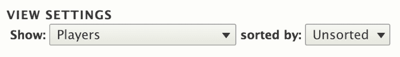
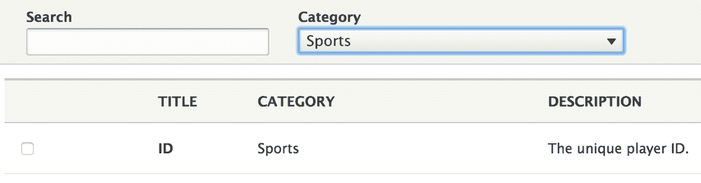
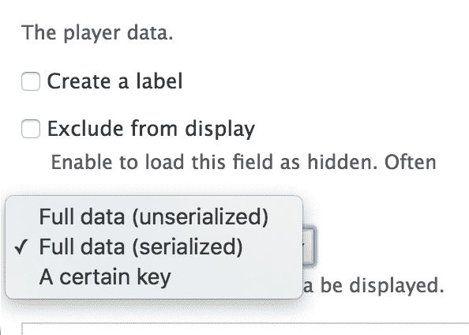
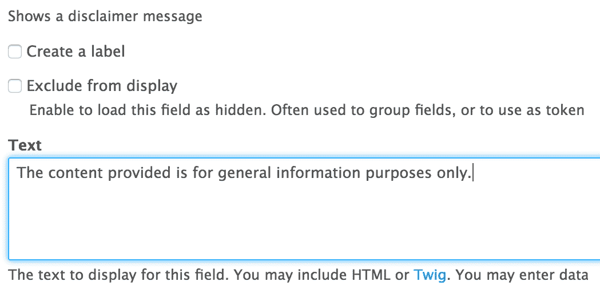
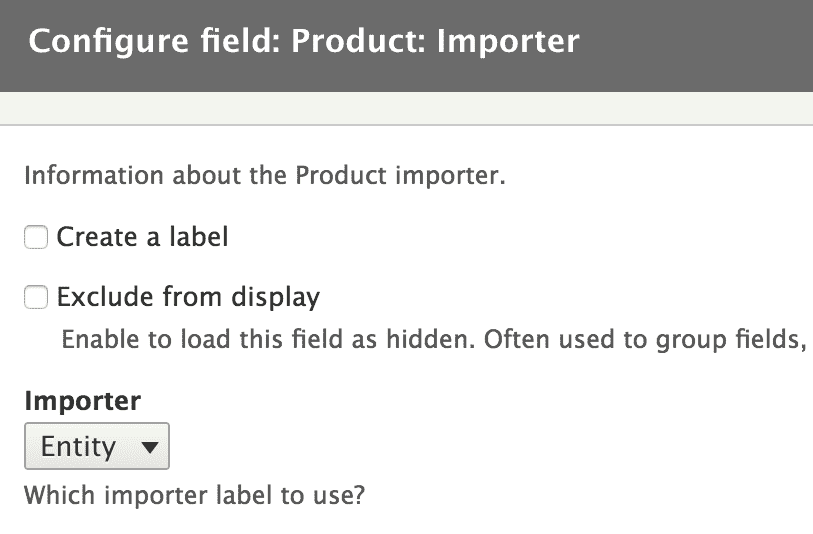
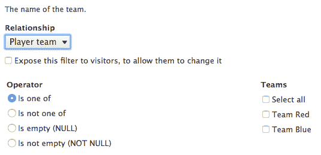

# 第十五章：视图

视图一直是任何 Drupal 网站的标准模块。它如此受欢迎且必需，以至于最终被纳入 Drupal 8 核心。因此，每个新的 Drupal 网站都自带视图，完全集成到系统中，并支持大量核心功能。

实质上，视图是一个用于创建和显示数据列表的工具。这些数据可以是几乎任何东西，但我们主要使用 Drupal 实体，因为它们现在非常健壮。它提供了通过 UI 构建和操纵复杂查询的架构，以及许多不同的输出结果数据的方式。从模块开发者的角度来看（是的，这里有一个双关语），大部分这种力量已经被分解成多个构建块层，抽象为插件。此外，按照传统，还有许多钩子在各个阶段被触发，我们可以通过编程方式对其进行贡献或影响视图。

在本章中，我们将从模块开发者的角度来审视视图生态系统。因此，我们不会花太多时间在其网站构建功能上，因为你可以很容易地认为整本书都可以只针对这一点。相反，我们将专注于我们作为模块开发者可以做些什么来赋予网站构建者更多能力，以及如何操纵视图以符合我们功能的需求。

那么，我们实际上在本章中会做什么呢？我们首先将开始将我们的产品实体类型与视图集成。实体系统和视图可以非常紧密地协同工作，我们只需要将它们指向对方。然后，我们将转换方向，将我们自己的自定义玩家和团队数据（来自第八章，*数据库 API*）暴露给视图，以便我们的网站构建者可以构建列出这些信息的视图，包括过滤器、排序、参数和*所有一切*。从那里，我们将探讨如何修改其他模块暴露给视图的数据，如实体数据，例如节点。

接下来，我们将学习如何创建自己的`ViewsField`、`ViewsFilter`和`ViewsArgument`插件，以应对那些现有插件略显不足的偶尔需求。最后，我们将简要讨论主题化视图及其在其中的主要组件，以便你能够正确地开始，并应用第四章，*主题化*中的教训。

到本章结束时，你将很好地理解如何利用视图来处理自己的数据，以及修改或贡献其他模块如何利用它。你还应该对视图插件生态系统有一个相当好的理解，即使你将不得不自己做一些工作，研究所有类型的可用插件。

那么，让我们开始吧。

# 视图中的实体

即使在 Drupal 7 中，视图与实体系统的集成也相当不错。但由于当时没有强大的实体 API，这种集成并不那么自然。它需要更多的贡献模块和一些自定义代码才能使实体类型与视图协同工作。

然而，在 Drupal 8 中，两者非常紧密地联系在一起，将新的内容实体暴露给视图变得非常容易。如果你已经跟随了第七章，“你自己的自定义实体和插件类型”，并且已经设置了产品实体类型，你会注意到，如果你尝试创建一个视图，你将没有选项基于产品创建它。这是因为，在实体类型定义中，我们没有指定它应该被暴露给视图。实际上就是这样。我们只需要引用一个新的处理器：

```php
"views_data" = "Drupal\views\EntityViewsData"
```

就这些。清除缓存后，我们现在能够创建可以显示任何字段、可以按其过滤和排序、甚至可以使用视图模式渲染产品的视图。所有这些都与其他实体类型（至少在基本层面上，我们将在下一刻看到）保持一致。

你会注意到我们引用了`EntityViewsData`数据处理器，它确保了所有类型实体的基本逻辑。如果我们想，我们可以扩展这个类，并为暴露给视图的数据添加一些我们自己的特定性（或者改变现有的）。这是在`getViewsData()`方法中完成的，我们将在稍后看到示例。但如果你已经想看到示例，可以查看`NodeViewsData`处理器，因为对于节点实体类型，它里面有很多额外的东西。其中很多可能现在还没有太多意义，所以让我们通过将我们自己的自定义数据暴露给视图来慢慢了解视图是如何工作的。

# 将自定义数据暴露给视图

为了更好地理解视图是如何工作的，我们将查看一个完全自定义的数据示例以及我们如何将其暴露给视图。基于这一点，我们将开始理解各种插件的作用，并开始创建我们自己的。此外，我们还将能够扩展我们的产品实体类型数据，以丰富其视图交互。

为了说明这一切，我们将重新访问我们的运动模块，其中我们声明了`players`和`teams`数据表，并且我们现在将它们暴露给视图。目标是允许网站构建者创建符合他们需求的动态数据列表。从这个例子中学到的经验可以应用于其他数据源，甚至是一些远程 API（需要一些额外的工作）。

# 查看数据

每当我们想要将数据暴露给视图时，我们需要以视图可以理解的方式定义这些数据。这正是`EntityViewsData::getViewsData()`对内容实体所做的事情。然而，由于我们正在处理一些自定义的，我们可以通过实现`hook_views_data()`来实现这一点。它可以包含很多东西，但我们将从简单开始。

让我们实现这个钩子，并简单地描述我们的第一个表（玩家的表）以及仅一个字段，即玩家 ID，作为开始。

在视图术语中，术语`field`不必必然与实体字段或类似的东西相关，而是与数据源（真实或非真实）中的单个数据片段相关。一个典型的例子是表中的一列，但它也可以是远程 API 资源中的属性。此外，相同的术语也用来描述该数据片段的*责任*，即以某种方式输出。它还可以有的其他责任包括`filter`、`sort`、`relationship`等。每个这些责任都由特定类型的视图插件（在视图的旧版本中也称为处理器）处理。

因此，基本实现可以看起来像这样：

```php
/** 
 * Implements hook_views_data(). 
 */ 
function sports_views_data() { 
  $data = []; 

  // Players table 
  $data['players'] = []; 
  $data['players']['table']['group'] = t('Sports'); 
  $data['players']['table']['base'] = array( 
    'field' => 'id', 
    'title' => t('Players'), 
    'help' => t('Holds player data.'), 
  ); 

  // Player fields 
  $data['players']['id'] = array( 
    'title' => t('ID'), 
    'help' => t('The unique player ID.'), 
    'field' => array( 
      'id' => 'numeric', 
    ), 
  ); 

  return $data; 
}  
```

这个钩子需要返回一个多维关联数组，描述各种事物，其中最重要的是表及其字段。表不必是实际的数据库表，也可以指类似外部资源的东西。当然，视图已经知道如何查询数据库表，这使得事情对我们来说变得容易。否则，我们还需要创建查询该外部资源的逻辑（通过实现一个`ViewsQuery`插件）。

因此，我们首先定义`players`表，它属于`Sports`组。这个标签可以在视图管理员的字段前缀中找到，我们想要添加的字段的前缀。接下来，我们定义我们的第一个*基础*表，称为`players`（映射到具有相同名称的实际数据库表）。*基础*表是在创建视图时用于*基于*的表。换句话说，在以下屏幕文本中你选择的任何内容：



基础表定义包含一些信息，例如`field`，它指的是包含记录唯一标识符的列。`title`和`help`都是必填项，在 UI 中使用。此外，它还可以包含`query_id`，它引用负责以可理解的方式从源返回数据的`ViewsQuery`插件的插件 ID。由于在我们的案例中，我们使用的是数据库（因此是 SQL），省略此属性将使其默认为`views_query`插件（如果你想查看，是`Sql`类）。

# 视图字段

但为了实际使用这个表，我们需要定义一个或多个可以输出其部分数据的字段。因此，我们从简单的一个开始：玩家 ID。任何在`$data['table_name']`数组中（如我们所见，不是以`table`为键）的内容都负责定义视图字段。键是它们的机器名。`title`和`help`再次出现，并在我们尝试添加相应字段时在 UI 中使用：



然而，这个定义中最重要的部分是`field`键，它基本上表示，对于这块数据，我们想要一个使用`ViewsField`插件且 ID 为`numeric`（`NumericField`）的视图字段。因此，我们实际上不需要编写自己的插件，因为视图已经为我们提供了一个很好的插件，并且它会根据数据的类型来处理我们的 ID。当然，在定义视图字段（或任何其他类型的数据责任，即插件或处理器）时，我们可以有比仅使用插件 ID 更多的选项。

你可以通过查看模块本身定义的所有现有视图插件（这些插件相当多，适用于许多用例）来检查`Drupal\views\Plugin\views`命名空间。有许多插件类型处理不同的责任，但了解你可以查找的地方是很好的，因为很多时候，一个插件已经存在来满足你的需求。

通过这种方式，我们就完成了。清除缓存后，我们现在可以进入视图 UI 并创建我们的第一个显示球员数据的视图。我们可以向其中添加 ID 字段，然后它将自然地只显示 ID 列表。没有更多，因为我们没有定义其他任何内容。所以，让我们继续以同样的方式公开球员名字：

```php
$data['players']['name'] = array( 
  'title' => t('Name'), 
  'help' => t('The name of the player.'), 
  'field' => array( 
    'id' => 'standard', 
  ), 
);  
```

这次，我们使用的是`standard`插件，这是我们可以使用的最简单的插件。它本质上只是将数据以它在数据源中的形式输出（并实施适当的清理）。在我们的球员名字的情况下，这已经足够了。现在我们可以将这个新字段添加到视图中。

如果你记得，我们`players`表中的另一列可以以序列化的方式存储任意数据。显然，这不能用于过滤或排序，但我们仍然可以将其中的一些数据作为字段输出。根据我们的数据和想要实现的目标，我们可以有两种方法来做这件事。首先，我们可以使用现有的`Serialized`插件，它允许我们显示序列化的数据或结果数组中的给定键（取决于字段配置）。但对于更复杂的情况（尤其是当数据是任意的时候），我们可以编写自己的字段插件。

让我们先创建一个简单的`data`字段，它可以输出序列化数据的打印版本，因为我们不能依赖于实际存储的数据：

```php
$data['players']['data'] = array( 
  'title' => t('Data'), 
  'help' => t('The player data.'), 
  'field' => array( 
    'id' => 'serialized', 
  ), 
);  
```

在字段配置中，我们有以下选项可供选择：



通过这种方式，你应该已经对如何在视图中定义输出字段有了大致的了解。现在让我们看看如何将我们的团队纳入循环，并展示一些关于球员所属团队的资料。

# 视图关系

我们玩家所属的团队信息存储在不同的表中。这意味着，在数据库级别，必须创建一个连接来将它们拉在一起。在 Views 术语中，这是一个 `relationship`，意味着一个表与另一个表相关联，并且这些声明是从连接表中的一个字段指向另一个字段的。所以，让我们看看我们如何定义 `players` 表中的 `team_id` 字段，以便与 `teams` 表的 `id` 字段连接：

```php
$data['players']['team_id'] = array( 
  'title' => t('Team ID'), 
  'help' => t('The unique team ID of the player.'), 
  'field' => array( 
    'id' => 'numeric', 
  ), 
  'relationship' => array( 
    'base' => 'teams', 
    'base field' => 'id', 
    'id' => 'standard', 
    'label' => t('Player team'), 
  ), 
);  
```

首先，我们将它定义为视图中的一个字段。然后，因为我们可能还想显示团队 ID，我们可以使用 `numeric` 插件将其定义为 `field`，就像我们定义玩家记录的 ID 一样。但这里这个字段在形式上又多了一个 `relationship` 的责任，这需要四条信息：

+   `base`: 我们要连接的表名

+   `base field`: 我们要连接的表上用于连接的字段名称

+   `id`: 用于关系的 `ViewsRelationship` 插件 ID

+   `label`: 这个关系在 UI 中的标签

通常，`standard` 关系插件就足够了，但如果我们需要，我们总是可以自己创建一个。不过，你几乎不需要这么做。

这个定义现在允许我们在 Views 中添加一个到 `teams` 表的关系。然而，即使数据库引擎连接了两个表，我们也没有达到目的，因为我们还想要输出新表的一些字段。所以，为了这个，我们首先必须定义这个表本身，就像我们为玩家所做的那样：

```php
// Teams table 
$data['teams'] = []; 
$data['teams']['table']['group'] = t('Sports');  
```

注意，如果我们不想创建基于这个表的视图，就不必将其定义为 `base` 表。在我们的情况下，它可以作为玩家信息的辅助。然后，就像我们之前所做的那样，我们可以定义几个团队字段：

```php
// Teams fields 
$data['teams']['name'] = array( 
  'title' => t('Name'), 
  'help' => t('The name of the team.'), 
  'field' => array( 
    'id' => 'standard', 
  ), 
); 

$data['teams']['description'] = array( 
  'title' => t('Description'), 
  'help' => t('The description of the team.'), 
  'field' => array( 
    'id' => 'standard', 
  ), 
);  
```

这里没有什么新的内容，只是我们两个列的基本数据输出。但现在，我们可以进入 UI 中的视图，将一个关系添加到团队表中，然后包括我们玩家所属的团队名称和描述。真不错。

# 视图排序和筛选

让我们继续丰富团队名称字段的 `responsibilities`，通过使我们的玩家列表可按团队名称筛选和排序；例如，只显示特定团队的玩家或按团队名称字母顺序排序玩家。这简直太简单了。我们只需将这些添加到团队名称字段定义中（就像我们添加到玩家的 `team_id` 字段中的 `relationship` 一样）：

```php
'sort' => array( 
  'id' => 'standard', 
), 
'filter' => array( 
  'id' => 'string', 
),  
```

所以基本上，我们使用 `Standard` 排序插件进行排序（这基本上默认为 MySQL 可以做的任何事情）。至于筛选，我们使用 `StringFilter` 插件，它可以从 Views UI 中进行相当多的配置。它甚至允许我们各种筛选可能性，如部分匹配。有了这个，我们现在可以按团队名称进行排序和筛选。

# 视图参数

视图字段可以拥有的最后一种责任是作为参数（或 Drupal 老手的上下文过滤器）使用。换句话说，配置视图以便可以通过动态传递给它的参数进行过滤。让我们面对现实；大多数时候，如果我们想按团队过滤，我们不会依赖于实际的字符串名称，因为这可能会改变。相反，我们将一切与记录（通过其 ID）联系起来。这意味着我们将向`players`表的`team_id`字段添加`argument`键（这也意味着查询不需要连接，因此性能会更好）：

```php
'argument' => array( 
  'id' => 'numeric', 
),  
```

在这种情况下，我们使用`NumericArgument`插件，它几乎为我们所需的数据类型做了所有事情——它通过预期的数值数据类型进行过滤。这样我们就完成了。现在我们可以通过球员所属的团队 ID 动态过滤我们的球员视图。

# 修改视图数据

我们看到了如何将我们自己的完全定制的数据暴露给视图。然而，我们也可以通过实现`hook_views_data_alter()`来修改由 Drupal 核心或其他模块提供的现有数据定义。通过引用传递的`$data`参数将包含所有已定义的内容，可以根据需要进行更改。

此外，我们还可以使用这种实现来创建一些新的视图字段或过滤器，这些字段或过滤器位于不属于我们的其他表上。这实际上比暴露完全定制的表或其他类型的资源更常见。例如，我们可能想创建一个新的视图字段，显示与节点相关的某些内容。所以，让我们看看一个例子。

你还记得在第六章“数据建模和存储”中，我们是如何创建一个*伪字段*，在节点的底部输出免责声明消息的吗？如果我们的视图配置为渲染节点实体，那么这将有效。然而，如果它使用字段，则无法做到这一点。所以，让我们看看我们如何将此消息也暴露为视图字段。我们不会将其包含在最终代码中，但让我们看看如果我们想完成它，我们应该怎么做。

首先，我们需要实现`hook_views_data_alter()`并在节点实体类型数据表上定义一个新的字段：

```php
/** 
 * Implements hook_views_data_alter(). 
 */ 
function module_name_views_data_alter(&$data) { 
  $data['node_field_data']['disclaimer'] = [ 
    'title' => t('Disclaimer'), 
    'help' => t('Shows a disclaimer message'), 
    'field' => [ 
      'id' => 'custom', 
    ], 
  ]; 
}  
```

在这个例子中，我们将我们的新视图字段添加到节点数据表（`node_field_data`）上。但是，我们有一个选择，即使用哪个插件来渲染我们的消息。我们当然可以自己创建一个（正如我们将在下一节中做的那样）。这实际上非常简单，尤其是因为它甚至不需要使用任何来自结果节点的信息。然而，如果是这样的话，我们不妨使用现有的`Custom`插件，它有两个主要优点。一方面，我们不需要再写任何代码。第二，它允许网站构建者通过 UI 指定（并根据需要修改）免责声明消息。因为基本上，这个插件暴露了一个配置表单，我们可以用它来添加我们想要显示的每行的文本：



当然，这种方法也有一些缺点。如果我们想确保这里的信息和我们在伪字段中使用的信息之间的一致性，我们可能需要编写自己的插件并从这个独特的地方获取信息。同样，如果我们想确保信息严格在代码中，特别是如果我们需要从视图结果中的节点获取某种数据时，这也适用。因此，选择取决于实际用例，但在创建自己的插件之前，查看现有的视图插件并了解它们已经存在的内容是很好的。

# 自定义视图字段

现在我们已经看到了数据是如何暴露给视图的，我们可以开始更好地理解我之前提到的`NodeViewsData`处理器（即使不是全部）。但这同时也提供了一个很好的过渡，回到我们的`Product`实体类型的`views_data`处理器，我们现在可以看看`getViewsData()`方法的职责是什么。它需要返回所有表和字段的定义，以及它们能做什么。幸运的是，基类已经为我们提供了将我们的产品数据转换为视图字段、过滤器、排序、参数以及可能的关系所需的一切，一切现成。

但假设我们想在产品相关功能上下文中添加一些对我们有意义的更多视图字段。例如，每个产品都有一个`source`字段，该字段由导入实体从其自身的`source`字段填充。这只是为了跟踪它们来自哪里。因此，我们可能想要创建一个视图字段，它简单地渲染导入产品的导入者名称。

您可能会问：*但是，那不是产品表上的一个列！怎么回事？*正如我们将看到的，我们可以定义渲染我们想要的任何数据的视图字段（无论这些数据是否与记录相关）。当然，这也意味着，由于 MySQL 在构建查询时无法访问这些数据，因此结果数据不能用于排序或过滤。因此，我们在这一点上灵活性略低，但这是有道理的。

在本节中，您将学习两件事。首先，我们将看到如何为我们的产品实体类型创建自己的`views_data`处理器。到目前为止，您应该对这个过程相当熟悉。更重要的是，我们将使用这个处理器为我们的产品创建一个新的视图字段，该字段渲染现有`ViewsField`插件无法提供的功能：相关导入实体名称。这意味着我们的自定义插件。多么令人兴奋，让我们开始吧！

创建我们自己的`views_data`处理器有两个快速步骤。首先，我们需要这个类：

```php
namespace Drupal\products\Entity; 

use Drupal\views\EntityViewsData; 

/** 
 * Provides Views data for Product entities. 
 */ 
class ProductViewsData extends EntityViewsData { 

  /** 
   * {@inheritdoc} 
   */ 
  public function getViewsData() { 
    $data = parent::getViewsData(); 
    // Add stuff. 
    return $data; 
  } 
}  
```

如您所见，我们正在扩展之前在产品实体类型注解中引用的基`EntityViewsData`类。在内部，我们正在重写`getViewsData()`方法以添加我们自己的定义（这些定义将放在您可以看到注释的地方）。

第二，我们需要在实体类型注解中更改处理器引用到这个新类：

```php
"views_data" = "Drupal\products\Entity\ProductViewsData", 
```

就这些了。我们现在可以定义自己的自定义字段，并且我们可以从视图数据定义开始：

```php
$data['product']['importer'] = [ 
  'title' => t('Importer'), 
  'help' => t('Information about the Product importer.'), 
  'field' => array( 
    'id' => 'product_importer', 
  ), 
]; 
```

简单的事情，就像我们处理玩家时做的那样。只不过在这个案例中，我们要将它添加到`product`表中，并且我们正在使用一个还不存在的`ViewsField`插件。所以，让我们创建它。

正如你可能注意到的，如果你检查了一些现有的，Views 插件位于模块的`Plugin\views\[plugin_type]`命名空间中，其中`[plugin_type]`在这个案例中是`field`，因为我们正在创建一个`ViewsField`插件。所以，我们可以从插件类脚手架开始：

```php
namespace Drupal\products\Plugin\views\field; 

use Drupal\views\Plugin\views\field\FieldPluginBase; 
use Drupal\views\ResultRow; 

/** 
 * Field plugin that renders data about the Importer that imported the Product. 
 * 
 * @ViewsField("product_importer") 
 */ 
class ProductImporter extends FieldPluginBase { 

  /** 
   * {@inheritdoc} 
   */ 
  public function render(ResultRow $values) { 
    // Render something more meaningful. 
    return ''; 
  } 
}  
```

就像任何其他字段插件一样，我们正在扩展`FieldPluginBase`类，它提供了字段所需的所有常见默认值和基本功能。当然，你注意到的一个不可否认的小注释，它只包含插件 ID。我们的主要工作是工作在`render()`方法中并输出一些内容，最好使用包含所有数据的相应行的`$values`对象。

在`ResultRow`对象内部，我们可以找到来自 Views 行的值，这些值可能包含多个字段。如果是一个列出实体的视图，我们还有一个`_entity`键，它引用实体对象本身。

清除缓存后，我们现在能够将新的*产品导入器*字段添加到产品视图。但如果我们这样做，我们会注意到一个错误。Views 试图将我们定义的`product_importer`字段添加到查询中，但实际上这个字段并不存在于表中。这是不正确的！这是因为，尽管 Views 可以与任何数据源一起工作，但它仍然偏好 SQL 数据库，所以我们有时会遇到这些问题。不过不用担心，因为我们可以简单地告诉我们的插件不要在查询中包含该字段——它将显示完全定制的数据。我们通过覆盖`query()`方法来实现这一点：

```php
/** 
 * {@inheritdoc} 
 */ 
public function query() { 
  // Leave empty to avoid a query on this field. 
}  
```

就这些了。现在，我们的字段将渲染一个空字符串：`''`。让我们将其改为查找相关的导入实体并显示其标签。但为了做到这一点，我们需要使用`EntityTypeManager`服务进行查询。让我们注入它：

```php
/** 
 * @var \Drupal\Core\Entity\EntityTypeManager 
 */ 
protected $entityTypeManager; 

/** 
 * Constructs a ProductImporter object. 
 * 
 * @param array $configuration 
 *   A configuration array containing information about the plugin instance. 
 * @param string $plugin_id 
 *   The plugin_id for the plugin instance. 
 * @param mixed $plugin_definition 
 *   The plugin implementation definition. 
 * @param \Drupal\Core\Entity\EntityTypeManagerInterface $entityTypeManager 
 */ 
public function __construct(array $configuration, $plugin_id, $plugin_definition, EntityTypeManagerInterface $entityTypeManager) { 
  parent::__construct($configuration, $plugin_id, $plugin_definition); 
  $this->entityTypeManager = $entityTypeManager; 
} 

/** 
 * {@inheritdoc} 
 */ 
public static function create(ContainerInterface $container, array $configuration, $plugin_id, $plugin_definition) { 
  return new static( 
    $configuration, 
    $plugin_id, 
    $plugin_definition, 
    $container->get('entity_type.manager') 
  ); 
}  
```

由于我们正在插件内部操作，我们需要确保我们实现了`ContainerFactoryPluginInterface`，以便使用`create()`方法。但幸运的是，一个父类已经这样做了，即`Drupal\views\Plugin\views\PluginBase`，所以我们没问题。

然而，我们确实需要在顶部添加新的*use*语句：

```php
use Drupal\Core\Entity\EntityTypeManagerInterface; 
use Symfony\Component\DependencyInjection\ContainerInterface; 
```

现在，我们可以继续使用`render()`方法：

```php
public function render(ResultRow $values) { 
  /** @var \Drupal\products\Entity\ProductInterface $product */ 
  $product = $values->_entity; 
  $source = $product->getSource(); 
  $importers = $this->entityTypeManager->getStorage('importer')->loadByProperties(['source' => $source]); 
  if (!$importers) { 
    return NULL; 
  } 

  // We'll assume one importer per source. 
  /** @var \Drupal\products\Entity\ImporterInterface $importer */ 
  $importer = reset($importers); 
  return $this->sanitizeValue($importer->label()); 
}  
```

我们简单地获取当前行的产品实体，然后查询具有在产品上引用的源的产品导入器配置实体。我们假设只有一个（即使我们没有做好确保这一点的工作以节省空间），然后简单地返回其标签。我们还通过 `sanitizeValue()` 辅助方法传递它，该方法负责确保输出对 XSS 攻击等安全。因此，现在我们的产品视图可以显示每个产品的导入器名称，该导入器将它们引入应用程序。

如果我们退后一步，试图理解正在发生的事情，一个警告变得明显。视图执行了一个大查询，返回了一个产品实体列表和一些数据。但是，当这些数据输出时，我们对结果集中的每个产品对应的导入器实体执行查询（并加载这些实体）。所以如果我们返回了 100 个产品，这意味着还有 100 个额外的查询。在创建自定义字段时，请记住这一点，以确保您不会得到巨大的性能损失，这往往甚至不值得。

# 字段配置

我们已经让字段工作正常了，但假设我们想要让它更加动态。目前它被称为 *产品导入器*，我们正在显示导入器实体的标题。但让我们使其可配置，以便我们可以在 UI 中选择要显示的标题——实体的标题或实际的导入器插件的标题。

使字段插件可配置有几个简单的步骤。它们与其他视图插件类型的工作方式类似。在概念上，它们也与我们在第九章，“自定义字段”中做的类似，当时我们使实体字段可配置。

首先，我们需要通过覆盖方法来定义一些默认选项：

```php
/** 
 * {@inheritdoc} 
 */ 
protected function defineOptions() { 
  $options = parent::defineOptions(); 
  $options['importer'] = array('default' => 'entity'); 

  return $options; 
}  
```

如您所见，我们向父类定义的选项（相当多）中添加了自己的 `importer` 选项。并将其默认值设置为字符串 `entity`。这是我们的选择。

其次，我们需要为新选项定义表单元素，我们可以通过另一个方法覆盖来实现：

```php
/** 
 * {@inheritdoc} 
 */ 
public function buildOptionsForm(&$form, FormStateInterface $form_state) { 

  $form['importer'] = array( 
    '#type' => 'select', 
    '#title' => $this->t('Importer'), 
    '#description' => $this->t('Which importer label to use?'), 
    '#options' => [ 
      'entity' => $this->t('Entity'), 
      'plugin' => $this->t('Plugin') 
    ], 
    '#default_value' => $this->options['importer'], 
  ); 

  parent::buildOptionsForm($form, $form_state); 
} 
```

以及 *use* 语句：

```php
use Drupal\Core\Form\FormStateInterface;  
```

这里没有特别之处；我们只是在主选项表单上定义了一个选择列表表单元素。我们可以看到 `$options` 类属性包含所有插件选项，在那里我们可以检查我们 `importer` 的默认值。最后，我们当然将父定义中的所有其他元素添加到表单中。

接下来，在 `render()` 方法内部，一旦我们掌握了导入器实体，我们可以进行以下更改：

```php
// If we want to show the entity label. 
if ($this->options['importer'] == 'entity') { 
  return $this->sanitizeValue($importer->label()); 
} 

// Otherwise we show the plugin label. 
$definition = $this->importerManager->getDefinition($importer->getPluginId()); 
return $this->sanitizeValue($definition['label']);  
```

非常简单。我们要么显示实体标签，要么显示插件的标签。但当然——我们跳过了这一点——导入器插件管理器也需要注入到类中。我将让您自己处理这个问题，因为您已经知道如何做到这一点。

最后，我们还需要做的一件事是定义配置模式。由于我们的视图（它是一个配置实体）现在正带着一个额外的选项被保存，我们需要定义后者的模式。我们可以在一个新文件`products.schema.yml`（位于我们模块的`config/schema`文件夹中）内完成这项工作：

```php
views.field.product_importer: 
  type: views_field 
  label: 'Product Importer' 
  mapping: 
    importer: 
      type: string 
      label: 'Which importer label to use: entity or plugin' 
```

这应该已经让你很熟悉了，包括定义配置模式的动态性。我们在第九章，*自定义字段*中，为我们的字段类型、小部件和格式化插件上的选项做了同样的事情。不过，这次类型是`views_field`，我们从其中基本继承了大量的定义，并添加了我们自己的（`importer`字符串）。就是这样。如果我们配置我们的新视图字段，我们应该会看到这个新选项：



# 自定义视图过滤器

在前面的部分中，我们将我们的`players`和`teams`表暴露给了视图，以及将团队名称作为一个可能的字符串过滤器来限制通过团队筛选出的球员。但这并不是我们能达到的最佳方式，因为站点构建者可能不一定知道数据库中所有的团队，也不知道它们的准确名称。因此，我们可以创建自己的`ViewsFilter`，将其转换为用户可以选择的团队选择。有点像分类术语过滤器。那么，让我们看看它是如何实现的。

首先，我们需要修改团队名称字段的定义，以更改用于过滤的插件 ID（在`hook_views_data()`内部）：

```php
'filter' => array( 
  'id' => 'team_filter', 
),  
```

现在，我们只需要创建那个插件。自然地，它位于我们模块的`Plugin/views/filter`命名空间中：

```php
namespace Drupal\sports\Plugin\views\filter; 

use Drupal\Core\Database\Connection; 
use Drupal\views\Plugin\views\filter\InOperator; 
use Drupal\views\ViewExecutable; 
use Drupal\views\Plugin\views\display\DisplayPluginBase; 
use Symfony\Component\DependencyInjection\ContainerInterface; 

/** 
 * Filter class which filters by the available teams. 
 * 
 * @ViewsFilter("team_filter") 
 */ 
class TeamFilter extends InOperator { 

  /** 
   * @var \Drupal\Core\Database\Connection 
   */ 
  protected $database; 
  /** 
   * Constructs a TeamFilter plugin object. 
   * 
   * @param array $configuration 
   *   A configuration array containing information about the plugin instance. 
   * @param string $plugin_id 
   *   The plugin_id for the plugin instance. 
   * @param mixed $plugin_definition 
   *   The plugin implementation definition. 
   * @param \Drupal\Core\Database\Connection $database 
   *   The database connection. 
   */ 
  public function __construct(array $configuration, $plugin_id, $plugin_definition, Connection $database) { 
    parent::__construct($configuration, $plugin_id, $plugin_definition); 
    $this->database = $database; 
  } 

  /** 
   * {@inheritdoc} 
   */ 
  public static function create(ContainerInterface $container, array $configuration, $plugin_id, $plugin_definition) { 
    return new static( 
      $configuration, 
      $plugin_id, 
      $plugin_definition, 
      $container->get('database') 
    ); 
  } 

  /** 
   * {@inheritdoc} 
   */ 
  public function init(ViewExecutable $view, DisplayPluginBase $display, array &$options = NULL) { 
    parent::init($view, $display, $options); 
    $this->valueTitle = t('Teams'); 
    $this->definition['options callback'] = [$this, 'getTeams']; 
  } 

  /** 
   * Generates the list of teams that can be used in the filter. 
   */ 
  public function getTeams() { 
    $result = $this->database->query("SELECT name FROM {teams}")->fetchAllAssoc('name'); 
    if (!$result) { 
      return []; 
    } 

    $teams = array_keys($result); 
    return array_combine($teams, $teams); 
  } 
}  
```

首先，我们看到注释已经到位，使其成为一个插件。类似于视图字段。然后，我们使用依赖注入来获取数据库连接服务。到目前为止没有什么新东西。然而，你会注意到我们扩展了`InOperator`类，它为允许`IN`类型过滤的视图过滤器提供了基本功能。例如，`... WHERE name IN(name1, name2)`。所以我们从那里扩展以继承适用于视图的大部分逻辑。

然后，我们覆盖了`init()`方法（该方法用于初始化插件），以便设置站点构建者可以选择的可用值（团队名称）以及结果表单元素的标题。但我们通过指定一个`options callback`来实现，该回调将在正确的时间点检索选项。这个回调是我们类上的一个方法，名为`getTeams()`，它返回所有团队名称的数组。这个数组需要根据查询过滤器中使用的值进行键控。就是这样。我们不需要担心选项表单或类似的东西。基类为我们处理了一切。

现在，站点构建者可以添加这个过滤器，并选择一个团队（或多个）进行过滤，以包容性的方式。例如，要显示属于相应团队的球员：



而不是使用`options callback`，我们也可以直接覆盖父类的`getValueOptions()`方法（实际上它会调用选项回调）。这里的唯一注意事项是，为了防止性能泄漏，值应该存储在局部的`valueOptions`类属性中。这样，它们可以被多次读取。

即使这不是那么明显，我们还需要做的一件事是为我们的过滤器定义配置模式。你可能想知道为什么我们不创建任何自定义选项。答案是，当用户添加过滤器并选择一个团队进行过滤时，Drupal 不知道该值的数据类型。因此，我们需要告诉它它是一个字符串。在我们的`sports.schema.yml`文件中，我们可以有如下内容：

```php
views.filter.team_filter: 
  type: views_filter 
  label: 'The teams to filter by' 
  mapping: 
    value: 
      type: sequence 
      label: 'Teams' 
      sequence: 
        type: string 
        label: 'Team' 
```

与视图字段类似，我们有一个动态的`views_filter`类型模式定义。在映射中，我们覆盖了`value`字段（该字段已经被`views_filter`数据类型定义）。在我们的情况下，这是一个序列（一个带有不重要键的数组），其个别值是字符串。

另一种实现相同（或类似）效果的方法是这样的：

```php
views.filter_value.team_filter: 
  type: sequence 
  label: 'Teams' 
  sequence: 
    type: string 
    label: 'Team' 
```

这是因为，在`views_filter`模式中找到的`value`键的定义中，类型被设置为`views.filter_value.[%parent.plugin_id]`。这意味着我们可以简单地为自己定义`views.filter_value.team_filter`数据类型，以便它可以使用。如果你还记得，这与我们在第十二章中自己做的非常相似，即*JavaScript 和 Ajax API*。因此，我们只需定义那缺失的部分作为我们的序列，而不是覆盖整个结构来改变一小部分。

现有的视图过滤器类提供了大量的能力，既可以直接用于自定义数据，也可以扩展以补充我们自己的特定需求。因此，我建议你查看所有现有的过滤器插件。然而，过滤器的主要概念是改变视图执行的查询，这可以在插件类的`query()`方法中完成。在那里，我们可以根据需要向查询添加额外的条件。你可以在`FilterPluginBase`类上查看这个方法，它简单地根据配置的值和操作符使用查询对象的`addWhere()`方法添加一个条件。

# 自定义视图参数

当我们最初将玩家和团队数据暴露给视图时，我们使用了一个参数插件，这样我们就可以对玩家所属的团队 ID 进行上下文过滤。为此，我们使用了现有的`numeric`插件在`players`表的`team_id`实际字段上。但如果我们想要一个在更多层面上工作的参数呢？例如，我们并不确切知道我们会收到什么类型的数据，但我们希望能够很好地处理一个数值型（团队 ID）和一个文本型（团队名称）。全部在一个参数中。为了实现这一点，我们可以创建一个简单的`ViewsArgument`插件来为我们处理这个问题。

首先，就像往常一样，是定义这个字段。我们不希望干扰我们之前添加了参数的`team_id`字段，因为这个仍然可以使用。相反，我们将创建一个新的字段，这次是在`teams`表上，我们将简单地称之为`team`：

```php
$data['teams']['team'] = array( 
  'title' => t('Team'), 
  'help' => t('The team (either an ID or a team name).'), 
  'argument' => array( 
    'id' => 'team', 
  ), 
); 
```

这次，我们不会为它创建一个*字段*，因为我们不需要显示任何内容。相反，我们只坚持`argument`责任，这将由我们新的`team`插件处理。你也许也会注意到，`team`列实际上并不存在于数据库表中。

那么，让我们看看这个插件：

```php
namespace Drupal\sports\Plugin\views\argument; 

use Drupal\views\Plugin\views\argument\ArgumentPluginBase; 

/** 
 * Argument for filtering by a team. 
 * 
 * @ViewsArgument("team") 
 */ 
class Team extends ArgumentPluginBase { 

  /** 
   * {@inheritdoc} 
   */ 
  public function query($group_by = FALSE) { 
    $this->ensureMyTable(); 
    $field = is_numeric($this->argument) ? 'id' : 'name'; 
    $this->query->addWhere(0, "$this->tableAlias.$field", $this->argument); 
  } 
}  
```

如同往常，我们扩展了其类型的基插件类并添加了适当的注解。在内部，我们只处理`query()`方法，我们重写了它。参数与过滤器在意义上非常相似，因为它们旨在通过查询来限制结果集。主要区别在于实际用于过滤的值，在这种情况下，它是动态的，可以在（父）类的`$argument`属性中找到。我们所做的是简单地给`teams`表（因为那是基表）的相应字段添加一个查询条件，这取决于我们处理的数据类型。但在我们这样做之前，我们调用`ensureMyTable()`方法，这个方法简单地确保我们的插件需要的表被 Views 查询包含。 

就这些了。我们现在可以将我们新创建的参数添加到视图中，无论我们传递了什么上下文过滤器（ID 或名称），它都会相应地过滤。当然，我们也可以像大多数其他 Views 插件类型一样有选项，但我会让你自己探索那些。我们还可以从父类中重写更多内容以与 Views 集成。但这有点更高级，而且你不太可能需要处理很长时间。我确实建议探索其背后的代码。

# 视图主题

前端开发者曾在 Drupal 7 中感到很多痛苦，其中很大一部分也与视图主题有关。幸运的是，Drupal 8 使事情处理起来容易得多。我们将在这里看看一些内容，以便在你应用在第四章，*主题化*中学到的知识时，能给你正确的方向。

Views 非常复杂，由许多可插拔层组成。一个视图有一个*显示*（如页面或块），可以使用给定的*样式*（如无格式列表或表格）来渲染其内容。样式可以决定是否控制给定结果项（行）的渲染，或者委托给*行*插件（如字段或实体）。实际上，大多数都这样做。使用*行*插件的最常见场景是使用`EntityRow`，它使用指定的视图模式渲染结果实体，或者使用`Fields`插件，它使用单个`ViewField`插件来渲染添加到视图中的每个字段。

如果我们想要为主题化视图，我们可以查看所有这些点。想要视图输出幻灯片吗？也许创建一个新的*样式*插件。想要对结果集中的每个实体进行疯狂的操作？也许创建一个新的*行*插件，或者甚至只创建一个新的*字段*插件（就像我们做的那样）以以任何你想要的方式渲染一块数据。这些技术更多地面向模块开发者对视图的控制。但我们也有可以玩转的主题方面。

再次从顶部开始，*样式*插件不过是主题钩子的美化包装。例如，*未格式化列表*插件使用`views_view_unformatted`主题钩子，这意味着几件事情：它可以被主题（甚至模块）覆盖，并且可以被主题或模块预处理。查看默认的`template_preprocess_views_view_unformatted()`预处理程序和`views-view-unformatted.html.twig`模板文件以获取更多信息。不要忘记主题钩子建议，因为视图定义了相当多的它们。你所需要做的就是启用主题（Twig）调试，你将看到每个视图*层*正在使用哪个模板。

然而，*样式*主题只能让我们到达所有结果的包装层。要深入一点，我们需要知道它使用的是哪种*行*插件。如果实体正在渲染，那么这与控制实体构建的方式相同。参见第六章，*数据建模与存储*，以复习相关内容。如果*行*插件使用*字段*插件，我们有一些选项。首先，这同样是一个主题钩子的包装，即`views_view_fields`，它渲染了添加到视图中的所有*字段*插件。

因此，我们可以使用已知的主题方法来覆盖它。但我们也可以覆盖每个`字段`插件的默认主题钩子，即`views_view_field`，它负责包装插件的输出。这带我们到*字段*插件本身以及它们最终渲染的内容，这可能会因插件而异。所以，请确保检查这一点。

# 视图钩子

视图还附带了许多钩子。我们已经看到了一个重要的钩子，它允许我们将自己的数据暴露给视图。但还有更多，你应该查看`views.api.php`文件以获取更多信息。

许多用于更改各种插件类型的插件信息。但也有一些重要的钩子，它们在运行时处理视图的执行。其中最值得注意的是`hook_views_query_alter()`，它允许我们对即将运行的最终查询进行修改。还有`hook_views_post_render()`和`hook_views_pre_render()`，它们允许我们对视图结果进行修改。例如，更改项目顺序或类似的事情。

我建议您查看他们各自的文档，并了解您可以使用这些钩子做什么。有时它们可能会有所帮助，尽管在 Drupal 8 中，大部分动作都发生在插件中，您现在可以轻松地编写自己的插件来处理您的特定需求。这就是为什么我们不会对这些内容进行详细说明。

# 摘要

在本章中，我们从各种面向模块开发者的角度探讨了视图。我们看到了如何将我们的产品实体类型暴露给视图。这很简单。但是，我们也看到了如何将来自第八章《数据库 API》的定制播放器和团队数据暴露给视图。即使我们必须为此编写一些代码，其中大部分都是相当模板化的，因为我们能够利用现有的视图插件生态系统来处理我们想要的几乎所有事情。然而，由于这些都是插件，我们也看到了如何创建我们自己的字段、筛选和参数插件来处理那些现有内容可能不足以应对的异常情况。

与此密切相关，我们还简要讨论了如何更改其他模块向视图暴露数据的方式。这里最显著的例子是能够轻松地向基于实体的视图中添加更多字段（和插件），以丰富其自定义功能。

最后，我们简要讨论了如何处理视图的主题方面。我们看到了构成视图的不同层次，从显示层一直到*字段*。我们以对视图模块在各个时间点调用的现有钩子的提及来结束本章，通过这些钩子我们也可以对其正常操作进行更改。

在下一章中，我们将看到如何在 Drupal 8 中处理文件和图像。
