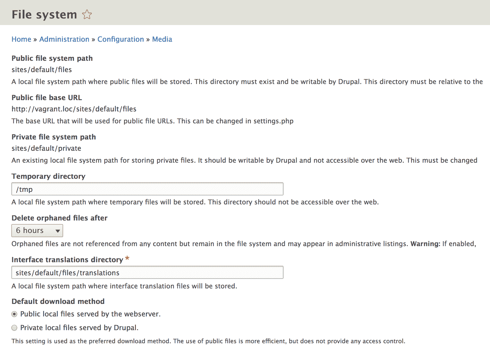
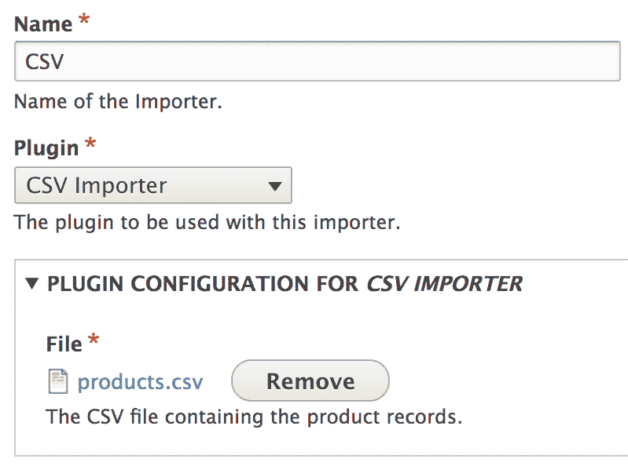
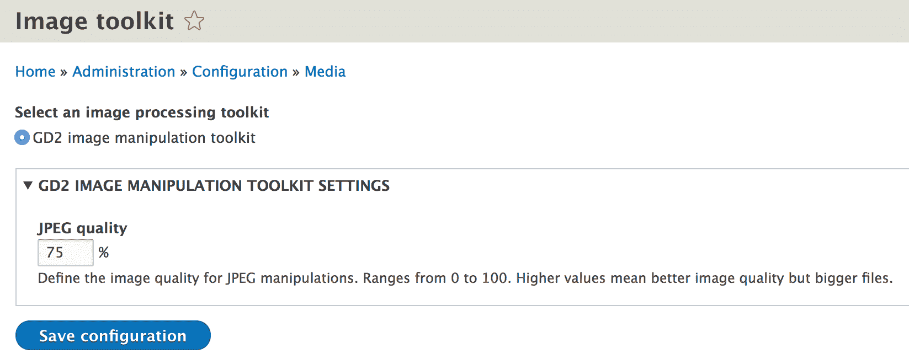
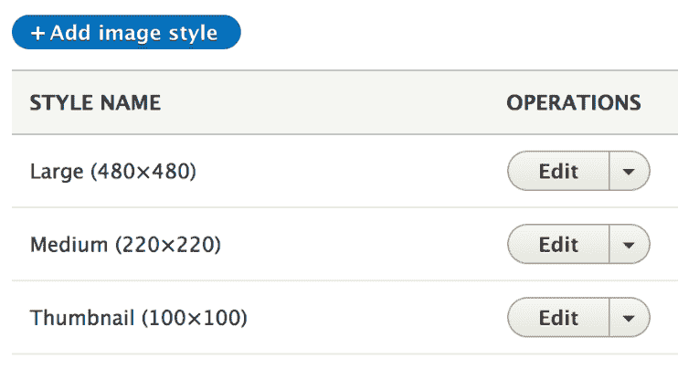

# 第十六章：处理文件和图像

Drupal 内置了许多处理和操作文件和图像的能力，并且随着最近版本的更新，其工具集也在不断增加。当然，这并不是说媒体管理从未是 Drupal 开发者的痛点。在 Drupal 7 中，需要一套复杂的贡献模块来实现基本的功能，而像 WordPress 这样的“竞争对手”用户可以开箱即用享受这些功能。在 Drupal 8 中，对媒体管理的重视程度更高，并且随着每个版本的发布，媒体功能已经集成到核心中。媒体（实体）模块，包括其支持图像、文件、远程视频（Oembed）和音频的基本源插件，以及实验性的媒体库，在该领域取得了重大进步。此外，与流行的贡献模块如实体浏览器一起，许多差距已经得到填补。

在本章中，我们将探讨如何在 Drupal 中使用核心功能处理文件和图像。尽管媒体模块允许开发者提供新的源插件来将媒体实体暴露给各种类型的媒体，但我们不会深入探讨这个相当高级的话题。相反，我们将专注于可以用于处理文件的底层工具，并在过程中展示一些示例。那么，我们将讨论什么呢？

首先，我们将了解 Drupal 的*文件系统*。来自先前版本的 Drupal 的开发者应该已经在理论上熟悉这些，我们将看到这些在 Drupal 8 中的工作方式。与此相关，我们将讨论*流包装器*以及 Drupal 如何处理原生 PHP 文件操作。我们甚至将在本章稍后创建我们自己的自定义流包装器。

然后，我们将简要讨论在 Drupal 中处理文件的不同方式，即*管理*（跟踪）和*非管理*文件。在举例说明如何处理*管理*文件时，我们将向我们的产品实体类型添加一个图像字段，并将图像从虚构的远程环境中导入。我们还将创建一个全新的基于 CSV 的导入器，通过该导入器从我们读取的 CSV 文件中导入产品数据。在这个过程中，我们将注意实体 CRUD 钩子，这是 Drupal 8 中非常重要的扩展点，并看看我们如何在示例上下文中使用它们。

我们将本章的结尾放在如何使用专门处理图像的各种 API 上，特别是通过图像工具包进行图像操作以及处理图像样式。让我们开始吧。

# 文件系统

Drupal 为任何给定站点定义了四种主要的文件存储类型：公共、私有、临时和翻译文件系统。在安装 Drupal 时，映射到这些文件系统的文件夹会自动创建。如果失败——最可能是由于权限问题——我们必须自己创建它们并赋予它们正确的权限。Drupal 会处理其余部分（例如，出于安全原因添加相关的 `.htaccess` 文件）。如果您不确定如何操作，请确保查看 [Drupal.org](https://www.drupal.org/) 上的文档，了解如何成功安装 Drupal 8。

公共文件对所有人公开，可供查看或下载。这是存储图像内容、标志以及任何可以下载的文件的地方。您的公共文件目录必须位于 Drupal 根目录下的某个位置，并且必须可由您的 web 服务器运行的用户读取和写入。公共文件没有访问限制。任何人，在任何时候，都可以直接导航到公共文件并查看或下载它。这也意味着访问这些文件不需要 Drupal 引导。

我们可以在 `settings.php` 文件中配置公共文件系统的路径：

```php
$settings['file_public_path'] = 'sites/default/files';  
```

相反，私有文件对公众不可用，不能用于一般下载。因此，私有文件目录不能通过网络访问。然而，它仍然必须可由 web 服务器用户写入。通过这种方式隔离私有文件允许开发者控制谁可以访问它们。例如，我们可以编写一个模块，只允许具有特定角色的用户访问私有文件系统中的 PDF 文件。

我们可以在 `settings.php` 文件中配置私有文件系统的路径：

```php
$settings['file_private_path'] = 'sites/default/private';  
```

临时文件存储通常仅由 Drupal 用于内部操作。当文件首次由 Drupal 保存时，它们最初会写入临时文件系统，以便检查安全问题。一旦被认为安全，它们就会被写入最终位置。

我们可以通过 UI 配置临时文件系统的路径：



在相同的配置屏幕上，我们还可以指定站点的默认文件下载方法。默认情况下，这设置为公共文件系统。

最后，Drupal 使用翻译文件存储来存储包含可以批量导入系统的字符串翻译值的 `.po` 文件。与临时文件存储一样，我们可以通过 UI 配置翻译文件的位置。

# 流包装器

如果你长期编写 PHP，你可能在某个时候需要处理本地或远程文件。以下 PHP 代码是将文件读入变量的常见方式，你可以对它进行一些操作：

```php
$contents = ''; 
$handle = fopen("/local/path/to/file/image.jpg", "rb"); 
while (!feof($handle)) { 
 $contents .= fread($handle, 8192); 
} 
fclose($handle);  
```

这相当直接。我们使用 `fopen()` 获取本地文件的句柄，并使用 `fread()` 读取文件的 8 KB 数据块，直到 `feof()` 指示我们已到达文件末尾。在那个点上，我们使用 `fclose()` 关闭句柄。文件的内容现在存储在 `$$contents` 变量中。

除了本地文件外，我们还可以通过 `fopen()` 以相同的方式访问远程文件，但需要指定实际的远程路径而不是之前看到的本地路径（以 `http(s)://` 开头）。

我们可以通过这种方式访问的数据是可流式的，这意味着我们可以打开它、关闭它，或者定位到文件中的特定位置。

*流包装器* 是在这些流之上的一个抽象层，告诉 PHP 如何处理特定类型的数据。当使用流包装器时，我们就像引用传统 URL 一样引用文件——`scheme://target`。事实上，之前的例子使用了 PHP 的内置流包装器之一：用于访问本地存储文件的 `file://` 包装器。实际上，这是默认方案，如果没有指定，所以我们可以省略它，只添加文件路径。如果文件位于远程位置，我们会使用类似 `http://example.com/file/path/image.jpg` 的东西。这是另一个 PHP 内置流包装器：`http://`（用于 HTTP 协议）。

如果这还不够，PHP 还允许我们为 PHP 默认不处理的方案定义自己的包装器；Drupal 文件 API 就是构建来利用这一点的。这就是我们回溯到之前讨论的不同类型的文件存储的地方，因为它们都有自己的流包装器，由 Drupal 定义。

公共文件系统使用相当知名的 `public://` 流包装器，私有文件系统使用 `private://`，临时文件系统使用 `temporary://`，翻译文件系统使用 `translations://`。这些映射到我们在 `settings.php`（或用户界面）中定义的本地文件路径。在章节的后面部分，我们将看到如何定义我们自己的流包装器以及其中包含的一些内容。不过，首先让我们谈谈在 Drupal 8 中管理文件的不同方式。

# 管理文件与未管理文件

Drupal 文件 API 允许我们以两种不同的方式处理文件。文件本质上归结为两类：它们要么是 *管理的*，要么是 *未管理的*。这两种文件之间的区别在于它们的使用方式。

*管理*文件与实体系统紧密协作，实际上是与文件实体相关联。因此，每当我们创建一个*管理*文件时，都会为其创建一个实体，我们可以以各种方式使用它。这些记录存储的表称为`file_managed`。此外，*管理*文件的一个关键方面是它们的用法是可跟踪的。这意味着如果我们在一个实体上引用它们或甚至手动指示我们使用它们，这种使用情况将在名为`file_usage`的辅助表中跟踪。这样，我们可以看到每个文件在哪里被使用以及使用次数，Drupal 甚至提供了一个在特定时间后删除“孤儿”文件的方法，以防它们不再需要。

使用*管理*文件的一个显著例子是我们可以添加到实体类型的简单`Image`字段类型。使用这些字段，我们可以上传一个文件并将其*附加*到相应的实体。这种附件仅仅是两个实体之间的一种特殊（跟踪）实体引用。

通过了解*管理*文件的使用方式，预测*非管理*文件并不困难。后者是我们出于各种原因上传的文件，但当然不需要将其*附加*到任何实体或跟踪其使用情况。

# 使用文件和图像字段

为了演示如何与*管理*文件一起工作，我们将回到我们的产品实体导入器，并为每个产品引入一些图像。然而，为了存储它们，我们需要在产品实体上创建一个字段。这将是一个*图像*字段。

我们不通过 UI 创建此字段并将其附加到包中，而是以编程方式完成，使其成为一个基础字段（在所有包上可用）。我们现在不需要做任何复杂的事情；目前我们只对可以用来存储从远程 API 引入的图像的基本字段感兴趣。它可以看起来像这样：

```php
$fields['image'] = BaseFieldDefinition::create('image') 
  ->setLabel(t('Image')) 
  ->setDescription(t('The product image.')) 
  ->setDisplayOptions('form', array( 
    'type' => 'image_image', 
    'weight' => 5, 
  ));  
```

如果您还记得第六章“数据建模与存储”和第七章“自定义实体和插件类型”，我们正在创建一个基础字段定义，在这种情况下，它是`image`类型。这是`ImageItem`字段类型的`FieldType`插件 ID。因此，我们需要查看并了解可能有哪些字段和存储选项。例如，我们可以设置文件扩展名限制（默认包含`png`、`gif`、`jpg`和`jpeg`）以及`alt`和`title`属性，以及图像尺寸配置。请检查`ImageItem`以了解可能的存储和字段设置。然而，在这种情况下，我们使用默认设置，因此甚至没有任何字段设置。

另一个需要注意的有趣之处是`ImageItem`扩展了`FileItem`字段类型，这是一个独立的`FieldType`插件，我们可以使用。然而，它更通用，适用于任何类型的文件上传情况。由于我们处理的是图像，我们不妨利用特定的字段类型。

目前，我们不需要配置我们的图像字段以显示任何类型。我们稍后再来看这个问题。然而，我们确实指定了在实体表单上它应该使用的部件，即 ID 为`image_image`的`FieldWidget`插件。这映射到默认的`ImageWidget`字段部件。但同样，我们对默认设置感到满意，所以没有指定任何额外的内容。

使用这个，我们的字段定义就完成了。为了让 Drupal 创建必要的数据库表，我们需要运行 Drush 命令：

```php
drush entity-update  
```

现在，让我们创建接口方法，以便轻松访问和设置图像：

```php
/** 
 * Gets the Product image. 
 * 
 * @return \Drupal\file\FileInterface 
 */ 
public function getImage(); 

/** 
 * Sets the Product image. 
 * 
 * @param int $image 
 * 
 * @return \Drupal\products\Entity\ProductInterface 
 *   The called Product entity. 
 */ 
public function setImage($image);  
```

获取方法应该返回一个`FileInterface`对象（这是实际的文件实体），而设置方法应该接收要保存的文件实体的 ID（`fid`）。至于实现，对我们来说不应该有任何新内容：

```php
/** 
 * {@inheritdoc} 
 */ 
public function getImage() { 
  return $this->get('image')->entity; 
} 

/** 
 * {@inheritdoc} 
 */ 
public function setImage($image) { 
  $this->set('image', $image); 
  return $this; 
}  
```

这样，我们就准备好从远程 API 导入图像了。

为了利用 Drupal 8 中的媒体管理功能，而不是使用图像或文件字段，我们会创建指向媒体实体的实体引用字段。在后者上创建这些字段。因此，媒体实体基本上封装了文件实体，以提供一些额外的功能，并将它们暴露给所有媒体管理的优点。目前，我们直接与这些字段类型一起工作，以了解低级文件处理，而不需要媒体的开销。

# 与管理文件一起工作

在本节中，我们将查看两个与管理工作文件一起工作的示例。首先，我们将看到如何从我们的虚构远程基于 JSON 的 API 导入产品图像。其次，我们将看到如何创建一个自定义表单元素，允许我们上传文件并在全新的基于 CSV 的导入器中使用它。

# 将管理文件附加到实体

现在我们已经设置了产品图像字段并且可以存储图像，让我们重新审视包含产品数据的 JSON 响应，并假设它现在看起来像这样：

```php
{ 
  "products" : [ 
    { 
      "id" : 1, 
      "name": "TV", 
      "number": 341, 
      "image": "tv.jpg" 
    }, 
    { 
      "id" : 2, 
      "name": "VCR", 
      "number": 123, 
      "image": "vcr.jpg" 
    } 
  ] 
}  
```

新增的是为每个产品添加了`image`键，它简单地引用了与相应产品一起的图像文件名。图像的实际位置在代码中需要包含的其他路径上。

回到我们的`JsonImporter::persistProduct()`方法，让我们将图像导入的处理委托给一个名为`handleProductImage()`的辅助方法。如果我们正在创建一个新的产品实体或者更新一个现有的实体（在保存之前），我们都需要调用这个方法：

```php
$this->handleProductImage($data, $product);  
```

实际的方法看起来是这样的：

```php
/** 
 * Imports the image of the product and adds it to the Product entity. 
 * 
 * @param $data 
 * @param \Drupal\products\Entity\ProductInterface $product 
 */ 
private function handleProductImage($data, ProductInterface $product) { 
  $name = $data->image; 
  // This needs to be hardcoded for the moment. 
  $image_path = ''; 
  $image = file_get_contents($image_path . '/' . $name); 
  if (!$image) { 
    // Perhaps log something. 
    return; 
  } 

  /** @var \Drupal\file\FileInterface $file */ 
  $file = file_save_data($image, 'public://product_images/' . $name, FileSystemInterface::EXISTS_REPLACE); 
  if (!$file) { 
    // Something went wrong, perhaps log it. 
    return; 
  } 

  $product->setImage($file->id()); 
}  
```

以及顶部的新`use`语句：

```php
use Drupal\products\Entity\ProductInterface; 
use Drupal\Core\File\FileSystemInterface;  
```

首先，我们获取图像的名称。然后我们构建产品图像存储路径。在这个例子中，它是空的，但如果示例要工作，我们必须在那里添加一个真实路径。我现在把这个留给你。如果你想测试它，创建一个包含一些图像的本地文件夹并引用它。

使用本地的`file_get_contents()`函数，我们将图像数据从远程环境加载到字符串中。然后我们将这个字符串传递给`file_save_data()`函数，该函数将新的*托管*文件保存到公共文件系统中。此函数接受三个参数：要保存的数据、目标 URI 以及一个标志，指示如果存在同名文件将执行什么操作。你会注意到我们使用了 Drupal 的`public://`流包装器来构建 URI，并且我们已经知道它映射到哪个文件夹。

至于第三个参数，我们选择在文件已存在的情况下替换该文件。另一种选择是使用相同接口的`EXISTS_RENAME`或`EXISTS_ERROR`常量。前者会创建一个新文件，其名称会附加一个数字，直到名称变得唯一。后者将简单地不执行任何操作并返回 FALSE。

如果一切顺利，此函数将返回一个`File`实体（实现了`FileInterface`），我们可以使用其 ID 在产品图像设置方法中。有了这个，我们还可以同步单个产品图像。

如果在此之后遇到问题，请确保创建目标文件夹，并在公共文件系统中拥有所有必要的权限，以便正确地执行复制。在下一节中，你将了解一些可以帮助你更好地准备目标文件夹的辅助函数。

此外，在我们的数据库中，`file_usage`表中会创建一个记录，以指示该文件正在被相应的产品实体使用。

# 处理托管文件的有用函数

除了主要的`file_save_data()`函数外，我们还有一些其他函数，在处理*托管*文件时可能会很有用。以下是一些例子。

如果我们想从一个地方复制文件到另一个地方，同时确保创建一个新的数据库记录，我们可以使用`file_copy()`。它接受三个参数：

+   需要复制的`FileInterface`实体

+   它应该放置的目标 URI

+   指示在同名文件存在时如何处理的标志

参数与`file_save_data()`相同。

除了实际的复制操作外，此函数还会调用`hook_file_copy()`，允许模块对正在复制的文件做出响应。

与`file_copy()`非常相似，我们还有一个`file_move()`，它接受相同的参数集，但执行文件移动操作。文件实体的数据库条目会更新以反映新的文件路径。并且会调用`hook_file_move()`以允许模块对此操作做出响应。

虽然与 *管理* 文件不是严格相关，但在所有情况下都很有用，我们还有 `\Drupal\Core\File\FileSystem` 服务（通过 `file_system` 服务名称访问），它包含处理文件的各种有用方法。当我们谈到 *非管理* 文件时，我们会看到其中的一些。但其中一个对 *管理* 文件也很有用的是 `::prepareDirectory()` 方法，我们可以用它来确保文件目标正确。它接受两个参数：目录（路径的字符串表示或流 URI）和一个标志，指示对文件夹的操作（接口上的常量）：

+   `FileSystemInterface::CREATE_DIRECTORY`：如果目录不存在，则创建目录

+   `FileSystemInterface::MODIFY_PERMISSION`：如果发现目录是只读的，则使其可写

这个函数如果文件夹可以作为目标使用则返回 `TRUE`，如果出现错误或文件夹不存在则返回 `FALSE`。

# 管理文件上传

接下来，我们将探讨如何使用自定义表单元素来处理 *管理* 文件。为了演示这一点，我们最终将创建另一个产品导入插件。这次，我们将允许用户上传包含产品数据的 CSV 文件，并将其导入到产品实体中。这就是示例 CSV 数据的样子：

```php
id,name,number 
1,Car,45345 
2,Motorbike,54534  
```

它基本上与我们迄今为止一直在查看的 JSON 资源具有相同类型的数据，但没有图像引用。所以让我们开始使用我们的新插件类。

这里是我们的起点：

```php
namespace Drupal\products\Plugin\Importer; 

use Drupal\Core\StringTranslation\StringTranslationTrait; 
   use Drupal\products\Plugin\ImporterBase; 

/** 
 * Product importer from a CSV format. 
 * 
 * @Importer( 
 *   id = "csv", 
 *   label = @Translation("CSV Importer") 
 * ) 
 */ 
class CsvImporter extends ImporterBase { 

  use StringTranslationTrait; 

  /** 
   * {@inheritdoc} 
   */ 
  public function import() { 
    $products = $this->getData(); 
    if (!$products) { 
      return FALSE; 
    } 

    foreach ($products as $product) { 
      $this->persistProduct($product); 
    } 

    return TRUE; 
  } 
}  
```

我们首先从 `ImporterBase` 类扩展，并实现必需的 `import()` 方法。像之前一样，我们将委托给 `getData()` 来检索产品信息，但在这个案例中，我们只是遍历结果记录，并使用 `persistProduct()` 方法来保存产品实体。所以没有批处理操作。除了不再保存图像外，这个后者的方法看起来与 `JsonImporter` 中的方法完全一样，所以我不打算再次复制它。但这是一个很好的家庭作业，尝试将其移动到基类并抽象出动态部分。

# 管理文件表单元素

我们还需要实现的其他必需方法是 `getConfigurationForm()`，通过它我们定义配置此特定插件所需的表单元素。在这里，我们将创建 `file` 字段，允许用户上传 CSV 文件：

```php
/** 
 * {@inheritdoc} 
 */ 
public function getConfigurationForm(\Drupal\products\Entity\ImporterInterface $importer) { 
  $form = []; 
  $config = $importer->getPluginConfiguration(); 
  $form['file'] = [ 
    '#type' => 'managed_file', 
    '#default_value' => isset($config['file']) ? $config['file'] : '', 
    '#title' => $this->t('File'), 
    '#description' => $this->t('The CSV file containing the product records.'), 
    '#required' => TRUE, 
  ]; 

  return $form; 
}  
```

表单元素类型称为 `managed_file`（由 `ManagedFile` 表单元素类实现）。其余的定义很简单。然而，有几个问题。

首先，默认情况下，使用这个表单元素，文件会被上传到 Drupal 的 `temporary://` 文件系统。由于我们不希望这样，我们需要指定一个上传位置：

```php
'#upload_location' => 'public://'  
```

在这个例子中，我们公共文件文件夹的根目录就足够了，因为我们假设文件不包含任何敏感信息。如果是这样，我们可以将其上传到 `private://`，并控制谁可以访问。我们将在本章后面讨论它是如何工作的。

其次，默认情况下，使用此表单元素，允许上传的文件扩展名限于 `jpg jpeg gif png txt doc xls pdf ppt pps odt ods odp`。因此，如果我们想允许 CSV 文件，我们需要在允许上传的扩展名列表中指定扩展名。我们通过覆盖默认上传验证器来完成此操作：

```php
'#upload_validators' => [ 
  'file_validate_extensions' => ['csv'], 
],  
```

这是一个验证器回调数组，我们希望 Drupal 在文件上传时运行。仅允许 CSV 文件就足够我们使用了。但另一个我们可能使用的实用验证器是 `file_validate_size()`。此外，我们可以实现 `hook_file_validate()` 并对上传的文件执行任何自定义验证。所以这也是处理不属于您模块的验证文件时需要记住的事情。

使用这个，我们的插件配置表单已经就绪；它看起来像这样：



然而，我们还需要做一些事情，以便正确地管理上传的文件。当使用此表单元素时，文件会被正确上传，并在 `file_managed` 表中添加一条记录。因此，我们得到了 `File` 实体。然而，它的状态不是永久的，因为它没有任何用途。在 `file_usage` 表中没有关于它的记录。怎么会这样呢？所以我们需要自己处理这个问题，基本上告诉 Drupal，在此表单中上传的文件是由相应的导入器配置实体所使用的。为此，我们需要知道文件何时被保存到实体中、何时更改以及何时被删除。

通过这种方式，我们还可以了解我们在第六章，*数据建模和存储*，以及第七章，*您的自定义实体和插件类型:* 实体 CRUD 钩子中跳过的一些非常重要的内容。但在我们深入之前，我们不要忘记这个新配置项的配置方案——插件配置中的 `file` 键：

```php
products.importer.plugin.csv: 
  type: mapping 
  label: Plugin configuration for the CSV importer plugin 
  mapping: 
    file: 
      type: sequence 
      label: File IDs 
      sequence: 
        type: integer 
        label: CSV File ID  
```

我们正在做与 JSON 导入器的 `url` 键相同的事情，但在这个情况下，我们需要考虑到 `file` 实际上是一个数组。因此，我们将其定义为一个序列，其单个项是整数。如果您需要提醒，随时查看第六章，*数据建模和存储*，了解更多关于配置方案的信息。

# 实体 CRUD 钩子

无论何时实体被创建、更新或删除，都会触发一系列钩子，使我们能够对此信息采取行动。我们可以简单地使用这些钩子在发生这种情况时执行一些操作，甚至可以更改正在保存的实体。那么，让我们看看我们有什么。

一个非常有用的是`hook_entity_presave()`，它在实体保存过程中触发（无论是内容还是配置）。这适用于实体首次创建时，以及当它被更新时。此外，它允许我们检查原始实体并检测对其所做的更改。最后，由于实体尚未持久化，它允许我们自行对其进行更改。所以这是一些非常强大的功能。

由于 Drupal 8 非常灵活，我们还有`hook_ENTITY_TYPE_presave()`版本，它允许我们特别针对我们想要的任何实体类型。我们之前已经讨论了使用更具体的钩子来保持代码更组织化以及提高性能的好处。这一点适用于我们接下来要讨论的所有实体 CRUD 钩子。

然后我们有`hook_entity_insert()`和`hook_entity_update()`，分别是在实体首次创建后和实体更新后触发的。由于实体已经被保存，我们无法对其本身进行更改，但它们在其他时候可能会很有用。后者还允许我们访问原始实体，以便比较任何更改。同样，我们还有`hook_entity_delete()`，它在实体被删除时触发。

最后，我们还有`hook_entity_load()`，它允许我们在实体被加载时执行操作。例如，如果我们想添加额外的信息，我们可以这样做。所以请记住这些钩子，因为它们将成为你模块开发者工具箱中的非常重要的工具。

# 管理文件使用服务

现在我们已经了解了可用的实体 CRUD 钩子，我们可以实现其中的三个来处理我们的*管理*文件问题。因为，如果你记得的话，*管理*文件实际上是由`File`实体类型表示的，所以实体 CRUD 钩子也会为这些文件触发。

为了标记一个文件被*某物*使用，我们可以使用`DatabaseFileUsageBackend`服务（`file.usage`），它是对`FileUsageInterface`的一个实现。这个服务有几个方便的方法，允许我们添加或删除使用记录。这正是我们接下来要做的。

我们首先想要做的是，每当创建新的导入器实体（以及与之一起上传的文件）时，添加文件使用记录：

```php
/** 
 * Implements hook_ENTITY_TYPE_insert() for the Importer config entity type. 
 */ 
function products_importer_insert(\Drupal\Core\Entity\EntityInterface $entity) { 
  if ($entity->getPluginId() != 'csv') { 
    return; 
  } 

  // Mark the current File as being used. 
  $fid = _products_importer_get_fid_from_entity($entity); 
  $file = Drupal::entityTypeManager()->getStorage('file')->load($fid); 
  \Drupal::service('file.usage')->add($file, 'products', 'config:importer', $entity->id()); 
}  
```

我们正在为我们的实体类型实现特定的`hook_entity_insert()`版本，我们首先检查的是是否正在使用 CSV 插件查看。我们不对没有 CSV 文件上传的任何导入器感兴趣。如果是的话，我们使用一个私有辅助函数从导入器中获取文件实体 ID：

```php
/** 
 * Given an Importer entity using the CSV plugin, return the File ID of the CSV 
 * file. 
 * 
 * @param \Drupal\Core\Entity\EntityInterface $entity 
 * 
 * @return int 
 */ 
function _products_importer_get_fid_from_entity(\Drupal\Core\Entity\EntityInterface $entity) { 
  $fids = $entity->getPluginConfiguration()['file']; 
  $fid = reset($fids); 
  return $fid; 
}  
```

你会注意到，在我们的插件配置数组中，`file`键是一个文件 ID 数组，即使我们只上传了一个单个文件。这只是我们需要在这里考虑的事情（我们也在我们的配置架构中这样做过）。

然后，我们根据这个 ID 加载文件实体，并使用 `file.usage` 服务向其添加使用情况。`add()` 方法的第一个参数是文件实体本身，第二个是标记此使用的模块名称，第三个是文件被使用的 *东西* 的类型，第四个是此 *东西* 的 ID。后两个取决于用例；我们选择使用自己的符号（`config:importer`）来清楚地表明我们正在谈论类型为 `importer` 的配置实体。当然，我们使用了实体的 ID。

这样，每当第一次保存此类导入器实体时，`file_usage` 表中都会创建一条新记录。现在让我们处理删除此实体的情况——我们不希望这个文件使用情况继续存在，对吧？

```php
/** 
 * Implements hook_ENTITY_TYPE_delete() for the Importer config entity type. 
 */ 
function products_importer_delete(\Drupal\Core\Entity\EntityInterface $entity) { 
  if ($entity->getPluginId() != 'csv') { 
    return; 
  } 

  $fid = _products_importer_get_fid_from_entity($entity); 
  $file = Drupal::entityTypeManager()->getStorage('file')->load($fid); 
  \Drupal::service('file.usage')->delete($file, 'products', 'config:importer', $entity->id()); 
}  
```

在这个特定版本的 `hook_entity_delete()` 中，我们做的许多事情与之前相同。然而，我们正在使用 `file.usage` 服务的 `delete()` 方法，但传递相同的参数。这些 `$type` 和 `$id` 参数实际上是可选的，因此我们可以一次性“取消使用”多个文件。此外，我们还有一个可选的第五个参数（计数），我们可以通过它来特别选择从该文件中删除多个使用情况。默认情况下，这是 1，这对我们来说是有意义的。

最后，我们还想考虑用户编辑导入实体并更改 CSV 文件的情况。我们想要确保旧的文件不再被标记为用于此导入器。我们可以通过 `hook_entity_update()` 来实现这一点：

```php
/** 
 * Implements hook_ENTITY_TYPE_update() for the Importer config entity type. 
 */ 
function products_importer_update(\Drupal\Core\Entity\EntityInterface $entity) { 
  if ($entity->getPluginId() != 'csv') { 
    return; 
  } 

  /** @var \Drupal\products\Entity\ImporterInterface $original */ 
  $original = $entity->original; 
  $original_fid = _products_importer_get_fid_from_entity($original); 
  if ($original_fid !== _products_importer_get_fid_from_entity($entity)) { 
    $original_file = Drupal::entityTypeManager()->getStorage('file')->load($original_fid); 
    \Drupal::service('file.usage')->delete($original_file, 'products', 'config:importer', $entity->id()); 
  } 
}  
```

我们正在使用这个钩子的特定变体，它只为导入器实体触发。就像我们到目前为止所做的那样。正如我提到的，我们可以这样访问原始实体（在对其做出更改之前）：

```php
$original = $entity->original;  
```

如果原始实体上的文件 ID 与我们当前保存的文件 ID 不相同（这意味着文件已更改），我们可以删除该旧文件 ID 的使用情况。

# 处理 CSV 文件

现在插件配置工作正常——上传的文件得到适当管理并标记为已使用——是时候实现 `getData()` 方法了，通过该方法我们处理导入器实体的 CSV 文件。结果需要是一个数组，其中包含我们之前看到的 `import()` 方法期望的产品信息。所以我们可以有如下内容：

```php
/** 
 * Loads the product data from the remote URL. 
 * 
 * @return array 
 */ 
private function getData() { 
  /** @var \Drupal\products\Entity\ImporterInterface $importer_config */ 
  $importer_config = $this->configuration['config']; 
  $config = $importer_config->getPluginConfiguration(); 
  $fids = isset($config['file']) ? $config['file'] : []; 
  if (!$fids) {       
    return NULL; 
  } 

  $fid = reset($fids); 
  /** @var \Drupal\file\FileInterface $file */ 
  $file = $this->entityTypeManager->getStorage('file')->load($fid); 
  $wrapper = $this->streamWrapperManager->getViaUri($file->getFileUri()); 
  if (!$wrapper) { 
    return NULL; 
  } 

  $url = $wrapper->realpath(); 
  $spl = new \SplFileObject($url, 'r'); 
  $data = []; 
  while (!$spl->eof()) { 
    $data[] = $spl->fgetcsv(); 
  } 

  $products = []; 
  $header = []; 
  foreach ($data as $key => $row) { 
    if ($key == 0) { 
      $header = $row; 
      continue; 
    } 

    if ($row[0] == "") { 
      continue; 
    } 

    $product = new \stdClass(); 
    foreach ($header as $header_key => $label) { 
      $product->{$label} = $row[$header_key]; 
    } 
    $products[] = $product; 
  } 

  return $products; 
}  
```

首先，正如预期的那样，我们检查导入实体中文件 ID 的存在，并根据该 ID 加载相应的文件实体。为此，我们使用注入到插件基类中的实体管理器。但接下来出现了一些新情况。

一旦我们有了文件实体，我们可以询问它的 URI，它将返回类似这样的内容：`public://products.csv`。这就是存储在数据库中的内容。但是，为了将其转换为有用的东西，我们需要使用定义此文件系统的*流包装器*。为了获取它，我们使用`StreamWrapperManager`服务（`stream_wrapper_manager`），它有一个方便的方法可以返回负责给定 URI 的*流包装器*实例——`getViaUri()`。一旦我们有了`StreamWrapperInterface`，我们就可以使用它的`realpath()`方法来获取资源的本地路径。我们将在本章稍后回到*流包装器*，这将更有意义。但就目前而言，我们只需要理解我们将`scheme://target`格式的 URI 转换为我们可以用来创建新的 PHP 原生`SplFileObject`实例的有用路径，然后我们可以使用这个实例轻松地处理 CSV 文件。

在创建`SplFileObject`时，我们使用了文件的外部 URL。这工作得很好，我们还能展示如果需要，我们如何获取外部 URL。但是，正如我们将在下一章中看到的，它也可以直接与流 URI 一起工作，我们将切换到这种方法。

用三行代码，我们基本上就完成了将所有行从 CSV 文件中提取到`$data`数组中的工作。然而，我们还想让这些数据看起来更像是 JSON 资源的样子——一个键是字段名，值是相应产品数据的映射。我们还想让这个映射包含 PHP 标准对象而不是数组。因此，我们遍历数据，建立 CSV 标题值，并将这些值用作新`$products`数组中每一行的键。我们的最终结果将完全类似于从解码的 JSON 响应中获取的产品信息。

就这样，我们就完成了。嗯，还不完全是。我们仍然需要将`StreamWrapperManager`服务注入到我们的插件中。为此，我们需要确保我们注入了父类需要的所有东西，并将它们传递下去：

```php
/** 
 * @var \Drupal\Core\StreamWrapper\StreamWrapperManagerInterface 
 */ 
protected $streamWrapperManager; 

/** 
 * {@inheritdoc} 
 */ 
public function __construct(array $configuration, $plugin_id, $plugin_definition, EntityTypeManagerInterface $entityTypeManager, ClientInterface $httpClient, StreamWrapperManagerInterface $streamWrapperManager) { 
  parent::__construct($configuration, $plugin_id, $plugin_definition, $entityTypeManager, $httpClient); 
  $this->streamWrapperManager = $streamWrapperManager; 
} 

/** 
 * {@inheritdoc} 
 */ 
public static function create(ContainerInterface $container, array $configuration, $plugin_id, $plugin_definition) { 
  return new static( 
    $configuration, 
    $plugin_id, 
    $plugin_definition, 
    $container->get('entity_type.manager'), 
    $container->get('http_client'), 
    $container->get('stream_wrapper_manager') 
  ); 
}  
```

以及顶部的新的*use*语句：

```php
use Drupal\Core\Entity\EntityTypeManagerInterface; 
use Drupal\Core\StreamWrapper\StreamWrapperManagerInterface; 
use GuzzleHttp\ClientInterface; 
use Symfony\Component\DependencyInjection\ContainerInterface;  
```

我们还没有学到的东西。然而，这里有一件事我想指出。在第七章“你自己的自定义实体和插件类型”中，我提到了当时我认为 Guzzle HTTP 客户端是一个对所有导入插件都很有用的服务。显然，我是错的，因为我们刚刚创建的基于 CSV 的插件不需要它。所以没有必要将其注入其中。我们需要在这里做的是从基础插件类中删除这个依赖关系，并且只在 JSON 导入器中使用它。然而，我将这个任务留给你作为作业。

我们现在完成了 CSV 导入器插件。如果我们一切都做得正确，我们现在可以创建一个新的导入器实体，使用它，上传一个正确的 CSV 文件，并通过我们的 Drush 命令导入一些产品实体。多么方便。

# 我们的流包装器

在本章的开头，我们简要地讨论了流包装器及其用途。我们了解到 Drupal 自带了四个主流包装器，它们映射到它所需的各类文件存储。现在，让我们看看我们如何创建自己的包装器。而我们想要实现一个包装器的主要原因，是为了将特定位置的资源暴露给 PHP 的本地文件系统函数。

在这个例子中，我们将创建一个非常简单的流包装器，它基本上只能从资源中读取数据。只是为了保持简单。数据资源将是远程托管的产品图片（我们通过 JSON 导入器导入的图片）。因此，我们需要进行一些修改，以使用新的流包装器而不是绝对 URL。此外，我们还将学习如何使用全局设置服务，通过它可以设置特定环境的配置在`settings.php`文件中，然后由我们的代码读取。

在 PHP 中注册流包装器的本地方式是使用`stream_wrapper_register()`函数。然而，在 Drupal 8 中，我们有一个抽象层，以服务的形式存在。因此，流包装器是一个简单的标记服务，尽管它具有许多潜在的方法。让我们看看它的定义，我们将将其添加到`products.services.yml`文件中：

```php
products.images_stream_wrapper: 
  class: Drupal\products\StreamWrapper\ProductsStreamWrapper 
  tags: 
    - { name: stream_wrapper, scheme: products }  
```

没有什么太复杂的。服务被标记为`stream_wrapper`，我们使用`scheme`键来指示包装器的方案。因此，URI 将采用以下格式：

```php
products://target  
```

关于流包装器服务的一个重要注意事项是，我们不能向它们传递依赖项。原因是它们不是通过常规方式（通过容器）实例化的，而是在 PHP 需要调用其某些方法时任意实例化的。因此，如果我们需要使用某些服务，我们必须使用静态方式加载它们。

流包装器服务类需要实现`StreamWrapperInterface`接口，该接口包含许多方法。PHP 可以执行许多可能的文件系统交互，这些方法需要考虑所有这些交互。然而，我们只会关注与读取数据相关的一些特定方法。毕竟，我们的资源是远程的，我们甚至不知道如何在那里对其进行更改。因此，对于其余的方法，我们将返回 FALSE 以表示无法执行该操作。

让我们看看这个庞大的类：

```php
namespace Drupal\products\StreamWrapper; 

use Drupal\Component\Utility\UrlHelper; 
use Drupal\Core\StreamWrapper\StreamWrapperInterface; 
use Drupal\Core\StringTranslation\StringTranslationTrait; 

/** 
 * Stream wrapper for the remote product image paths used by the JSON Importer. 
 */ 
class ProductsStreamWrapper implements StreamWrapperInterface { 

  use StringTranslationTrait; 

  /** 
   * The Stream URI 
   * 
   * @var string 
   */ 
  protected $uri; 

  /** 
   * @var \Drupal\Core\Site\Settings 
   */ 
  protected $settings; 

  /** 
   * Resource handle 
   * 
   * @var resource 
   */ 
  protected $handle; 

  /** 
   * ProductsStreamWrapper constructor. 
   */ 
  public function __construct() { 
    // Dependency injection does not work with stream wrappers. 
    $this->settings = \Drupal::service('settings'); 
  } 

  /** 
   * {@inheritdoc} 
   */ 
  public function getName() { 
    return $this->t('Product images stream wrapper'); 
  } 

  /** 
   * {@inheritdoc} 
   */ 
  public function getDescription() { 
    return $this->t('Stream wrapper for the remote location where product images can be found by the JSON Importer.'); 
  } 

  /** 
   * {@inheritdoc} 
   */ 
  public static function getType() { 
    return StreamWrapperInterface::HIDDEN; 
  } 

  /** 
   * {@inheritdoc} 
   */ 
  public function setUri($uri) { 
    $this->uri = $uri; 
  } 

  /** 
   * {@inheritdoc} 
   */ 
  public function getUri() { 
    return $this->uri; 
  } 

  /** 
   * Helper method that returns the local writable target of the resource within the stream. 
   * 
   * @param null $uri 
   * 
   * @return string 
   */ 
  public function getTarget($uri = NULL) { 
    if (!isset($uri)) { 
      $uri = $this->uri; 
    } 

    list($scheme, $target) = explode('://', $uri, 2); 
    return trim($target, '\/'); 
  } 

  /** 
   * {@inheritdoc} 
   */ 
  public function getExternalUrl() { 
    $path = str_replace('\\', '/', $this->getTarget()); 
    return $this->settings->get('product_images_path') . '/' . UrlHelper::encodePath($path); 
  } 

  /** 
   * {@inheritdoc} 
   */ 
  public function realpath() { 
    return $this->getTarget(); 
  } 

  /** 
   * {@inheritdoc} 
   */ 
  public function stream_open($path, $mode, $options, &$opened_path) { 
    $allowed_modes = array('r', 'rb'); 
    if (!in_array($mode, $allowed_modes)) { 
      return FALSE; 
    } 
    $this->uri = $path; 
    $url = $this->getExternalUrl(); 
    $this->handle = ($options && STREAM_REPORT_ERRORS) ? fopen($url, $mode) : @fopen($url, $mode); 
    return (bool) $this->handle; 
  } 

  /** 
   * {@inheritdoc} 
   */ 
  public function dir_closedir() { 
    return FALSE; 
  } 

  /** 
   * {@inheritdoc} 
   */ 
  public function dir_opendir($path, $options) { 
    return FALSE; 
  } 

  /** 
   * {@inheritdoc} 
   */ 
  public function dir_readdir() { 
    return FALSE; 
  } 

  /** 
   * {@inheritdoc} 
   */ 
  public function dir_rewinddir() { 
    return FALSE; 
  } 

  /** 
   * {@inheritdoc} 
   */ 
  public function mkdir($path, $mode, $options) { 
    return FALSE; 
  } 

  /** 
   * {@inheritdoc} 
   */ 
  public function rename($path_from, $path_to) { 
    return FALSE; 
  } 

  /** 
   * {@inheritdoc} 
   */ 
  public function rmdir($path, $options) { 
    return FALSE; 
  } 

  /** 
   * {@inheritdoc} 
   */ 
  public function stream_cast($cast_as) { 
    return FALSE; 
  } 

  /** 
   * {@inheritdoc} 
   */ 
  public function stream_close() { 
    return fclose($this->handle); 
  } 

  /** 
   * {@inheritdoc} 
   */ 
  public function stream_eof() { 
    return feof($this->handle); 
  } 

  /** 
   * {@inheritdoc} 
   */ 
  public function stream_flush() { 
    return FALSE; 
  } 

  /** 
   * {@inheritdoc} 
   */ 
  public function stream_lock($operation) { 
    return FALSE; 
  } 

  /** 
   * {@inheritdoc} 
   */ 
  public function stream_metadata($path, $option, $value) { 
    return FALSE; 
  } 

  /** 
   * {@inheritdoc} 
   */ 
  public function stream_read($count) { 
    return fread($this->handle, $count); 
  } 

  /** 
   * {@inheritdoc} 
   */ 
  public function stream_seek($offset, $whence = SEEK_SET) { 
    return FALSE; 
  } 

  /** 
   * {@inheritdoc} 
   */ 
  public function stream_set_option($option, $arg1, $arg2) { 
    return FALSE; 
  } 

  /** 
   * {@inheritdoc} 
   */ 
  public function stream_stat() { 
    return FALSE; 
  } 

  /** 
   * {@inheritdoc} 
   */ 
  public function stream_tell() { 
    return FALSE; 
  } 

  /** 
   * {@inheritdoc} 
   */ 
  public function stream_truncate($new_size) { 
    return FALSE; 
  } 

  /** 
   * {@inheritdoc} 
   */ 
  public function stream_write($data) { 
    return FALSE; 
  } 

  /** 
   * {@inheritdoc} 
   */ 
  public function unlink($path) { 
    return FALSE; 
  } 

  /** 
   * {@inheritdoc} 
   */ 
  public function url_stat($path, $flags) { 
    return FALSE; 
  } 

  /** 
   * {@inheritdoc} 
   */ 
  public function dirname($uri = NULL) { 
    return FALSE; 
  } 
}  
```

首先需要关注的是构造函数，我们在其中静态加载`Settings`服务并将其存储为类属性。说到这里，我们还定义了一个`$uri`属性来保存这个包装器实际封装的 URI，以及一个`$handle`属性来保存通用的 PHP 资源句柄。

`getName()`和`getDescription()`方法相当直接，用于识别流包装器，而`getType()`方法返回流的类型。我们将使用隐藏类型，因为我们不希望在 UI 中可见。它是严格用于程序性使用的，这样我们就可以读取我们的产品图片。请通过查看`StreamWrapperInterface`常量来检查可用的类型及其含义。

然后，我们有`$uri`属性的 getter 和 setter，通过它 Drupal 的`StreamWrapperManager`可以根据给定的 URI 创建我们包装器的实例。`getTarget()`方法实际上不在接口中，但它是一个辅助方法，用于从 URI 中提取干净的标靶（标靶是 URI 的第二部分，位于`scheme://`之后）。我们在`getExternalUrl()`中使用此方法，这是一个相当重要的方法，负责返回资源的绝对 URL。但在这里，我们也使用我们的`Settings`服务来获取`product_images_path`键。如果你记得在章节开头，我们看到公共文件系统的路径是在`settings.php`文件中定义的，如下所示：

```php
$settings['file_public_path'] = 'sites/default/files';  
```

`$settings`变量是由`Settings`服务包装的数据数组。因此，我们希望为定义自己的产品图片远程路径做同样的事情：

```php
$settings['product_images_path'] = 'http://path/to/the/remote/product/images'; 
```

这样我们就不需要在 Git 中提交实际的远程 URL，我们也可以在需要时更改它。这正是我们在`getExternalUrl()`方法中读取的 URL。

我们只读流包装器的另一个支柱是能够打开资源文件句柄，并允许我们从其中读取数据。`stream_open()`方法就是这样做的，当我们对 URI 运行`file_get_contents()`或`fopen()`时，它会调用。使用`$mode`参数，我们确保操作是只读的，否则返回`FALSE`——我们不支持写入或其他标志。

任何模式都可以附加`b`来表示文件应以二进制模式打开。所以，`r`表示只读，`rb`表示以二进制模式只读。

第三个参数是由 PHP 定义的选项掩码。我们这里处理的是`STREAM_REPORT_ERRORS`，它表示是否应该抑制 PHP 错误（例如，如果文件未找到）。第二个是`STREAM_USE_PATH`，它表示如果文件未找到，是否应该检查 PHP 的包含路径。这与我们无关，所以我们忽略它。如果在包含路径上找到文件，那么第四个参数（`$opened_url`），应该设置为文件的实际路径。

我们所做的是将 URI 转换为外部资源的绝对 URL，以便我们可以打开文件句柄。在这个过程中，我们使用`STREAM_REPORT_ERRORS`选项来决定是否在`fopen()`函数前添加`@`符号（这样做会抑制错误）。最后，我们存储资源句柄的引用，并根据它返回一个布尔值来指示操作是否成功。

最后，我们还实现了`stream_read()`、`stream_eof()`和`stream_close()`方法，这样我们实际上也可以流式传输资源。至于其他方法，如前所述，我们返回`FALSE`。

我们现在需要做的就是清除缓存并利用我们的流。只要我们在`settings.php`文件中声明了一个有效的 URL，我们的流应该可以正常工作。以下是我们可以使用此类 URI 进行的一些操作：

```php
$uri = 'products://tv.jpg'; 
```

要将整个文件内容放入字符串中，我们可以这样做：

```php
$contents = file_get_contents($uri);  
```

或者我们可以使用本章开头的例子，逐比特流文件：

```php
$handle = fopen($uri, 'r'); 
$contents = ''; 
while (!feof($handle)) { 
  $contents .= fread($handle, 8192); 
} 
fclose($handle);  
```

所有这些文件操作，如打开、读取、检查文件末尾和关闭，都是由于我们在包装器中实现的`stream_*()`方法。

最后，也许现在写 CSV 导入器和使用`StreamWrapperManager`来识别给定 URI 负责的流包装器，以及基于此，URI 的真实路径，也变得更清晰了。

为了结束关于流包装器的部分，让我们通过重构一下我们的`JsonImporter::handleProductImage()`方法来做一些清理工作。我们那里的逻辑涉及硬编码远程 API 的 URL，这实际上并不是一个好主意。现在，既然我们有流包装器，我们可以继续使用它。我们可以替换这个：

```php
// This needs to be hardcoded for the moment. 
$image_path = ''; 
$image = file_get_contents($image_path . '/' . $name);  
```

用这个：

```php
$image = file_get_contents('products://' . $name);  
```

这很简单。现在我们可以从 Git 仓库外部控制远程 URL，如果它发生变化，我们甚至不需要更改我们的代码。当然，仅为此目的，实现流包装器似乎有点过度。毕竟，你可以简单地注入`Settings`服务，并在导入插件本身中使用 URL，从而实现相同的灵活性。但我们利用这个机会学习了流包装器以及如何创建自己的包装器。我们甚至在过程中找到了一个小型的用例。

# 与非管理文件一起工作

与*非管理*文件一起工作实际上与处理*管理*文件非常相似，只是它们不是使用文件实体类型在数据库中跟踪。有一组类似于我们之前看到的*管理*文件的辅助函数，可以通过我之前提到的`FileSystem`服务访问。让我们看看一些例子。

要保存新文件，我们几乎和之前处理*管理*文件时一样：

```php
$image = file_get_contents('products://tv.jpg'); 
// Load the service statically for quick demonstration. 
$file_system = \Drupal::service('file_system'); 
$path = $file_system->saveData($image, 'public://tv.jpg', FileSystemInterface::EXISTS_REPLACE);  
```

我们从任何地方加载文件数据，并在服务上使用`saveData()`方法，就像我们使用`file_save_data()`一样。区别在于文件将被保存，但不会创建数据库记录。因此，唯一使用它的方法就是依赖于它保存的路径，或者尝试从浏览器访问它，或者用于我们需要的任何目的。此方法返回文件现在保存的 URI 或如果操作有问题则返回`FALSE`。所以如果前面的示例一切顺利，`$path`现在将是`public://tv.jpg`。

就像*管理*文件一样，我们也在该服务中提供了一些其他有用的方法，例如`move()`、`copy()`和`delete()`。我建议您检查该服务以获取有关这些方法如何工作的更多详细信息。

# 私有文件系统

当我们想要控制下载文件的访问权限时，会使用私有文件系统。使用默认的公共存储，用户只需在浏览器中指向文件即可访问它们，从而绕过 Drupal。然而，`.htaccess`规则阻止用户直接访问私有存储中的任何文件，因此有必要创建一个提供请求文件的路径。不言而喻，后者性能要差得多，因为每次需要加载 Drupal 才能访问每个文件。因此，只有在基于某些标准需要限制文件访问时，才重要地使用它。

Drupal 已经自带了一个用于下载私有文件的路径和控制器，但如果我们真的需要，我们也可以创建一个。例如，图像模块就是这样做的，以便控制图像样式的创建和下载——`ImageStyleDownloadController`。

默认 Drupal 路径的路由定义看起来是这样的：

```php
system.files: 
  path: '/system/files/{scheme}' 
  defaults: 
    _controller: 'Drupal\system\FileDownloadController::download' 
    scheme: private 
  requirements: 
    _access: 'TRUE'  
```

这是一个有点奇怪的路径定义。我们有一个`{scheme}`参数，但将是实际请求下载的文件路径。URI 方案本身默认为`private`，如`FileDownloadController::download()`的签名所示。此外，始终允许访问，因为 Drupal 将此检查委托给其他模块——我们将在下一分钟看到。

如果我们查看`FileDownloadController::download()`内部，我们可以看到它实际上并没有做很多。然而，我们也注意到在第一行，它寻找名为`file`的查询参数，以便获取请求文件的 URI：

```php
$target = $request->query->get('file');
```

但根据路由定义，我们甚至没有这个参数。这就是*路径处理器*发挥作用的地方，更具体地说，是`InboundPathProcessorInterface`的实现。这些是带有标签的服务，当路由系统根据请求的路径构建路由时会被调用。本质上，它们允许在路径到来时对其进行修改。对于 Drupal 7 的老手来说，这些可以比作`hook_url_inbound_alter()`的实现。

核心的*系统*模块实现了自己的路径处理器，用于处理私有文件的下载：

```php
path_processor.files: 
  class: Drupal\system\PathProcessor\PathProcessorFiles 
  tags: 
    - { name: path_processor_inbound, priority: 200 }  
```

这是一个简单的标记服务定义，其类需要实现一个正确接口，该接口有一个方法。在`PathProcessorFiles`的情况下，它看起来是这样的：

```php
/** 
 * {@inheritdoc} 
 */ 
public function processInbound($path, Request $request) { 
  if (strpos($path, '/system/files/') === 0 && !$request->query->has('file')) { 
    $file_path = preg_replace('|^\/system\/files\/|', '', $path); 
    $request->query->set('file', $file_path); 
    return '/system/files'; 
  } 
  return $path; 
}  
```

这种方法的目的是返回一条路径，这条路径可以是请求的路径，或者由于任何原因而改变。Drupal 在这里所做的是检查路径是否是之前定义的路径（以`/system/files/`开头）并提取作为第一个参数的请求文件路径。然后，它将这个路径添加到当前请求参数中，以`file`作为键。最后，它返回一个简单的路径，即`/system/files`。这就是为什么`FileDownloadController::download()`方法会在那里查找文件路径的原因。

回到控制器，我们看到它基本上检查文件是否存在，如果找不到，则抛出 404（`NotFoundHttpException`）。否则，它调用`hook_file_download()`，允许所有模块控制文件的访问。它们可以通过两种方式做到这一点：要么返回`-1`，拒绝访问，要么返回一个包含头部的数组来控制特定文件的下载。默认情况下，私有文件系统中的文件不能下载，除非特定的模块允许这样做。

这意味着什么？如果我们有一个在私有文件系统中的文件，我们需要实现`hook_file_download()`并控制对其的访问。让我们通过假设我们有一个名为`/pdfs`的文件夹，我们希望让具有`administer site configuration`权限的用户可以访问其中的文件来查看这个例子可能的工作方式：

```php
/** 
 * Implements hook_file_download(). 
 */ 
function module_name_file_download($uri) { 
  $file_system = \Drupal::service('file_system'); 
  $dir = $file_system->dirname($uri); 
  if ($dir !== 'private://pdfs') { 
    return NULL; 
  } 

  if (!\Drupal::currentUser()->hasPermission('administer site configuration')) { 
    return -1; 
  } 

  return [ 
    'Content-type' => 'application/pdf', 
  ]; 
}  
```

这个钩子接收一个参数，即请求的文件的 URI。基于这个 URI，我们尝试获取它所在的文件夹名称。为此，我们再次使用`file_system`服务。

如果文件不在`/pdfs`文件夹内的私有文件系统中，我们简单地返回`NULL`以表示我们不控制对这个文件的访问。其他模块可能这样做（如果没有模块这样做，则访问被拒绝）。如果是我们的文件，我们检查所需的权限，如果用户没有这个权限，则返回`-1`。这将拒绝访问。最后，如果允许访问，我们返回一个包含我们希望在文件传输中使用的头部的数组。在我们的例子中，我们简单地使用 PDF 特定的头部，这些头部有助于在浏览器中显示 PDF 文件。如果我们想触发文件下载，我们可以这样做：

```php
$name = $file_system->basename($uri); 
return [ 
  'Content-Disposition' => "attachment;filename='$name'" 
];  
```

我们使用文件系统服务来确定请求的文件名，并相应地调整我们的头部，将其视为必须下载的附件。

这就是全部内容。如果我们想要更多的控制（或者不同的文件下载路径），我们可以实现自己的路由并遵循相同的方法。当然，不需要调用钩子，只需在控制器方法中处理下载即可。例如，这就是`FileDownloadController::download()`如何处理实际响应的：

```php
return new BinaryFileResponse($uri, 200, $headers, $scheme !== 'private');  
```

当我们希望将文件发送到浏览器且文件直接来自 Symfony 时，会使用此类响应。

# 图像

在本节中，我们将深入探讨 Drupal 8 中的图像世界，同时保持对模块开发者的关注。

# 图像工具包

Drupal 8 图像工具包为处理图像的常见操作提供了一个抽象层。默认情况下，Drupal 使用包含在 PHP 中的 GD 图像管理库。然而，它还提供了通过使用`ImageToolkit`插件来切换到不同库的能力：



例如，一个贡献的模块可以为需要支持 GD 不支持的其他图像类型（如 TIFF）的开发者实现`ImageMagick`库。然而，一次只能使用一个库，因为它需要全局配置。

使用工具包程序化地处理图像涉及实例化一个包装图像文件的`ImageInterface`对象。此接口（由`Image`类实现）包含应用常见操作到图像的所有所需方法，以及将结果图像保存到文件系统。要获取此类对象，我们使用`ImageFactory`服务：

```php
$factory = \Drupal::service('image.factory');  
```

此工厂的作用是使用给定的工具包创建`Image`实例。它的工作方式如下：

```php
$image = $factory->get($uri);  
```

此方法的第二个参数是我们希望`Image`对象与之一起工作的`ImageToolkit`插件 ID。默认情况下，它使用为整个应用程序配置的默认工具包。

现在我们可以使用`ImageInterface`上的操作方法来更改文件：

```php
$image->scale(50, 50); 
$image->save('public://thumbnail.jpg');  
```

在这个例子中，我们将图像缩放到 50 x 50 像素，并将其保存到新的路径。在`save()`方法中省略目标路径意味着将更改后的版本覆盖原始文件。如果您需要手动执行此类操作，我鼓励您探索`ImageInterface`提供的所有可用选项。

# 图像样式

尽管我们已经看到我们可以自己程序化处理图像操作，但通常这是作为*Image Styles*的一部分完成的，这些样式可以通过 UI 创建和配置。它们的工作方式与 Drupal 7 中类似，涉及应用几个可能的*Image Effects*以创建在不同地方使用的图像变体。Drupal 8 提供了与 Drupal 7 相同的三个默认图像样式：



图像样式本身是存储与它们所工作的*ImageEffect*插件相关的特定配置的配置实体。一旦在 UI 中创建，我们就可以以各种方式使用它们。最典型的方式是使用图像样式在实体字段的*显示*配置中，甚至在渲染图像字段时使用视图。

如果您还记得，在本章的开头，我们在产品实体上创建了图像字段，但我们没有配置显示。因此，目前，导入的图像不会显示在主产品页面上。但我们可以向我们的基本字段定义中添加一些显示配置，以便以特定的图像样式显示图像：

```php
->setDisplayOptions('view', array( 
  'type' => 'image', 
  'weight' => 10, 
  'settings' => [ 
    'image_style' => 'large' 
  ] 
))  
```

在这个例子中，我们正在使用默认的`image`字段格式化插件，该插件可以配置为使用图像样式。因此，在`settings`键下，我们引用了`large`图像样式配置实体，它实际上是 Drupal 核心的一部分。省略此选项将简单地渲染原始图像。确保您回顾了第七章，*您自己的自定义实体和插件类型*，以及第九章，*自定义字段*，如果您对基本字段定义有些模糊。

# 渲染图像

在第四章，*主题化*中，我们讨论了主题钩子以及我们如何在渲染数组中使用它们来构建输出。我们还看到了一些 Drupal 核心提供的主题钩子示例，这些钩子可以用于常见事物（如链接或表格）。但图像也是我们经常会渲染的东西，我们可以通过两种方式做到这一点（两种都使用由 Drupal 核心定义的主题钩子）。

首先，我们可以使用`image`主题钩子简单地渲染一个图像。使用它相当简单：

```php
return [ 
  '#theme' => 'image', 
  '#uri' => 'public://image.jpg', 
];  
```

这样就会以原始形式渲染图像。我们还可以传递一些其他选项，如`alt`、`title`、`width`或`height`，所有这些都将作为属性应用于图像标签，以及我们可能想要的任何其他类型的属性数组。有关如何工作的更多信息，请查看`template_preprocess_image()`。

或者，`Image`模块定义了`image_style`主题钩子，我们可以使用它来使用给定的图像样式渲染图像：

```php
return [ 
  '#theme' => 'image_style', 
  '#uri' => 'public://image.jpg', 
  '#style_name' => 'large', 
];  
```

这个主题钩子的工作方式几乎相同，但它有一个额外的参数，用于我们想要使用的`ImageStyle`实体的 ID。其余的参数我们可以在`image`主题钩子中找到。实际上，`image_style`在底层委托给`image`主题钩子。

最后，我们可能会发现自己处于这样一种情况：需要使用给定的图像样式获取图像的 URL。为此，我们需要与`ImageStyle`配置实体一起工作：

```php
$style = \Drupal::entityTypeManager()->getStorage('image_style')->load('thumbnail'); 
$url = $style->buildUrl('public://image.jpg');  
```

一旦我们加载了想要的图像样式，我们只需调用它的`buildUrl()`方法，并将我们想要 URL 的文件的 URI 传递给它。第一次访问此 URL 时，图像变体会被创建并存储到磁盘上。未来的请求将直接从那里加载，以提高性能。

# 摘要

我们在涵盖了与 Drupal 8 中文件操作相关的大量不同主题后关闭了这一章。

我们从几个介绍性章节开始，概述了一些一般概念，例如 Drupal 8 使用的各种文件系统（存储），以及流包装器如何用于处理它们。我们还介绍了处理文件的不同方式：*管理*与*非管理*。

接下来，我们深入探讨了如何使用*管理文件*，并在我们的产品实体类型上创建了一个图像字段，以便我们可以将其导入其中。另一个使用*管理*文件的例子是，我们基于数据 CSV 文件创建了一个新的产品导入器，我们还看到了如何上传、读取和处理此类文件，以及如何手动跟踪其使用情况。作为一个旁注，我们介绍了一个非常强大的 Drupal 8 功能，它允许我们挂钩到实体 CRUD 操作，并在这些操作被触发时执行操作。这是模块开发者通常在 Drupal 中使用的关键技术。

然后，我们转换了方向，并实现了我们自己的流包装器来服务于我们的虚拟远程 API，该 API 存储产品图像。此外，我们还讨论了如何使用*非管理*文件以及我们可以用于此的一些函数——与*管理*文件类似的东西，但函数名称不同，并且没有文件实体或使用跟踪。

我们接着讨论了私有文件系统，并探讨了它的用途以及如何用它来控制对我们自己文件的访问。这与允许用户绕过 Drupal 并从公共文件系统中下载文件相反。

最后，我们通过查看围绕图像的 API 以及如何使用工具包来处理图像（无论是手动还是作为图像样式的一部分）来结束这一章。更有用的一点是，我们看到了如何在 Drupal 8 中以各种方式渲染图像，并获取图像样式 URL。

在下一章和最后一章中，我们将探讨自动化测试以及如何确保我们的代码正常工作，并在过程中不引入回归。
