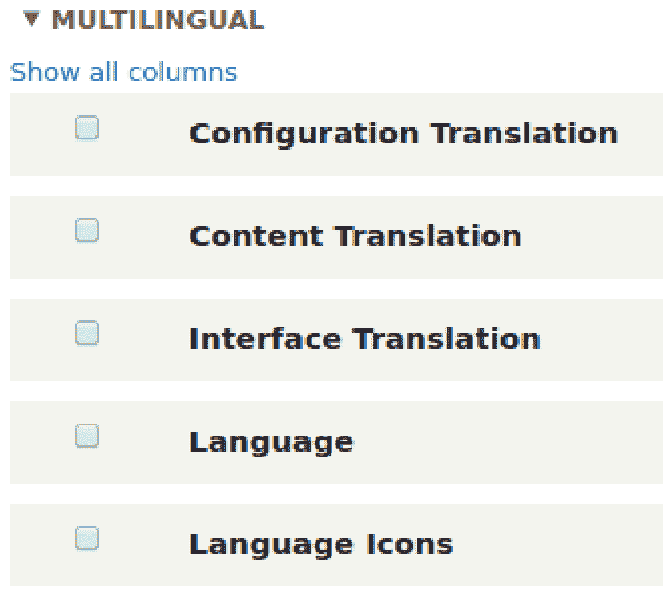
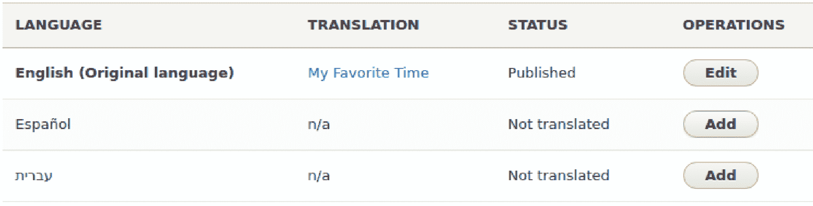
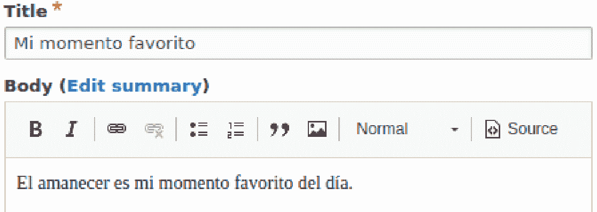
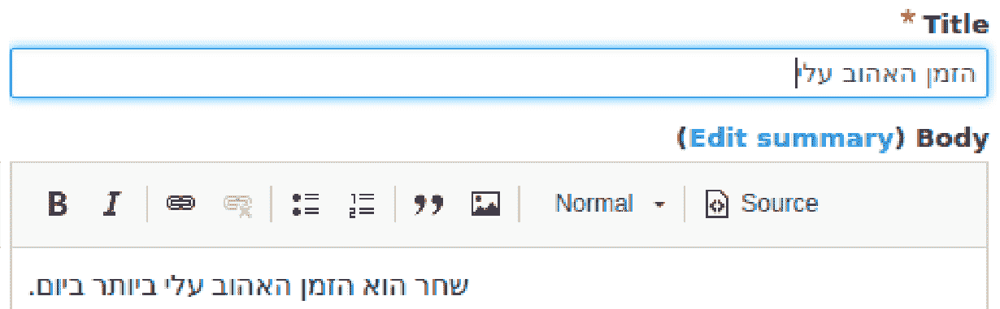
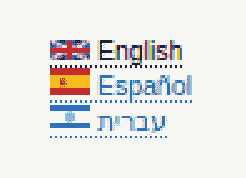
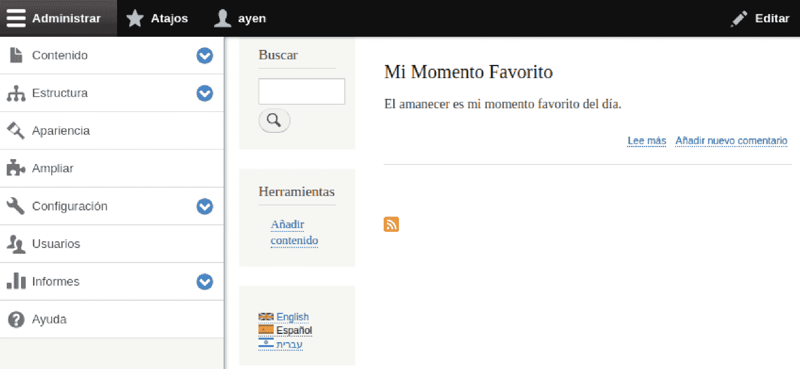
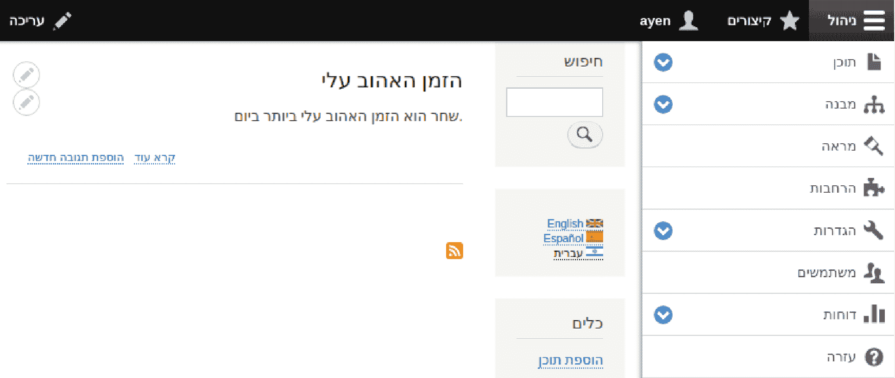

# 第六章：拓展全球读者群

在上一章中，我们学习了如何扩展 Drupal 的功能和特性。在本章中，我们将探讨如何扩大我们的读者群。

互联网让世界变得更小。你可能会假设你的用户都是国内的，然后惊讶地发现他们中的一些人远在半个世界之外。然后，经过考虑，你可能会意识到，由于世界上大多数人都居住在你自己的国家之外，全球读者群可以让你的内容接触到更多的人。

然而，有一个复杂因素。许多这些用户——也许大多数——并不说同一种语言。你可以让读者的浏览器来翻译内容，但让我们说实话，像谷歌提供的即时翻译至少在直接、明确、字典认可的源文本方面是有问题的，但在口语和习语用法上更是如此。

我经常讲述一个前客户的经历，他希望他的英文网站的用户界面也能提供日语版本。该网站销售汽车零部件。网站所有者选择了低成本翻译，这很可能是使用了在线 AI 翻译。结果，销售额远低于预期。为什么？虽然翻译对菜单项如化油器和座椅来说很合适，但用于“车身”的术语实际上意味着“尸体”。哎呀！

如果全球市场对你的网站使用和成功的增加很重要，那么让那些精通两种语言以及类似风格的翻译人员来完成翻译是值得的。换句话说，使用英式英语来编写内容，而使用西班牙街头俚语，可能并不是你的意图。同样，以西班牙语为例，如果你的读者主要是拉丁美洲人，而翻译却是恰当的马德里西班牙语，这也不是你的意图。

因此，你决定让你的内容和 UI 由专业人士翻译。然后呢？你难道必须拥有两个网站来支持两种语言吗？

即为每个语言创建独立的菜单和内容？不。Drupal 已经为你解决了这个问题，我们将在本章中详细介绍它是如何做到这一点的：

+   如何声明额外的语言

+   如何执行 UI 翻译

+   输入内容翻译

+   允许用户选择首选语言

当 Drupal 安装时，安装程序会为网站选择一个默认语言。在大多数情况下，这种语言是英语。如果我们的目标市场中有其他语言被使用呢？如果我们的国家有不止一种官方语言，或者有非官方语言，或者英语不是其中之一怎么办？网站可以被配置为支持额外的语言，这就是我们必须做的，以便能够利用国际化。要开始，请导航到“扩展”页面（`/admin/modules`）。

滚动到页面底部，你会找到多语言部分：

这些模块都是 Drupal 核心的一部分，在核心中，并且具有与国际化相关的不同目的：

+   ***配置*** *翻译***：用于翻译配置设置，如视图、站点名称、菜单和块

+   内容翻译：用于翻译内容，如节点、分类术语和自定义块

+   界面翻译：用于翻译注册表单、内容提交表单和管理界面

+   语言：用于声明可用于翻译的额外语言

+   语言图标：用于在切换语言时提供代表语言的旗帜

# 声明额外语言

首先，我们需要启用语言模块。勾选其复选框并点击页面底部的“*安装*”按钮。

为了声明额外的语言，我们需要执行以下操作：

1.  通过勾选复选框并点击页面底部的“*安装*”按钮来启用语言模块。

1.  现在，当你访问配置页面（`/admin/config`）时，你将找到一个区域和语言部分。要开始配置，请点击“内容语言”。

1.  检查内容，你会注意到将出现一个配置表单，列出每种内容类型。由于我们只对文章感兴趣，使用相同的默认语言就足够了。

1.  打勾以将内容类型标记为可翻译。

1.  将出现一个字段列表，这些字段将属于文章。选择所有可用的字段。

1.  之后，勾选复选框以允许在创建和点击“保存配置”时选择该语言。

在撰写本书时的 Drupal 当前版本中，元字段也应选择为可翻译。原因是如果未选择，在尝试保存时可能会出现错误，指出“*不可翻译的字段只能在更新原始语言时更改。*这似乎是一个错误，因为会更改的字段，如创建或更新时间戳，是不可翻译的。这意味着就翻译系统而言，它们不应有新值。

1.  返回到“*配置*”页面，这次我们将选择“*语言*”。请注意，英语已被配置为默认站点语言。

1.  点击“+添加语言”。将出现一个包含大量语言列表的选项框。对于我的网站，其中一种语言将是**西班牙语**，因此我将选择它并点击添加。现在已添加西班牙语，尽管英语仍然是默认语言。

1.  点击“编辑”链接，将西班牙语的名称更改为“Español”。对我来说，对于将要使用该语言的人来说，用其自身语言显示语言名称更有意义。他们甚至可能不知道我们用英语如何称呼他们的语言。

让我们再添加一个。这次，我将选择**希伯来语**。一旦添加，点击编辑链接。您将在语言定义中看到*从右到左*被选中，因为希伯来语是按照这个方向书写的。我将编辑它并翻译其名称，输入“עברית”。

声明语言的使用就这么多。现在，让我们使用它们并创建一些多语言内容。

# 翻译内容

在本节中，我们将创建一篇简短的新文章作为示例。导航到`/node/create/article`。对于我的标题，我将输入**我最喜欢的时刻**。对于正文，我输入了**黎明是我一天中最喜欢的时刻**。请注意，在*正文文本*字段下方有一个语言选择器。由于它默认为**英语**，我将保持不变并保存我的文章。如果您仍然启用了内容审核，别忘了将您的文章保存为**已发布**而不是**草稿**。

为了提供内容翻译，我们需要启用*内容翻译*。让我们导航到*扩展*（`/admin/modules`）并执行此操作。

启用内容翻译后，我们有两种开始翻译的方式：在查看内容时，现在将出现在查看、编辑和删除标签旁边的*翻译*标签，或者，通过管理员内容页面，在每次操作选择中，选择*翻译*选项，即`/admin/content`。使用任一方式进入您文章的翻译列表。

我的翻译列表看起来是这样的：

每个内容项都将对应每个配置的语言的行。状态列标识内容是否已翻译成该语言。如果是，将有一个编辑按钮。如果不是，将有一个添加按钮。我将在西班牙语翻译的行中点击添加。

点击后，将出现熟悉的编辑节点表单。实际上，它将每个字段的内容预先填写。您可能会认为有什么不对劲，因为不应该有这个语言的翻译，但这里却是内容而不是空字段，而且不是正确的语言。不要慌张！内容应该存在，以便您可以看到实际需要翻译的内容，而不是试图记住。它将以默认语言显示。我将翻译标题和正文文本。我的表单现在将看起来如下面的截图所示。一旦您的翻译内容看起来准备好了，请点击*保存（所有翻译）*按钮：

保存了这个翻译后，我的内容翻译列表现在显示西班牙语，其翻译标题已发布。接下来，我将创建一个希伯来语翻译并保存它。内容编辑表单看起来不同，因为对于从右到左的语言，文本字段出现在右侧，而元数据字段出现在左侧：

就这样！内容现在可用三种语言（在下一节中，我们将讨论用户如何访问它们）。

这在幕后是如何工作的？当 Drupal 在数据库中存储字段信息时，用于查找该信息的索引的一部分是引用语言的代码。当你创建内容时，最初，会分配一个节点 ID——一个整数值。无论你创建多少语言翻译，节点 ID 都保持不变。因此，英文版本的索引可能包括代表英语的代码`en`，代表西班牙语的`es`，以及代表希伯来语的`he`。

您可能会想知道，用户如何选择所需的语言？这正是我们将要讨论的下一个问题！

# 用户语言选择

能够提供多种语言的内容是很好的，但前提是网站访客能够利用它。Drupal 通过语言切换器使这变得简单。

我们需要启用另一个模块。导航到“扩展”（`/admin/modules`）并启用“语言图标”模块。Drupal 会通知您此模块依赖于“界面翻译”模块，并询问您是否希望同时启用这两个模块。继续操作。

“语言图标”模块为每种语言提供旗帜图标。它是通过一个需要在页面上某处放置的块来实现的。让我们这么做。

1.  导航到“结构”|“块布局”（`/admin/structure/block`）。您需要选择屏幕上的一个区域，以便语言切换器块出现，例如“页眉”或“侧边栏第一”。我选择了后者。

1.  点击您选择的区域旁边的“放置块”按钮。滚动到“语言切换器”，并点击其行中的“放置块”按钮。将出现一个配置屏幕。

1.  您可以将“标题”保留为**语言切换器**。

1.  取消选中下面的“显示标题”框；图标将无需显示块标题就能自行说明。

1.  垂直选项卡允许对这一块进行限制。可以使用“语言”选项卡仅提供配置语言的一部分。

1.  在“内容类型”选项卡中，可以限制翻译将选择的内容类型。我们不需要设置任何限制。

1.  如果我们只想将“语言切换器”限制在主页上，在“页面”选项卡上，我们可以在“页面”文本框中输入`<front>`。

1.  点击“保存块”按钮并导航到主页。

在我的网站上，我现在有一个看起来如下截图所示的块。您的将根据您选择的语言（们）而有所不同：

通过点击其中一个链接，网站访客可以选择接收该语言的翻译内容。所选语言不可用的内容将不会显示。

# 翻译用户界面

现在，我们已经知道如何提供翻译内容，但关于页面的其他部分，比如菜单呢？像“联系”这样的链接对不说法语的人来说意义不大。幸运的是，Drupal 为我们提供了翻译 UI 的手段。

我们已经启用了*界面翻译*模块。我们只需要配置它。导航到*配置*（`/admin/config`），然后在*区域和语言*部分点击用户界面翻译链接。

到目前为止，提供翻译内容所需的操作相当简单。所以，你可能期待有一个按钮可以点击，将 UI 中的所有提示和菜单都翻译成中文。抱歉...这不可能发生。

配置界面允许你为 Drupal 在核心和模块界面中找到的每个字符串输入一个翻译字符串。你可以使用这个页面，以及许多、许多、许多其他页面来翻译每个字符串，或者你可以导出字符串列表，将所有翻译都输入到一个文件中，然后导入它。

这听起来像是一项繁重的工作，确实如此。所以，让我们看看如何轻松完成这项工作。什么？你以为我会说...不，我说的是没有按钮可以翻译界面，但有许多语言的现有翻译文件可供你下载并导入。

1.  导航到[`localize.drupal.org/download`](https://localize.drupal.org/download)。在这里，你可以找到可用的 UI 翻译文件列表。在我的情况下，我将下载西班牙语和希伯来语的 Drupal 8 版本文件。为所选语言做同样的事情。这些文件的好处是它们是可编辑的，所以当你需要新的字符串时，比如当你创建自定义菜单链接时，你可以修改字符串或添加自己的字符串。

1.  接下来，在*用户界面翻译*页面，点击页面顶部的*导入*标签页。

1.  浏览并选择你下载的翻译文件

1.  从*语言*下拉菜单中选择适用的语言

1.  点击*导入*。

我已经为这两种语言都做了这件事，结果可以在下面的屏幕截图里看到，它展示了使用*语言切换器*块时主页的每个版本。

以下截图是西班牙语的：

以下截图版本是希伯来语，这是一个从右到左（RTL）语言的示例：

这肯定比手动翻译每个字符串要容易得多！

# 摘要

在本章中，我们学习了如何使用 Drupal 的翻译功能：配置附加语言、提供内容翻译、添加供网站访客切换语言的图标，以及导入用户界面翻译。

在下一章中，你将学习如何使用订阅源导入内容，并将你的内容提供给其他网站。
