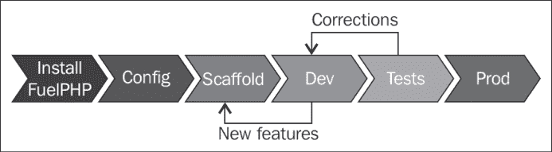
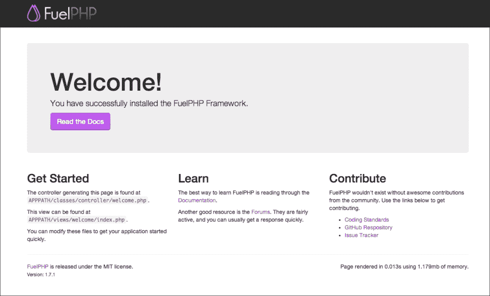
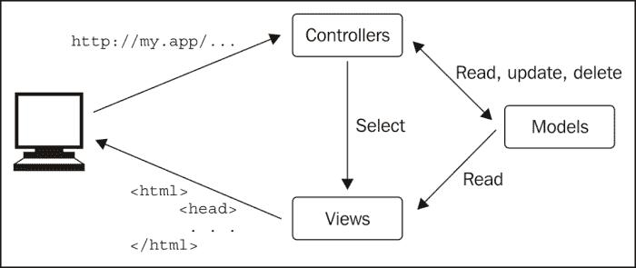
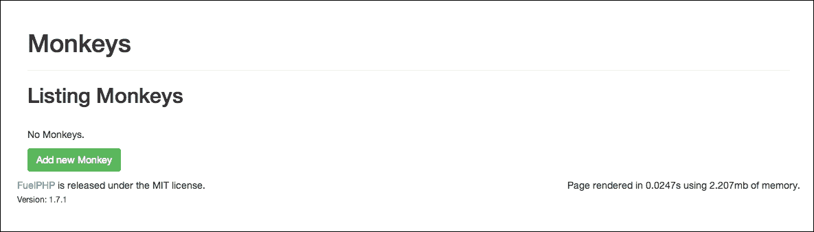
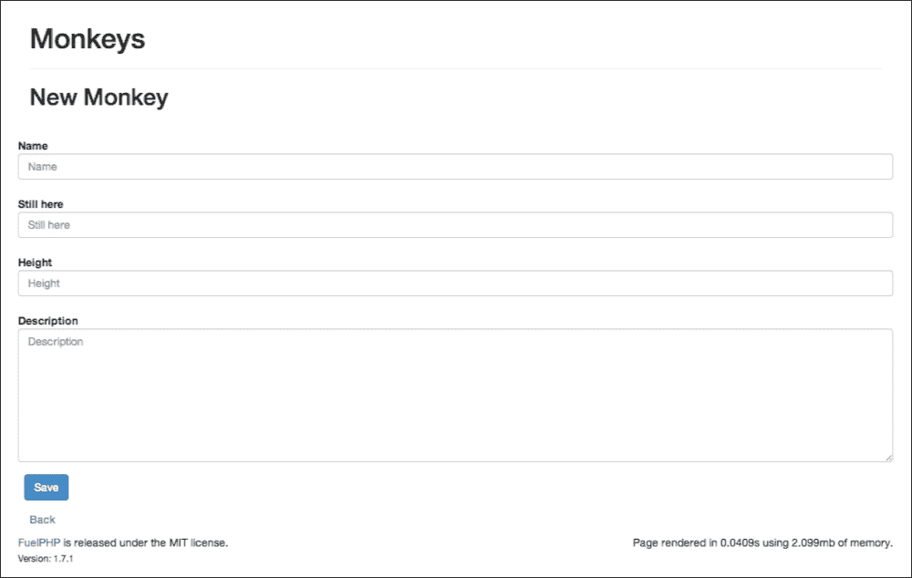
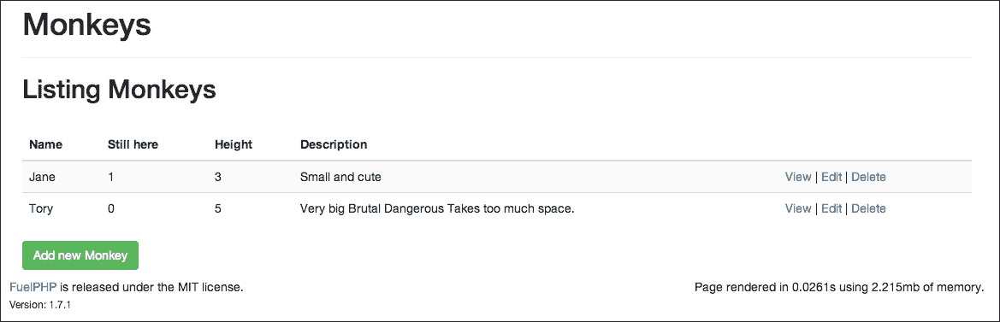
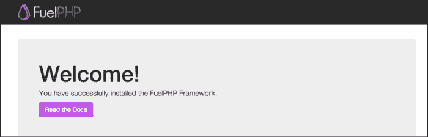
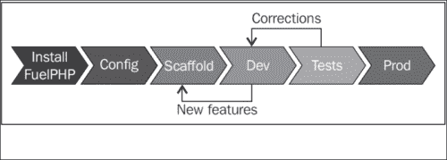

# 第一章。构建您的第一个 FuelPHP 应用程序

在整本书中，我们将使用**FuelPHP**框架构建不同类型的项目。本章的目标是让您尽快熟悉框架的基本知识并创建您的第一个项目。在本章中，我们不会创建任何特别的东西，并且代码量将非常少，但我们将从安装 FuelPHP 到在生产服务器上发布您的项目的过程进行讲解。您将学习其他项目所需的基本知识。

到本章结束时，您应该了解以下内容：

+   FuelPHP 应用程序的常见开发流程

+   如何安装 FuelPHP（最新版本或特定版本）

+   FuelPHP 的文件系统层次结构

+   配置 Apache 以访问您的应用程序的两种不同方式

+   如何配置 FuelPHP 以连接到数据库

+   oil 命令行及其如何用于构建您的应用程序的脚手架

+   应用程序如何响应用户请求的 URL

+   什么是 FuelPHP 模板

+   如何将您的项目发布到主机

由于本书面向中级开发者，我们假设您已经在系统上安装了 Apache 和 MySQL。一些关于 Git 和 Composer 的先验知识是一个额外的优势，因为您可能需要它们，但即使您不熟悉这些工具，在这本书中您也应该能够顺利。然而，对于需要多个开发者协作的高级应用程序，熟练掌握它们是非常推荐的。

在本章中，我们将从安装 FuelPHP 框架开始，直到拥有一个功能性的——尽管有限的——网络应用程序。由于我们的目标是尽快介绍框架并创建一个示例应用程序，因此我们不会涉及诸如 ORM 等重要主题，这些将在第二章*构建待办事项列表应用程序*中介绍。

# 关于 FuelPHP

丹·霍里根在 2010 年底启动了 FuelPHP 框架，后来菲尔·斯特林、杰尔默·施吕德、哈罗·韦顿、弗兰克·德·容格、史蒂夫·韦斯特和马克·萨吉-卡扎尔加入了进来。第一个稳定版本于 2011 年 7 月 31 日发布，本书基于 FuelPHP 1.7.2，这是撰写本书时的最新稳定版本。拥有超过 300 位贡献者，其社区庞大且活跃。

核心团队目前正在开发 FuelPHP 的第二个版本；已经发布了几个 alpha 版本。

如果您想了解更多关于 FuelPHP 团队和框架哲学的信息，我建议您阅读官方网站上的**关于 FuelPHP**部分：

[`fuelphp.com/about`](http://fuelphp.com/about)

您可以在其官方博客上阅读有关框架的最新消息：

[`fuelphp.com/blogs`](http://fuelphp.com/blogs)

官方文档可以在以下网址找到：[`fuelphp.com/docs/`](http://fuelphp.com/docs/)

如果您对 FuelPHP 有任何疑问或遇到任何问题，您可以在官方论坛([`fuelphp.com/forums/`](http://fuelphp.com/forums/))上搜索并开始新的讨论，如果您找不到任何答案。一般来说，官方网站([`fuelphp.com`](http://fuelphp.com))是一个极好的资源。

# FuelPHP 应用程序的开发过程

FuelPHP 应用程序的开发过程通常包含以下图像中显示的步骤：



+   **安装 FuelPHP**: 由于我们正在使用这个框架，这一步非常明显。

+   **Config** (**配置**): 在开始时，您通常需要指定如何连接到数据库以及您将使用哪个包。稍后，您可能还需要创建和使用自己的配置文件来提高您应用程序的可维护性。

+   **Scaffold**: FuelPHP 的命令行工具允许您轻松生成可用的代码文件。这一步不是必需的，但在这本书中，我们经常会使用这一功能，因为它确实能加快您应用程序的实现速度。

+   **Dev** (**开发**): 这就是您作为开发者介入的地方。您将生成的代码定制为得到您想要的确切结果。当您想要添加新功能（例如，一个新的模型）时，您将回到 scaffold 步骤。

+   **测试**: 如果您想要大型应用程序保持可维护性，功能测试和单元测试非常重要。当发现错误时，您将回到开发步骤以修复它们。与其他步骤不同，为了简洁起见，我们不会在本章中讨论这个主题。它将在第五章 *构建您的 RESTful API* 中讨论。

+   **Prod** (**生产**): 在本地运行一个项目是件好事，但最终目标通常是将其发布到线上。我们将在本章末尾为您提供一些关于这一步骤的指导，但由于可用的托管服务种类繁多，我们不会深入细节。

为了明确起见，这是一个非常通用的指南，当然，步骤的顺序并不是固定的。例如，使用测试驱动开发过程的开发者可以将第四步和第五步合并，或者添加一个预生产步骤。开发过程应仅取决于每个开发者和机构的标准。

# 安装环境

FuelPHP 框架需要以下三个组件：

+   **Web 服务器**: 最常见的解决方案是 Apache

+   **PHP 解释器**: 5.3.3 版本或更高

+   **数据库**: 我们将使用 MySQL

FuelPHP 在 **Unix-like** 和 **Windows** 操作系统上运行，但这些组件的安装和配置过程将取决于所使用的操作系统。在接下来的章节中，我们将提供一些指导，帮助你开始，如果你不习惯安装你的开发环境。请注意，这些是非常通用的指南，所以你可能需要在网上搜索补充信息。关于这个主题有无数的资源。

## Windows

一个完整且非常流行的解决方案是安装 **WAMP**。这将安装 Apache、MySQL 和 PHP，换句话说，你需要的一切来开始。它可以在 [`www.wampserver.com/en/`](http://www.wampserver.com/en/) 访问。

## Mac

PHP 和 Apache 通常安装在操作系统的最新版本上，所以你只需要安装 MySQL。为此，建议你阅读官方文档 [`dev.mysql.com/doc/refman/5.1/en/macosx-installation.html`](http://dev.mysql.com/doc/refman/5.1/en/macosx-installation.html)。

对于系统管理技能最少的人来说，一个非常方便的解决方案是安装 **MAMP**，这是 WAMP 的等价物，但适用于 Mac 操作系统。可以从 [`www.mamp.info/en/downloads/`](http://www.mamp.info/en/downloads/) 下载。

## Ubuntu

由于这是最受欢迎的 Linux 发行版，我们将我们的说明限制在 Ubuntu 上。

你可以通过执行以下命令行来安装一个完整的环境：

```php
# Apache, MySQL, PHP
sudo apt-get install lamp-server^

# PHPMyAdmin allows you to handle the administration of MySQL DB
sudo apt-get install phpmyadmin

# Curl is useful for doing web requests
sudo apt-get install curl libcurl3 libcurl3-dev php5-curl 

# Enabling the rewrite module as it is needed by FuelPHP
sudo a2enmod rewrite 

# Restarting Apache to apply the new configuration
sudo service apache2 restart

```

## 推荐的模块和扩展

Apache 的 **mod_rewrite** 模块和一些额外的 PHP 扩展也被推荐，但不是必需的：

[`fuelphp.com/docs/requirements.html`](http://fuelphp.com/docs/requirements.html)（可以通过访问 FuelPHP 网站并通过导航到 **DOCS** | **TABLE OF CONTENTS** | **FuelPHP** | **Basic** | **Requirements**）访问）

## 获取 FuelPHP 框架

在撰写本书时，有四种常见的下载 FuelPHP 的方法：

+   下载并解压在 FuelPHP 网站上可以找到的压缩包。

+   执行 FuelPHP 的快速命令行安装器。

+   使用 Composer 下载和安装 FuelPHP。

+   克隆 FuelPHP 的 GitHub 仓库，这稍微复杂一些，但允许你选择你想要安装的确切版本（甚至提交）。

这些方法在网站上的安装说明页面上有很好的文档记录 [`fuelphp.com/docs/installation/instructions.html`](http://fuelphp.com/docs/installation/instructions.html)（可以通过访问 FuelPHP 网站并通过导航到 **DOCS** | **TABLE OF CONTENTS** | **FuelPHP** | **Installation** | **Instructions**）访问）

## 安装 FuelPHP 1.7.2

FuelPHP 始终在发展，并且即使在这本书出版后也会继续发展。由于我们在本书中使用了 FuelPHP 1.7.2，您可能想要安装相同的版本以防止任何冲突。您可以通过下载合适的 ZIP 文件、克隆 GitHub 仓库的 1.7/master 分支或使用 Composer 来实现这一点。

### 下载合适的 ZIP 文件

这是最简单的方法。您应该可以通过请求以下 URL 来下载它：[`fuelphp.com/files/download/28`](http://fuelphp.com/files/download/28)。

或者，您可以在 FuelPHP 网站上通过导航到**DOCS** | **目录** | **FuelPHP** | **安装** | **下载**来访问所有重要的 FuelPHP 版本压缩包：[`fuelphp.com/docs/installation/download.html`](http://fuelphp.com/docs/installation/download.html)（通过 FuelPHP 网站导航到**DOCS** | **目录** | **FuelPHP** | **安装** | **下载**可以访问）

### 使用 Composer

首先，如果您还没有这样做，您需要安装**Composer**。您可以通过阅读官方网站了解如何操作：[`getcomposer.org/`](https://getcomposer.org/)。

主要操作系统的安装说明在**入门指南**中给出。请注意，您可以将 Composer 全局或本地安装。

从现在开始，我们将假设您已经全局安装了 Composer。如果 Composer 被安装到您的工作目录中，只要将`composer`替换为`php composer.phar`，我们的说明将同样适用。

为了具体安装 FuelPHP 1.7，您可以简单地执行以下命令行（将`TARGET`替换为您想要下载 FuelPHP 的目录）：

```php
composer create-project fuel/fuel:dev-1.7/master TARGET

```

## 更新 FuelPHP

如果您通过克隆 GitHub 仓库下载了 FuelPHP，或者您只是想更新 FuelPHP 及其依赖项，您必须在安装 FuelPHP 实例的位置输入以下命令行：

```php
php composer.phar update

```

如您所见，Composer 已在本地的 FuelPHP 根目录中安装。

## 安装目录和 Apache 配置

现在您已经知道了如何在给定目录中安装 FuelPHP，我们将向您介绍两种主要的方法，您可以在环境中集成此框架。

### 最简单的方法

假设您已经激活了 Apache 模块的**mod_rewrite**，最简单的方法是在您的 Web 服务器的根目录中安装 FuelPHP（通常在 Linux 系统上的`/var/www`目录）。如果您在根目录的`DIR`目录（`/var/www/DIR`）中安装 FuelPHP，您将能够通过以下 URL 访问您的项目：

`http://localhost/DIR/public/`

然而，请注意，FuelPHP 尚未实现支持此功能，如果您以这种方式在生产服务器上发布项目，将会引入您必须处理的安全问题。在这种情况下，建议您使用我们将在下一节中解释的第二种方法，尽管，例如，如果您计划使用共享主机来发布项目，您可能没有选择。关于此问题的完整和最新文档可以在 FuelPHP 安装说明页面[`fuelphp.com/docs/installation/instructions.html`](http://fuelphp.com/docs/installation/instructions.html)（可以通过导航到 FuelPHP 网站上的**DOCS** | **目录** | **FuelPHP** | **安装** | **说明**）找到。

### 通过设置虚拟主机

另一种方法是创建一个虚拟主机来访问您的应用程序。您需要一些 Apache 和系统管理的技能，但好处是它更安全，您将能够选择您的工作目录。您需要更改两个文件：

+   您的 Apache 虚拟主机文件，以便将虚拟主机链接到您的应用程序

+   您的系统主机文件，以便将所需的 URL 重定向到您的虚拟主机

在这两种情况下，文件的存储位置将取决于您使用的操作系统和服务器环境；因此，您将不得不自己找出它们的位置（如果您使用的是常见的配置，您不会在您首选的搜索引擎上找到任何问题）。

在以下示例中，我们将设置您的系统，以便在本地环境中请求`my.app` URL 时调用您的应用程序（推荐使用*nix 系统）。

让我们先编辑虚拟主机文件。在末尾添加以下代码：

```php
<VirtualHost *:80>
    ServerName my.app
    DocumentRoot YOUR_APP_PATH/public
    SetEnv FUEL_ENV "development"
    <Directory YOUR_APP_PATH/public>
        DirectoryIndex index.php
        AllowOverride All
        Order allow,deny
        Allow from all
    </Directory>
</VirtualHost>
```

然后，打开您的系统主机文件，并在末尾添加以下行：

```php
127.0.0.1 my.app
```

根据您的环境，您可能需要在之后重启 Apache。现在您可以通过`http://my.app/`访问您的网站。



恭喜！您已成功安装 FuelPHP 框架。欢迎页面显示了一些推荐的继续项目的方向。

# FuelPHP 基础知识

现在我们已经安装了一个 FuelPHP 的工作版本，让我们从非常基础的水平分析一下框架是如何工作的。我们不会在这里深入细节；目的是只了解使用框架所需的信息。在本节中，建议您跟随并检查我们关于您已安装实例的解释；不要犹豫去探索文件和文件夹，这将使我们在开始项目的实现时感到更加舒适。在本节中，我们将探讨以下内容：

+   FuelPHP 的文件系统层次结构

+   MVC、HMVC 及其在 FuelPHP 中的工作原理

+   Oil 工具

## FuelPHP 的文件系统层次结构

让我们深入了解我们已安装 FuelPHP 的目录。你可能想使用文件浏览器来跟随。由于本书正在编写中，FuelPHP 的当前版本具有以下目录层次结构：

+   `/``docs`: 包含框架文档的 HTML 版本

+   `/``fuel`，其中包含：

    +   `/``fuel/app`: 与你的应用程序相关的所有内容。你将大部分时间在这里工作。我们将在即将到来的*应用程序目录*部分中查看此目录。

    +   `/``fuel/core`: 核心类和配置。你不应该更改其中的任何内容，除非当然你想为 FuelPHP 核心做出贡献。

    +   `/``fuel/packages`: 包是核心扩展，它们是包含可重用类和配置文件的包。使用 FuelPHP 默认配置，这是你可以安装包的唯一目录（包括你自己的以及来自外部来源的）。注意，已经有五个已安装的包。我们将在本书中使用它们中的每一个。

    +   `/``vendor`: 此目录包含通常不是 FuelPHP 特定的第三方包和库。

+   `/``public`: 此目录可供外部访客访问。你希望在这里放置公开可用的文件，例如 CSS 或 JS 文件。

### 应用程序目录

如前所述，应用程序目录是你将大部分时间工作的地方。因此，你应该熟悉其层次结构，如下所示：

+   `/``cache`: 此目录用于存储提高应用程序性能的缓存文件。

+   `/``classes`: 供你的应用程序使用的类：

    +   `/``classes/controller`: 你必须实现你的控制器的地方（参见*MVC, HMVC 以及如何在 FuelPHP 上工作*部分）

    +   `/``classes/model`: 你必须实现你的模型的地方（参见*MVC, HMVC 以及如何在 FuelPHP 上工作*部分）

    +   `/``classes/presenter`: 你必须实现你的演示者（参见*MVC, HMVC 以及如何在 FuelPHP 上工作*部分）。

+   `/``config`: 每个配置文件。由于一些文件很重要，我们也将它们列出：

    +   `/``config/config.php`: 定义重要的 FuelPHP 配置项，例如激活的包或安全设置。

    +   `/``config/db.php`: 定义数据库连接信息。

    +   `/``config/routes.php`: 定义应用程序的路由（我们将在本章后面讨论它们）。

    +   `/``config/development`，`config/production`，`config/staging`，`config/test`: `config/ENV`目录中的所有配置文件（`ENV`是当前环境）与`config`文件夹中的文件合并。例如，如果 FuelPHP 环境设置为`development`（默认情况下是这样），则`config/development/db.php`文件将递归地与`config/db.php`文件合并。具体来说，这意味着在`config/ENV/db.php`文件中定义的配置项将覆盖`config/db.php`文件中的配置项。我们将在*油工具和油控制台*部分通过一个示例来说明这一点。

+   `/``lang`: 包含翻译文件。

+   /`logs`：包含日志文件。日志文件路径取决于其写入的日期。例如，如果您在 2015 年 7 月 1 日记录一条消息，它将被保存在 `logs/2015/07/01.php` 中的文件中。

+   /`migrations`：包含迁移文件，这些文件允许您以结构化的方式轻松更改您的数据库。例如，如果有很多人在同一个项目上工作，或者有多个相同项目的实例（开发/生产），它们使数据库更改变得更容易。我们将在本书中经常使用它们。

+   /`modules`：包含您的应用程序的模块。每个模块都可以描述为一组可以响应请求并易于在其他项目中重用的代码。我们将在 第三章，*Building a Blog Application* 中为博客项目创建一个模块。

+   /`tasks`：包含任务文件，这些是可以通过命令行执行（例如，用于 cron 作业）的类。

+   /`tests`：包含测试文件，这些文件可以用来自动测试您的应用程序。我们将在 第五章，*Building Your Own RESTful API* 中处理它们，以测试我们的应用程序。

+   /`tmp`：包含临时文件。

+   /`vendor`：此目录仅包含由您的应用程序使用的第三方库和包。

+   /`views`：包含您的应用程序使用的视图文件（请参阅 *MVC, HMVC, and how it works on FuelPHP* 部分）。

### 包含文件

`fuel/packages` 目录包含五个默认包，当激活时，可以为 FuelPHP 添加有趣的功能：

+   `auth` 包提供了一个用于用户身份验证的标准接口。我们将在 第五章，*Building Your Own RESTful API* 中使用此包。

+   `email` 包提供了一个使用不同驱动程序发送电子邮件的接口。我们将在 第三章，*Building a Blog Application* 中使用此包。

+   `oil` 包允许您通过生成代码文件、启动测试和任务或提供 CLI PHP 控制台来加速您应用程序的实现。我们将在这个包的所有章节中使用它，并在 *The oil utility and the oil console* 部分中探索其功能。

+   `orm`：此包是 FuelPHP 核心模型的改进；它允许它们执行复杂查询并定义它们之间的关系。我们将在 第二章，*Building a To-do List Application* 中使用此包。

+   `parser`：此包允许您的应用程序在常见的模板系统（如 Twig 或 Smarty）中渲染视图文件。我们将在 第五章，*Building Your Own RESTful API* 中使用此包。

我们还将在 第四章，*Creating and Using Packages* 中创建我们自己的包。

### 类名、路径和编码标准

在 FuelPHP 中，有五个常量定义了最重要的目录的位置，如下所示：

+   **APPPATH**: 应用目录（`fuel/app`）

+   **COREPATH**: 核心目录（`fuel/core`）

+   **PKGPATH**: 包含目录（`fuel/packages`）

+   **DOCROOT**: 公共目录（`public`）

+   **VENDORPATH**: 供应商目录（`fuel/vendor`）

建议您阅读有关这些常量的官方文档，网址为 [`fuelphp.com/docs/general/constants.html`](http://fuelphp.com/docs/general/constants.html)（可以通过导航到 FuelPHP 网站上的**DOCS** | **目录** | **FuelPHP** | **通用** | **常量**来访问）。

请记住，在本书中，我们经常会使用这些常量来缩短文件路径。

一个有趣的观点是，FuelPHP 允许您非常容易地更改文件夹结构：例如，您可以在 `public/index.php` 文件中更改我们刚刚介绍的常量的值，或者您可以通过更改 `APPPATH/config/config.php` 配置文件中的 `module_paths` 键来更改 FuelPHP 将加载模块的目录。

您可能也注意到了，类名与它们自己的路径相关，如下所示：

+   在应用目录中，`classes/controller/welcome.php` 类被命名为 `Controller_Welcome`

+   `classes/model/welcome.php` 类被命名为 `Model_Welcome`

+   您可以注意到在 `fuel/core` 目录中类的命名方式相同

这个结果并非偶然得到；FuelPHP 默认遵循 PSR-0 标准。建议您阅读有关此标准的官方文档，网址为 [`www.php-fig.org/psr/psr-0/`](http://www.php-fig.org/psr/psr-0/)。

## MVC、HMVC 以及它们在 FuelPHP 中的工作原理

现在我们将探讨 FuelPHP 框架的一个主要方面——MVC 和 HMVC 软件架构模式。

### 什么是 MVC？

**模型-视图-控制器**（**MVC**）是一种软件架构模式，它指出代码应该分为三个类别：模型、视图和控制器。

对于不熟悉的人来说，我们可以通过以下示例来说明：



假设一个用户试图访问您的网站。以下是他/她可能请求的一些 URL：

`http://my.app/`

`http://my.app/welcome/`

`http://my.app/welcome/hello`

根据请求的 URL，您的网站通常需要返回一些 HTML 代码，有时还需要更新数据库，例如当您想要保存用户的评论时。

返回的 HTML 代码是由视图生成的，因为这是浏览器接收到的，并且用户间接看到的内容。

数据库通常通过模型进行更新。具体来说，我们不是通过执行原始 SQL 代码来访问和更新数据库，而是最佳实践是使用类和实例来这样做。每个类代表一个与特定表相关的模型：例如，`car`模型会访问`cars`表。每个类的实例是一个与表中特定行链接的模型实例：例如，你的汽车信息可以保存为一个`car`实例，该实例将与`cars`表中的特定行相关联。由于我们使用类而不是原始 SQL 代码，框架已经实现了频繁需要的功能，例如读取、创建、保存或删除模型实例。另一个优点是，由于我们使用了打包和良好实现的访问数据库的方法，它可以防止我们在使用原始 SQL 请求数据库时可能创建的大多数意外安全漏洞。

控制器允许网站通过选择正确的视图来处理用户的请求并返回（响应），并在必要时通过模型更新数据库。控制器处理网站的特定部分：例如，`car`控制器将处理与汽车相关的一切。控制器通过动作细分，动作将处理特定的功能：例如，`car`控制器的`list`动作将返回一个汽车的列表。在实践中，控制器是类，动作是方法。

当用户请求一个 URL 时，框架将选择控制器中的一个动作来处理它。这些通常是通过约定选择的；例如，当请求`http://my.app/welcome/hello`时，框架将选择`welcome`控制器中的`hello`动作。有时，它们也可以通过一个路由配置文件来选择，该文件将 URL 与动作和控制器匹配。

视图有时需要访问模型；例如，当我们想要显示汽车列表时，我们需要访问`car`模型的实例。然而，视图不应更新模型或数据库；只有控制器和最好是模型应该这样做。

请注意，可以添加额外的代码组件作为辅助工具或演示者以简化开发过程，但如果你理解了这一部分，你就掌握了最重要的要点。

### 在 FuelPHP 中的工作原理

让我们通过测试我们新创建的网站来说明它是如何工作的。我们假设你的应用程序在以下 URL 上可用：

`http://my.app/`

#### 动作和控制器

如果你请求一个随机的 URL，你可能会得到一个 404 异常。例如：

`http://my.app/should_display_404`

但是，如果你请求以下 URL，你将显示与主页相同的页面：

`http://my.app/welcome/index`

如果你请求以下 URL，你将显示不同的页面：

`http://my.app/welcome/hello`

让我们先解释一下最后两个请求是如何工作的。你可以注意到，这两个 URL 在基本 URL 之后都包含 *welcome* 这个词。你还可以在文件名 `fuel/app/classes/controller/welcome.php` 中找到这个词；结果是 *welcome* 是一个控制器。现在，使用你喜欢的文本编辑器打开这个文件。然后你会读到以下内容：

```php
//...
class Controller_Welcome extends Controller
{
    //...
    public function action_index()
    {
        //...
    }

    //...
    public function action_hello()
    {
        //...
    }
    //...
}
```

你可以注意到 `action_index` 和 `action_hello` 方法。这些函数被称为动作。现在，正如你可能已经猜到的，当你请求 `http://my.app/welcome/index` 时，将调用 `action_index` 方法。更一般地说，如果你请求 `http://my.app/CONTROLLER/ACTION`，将调用 `CONTROLLER` 控制器的 `action_ACTION` 方法。让我们来测试一下。编辑 `action_index` 函数，在开始处添加一个简单的 echo 语句：

```php
public function action_index()
{
  echo 'Test 1 - Please never print anything inside an action';
  //...
}
```

现在，如果你请求 `http://my.app/welcome/index`，你将阅读网页开头的打印内容。尽管这是一种测试事物如何工作的简单方法，但永远不要在你的动作或控制器中打印任何内容。当你打印一条消息时，你已经在实现视图实体；因此，在控制器中打印内容会破坏 MVC 模式。

#### 视图

但然后页面是如何渲染的呢？让我们分析 `index` 动作中的唯一一行代码：

```php
public function action_index()
{
  return Response::forge(View::forge('welcome/index'));
}
```

`View::forge('welcome/index')` 返回一个由 `fuel/app/views/welcome/index.php` 视图文件生成的 `View` 对象。我们将在本章和本书中多次使用此函数，并将涵盖所有其参数，但你可以在 FuelPHP 网站上阅读其官方文档：[`fuelphp.com/docs/classes/view.html`](http://fuelphp.com/docs/classes/view.html)。

[`fuelphp.com/docs/classes/view.html#/method_forge`](http://fuelphp.com/docs/classes/view.html#/method_forge)。（可以通过在 FuelPHP 网站上导航到**DOCS** | **TABLE OF CONTENTS** | **Core** | **View**来访问）。

`Response::forge(View::forge('welcome/index'));` 返回一个由 `View` 对象创建的响应对象。额外的参数允许我们更改头部或页面状态。响应对象包含将被发送到浏览器所需的所有信息：头部和主体（通常是 HTML 代码）。建议你阅读 FuelPHP 网站上的官方文档[`fuelphp.com/docs/classes/response.html#method_forge`](http://fuelphp.com/docs/classes/response.html#method_forge)（可以通过在 FuelPHP 网站上导航到**DOCS** | **TABLE OF CONTENTS** | **Core** | **Response**来访问）。

由于视图是从 `fuel/app/views/welcome/index.php` 文件生成的，打开它以查看其内容。你可以注意到这与请求 URL 时显示的 HTML 代码相同。在 `<h1>Welcome!</h1>` 之后，添加 `<p>This is my first view change.</p>`。现在，如果你刷新浏览器，你将看到这条消息出现在 **Welcome!** 标题下。

#### 参数

可以向动作和视图指示参数。例如，将你的 `index` 动作替换为以下代码：

```php
public function action_index($name = 'user', $id = 0)
{
    return Response::forge(
        View::forge(
            'welcome/index',
            array(
                'name' => $name,
                'id' => $id,
            )
        )
    );
}
```

并且在`fuel/app/views/welcome/index.php`视图文件中，替换

```php
<h1>Welcome!</h1>
```

通过

```php
<h1>Welcome <?php echo ($name.' (id: '.$id.')'); ?>!</h1>
```

现在，如果你请求以下 URL：

`http://my.app/welcome/index`

标题将显示 **欢迎用户（id: 0）**！

如果你请求以下 URL：

`http://my.app/welcome/index/Jane`

标题将显示 **欢迎简妮（id: 0）**！

如果你请求以下 URL：

`http://my.app/welcome/index/Jane/34`

标题将显示 **欢迎简妮（id: 34）**！

你可能已经理解了，如果你请求以下 URL：

`http://my.app/CONTROLLER/ACTION/PARAM_1/PARAM_2/PARAM3`

`CONTROLLER`的`action_ACTION`方法将使用`PARAM_1`、`PARAM_2`和`PARAM_3`参数被调用。如果 URL 中定义的参数少于方法中所需的参数，要么，如果已定义，参数将采用其默认值（如前所述），要么，如果没有定义默认值，它将触发 404 错误。

你可以注意到我们替换了

```php
View::forge('welcome/index')
```

通过

```php
View::forge('welcome/index', array(
        'name' => $name,
        'id' => $id,
    )
)
```

视图参数是通过`\View::forge`的第二个参数以关联数组的形式发送的。在这里，关联数组有两个键，`name`和`id`，它们的值可以通过视图文件中的`$name`和`$id`变量访问。

以更通用的方式，如果你调用以下：

```php
View::forge('YOUR_VIEW', array(
        'param_1' => 1,
        'param_2' => 2,
    )
)
```

当视图文件被执行时，参数将通过`$param_1`和`$param_2`变量可用。

#### 路由

尽管我们之前观察到的解释了标准情况是如何操作的

`http://my.app/CONTROLLER/ACTION`

尽管我们没有解释为什么以下两个 URL 返回内容，尽管找不到相关的控制器和动作：

`http://my.app/`

`http://my.app/should_display_404`

为了理解为什么我们必须打开`fuel/app/config/routes.php`配置文件：

```php
<?php
return array(
  '_root_'  => 'welcome/index',  // The default route
  '_404_'   => 'welcome/404',    // The main 404 route

  'hello(/:name)?' => array('welcome/hello', 'name' => 'hello'),
);
```

你首先可以注意到以下两个特殊键：

+   `_root_`：这定义了在请求网站根 URL 时应调用哪个控制器和动作。请注意，值是`welcome/index`，你现在可以理解为什么`http://my.app`和`http://my.app/welcome/index`返回相同的内容。

+   `_404_`：这定义了在抛出 404 错误时应调用哪个控制器和动作。

除了特殊键之外，你可以定义你想要处理的自定义 URL。让我们在数组的末尾添加一个简单的示例：

```php
'my/welcome/page'  => 'welcome/index',
```

现在，如果你请求以下 URL：

`http://my.app/my/welcome/page`

它将显示与以下 URL 相同的内容：

`http://my.app/welcome/index`

你可能已经注意到还有一个已经定义好的键：`hello(/:name)?`。路由系统相当先进，要完全理解它，建议查看官方文档：

[`fuelphp.com/docs/general/routing.html`](http://fuelphp.com/docs/general/routing.html)（可以通过通过 FuelPHP 网站导航到**DOCS** | **目录** | **FuelPHP** | **路由**来访问）

#### 演示者

你可能已经注意到，`hello`动作没有使用`View`类来显示其内容，而是使用了`Presenter`类：

```php
public function action_hello()
{
   return Response::forge(Presenter::forge('welcome/hello'));
}
```

让我们分析一下这种情况中发生了什么。首先，你可以注意到，对于视图来说，存在一个视图文件，其路径为`fuel/app/views/welcome/hello.php`。如果你打开这个文件，你会看到代码与请求 URL `http://my.app/welcome/hello`时显示的代码相同，除了一个微小的差异。你可以找到以下代码：

```php
<h1>Hello, <?php echo $name; ?>!
```

在一个普通视图中，我们通常需要定义`name`参数，但在这里我们没有定义。尽管如此，当显示网页时，这个参数似乎有一个已定义的值（它显示**Hello, World!**）。那么它在哪里定义的呢？

再深入一点，你可以在`fuel/app/classes/presenter/welcome/hello.php`位置找到另一个文件。它包含以下内容：

```php
class Presenter_Welcome_Hello extends Presenter
{
    //...
    public function view()
    {
        $this->name = $this->request()->param('name', 'World');
    }
}
```

此文件包含一个`Presenter`类。在渲染视图之前会调用`view`函数，这就是设置`name`参数的地方。它试图从请求参数`name`中获取名称，但如果它未定义，则默认值为`World`。

如果你想知道如何更改此参数，请参考路由。例如，请求 URL `http://my.app/hello/Jane`。

那么有人可能会想知道`Presenter`类的作用，因为我们本可以将之前的代码改为更经典的视图和控制器方法。

让我们通过一个示例来展示它的实用性。假设你创建了一个内部网站，用于管理你公司的客户。每个客户都与一个客户类别相关联。因此，在你的创建、编辑和其他表单中，你显示一个客户类别选择列表。每次你显示完全相同的可选择的列表，尽管你通过不同的控制器和动作访问它。你可以想出三种解决方案：

+   你可以为你的选择列表创建一个经典视图，在每一个动作中加载客户类别列表，并将此列表传递给每个视图，直到你到达想要显示列表的位置。问题是这会导致大量代码重复。

+   你可以在视图中创建一个经典视图，并在其中加载客户列表。这样，你就不需要传递必要的参数。问题是这会打破 MVC 模式，因为模型和视图被混合在一起。

+   你可以创建一个`Presenter`类，在`Presenter`类中加载列表，在视图文件中使用它，并使用`Presenter::forge`显示视图文件。这种解决方案是最好的，因为它不混合视图和模型，但仍然限制了代码重复。

### 什么是 HMVC？

FuelPHP 是一个**分层模型-视图-控制器**（**HMVC**）框架，这意味着它允许你从你的应用程序中请求内部控制器。具体来说，以下代码：

```php
echo Request::forge('welcome/index')->execute();
```

将打印出以下 URL 返回的确切内容：

`http://my.app/welcome/index`

虽然我们建议你适度使用这个功能，但在你需要实现和显示多个网页上的小部件时，它可能很有用。

如果你想要了解更多关于这个模式的信息，建议你阅读以下资源：

[`en.wikipedia.org/wiki/Hierarchical_model-view-controller`](http://en.wikipedia.org/wiki/Hierarchical_model-view-controller)

[`stackoverflow.com/questions/2263416/what-is-the-hmvc-pattern`](http://stackoverflow.com/questions/2263416/what-is-the-hmvc-pattern)

## oil 工具和 oil 控制台

`oil` 工具是一个非常实用的命令行工具。作为 Ruby on Rails 的 `rails` 工具，oil 允许你做以下事情：

+   轻松生成代码文件：模型、控制器、迁移和整个脚手架

+   运行任务和迁移

+   轻松安装、更新或删除包

+   使用 PHPUnit 测试或实时控制台测试你的代码

+   甚至运行一个 PHP 内置的 web 服务器来托管你的 FuelPHP 应用程序（对于 PHP >= 5.4）

虽然我们将在本书中使用所有这些功能（除了最后一个），但我们建议你查看以下官方文档：

[`fuelphp.com/docs/packages/oil/intro.html`](http://fuelphp.com/docs/packages/oil/intro.html)（可以通过导航到 FuelPHP 网站的 **DOCS** | **目录** | **Oil** | **简介** 来访问）

在本节中，我们将使用 oil 控制台，这是如果你想测试你的网站，或者在这个例子中测试 FuelPHP 功能时，一个重要的工具。

首先，打开你的命令行工具，转到你的网站目录的根目录。然后，输入以下行：

```php
php oil console

```

### 小贴士

如果你使用像 WAMP 或 MAMP 这样的网络开发平台，建议你使用平台目录内的 PHP 可执行文件来启动 oil 工具（否则可能不起作用）。在我写这本书的时候，这个可执行文件位于 WAMP 的 `WAMP_DIRECTORY\bin\php\phpVERSION\php.exe`，MAMP 的 `MAMP_DIRECTORY/bin/php/phpVERSION/bin/php`（VERSION 取决于你安装的 PHP 版本，最好是使用文件浏览器自行检查这个目录）。

这将打开 oil 提供的命令行界面。当你按下 *Enter* 时，应该会看到类似以下的内容：

```php
Fuel 1.7.2 - PHP 5.4.24 (cli) (Jan 19 2014 21:18:21) [Darwin]
>>>

```

你现在可以输入任何 PHP 代码，它将被执行。让我们从一些简单的东西开始：

```php
>>> $a = 2
```

如果你按下 *Enter*，将不会打印任何内容，但 `$a` 变量将被设置为 `2`。现在，如果你想检查一个变量的值，只需输入其名称，然后按下 *Enter*：

```php
>>> $a
2
```

它也适用于更复杂的变量：

```php
>>> $a = array('a' => 'b', 'c' => 'd')
>>> $a
array (
  'a' => 'b',
  'c' => 'd',
)
```

但请注意，你可能会有困难显示复杂对象。

现在我们来测试一个 FuelPHP 功能。早些时候，在讨论 `app` 目录结构时，我们解释了 `fuel/app/config` 目录中的配置文件与 `fuel/app/config/ENV` 目录中具有相同文件名的文件合并，`ENV` 是 FuelPHP 的当前环境。我们现在将测试这种行为。

首先，让我们检查 FuelPHP 的当前环境：

```php
>>> Fuel::$env
development
```

环境应设置为 `development`。

现在，创建一个位于 `fuel/app/config/test.php` 的 PHP 文件，你将在其中编写以下内容：

```php
<?php
return array(
    'this_is_the_root_config_file' => true,
);
```

然后在 `fuel/app/config/development/test.php` 创建另一个 PHP 文件，并编写以下内容：

```php
<?php
return array(
    'this_is_the_dev_config_file' => true,
);
```

并在 `fuel/app/config/production/test.php` 添加一个额外的文件，你将在其中编写以下内容：

```php
<?php
return array(
    'this_is_the_prod_config_file' => true,
);
```

现在，如果你回到命令行界面，你可以通过编写以下内容来加载 `test` 配置文件：

```php
>>> $conf = Config::load('test', true)
```

建议你阅读 `Config::load` 的官方文档以获取更多信息：

[`fuelphp.com/docs/classes/config.html#/method_load`](http://fuelphp.com/docs/classes/config.html#/method_load)。（可以通过导航到 FuelPHP 网站的 **DOCS** | **TABLE OF CONTENTS** | **Core** | **Config** 来访问）

如前所述，返回的值将是 `fuel/app/config/test.php` 和 `fuel/app/config/development/test.php` 配置文件的混合：

```php
>>> $conf
array (
  'this_is_the_root_config_file' => true,
  'this_is_the_dev_config_file' => true,
)
```

如果我们将 FuelPHP 环境更改为 `production`：

```php
Fuel::$env = 'production'; // only do that for testing purposes
```

再次加载 `test` 配置文件：

```php
>>> Config::load('test', true, true)
array (
  'this_is_the_root_config_file' => true,
  'this_is_the_prod_config_file' => true,
)
```

合并将会使用 `production` 文件夹中的配置文件。

### 注意

你可能已经注意到，我们为 `Config::load` 添加了第三个参数。此参数允许你清除配置缓存。如果我们没有将其设置为 `true`，该方法将返回我们在 `development` 环境中加载的旧配置。

但是，当 `fuel/app/config/production/test.php` 和 `fuel/app/config/test.php` 配置文件包含相同的键时会发生什么？控制台可以为我们找到答案。

将 `fuel/app/config/test.php` 配置文件的内容更改为以下内容：

```php
<?php
return array(
    'complex_value' => array(
        'root' => true,
    ),
    'this_is_the_root_config_file' => true,
);
```

并将 `fuel/app/config/production/test.php` 配置文件的内容更改为以下内容：

```php
<?php
return array(
    'complex_value' => array(
        'prod' => true,
    ),
    'this_is_the_root_config_file' => false, 
    'this_is_the_prod_config_file' => true,
);
```

让我们现在按照以下方式重新加载 `test` 配置文件：

```php
>>> Config::load('test', true, true)
array (
  'complex_value' => 
  array (
    'root' => true,
    'prod' => true,
  ),
  'this_is_the_root_config_file' => false,
  'this_is_the_prod_config_file' => true,
)
```

分析前面两个配置文件是如何合并的很有趣：

+   两个配置文件共有的 `this_is_the_root_config_file` 键在两种情况下都与一个简单值相关联。在最终配置中，它是由生产文件中的值决定的。

+   在这两种情况下，`complex_value` 键都与一个数组相关联。这两个数组似乎在最终配置中被合并了。

这是因为配置文件不是通过 `array_merge` 原生 PHP 函数合并的，而是通过 `Arr::merge` FuelPHP 函数递归合并数组。建议你查看其官方文档，网址为 [`fuelphp.com/docs/classes/arr.html#/method_merge`](http://fuelphp.com/docs/classes/arr.html#/method_merge)（可以通过导航到 FuelPHP 网站的 **DOCS** | **TABLE OF CONTENTS** | **Core** | **Arr** 来访问）

现在应该很清楚，控制台是一个伟大的工具，它允许您测试您的应用程序。它也可以用作文档的绝佳补充，因为您可以在不更改应用程序中的任何文件的情况下尝试 FuelPHP 方法和它们的参数。

# 构建您的第一个应用程序

现在我们对 FuelPHP 框架有了快速的了解，让我们构建我们的第一个小型应用程序。

假设您是动物园管理员，您想跟踪您照顾的猴子。对于每只猴子，您想保存以下信息：

+   它的名字

+   如果它还在动物园里

+   它的高度

+   一个描述输入，您可以输入自定义信息

您想要一个非常简单的界面，具有以下五个主要功能：

+   您想创建一个新的猴子

+   您想编辑现有的文件

+   您想列出所有猴子

+   您想查看每个猴子的详细文件

+   您想从系统中删除猴子

前面的五个主要功能，在计算机应用程序中非常常见，是 **创建、读取、更新和删除** （**CRUD**） 基本操作的一部分。这是一个使用 oil 工具生成脚手架的完美示例。Oil 将快速为我们生成控制器、模型、视图和迁移来处理我们的猴子。然后，我们只需要对生成的代码进行精炼，并适应我们的需求。

## 数据库配置

由于我们将我们的猴子存储到 MySQL 数据库中，现在是时候配置 FuelPHP 以使用我们的本地数据库了。如果您打开 `fuel/app/config/db.php`，您将看到的是一个空数组，但正如我们在 *FuelPHP 基础知识* 部分所展示的，此配置文件会合并到 `fuel/app/config/ENV/db.php`，其中 `ENV` 是当前 FuelPHP 的环境，在这种情况下是 `development`。

因此，您应该打开 `fuel/app/config/development/db.php`：

```php
<?php
//...
return array(
  'default' => array(
    'connection'  => array(
      'dsn'        => 'mysql:host=localhost;dbname=fuel_dev',
      'username'   => 'root',
      'password'   => 'root',
    ),
  ),
);
```

这是生成的默认配置，您应该将其适应到您本地的配置中，特别是数据库名称（目前设置为 `fuel_dev`）、用户名和密码。您必须手动创建您项目的数据库。

## 脚手架

现在数据库配置已设置，我们将能够生成脚手架。我们将使用 oil 工具的 `generate` 功能。

打开命令行工具并转到您的网站根目录。要为新的模型生成脚手架，您需要输入以下行：

```php
php oil generate scaffold/crud MODEL ATTR_1:TYPE_1 ATTR_2:TYPE_2 ...

```

其中：

+   `MODEL` 是模型名称

+   `ATTR_1`, `ATTR_2`… 是模型的属性名称

+   `TYPE_1`, `TYPE_2`… 是属性类型

在我们的情况下，它应该是这样的：

```php
php oil generate scaffold/crud monkey name:string still_here:bool height:float description:text

```

在这里，我们告诉 oil 为具有以下属性的 `monkey` 模型生成脚手架：

+   `name`: 猴子的名字。其类型是字符串，相关的 MySQL 列类型将是 VARCHAR(255)。

+   `still_here`: 猴子是否仍然在设施中。其类型是布尔型，相关的 MySQL 列类型将是 TINYINT(1)。

+   `height`: 猴子的高度。其类型是浮点数，相关的 MySQL 列类型将是 FLOAT。

+   `description`：猴子的描述。其类型为文本，相关的 MySQL 列类型将是 TEXT。

你可以使用 oil generate 功能做更多的事情，例如生成模型、控制器、迁移、任务、包等。我们将在本书的后面部分看到一些这些内容，但建议你查看官方文档[`fuelphp.com/docs/packages/oil/generate.html`](http://fuelphp.com/docs/packages/oil/generate.html)（可以通过通过导航到 FuelPHP 网站的 **DOCS** | **目录** | **Oil** | **生成** 来访问）（它可以通过 FuelPHP 网站访问）

当你按下 *Enter* 键时，你会看到以下行出现：

```php
Creating migration: APPPATH/migrations/001_create_monkeys.php
Creating model: APPPATH/classes/model/monkey.php
Creating controller: APPPATH/classes/controller/monkey.php
Creating view: APPPATH/views/monkey/index.php
Creating view: APPPATH/views/monkey/view.php
Creating view: APPPATH/views/monkey/create.php
Creating view: APPPATH/views/monkey/edit.php
Creating view: APPPATH/views/monkey/_form.php
Creating view: APPPATH/views/template.php

```

Oil 为我们生成了九个文件，具体如下：

+   包含创建模型相关表所需所有信息的迁移文件

+   模型

+   一个控制器

+   五个视图文件和一个模板文件

我们将在下一节中更详细地查看这些文件。

### 备注

你可能已经注意到我们使用了 `scaffold/crud` 命令，如果你阅读了官方文档，我们只需输入 `scaffold`。这是因为可以生成两种类型的脚手架：`scaffold/crud`，它使用简单的模型，以及 `scaffold/orm` 别名 `scaffold`，它使用 `orm` 模型。由于使用 FuelPHP 的原生 ORM 不在本章的范围内，而且我们不需要使用复杂模型功能，如关系，所以我们选择了使用 `scaffold/crud`。

## 迁移

生成的文件之一是 `APPPATH/migrations/001_create_monkeys.php`。这是一个迁移文件，包含创建我们猴子表所需的所有信息。请注意，文件名结构为 `VER_NAME,` 其中 `VER` 是版本号，`NAME` 是迁移的名称。

如果你执行以下命令行：

```php
php oil refine migrate

```

所有尚未执行的迁移文件将从最老版本到最新版本（001、002、003 等）执行。一旦所有迁移文件都执行完毕，oil 将显示最新版本号。

执行后，如果你查看你的数据库，你会观察到创建了不止一个表：

+   `monkeys`：正如预期的那样，已经创建了一个表来处理你的猴子。请注意，表名是我们用于生成脚手的单词的复数形式；这种转换是通过使用 `Inflector::pluralize` 方法内部完成的。该表将包含指定的列（`name`、`still_here`），`id` 列，以及 `created_at` 和 `updated_at`。这些列存储对象创建和更新的时间，并且在每次生成模型时默认添加。可以通过使用 `--no-timestamp` 参数来不生成它们。

+   `迁移`：这个表是在你第一次执行迁移时自动创建的。它跟踪已执行的迁移。如果你查看其内容，你会看到它已经包含了一行；这就是你刚刚执行的迁移。你可以注意到，这一行不仅指明了迁移的名称，还指明了一个类型和一个名称。这是因为迁移文件可以放置在许多地方，如模块或包（参见第三章，*构建博客应用程序*）。

### 注意

需要注意的是，`迁移`表并不是 FuelPHP 跟踪已执行迁移的唯一位置。这些信息也存储在`fuel/app/config/ENV/migrations.php`中，其中`ENV`是 FuelPHP 的环境。如果你决定编辑`迁移`表，你可能还想编辑或删除此文件，因为它可能会阻止你的迁移执行。

oil 的`refine migrate`功能让你对迁移有更多的控制，而不仅仅是执行所有新的迁移。例如，你可以使用以下命令行回退到之前的版本：

```php
php oil refine migrate:down

```

或者使用以下命令行回退到指定版本：

```php
php oil refine migrate --version=3

```

或者甚至可以使用`--modules`或`--package`参数来选择你想要更新的模块或包。为了有一个完整的概述，建议你查看官方文档[`fuelphp.com/docs/general/migrations.html`](http://fuelphp.com/docs/general/migrations.html)（可以通过导航到 FuelPHP 网站上的**DOCS** | **目录** | **FuelPHP** | **迁移**来访问）。

但迁移文件是如何允许这样的复杂操作的？让我们打开位于`APPPATH/migrations/001_create_monkeys.php`的迁移文件来了解。你应该会看到以下内容：

```php
<?php

namespace Fuel\Migrations;

class Create_monkeys
{
    public function up()
    {
        \DBUtil::create_table('monkeys', array(
            'id' => array(
                'constraint' => 11,
                'type' => 'int',
                'auto_increment' => true,
                'unsigned' => true
            ),
            'name' => array(
                'constraint' => 255,
                'type' => 'varchar'
            ),
            'still_here' => array(
                'type' => 'bool'
            ),
            'height' => array(
                'type' => 'float'
            ),
            'description' => array(
                'type' => 'text'
            ),
            'created_at' => array(
                'constraint' => 11,
                'type' => 'int',
                'null' => true
            ),
            'updated_at' => array(
                'constraint' => 11,
                'type' => 'int',
                'null' => true
            ),
        ), array('id'));
    }

    public function down()
    {
        \DBUtil::drop_table('monkeys');
    }
}
```

文件包含一个名为`Create_monkeys`的类，它有以下两个方法：

+   `up`：此方法定义了如何更新你的数据结构。请注意，此迁移文件使用`DBUtil::create_table`方法创建猴子表，但你完全可以执行一个手动的 SQL 请求来完成这个任务。尽管迁移通常用于更新你的数据库，但你也可以使用它们来更新自定义数据文件或旧配置文件。

    ### 提示

    在某些情况下，如果你想实现自己的迁移，你可能会觉得使用应用程序的方法（在模型或助手中）的想法很有吸引力。尽管它可以让你限制代码重复，但并不推荐这样做。这是因为出于兼容性的原因，迁移文件打算无限期地留在你的应用程序中，而你的应用程序代码可能会发生很大的变化。因此，通过更改或删除应用程序中的方法，你可能会意外地破坏一些迁移文件（使用此方法），而你甚至可能没有注意到，这使得未来安装你的应用程序变得复杂。

+   `down`：此方法定义了如何取消由`up`方法所做的所有更改。假设你意识到这个功能是一个错误，并且你想恢复到旧版本：这就是这个方法将被执行的时候。在我们的例子中，这个方法简单地删除了猴子表。

    ### 小贴士

    如果表中的信息很重要，那么将表格移动到归档数据库中可能是个好主意。否则，人为错误可能会产生灾难性的后果。

迁移文件是一个强大的工具，随着实例数量和在同一项目上工作的开发者数量的增加，其有用性会增长十倍。从头开始使用它们始终是一个好决定。

## 使用您的应用程序

现在我们已经生成了代码并迁移了数据库，我们的应用程序准备就绪，可以使用了。你可能已经注意到在生成过程中，在`APPPATH/classes/controller/monkey.php`创建了一个控制器，并且路由配置文件没有更改，这意味着控制器必须可以通过默认 URL 访问。

然后，让我们请求 URL `http://my.app/monkey`。

正如你所注意到的，这个网页旨在显示所有猴子的列表，但由于还没有添加任何猴子，列表是空的：



然后，通过点击**添加新猴子**按钮来添加一个新的猴子。以下网页应该会出现：



你可以在这里输入你的猴子信息。然而，有几个不一致的地方：

+   所有字段都是必填的，这意味着你不能留下任何字段为空，否则会触发错误，阻止你添加猴子。这并不是我们可能想要的描述字段的情况。

+   尽管你可以在**高度**字段中输入任何你想要的内容而不会触发任何错误，但如果输入的不是浮点数，它将被替换为 0。在这种情况下，我们可能希望触发一个错误。

+   **仍在**只能有两个值：0 或 1（假或真）。尽管相关数据库列的类型是正确的，但生成的表单使用了一个标准输入，我们可能希望有一个复选框。

表单当然不是完美的，但这是一个很好的开始。我们只需要稍微改进一下代码。

一旦添加了几个猴子，你还可以再次查看如下所示的列表页面：



再次强调，这是一个很好的开始，尽管我们可能还想稍微改进一下：对于**仍在**列，分别显示**是**和**否**而不是**1**和**0**，并删除**描述**列，因为可能显示的文本太多。

列表中的每个条目都有三个相关操作：**查看**、**编辑**和**删除**。

让我们首先点击**查看**：



再次强调，这是一个很好的开始，尽管我们还将改进这个网页。

你可以通过点击**返回**回到列表，或者通过点击**编辑**来编辑猴子。无论是从列表页面还是查看页面访问，它将显示与创建新猴子时相同的表单，当然，表单将被预先填充。

最后，如果你点击**删除**，将弹出一个确认框以防止任何误点击：



## 精炼应用程序

现在我们已经查看了一下我们的界面，让我们改进我们的应用程序，使其更加用户友好。在本节中，我们将探索 oil 生成的文件，并尝试使它们适应我们的需求。

### 精炼猴子列表

在上一节中，两个小问题困扰了我们关于猴子的列表：

+   我们希望`Still here`列的值比 0 和 1 更明确

+   我们希望删除`描述`列

我们知道列表在请求以下 URL 时出现：

`http://my.app/monkey`

你可能已经注意到，在这个 URL 中我们指明了一个控制器，但没有动作。重要的是要知道，默认情况下，并且没有涉及任何路由配置，这个 URL 等同于`http://my.app/monkey/index`

因此，实际上我们正在调用`monkey`控制器的`index`动作。如果我们打开在`APPPATH/classes/controller/monkey.php`生成的控制器，我们将读到以下内容：

```php
<?php
class Controller_Monkey extends Controller_Template{
    //...
}
```

首先，你可以注意到`Controller_Monkey`扩展了`Controller_Template`而不是`Controller,`正如我们在`Controller_Welcome`中之前看到的。`Controller_Template`是`Controller`的扩展，它增加了模板支持。想法是，大多数时候你的网页将具有相同的布局：头部、底部和菜单通常保持不变，无论你在哪个网页。模板允许你通过限制代码重复来实现这一点。

默认情况下，`Controller_Template`与由 oil 生成的`APPPATH/views/template.php`模板相关联。如果你打开这个文件，你会看到它生成围绕页面内容的 HTML 代码。你也会可能注意到它打印了`$title`和`$content`变量。我们将通过探索`index`动作来找出如何设置它们的值。如果你回到**Monkey**控制器，`action_index`方法应该包含以下内容：

```php
public function action_index()
{
    $data['monkeys'] = Model_Monkey::find_all();
    $this->template->title = "Monkeys";
    $this->template->content = View::forge('monkey/index', $data);
}
```

第一行将所有猴子的实例存储到`$data['monkeys']`变量中。一般来说，`MODEL::find_all()`返回一个模型的所有实例，但这绝对不是检索实例的唯一方法。这些方法将在第二章*构建待办事项列表应用程序*中更详细地讨论。

第二行和第三行设置了在模板文件中显示的`$title`和`$content`变量。如果你将第二行改为`$this->template->title = "My monkeys";`然后刷新网页，你会看到标题相应地改变。

第三行将`$content`变量设置为视图实例，从我们在前几节中观察到的，它执行位于`APPPATH/views/monkey/index.php`的视图文件，并将`$monkey`变量设置为所有猴子的实例。让我们打开这个视图文件。您应该看到以下内容：

```php
<h2>Listing Monkeys</h2>
<br>
<?php if ($monkeys): ?>
<table class="table table-striped">
  <thead>
    <tr>
      <th>Name</th>
      <th>Still here</th>
      <th>Height</th>
      <th>Description</th>

  <th></th>
    </tr>
  </thead>
  <tbody>
<?php foreach ($monkeys as $item): ?>    <tr>

      <td><?php echo $item->name; ?></td>
      <td><?php echo $item->still_here; ?></td>
      <td><?php echo $item->height; ?></td>
      <td><?php echo $item->description; ?></td>
      <td>
        <?php /* Action buttons */ ?>

      </td>
    </tr>
<?php endforeach; ?>  </tbody>
</table>

<?php else: ?>
<p>No Monkeys.</p>

<?php endif; ?><p>
  <?php /* Add new Monkey button */ ?>

</p>
```

我们已经找到了表格显示的位置，因此现在是时候进行我们的更改了。

首先，通过删除以下内容来删除`描述**列`：

```php
<th>Description</th>
```

和

```php
<td><?php echo $item->description; ?></td>
```

然后，让我们通过替换以下内容来细化如何显示`仍在**列`属性：

```php
<td><?php echo $item->still_here; ?></td>
```

通过

```php
<td><?php echo $item->still_here ? 'Yes' : 'No'; ?></td>
```

**仍在**列现在应显示**是**和**否**，分别代替**1**和**0**。

### 精炼猴子详细视图

在列表中，当点击一个项目的**查看**链接时，会出现猴子的详细视图。我们希望在这里更改两个细节：

+   如前所述，为**仍在**属性显示更明确的值

+   目前，如果您保存一个多行描述的猴子，它只会在一行上显示

首先，如果您在一个详细视图页面上，您会注意到 URL 类似于`http://my.app/monkey/view/1`

这意味着我们正在调用`monkey`控制器的`view`动作，其中第一个和唯一的参数设置为`1`。`view`动作与`index`动作非常相似，如以下代码片段所示：

```php
public function action_view($id = null)
{
    is_null($id) and Response::redirect('monkey');

    $data['monkey'] = Model_Monkey::find_by_pk($id);

    $this->template->title = "Monkey";
    $this->template->content = View::forge('monkey/view', $data);
}
```

第一行简单地检查动作的参数（与`$id`变量相关联）是否实际设置，如果没有设置，则使用`Response::redirect`方法将用户重定向到列表页面。

第二行将 ID 为`$id`的猴子存储到`$data['monkey']`变量中。模型的一个实例通过其主键找到其实例的`find_by_pk`（`pk`代表主键）方法。正如我们之前解释的，模型的方法将在第二章中更详细地讨论，*构建待办事项列表应用程序*。

### 备注

为了完全清楚，请求 URL `http://my.app/monkey/view/ID`将加载`id = ID`的猴子实例。

第三行和第四行，与前一节一样，设置了模板变量。模板内容设置为位于`APPPATH/views/monkey/view.php`的视图。

```php
<h2>Viewing #<?php echo $monkey->id; ?></h2>

<p>
  <strong>Name:</strong>
  <?php echo $monkey->name; ?></p>
<p>
  <strong>Still here:</strong>
  <?php echo $monkey->still_here; ?></p>
<p>
  <strong>Height:</strong>
  <?php echo $monkey->height; ?></p>
<p>
  <strong>Description:</strong>
  <?php echo $monkey->description; ?></p>

<?php /* Edit button */ ?> |
<?php /* Back button */ ?>
```

是时候做一些更改了。

替换：

```php
<?php echo $monkey->still_here; ?>
```

通过：

```php
<?php echo $monkey->still_here ? 'Yes' : 'No'; ?>
```

并替换：

```php
<?php echo $monkey->description; ?>
```

通过：

```php
<div><?php echo nl2br($monkey->description); ?></div>
```

### 允许空描述

我们之前指出的一个问题之一是，描述字段是必需的，尽管我们希望能够输入空值。

首先，打开您的浏览器并请求以下 URL：

`http://my.app/monkey`

点击**添加新猴子**按钮，您会看到您被重定向到`http://my.app/monkey/create`

如果您查看页面源代码，您会发现表单的`action`属性实际上是相同的 URL：

```php
<form class="form-horizontal" action="http://my.app/monkey/create" accept-charset="utf-8" method="post">
```

这意味着无论我们是打开猴子的创建表单还是提交它，我们都会始终调用`monkey`控制器的`create`动作。因此，我们应该阅读这个动作是如何实现的：

```php
public function action_create()
{
    if (Input::method() == 'POST')
    {
        $val = Model_Monkey::validate('create');

        if ($val->run())
        {
            // Saves the model (out of this chapter scope)
        }
        else
        {
            Session::set_flash('error', $val->error());
        }
    }

    $this->template->title = "Monkeys";
    $this->template->content = View::forge('monkey/create');

}
```

如您所注意到的，动作能够通过使用 `Input::method()` 来判断是否是通过 POST 请求访问的。建议您查看 `Input` 类的官方文档[`fuelphp.com/docs/classes/input.html`](http://fuelphp.com/docs/classes/input.html)（可以通过导航到 FuelPHP 网站的 **DOCS** | **TABLE OF CONTENTS** | **Core** | **Input**）来访问）

`Model_Monkey::validate('create')` 返回一个对象，该对象似乎定义了对象是否可以被保存（取决于 `$val->run()` 返回的结果）。这是一个来自 **Monkey** 模型的方法，因此我们应该深入研究。打开 `APPPATH/classes/model/monkey.php`：

```php
<?php
class Model_Monkey extends Model_Crud
{
    protected static $_table_name = 'monkeys';

    public static function validate($factory)
    {
        $val = Validation::forge($factory);
        $val->add_field('name', 'Name', 'required|max_length[255]');
        $val->add_field('still_here', 'Still Here', 'required');
        $val->add_field('height', 'Height', 'required');
        $val->add_field('description', 'Description', 'required');

        return $val;
    }

}
```

该文件包含扩展 `Model_Crud` 的 `Model_Monkey` 类，使我们能够处理猴子实例。

首先，您可以注意到定义对象保存的表名的 `$_table_name` 静态属性（在这里，我们所有的猴子都保存在 `monkeys` 表中）。

然后是我们要找的 `validate` 静态方法。它返回一个 `Validation` 对象，在我们的情况下，将检查以下内容：

+   `name` 属性不为空且长度小于 255 个字符

+   `still_here`、`height` 和 `description` 都不为空

关于这个类的更多详细信息，建议您阅读官方文档[`fuelphp.com/docs/classes/validation/validation.html`](http://fuelphp.com/docs/classes/validation/validation.html)（可以通过导航到 FuelPHP 网站的 **DOCS** | **TABLE OF CONTENTS** | **Core** | **Validation** | **Introduction**）来访问）

在我们的情况下，只需注释或删除以下行：

```php
$val->add_field('description', 'Description', 'required');
```

### 注意

您可能在 `Controller_Monkey` 控制器中多次读取 `Session::set_flash`，在模板中多次读取 `Session::get_flash`。会话闪存变量具有非常有限的生命周期，通常用于存储临时信息，例如显示给用户的提示或错误。

### 检查高度是否为浮点数

现在很容易检查高度是否为浮点数。因为我们知道猴子通常不会超过 4 英尺高，我们甚至可以添加一个数值约束。在 `Model_Monkey` 的 `validate` 方法中，替换以下行：

```php
$val->add_field('height', 'Height', 'required');
```

by

```php
$val->add_field(
    'height',
    'Height',
    'required|numeric_between[0,6]'
);
```

### 使用复选框而不是输入框来设置 still_here 属性

这个更改将更加复杂。首先，仍然在 `Model_Monkey` 的 `validate` 方法中，删除以下行，因为我们不需要这个验证：

```php
$val->add_field('still_here', 'Still Here', 'required');
```

现在，如果您回到 `Controller_Monkey` 中的 `create` 动作（位于 `APPPATH/classes/controller/monkey.php`），您将看到模板内容被设置为位于 `APPPATH/views/monkey/create.php` 的视图。如果您查看文件内容，它相当简单：

```php
<h2>New Monkey</h2>
<br>

<?php echo render('monkey/_form'); ?>

<p><?php echo Html::anchor('monkey', 'Back'); ?></p>
```

供你参考，`render` 方法是 `View::render` 的别名，在这种情况下等同于 `View::forge`。这表明在视图内部渲染视图是可能的。这可以方便地防止代码重复；位于 `APPPATH/views/monkey/edit.php` 的视图也渲染了相同的视图（`monkey/_form`），这是有意义的，因为显示的表单完全相同，无论是创建一个新的猴子还是编辑现有的一个。

由于我们想要将 `still_here` 输入替换为复选框，请打开位于 `APPPATH/views/monkey/_form.php` 的视图，并替换以下行：

```php
<?php 
echo Form::input(
    'still_here',
    Input::post(
        'still_here',
        isset($monkey) ? $monkey->still_here : ''
    ),
    array(
        'class' => 'col-md-4 form-control',
        'placeholder' => 'Still here'
    )
);
?>
```

通过

```php
<?php
echo Form::checkbox(
    'still_here',
    1,
    Input::post(
        'still_here',
        isset($monkey) ? $monkey->still_here : true
    )
);
?>
```

### 注意

在上面的代码中，第一个参数是复选框的名称属性。第二个参数是复选框的值属性。第三个参数确定复选框是否被勾选。你可以注意到，当我们创建一个新的猴子（因此没有猴子被设置）时，复选框将默认勾选。建议你阅读官方文档以获取有关 `Form` 类的更多信息，请访问 [`fuelphp.com/docs/classes/form.html`](http://fuelphp.com/docs/classes/form.html)（可以通过导航到 FuelPHP 网站的 **DOCS** | **目录** | **核心** | **表单** 来访问）（It can be accessed through the FuelPHP website by navigating to **DOCS** | **TABLE OF CONTENTS** | **Core** | **Form**）

最后，你可能知道，当提交表单时，如果复选框未被勾选，`still_here` POST 属性将不会被定义。因此，在检索 `still_here` POST 属性时，我们不仅需要在 `create` 动作中定义默认值，还需要在 `edit` 动作中定义。在这两种方法中，替换以下内容：

```php
Input::post('still_here')
```

通过

```php
Input::post('still_here', 0)
```

### 小贴士

我们的方法是有效的，但在大多数情况下，硬编码默认值不是一个好主意。在指示请求参数或配置项的默认值时，最佳做法是在集中式配置文件中定义此值，并从那里加载它。始终避免硬编码常量，即使是对于默认值。

### 设置自定义路由

最后但同样重要的是，我们不希望在请求根 URL 时显示 FuelPHP 的欢迎屏幕，而是显示猴子的列表。为此，我们需要更改位于 `APPPATH/config/routes.php` 的路由配置文件。

替换：

```php
'_root_'  => 'welcome/index',
```

通过：

```php
'_root_'  => 'monkey/index',
```

当请求时：

`http://my.app/`

你现在应该能看到你的猴子列表。

### 移除无用的路由和文件

现在我们的项目按预期工作，清理它可能是个好主意：

+   移除 `APPPATH/classes/controller/welcome.php`，因为我们不再需要这个控制器了

+   移除 `APPPATH/classes/presenter` 文件夹

+   移除 `APPPATH/views/welcome` 文件夹

+   并且从位于 `APPPATH/config/routes.php` 的路由配置文件中移除 `_404_`、`hello(/:name)?`、`my/welcome/page` 键。

# 关于部署你的应用程序的一些注意事项

现在你已经有一个运行中的应用程序，你可能想要将其发布到主机上。处理这一点相当简单，较长的部分是发送项目的文件（使用 FTP、Git 或任何其他根据你的托管服务选择的工具），但有一些事情你应该知道。

首先，你必须将你的 apache `FUEL_ENV`环境设置为`production`。一个简单的方法是编辑`public/.htaccess`并取消注释第二行：

```php
SetEnv FUEL_ENV production
```

请记住，在这种情况下，你将在本地环境和生产环境之间有两个不同的文件，因此容易出错。建议您阅读官方文档[`fuelphp.com/docs/general/environments.html`](http://fuelphp.com/docs/general/environments.html)（可以通过导航到 FuelPHP 网站上的**DOCS** | **目录** | **FuelPHP** | **环境**来访问）

如果你使用的是共享托管解决方案，请记住，正如在*最简单的方法*部分所解释的，你应该采取额外的安全预防措施

# 摘要

在本章中，我们了解了 FuelPHP 框架的非常基础的内容，并构建了我们的第一个项目。我们学习了如何安装 FuelPHP，使用 oil 命令行生成代码文件并迁移我们的应用程序，理解了路由是如何工作的，并看到了模型、视图、演示者和控制器是如何相互交互的。

虽然你现在能够创建一个应用程序并实现基本功能，但你可能还没有准备好进行更复杂的项目。在下一章中，我们将通过使用 FuelPHP 的对象关系映射器（ORM）来提高你的技能。
