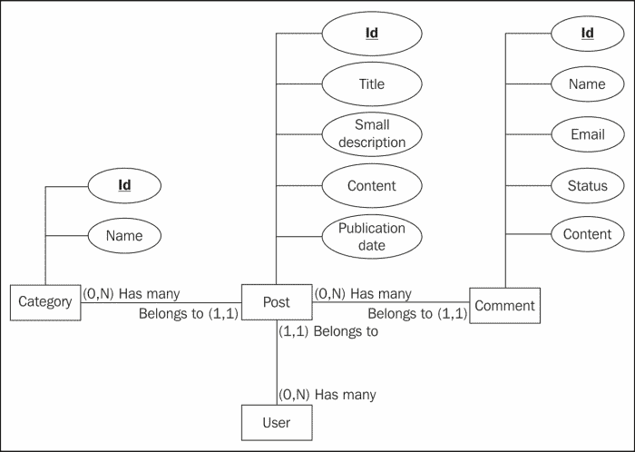
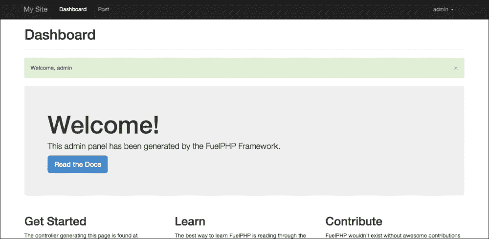
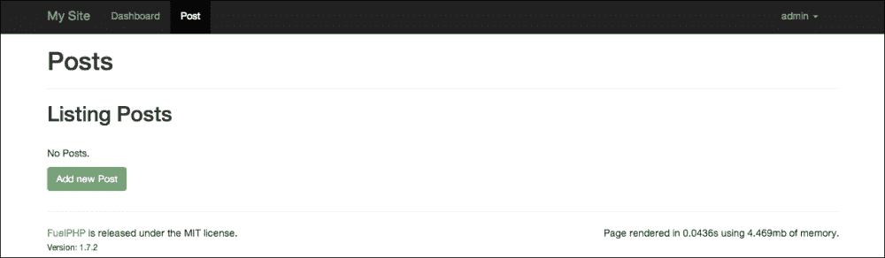

# 第三章：构建博客应用程序

在前几章中我们已经看到了 FuelPHP 的基本特性，现在是时候使用更高级的特性了。在本章中，我们将构建一个典型的博客应用程序，通过一个安全的行政界面进行管理。我们将将其实现为一个模块，因为在 FuelPHP 中这是一种提高代码重用性的便捷方式。

到本章结束时，你应该知道：

+   如何生成管理界面

+   如何创建你自己的模块

+   CSRF 攻击是什么，以及如何保护你的网站免受其侵害

+   如何创建和使用任务

+   如何以及何时使用演示者

+   如何轻松创建分页

+   如何使用 slug 观察者

+   **Auth**和**Email**包是什么，以及如何使用它们

+   如何解析 Markdown

+   如何使用**WYSIWYG**编辑器和显示其内容

本章的目标也是巩固你获得的知识，因此实现将比通常更长、更重复。请花时间分析和理解每个部分是如何工作的，并通过调整或添加功能来尝试。

# 规范

首先，让我们定义我们最终应用程序中应该期望什么：

+   一个博客显示帖子。帖子由标题、小描述（作为摘要）、帖子内容、类别、发布日期和作者描述。

+   博客的主页显示帖子的分页列表。如果用户点击标题，他应该能看到帖子的完整版本。

+   点击帖子类别时，应显示一个类似列表，但只显示属于此类别的帖子。

+   帖子和类别只能由认证用户在管理界面中创建和编辑。

+   帖子的小描述长度应限制在 200 个字符内，并使用 Markdown 语法进行编辑。

+   内容应使用 WYSIWYG 插件进行编辑。

+   管理员应该能够管理评论。

+   每当有人写评论时，应向帖子的作者发送电子邮件。

+   我们希望能够轻松地将新的博客安装到其他网站上。

# 概念

让我们尝试根据前面的规范确定我们的模型。显然，帖子是一个模型，因为它是我们博客的主要功能（我们显示帖子）。每个帖子都是由认证用户创建和更新的，这意味着用户必须保存到数据库中；因此，我们还有一个**用户**模型。可能存在没有评论的帖子，以及没有帖子的类别，这意味着它们属于不同的模型；因此，还有一个**类别**和**评论**模型。

这总共是四个模型：



实体关系图（Min-Max 表示法）

+   **帖子**：此模型具有以下属性：标题、简短描述、内容和发布日期。帖子链接到一个唯一的类别，每个类别有许多帖子，因此我们将在这里添加一个额外的列，命名为`category_id`。同样，每个帖子属于一个用户（作者），因此我们还将添加`user_id`列。

+   **类别**：此模型只有一个名称属性。

+   **注释**：此模型具有以下属性：名称、电子邮件、状态和内容。由于评论属于一个唯一的帖子，每个帖子可以有多个评论，因此我们还将添加一个`post_id`列。当访客发表评论时，其状态值将是`待审阅`，因为它尚未被审查。管理员可以通过在管理面板中将状态更改为`已发布`或`未发布`来发布或隐藏每个评论。

我们将不会生成**用户**模型。我们将使用 Auth 包中的模型，该模型将为我们管理用户及其认证。

# 初步步骤

您首先需要：

1.  安装一个新的 FuelPHP 实例

1.  配置 Apache 和您的 hosts 文件以处理它：在本章中，我们将通过请求`http://myblog.app` URL 来访问我们的应用程序。

1.  如有必要，更新 Composer

1.  为您的应用程序创建一个新的数据库

1.  然后配置 FuelPHP 以允许您的应用程序访问此数据库

这些步骤已在第一章中介绍，*构建您的第一个 FuelPHP 应用程序*，因此您可能想查看它。

此项目还需要 ORM 和 Auth 包。我们已经使用了 ORM 包，如前所述，Auth 包将允许我们管理我们的用户及其认证。由于这两个包已经安装，我们只需要启用它们。为此，只需打开`APPPATH/config/config.php`文件，在返回数组的末尾插入以下代码：

```php
'always_load'  => array(
    'packages'  => array(
        'orm',
        'auth',
    ),
),
```

或者，您可以取消注释适当的行。这将每次加载 FuelPHP 实例时都加载`ORM`和`Auth`包。

### 注意

您还可以使用`Package::load`方法以临时方式加载包。这将在本章后面讨论，当我们使用`Email`包时。

我们还需要更改`Auth`包的一些配置项。首先，将`PKGPATH/auth/config/auth.php`配置文件复制到`APPPATH/config/auth.php`（此配置文件将覆盖`Auth`包中的配置文件）并替换：

```php
'driver' => 'Simpleauth',
```

作者：

```php
'driver' => 'Ormauth',
```

### 注意

我们选择使用`Ormauth`驱动程序的一个原因是它比`Simpleauth`驱动程序具有更细粒度的 ACL 系统。`Ormauth`更灵活，管理用户、组、角色和权限，而`Simpleauth`只管理用户、组和角色。另一个原因是`Ormauth`已经包含了管理所有这些组件的迁移和模型。简而言之，我们主要选择这个驱动程序是因为它易于设置，并展示了所有可能的功能范围。然而，重要的是要指出，我们只会使用其非常小的一部分功能，我们本可以仅限于使用`Simpleauth`驱动程序。

最后，将`PKGPATH/auth/config/ormauth.php`配置文件复制到`APPPATH/config/ormauth.php`，并将`login_hash_salt`的值设置为随机字符串（出于安全考虑）。

# 构建帖子脚手架

现在，我们将像在第一章和第二章中做的那样，生成必要的代码来处理我们的帖子。由于帖子应该只由认证管理员在管理面板中创建和编辑，我们将使用`admin`（别名`admin/orm`）生成脚手架：

```php
php oil generate admin post title:string slug:string small_description:string[200] content:text category_id:int user_id:int

```

命令应该输出以下内容：

```php
Creating controller: APPPATH/classes/controller/base.php
Creating controller: APPPATH/classes/controller/admin.php
Creating views: APPPATH/views/admin/template.php
Creating views: APPPATH/views/admin/dashboard.php
Creating views: APPPATH/views/admin/login.php
Creating migration: APPPATH/migrations/001_create_posts.php
Creating model: APPPATH/classes/model/post.php
Creating controller: APPPATH/classes/controller/admin/post.php
Creating view: APPPATH/views/admin/post/index.php
Creating view: APPPATH/views/admin/post/view.php
Creating view: APPPATH/views/admin/post/create.php
Creating view: APPPATH/views/admin/post/edit.php
Creating view: APPPATH/views/admin/post/_form.php
Creating view: APPPATH/views/template.php

```

你会注意到与`scaffold/orm`相比，创建了额外的文件。这些文件可以分为两大类：

+   前五个生成的文件是为了以通用方式处理管理面板（认证和布局）。

+   另外一些文件（除了最后一个），是为了专门处理帖子管理。

你可以注意到我们还没有生成分类和评论，我们稍后会回到这一点。我们现在的优先级是让管理面板工作，看看我们正在处理什么。

# 迁移第一部分

现在，执行生成的迁移文件：

```php
php oil refine migrate

```

如果你请求 URL `http://myblog.app/admin`并尝试登录，将会抛出一个错误，因为没有处理我们用户的表。为了创建这个表（以及为`Ormauth`驱动程序所需的其它所有表），你必须执行`Auth`包迁移。这可以通过以下命令完成：

```php
php oil refine migrate --packages=auth

```

`oil refine migrate`命令允许你指定你想要迁移的模块和包。你甚至可以选择执行所有迁移（来自你的应用程序、模块和包）的以下命令：

```php
php oil refine migrate -all

```

虽然在我们的情况下这没有区别，但请注意，它将执行配置文件`APPPATH/config/config.php`中未定义在`always_load.packages`键的包的迁移。有些人可能期望这种行为，但我们认为这是一个重要的要点要强调。

# 管理面板

迁移执行完毕后，请求以下 URL：

`http://myblog.app/admin`

在迁移过程中，`Auth` 包创建了一个具有以下凭据的默认用户：

+   用户名：admin

+   密码：admin

如果你使用这些凭据登录，管理面板的欢迎页面将显示，如下面的截图所示：



它与默认的欢迎页面非常相似；主要区别是顶部的导航栏。正如你在 `APPPATH/views/admin/template.php` 生成的文件中所看到的，导航栏会自动检测 `APPPATH/classes/controller/admin` 文件夹中的控制器，并为它们的索引动作创建链接。由于已经生成了 `Controller_Admin_Post` 控制器，因此有一个指向帖子列表的链接。如果你点击它，你应该会看到一个与 `scaffold/orm` 生成的类似的结构化 CRUD 框架：



# `Auth` 包

如果你现在查看你的数据库，你应该会看到许多以 **users** 关键字为前缀的表已经创建：

+   用户

+   用户客户端

+   用户组

+   用户组权限

+   用户组角色

+   用户元数据

+   用户权限

+   用户提供者

+   用户角色

+   用户角色权限

+   用户作用域

+   用户会话

+   用户会话作用域

+   用户用户权限

+   用户用户角色

`Auth` 包的 `Ormauth` 驱动程序管理这些表，其中一些与位于 `PKGPATH/auth/classes/model/auth` 的模型相关联。如前所述，该驱动程序提供的解决方案比简单的认证系统要完整得多，因为它管理用户、组、角色和权限。

需要指出的是，存在另外两个驱动程序：

+   `Simpleauth`，它比 `Ormauth` 简单得多，只管理用户、组和角色。

+   `Opauth`，允许用户使用 `OAuth` 或 `OpenID` 提供商（包括 Facebook、Twitter 或 Google）进行连接。

由于我们只会使用该包的一小部分，对其进行全面解释超出了范围。有关更多详细信息，建议您阅读官方文档[`fuelphp.com/docs/packages/auth/intro.html`](http://fuelphp.com/docs/packages/auth/intro.html)（可以通过通过 FuelPHP 网站导航到**DOCS** | **TABLE OF CONTENTS** | **Auth** | **Introduction**来访问）

修改您的管理员密码是一个好习惯，因为当前的设置（用户名和密码都设置为 `admin`）在将项目发布到生产服务器时将是一个重大的安全漏洞。您可以使用 `Auth::change_password` 方法来更改它，并且建议您阅读该方法的官方文档[`fuelphp.com/docs/packages/auth/ormauth/usage.html#/method_change_password`](http://fuelphp.com/docs/packages/auth/ormauth/usage.html#/method_change_password)（可以通过通过 FuelPHP 网站导航到**DOCS** | **TABLE OF CONTENTS** | **Auth** | **Ormauth** | **Usage**来访问）。

我们建议您在**Oil**的控制台或迁移文件中执行此方法（如果您想将更改传播到其他实例，这样做更好）。

您也可以通过使用`Auth::create_user`方法添加新用户。然而，请注意，从长远来看，创建或使用用户管理系统可能是一个好主意。

# 创建博客模块

通过创建帖子管理界面，我们现在已经完成了项目的第一步。在生成和实施我们的其他功能之前，重要的是要记住，一个额外的目标是能够通过重用相同的代码轻松地将博客安装到其他网站上。为了做到这一点，我们将创建一个博客模块，这就是我们应该实现代码的地方。

## 将文件移动到博客模块

第一步是告诉 FuelPHP 在哪里查找模块。在`APPPATH/config/config.php`配置文件的返回数组末尾添加（或取消注释适当的行）：

```php
'module_paths' => array(
    APPPATH.'modules'.DS
),
```

我们接下来需要创建我们的博客模块文件夹。在`APPPATH/modules/blog`位置创建一个文件夹，并包含以下子文件夹：

+   `classes`

+   `classes/controller`

+   `classes/controller/admin`

+   `classes/model`

+   `config`

+   `migrations`

+   `views`

+   `views/admin`

您也可以使用以下`oil`命令行生成所有这些文件夹：

```php
php oil generate module blog –folders=classes/controller/admin,classes/model,config,migrations,views/admin

```

下一步是将我们之前生成的文件移动到博客模块。由于这可能需要一点时间来完成（一些代码也需要更改），我们为此实现了一个开源任务。存储库可以在以下位置找到：

[`github.com/sdrdis/move_scaffold_to_module`](https://github.com/sdrdis/move_scaffold_to_module)

要安装此任务，只需保存：

[`raw.githubusercontent.com/sdrdis/move_scaffold_to_module/master/movescaffoldtomodule.php`](https://raw.githubusercontent.com/sdrdis/move_scaffold_to_module/master/movescaffoldtomodule.php)

进入`APPPATH/tasks/`存储库。

在执行任务和移动所有文件之前，重要的是要强调，我们还将`001_create_posts.php`迁移文件移动到博客模块。因此，`oil`实用程序将考虑这个迁移文件是一个新的，并尝试执行它。我们可以让它保持原样；由于迁移在尝试创建`posts`表之前会检查该表是否存在，所以它将成功执行，尽管它不会做任何事情。但是，`oil`实用程序将保存一个`001_create_posts.php`迁移已在应用程序文件夹中执行的信息，所以这不是最干净的方法。由于我们现在还没有输入任何相关的帖子，让我们首先通过执行以下操作撤销此迁移：

```php
php oil refine migrate:down

```

然后执行以下命令行：

```php
php oil r moveScaffoldToModule -scaffold=post -module=blog

```

命令应该输出（`BLOGPATH`是博客模块的路径）：

```php
Creating controller: BLOGPATH/classes/controller/admin/post.php
Deleting controller: APPPATH/classes/controller/admin/post.php
Creating model: BLOGPATH/classes/model/post.php
Deleting model: APPPATH/classes/model/post.php
Creating view: BLOGPATH/views/admin/post/create.php
Creating view: BLOGPATH/views/admin/post/edit.php
Creating view: BLOGPATH/views/admin/post/index.php
Creating view: BLOGPATH/views/admin/post/view.php
Creating view: BLOGPATH/views/admin/post/_form.php
Deleting views: APPPATH/views/admin/post
Creating migration: BLOGPATH/migrations/001_create_posts.php
Deleting migration: APPPATH/migrations/001_create_posts.php

```

### 注意

这个任务是为了在实施此项目时使您的生活更轻松。请注意，它假设代码是直接从`oil`实用程序生成的，并且您没有对其进行任何修改。它当然可以改进。

希望在 FuelPHP 1.8 中不再需要它，因为 `--module` 选项可能会在 `oil generate scaffold` 和 `oil generate admin` 命令中实现，允许开发者直接在模块内生成脚手架。

现在，让我们在博客模块中执行迁移文件：

```php
php oil refine migrate --modules=blog

```

## 改进导航栏

你可能已经注意到，尽管我们的帖子管理面板可以通过请求以下 URL 访问：

`http://myblog.app/blog/admin/post`

它不再出现在上方的导航栏中。如果我们查看位于 `APPPATH/views/admin/template.php` 的管理模板，我们可以看到那些链接是由以下代码生成的：

```php
<?php
    $files = new GlobIterator(APPPATH.'classes/controller/admin/*.php');
foreach($files as $file)
    {
        $section_segment = $file->getBasename('.php');
        $section_title = Inflector::humanize($section_segment);
        ?>
<li class="<?php echo Uri::segment(2) == $section_segment ? 'active' : '' ?>">
<?php echo Html::anchor('admin/'.$section_segment, $section_title) ?>
</li>
<?php
    }
?>
```

如你所见，链接目前是根据位于 `APPPATH/classes/controller/admin/` 的文件创建的。然而，我们希望支持通过在每个模块的 `classes/controller/admin` 子目录中查找文件来支持模块。为此，将此代码替换为以下代码：

```php
<?php
// Get the navigation bar's links from an helper. We moved
// the code there because it is a bit long.
$links = Helper::get_navigation_bar_links();

foreach ($links as $link) {
    // A link will be active if the current url starts with
    // its url. For instance, we want the post link to be
    // active when requesting these urls:
    // http://myblog.app/blog/admin/post
    // http://myblog.app/blog/admin/post/create
    // http://myblog.app/blog/admin/post/view/1
    // ...
    $active = Str::starts_with(
        Uri::current(),
        Uri::base().$link['url']
    );
    ?>
<li class="<?php echo $active ? 'active' : '' ?>">
<?php echo Html::anchor(
            $link['url'],
            $link['title']
        ) ?>
</li>
<?php
}
?>
```

在 `APPPATH/classes/helper.php` 位置创建辅助器，并添加以下内容（阅读注释以获取更多信息）：

```php
<?php
class Helper {
    static function get_navigation_bar_links() {
        // This method will return a list of links. Each
        // link will contain a title and a url.
        $links = array();

        // For all admin controllers of our application
        $files = new GlobIterator(
            APPPATH.'classes/controller/admin/*.php'
        );
        foreach($files as $file)
        {
            // Url and title are deducted from the file
            // basename
            $section_segment = $file->getBasename('.php');
            $links[] = array(
                'title' => Inflector::humanize(
                    $section_segment
                ),
                'url' => 'admin/'.$section_segment,
            );
        }

        // Currently, only one path is defined:
        // APPPATH/module. But this could to change.
        $module_paths = \Config::get('module_paths');
        foreach ($module_paths as $module_path) {
            // For each admin controller of each module
            $files = new GlobIterator(
                $module_path
                .
                '*/classes/controller/admin/*.php'
            );
            foreach($files as $file)
            {
                // We get the module name from the path...
                $exploded_path = explode(
                    '/',
                    $file->getPath()
                );
                $module = $exploded_path[
                    count($exploded_path) - 4
                ];
                $section_segment = $file->getBasename('.php');
                $links[] = array(
                    'title' => Inflector::humanize(
                        $section_segment
                    ),
                    'url' => $module.'/admin/'.$section_segment,
                );
            }
        }

        return $links;
    }
}
```

### 备注

注意，上述代码假设所有包含至少一个后台控制器的模块都可以被请求。

如果你刷新你的管理面板，**帖子**链接应该出现在上方的导航工具栏中。

这个解决方案的一个缺点是，如果你想显示导航工具栏中的 **帖子** 链接，你必须对每个新的项目执行相同的更改。然而，这个解决方案是通用的，因为如果你添加其他模块和后台控制器，它们的链接将自动出现。此外，如果你不使用这个解决方案，你仍然可以通过以下 URL 管理帖子：

`http://myblog.app/blog/admin/post`

# 脚手架项目的其余部分

现在帖子管理面板已经工作，并且位于博客模块中，是时候生成我们的其他模型了。

## 脚手架分类

让我们先处理分类模型。

### 生成文件

这一步相当直接；就像我们之前做的那样，我们将使用 `oil` 命令来生成我们的脚手架：

```php
php oil generate admin/orm category name:string -s

```

注意，我们添加了 `-s` （`s` 代表跳过）参数，因为一些文件之前已经被生成，我们不希望替换它们。这个命令行应该输出：

```php
Creating migration: APPPATH/migrations/002_create_categories.php
Creating model: APPPATH/classes/model/category.php
Creating controller: APPPATH/classes/controller/admin/category.php
Creating view: APPPATH/views/admin/category/index.php
Creating view: APPPATH/views/admin/category/view.php
Creating view: APPPATH/views/admin/category/create.php
Creating view: APPPATH/views/admin/category/edit.php
Creating view: APPPATH/views/admin/category/_form.php

```

不要启动生成的迁移；我们首先将代码移动到我们的博客模块中。

### 将分类移动到博客模块

让我们使用 `moveScaffoldToModule` 任务将分类脚手架移动到博客模块：

```php
php oil r moveScaffoldToModule -scaffold=category -module=blog

```

命令应该输出（`BLOGPATH` 是博客模块的路径）：

```php
Creating controller: BLOGPATH/classes/controller/admin/category.php
Deleting controller: APPPATH/classes/controller/admin/category.php
Creating model: BLOGPATH/classes/model/category.php
Deleting model: APPPATH/classes/model/category.php
Creating view: BLOGPATH/views/admin/category/create.php
Creating view: BLOGPATH/views/admin/category/edit.php
Creating view: BLOGPATH/views/admin/category/index.php
Creating view: BLOGPATH/views/admin/category/view.php
Creating view: BLOGPATH/views/admin/category/_form.php
Deleting views: APPPATH/views/admin/category
Creating migration: BLOGPATH/migrations/002_create_categories.php
Deleting migration: APPPATH/migrations/002_create_categories.php

```

### 迁移

现在我们只需执行我们的迁移文件。为此，输入以下命令行：

```php
php oil refine migrate --modules=blog

```

如果你访问你的管理面板，你现在应该能够管理分类。

## 脚手架注释

这一节与上一节相当相似。首先，生成脚手架：

```php
php oil generate admin/orm comment name:string email:string content:text status:string post_id:integer -s

```

此命令应该输出以下内容：

```php
Creating migration: APPPATH/migrations/002_create_comments.php
Creating model: APPPATH/classes/model/comment.php
Creating controller: APPPATH/classes/controller/admin/comment.php
Creating view: APPPATH/views/admin/comment/index.php
Creating view: APPPATH/views/admin/comment/view.php
Creating view: APPPATH/views/admin/comment/create.php
Creating view: APPPATH/views/admin/comment/edit.php
Creating view: APPPATH/views/admin/comment/_form.php

```

然后，将脚手架移动到博客模块：

```php
php oil r moveScaffoldToModule -scaffold=comment -module=blog

```

此命令应输出以下内容：

```php
Creating controller: BLOGPATH/classes/controller/admin/comment.php
Deleting controller: APPPATH/classes/controller/admin/comment.php
Creating model: BLOGPATH/classes/model/comment.php
Deleting model: APPPATH/classes/model/comment.php
Creating view: BLOGPATH/views/admin/comment/create.php
Creating view: BLOGPATH/views/admin/comment/edit.php
Creating view: BLOGPATH/views/admin/comment/index.php
Creating view: BLOGPATH/views/admin/comment/view.php
Creating view: BLOGPATH/views/admin/comment/_form.php
Deleting views: APPPATH/views/admin/comment
Creating migration: BLOGPATH/migrations/003_create_comments.php
Deleting migration: APPPATH/migrations/002_create_comments.php

```

在启动迁移文件之前，我们将通过将`status`列类型更改为`ENUM`来改进它，因为只有三个可能的值：`not_published`、`pending`和`published`。为此，编辑`BLOGPATH/migrations/003_create_comments.php`文件并替换以下行：

```php
'status' => array('constraint' => 11, 'type' => 'int'),
```

通过：

```php
'status' => array(
    'constraint' => "'not_published','pending','published'",
    'type' => 'enum',
    'default' => 'pending'
),
```

最后，使用 oil 启动迁移文件：

```php
php oil refine migrate --modules=blog

```

现在应该在管理界面中可以管理评论。

## 前端帖子脚手架

为了有一个起点，我们将为前端生成帖子脚手架。当然，我们会大量修改控制器，因为我们不希望访客编辑和创建帖子。

### 注意

在进行任何操作之前，请检查在`APPPATH/views/template.php`（在我写的时候，`oil generate admin/orm`似乎在该位置生成了一个错误的文件）。如果是这种情况，请删除该文件：稍后 oil 会重新生成它。

输入以下命令：

```php
php oil generate scaffold/orm post title:string slug:string small_description:string[200] content:text category_id:int user_id:int

```

应该输出：

```php
Creating migration: APPPATH/migrations/002_create_posts.php
Creating model: APPPATH/classes/model/post.php
Creating controller: APPPATH/classes/controller/post.php
Creating view: APPPATH/views/post/index.php
Creating view: APPPATH/views/post/view.php
Creating view: APPPATH/views/post/create.php
Creating view: APPPATH/views/post/edit.php
Creating view: APPPATH/views/post/_form.php

```

现在通过输入以下命令将脚手架移动到博客模块：

```php
php oil r moveScaffoldToModule -scaffold=post -module=blog

```

这应该打印以下输出：

```php
Creating controller: BLOGPATH/classes/controller/post.php
Deleting controller: APPPATH/classes/controller/post.php
Deleting model: APPPATH/classes/model/post.php
Creating view: BLOGPATH/views/post/create.php
Creating view: BLOGPATH/views/post/edit.php
Creating view: BLOGPATH/views/post/index.php
Creating view: BLOGPATH/views/post/view.php
Creating view: BLOGPATH/views/post/_form.php
Deleting views: APPPATH/views/post
Deleting migration: APPPATH/migrations/002_create_posts.php

```

注意，由于与类似文件名迁移文件已经在博客模块中，任务只是简单地删除了应用程序目录中的那个（而没有将其复制到博客模块中）。这是预期的行为，因为创建帖子表的迁移已经在模块中存在。

您应该可以通过请求以下 URL 来访问脚手架：

`http://myblog.app/blog/post`

# 精炼管理面板

现在所有脚手架都已创建，是时候精炼我们的管理面板了：

+   由于分类是非常简单的模型（它们只有一个`name`属性），所以**视图**链接不会比列表提供更多信息，因此我们将移除它。我们还将显示与每个分类关联的帖子数量；这将给我们一个关于最常用分类的印象。

+   我们不需要在管理面板中创建新的评论，因此我们需要移除相关的链接和操作。我们还需要在编辑表单和列表中进行一些改进。

+   对于帖子也是如此；在列出帖子时，我们将移除大多数列，我们将在帖子创建和编辑表单中添加一个所见即所得编辑器、一个 Markdown 编辑器和分类选择框。

注意，可能会有很多其他的改进。建议您添加您认为必要的更改。

## 精炼帖子管理面板

让我们从帖子管理面板开始。您可能想添加一些分类以供测试。请注意，您应该在每个部分的末尾再次测试您的应用程序。

### 改进帖子创建和编辑表单

我们将从创建/编辑表单开始。我们已经生成了它，正如我们在前面的章节中看到的，管理此表单的视图可以在以下位置找到：`BLOGPATH/views/admin/post/_form.php`。

#### 删除并自动填充别名

**slug** 属性应仅依赖于标题，它将用于 URL 中以提高 SEO。其值将自动从标题中填充，因此我们不需要在表单中包含其相关字段。因此，移除带有 `form-group` 类的第二个 `div` 以及其内容（其中包含 `slug` 输入）。

为了自动填充其值，我们将使用观察者（如 `created_at` 和 `updated_at` 列）；`Orm\Observer_Slug`。在模型实例中，此观察者将属性值保存到第二个属性中的 slug 版本。在默认情况下，没有任何额外配置，它将取 `title` 的值并将其 slug 版本保存到 `slug`。这正是我们的情况，所以它将非常简单，但建议您阅读官方文档以获取更多信息：

[`fuelphp.com/docs/packages/orm/observers/included.html#os_slug`](http://fuelphp.com/docs/packages/orm/observers/included.html#os_slug)

（可以通过 FuelPHP 网站访问，通过导航到 **DOCS** | **目录** | **ORM** | **观察者+** | **包含的观察者**）

打开位于 `BLOGPATH/classes/model/post.php` 的 **Post** 模型，并在 `$_observers` 属性的末尾添加以下内容：

```php
'Orm\\Observer_Slug',
```

最后，我们必须移除所有与 **Slug** 字段处理相关的元素。

首先，在 **Post** 模型的 `validate` 方法中，移除：

```php
$val->add_field('slug', 'Slug', 'required|max_length[255]');
```

然后，打开位于 `BLOGPATH/classes/controller/admin/post.php` 的 **Post** 控制器，并移除：

```php
'slug' => Input::post('slug'),
```

并且：

```php
$post->slug = Input::post('slug');
```

并且：

```php
$post->slug = $val->validated('slug');
```

#### 将简短描述输入框改为 textarea

我们希望将简短描述输入框改为 `textarea`，因为尽管其长度限制为 200 个字符，但标准输入并不友好。替换为：

```php
<?php echo Form::input('small_description', ... ); ?>
```

由：

```php
<?php
echo Form::textarea(
    'small_description',
    Input::post(
        'small_description',
isset($post) ? $post->small_description : ''
    ),
    array(
        'class' => 'col-md-4 form-control',
        'placeholder' => 'Small description',
        'rows' => 4,
        'maxlength' => 200,
    )
);
?>
```

我们希望使用 Markdown 语法编写内容（如果您不熟悉，可以查看 [`en.wikipedia.org/wiki/Markdown`](https://en.wikipedia.org/wiki/Markdown)），并在我们的前端显示格式化后的简短描述，但我们现在不需要更改任何其他内容，因为此格式化过程将在我们的前端视图中发生。尽管如此，您可以在这里添加一个 JavaScript Markdown 插件，使这个 `textarea` 更加用户友好。

#### 使用 WYSIWYG 编辑器编辑帖子内容

下一个表单项是内容，我们希望使用 WYSIWYG 编辑器来编辑它。我们只需要添加一个 JavaScript 插件。我们将使用 **TinyMCE**，这是一个知名的开放源代码 WYSIWYG 编辑器。

首先，您需要包含 TinyMCE JavaScript 文件。打开位于 `APPPATH/views/admin/template.php` 的模板文件，并添加：

```php
'//tinymce.cachefly.net/4.1/tinymce.min.js'
```

在 `Asset::js` 首个数组参数的末尾。

### 注意

注意，我们使用了在本书编写时 TinyMCE 推荐的 CDN 上托管的 JavaScript 文件。根据您阅读本书的时间和您的需求，您可能希望使用不同的 URL 或在您的服务器上托管 TinyMCE。

接下来，我们需要指定 TinyMCE 哪个 `textarea` 需要转换为 WYSIWYG。在同一个模板中，在第一个 `script` 标签的末尾添加以下内容：

```php
// Transforms textareas with the wysiwyg class to wysiwygs
tinymce.init({selector:'textarea.wysiwyg'});
```

最后，我们需要将 `wysiwyg` 类添加到我们的内容 `textarea` 中。返回位于 `APPPATH/views/admin/post/_form.php` 的文件，搜索 `Form::textarea('content'` 并在这次方法调用中替换：

```php
'class' => 'col-md-8 form-control'
```

作者：

```php
'class' => 'col-md-8 form-control wysiwyg'
```

#### 用选择框替换分类输入

表单中的下一个项目是 **分类 id**。手动设置分类 id 对管理员来说不友好；最好的做法是显示一个选择框，以便可以通过标题选择分类。

首先，在 `BLOGPATH/views/admin/category/selector.php` 创建一个视图文件，并添加以下内容：

```php
<?php
/*
Loading the list of all categories here, since it doesn't
depend on the post being created / edited. (Temporary)
*/
$categories = \Blog\Model_Category::find('all');

$options = array();
foreach ($categories as $category) {
    $options[$category->id] = $category->name;
}
echo Form::select('category_id', $category_id, $options);
```

然后，回到 `BLOGPATH/views/admin/post/_form.php` 视图文件，通过替换以下内容来修复分类字段标题：

```php
Form::label('Category id', 'category_id'
```

修改内容：

```php
Form::label('Category', 'category_id'
```

然后通过以下方式包含我们的选择框：

```php
<?php echo Form::input('category_id', ... ) ?>
```

修改内容：

```php
<div>
<?php
$select_box = \View::forge('admin/category/selector');

// Other way to set a view parameter; sets the $category_id
// variable.
$select_box->set(
    'category_id',
    Input::post(
        'category_id',
        isset($post) ? $post->category_id : null
    )
);

echo $select_box;
?>
</div>
```

如果您测试表单，选择框应该可以正常工作。但存在一个小问题；当我们创建选择视图时，我们在视图中加载了分类列表。这不符合 MVC 模式，因为我们正在视图中加载模型。但是，将这些对象加载到 **Post** 控制器中也没有意义，因为视图实际上不依赖于任何文章；我们总是加载所有分类，无论上下文如何。正如之前在 第一章 中所述，“构建您的第一个 FuelPHP 应用程序”，在这种情况下我们应该使用一个展示者。幸运的是，我们不需要做很多修改。

首先，在 `BLOGPATH/classes/presenter/admin/category/selector.php` 创建展示者文件，并添加以下内容：

```php
<?php
namespace Blog;

class Presenter_Admin_Category_Selector extends \Presenter
{
    public function view()
    {
        $this->categories = Model_Category::find('all');
    }
}
```

然后，编辑 `BLOGPATH/views/admin/post/_form.php` 视图文件，替换以下行：

```php
$select_box = \View::forge('admin/category/selector');
```

通过：

```php
$select_box = \Presenter::forge('admin/category/selector');
```

最后，编辑 `BLOGPATH/views/admin/category/selector.php` 视图并删除以下行：

```php
$categories = \Blog\Model_Category::find('all');
```

虽然我们不会立即需要它们，但我们将添加文章和分类模型之间的关系。由于每篇文章只能有一个分类，而每个分类可以与多个文章相关联，因此文章和分类之间存在 `belongs_to` 关系，分类和文章之间存在 `has_many` 关系。

首先，打开位于 `BLOGPATH/classes/model/post.php` 的 **Post** 模型，并在类中添加以下代码：

```php
protected static $_belongs_to = array('category');
```

然后，打开位于 `BLOGPATH/classes/model/category.php` 的 **Category** 模型，并在类中添加以下代码：

```php
protected static $_has_many = array('posts');
```

#### 将 user_id 字段替换为作者

我们表中的最后一个字段是 **user_id 字段**。我们将用作者字段替换此字段。该字段不可编辑；文章的作者将简单地是创建它的认证用户。

我们首先需要添加文章和用户之间的关系；由于每篇文章只能与一个用户相关联，而用户可以有任意数量的文章，因此关系类型是 `belongs_to`。

打开位于`BLOGPATH/classes/model/post.php`的**帖子**模型，并在`$_belongs_to`数组末尾添加以下内容：

```php
'author' => array(
    'model_to'          => 'Auth\Model\Auth_User',
    'key_from'          => 'user_id',
    'key_to'            => 'id',
    'cascade_save'      => true,
    'cascade_delete'    => false,
),
```

接下来，我们将更改在创建/编辑表单中显示字段的方式。打开`BLOGPATH/views/admin/post/_form.php`，并首先替换以下内容：

```php
<?php echo Form::label('User id', ... ); ?>
```

By:

```php
<?php echo Form::label('Author'); ?>
```

然后替换为：

```php
<?php echo Form::input('user_id', ... ); ?>
```

By:

```php
<div>
<?php
/*
This field is not editable, so we simply display the author.
current_user is a global variable that defines the current
logged user.
*/
$author = isset($post) ? $post->author : $current_user;
echo $author->username;
?>
</div>
```

最后，我们需要让**帖子**控制器反映这种行为。为此，我们首先更改创建和编辑操作中`user_id`属性的保存方式。打开位于`BLOGPATH/classes/controller/admin/post.php`的**帖子**控制器，并在创建操作内部替换以下内容：

```php
'user_id' => Input::post('user_id'),
```

By:

```php
'user_id' => $this->current_user->id,
```

在编辑操作中，只需简单地删除以下行：

```php
$post->user_id = Input::post('user_id');
```

以及：

```php
$post->user_id = $val->validated('user_id');
```

尽管，你现在仍然无法创建新的帖子，因为会出现以下消息：**用户 ID 字段是必需的，并且必须包含值**。这是由于**帖子**模型的`validate`方法导致的。接下来要做的就是移除`user_id`验证。打开位于`BLOGPATH/classes/model/post.php`的**帖子**模型，并在`validate`方法内部移除以下行：

```php
$val->add_field('user_id', ... );
```

#### 移除查看链接

由于我们不想保留帖子的详细视图，我们可以移除`查看`链接。打开`BLOGPATH/views/admin/post/edit.php`并移除以下代码：

```php
<?php echo Html::anchor(..., 'View'); ?> |
```

### 帖子列表

如果你测试了改进后用于创建新帖子的表单，你可能已经注意到列表并不很好地适应。

#### 移除别名、简短描述和内容列

第一个问题是我们显示了**别名**、**简短描述**和**内容**列，尽管它们的值长度可能很重要。由于这可能会对表格布局产生严重影响，我们不得不移除它们。打开位于`BLOGPATH/views/admin/post/index.php`的列表视图，并移除以下行：

```php
<th>Slug</th>
<th>Small description</th>
<th>Content</th>
```

以及：

```php
<td><?php echo $item->slug; ?></td>
<td><?php echo $item->small_description; ?></td>
<td><?php echo $item->content; ?></td>
```

#### 显示分类和作者名称

第二个问题是我们在显示分类和用户的 ID，尽管显示它们关联的名称会更方便。

首先，相应地更改表格标题，通过替换：

```php
<th>Category id</th>
```

By:

```php
<th>Category</th>
```

以及以下行：

```php
<th>User id</th>
```

By:

```php
<th>Author</th>
```

并将每一行值通过替换：

```php
<td><?php echo $item->category_id; ?></td>
```

By:

```php
<td><?php echo $item->category->name; ?></td>
```

以及以下行：

```php
<td><?php echo $item->user_id; ?></td>
```

By:

```php
<td><?php echo $item->author->username; ?></td>
```

你可以保留代码不变，因为正确的信息将出现在列表中。但如果你激活了性能分析器，你会注意到如果你有多个帖子，将会执行很多 SQL 请求。正如我们之前看到的，这是因为我们在调用`$item->category`和`$item->author`，并且如果没有缓存，每次调用都会执行一个 SQL 请求。为了优化请求的数量，我们将使用`related`键。打开位于`BLOGPATH/classes/controller/post.php`的**帖子**控制器，并在索引操作内部替换以下行：

```php
$data['posts'] = Model_Post::find('all');
```

By:

```php
$data['posts'] = Model_Post::find(
    'all',
    array(
        'related' => array(
            'category',
            'author',
        ),
    )
);
```

#### 移除视图链接

由于我们正在实现管理面板，我们可以将代码缩减到严格必要的部分。由于我们在编辑文章时可以访问文章信息，因此文章编辑和可视化是多余的。因此，我们将删除 **视图** 链接。只需删除以下行：

```php
<?php echo Html::anchor(..., 'View'); ?> |
```

最好在 **文章** 控制器中以及位于 `BLOGPATH/admin/post/view.php` 的视图中删除 **视图** 操作，因为它们现在是无用的代码。

## 精炼分类管理面板

现在，让我们专注于分类管理面板。**分类** 模型相当简单，所以没有太多的事情要做。实际上，我们几乎只会更改列表页面。

### 删除视图链接

由于模型只有一个已经显示在列表中的属性，因此视图链接和页面并不太有用。首先，通过删除以下内容来删除位于 `BLOGPATH/views/admin/category/index.php` 中的 **视图** 链接：

```php
<?php echo Html::anchor(..., 'View'); ?> |
```

然后，您可以删除 **分类** 控制器中的 **视图** 操作以及位于 `BLOGPATH/views/admin/category/view.php` 的视图，因为它们现在是无用的代码。

我们还必须删除编辑表单中的 **视图** 链接。打开 `BLOGPATH/views/admin/category/edit.php` 并删除以下代码：

```php
<?php echo Html::anchor(..., 'View'); ?> |
```

### 添加文章数量列

本节的一个挑战是显示每个分类有多少篇文章。这并不简单，也没有理想的解决方案。

让我们先在我们的表中添加我们的列。在以下位置：

```php
<th>Name</th>
```

添加：

```php
<th>Number of posts</th>
```

在以下位置：

```php
<td><?php echo $item->name; ?></td>
```

添加：

```php
<td><?php /* Depends on solution */ ?></td>
```

现在，让我们测试不同的选项。

#### 解决方案 1：使用 count

第一个解决方案相当直接；我们使用 `count` 方法。替换：

```php
<td><?php /* Depends on solution */ ?></td>
```

通过：

```php
<td>
<?php
echo \Blog\Model_Post::count(
    array(
        'where' => array(
            array('category_id' => $item->id)
        )
    )
);
?>
</td>
```

虽然解决方案很简单，但存在一些主要缺点。首先，它不遵循 MVC 模式。其次，它将为每个显示的分类生成一个请求。如果您有很多分类，请不要使用此方法。

#### 解决方案 2：使用 related

另一种解决方案是使用 `related` 键。首先，打开位于 `BLOGPATH/classes/controller/admin/category.php` 的 **分类** 控制器，并在索引操作中替换以下行：

```php
$data['categories'] = Model_Category::find('all');
```

通过：

```php
$data['categories'] = Model_Category::find(
    'all',
    array(
        'related' => array(
            'posts',
        ),
    )
);
```

然后回到 `BLOGPATH/views/admin/category/index.php` 视图，替换：

```php
<td><?php /* Depends on solution */ ?></td>
```

通过：

```php
<td><?php echo count($item->posts); ?></td>
```

一方面，这个解决方案限制了请求数量，但另一方面，它可能会将大量的无用文章实例加载到内存中，所以这也不是理想的。如果您有很多文章，请不要使用此方法。

#### 解决方案 3：使用 DB::query

另一种解决方案是使用 `DB::query` 加载分类。首先，打开位于 `BLOGPATH/classes/controller/admin/category.php` 的 **分类** 控制器，并在索引操作中替换以下行：

```php
$data['categories'] = Model_Category::find('all');
```

通过：

```php
$data['categories'] = Model_Category::find_all_with_nb_posts();
```

然后在 **分类** 模型中添加以下方法：

```php
public static function find_all_with_nb_posts() {
    return \DB::query(
        'SELECT
            `categories`.*,
            count(`posts`.`id`) as nb_posts
        FROM `categories`
        LEFT JOIN `posts` ON (
            `posts`.`category_id` = `categories`.`id`
        )
        GROUP BY `categories`.id'
    )
    ->as_object('\Blog\Model_Category')
    ->execute()
    ->as_array();
}
```

### 注意

由于 `as_object` 方法，我们可以执行自定义查询并将结果转换为模型实例。在这个请求中，我们添加了一个自定义列，`nb_posts`，它计算每个类别的帖子数量。这个列在我们的类别实例下可通过 `nb_posts` 属性访问。

然后回到 `BLOGPATH/views/admin/category/index.php` 视图，替换：

```php
<td><?php /* Depends on solution */ ?></td>
```

通过：

```php
<td><?php echo $item->nb_posts ?></td>
```

这个解决方案因其性能而有趣：没有额外的查询或内存使用。它的缺点是它不使用 ORM，并且这个解决方案对于更复杂的问题可能难以实现。

对于这个实例，我们推荐这个解决方案。

## 精炼评论管理面板

我们还需要在这里做一些调整。建议你现在手动添加一些评论，因为我们改变界面后你将无法再添加（通过管理界面添加评论没有意义，因为任何用户都可以在网站上这样做）。

### 改进评论列表

首先，我们将改进评论列表。

#### 移除查看并添加新的评论链接

由于我们不需要这些功能，我们将移除它们的链接、动作和视图。

首先，打开 `BLOGPATH/views/admin/comment/index.php` 视图文件并移除：

```php
<?php echo Html::anchor(..., 'View'); ?> |
```

并且：

```php
<?php echo Html::anchor(..., 'Add new Comment', ...); ?>
```

你还被建议移除 **Comment** 控制器的创建和查看动作，以及 `BLOGPATH/views/admin/comment/create.php` 和 `BLOGPATH/views/admin/comment/view.php` 文件。

#### 移除电子邮件和内容列

我们将移除这两个列，因为它们可能占用太多空间。为此，打开 `BLOGPATH/views/admin/comment/index.php` 并移除以下行：

```php
<th>Email</th>
<th>Content</th>
```

并且：

```php
<td><?php echo $item->email; ?></td>
<td><?php echo $item->content; ?></td>
```

#### 将帖子 id 列替换为帖子

了解评论所关联的帖子的标题，而不是帖子的 id，会更方便。

首先，替换：

```php
<th>Post id</th>
```

通过：

```php
<th>Post</th>
```

然后替换：

```php
<td><?php echo $item->post_id; ?></td>
```

通过：

```php
<td>
<?php
echo $item->post ? $item->post->title : '<i>Post deleted</i>';
?>
</td>
```

但是，如果我们想让它工作，我们必须定义帖子与评论之间的关系。打开位于 `BLOGPATH/classes/model/post.php` 的 **Post** 模型，并添加以下属性：

```php
protected static $_has_many = array('comments');
```

然后打开位于 `BLOGPATH/classes/model/comment.php` 的 **Comment** 模型，并添加以下属性：

```php
protected static $_belongs_to = array('post');
```

现在，你能够再次显示列表。但是，你可能注意到，如果你有多个评论，会执行很多请求。再次，我们需要使用 `related` 键来防止这种情况。打开位于 `BLOGPATH/classes/controller/admin/comment.php` 的 `Comment` 控制器，并在 `index` 动作中替换：

```php
$data['comments'] = Model_Comment::find('all');
```

通过：

```php
$data['comments'] = Model_Comment::find(
    'all',
    array(
        'related' => array('post'),
        // display last comments first
        'order_by' => array('id' => 'DESC'),
    )
);
```

### 改进评论编辑表单

我们将在评论编辑表单中改进两个字段；`状态` 和 `帖子 id`。

#### 将状态输入更改为选择框

由于只有三种可能的状态，我们将用选择框替换输入。打开位于 `BLOGPATH/views/admin/comment/_form.php` 的表单，并替换：

```php
<?php echo Form::input('status', ...); ?>
```

通过：

```php
<div>
<?php
echo Form::select(
    'status',
    $comment->status,
    array(
        'not_published' => 'not_published',
        'pending' => 'pending',
        'published' => 'published',
    )
);
?>
</div>
```

#### 将帖子 id 替换为帖子

再次，对于管理员来说，显示帖子的 id 并不重要；最好显示帖子的标题。

首先，替换：

```php
<?php echo Form::label('Post id', ...); ?>
```

由：

```php
<?php
echo Form::label(
    'Post',
    null, // No associated input
    array('class' => 'control-label')
);
?>
```

然后替换：

```php
<?php echo Form::input('post_id', ...); ?>
```

由：

```php
<div><?php echo $comment->post ? $comment->post->title : '<i>Post deleted</i>'; ?></div>
```

我们需要防止在处理表单时`post_id`属性发生任何变化。打开**评论**控制器，并在`action_edit`方法内部删除以下行：

```php
$comment->post_id = Input::post('post_id');
```

然后：

```php
$comment->post_id = $val->validated('post_id');
```

最后，我们需要删除`post_id`验证。打开**评论**模型并删除以下行：

```php
$val->add_field('post_id', ...);
```

#### 删除“查看”链接

由于没有视图操作了，我们必须删除**查看**链接。打开`BLOGPATH/views/admin/comment/edit.php`并删除以下代码：

```php
<?php echo Html::anchor(..., 'View'); ?> |
```

## 保护您的网站免受 CSRF 攻击

您当然希望防止黑客更改您网站的内容，因为后果可能是灾难性的。尽管只要您是唯一可以访问您自己实施的行政面板的人，风险是有限的，但您可能仍想保护您的网站免受**跨站请求伪造**（**CSRF**）攻击。

CSRF 攻击基于网站对用户浏览器的信任。让我们用一个例子来说明这些攻击。假设您登录了您的管理界面。如果您稍后访问另一个网站上的网页，该网页包含以下代码：

```php
<html>
    <head>
        <title>My attack</title>
    </head>
    <body>
        
    </body>
</html>
```

在您的网站上，**帖子**控制器的删除操作将被调用，并且将删除`id = 1`的帖子（如果存在），而无需您的批准或任何通知。创建网页的黑客通过利用您已登录到管理面板的事实，已经成功地通过 CSRF 攻击取得了成功。这是因为您的操作没有验证请求是否合法。更高级的攻击甚至可以提交表单，然后您可能会发现自己网站上出现了不希望的内容。

幸运的是，FuelPHP 允许您通过在链接或表单中包含安全令牌来轻松保护您的网站。该安全令牌在调用操作时进行检查。这个过程确保客户端是从网站请求操作，而不是从其他地方。

### 保护链接

首先，让我们保护帖子列表中的删除链接。

打开`BLOGPATH/views/admin/post/index.php`视图文件并替换：

```php
'blog/admin/post/delete/'.$item->id
```

由：

```php
'blog/admin/post/delete/'.$item->id.
'?'.\Config::get('security.csrf_token_key').
'='.\Security::fetch_token()
```

如果您刷新网页，删除链接现在应该指向一个类似以下 URL 的地址：

`http://myblog.app/blog/admin/post/delete/ID?fuel_csrf_token=215be7bad7eb4999148a22341466f66395ce483d12b17cae463b7bf4b6d6d86233ce38ce6b145c08bf994e56610c1502158b32eca6f6d599a5bb3527d019c324`

现在我们通过 CSRF 令牌作为`get`参数调用**帖子**控制器的删除操作，我们只需在删除帖子之前检查其值是否正确。为了做到这一点，打开**帖子**控制器，并在删除操作内部替换：

```php
if ($post = Model_Post::find($id))
```

由：

```php
if (($post = Model_Post::find($id)) and \Security::check_token())
```

您的删除操作现在已受保护。您应该对**类别**和**评论**管理界面的删除链接做同样的处理。一般来说，甚至建议将此保护添加到任何执行重要或关键操作的链接。

### 保护表单

我们现在将使用一个非常类似的技术来保护我们的帖子创建和编辑表单。首先，打开`BLOGPATH/views/admin/post/_form.php`视图文件，并添加：

```php
<?php echo Form::csrf(); ?>
```

在以下代码之后：

```php
<?php echo Form::open(array("class"=>"form-horizontal")); ?>
```

`Form::csrf`方法将自动向您的表单添加一个包含令牌的隐藏输入。如果您显示帖子创建或编辑网页的 HTML 代码，您应该看到该方法返回了一个类似于以下字符串：

```php
<input name="fuel_csrf_token" value="2411b0a6b942105fb80aa0cb1aaf89ca91e0ea715f5641bbfbb5ded23221fcecbbfe7016c8dbd922a19b12274989e67f71d266300ad14ebd9730c3ec604ec4f5" type="hidden" id="form_fuel_csrf_token" />
```

现在，让我们在修改数据库之前检查此令牌是否正确。

打开**帖子**控制器，并在创建操作中替换：

```php
if ($post and $post->save())
```

通过：

```php
if (\Security::check_token() and $post and $post->save())
```

在编辑操作中，替换：

```php
if ($post->save())
```

通过：

```php
if (\Security::check_token() && $post->save())
```

为了本节的简洁性，当令牌没有预期值时，我们不显示特殊错误消息，但建议您添加此功能。

不管怎样，您的帖子创建和编辑表单现在也得到了保护。您应该对**分类**和**评论**管理界面的创建和编辑表单做同样的处理。一般来说，甚至建议将此保护添加到所有表单中。

# 精炼前端

现在，我们必须精炼我们网站的前端，也就是说访客将看到的内容。

## 精炼帖子列表

如果您请求以下 URL：

`http://myblog.app/blog/post`

您将看到我们之前使用`scaffold/orm`生成的脚手架。

### 删除无用功能

首要重要的事情是防止对我们的帖子进行任何编辑。正如我们多次为管理面板所做的那样，移除**帖子**控制器的创建、编辑和删除操作及其相关视图。请注意，这里我们谈论的是位于`BLOGPATH/classes/controller/post.php`的**帖子**控制器，因为我们正在处理网站的前端。您也可以删除`BLOGPATH/views/admin/post/_form.php`视图文件，因为它只从创建和编辑视图中被调用。

### 改变帖子列表的显示方式

目前，帖子列表以表格形式显示，而对我们博客来说，我们希望以更线性的方式显示列表，就像大多数博客那样显示。

最简单的方法是将位于`BLOGPATH/post/index.php`的视图替换为：

```php
<?php if ($posts): ?>
<?php foreach ($posts as $item): ?>
<div class="post" id="post_<?php echo $item->id; ?>">
<h2>
<?php
echo Html::anchor('blog/post/view/'.$item->id, $item->title);
?>
</h2>
<?php
/*
As we will display the same information when visualizing a
post, we will implement different views in order
to easily reuse them later in BLOGPATH/views/post/view.php
*/
echo \View::forge(
    'post/small_description',
    array('post' => $item)
);
echo \View::forge(
    'post/additional_informations',
    array('post' => $item)
);
?>
</div>
<?php endforeach; ?>
<?php else: ?>
<p>No Posts.</p>
<?php endif; ?>
```

由于我们在分离的视图中显示附加内容（见注释），我们需要创建这些视图。创建`BLOGPATH/views/post/small_description.php`视图文件，并按以下内容设置其内容：

```php
<div class="post_small_description">
<?php
echo \Markdown::parse($post->small_description) 
?>
</div>
```

并创建`BLOGPATH/views/post/additional_informations.php`视图文件，并按以下内容设置其内容：

```php
<div class="post_date">
<?php
echo \Date::forge($post->created_at)->format('us_full');
?>
</div>
<div class="post_category">
    Category:
<?php echo $post->category->name ?>
</div>
<div class="post_author">
    By
<?php echo $post->author->username ?>
</div>
```

最后，为了优化请求数量，打开**帖子**控制器（前端控制器），并替换：

```php
$data['posts'] = Model_Post::find('all');
```

通过：

```php
$data['posts'] = Model_Post::find(
    'all',
    array(
        'related' => array(
            'author',
            'category',
        ),
    )
);
```

### 添加分页

如果您添加了很多帖子，您会注意到列表变得非常长。为了防止这种行为，我们现在将添加`分页`功能。

在**帖子**控制器的索引操作开始时，添加以下代码以创建一个`分页`实例：

```php
// Pagination configuration
$config = array(
    'total_items'    => Model_Post::count(),
    'per_page'       => 10,
    'uri_segment'    => 'page',
);

// Create a pagination instance named 'posts'
$pagination = \Pagination::forge('posts', $config);
```

### 备注

在这里，我们设置了`Pagination`配置的主要选项，但建议您查看官方文档，因为还有更多选项：

[`fuelphp.com/docs/classes/pagination.html`](http://fuelphp.com/docs/classes/pagination.html)

（可以通过通过 FuelPHP 网站导航到**DOCS** | **Core** | **Pagination**访问）

如果您的帖子不多，您可以降低`per_page`值以测试分页。

现在我们检索帖子时，必须考虑分页。替换以下内容：

```php
 $data['posts'] = Model_Post::find(...);
```

通过：

```php
$data['posts'] = Model_Post::find(
    'all',
    array(
        'related' => array(
            'author',
            'category',
        ),
        'rows_offset' => $pagination->offset,
        'rows_limit' => $pagination->per_page,
    )
);
```

我们需要将创建的分页实例传递给我们的视图以便显示。在操作末尾添加以下代码：

```php
$this->template->content->set('pagination', $pagination);
```

这将产生与在`$data`参数内部设置`pagination`键相同的效果。

打开`BLOGPATH/views/post/index.php`视图文件，并在以下位置：

```php
<?php endforeach; ?>
```

添加：

```php
<?php echo $pagination; ?>
```

现在，如果您刷新您的列表页面并且有足够的帖子，您将看到分页出现了，但它被转义了，也就是说，它显示了 HTML 代码。这是因为视图参数默认被转义，我们没有通知 FuelPHP 不要转义`pagination`参数。再次打开**Post**控制器，并在索引操作中替换以下内容：

```php
$this->template->content->set('pagination', $pagination);
```

通过：

```php
$this->template->content->set('pagination', $pagination, false);
```

### 使用帖子的 slug

如果您显示列表，一切看起来都应该是好的。但如果您点击一篇文章的标题，视图页面将显示，但 URL 看起来像这样：

`http://myblog.app/blog/post/view/1`

这对于 SEO 来说并不好，因为我们没有使用之前创建的 slug。为了解决这个问题，首先打开`BLOGPATH/views/post/index.php`视图文件，并替换以下内容：

```php
echo Html::anchor('blog/post/view/'.$item->id, $item->title);
```

通过：

```php
echo Html::anchor(
    'blog/post/view/'.$item->slug,
    $item->title
);
```

现在链接已经指向正确的 URL，视图操作必须处理这种新的行为。打开**Post**控制器，并首先替换以下行：

```php
public function action_view($id = null)
```

通过：

```php
public function action_view($slug = null)
```

然后替换视图操作的内容为：

```php
is_null($slug) and Response::redirect('blog/post');

$data['post'] = Model_Post::find(
    'first',
    array(
        'where' => array(
            array('slug' => $slug),
        ),
    )
);
if ( ! $data['post'])
{
    Session::set_flash(
        'error',
        'Could not find post with slug: '.$slug
    );
    Response::redirect('blog/post');
}

$this->template->title = "Post";
$this->template->content = View::forge('post/view', $data);
```

### 按类别列出帖子

一个有趣的功能是列出属于每个类别的帖子。例如，如果我们请求以下 URL：

`http://myblog.app/blog/post/category/1`

我们希望显示属于`id = 1`类别的帖子。

### 注意

最好的方法就是使用 slug，就像我们为帖子所做的那样。我们没有在这个章节中实现它，但建议您这样做。

首先，打开`BLOGPATH/views/post/additional_informations.php`并替换以下内容：

```php
<?php echo $post->category->name ?>
```

通过：

```php
<?php
echo Html::anchor(
    'blog/post/category/'.$post->category->id,
    $post->category->name
);
?>
```

如果您这么想，显示的分类帖子列表与没有过滤分类的列表相似。视图和请求都是相似的。

我们可以在**Post**控制器内部编写一个分类操作，在这种情况下，索引和分类操作可以调用一个相同的方法；这种解决方案在大多数情况下是可接受的，甚至被推荐。

但在这里我们将采取不同的方法。由于操作有很多共同点，我们将重新路由：

`http://myblog.app/blog/post/category/category_id`

到：

`http://myblog.app/blog/post/index`

并在索引操作中添加分类处理。

首先，创建并打开`BLOGPATH/config/routes.php`文件，并设置其内容为：

```php
<?php
return array(
    'blog/post/category/:category_id' => 'blog/post/index',
);
```

现在，我们必须在`Post`控制器中的索引动作内添加分类处理。首先，在`Post`控制器的索引动作中，替换：

```php
$config = array(...);
```

通过：

```php
$config = array(
    'per_page'       => 10,
    'uri_segment'    => 'page',
);

// Get the category_id route parameter
$category_id = $this->param('category_id');
if (is_null($category_id)) {
    $config['total_items'] = Model_Post::count();
} else {
    $config['total_items'] = Model_Post::count(
        array(
            'where' => array(
                array('category_id' => $category_id),
            ),
        )
    );
}
```

然后，替换：

```php
$data['posts'] = Model_Post::find(...);
```

通过：

```php
$data['posts'] = Model_Post::query()
    ->related(array('author', 'category'))
    ->rows_offset($pagination->offset)
    ->rows_limit($pagination->per_page);

if (!is_null($category_id)) {
    $data['posts']->where('category_id', $category_id);
}

$data['posts'] = $data['posts']->get();
```

您可以注意到我们在这里使用了`query`方法，因为它比在这种情况下使用`find`方法更方便。

### 添加索引

为了优化我们的网站，我们将在我们的表中添加一些索引。为此，创建一个位于`BLOGPATH/migrations/004_create_indexes.php`的迁移文件，并设置其内容为：

```php
<?php

namespace Fuel\Migrations;

class Create_indexes
{
  public function up()
  {
        // For optimizing relations
        \DBUtil::create_index('comments', 'post_id');
        \DBUtil::create_index('posts', 'category_id');
        \DBUtil::create_index('posts', 'user_id');

        // For optimizing slug retrieval
        \DBUtil::create_index('posts', 'slug');
  }
  public function down()
  {
        \DBUtil::drop_index('comments', 'post_id');
        \DBUtil::drop_index('posts', 'category_id');
        \DBUtil::drop_index('posts', 'user_id');
        \DBUtil::drop_index('posts', 'slug');
  }
}
```

不要忘记执行迁移文件。

## 精炼帖子可视化网页

当在列表页点击帖子的标题时，您将看到可视化网页并不完美。我们需要改进其显示方式，以显示帖子的验证评论，并显示和处理评论表单。

### 更改帖子布局

为了改进帖子的显示方式，打开`BLOGPATH/views/post/view.php`视图文件，并设置以下内容：

```php
<div class="post_view">
<h2>
<?php echo $post->title; ?>
</h2>

<?php
// Reusing views we created earlier
echo \View::forge(
    'post/small_description',
    array('post' => $post)
);
?>
<div class="post_content">
<?php echo $post->content; ?>
</div>
<?php
echo \View::forge(
    'post/additional_informations',
    array('post' => $post)
);
?>
</div>
<?php echo Html::anchor('blog/post', 'Back'); ?>
```

现在，如果您可视化一个包含 HTML 元素的帖子内容，您将看到它会被转义（您将看到 HTML 代码）。这是因为默认情况下，发送到视图的任何参数都会被过滤。

### 注意

每个参数默认过滤的方式可以在`APPPATH/config/config.php`配置文件中更改，使用`security.output_filter`键。其默认值是`array('Security::htmlentities')`，解释了为什么 HTML 代码会被转义。您可以将此值更改为`array('Security::xss_clean')`以解决这个问题，但您应该知道这可能会造成性能下降。

为了解决这个问题，在`Post`控制器的视图动作中添加：

```php
$this->template->content->set(
'post_content',
$data['post']->content,
false
);
```

之后：

```php
$this->template->content->set(
    'post_content',
    $data['post']->content,
    false
);
```

并且，在`BLOGPATH/views/post/view.php`视图文件中，替换：

```php
<?php echo $post->content; ?>
```

通过：

```php
<?php echo \Security::xss_clean($post_content); ?>
```

当您禁用`filter`参数时，应谨慎行事，因为它可能会引入安全风险。由于帖子仅由管理员编辑，风险较低，但这并不能阻止我们采取额外措施。这就是为什么我们使用了`Security::xss_clean`方法来限制潜在问题。

### 注意

您可能想知道为什么我们设置帖子内容在额外的未过滤视图参数中，而不是仅仅将`View::forge`的`filter`参数设置为 false。原因是，在这种情况下，我们将发送一个完全未过滤的`post`对象（因为当`filter`设置为 true 时，所有对象的属性都会被过滤）。这将迫使我们手动转义我们在视图中显示的大部分其他属性，从而导致许多更多更改。

如果你决定在其他情况下直接在`View::forge`中禁用`filter`参数，请注意一个重要的细节；当`filter`参数启用时，它会转义所有传递对象的属性，因此在这个过程中改变了它们。因此，对象在设置`filter`参数为`true`的任何`View::forge`之后将不可逆地改变。因此，即使你在控制器中调用`View::forge`时将`filter`参数设置为`false`，如果你的对象属性在显示带有`filter`设置为`true`的子视图时仍然可能被转义，所以确保在这种情况下也禁用`filter`。

### 添加评论表单

我们还希望用户能够发布评论。为此，我们首先实现评论创建表单（从管理面板的表单派生）。创建`BLOGPATH/views/comment/_form.php`视图文件，并将其内容设置为：

```php
<h3>Add a comment</h3>
<?php echo Form::open(array("class"=>"form-horizontal")); ?>

  <fieldset>
    <div class="form-group">
<?php
echo Form::label(
    'Name',
    'name',
    array('class' => 'control-label')
);

echo Form::input(
    'name',
    Input::post(
        'name',
    isset($comment) ? $comment->name : ''
    ),
    array(
        'class' => 'col-md-4 form-control',
        'placeholder' => 'Name'
    )
);
?>

    </div>
    <div class="form-group">
<?php
echo Form::label(
    'Email',
    'email',
    array('class' => 'control-label')
);

echo Form::input(
    'email',
    Input::post(
        'email',
        isset($comment) ? $comment->email : ''
    ),
    array(
        'class' => 'col-md-4 form-control',
        'placeholder' => 'Email'
    )
);
?>

   </div>
    <div class="form-group">
<?php
echo Form::label(
    'Content',
    'content',
    array('class' => 'control-label')
);

echo Form::textarea(
    'content',
    Input::post(
        'content',
        isset($comment) ? $comment->content : ''
    ),
    array(
        'class' => 'col-md-8 form-control',
        'rows' => 8,
        'placeholder' => 'Content'
    )
);
?>

    </div>
    <div class="form-group">
      <label class='control-label'>&nbsp;</label>
<?php
echo Form::submit(
    'submit',
    'Save',
    array('class' => 'btn btn-primary')
);
?>
</div>
  </fieldset>
<?php echo Form::close(); ?>
```

如前所述，这是一个管理面板中评论表单的派生版本，除了我们移除了**状态**和**帖子**字段。现在，在`BLOGPATH/views/post/view.php`的末尾添加以下行以在显示帖子时显示表单：

```php
<?php echo View::forge('comment/_form'); ?>
```

我们现在必须处理它。打开**Post**控制器，在视图操作中，在以下行之前：

```php
$this->template->title = "Post";
```

添加：

```php
// Is the user sending a comment? If yes, process it.
if (Input::method() == 'POST')
{
    $val = Model_Comment::validate('create');

    if ($val->run())
    {
        $comment = Model_Comment::forge(array(
            'name' => Input::post('name'),
            'email' => Input::post('email'),
            'content' => Input::post('content'),
            'status' => 'pending',
            'post_id' => $data['post']->id,
        ));

        if ($comment and $comment->save())
        {
            Session::set_flash(
                'success',
                e('Your comment has been saved, it will'.
                 ' be reviewed by our administrators')
            );
        }

        else
        {
            Session::set_flash(
                'error',
                e('Could not save comment.')
            );
        }
    }
    else
    {
        Session::set_flash('error', $val->error());
    }
}
```

这是从生成的脚手架代码派生出来的，所以你没有看到任何新内容。如果你尝试验证评论表单，你会注意到`status`验证阻止了评论对象被保存。打开`BLOGPATH/model/comment.php`模型文件，并替换以下内容：

```php
$val->add_field('status', 'Status', 'required|max_length[255]');
```

通过：

```php
// We require status only if we are editing the comment (thus
// we are on the administration panel).
if ($factory == 'edit') {
    $val->add_field(
        'status',
        'Status',
        'required|max_length[255]'
    );
}
```

### 显示评论

现在用户能够创建评论，展示它们会很好。一个小修正；展示那些由管理员验证过的评论会更好。我们不希望展示所有评论，而只展示那些`status = published`的评论。为了使我们的工作更简单，我们首先将一个关系添加到**Post**模型中，该关系只检索已发布的评论。打开**Post**模型，并在`$_has_many`属性末尾添加以下内容：

```php
'published_comments' => array(
    'model_to'          => '\Blog\Model_Comment',
    'conditions' => array(
        'where' => array(
            array('status' => 'published'),
        ),
    ),
),
```

如你所见，也可以向关系添加默认条件（和排序）。从现在起，`$post->published_comments`将检索`status = published`的帖子评论。

让我们使用这个关系来显示我们的已发布评论。打开`BLOGPATH/views/post/view.php`，在以下之前：

```php
<?php echo View::forge('comment/_form'); ?>
```

添加：

```php
<div class="comments">
<?php
foreach ($post->published_comments as $comment):
    echo \View::forge(
        'comment/item',
        array('comment' => $comment)
    );
endforeach;
?>
</div>
```

最后，创建`BLOGPATH/views/comment/item.php`视图文件，并将其内容设置为：

```php
<div class="comment">
<div class="comment_content">
<?php echo $comment->content; ?>
</div>
<div class="comment_date">
<?php
echo \Date::forge($comment->created_at)->format('us_full');
?>
</div>
<div class="comment_name">
        By
<?php echo $comment->name; ?>
</div>
</div>
```

### 当新评论发布时通知作者

由于评论需要管理员验证，当新评论发布时，我们将向帖子的作者发送电子邮件。

我们将使用`Email`包来完成这项工作。此包位于`PKGPATH/email`目录。您可以通过将`PKGPATH/email/config/email.php`复制到`APPPATH/config/email.php`并更改返回的数组来调整包配置文件，具体取决于您的本地配置。您至少需要设置`defaults.from.email`和`defaults.from.name`值。

您可以选择几个电子邮件驱动程序。默认驱动程序是`mail`，正如我们所期望的，只需简单地使用`mail`PHP 方法。`sendmail`驱动程序也常被选择，并使用开源的`sendmail`实用程序。`smtp`驱动程序通过套接字连接到电子邮件服务器。其他驱动程序，如`mailgun`或`mandrill`，允许您使用外部服务发送您的电子邮件。

您应该在以下位置阅读官方文档：

[`fuelphp.com/docs/packages/email/introduction.html`](http://fuelphp.com/docs/packages/email/introduction.html)

（可以通过导航到 FuelPHP 网站上的**文档** | **目录** | **邮件** | **简介**来访问）

### 注意

如果您想从本地系统发送电子邮件，您可能需要更改额外的配置文件，例如`php.ini`。您可以自由地在网上搜索更多信息，因为关于这个主题有无数的资源。

为了发送这些电子邮件，打开**帖子**控制器，并在视图操作中，在以下代码之前：

```php
Session::set_flash('success', ...);
```

添加：

```php
// Manually loading the Email package
\Package::load('email');

$email = \Email::forge();

// Setting the to address
$email->to(
    $data['post']->author->email,
    $data['post']->author->username
);

// Setting a subject
$email->subject('New comment');

// Setting the body and using a view since the message is long
$email->body(
    \View::forge(
        'comment/email',
        array(
            'comment' => $comment,
        )
    )->render()
);

// Sending the email
$email->send();
```

最后，创建`BLOGPATH/views/comment/email.php`视图文件，并设置其内容为：

```php
Hi,

A new comment has been posted.

Author: <?php echo $comment->name; ?>

Email: <?php echo $comment->email; ?>

Content:
<?php echo $comment->content; ?>

Go to the administration panel to accept / reject it.
<?php echo Uri::base().'admin' ?>

Thanks,
```

# 清除被拒绝的评论

如果您的博客被垃圾邮件攻击，您发现自己有很多状态设置为`not_published`的评论，您可能想删除所有这些评论以清理您的评论数据库。我们可以简单地实现一个链接和一个操作，但为了示例，让我们实现一个执行此操作的任务。

任务是可以通过`oil`实用程序通过命令行执行的一类。它们通常用于后台进程或 cron 作业。有时，它们也可以用于生成或修改现有代码，就像我们之前用于将脚手架移动到模块的任务一样。

让我们使用`oil`实用程序生成我们的任务文件：

```php
php oil generate task clearComments

```

它应该输出：

```php
No tasks actions have been provided, the TASK will only create default task.
 Preparing task method [Index]
Creating tasks: APPPATH/tasks/clearcomments.php

```

如果您现在打开位于`APPPATH/tasks/clearcomments.php`的任务文件，您应该看到以下类：

```php
<?php
namespace Fuel\Tasks;

class Clearcomments
{
    // ...
  public function run($args = NULL)
  {
    // ...
  }

    // ...
  public function index($args = NULL)
  {
    // ...
  }
}
```

`oil`实用程序生成了一个名为`Clearcomments`的类，其中包含两个方法：`run`和`index`。每个方法都可以使用`oil`实用程序调用。

以下命令执行`run`方法：

```php
php oil refine clearComments:run

```

以下命令执行`index`方法：

```php
php oil refine clearComments:index

```

如果您添加一个名为`my_method`的公共方法，它也会在执行时被调用：

```php
php oil refine clearComments:my_method

```

`run`方法是默认方法，因此可以按这种方式调用：

```php
php oil refine clearComments

```

可以向任务传递额外的参数。例如：

```php
php oil refine clearComments:run param_1 param_2

```

在那种情况下，`oil`实用程序将调用`Clearcomments::run('param_1', 'param_2')`。

您应该在以下位置阅读官方文档：

[`fuelphp.com/docs/packages/oil/generate.html#/tasks`](http://fuelphp.com/docs/packages/oil/generate.html#/tasks)

（可以通过导航到 FuelPHP 网站上的**DOCS** | **目录** | **Oil** | **生成**）来访问

[`fuelphp.com/docs/general/tasks.html`](http://fuelphp.com/docs/general/tasks.html)

（可以通过导航到 FuelPHP 网站上的**DOCS** | **目录** | **FuelPHP** | **通用** | **任务**）来访问

将类内容替换为以下内容：

```php
public function run()
{
    \DB::query(
        'DELETE FROM comments WHERE status="not_published";'
    )->execute();
    return 'Rejected comments deleted.';
}
```

现在，如果你运行：

```php
php oil refine clearComments

```

它应该删除所有被拒绝的评论。

你可以手动执行此任务，或者你可以设置一个 cron 作业来定期执行它。

# 额外的改进

可能有许多额外的改进。一些边缘情况需要处理：例如，尝试在删除帖子或分类时成功显示管理面板。你可以设置路由配置，以便欢迎页面显示你的帖子列表。在可视化帖子时，你可以通过使用相关参数来优化发送的 SQL 请求。你甚至可以在发布新评论时向所有评论者发送电子邮件，并允许他们取消订阅。你应该添加你认为必要的改进，这只会对你的 FuelPHP 技能产生有益的影响。

我们还有一个关于模块的额外建议。在本章中，为了简单和简洁，我们创建了一个单独的模块，blog，来管理帖子、评论和分类。然而，根据网站的不同，开发者可能希望禁用（例如，禁用评论），更改这些功能，甚至添加新的功能。

我们可以通过创建一个配置文件来处理这个问题，该文件定义了是否应该启用特定功能，或者某些功能应该如何操作。它可以起到作用，但如果你的模块积累了许多功能，你的代码可能会变得难以维护。

解决这个问题的更好方法是创建几个较小的模块，每个模块处理一个功能。毕竟，评论也可以用于产品页面，例如。显示帖子列表的方式也可能有多个，因此将模型和控制器/视图分离到不同的模块中也是一个好主意。你应该始终追求简单且小的模块，它们相互交互，而不是一个做所有事情的庞大模块。

# 摘要

在本章中，我们已经构建了一个具有许多功能的复杂项目。通过尽可能使代码易于维护（例如使用模块），我们提供了一个项目应该如何实施的快照，以便添加新功能仍然容易。我们还解决了一些常见的 ORM 问题，学习了如何轻松分页列表，并使用了 Auth 和 Email 包。你当然不可能了解 FuelPHP 框架的所有内容，但现在实施大多数项目应该不会对你构成问题。

在下一章中，你将学习如何通过安装外部包以及创建自己的包来添加可重用的功能。
