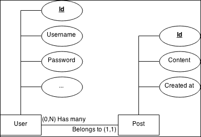
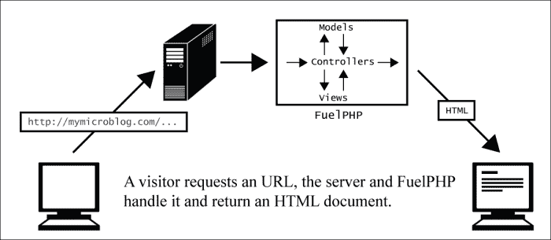
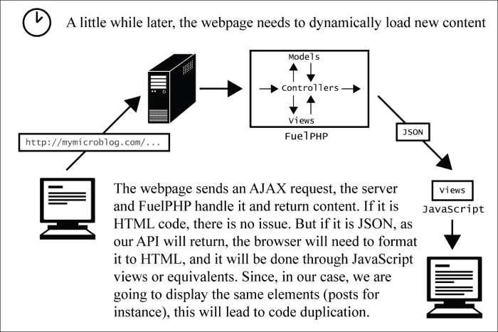
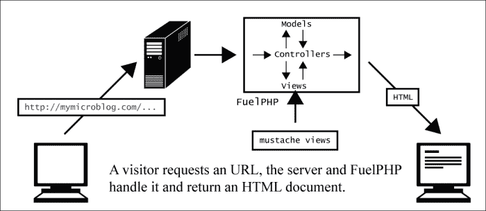
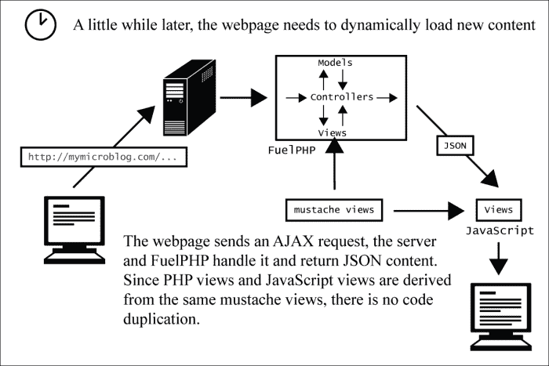
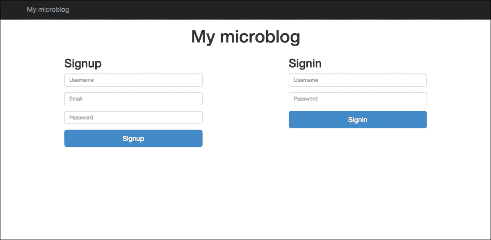
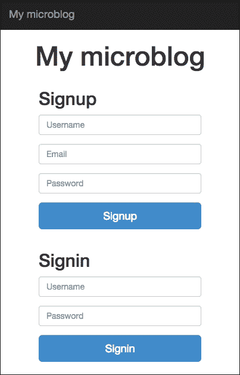
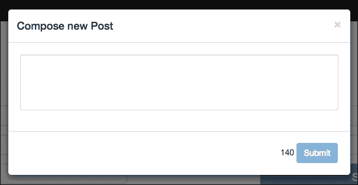

# 第五章. 构建自己的 RESTful API

在本章中，我们将创建自己的类似于 Twitter 的微型博客应用程序。社交组件将相当简单：用户将在他们的墙上发布最多 140 个字符的消息。本章的实际输入将在于设置一个可以通过外部应用程序访问的 JSON API，并添加自动测试，这将允许你跟踪回归。为了限制交换的数据量，我们将尽可能让我们的应用程序使用此 API。

到本章结束时，你应该知道：

+   如何创建注册表单

+   如何实现一个不重复任何代码的 JSON API

+   `Parser`包是什么

+   什么是语言无关的模板系统以及为什么使用这样的系统

+   Mustache 引擎是什么以及如何使用它实现视图

+   什么是魔法迁移

+   如何实现单元测试并运行它们

# 规格

访问者可以订阅我们的微型博客应用程序。一旦他们这样做，他们就能写 140 个字符的小帖子，这些帖子将显示在他们的个人资料页面上。任何人，即使是非用户，也可以看到用户的个人资料页面。

为了避免认证问题并保持项目简单，我们只提供只读的 JSON API。此外，我们不会跟踪使用我们 API 的应用程序，因此不会实施任何限制（如果您正在考虑发布自己的 API，这可能是一个重要的点）。因此，只有用户的个人资料信息（用户名、创建日期等）和发布的帖子将通过 API 提供。

# 概念

我们需要以下两个模型：



实体关系图（Min-Max 表示法）

+   **用户**：由于模型的表将由`Auth`包的迁移生成，因此列已经生成。我们需要的是`username`和`password`列。

+   **帖子**：每篇帖子都有一个`content`和`created_at`属性。由于每篇帖子只能由单个用户发布，每个用户可以发布多篇文章，因此帖子与用户之间存在`belongs_to`关系，用户与帖子之间存在`has_many`关系。因此，必须添加一个额外的`user_id`属性来表示这种关系。

# FuelPHP 的安装和配置

您首先需要执行以下步骤：

1.  安装新的 FuelPHP 实例。

1.  配置 Apache 和主机文件以处理它。在本章中，我们将通过请求`http://mymicroblog.app` URL 来访问我们的应用程序。

1.  如有必要，更新 Composer。

1.  为您的应用程序创建一个新的数据库。

1.  最后，配置 FuelPHP 以允许您的应用程序访问此数据库。

此项目还需要`ORM`、`Auth`和`Parser`包。我们在前面的章节中使用了`ORM`和`Auth`包，但从未使用过`Parser`包；我们将在*《Parser 包和模板引擎》*部分解释其作用。由于它们已经安装，我们只需要启用它们。为此，只需打开`APPPATH/config/config.php`文件，并在返回数组的末尾插入以下代码行：

```php
'always_load'  => array(
    'packages'  => array(
        'orm',
        'auth',
        'parser',
    ),
),
```

或者，你可以取消注释适当的行。这将每次加载 FuelPHP 实例时加载`ORM`、`Auth`和`Parser`包。我们还需要为`Auth`包更改一些配置项。

首先，将位于`PKGPATH/auth/config/auth.php`的文件复制到`APPPATH/config/auth.php`，并将`PKGPATH/auth/config/simpleauth.php`复制到`APPPATH/config/simpleauth.php`。

然后，打开配置文件`APPPATH/config/auth.php`，将`salt`值更改为随机字符串（这是一种安全预防措施）。在这里，我们将使用`Simpleauth`驱动程序，因为我们不需要在认证系统中使用很多功能。

然后，打开`APPPATH/config/simpleauth.php`文件，将`login_hash_salt`的值设置为随机字符串（再次，出于安全考虑）。通过执行迁移文件来安装`Auth`表：

```php
php oil refine migrate --packages=auth

```

如果你查看数据库，你应该会看到已经生成了几个表：

+   `users`

+   `users_clients`

+   `users_providers`

+   `users_scopes`

+   `users_sessions`

+   `users_sessionscopes`

然而，正如预期的那样，生成的表比`Ormauth`驱动程序少得多。

# 解析器包和模板引擎

你可能会注意到我们已将`parser`包添加到`always_load.package`键中。多亏了这个包，我们不再需要用 PHP 编写视图，而是能够使用模板引擎。对于那些不熟悉模板引擎的人来说，它们允许我们使用不同的语法编写视图文件。

例如，可以通过在 PHP 中编写以下代码来显示项目列表：

```php
<h1>Items</h1>
<?php foreach ($items as $item) { ?>
    <li><?php echo $item->title ?></li>
<?php } ?>
<a href="item/create">Create an item</a>
```

但是，使用 HAML 模板引擎，可以写成这样：

```php
%h1 Items
- foreach ($items as $item)
  %li
    = $item->title
%a(href="item/create") Create an item
```

或者，使用 Mustache 模板引擎，可以写成这样：

```php
<h1>Items</h1>
{{#items}}
  <li>{{title}}</li>
{{/items}}
<a href="item/create">Create an item</a>
```

你可能有各种原因想要使用模板引擎：

+   它允许你编写更简洁、更优雅的代码，例如在 HAML 语言中。

+   它允许你保持一致的代码格式。

+   它迫使你将逻辑与表示分离。因此，你可以轻松地将代码交给设计师，设计师可以更改它而无需理解任何 PHP。

对于我们的项目，我们将使用 Mustache 模板引擎，但并非出于上述任何原因。

# 语言无关模板引擎的主要好处

如果您打开 Mustache 模板引擎的主页([`mustache.github.io/`](http://mustache.github.io/))，您会发现该引擎在许多不同的语言中都有可用（Ruby、JavaScript、Python、Node.js、PHP、Java、C++、ASP、C#等等）。然而，您打算使用哪种语言使用该引擎并不重要：模板的语法将保持不变，语言不会对您所编写的代码产生影响。这是因为 Mustache 是一个语言无关的模板引擎。如果您与使用多种不同语言（如 PHP、JavaScript、Ruby 或 Python）的团队合作，这是一个巨大的优势；您的视图可以使用相同的通用标记语言编写。我们将利用这一特性来发挥我们的优势。

下面的图表显示了网站目前最常见的工作方式：



但您通常需要在浏览器中显示网页后动态加载新内容：



为了进一步说明这一点，让我们假设我们正在显示一个用户的个人资料页面，因此显示其帖子列表。如果用户已经发布了 1000 篇帖子，我们不会一次性显示它们。我们首先使用 PHP 视图显示最后 30 篇帖子，例如，这样网页在某个时刻应该看起来像这样：

```php
...
<div class="posts_list">
    <div class="post" id="post_232">
       <div class="post_author">first_user</div>
       <div class="post_content">My last post.</div>
       <div class="post_date">5 minutes ago</div>
    </div>
    <div class="post" id="post_214">
       <div class="post_author">first_user</div>
       <div class="post_content">Hello everyone.</div>
       <div class="post_date">21 minutes ago</div>
    </div>
    ...
</div>
...
```

当访客滚动到网页底部时，它将向服务器 API 发送 AJAX 请求，该请求将用 JSON 格式替换之前的 30 篇帖子。返回的代码应该看起来像这样：

```php
{
    ...
    "posts": [
        {
            "id": 142,
            "content": "previous post.",
            "created_at": 1409741475,
            "author": {
                "id": 24,
                "username": "first_user"
            }
        },
        {
            "id": 125,
            "content": "very old post.",
            "created_at": 1209751372,
            "author": {
                "id": 24,
                "username": "first_user"
            }
        },
        ...
    ]
    ...
}
```

我们已经拥有了所有必要的数据，但我们需要将其转换为 HTML 代码，以便用户能够看到。无论您使用 jQuery 还是直接 DOM 操作，您都需要使用 JavaScript 代码来完成这项工作（该代码将充当 JavaScript 视图）。这会导致代码重复，也就是说，如果您更改 PHP 视图中帖子显示的方式，您也需要更改 JavaScript 代码。对于大型项目来说，这会迅速变得难以管理。然而，如果我们使用 mustache 模板引擎，所有这一切都可以改变。



这里没有什么特别之处。然而，在加载动态内容时，这个过程得到了改进：



由于 Mustache 模板引擎是语言无关的，因此可以在 PHP 和 JavaScript 中解释同一个模板。如果我们想改变，比如说，帖子显示的方式，我们只需要更改这个模板。没有重复总意味着更健壮和易于维护的应用程序。

当然，我们始终可以编写一个完整的 JavaScript 应用程序，从 API 加载数据而不使用任何 PHP 视图。这样，就不需要模板引擎，因为我们只会编写 JavaScript 视图。然而，能够直接从服务器返回 HTML 内容有两个好处。首先，如果客户端不支持 JavaScript——如大多数搜索引擎的情况——它仍然能够访问网站（因此，您应用程序的索引将更好）。其次，当客户端第一次访问您的网站时，您可以通过返回请求网页的缓存 HTML 代码来加快这个过程。

为了使用 Mustache 模板引擎，我们需要安装它。在`composer.json`文件中，在`require`列表中添加以下行（别忘了在上一行添加逗号）：

```php
"mustache/mustache": "2.7.0"
```

然后更新 Composer。

### 备注

我们选择 Mustache 引擎主要是因为它的简洁性，但您有很多其他选择。如果您想使用我们将在更复杂的项目中实施的 API 策略，我建议您查看更完整的解决方案。例如，尽管它们本身不是语言无关的模板引擎，您可以考虑 Smarty 及其 JavaScript 端口 jSmart。

# 订阅和认证功能

我们不会生成整个脚手架，我们将手动创建控制器和视图，因为我们不需要大多数 CRUD 功能。

## 实现订阅和认证表单

首先，让我们创建用户控制器。在`APPPATH/classes/controller/user.php`创建一个文件，并设置其内容为：

```php
<?php
class Controller_User extends Controller_Template
{

}
```

主页，将由`User`控制器的`index`操作处理，如果用户已登录，将显示用户的帖子，否则将显示订阅和认证表单。

由于我们系统中没有用户，没有人可以登录。因此，我们将开始订阅和认证表单。

首先，在`User`控制器中添加以下方法：

```php
public function action_index()
{
    if (false /* is the user logged ? */) {
        // @todo: handle response if user is logged.
    } else {
        $this->template->content = 
            View::forge(
                'user/connect.mustache',
                array(),
                // By default, mustache escapes displayed
                // variables, so no need to escape them here
                false
            );
    }
}
```

我们稍后会回到这个操作，但到目前为止，这对您来说应该相当简单。

由于我们使用`Controller_Template`，我们需要定义一个模板。在`APPPATH/views/template.php`创建模板视图文件，并设置其内容为：

```php
<!DOCTYPE html>
<html>
<head>
<?php
echo '<base '.array_to_attr(array('href' => Uri::base())).' />';
?>
    <meta charset="utf-8">
    <title>My microblog</title>
    <?php echo Asset::css('bootstrap.css'); ?>
    <?php echo Asset::css('website.css'); ?>
    <style>
        body { margin: 50px; }
    </style>
    <?php echo Asset::js(array(
        'http://code.jquery.com/jquery-1.11.2.min.js',
        'bootstrap.js'
    )); ?>
    <script>
        $(function(){ $('.topbar').dropdown(); });
    </script>
</head>
<body>

    <div class="navbar navbar-inverse navbar-fixed-top">
        <div class="container">
            <div class="navbar-header">
                <a class="navbar-brand"
<?php echo array_to_attr(array('href' => Uri::base())) ?>
                >
                    My microblog
                </a>
            </div>
        </div>
    </div>

    <div class="container">
        <div class="row">
			<div class="col-md-12">
<?php if (Session::get_flash('success')): ?>
				<div class="alert
                            alert-success
                            alert-dismissable">
					<button
                            type="button"
                            class="close"
                            data-dismiss="alert"
                            aria-hidden="true">
                        &times;
                    </button>
					<p>
<?php
echo implode(
    '</p><p>',
    (array) Session::get_flash('success')
); ?>
					</p>
				</div>
<?php endif; ?>
<?php if (Session::get_flash('error')): ?>
				<div class="alert
                            alert-danger
                            alert-dismissable">
					<button
                            type="button"
                            class="close"
                            data-dismiss="alert"
                            aria-hidden="true">
                        &times;
                    </button>
					<p>
<?php
echo implode(
    '</p><p>',
    (array) Session::get_flash('error')
); ?>
					</p>
				</div>
<?php endif; ?>
			</div>
<?php echo $content; ?>
        </div>
    </div>
</body>
</html>
```

它灵感来源于第三章中生成的管理模板，*构建博客应用程序*，您可以将其与位于`PKGPATH/oil/views/admin/template.php`的用于脚手架生成的文件进行比较。我们使用 Bootstrap 框架以响应式的方式轻松构建我们的网页；我们不时会使用其 CSS 类。您可以在[`getbootstrap.com/`](http://getbootstrap.com/)查看 Bootstrap 的官方文档。

我们还将在`website.css`文件中定义一些自定义 CSS 类。由于我们已经在模板中包含了它，所以在`public/assets/css/website.css`创建样式表文件，并设置其内容为：

```php
body {
    background-color: #f8f8f8;
}

h1.home {
    font-size: 45px;
    text-align: center;
}

.alert {
    margin-top: 10px;
}
```

现在，我们需要创建`APPPATH/views/user/connect.mustache`视图。我们需要在那里添加注册和登录表单，所以这不是什么高难度的任务：

```php
<h1 class="home">
    My microblog
</h1>
<div class="signup_or_signin">
    <div class="signin col-md-1"></div>
    <div class="signup col-md-4">
        <h2>Signup</h2>
        <form action="user/signup" method="post">
            <div class="form-group">
                <input
                       type="text"
                       name="username"
                       placeholder="Username"
                       class="form-control" />
            </div>
            <div class="form-group">
                <input
                       type="email"
                       name="email"
                       placeholder="Email"
                       class="form-control" />
            </div>
            <div class="form-group">
                <input
                       type="password"
                       name="password"
                       placeholder="Password"
                       class="form-control" />
            </div>
            <div class="form-group">
                <input
                       type="submit"
                       value="Signup"
                       class="btn btn-lg
                              btn-primary
                              btn-block" />
            </div>
        </form>
    </div>
    <div class="signin col-md-2"></div>
    <div class="signin col-md-4">
        <h2>Signin</h1>
        <form action="user/signin" method="post">
            <div class="form-group">
                <input
                       type="text"
                       name="username"
                       placeholder="Email or Username"
                       class="form-control" />
            </div>
            <div class="form-group">
                <input
                       type="password"
                       name="password"
                       placeholder="Password"
                       class="form-control" />
            </div>
            <div class="form-group">
                <input
                       type="submit"
                       value="Signin"
                       class="btn btn-lg
                              btn-primary
                              btn-block" />
            </div>
        </form>
    </div>
    <div class="signin col-md-1"></div>
</div>

```

由于我们的视图中还没有动态部分，你可以看到它与经典的 PHP 或 HTML 视图非常相似。

最后，由于我们希望`User`控制器的`index`操作成为我们的主页，我们需要在`routes`配置文件中的`_root_`键中定义其 URI。打开`APPPATH/config/routes.php`配置文件，将其内容设置为：

```php
<?php
return array(
  '_root_'  => 'user/index',
);
```

如果你请求以下 URL：

`http://mymicroblog.app/`

你应该看到一个简单但响应式的网页，包含注册和登录表单。

在以下屏幕截图中，你可以看到在大屏幕上网页的样子：



这是小屏幕和设备上网页的样子：



## 处理注册表单

由于目前没有用户存在，现在是时候在`User`控制器中创建`signup`操作（由注册表单指向）了，这样我们就可以创建我们的第一个用户。创建以下方法并阅读注释（你应该已经熟悉所有这些方法）：

```php
public function action_signup()
{
    /*
    Validating our form (checks if the username, the
    password and the email have a correct value). We
    are using the same Validation class as we saw on
    numerous generated models
    */
    $val = Validation::forge('signup_validation');
    $val->add_field(
        'username',
        'Username',
        'required|valid_string[alpha,lowercase,numeric]'
    );
    $val->add_field(
        'password',
        'Password',
        'required|min_length[6]'
    );
    $val->add('email', 'Email')
        ->add_rule('required')
        ->add_rule('valid_email');

    // Running validation
    if ($val->run())
    {
        try {
            // Since validation passed, we try to create
            // a user
            $user_id = Auth::create_user(
                Input::post('username'),
                Input::post('password'),
                Input::post('email')
            );

            /*
            Note: at this point, we could send a
            confirmation email, but for the sake of this
            chapter conciseness, we will leave the
            implementation of this feature to you as a
            training exercise.
            */

            // If no exceptions were triggered, the user
            // was succesfully created.
            Session::set_flash(
                'success',
                e('Welcome '.Input::post('username').'!')
            );
        } catch (\SimpleUserUpdateException $e) {
            // Either the username or email already exists
            Session::set_flash('error', e($e->getMessage());
        }

    }
    else
    {
        // At least one field is not correct
        Session::set_flash('error', e($val->error()));
    }

    /*
    Sending the signup form fields information so that they
    are already filled when the user is redirected to the
    the index action (useful if the user could not be created)
    */
    Session::set_flash('signup_form', Input::post());

    // No matter what, we return to the home page.
    Response::redirect('/');
}
```

如果你现在请求主页并正确填写注册表单，`users`表中应该会创建一个新的用户。如果出现问题（例如，你输入了不完整的电子邮件地址或用户名已存在），将显示错误消息，但由于我们返回主页，表单将被清空。这没什么大不了的，但它可能会降低你的转化率。我们已经将表单数据保存在`signup_form`闪存变量中；因此，现在它可以在`index`操作中访问。我们将在`index`操作中通过替换以下内容将其传递给视图：

```php
View::forge(...);
```

使用：

```php
View::forge(
    'user/connect.mustache',
    array(
       'signup_form' => Session::get_flash('signup_form'),
    ),
    // By default, mustache escape displayed
    // variables, so no need to escape them here
    false
);
```

要自动填充`username`字段，打开`APPPATH/views/user/connect.mustache`视图文件，并将注册表单中的`username`输入替换为以下代码片段：

```php
<input
       type="text"
       name="username"
       placeholder="Username"
       class="form-control"
       value="{{signup_form.username}}"/>
```

如你所见，我们通过写入`{{signup_form.username}}`显示了`$signup_form['username']`变量。在 Mustache 文件中，通过写入`{{var}}`显示`$var`变量，通过写入`{{var.val_1}}`显示`$var['val_1']`。如果`$var`是一个对象，通过写入`{{var.val_1}}`也可以显示`$var->val_1`。

你也可以通过在注册表单的`email`输入中添加`value="{{signup_form.email}}"`来自动填充`email`字段。

## 处理登录表单

现在我们能够创建新用户了，我们需要处理登录表单。因此，我们将在`User`控制器中创建`signin`操作：

```php
public function action_signin()
{
    // If already logged in, redirecting to home page.
    if (Auth::check()) {
        Session::set_flash(
            'error',
            e('You are already logged in, '.
            Auth::get_screen_name().'.')
        );
        Response::redirect('/');
    }

    $val = Validation::forge();
    $val->add('username', 'Email or Username')
        ->add_rule('required');
    $val->add('password', 'Password')
        ->add_rule('required');

    // Running validation
    if ($val->run())
    {
        $auth = Auth::instance();

        // Checking the credentials.
        if (
            Auth::check() or
            $auth->login(
                Input::post('username'),
                Input::post('password')
            )
        )
        {
            Session::set_flash(
                'success',
                e('Welcome, '.Auth::get_screen_name().'!')
            );
        }
        else
        {
            Session::set_flash(
                'error',
                'Incorrect username and / or password.'
            );
        }
    } else {
        Session::set_flash(
            'error',
            'Empty username or password.'
        );
    }

    // No matter what, we return to the home page.
    Response::redirect('/');
}
```

这又非常受`oil`中由管理面板生成器生成的`admin`控制器的影响；查看位于`PKGPATH/oil/views/admin/orm/controllers/admin.php`的`admin`控制器的`login`操作（用于管理面板生成）。

## 允许用户注销

你可能在测试表单时注意到，一旦你成功登录，你就无法注销。除非你刚刚成功登录，否则你没有任何线索表明你是否已登录。

为了解决这个问题，我们将在导航栏中显示用户名，并允许用户在下拉菜单中注销，就像我们在管理面板中所做的那样。

打开位于`APPPATH/views/template.php`的模板文件，将`<div class="navbar-header">...</div>`替换为以下代码行：

```php
<div class="navbar-header">
    <!-- Allows the navbar to collapse when
         the screen width is too small -->
    <button
            type="button"
            class="navbar-toggle"
            data-toggle="collapse"
            data-target=".navbar-collapse">
        <span class="icon-bar"></span>
        <span class="icon-bar"></span>
        <span class="icon-bar"></span>
    </button>
    <a class="navbar-brand"
<?php echo array_to_attr(array('href' => Uri::base())); ?>
    >
        My microblog
    </a>
</div>
<div class="navbar-collapse collapse">
<?php if (Auth::check()): ?>
    <ul class="nav navbar-nav pull-right">
        <li class="dropdown">
            <a
               data-toggle="dropdown"
               class="dropdown-toggle"
               href="#">
                <?php echo e(Auth::get_screen_name()) ?>
                <b class="caret"></b>
            </a>
            <ul class="dropdown-menu">
                <li>
<?php
echo Html::anchor('user/signout', 'Sign out');
?>
                </li>
            </ul>
        </li>
    </ul>
<?php endif; ?>
</div>
```

如果你已登录，你的用户名现在应该出现在屏幕的右上角。如果你点击你的用户名，应该出现**注销**链接。

现在，我们必须在`User`控制器中实现这个`signout`动作。这一步相当简单：

```php
public function action_signout()   
{
    Auth::logout();
    Response::redirect('/');
}
```

# 允许用户创建和查看帖子

现在，我们将允许用户创建他们自己的帖子并在他们的个人资料页中显示它们。帖子也将是我们 API 显示的主要信息。

## 生成帖子模型

我们首先需要生成帖子模型。像往常一样，我们将使用`oil`。输入以下命令行：

```php
php oil generate model post content:varchar[140] user_id:int created_at:int --no-timestamp

```

输出如下：

```php
Creating model: APPPATH/classes/model/post.php
Creating migration: APPPATH/migrations/001_create_posts.php

```

你可以看到我们在这里使用了`--no-timestamp`参数。它只是阻止自动生成`created_at`和`updated_at`列。由于我们可能有大量的帖子，而`updated_at`列可能变得无意义，我们将手动生成`created_at`列。因此，我们需要自己指定`CreatedAt`观察者。打开位于`APPPATH/classes/model/post.php`的帖子模型，并添加以下属性：

```php
protected static $_observers = array(
    'Orm\Observer_CreatedAt' => array(
        'events' => array('before_insert'),
        'mysql_timestamp' => false,
    ),
);
```

然后，简单地使用`oil`执行你的应用程序迁移：

```php
php oil refine migrate

```

## 允许用户创建新帖子

我们将首先实现用户界面，然后我们将实现帖子创建动作。

### 实现用户界面

首先，让我们在导航栏的右侧添加一个**新建帖子**按钮。打开位于`APPPATH/views/template.php`的模板文件，在`<ul class="nav navbar-nav pull-right">`之后添加以下代码行：

```php
<li>
    <a href="#"
       data-toggle="modal"
       data-target="#create_post_modal">
        <!-- Displays the pencil icon.
             http://glyphicons.com/ -->
        <span class="glyphicon glyphicon-pencil"></span>
        New post
    </a>
</li>
```

如果你刷新主页并且已经登录，你应该在导航栏的右侧看到带有铅笔图标的按钮。我们广泛使用了 Bootstrap 框架，因此建议你阅读官方文档[`getbootstrap.com/`](http://getbootstrap.com/)。

需要注意的是，链接内部声明的两个属性：

```php
data-toggle="modal" data-target="#create_post_modal"
```

这意味着当我们点击链接时，我们希望 Bootstrap 使用具有`id = create_post_modal`的`div`元素的内容显示一个模态窗口。因此，我们需要定义这个`div`元素。在`</body>`之前添加以下代码行：

```php
<!-- Post modal window -->
<div
     class="modal fade"
     id="create_post_modal"
     tabindex="-1"
     role="dialog"
     aria-labelledby="myModalLabel"
     aria-hidden="true">
    <div class="modal-dialog">
        <div class="modal-content">
            <div class="modal-header">
                <button
                        type="button"
                        class="close"
                        data-dismiss="modal">
                    <span aria-hidden="true">&times;</span>
                    <span class="sr-only">Close</span>
                </button>
                <h4 class="modal-title" id="myModalLabel">
                    Compose new Post
                </h4>
            </div>
            <div class="modal-body">
                <!-- Will be displayed conditionally -->
                <div id="post_success" class="alert
                            alert-success">
                    Your post has been successfully
                    published!
                </div>
                <!-- Will be displayed conditionally -->
                <div id="post_fail" class="alert
                            alert-danger"></div>

                <textarea
                          id="post_content"
                          rows="4"
                          class="form-control"></textarea>
            </div>
            <div class="modal-footer">
                <span id="post_remaining_characters"></span>
                <button
                        type="button"
                        class="btn btn-primary"
                        id="post_submit_button">
                    Submit
                </button>
            </div>
        </div>
    </div>
</div>
```

这段代码是从官方文档[`getbootstrap.com/javascript/#modals`](http://getbootstrap.com/javascript/#modals)中的实时演示中获得的灵感。

在`website.css`文件中添加以下样式：

```php
textarea {
    resize: none;
}

#post_success, #post_fail {
    display: none;
}

#post_remaining_characters.too_much {
    color: red;
}
```

点击**新建帖子**按钮后，你现在应该看到以下模态窗口：



然而，如果你尝试点击**提交**按钮，什么也不会发生。我们需要添加一些 JavaScript 代码来实现这一点。

由于这不会很短，首先在`public/assets/js/post_form.js`中创建一个新的 JavaScript 文件，并通过在模板中添加`'post_form.js'`，在`'bootstrap.js'`之后，在模板的`Asset::js`调用中包含它。

接下来，打开新创建的 JavaScript 文件，并设置其内容为：

```php
// When the DOM is ready
$(function(){
    // jQuery elements initialization
    var $postContent = $('#post_content');
    var $postRemainingCharacters =
        $('#post_remaining_characters');
    var $postSuccess = $('#post_success');
    var $postFail = $('#post_fail');
    var $postSubmitButton = $('#post_submit_button');

    // Defining the max number of characters of a post
    var postMaxNbCharacters = 140; // will be improved

    /*
    Refreshes the remaining number of characters indicator,
    and whether or not the submission button is enabled.
    */
    function refreshPostWindow() {
        var postLength = $postContent.val().length;
        var remainingCharacters =
            postMaxNbCharacters - postLength;

        $postRemainingCharacters
        .text(remainingCharacters)
        .attr(
            'class',
            remainingCharacters >= 0 ? '' : 'too_much'
        );

        $postSubmitButton.prop(
            'disabled',
            postLength == 0 || remainingCharacters < 0
        );
    }

    // Initialization
    refreshPostWindow();

    /*
    When showing the post creation modal window, clearing
    all previous messages. Useful if a user publishes many
    posts in a row.
    */
    $('#create_post_modal')
    .on('show.bs.modal', function() {
        $postFail.hide();
        $postSuccess.hide();
    });

    // When the user type in the post textarea
    $postContent.keyup(function() {
        // In case he writes two posts in a row
        $postSuccess.hide();
        // See comments above
        refreshPostWindow();
    });

    // When clicking on the submit button
    $postSubmitButton.click(function() {

        // Sending an AJAX POST request to post/create.json
        // with the post content.
        $.post(
            'post/create.json',
            {post_content: $postContent.val()}
        )
        .done(function(data) {
            // In case the connection succeeded

            /*
            The action will define whether or not the
            post passed validation using the data.success
            variable.
            */ 
            if (data.success) {
                // If succeeded
                $postFail.hide();
                $postContent.val('');
                refreshPostWindow();
                $postSuccess.show();
            } else {
                // If failed, the error message will be
                // defined in data.error.
                $postFail
                .text(data.error)
                .show();
            }
        })
        .fail(function() {
            // In case the connection failed
            $postFail
            .text('Sorry, it seems there was an issue ' +
                  'somewhere. Please try again later.')
            .show();
        });
    });
});
```

读取前面代码中的注释。如果你刷新主页并尝试提交新帖子，将出现消息**抱歉，似乎某个地方出了问题。请稍后再试**，因为我们还没有实现`post`/`create`操作。

你可能已经注意到以下行：

```php
var postMaxNbCharacters = 140; // will be improved
```

这行代码有问题，因为我们在这里定义了帖子可以拥有的最大字符数，我们将在实现我们的操作（用于验证）时需要这个信息。最好的选择是只定义一次这个信息，这样，如果我们将来需要更改它，我们只需要更改一行。因此，我们将这个变量写入配置文件。

在`APPPATH/config/mymicroblog.php`中创建配置文件，并设置其内容为：

```php
<?php
return array(
    'post_max_nb_characters' => 140,
);
```

在我们的操作中，稍后访问它将很容易，但配置文件的内容目前无法通过我们的 JavaScript 代码访问。为了解决这个问题，打开位于`APPPATH/views/template.php`的模板视图文件，并在`script`标签内的`$(function(){ $('.topbar').dropdown(); });`之后添加以下代码行：

```php
<?php
// Converts the mymicroblog configuration to json.
$json_configuration = Format::forge(
    \Config::load('mymicroblog', true)
)->to_json();

echo '        ';
echo 'var MMBConfiguration = '.$json_configuration.";\n";
?>
```

然后，回到`post_form.js` JavaScript 文件，将`var postMaxNbCharacters = 140; // will be improved`替换为以下代码行：

```php
var postMaxNbCharacters =
    MMBConfiguration['post_max_nb_characters'];
```

当你在 JavaScript 和 PHP 代码之间有一些常见的变量和常量时，始终采用类似的解决方案是一个好主意。

### 实现帖子创建操作

现在我们将处理 AJAX 请求，检查发送的数据，并在一切正常的情况下创建帖子。

首先，我们需要创建`Post`控制器。创建`APPPATH/classes/controller/post.php`文件，目前将其内容设置为：

```php
<?php
class Controller_Post extends Controller_Rest 
{
}
```

你可以看到我们在这里扩展了一个不同的控制器类；我们不是扩展`Controller_Template`，而是扩展`Controller_Rest`。它是一个内置了 RESTful 支持的基本控制器。它将允许我们轻松实现我们将要发送的 JSON 响应，并且它还将帮助我们稍后实现 API。

为了说明这一点，添加以下测试操作：

```php
public function action_test() {
    return $this->response(array(
        'test_1' => 42,
        'test_2' => 'Answer to the Ultimate Question',
        'test_3' => array(
            'test_4' => array(
                'test_5', 'test_6', 'test_7'
            ),
            'test_8' => true,
            'test_9' => null,
        ),
    ));
}
```

如果你现在请求以下 URL：

`http://mymicroblog.app/post/test`

应该出现以下输出：

**请求的 REST 方法返回了一个数组或对象：**

**{ "test_1": 42, "test_2": "终极问题的答案", "test_3": { "test_4": [ "test_5", "test_6", "test_7" ], "test_8": true, "test_9": null } }**

如果你请求以下 URL：

`http://mymicroblog.app/post/test.json`

它将返回：

```php
{
    "test_1":42,
    "test_2":"Answer to the Ultimate Question",
    "test_3":{
        "test_4":["test_5","test_6","test_7"],
        "test_8":true,
        "test_9":null
    }
}
```

如果你请求以下 URL：

`http://mymicroblog.app/post/test.xml`

它将返回：

```php
<?xml version="1.0" encoding="utf-8"?>
<xml>
    <test_1>42</test_1>
    <test_2>Answer to the Ultimate Question</test_2>
    <test_3>
        <test_4>
            <item>test_5</item>
            <item>test_6</item>
            <item>test_7</item>
        </test_4>
        <test_8>1</test_8>
        <test_9/>
    </test_3>
</xml>
```

如果你请求以下 URL：

`http://mymicroblog.app/post/test.php`

它将返回：

```php
array (
    'test_1' => 42,
    'test_2' => 'Answer to the Ultimate Question',
    'test_3' =>
    array (
        'test_4' =>
        array (
            0 => 'test_5',
            1 => 'test_6',
            2 => 'test_7',
        ),
        'test_8' => true,
        'test_9' => NULL,
    ),
)
```

到现在为止，你应该已经理解了，根据请求 URL 中定义的扩展名，动作将以相关格式返回结果。我建议你阅读官方文档[`fuelphp.com/docs/general/controllers/rest.html#/formats`](http://fuelphp.com/docs/general/controllers/rest.html#/formats)，以查看支持哪些格式。

可以通过打开 FuelPHP 网站，导航到 **DOCS** | **FuelPHP** | **General** | **Controllers** | **Rest** 来访问文档。

### 注意

REST 控制器的一个特定属性是它们允许你实现只对特定 HTTP 方法做出响应的动作。例如，如果我们把 `action_test` 方法命名为 `get_test`，则 `test` 动作将只响应 `GET` 请求。对于 `POST`、`PUT`、`DELETE` 和 `PATCH` 请求也是如此；再次建议你阅读关于 REST 控制的官方 FuelPHP 文档。

删除 `test` 动作并添加以下 `create` 动作：

```php
public function action_create()
{
    $post_content = Input::post('post_content');

    $response = array();

    if (!Auth::check()) {
        // In case the user has been signed out before
        // he submits his post.
        $response = array(
            'success' => false,
            'error' => 'You are not authenticated.',
        );
    } else {
        // Checking if the post is correct. The JavaScript
        // should have tested that already, but never trust
        // the client.
        $val = Validation::forge('post');
        $val->add_field(
            'post_content',
            'post',
            'required|max_length[140]'
        );

        if ($val->run())
        {
            // Creating the post.
            list(, $user_id) = Auth::get_user_id();
            $post = Model_Post::forge();
            $post->content = $post_content;
            $post->user_id = $user_id;
            if ($post and $post->save()) {
                $response = array(
                    'success' => true,
                );
            } else {
                $response = array(
                    'success' => false,
                    'error' => 'Internal error: Could'.
                        ' not save the post.',
                );
            }
        } else {
            // The error can only occur on the only field...
            $error = $val->error()['post_content'];
            $response = array(
                'success' => false,
                'error' => $error->get_message(),
            );
        }
    }

    return $this->response($response);
}
```

现在如果你尝试添加一个新的有效帖子，`posts` 表中应该添加一行，并且应该出现以下消息：

**你的帖子已成功发布！**

### 注意

虽然我们发送的是 JSON 响应，但我们不认为 `create` 动作是应用程序 API 的一部分。如前所述，我们的 API 只允许只读访问，并且不需要身份验证；该动作不遵守任何这些要求。然而，如果要将它集成到 API 中，它返回 JSON 内容（以及其他格式）是一个很好的开始。

## 实现个人资料页面

由于我们现在可以创建帖子，展示它们将非常棒。正如我们在规范中写的，用户个人资料页面显示已发布的帖子列表，因此我们将实现它。

### 配置路由

我们希望在请求以下 URL 时显示此个人资料页面：

`http://mymicroblog.app/USERNAME`

我们可以在 `User` 控制器的 `index` 动作中添加一个参数，但这将无谓地复杂化动作。而不是这样做，我们将使用路由来透明地重定向这些 URL 到 `User` 控制器的 `show` 动作：

`http://mymicroblog.app/user/show/USERNAME`

要做到这一点，打开 `APPPATH/config/routes.php` 配置文件，并在返回数组的末尾添加以下行：

```php
'(:segment)' => 'user/show/$1',
```

### 创建用户模型

在 `show` 动作内部，我们将需要从数据库中请求一个用户。我们将创建用户模型以更容易地完成此操作。创建 `APPPATH/classes/model/user.php` 文件，并将其内容设置为：

```php
<?php

class Model_User extends \Orm\Model
{
  protected static $_properties = array(
      'id',
      'username',
        'password',
        'group',
        'email',
        'last_login',
        'login_hash',
        'profile_fields',
        'created_at',
        'updated_at',
  );

  protected static $_table_name = 'users';

    protected static $_observers = array(
      'Orm\Observer_CreatedAt' => array(
          'events' => array('before_insert'),
          'mysql_timestamp' => false,
      ),
      'Orm\Observer_UpdatedAt' => array(
          'events' => array('before_save'),
          'mysql_timestamp' => false,
      ),
  );
}
```

### 实现显示动作

我们现在将在 `User` 控制器内部实现 `show` 动作，就像我们之前做的那样：

```php
public function action_show($username) {
    // Finding a user with a similar username
    $user = Model_User::find('first', array(
        'where' => array(
            array('username' => $username),
        ),
    ));

    if (!$user) {
        Session::set_flash(
            'error',
            'The user '.e($username).' does not exists.'
        );
        Response::redirect('/');
    }

    // Finding 20 latest posts (will be improved)
    $posts = Model_Post::find('all', array(
        'related' => 'user',
        'where' => array(
            array('user_id' => $user->id),
        ),
        'order_by' => array('id' => 'DESC'),
        'limit' =>
        \Config::get('mymicroblog.pagination_nb_posts'),
    ));

    // Displaying the profile page
    $this->template->content =
        View::forge(
            'user/show.mustache',
            array(
                'user' => $user,
                /*
                As Model_Post::find returns an associative
                array, with ids as keys and posts as
                values, we need to transform it to a
                classic array, otherwise mustache will
                process as an object and not the list,
                hence the use of array_values.
                */
                'posts' => array_values($posts),
            ),
            // By default, mustache escape displayed
            // variables...
            false
        );
}
```

我们还需要做几件事情。首先，你可以看到我们在查找帖子时指定了`'related' => 'user'`，但我们没有在`Post`模型中声明这个关系。通过打开`Post`模型并添加以下属性来修复它：

```php
protected static $_belongs_to = array('user');
```

然后，在用户模型中，你可能已经看到我们是从配置`\Config::get('mymicroblog.pagination_nb_posts')`中获取要加载的帖子数量。我们需要在`APPPATH/config/mymicroblog.php`文件中指定这个配置项。在返回的数组中，添加以下行：

```php
'pagination_nb_posts' => 20,
```

但仍然存在问题；我们还没有加载配置文件，所以`\Config::get('mymicroblog.pagination_nb_posts')`将返回`null`。我们可以在同一个操作中加载配置文件，但由于我们还需要在其他地方使用它，我们将在`before`方法中加载它。这个方法在执行任何操作之前被调用。在`User`控制器的开头添加以下行：

```php
public function before() {
    parent::before();

    \Config::load('mymicroblog', true);
}
```

如果我们想让这个操作工作，我们仍然需要实现`user/show.mustache`视图。

### 实现视图

首先，创建`APPPATH/views/user/show.mustache`视图文件，并设置其内容为：

```php
<div class="col-md-3"></div>
<div class="col-md-6 profile">
    <div class="row profile_informations">
        <h1>
            {{user.username}}
        </h1>
    </div>
    {{> post/list}}
</div>
<div class="col-md-3"></div>
```

唯一的新语法是`{{> post/list}};`，这意味着我们想要显示`post/list`部分，其 PHP 等价形式如下：

```php
echo \View::forge(
    'post/list.mustache',
    array(/* all current variables */),
    false
);
```

我们将`post`列表分离出来，因为我们还需要在其他操作中显示它。因此，下一步的逻辑步骤是实现这个部分。创建`APPPATH/views/post/list.mustache`视图文件，并设置其内容为：

```php
<div class="row post_list">
    {{> post/inside_list}}
</div>
```

我们只实现了一个简单的`div`元素，并在其中调用了另一个部分。这个新的部分将只显示列表的内容。创建`APPPATH/views/post/inside_list.mustache`视图文件，并设置其内容为：

```php
{{#posts}}
    <div class="post">
        <div class="post_content">{{content}}</div>
        <div class="post_additional_infos">
            By
            <a
                class="post_author"
                href="/{{user.username}}">
                {{user.username}}
            </a>
            &middot;
            <span
                class="post_date"
                data-timestamp="{{created_at}}">
            </span>
        </div>
    </div>
{{/posts}}
```

要理解这一点，你需要了解一个新的 Mustache 标签。`{{#posts}}`和`{{/posts}}`标签在这里实现，用于遍历`posts`数组。这两个标签之间的内容将为每个帖子重复。在这个循环中显示的变量将是之前声明的变量，或者是循环中当前帖子的属性；例如，`{{created_at}}`是循环中当前帖子的`created_at`属性，但我们可以显示`{{independent_variable}}`，这不会是当前帖子的属性，而是之前声明的变量。查看官方文档以了解变量是如何解析的（第二个链接托管在 Mustache 的 PHP 端口仓库中，但内容相当完整且清晰）：

+   [`mustache.github.io/mustache.5.html`](http://mustache.github.io/mustache.5.html)

+   [`github.com/bobthecow/mustache.php/wiki/Variable-Resolution`](https://github.com/bobthecow/mustache.php/wiki/Variable-Resolution)

然而，如果你现在尝试访问个人资料页面，即使这个用户创建了帖子，也只会显示用户名。这是因为 Mustache 不知道在哪里找到部分。为了解决这个问题，请再次打开 `User` 控制器，并在 `before` 方法的末尾添加以下代码行：

```php
\Parser\View_Mustache::parser()
    ->setPartialsLoader(
    new Mustache_Loader_FilesystemLoader(
        APPPATH.'views'
    )
);
```

如果你计划在模块中使用 Mustache，调用 `setPartialsLoader` 方法时你需要设置其他路径。

现在我们将添加一些样式。打开 `public/assets/css/website.css` 文件，并附加以下代码：

```php
.profile {
    border-left: 1px solid #e8e8e8;
    border-right: 1px solid #e8e8e8;
    background-color: white;
}

.profile_informations {
    text-align: center;
    padding-top: 10px;
    padding-bottom: 40px;
    border-bottom: 1px solid #e8e8e8;
}

.post {
    padding: 5px 10px 5px 10px;
    border-bottom: 1px solid #e8e8e8;
}

.post_content {
    margin-bottom: 10px;
    word-break: break-all;
    white-space: pre-wrap;
}

.post_additional_infos {
    color: #888;
}
```

如果你刷新个人资料页面，现在应该会显示帖子列表。

尽管如此，仍然存在一个问题：没有显示日期。然而，你可能已经阅读了如何在 `APPPATH/views/post/inside_list.mustache` 视图文件中显示 `created_at`，如下所示：

```php
<span>
    class="post_date"
    data-timestamp="{{created_at}}">
</span>
```

什么也看不见，但时间戳可以访问一个带有 `post_date` 类的 `span` 元素中。我们希望以相对格式（例如，5 分钟前）显示这些日期，并定期更新它们。我们将使用 JavaScript 和 jQuery 来完成这项操作。由于这是一个复杂的操作，我们将创建一个新的 JavaScript 文件。创建 `public/assets/js/posts_dates.js` 文件，并将其内容设置为：

```php
/*
Converts a timestamp to relative format.
You could use plugins as jquery.timeago for doing that, and
it would probably be better that way, but we implemented
ourselves the method for being sure we won't have any
compatibility issues in the future. It is far from a perfect
solution: for instance, it supposes the client and the server
share the same time zone.
*/
function relativeFormat(timestamp) {
    var timeLabels = [
        {
            divider: 31536000,
            label: '(:nb) year ago',
            label_plural: '(:nb) years ago'
        },
        {
            divider: 2592000,
            label: '(:nb) month ago',
            label_plural: '(:nb) months ago'
        },
        {
            divider: 86400,
            label: '(:nb) day ago',
            label_plural: '(:nb) days ago'
        },
        {
            divider: 3600,
            label: '(:nb) hour ago',
            label_plural: '(:nb) hours ago'
        },
        {
            divider: 60,
            label: '(:nb) minute ago',
            label_plural: '(:nb) minutes ago'
        }
    ];

    var seconds = Math.floor(
        (new Date() - timestamp) / 1000);

    for (var i = 0; i < timeLabels.length; i++) {
        var nb = Math.floor(seconds / timeLabels[i].divider);

        if (nb > 0) {
            var label = timeLabels[i][
                (nb == 1 ? 'label' : 'label_plural')];
            return label.replace('(:nb)', nb);
        }
    }
    return 'Few seconds ago';
}

// Refresh all posts dates
function refreshPostsDates() {
    $('.post_date').each(function() {
        var $this = $(this);
        $this.text(
            relativeFormat(
                parseInt($this.data('timestamp')) * 1000
            )
        );
    });
}

// When the DOM is ready
$(function(){
    refreshPostsDates();

    // Regularly refresh posts dates (every 30000ms = 30s)
    setInterval(refreshPostsDates, 30000);
});
```

最后，我们需要将此脚本包含在位于 `APPPATH/views/template.php` 的模板中。在 `'post_form.js'` 之后添加 `'posts_dates.js'`。

## 实现 API

现在我们已经开发了个人资料页面的第一个版本，我们将开始实现访问我们网站数据的 API。

### 实现基控制器

由于我们需要在 `User` 和 `Post` 控制器上使用方法，我们将首先实现一个基控制器，这两个控制器都将扩展它。创建 `APPPATH/classes/controller/base.php` 文件，并将其内容设置为：

```php
<?php
class Controller_Base extends Controller_Hybrid 
{

}
```

你可以看到 `Controller_Base` 正在扩展一个名为 `Controller_Hybrid` 的新原生控制器。正如其名所示，它是一个混合版本，实现了 `Controller_Template` 和 `Controller_Rest` 的功能。如果我们想要一个动作根据上下文返回 JSON 或 HTML，这正是我们需要的。

首先，将我们在 `User` 控制器中实现的 `before` 方法移动到这个新的 `Base` 控制器中。

接下来，实现以下方法：

```php
/*
Overriding the is_restful method to make the controller go into
rest mode when an extension is specified in the URL. Ex:
http://mymicroblog.com/first_user.json
*/
public function is_restful()
{
    return !is_null(\Input::extension());
}

/*
Handles an hybrid response: when no extension is specified
the action returns HTML code by setting the template's content
attribute with the specified view and data, and when an
extension is specified, the action returns data in the expected 
format(if available).
*/
public function hybrid_response($view, $data) {
    if (is_null(\Input::extension())) {
        $this->template->content =
        View::forge(
            $view.'.mustache',
            $data,
            // By default, mustache escape displayed
            // variables...
            false
        );
    } else {
        $this->response($data);
    }
}
```

每次我们想要一个混合响应（HTML、JSON 或 XML，取决于请求的扩展名），我们都需要调用 `hybrid_response` 方法。

最后，让 `Post` 和 `User` 控制器扩展这个新的 `Base` 控制器。

### 实现你的第一个混合动作

在 `User` 控制器的 `show` 动作中，将 `$this->template->content = ...;` 替换为以下代码行：

```php
return $this->hybrid_response(
    'user/show',
    array(
        'user' => $user,
        'posts' => array_values($posts),
    )
);
```

现在如果你请求以下 URL：

`http://mymicroblog.app/USERNAME.json`

（或者 `http://mymicroblog.app/USERNAME.xml`，因为浏览器通常显示这个格式更好）

你会看到数据现在可以访问了。问题是你可以读取太多的信息：

+   最紧迫的问题是，我们显示了每个对象的全部属性。对于用户对象来说，这是一个非常严重的问题，因为我们显示了他们的哈希密码、登录哈希、电子邮件，以及可能的其他机密信息。这是一个非常严重的安全问题。

+   我们不需要每次都显示对象的相同属性。例如，当显示用户个人资料页面时，我们可能想发布更多关于用户的信息，但当显示帖子的 `user` 属性时，只显示用户名。这是一个不那么紧急的问题，但仍然是一个重要的问题。

### 实现映射器以控制信息共享方式

为了控制通过 API 发送哪些信息，我们将实现映射器，将我们的对象转换为适当的关联数组，只包含我们想要显示的属性。映射器将根据上下文以不同的方式映射对象。

创建 `APPPATH/classes/mapper.php` 文件，并设置其内容为：

```php
<?php
// This class will be extended by all our mappers and
// contains general purpose methods.
class Mapper
{
    /**
    * Transforms an object or objects to their mapped
    * associative arrays. No matter what mapper we
    * will use, the idea is to always call
    * Mapper_CLASS::get('CONTEXT', $objects)
    *
    * @param string $context The context
    * @param mixed $objects Array of objects or single object
    *
    * @return array Array of associative array or associative
    *               array
    */
    static function get($context, $objects) {
        if (is_array($objects)) {
            $result = array();
            foreach ($objects as $object) {
                $result[] = static::get($context, $object);
            }
            return $result;
        } else {
            return static::$context($objects);
        }
    }

    /**
    * Extracts specified properties of an object and
    * returns them as an associative array.
    *
    * @param object $object The object to convert
    * @param array $attributes The list of attributes to extract
    *
    * @return array The associative array
    */
    static function extract_properties($object, $properties) {
        $result = array();
        foreach ($properties as $property) {
            $result[$property] = $object->{$property};
        }
        return $result;
    }
}
```

我们现在将为我们的 Post 和 User 模型创建映射器。首先，创建 `APPPATH/classes/mapper/post.php` 文件，并设置其内容为：

```php
<?php
// Mapper for posts
class Mapper_Post extends Mapper
{    
    static function item($post) {
        $result = static::extract_properties(
            $post,
            array('id', 'content', 'created_at')
        );
        $result['user'] = Mapper_User::get(
            'minimal',
$post->user
        );
        return $result;
    }
}
```

然后，创建 `APPPATH/classes/mapper/user.php` 文件，并设置其内容为：

```php
<?php
// Mapper for users
class Mapper_User extends Mapper
{
    static function minimal($user) {
        return array('username' => $user->username);
    }

    static function profile($user) {
        $result = static::extract_properties(
            $user,
            array('id', 'username', 'created_at')
        );

        /*
        profile_fields is always empty, but this is just here
        to illustrate that you can also send other information
        than object attributes.
        */
        $result['profile_fields'] = unserialize(
            $user->profile_fields
        );
        return $result;
    }
}
```

现在，我们只需在我们的 `User` 控制器的 `show` 动作中使用这些映射器。在动作内部，替换以下代码：

```php
'user' => $user,
'posts' => array_values($posts),
```

为以下代码行：

```php
'user' => Mapper_User::get('profile', $user),
'posts' => Mapper_Post::get('item', $posts),
```

现在，如果你请求以下 URL：

+   `http://mymicroblog.app/USERNAME.json`

+   `http://mymicroblog.app/USERNAME.xml`

你应该看到只有有用的信息出现。你始终可以访问 `http://mymicroblog.app/USERNAME`，因为 Mustache 模板引擎以相同的方式处理对象和关联数组。

### 注意

一些开源库提供了工具，允许你以标准化和更复杂的方式执行我们用 `mapper` 类所做的类似工作。如果你正在寻找这样的库，我建议你查看 `fractal` 库，网址为 [`fractal.thephpleague.com/`](http://fractal.thephpleague.com/)。

## 改进列表

个人资料网页仍然不完整，因为我们只显示了用户的最后 20 篇帖子。如果能通过添加一个“查看更多”按钮来改进这个列表，以便我们可以阅读更早的帖子，那就太好了。

我建议你生成许多帖子（你可以通过编程方式完成）在一个个人资料中，以便测试我们的界面。

### 给 JavaScript 访问我们的 Mustache 视图

在本节中，我们将使用 JavaScript 将 JSON 数据转换为 HTML 内容。确实，当你点击例如“查看更多”按钮时，将向我们的 API 发送 AJAX 请求，该请求将返回 JSON 数据。我们需要将此 JSON 代码转换为 HTML 内容，以便观众可以阅读它，但我们不希望有任何代码重复，因此我们将给 JavaScript 代码访问我们的 Mustache 视图。这将通过将所有 Mustache 文件的内容复制到 `public/assets/js/templates.js` JavaScript 文件中的对象来完成。

#### 生成 templates.js 文件

我们将讨论两种生成`template.js`文件的方法。

##### 简单而直接的方法

简单而直接的方法是在开发模式下每次有人访问您的应用程序时都重新生成此文件。为此，打开`APPPATH/bootstrap.php`文件，并在末尾添加以下代码行：

```php
// Executed each time the application is requested in
// development mode
if (Fuel::$env == Fuel::DEVELOPMENT && !\Fuel::$is_cli) {
    $view_directory = APPPATH.'views/';
    $extension = '.mustache';

    /*
    The following searches for mustache files in APPPATH/views/
    and saves its content into the $template associative array.
    Each key will be the template relative path; for instance,
    if a template is located at
    APPPATH/views/dir_1/file.mustache the value of the key
    will be dir_1/file.
    Each value will be the template content.
    */
    $templates = array();
    $it = new RecursiveDirectoryIterator($view_directory);
    foreach(new RecursiveIteratorIterator($it) as $file)
    {
        if (substr($file, -strlen($extension)) == $extension) {
            // Deducing the key from the filename
            // APPPATH/views/dir_1/file.mustache -> dir_1/file
            $file_key = substr(
                $file,
                strlen($view_directory)
            );
            $file_key = substr(
                $file_key,
                0,
                -strlen($extension)
            );

            $templates[$file_key] = file_get_contents($file);
        }
    }
    $template_file_content = 'MyMicroblog.templates = '.
        json_encode($templates).';';

    // Saves the templates in the templates.js file
    file_put_contents(
        DOCROOT.'assets/js/templates.js',
        $template_file_content
    );
}
```

尽管我们只在开发模式下生成文件，但如果您的应用程序包含大量模板，这可能会变得不可持续；您将遇到延迟和内存问题。您可能还需要更改一些权限，以便创建文件。但在大多数情况下，您应该没问题，并且这个解决方案的一个优点是不需要任何依赖。

##### 使用 guard-templates

您可以在请求应用程序时每次生成 JavaScript 文件，而不是使用类似于 guard-templates 的实用程序。这个想法是在您编码应用程序时启动这个实用程序，并且该实用程序将跟踪任何文件更改，并在必要时重新生成 JavaScript 文件。

### 备注

请注意，在撰写本文时，此实用程序似乎在 Ubuntu 上不起作用：如果您在阅读本书时仍然遇到这种情况，建议您使用我们在上一节中提供的解决方案。

您首先需要在您的计算机上安装 Ruby 和 gem。然后，您必须通过执行以下命令来安装`guard-template`gem：

```php
sudo gem install guard-templates

```

然后，在您的网站目录根目录下执行以下命令（就像您为`oil`所做的那样）：

```php
guard init templates

```

打开位于您网站目录根目录下的生成的`Guardfile`文件；它包含 guard-templates 实用程序的示例配置。用以下内容替换其内容：

```php
guard 'templates',
      :output => 'public/assets/js/templates.js',
      :namespace => 'MyMicroblog' do
    watch(/fuel\/app\/views\/(.*)\.mustache$/)
end
```

理解此配置应该相当简单。如果您有任何疑问，您始终可以检查[`github.com/thegreatape/guard-templates`](https://github.com/thegreatape/guard-templates)的官方文档。

然后，您可以通过执行以下命令来启动`guard`：

```php
guard

```

它将生成 JavaScript 文件，并在任何 Mustache 模板更改时重新生成它。

#### 集成 template.js 和 Mustache.js

现在我们已经将 Mustache 模板存储到 JavaScript 文件中，我们必须将其集成到我们的网站中。

首先，我们必须安装`mustache.js`，这是 Mustache 的 JavaScript 端口。为了做到这一点，请访问[`github.com/janl/mustache.js`](https://github.com/janl/mustache.js)的`mustache.js`存储库。

在`public/assets/js/mustache`文件夹中克隆存储库或下载并解压存档。

我们还将实现`render`函数，该函数灵感来源于 FuelPHP 的`render`函数（`View::forge(...)->render()`的等价物）。为此，创建`public/assets/js/view.js`文件，并将其内容设置为：

```php
// We need to initialize the MyMicroblog for our templates
// to work
MyMicroblog = {};

// Inspired from FuelPHP's render method
function render(view, data) {
    return Mustache.render(
        MyMicroblog.templates[view],
        data,
        MyMicroblog.templates
    );
}
```

我们现在需要在模板中包含我们的 JavaScript 文件。打开`APPPATH/views/template.php`文件，并在`'bootstrap.js'`行之后添加以下代码行：

```php
'mustache/mustache.js',
'view.js',
'templates.js',
```

刷新您的网页。如果您现在打开 JavaScript 控制台（在浏览器开发者工具中），并执行：

```php
render('user/connect', {})
```

您应该看到它返回正确的 HTML 代码。

### 实现 post/list 动作

我们还需要从服务器检索帖子数据。为此，我们将在 `Post` 控制器中实现两个动作：`list` 和 `count` 动作。在 `Post` 控制器末尾添加以下代码：

```php
// Get the posts list depending on $_GET parameters
// limited to 20 posts maximum
public function action_list() {
    $query = static::get_posts_query(Input::get(), true);
    $posts = $query->limit(
        \Config::get('mymicroblog.pagination_nb_posts')
    )->get();

    return $this->response(
        Mapper_Post::get('item', $posts)
    );
}

// Get the number of posts depending on $_GET parameters
public function action_count() {
    $query = static::get_posts_query(Input::get(), false);
    return $this->response($query->count());
}
```

`get` 和 `count` 动作调用 `static::get_posts_query` 方法。我们需要实现这个方法，我们将在 `Base` 控制器中完成：

```php
// Getting the posts query
public static function get_posts_query($params) {
    $user_id = Arr::get($params, 'user_id', null);
    // id > since_id
    $after_id = intval(
        Arr::get($params, 'after_id', null)
    );
    // id < from_id
    $before_id = intval(
        Arr::get($params, 'before_id', null)
    );

    $query = Model_Post::query();
    $query->related('user');
    $query->where('user_id', '=', $user_id);
    if ($after_id != 0) {
        $query->where('id', '>', $after_id);
    }
    if ($before_id != 0) {
        $query->where('id', '<', $before_id);
    }
    $query->order_by(array('id' => 'DESC'));

    return $query;
}
```

现在，如果您请求以下 URL：

`http://mymicroblog.app/post/list.json?user_id=ID`

它将返回 `id = ID` 的用户的最新的 20 篇帖子。

如果您请求以下 URL：

`http://mymicroblog.app/post/list.json?user_id=ID&before_id=30`

它将返回 `id` 值小于 `30` 的用户 `id = ID` 发布的最近 20 篇帖子。

如果您请求以下 URL：

`http://mymicroblog.app/post/list.json?user_id=ID&after_id=30`

它将返回 `id` 值大于 `30` 的用户 `id = ID` 发布的最近 20 篇帖子。

现在，如果您请求以下 URL：

`http://mymicroblog.app/post/count.json?user_id=ID`

它将返回用户 `id = ID` 发布的帖子数量。

如果您请求以下 URL：

`http://mymicroblog.app/post/count.json?user_id=ID&before_id=30`

它将返回 `id` 值小于 `30` 的用户 `id = ID` 发布的帖子数量。

如果您请求以下 URL：

`http://mymicroblog.app/post/count.json?user_id=ID&after_id=30`

它将返回 `id` 值大于 `30` 的用户 `id = ID` 发布的帖子数量。

我们将在稍后使用 `count` 动作，当我们需要知道自我们显示用户资料以来是否有任何帖子被发布时。

为了限制代码重复，在 `User` 控制器的 `show` 动作中，将 `$posts = Model_Post::find('all', ...);` 替换为以下代码行：

```php
$query = static::get_posts_query(
    array('user_id' => $user->id),
    true
);
$posts = $query->limit(
\Config::get('mymicroblog.pagination_nb_posts')
)->get();
```

### 注意

在控制器内部防止任何重复是可以的，但如果您需要在控制器内部实现很多与 `get_posts_query` 类似的代码和方法，那么您的实现可能存在问题。您应该考虑将一些代码片段移动到模型、辅助工具或库中。我必须说我对此方法应该在哪里实现犹豫了一下，但最终我决定在 `Base` 控制器中实现它，因为它会更方便。一般来说，要警惕控制器中的长代码块，因为它们不应该包含太多逻辑。

### 实现查看更多按钮

我们需要在视图中做一些更改。首先，打开 `APPPATH/views/post/inside_list.mustache` 并将 `<div class="post">` 替换为以下行：

```php
<div class="post" data-post_id="{{id}}">
```

它将使我们能够识别哪些帖子已经被显示。然后，打开 `APPPATH/views/post/list.mustache` 视图，将 `<div class="row post_list">` 替换为以下行：

```php
<div class="row post_list" data-user_id="{{user.id}}">
```

这将允许我们在请求更多帖子时知道用户标识符。然后，在`{{> post/inside_list}}`之后添加以下代码行：

```php
<div class="load_more see_more">
    <button type="button" class="btn btn-default btn-lg">
        <span
            class="glyphicon glyphicon-arrow-down"></span>
        See more...
    </button>
    <div class="loading_message">
        Loading...
    </div>
</div>
```

现在按钮已经添加，我们需要指定点击按钮时会发生什么，因此我们将在新 JavaScript 文件中编写它。创建`public/assets/js/posts_list.js`文件，并将其内容设置为：

```php
// When the DOM is ready
$(function() {

// Triggered when the user clicks on the see more button
    $('body').on(
'click',
'.post_list .see_more button',
        function() {
            // JQuery elements initialization
            var $this = $(this);
            var $post_list = $this.closest('.post_list');
            var $see_more = $this.closest('.see_more');

            // Getting user_id and before_id (last displayed
            // post id)
            var user_id = $post_list.data('user_id');
            var before_id =
                $post_list.find('.post:last').data('post_id');

            /*
            Adding the loading class to the see more in order
            to tell the user we are loading older posts.
            */
            $see_more.addClass('loading');

            // Getting the older posts
            $.get(
                'post/list.json',
                {
                    user_id: user_id,
                    before_id: before_id
                }
            )
            .done(function(data) {
                if (data != null) {
                    // Displaying loaded posts
                    $see_more.before(
                        render('post/inside_list', {posts: data})
                    );
                } else {
                    // Everything has been loaded, no need
                    // to show the See more button anymore
                    $see_more.addClass('all_loaded');
                }
                $see_more.removeClass('loading');

                // Refreshing posts dates
                refreshPostsDates();
            })
            .fail(function() {
                $see_more.removeClass('loading');
                alert('Sorry, it seems there was an issue ' +
                      'somewhere. Please try again later.');
            });

        }
    );

    // @note: we will add more code here later
});
```

不要忘记在模板中包含此 JavaScript 文件。打开模板，并在`'posts_dates.js'`之后添加`'posts_list.js'`。

然后，在`public/assets/css/website.css`文件的末尾添加以下 CSS 代码：

```php
.load_more {
    padding: 10px 0px 10px 0px;
    text-align: center;
    border-bottom: 1px solid #e8e8e8;
}

.loading_message,
.load_more.loading button,
.load_more.all_loaded {
    display: none;
}

.load_more.loading .loading_message {
    display: block;
}
```

当你在个人资料页面中有超过 20 篇文章时，**See more**按钮现在应该可以正常工作。它可以从许多方面进行完善。例如，当个人资料中的文章少于 20 篇时，按钮首先可见，但如果你点击它，它将简单地消失，因为没有更多的文章可以显示。有许多简单的方法可以解决这个问题，所以我们将把它留给你。

对于那些不太熟悉 JavaScript 的读者来说，一个可能很有用的改进是无限滚动。打开`public/assets/js/posts_list.js`文件，并替换：

```php
// @note: we will add more code here later
```

使用以下代码：

```php
// When the See more button appears in the screen, the following
// code triggers a click on it to load older posts, resulting in
// an infinite scroll
$(document).scroll(function() {
    var $this = $(this);
    var $see_more_button = $('.see_more button');
    if ($see_more_button.length > 0 &&
        $see_more_button.is(':visible')) {
        if (
            $this.scrollTop() + $(window).height() >
            $see_more_button.offset().top) {
            $see_more_button.click();
        }
    }
});
```

### 将主页重定向到登录用户的网页

当用户连接时，我们希望将主页重定向到他的网页，这样他们就可以查看他们的帖子。为了做到这一点，请转到`User`控制器的`index`动作，并替换以下行：

```php
if (false /* is the user logged ? */) {
```

输入以下行：

```php
if (Auth::check()) { 
Response::redirect('/'.Auth::get_screen_name());
```

这不是必须的，但你可能还想在`User`控制器的`signin`动作中更改和添加一些`Response::redirect`调用，以使事情更加整洁（不会改变用户在登录时将被重定向两次的情况）。

# 单元测试

单元测试特别适合这个项目，因为定期检查 API 是否返回正确数据非常重要。在本节中，我们将快速向您介绍如何在 FuelPHP 中实现单元测试。这些测试将非常基础，因为这只是一个介绍。如果您不熟悉单元测试，可以从阅读 FuelPHP 关于单元测试的文档开始，文档地址为[`fuelphp.com/docs/general/unit_testing.html`](http://fuelphp.com/docs/general/unit_testing.html)。

文档可以通过在 FuelPHP 网站上导航到**DOCS** | **FuelPHP** | **General** | **Unit Testing**来访问。

对于更一般的信息，你可以查看维基百科网页以获取更多参考资料([`en.wikipedia.org/wiki/Unit_testing`](http://en.wikipedia.org/wiki/Unit_testing))。

简而言之，单元测试允许您测试代码中的单个单元（如方法或类），以检查它们是否按预期工作。在大多数情况下，它们会定期执行以检查项目中是否存在回归。在测试驱动开发过程中，测试甚至会在代码编写之前编写，并用作某种类型的单元规范。在该开发过程中，开发者首先在单元测试中定义方法应该如何工作，然后实现该方法并检查它是否通过了之前编写的所有测试和断言（断言是必须满足的条件）。

单元测试应与集成测试、测试一组单元及其如何协同工作的功能测试以及检查项目是否遵循其功能要求的验收测试以及检查最终用户访问的功能是否按预期工作的验收测试分开。

在编写单元测试时，您至少应该尝试遵循以下指南：

+   每个单元测试应一次只测试单个代码单元（通常是方法，但有时是类）。

+   尽量少写断言来测试功能，因为不必要的断言会导致可维护性降低。

+   测试应相互独立。例如，您不应编写一个假设另一个单元测试已经运行的单元测试。

+   每个单元测试的目的都应该是清晰的：其名称应该是明确的，代码应该是易于理解的（不要犹豫使用注释）。

现在让我们实际看看如何在 FuelPHP 中运行单元测试。

首先，您需要安装 PHPUnit。为此，请输入以下命令行：

```php
php composer.phar require phpunit/phpunit:4.4.*

```

当 PHPUnit 下载并安装时，创建`APPPATH/config/oil.php`配置文件，并将其内容设置为：

```php
<?php
return array(
  'phpunit' => array(
      'autoload_path' =>
            VENDORPATH.'phpunit/phpunit/PHPUnit/Autoload.php',
      'binary_path' => VENDORPATH.'bin/phpunit',
  ),
);
```

一旦安装了 PHPUnit，您就可以启动测试。首先，只需执行以下命令行：

```php
php oil test

```

输出将类似于以下内容：

```php
Tests Running...This may take a few moments.
...
Time: 512 ms, Memory: 20.25Mb
OK (375 tests, 447 assertions)

```

如您所见，已有`375`个测试存在，并且`php oil test`命令行执行了所有这些测试。这些测试都在 FuelPHP 核心中，可以在`fuel/core/tests`目录中找到。

我们将创建自己的测试。创建`APPPATH/tests/examples.php`文件，并将其内容设置为：

```php
<?php
namespace Fuel\App;

/**
 * Examples tests 
 *
 * @group App
 */
class Test_Examples extends \TestCase
{
    // This method is executed before all tests are executed.
    // If your unit test require some initialization, you can
    // do it here.
    public static function setUpBeforeClass() {
        \Config::load('mymicroblog', true);

        // Executing migrations (we are on a test database)
        \Migrate::latest('auth', 'package');
        \Migrate::latest();

        // Truncating the tables since we might already have data
        \DBUtil::truncate_table('users');
        \DBUtil::truncate_table('posts');

        // Generating test data
        \Auth::create_user(
            'first_user',
            'test',
            'email@email.com'
        );
        for ($i = 1; $i < 100; $i++) {
            $post = \Model_Post::forge(array(
                'content' => 'post 1',
                'user_id' => 1
            ));
            $post->save();
        }

        // ...
    }

    /**
   * Tests the User mapper.
   *
   * @test
   */
    public function test_extract_properties() {
        $object = new \stdClass();
        $object->a = '1';
        $object->b = 2;
        $object->c = true;

        $res = \Mapper::extract_properties(
            $object,
            array('a', 'c')
        );

        $expected_res = array('a' => '1', 'c' => true);

        $this->assertEquals($res, $expected_res);

        // A lot more should be tested...
    }

  /**
   * Tests the User mapper.
   *
   * @test
   */
  public function test_user_mapper() {
        // Getting any user.
        // Note: In order not to depend on the database and on
        // the ORM, you might want to create mock users objects
        // (simulated users objects) and test features on these
        // objects instead...
        $user = \Model_User::find('first');

        // Testing that the profile context returns 4
        // attributes
        $profile = \Mapper_User::get('profile', $user);
        $this->assertCount(4, $profile);

        // Testing that the minimal context returns 1 attribute
        $minimal = \Mapper_User::get('minimal', $user);
        $this->assertCount(1, $minimal);

        // A lot more should be tested...
  }

  // This method is executed after all tests have been
  // executed
  static function tearDownAfterClass() {} 
}
```

所有以`test`开头的所有方法将在运行此测试文件时执行。阅读前述代码中的注释，并阅读 PHPUnit 的官方文档以获取更多信息([`phpunit.de`](https://phpunit.de))。

当您运行测试文件时，FuelPHP 处于测试环境。因此，您必须在`APPPATH/config/test/db.php`文件中配置数据库访问。建议您为单元测试创建一个单独的数据库。

现在，通过执行以下命令行仅运行您的应用程序测试：

```php
php oil test --group=App

```

输出将类似于以下内容：

```php
Tests Running...This may take a few moments.
..
Time: 22 ms, Memory: 18.50Mb
OK (2 tests, 3 assertions)

```

测试已正确执行。然而，正如本节开头所解释的，我们编写了非常表面的测试。如果您想对您的应用有良好的测试覆盖率，您将需要编写更多的测试。

# 可能的改进

首先，您应该像我们在第三章中做的那样，保护所有表单免受**跨站请求伪造**（**CSRF**）攻击。由于您正在使用 Mustache 模板，您在这里需要做一些不同的操作（例如，您需要以纯 HTML 的形式编写 CSRF 输入）。我建议您阅读官方文档[`fuelphp.com/docs/general/security.html#csrf`](http://fuelphp.com/docs/general/security.html#csrf)。

您可以通过导航到**DOCS** | **FuelPHP** | **通用** | **安全**在 FuelPHP 网站上访问文档。

其次，如果您想在外部网站上使用 JavaScript 轻松地提供 API，您必须将 Access-Control-Allow-Origin 头设置为`*`。这可以在`Base`控制器中的`before`方法中完成。

接下来，我们只在应用的 JavaScript 部分使用了`post/inside_list`部分，但我们本可以做更多。例如，由于所有数据都是可用的，当我们点击用户名时，我们本可以加载 JSON 数据并使用我们的部分来显示个人资料页面，而不是加载个人资料页面的 HTML 版本。

我们的小型微博应用仍然非常基础。然而，我们可以管理订阅、通知、提及和直接消息；允许用户搜索帖子和其他用户；自动转换帖子中的 URL；改进用户界面...

# 摘要

在本章中，我们构建了一个基本的微博应用，它支持用户订阅、认证、帖子创建和个人资料页面等几个功能。我们已经看到，如果处理得当，API 可以实现而无需任何代码重复和大量努力。我们还使用了 Mustache，这是一个与语言无关的模板引擎，它允许我们在服务器（PHP）和客户端（JavaScript）两侧使用相同的视图。最后，我们使用了单元测试来检查我们的应用功能是否按预期运行。

在下一章中，我们将向您介绍基于 FuelPHP 框架的内容管理系统 Novius OS。
