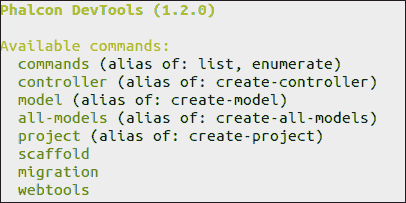
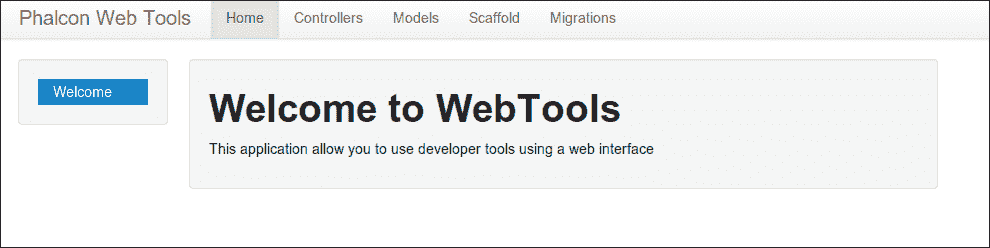
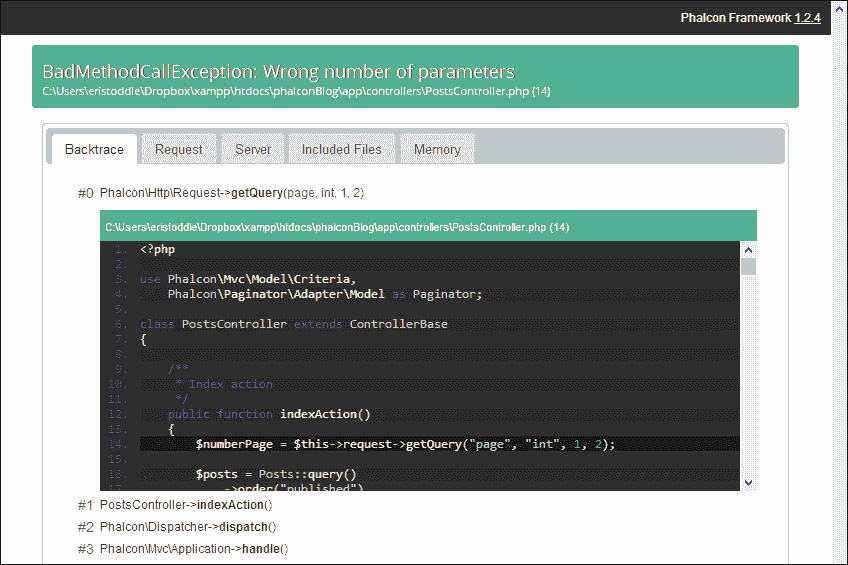

# 第二章：设置 Phalcon 项目

在我们开始编写博客代码之前，我们将先查看我们项目需要具备的基本框架。首先，我们将手动创建文件夹结构和必要的文件。完成这一艰难的过程后，我们将学习如何使用 Phalcon 开发者工具，通过几个简单的终端命令自动完成所有这些操作。我们的代码将在过程中不断变化和演变。这是因为随着我们深入框架，我们将重构旧代码以处理我们想要添加到博客应用程序中的新功能。

在本章中，我们将学习以下主题：

+   Phalcon 项目的文件夹结构

+   Phalcon .htaccess 文件

+   如何使用.ini 文件

+   如何创建 Phalcon 引导文件

+   如何使用 Phalcon 开发者工具

# 文件夹结构

与许多 PHP 框架不同，Phalcon 不关心你的文件夹结构。你可以创建任何你想要的文件夹结构，但为了我们的博客教程，我们将使用一个基本的 MVC 结构网站。各种框架中文件夹结构的变体有很多。我们将从以下代码片段开始，它具有 Phalcon 开发者工具将在本章后面为我们生成的相同结构：

```php
phalconBlog/
  app/
    config/
    controllers/
    library/
    logs/
    models/
    plugins/
    views/
      index/
      layouts/
  public/
    css/
    files/
    img/
    js/
    temp/
```

在我们的`public`文件夹中，我们只有一个可执行文件，那就是我们的引导文件`index.php`，我们将在本章后面学习它。其他所有内容都是浏览器加载的静态文件。在我们的`app`文件夹中，我们有`models`、`views`和`controllers`文件夹。

有比这更小的 MVC 文件结构，也有包含`template`、`partial`和`module`文件夹的结构。随着你的项目变得更大、更复杂，你可能想要切换到多模块文件夹结构，关于这一点，你可以在[`docs.phalconphp.com/en/latest/reference/applications.html`](http://docs.phalconphp.com/en/latest/reference/applications.html)中阅读。对于像基本 API 这样的简单网站，你可能想要选择一个更小的结构，比如微应用结构。你可以在[`docs.phalconphp.com/en/latest/reference/tutorial-rest.html`](http://docs.phalconphp.com/en/latest/reference/tutorial-rest.html)中找到一个微 MVC 结构的示例。

# 使用.htaccess 文件

我们将在应用程序中使用`.htaccess`文件，对于这一步骤，你需要确保你的 Apache 服务器上启用了`mod_rewrite`。在许多 Apache 安装中，这个模块默认安装并启用。如果你的服务器上没有启用`mod_rewrite`，你需要启用它，这可能涉及运行`sudo a2enmod rewrite`命令或在`httpd.conf`或`apache2.conf`文件中取消注释`LoadModule mod_rewrite.so`行。这取决于你的 Apache 安装。

对于 Nginx 配置，你可以阅读本章末尾的部分，并跳过使用`.htaccess`文件。

现在，我们需要告诉 Apache 如何为我们提供 Phalcon 项目。首先，我们必须隐藏我们的`app`文件夹，使其对公众不可见，并将所有访客重定向到我们的`public`文件夹。因此，我们需要为项目根文件夹`phalconBlog`创建一个`.htaccess`文件。所以，打开一个文本编辑器，创建一个新文件，并在文件中插入以下代码行：

```php
<IfModule mod_rewrite.c>
  RewriteEngine on
  RewriteRule ^$ public/     [L]
  RewriteRule (.*) public/$1 [L]
</IfModule>
```

将此文件保存为`phalconBlog`文件夹中的`.htaccess`。现在，所有访问`phalconBlog`文件夹的访客都将被重定向到`public`文件夹。

当涉及到在 Apache 中提供我们的`public`文件夹时，这并不是唯一的选择。我们可以编辑为我们的项目提供虚拟主机的 Apache 配置文件，并将文档根设置为我们的`public/`目录。在这种情况下，我们就不需要这个第一个`.htaccess`文件，只需要我们即将创建的`.htaccess`文件。

Phalcon 内置了美丽的 URL。换句话说，URL 可以有更吸引人的结构；例如，[`www.blog.com/post/1`](http://www.blog.com/post/1) 比较于 [`www.blog.com/?post=1`](http://www.blog.com/?post=1) 更好。由于每次访问都必须通过我们接下来将要学习的引导文件，我们还需要为`public`文件夹创建一个`.htaccess`文件。所以，在`public`文件夹中创建文件，并在文件中插入以下代码行：

```php
<IfModule mod_rewrite.c>
  RewriteEngine On
  RewriteCond %{REQUEST_FILENAME} !-d
  RewriteCond %{REQUEST_FILENAME} !-f
  RewriteRule ^(.*)$ index.php?_url=/$1 [QSA,L]
</IfModule>
```

这个`.htaccess`文件告诉 Apache 如果`public`文件夹中存在文件或文件夹，则加载它；如果不存在，则将访客重定向到`index.php`文件。

# 引导文件

我们将所有请求重定向到的`index.php`文件是我们应用程序的基石。在这个文件中，我们加载我们设置的任何配置，并将 Phalcon 框架的各个部分组合成一个完整的应用程序。在这个步骤中，我们将从一个简单的引导文件开始，然后在下一个步骤中使用`.ini`文件使其更具可配置性。

## 处理异常

首先，我们想要确保我们能够捕获我们的应用程序可能抛给我们的任何异常。所以，打开你的文本编辑器或 IDE，创建一个`index.php`文件，并将其放置在`public`目录中。在`index.php`文件中，插入以下代码片段：

```php
<?php
  try {
    //Our code
  } catch(\Phalcon\Exception $e) {
    echo "PhalconException: ", $e->getMessage();
  }
?>
```

你应该注意的第一件事是我们还没有在我们的应用程序中包含任何文件，但我们仍然可以引用 Phalcon 异常。Phalcon 是一个 PHP 扩展，现在它是 PHP 安装的一部分。没有必要包含任何 PHP 文件。我们使用 PHP 的 try-catch 结构来捕获 Phalcon 可能抛出的任何异常。

## 依赖注入

Phalcon 使用依赖注入容器来处理您在应用程序中可能需要使用的所有服务。每当我们的应用程序需要这些服务之一时，它会通过名称从容器中请求它。Phalcon 被设计为解耦的，这意味着您可以使用其所有或部分功能，而不是必须使用特定的基础服务集。这个依赖注入容器，或 DI，是我们选择的所有服务的粘合剂。

让我们创建一个 DI。我们将使用 Phalcon 的`FactoryDefault` DI。所以，在`index.php`的`try`括号中，插入以下代码片段：

```php
  try {
    //Create a DI
    $di = new Phalcon\DI\FactoryDefault();

    //Set up our views
    $di->set('view''view', function(){
      $view = new \Phalcon\Mvc\View();
      $view->setViewsDir(__DIR__ . '../app/views/');
      return $view;
    });
  } catch(\Phalcon\Exception $e) {
    echo "PhalconException: ", $e->getMessage();
  }
```

因此，我们已经创建了我们的 DI。接下来，我们将注册我们的视图服务，告诉 Phalcon 在哪里可以找到我们的视图文件。现在，让我们设置我们的应用程序的模型和控制器文件夹。

## 自动加载器

现在，我们添加我们的自动加载器。

```php
  //Create a DI
    $di = new Phalcon\DI\FactoryDefault();

    //Set up our views
    $di->set('view', function(){
      $view = new \Phalcon\Mvc\View();
      $view->setViewsDir(__DIR__ . '../app/views/');
      return $view;
    });

    //Our autoloaders
    $loader = new \Phalcon\Loader();
    $loader->registerDirs(array(
      __DIR__ . '../app/controllers/',
      __DIR__ . '../app/models/'
    ))->register();
```

这将告诉 Phalcon 在哪里可以找到我们的控制器和模型文件。目前，我们在我们的博客项目中只使用两个文件夹，但如果我们需要，可以使用 Phalcon Loader 加载更多文件夹。我们还创建了`library`和`plugin`文件夹，我们将在以后使用。

## 初始化我们的应用程序

现在，我们只需添加几行代码来初始化我们的应用程序以处理请求。我们创建一个`Phalcon\MVC\Application`的实例，并将其命名为`$application`。然后，我们调用`$application->handle->getContent()`。

```php
<?php
  try {
    //Create a DI
    $di = new Phalcon\DI\FactoryDefault();

    //Set up our views
    $di->set('view', function(){
      $view = new \Phalcon\Mvc\View();
      $view->setViewsDir(__DIR__ . '../app/views/');
      return $view;
    });

    //Our autoloaders
    $loader = new \Phalcon\Loader();
    $loader->registerDirs(array(
      __DIR__ . '../app/controllers/',
      __DIR__ . '../app/models/'
    ))->register();

    //Initialize our application
    $application = new \Phalcon\Mvc\Application($di);
    echo $application->handle()->getContent();
  } catch(\Phalcon\Exception $e) {
    echo "PhalconException: ", $e->getMessage();
  }
?>
```

现在我们已经将所有内容硬编码到我们的引导文件中，我们将对其进行一些更改，使我们的应用程序更加灵活。此外，我们将使用经典的`.ini`文件作为我们应用程序的配置文件。

# 使用配置文件

使用配置文件为开发者提供了一个简单的地方来编辑网站上可能在不同环境中更改的各种设置。如果您将项目从本地主机移动到另一个服务器，您只需编辑此文件，应用程序就应该可以在您放置它的任何地方运行。

您可以使用标准的 PHP 数组来存储 Phalcon 配置、JSON 文件或`.ini`文件格式。我们将使用`.ini`文件以提高可读性，但 PHP 数组格式是 PHP 的本地格式，加载速度更快。在本书的后续部分，我们将向我们的文件添加更多设置，但到目前为止，我们的项目文件夹路径看起来是`.ini`文件的不错补充。我们很可能不需要更改这些设置，但这给了我们将来改变主意的选项。因此，您应该在博客项目的`app`文件夹中创建一个新的文件夹`config`，并在您的编辑器中创建一个新的文件`config.ini`，并将其保存在这个文件夹中。在这个文件中，添加以下代码行：

```php
[phalcon]
controllersDir = "../app/controllers/"
modelsDir = "../app/models/"
viewsDir = "../app/views/"
```

现在，我们有一个孤零零的`.ini`文件。是时候在我们的引导文件中加载它了。所以，再次打开`index.php`文件。我们将进行一些更改。

`Phalcon\Config` 组件目前可以读取 `.ini` 或 PHP 数组类型的配置文件。对于我们的项目，一直是 `.ini` 类型。在你创建 DI 之后，你将加载 `.ini` 文件。

```php
//Create a DI
$di = new Phalcon\DI\FactoryDefault();

//Load ini file
$config = new \Phalcon\Config\Adapter\Ini(__DIR__ . '../app/config/config.ini');
$di->set('config', $config);
```

现在，我们已经加载了配置文件，但它并没有做任何事情；它只是在占用空间。是时候用我们的配置数据替换硬编码的文件路径了。唯一不能替换的是 `.ini` 文件本身的存储位置。

因此，我们将从我们的索引文件中移除以下代码段：

```php
//Set up our views
$di->set('view', function(){
  $view = new \Phalcon\Mvc\View();
  $view->setViewsDir(__DIR__ . '../app/views/');
  return $view;
});

//Our autoloaders
$loader = new \Phalcon\Loader();
$loader->registerDirs(array(
  __DIR__ .'../app/controllers/',
  __DIR__ .'../app/models/'
))->register();
```

将其更改为以下代码片段：

```php
//Set up our views
$di->set('view', function() use ($config) {
  $view = new \Phalcon\Mvc\View();
  $view->setViewsDir($config->phalcon->viewsDir);
  return $view;
});

//Our autoloaders
$loader = new \Phalcon\Loader();
$loader->registerDirs(array(
  $config->phalcon->controllersDir,
  $config->phalcon->modelsDir
))->register();
```

我们 `.ini` 文件中的每个标题都成为我们的 `$config` 对象的子对象，每个标题下的设置成为该 Phalcon 子对象中的变量。现在我们有了 `.ini` 文件，我们可以选择几种部署方法来确保我们的应用程序可以在我们需要放置的每个环境中运行。我们可以为开发服务器创建一个 `dev.ini` 文件，为生产服务器创建一个 `prod.ini` 文件。然后我们的引导文件可以根据 Apache 环境变量加载一个 `.ini` 文件。或者，我们可以使用一个构建脚本，将正确的 `.ini` 文件上传到正确的环境中。

# Phalcon 开发者工具

现在我们已经通过艰难的方式完成了所有工作，以了解 Phalcon 的工作方式，让我们尝试以快速、简单的方式进行同样的操作。Phalcon 开发者工具是一套工具，可以帮助你通过为你生成骨架代码来快速启动你的项目。我们将在接下来的章节中使用这些工具生成很多东西，然后审查创建的文件，以了解它们是如何工作的。

如果你不想安装开发者工具，也没有问题。我们手动创建的当前骨架经过一些修改后，将作为应用程序其余部分的基础。Phalcon 是一个非常灵活的框架。我们还将详细说明使用开发者工具生成的一切，以便你可以在需要时手动创建所有代码。但我建议你在可能的情况下使用开发者工具，然后用自定义代码来填补空白。这真的可以缩短你的开发时间。首先，让我们安装这些工具。

## 安装 Phalcon 开发者工具

你可以从官方 Git 仓库下载 Phalcon 开发者工具，该仓库位于 [`github.com/phalcon/phalcon-devtools`](https://github.com/phalcon/phalcon-devtools)。或者，你可以使用 Composer 将其作为库安装到你的项目中。我们在项目 `app` 文件夹中有一个 `library` 文件夹的原因是，我们可以存储我们可能在应用程序中需要的 PHP 库。Composer 是一个 PHP 包管理器，它只需几个命令就可以处理这些库。你可以在 [`getcomposer.org/`](http://getcomposer.org/) 上了解更多关于 Composer 的信息。

首先，在`library`文件夹中创建一个新的文件，命名为`composer.json`，在其中添加以下代码行，并保存文件：

```php
{
    "require": {
        "phalcon/devtools": "dev-master"
    }
}
```

这是一个简单的`.json`文件，告诉 Composer 我们希望在项目中包含 Phalcon 开发者工具。如果您在计算机上安装了`curl`，请打开终端或 SSH 窗口，浏览到位于`phalconBlog`的`library`文件夹，并运行以下命令：

```php
curl -s http://getcomposer.org/installer | php

```

在 Linux 上，您很可能已经安装了`curl`。如果没有，您可以直接从[`getcomposer.org/download/`](http://getcomposer.org/download/)下载`composer.phar`并将其放入您的`lib`文件夹。

接下来，我们告诉 Composer 在`lib`文件夹中添加 Phalcon 开发者工具。

```php
php composer.phar install
```

如果您的系统`PATH`变量中包含 PHP 可执行文件的位置，这将适用于您。如果您在 Linux 上工作，并且 PHP 是通过包管理器安装的，那么这很可能是正确的。在 Windows 上，您可能需要找到 PHP 可执行文件并将其位置添加到您的路径中。

通过 Composer 下载 Phalcon 开发者工具后，您必须将路径`phalconBlog/app/library/vendor/phalcon/devtools/phalcon.php`添加到您的系统`PATH`变量中，以便 Phalcon 命令可以正常工作。

Phalcon 也可以通过 PEAR，PHP 包管理器进行安装。为了本书的目的，我们省略了安装开发者工具的细节。涵盖每个操作系统将超出本书的范围：

+   您可以在[`github.com/phalcon/phalcon-devtools`](https://github.com/phalcon/phalcon-devtools)上找到所有安装的更多详细信息。

+   关于在 Windows 上安装 Phalcon 开发者工具的更多详细信息，请访问[`docs.phalconphp.com/en/latest/reference/wintools.html`](http://docs.phalconphp.com/en/latest/reference/wintools.html)

+   关于在 Mac 上安装这些工具的详细信息，请参阅[`docs.phalconphp.com/en/latest/reference/mactools.html`](http://docs.phalconphp.com/en/latest/reference/mactools.html)

+   对于 Linux，请访问[`docs.phalconphp.com/en/latest/reference/linuxtools.html`](http://docs.phalconphp.com/en/latest/reference/linuxtools.html)

## 生成项目骨架

使用一条命令，我们将完成本章中已经做过的几乎所有事情。打开命令行界面，浏览到您想要生成项目的位置。您实际上可以删除我们之前创建的项目。您可以重新开始，或者在新位置构建新项目。现在，输入以下命令：

```php
phalcon project phalconBlog –-use-config-ini --enable-webtools

```

突然之间，我们将有一个为我们构建的完整项目结构。您将注意到生成的项目和从头开始构建的项目之间有一些差异。我们将探讨其中的一些差异，看看有什么变化。

如果您没有使用 Phalcon 开发者工具，您可能需要将您的`config.ini`文件更改为这个版本。此配置文件将包含一些额外的设置，如下所示：

```php
[database]
adapter  = Mysql
host     = localhost
username = root
password = root
dbname     = phalconblog

[application]
controllersDir = ../app/controllers/
modelsDir      = ../app/models/
viewsDir       = ../app/views/
pluginsDir     = ../app/plugins/
libraryDir     = ../app/library/
baseUri        = /phalconBlog/
cacheDir       = ../app/cache/

[models]
metadata.adapter = "Memory"

```

它添加了一组虚拟数据库配置。它还向我们的`.ini`文件的应用程序部分添加了几个更多文件夹。`baseUri`设置可能会给您带来一些问题。如果您创建的项目在本地主机的子目录中运行，生成的设置将有效。如果您直接浏览到 localhost 并看到以下消息，您将不得不更改此`baseUri`设置：


您可能不会注意到`baseUri`设置有任何问题，直到您开始在您的应用程序中包含 CSS 和 JavaScript 文件，而这些文件没有加载。所以，如果您的网站正在主目录中运行，将那一行改为以下代码：

```php
baseUri        = /
```

您还会注意到，`views`文件夹中有些新文件，具有`.volt`扩展名。在`app/views`的`index`文件夹中有一个`index.volt`文件，在`app`的`views`文件夹中还有一个`index.volt`文件。让我们看看位于`app`的`views`文件夹中的文件。

```php
<!DOCTYPE html>
<html>
  <head>
    <title>Phalcon PHP Framework</title>
  </head>
  <body>
    {{ content() }}
  </body>
</html>
```

此文件是您整个应用程序的主要布局。您应用程序提供的每个视图都将被此文件包裹。body 标签的内容将由视图提供。这就是`{{ content() }}`标签的作用。这是一个 Volt 模板标签。Volt 是一个内置在 Phalcon 中的模板引擎。我们将在第三章中了解更多关于它的内容，*使用 Phalcon 模型、视图和控制器*。

当您浏览到您的 localhost 时，所提供的服务视图位于`app/views`的`index`文件夹中的`index.volt`文件。

```php
<h1>Congratulations!</h1>

<p>You're now flying with Phalcon. Great things are about to happen!</p>
```

这只是一个静态的 HTML 页面，用来告知您一切工作正常。

您还会注意到，您的引导文件或位于`public`的`index.php`文件有所不同。现在它看起来像以下代码片段：

```php
<?php

error_reporting(E_ALL);

try {

  /**
   * Read the configuration
   */
  $config = new \Phalcon\Config\Adapter\Ini(__DIR__ . "/../app/config/config.ini");

  /**
   * Read auto-loader
   */
  include __DIR__ . "/../app/config/loader.php";

  /**
   * Read services
   */
  include __DIR__ . "/../app/config/services.php";

  /**
   * Handle the request
   */
  $application = new \Phalcon\Mvc\Application($di);

  echo $application->handle()->getContent();

} catch (\Exception $e) {
  echo $e->getMessage();
}
```

它仍然从相同的位置加载我们的`.ini`文件。然而，现在它还从我们的`config`文件夹中加载两个新文件，`loader.php`和`services.php`。其余的文件大致相同。生成的版本只是将自动加载器和依赖注入容器拆分成单独的文件，并将它们作为配置文件包含进来，这确实更有意义。首先，让我们看看位于`app/config`的`loader.php`文件：

```php
<?php

$loader = new \Phalcon\Loader();

/**
 * We're a registering a set of directories taken from the configuration file
 */
$loader->registerDirs(
  array(
    $config->application->controllersDir,
    $config->application->modelsDir
  )
)->register();
```

这基本上是我们以前在旧的引导文件中使用的相同代码。现在，让我们看看位于`app/config`的`services.php`文件：

```php
<?php
use Phalcon\DI\FactoryDefault,
  Phalcon\Mvc\View,
  Phalcon\Mvc\Url as UrlResolver,
  Phalcon\Db\Adapter\Pdo\Mysql as DbAdapter,
  Phalcon\Mvc\View\Engine\Volt as VoltEngine,
  Phalcon\Mvc\Model\Metadata\Memory as MetaDataAdapter,
  Phalcon\Session\Adapter\Files as SessionAdapter;
/**
 * The FactoryDefault Dependency Injector automatically registers the right services providing a full stack framework
 */
$di = new FactoryDefault();
/**
 * The URL component is used to generate all kind of urls in the application
 */
$di->set('url', function() use ($config) {
  $url = new UrlResolver();
  $url->setBaseUri($config->application->baseUri);
  return $url;
}, true);
/**
 * Setting up the view component
 */
$di->set('view', function() use ($config) {

  $view = new View();

  $view->setViewsDir($config->application->viewsDir);

  $view->registerEngines(array(
    '.volt' => function($view, $di) use ($config) {

      $volt = new VoltEngine($view, $di);

      $volt->setOptions(array(
        'compiledPath' => $config->application->cacheDir,
        'compiledSeparator' => '_'
      ));

      return $volt;
    },
    '.phtml' => 'Phalcon\Mvc\View\Engine\Php'
  ));

  return $view;
}, true);
/**
 * Database connection is created based in the parameters defined in the configuration file
 */
$di->set('db', function() use ($config) {
  return new DbAdapter(array(
    'host' => $config->database->host,
    'username' => $config->database->username,
    'password' => $config->database->password,
    'dbname' => $config->database->dbname
  ));
});
/**
 * If the configuration specifies the use of a metadata adapter, use it or use memory otherwise
 */
$di->set('modelsMetadata', function() {
  return new MetaDataAdapter();
});
/**
 * Start the session the first time a component requests the session service
 */
$di->set('session', function() {
  $session = new SessionAdapter();
  $session->start();
  return $session;
});
```

在这个文件中肯定有比我们本章能涵盖的更多内容。然而，我们将在后面的章节中简要介绍这里添加的新服务，并最终添加一些自己的服务。你可以通过以下代码行看到我们设置视图目录的位置：`$view->setViewsDir($config->application->viewsDir);`。但现在，我们加载的服务肯定比我们旧的引导文件要多。现在，我们有一个 URL 解析器、一个模板引擎服务、一个数据库适配器和会话服务。这些将在本书的后面部分变得很重要。

## 可用命令

我们将在未来的章节中探索更多命令，以生成我们应用程序所需的文件，但这里有一些命令可以帮助你开始探索这些工具能为你做什么。

在你的命令行中键入 `Phalcon` 将会给出如下截图所示的输出：



`commands` 命令实际上会打印出这个相同的可用命令列表。我们已经查看过项目命令。我们将在接下来的章节中探索其余的命令。

然而，你可能已经注意到，当我们使用 Phalcon 开发工具构建我们的项目时，我们使用了 `–enable-webtools` 命令。在为我们的应用程序编写代码时，我们有一个更简单的选项；我们可以在浏览器中直接生成代码。

## 网络界面

一旦我们使用命令行工具创建了一个项目，我们就可以在浏览器中完成 Phalcon 开发工具能做的几乎所有其他事情。导航到 `http://localhost/phalconBlog/webtools.php`，你应该会看到一个如下截图所示的页面：



我们将在下一章中了解这个神奇工具的强大功能。

## IDE 框架

Phalcon 开发工具的另一个特性是它们包含了 IDE 框架，用于你的 IDE 的代码提示和自动完成功能。因为 Phalcon 是用 C 编译的，所以你的 IDE 将无法索引实际框架的类和函数，例如，与用 PHP 编写的 Zend 框架相比。IDE 框架文件反映了 Phalcon 框架中的类和函数，以便 IDE 可以访问它们的名称和文档。

在我们项目位于 `app/library/vendor/phalcon` 的 `devtools` 文件夹中，将存在一个 `ide` 文件夹，这个 `ide` 文件夹中有 Phalcon 的各种版本的框架。要使用我们 IDE 中的当前版本框架，我们只需将项目外部库的 `1.2.4` 文件夹的路径添加到我们的 IDE 中。这个过程的步骤会根据你使用的 IDE 而有所不同，但你可以在 [`phalconphp.com/en/download/stubs`](http://phalconphp.com/en/download/stubs) 找到将 Phalcon IDE 框架添加到 PhpStorm 的具体说明。

# 设置 Phalcon\Debug

可选步骤是向应用程序添加`Phalcon\Debug`组件。添加它只需要两行代码，并且在出现错误时，它将大大帮助您追踪错误的原因。

要添加`Phalcon\Debug`，我们将打开我们的引导文件，位于`public`目录下的`index.php`文件，并在代码的开头添加几行代码，移除 try-catch 结构，保留`try`部分的所有代码不变，并添加我们的调试器。

```php
<?php

error_reporting(E_ALL);

$debug = new \Phalcon\Debug();
$debug->listen();

/**
 * Read the configuration
 */
$config = new \Phalcon\Config\Adapter\Ini(__DIR__ . "/../app/config/config.ini");
```

现在，当我们遇到异常时，而不是一个标准的丑陋错误，我们将看到一个类似于以下截图的页面：



与标准的堆栈跟踪不同，我们展示的是异常出现的代码部分，以便检查可能的问题。我们还可以点击在跟踪中列出的 Phalcon 函数，以便跳转到官方的 Phalcon 文档页面。`Phalcon\Debug`有很多功能。您可以通过在应用程序中故意创建异常并检查输出，或者通过阅读更多关于调试器的信息来了解更多关于它们。[`docs.phalconphp.com/en/latest/reference/debug.html`](http://docs.phalconphp.com/en/latest/reference/debug.html)。

# Nginx 配置

同样，也可以在 Nginx 上运行 Phalcon。要在 Nginx 上运行我们的项目，我们将使用以下配置，并跳过使用`.htaccess`文件，因为在 Nginx 中它们没有用：

```php
server {

    listen   80;
    server_name localhost;

    index index.php index.html index.htm;
    set $root_path '/var/www/phalcon/public';
    root $root_path;

    try_files $uri $uri/ @rewrite;

    location @rewrite {
        rewrite ^/(.*)$ /index.php?_url=/$1;
    }

    location ~ \.php {
        fastcgi_pass unix:/run/php-fpm/php-fpm.sock;
        fastcgi_index /index.php;

        include /etc/nginx/fastcgi_params;

        fastcgi_split_path_info       ^(.+\.php)(/.+)$;
        fastcgi_param PATH_INFO       $fastcgi_path_info;
        fastcgi_param PATH_TRANSLATED $document_root$fastcgi_path_info;
        fastcgi_param SCRIPT_FILENAME $document_root$fastcgi_script_name;
    }

    location ~* ^/(css|img|js|flv|swf|download)/(.+)$ {
        root $root_path;
    }

    location ~ /\.ht {
        deny all;
    }
}
```

您只需要编辑`server_name`变量，如果它不是`localhost`，以及将`$root_path`变量设置为项目中`public`文件夹的路径。有关为 Phalcon 项目配置 Nginx 的更多详细信息，请参阅[`docs.phalconphp.com/en/latest/reference/nginx.html`](http://docs.phalconphp.com/en/latest/reference/nginx.html)，有关配置 Cherokee 网络服务器的信息，请参阅[`docs.phalconphp.com/en/latest/reference/cherokee.html`](http://docs.phalconphp.com/en/latest/reference/cherokee.html)。

# 摘要

在本章中，我们学习了如何设置我们的骨架应用程序。我们创建了文件夹、`.htaccess`文件和我们的引导文件。然后，我们通过使用`.ini`文件使应用程序更加可配置。最后，我们使用 Phalcon 开发者工具使整个工作变得更快、更简单。

在下一章中，当我们学习 Phalcon 的模型、视图和控制器时，我们将在浏览器中最终开始服务页面。
