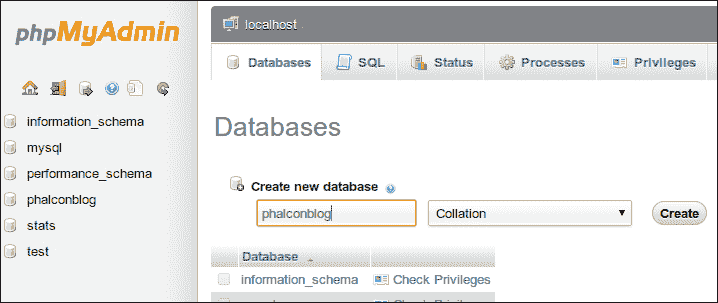
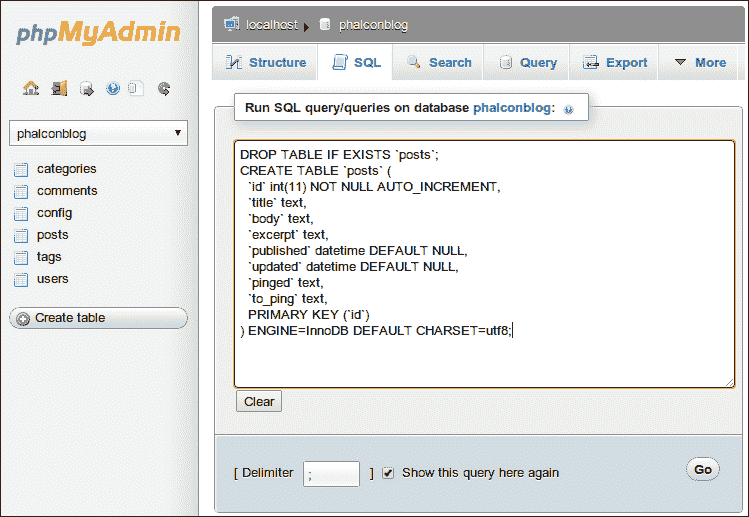
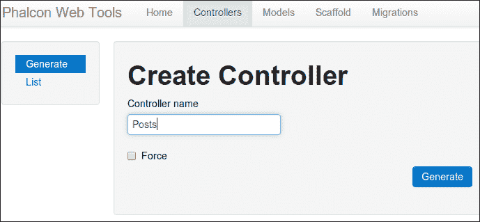
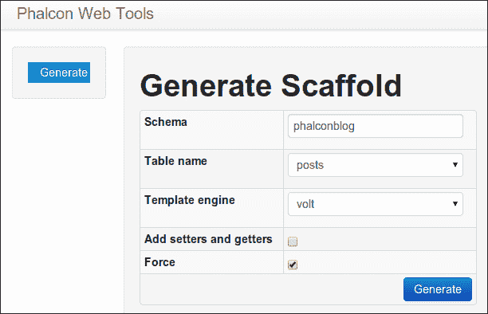
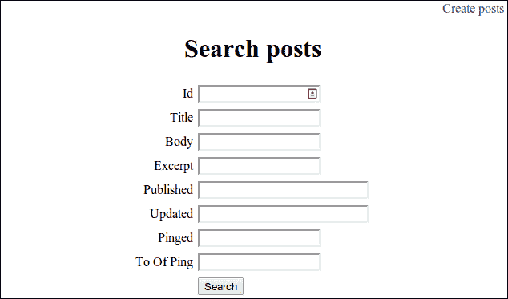
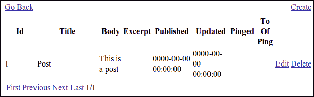

# 第三章：使用 Phalcon 模型、视图和控制器

现在，我们将开始构建一个功能性的博客应用程序。使用 Phalcon 开发者工具，我们将生成我们的模型、控制器和视图，然后详细检查代码，以便我们可以在需要时自己编写它。我们还将了解 Phalcon 中的表单，这些表单是视图辅助工具的一部分，是我们可以在应用程序中重复使用的组件。这里没有必要重新发明轮子。我们还将查看内置在 Phalcon 中的 Volt 模板引擎。

在本章中，我们将涵盖以下主题：

+   Model-View-Controller 模式的基础

+   创建 Phalcon 模型

+   创建 Phalcon 控制器

+   创建 Phalcon 视图

+   使用 Volt 模板引擎

+   使用 Phalcon 视图辅助工具

# 介绍 MVC

PHP 在这些年里发生了很大的变化。最初，它甚至不是面向对象的。但 PHP 3 中添加了这一点，并且从那时起在 PHP 版本中得到了改进。这些变化为基于 PHP 的框架铺平了道路。而且，这些框架中的大多数都使用 MVC 模式，这个模式由 Python 的 Django 和 Ruby 的 Ruby on Rails 共同推广，用于 Web 框架。让我们简要回顾 MVC 模式的每个部分。

## 视图

视图输出用户界面。这是它的唯一任务。有时，视图包括一个模板引擎，如 Smarty 或 Phalcon 自带的内置模板引擎 Volt。在我们的博客项目中，我们将使用 Volt。但事实是，由于你可以在同一文件中混合`PHP`和`HTML`，PHP 本身就像一个模板引擎。

## 控制器

控制器是我们应用程序的总机操作员。控制器中的操作将参数传递给视图以显示并响应用户输入。当我们在我们应用程序中填写博客表单并点击**保存**按钮时，我们发布的数据将通过我们的控制器发送。当我们创建博客文章时，控制器使用其`createAction`函数在我们模型中创建一个新的文章实例。当完成这项工作后，它向我们的视图发送一条消息，说明我们的文章发布成功。

## 模型

我们应用程序的大部分逻辑应该位于模型中。它应该知道我们每篇博客文章都有一个发布它的用户，并且这两者之间是相关的。它还应该知道每篇博客文章可以有一个或多个标签。如果我们有一个连接到我们应用程序的数据库，模型应该处理对数据库的更改。当我们在我们应用程序中创建一篇新文章时，我们的控制器只需将我们在表单中发布的数据传递给正确的操作。我们的模型应该处理在数据库中创建新文章记录以及与发布该文章的用户或我们添加到其中的标签相关的任何记录。

# 创建数据库

在我们可以让 Phalcon 开发者工具为我们生成更多文件之前，我们需要一个数据库。项目骨架是容易的部分。我们现在需要生成模型、控制器和视图文件。所以，让我们创建我们的数据库。为了本书的目的，我将给出使用原始 SQL 查询的示例，您可以通过命令行或您选择的数据库工具执行它们，以及使用 phpMyAdmin 的示例，可以从[`www.phpmyadmin.net`](http://www.phpmyadmin.net)免费下载。这也要求您在机器上安装 MySQL，可以从[`www.mysql.com`](http://www.mysql.com)免费下载。

首先，我们需要我们的数据库。以下是我们项目所需的数据库创建命令：

```php
CREATE DATABASE phalconblog;

```

在 phpMyAdmin 中，您只需点击**数据库**标签，在页面的**创建新数据库**部分输入`phalconblog`，然后点击**创建**按钮，如图所示：



现在，我们只需要创建我们的博客文章表格。我们稍后再处理其他表格。以下是我们博客`posts`表的 SQL 代码：

```php
DROP TABLE IF EXISTS `posts`;
CREATE TABLE `posts` (
  `id` int(11) NOT NULL AUTO_INCREMENT,
  `title` text,
  `body` text,
  `excerpt` text,
  `published` datetime DEFAULT NULL,
  `updated` datetime DEFAULT NULL,
  `pinged` text,
  `to_ping` text,
  PRIMARY KEY (`id`)
) ENGINE=InnoDB DEFAULT CHARSET=utf8;
```

如果您正在使用 phpMyAdmin，浏览到您的`phalconblog`数据库，点击**SQL**标签，粘贴之前的 SQL 代码。然后点击**执行**按钮，您的表就准备好了。



我们现在有一个简单的表格来存储我们的博客文章。它有一个唯一的 ID，用于自动增加标题字段，以存储我们文章的标题，一个正文字段来存储正文，一个摘要字段来存储我们文章的摘要，用于主页和分类页面等，一个发布日期字段，一个更新日期字段，以及两个字段来存储我们文章的 ping 状态。

现在我们已经有一个表格了，我们可以使用 Phalcon 开发者工具为我们的博客文章创建一个模型文件。

# 创建模型

如果您的项目正在运行在`http://localhost/phalconBlog/webtools.php`，请在浏览器中打开它。如果不是，浏览到您项目的首页，并将`/webtools.php`添加到 URL 中。`webtools.php`文件位于引导文件相同的文件夹中。您应该在浏览器中看到一个类似于以下截图的页面：


我们将为我们的`posts`表生成一个模型文件。Phalcon 开发者工具使用我们在`Ini`文件中设置的设置连接到我们的数据库，然后加载**表名**选择列表中的所有表名。因此，从选择列表中选择`posts`表，然后点击**生成**按钮。您还可以选择为您的类添加设置器和获取器，为相关表设置外键，并定义关系。您还可以强制网络工具生成模型文件，即使它已经存在。

另一个选项是使用命令行开发者工具。您需要打开一个终端实例，导航到您的`phalconBlog`项目文件夹，并输入以下命令：

```php
phalcon model posts

```

在这里，`posts`是正在生成模型文件的表的名称。Phalcon 开发者工具的命令行也有选项。实际上，这里提供的选项比 Web 界面上的更多。您可以通过不输入表名来调用命令来列出所有这些选项，如下所示：

```php
phalcon model

```

之前的命令应该会像以下截图所示打印出选项：


如果不输入任何选项调用任何命令，都会打印出一个类似选项的列表。

一旦完成，我们应该在`app`文件夹中的`models`文件夹中找到`Posts.php`文件，并在其中找到以下代码：

```php
<?php
class Posts extends \Phalcon\Mvc\Model
{
    /**
     *
     * @var integer
     */
    public $id;     
    /**
     *
     * @var string
     */
    public $title;     
    /**
     *
     * @var string
     */
    public $body;     
    /**
     *
     * @var string
     */
    public $excerpt;     
    /**
     *
     * @var string
     */
    public $published;     
    /**
     *
     * @var string
     */
    public $updated;     
    /**
     *
     * @var string
     */
    public $pinged;     
    /**
     *
     * @var string
     */
    public $to_ping;     
}
```

我们经历了所有这些，但并没有得到太多，但比手动输入所有这些变量要好。Phalcon 从我们的`posts`表中提取了列名，创建了一个`Posts model`类，并将这些名称转换为我们的类中的成员变量。这是一个开始。我们也可以使用 Web 工具创建控制器。

# 创建控制器

您也可以使用 Web 工具创建控制器。只需在 Phalcon Web 工具菜单中点击**Controllers**标签，然后在表单的**Controller name**字段中输入您的控制器名称，在我们的例子中是`Posts`，如下截图所示：



就像我们创建的模型一样，我们可以使用以下命令行工具来创建我们的控制器：

```php
phalcon controller posts

```

这将生成一个位于`app/controllers`的新`PostsController.php`文件，如下代码所示：

```php
<?php
class PostsController extends \Phalcon\Mvc\Controller
{
    public function indexAction()
    {

    }
```

这个文件内容不多，只是我们的`PostsController`类中有一个`indexAction`函数。但接下来事情会变得更有趣。让我们为我们的`Posts`模型构建 CRUD 函数。

# 创建 CRUD 脚手架

CRUD 代表创建、读取、更新和删除，这是我们的应用程序应该对博客文章记录执行的四个基本功能。Phalcon Web 工具也会帮助我们构建这些功能。在 Web 工具页面上点击**Scaffold**标签，您将看到一个如下截图所示的页面：



从**Table name**列表中选择`posts`，从**Template engine**列表中选择`volt`，并这次勾选**Force**，因为我们打算强制新文件覆盖我们刚刚生成的旧模型和控制器文件。点击**Generate**按钮，一些魔法应该会发生。

浏览到`http://localhost/phalconBlog/posts`，您将看到一个如下截图所示的页面：



我们终于有一些可以使用的功能了。我们没有帖子，但我们可以创建一些。点击 **创建帖子** 链接，你会看到一个类似于我们刚才所在的页面。表单看起来几乎一样，但它会有一个 **创建帖子** 标题。填写 **标题**、**正文** 和 **摘要** 字段，然后点击 **保存** 按钮。表单将提交，你会得到一个消息，表明帖子已成功创建。

这将带你回到帖子索引页面。现在你应该能够搜索并找到你刚刚创建的帖子。如果你忘记了你的帖子内容，你可以点击 **搜索** 而不输入任何字段，你应该会看到一个类似于以下截图的页面：



这不是一个非常漂亮或用户友好的博客应用程序。但它让我们开始了，这正是我们所需要的。下次我们开始一个 Phalcon 项目时，只需几分钟就可以完成这些步骤。现在我们将查看生成的代码，并在查看过程中对其进行修改，使其更像博客。

# 检查我们的 Posts 模型

如果你打开位于 `app/model` 的 `Posts.php` 文件，你可能会注意到自从我们第一次生成它以来，它并没有发生变化。即使我们有新的 CRUD 框架，它仍然只包含我们的 Posts 模型类和作为成员变量的数据库列名。在 PHP 端没有涉及任何 SQL 代码。

`Phalcon\MVC\Model` 路径是应用程序将使用到的所有模型的基础类。所有涉及的 SQL 代码都发生在 Phalcon PHP 扩展内部。有时我们不得不进行 SQL 查询，但到目前为止，我们已经为我们的 Posts 模型提供了 CRUD 功能、搜索功能和与其他模型关联的能力，而无需知道我们的应用程序将要使用什么数据库软件。如果我们决定不再使用 MySQL 而想使用 Oracle，我们可以修改位于 `app/config` 的 `services.php` 文件来使用另一个数据库适配器。只要我们的数据库表结构相同，我们的应用程序代码将保持不变。

我们的 Posts 模型目前以最少的代码完成了我们需要的所有功能，所以我们不会在本章中对其进行修改。现在让我们看看我们的控制器。

# 检查我们的 Posts 控制器

现在，让我们在我们的编辑器中打开位于 `app/controllers` 的 `PostsController.php` 文件。这个文件中确实有很多内容。在我们的 `PostsController` 类中有七个以 actions 后缀的方法。这些方法中的每一个都处理请求并创建响应。每个方法对应于我们应用程序中的一个 URI：`http://localhost/phalconBlog/[model]/[action]`。当我们浏览到 `http://www.localhost/phalconBlog/posts/` 时，默认情况下会调用 `indexAction` 函数。

让我们逐一查看这些操作，并在需要时进行修改。

## 创建

让我们看看 `createAction` 函数，它为我们保存新的博客帖子。

首先，我们应该稍微了解一下`Phalcon\Mvc\Dispatcher`。调度器是我们依赖注入容器中加载的服务之一。调度器接收请求对象并根据该对象的属性实例化一个控制器。当控制器被实例化时，它充当调度器事件的监听器。由于依赖注入容器中的所有内容都可以作为控制器的一个属性访问，因此我们可以在控制器中使用`$this->dispatcher`来访问调度器。

我们依赖注入容器中我们还应该了解的一个对象是请求对象，它存储有关 HTTP 请求的详细信息，并在调度器和控制器之间传递。代码如下：

```php
public function createAction()
{

    if (!$this->request->isPost()) {
        return $this->dispatcher->forward(array(
            "controller" => "posts",
            "action" => "index"
        ));
    }

    $post = new Posts();

    $post->id = $this->request->getPost("id");
    $post->title = $this->request->getPost("title");
    $post->body = $this->request->getPost("body");
    $post->excerpt = $this->request->getPost("excerpt");
    $post->published = $this->request->getPost("published");
    $post->updated = $this->request->getPost("updated");
    $post->pinged = $this->request->getPost("pinged");
    $post->to_ping = $this->request->getPost("to_ping");

    if (!$post->save()) {
        foreach ($post->getMessages() as $message) {
            $this->flash->error($message);
        }
        return $this->dispatcher->forward(array(
            "controller" => "posts",
            "action" => "new"
        ));
    }

    $this->flash->success("post was created successfully");
    return $this->dispatcher->forward(array(
        "controller" => "posts",
        "action" => "index"
    ));

}
```

首先，我们的方法通过从我们的调度器容器中查询请求对象来检查请求是否为 POST。如果请求不是 POST，则调用`$this->dispatcher->forward`，我们的调度器将请求转发到我们文章控制器中的`indexAction`函数，在那里调度循环再次启动。

如果我们正在发布一篇新的博客文章，那么该方法将继续执行，并创建一个文章对象。我们可以通过`$this->request->getPost()`访问我们在表单中发布的资料，并且我们的代码将把请求对象中的每个参数分配给我们的`$post`实例的属性。在许多情况下，用一行代码替换这一系列赋值会更简单，如下所示：

```php
$post->save($_POST);
```

但我们将在本书的后面部分在我们的控制器中设置一些这些变量，所以我们将它们保持原样。由于 Phalcon 在幕后处理我们数据库的所有细节，我们只需调用`$this->post->save()`将文章保存到数据库；不需要 SQL。

接下来，代码检查我们的文章是否已保存，如果没有，它使用 Phalcon 内嵌的闪存消息服务，通过`$this->flash->error`存储错误消息，同时应用程序将我们转发回表单。如果文章成功创建，我们将被转发到索引，并带有成功消息`$this->flash->success`。闪存消息服务为我们应用程序提供了向用户提供操作状态通知的能力。闪存消息服务中有四种消息类型：

+   错误

+   成功

+   注意

+   警告

如果我们想在视图服务我们的消息时为它们设置自定义类，我们可以在`config`目录下的`services.php`文件中添加以下代码：

```php
$di->set('flash', function(){
    return new \Phalcon\Flash\Direct(array(
        'error' => 'alert alert-error',
        'success' => 'alert alert-success',
        'notice' => 'alert alert-info',
    ));
});
```

从那时起，我们应用程序提供的任何错误消息都将同时具有 alert 和 alert-error 类。`Phalcon\Flash\Direct`是`Phalcon\Flash`的一个变体，它立即输出传递给它的消息。另一个变体是`Phalcon\Flash\Session`，它将消息暂时存储在用户的会话中，以便在下一个请求中输出。

## 搜索

现在让我们看看我们的`searchAction`函数：

```php
public function searchAction()
{

    $numberPage = 1;
    if ($this->request->isPost()) {
        $query = Criteria::fromInput($this->di, "Posts", $_POST);
        $this->persistent->parameters = $query->getParams();
    } else {
        $numberPage = $this->request->getQuery("page", "int");
    }

    $parameters = $this->persistent->parameters;
    if (!is_array($parameters)) {
        $parameters = array();
    }
    $parameters["order"] = "id";

    $posts = Posts::find($parameters);
    if (count($posts) == 0) {
        $this->flash->notice("The search did not find any posts");
        return $this->dispatcher->forward(array(
            "controller" => "posts",
            "action" => "index"
        ));
    }

    $paginator = new Paginator(array(
        "data" => $posts,
        "limit"=> 10,
        "page" => $numberPage
    ));

    $this->view->page = $paginator->getPaginate();
}
```

在我们函数的开始处，我们设置一个`$numberPage`变量为`1`。这是因为我们使用我们在引导文件中加载到 Phalcon 服务容器中的 Phalcon 分页器。我们将使用这个变量来告诉分页器要加载哪一页的结果，如果没有`page`参数，那么我们希望加载结果的第一页。

之后，我们的代码检查是否有 POST 请求，如果有，我们使用`Phalcon\Mvc\Model\Criteria`中的`fromInput`函数将我们的帖子参数更改为一个我们可以用来查询我们的 Posts 模型的数组。我们通过在`$this->persist`中创建一个变量参数来在会话中持久化这些参数，`$this->persist`是一个在会话之间持久化变量的 Phalcon 类。这使得我们的代码能够在不向 URL 添加参数的情况下从搜索查询中加载第二页的结果。加载搜索结果第二页所需的唯一参数是`page`。如果没有帖子，我们将`$numberPage`变量设置为 GET 请求中的`page`参数，使用`getQuery`。

然后，我们设置一个本地的`$parameters`变量来存储我们的持久化参数，我们将使用这个变量通过`find`函数查询我们的 Posts 模型，并将结果存储在`$posts`中。然后，代码检查是否有帖子结果，并设置一个闪存消息来告诉我们当我们的`posts`表中没有帖子时。

然后，我们终于到达了本节开头提到的分页器。我们通过将`data`参数设置为`$posts`变量，将`limit`参数设置为每页我们想要的记录数，在这个例子中是`10`，然后设置`page`参数为我们的`$numberPage`变量来创建它。然后，我们将我们的`view`对象的`page`变量设置为分页器返回的`page`对象，该对象包含分页博客文章的结果。

## 索引

我们当前的`indexAction`函数没有做太多。索引视图向用户显示一个搜索表单。我们将改变这一点，因为我们希望它显示我们最新的文章列表，如下面的代码所示：

```php
<?php

use Phalcon\Mvc\Model\Criteria,
    Phalcon\Paginator\Adapter\Model as Paginator;

class PostsController extends ControllerBase
{

    /**
     * Index action
     */
    public function indexAction()
    {
        $this->persistent->parameters = null;
    }
```

我们将把它改为以下代码：

```php
public function indexAction()
    {
        $numberPage = $this->request->getQuery("page", "int", 1);

        $posts = Posts::find();

        $paginator = new Paginator(array(
            "data" => $posts,
            "limit"=> 10,
            "page" => $numberPage
        ));

        $this->view->page = $paginator->getPaginate();
    }
```

你会注意到我们生成的`PostsController`类与我们本章开头从头开始编写的类有所不同。Phalcon 开发者工具为我们生成一个`ControllerBase`类，这样我们就可以向其中添加通用变量和功能。然后我们可以扩展这个类来创建我们应用程序的控制器。

在这里，我们使用了我们在`searchAction`函数中看到的部分功能。我们使用`Phalcon\Http\Request`的`getQuery`函数设置分页器的页面编号。第一个`page`参数是我们想要的 GET 变量，第二个参数是我们期望此参数的类型，例如整数，第三个参数是默认值，我们将它设置为第一页的`1`。然后，我们实例化分页器并将`view page`变量设置为我们的分页器的结果。但我们使用`Phalcon\MVC\Model`的静态`query`函数以面向对象的方式执行我们的查询，按发布日期（我们尚未设置，但我们将这样做）对帖子进行排序。我们将在下一章中了解更多关于与 Phalcon 模型和数据库交互的内容。

## 新增

新的动作方法中实际上没有任何内容。动作仍然被调用，包含我们的新帖子表单的视图将被提供：

```php
public function newAction()
{

}
```

## 编辑

我们将要检查的下一个方法是我们的`editAction`函数：

```php
public function editAction($id)
{

    if (!$this->request->isPost()) {

        $post = Posts::findFirstByid($id);
        if (!$post) {
            $this->flash->error("post was not found");
            return $this->dispatcher->forward(array(
                "controller" => "posts",
                "action" => "index"
            ));
        }

        $this->view->id = $post->id;

        $this->tag->setDefault("id", $post->id);
        $this->tag->setDefault("title", $post->title);
        $this->tag->setDefault("body", $post->body);
        $this->tag->setDefault("excerpt", $post->excerpt);
        $this->tag->setDefault("published", $post->published);
        $this->tag->setDefault("updated", $post->updated);
        $this->tag->setDefault("pinged", $post->pinged);
        $this->tag->setDefault("to_ping", $post->to_ping);

    }
}
```

你会注意到这个函数中的`$id`参数。在动作参数之后的任何附加 URI 参数都是动作参数。它们按照路由传递它们的顺序分配。首先，我们的动作检查请求是否为 POST。如果不是，它跳过其余的功能并加载视图。如果是 POST，我们创建我们的帖子对象的一个实例，并使用它的`findFirstByid`方法将我们的博客帖子加载到`$post`变量中。我们检查我们的`$post`变量是否包含数据，然后设置我们视图的 ID 变量为博客帖子的 ID。如果我们愿意，我们也可以用以下循环替换 Phalcon 开发者工具为我们生成的这些多个赋值。

`Phalcon\Tag`是一个视图辅助类，它将为我们的应用程序生成 HTML。通过在我们的动作中调用`$this->tag->setDefault`，我们可以设置具有相同名称属性的表单元素的默认值。所以，通过调用`$this->tag->setDefault("id", $post->id)`，我们将默认 ID 表单输入设置为我们的帖子实例的 ID。

## 保存

现在，让我们使用以下代码检查我们的`saveAction`函数：

```php
public function saveAction()
{

    if (!$this->request->isPost()) {
        return $this->dispatcher->forward(array(
            "controller" => "posts",
            "action" => "index"
        ));
    }

    $id = $this->request->getPost("id");

    $post = Posts::findFirstByid($id);
    if (!$post) {
        $this->flash->error("post does not exist " . $id);
        return $this->dispatcher->forward(array(
            "controller" => "posts",
            "action" => "index"
        ));
    }

    $post->id = $this->request->getPost("id");
    $post->title = $this->request->getPost("title");
    $post->body = $this->request->getPost("body");
    $post->excerpt = $this->request->getPost("excerpt");
    $post->published = $this->request->getPost("published");
    $post->updated = $this->request->getPost("updated");
    $post->pinged = $this->request->getPost("pinged");
    $post->to_ping = $this->request->getPost("to_ping");

        if (!$post->save()) {
            foreach ($post->getMessages() as $message) {
                $this->flash->error($message);
            }
            $this->flash->error("post was not saved");
            $this->view->pick('posts/edit');
            $this->view->post = $post;
        } else {
            $this->flash->success("post was updated successfully");
            return $this->dispatcher->forward(
                array(
                    "controller" => "posts",
                    "action" => "index"
                )
            );
        }
}
```

这种方法与创建方法非常相似。当我们在保存正在编辑的帖子时，会调用这个方法。这也是一个地方，如果我们愿意，我们可以用循环来替换多个赋值行，就像我们在`createAction`函数中所做的那样。这个方法唯一的真正区别在于，当帖子没有成功保存时，我们使用`$this->view->pick()`选择我们想要显示的视图，然后我们将视图中的`$post`变量设置为刚刚创建的那个。这样，如果新的帖子保存失败，内容仍然会保存在浏览器中。如果我们简单地将它转发到`editAction`函数，它将再次通过`id`查找帖子并清除我们的更改。我们使用相同的视图，只是绕过了动作。

## 删除

以下是我们控制器中的`deleteAction`函数：

```php
public function deleteAction($id)
{

    $post = Posts::findFirstByid($id);
    if (!$post) {
        $this->flash->error("post was not found");
        return $this->dispatcher->forward(array(
            "controller" => "posts",
            "action" => "index"
        ));
    }

    if (!$post->delete()) {

        foreach ($post->getMessages() as $message){
            $this->flash->error($message);
        }

        return $this->dispatcher->forward(array(
            "controller" => "posts",
            "action" => "search"
        ));
    }

    $this->flash->success("post was deleted successfully");
    return $this->dispatcher->forward(array(
        "controller" => "posts",
        "action" => "index"
    ));
}
```

这里并没有什么特别的事情发生。该方法尝试通过调用`$post->delete`来删除帖子，如果没有删除则给出错误消息，如果删除了则给出成功消息。

## 显示

我们将不得不在我们的控制器中添加一个动作来单独查看每个帖子。这将很容易，因为我们的`editAction`函数做了一些我们需要的`showAction`函数要做的事情。我们需要我们的控制器根据帖子 ID 将帖子实例传递给我们的视图。以下是我们的代码：

```php
public function showAction($id)
    {

        if (!$this->request->isPost()) {

            $post = Posts::findFirstByid($id);
            if (!$post) {
                $this->flashSession->error("post was not found");
                $response = new \Phalcon\Http\Response();
                $response->setStatusCode(404, "Not Found");
                $response->redirect("posts/index");          
            }

        }

        $this->view->post = $post;
    }
```

这个方法实际上并没有太多内容。它接收我们的帖子 ID 并检查我们的帖子是否有效。如果是，我们将`view`变量的帖子设置为我们的`$post`对象，以便我们可以在视图中使用它。但是如果没有帖子，我们至少要设置一个 404 状态码。因此，我们创建了一个新的`Phalcon\Http\Response`实例并设置了状态码，然后使用相同的响应，我们将被重定向回帖子索引。请注意，我们不是使用`$this->flash`，而是使用`$this->flashSession`，因为我们使用的是真正的 HTTP 重定向而不是内部转发，所以我们需要在用户的会话中存储消息。

现在既然我们的控制器正在做我们想要它做的事情，让我们来看看我们的视图。

# 检查我们的帖子视图

好吧，我们没有在我们的模型上做任何手动编辑，我们只对我们的控制器做了一些修改。但是，我们将对我们的视图进行大量的修改。它们需要很多工作。因此，我们不会将生成的代码与最终代码比较太多。

幸运的是，当我们在应用中安装 Phalcon 网络工具时，它为我们安装了 Twitter Bootstrap。由于它已经存在，我们将使用它。由于这是一本关于 Phalcon 框架的书，而不是 Twitter Bootstrap，我不会过多解释我们用它做了什么。我们只是使用它。Twitter Bootstrap 是一个前端框架，它使样式化更容易。您可以在[`getbootstrap.com/`](http://getbootstrap.com/)上了解更多关于它的信息。

我们从第二章，*设置 Phalcon 项目*中了解到，我们应用中的每个请求都使用位于`app/views`的`index.volt`文件来包装从视图返回的内容。如果我们想在应用中全局添加 JavaScript 或 CSS，这就是我们想要包含它的地方。代码如下：

```php
<!DOCTYPE html>
<html>
  <head>
    <title>Phalcon Blog</title>
    <link rel="stylesheet" href="/phalconBlog/css/bootstrap/bootstrap.min.css" type="text/css" />
        <link rel="stylesheet" href="/phalconBlog/css/bootstrap/bootstrap-responsive.min.css" type="text/css" />
  </head>
  <body>
      <div class="navbar">
            <div class="navbar-inner">
                <div class="container">
                    <a data-target=".nav-collapse" data-toggle="collapse" class="btn btn-navbar">
                        <span class="icon-bar"></span>
                        <span class="icon-bar"></span>
                        <span class="icon-bar"></span>
                    </a>
                    <a href="/phalconBlog" class="brand">Phalcon Blog</a>
                    <div class="nav-collapse">
                        <ul class="nav">
                            <li>{{ link_to("posts/", "Posts") }}</li>
                            <li>{{ link_to("posts/search", "Advanced Search") }}</li>
                            <li>{{ link_to("posts/new", "Create posts") }}</li>
                            <li><a href="/phalconBlog/webtools.php?_url=/index">Webtools</a></li>
                        </ul>
                    </div>
                </div>
            </div>
        </div>
        <div id="content" class="container-fluid">
            <div class="row-fluid">
                <div class="span3">
                    <div class="well">
                        {{ form("posts/search", "method":"post", "autocomplete" : "off", "class" : "form-inline") }}
                            <div class="input-append">
                                {{ text_field("body", "class" : "input-medium") }}
                                {{ submit_button("Search", "class" : "btn") }}
                            </div>
                       {{ end_form() }}
                    </div>
                </div>
            <div class="span9 well">
            {{ content() }}
            </div>
            </div>
        </div>
    <script src="img/jquery.min.js" type="text/javascript"></script>
        <script src="img/bootstrap.min.js" type="text/javascript"></script>
  </body>
</html>
```

好吧，我们添加了很多标记来支持 Twitter Bootstrap。我们在页眉中包含了我们需要使用 Bootstrap 的`css`文件，并在页脚中包含了 JavaScript。在`navbar` div 中，我们有指向我们网站主要部分的链接。我们在侧边栏中有一个搜索表单，目前它只搜索正文字段，但我们将稍后更改它。然后，我们输出我们的内容。我们现在使用 Phalcon 自带的内置 Volt 模板引擎为我们的博客提供了一个响应式布局。

Volt 使用{{…}}将变量打印到模板中，使用分配变量或执行循环。Volt 中的变量和函数调用与底层 PHP 代码非常相似，只是没有美元符号。在我们的页面主体部分，我们使用`content()`，这是一个代表`$this->getContent()`的模板标签。这个标签在这里用于主布局。但您也会在控制器布局以及动作视图中注意到它。每个视图的输出都通过层次结构中的下一个视图来提供，使用这个变量。

在这个视图层次结构中，有三个级别。动作视图仅在调用特定控制器的动作时渲染。控制器布局视图将在控制器的每个动作中显示。最后，主布局视图将在应用程序的每个控制器和动作中显示。

对于链接，我们使用`link_to()`标签，它代表`Phalcon\Tag`的`linkTo`视图助手函数。第一个参数是我们应用程序中的路径，第二个参数是我们将用于链接的锚文本。

对于搜索表单，我们使用`form()`模板标签，它利用 Phalcon 的视图助手构建了我们表单的第一个 HTML 表单标签。为了关闭表单，我们使用 Volt 的`end_form()`模板标签。我们传递给这个标签的第一个参数是 action 属性。第二个参数是一组键值对，这些键值对将转换为 HTML 表单标签的属性。我们给我们的字段添加了`input-medium`类来应用 Twitter Bootstrap 样式。

对于搜索表单字段，我们再次使用另一个代表 Phalcon 视图助手的 Volt 标签。`text_field()`标签接受我们字段的名称作为其第一个参数。第二个参数再次是一个键值对，它转换为 HTML 标签属性。我们给我们的提交按钮添加了`btn`类。

## Posts 布局

包裹 Posts 控制器中每个动作结果的布局位于`app/views/layouts`目录下的`posts.volt`文件中。这个文件中内容不多。如果我们想为我们的 Posts 模型使用的每个视图添加标记，我们就会在这里做。我们将从`div`中移除`align="center"`属性，使其看起来像以下代码：

```php
<div>
    {{ content() }}
</div>
```

## 索引动作视图

索引动作视图位于`app/views/posts`目录下的`index.volt`文件中。这个页面最初包含一个搜索表单。但我们将控制器中的`indexAction`函数更改为列出最新的博客文章。我们将不得不对这个文件进行很多修改，这实际上将导致整体标记更少，如下所示：

```php
{{ content() }}



    <article>
        <h2>{{ post.title }}</h2>
        <div>{{ post.excerpt }}</div>
        <div>{{ link_to("posts/show/"~post.id, "Show") }}</div>
    </article>

<ul class="pager">
    <li>{{ link_to("posts/index", "First") }}</li>
    <li>{{ link_to("posts/index?page="~page.before, "Previous") }}</li>
    <li>{{ link_to("posts/index?page="~page.next, "Next") }}</li>
    <li>{{ link_to("posts/index?page="~page.last, "Last") }}</li>
    <li>{{ page.current~"/"~page.total_pages }}</li>
</ul>

```

在 Volt 中，我们使用来表示循环和控制结构。在这个视图中，我们将一切包裹在一个`if`标签中，该标签检查我们控制器中分页器生成的`page`对象是否包含任何项目。`page`对象中的结果存储在这个`item`变量中。如果有项目，我们就遍历它们，将`post`对象设置为找到的内容。我们可以使用点符号访问这个`post`对象中的变量。要打印帖子摘要，我们使用`post.excerpt`。

最后，我们有了分页器的分页部分。除了项目外，我们的分页器对象还包含有关结果的信息。我们可以使用`page.before`来访问当前页的页码，`page.next`用于下一页的页码，`past.last`用于最后一页。在链接的末尾，我们打印当前页码和总页数。

## 搜索动作视图

现在，我们将查看位于`app/views/posts`目录下的`search.volt`文件中的搜索动作视图。代码如下：

```php
{{ form("posts/search", "method":"post") }}
{{ content() }}

<div align="center">
    <h1>Search Posts</h1>
</div>

<table align="center">
    <tr>
        <td align="right">
            <label for="id">Id</label>
        </td>
        <td align="left">
            {{ text_field("id") }}
        </td>
    </tr>
    <tr>
        <td align="right">
            <label for="title">Title</label>
        </td>
        <td align="left">
                {{ text_field("title") }}
        </td>
    </tr>
    <tr>
        <td align="right">
            <label for="body">Body</label>
        </td>
        <td align="left">
                {{ text_field("body") }}
        </td>
    </tr>
    <tr>
        <td align="right">
            <label for="excerpt">Excerpt</label>
        </td>
        <td align="left">
                {{ text_field("excerpt") }}
        </td>
    </tr>
    <tr>
        <td align="right">
            <label for="published">Published</label>
        </td>
        <td align="left">
            {{ text_field("published", "size" : 30) }}
        </td>
    </tr>
    <tr>
        <td align="right">
            <label for="updated">Updated</label>
        </td>
        <td align="left">
            {{ text_field("updated", "size" : 30) }}
        </td>
    </tr>
    <tr>
        <td align="right">
            <label for="pinged">Pinged</label>
        </td>
        <td align="left">
                {{ text_field("pinged", "type" : "date") }}
        </td>
    </tr>
    <tr>
        <td align="right">
            <label for="to_ping">To Of Ping</label>
        </td>
        <td align="left">
                {{ text_field("to_ping", "type" : "date") }}
        </td>
    </tr>

    <tr>
        <td></td>
        <td>{{ submit_button("Search", "class" : "btn") }}</td>
    </tr>
</table>

{{ end_form() }}



    <article>
        <h2>{{ post.title }}</h2>
        <div>{{ post.excerpt }}</div>
        <div>{{ link_to("posts/show/"~post.id, "Show") }}</div>
    </article>

<ul class="pager">
    <li>{{ link_to("posts/search", "First") }}</li>
    <li>{{ link_to("posts/search?page="~page.before, "Previous") }}</li>
    <li>{{ link_to("posts/search?page="~page.next, "Next") }}</li>
    <li>{{ link_to("posts/search?page="~page.last, "Last") }}</li>
    <li>{{ page.current~"/"~page.total_pages }}</li>
</ul>

{{ form("posts/search", "method":"post", "autocomplete" : "off") }}

```

在这里，我们看到了在其他视图中看到的大部分内容。表单有更多的字段，这样我们就可以搜索我们帖子中的每个字段。然后，我们有一个循环来打印搜索结果，类似于索引动作视图，最后，我们有我们的分页器来浏览结果。

## 编辑动作视图

接下来，我们有位于`app/views/posts`目录下的`edit.volt`文件中的编辑动作视图。

```php
{{ form("posts/edit", "method":"post") }}

{{ content() }}

<div align="center">
    <h1>Edit Post</h1>
</div>

<table>
    <tr>
        <td align="right">
            <label for="title">Title</label>
        </td>
        <td align="left">
                {{ text_field("title") }}
        </td>
    </tr>
    <tr>
        <td align="right">
            <label for="body">Body</label>
        </td>
        <td align="left">
                {{ text_area("body") }}
        </td>
    </tr>
    <tr>
        <td align="right">
            <label for="excerpt">Excerpt</label>
        </td>
        <td align="left">
                {{ text_area("excerpt") }}
        </td>
    </tr>
    <tr>
        <td>{{ hidden_field("id") }}</td>
        <td>{{ submit_button("Save", "class" : "btn") }}</td>
    </tr>
</table>

</form>
```

在这里，我们再次有`content`标签和`form`标签，用于编辑我们帖子中需要编辑的所有字段。最后，我们有我们的提交按钮；我们将需要编辑帖子的一切。

## 新动作视图

最后但同样重要的是，位于`app/views/posts`目录下的`new.volt`文件中的新动作视图，它使用了我们在其他动作视图中介绍过的相同模板标签。我们视图的代码如下：

```php
{{ form("posts/create", "method":"post") }}

{{ content() }}

<div align="center">
    <h1>Create Post</h1>
</div>

<table>
    <tr>
        <td align="right">
            <label for="title">Title</label>
        </td>
        <td align="left">
                {{ text_field("title", "type" : "date") }}
        </td>
    </tr>
    <tr>
        <td align="right">
            <label for="body">Body</label>
        </td>
        <td align="left">
                {{ text_area("body", "type" : "date") }}
        </td>
    </tr>
    <tr>
        <td align="right">
            <label for="excerpt">Excerpt</label>
        </td>
        <td align="left">
                {{ text_area("excerpt", "type" : "date") }}
        </td>
    </tr>
    <tr>
        <td></td>
        <td>{{ submit_button("Save", "class" : "btn") }}</td>
    </tr>
</table>

</form>
```

# 摘要

在这一章中，我们为博客中的帖子工作在模型、视图和控制器。为此，我们使用 Phalcon 网络工具为我们生成 CRUD 脚手架。然后，我们修改了生成的代码，使其能够完成我们需要的任务。我们现在可以添加帖子。我们还了解了 Volt 模板引擎。

在下一章中，我们将创建更多模型，并查看 Phalcon 处理数据的各种方式，包括会话数据、模型之间的关系、数据过滤和清理、PHQL 以及 Phalcon 的对象-文档映射器。
