# 第六章：在您的应用程序中使用队列实现异步方法

在前一章中，我们看到了在创建 HTTP 请求时将一些任务委托给控制器中的外部函数，从性能角度来看可以产生积极的影响。然而，前一章分析的情况仅限于一个范围有限的主题：查询数据库和填充缓存。这种策略也被称为 *仅缓存策略*。这个过程只需要从缓存中检索数据。

这种方法适用于需要从数据源检索信息的情况。通常，应用程序比这更复杂，例如在执行需要修改和处理数据的特定任务时。

想象一个场景，其中有一个启动备份过程的请求。通常，备份过程需要一段时间才能完成。实现同步方法意味着服务请求的控制器（谁处理请求）会一直保持客户端（网页）等待，直到过程完成。这种解决方案的两个缺点是用户会在浏览器中看到一个漫长的等待加载器，并且解决方案可能会陷入 *请求超时* 的场景。

对于异步实现，通常需要使用额外的工具来管理任务执行请求的列表。为了允许异步实现，我们需要一个作为队列的机制，其中有一个生产者需要执行工作（生产者产生工作请求并填充队列）和一个消费者从队列中提取工作请求并执行工作，一次一个。通常，队列系统会添加一些功能来监控队列、管理队列（清空队列）、管理优先级和管理多个通道或队列。

Laravel 提供了一种机制来实现所有队列逻辑管理，例如将任务放入队列、从队列中提取工作、管理失败的任务以及通知用户关于执行情况。

为了存储任务列表，Laravel 允许开发者选择可用的队列后端之一：数据库、Redis、Amazon SQS 或 beanstalkd。

本章旨在帮助你了解什么是队列机制，如何在 Laravel 中使用它以及如何配置它——因为使用队列的异步方法不仅减少了响应时间，还实现了不同的用户体验，尤其是在处理耗时任务时。

在本章中，我们将介绍以下内容：

+   介绍 Laravel 中的队列机制

+   安装和配置队列

+   管理队列

+   使用 Redis 管理队列并监控它们

# 技术要求

感谢前几章的内容，我们假设你已经安装了带有 Laravel Octane 的基本 Laravel 应用程序。对于当前章节，你可以使用 Octane 与 Swoole、Open Swoole 或 RoadRunner 一起使用。

当前章节中描述的示例源代码在此处可用：[`github.com/PacktPublishing/High-Performance-with-Laravel-Octane/tree/main/octane-ch06`](https://github.com/PacktPublishing/High-Performance-with-Laravel-Octane/tree/main/octane-ch06)。

# 在 Laravel 中引入队列机制

我们将实现一个简单的用例，以便阐明异步方面以及队列机制如何提高我们网络应用最终用户的用户体验。

对于每个请求，都会执行一个耗时任务。为了模拟耗时任务，我们将调用 `sleep()` 以持续 3 秒。`sleep()` 函数，暂停执行一定时间，旨在模拟可能需要一些时间来实现的任务。在实际情况下，`sleep()` 函数将被替换为可能需要一定时间来完成的复杂业务逻辑。

使用同步方法，请求将保持对浏览器的响应 3 秒。作为用户，你会请求页面，等待 3 秒，然后页面将显示。页面将包含操作已完成的消息——因此你可以确信过程在 3 秒内正确执行，但你必须等待答案。

使用异步方法，路由机制负责请求；在队列中创建一个作业来调用逻辑，包括调用 `sleep(3)` 函数来模拟耗时操作，由 `ProcessSomething::handle()` 函数提供。作业创建在队列中后，将生成并发送给客户端响应。

用户将在几毫秒内收到响应，无需等待任务完成。你知道任务已被推入队列，并且一些工作进程将执行该作业。

要执行异步方法，我们将进行以下操作：

1.  安装队列机制，在数据库中创建一个表来存储排队作业。

1.  创建实现作业逻辑的类。

1.  在作业类的 `handle()` 方法中实现耗时逻辑。

1.  创建一个用于以经典同步方式调用 `handle()` 方法的路由。

1.  创建另一个用于通过队列机制异步调用作业的路由。

1.  分析调用两个路由的结果。

首先，我们将创建一个数据结构，以便队列机制能够存储作业列表。我们可以使用 MySQL 数据库或 Redis。为了简化理解，我们最初将使用基于 MySQL 数据库的队列机制（因为它更基础且更简单）。随后，我们将使用更先进的基于 Redis 的系统。

Redis

Redis 是一个开源数据存储，用于存储数据、缓存值和队列数据/消息。主要在内存中工作，其主要特性之一是速度。

现在，我们将配置 Laravel 应用程序中的基于数据库的队列机制。

# 安装和配置队列

要在 Laravel 项目目录的终端中创建存储队列作业的数据结构，我们可以执行以下命令：

```php
php artisan queue:table
```

该命令由 Laravel 提供，无需安装额外的包。

`queue:table` 命令创建一个用于创建 `jobs` 表的新迁移文件。

文件创建在 `database/migrations/` 目录中。

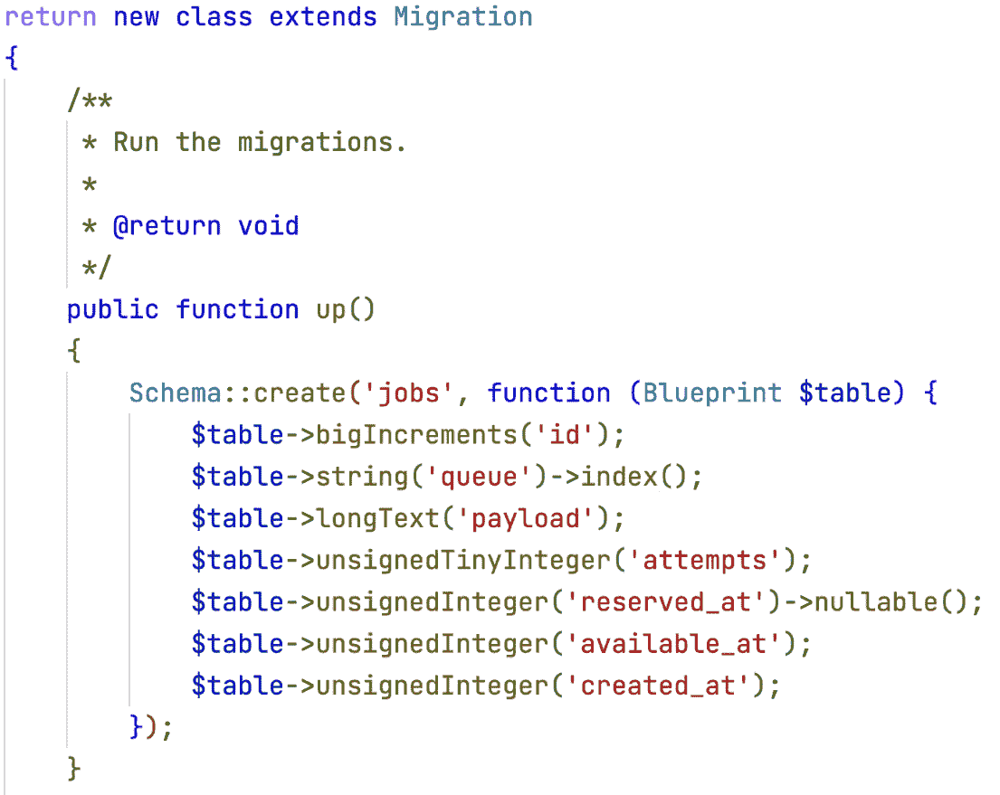

图 6.1：创建作业表的迁移文件

迁移将创建以下内容：

+   一个名为 `'jobs'` 的新表

+   `'id'`: 用于唯一标识符

+   `'queue'`: 队列名称，有助于通过命令行控制队列

+   `'payload'`: 以 JSON 格式包含信息的数据，这些信息由队列的消费者用于管理和启动任务

+   `'attempts'`: 执行作业的尝试次数

+   `'reserved_at'`: 消费者接管任务的时间戳

+   `'available_at'`: 当任务可被消费时

+   `'created_at'`: 作业在队列中创建的时间

JSON 负载（在负载字段中）的一个示例如下：

```php
{
  "displayName" : "App\\Jobs\\ProcessSomething",
  "failOnTimeout" : false,
  "retryUntil" : null,
  "data" : {
    "command" :
      "O:25:\"App\\Jobs\\ProcessSomething\":0:{}",
    "commandName" : "App\\Jobs\\ProcessSomething"
  },
  "maxExceptions" : null,
  "maxTries" : null,
  "uuid" : "e8b0c6c7-29ce-4108-a74c-08c70bb679a6",
  "timeout" : null,
  "backoff" : null,
  "job" : "Illuminate\\Queue\\CallQueuedHandler@call"
}
```

JSON 负载有一些属性：

+   `failOnTimeout`: 布尔字段，指示作业在超时时是否应该失败

+   `retryUntil`: 指示作业应该超时的时间戳（整数字段）

+   `maxExceptions`: 在异常后尝试作业的次数（整数字段）

+   `maxTries`: 尝试作业的次数（整数字段）

+   `uuid`: 作业的 UUID（字符串字段）

+   `timeout`: 作业可以运行的秒数（整数字段）

+   `backoff`: 在重试遇到未捕获异常的作业之前等待的秒数 - 可以是一个整数数组，用于跟踪每次尝试的秒数（由于错误，作业可能需要尝试多次）

+   `job`: 队列作业类的名称（字符串字段）

一旦我们使用 `php artisan queue:table` 命令创建了表的架构定义，我们就可以通过 `migrate` 命令在数据库中创建 `jobs` 表。

要在数据库中创建表，你可以启动 `migrate` 命令：

```php
php artisan migrate
```

要检查是否已创建正确的表，你可以使用 `db:table` 命令：

```php
php artisan db:table jobs
```

现在所有数据结构都已就绪，我们必须创建文件以实现作业的逻辑。

# 管理队列

在 Laravel 中管理作业时，按照惯例，我们为每个作业有一个类。作业类必须实现 `handle()` 方法。当作业需要执行时，`handle()` 方法由框架调用。

要创建管理作业的类，请参阅以下内容：

```php
php artisan make:job ProcessSomething
```

使用 `make:job` 命令，创建一个新文件 `app/Jobs/ProcessSomething.php`，其中包含 `ProcessSomething` 类和一些准备填充逻辑的方法。主要方法包括构造函数和用于管理作业的方法 `handle()`。

我们将逻辑实现到`handle()`方法中。在`app/Jobs/ProcessSomething.php`文件中，插入以下内容：

```php
public function handle()
{
    Log::info('Job processed START');
    sleep(3);
    Log::info('Job processed   END');
}
```

作为耗时操作的示例，我们将通过`sleep()`函数暂停`handle()`方法的执行 3 秒钟。这意味着线程将被挂起 3 秒钟。我们将记录方法执行的开始和结束以跟踪更多信息。您可以在默认配置下在`storage/logs/laravel.log`文件中找到日志。

## 经典的同步方法

通常，使用同步方法，如果你调用方法，响应需要 3 秒钟。

在`routes/web.php`文件中，我们将添加一个新的`/time`路由用于调度（请求同步执行）工作：

```php
Route::get('/time-consuming-request-sync', function () {
    $start = hrtime(true);
    ProcessSomething::dispatchSync();
    $time = hrtime(true) - $start;
    return view('result', [
        'title' => url()->current(),
        'description' => 'the task has been complete with
                          dispatchSync()',
        'time' => $time,
    ]);
});
```

调用静态的`dispatchSync()`方法允许您同步调用`handle()`方法（通过队列机制）。这是我们在 PHP 中调用方法时的经典场景。

为了渲染视图，我们必须实现*结果*视图，一个基本的 blade 模板，用于渲染`view()`函数中设置的标题、描述和时间。

创建`resources/views/result.blade.php` blade 文件：

```php
<!DOCTYPE html>
<html lang="{{ str_replace('_', '-', app()->getLocale()) }}">
<head>
  <meta charset="utf-8">
  <meta name="viewport" content="width=device-width,
    initial-scale=1">
  <title>Laravel</title>
</head>
<body class="antialiased">
  <div class="relative flex items-top justify-center
    min-h-screen bg-gray-100 dark:bg-gray-900
    sm:items-center py-4 sm:pt-0">
    <div class="max-w-6xl mx-auto sm:px-6 lg:px-8">
      <div class="mt-8 bg-white dark:bg-gray-800
        overflow-hidden shadow sm:rounded-lg">
        <div class="grid grid-cols-1">
          <div class="p-6">
            <div class="flex items-center">
              <div class="ml-4 text-lg leading-7
                font-semibold">{{ $title}}</div>
            </div>
            <div class="ml-12">
              <div class="mt-2 text-gray-900
                dark:text-gray-900 text-2xl">
                {{ $description }}
              </div>
              <div class="mt-2 text-gray-900
                dark:text-gray-900 text-2xl">
                {{ $time / 1_000_000 }} milliseconds
              </div>
            </div>
          </div>
        </div>
      </div>
    </div>
  </div>
</body>
</html>
```

blade 文件将在显示`$description`和`$time`参数的页面上显示结果。如果您通过您的网络浏览器在`http://localhost:8000/time-consuming-request-sync`请求页面，您必须至少等待 3 秒钟，页面才能完全渲染。此图显示时间值略大于 3,000 毫秒：

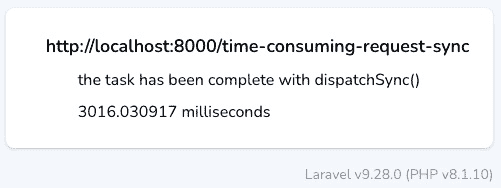

图 6.2：同步工作执行

这意味着你的工作需要 3 秒钟，Laravel 会等待发送响应，直到工作完成。

这可能没有什么特别之处，因为作为 PHP 开发者，我们已经习惯了管理同步工作。即使我们不管理队列，PHP 引擎也是同步驱动方法和函数的。其他一些语言有函数的异步调用——所以现在，让我们看看如何将执行调度到另一个可以异步执行工作的进程。

## 异步方法

而不是使用同步方法，我们将通过队列调度工作。

从队列中提取工作，需要启动一个特定的进程，以便消费者接管各种任务。要开始此进程，您可以执行`artisan`命令：

```php
php artisan queue:work
```

命令检查`jobs`表中是否有任何工作，并在工作完成后*消费*队列，删除该行。

从*生产者*端，在路由逻辑中，我们可以调用可用的`dispatch()`函数：

```php
Route::get('/time-consuming-request-async', function () {
    $start = hrtime(true);
    dispatch(new ProcessSomething());
// OR you can use ProcessSomething::dispatch();
    $time = hrtime(true) - $start;
    return view('result', [
        'title' => url()->current(),
        'description' => 'the task has been queued',
        'time' => $time,
    ]);
});
```

`dispatch()` 函数需要一个作业类的实例作为参数。`dispatch()` 函数会将作业实例发送到队列并释放对调用者的控制，无需等待作业的完整执行。最后，响应立即创建，无需等待作业完成，而不是典型的在作业完成后创建响应的行为。

我们只是将 `ProcessSomething` 类的实例发送到 `dispatch()` 方法。惯例是，*消费者* 在处理作业时会执行 `handle()` 方法。

现在，您可以打开浏览器并调用 URL，`http://localhost:8000/time-consuming-request-async`：

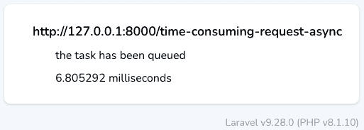

图 6.3：异步执行

为了允许浏览器接收响应，我们必须确保我们启动了两个命令：

+   `php artisan octane:start`：用于启动 Octane 服务器，监听端口 `8000`

+   `php artisan queue:work`：用于启动 *消费者* 服务，用于执行作业

如果您想查看队列的状态，您可以通过命令行执行：

```php
php artisan queue:monitor default
```

`queue:monitor` 命令将显示每个队列的队列状态和队列中的作业：

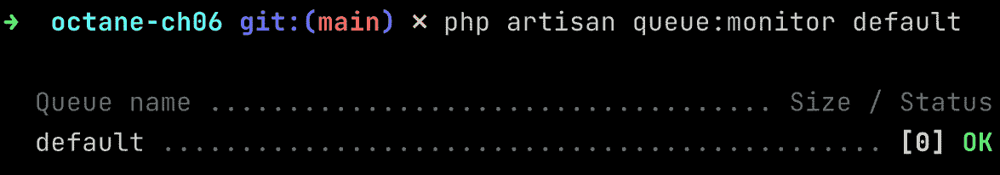

图 6.4：队列监控工具

如果队列中有待处理的作业，您将在方括号中看到等待作业的数量：

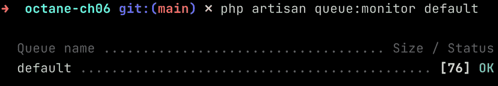

图 6.5：带有一些等待作业的队列

在示例中，队列中有 76 个作业。

如果您使用数据库作为管理队列的后端，我建议通过查询 SQL 的作业表来直接提高您的信心。

您可以使用 `artisan` `db` 命令访问数据库：

```php
php artisan db
```

然后，您可以执行 SQL 查询；例如，您可以计算每个队列有多少行：

```php
select count(id) as jobs_count, queue
from jobs
group by queue;
```

SQL 命令计算 `jobs` 表中标识符（计数）的数量，按 `queue` 字段分组行。

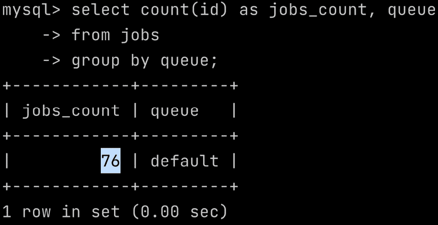

图 6.6：在作业表上执行查询

如果队列中有多个任务，请确保您正在运行消费者：

```php
php artisan queue:work
```

如果您想要有多个消费者并行执行您的任务，您可以多次启动 `queue:work`。如果您启动 `queue:work` 两次，您将有两个消费者从队列中提取作业。

如果你必须管理耗时任务，使用队列不仅是一种实现异步任务管理的方法。它是一种控制并行级别和限制你的架构可以处理或处理的并发耗时任务数量的方式。通过同步管理耗时任务，如果有大量请求，你可能会在 web 服务器上达到大量的并发请求，并且由于高资源使用，你的系统可能会崩溃。

将任务委托给特定的工人意味着你保持了用于处理请求的工人的负载较轻，你可以在专用实例或虚拟机上启动消费者进程。你也可以增加消费者进程的数量。

## 管理多个队列

你可以使用多个队列——例如，`first` 和 `second`。

当你需要将任务分配到队列时，你可以使用 `onQueue()` 方法：

```php
ProcessSomething::dispatch()->onQueue("first");
```

你可以控制两个队列：

```php
php artisan queue:monitor first,second
```

然后，你可以启动第一个队列的消费者：

```php
php artisan queue:work --queue=first
```

然后对于名为 `"second"` 的队列：

```php
php artisan queue:work --queue=second
```

例如，你可以为 `"first"` 队列启动两个消费者，而为 `"second"` 队列只启动一个，给 `"first"` 队列更高的优先级（因为它有两个专门的消费者而不是一个）。为了实现这一点，在不同的 shell 环境中，你可以启动以下命令：

```php
php artisan queue:work --queue=first
php artisan queue:work --queue=first
php artisan queue:work --queue=second
```

如果你需要清空队列并删除所有挂起的任务，你可以使用 `queue:clear` 命令：

```php
php artisan queue:clear database --queue=first
```

在这里，`database` 是连接的名称（我们现在正在使用数据库；在下一节中，我们将使用另一种类型的连接），我们也可以通过 `--queue` 参数定义队列。你也可以指定多个队列：

```php
php artisan queue:clear database --queue=first,second
```

连接是可选的；如果我们没有在命令行上指定 `database`（连接），则将使用 `.env` 文件中的 `QUEUE_CONNECTION` 环境参数。

现在我们已经看到了如何使用数据库作为后端创建和管理队列，让我们尝试配置 Redis 作为后端。

# 使用 Redis 管理队列并进行监控

使用 `database` 作为连接对刚开始使用队列并且已经为存储应用程序数据设置了数据库的人来说很方便。为什么使用 Redis 而不是数据库？因为 Redis 在管理队列方面比数据库有更多的优化，并且你可以使用 Laravel Horizon 来监控队列。Laravel Horizon 提供了一个用于监控你的队列及其使用指标的网页仪表板。

在使用 Redis 管理队列的第一步，首先，让我们安装 Redis 服务。

## 安装 Redis

安装 Redis 意味着你已经向你的堆栈中添加了软件和服务。如果你是 macOS 用户，你可以通过 **Homebrew** 安装它：

```php
brew install redis
brew services start redis
```

第一个命令安装软件；第二个命令启动服务。

如果你有一个 GNU/Linux 发行版，你可以使用你的包管理器；Redis 包含在大多数 GNU/Linux 发行版中。

或者，你可以使用 Sail（如前所述，在*第三章*，*配置 Swoole 应用程序服务器*，在*设置 Laravel Sail*部分，在安装 Swoole 时）。

执行以下`sail:install`命令：

```php
php artisan sail:install
```

确保你也选择了 Redis 服务（选项编号**3**）。

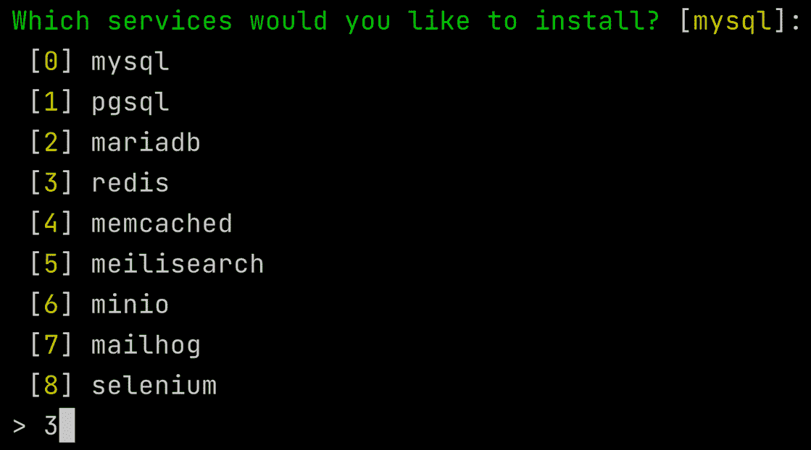

图 6.7：Laravel Sail 的 Redis 配置

在需要多个服务（例如，MySQL 和 Redis）的情况下，你可以选择`0,3`（逗号分隔）。

一旦 Redis 服务启动，我们就可以开始配置队列机制，使用 Redis 作为连接。

## 配置 Redis

在 Laravel 项目目录中放置的环境配置文件（`.env`文件），我们必须调整一些参数：

```php
QUEUE_CONNECTION=redis
REDIS_CLIENT=predis
REDIS_HOST=localhost
REDIS_PASSWORD=null
REDIS_PORT=6379
```

使用`QUEUE_CONNECTION`，你定义要使用的连接（`redis`）。

使用`REDIS_CLIENT`，你可以定义 Laravel 用于连接 Redis 服务的客户端。默认是`phpredis`（它使用 PECL 模块），或者你可以使用`predis`，它使用 PHP 包：[`github.com/predis/predis`](https://github.com/predis/predis)。`phpredis`模块是用 C 编写的，所以可能比`predis`实现（它是纯 PHP）更快。另一方面，`predis`实现有很多功能，社区和开发团队都非常支持。

如果你想要更改默认队列的名称（通常是“`default`”），你可以在`.env`文件中添加`REDIS_QUEUE`参数：

```php
REDIS_QUEUE=yourdefaultqueue
```

关于 Laravel 与 Redis 服务之间的连接，如果你不熟悉 Redis，我的建议是先使用`predis`包，因为它需要添加一个包：

```php
composer require predis/predis
```

如果你正在安装`predis/predis`包，你必须将`REDIS_CLIENT`参数设置为`predis`：

```php
REDIS_CLIENT=predis
```

所有这些配置都与`.env`文件相关。

如果你使用 Predis 包正确完成配置，必须在 Laravel 引导配置中设置别名。为此，在`config/app.php`文件中，在`'aliases'`部分，为 Redis 添加一个特定的条目：

```php
'aliases' => Facade::defaultAliases()->merge([
    // 'ExampleClass' => App\Example\ExampleClass::class,
    'Redis' => Illuminate\Support\Facades\Redis::class,
])->toArray(),
```

设置别名对于 Laravel 正确访问 Redis 对象非常有用，并帮助 Laravel 正确解析对 Redis 对象的引用，因为我们可能会与 Predis 包提供的`Redis`对象以及`phpredis`模块提供的 Redis 对象发生名称冲突。如果你忘记设置此配置，执行 Laravel 应用程序时不会收到错误，但你可能会遇到一些意外的应用程序行为。例如，当你想要清除特定连接的队列时，选定的队列没有被移除。

如果您切换连接，例如，从数据库切换到 Redis，您不需要在您的应用程序代码中做任何更改。Laravel 队列机制提供了一个抽象层，隐藏了每个连接特有的所有不同实现（在底层，管理数据库连接使用的是与 Redis 连接不同的实现）。

如果您使用的是代码（在`routes/web.php`文件中），请参阅以下内容：

```php
Route::get('/time-consuming-request-async', function () {
    $start = hrtime(true);
    ProcessSomething::dispatch()->onQueue("first");
    $time = hrtime(true) - $start;
    return view('result', [
        'title' => url()->current(),
        'description' => 'the task has been queued',
        'time' => $time,
    ]);
});
```

我们正在配置的连接上使用`"first"`队列。

要查看配置的连接，您可以使用`about`命令：

```php
php artisan about --only=drivers
```

命令显示您的 Laravel 应用程序用于队列的驱动器信息：

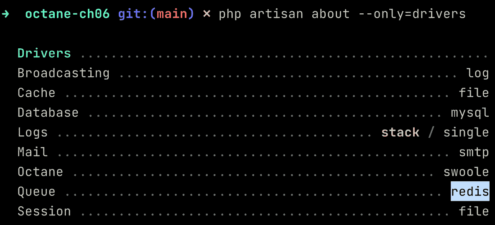

图 6.8：驱动器配置

命令显示对于队列，我们正在使用 Redis 作为队列的后端连接。

现在，打开`http://127.0.0.1:8000/time-consuming-request-async`页面，您将看到将任务推迟到 Redis 队列比数据库更快。例如，在我的本地机器上，调度方法的时间少于 1 毫秒。在我们的示例中，使用数据库连接，相同的代码需要 7 毫秒：

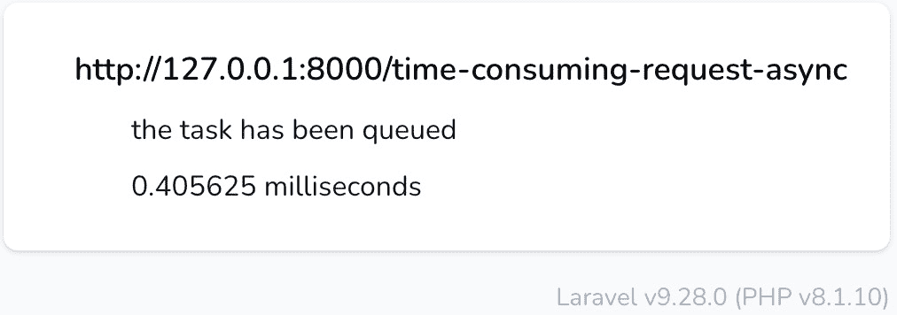

图 6.9：在 Redis 队列上调度一个作业

通过队列机制，我们提高了应用程序的*响应性*，使用户能够立即收到关于任务的响应。然后，通过 Redis 连接，我们减少了排队作业所需的时间。

多亏了 Redis 连接，我们还可以使用 Laravel Horizon 来监控队列。

## 使用 Laravel Horizon 监控队列

我们将把 Horizon 添加到我们的应用程序中。这意味着您可以通过末尾的`/horizon`路径访问 Horizon 仪表板。

要安装 Laravel Horizon，您必须安装以下包：

```php
composer require laravel/horizon
```

然后，您需要发布 Horizon 所需的文件：配置文件（`config/horizon.php`）、资产（在`public/vendor/horizon`目录中），以及服务提供者（在`app/Providers/HorizonServiceProvider.php`文件中）：

```php
php artisan horizon:install
```

`horizon:install`将所有必需的文件复制到正确的目录中。

使用以下命令启动 Laravel Octane：

```php
php artisan octane:start
```

使用默认的 Horizon 配置，您可以通过`http://127.0.0.1:8000/horizon`访问：

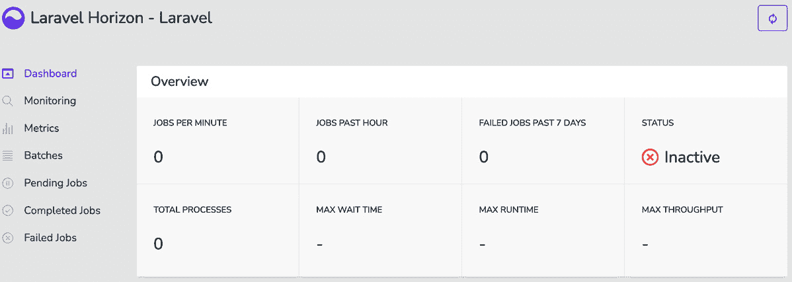

图 6.10：Laravel Horizon 仪表板

状态指示 Horizon 进程的监督器是否正在运行。为了正确收集所有指标，启动监督器：

```php
php artisan horizon
```

然后，如果您多次加载`http://127.0.0.1:8000/time-consuming-request-async`页面，队列中会创建多个作业。启动消费者：

```php
php artisan queue:work --queue=first
```

您将有一个正在运行的消费者，准备从队列中执行作业。

因此，你有了 Octane、Horizon 和队列工作者的运行。多次加载页面，然后转到 `http://127.0.0.1:8000/horizon/dashboard` 上的仪表板。你将看到仪表板页面充满了指标：

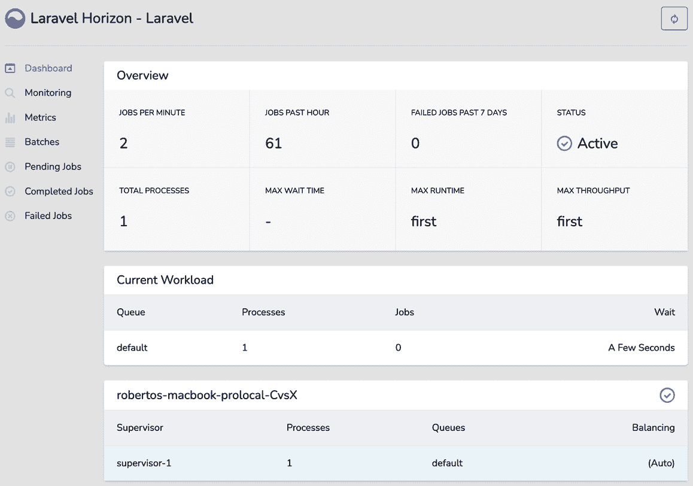

图 6.11：详细说明指标的 Horizon 仪表板页面

这些指标是通过 Horizon 实现的 `/horizon/api/stats` 端点检索和计算的。

如果你查看 API 的响应，你可以以编程方式检索在仪表板 UI 中可以看到的相同信息。

备注

在这种场景下，如果你有一个 UI 通过轮询（每 3 秒）调用多个端点（API），如果你使用 Octane 提供的 API，你可以继承使用 Octane 所带来的所有好处。Octane 通过其所有优化降低了延迟。

对于统计 API，JSON 响应具有以下结构：

```php
{
    "failedJobs": 0,
    "jobsPerMinute": 1,
    "pausedMasters": 0,
    "periods": {
        "failedJobs": 10080,
        "recentJobs": 60
    },
    "processes": 1,
    "queueWithMaxRuntime": "first",
    "queueWithMaxThroughput": "first",
    "recentJobs": 0,
    "status": "running",
    "wait": {
        "redis:default": 0
    }
}
```

在这里，你可以检索以下内容：

+   最近失败的作业数量，`"failedJobs"`。

+   自上次快照以来每分钟处理的作业数量，`"jobsPerMinute"`。

+   当前暂停的主监督器的数量，`"pausedMasters"`。

+   Horizon 管理近期和失败作业的配置（以分钟为单位）。这些值以秒为单位表示，配置在 `config/horizon.php` 文件的 `trim` 部分中定义。

+   进程数量，`"processes"`。

+   具有最长运行时间的队列名称为 `"queueWithMaxRuntime"`。

+   具有最高吞吐量的队列名称为 `"queueWithMaxThroughput"`。

+   近期作业的数量，`"recentJobs"`。

+   监督器的状态（通过 `php artisan horizon` 运行的进程），`"status"`。

+   每个队列的清除时间，`"wait"`（以秒为单位）。

Horizon 仪表板是监控所有运行队列的状态和统计信息的便捷方式。通过 Horizon，你不能控制队列；对于管理队列，你可以使用这里解释的命令：

+   `queue:monitor`：用于监控队列的状态和等待作业的数量

+   `queue:clear`：用于删除连接或队列中的所有作业

+   `queue:flush`：用于删除所有失败作业

+   `queue:forget`：用于删除特定的失败作业（以避免重试失败作业的执行）

+   `queue:retry`：重试之前失败的作业的执行

+   `queue:work`：处理队列（或通过 `–queue` 参数指定的队列）

多亏了所有这些命令，你可以控制队列的状态和健康。

使用 Horizon，你可以监控队列的执行和状态。

现在，我们有一个使用 Redis 作为后端的运行和监控队列的架构。

# 摘要

使用异步方法，我们可以推迟某些任务的执行，并更快速地响应用户请求。换句话说，工作被排队，稍后处理。这种行为的差异在于经典方法中工作立即执行，但好处是应用程序的 UI 控制始终对用户可用。因此，应用程序的用户体验更流畅，用户在此期间还可以使用您的应用程序做其他事情。除了提高用户体验外，异步方法更具可扩展性，因为您可以以细粒度控制将负责工作的进程。您还可以通过`php artisan queue:work`命令执行多个工作进程——如果您的硬件架构有更多用于运行后端进程的虚拟机，您可以在多个虚拟机上运行消费者进程。

为了在本章中实现异步架构，我们介绍了队列机制；我们展示了以下内容：

+   如何首先使用数据库作为后端连接，然后在更强大的后端 Redis 上安装和设置队列

+   同步方式和异步方式执行工作的差异

+   使用队列在系统响应性和对用户体验的影响方面的好处

+   安装 Horizon 以监控队列使用情况

在下一章中，我们将看到如何准备应用程序以及如何设置工具以在生产环境中部署 Laravel Octane 应用程序。
