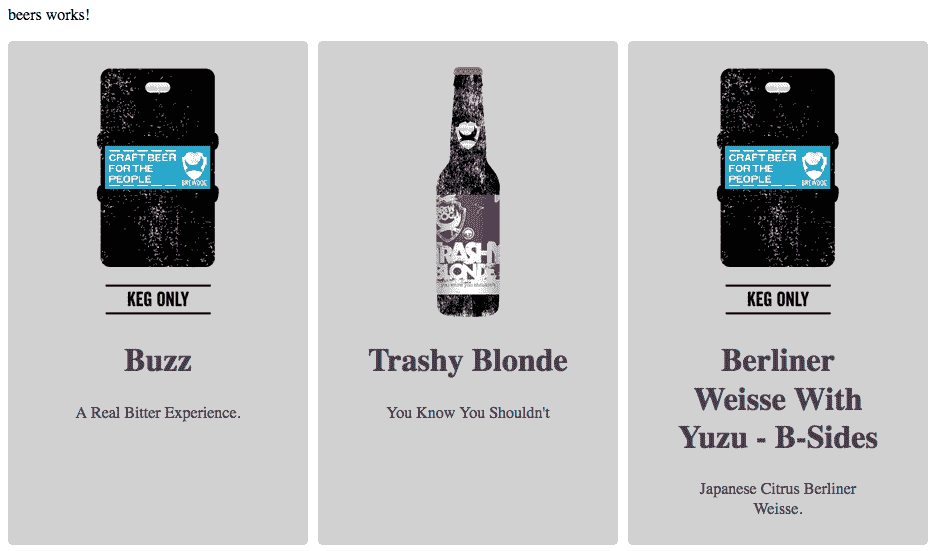

# 理解 Angular 6 的核心概念

Angular 框架已经成为全球最流行的前端应用程序开发工具之一。除了非常多功能（与其他库如`React.js`或`Vue.js`非常不同，这些库只用于一个目的），Angular 是一个完整的框架，并且随着 Angular 6 的新更新，我们现在有更多资源可用于创建令人惊叹和快速的 Web 应用程序。此外，Angular 团队每年提出两次重大更新。

Angular 的另一个优势是其包含用于创建 Web 应用程序的 Angular **命令行界面**（**CLI**）。这为我们提供了额外的能力；通过终端中的一个简单命令，我们可以非常快速和轻松地创建应用程序的样板代码。然而，一切并不像我们希望的那样甜蜜，因此我们需要了解 Angular 的基本概念，并知道如何避免一些问题。这可以通过采用基于组件和模块的开发思维模型来轻松解决。在接下来的示例中，我们将仔细创建可扩展和模块化项目的基本结构。

在本章中，我们将涵盖以下主题：

+   Angular 6 - 更小，更快，更容易

+   Angular 和组件方法用于开发现代 Web 应用程序

+   安装工具：Git，Angular CLI，HTTP 服务器和 VS Code 插件

+   创建一个简单的 Angular 应用程序

+   简单部署

# Angular 6 - 更小，更快，更容易

以下功能不仅适用于版本 6，而且从版本 5 开始就已包含；我们在这里提到它们是因为它们是构建现代 Web 应用程序的强大功能：

+   **Webpack**：您现在可以使用作用域托管技术生成更小的模块。

+   您可以通过使用 JavaScript 的 RxJS 6 库减少常见用例的捆绑大小。

+   Angular CLI 允许使用命令，如`ng` update，来更新所有依赖项。

+   您将有选择使用 Angular Material Design 启动应用程序。

+   `ng add`命令支持创建渐进式 Web 应用程序或将现有应用程序转换为**渐进式 Web 应用程序**（**PWA**）。

+   您将有机会使用 Bazel 构建应用程序的库，并与其他团队共享库。

+   Angular 使得可以打包自定义 HTML/JavaScript 元素以供第三方应用程序使用。

您可以在[`bazel.build/`](https://bazel.build/)了解有关 Bazel 的更多信息。

当然，Angular 6 版本中还有许多其他改进和功能；请注意，本书是在 Angular 6 beta 7 版本上编写的，接下来的章节将有关于当前 Angular 版本的更多新闻。

# Angular 和组件方法用于开发现代 Web 应用程序

Angular 组件类似于 Web 组件；它们用于组合网页，甚至其他组件。一个 Web 应用程序中可能有数十个组件。

组件定义视图和模板，并且它们属于应用程序中的一个模块；每个应用程序至少有一个根模块，由 Angular CLI 命名为`AppModule.ts`。

`app.module.ts`文件包含了 Angular 应用程序的所有引导代码和配置，如下面的代码块所示：

```php
import { NgModule } from '@angular/core';

@NgModule({
  declarations: [
    AppComponent
  ],
  imports: [],
  providers: [],
  bootstrap: [AppComponent]
})
export class AppModule { }
```

上述代码是 Angular 应用程序的最基本配置；我们从 Angular 核心库中导入`NgModule`并将其用作装饰器：`@NgModule`。

组件和服务都只是类，带有标记其类型并提供元数据的装饰器，告诉 Angular 如何使用它们。

您可以在[`www.webcomponents.org/introduction`](https://www.webcomponents.org/introduction)了解有关 Web 组件的更多信息。

# Angular 的主要构建模块

使用 Angular 框架创建的每个应用程序都有五个非常重要的连接到彼此的点，并建立了应用程序的基本架构：

+   **模块**：使用装饰器`@NgModule`

+   **服务**：使用装饰器`@Injectable`

+   **组件**：使用装饰器`@component`

+   **模板**：带有`data-bind`和指令的视图

+   **路由**：将 URL 路径设置为视图

让我们以一个简单的博客页面作为 Angular 应用程序来看待，使用组件构建：

Angular 组件

前述图表说明了组件如何用于构建一个简单的应用程序。

前述图表与 Angular 应用程序的五个基本概念的比较如下：

+   一个模块：`blog.module.ts`

+   一个页面组件：`blog.component.ts`

+   博客页面的路由

+   加载博客文章的服务

还有一些其他组件，如**Header**，**Post**和**Pagination**。

请注意，Header 组件属于应用程序的主模块（在本例中为`AppModule`），而 Post 和 Pagination 组件属于`BlogModule`的一部分。

随着我们在本章中的深入，我们将更仔细地研究模块和组件之间的关系。现在，我们将看一下组件的生命周期。

# 组件生命周期

在 Angular 组件的生命周期中，在实例化后，组件从开始到结束都会运行一条明确的执行路径。最基本的理解方式是通过观察以下代码：

```php
export class HelloComponent implements OnInit, OnDestroy {
   constructor() { }

   ngOnInit() {
... Some code goes here
}
ngOnDestroy() {
... Some code goes here
}
}  
```

在上面的例子中，您可以看到名为`ngOnInit()`和`ngOnDestroy`的方法；这些名称非常直观，向我们展示了我们有一个开始和一个结束。`ngOnInit()`方法是通过其`OnInit`接口实现的，`ngOnDestroy()`方法也是如此。正如您在前一章中看到的，TypeScript 中的接口非常有用 - 这里也不例外。

在下图中，我们将看一下我们可以在组件上实现的主要接口。在图中，在`Constructor()`方法之后，有八个接口（也称为钩子）；每个接口在特定时刻负责一件事：

Angular 组件生命周期您可以在官方的 Angular 文档中了解每个接口的更多信息[`angular.io/guide/lifecycle-hooks`](https://angular.io/guide/lifecycle-hooks)。

我们不会在本章逐一描述接口，以免给您带来过多负担，但在本书的过程中，我们将在我们构建的应用程序中使用它们。此外，上述链接包含了关于每个接口和钩子的详细信息。

# 安装工具 - Git，Angular CLI 和 VS Code 插件

从本章到本书的结束，我们将采用 VS Code 文本编辑器 - 它是免费的，轻量级的，非常适合创建 Web 应用程序。

此外，对于源代码使用版本控制系统非常重要；这将帮助我们跟踪代码库中的所有更改。

接下来，我们将介绍 Git 源代码控制。

# 安装 Git

作为对 Git 的简单快速介绍，我们可以描述如下。

Git 是一个文件版本控制系统。通过使用它，我们可以开发项目，让许多人可以同时贡献，编辑和创建新文件，使它们可以存在而不会被覆盖。

在使用 Git 时非常常见的情况是同时在云中使用服务（如 GitHub 或 Bitbucket）来存储代码，以便我们可以共享它。

此外，几乎所有的开源项目（框架和库）今天都在 GitHub 上。因此，您可以通过报告错误，甚至发送代码和建议来做出贡献。

如果您是开发人员，但尚未拥有 GitHub，那么您已经晚了 - 现在是开始使用它的时候。因此，让我们安装 Git。

转到 [`git-scm.com/downloads`](https://git-scm.com/downloads) 并下载并安装适用于您平台的 Git。

安装后，打开您的终端并输入以下命令：

```php
git --version
```

您必须看到已安装在您系统上的当前版本。

此外，`git help`命令非常有用，列出所有可用的命令。

您可以在 [`git-scm.com/book/en/v2/Getting-Started-Git-Basics`](https://git-scm.com/book/en/v2/Getting-Started-Git-Basics) 上阅读有关 Git 基础知识的更多信息。

# 安装 Angular CLI

在框架的世界中，无论使用哪种语言，我们经常会发现可以帮助我们进行日常软件开发的工具，特别是在有重复任务时。

Angular CLI 是一个命令行界面，可以以非常高效的方式创建、开发和维护 Angular 应用程序。它是由 Angular 团队自己开发的开源工具。

通过使用 Angular CLI，我们能够创建整个 Angular 应用程序的基本结构，以及模块、组件、指令、服务等。它有自己的开发服务器，并帮助我们构建应用程序。

现在，是时候安装它了：

1.  打开您的终端并输入以下命令：

```php
npm install -g @angular/cli@latest
```

安装后，您将在终端中看到以下输出：

```php
+ @angular/cli@1.7.3 added 314 packages, removed 203 packages, updated 170 packages and moved 7 packages in 123.346s
```

删除和更新的软件包数量以及 Angular CLI 版本可能会有所不同。不用担心。

1.  您可以使用以下命令删除旧版本的 Angular CLI 并安装最新版本：

```php
npm uninstall -g angular-cli
npm cache verify
npm install -g @angular/cli@latest
```

如果您在尝试在 Windows 机器上更新 Angular CLI 版本时遇到一些`npm`问题，您可以查看 [`docs.npmjs.com/troubleshooting/try-the-latest-stable-version-of-npm#upgrading-on-windows`](https://docs.npmjs.com/troubleshooting/try-the-latest-stable-version-of-npm#upgrading-on-windows) 获取信息。

请注意，上述命令将在您的环境/机器上全局安装 Angular CLI。通常，当我们使用 Angular 框架和 Angular CLI 进行开发时，我们会看到关于版本差异的警告消息。这意味着，即使您在您的环境中安装了最新版本的 Angular CLI，Angular CLI 也会检查当前项目中使用的版本，并将其与您的机器上安装的版本进行比较，并使用当前项目版本。

当您在第三方项目上工作并需要保持全局安装在您的机器上的 Angular CLI 与`node_modules`项目文件夹中安装的本地项目版本之间的依赖一致性时，这非常有用。

1.  在您当前的 Angular 项目中，输入以下命令：

```php
rm -rf node_modules
npm uninstall --save-dev angular-cli
npm install --save-dev @angular/cli@latest
npm install
```

与我们书中使用的其他命令一样，Angular CLI 有一个名为`ng help`的命令。通过它，我们可以访问大量的选项。

其中一个命令在我们使用 Angular 开发应用程序并需要在官方文档中查询内容时特别有用，而无需离开终端。

1.  返回您的终端并输入以下命令：

```php
ng doc HttpClient
```

上述命令将在您的默认浏览器中打开`HttpClient`文档 API，使用 [`angular.io/api?query=HttpClient`](https://angular.io/api?query=HttpClient)。因此，您可以将`ng doc`命令与您想要搜索的 API 中的任何内容结合使用。

现在我们已经拥有了开始使用 Angular CLI 开发 Web 应用程序所需的一切，但在深入构建示例应用程序之前，我们将使用一些非常有用的工具更新我们的工具包。

# 安装 VS Code Angular 插件

正如前几章所述，VS Code 文本编辑器是使用 JavaScript 和 TypeScript 开发 Web 应用程序的绝佳 IDE，Angular 也是如此。

在本节中，我们将看一些扩展（也称为插件），这些扩展可以帮助我们进行开发。

让我们来看看软件包名称和存储库 URL：

+   **Angular Language Service**：[`github.com/angular/vscode-ng-language-service`](https://github.com/angular/vscode-ng-language-service)。由官方 Angular 团队提供，此扩展可帮助我们在模板文件和模板字符串中进行补全，并为模板和 Angular 注释提供诊断。

+   **Angular v5 Snippets**：[`github.com/johnpapa/vscode-angular-snippets`](https://github.com/johnpapa/vscode-angular-snippets)。扩展名为 Angular v5；GitHub 项目存储库没有指定名称。因此，我们可以期望从插件作者那里获得未来版本的 Angular 的代码片段。这是一个强大的工具，可以帮助我们几乎在 Angular 应用程序中创建任何东西；您可以在 GitHub 存储库中看到完整的列表。

+   **Angular Support**：[`github.com/VismaLietuva/vscode-angular-support`](https://github.com/VismaLietuva/vscode-angular-support)。

转到并从中查看定义：

```php
interpolation {{ someVar }}
input [(...)]="someVar"
output (...)="someMethod"
templateUrl or styleUrls in @Component decorator
component <some-component></some-component>
```

最后但同样重要的是，我们建议您使用 GitLens 插件。这个扩展非常重要，因为它帮助我们在 Git 存储库中可视化我们的代码，同时还提供与 GitHub 或 Bitbucket 的集成。

+   **GitLens**：[`github.com/eamodio/vscode-gitlens`](https://github.com/eamodio/vscode-gitlens)。

增强内置于 Visual Studio Code 中的 Git 功能。

– Gitlens

+   您可以探索存储库和文件历史记录的导航

+   您还可以探索提交并可视化分支、标签和提交之间的比较

+   有一个作者代码镜头，显示文件顶部和/或代码块上最近的提交和作者数量

+   **GitLens 插件**：[`gitlens.amod.io/`](https://gitlens.amod.io/)。这个扩展非常重要，因为它帮助我们在 Git 存储库中可视化我们的代码，同时还提供与 GitHub 或 Bitbucket 的集成。

此外，还可以通过 IDE 本身安装任何扩展。要做到这一点，请按照以下步骤操作：

1.  打开 VS Code。

1.  单击左侧边栏上的最后一个图标；您可以在以下截图中看到它：

VS Code 扩展安装

只需在搜索输入字段中键入要搜索的内容，然后单击安装。

现在，我们已经拥有了开始开发 Angular 应用程序所需的一切。在下一节中，我们将看看如何使用 Angular CLI 创建 Angular 应用程序。

# 创建一个简单的 Angular 应用程序

在本章中，我们将涵盖使用 Angular 框架和 Angular CLI 开发 Web 应用程序的所有要点。现在，是时候接触代码并从头到尾开发一个应用程序了。

在这个示例项目中，我们将开发一个简单的前端应用程序来消耗 API 的数据并在屏幕上显示它 - 类似于一个简单的博客。打开您的终端并键入以下命令：

```php
ng new chapter03 --routing
```

请注意，`--routing`标志是可选的，但由于我们的下一个示例将使用路由，因此最好在启动应用程序时使用该标志。安装了 Angular CLI 后，您应该在终端上看到以下消息：

```php
Testing binary
Binary is fine
added 1384 packages in 235.686s
You can `ng set --global packageManager=yarn`.
Project 'chapter03' successfully created.
```

# Angular 应用程序的结构

现在我们已经创建了我们的应用程序，让我们检查一些重要的文件。尽管这些文件已经设置好并准备好使用，但在现实世界的应用程序中，我们经常需要添加设置，甚至其他模块。

在 VS Code 中打开`chapter03`文件夹；您将在 VS Code 资源管理器选项卡中看到以下屏幕：

Angular 项目结构

因此，在`/src/app`文件夹中，除了服务（我们很快将看到）外，我们还有 Angular 应用程序的五个主要块：

| `app.routing.module.ts` | 路由 |
| --- | --- |
| `app.component.css` | 样式表 |
| `app.component.html` | 模板 |
| `app.component.spec.ts` | 测试 |
| `app.component.ts` | @Component |
| `app.module.ts` | @NgModule |

# package.json 文件

`package.json`文件在使用 Node.js 模块的 Web 应用程序中非常常见。如今，它经常出现在前端应用程序中，除了使用 Node.js 的服务器端应用程序。对于 Angular 框架来说，它也不例外；这是新版本 Angular 的一个巨大优势，因为我们只能导入对应用程序非常必要的模块，从而减小了大小和构建时间。让我们看一下`package.json`文件的内容。我们在每个重要部分之前添加了一些注释：

```php
{
"name": "chapter03",
"version": "0.0.0",
"license": "MIT",
// Npm commands, based on Angular/Cli commands, including: test and     build.
"scripts": {
"ng": "ng",
"start": "ng serve",
"build": "ng build --prod",
"test": "ng test",
"lint": "ng lint",
"e2e": "ng e2e"
 },
"private": true,
// Dependencies to work in production, including:
@angular/core, @angular/common, @angular/route and many more. "dependencies":{
...
},
//  Dependencies only in development environment, including modules for test, TypeScript version, Angular/Cli installed locally and others.  "devDependencies": { ...
}
} 
```

当我们安装新模块时，此文件会自动更改。而且，我们经常在标签脚本内添加一些命令，正如您将在接下来的章节中看到的那样。您可以在官方 npm 文档的[`docs.npmjs.com/files/package.json`](https://docs.npmjs.com/files/package.json)中阅读更多关于`package.json`文件的信息。

# Dotfiles - .editorconfig，.gitignore 和.angular-cli.json

Dotfiles 是以点开头的配置文件；它们始终在项目的后台，但它们非常重要。它们用于自定义您的系统。名称 dotfiles 源自类 Unix 系统中的配置文件。在 Angular 项目中，我们将看到其中三个文件：

+   `.editorconfig`：此文件配置文本编辑器以使用特定的代码样式，以便项目保持一致，即使它由多人和多种文本编辑器编辑。

+   `.gitignore`：顾名思义，它会忽略确定的文件夹和文件，以便它们不被源代码控制跟踪。我们经常发现`node_modules`和`dist`文件夹不需要版本控制，因为它们在每次安装应用程序或运行构建命令时都会生成。

+   `.angular-cli.json`：存储项目设置，并在执行构建或服务器命令时经常使用。在单个项目中可能有几个 Angular 应用程序。让我们看一些细节并检查`.angular-cli.json`：

```php
{
    "$schema": "./node_modules/@angular/cli/lib/config/schema.json",
    "project": {
    "name": "chapter03"
    },
    // Here we determinate the projects, for this example we have     only one app.
    "apps": [
    {
    "root": "src",
    "outDir": "dist",
    "assets": [
    "assets",
    "favicon.ico"
    ],
    "index": "index.html",
    "main": "main.ts",
    "polyfills": "polyfills.ts",
    "test": "test.ts",
    "tsconfig": "tsconfig.app.json",
    "testTsconfig": "tsconfig.spec.json",
    "prefix": "app",
    "styles": [
    "styles.css"
    ],
    "scripts": [],
    "environmentSource": "environments/environment.ts",
    // Configuration for both environment, developing and production
    "environments": {
    "dev": "environments/environment.ts",
    "prod": "environments/environment.prod.ts"
    }
    }
    ],
    // Configuration for end to end tests and unit tests
    "e2e": {
    "protractor": {
    "config": "./protractor.conf.js"
    }
    },
    "lint": [
    {
    "project": "src/tsconfig.app.json",
    "exclude": "**/node_modules/**"
    },
    {
    "project": "src/tsconfig.spec.json",
    "exclude": "**/node_modules/**"
    },
    {
    "project": "e2e/tsconfig.e2e.json",
    "exclude": "**/node_modules/**"
    }
    ],
    "test": {
    "karma": {
    "config": "./karma.conf.js"
    }
    },
    // Stylesheet configiration, for this example we are using CSS
    "defaults": {
    "styleExt": "css",
    "component": {}
    }
}
```

# 环境

在`src/environments`文件夹中，我们找到两个配置文件。一个称为`environment.prod.ts`，另一个是`environment.ts`。Angular CLI 将根据我们使用的命令来决定使用哪一个；例如，考虑以下命令：

```php
 ng build --env = prod 
```

如果我们使用它，那么 Angular 将使用`environment.prod.ts`文件，对于其他命令，比如`ng serve`，它将使用`environment.ts`。这非常有用，特别是当我们有一个本地 API 和一个在`production`中时，使用不同的路径。

两个文件几乎具有相同的代码；请参阅`environment.prod.ts`，如下所示：

```php
export const environment = {
    production: true
};
```

`environment.ts`文件如下：

```php
export const environment = {
    production: false
};
```

请注意，在这个第一阶段，`true`（在生产中）和`false`（在开发中）是这两个文件之间唯一的区别。显然，除了我们提到的文件之外，Angular 应用程序中还有许多其他文件，它们都非常重要。但是，现在让我们专注于这些。别担心；在本书的过程中，我们将详细了解更多内容，在开发我们的示例应用程序时。现在，我们将专注于创建本章中使用的简单示例。

# 运行示例应用程序

现在我们已经启动了我们的项目，我们将运行内置的 Angular CLI 服务器，以查看我们的应用程序的外观：

1.  在项目根目录中打开 VS Code 到`chapter03`文件夹。

1.  在这个例子中，我们将使用集成终端进行编码；为此，请点击顶部菜单中的`view`，然后点击`Integrated Terminal`。

1.  在终端中键入以下命令：

```php
npm start
```

您将看到类似以下的消息：

```php
 ** NG Live Development Server is listening on localhost:4200, open  
 your  
 browser on http://localhost:4200/ **
 Date: xxxx 
 Hash: xxxx
 Time: 16943ms
 chunk {inline} inline.bundle.js (inline) 3.85 kB [entry] [rendered]
 chunk {main} main.bundle.js (main) 20.8 kB [initial] [rendered]
 chunk {polyfills} polyfills.bundle.js (polyfills) 549 kB [initial]  
 [rendered]
 chunk {styles} styles.bundle.js (styles) 41.5 kB [initial]  
 [rendered]
 chunk {vendor} vendor.bundle.js (vendor) 8.45 MB [initial] 
 [rendered]
```

1.  在幕后，Angular CLI 将使用 webpack 模块管理器。在本书的后面，您将看到如何导出和自定义 webpack 文件。

1.  现在，转到`http://localhost:4200`并检查结果；您将看到我们之前创建的样板应用程序的欢迎页面。您可以在`src/app/app.component.html`中找到这个页面的代码 - 这是我们的模板。

现在，是时候向我们的应用程序添加一个新模块了。

# 添加新模块

在这个例子中，我们将演示如何使用 Angular CLI 构建应用程序。即使在这个非常基本的例子中，我们也将涵盖以下几点：

+   如何组织一个 Angular 应用程序

+   创建模块

+   创建服务

+   模板数据绑定

+   在生产环境中运行应用程序

现在，让我们创建一个显示啤酒列表的模块：

1.  打开 VS Code，在集成终端内输入以下命令：

```php
ng g module beers
```

请注意，命令`ng g module`是`ng generate module <module-name>`的快捷方式，这个命令只是创建模块；我们需要添加路由、组件和模板，并且在`app`文件夹的根目录的`app.modules.ts`中导入`beers`模块。上述命令将在我们的项目中生成以下结构和文件内容：`src/app/beers/beers.module.ts`。`beers.module.ts`的内容如下：

```php
import { NgModule } from '@angular/core';
import { CommonModule } from '@angular/common';
    @NgModule({
    imports: [
    CommonModule
    ],
    declarations: []
    })
export class BeersModule { }
```

这是一个非常简单的样板代码，但非常有用。现在，我们将添加缺失的部分。

1.  将`beers`模块添加到您的`app`模块；打开`app.module.ts`并用以下行替换代码：

```php
import { BrowserModule } from '@angular/platform-browser';
import { NgModule } from '@angular/core';
import { HttpClientModule } from '@angular/common/http';
import { AppRoutingModule } from './app-routing.module';
import { AppComponent } from './app.component';
import { BeersModule } from './beers/beers.module';
    @NgModule({
    declarations: [
        AppComponent
    ],
    imports: [
    BrowserModule,
    AppRoutingModule,
    HttpClientModule,
    BeersModule
    ],
    providers: [],
    bootstrap: [AppComponent]
})
export class AppModule { }
```

请注意，我们导入了`BeersModule`并将其添加到`imports`数组中。

# 添加新组件

现在，我们需要一个组件来显示啤酒列表，因为我们刚刚创建了一个名为`Beers`的模块。稍后，您将看到如何使用 API 和 Angular 服务来加载啤酒列表；现在，我们将专注于创建我们的组件。

在根文件夹内，并在集成的 VS Code 终端中，输入以下命令：

```php
ng g component beers
```

前面的命令将生成以下结构：


`BeersModule`和`Component`文件已经创建。现在我们有了我们的模块、模板和组件文件。让我们添加一个新的路由。

# 添加新路由

如您之前所见，路由是每个 Web 应用程序的一部分。现在，我们将添加一个新的路由，以便我们可以访问我们的`beers`模块的内容。打开`src/app/app-routing.module.ts`并用以下代码替换：

```php
import { NgModule } from '@angular/core';
import { Routes, RouterModule } from '@angular/router';
import { AppComponent } from './app.component';
import { BeersComponent } from './beers/beers.component';
const routes: Routes = [
    { path: '', redirectTo: 'beers', pathMatch: 'full' },
    { path: 'beers', component: BeersComponent }
];
@NgModule({
    imports: [RouterModule.forRoot(routes)],
    exports: [RouterModule]
})
export class AppRoutingModule { }
```

请注意，我们只是将新路由添加到现有的路由文件中（在这种情况下是`app.routing.module.ts`），因为这个例子非常简单。但是，在更大的应用程序中，建议为每个应用程序模块创建单独的路由文件。

# 创建一个 Angular 服务

Angular 服务用于处理数据；它可以是内部数据（从一个组件到另一个组件）或外部数据，比如与 API 端点通信。几乎所有使用 JavaScript 框架的前端应用程序都使用这种技术。在 Angular 中，我们称之为服务，并且我们使用一些内置在 Angular 框架中的模块来完成任务：`HttpClient`和`HttpClientModule`。

让我们看看 Angular CLI 如何帮助我们：

1.  打开 VS Code，在集成终端内输入以下命令：

```php
ng g service beers/beers
```

上述命令将在`beers`文件夹中生成两个新文件：

`beers.service.spec.ts`和`beers.service.ts`。

1.  将新创建的`Service`作为依赖提供者添加到`beers.module.ts`。打开`src/app/beers/beers.module.ts`并添加以下行：

```php
import { BeersService } from './beers.service'; @NgModule({
    providers: [BeersService] })
```

在 VS Code 中，我们有导入模块支持，所以当您开始输入模块的名称时，您将看到以下帮助屏幕：


最终的`beers.module.ts`代码将如下所示：

```php
import { NgModule } from '@angular/core';
import { CommonModule } from '@angular/common';
import { BeersComponent } from './beers.component';
import { BeersService } from './beers.service';
@NgModule({
    imports: [
        CommonModule
    ],
    declarations: [BeersComponent],
    providers: [BeersService
    ]
})
export class BeersModule { }
```

现在，是时候使用服务连接到 API 了。为了尽可能接近真实应用程序，我们将在这个例子中使用一个公共 API。在接下来的步骤中，我们将有效地创建我们的服务并将数据绑定到我们的模板上。

在这个例子中，我们将使用免费的[`punkapi.com/`](https://punkapi.com/) API：

1.  打开`beers.service.ts`，并用以下行替换代码：

```php
import { Injectable } from '@angular/core';
import { HttpClient, HttpHeaders, HttpErrorResponse } from '@angular/common/http';
import { Observable } from 'rxjs/Observable';
import 'rxjs/add/observable/throw';
import { catchError } from 'rxjs/operators';
@Injectable()
export class BeersService {
    private url = 'https://api.punkapi.com/v2/beers?';
    constructor(private http: HttpClient) { }
/**
* @param {page} {perpage} Are Page number and items per page
*
* @example
* service.get(1, 10) Return Page 1 with 10 Items
*
* @returns List of beers
*/
    get(page: number, per_page: number) {
        return this.http.get(this.url + 'page=' + page +
         '&per_page=' + per_page)
        .pipe(catchError(error => this.handleError(error)));
    }
```

```php

    private handleError(error: HttpErrorResponse) {
        return Observable.throw(error);
    }
}
```

现在，我们需要告诉组件我们需要使用这个服务来加载数据并将其传输到我们的模板中。

1.  打开`src/app/beers/beers.component.ts`，并用以下代码替换代码：

```php
import { Component, OnInit } from '@angular/core';
import { BeersService } from './beers.service';
@Component({
    selector: 'app-beers',
    templateUrl: './beers.component.html',
    styleUrls: ['./beers.component.css']
})
export class BeersComponent implements OnInit {
    public beersList: any [];
    public requestError: any;
    constructor(private beers: BeersService) { }
    ngOnInit() {
        this.getBeers();
    }
    /**
    * Get beers, page = 1, per_page= 10
    */
    public getBeers () {
        return this.beers.get(1, 20).subscribe(
            response => this.handleResponse(response),
            error => this.handleError(error)
        );
    }
    /**
    * Handling response
    */
    protected handleResponse (response: any) {
        this.requestError = null;
        return this.beersList = response;
    }
    /**
    * Handling error
    */
    protected handleError (error: any) {
        return this.requestError = error;
    }
}
```

# 模板数据绑定

现在我们有了一个连接到 API 端点并接收 JSON 文件的服务，让我们对我们的视图进行一些小的更改，即 Angular 世界中称为模板的视图。模板是`module`文件夹中的 HTML 文件：

1.  打开`src/app/app.component.html`，并删除`<router-outlet></route-outlet>`标签之前的所有代码。

1.  打开`src/app/beers/beers.component.html`，并在`beers`工作段落之后添加以下代码：

```php
<div class="row">
    <div class="col" href="" *ngFor="let item of beersList">
        <figure>
            
        <figcaption>
            <h1>{{item.name}}</h1>
                <p>{{item.tagline}}</p>
        </figcaption>
        </figure>
    </div> </div>
```

请注意，我们使用花括号模板标签(`{{}}`)和`*ngFor`指令来显示我们的数据。让我们看一些 Angular 数据绑定类型：

```php
{{ some.property }} One way Binding
[(ngModel)]="some.value" Two way Binding (click)="showFunction($event)" Event Binding
```

1.  现在，我们需要为`beers.component.html`添加一些样式；打开`src/app/beers/beers.component.css`，并添加以下代码：

```php
body {
    margin: 40px;
}
.row {
    display: grid;
    grid-template-columns: 300px 300px 300px;
    grid-gap: 10px;
    background-color: #fff;
    color: #444;
}
.col {
    background-color: #d1d1d1;
    border-radius: 5px;
    padding: 10px;
}
figure {
    text-align: center;
}
img {
    height:250px;
}
```

我们现在非常接近完成我们的示例应用程序。最后一步是构建我们的应用程序并查看最终结果。

# 简单部署

现在我们已经准备好了一切，让我们看看如何构建我们的应用程序。

首先，我们将在更改后查看应用程序：

1.  打开 VS Code，单击顶部菜单栏中的视图，然后单击集成终端。

1.  在您的终端中输入以下命令：

```php
npm start
```

1.  打开您的默认浏览器，转到`http://localhost.com:4200/beers`。

1.  恭喜；您应该看到以下截图：



请注意，我们正在使用`npm start`命令后面的`ng serve`命令进行开发。

现在，让我们使用命令构建应用程序，并检查结果：

1.  返回 VS Code，然后输入*Ctrl* *+* *C*停止服务器。

1.  输入以下命令：

```php
npm run build
```

上述命令将准备应用程序进行生产；Angular CLI 将为我们完成所有繁重的工作。现在，我们在`chapter03`根目录下有一个文件夹，如下截图所示：

dist 文件夹

如您所见，我们的整个应用程序都在这个文件夹中，尽可能地进行了优化；但是，要查看内容，我们需要一个 Web 服务器。在本例中，我们将使用`http-server`节点包，这是一个非常有用的 Node.js 模块，可以将特定目录放在简单的 Web 服务器上。您可以在[`www.npmjs.com/package/http-server`](https://www.npmjs.com/package/http-server)找到有关 http-server 的更多信息：

1.  返回 VS Code 和集成终端，输入以下命令：

```php
npm install http-server -g
```

1.  仍然在集成终端中，输入以下命令：

```php
cd dist && http-server -p 8080
```

1.  您将在终端中看到以下消息：

```php
 Starting up http-server, serving ./
 Available on:
 http://127.0.0.1:8080
 http://192.168.25.6:8080
 Hit CTRL-C to stop the server
```

这意味着一切进行顺利，您现在可以在浏览器中访问`dist`文件夹的内容了。

1.  打开您的默认浏览器，转到`http://localhost.com:8080/beers`。

我们完成了；现在，让我们使用一些 Git 命令将我们在本地存储库中`chapter03`文件夹中所做的一切保存起来。这一步对于接下来的章节并不是必需的，但强烈建议这样做。

1.  在`chapter03`文件夹中打开您的终端，并输入以下命令：

```php
git add .git commit -m "chapter03 initial commit"
```

1.  在上一个命令之后，您将在终端中看到以下输出：

```php
 [master c7d7c18] chapter03 initial commit
 10 files changed, 190 insertions(+), 24 deletions(-) rewrite  
 src/app/app.component.html (97%)
 create mode 100644 src/app/beers/beers.component.css
 create mode 100644 src/app/beers/beers.component.html
 create mode 100644 src/app/beers/beers.component.spec.ts
 create mode 100644 src/app/beers/beers.component.ts
 create mode 100644 src/app/beers/beers.module.ts
 create mode 100644 src/app/beers/beers.service.spec.ts
 create mode 100644 src/app/beers/beers.service.ts
```

# 总结

好了，我们已经到达了另一章的结尾，现在您应该了解如何使用 Angular 创建应用程序。在本章中，我们涵盖了使 Angular 成为强大框架的主要要点。您可以直接从 GitHub 下载我们在本章中使用的代码示例，网址为[`github.com/PacktPublishing`](https://github.com/PacktPublishing)。在下一章中，我们将深入了解后端 API。
