# 构建基线后端应用程序

现在，我们将开始构建我们应用程序的基线。在本章中，我们将使用 RESTful 架构创建一个 Laravel 应用程序。正如我们在上一章中看到的，Laravel 将为我们提供构建坚实和可扩展的应用程序所需的基础设施。

我们将更仔细地看一些我们在第一章中简要提到的点，*理解 Laravel 5 的核心概念*，例如使用 Docker 容器来配置我们的环境，以及如何保持我们的数据库始终填充，即使使用 MySQL Docker 容器。

正如我们之前提到的，完全可以在开发环境中使用不同的配置，并且我们在第一章中提到了一些方法，*理解 Laravel 5 的核心概念*。然而，我们强烈建议您使用 Docker。

在本章中，我们将涵盖以下主题：

+   关于 Laravel 与 Docker 的一些额外说明

+   使用 PHP Composer 来搭建一个 Laravel 应用程序

+   设置 MySQL 数据库

+   迁移和数据库种子

+   使用 Swagger 框架进行 API 文档化

# 关于 Laravel 与 Docker 的一些额外说明

在本节中，我们将使用我们在第一章中创建的相同基础设施，*理解 Laravel 5 的核心概念*。使用`PHPDocker.io`生成器，我们将对其进行自定义，以便更多地了解 Docker 容器内部发生了什么。

因此，让我们进行更详细的解释，没有比亲自动手更好的了。

# 创建 Docker Compose 基础

首先，我们将为应用程序创建基础（`Dockerfile`，`docker-compose`）文件，与我们在第一章中所做的方式不同。相反，我们将手动创建文件，但基于我们在第一章中使用的文件，*理解 Laravel 5 的核心概念*。

按照以下步骤进行*：*

1.  创建一个名为`chapter-04`的文件夹。

1.  在`chapter-04`文件夹中，创建一个名为`phpdocker`的文件夹。

1.  在`phpdocker`文件夹中，添加两个文件夹，一个名为`nginx`，另一个名为`php-fpm`。

# 配置 nginx

现在，是时候为`nginx`和`php-fpm`服务器创建配置文件了，因此我们将使用 nginx 反向代理来为 Web 提供我们的 PHP 文件。

在`nginx`文件夹中，创建一个名为`nginx.conf`的新文件，并添加以下代码：

```php
server {
    listen 80 default;
    client_max_body_size 308M;
    access_log /var/log/nginx/application.access.log;
    root  /application/public;
    index index.php;
    if (!-e $request_filename) {
        rewrite ^.*$ /index.php last;
    }
    location ~ \.php$ {
        fastcgi_pass php-fpm:9000;
        fastcgi_index index.php;
        fastcgi_param SCRIPT_FILENAME
         $document_root$fastcgi_script_name;
        fastcgi_param PHP_VALUE
         "error_log=/var/log/nginx/application_php_errors.log";
        fastcgi_buffers 16 16k;
        fastcgi_buffer_size 32k;
        include fastcgi_params;
    }
}
```

上一个文件将端口`80`设置为我们的 Web 服务器的默认端口，并将端口`9000`设置为`php-fpm`，这意味着我们的 nginx 容器将通过端口`9000`与`php-fpm`通信，并且为了与 Web 通信，将通过端口`80`使用公共视图。稍后，在`docker-compose.yml`中，我们将配置内部 Docker 容器端口到外部世界，这种情况下是我们的主机机器。

# 配置 php-fpm

为了配置`php-fpm`，请按照以下步骤进行：

1.  在`php-fpm`文件夹中，创建一个名为`Dockerfile`的文件，并添加以下行：

```php
FROM phpdockerio/php72-fpm:latest
WORKDIR "/application"
# Install selected extensions and other stuff
RUN apt-get update \
    && apt-get -y --no-install-recommends install php7.2-mysql
     libmcrypt-dev \
    && apt-get clean; rm -rf /var/lib/apt/lists/* /tmp/* /var/tmp/*
    /usr/share/doc/*
```

现在，是时候创建我们的覆盖`php.ini`文件了，这是我们可以手动覆盖运行在服务器上的 PHP 设置的`PHP.ini`文件。

在 Apache 服务器的情况下，仅在服务器启动时运行一次，在我们的情况下，我们使用 nginx 与 php-fpm。关于这一点，我们使用了`fastCgi`环境，并且该文件在每次服务器调用时都会被读取。

使用`fastCgi`环境而不是传统的 Apache 环境有一些优势：

+   自适应过程增长

+   基本统计信息（类似于 Apache `mod_status`）

+   具有优雅的启动/停止的高级进程管理

+   启动具有不同`uid`、`gid`、`chroot`、`environment`和`php.ini`（替换`safe_mode`）的工作进程的能力

+   为`stdout`和`stderr`创建日志

+   紧急重启以防意外代码破坏（缓存）

+   支持加速上传

+   对您的 FastCGI 进行了几项改进

其他在服务器上使用 PHP 的方法如下：

+   Apache 模块（`mod_php`）

+   CGI

+   FastCGI

+   PHP - **FastCGI 进程管理器**（**FPM**）

+   **命令行**（**CLI**）

1.  在`php-fpm`文件夹中，创建一个名为`php-ini-overrides.ini`的新文件，并添加以下代码：

```php
upload_max_filesize = 300M
post_max_size = 308M
[Xdebug]
zend_extension=/usr/local/lib/php/extensions/no-debug-non-zts-20151012/xdebug.so
xdebug.remote_enable=1
xdebug.remote_autostart=1
xdebug.remote_host=111.111.11.1 # you must use your own IP address here
xdebug.remote_port=9009
```

请注意，我们这里只是设置 Xdebug，这是一个用于调试 PHP 应用程序的 PHP 扩展。

# 创建一个 docker-compose 配置文件

现在，是时候配置我们的组合文件并挂载我们应用程序中将使用的所有容器了。我们将逐步构建这个文件，所以首先要做的是创建文件：

1.  在根目录下，`chapter-04`文件夹创建一个名为`docker-compose.yml`的文件。

1.  在`docker-compose.yml`中，添加以下代码：

```php
version: "3.1"
services:
mysql:
  image: mysql:5.7
  container_name: chapter-04-mysql
  working_dir: /application
  volumes:
    - .:/application
  environment:
    - MYSQL_ROOT_PASSWORD=123456
    - MYSQL_DATABASE=chapter-04
    - MYSQL_USER=chapter-04
    - MYSQL_PASSWORD=123456
  ports:
    - "8083:3306"
```

这里的第一个代码块是用来配置 MySQL 服务器的。我们使用 Docker 的官方 MySQL 镜像。我们设置了环境变量和端口，但请注意，在主机机器上，我们使用端口`8083`访问 MySQL，在容器内部，我们使用`3306`默认端口。在本章的后面，我们将看到如何将 MySQL 客户端连接到我们的 MySQL 容器。

您可以从官方 Docker 网站上找到更多信息，网址是：[`hub.docker.com/explore/`](https://hub.docker.com/explore/)和[`store.docker.com/`](https://store.docker.com/)。

请注意，我们只是为了示例使用了一个非常简单的密码。在生产环境中，我们将使用全局环境变量。

让我们添加一个新的代码块。

1.  仍然在`docker-compose.yml`文件中，在第一个代码块之后添加以下代码：

```php
webserver:
  image: nginx:alpine
  container_name: chapter-04-webserver
  working_dir: /application
  volumes:
    - .:/application
    - ./phpdocker/nginx/nginx.conf:/etc/nginx/conf.d/default.conf
  ports:
    - "8081:80"
```

在前面的代码中，使用内部端口 80 配置我们的`nginx`容器，就像我们之前看到的那样，并在我们的主机机器上使用端口`8081`。我们还将在容器内设置`nginx.conf`。在这里，我们使用`nginx/alpine` Docker 镜像。

您可以在这里阅读有关 alpine 镜像的更多信息，网址是：[`store.docker.com/images/alpine`](https://store.docker.com/images/alpine)。

1.  最后但并非最不重要的是，让我们配置`php-fpm`。在 web 服务器配置块之后添加以下代码块：

```php
php-fpm:
build: phpdocker/php-fpm
container_name: chapter-04-php-fpm
working_dir: /application
volumes:
- .:/application
- ./phpdocker/php-fpm/php-ini-overrides.ini:/etc/php/7.2/fpm/conf.d/99-overrides.ini
```

在这里，我们只是在 Docker 容器内的`php-fpm`配置目录中设置`php-ini-overrides.ini`。

# 构建应用程序容器

现在，是时候检查一切是否按我们计划的那样工作了。让我们创建我们应用程序中将使用的容器。在第一章中，*理解 Laravel 5 的核心概念*，我们已经看到了一些非常有用的 Docker 命令，现在我们将再次使用它们。让我们看看。

首先，我们将停止前一章仍在运行的任何容器，或者您的机器上的任何容器。

不要忘记您需要在本地机器上启动并运行 Docker 守护程序。

1.  打开您的终端窗口，输入以下命令：

```php
docker ps -a
```

如果您是第一次在您的机器上使用 Docker，您将看到类似以下输出：

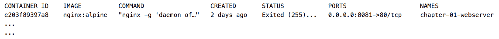列出的 Docker 容器

但是，如果您之前在您的机器上使用过 Docker，前面的命令将列出您机器上的所有 Docker 容器。在这种情况下，请注意*步骤 2*，因为该命令将停止并删除您机器上的所有容器。

因此，如果您想保留以前的容器，我们建议您只停止并删除使用本书教程创建的容器，使用以下命令：

```php
docker stop <containerId> 
```

您也可以使用以下命令来代替*步骤 2*和*3*中执行的命令：

```php
docker rm <containerId> 
```

1.  输入以下命令以停止所有容器：

```php
docker stop $(docker ps -a -q)
```

1.  通过输入以下命令来删除所有容器：

```php
docker rm $(docker ps -a -q)
```

干得好！现在，我们可以创建我们需要运行应用程序的镜像。让我们测试我们在上一节中建立的设置。

1.  在`chapter-04`文件夹中，键入以下命令：

```php
docker-compose build
```

在终端窗口的末尾，我们将看到类似于以下的输出：

```php
---> 5f8ed0da2be9 Successfully built 5f8ed0da2be9 Successfully tagged chapter-04_php-fpm:latest mysql uses an image, skipping
```

前面的输出告诉我们，我们创建了一个名为`chapter-04_php-fpm:latest`的新 Docker 镜像，现在，让我们创建应用程序容器。

1.  在`chapter-04`文件夹中，在您的终端上，键入以下命令：

```php
docker-compose up -d
```

前面命令的输出将给我们所有三个我们之前设置的 Docker 容器的状态，类似于以下输出：

```php
---> 5f8ed0da2be9 Successfully built 5f8ed0da2be9 Successfully tagged chapter-04_php-fpm:latest mysql uses an image, skipping
```

1.  现在，我们可以使用以下命令检查新创建的容器：

```php
docker ps -a
```

终端上的输出将非常类似于以下消息：

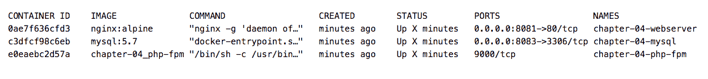Docker 容器正在运行

请注意，我们在`chapter-04`文件夹中还没有任何应用程序代码，因此，如果我们尝试使用`http://localhost:8081/`地址访问服务器，我们将看到一个文件未找到的消息。这是完全预期的，因为我们实际上还没有在我们的服务器上运行任何应用程序。

# 使用 PHP Composer 来创建 Laravel 应用程序的脚手架

我们已在我们的服务器上创建了一个坚实的基础。我们使用的 PHP 镜像已经具有 Laravel 运行应用程序所需的所有依赖项，包括 Composer。

因此，我们将使用`php-fpm`容器内的 Composer，而不是使用我们在机器上全局安装的 Composer。

这是避免版本冲突的最安全方式。让我们检查一下`php-fpm`容器内有什么：

1.  打开您的终端窗口，并键入以下命令：

```php
docker-compose exec php-fpm bash
```

1.  现在，我们在`php-fpm` bash/终端中，让我们使用以下命令检查 Composer 版本：

```php
composer --version
```

1.  我们将在终端上看到以下输出：

```php
Composer version 1.6.3
```

恭喜！我们已经能够配置我们的所有环境，并且准备开始构建我们的应用程序。

# 创建应用程序脚手架

为了保持本书应用程序与您将使用示例代码的时刻之间的一致性，我们将修复将在您的环境中安装的 Laravel 版本。

因此，让我们继续以下步骤：

1.  打开您的终端窗口，并键入以下命令：

```php
composer create-project laravel/laravel=5.6.12 project --prefer-dist
```

在撰写本书时，我们已安装了 Laravel 5.6.12 版本。尽管我们应该没有问题安装更新的版本，但我们强烈建议您保持在 5.6 版本。*。

使用前面的命令后，您将在终端窗口上看到以下消息：

```php
Generating optimized autoload files > Illuminate\Foundation\ComposerScripts::postAutoloadDump > @php artisan package:discover Discovered Package: fideloper/proxy Package: laravel/tinker Discovered Package: nunomaduro/collision Package manifest generated successfully. > @php artisan key:generate
```

这意味着一切都进行得很顺利。

请注意，我们在名为`project`的目录中创建了 Laravel 应用程序。这样，我们将拥有以下应用程序结构：

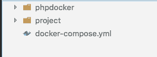应用程序文件夹结构

请注意，我们已将 Laravel 应用程序的内容与 Docker 配置文件夹分开。这种做法是非常推荐的，因为我们可以在项目文件夹内进行任何类型的更改，而不会意外损坏任何 Docker 或`docker-compose`文件。

但是，由于这个小改动，我们需要调整`docker-compose.yml`文件，以适应新创建的路径。

1.  打开`docker-compose.yml`，让我们调整`php-fpm`卷标的新路径，如以下代码块所示：

```php
php-fpm:
  build: phpdocker/php-fpm
  container_name: chapter-04-php-fpm
  working_dir: /application
  volumes:
    - ./project:/application
    - ./phpdocker/php-fpm/php-ini-
    overrides.ini:/etc/php/7.2/fpm/conf.d/99-overrides.ini
```

# 运行应用程序

为了使我们刚刚做出的更改生效，我们需要停止并重新启动我们的容器：

1.  在您的终端上，键入`exit`以退出`php-fpm` bash。

1.  现在，在`chapter-04`文件夹的根目录中，仍然在终端中，键入以下命令：

```php
docker-compose kill
```

您将看到以下输出消息：

```php
Stopping chapter-04-webserver ... done Stopping chapter-04-mysql ... done Stopping chapter-04-php-fpm ... done
```

1.  在您的终端上，键入以下命令以再次运行容器：

```php
docker-compose up -d
```

现在，我们可以看到`php-fpm`容器已被重新创建，并将反映我们的更改：

```php
Recreating chapter-04-php-fpm ... done Starting chapter-04-webserver ... done Starting chapter-04-webserver ... done
```

强烈建议您在对`nginx`或`php-fpm`服务器进行任何更改时重复此过程。

1.  现在，让我们检查 Laravel 的安装和配置。打开您的默认浏览器，转到链接`http://localhost:8081/`。

我们将在 Laravel 框架中看到欢迎屏幕，如下截图所示：

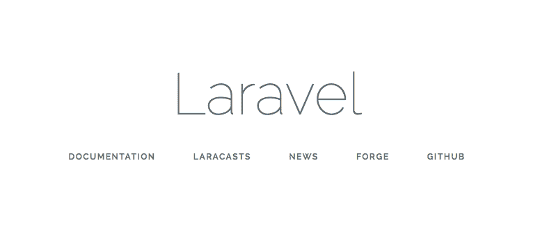Laravel 欢迎屏幕

# 设置 MySQL 数据库

到目前为止，我们已经走了很长的路，为我们的 RESTful 应用程序建立了坚实的基础，尽管我们还必须采取一些步骤才能最终开始开发。

在这一步中，我们将为我们的应用程序配置 MySQL 数据库，并对我们的 Docker MySQL 容器进行一些更改，以使我们的应用程序的数据在我们断开连接或停止 MySQL 容器时仍然存在于我们的数据库中。

# 添加一个存储文件夹

存储 MySQL 数据的本地文件夹非常重要，因为我们的`docker-compose.yml`文件中没有包含任何已配置用于存储数据库中创建的数据的卷。

请记住，我们正在使用 Docker，我们的 MySQL 容器是基于数据库镜像的。这样，每当我们完成容器进程时，我们的数据库就会被删除，下次启动时，我们的数据库将为空。

打开`docker-compose.yml`文件，并在 MySQL 配置块的应用程序卷之后添加`- ./storage-db:/var/lib/mysql`，如下面的代码所示：

```php
mysql:
    image: mysql:5.7
    container_name: chapter-04-mysql
    working_dir: /application
    volumes:
    - .:/application
    - ./storage-db:/var/lib/mysql
```

上面的代码将`storage-db`文件夹设置在我们的项目/机器上，以存储来自 MySQL 容器的所有 MySQL 数据。稍后在本节中，我们将看到这些更改的结果，但现在，让我们配置我们的数据库。

# 配置.env 文件

1.  打开`project`文件夹根目录下的`.env`文件，并用以下行替换数据库配置：

```php
DB_HOST=mysql
DB_PORT=3306
DB_DATABASE=chapter-04
DB_USERNAME=chapter-04
DB_PASSWORD=123456
```

让我们检查连接。

1.  在终端窗口中，输入以下命令：

```php
docker-compose exec php-fpm bash
```

1.  在`php-fpm` bash 中，输入以下命令：

```php
php artisan tinker
```

1.  最后，输入以下命令：

```php
DB::connection()->getPdo();
```

1.  您将看到类似以下输出：

```php
=> PDO {#760
inTransaction: false,
attributes: {
CASE: NATURAL,
ERRMODE: EXCEPTION,
AUTOCOMMIT: 1,
PERSISTENT: false,
DRIVER_NAME: "mysql",
SERVER_INFO: "Uptime: 2491 Threads: 1 Questions: 9 Slow queries: 0 Opens: 105 Flush tables: 1 Open tables: 98 Queriesper second avg: 0.003",
ORACLE_NULLS: NATURAL,
CLIENT_VERSION: "mysqlnd 5.0.12-dev - 20150407 - $Id: 38fea24f2847fa7519001be390c98ae0acafe387 $",
SERVER_VERSION: "5.7.21",
STATEMENT_CLASS: [
"PDOStatement",
],
EMULATE_PREPARES: 0,
CONNECTION_STATUS: "mysql via TCP/IP",
DEFAULT_FETCH_MODE: BOTH,
},
}
```

这意味着一切都进行得很顺利。恭喜！我们有了一个数据库。现在是时候生成我们的本地数据库文件夹`storage-db`了。

如果您仍然在`php-fpm` bash 中，请输入`exit`命令以退出并返回到终端。

1.  在您的终端窗口中，输入以下命令：

```php
docker-compose kill
```

1.  让我们删除之前创建的 MySQL 容器：

```php
docker-compose rm mysql
```

1.  现在，让我们重新创建容器，使其具有更新并运行的更改。输入以下命令：

```php
docker-compose up -d
```

您将在终端上看到以下输出：

```php
Creating chapter-04-mysql ... done Starting chapter-04-php-fpm ... done Starting chapter-04-webserver ... done
```

请注意，MySQL 容器已经创建，并且`storage-db`文件夹已经正确配置。我们的项目将具有以下结构：

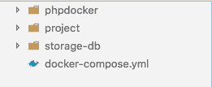项目文件夹结构

# 使用 MySQL 外部客户端

仅使用命令行管理数据库可能并不容易，从视觉上讲也不容易。为了帮助我们进行此过程，所有数据库都有一个用于此任务的工具，MySQL 也不例外。

有几种开源和多平台工具可以帮助我们进行此过程，MySQL 也有自己的工具称为**Workbench**。

您可以在官方 MySQL 文档的 Workbench 部分阅读更多信息[`www.mysql.com/products/workbench/`](https://www.mysql.com/products/workbench/)。

在本节中，我们将看到如何使用具有图形界面的工具来访问我们的 Docker 容器中的数据库。

1.  前往[`dev.mysql.com/downloads/workbench/`](https://dev.mysql.com/downloads/workbench/)，选择您的平台，并按照安装步骤进行安装。

1.  打开 Workbench，单击顶部的 Database 菜单，然后单击连接到数据库。

您将看到以下屏幕：

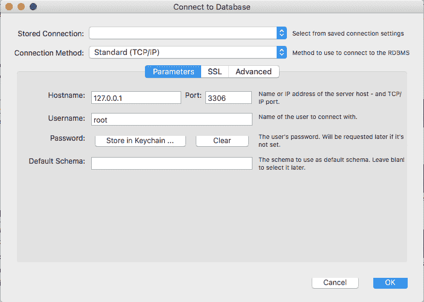Workbench 连接屏幕

1.  请记住，工作台正在主机机器上运行，而不是在 MySQL Docker 容器内部运行。向其中添加以下信息：

主机名：`127.0.0.1` 端口：`8083` 用户名：`chapter-04` 密码：`123456`

请注意，我们正在使用与 Laravel`.env`文件中相同的配置。

1.  点击“确定”按钮。现在，我们连接到在 Docker 容器内运行的 MySQL 数据库。您将看到类似于以下屏幕截图的内容：

工作台欢迎界面

注意左侧模式面板。我们已经通过 Docker 容器创建了我们的数据库，并且准备好使用它。此时，它仍然是空的，如下面的屏幕截图所示：

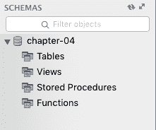模式左侧面板

# 迁移和数据库种子

现在，让我们练习一些我们在第一章中简要看到的命令，并以不同的方式创建我们的迁移和种子。

1.  在`chapter-04`文件夹上打开您的终端窗口并键入以下命令：

```php
docker-compose exec php-fpm bash
```

1.  在容器根 bash 内，键入以下命令：

```php
php artisan make:model Bike -m
```

请注意，我们使用了`-m`标志来创建迁移文件以及创建 Bike 模型。所以现在，我们的应用程序中有两个新文件：

+   `project/app/Bike.php`

+   `project/database/migrations/XXXX_XX_XX_XXXXXX_create_bikes_table.php`

# 创建迁移样板

正如我们之前所看到的，新文件只有 Laravel 引擎创建的样板代码。让我们向**Bike**模型和迁移文件添加一些内容。

1.  打开`project/app/Bike.php`并在 Bike 模型函数内添加以下代码：

```php
protected $fillable = [
    'make',
    'model',
    'year',
    'mods',
    'picture'
];
```

1.  现在，我们需要向之前创建的迁移文件添加相同的属性。打开`project/database/migrations/XXXX_XX_XX_XXXXXX_create_bikes_table.php`并在`up()`函数内添加以下代码：

```php
Schema::create('bikes', function (Blueprint $table) {
$table->increments('id');
$table->string('make');
$table->string('model');
$table->string('year');
$table->text('mods');
$table->string('picture');
$table->timestamps();
});
```

恭喜！您已经创建了我们的第一个迁移文件，现在是时候执行以下命令来填充我们的数据库了。

1.  打开您的终端窗口并键入以下命令：

```php
php artisan migrate
```

上一个命令的输出将类似于以下内容：

```php
Migration table created successfully. Migrating: XXXX_XX_XX_XXXXXX_create_users_table Migrated: XXXX_XX_XX_XXXXXX_create_users_table Migrating: XXXX_XX_XX_XXXXXX_create_password_resets_table Migrated: XXXX_XX_XX_XXXXXX_create_password_resets_table Migrating: XXXX_XX_XX_XXXXXX_create_bikes_table Migrated: XXXX_XX_XX_XXXXXX_create_bikes_table
```

现在，在工作台模式下，我们可以看到我们的新表格由`migrate`命令填充，如下面的屏幕截图所示：

工作台模式面板

# 创建我们的第一个数据库种子

在前面的步骤中，我们基本上遵循了与第一章相同的程序，*理解 Laravel 5 的核心概念*，所以现在我们不会使用 Faker 库来创建我们的数据。Faker 是一个非常有用的工具，因为它在使用 Laravel 开发应用程序期间易于使用且快速创建数据。

在这个例子中，我们希望保持我们创建的数据与我们正在创建的应用程序更一致，因此我们将使用一个外部 JSON 文件，其中包含我们要插入到数据库中的数据。

1.  在`project/database`文件夹内，创建一个名为`data-sample`的新文件夹。

1.  在`project/database/data-sample`文件夹内，创建一个名为`bikes.json`的新文件并添加以下代码：

```php
[{
  "id": 1,
  "make": "Harley Davidson",
  "model": "XL1200 Nightster",
  "year": "2009",
  "mods": "Nobis vero sint non eius. Laboriosam sed odit hic quia
    doloribus. Numquam laboriosam numquam quas quis.",
  "picture": "https://placeimg.com/640/480/nature
  }, {
  "id": 2,
  "make": "Harley Davidson",
  "model": "Blackline",
  "year": "2008",
  "mods": "Nobis vero sint non eius. Laboriosam sed odit hic quia
   doloribus. Numquam laboriosam numquam quas quis.",
  "picture": "https://placeimg.com/640/480/nature"
 }, {
  "id": 3,
  "make": "Harley Davidson",
  "model": "Dyna Switchback",
  "year": "2009",
  "mods": "Nobis vero sint non eius. Laboriosam sed odit hic quia
   doloribus. Numquam laboriosam numquam quas quis.",
  "picture": "https://placeimg.com/640/480/nature"
 }, {
  "id": 4,
  "make": "Harley Davidson",
  "model": "Dyna Super Glide",
  "year": "2009",
  "mods": "Nobis vero sint non eius. Laboriosam sed odit hic quia
  doloribus. Numquam laboriosam numquam quas quis.",
  "picture": "https://placeimg.com/640/480/nature"
 },{
  "id": 5,
  "make": "Harley Davidson",
  "model": "Dyna Wild Glide",
  "year": "2005",
  "mods": "Nobis vero sint non eius. Laboriosam sed odit hic quia
   doloribus. Numquam laboriosam numquam quas quis.",
  "picture": "https://placeimg.com/640/480/nature"
}]
```

请注意，我们保留了一些占位文本和图像路径。现在不要担心这个问题；在本书的后面，我们将使用我们的前端应用程序替换所有这些数据。

1.  现在，是时候创建我们的种子文件了。在您的终端窗口中，键入以下命令：

```php
php artisan make:seeder BikesTableSeeder
```

上一个命令在`project/database/seeds`文件夹内添加了一个名为`BikesTableSeeder.php`的新文件。

1.  打开`project/database/seeds/BikesTableSeeder.php`并用以下代码替换其中的代码：

```php
use Illuminate\Database\Seeder;
use App\Bike;
class BikesTableSeeder extends Seeder
    {
    /**
    * Run the database seeds.
    *
    * @return void
    */
    public function run()
    {
        DB::table('bikes')->delete();
        $json = File::get("database/data-sample/bikes.json");
        $data = json_decode($json);
        foreach ($data as $obj) {
        Bike::create(array(
            'id' => $obj->id,
            'make' => $obj->make,
            'model' => $obj->model,
            'year' => $obj->year,
            'mods' => $obj->mods,
            'picture'=> $obj->picture
        ));
        }
    }
}
```

请注意，在第一行中，我们使用了 Eloquent ORM 快捷方式函数（`DB::table()`）来删除自行车表，并使用`Bike::create()`函数来创建我们的记录。在下一章中，我们将更深入地了解 Eloquent ORM，但现在让我们专注于创建我们的第一个种子。

1.  打开`project/database/seeds/DatabaseSeeder.php`并在`UsersTableSeeder`注释之后添加以下代码行：

```php
$this->call(BikesTableSeeder::class);
```

现在，是时候运行我们的 seed 并填充数据库了。我们可以以两种方式进行。我们可以单独运行`BikeSeeder`命令`php artisan db:seed --class=BikesTableSeeder`，也可以使用`php artisan db:seed`命令，这将运行我们应用程序中的所有 seed。

由于我们现在处于开发的开始阶段，我们将执行命令以加载所有 seed。 

1.  打开您的终端窗口并键入以下命令：

```php
php artisan db:seed
```

在上一个命令的末尾，我们将在终端上看到一个成功的消息，`Seeding: BikesTableSeeder`。太棒了！现在，我们在`chapter-04`数据库上有了我们的第一条记录。

# 探索 Workbench 表视图

现在，我们将使用 Workbench 的可视界面来查看我们刚刚放入数据库中的数据。为此，请打开 Workbench 并执行以下步骤：

1.  在右侧模式面板上，单击“Tables”菜单项。

1.  右键单击 bikes 并单击选择行 - 限制 1000。

我们将在右侧看到一个新面板，如下截图所示：

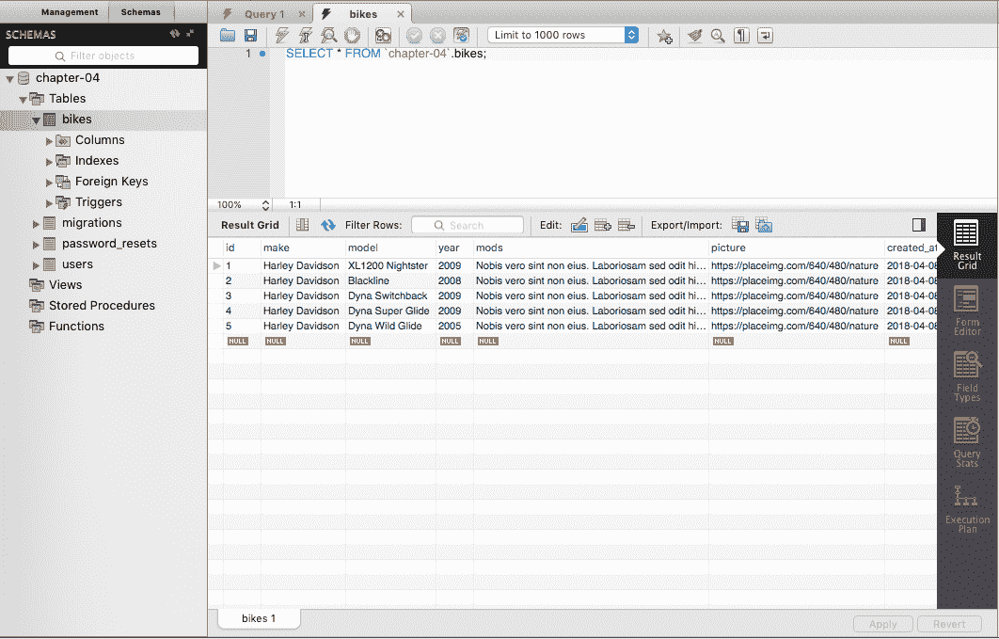Workbench 界面上的 Bike 表

请注意，我们现在在 bike 表中的数据库中有五条记录，这是我们在`bike.json`文件中创建的相同数据。

# 使用 Swagger 框架进行 API 文档编制

让我们休息一下，解决 RESTful 应用程序开发中一个非常重要的主题：如何使用 API 端点的文档。

尽管我们还没有创建任何控制器或路由来在浏览器中查看我们的 API 数据，但我们将介绍一个新工具，它将帮助我们开发我们的前端应用程序，称为 Swagger 框架。

Swagger 是一个开源的语言无关框架，用于描述、记录、消费和可视化 REST API。

如今，使用公共和私有 API 来创建前端 Web 应用程序非常常见，我们熟悉多个 API，如 Twitter、LinkedIn 等。

文档化您的应用程序是开发过程中的重要部分。每个 API 都需要进行文档编制，以便更容易地由内部团队或第三方开发人员使用和测试。

这样做的最简单方法是在开发过程的开始阶段。

您可以在官方网站上阅读有关 Swagger 框架的更多信息：[`swagger.io/`](https://swagger.io/)。

# 安装 L5-Swagger 库

在本节中，我们将使用 L5-Swagger 项目。将使用 Swagger-PHP 和 Swagger-UI 的包装器与 Laravel 5 框架一起使用：

1.  仍然在您的终端窗口上，键入以下命令：

```php
composer require "darkaonline/l5-swagger"
```

您可以在官方 GitHub 存储库上阅读有关 L5-Swagger 的更多信息：[`github.com/DarkaOnLine/L5-Swagger`](https://github.com/DarkaOnLine/L5-Swagger)。

在命令行的末尾，我们将看到以下输出：

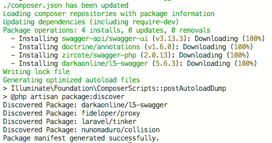Composer L5-Swagger 安装过程

1.  打开`project/config/app.php`文件，并在`ServiceProvider`注释的末尾添加以下代码：

```php
\L5Swagger\L5SwaggerServiceProvider::class
```

1.  键入以下命令以发布该软件包：

```php
php artisan vendor:publish --provider "L5Swagger\L5SwaggerServiceProvider"
```

上一个命令的输出将在我们的应用程序上创建一些新文件，如下截图所示：

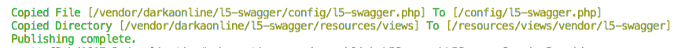L5-Swagger UI

# 创建应用程序 API 控制器

作为良好的实践方式，我们将在我们的应用程序中创建一个新的控制器，用作 API 文档的基础，并使用 Swagger 注释保存一些基本的 API 信息。

1.  在您的终端窗口上，键入以下命令以创建一个新的控制器：

```php
php artisan make:controller ApiController
```

1.  打开`project/app/Http/Controllers/ApiController.php`并用以下注释替换`Class ApiController comments`：

```php
* Class ApiController
*
* @package App\Http\Controllers
*
* @SWG\Swagger(
* basePath="",
* host="localhost:8081",
* schemes={"http"},
* @SWG\Info(
* version="1.0",
* title="Custom Bikes",
* @SWG\Contact(name="Developer Contact", url="https://www.example.com"),
* )
* )
*/
```

# 生成和发布 API 文档

现在，是时候发布我们的文档并通过 Web 浏览器访问它了。因此，让我们按照以下步骤来做。

仍然在您的终端窗口上，输入以下命令：

```php
php artisan l5-swagger:generate
```

干得好！现在，我们的 API 文档已经准备好实施了。

转到`http://localhost:8081/api/documentation`，您将看到类似以下截图的结果：

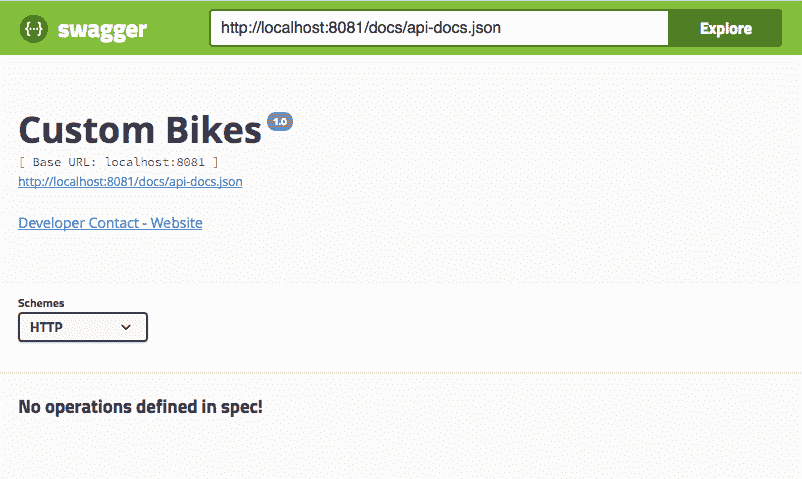Swagger UI

Swagger 框架已经在我们的本地机器上运行起来了。

# 添加 Swagger 定义

Swagger 为使用 API 的我们的注释生成文档，这是框架本身的一种自我编写，通过标签，我们可以定义每个元素的作用。让我们开始构建我们的 API 文档。

第一步是为我们在之前创建的`Bike`模型添加一些定义。

1.  打开`project/app/Bike.php`模型文件，并用以下代码替换原有代码：

```php
<?php
namespace App;
use Illuminate\Database\Eloquent\Model;
    /**
    * @SWG\Definition(
    * definition="Bike",
    * required={"make", "model", "year", "mods"},
    * @SWG\Property(
    * property="make",
    * type="string",
    * description="Company name",
    * example="Harley Davidson, Honda, Yamaha"
    * ),
    * @SWG\Property(
    * property="model",
    * type="string",
    * description="Motorcycle model",
    * example="Xl1200, Shadow ACE, V-Star"
    * ),
    * @SWG\Property(
    * property="year",
    * type="string",
    * description="Fabrication year",
    * example="2009, 2008, 2007"
    * ),
    * @SWG\Property(
    * property="mods",
    * type="string",
    * description="Motorcycle description of modifications",
    * example="New exhaust system"
    * ),
    * @SWG\Property(
    * property="picture",
    * type="string",
    * description="Bike image URL",
    * example="http://www.sample.com/my.bike.jpg"
    * )
    * )
    */
class Bike extends Model
{
        /**
        * The attributes that are mass assignable.
        *
        * @var array
        */
        protected $fillable = [
            'make',
            'model',
            'year',
            'mods',
            'picture'
        ];
}
```

前面的注释非常简单明了；我们只是描述了每个模型字段，并使用有用的示例设置了数据类型。

1.  返回到您的终端窗口，并输入以下命令来生成文档：

```php
php artisan l5-swagger:generate
```

1.  现在，让我们检查我们的文档 URL 并看看发生了什么。转到`http://localhost:8081/api/documentation`，我们将看到我们的第一个模型已经被记录下来，如下面的截图所示：

Swagger UI

请注意，我们已经在一个对象内解释了所有的模型属性，每个属性都有数据类型、描述和示例。这是由于`Swagger @SWG\Property`的定义：

```php
* @SWG\Property( * property="make", * type="string", * description="Company name", * example="Harley Davidson, Honda, Yamaha"
```

随着我们的应用程序的增长，我们将添加所有需要使用我们的 API 的文档。

您可以在以下链接找到有关 Swagger 可视化界面的更多信息：[`swagger.io/swagger-ui/`](https://swagger.io/swagger-ui/)。

# 总结

我们已经来到了另一个章节的结束。我们在这里付出了很多努力，做了很多事情，比如配置 Docker 来维护我们将在 MySQL 数据库中创建的数据。我们还创建了一个大型应用程序并配置了数据库，并学会了如何使用 Workbench 查看应用程序加载的数据。

我们创建了我们的第一个模型及其迁移文件，并且还创建了一个种子来在我们的数据库中进行初始数据加载。最后，我们建立了一个坚实的基础来扩展我们的 RESTful API。

在下一章中，我们将更深入地讨论如何使用 Eloquent ORM 创建控制器、路由和表之间的关系，以及其他内容。
