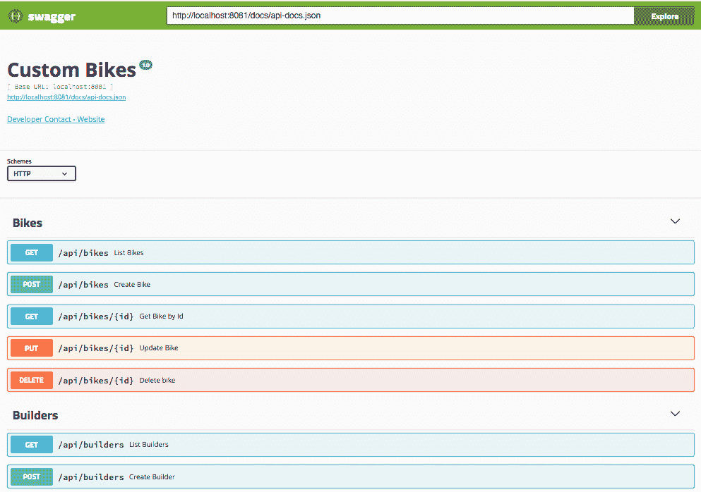
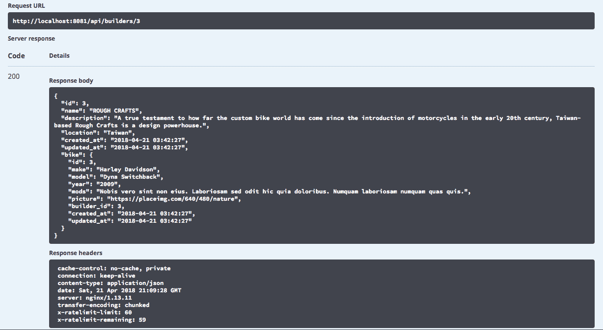
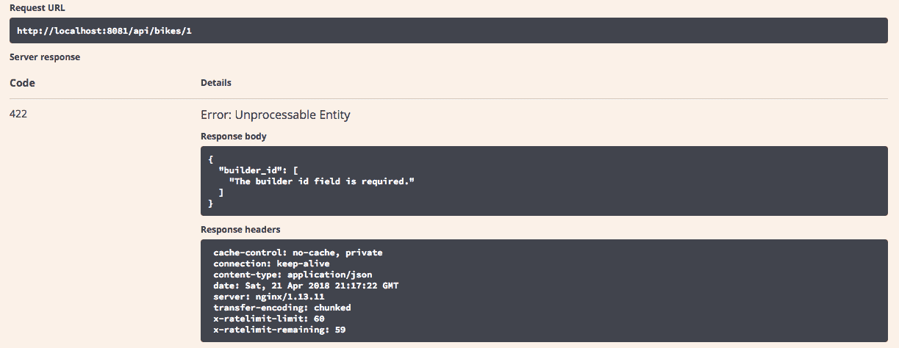

# 使用 Laravel 构建 RESTful API - 第 2 部分

在本章中，我们将继续构建我们的 API。在 Laravel 中，我们还有很长的路要走。

我们将学习如何使用一些在每个 Web 应用程序中非常常见的功能，例如身份验证和 API 错误的自定义。

请记住，我们正在创建一个 RESTful API，与传统的应用程序（如 MVC）不同，我们的错误模型非常多样化，并且始终在使用 JSON 格式时返回。

在本章中，您将学习如何通过以下方式构建一个坚实的 RESTful API：

+   处理请求验证和错误消息

+   使用基于令牌的身份验证

+   处理 Laravel 资源

# 处理请求验证和错误消息

Laravel 框架为我们提供了许多显示错误消息的方法，默认情况下，Laravel 的**基础控制器类**使用`ValidatesRequests`特性，提供了验证传入 HTTP 请求的方法，包括许多默认规则，如必填、电子邮件格式、日期格式、字符串等等。

您可以在[`laravel.com/docs/5.6/validation#available-validation-rules`](https://laravel.com/docs/5.6/validation#available-validation-rules)了解更多有关可能的验证规则的信息。

使用请求验证非常简单，如下面的代码块所示：

```php
$validatedData = $request->validate([
'field name' => 'validation rule, can be more than one',
'field name' => 'validation rule',
'field name' => 'validation rule',
...
]);
```

例如，让我们看看如何使用 HTTP `POST`方法验证对`localhost:8081/api/bikes`的`bikes`端点的传入请求。

验证代码如下所示：

```php
$validatedData = $request->validate([
'make' => 'required',
'model' => 'required',
'year'=> 'required',
'mods'=> 'required'
]);
```

之前的操作失败是因为我们故意没有在我们的虚构请求中发送所需的文件。然而，返回消息中有一些有趣的东西：

+   HTTP 状态码：`422`

+   以下 JSON 响应错误消息：

```php
{
    "message": "The given data was invalid.",
    "errors": {
    "": [
    "The field is required."
    ]}
}
```

相当简单，对吧？Laravel 在幕后执行所有验证，并给我们提供了详细的错误消息。

但是，如果我们想控制所有的消息字段怎么办？答案是，我们可以使用`validator`门面和验证器实例进行手动验证。这是我们接下来要看的内容。

# HTTP 状态码

在我们进一步实现验证之前，让我们暂停一下，回顾一些 HTTP 状态码。正如我们之前看到的，我们有一个名为**不可处理的实体**的 422 HTTP 状态码。

以下表格显示了最常见和有用的错误代码：

| 代码 | 名称 | 描述 |
| --- | --- | --- |
| 200 | 正常 | 一切都好！ |
| 201 | 已创建 | 资源创建成功。 |
| 202 | 已接受 | 请求已被接受进行进一步处理，稍后将完成。 |
| 204 | 正常 | 资源删除成功删除。 |
| 302 | 重定向 | 常见的重定向响应；您可以在位置响应标头中获取 URI 的表示。 |
| 304 | 未修改 | 没有新数据返回。 |
| 400 | 错误请求 | 客户端错误。 |
| 401 | 未经授权 | 您未登录，例如，您未使用有效的访问令牌。 |
| 403 | 禁止 | 您已经经过身份验证，但无权进行您正在尝试的操作。 |
| 404 | 未找到 | 您请求的资源不存在。 |
| 405 | 方法不允许 | 不允许该请求类型，例如，/bikes 是一个资源，POST /bikes 是一个有效操作，但 PUT /bikes 不是。 |
| 409 | 冲突 | 资源已经存在。 |
| 422 | 不可处理的实体 | 验证失败。请求和格式有效，但请求无法处理。例如，当发送的数据未通过验证测试时会发生这种情况。 |
| 500 | 服务器错误 | 服务器发生错误，而不是消费者的错误。 |

您可以在[`www.restapitutorial.com/httpstatuscodes.html`](http://www.restapitutorial.com/httpstatuscodes.html)了解更多有关状态码的信息。

# 实现控制器验证

好吧，我们已经学习了很多理论，现在是时候写一些代码了。让我们在 API 控制器上实现`Validator`：

1.  打开`project/app/Http/Controllers/API/BikeController.php`，并在`use App\Bike`语句之后添加以下代码：

```php
use Validator;
```

1.  现在，在`store(Request $request)`方法中添加以下代码：

```php
$validator = Validator::make($request->all(), [
    'make' => 'required',
    'model' => 'required',
    'year'=> 'required',
    'mods'=> 'required',
    'builder_id' => 'required'
]);
if ($validator->fails()) {
    return response()->json($validator->errors(), 422);
}
```

请注意，在上面的代码中，我们使用响应 JSON 格式，并将错误和状态代码设置为`json()`方法的参数。

1.  我们将使用相同的代码块从*步骤 2*中为`update(Request request,request,id)`方法做同样的操作。

1.  打开`project/app/Http/Controllers/API/BuilderController.php`，并在`use App\Builder`语句之后添加以下代码：

```php
use Validator;
```

1.  现在，在`store(Request $request)`方法中添加以下代码：

```php
$validator = Validator::make($request->all(), 
    ['name' => 'required',
    'description' => 'required',
    'location'=> 'required'
]);
if ($validator->fails()) {
    return response()->json($validator->errors(), 422);
}
```

1.  我们将使用相同的代码块从*步骤 5*中为`update(Request request,request,id)`方法做同样的操作。

1.  打开`project/app/Http/Controllers/API/ItemController.php`，并在`use App\Item`语句之后添加以下代码：

```php
use Validator;
```

1.  现在，在`store(Request $request)`方法中添加以下代码：

```php
$validator = Validator::make($request->all(), [
    'type' => 'required',
```

```php

    'name' => 'required',
    'company'=> 'required',
    'bike_id'=> 'required'
]);
if ($validator->fails()) {
    return response()->json($validator->errors(), 422);
}
```

1.  我们将使用相同的代码块从*步骤 7*中为`update(Request request,request,id)`方法做同样的操作。

所有验证样板代码都放在了`store()`和`update()`方法中，所以现在是时候编写一些错误处理程序了。

# 添加自定义错误处理

默认情况下，Laravel 具有非常强大的错误处理引擎，但它完全专注于 MVC 开发模式，正如我们之前提到的。在接下来的几行中，我们将看到如何改变这种默认行为，并为我们的 API 添加一些特定的错误处理：

1.  打开`project/app/Exceptions/Handler.php`，并在`render($request, Exception, $exception)`函数中添加以下代码：

```php
// This will replace our 404 response from the MVC to a JSON response.
if ($exception instanceof ModelNotFoundException
    && $request->wantsJson() // Enable header Accept:
     application/json to see the proper error msg
) {
    return response()->json(['error' => 'Resource not found'], 404);
}
if ($exception instanceof MethodNotAllowedHttpException) {
    return response()->json(['error' => 'Method Not Allowed'], 405);
}
if ($exception instanceof UnauthorizedHttpException) {
    return response()->json(['error' => 'Token not provided'], 401);
}
// JWT Auth related errors
if ($exception instanceof JWTException) {
    return response()->json(['error' => $exception], 500);
}
if ($exception instanceof TokenExpiredException) {
    return response()->json(['error' => 'token_expired'], 
    $exception->getStatusCode());
} else if ($exception instanceof TokenInvalidException) {
    return response()->json(['error' => 'token_invalid'],
     $exception->getStatusCode());
}
return parent::render($request, $exception);
```

在上面的代码中，除了映射我们的 API 的主要错误之外，我们还需要为涉及 JWT 身份验证的操作添加一些自定义错误。别担心，在下一节中，我们将看到如何使用 JWT 来保护我们 API 的一些路由。

1.  现在，让我们在文件顶部添加以下代码，放在`ExceptionHandler`导入之后：

```php
use Illuminate\Database\Eloquent\ModelNotFoundException as ModelNotFoundException;
use Symfony\Component\HttpKernel\Exception\UnauthorizedHttpException as UnauthorizedHttpException;
use Tymon\JWTAuth\Exceptions\JWTException as JWTException;
use Tymon\JWTAuth\Exceptions\TokenExpiredException as TokenExpiredException;
use Tymon\JWTAuth\Exceptions\TokenInvalidException as TokenInvalidException;
```

现在，我们将能够看到正确的消息，而不是来自 Laravel 的默认错误页面。

请注意，我们保留了默认的 Laravel 错误页面，并添加了自定义处理。非常重要的是，我们发送`header: accept: application / json`。这样，Laravel 就可以确定应该以 JSON 格式发送响应，而不是发送标准的错误页面。

1.  让我们进行简短的测试，看看当我们尝试访问受保护的 URL 时会发生什么。打开终端窗口，输入以下代码：

```php
curl -X GET "http://localhost:8081/api/bikes/3" -H "accept: application/json" -H "X-CSRF-TOKEN: "
```

结果将是一个 JSON，内容如下：

```php
{"message":"Unauthenticated."}
```

1.  现在，让我们尝试另一个错误，看看当我们尝试发送 POST 方法时会发生什么。在终端中输入以下代码：

```php
curl -X POST "http://localhost:8081/api/bikes/3" -H "accept: application/json" -H "X-CSRF-TOKEN: "
```

结果将是一个 JSON，内容如下：

```php
{"error":"Method Not Allowed"}
```

# 使用 Swagger UI 检查 API URL

在所有这些样板代码之后，现在是测试 API 并看到我们在本章中所做的所有工作生效的时候了：

1.  打开终端，输入以下命令：

```php
php artisan l5-swagger:generate
```

不要忘记使用以下命令进入`php-fpm`容器的 bash：`docker-compose exec php-fpm bash`。

1.  打开默认浏览器，转到`http://localhost:8081/api/documentation`。

我们将看到所有 API 都被正确记录的以下结果：

Swagger UI

让我们检查一些操作。

# 获取所有记录

让我们看看如何使用 Swagger UI 上的`GET`方法从我们的 API 中检索自行车列表：

1.  点击**GET /api/bikes**以打开面板。

1.  点击**试一下**按钮。

1.  点击**执行**按钮。

我们将看到类似以下截图的内容：

GET 请求

# 按 ID 获取记录

让我们看看如何从我们的 API 中获取自行车列表：

1.  点击**GET /api/bikes/{id}**以打开面板。

1.  点击**试一下**按钮。

1.  在 ID 输入框中输入`3`。

1.  点击**执行**按钮。

将看到类似以下截图的内容：

按 ID 请求获取

# 检查 API 响应错误

现在，是时候检查一些错误消息了：

1.  单击**PUT /api/bikes/{id}**打开面板。

1.  单击**尝试**按钮。

1.  在 ID 输入框中输入`1`。

1.  用以下代码替换`示例值`占位符：

```php
{
 "make": "Yamaha",
 "model": "V-Star",
 "year": "2001",
 "mods": "New exhaust system and Grips",
 "picture": "http://www.sample.com/my.bike.jpg"
 }
```

1.  单击`执行`按钮。

我们将看到类似以下截图的内容：

更新失败，带有错误消息

正如我们所观察到的，一切都如预期的那样发生了。

# 基于令牌的身份验证

让我们更深入地了解使用 Laravel 进行 API 身份验证。尽管 Laravel 是一个 MVC 框架，但我们可以使用基于令牌的身份验证功能。即使 Laravel 本身也有一个名为 Passport 的库。

Laravel Passport 是一个与 OAuth2 标准配合使用的库。这种模式确定了通过令牌对 Web 应用程序（API）执行应用程序身份验证的方法，而 JWT 侧重于通过令牌对用户进行身份验证。

Laravel Passport 比简单的 JWT 更大的抽象层，它主要设计为完全成熟且易于设置和使用作为 OAuth2 服务器。

这种情况的替代方案是使用诸如`tymon/jwt-auth`之类的库。

实际上，Laravel Passport 使用 JWT 进行身份验证，但这只是一个实现细节。`tymon/jwt-auth`更接近于简单的基于令牌的身份验证，尽管它仍然非常强大和有用。

对于我们正在构建的 API 类型，JWT 是我们实现的理想方法。

您可以在[`github.com/tymondesigns/jwt-auth`](https://github.com/tymondesigns/jwt-auth)上阅读有关`jwt-auth`的更多信息。

# 安装 tymon-jwt-auth

让我们学习如何安装和配置`tymon/jwt-auth`。

安装过程非常简单，但是由于`tymon/jwt-auth`库在不断发展，我们应该注意我们将使用的版本：

1.  打开`project/composer.json`文件，并在`Laravel/Tinker`之后添加以下行代码：

```php
"tymon/jwt-auth": "1.0.*"
```

1.  现在，是时候发布供应商包了。仍然在您的终端窗口和 Tinker 控制台中，输入以下命令：

```php
php artisan vendor:publish --provider="Tymon\JWTAuth\Providers\LaravelServiceProvider"
```

请注意，我们正在使用 Laravel 5.6 和`jwt-auth` 1.0，因此我们不需要执行任何额外的操作来加载 JWT 提供程序。`jwt-auth`文档有时看起来很混乱，非常令人困惑，但不要担心，只需按照我们的步骤进行操作，您就不会受到不匹配的文档的影响。

1.  让我们生成密钥。仍然在终端窗口中，输入以下命令：

```php
 php artisan jwt:secret
```

1.  上一个命令将在您的`.env`文件中生成一个密钥，并且看起来类似以下行：

```php
JWT_SECRET=McR1It4Bw9G8jU1b4XJhDMeZs4Q5Zwear
```

到目前为止，我们已经成功安装了`jwt-auth`，但是我们需要采取一些额外的步骤来使我们的 API 安全。

# 更新用户模型

现在，我们需要更新`User`模型，以便我们可以开始使用用户身份验证来保护 API 端点。

首先，我们需要在我们的`User`模型上实现`Tymon\JWTAuth\Contracts\JWTSubject`合同，这需要两种方法：`getJWTIdentifier()`和`getJWTCustomClaims()`。

打开`project/User.php`并用以下代码替换其内容：

```php
 <?php
 namespace  App;
 use  Illuminate\Notifications\Notifiable;
 use  Illuminate\Foundation\Auth\User  as  Authenticatable;
 use  Tymon\JWTAuth\Contracts\JWTSubject;
 /**
 * @SWG\Definition(
 * definition="User",
 * required={"name", "email", "password"},
 * @SWG\Property(
 * property="name",
 * type="string",
 * description="User name",
 * example="John Conor"
 * ),
 * @SWG\Property(
 * property="email",
 * type="string",
 * description="Email Address",
 * example="john.conor@terminator.com"
 * ),
 * @SWG\Property(
 * property="password",
 * type="string",
 * description="A very secure password",
 * example="123456"
 * ),
 * )
 */
 class  User  extends  Authenticatable  implements  JWTSubject
 {
     use  Notifiable;
     /**
     * The attributes that are mass assignable.
     *
     * @var array
     */
     protected  $fillable = [
         'name', 'email', 'password',
     ];
     /**
     * The attributes that should be hidden for arrays.
     *
     * @var array
     */
     protected  $hidden = [
         'password', 'remember_token',
     ];
     /**
     * Get JSON WEB TOKEN methods.
     *
     * @var array
     */
     public  function  getJWTIdentifier()
     {
         return  $this->getKey();
     } 
     public  function  getJWTCustomClaims()
     {
         return [];
     }  
     /**
     * Relationship.
     *
     * @var string
     */   
     public  function  bikes()
     {
         return  $this->hasMany(App\Bike);
     }
 }
```

# 设置身份验证守卫

现在，让我们对`config.auth.php`文件进行一些调整，以保护一些路由：

1.  打开`project/config/auth.php`并用以下代码替换 API 驱动程序：

```php
 'defaults' => [         'guard'  =>  'api',
        'passwords'  =>  'users',
 ],
 'guards'  => [
                'web'  => [
                        'driver'  =>  'session',
                        'provider'  =>  'users',
        ],        
 'api'  => [
                'driver'  =>  'jwt',
                'provider'  =>  'users',
        ],
 ],
```

1.  请注意，我们用`api`和`jwt`替换了默认的 Laravel 身份验证驱动程序。

# 创建 authController

对于我们的应用程序，我们将只使用一个控制器来包含我们的所有注册和登录操作，即注册，登录和注销。

在本书的后面，您将了解为什么我们在一个控制器中使用所有操作，而不是为每个操作创建一个控制器：

1.  打开您的终端窗口并输入以下命令：

```php
php artisan make:controller API/AuthController
```

1.  打开`project/app/Http/Controllers/API/AuthController.php`并用以下代码替换其内容：

```php
 <?php
 namespace  App\Http\Controllers\API;
 use  Illuminate\Http\Request;
 use  App\Http\Controllers\Controller;
 use  App\User;
 use  Validator;
 class  AuthController  extends  Controller
 {
     /**
     * Register a new user.
     *
     * @param \Illuminate\Http\Request $request
     * @return \Illuminate\Http\Response
     *
     * @SWG\Post(
     * path="/api/register",
     * tags={"Users"},
     * summary="Create new User",
     * @SWG\Parameter(
     * name="body",
     * in="body",
     * required=true,
     * @SWG\Schema(ref="#/definitions/User"),
     * description="Json format",
     * ),
     * @SWG\Response(
     * response=201,
     * description="Success: A Newly Created User",
     * @SWG\Schema(ref="#/definitions/User")
     * ),
     * @SWG\Response(
     * response=200,
     * description="Success: operation Successfully"
     * ),
     * @SWG\Response(
     * response=401,
     * description="Refused: Unauthenticated"
     * ),
    * @SWG\Response(
    * response="422",
    * description="Missing mandatory field"
    * ),
    * @SWG\Response(
    * response="404",
    * description="Not Found"
    * )
    * ),
    */
    public  function  register(Request  $request)
    {
        $validator = Validator::make($request->all(), [
            'email' => 'required|string|email|max:255|unique:users',
            'name' => 'required',
            'password'=> 'required'
        ]);
        if ($validator->fails()) {
            return  response()->json($validator->errors(), 422);
            }
        $user = User::create([
        'name' => $request->name,
        'email' => $request->email,
        'password' => bcrypt($request->password),
        ]);
        $token = auth()->login($user);
        return  response()->json([
            'access_token' => $token,
            'token_type' => 'bearer',
            'expires_in' => auth()->factory()->getTTL() * 60
            ], 201);
        }
    /**
    * Log in a user.
    *
    * @param \Illuminate\Http\Request $request
    * @return \Illuminate\Http\Response
    *
    * @SWG\Post(
    * path="/api/login",
    * tags={"Users"},
    * summary="loggin an user",
    * @SWG\Parameter(
    * name="body",
    * in="body",
    * required=true,
    * @SWG\Schema(ref="#/definitions/User"),
    * description="Json format",
    * ),
    * @SWG\Response(
    * response=200,
    * description="Success: operation Successfully"
    * ),
    * @SWG\Response(
    * response=401,
    * description="Refused: Unauthenticated"
    * ),
    * @SWG\Response(
    * response="422",
    * description="Missing mandatory field"
    * ),
    * @SWG\Response(
    * response="404",
    * description="Not Found"
    * )
    * ),
    */
    public  function  login(Request  $request)
    {
        $validator = Validator::make($request->all(), [
            'email' => 'required|string|email|max:255',
            'password'=> 'required'
        ]);
        if ($validator->fails()) {
            return  response()->json($validator->errors(), 422);
            }
        $credentials = $request->only(['email', 'password']);
        if (!$token = auth()->attempt($credentials)) {
            return  response()->json(['error' => 'Invalid
             Credentials'], 400);
        }
        $current_user = $request->email;
            return  response()->json([
            'access_token' => $token,
            'token_type' => 'bearer',
            'current_user' => $current_user,
            'expires_in' => auth()->factory()->getTTL() * 60
            ], 200);
            }
    /**
    * Register a new user.
    *
    * @param \Illuminate\Http\Request $request
    * @return \Illuminate\Http\Response
    *
    * @SWG\Post(
    * path="/api/logout",
    * tags={"Users"},
    * summary="logout an user",
    * @SWG\Parameter(
    * name="body",
    * in="body",
    * required=true,
    * @SWG\Schema(ref="#/definitions/User"),
    * description="Json format",
    * ),
    * @SWG\Response(
    * response=200,
    * description="Success: operation Successfully"
    * ),
    * @SWG\Response(
    * response=401,
    * description="Refused: Unauthenticated"
    * ),
    * @SWG\Response(
    * response="422",
    * description="Missing mandatory field"
    * ),
    * @SWG\Response(
    * response="404",
    * description="Not Found"
    * ),
    * @SWG\Response(
    * response="405",
    * description="Invalid input"
    * ),
    * security={
    * { "api_key":{} }
    * }
    * ),
    */
    public  function  logout(Request  $request){
        auth()->logout(true); // Force token to blacklist
        return  response()->json(['success' => 'Logged out
         Successfully.'], 200); }
}
```

在前面的代码中几乎没有什么新的内容——我们只是在`register`、`login`和`logout`函数中返回了 JSON 响应，正如我们在前面的行中所看到的。

1.  在`register()`函数中：

```php
 $token = auth()->login($user);
        return  response()->json([
                'access_token' => $token,
                'token_type' => 'bearer',
                'expires_in' => auth()->factory()->getTTL() * 60
 ], 201);
```

创建`user`后，我们返回了`201`的 HTTP 状态代码，带有`access_token`和到期日期。

1.  在`login()`函数中：

```php
 $current_user = $request->email;
        return  response()->json([
                'access_token' => $token,
                'token_type' => 'bearer',
                'current_user' => $current_user,
                'expires_in' => auth()->factory()->getTTL() * 60
 ], 200);
```

在`login()`函数中，我们根据用户的电子邮件地址返回了当前用户，一个`access_token`和到期日期。

1.  在`logout()`函数中：

```php
auth()->logout(true); // Force token to blacklist
    return  response()->json(['success' => 'Logged out
     Successfully.'], 200);
```

请注意，`logout()`函数中的`true`参数告诉`jwt-auth`永久使令牌无效。

# 创建用户路由

现在，是时候为注册、登录和注销操作创建新路由，并在我们的 API 中保护一些路由，就像本章开头讨论的那样。我们的用户可以与应用程序的部分内容进行交互，但是要访问其所有内容，必须创建用户并登录到应用程序。

打开`project/routes/api.php`并用以下代码替换其内容：

```php
 <?php
 use  Illuminate\Http\Request;
 use  App\Bike;
 use  App\Http\Resources\BikesResource;

 /*
 |--------------------------------------------------------------------------
 | API Routes
 |--------------------------------------------------------------------------
 |
 | Here is where you can register API routes for your application. These
 | routes are loaded by the RouteServiceProvider within a group whic
 | is assigned the "api" middleware group. Enjoy building your API!
 |
 */

 // Register Routes
 Route::post('register', 'API\AuthController@register');
 Route::post('login', 'API\AuthController@login');
 Route::post('logout', 'API\AuthController@logout');

 Route::apiResources([

     'bikes' => 'API\BikeController',

     'builders' => 'API\BuilderController',

     'items' => 'API\ItemController',

     'bikes/{bike}/ratings' => 'API\RatingController'

 ]);

Route::middleware('jwt.auth')->get('me', function(Request $request){
    return auth()->user();
});
```

最后一步是保护端点；我们在`project/routes/api.php`文件中或直接在控制器函数中执行此操作。我们将在控制器函数中执行此操作。

# 保护 API 路由

使用应用程序控制器保护我们的路由非常简单。我们只需要编辑`Controller`文件并添加以下代码。

打开`project/Http/Controllers/API/BikeController.php`并在`GET`方法之前添加以下代码：

```php
 /**
 * Protect update and delete methods, only for authenticated users.
 *
 * @return Unauthorized
 */
 public  function  __construct()
 {
        $this->middleware('auth:api')->except(['index']);
 }
```

前面的代码意味着我们正在使用`auth:api`中间件来保护所有骑手路由，除了`index()`方法。因此，我们的用户可以查看自行车列表，但是要查看自行车的详细信息并发布自行车，他们必须登录。稍后，在第九章，*创建服务和用户身份验证*，在 Angular 中，我们将详细讨论基于令牌的身份验证。

# 创建和登录用户

现在，是时候检查用户路由了。由于我们没有用户界面，我们将使用一个名为 Restlet Client 的 Chrome 扩展。它是免费且非常强大。

您可以在[`restlet.com/modules/client`](https://restlet.com/modules/client)了解更多信息并下载它：

1.  打开 Restlet 扩展并填写以下字段，如下屏幕截图所示：

注册端点

1.  结果将是以下响应：

创建响应

1.  现在，让我们使用新创建的用户登录。填写如下屏幕截图中显示的字段：

用户登录

结果将是以下响应：

用户登录响应

好了，我们的 API 身份验证已经准备就绪。稍后，在第九章，*创建服务和用户身份验证*，在 Angular 中，我们将详细讨论身份验证过程。

# 处理 Laravel 资源

在以前的一些 Laravel 版本中，可以使用一个名为 Fractal 的功能来处理 JSON web API，但是在这个新版本的 Laravel 中，我们有**资源**功能，这是一个处理 JSON web API 的非常强大的工具。

在这一部分，我们将看到如何使用资源功能，以便我们可以充分利用我们的 API。资源类是一种将数据从一种格式转换为另一种格式的方法。

在处理资源并将其转换为客户端响应时，我们基本上有两种类型：项目和集合。项目资源，正如你可能已经猜到的那样，基本上是我们模型的一对一表示，而集合是许多项目的表示。集合还可以具有元数据和其他导航信息，我们将在本节后面看到。

# 创建 BikesResource

因此，让我们创建我们的第一个资源：

1.  打开您的终端窗口，输入以下命令：

```php
php artisan make:resource BikesResource
```

上一个命令将生成以下文件：

`App\Http\Resource\BikesResource.php`。

1.  打开`App\Http\Resource\BikesResource.php`并添加以下代码：

```php
<?php
namespace App\Http\Resources;
use Illuminate\Http\Resources\Json\JsonResource;
use App\Builder;
class BikesResource extends JsonResource
{
    /**
    * Transform the resource into an array.
    *
    * @param \Illuminate\Http\Request $request
    * @return array
    */
    public function toArray($request)
    {
        return [
            'id' => $this->id,
            'make' => $this->make,
            'model' => $this->model,
            'year' => $this->year,
            'mods' => $this->mods,
            'picture' => $this->picture,
            'garages' => $this->garages,
            'items' => $this->items,
            'builder' => $this->builder,
            'user' => $this->user,
            'ratings' => $this->ratings,
            'average_rating' => $this->ratings->avg('rating'),
            // Casting objects to string, to avoid receive create_at             and update_at as object
            'created_at' => (string) $this->created_at,
            'updated_at' => (string) $this->updated_at
        ];
    }
}
```

请注意，我们在数组函数中包含了`bike`模型的所有关系。

# 创建 BuildersResource

现在，让我们使用`make`命令创建`BuildersResource`：

1.  打开您的终端窗口，输入以下命令：

```php
php artisan make:resource BuildersResource
```

1.  上一个命令将生成以下文件：

`App\Http\Resource\BuildersResource.php`。

1.  打开`App\Http\Resource\BuildersResource.php`并添加以下代码：

```php
<?php
namespace App\Http\Resources;
use Illuminate\Http\Resources\Json\JsonResource;
class BuildersResource extends JsonResource
{
    /**
    * Transform the resource into an array.
    *
    * @param \Illuminate\Http\Request $request
    * @return array
    */
    public function toArray($request)
    {
        return [
            'id' => $this->id,
            'name' => $this->name,
            'description' => $this->description,
            'location' => $this->location,
            'bike' => $this->bike,
            // Casting objects to string, to avoid receive create_at             and update_at as object
            'created_at' => (string) $this->created_at,
            'updated_at' => (string) $this->updated_at,
        ];
    }
}
```

# 创建 ItemsResource

现在，让我们使用`make`命令创建`ItemsResource`：

1.  打开您的终端窗口，输入以下命令：

```php
php artisan make:resource ItemsResource
```

1.  上一个命令将生成以下文件：

`App\Http\Resource\ItemsResource.php`。

1.  打开`App\Http\Resource\ItemsResource.php`并添加以下代码：

```php
<?php
namespace App\Http\Resources;
use Illuminate\Http\Resources\Json\JsonResource;
class ItemsResource extends JsonResource
{
    /**
    * Transform the resource into an array.
    *
    * @param \Illuminate\Http\Request $request
    * @return array
    */
    public function toArray($request)
    {
        return [
            'id' => $this->id,
            'type' => $this->type,
            'name' => $this->name,
            'company' => $this->company,
            'bike_id' => $this->bike_id,
            // Casting objects to string, to avoid receive create_at             and update_at as object
            'created_at' => (string) $this->created_at,
            'updated_at' => (string) $this->updated_at
        ];
    }
}
```

# 创建 ratingResource

现在，让我们创建一个新的`Resource`，这次是为了评分：

1.  打开您的终端窗口，输入以下命令：

```php
php artisan make:resource ratingResource
```

1.  上一个命令将生成以下文件：

`App\Http\Resource\RatingResource.php`。

1.  打开`App\Http\Resource\RatingResource.php`并添加以下代码：

```php
<?php
namespace App\Http\Resources;
use Illuminate\Http\Resources\Json\JsonResource;
use App\Bike;
class RatingResource extends JsonResource
{
    /**
    * Transform the resource into an array.
    *
    * @param \Illuminate\Http\Request $request
    * @return array
    */
    public function toArray($request)
    {
        return [
            'user_id' => $this->user_id,
            'bike_id' => $this->bike_id,
            'rating' => $this->rating,
            'bike' => $this->bike,
            'average_rating' => $this->bike->ratings->avg('rating'),
            // Casting objects to string, to avoid receive 
```

```php
             create_at and update_at as object
             'created_at' => (string) $this->created_at,
             'updated_at' => (string) $this->updated_at
         ];
     }
}
```

# 将资源添加到控制器

现在，我们需要对我们的控制器进行一些微小的更改，以便使用我们刚刚创建的资源。为了避免任何错误，我们将查看所有控制器的代码：

1.  通过用以下代码替换`App/Http/Controllers/API/BikeController.php`中的内容来编辑`Bike`控制器：

```php
<?php
namespace App\Http\Controllers\API;
use Illuminate\Http\Request;
use App\Http\Controllers\Controller;
use App\Bike;
use Validator;
use App\Http\Resources\BikesResource;
class BikeController extends Controller
{
    /**
    * Protect update and delete methods, only for authenticated
     users.
    *
    * @return Unauthorized
    */
    public function __construct()
    {
        $this->middleware('auth:api')->except(['index']);
    }
    /**
    * Display a listing of the resource.
    *
    * @return \Illuminate\Http\Response
    *
    * @SWG\Get(
    * path="/api/bikes",
    * tags={"Bikes"},
    * summary="List Bikes",
    * @SWG\Response(
    * response=200,
    * description="Success: List all Bikes",
    * @SWG\Schema(ref="#/definitions/Bike")
    * ),
    * @SWG\Response(
    * response="404",
    * description="Not Found"
    * ),
    * @SWG\Response(
    *          response="405",
    *          description="Invalid HTTP Method"
    * )
    * ),
    */
    public function index()
    {
        $listBikes = Bike::all();
        return $listBikes;
        // Using Paginate method We explain this later in the book
        // return BikesResource::collection(Bike::with('ratings')-
        >paginate(10));
    }
```

现在，让我们为`store`/`create`方法添加代码。在`index()`函数之后添加以下代码：

```php
/**
* Store a newly created resource in storage.
*
* @param \Illuminate\Http\Request $request
* @return \Illuminate\Http\Response
*
* @SWG\Post(
* path="/api/bikes",
* tags={"Bikes"},
* summary="Create Bike",
* @SWG\Parameter(
*          name="body",
*          in="body",
*          required=true,
*          @SWG\Schema(ref="#/definitions/Bike"),
*          description="Json format",
*      ),
* @SWG\Response(
* response=201,
* description="Success: A Newly Created Bike",
* @SWG\Schema(ref="#/definitions/Bike")
```

```php

* ),
* @SWG\Response(
* response=401,
* description="Refused: Unauthenticated"
* ),
* @SWG\Response(
* response="422",
* description="Missing mandatory field"
* ),
* @SWG\Response(
* response="404",
* description="Not Found"
* ),
* @SWG\Response(
     *          response="405",
     *          description="Invalid HTTP Method"
     * ),
     * security={
     *       { "api_key":{} }
     *      }
* ),
*/
public function store(Request $request)
{
    $validator = Validator::make($request->all(), [
        'make' => 'required',
        'model' => 'required',
        'year'=> 'required',
        'mods'=> 'required',
        'builder_id' => 'required'
        ]);
    if ($validator->fails()) {
        return response()->json($validator->errors(), 422);
    }
    // Creating a record in a different way
    $createBike = Bike::create([
        'user_id' => $request->user()->id,
        'make' => $request->make,
        'model' => $request->model,
        'year' => $request->year,
        'mods' => $request->mods,
        'picture' => $request->picture,
    ]);
    return new BikesResource($createBike);
}
```

为`Get` by `id`方法添加以下代码。在`store()`函数之后添加以下代码：

```php
/**
* Display the specified resource.
*
* @param int $id
* @return \Illuminate\Http\Response
*
* @SWG\Get(
* path="/api/bikes/{id}",
* tags={"Bikes"},
* summary="Get Bike by Id",
* @SWG\Parameter(
* name="id",
* in="path",
* required=true,
* type="integer",
* description="Display the specified bike by id.",
*      ),
* @SWG\Response(
* response=200,
* description="Success: Return the Bike",
* @SWG\Schema(ref="#/definitions/Bike")
* ),
* @SWG\Response(
* response="404",
* description="Not Found"
* ),
* @SWG\Response(
     *          response="405",
     *          description="Invalid HTTP Method"
     * ),
* security={
*       { "api_key":{} }
*   }
* ),
*/
public function show(Bike $bike)
{
    return new BikesResource($bike);
}
```

现在，让我们为`update`方法添加代码。在`show()`函数之后添加以下代码：

```php
/**
* Update the specified resource in storage.
*
* @param \Illuminate\Http\Request $request
* @param int $id
* @return \Illuminate\Http\Response
*
* @SWG\Put(
* path="/api/bikes/{id}",
* tags={"Bikes"},* summary="Update Bike",
* @SWG\Parameter(
* name="id",
* in="path",
* required=true,
* type="integer",
* description="Update the specified bike by id.",
*      ),
* @SWG\Parameter(
*          name="body",
*          in="body",
*          required=true,
*          @SWG\Schema(ref="#/definitions/Bike"),
*          description="Json format",
*      ),
* @SWG\Response(
* response=200,
* description="Success: Return the Bike updated",
* @SWG\Schema(ref="#/definitions/Bike")
* ),
* @SWG\Response(
* response="422",
* description="Missing mandatory field"
* ),
* @SWG\Response(
* response="404",
* description="Not Found"
* ),
* @SWG\Response(
     *          response="403",
     *          description="Forbidden"
     * ),
```

```php

* @SWG\Response(
     *          response="405",
     *          description="Invalid HTTP Method"
     * ),
     * security={
     *       { "api_key":{} }
     *      }
* ),
*/
public function update(Request $request, Bike $bike)
{
    // check if currently authenticated user is the bike owner
    if ($request->user()->id !== $bike->user_id) {
        return response()->json(['error' => 'You can only edit your
         own bike.'], 403);
    }
        $bike->update($request->only(['make', 'model', 'year',
         'mods',     'picture']));
    return new BikesResource($bike);
}
```

最后一个方法是删除所有记录。在`update()`函数之后添加以下代码：

```php
/**
* Remove the specified resource from storage.
*
* @param int $id
* @return \Illuminate\Http\Response
*
* @SWG\Delete(
* path="/api/bikes/{id}",
* tags={"Bikes"},
* summary="Delete bike",
* description="Delete the specified bike by id",
* @SWG\Parameter(
* description="Bike id to delete",
* in="path",
* name="id",
* required=true,
* type="integer",
* format="int64"
* ),
* @SWG\Response(
* response=404,
* description="Not found"
* ),
* @SWG\Response(
* response=204,
* description="Success: successful deleted"
* ),
* @SWG\Response(
     *          response="405",
     *          description="Invalid HTTP Method"
     * ),
     * security={
     *       { "api_key":{} }
     *      }
* )
*/
public function destroy($id)
{
    $deleteBikeById = Bike::findOrFail($id)->delete();
    return response()->json([], 204);
    }
}
```

然后我们将为`Builders`控制器做同样的事情。

1.  通过用以下代码替换`App/Http/Controllers/API/BuilderController.php`中的内容来编辑`Builder`控制器：

```php
<?php
namespace App\Http\Controllers\API;
use Illuminate\Http\Request;
use App\Http\Controllers\Controller;
use App\Builder;
use Validator;
use App\Http\Resources\BuildersResource;
class BuilderController extends Controller
{
    /**
    * Display a listing of the resource.
    *
    * @return \Illuminate\Http\Response
    *
    * @SWG\Get(
    * path="/api/builders",
    * tags={"Builders"},
    * summary="List Builders",
    * @SWG\Response(
    * response=200,
    * description="Success: List all Builders",
    * @SWG\Schema(ref="#/definitions/Builder")
    * ),
    * @SWG\Response(
    * response="404",
    * description="Not Found"
    * )
    * ),
    */
    public function index()
    {
        $listBuilder = Builder::all();
        return $listBuilder;
    }
```

现在，让我们为`store`/`create`方法添加代码。在`index()`函数之后添加以下代码：

```php
/**
* Store a newly created resource in storage.
*
* @param \Illuminate\Http\Request $request
* @return \Illuminate\Http\Response
*
* @SWG\Post(
* path="/api/builders",
* tags={"Builders"},
* summary="Create Builder",
* @SWG\Parameter(
*          name="body",
*          in="body",
*          required=true,
*          @SWG\Schema(ref="#/definitions/Builder"),
*          description="Json format",
*      ),
* @SWG\Response(
* response=201,
* description="Success: A Newly Created Builder",
* @SWG\Schema(ref="#/definitions/Builder")
* ),
* @SWG\Response(
* response="422",
* description="Missing mandatory field"
* ),
* @SWG\Response(
* response="404",
* description="Not Found"
* ),
* @SWG\Response(
     *          response="405",
     *          description="Invalid HTTP Method"
     * )
* ),
*/
public function store(Request $request)
{
    $validator = Validator::make($request->all(), [
        'name' => 'required',
        'description' => 'required',
        'location'=> 'required'
        ]);
    if ($validator->fails()) {
        return response()->json($validator->errors(), 422);
    }
    $createBuilder = Builder::create($request->all());
        return $createBuilder;
 }
```

让我们为`Get` by `id`方法添加代码。在`store()`函数之后添加以下代码：

```php
/**
* Display the specified resource.
*
* @param int $id
* @return \Illuminate\Http\Response
*
* @SWG\Get(
* path="/api/builders/{id}",
* tags={"Builders"},
* summary="Get Builder by Id",
* @SWG\Parameter(
* name="id",
* in="path",
* required=true,
* type="integer",
* description="Display the specified Builder by id.",
*      ),
* @SWG\Response(
* response=200,
* description="Success: Return the Builder",
* @SWG\Schema(ref="#/definitions/Builder")
* ),
* @SWG\Response(
* response="404",
* description="Not Found"
* ),
* @SWG\Response(
     *          response="405",
     *          description="Invalid HTTP Method"
     * )
* ),
*/
public function show(Builder $builder)
{
    // $showBuilderById = Builder::with('Bike')->findOrFail($id);
    // return $showBuilderById;
    return new BuildersResource($builder);
}
```

现在，让我们添加`update`方法的代码。在`show()`函数之后添加以下代码：

```php
/**
* Update the specified resource in storage.
*
* @param \Illuminate\Http\Request $request
* @param int $id
* @return \Illuminate\Http\Response
*
* @SWG\Put(
* path="/api/builders/{id}",
* tags={"Builders"},
* summary="Update Builder",
* @SWG\Parameter(
* name="id",
* in="path",
* required=true,
* type="integer",
* description="Update the specified Builder by id.",
*      ),
* @SWG\Parameter(
*          name="body",
*          in="body",
*          required=true,
*          @SWG\Schema(ref="#/definitions/Builder"),
*          description="Json format",
*      ),
* @SWG\Response(
* response=200,
* description="Success: Return the Builder updated",
* @SWG\Schema(ref="#/definitions/Builder")
* ),
* @SWG\Response(
* response="422",
* description="Missing mandatory field"
* ),
* @SWG\Response(
* response="404",
* description="Not Found"
* ),
* @SWG\Response(
     *          response="405",
     *          description="Invalid HTTP Method"
     * )
* ),
*/
public function update(Request $request, $id)
{
    $validator = Validator::make($request->all(), [
        'name' => 'required',
        'description' => 'required',
        'location'=> 'required'
        ]);
    if ($validator->fails()) {
        return response()->json($validator->errors(), 422);
    }
    $updateBuilderById = Builder::findOrFail($id);
    $updateBuilderById->update($request->all());
    return $updateBuilderById;
}
```

最后一个方法用于删除所有记录。在`update()`函数之后添加以下代码：

```php
/**
* Remove the specified resource from storage.
*
* @param int $id
* @return \Illuminate\Http\Response
*
* @SWG\Delete(
* path="/api/builders/{id}",
* tags={"Builders"},
* summary="Delete Builder",
* description="Delete the specified Builder by id",
* @SWG\Parameter(
* description="Builder id to delete",
* in="path",
* name="id",
* required=true,
* type="integer",
* format="int64"
* ),
* @SWG\Response(
* response=404,
* description="Not found"
* ),
* @SWG\Response(
     *          response="405",
     *          description="Invalid HTTP Method"
     * ),
* @SWG\Response(
* response=204,
* description="Success: successful deleted"
* ),
* )
*/
public function destroy($id)
{
    $deleteBikeById = Bike::find($id)->delete();
    return response()->json([], 204);
    }
}
```

1.  为了编辑`Rating`控制器，用以下代码替换`App/Http/Controllers/API/RatingController.php`中的内容：

```php
<?php
namespace App\Http\Controllers\API;
use Illuminate\Http\Request;
use App\Http\Controllers\Controller;
use App\Bike;
use App\Rating;
use App\Http\Resources\RatingResource;
class RatingController extends Controller
{
    /**
    * Protect update and delete methods, only for authenticated         users.
    *
    * @return Unauthorized
    */
    public function __construct()
    {
        $this->middleware('auth:api');
    }
    /**
    * Store a newly created resource in storage.
    *
    * @param \Illuminate\Http\Request $request
    * @return \Illuminate\Http\Response
    *
    * @SWG\Post(
    * path="/api/bikes/{bike_id}/ratings",
    * tags={"Ratings"},
    * summary="rating a Bike",
    * @SWG\Parameter(
    * in="path",
    * name="id",
    * required=true,
    * type="integer",
    * format="int64",
    *      description="Bike Id"
    *    ),
    * @SWG\Parameter(
    *      name="body",
    *      in="body",
    *      required=true,
    *      @SWG\Schema(ref="#/definitions/Rating"),
    *      description="Json format",
    *     ),
    * @SWG\Response(
    * response=201,
    * description="Success: A Newly Created Rating",
    * @SWG\Schema(ref="#/definitions/Rating")
    * ),
    * @SWG\Response(
    * response=401,
    * description="Refused: Unauthenticated"
    * ),
    * @SWG\Response(
    * response="422",
    * description="Missing mandatory field"
    * ),
    * @SWG\Response(
    * response="404",
    * description="Not Found"
    * ),
    * @SWG\Response(
       *     response="405",
       *   description="Invalid HTTP Method"
       * ),
    * security={
    *     { "api_key":{} }
    * }
    * ),
    */
    public function store(Request $request, Bike $bike)
    {
        $rating = Rating::firstOrCreate(
        [
        'user_id' => $request->user()->id,
        'bike_id' => $bike->id,
        ],
        ['rating' => $request->rating]
        );
        return new RatingResource($rating);
    }
}
```

干得好！现在，我们有必要的代码来继续进行 API JSON。在接下来的几章中，您将更详细地了解我们迄今为止所取得的成就。我们已经准备好了我们的 API。

# 总结

我们又完成了一章。我们学会了如何构建基于令牌的身份验证，如何仅保护已登录用户的端点，以及如何处理自定义错误消息。

我们还学会了如何使用 Laravel 资源返回 JSON API 格式。

我们正在进行中，但是我们需要构建所有的界面并实现 Angular 前端应用程序，以便我们的应用程序可以有一个愉快的视觉结果。

在下一章中，我们将看到如何将 Angular 以及一些更多的工具集成到我们的应用程序中。
