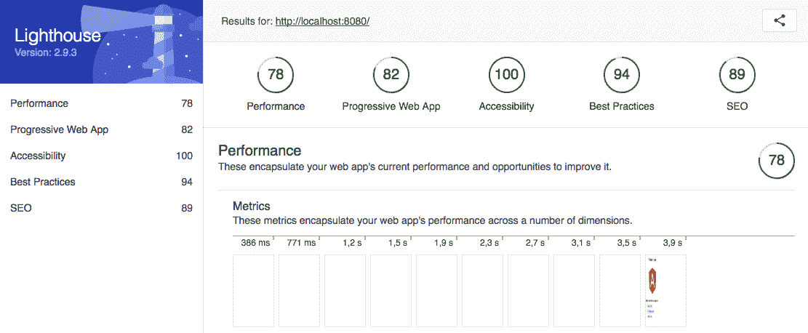

# 第七章：使用 Angular CLI 构建渐进式 Web 应用程序

正如我们在第三章中提到的，*了解 Angular 6 的核心概念*，Angular 是基于 JavaScript 开发现代 Web 应用程序的主要框架之一。

在第六章中，*使用 Laravel 框架创建 RESTful API-2*，我们使用 Laravel 资源、eloquent 关系和基于令牌的身份验证完成了后端 API。现在，我们已经拥有连接前端应用程序到后端所需的一切；在我们这样做之前，让我们看看本章将学到什么。

在本章中，我们将看到`angular-cli.json`文件中发生的一些更改，该文件现在提供了对多个应用程序的改进支持。

我们还将看看如何使用`ng add`创建**渐进式 Web 应用程序**（**PWA**），以及如何将项目组织为模块。

在本章中，我们将涵盖以下内容：

+   使用 Angular CLI 启动 Web 应用程序

+   构建 PWA 的基线

+   创建样板组件

# 使用 Angular CLI 启动 Web 应用程序

当我们开始撰写本章时，Angular 框架已推出了最新版本：版本 6。在之前的章节中，我们已经评论了这个版本中存在的一些新功能。

新版本更加专注于开发工具（如 Angular CLI）而不是框架本身的演进。我们可以引用 Angular CLI 的新功能，如`ng update`和`ng add`命令，这些对于更新包和添加新包非常有用。

我们需要做的第一件事是更新机器上的 Angular CLI；打开您的终端窗口并输入以下命令：

```php
npm install -g @angular/cli
```

上述命令将在您的机器上全局安装 Angular CLI 6.0.0。

# 准备基线代码

现在，我们需要准备我们的基线代码，这个过程与之前的章节非常相似。按照以下步骤进行：

1.  复制`chapter-05`文件夹中的所有内容。

1.  将文件夹重命名为`chapter-07`。

1.  删除`storage-db`文件夹。

现在，让我们对`docker-compose.yml`文件进行一些更改，以适应新的数据库和服务器容器。

1.  打开`docker-compose.yml`并用以下内容替换其中的内容：

```php
version: "3.1"
services:
    mysql:
      image: mysql:5.7
      container_name: chapter-07-mysql
      working_dir:     /application
      volumes:
        - .:/application
        - ./storage-db:/var/lib/mysql
      environment:
        - MYSQL_ROOT_PASSWORD=123456
        - MYSQL_DATABASE=chapter-06
        - MYSQL_USER=chapter-07
        - MYSQL_PASSWORD=123456
      ports:
        - "8083:3306"
    webserver:
      image: nginx:alpine
      container_name: chapter-07-webserver
      working_dir: /application
      volumes:
        - .:/application-
        ./phpdocker/nginx/nginx.conf:/etc/nginx/conf.d/default.conf
      ports:
        - "8081:80"
    php-fpm:
      build: phpdocker/php-fpm
      container_name: chapter-07-php-fpm
      working_dir: /application
      volumes:
        - ./Server:/application
        - ./phpdocker/php-fpm/php-ini-overrides.ini:
          /etc/php/7.2/fpm/conf.d/99-overrides.ini
```

请注意，我们更改了容器名称、数据库和 MySQL 用户：

+   `container_name: chapter-07-mysql`

+   `container_name: chapter-07-webserver`

+   `container_name: chapter-07-php-fpm`

+   `MYSQL_DATABASE=chapter-07`

+   `MYSQL_USER=chapter-07`

另一个需要注意的重要点是`php-fpm`容器卷的配置，我们现在将其命名为`Server`，而不是在之前的章节中命名为`project`，根据以下突出显示的代码：

```php
php-fpm:
        build: phpdocker/php-fpm
        container_name: chapter-07-php-fpm
        working_dir: /application
        volumes:
        - ./Server:/application
        - ./phpdocker/php-fpm/php-ini-overrides.ini:/etc/php/7.2/fpm/conf.d/99-overrides.ini
```

1.  在`vs.code`中打开`chapter-07`并将项目文件夹重命名为`Server`。

正如您在之前的章节中看到的，Laravel 框架有一种明确定义其视图使用方式；这是由于 Laravel 构建在 MVC 标准之上。

此外，Laravel 使用一个名为 Vue.js 的 JavaScript 框架，可以在`./Server/resources/assets/js`文件夹中找到。

为了不混淆，我们将在一个名为`Client`的文件夹中创建我们的前端应用程序，与新命名的`Server`文件夹处于同一级别。

1.  在`chapter-07`文件夹的根目录下创建一个名为`Client`的新文件夹。

在这些更改结束时，您应该看到与以下屏幕截图相同的项目结构：

应用程序结构

这是保持应用程序与 API 解耦的最佳方法。通过这种方法，我们有一些优势：

+   前端代码与应用程序的其余部分隔离；我们可以将其托管在静态 Web 服务中，例如**亚马逊网络服务**（**AWS**）存储桶，或任何其他 Web 服务器。

+   应用部署可以分开进行，以便 API 独立于前端应用程序进行演进，反之亦然。

将我们对 Git 源代码所做的更改添加到源代码控制中。打开终端窗口，输入以下命令：

```php
git add .
git commit -m "Initial commit chapter 07"
```

# 使用 Angular CLI 搭建 Web 应用

让我们开始使用 Angular CLI 构建我们的前端应用程序的新版本：

1.  在项目根目录打开终端窗口，输入以下命令：

```php
ng new Client --style=scss --routing
```

1.  前面的命令将创建我们需要的所有样板代码，这次使用 SCSS 语法进行样式表和`--routing`标志来创建应用程序路由。

1.  在上一个命令结束时，我们的应用程序将具有以下结构：

新的应用程序结构

1.  Angular 和 Angular CLI 版本 6 带来的变化之一是`angular.json`文件，之前的名称是`angular-cli.json`。它的结构非常不同，如下面的截图所示：

Angular JSON 文件

1.  至于应用程序文件，我们几乎有与之前相同的代码组织和文件，如下面的截图所示：

新的 Angular 应用结构

在前面的截图中，请注意我们现在有一个名为`browserlist`的文件；它用于向 CSS 生成的代码添加特定于浏览器的前缀。

# 创建目录结构

为了方便我们的开发，我们将在应用程序中创建一些目录，这样我们的项目将准备好进行扩展。这意味着我们可以以有组织的方式添加任何我们想要的模块/功能。

这一步非常重要，因为有时项目内部的结构是固定的；不建议更改它。

在这一步中，我们将使用模块或页面的命名约定。我们将使用前一章中制作的 API 定义服务作为基线：

+   一个名为`home`的主页

+   一个名为`bike-list`的摩托车页面

+   一个名为`bike-details`的自行车详情页面

+   一个名为`builders-list`的构建者页面

+   一个名为`builder-details`的构建者详情页面

+   一个名为`register`的注册页面

+   一个名为`login`的登录页面

根据前述描述，我们的应用程序将具有以下页面或模块：

+   `bike`

+   `builder`

+   `register`

+   `login`

+   `home`

我们更喜欢在这个时候使用*模块*或*页面*的命名约定，而不是组件，以免与 Angular 提出的组件术语混淆，其中一切都基于组件。

最后，这只是一种不同的方式来指代应用程序结构。

1.  打开 VS Code，在`Client/src/app`中，创建一个名为`pages`的新文件夹。

1.  在 VS Code 中，进入`Client/src/app`，创建一个名为`layout`的新文件夹。

1.  在 VS Code 中，进入`Client/src/app`，创建一个名为`shared`的新文件夹。

让我们看看以下表中的文件夹名称的含义：

| 文件夹 | 描述 |
| --- | --- |
| `pages` | 包含应用程序的所有模块和页面；例如，`pages/bike/bike-component.html` 和 `pages/builder/builder-component.html`。 |
| `layout` | 包含所有布局组件；例如，`layout/nav/nav-component.html`，`layout/footer/footer-component.html`。 |
| `shared` | 包含共享服务、管道等；例如，所有应用程序页面或组件共享的服务。 |

因此，在第 3 步结束时，我们将拥有以下结构：

文件夹结构

# 构建 PWA 的基线

正如我们之前讨论的，现在我们可以使用新的`ng add`命令来创建 PWA。但在此之前，让我们先了解一下 PWA 的概念。

PWA 是一套用于开发 Web 应用程序的技术，逐渐添加了以前只在原生应用中可能的功能。

用户的主要优势是他们不必在知道是否值得下载应用程序之前就下载应用程序。此外，我们可以列举以下优势：

+   **渐进式**：适用于任何用户，无论使用的是哪种浏览器

+   **响应式**：适用于任何设备：台式机、平板电脑和移动设备

+   **连接**：即使用户处于离线状态也能工作

+   **类似应用程序**：用户感觉自己就像在本机应用程序中

+   **更新**：无需下载应用程序更新；浏览器将自动检测并更新，如果有必要的话

+   **安全**：只有使用 HTTPs

+   **吸引力**：通过推送通知，用户可以保持持续参与

+   **可安装**：您可以通过单击一个图标将其添加到智能手机的主屏幕上

+   **SEO 友好**：搜索引擎可以找到应用程序的内容（这有利于用户和企业）

您可以在[`developers.google.com/web/progressive-web-apps/`](https://developers.google.com/web/progressive-web-apps/)上阅读更多关于渐进式 Web 应用程序的信息。

尽管 PWA 在构建本机应用程序方面仍然存在一些缺点，如下所示：

+   PWA 尚未完全控制设备的硬件；蓝牙、联系人列表和 NFC 是一些无法通过 PWA 访问的功能的例子。

+   尽管谷歌、微软和 Mozilla 对 PWA 抱有很高的期望，但苹果并没有。

+   Safari 仍然不支持两个重要功能：推送通知和离线操作。但苹果已经在考虑实现 PWA，尽管它可能没有太多选择。

对于所有的负面因素，这只是时间问题——想想看，Angular 团队已经为我们提供了使用 Angular CLI 创建 PWA 的支持。

# 使用 ng add 添加 PWA 功能

现在，让我们看看我们如何做到这一点。

在`chapter-06/Client`文件夹中打开您的终端窗口，并输入以下命令：

```php
ng add @angular/pwa
```

前面的命令将生成类似以下截图的输出：

Angular PWA 输出

# 了解 PWA 中的关键文件

让我们检查一些在我们的应用程序文件中进行的重要更改。前面的命令将在根文件夹中添加两个新文件。

`manifest.json`文件用于设置：

+   主题颜色

+   应用程序名称

+   默认显示模式

+   图标配置和大小

还可以设置描述标签、相关应用程序和平台。

一个`ngsw-config.json`文件（也称为 service worker 配置），用于设置 assetsGroup、dataGroups、navigationUrls 和 cache。

在`src/assets`中创建了一个名为`icons`的新文件夹；此图标将显示为移动电话屏幕上的应用程序书签。

以下文件已更新：

+   `angular.json`。

+   `package.json`添加：`@angular/pwa`和`@angular/service-worker`。

+   `app.module.ts`在生产中注册了 service-worker。这意味着我们可以通过使用生产命令来看到 service-worker 的工作；在本章的后面，我们将看到如何使用它。

+   `index.html`在`<head>`标签中添加了`manifest.json`文件和主题颜色。

# PWA 在行动

正如我们在第 4 步中提到的，Angular 引擎只在生产模式下将 service work 应用于应用程序；也就是说，只有在使用`ng build`命令时才会应用。

所以，让我们看看这在实践中是如何工作的。但首先，让我们看看是否一切都按预期发生了，包括应用程序的创建和`@angular/pwa`的安装：

1.  在`./Client`文件夹中打开您的终端窗口，并输入以下命令：

```php
npm start
```

请记住，`npm start`命令与`ng server`相同；您可以在`package.json`的`scripts`标签中检查所有`npm`别名。在那里，我们有以下别名：

```php
     "scripts": {
                "ng": "ng",
                "start": "ng serve",
                "build": "ng build",
                "test": "ng test",
                "lint": "ng lint",
                "e2e": "ng e2e"
        }
```

在前面的命令结束时，我们可以看到以下消息作为输出：

```php
** Angular Live Development Server is listening on localhost: 4200, open your browser on http://localhost:4200/ **
```

接下来是类似以下的输出：

Angular 开发服务器输出

1.  打开您的默认浏览器，并导航到`http://localhost:4200/`。

现在，您可以看到欢迎屏幕：

！[](assets/a7fbd412-51b1-4cdb-9c88-506289d46502.png)Angular 欢迎屏幕

让我们检查`manifest.json`文件。几乎所有新的浏览器都有一个 Web 检查器，我们可以在其中调试任何网站或 Web 应用程序。对于下一个检查，我们将使用 Chrome 浏览器，但您可以使用您的默认或喜爱的浏览器。

1.  在浏览器中，点击“打开”以打开 Web 检查器。

1.  如果您在 Chrome 中，请点击**应用程序**菜单选项卡。

1.  点击左侧菜单上的**清单**，您应该会看到一个类似于以下截图的面板：

！[](assets/460f7169-fd5f-4d1f-9599-a10fac0d45d8.png)Web 检查器

正如您在上一张截图中所看到的，一切都如预期那样；我们的`manifest.json`文件可用，其中包含我们之前看到的所有配置。

请注意 Identity 标题右侧的“添加到主屏幕”链接；这意味着我们可以将此应用程序添加到手机主屏幕或浏览器应用程序的选项卡上。

1.  但是，如果您点击此链接，您将看到一个控制台错误，如下截图所示：

！[](assets/d46fcfb2-09a0-4348-8168-dc954049aba9.png)服务工作者控制台错误

这意味着我们没有服务工作者，这是真的。请记住，Angular 只会在生产中注入服务工作者，我们在幕后使用**`ng server` **。

此外，如果您点击服务工作者右侧菜单，您将看到一个空面板。

# 在生产模式下运行应用程序

现在，是时候在生产模式下检查我们的应用程序，了解服务是如何工作的：

1.  返回您的终端窗口，并使用以下命令停止 Angular 服务器：

```php
control + c
```

1.  仍然在终端中，键入`build`命令：

```php
ng build --prod
```

请注意，前面的`npm build`别名命令没有使用

`--prod`标志。所以，你需要使用`ng build --prod`

命令，或使用`--prod`标志更新`npm build`命令。

在上一个命令的末尾，我们可以看到`Client`目录中的另一个文件夹，名为`dist`。

# Angular 服务-工作者在行动

现在，是时候启动生成在`./Client/dist/Client`文件夹中的应用程序，以查看服务工作者的工作情况。现在不要担心这个路径；在本书的后面，我们会进行更改：

1.  在`./Client/dist/Client`文件夹中打开您的终端窗口，并键入以下命令：

```php
http-server -p 8080
```

请记住，我们在上一章中安装了 HTTP 服务器；如果您还没有这样做，请转到[`www.npmjs.com/package/http-server`](https://www.npmjs.com/package/http-server)并按照安装过程进行操作。

1.  在浏览器中打开`http://localhost:4200/`。

1.  在浏览器中，打开 Web 检查器面板，点击右侧菜单中的**应用程序**选项卡菜单。

您将看到以下内容：

！[](assets/53f31bc2-fe24-4cdd-8c5d-1d97b4e66922.png)Web 检查器应用程序面板

现在，我们已经正确配置并在我们的应用程序中运行服务工作者。

1.  返回浏览器，点击右侧菜单中的**清单**菜单。

1.  现在，点击“添加到**主屏幕**”链接。

恭喜！您已将我们的应用程序添加到您的应用程序面板中。如果您在 Chrome 中，您将看到以下内容：

！[](assets/9e864de1-a81c-4596-a7df-35daa91dfe05.png)应用程序图标

因此，如果您点击 Angular 图标，您将被重定向到`http://localhost:8080/`。

此刻，我们已经有了 PWA 的基础。

不要担心应用程序名称；我们使用的是`Client`，但在现实世界中，您可以选择自己的名称。

# 调试渐进式 Web 应用程序

现在，我们将介绍一个非常有用的工具，用于调试渐进式 Web 应用程序。这是 Chrome 导航器的一个扩展，称为 Lighthouse：

您可以在[`chrome.google.com/webstore/detail/lighthouse/blipmdconlkpinefehnmjammfjpmpbjk/related?hl=us-EN`](https://chrome.google.com/webstore/detail/lighthouse/blipmdconlkpinefehnmjammfjpmpbjk/related?hl=us-EN)获取有关 Lighthouse 的更多信息。

1.  打开 Chrome 浏览器，点击右侧的 Lighthouse 扩展，如下截图所示：

Lighthouse 扩展

1.  点击**生成报告**按钮。

生成报告后，您将看到类似以下截图的结果：

Lighthouse 报告

Lighthouse 将分析五个主要项目：

+   性能

+   PWA

+   可访问性

+   最佳实践

+   **搜索引擎优化**（**SEO**）

请注意，即使没有任何内容，我们在每个类别中都有一个高分级别；现在让我们专注于 SEO 类别。

让我们看看如何改进 SEO。

1.  在左侧菜单中点击 SEO；您将看到以下截图：


上述警告告诉我们，我们的应用程序在`index.html`上没有 meta 描述标签。所以，让我们修复它。

在`./Client/src/index.html`中，在 viewport meta 标签之后添加以下代码：

```php
<metaname="description" content="Hands-On Full-Stack Web Development with Angular 6 and Laravel 5">
```

如果我们再次检查，我们将看到以下报告：


请注意，我们在 SEO 方面得分为 100%

这样，我们可以找到应用程序中的所有问题并正确地进行修正。

我们现在已经准备好让我们的应用程序消耗我们的 API，但是我们仍然有很多工作要做来构建前端应用程序。

在接下来的步骤中，我们将看看如何使用 Angular CLI 添加我们的组件。

# 创建样板 Angular 组件

正如我们之前所看到的，我们的应用程序有一些页面用于注册、登录以及摩托车列表、建造者列表和摩托车投票方案的可视化。在这一点上，我们将创建所有必要的代码来组成这些功能。

# 创建主页模块和组件

在接下来的几行中，我们将创建`home`模块和组件：

1.  在`./Client/src/app`中打开您的终端窗口，并键入以下命令：

```php
ng generate module pages/home --routing
```

正如我们之前所看到的，上述命令将生成三个新文件：

+   `src/app/pages/home/home-routing.module.ts`

+   `src/app/pages/home/home.modules.spec.ts`

+   `src/app/pages/home/home.module.ts`

现在，我们只需要生成`home`组件。

1.  仍然在终端中，键入以下命令：

```php
ng g c pages/home
```

在上一个命令结束时，您将在`pages`文件夹中看到以下结构：

主页模块结构

请注意，我们创建了一个完整的模块/文件夹，就像我们之前解释的那样。现在，我们可以称新文件夹为`home`。我们需要将新创建的`home`模块导入到我们的主项目中；让我们看看如何做到这一点。

1.  打开`src/app/app.modules.ts`并添加以下代码行：

```php
// Application modules
import { HomeModule } from './pages/home/home.module';
@NgModule({
    declarations: [
    AppComponent
    ],
imports: [
    BrowserModule,
    AppRoutingModule,
    HomeModule,
    ServiceWorkerModule.register('/ngsw-worker.js', { enabled:         environment.production })
    ],
providers: [],
bootstrap: [AppComponent]
})
export class AppModule { }
```

# 创建摩托车模块和组件

现在，是时候创建另一个模块和组件了；让我们看看如何做到这一点：

1.  仍然在您的终端窗口中，在`./Client/src/app`中，键入以下命令：

```php
ng generate module pages/bikes --routing
```

正如我们之前所看到的，上述命令将生成三个新文件：

+   `src/app/pages/bikes/bikes-routing.module.ts`

+   `src/app/pages/bikes/bikes.modules.spec.ts`

+   `src/app/pages/bikes/bikes.module.ts`

现在，我们只需要生成`bike`组件。

1.  键入以下命令：

```php
ng g c pages/bikes
```

在上一个命令结束时，您将在`pages`文件夹中看到以下结构：

摩托车模块结构

现在，我们可以称新文件夹为`bikes`（作为 Bikes 模块）。我们需要将新创建的`bikes`模块导入到我们的主项目中；让我们看看如何做到这一点。

1.  打开`src/app/app.modules.ts`并添加以下代码行：

```php
// Application modules
import { BikesModule } from './pages/bikes/bikes.module';
@NgModule({
    declarations: [
    AppComponent
    ],
imports: [
    BrowserModule,
    AppRoutingModule,
    HomeModule,
    BikesModule,
    ServiceWorkerModule.register('/ngsw-worker.js', { enabled:         environment.production })
    ],
providers: [],
    bootstrap: [AppComponent]
})
export class AppModule { }
```

请注意，我们正在将新创建的`BikesModule`注入为`app.module`的依赖项。

现在，是时候为 Builders、Login 和 Register 页面执行相同的操作了。

# 创建 builders 模块和组件

是时候使用 Angular CLI 创建`builders`模块了。让我们看看我们如何做到这一点：

1.  打开您的终端窗口并输入以下命令：

```php
ng generate module pages/builders --routing
```

正如您之前所看到的，上述命令将生成三个新文件：

+   `src/app/pages/builders/builders-routing.module.ts`

+   `src/app/pages/builders/builders.modules.spec.ts`

+   `src/app/pages/builders/builders.module.ts`

1.  仍然在您的终端窗口中，输入以下命令来生成组件：

```php
ng g c pages/builders
```

1.  将新创建的模块添加到应用程序模块中；打开`src/app/app.modules.ts`并添加以下代码：

```php
// Application modules
import { BikesModule } from './pages/bikes/bikes.module';
import { BuildersModule } from './pages/builders/builders.module';
@NgModule({
    declarations: [
    AppComponent
    ],
imports: [
    BrowserModule,
    AppRoutingModule,
      HomeModule,
    BikesModule,
    BuildersModule,
    ServiceWorkerModule.register('/ngsw-worker.js', { enabled:         environment.production })
    ],
providers: [],
    bootstrap: [AppComponent]
})
export class AppModule { }
```

# 准备 Auth 路由 - 登录、注册和注销组件

现在，我们可以创建 Auth 路由，包括`Login`和`Register`；同样，我们将使用 Angular CLI 的强大功能来创建新的模块和组件：

1.  打开您的终端窗口并输入以下命令：

```php
ng generate module pages/auth --routing
```

1.  仍然在您的终端窗口中，输入以下命令来生成组件：

```php
ng g c pages/auth/login
```

1.  将新创建的模块添加到应用程序模块中；打开`src/app/auth/auth.modules.ts`并添加以下代码：

```php
 import { LoginComponent } from  './login/login.component';

     @NgModule({

     imports: [

     CommonModule,

     AuthRoutingModule

     ],

     declarations: [LoginComponent]

 }) 
```

注意；这次，我们将`LoginComponent`添加到`auth.module.ts`中，

并没有将其添加到`app.module.ts`中。

现在，是时候在`auth.module`中创建`register`组件了。

1.  打开您的终端窗口并输入以下命令：

```php
ng g c pages/auth/register
```

1.  将新创建的模块添加到应用程序模块中；打开`src/app/auth/auth.modules.ts`并添加以下代码：

```php
import { RegisterComponent } from  './register/register.component';

    @NgModule({

    imports: [

    CommonModule,

    AuthRoutingModule

    ],

    declarations: [LoginComponent, RegisterComponent]

})
```

1.  打开您的终端窗口并输入以下命令：

```php
ng g c pages/auth/logout
```

1.  将新创建的模块添加到应用程序模块中；打开`src/app/auth/auth.modules.ts`并添加以下代码：

```php
import { LogoutComponent } from  './logout/logout.component';

@NgModule({

    imports: [

    CommonModule,

    AuthRoutingModule

    ],

    declarations: [LoginComponent, RegisterComponent, 
    LogoutComponent]

})
```

此时，我们的认证模块已经完成；也就是说，我们拥有了所有我们将使用的组件 - `register`、`login`和`logout`。但是我们仍然需要将新模块注入到主应用程序模块中。

1.  打开应用程序模块，打开`src/app/app.modules.ts`并添加以下代码：

```php
// Application modules
import { BikesModule } from './pages/bikes/bikes.module';
import { BuildersModule } from './pages/builders/builders.module';
import { AuthModule } from './pages/auth/auth.module';
@NgModule({
    declarations: [
    AppComponent
    ],
imports: [
    BrowserModule,
    AppRoutingModule,
    BikesModule,
    BuildersModule,
    AuthModule,
    ServiceWorkerModule.register('/ngsw-worker.js', { enabled:
environment.production })
    ],
    providers: [],
    bootstrap: [AppComponent]
    })
export class AppModule { }
```

在这一步结束时，您将拥有以下结构：

应用程序模块结构

# 创建布局组件

在本节的最后一步中，我们将为应用程序的主导航创建一个布局组件。请注意，这次我们只会创建组件本身，而不包括模块和路由。

仍然在您的终端窗口中，输入以下命令：

```php
ng g c layout/nav
```

上述命令将生成以下结构：

布局文件夹结构

# 摘要

恭喜；您刚刚完成了又一章，现在您拥有一个坚固的前端应用程序，准备接收所有需要的功能。

在本章中，我们使用 Angular 创建了一个渐进式 Web 应用程序，使用了代码组织的高级技术。您还学会了如何使用 Angular CLI 创建模块和组件。

在下一章中，我们将学习如何创建应用程序的组件和路由。
