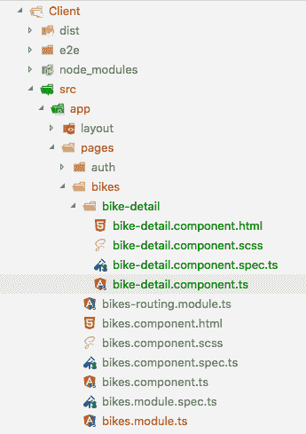
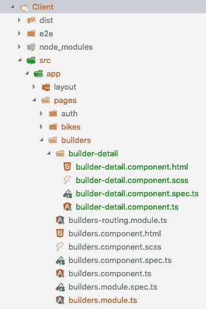
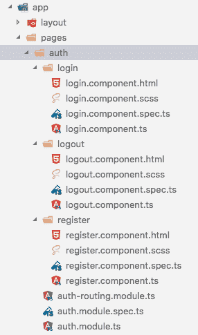
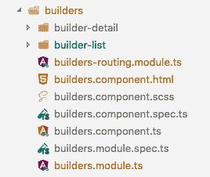
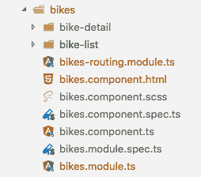
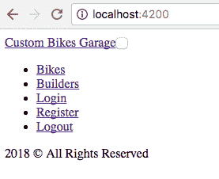
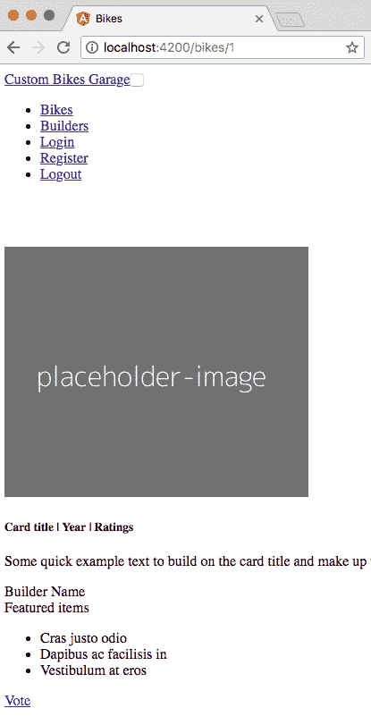

# 第八章：处理 Angular 路由和组件

我们来到了**单页应用程序**（**SPA**）中最重要的部分之一：使用路由。正如您在第三章中所看到的，*理解 Angular 6 的核心概念*，Angular 框架提供了一个强大的工具来处理应用程序路由：@ angular/router 依赖项。

在接下来的几节中，您将学习如何使用其中一些功能，例如子视图，以及如何创建主细节页面。此外，我们将开始构建应用程序的视觉字段，填充模板与 HTML 标记。

在本章中，我们将涵盖以下主题：

+   准备基线代码

+   向应用程序添加组件

+   处理 Angular 路由

+   为详细页面配置子路由

+   构建前端视图

# 准备基线代码

现在，我们需要准备我们的基线代码，这个过程与之前的章节非常相似。让我们按照以下步骤进行：

1.  复制`chapter-08`文件夹中的所有内容。

1.  将文件夹重命名为`chapter-08`。

1.  删除`storage-db`文件夹。

现在，让我们对`docker-compose.yml`文件进行一些更改，以适应新的数据库和服务器容器。

1.  打开`docker-compose.yml`并用以下代码替换内容：

```php
version: "3.1"
services:
    mysql:
      image: mysql:5.7
      container_name: chapter-08-mysql
      working_dir: /application
      volumes:
        - .:/application
        - ./storage-db:/var/lib/mysql
      environment:
        - MYSQL_ROOT_PASSWORD=123456
        - MYSQL_DATABASE=chapter-08
        - MYSQL_USER=chapter-08
        - MYSQL_PASSWORD=123456
      ports:
        - "8083:3306"
    webserver:
      image: nginx:alpine
      container_name: chapter-08-webserver
      working_dir: /application
      volumes:
        - .:/application
        - ./phpdocker/nginx/nginx.conf:/etc/nginx/conf.d/default
          .conf
      ports:
        - "8081:80"
    php-fpm:
      build: phpdocker/php-fpm
      container_name: chapter-08-php-fpm
      working_dir: /application
      volumes:
        - ./Server:/application
        - ./phpdocker/php-fpm/php-ini-
          overrides.ini:/etc/php/7.2/fpm/conf.d/99-overrides.ini
```

请注意，我们更改了容器名称、数据库和 MySQL 用户：

+   `container_name: chapter-08-mysql`

+   `container_name: chapter-08-webserver`

+   `container_name: chapter-08-php-fpm`

+   `MYSQL_DATABASE=chapter-08`

+   `MYSQL_USER=chapter-08`

1.  将我们所做的更改添加到 Git 源代码控制中。打开您的终端窗口，输入以下命令：

```php
 git add .
 git commit -m "Initial commit chapter 08"
```

# 向我们的应用程序添加组件

现在，我们将继续向我们的应用程序添加一些组件。我们必须记住，在应用程序摘要中，我们定义了一个页面，用于自行车列表，该页面指向我们 API 的`api/bikes`端点；此外，我们将有一个自行车详细信息页面，该页面指向`api/bikes/id`端点，包含所选自行车的详细信息。而且，我们将对`api/builders`端点做同样的处理。

所以，让我们开始创建组件：

1.  在`./Client/src/app`中打开您的终端窗口，输入以下命令：

```php
 ng g c pages/bikes/bike-detail
```

在上一个命令的末尾，您将看到`bikes`模块中的以下结构：

自行车模块结构

上述命令将创建一个根`bikes`文件夹，用于存储与`bikes`端点相关的每个模块；这种模式允许我们拥有一个模块化的应用程序，其中每个新功能（例如`bikes-detail`或`bike-list`）都将以相同的方式组织起来。

例如，我们可以添加一个新的库存模块，该模块将在其自己的模块（`inventory.module.ts`）中创建，并存储在`bikes`模块目录中。

将此视为一种良好的实践，并以这种方式组织您的模块和组件；避免将多个组件分组在同一文件夹的根目录中。这可以防止您的代码变成意大利面代码。

1.  在`./Client/src/app`中打开您的终端窗口，输入以下命令：

```php
 ng g c pages/builders/builder-detail
```

现在，您将看到`builders`模块的以下结果：

构建者文件夹结构

请注意，`builders`模块（位于`./Client/src/app/pages/builders/builders.module.ts`）已更新，新添加了 Builder-detail 组件到 declarations 属性中，如下面的突出显示代码所示：

```php
import { NgModule } from '@angular/core';
import { CommonModule } from '@angular/common';
import { BuildersRoutingModule } from './builders-routing.module';
import { BuildersComponent } from './builders.component';
import { BuilderDetailComponent } from './builder-detail/builder-detail.component';
@NgModule({
    imports: [
        CommonModule,
        BuildersRoutingModule
    ],
    declarations: [BuildersComponent, BuilderDetailComponent]
    })
export class BuildersModule { }
```

最好的部分是，Angular CLI 足够聪明，可以将新创建的组件添加到其所属的模块中。当我们创建`bike-detail`组件时也是这样做的。

# 处理 Angular 路由

在这一点上，我们将继续开发我们的示例应用程序。在上一章中，我们为前端应用程序创建了一些 Angular 组件，但在编写每个组件的内容之前，我们将创建一些路由。

在我们深入代码之前，你需要了解 Angular 路由器的工作原理。

当你点击链接或转到 URL（例如`http://localhost:4200/bikes`）时，Angular 路由器：

1.  检查浏览器 URL。

1.  查找与 URL 对应的路由器状态。

1.  应用路由守卫，如果它们在路由器状态中被定义。

1.  激活相应的 Angular 组件以显示页面。

此外，每个路由可以包含以下属性：

+   **path**：字符串；匹配 URL 的路径

+   **patchMatch**：字符串；如何匹配 URL

+   **component**：类引用；当路由被激活时要激活的组件

+   **redirectTo**：字符串；当激活此路由时要重定向到的 URL

+   **data**：要分配给路由的静态数据

+   **resolve**：要解析和合并到数据中的动态数据，当解析时

+   **children**：子路由

在接下来的章节中，我们将看到两种为我们的应用程序创建路由的方法，其中一种使用子路由。

你可以在官方文档的[`angular.io/guide/router`](https://angular.io/guide/router)中了解更多关于路由的信息。

# 创建身份验证路由

让我们来看看我们身份验证模块的当前文件夹结构：

Auth 模块文件夹结构

在上面的截图中，请注意我们只在`auth`文件夹的根目录中创建了一个路由文件；我们没有在`auth`文件夹内的任何其他文件夹/模块中包含任何路由文件，比如`login`，`register`和`logout`。这是因为我们将使用`auth-routing.module.ts`文件来创建与身份验证相关的所有路由。

现在，我们将创建身份验证路由：

1.  打开`./Client/src/app/pages/auth`目录中的**`auth-routing.module.ts`**文件，并在`Router import`之后添加以下代码块：

```php
 // Auth Routes Imports
 import { RegisterComponent } from  './register/register.component';
 import { LoginComponent } from  './login/login.component';
 import { LogoutComponent } from  './logout/logout.component';
```

1.  现在，在`routes`常量内添加以下代码：

```php
 const  routes:  Routes  = [
        { path:  'register', component:  RegisterComponent },
        { path:  'login', component:  LoginComponent },
        { path:  'logout', component:  LogoutComponent }
 ];
```

现在，让我们开始处理应用程序的其他路由，从`home`模块开始。

# 创建 home 路由

现在，我们将创建`home`路由，如下所示：

1.  打开`./Client/src/app/pages/home/home-routing.module.ts`并`import`组件：

```php
 // Home Routes Imports
 import { HomeComponent } from  './home.component';
```

1.  打开`./Client/src/app/pages/home/home-routing.module.ts`并在`routes`常量内添加以下路由对象：

```php
 const  routes:  Routes  = [
        { path: " '', component:  HomeComponent }
 ];
```

由于我们的主页非常简单，只包含一个路由；稍后在其他模块中，你将看到更复杂的路由。

# 配置详细页面的子路由

我们将使用另一种方法来在 Angular 中创建 builders 和 bikes 路由。我们将使用子路由，也称为嵌套视图。

当你使用多个子路由时，非常重要的是要小心处理路由对象的顺序。

当路由器接收到 URL 时，它会按顺序遵循内容，从数组的第一个元素开始；如果找到与完整 URL 匹配的内容，它将停止并实例化相应的组件。

在接下来的章节中，你将看到如何实现一个名为**master detail page**的著名 UI 模式。我们将创建另一个组件来帮助我们组织文件夹结构。

# 添加 builders 子路由

让我们为我们前端应用程序中的以下视图创建子路由：

+   `builders-list`

+   `builders-detail`

1.  打开`./Client/src/app/pages/builders/builders-routing.module.ts`并`import`组件：

```php
imports
import { BuilderDetailComponent } from './builder-detail/builder-detail.component';
import { BuilderListComponent } from './builder-list/builder-list.component';
```

1.  仍然在`./Client/src/app/pages/builders/builders-routing.module.ts`中，在`routes`常量内添加以下`routes`对象：

```php
const routes: Routes = [
{
    path: 'builders',
    children: [
    {
    path: '',
component: BuilderListComponent
},
    {
    path: ':id',
    component: BuilderDetailComponent
    }
    ]
    }
];
```

在上面的代码片段中，你会注意到两件不同的事情：一是我们使用了`children`路由数组属性，另一个是一个新的组件，名为`BuilderListComponent`。所以，让我们创建这个新组件。

1.  在**`./Client/src/app`**内，输入以下命令：

```php
 ng g c pages/builders/builder-list
```

你将在`builders`模块中看到以下结构：

带有 builder-list 模块的 Builders 模块

# 添加 bikers 子路由

让我们为我们前端应用程序中的以下视图创建子路由：

+   `bike-list`

+   `bike-detail`

现在我们将在文件顶部导入组件：

1.  打开`./Client/src/app/pages/bikes/bikes-routing.module.ts`并`import`组件：

```php
// Bikes Routes Imports
 import { BikeDetailComponent } from  './bike-detail/bike-detail.component';
 import { BikeListComponent } from  './bike-list/bike-list.component';
```

1.  仍然在`./Client/src/app/pages/bikes/bikes-routing.module.ts`中，在`routes`常量内添加以下路由对象：

```php
 const  routes:  Routes  = [
   { path:  'bikes',
     children: [
    {
      path:  "'',
      component:  BikeListComponent
    },{
      path:  ':id',
      component:  BikeDetailComponent
    }]
  }
 ];
```

现在，是时候创建新的`BikeListComponent`了，就像我们之前用`Builders`一样。

1.  在`./Client/src/app`中，输入以下命令：

```php
 ng g c pages/bikes/bike-list
```

你将在`bikes`模块中看到以下结构：

带有 bike-list 模块的 bikes 模块

# 重构 app.component.html

正如我们之前讨论的，让我们现在让我们的视图更具吸引力。

让我们添加我们的导航组件。现在，我们不会在这个文件中放内容；我们以后会做。

打开`./Client/src/app/app.component.html`并用以下代码替换原代码：

```php
 <app-nav></app-nav>
 <router-outlet></router-outlet>
     <footer  class="footer">
     <div  class="pl-3">
         <span  class="text-muted">2018 &copy; All Rights
         Reserved</span>
     </div>
     </footer>
```

请注意，上述代码目前没有任何内容 - 只是页脚注释的简单标记。在下一节中，你将看到如何添加更有趣的内容。

# 构建前端视图

大多数我们用 Angular 创建的组件都会有一个 HTML 模板，就像你在之前的章节中看到的那样：

```php
@Component({
        selector:  'app-nav',
        templateUrl:  './nav.component.html',
        styleUrls: ['./nav.component.scss']
})
```

框架具有创建与其相应视图连接的组件的能力是很棒的。它具有这个功能。它还包括一个完全独立于应用程序其余部分的样式表，正如你在前面的代码中所看到的。

在下一步中，我们将添加必要的 HTML 来让我们的应用程序看起来更加愉快，就像我们在之前的章节中建议的那样。

# 创建导航组件

打开`./Client/src/app/layout/nav/nav.component.html`并用以下代码替换段落中的`nav works`字符串：

```php
<header>
<nav class="navbar navbar-expand-md navbar-dark fixed-top bg-dark">
<a class="navbar-brand" [routerLink]="['/']" (click)="setTitle('Custom Bikes Garage')">Custom Bikes Garage</a>
    <button class="navbar-toggler" type="button" data-toggle="collapse"     data-target="#navbarCollapse" aria-controls="navbarCollapse"
    aria-expanded="false" aria-label="Toggle navigation">
        <span class="navbar-toggler-icon"></span>
    </button>
    <div class="collapse navbar-collapse" id="navbarCollapse">
    <ul class="navbar-nav ml-auto">
    <li class="nav-item">
    <a class="nav-link" [routerLink]="['/bikes']" 
    routerLinkActive="active" (click)="setTitle('Bikes')">Bikes</a>
    </li>
    <li class="nav-item">
    <a class="nav-link" [routerLink]="['/builders']"
             routerLinkActive="active"
         (click)="setTitle('Builders')">Builders</a>
    </li>
    <li class="nav-item">
    <a class="nav-link" [routerLink]="['/login']"
     routerLinkActive="active" (click)="setTitle('Login')">Login</a>
    </li>
    <li class="nav-item">
    <a class="nav-link" [routerLink]="['/register']"
     routerLinkActive="active"
         (click)="setTitle('Register')">Register</a>
    </li>
    <li class="nav-item">
    <a class="nav-link" [routerLink]="['/logout']"
     routerLinkActive="active">Logout</a>
    </li>
    </ul>
    </div>
</nav></header>
```

关于上述代码有两个重要的事情：

+   我们正在使用`routerLink`属性；在本章的后面部分，你将看到如何使用它。

+   我们正在使用`Title`服务来使用`<title>`标签设置页面标题，这是 Angular 内置的服务。由于我们正在构建一个 SPA，我们需要使用这个资源来给我们的视图一个标题；如果没有它，我们应用程序中的所有页面都将具有相同的客户端名称。请记住，当我们首次使用 Angular CLI 创建应用程序时，`Title`标签已经设置好了，并且将接收我们定义的应用程序名称。

让我们更新`<title>`标签，如下所示：

1.  打开`./Client/src/app/layout/nav/nav.component.ts`并添加以下代码：

```php
import { Component, OnInit } from '@angular/core';
import { Title } from '@angular/platform-browser';
@Component({
    selector: 'app-nav',
        templateUrl: './nav.component.html',
        styleUrls: ['./nav.component.scss']
    })
    export class NavComponent implements OnInit {
    public constructor(private titleTagService: Title ) { }
    public setTitle( pageTitle: string) {
    this.titleTagService.setTitle( pageTitle );
    }
    ngOnInit() {
    }
}
```

1.  打开`./Client/src/app/app.module.ts`并将`Title`导入添加到文件顶部：

```php
import { BrowserModule, Title } from  '@angular/platform-browser';
```

1.  现在，将`Title`提供者添加到`@ngModules`提供者中：

```php
providers: [
Title
],
```

因此，如果我们再次在浏览器中检查相同的 URL（`http://localhost:4200/`），我们可以看到一个链接列表，并且我们可以通过它们进行导航。结果将类似于以下截图：

导航链接

不要担心我们标记中的类名；在本书的后面，我们将添加一些样式表，包括一些 Bootstrap 组件。

# 创建 home 视图和模板

打开`./Client/src/app/pages/home/home.component.html`并用以下代码替换段落中的`home works`字符串：

```php
<main role="main">
<div class="jumbotron">
<div class="container text-center">
<h1 class="display-3 ">Custom Bikes Garage</h1>
<p>Motorcycle builders and road lovers</p>
<p>
<a class="btn btn-primary btn-lg" [routerLink]="['/register']"role="button">Register</a>
</p>
</div>
</div>
<div class="container">
<div class="row">
<div class="col-md-4">
<h2>Heading</h2>
<p>Donec id elit non mi porta gravida at eget metus. Fusce dapibus, tellus ac cursus commodo, tortor mauris condimentum
nibh, ut fermentum massa justo sit amet risus. Etiam porta sem malesuada magna mollis euismod. Donec sed odio dui.
</p>
<p>
<a class="btn btn-secondary" href="#" role="button">View details &raquo;</a>
</p>
</div>
<div class="col-md-4">
<h2>Heading</h2>
<p>Donec id elit non mi porta gravida at eget metus. Fusce dapibus, tellus ac cursus commodo, tortor mauris condimentum
nibh, ut fermentum massa justo sit amet risus. Etiam porta sem malesuada magna mollis euismod. Donec sed odio dui.
</p>
<p>
<a class="btn btn-secondary" href="#" role="button">View details &raquo;</a>
</p>
</div>
<div class="col-md-4">
<h2>Heading</h2>
<p>Donec sed odio dui. Cras justo odio, dapibus ac facilisis in, egestas eget quam. Vestibulum id ligula porta felis euismod
semper. Fusce dapibus, tellus ac cursus commodo, tortor mauris condimentum nibh, ut fermentum massa justo sit amet
risus.</p>
<p>
<a class="btn btn-secondary" href="#" role="button">View details &raquo;</a>
</p>
</div>
</div>
</div>
</main>
```

# 创建 bikes router-outlet

打开`./Client/src/app/pages/bikes/bikes.component.html`并用以下代码替换段落中的`bikes works`字符串：

```php
<router-outlet></router-outlet>
```

# 创建 bike-list 视图和模板

打开`./Client/src/app/pages/bikes/bike-list/bike-list.component.html`并用以下代码替换段落中的`bike-list` works 字符串：

```php
<main role="main">
<div class="py-5 bg-light">
<div class="container">
<form>
<div class="form-group row">
<label for="search" class="col-sm-2 col-form-label">Bike List</label>
<div class="col-sm-8">
<input type="text" class="form-control" id="search"placeholder="Search">
</div>
<div class="col-sm-2">
<div class="dropdown">
<button class="btn btn-outline-primary dropdown-toggle btn-block" type="button" id="dropdownMenuButton" data-toggle="dropdown" aria-haspopup="true" aria-expanded="false">
Filter
</button>
<div class="dropdown-menu" aria-labelledby="dropdownMenuButton">
<a class="dropdown-item" href="#">Action</a>
</div>
</div>
</div>
</div>
</form>
<div class="row">
<div class="col-md-4">
<div class="card mb-4 box-shadow">

<div class="card-body">
<p>Model | year</p>
<p class="card-text">This is a wider card with supporting text below as a natural lead-in to additional content. This content is a little bit longer.</p>
<div class="d-flex justify-content-between align-items-center">
    <div class="btn-group">
    <button routerLink="/bikes/1" type="button" class="btn btn-sm
      btn-    outline-primary">View</button>
    <button type="button" class="btn btn-sm btn-outline-
        primary">Vote</button>
</div>
<small class="text-muted">4 ratings</small>
</div>
</div>
</div>
</div>
<div class="col-md-4">
<div class="card mb-4 box-shadow">

<div class="card-body">
<p>Model | year</p>
<p class="card-text">This is a wider card with supporting text below as a natural lead-in to additional content. This content is
a little bit longer.</p>
<div class="d-flex justify-content-between align-items-center">
<div class="btn-group">
<button routerLink="/bikes/2" type="button" class="btn btn-sm btn-outline-primary">View</button>
<button type="button" class="btn btn-sm btn-outline-primary">Vote</button>
</div>
<small class="text-muted">9 ratings</small>
</div>
</div>
</div>
</div>
<div class="col-md-4">
<div class="card mb-4 box-shadow">

<div class="card-body">
<p>Model | year</p>
<p class="card-text">This is a wider card with supporting text below as a natural lead-in to additional content. This content is
a little bit longer.</p>
<div class="d-flex justify-content-between align-items-center">
<div class="btn-group">
<button routerLink="/bikes/3" type="button" class="btn btn-sm btnoutline-primary">View</button>
<button type="button" class="btn btn-sm btn-outline-primary">Vote</button>
</div>
<small class="text-muted">5 ratings</small>
</div>
</div>
</div>
</div>
</div>
</div>
</div>
</main>
```

# 创建 bike-detail 视图和模板

打开`./Client/src/app/pages/bikes/bike-detail/bike-detail.component.html`并用以下代码替换段落中的`bike-detail` works 字符串：

```php
<main role="main">
<div class="py-5">
<div class="container">
<div class="row">
<div class="col-md-4">
   
</div>
<div class="col-md-8">
<div class="card">
<div class="card-body">
    <h5 class="card-title">Card title | Year | Ratings</h5>
    <p class="card-text">Some quick example text to build on the card
     title and make up the bulk of the card's content.</p>
</div>
    <div class="card-header">
        Builder Name
    </div>
<div class="card-header">
    Featured items
</div>
<ul class="list-group list-group-flush">
    <li class="list-group-item">Cras justo odio</li>
    <li class="list-group-item">Dapibus ac facilisis in</li><li
         class="list-group-item">Vestibulum at eros</li>
</ul>
    <div class="card-body">
        <a href="#" class="card-link">Vote</a>
    </div>
</div>
</div>
</div>
</div>
</div>
</main>
```

# 创建构建器 router-outlet

打开`./Client/src/app/pages/builders/builders.component.html`并用以下代码替换带有`builders` works 字符串的段落：

```php
<router-outlet></router-outlet>
```

# 创建构建者列表视图和模板

打开`./Client/src/app/pages/builders/builder-list/builder-list.component.html`并用以下代码替换带有以下代码的段落：

```php
<main role="main">
<div class="py-5 bg-light">
<div class="container">
<div class="card-deck mb-3 text-center">
<div class="card mb-4 box-shadow">
<div class="card-header">
<h4 class="my-0 font-weight-normal">Builder Name</h4>
</div>
<div class="card-body">
    <p class="mt-3 mb-4">
    Lorem ipsum dolor sit amet consectetur, adipisicing elit. Quam
     aspernatur sit cum necessitatibus.
    </p>
    <button routerLink="/builders/1" type="button" class="btn btn-lg     btn-block btn-outline-primary">View Bikes</button>
</div>
<div class="card-footer text-muted">
City/State
</div>
</div>
<div class="card mb-4 box-shadow">
<div class="card-header">
    <h4 class="my-0 font-weight-normal">Builder Name</h4>
</div>
<div class="card-body">
    <p class="mt-3 mb-4">
    Lorem ipsum dolor sit amet consectetur, adipisicing elit. Quam
     aspernatur sit cum necessitatibus.
</p>
    <button routerLink="/builders/2" type="button" class="btn btn-lg
     btn-block btn-outline-primary">View Bikes</button>
</div>
<div class="card-footer text-muted">
City/State
</div>
</div>
<div class="card mb-4 box-shadow">
<div class="card-header">
    <h4 class="my-0 font-weight-normal">Builder Name</h4>
</div>
<div class="card-body">
    <p class="mt-3 mb-4">
    Lorem ipsum dolor sit amet consectetur, adipisicing elit. Quam
     aspernatur sit cum necessitatibus.
</p>
    <button routerLink="/builders/3" type="button" class="btn btn-lg
     btn-block btn-outline-primary">View Bikes</button>
</div>
<div class="card-footer text-muted">
City/State
</div>
</div>
</div>
</div>
</div>
</main>
```

# 创建构建者详情视图和模板

打开`./Client/src/app/pages/builders/builder-detail/builder-detail.component.html`并用以下代码替换带有`builder-detail` works 字符串的段落：

```php
<main role="main">
<div class="py-5">
<div class="container">
<div class="row">
<div class="col-md-12">
<div class="card">
<div class="card-body">
    <h5 class="card-title">Builder Name</h5>
    <p class="card-text">Some quick example text to build on the card     title and make up the bulk of the card's content.</p>
</div>
<div class="card-header">
    Featured Bikes
</div>
    <ul class="list-group list-group-flush">
    <li class="list-group-item">Cras justo odio</li>
    <li class="list-group-item">Dapibus ac facilisis in</li>
    <li class="list-group-item">Vestibulum at eros</li>
    </ul>
</div>
</div>
</div>
</div>
</div>
</main>
```

# 创建登录视图和模板

打开`./Client/src/app/pages/auth/login/login.component.html`并用以下代码替换带有`login` works 字符串的段落：

```php
<main role="main">
<div class="container">
<form class="form-signin">
<div class="text-center mb-4">
    <h1 class="h3 mt-3 mb-3 font-weight-normal">Welcome</h1>
    <p>Motorcycle builders and road lovers</p>
    <hr>
</div>
<div class="form-group">
    <label for="email">Email address</label>
    <input type="email" class="form-control" id="email"
     ariadescribedby="emailHelp" placeholder="Enter email">
</div>
    <div class="form-group">
    <label for="password">Password</label>
    <input type="password" class="form-control" id="password" 
        placeholder="Password">
</div>
    <button class="btn btn-lg btn-primary btn-block mt-5"
         type="submit">Login</button>
</form>
</div>
</main>
```

# 创建注册视图和模板

打开`./Client/src/app/pages/auth/register/register.component.html`并用以下代码替换带有`register` works 字符串的段落：

```php
<main role="main">
<div class="container">
<form class="form-signin">
<div class="text-center mb-4">
<h1 class="h3 mt-3 mb-3 font-weight-normal">Welcome</h1>
<p>Motorcycle builders and road lovers</p>
<hr>
</div>
<div class="form-group">
<label for="name">Name</label><input type="name" class="form-control" id="name" aria-describedby="nameHelp" placeholder="Enter your name">
</div>
<div class="form-group">
    <label for="email">Email address</label>
    <input type="email" class="form-control" id="email" aria-
    describedby="emailHelp" placeholder="Enter email">
</div>
<div class="form-group">
    <label for="password">Password</label>
    <input type="password" class="form-control" id="password"
     placeholder="Password">
</div>
    <button class="btn btn-lg btn-primary btn-block mt-5" 
    type="submit">Register</button>
</form>
</div>
</main>
```

我们现在在模板中有了必要的代码。但是目前不用担心样式表；在接下来的章节中，您将看到应用样式表之前应用的一些更重要的点。让我们来看看我们目前有什么。

# 测试路由和视图

让我们以开发模式启动应用程序并检查一些 URL，以查看我们路由和模板的结果：

1.  在`./Client`文件夹中打开您的终端窗口，然后输入以下命令：

```php
npm start
```

1.  打开您的默认浏览器，然后转到`http://localhost:4200/bikes/1`。

您将看到一个非常类似于以下截图的结果：

自行车详情页面

# 总结

您已经完成了另一章的学习。在这一章中，您学会了如何在模块中创建额外的组件，比如`bikes`模块。您使用了 Angular 路由添加了一些路由，并学会了如何使用子路由。此外，您还学会了如何创建导航组件并使用 Angular 默认服务更新页面的`<title>`标签。
