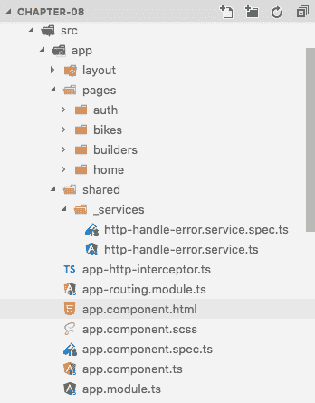

# 第九章：创建服务和用户认证

在本章中，我们有很多工作要做。我们将创建许多新东西，并对一些东西进行重构。这是以一种规律和渐进的方式学习东西的好方法。

我们将深入研究 Angular 的 HTTP 模块的操作和使用，该模块被称为`HttpClient`。

此外，我们将看到如何使用拦截器和处理错误。

Angular 的新版本提供了非常有用的工具来创建现代 Web 应用程序，在本章中，我们将使用其中许多资源。

在本章中，我们将涵盖以下主题：

+   处理模型和类

+   使用新的`HttpModule`和`HttpModuleClient`来处理 XHR 请求

+   处理`HttpErrorHandler`服务

+   如何使用授权头

+   如何使用路由守卫保护应用程序路由

# 准备基线代码

现在，我们需要准备我们的基线代码，这个过程与我们在上一章中所做的非常相似。让我们按照以下步骤进行：

1.  复制`chapter-08`文件夹中的所有内容。

1.  将文件夹重命名为`chapter-09`。

1.  删除`storage-db`文件夹。

现在，让我们对`docker-compose.yml`文件进行一些更改，以使其适应新的数据库和服务器容器。

1.  打开`docker-compose.yml`并用以下代码替换其内容：

```
 version: "3.1"
 services:
     mysql:
       image: mysql:5.7
       container_name: chapter-09-mysql
       working_dir: /application
       volumes:
         - .:/application
         - ./storage-db:/var/lib/mysql
       environment:
         - MYSQL_ROOT_PASSWORD=123456
         - MYSQL_DATABASE=chapter-09
         - MYSQL_USER=chapter-09
         - MYSQL_PASSWORD=123456
       ports:
         - "8083:3306"
     webserver:
       image: nginx:alpine
       container_name: chapter-09-webserver
       working_dir: /application
       volumes:
         - .:/application
         -./phpdocker/nginx/nginx.conf:/etc/nginx/conf.d/default
         .conf
       ports:
         - "8081:80"
     php-fpm:
       build: phpdocker/php-fpm
       container_name: chapter-09-php-fpm
       working_dir: /application
       volumes:
         - ./Server:/application
         - ./phpdocker/php-fpm/php-ini-
           overrides.ini:/etc/php/7.2/fpm/conf.d/99-overrides.ini
```

请注意，我们更改了容器名称、数据库和 MySQL 用户：

+   `container_name: chapter-09-mysql`

+   `container_name: chapter-09-webserver`

+   `container_name: chapter-09-php-fpm`

+   `MYSQL_DATABASE=chapter-09`

+   `MYSQL_USER=chapter-09`

1.  将我们所做的更改添加到 Git 源代码控制中。打开您的终端窗口并输入以下命令：

```
 git add .
 git commit -m "Initial commit chapter 09"
```

# 处理模型和类

由 Angular 开发者社区认为是良好实践（我们认为是必不可少的）的是创建类以将其用作模型。这些也被称为**领域模型**。

我们认为创建类来存储我们的模型是创建大型应用程序甚至小型应用程序的一个非常重要的资源。这有助于保持代码的组织性。

想象一下，如果我们的项目规模更大——如果所有数据都存储在普通对象中，那么新开发人员将很难找到数据存储的位置。

这也是使用类来存储我们的模型信息的一个很好的理由。

# 创建用户类模型

让我们首先创建一个类来存储我们的用户信息。按照惯例，我们将把这个文件命名为`user.ts`：

1.  打开您的终端窗口。

1.  转到`./Client/src/app`并输入以下命令：

```
 ng g class pages/auth/user
```

1.  上一个命令将在`./app/pages/auth/auth.ts`中创建一个新文件。打开此文件并添加以下代码：

```
 export  class  User {
        name?:  string;
        email?:  string;
        password?:  string;
        constructor() {}
 }
```

# 创建构建者类模型

现在，让我们为构建者创建模型，并更好地理解类作为模型的操作。在此之前，我们将观察当我们对`api/builders/1`端点进行 GET 请求时 API 的返回，如下面的屏幕截图所示：

构建者详细 JSON 结果

在先前的屏幕截图中，我们已经在构建者详细请求中包含了自行车信息。让我们看看如何使用`builders`类来实现这一点：

1.  仍然在您的终端中，输入以下命令：

```
 ng g class pages/builders/builder
```

1.  上一个命令将在`./app/pages/builders/builder.ts`中创建一个新文件。打开此文件并添加以下代码：

```
 import { Bike } from  '../bikes/bike';

 export  class  Builder {
        id:  number;
        name:  string;
        description:  string;
        location:  string;
        bike?:  Bike;

        constructor() {}
 }
```

请注意，在先前的代码中，我们添加了一个可选的`bike`属性，并将其类型设置为`Bike`模型。

# 创建 Bike 类模型

现在，是时候创建自行车模型类了，但首先让我们检查一下我们在自行车详细端点`api/bikes/2`上的 JSON 格式，如下面的屏幕截图所示：

自行车详细 JSON 结果

在这里，我们可以注意到`bike-detail`结果指向`garages`、`items`、`builder`、`user`和`ratings`。对于我们正在构建的示例应用程序，我们将只使用构建者和用户模型。不用担心其他的；我们在这里使用的示例足以理解模型领域：

1.  仍然在您的终端中，输入以下命令：

```
 ng g class pages/bikes/bike
```

1.  上一个命令将在`./app/pages/bikes/bike.ts`中创建一个新的文件。打开这个文件并添加以下代码：

```
 import { User } from  './../auth/user';
 import { Builder } from  '../builders/builder';

 export  class  Bike {
        id:  number;
        make:  string;
        model:  string;
        year:  string;
        mods:  string;
        picture:  string;
        user_id:  number;
        builder_id:  number;
        average_rating?: number;
        user?:  User;
        builder?:  Builder;
        items?:  any;
        ratings?:  any;

        constructor() {}
 }
```

请注意，在上一个代码中，我们使用了上一个截图中的所有属性，包括`items`和`ratings`，作为类型为`any`的可选属性，因为我们没有为这些属性创建模型。

# 使用新的 HttpClient 处理 XHR 请求

如今，绝大多数 Web 应用程序都使用`XMLHttpRequest`（XHR）请求，而使用 Angular 制作的应用程序也不例外。为此，我们有`HTTPClient`模块取代了以前版本中的旧 HTTP 模块。

在这个会话中，我们将了解如何在我们的 Angular 服务中使用 XHR 请求。

强烈建议您使用 Angular 服务来处理这种类型的请求，以便组件的代码更有组织性和易于维护。

您可以在[`developer.mozilla.org/en-US/docs/Web/API/XMLHttpRequest`](https://developer.mozilla.org/en-US/docs/Web/API/XMLHttpRequest)上阅读更多关于 XHR 请求的信息。

# 创建认证服务

让我们创建一个将存储我们认证模块所需代码的文件：

1.  仍然在您的终端中，输入以下命令：

```
 ng g service pages/auth/_services/auth
```

上一个命令将在`./app/pages/auth/_services/auth.service.ts`中创建一个新的文件夹和文件。现在，让我们添加一些代码。

1.  打开`./app/pages/auth/_services/auth.service.ts`并在文件顶部添加以下导入：

```
 import { HttpClient, HttpParams, HttpErrorResponse } from  '@angular/common/http';
 import { HttpHeaders } from  '@angular/common/http';
 import { Router } from  '@angular/router';
 import { Observable, throwError } from  'rxjs';
 import { catchError, map, tap } from  'rxjs/operators';

 // App imports
 import { environment } from  './../../../environments/environment';
 import { User } from  './user';
```

现在，我们将使用`HttpHeaders`来设置我们的 XHR 请求的内容类型。

1.  在导入文件后添加以下代码：

```
 // Setup headers
 const httpOptions  = {
```

```
        headers: new  HttpHeaders({
                'Content-Type': 'application/json'
        })
 };
```

上一个代码示例将使用`HttpHeaders`为我们的请求添加一个新的头。

1.  在`AuthService`类内部，添加以下代码：

```
 public  currentUser:  User;
 private  readonly  apiUrl  =  environment.apiUrl;
 private  registerUrl  =  this.apiUrl  +  '/register';
 private  loginUrl  =  this.apiUrl  +  '/login';
```

您一定会问为什么`currentUser`是`public`而其他的是`private`，对吧？

嗯，`currentUser`属性是`public`的，因为我们将在其他文件中访问它，正如我们将在本节后面看到的那样。因此，其他属性将不会在`AuthService`之外可用。

1.  现在，让我们创建我们的`constructor`函数。在`constructor`函数内部，添加以下代码：

```
 private  http:  HttpClient, private  router:  Router
```

1.  `constructor`类将如下代码所示：

```
     constructor(
                private  http:  HttpClient,
                private  router:  Router) {}
```

请注意，我们在这里使用了`HttpClient`和`Router`模块，所以现在是时候编写我们的函数来看看这个模块的实际应用了。

# 创建注册函数

让我们创建`Register`函数。在`constructor`函数之后，添加以下代码：

```
     onRegister(user: User): Observable<User> {
                const request  =  JSON.stringify(
                        { name: user.name, email: user.email, password:
                 user.password }
                );
                return  this.http.post(this.registerUrl, request,
                httpOptions)
                .pipe(
                        map((response:  User) => {
                                // Receive jwt token in the response
                                const  token: string  =
                                response['access_token'];
                                // If we have a token, proceed
                                if (token) {
                                        this.setToken(token);
                                        this.getUser().subscribe();
                                }
                                return  response;
                        }),
                catchError(error  =>  this.handleError(error))
                );
        }
```

请注意，我们在这里使用了**Reactive Extensions Library for JavaScript**（**RxJS**）中包含的`pipe()`、`map()`和`catchError()`函数。

在使用 RxJS 库之前，在 AngularJS 应用程序中使用一个叫做 Lodash 的库来操作结果是非常常见的。

您可以在官方文档链接[`rxjs-dev.firebaseapp.com/api`](https://rxjs-dev.firebaseapp.com/api)中阅读更多关于 RxJS 库的信息。

我们使用`pipe()`函数，它允许我们链接其他函数，当我们使用可观察对象时，这是非常有趣的。在`pipe()`函数内部，这正是我们在`map()`和`catchError()`函数中所做的。

此外，我们还使用了三个名为`setToken()`、`getUser()`和`handleError()`的本地函数，我们稍后会看到它们。

请记住，函数名非常重要。尽量使用像我们在`setToken`和`getUser`中所做的那样自解释的名称。

# 创建登录函数

`Login`函数的结构几乎与`Register`函数相同。不同之处在于我们只是将电子邮件地址和密码发送到服务器。

在`onRegister()`函数之后添加以下代码：

```
     onLogin(user: User): Observable<User> {
                const request  =  JSON.stringify(
                        { email: user.email, password: user.password }
                );
                return  this.http.post(this.registerUrl, request,
                httpOptions)
                .pipe(
                        map((response:  User) => {
                                // Receive jwt token in the response
                                const  token: string  = 
                                response['access_token'];
                                // If we have a token, proceed
                                if (token) {
                                        this.setToken(token);
                                        this.getUser().subscribe();
                                }
                                return  response;
                        }),
                catchError(error  =>  this.handleError(error))
                );
        }
```

请注意，我们使用`setToken()`函数保存用户令牌，并使用`getUser()`函数获取用户的详细信息。我们将在本节后面详细介绍这一点。

# 创建注销函数

对于注销函数，我们将使用不同的方法。我们将使用`tap()`操作符，而不是使用`map()`操作符。

在`onLogin()`函数之后添加以下代码：

```
onLogout():  Observable<User> {
        return  this.http.post(this.apiUrl  +  '/logout',
          httpOptions).pipe(
                tap(
                        () => {
                                localStorage.removeItem('token');
                                this.router.navigate(['/']);
                                }
                        )
                );
}
```

在上述代码中，我们只是从`localStorage`中删除令牌，并将用户重定向到主页。现在，是时候创建处理数据的本地函数了。

# 创建设置令牌和获取令牌函数

我们几乎已经完成了我们的身份验证服务，但我们仍然需要创建一些辅助函数，这些函数将在其他应用程序块中使用。

让我们创建处理用户令牌的函数。重新创建我们在 Laravel 后端中使用的`jwt-auth`库来进行调用，用于验证我们的用户。

在本示例中，我们使用`localStorage`来存储用户的令牌。因此，让我们创建两个非常简单的函数来写入和检索此令牌。

在`logout()`函数之后，添加以下代码块：

```
setToken(token:  string):  void {
        return  localStorage.setItem('token', token );
}

getToken():  string {
        return  localStorage.getItem('token');
}
```

# 创建获取用户函数

现在，我们将看到如何获取已登录用户的信息。请记住，我们的 API 有一个端点，根据认证令牌为我们提供已登录用户的信息。

让我们看看如何以简单的方式做到这一点。

在`getToken()`函数之后添加以下代码：

```
getUser():  Observable<User> {
        return  this.http.get(this.apiUrl  +  '/me').pipe(
                tap(
                        (user: User) => {
                                this.currentUser  =  user;
                        }
                )
        );
}
```

上述代码从 API 接收用户信息，并将其应用于`currentUser`属性。

# 创建 isAuthenticated 函数

现在，我们将创建一个额外的函数。这个函数将帮助我们确定用户是否已登录。

在`getUser()`函数之后添加以下代码：

```
  isAuthenticated():  boolean { // get the token
  const  token:  string  =  this.getToken();
  if (token) {
  return  true;
 }  return  false;
 }
```

现在，我们可以在任何地方使用`AuthService.currentUser`和`AuthService.isAuthenticated`方法来使用这些信息。

# 创建 handleError 函数

您应该已经注意到`login()`和`register()`函数具有指向另一个名为`handleError`的函数的`catchError`函数。此刻，我们将创建这个函数，负责显示我们的请求可能出现的错误。

在**`getUser()`**函数之后添加以下代码：

```
private  handleError(error:  HttpErrorResponse) {
        if (error.error  instanceof  ErrorEvent) {
                // A client-side error.
                console.error('An error occurred:',
                error.error.message);
        } else {
                // The backend error.
                return  throwError(error);
        }
        // return a custom error message
        return  throwError('Ohps something wrong happen here; please try again later.');
}
```

我们将错误消息记录到浏览器控制台，仅供本示例使用。

# 创建自行车服务

现在，我们将创建一个服务来保存所有自行车操作。请记住，对于自行车和建造者，我们的服务必须具有用于列出、详细信息、创建、更新和删除的方法：

1.  仍然在您的终端中，键入以下命令：

```
 ng g service pages/bikes/_services/bike
```

上述命令将在`./app/pages/bikes/_services/bike.service.ts`中创建一个新的文件夹和文件。现在，让我们添加一些代码片段。

1.  打开`./app/pages/bikes/_services/bike.service.ts`并将以下导入添加到文件顶部：

```
 import { Injectable } from  '@angular/core';
 import { HttpClient, HttpParams, HttpErrorResponse } from  '@angular/common/http';
 import { HttpHeaders } from  '@angular/common/http';
 import { Observable, throwError } from  'rxjs';
 import { catchError } from  'rxjs/operators';

 // App import
 import { environment } from  '../../../../environments/environment';
 import { Bike } from  '../bike';
```

1.  在`bikesService`类中，添加以下属性：

```
 private  readonly  apiUrl  =  environment.apiUrl;
 private  bikesUrl  =  this.apiUrl  +  '/bikes';
```

1.  现在，让我们创建我们的`constructor`函数。在`constructor`函数中，添加以下代码：

```
 constructor(private  http:  HttpClient) {}
```

现在，我们准备创建我们的自行车服务的函数。

# 创建 CRUD 函数

正如我们之前提到的，**CRUD**代表`Create`，`Read`，`Update`和`Delete`。我们将一次性添加操作的代码，然后进行必要的注释。

在`constructor()`函数之后添加以下代码块：

```
 /** GET bikes from bikes endpoint */
 getBikes ():  Observable<Bike[]> {
        return  this.http.get<Bike[]>(this.bikesUrl)
        .pipe(
                catchError(error  =>  this.handleError(error))
        );
 }

 /** GET bike detail from bike-detail endpoint */
 getBikeDetail (id:  number):  Observable<Bike[]> {
        return  this.http.get<Bike[]>(this.bikesUrl  +  `/${id}`)
        .pipe(
                catchError(error  =>  this.handleError(error))
        );
 }

 /** POST bike to bikes endpoint */
 addBike (bike:  Bike):  Observable<Bike> {
        return  this.http.post<Bike>(this.bikesUrl, bike)
        .pipe(
                catchError(error  =>  this.handleError(error))
        );
 }

 /** PUT bike to bikes endpoint */
 updateBike (bike:  Bike, id:  number):  Observable<Bike> {
        return  this.http.put<Bike>(this.bikesUrl  +  `/${id}`, bike)
        .pipe(
                catchError(error  =>  this.handleError(error))
        );
 }

 /** DELETE bike bike endpoint */
 deleteBike (id:  number):  Observable<Bike[]> {
        return  this.http.delete<Bike[]>(this.bikesUrl  +  `/${id}`)
        .pipe(
                catchError(error  =>  this.handleError(error))
        );
 }

 /** Vote on bike */
 voteOnBike (vote:  any, bike:  number):  Observable<any> {
        const  rating  =  vote;
        return  this.http.post(this.bikesUrl  +  `/${bike}/ratings`, {rating})
        .pipe(
                catchError(error  =>  this.handleError(error))
        );
 }
```

上述代码与我们在身份验证服务中使用的内容没有特别不同，除了使用模板字符串：

```
this.bikesUrl  +  `/${id}`
this.bikesUrl  +  `/${bike}/ratings`, {rating}
```

这些由反引号（`` ` ``）字符包围，而不是单引号或双引号，以及以美元符号开头的表达式。

# Creating the voteOnBike function

Our service still has one more function, which we will use to send the user's votes for a specific bike. Remember, whenever you need to use the `HTTPClient` module, do this within a service. This is considered good practice in Angular development.

Add the following code right after the `deleteBike()` function:

```
     /** Vote on bike */
        voteOnBike (vote:  number, bike:  number):  Observable<any> {
                const  rating  =  vote;
                return  this.http.post(this.bikesUrl  + 
                `/${bike}/ratings`, {rating})
                .pipe(
                        catchError(error  =>  this.handleError(error))
                );
        }

```

# Creating the handleError function

Now, let's add the error handling for the bikes service. Add the following code, right after the `voteOnBike()` function:

```

     /** Error handler */
        private  handleError(error:  HttpErrorResponse) {
                if (error.error  instanceof  ErrorEvent) {
                        // A client-side error.
                        console.error('An error occurred:', 
                error.error.message);
                } else {
                        // The backend error.
                        return  throwError(error);
                }
                // return a custom error message
                return  throwError('Something bad happened; please try
                again later.');
        }
```

As we can see, the `handleError()` function on the bike service is the same as the authentication service, and will be the same on the builders service. Whenever you need to write the same code more than once, it is highly recommended that you use a service for this, thereby avoiding the repetition of code.

Later, we will create a service to solve this problem, but for now we will create the service of builders.

# Creating the builders service

Now, we will create the `builder` service with the `Create`, `Read`, `Update`, and `Delete` methods:

1.  Still in your Terminal, type the following command:

```

ng g service pages/builders/_services/builder

```

The previous command will create a new folder and file in `./app/pages/builders/_services/builder.service.ts`. Now, let's add some pieces of code.

2.  Open `./app/pages/builders/_services/builder.service.ts` and replace its code with the following block:

```

     import { Injectable } from  '@angular/core';

        import { HttpClient, HttpParams, HttpErrorResponse } from
       '@angular/common/http';
        import { HttpHeaders } from  '@angular/common/http';
        import { Observable, throwError } from  'rxjs';
        import { catchError } from  'rxjs/operators';

        // App import
        import { environment } from
        '../../../../environments/environment';
        import { Builder } from  '../builder';
        @Injectable({
                providedIn: 'root'
        })

        export  class  BuildersService {
                private  readonly  apiUrl  =  environment.apiUrl;
                private  buildersUrl  =  this.apiUrl  +
         '/builders';
                
                constructor(private  http:  HttpClient) { }

                /** GET builders from builders endpoint */
                getBuilders ():  Observable<Builder[]> {
                        return  this.http.get<Builder[]>
      (this.buildersUrl)
                                .pipe(
                                        catchError(error  =>
       this.handleError(error))
                                );
                }

                /** GET builder detail from builder-detail endpoint
        */
                getBuilderDetail (id:  number):
        Observable<Builder[]> {
                return  this.http.get<Builder[]>(this.buildersUrl  +  
        `/${id}`)
                        .pipe(
                                catchError(error  => 
        this.handleError(error))
                        );
                }

                /** POST builder to builders endpoint */
                addBuilder (builder:  Builder):  Observable<Builder> 
         {
                        return  this.http.post<Builder>
           (this.buildersUrl, builder)
                                .pipe(
                                        catchError(error  =>
           this.handleError(error))
                                );
                }

                /** PUT builder to builders endpoint */
                updateBuilder (builder:  Builder, id:  number):
           Observable<Builder> {
                        return  this.http.put<Builder>
           (this.buildersUrl  +  `/${id}`, builder)
                                .pipe(
                                        catchError(error  =>
            this.handleError(error))
                                );
                }

                /** DELETE builder builder endpoint */
                deleteBuilder (id:  number):  Observable<Builder[]>
            {
                        return  this.http.delete<Builder[]>
            (this.buildersUrl  +  `/${id}`)
                                .pipe(
                                        catchError(error  =>
            this.handleError(error))
                                );
                }

                /** Error handler */
                private  handleError(error:  HttpErrorResponse) {
                        if (error.error  instanceof  ErrorEvent) {
                                // A client-side error.
                                console.error('An error occurred:',
             error.error.message);
                        } else {
                                // The backend error.
                                return  throwError(error);
                        }
                        // return a custom error message
                        return  throwError('Something bad happened;
             please try again later.');
                }
        }

```

The previous code is pretty much the same as the bike service, and we can note that the last function is the `handleError()` function, so it is time to learn how to create an error service.

# Dealing with the HttpErrorHandler service

As mentioned previously, it is not a good practice to repeat code in a modern web application, so we can use many resources to avoid this practice. In Angular development, we can use a shared service to handle the application errors in just one place.

# Creating a handler error service

As mentioned earlier in this chapter, let's create our error handler service:

1.  Open your Terminal window inside `./Client/src/app` and type the following command:

```

ng g service pages/shared/_services/httpHandleError

```

The previous command will create a new folder called `_services` inside the `pages/shared` folder for a simple reason: we will share this service between all services that we created inside the `bikes`, `builders`, and `auth` modules. The previous command also created a file called `http-handle-error.service.ts`.

2.  Open `./Client/src/app/shared/_services/http-handle-error.service.ts` and add the following imports:

```

import { HttpErrorResponse } from  '@angular/common/http';
import { Observable, of } from  'rxjs';

```

3.  Let's create an Angular `type` for our error. Add the following code right after the imports:

```

export  type  HandleError  =
        <T> (operation?:  string, result?:  T) => (error:  HttpErrorResponse) =>  Observable<T>;

```

The previous code creates a new `Type` called `HandleError`, and we will use it in the following lines.

Remember that Angular has many types such as array, void, any many more. We already saw this in Chapter 3, *Understanding the Core Concepts of Angular 6*.

4.  Let's add the error function. Add the following block of code right after the `constructor()` function:

```

     /** Pass the service name to map errors */
        createHandleError  = (serviceName  =  '') => <T>
                (operation  =  'operation', result  = {} as  T) =>
        this.handleError(serviceName, operation, result)
        handleError<T> (serviceName  =  '', operation  =
       'operation', result  = {} as  T) {
                return (response:  HttpErrorResponse):
                Observable<T> => {
                        // Optionally send the error to a third part
                      error logging service
                        console.error(response);
                        
                        // Show a simple alert if error
                        const  message  = (response.error
                        instanceof  ErrorEvent) ?
                        response.error.message  :
                        `server returned code ${response.status}
                        with body "${response.error.error}"`;
                        
                        // We are using alert just for example, on
                        real world avoid this pratice
                        alert(message);
                        
                        // Keep running and returning a safe result.
                        return  of( result );
                };
        }
```

The previous code creates a function called `handleError` that receive three parameters—`serviceName`, `operation`, and `result`—and returns an observable type called `HandleError`.

We are also using the basic built-in JavaScript function to show an alert to the user if we have an error, and a `console.log()` function with all the HTTP response.

Nowadays, it is very common to use a payed logging service to monitor web applications and issue silent errors to the user.

Some private services for this, as is the case are Rollbar, TrackJS,  Bugsnag, and Sentry. All of them offer a powerful API for tracking errors in production mode and sent then to a dashboard panel easy to use, without alarm the application users or search for application logs.

We also recommend, for beta and alpha applications, a free account from bugsnag at [`www.bugsnag.com/platforms/javascript/`](https://www.bugsnag.com/platforms/javascript/).

# Importing HttpErrorHandler into app.module.ts

Now, we need to add our service to the central module of our application. Remember that we are using a directory called `shared`; the appropriate place to put our service is directly in the `app.module.ts` file:

1.  Open the `./Client/src/app/app.module.ts` file and add following code right after the `NavComponent` import:

```

import { HttpErrorHandler } from  './shared/_services/http-handle-error.service';

```

2.  Still on `./Client/src/app/app.module.ts`, add the `HttpErrorHandler` property to the `providers` array after the `Title` property:

```

 providers: [
        Title,
        HttpErrorHandler,

```

At the end of this step, we have the following directory structure in our app:

Shared services folder

# Refactoring the builders service

Now that we have created the error handling service, we need to refactor our builders and bikes services to use the new error handling.

Open `./app/pages/builders/_services/builder.service.ts` and replace its content with the following code:

```

     import { Injectable } from  '@angular/core';
        import { HttpClient, HttpParams, HttpErrorResponse } from  
        '@angular/common/http';
        import { HttpHeaders } from  '@angular/common/http';
        import { Observable, throwError } from  'rxjs';
        import { catchError } from  'rxjs/operators';
        // App import
        import { environment } from
        '../../../../environments/environment';
        import { Builder } from  '../builder';
        import { HttpErrorHandler, HandleError } from
        '../../../shared/_services/http-handle-error.service';

        @Injectable({
                providedIn: 'root'
        })

        export  class  BuildersService {
                private  readonly  apiUrl  =  environment.apiUrl;
                private  buildersUrl  =  this.apiUrl  +
                '/builders';
                private  handleError:  HandleError;

                constructor(
                        private  http:  HttpClient,
                        httpErrorHandler:  HttpErrorHandler ) {
                        this.handleError  =
  httpErrorHandler.createHandleError('BuildersService');
                }
                
                /** GET builders from builders endpoint */
                getBuilders ():  Observable<Builder[]> {
                        return  this.http.get<Builder[]>
                (this.buildersUrl)
                                .pipe(
                                         
                catchError(this.handleError('getBuilders', []))
                                );
                }

                /** GET builder detail from builder-detail endpoint
                 */
                getBuilderDetail (id:  number): 
                Observable<Builder[]> {
                        return  this.http.get<Builder[]>
                (this.buildersUrl  +  `/${id}`)
                                .pipe(
                                 
                catchError(this.handleError('getBuilderDetail', []))
                                );
                }

                /** POST builder to builders endpoint */
                addBuilder (builder:  Builder):  Observable<Builder> {
                        return  this.http.post<Builder> 
               (this.buildersUrl, builder)
                                .pipe(
                                       
            catchError(this.handleError('addBuilder', builder))
                                );
                }

                /** PUT builder to builders endpoint */
                updateBuilder (builder:  Builder, id:  number):
                Observable<Builder> {
                        return  this.http.put<Builder>(this.buildersUrl
           +  `/${id}`, builder).pipe(                            
             catchError(this.handleError('updateBuilder', builder))
                                );
                }

                /** DELETE builder builder endpoint */
                deleteBuilder (id:  number):  Observable<Builder[]> {
                        return  this.http.delete<Builder[]>
                (this.buildersUrl  +  `/${id}`)
                                .pipe(
                          catchError(this.handleError('deleteBuilder'))
                                );
                }
        }
```

In the previous code, we replaced our local error function to use the new error service. We added a new property called `handleError` and created a new handler named `BuildersService` with the following code:

```

this.handleError = httpErrorHandler.createHandleError ('BuildersService');

```

Each handler received the `serviceName` as `getBuilders`, `getBuilderDetail`, `addBuilder`, `updateBuilder`, and `deleteBuilder`.

Now, we will do the same for the bikes service.

# Refactoring the bikes service

Now, let's add the new error handling to the bikes service.

Open `./app/pages/bikes/_services/bike.service.ts` and replace its contents with the following code:

```

     import { Injectable } from  '@angular/core';
        import { HttpClient, HttpParams, HttpErrorResponse } from  '@angular/common/http';
        import { HttpHeaders } from  '@angular/common/http';
        import { Observable, throwError } from  'rxjs';
        import { catchError } from  'rxjs/operators';
        // App import
        import { environment } from  '../../../../environments/environment';
        import { Bike } from  '../bike';
        import { HttpErrorHandler, HandleError } from  '../../../shared/_services/http-handle-error.service';

        @Injectable({
                providedIn: 'root'
        })

        export  class  BikesService {
                private  readonly  apiUrl  =  environment.apiUrl;
                private  bikesUrl  =  this.apiUrl  +  '/bikes';
                private  handleError:  HandleError;
                
                constructor(
                        private  http:  HttpClient,
                        httpErrorHandler:  HttpErrorHandler ) {
                        this.handleError  = 
                httpErrorHandler.createHandleError('BikesService');
                }

                /** GET bikes from bikes endpoint */
                getBikes ():  Observable<Bike[]> {
                        return  this.http.get<Bike[]>(this.bikesUrl)
                                .pipe(
                   
                 catchError(this.handleError('getBikes', []))
                                );
                }

                /** GET bike detail from bike-detail endpoint */
                getBikeDetail (id:  number):  Observable<Bike[]> {
                        return  this.http.get<Bike[]>(this.bikesUrl  +  
                `/${id}`)
                                .pipe(
                                         
                catchError(this.handleError('getBikeDetail', []))
                                );
                }

                /** POST bike to bikes endpoint */
                addBike (bike:  Bike):  Observable<Bike> {
                        return  this.http.post<Bike>(this.bikesUrl, 
                bike)
                                .pipe(
                                         
               catchError(this.handleError('addBike', bike))
                                );
                }

                /** PUT bike to bikes endpoint */
                updateBike (bike:  Bike, id:  number):  
                Observable<Bike> {
                        return  this.http.put<Bike>(this.bikesUrl  +  
                `/${id}`, bike)
                                .pipe(
                                        
                catchError(this.handleError('updateBike', bike))
                                );
                }

                /** DELETE bike bike endpoint */
                deleteBike (id:  number):  Observable<Bike[]> {
                        return  this.http.delete<Bike[]>(this.bikesUrl  
                +  `/${id}`)
                                .pipe(
                                        
                catchError(this.handleError('deleteBike'))
                                );
                }
                
                /** Vote on bike */
                voteOnBike (vote:  number, bike:  number):  
                Observable<any> {
                        const  rating  =  vote;
                        return  this.http.post(this.bikesUrl  +  
                `/${bike}/ratings`, {rating})
                                .pipe(
                                        
                 catchError(this.handleError('voteOnBike', []))
                                );
                        }
                }
```

In the previous code, we did the same as we did in the builders service and added each handler with a `serviceName` as `getBikes`, `getBikeDetail`, `addBike`, `updateBike`, and `deleteBike`.

# How to use authorization headers

When we talk about authorization in the header, we are basically talking about making some modifications in the header of the application to send some kind of authorization. In our case, we are specifically talking about an authorization token generated by our API backend.

The best way to do this is by using Angular interceptors. An interceptor, as its name suggests, allows us to simply intercept and configure requests before they are triggered to the server.

This allows us to do a lot of things. An example of this would be to configure a token authentication on any request, or suddenly add custom headers that our application may need, until we handle answers before finishing the request.

When a JWT token is sent to the backend, remember that we are using the `jwt-auth` library on our Laravel API: it is expected to be in the authorization header of the HTTP request.

The most common approach for adding an authorization header to an HTTP request in Angular is creating an interceptor class and having the interceptor make modifications to the requests by attaching a JWT (or other form of access token) as an authorization header with the Bearer scheme, as we explained previously.

# Creating an HTTP interceptor

Let's take a look at how to use Angular's `HttpInterceptor` interface to make authenticated HTTP requests.

When we are handling authentication in an Angular app, most of the time, it's generally best to put everything you need in a dedicated service, like we did previously.

Any authentication service should have a few basic methods for allowing users to log in and log out. It should also include a method for retrieving a JSON Web Token and putting it into `localStorage` (like we did previously), on the client, and a way to determine if the user is authenticated or not, in our case, using the `isAuthenticated()` function on `auth.service.ts`.

So, let's create the HTTP interceptor:

1.  Open your Terminal window at `./Client/src/app` and type the following command:

```

ng g service shared/_services/http-interceptor

```

The previous command will generate the following file: `./Client/src/app/shared/_services/app-http-interceptor.service.ts`. Once again, we are creating a file in our `shared` directory, because we can use this service anywhere we want in our application.

2.  Open `./Client/src/app/shared/_services/app-http-interceptor.service.ts` and add the following code:

```

     import { Injectable, Injector } from  '@angular/core';
        import { HttpEvent, HttpHeaders, HttpInterceptor, HttpHandler, HttpRequest, HttpErrorResponse, HttpResponse } from  '@angular/common/http';
        import { Observable } from  'rxjs';
        import { catchError, map, tap } from  'rxjs/operators';
        import { Router } from  '@angular/router';
        // App import
        import { AuthService } from 
  '../../pages/auth/_services/auth.service';
        
        @Injectable()
        export  class  AppHttpInterceptorService  implements
        HttpInterceptor {
          
        constructor(public  auth:  AuthService, private  router:
        Router ) { }

        intercept(req:  HttpRequest<any>, next:  HttpHandler):
        Observable<HttpEvent<any>> {
                console.log('interceptor running');
                
                // Get the token from auth service.
                const  authToken  =  this.auth.getToken();
                if (authToken) {
                        // Clone the request to add the new header.
                        const  authReq  =  req.clone(
                                { headers:
         req.headers.set('Authorization', `Bearer ${authToken}`)}
                        );                      
                        console.log('interceptor running with new
         headers');
                        
                        // send the newly created request
                        return  next.handle(authReq).pipe(
                                tap((event:  HttpEvent<any>) => {
                                        if (event instanceof
          HttpResponse) {
                                        // Response wiht
          HttpResponse type
                                        console.log('TAP function',
          event);
                                        }
                                }, (err:  any) => {
                                console.log(err);
                                if (err  instanceof 
          HttpErrorResponse) {
                                        if (err.status ===  401) {
                                      
          localStorage.removeItem('token');
                                 
          this.router.navigate(['/']);
                                        }
                                }
                                })
                        );
                } else {
                        console.log('interceptor without changes');
                        return  next.handle(req);
                }
        }
```

3.  In the previous code, first we check if we have a token in `localStorage` with the `this.auth.getToken();` function from `AuthService`. So, if we have a token, we add it as a new header using the following:

```

     const  authReq  =  req.clone(
                { headers: req.headers.set('Authorization', `Bearer ${authToken}`)}
                );
```

4.  If the token is invalid, or if the API returned a 401 error, we send the user to the home route using the following:

```

this.router.navigate(['/']);

```

# Adding AppHttpInterceptorService to the main module

Now that we have our interceptor configured and ready to be used, we need to add it into the main application module:

1.  Open `./Client/src/app/app.module.ts` and add the following import, right after the `HttpErrorHandler` import:

```

import { AppHttpInterceptorService } from  './shared/_services/app-http-interceptor.service';

```

2.  Add the following code, inside the `providers` array, right after the HttpErrorHandler property:

```

{
 {
        provide: HTTP_INTERCEPTORS,
        useClass: AppHttpInterceptorService ,
        multi: true
 }

```

3.  At the end of the previous step, our main application module will include the following code:

```

     import { BrowserModule, Title } from  '@angular/platform-browser';
        import { NgModule } from  '@angular/core';
        import { HttpClientModule, HTTP_INTERCEPTORS } from  '@angular/common/http';
        import { AppRoutingModule } from  './app-routing.module';
        import { ServiceWorkerModule } from  '@angular/service-worker';
        
        // Application modules
        import { AppComponent } from  './app.component';
        import { environment } from  '../environments/environment';
        import { HomeModule } from  './pages/home/home.module';
        import { BikesModule } from  './pages/bikes/bikes.module';
        import { BuildersModule } from  './pages/builders/builders.module';
        import { AuthModule } from  './pages/auth/auth.module';
        import { NavComponent } from  './layout/nav/nav.component';
        import { HttpErrorHandler } from  './shared/_services/http-handle-error.service';
        import { AppHttpInterceptorService } from  './shared/_services/app-http-interceptor.service';
          
        @NgModule({
        declarations: [
                AppComponent,
                NavComponent
        ],
        imports: [
                BrowserModule,
                AppRoutingModule,
                HttpClientModule,
                HomeModule,
                BikesModule,
                BuildersModule,
                AuthModule,
                ServiceWorkerModule.register('/ngsw-worker.js', { enabled: environment.production })
        ],
        providers: [
                Title,
                HttpErrorHandler,
                {
                provide: HTTP_INTERCEPTORS,
                useClass: AppHttpInterceptorService ,
                multi: true
                }
        ],
        bootstrap: [AppComponent]
        })
        export  class  AppModule { }
```

Note that we are separating the Angular imports from application imports. This is a good practice and helps keep your code organized.

Congratulations! Now, we can intercept every request in our application.

# How to protect application routes with route guards

In this section, we will talk about another powerful feature of the Angular framework. We call it guards, or even better, route guards.

It is available in the Angular CLI, as we will see in the following lines of code, but first let's understand a bit more about guards.

Protecting routes is a very common task when building modern web applications, as we want to prevent our users from accessing areas that they're not allowed to access, in our case, the bike details. Remember that we define the access to bike details inside `./Server/app/Http/Controllers/API/BikeController.php`:

```

     /**
        * Protect update and delete methods, only for authenticated
        users.
        *
        * @return  Unauthorized
        */
        public  function  __construct()
        {
                $this->middleware('auth:api')->except(['index']);
        }
```

The previous code says that only the index route should not be protected.

There are four different guard types we can use to protect our routes:

*   `CanActivate`: Choose if a route can be activated
*   `CanActivateChild`: Choose if child routes of a route can be activated
*   `CanDeactivate`: Choose if a route can be deactivated
*   `CanLoad`: Choose if a module can be loaded lazily

In the next example, we will be using the `CanActivate` feature.

# Creating the route guard for bike-detail

Guards are implemented as services that need to be provided, so we typically create a guard class using the Angular CLI:

1.  Open your Terminal window and type the following command:

```

ng g guard pages/auth/_guards/auth

```

The previous code will generate the following file: `./Client/src/app/pages/auth/_guards/auth.guard.ts`.

2.  Open the `./Client/src/app/pages/auth/_guards/auth.guard.ts` file and add the following import after the observable import:

```

import { AuthService } from  '../_services/auth.service';

```

3.  Now, let's add `Router` and `AuthService` inside the `constructor()` function, as shown in the following code:

```

 constructor(
        private  router:  Router,
        private  auth:  AuthService) {}

```

4.  Add the following block of code inside the `canActivate()` function, before the `return` property:

```

 if (this.auth.isAuthenticated()) {
 // logged in so return true
        return  true;
 }
 // not logged in so redirect to login page with the return url
 this.router.navigate(['/login'], { queryParams: { returnUrl: state.url }});
```

In the previous code, we are using the `auth.isAuthenticated()` function from `AuthService` to check if the user is authenticated. This means that, if the user is not authenticated/logged-in, we will redirect them to the login screen.

We are also using the `queryParams` and `returnUrl` functions to send the user back to where they came from.

This means that, if the user clicks to look at the bike's details and they are not logged in to the application, they will be redirected to the login screen. After logging in, the user will be redirected to the details of the bike they intended to look at.

The last step is to add `AuthGuard` to the `bike-detail` route.

5.  Open `./Client/src/app/bikes/bikes-routing.module.ts` and add the following import, right after the routes import:

```

import { AuthGuard } from '../auth/_guards/auth.guard';

```

6.  Now, add the `canActivate` property right after the `bikeDetailComponent`, as in the following code:

```

 {
        path: ':id',
        component: BikeDetailComponent,
        canActivate: [AuthGuard]
 }
```

看！我们的`bike-detail`路由现在受到了保护。

# Summary

现在，我们离看到我们的应用程序处于工作状态非常接近。然而，我们仍然需要执行一些步骤，我们将在接下来的章节中进行讨论。

与此同时，我们已经学习了一些构建现代 Web 应用程序的重要要点，比如创建服务来处理 XHR 请求，学习如何保护我们的路由，以及创建路由拦截器和处理错误的服务。

在下一章中，我们将深入探讨如何在我们的组件中使用我们刚刚创建的服务，并且我们还将为我们的应用程序应用一个视觉层。