# 构建和部署 Angular 测试

在上一章中，您学习了如何安装、定制和扩展 Bootstrap CSS 框架；如何使用`NgBootstrap`组件；以及如何将 Angular 服务与组件和 UI 界面连接起来。现在，让我们看看 Angular 应用程序中的另一个关键点：测试。

测试是检查应用程序代码以查找问题的一种很好的方法。在本章中，您将学习如何测试 Angular 应用程序，如何配置应用程序的 linter（用于 SCSS 和 TSLint 文件）以保持代码一致性，以及如何创建`npm`构建脚本。此外，您还将学习如何为前端应用程序创建 Docker 镜像。

在本章中，我们将涵盖以下内容：

+   设置应用程序 linter

+   了解 Angular 测试

+   编写单元测试和端到端测试

+   应用部署

# 准备基线代码

首先，我们需要准备我们的基线代码，这个过程与之前的章节非常相似。按照以下步骤：

1.  复制所有内容从`chapter-10`文件夹。

1.  重命名文件夹`chapter-11`。

1.  删除`storage-db`文件夹。

现在，让我们对`docker-compose.yml`文件进行一些更改，以适应新的数据库和服务器容器。

1.  打开`docker-compose.yml`并用以下代码替换内容：

```php
 version: "3.1"
 services:
     mysql:
       image: mysql:5.7
       container_name: chapter-11-mysql
       working_dir: /application
       volumes:
         - .:/application
         - ./storage-db:/var/lib/mysql
       environment:
         - MYSQL_ROOT_PASSWORD=123456
         - MYSQL_DATABASE=chapter-11
         - MYSQL_USER=chapter-11
         - MYSQL_PASSWORD=123456
       ports:
         - "8083:3306"
     webserver:
       image: nginx:alpine
       container_name: chapter-11-webserver
       working_dir: /application
       volumes:
         - .:/application
         - ./phpdocker/nginx/nginx.conf:/etc/nginx/conf.d/default.
            conf
       ports:
         - "8081:80"
     php-fpm:
       build: phpdocker/php-fpm
       container_name: chapter-11-php-fpm
       working_dir: /application
       volumes:
         - ./Server:/application
         - ./phpdocker/php-fpm/php-ini-
            overrides.ini:/etc/php/7.2/fpm/conf.d/99-overrides.ini
```

请注意，我们更改了容器名称、数据库和 MySQL 用户：

+   `container_name: chapter-11-mysql`

+   `container_name: chapter-11-webserver`

+   `container_name: chapter-11-php-fpm`

+   `MYSQL_DATABASE=chapter-11`

+   `MYSQL_USER=chapter-11`

1.  使用以下连接字符串更新`.env`文件：

```php
 DB_CONNECTION=mysql
 DB_HOST=mysql
 DB_PORT=3306
 DB_DATABASE=chapter-11
 DB_USERNAME=chapter-11
 DB_PASSWORD=123456
```

1.  添加我们对 Git 源代码所做的更改。打开终端窗口并输入以下命令：

```php
 git add .
 git commit -m "Initial commit chapter 11"
```

# 设置应用程序 linter

我们都希望有一个干净和一致的代码库。无论采用的编程语言是什么，使用 JavaScript 和其他语言的 linter 是非常常见的。但是，当我们讨论 CSS 或 SCSS/LESS 时，这种做法并不常见；我们很少为我们的样式表使用 linter。

**linter**是一种分析代码并报告错误的工具。我们设置规则，当一段代码不符合 linter 配置中定义的规则时，linter 会报告一个错误。当团队在壮大并需要保持代码库一致性时，这个功能非常有用。

如果您没有严格的编码风格规则，代码很快就会变得一团糟。即使您是独自工作，保持代码一致性也是一种良好的实践。

在接下来的章节中，您将学习如何为 SCSS 和 TypeScript 文件应用 linter。

# 为 SCSS 文件添加 stylelint

我们将使用`stylelint`，一个强大的、现代的样式表 linter，支持 CSS、LESS 和 SASS。`stylelint`有很多默认可用的规则，并且非常容易通过我们自己的规则进行扩展，它完全没有意见。另一个优点是，所有规则默认都是禁用的，我们只启用我们想要使用的规则。让我们看看它的实际应用。

在`./Client`文件夹内打开终端窗口，并输入以下命令：

```php
 npm install stylelint --save-dev &&
 npm install stylelint-config-standard --save-dev &&
 npm install stylelint-scss --save-dev
```

前面的命令非常清晰，对吧？我们正在安装默认配置标准插件，以及 SCSS 插件。

您可以在官方文档[`github.com/stylelint/stylelint`](https://github.com/stylelint/stylelint)中了解更多关于`stylelint`的信息。

# 向 package.json 文件添加新的脚本

打开`./Client`文件夹中的`package.json`文件，并在`lint`任务之后添加以下代码：

```php
     "sasslint": "./node_modules/.bin/stylelint \"src/**/*.scss\" --syntax scss || echo \"Ops: Stylelint faild for some file(s).\"",
```

请注意，我们正在使用来自本地`node_modules`文件夹的`Stylelint`。这有助于确保整个团队使用相同的插件版本，避免兼容性问题。

# 添加.stylelintrc 配置

让我们添加我们自己的规则，如下所示：

1.  在`./Client`文件夹内，创建一个名为`.stylelintrc`的新文件。

1.  将以下规则添加到`./Client/.stylelintrc`文件中：

```php
     {
        "extends": ["stylelint-config-standard"],
        "rules": {
                "font-family-name-quotes": "always-where-recommended",
                "function-url-quotes": [
                        "always",
                        {
                        "except": ["empty"]
                        }
                ],
                "selector-attribute-quotes": "always",
                "string-quotes": "double",
                "max-nesting-depth": 3,
                "selector-max-compound-selectors": 3,
                "selector-max-specificity": "0,3,2",
                "declaration-no-important": true,
                "at-rule-no-vendor-prefix": true,
                "media-feature-name-no-vendor-prefix": true,
                "property-no-vendor-prefix": true,
                "selector-no-vendor-prefix": true,
                "value-no-vendor-prefix": true,
                "no-empty-source": null,
                "selector-class-pattern": "[a-z-]+",
                "selector-id-pattern": "[a-z-]+",
                "selector-max-id": 0,
                "selector-no-qualifying-type": true,
                "selector-max-universal": 0,
                "selector-pseudo-element-no-unknown": [
                        true,
                        {
                        "ignorePseudoElements": ["ng-deep"]
                        }
                ],
                "unit-whitelist": ["px", "%", "em", "rem", "vw", "vh", "deg"],
                "max-empty-lines": 2
        }
 }
```

1.  请注意，您可以使用任何您想要的规则；没有对错之分。这只是一种口味和团队偏好的问题。例如，如果您的团队选择只在整个项目中使用`px`像素，那么您的`unit-whitelist`配置将如下所示：

```php
"unit-whitelist": ["px"],
```

1.  让我们进行一个简短的测试，以确保一切进行顺利。在`./Client`中打开终端窗口，并输入以下命令：

```php
npm run sasslint
```

前面的命令报告了我们项目中的 77 个错误。这怎么可能？我们只有几行代码，其中大部分是在`style.scss`文件中的代码缩进。这是预期的，因为这是唯一一个包含 SCSS 的文件。请记住，我们没有在`components.scss`文件中添加任何 SCSS 代码。

# 为 VS Code 安装 Stylelint 插件

如果您使用`vs.code`（我希望您是），请按照以下步骤安装 Stylelint 插件：

1.  在 VS Code 中，打开左侧的`extensions`面板。

1.  在搜索输入框中输入`stylelint`。

1.  选择`stylelint`扩展。

1.  重新启动 VS Code。

# 为新的 linter 设置 VS Code

现在，让我们配置 VS Code 仅使用`stylelint`规则；这将防止我们在 VS Code 集成终端中看到双重错误消息（如果您使用不同的代码编辑器，不用担心）。步骤如下：

1.  在 VS Code 中，导航到顶部菜单中的 Code | Preferences | Settings。

1.  在右侧面板中添加以下代码：

```php
 {
        "css.validate": false,
        "less.validate": false,
        "scss.validate": false
 }
```

要查看插件的效果，请在 VS Code 中打开`./Client/src/style.scss`文件。您将在底部面板中看到以下内容：

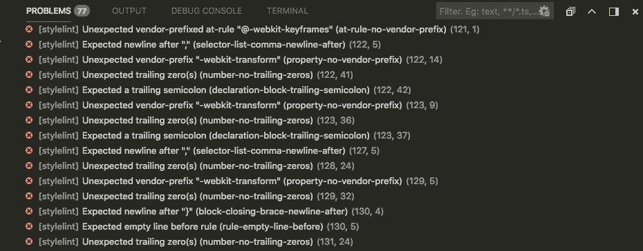stylelint 扩展记录的错误

这些是我们在使用`npm run sass-lint`命令时看到的相同输出错误，但在这里，我们可以导航文件。如果您使用的是 macOS，请使用*Command* +鼠标点击。如果您使用的是 Windows 或 Linux，请使用*Ctrl* +鼠标点击。

# 在 style.scss 上应用 stylelint 规则

验证`style.scss`文件非常简单。让我们读一下错误消息。

从第 9 行到第 44 行，错误是关于缩进空格的，所以让我们去掉空格。

删除所有 Bootstrap 导入的`@import`左侧的空格。

现在，我们有 41 个错误。如果您在 VS Code 中，点击底部面板上的错误链接（在 Problems 选项卡上），并按照以下截图中所示的方式打开文件：

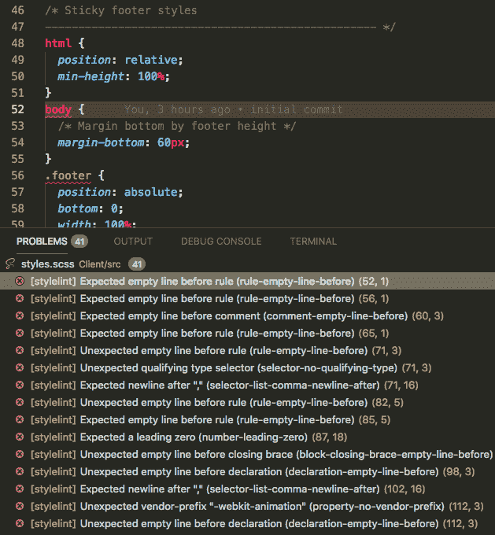VS Code stylelint 插件错误

如果您没有使用 VS Code，在运行`npm run sass-lint`后，终端消息将与以下截图中所示的相同：

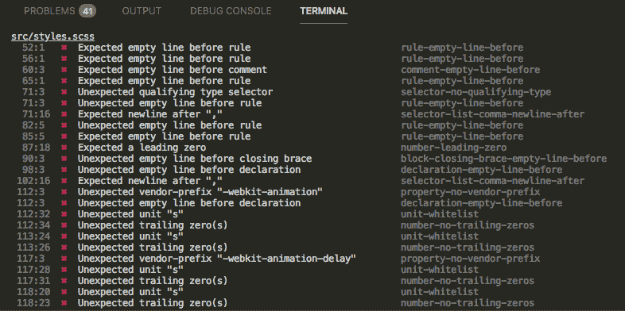VS Code 终端 stylelint 错误

# 修复 SCSS 错误

让我们修复`style.scss`文件中的所有错误消息。

打开`./Client/src/style.scss`，并将`@imports`后的内容替换为以下代码：

```php
 /* Sticky footer styles
 -------------------------------------------------- */
 html {
        position: relative;
        min-height: 100%;
 }

 body {
        /* Margin bottom by footer height */
        margin-bottom: 60px;
 }

 .footer {
        position: absolute;
        bottom: 0;
        width: 100%;
        /* Set the fixed height of the footer here */
        height: 60px;
        line-height: 60px; /* Vertically center the text there */
        background-color: #f5f5f5;
 }

 main {
        padding-top: 3.5em;
 }

 form {
        .form-signin,
        .form-register {
                width: 80%;
                margin: 0 auto;
        }

        .form-group {
                height: 80px;
        }

        .has-error {
                .form-control {
                        border-color: red;
                }

                .form-feedback {
                        color: red;
                        font-size: 0.9rem;
                }
        }
 }

 // Loading spinner
 .spinner {
        width: 40px;
        height: 40px;
        position: relative;
        margin: 100px auto;
 }

 .double-bounce1,
 .double-bounce2 {
        width: 100%;
        height: 100%;
        border-radius: 50%;
        background-color: #333;
        opacity: 0.6;
        position: absolute;
        top: 0;
        left: 0;
        animation: sk-bounce 2 infinite ease-in-out;
 }
 .double-bounce2 {
        animation-delay: -1;
 }
 @keyframes sk-bounce {
        0%,
        100% { transform: scale(0); }
        50% { transform: scale(1); }
 }
 @keyframes sk-bounce {
        0%,
        100% { transform: scale(0); }
        50% { transform: scale(1); }
 }
```

现在没有错误了，我们的项目将会安全并且符合我们的规则。接下来，让我们看看如何在项目中使用内置的 TypeScript linter。

# 将 TSLint-angular 添加到 package.json 文件中

正如我们之前提到的，代码一致性是一个成功项目的关键点。默认情况下，Angular CLI 已经将`tslint`添加到了我们的项目中，我们可以在`package.json`文件和 scripts 标签中看到，使用`ng-lint`命令。

然而，在我们编写本章时，Angular CLI 出现了一个小错误，当我们使用`ng-lint`命令时报告了错误消息两次。为了避免这种情况，让我们在`package.json`文件中的`sass-lint`脚本之后添加以下行：

```php
"tslint": "./node_modules/.bin/tslint --project tsconfig.json || echo \"Ops: TSlint faild for some file(s).\"",
```

在前面的行中，我们使用了`node_modules`文件夹中的本地`tslint`二进制文件。这将帮助我们避免兼容性问题。

由于我们正在一个 Angular 项目中工作，遵循 Angular 官方的样式指南对我们来说将非常有帮助，因为它已经在开发者社区中得到了采纳。

您可以在官方文档中了解有关 Angular 样式指南的更多信息[`angular.io/guide/styleguide`](https://angular.io/guide/styleguide)。

为了帮助我们遵循样式指南，我们将使用一个名为`tslint-angular`的包：

1.  打开终端窗口并输入以下命令：

```php
 npm install tslint-angular --save-dev
```

1.  现在，打开`./Client/src/tslint.json`文件，并用以下代码替换内容：

```php
 {
        "extends": ["../tslint.json", "../node_modules/tslint-angular"],
        "rules": {
                "angular-whitespace": [true, "check-interpolation", "check-semicolon"],
                "no-unused-variable": true,
                "no-unused-css": true,
                "banana-in-box": true,
                "use-view-encapsulation": true,
                "contextual-life-cycle": true,
                "directive-selector": [
                        true,
                        "attribute",
                        "app",
                        "camelCase"
                ],
                "component-selector": [
                        true,
                        "element",
                        "app",
                        "kebab-case"
                ]
        }
 }
```

请注意，在前面的代码中，我们使用`extends`属性来扩展`./Client/tslint.ts`中的默认配置和我们的`node_modules`文件夹中的`tslint-angular`。

您可以在[`github.com/mgechev/codelyzer#recommended-configuration`](https://github.com/mgechev/codelyzer#recommended-configuration)了解更多关于推荐的 Angular 规则的信息。

# 在 package.json 中创建 linter 任务

现在，我们将创建一些任务来运行我们刚刚设置的 linters。

打开`./Client/package.json`并在`sasalint`脚本之前添加以下行：

```php
 "lint:dev": "npm run sasslint && npm run tslint",
```

前面的代码将执行两个命令：一个用于`sasslint`，另一个用于`tslint`。因此，我们已经准备好开始测试我们的应用程序并准备部署。

您可以在官方文档中了解有关 TSlint-angular 的更多信息[`github.com/mgechev/tslint-angular`](https://github.com/mgechev/tslint-angular)。

# 理解 Angular 测试

测试对于任何现代 Web 应用程序都非常重要，Angular 默认包括一些测试工具，如 Jasmine、Karma 和用于单元测试和端到端测试的保护程序。让我们看看每个工具的主要重点，以便了解它们之间的区别：

| 单元测试 | 端到端测试 |
| --- | --- |
| 测试单个组件、服务、管道等。 | 测试整个应用程序 |
| 测试单个特定行为。 | 测试真实世界的情况 |
| 需要模拟后端以进行测试。 | 测试完整应用程序上的重要功能 |
| 测试最详细级别的边缘情况。 | 不测试边缘情况 |

前面的表格很简单，但我们可以看到单元测试和端到端测试之间的所有主要区别，也称为**e2e 测试**。此外，这两个工具都使用 Jasmine 框架，这是一个用于测试 JavaScript 代码的**行为驱动**开发框架。

您可以在[`jasmine.github.io/`](https://jasmine.github.io/)了解更多关于 Jasmine 的信息。

如前所述，当我们使用 Angular CLI 生成应用程序时，这两个工具都已安装。

对于单元测试，我们将使用 Karma 测试运行器；在继续之前，让我们看看`karma.conf.js`以更好地了解我们已经拥有的内容。

打开`./Client`文件夹中的`karma.conf.js`并检查`plugins`标签：

```php
plugins: [
  require('karma-jasmine'),
  require('karma-chrome-launcher'),
  require('karma-jasmine-html-reporter'),
  require('karma-coverage-istanbul-reporter'),
  require('@angular-devkit/build-angular/plugins/karma')
],
```

默认情况下，我们已经安装了一些插件，正如我们在前面的代码块中所看到的。

你可以在官方文档中了解有关 Karma 测试运行器的更多信息[`karma-runner.github.io/2.0/index.html`](https://karma-runner.github.io/2.0/index.html)。

我们还有用于测试的浏览器的配置；默认情况下，我们已经安装了 Chrome：

```php
browsers: ['Chrome'],
```

如果您想要使用不同的浏览器来运行测试怎么办？这很容易做到；只需安装您喜欢的浏览器。Karma 测试运行器支持最流行的浏览器，例如：

+   Safari

+   火狐

+   Internet Explorer

此时，我们已经准备好开始测试我们的应用程序。让我们看看一切是如何运作的。

# 编写单元测试和端到端测试

现在，您将学习如何运行测试，以便更好地了解应用程序发生了什么。

在开始之前，让我们运行命令来执行测试。

打开终端窗口并输入以下命令：

```php
ng test
```

前面的代码将执行所有单元测试；之后，我们将在终端中看到所有错误。

最后一行将与以下行非常相似：

```php
Executed 25 of 25 (18 FAILED) (1.469 secs / 0.924 secs)
```

每个失败的测试都标记为红色，并且后面跟着一个错误消息，正如您在以下摘录中所看到的：

```php
AppHttpInterceptorService should be created FAILED
                Error: StaticInjectorError(DynamicTestModule)[BuildersService -> HttpClient]:
                StaticInjectorError(Platform: core)[BuildersService -> HttpClient]:
                        NullInjectorError: No provider for HttpClient!
```

在终端中输出了如此多行，甚至很难看到已通过的测试。请注意，有七个测试。

在终端中监视测试可能不是最容易的任务，因此我们可以使用以下命令在浏览器中运行测试：

```php
ng test --watch 
```

上述命令将打开 Chrome 并开始测试，但请记住，您必须在计算机上安装 Chrome 浏览器。测试完成后，您现在可以以更有效的方式查看结果：

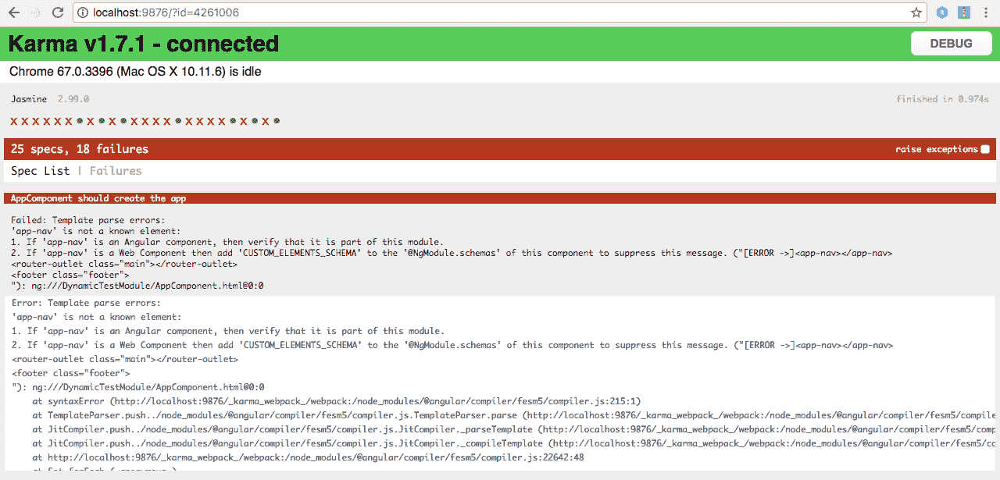

浏览器中的 Karma 运行器

前面的屏幕截图比终端窗口要好得多，对吧？因此，当我们点击*Spec List*选项卡菜单时，我们可以看到以下内容：

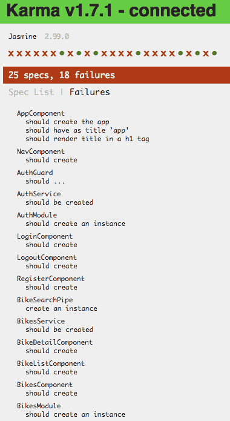测试视图

此外，还可以单击测试套件并检查该套件中的所有相关测试。让我们在下一节中看看这个功能。

# 修复单元测试

现在是时候开始修复所有测试了。让我们看看如何使所有测试都通过：

1.  仍然在 Chrome 浏览器中，单击名为**AppComponent 应该创建应用程序**的第一个测试套件。您将看到以下页面：

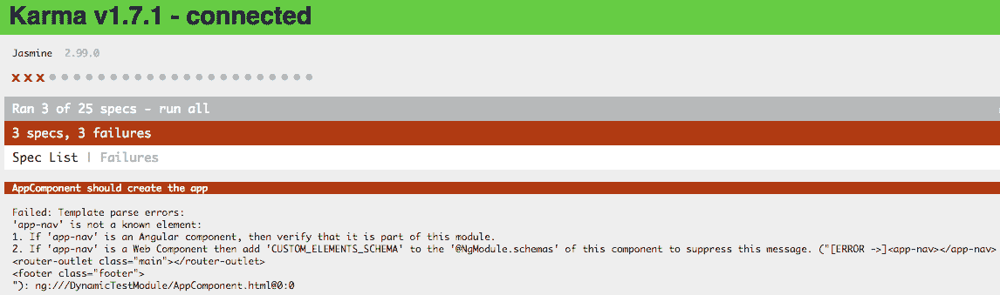

AppComponent

请注意，在上一张屏幕截图中，您只能看到与`AppComponent`相关的测试。

1.  返回到*Spec List*，并点击**AppComponent 应该创建应用程序**；您将看到以下页面：

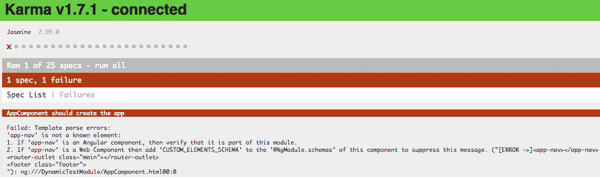

AppComponent 应该创建应用程序

上述错误消息非常清晰：

```php
Failed: Template parse errors: 'app-nav' is not a known element:
1\. If 'app-nav' is an Angular component, then verify that it is part of this module.
2\. If 'app-nav' is a Web Component then add 'CUSTOM_ELEMENTS_SCHEMA' to the '@NgModule.schemas' of this component to suppress this message. ("[ERROR ->]<app-nav></app-nav> <router-outlet class="main"></router-outlet> <footer class="footer">
```

我们有一个模板错误，Angular 建议两种处理方法。第一个建议是检查`app.module.ts`，看看我们是否添加了`app-nav`组件导入。让我们检查一下：

```php
import { NavComponent } from './layout/nav/nav.component';
@NgModule({
declarations: [
        AppComponent,
        NavComponent
],
```

前面的片段取自`app.module.ts`文件，并且我们导入了`NavComponent`。我们的操作是将`@NgModule.schemas`添加到我们的测试规范中：

1.  打开`./Client/src/app/app.component.spec.ts`并用以下代码替换内容：

```php
 import { TestBed, async, ComponentFixture } from '@angular/core/testing';
 import { RouterTestingModule } from '@angular/router/testing';
 import { NO_ERRORS_SCHEMA } from '@angular/core';

 // App imports
 import { AppComponent } from './app.component';

 describe('AppComponent', () => {
        let component: AppComponent;
        let fixture: ComponentFixture<AppComponent>;

        beforeEach(async(() => {
                TestBed.configureTestingModule({
                imports: [
                        RouterTestingModule
                ],
                declarations: [
                        AppComponent
                ],
                schemas: [NO_ERRORS_SCHEMA]
                }).compileComponents();
        }));

        beforeEach(() => {
                fixture = TestBed.createComponent(AppComponent);
                component = fixture.componentInstance;
                fixture.detectChanges();
        });

        it('should create', async(() => {
                expect(component).toBeTruthy();
        }));

        it('should render footer tag', async(() => {
                const compiled = fixture.debugElement.nativeElement;
                expect(compiled.querySelector('footer').textContent).toContain('2018 © All Rights Reserved');
        }));
 });
```

请注意，我们添加了`schemas`标签，以及我们的路由模块，以便测试通过，如下片段所示：

```php
     TestBed.configureTestingModule({
                imports: [
                        RouterTestingModule
                ],
                declarations: [
                        AppComponent
                ],
                schemas: [NO_ERRORS_SCHEMA]
        }).compileComponents();
```

现在，如果我们再次检查浏览器，将会看到以下结果：

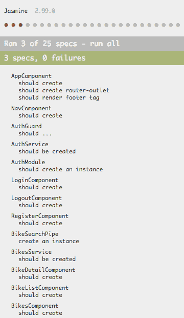

AppComponent 成功

接下来失败的测试是`NavComponent 应该创建`；让我们看看错误消息：

```php
Failed: Template parse errors:
Can't bind to 'routerLink' since it isn't a known property of 'a'.
```

再次，错误消息很明确；我们需要在`nav.component.spec.ts`中添加`RouterTestingModule`。

1.  打开`./Client/src/app/layout/nav.component.spec.ts`并用以下代码替换内容：

```php
 import { async, ComponentFixture, TestBed } from '@angular/core/testing';

 import { NavComponent } from './nav.component';
 import { RouterTestingModule } from '@angular/router/testing';
 import { HttpClientModule } from '@angular/common/http';

 describe('NavComponent', () => {
        let component: NavComponent;
        let fixture: ComponentFixture<NavComponent>;

        beforeEach(async(() => {
                TestBed.configureTestingModule({
                imports: [
                        RouterTestingModule,
                        HttpClientModule
                ],
                declarations: [ NavComponent ]
                })
                .compileComponents();
        }));

        beforeEach(() => {
                fixture = TestBed.createComponent(NavComponent);
                component = fixture.componentInstance;
                fixture.detectChanges();
        });

        it('should create', () => {
                expect(component).toBeTruthy();
        });
 });
```

现在我们可以看到我们的`NavComponent`测试通过了，如下图所示：

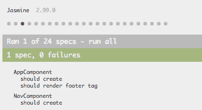

NavComponent 工作

让我们深呼吸，考虑下一行。

以下步骤与我们迄今为止执行的步骤非常相似。我们应该提到，我们在应用程序中使用路由，因此我们需要在所有测试的`TestBed.configureTestingModule`配置中的`imports`标签中添加`RoutingTestingModule`：

```php
imports: [ 
        RouterTestingModule
        ...
], 
```

此外，我们必须将相同的依赖项注入到所有使用服务的组件中（例如`BikeService`和`BuilderService`），就像我们在`components.ts`文件中所做的那样。

在接下来的几节中，我们将替换许多文件的代码。不用担心-当某些内容很重要时，我们会提到它。

# 修复 authGuard 测试

打开`./Client/src/app/pages/auth/_guards/auth.guard.spec.ts`并用以下代码替换内容：

```php
import { RouterTestingModule } from '@angular/router/testing';
import { TestBed, async, inject } from '@angular/core/testing';
import { HttpClient, HttpHandler } from '@angular/common/http';
import { Router } from '@angular/router';

//  App imports
import { AuthGuard } from './auth.guard';
import { AuthService } from '../_services/auth.service';

describe('AuthGuard Tests: ', () => {
const router = {
        navigate: jasmine.createSpy('navigate')
};

beforeEach(async(() => {
        TestBed.configureTestingModule({
        imports: [
                RouterTestingModule.withRoutes([
                {path: 'bikes:id'}
                ])
        ],
        providers: [AuthGuard, AuthService, HttpClient, HttpHandler, { provide: Router, useValue: router } ]
        });
}));

it('should AuthGuartd to be defined', inject([AuthGuard], (guard: AuthGuard) => {
        expect(guard).toBeTruthy();
}));

it('should AuthService to be defined', inject([AuthService], (auth: AuthService) => {
        expect(auth).toBeTruthy();
}));

});
```

请注意，我们正在将`AuthService`作为提供者注入；现在不要担心这个。在本章后面，我们将更详细地解释它。让我们专注于测试。

# 修复 authService 测试

打开`./Client/src/app/pages/auth/_services/auth.service.spec.ts`并用以下代码替换内容：

```php
 import { TestBed, inject } from '@angular/core/testing';
 import { AuthService } from './auth.service';
 import { HttpClientModule } from '@angular/common/http';
 import { RouterTestingModule } from '@angular/router/testing';
 describe('AuthService', () => {
 beforeEach(() => { 
         TestBed.configureTestingModule({ 
         imports: [ 
                 RouterTestingModule, 
                 HttpClientModule 
                 ], 
                 providers: [AuthService]
                 }); 
 }); it('should be created', inject([AuthService], 
 (service: AuthService) => 
  { expect(service).toBeTruthy();
 })); 
});
```

# 修复登录测试

打开`./Client/src/app/pages/auth/login/login.component.spec.ts`并用以下代码替换内容：

```php
import { RouterTestingModule } from '@angular/router/testing';
import { HttpClientModule } from '@angular/common/http';
import { async, ComponentFixture, TestBed } from '@angular/core/testing';
import { FormsModule } from '@angular/forms';

// App imports
import { LoginComponent } from './login.component';
import { AuthService } from '../_services/auth.service';

describe('LoginComponent', () => {
let component: LoginComponent;
let fixture: ComponentFixture<LoginComponent>;

beforeEach(async(() => {
        TestBed.configureTestingModule({
        imports: [
                RouterTestingModule,
                FormsModule,
                HttpClientModule
        ],
        declarations: [ LoginComponent ],
        providers: [AuthService]
        })
        .compileComponents();
}));

beforeEach(() => {
        fixture = TestBed.createComponent(LoginComponent);
        component = fixture.componentInstance;
        fixture.detectChanges();
});

it('should create', () => {
        expect(component).toBeTruthy();
});
});
```

正如我们之前提到的，几乎所有的错误消息都与我们是否包含了依赖项有关，比如服务或直接的 Angular 依赖项。

# 修复 register 测试

打开`./Client/src/app/pages/auth/register/register.component.spec.ts`并用以下代码替换内容：

```php
import { RouterTestingModule } from '@angular/router/testing';
import { async, ComponentFixture, TestBed } from '@angular/core/testing';
import { NO_ERRORS_SCHEMA } from '@angular/core';

// App imports
import { RegisterComponent } from './register.component';
import { HttpClientModule } from '@angular/common/http';
import { FormBuilder, FormsModule, ReactiveFormsModule } from '@angular/forms';

describe('RegisterComponent', () => {
let component: RegisterComponent;
let fixture: ComponentFixture<RegisterComponent>;

beforeEach(async(() => {
        TestBed.configureTestingModule({
        imports: [
                RouterTestingModule,
                HttpClientModule,
                FormsModule,
                ReactiveFormsModule
        ],
        declarations: [ RegisterComponent ],
        schemas: [NO_ERRORS_SCHEMA],
        providers: [FormBuilder]
        })
        .compileComponents();
}));

beforeEach(() => {
        fixture = TestBed.createComponent(RegisterComponent);
        component = fixture.componentInstance;
        fixture.detectChanges();
});

it('should create', () => {
        expect(component).toBeTruthy();
});
});
```

# 修复 bike 服务测试

打开`./Client/src/app/pages/bikes/_services/bikes.service.spec.ts`并用以下代码替换内容：

```php
import { TestBed, inject } from '@angular/core/testing';
import { HttpClientModule } from '@angular/common/http';

// App imports
import { BikesService } from './bikes.service';
import { HttpErrorHandler } from '../../../shared/_services/http-handle-error.service';

describe('BikesService', () => {
beforeEach(() => {
        TestBed.configureTestingModule({
        imports: [
                HttpClientModule
        ],
        providers: [
                BikesService,
                HttpErrorHandler
        ]
        });
});

it('should be created', inject([BikesService], (service: BikesService) => {
        expect(service).toBeTruthy();
}));
});
```

# 修复 bike-detail 测试

打开`./Client/src/app/pages/bikes/bike-detail/bike-detail.component.spec.ts`并用以下代码替换内容：

```php
import { RouterTestingModule } from '@angular/router/testing';
import { async, ComponentFixture, TestBed } from '@angular/core/testing';
import { NO_ERRORS_SCHEMA } from '@angular/core';

// App imports
import { BikeDetailComponent } from './bike-detail.component';
import { FormsModule } from '@angular/forms';
import { HttpClientModule } from '@angular/common/http';
import { HttpErrorHandler } from '../../../shared/_services/http-handle-error.service';

describe('BikeDetailComponent', () => {
let component: BikeDetailComponent;
let fixture: ComponentFixture<BikeDetailComponent>;

beforeEach(async(() => {
        TestBed.configureTestingModule({
        imports: [
                RouterTestingModule,
                FormsModule,
                HttpClientModule
        ],
        declarations: [
                BikeDetailComponent
        ],
        schemas: [NO_ERRORS_SCHEMA],
        providers: [HttpErrorHandler]
        })
        .compileComponents();
}));

beforeEach(() => {
        fixture = TestBed.createComponent(BikeDetailComponent);
        component = fixture.componentInstance;
        fixture.detectChanges();
});

it('should create', () => {
        expect(component).toBeTruthy();
});
});
```

# 修复 bike-list 测试

打开`./Client/src/app/pages/bikes/bike-list/bike-list.component.spec.ts`并用以下代码替换内容：

```php
import { RouterTestingModule } from '@angular/router/testing';
import { HttpClientModule } from '@angular/common/http';
import { async, ComponentFixture, TestBed } from '@angular/core/testing';
import { NO_ERRORS_SCHEMA } from '@angular/core';

// App imports
import { BikeListComponent } from './bike-list.component';
import { BikeSearchPipe } from '../_pipes/bike-search.pipe';
import { HttpErrorHandler } from './../../../shared/_services/http-handle-error.service';

describe('BikeListComponent', () => {
let component: BikeListComponent;
let fixture: ComponentFixture<BikeListComponent>;

beforeEach(async(() => {
        TestBed.configureTestingModule({
        imports: [
                RouterTestingModule,
                HttpClientModule
        ],
        declarations: [
                BikeListComponent,
                BikeSearchPipe
        ],
        schemas: [NO_ERRORS_SCHEMA],
        providers: [HttpErrorHandler]
        })
        .compileComponents();
}));

beforeEach(() => {
        fixture = TestBed.createComponent(BikeListComponent);
        component = fixture.componentInstance;
        fixture.detectChanges();
});

it('should create', () => {
        expect(component).toBeTruthy();
});
});
```

# 修复 bike 测试

打开`./Client/src/app/pages/bikes/bikes.component.spec.ts`并用以下代码替换内容：

```php
import { async, ComponentFixture, TestBed } from '@angular/core/testing';
import { RouterTestingModule } from '@angular/router/testing';

// App imports
import { BikesComponent } from './bikes.component';

describe('BikesComponent', () => {
let component: BikesComponent;
let fixture: ComponentFixture<BikesComponent>;

beforeEach(async(() => {
        TestBed.configureTestingModule({
        imports: [
                RouterTestingModule
        ],
        declarations: [
                BikesComponent
        ]
        })
        .compileComponents();
}));

beforeEach(() => {
        fixture = TestBed.createComponent(BikesComponent);
        component = fixture.componentInstance;
        fixture.detectChanges();
});

it('should create', () => {
        expect(component).toBeTruthy();
});

});
```

# 修复 builders 服务测试

打开`./Client/src/app/pages/builders/_gservices/builders.service.spec.ts`并用以下代码替换内容：

```php
import { HttpClientModule } from '@angular/common/http';
import { TestBed, inject } from '@angular/core/testing';

// App imports
import { BuildersService } from './builders.service';
import { HttpErrorHandler } from './../../../shared/_services/http-handle-error.service';

describe('BuildersService', () => {
beforeEach(() => {
        TestBed.configureTestingModule({
        imports: [
                HttpClientModule
        ],
        providers: [
                BuildersService,
                HttpErrorHandler
        ]
        });
});

it('should be created', inject([BuildersService], (service: BuildersService) => {
        expect(service).toBeTruthy();
}));
});
```

# 修复 builder-detail 测试

打开`./Client/src/app/pages/builders/builder-detail/builder-detail.component.spec.ts`并用以下代码替换内容：

```php
import { RouterTestingModule } from '@angular/router/testing';
import { HttpClientModule } from '@angular/common/http';
import { async, ComponentFixture, TestBed } from '@angular/core/testing';

import { BuilderDetailComponent } from './builder-detail.component';
import { HttpErrorHandler } from '../../../shared/_services/http-handle-error.service';

describe('BuilderDetailComponent', () => {
let component: BuilderDetailComponent;
let fixture: ComponentFixture<BuilderDetailComponent>;

beforeEach(async(() => {
        TestBed.configureTestingModule({
        imports: [
                RouterTestingModule,
                HttpClientModule
        ],
        declarations: [
                BuilderDetailComponent
        ],
        providers: [HttpErrorHandler]
        })
        .compileComponents();
}));

beforeEach(() => {
        fixture = TestBed.createComponent(BuilderDetailComponent);
        component = fixture.componentInstance;
        fixture.detectChanges();
});

it('should create', () => {
        expect(component).toBeTruthy();
});
});
```

# 修复 builder-list 组件

打开`./Client/src/app/pages/builders/builder-list/builder-list.component.spec.ts`并用以下代码替换内容：

```php
import { RouterTestingModule } from '@angular/router/testing';
import { HttpClientModule } from '@angular/common/http';
import { async, ComponentFixture, TestBed } from '@angular/core/testing';

// App imports
import { BuilderListComponent } from './builder-list.component';
import { HttpErrorHandler } from '../../../shared/_services/http-handle-error.service';

describe('BuilderListComponent', () => {
let component: BuilderListComponent;
let fixture: ComponentFixture<BuilderListComponent>;

beforeEach(async(() => {
        TestBed.configureTestingModule({
        imports: [
                RouterTestingModule,
                HttpClientModule
        ],
        declarations: [
                BuilderListComponent
        ],
        providers: [HttpErrorHandler]
        })
        .compileComponents();
}));

beforeEach(() => {
        fixture = TestBed.createComponent(BuilderListComponent);
        component = fixture.componentInstance;
        fixture.detectChanges();
});

it('should create', () => {
        expect(component).toBeTruthy();
});
});
```

# 修复 builders 测试

打开`./Client/src/app/pages/builders/builders.component.spec.ts`并用以下代码替换内容：

```php
import { RouterTestingModule } from '@angular/router/testing';
import { async, ComponentFixture, TestBed } from '@angular/core/testing';

// App imports
import { BuildersComponent } from './builders.component';

describe('BuildersComponent', () => {
let component: BuildersComponent;
let fixture: ComponentFixture<BuildersComponent>;

beforeEach(async(() => {
        TestBed.configureTestingModule({
        imports: [
                RouterTestingModule
        ],
        declarations: [
                BuildersComponent
        ]
        })
        .compileComponents();
}));

beforeEach(() => {
        fixture = TestBed.createComponent(BuildersComponent);
        component = fixture.componentInstance;
        fixture.detectChanges();
});

it('should create', () => {
        expect(component).toBeTruthy();
});

});
```

# 修复 home 测试

打开`./Client/src/app/pages/home/home.component.spec.ts`并用以下代码替换内容：

```php
import { TestBed , async, ComponentFixture } from '@angular/core/testing';
import { RouterTestingModule } from '@angular/router/testing';

// App imports
import { HomeComponent } from './home.component';

describe('HomeComponent', () => {
let component: HomeComponent;
let fixture: ComponentFixture<HomeComponent>;

beforeEach(async(() => {
        TestBed.configureTestingModule({
        imports: [
                RouterTestingModule
        ],
        declarations: [
                HomeComponent
        ]
        }).compileComponents();
}));

beforeEach(() => {
        fixture = TestBed.createComponent(HomeComponent);
        component = fixture.componentInstance;
        fixture.detectChanges();
});

it('should create', () => {
```

```php
        expect(component).toBeTruthy();
});

});
```

# 修复应用程序测试

打开`./Client/src/app/app.component.spec.ts`并用以下代码替换内容：

```php
import { TestBed, async, ComponentFixture } from '@angular/core/testing';
import { RouterTestingModule } from '@angular/router/testing';
import { NO_ERRORS_SCHEMA } from '@angular/core';

// App imports
import { AppComponent } from './app.component';

describe('AppComponent', () => {
let component: AppComponent;
let fixture: ComponentFixture<AppComponent>;

beforeEach(async(() => {
        TestBed.configureTestingModule({
        imports: [
                RouterTestingModule
        ],
        declarations: [
                AppComponent
        ],
        schemas: [NO_ERRORS_SCHEMA]
        }).compileComponents();
}));

beforeEach(() => {
        fixture = TestBed.createComponent(AppComponent);
        component = fixture.componentInstance;
        fixture.detectChanges();
});

it('should create', async(() => {
        expect(component).toBeTruthy();
}));
});
```

# 修复应用拦截器测试

打开`./Client/src/app/shared/_services/app-http-interceptor.service.spec.ts`并用以下代码替换内容：

```php
import { HttpClientModule } from '@angular/common/http';
import { TestBed, inject } from '@angular/core/testing';
import { RouterTestingModule } from '@angular/router/testing';

// App imports
import { AppHttpInterceptorService } from './app-http-interceptor.service';

describe('AppHttpInterceptorService', () => {
beforeEach(() => {
        TestBed.configureTestingModule({
        imports: [
                RouterTestingModule,
                HttpClientModule
        ],
        providers: [AppHttpInterceptorService]
        });
});

it('should be created', inject([AppHttpInterceptorService], (service: AppHttpInterceptorService) => {
        expect(service).toBeTruthy();
}));
});
```

我们现在已经修复了所有的测试，所以让我们再添加一些。

# 添加单元测试

我们已经走了很长的路，现在所有的测试都通过了。所以，是时候创建一些新的测试了。

以下行非常简单，我们在之前的示例中已经遵循了这条路径，所以，如果有新的内容出现，我们会在代码块的末尾提到它。

让我们在应用程序中创建一些单元测试，如下所示：

1.  打开`./Client/src/app/app.component.spec.ts`并添加以下代码：

```php
it('should create router-outlet', async(() => {
 const compiled = fixture.debugElement.nativeElement;
 expect(compiled.querySelector('router-outlet')).toBeDefined();
 }));
```

上述代码将检查`app.component.spec.ts`内的`router-outlet`标签。

1.  打开`./Client/src/app/pages/auth/_guards/auth.guard.spec.ts`并添加以下代码：

```php
it('should AuthService to be defined', inject([AuthService], (auth: AuthService) => {
 expect(auth).toBeTruthy();
 }));
it('should not allow user to pass', inject([AuthGuard],     (guard: AuthGuard) => {
expect(guard.canActivate(new ActivatedRouteSnapshot(), fakeSnapshot)).toBe(false);
}));
```

请注意，我们正在创建两个新的测试：一个用于检查`AuthService`，另一个用于检查`AuthGuard`。

1.  打开`./Client/src/app/pages/bikes/bikes.component.spec.ts`并添加以下代码：

```php
it('should create router-outlet', async(() => {
 const compiled = fixture.debugElement.nativeElement;
 expect(compiled.querySelector('router-outlet')).toBeDefined();
 }));
```

1.  打开`./Client/src/app/pages/builders/builders.component.spec.ts`并添加以下代码：

```php
it('should create router-outlet', async(() => {
 const compiled = fixture.debugElement.nativeElement;
 expect(compiled.querySelector('router-outlet')).toBeDefined();
 }));
```

1.  打开`./Client/src/app/pages/home/home.component.spec.ts`并添加以下代码：

```php
it('should render title tag', async(() => {
 const compiled = fixture.debugElement.nativeElement;
 expect(compiled.querySelector('h1').textContent).toContain('Custom Bikes Garage');
 }));
```

1.  打开`./Client/src/app/app.component.spec.ts`并添加以下代码：

```php
it('should render footer tag', async(() => {
 const compiled = fixture.debugElement.nativeElement;
 expect(compiled.querySelector('footer').textContent).toContain('2018 © All Rights Reserved');
 }));
```

我们现在已经完成了示例单元测试。如果我们使用`ng test`执行测试，我们将在终端中看到以下结果：

```php
Executed 24 of 24 SUCCESS (2.695 secs / 2.398 secs)
```

# 修复 e2e 测试

此时，我们将运行`e2e`测试，正如我们在本章前面提到的。

1.  打开`./Client/e2e/src/app.e2e-spec.ts`并用以下代码替换内容：

```php
 import { AppPage } from './app.po';

 describe('workspace-project App', () => {
        let page: AppPage;

        beforeEach(() => {
                page = new AppPage();
        });

        it('should display app title', () => {
                page.navigateTo();
                expect(page.getParagraphText()).toEqual('Custom Bikes Garage');
        });
 });
```

1.  打开终端窗口并输入以下命令：

```php
 npm run e2e
```

上述命令的结果将类似于以下截图：

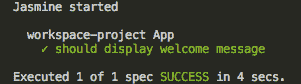e2e 测试结果

记住，你需要在`./Client`文件夹内运行 Angular 命令；否则，你会看到一个错误消息，因为 Angular CLI 需要`angular.json`文件来执行`ng`命令，而这个文件在`./Client`文件夹内。

# 应用程序部署

我们现在已经完成了测试我们的应用程序的所有必要步骤。测试可以非常全面，也可以非常简单；这将取决于您（或您的团队）选择的方法类型。

社区内有很多关于测试的争论。有些人支持面向开发的测试，比如**行为驱动开发**（**BDD**）或**测试驱动开发**（**TDD**）。

再次强调，最重要的是你的代码、结构和测试是一致的，无论采用何种类型的开发。

在最后一节中，我们将看看如何准备我们的应用程序以在生产中发布。从本书的开始，我们一直在使用 Docker，而且我们不会以其他方式结束这本书。

因此，让我们看看如何使用一些 Docker 功能来准备我们的应用程序。

# 为前端应用程序创建 Docker 镜像

正如我们之前讨论过的，我们已经配置了一个 Docker 环境，但它只涵盖了我们的后端应用程序，因为我们使用我们机器上安装的 Angular CLI 来运行我们的前端代码。

在开发环境中，这不是一个问题，因为我们需要我们在主机上编写的代码在我们的 Docker 容器中更新。然而，当我们讨论部署时，我们考虑到我们的代码已经准备好运行，而不需要对文件进行任何更改。

请注意，我们不讨论写入磁盘或数据持久性；我们只会提到应用程序源代码的更改。

考虑到这一点，让我们使用 Docker 的一些功能来创建我们的前端应用程序的镜像。

# 创建一个 Dockerfile

在`./Client`中创建一个名为`Dockerfile`的新文件，并添加以下代码：

```php
FROM nginx:alpine

COPY nginx.conf /etc/nginx/nginx.conf

WORKDIR /usr/share/nginx/html
COPY dist/ .
```

前面的代码非常简单；我们正在使用`nginx:alpine`的镜像，这是一个 Linux 发行版。

您可以在[`hub.docker.com/explore/`](https://hub.docker.com/explore/)了解更多关于官方 Docker 镜像的信息。

此外，我们正在使用一个 nginx 服务器的配置文件。请记住，Angular 应用程序必须由 Web 服务器托管。

# 创建一个 nginx 文件

在`./Client`中，创建一个名为`nginx.conf`的新文件，并添加以下代码：

```php
worker_processes  1;

events {
        worker_connections  1024;
}

http {
        server {
                listen 81;
                server_name  localhost;

                root   /usr/share/nginx/html;
                index  index.html index.htm;
                include /etc/nginx/mime.types;

                gzip on;
                gzip_min_length 1000;
                gzip_proxied expired no-cache no-store private auth;
                gzip_types text/plain text/css application/json application/javascript application/x-javascript text/xml application/xml application/xml+rss text/javascript;

                location / {
                        try_files $uri $uri/ /index.html;
                }
        }
}
```

这里没有什么新鲜的东西 - 这只是一个用于提供 Angular 文件的基本 nginx 配置。

# 创建 npm 构建任务

有了 Dockerfile，我们只需要使用我们可用的`npm`来创建一个构建过程。

打开`./Client/package.json`并添加以下代码：

```php
"build:docker":"npm run lint:dev && npm run test && npm run e2e && npm rum build && npm rum docker:image",
 "docker:image":"./_scripts/create-docker-image.sh"
```

让我们解释一下我们在前面的代码中做了什么：

+   脚本标签：`docker:image`将使用一个 bash 脚本文件来生成一个 Docker 镜像；稍后，我们将详细介绍这个文件。

+   脚本标签：`build:docker`将执行以下步骤：

1.  运行 SASS 监听。

1.  运行`Tslint`。

1.  运行单元测试。

1.  运行端到端测试。

1.  构建应用程序。

1.  创建 Docker 镜像。

在我们继续之前，让我们解释一下为什么我们要使用一个 bash 文件来创建 Docker 镜像。

Bash 文件在许多地方都非常有用，在任何构建过程中都没有什么不同，正如我们将在下面的行中看到的执行一些 Docker 命令。为了避免在`npm`包中增加更多的复杂性，我们将使用`create-docker-image.sh`文件的调用来执行生成我们的镜像所需的命令。

# 创建 bash 脚本

现在，我们将在我们的前端应用程序中添加一个新的目录，用来存储我们的应用程序可能有的所有 bash 脚本文件。在这个例子中，我们只会使用一个，但在真实的应用程序中，这个文件夹可以存储一系列的 bash 文件：

1.  在`./Client`中，创建一个名为`_scripts`的新文件夹。

1.  在`./Client/_scripts`文件夹中，创建一个名为`create-docker-image.sh`的新文件，并添加以下代码：

```php
 #!/bin/bash
 set -e
 # Docker command to create the front-end application
 docker image build -t angular-laravel-book .
```

请注意，您可以为您的应用程序使用任何名称；我们在书的例子中使用`angular-laravel-book`。

# 运行 npm 构建脚本

现在，让我们对`angular.json`文件进行一些小的调整；从`output`标签中删除`Client`文件夹：

```php
"outputPath": "dist",
```

最后一步是运行`build`命令，以测试和创建我们的应用程序。

在`./Client`文件夹内打开终端窗口，然后键入以下命令：

```php
npm run build:docker
```

构建过程将需要几分钟；最后，您将在终端中看到类似以下的消息：

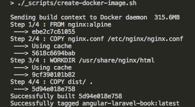端到端测试如果您遇到权限错误，请执行以下操作。在`./Client/_scripts`文件夹内打开终端窗口，然后键入`chmod 755 create-docker-image.sh`。

# 审查 Docker 命令

以下是本章结束时的一些观察：

1.  在书的开头，我们使用 Docker 创建了开发环境。

1.  在本节中，我们为前端应用程序创建了一个图像。

所以，现在是检查我们迄今为止所做的工作的合适时机。

从第四章开始，*构建基线应用程序*，我们一直在使用 Docker 创建后端 API 应用程序。在本章中，我们一直在使用 Docker 将前端 Angular 应用程序转换为 Docker 图像。因此，我们可以假设我们有一个用于后端的图像，其中包含服务器和数据库，另一个用于前端应用程序，也称为客户端应用程序。

这使我们有了分开托管服务的优势，正如我们在本书中早些时候提到的。

请记住，我们的后端 API 完全独立于前端应用程序。

# 生产环境构建应用程序

让我们在我们的`docker-compose.yml`文件中做一些调整，并添加前端应用程序的图像。

打开`./Client/docker-compose.yml`并添加以下代码：

```php
appserver:
  image: 'angular-laravel-book'
  container_name: chapter-11-appserver
  # Build the image if don't exist
  build: './Client'
  ports:
    - 3000:81
```

注意注释行。作为`build`命令的一部分，我们使用了使用`npm run build:docker`命令创建的`angular-laravel-book`图像。因此，如果您忘记运行构建脚本，每次运行`docker-compose up -d`命令时，都会创建图像（如果尚不存在）。

# 测试 Docker 图像

现在是时候检查 Docker 容器和图像了。

注意，下一个命令将删除您机器上所有的 Docker 图像和容器。如果您除了本书示例之外还使用 Docker 进行其他项目，我们建议您只删除与我们示例应用程序相关的图像和容器。

以下命令将删除您机器上的所有图像和容器：

```php
docker system prune -a
```

让我们检查容器，如下所示：

1.  打开终端窗口，然后键入以下命令：

```php
 docker ps -a
```

返回的输出将是一个空表。

1.  仍然在终端中，键入以下命令：

```php
 docker images -a
```

最后，您将再次看到一个空表。

1.  仍然在终端中，键入以下命令：

```php
 docker-compose up -d
```

恭喜！我们已成功构建了所有图像和容器。

1.  重复步骤 1 以列出所有容器。

结果将是以下输出：

| 容器 ID | 图像 | 名称 |
| --- | --- | --- |
| 容器 ID | `chapter-11_php-fpm` | `chapter-11-php-fpm` |
| 容器 ID | `nginx:alpine` | `chapter-11-webserver` |
| 容器 ID | `mysql:5.7` | `chapter-11-mysql` |
| 容器 ID | `angular-laravel-book` | `chapter-11-appserver` |

请注意，容器名称与我们在`docker-compose.yml`文件中选择的名称相同。

以下图像代表了我们的应用程序：

+   **前端**：`angular-laravel-book`

+   **后端**：`phpdockerio/php72-fpm`

我们现在已经准备好在云上部署。

# 总结

我们现在有必要的基线代码来将我们的应用程序投入生产。接下来的步骤是最多样化的，因为许多云服务都能够存储用于生产网站和应用程序的 Docker 图像，通常涉及使用付费服务。但是现在我们有一个使用最新技术（即 Angular 6 和 Laravel 5）构建的强大和可扩展的应用程序。

自从本书开始以来，我们已经走了很长的路，解释和介绍了先进的 Web 开发技术。现在你能够从头开始创建一个应用程序，一直到部署。

确保始终保持自己的最新状态，并牢记一致的代码总是能帮助你。
