# 第一章. Instant Yii 1.1 应用程序开发入门指南

欢迎使用 *Instant Yii 1.1 应用程序开发入门指南*。这本书被设计为一门关于使用 Yii 框架进行网络应用程序开发的速成课程。你将学习如何一步步地利用 Yii 中可用的功能和扩展来构建数据库驱动的网站。

本书包含以下章节：

*那么，什么是 Yii？* - 在本节中，我们将简要回顾 Yii 框架是什么，它是如何开始的，以及当你开始使用它时你将获得的整体好处。

*安装* - 在本节中，我们将安装 Yii 框架，并使用它启动你的第一个 "Hello World" 应用程序。

*入门* - 在自动生成的示例应用程序的基础上，我们将其扩展为一个基本的博客，根据 Yii 网站上的博客示例，同时在这个过程中学习到许多 Yii 中最重要的概念。

*你需要了解的前 5 个特性* - 在本节中，我们将继续实际示例，并探索一些不太明显但真正有助于你开发应用程序的框架细节和技巧。

*人和地方* - 最后，我们将了解在哪里寻求帮助以及如何了解相当庞大的 Yii 社区。

# 那么，什么是 Yii？

Yii 是一个用 PHP 脚本语言构建的网络应用程序开源框架。它于 2008 年晚些时候发布，当时框架市场正热闹非凡，各种框架都在争夺市场份额。尽管它进入游戏较晚，但最终这成为了一个优势，因为它的创造者 Qiang Xue 能够在 Yii 中包含一些现有产品的最佳特性。此外，他在 Prado 框架作为开发者所学的经验帮助他构建了一个更优越的解决方案。如今，Yii 被广泛认为是顶级 PHP 网络框架之一。你可以在 [`www.yiiframework.com`](http://www.yiiframework.com) 上了解更多关于它的信息。

与**内容管理系统**（**CMS**）不同，它不是一个可以通过某种图形用户界面配置的完整网站骨架。你可能听说过 Joomla! 和 Drupal，它们是 PHP 世界中特别著名的 CMS 例子。

相反，Yii 被称为框架，因为它有一套内置的组件。作为网络应用程序开发者，你可以，并且确实应该自由地使用这些组件来节省你的开发时间。

因此，无论你只是需要一个快速的数据库应用程序，一些网络服务，还是被分配去构建一个完整的公司网络门户，Yii 都会为你打下基础，并指引你走上正确的道路。

Yii 最重要的一部分可能是完整的数据库访问层和高度复杂的页面渲染系统。它包含预构建的智能 UI 控件，如数据网格或更简单的日期选择器，可用于网页。此外，对于许多常规编码任务，有一套自动代码生成器。所有这些将在后续章节中解释。

Yii 网站还包含大量用户贡献的扩展，以帮助您快速添加功能。使用 Yii 清晰的组织风格构建的应用程序具有高度的可扩展性和易于维护性。

Yii 强制实施了一种经过验证的应用程序架构，称为 **模型视图控制器**（**MVC**）。这种结构利用面向对象的原则在代码组织中进行清晰的分离。

控制器接收请求，实例化和操作执行实际工作的模型，并最终渲染视图以与最终用户交互。这将在后续章节中更深入地讨论；然而，重要的是要知道，与原始 MVC 定义不同，Yii 中的视图是完全被动的，仅仅是页面模板，而不是完整的类。

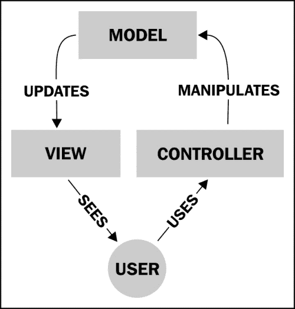

由于在核心层面做出了一些智能的设计选择，Yii 的速度是无与伦比的。大多数框架在加载超过给定请求所需的功能时都会失去性能。加载过多的类可能导致更多的磁盘读取，因为每个类通常存储在自己的文件中，或者至少如果脚本被缓存，则意味着更多的处理。更多的类通常也会导致额外的数据库事务，所有这些操作都是时间和资源消耗的。

Yii 遵循一种懒惰加载的哲学，它力求不在实际需要之前加载类。核心框架也不会向您的数据库添加任何额外的表，并且只发出所需的最小请求来获取给定操作的数据。当您的应用程序准备投入生产时，有许多缓存选项可以将性能提升到下一个层次。为了减少文件 I/O，Yii 内置了封装常见数据缓存解决方案的组件，如 APC、Memcached、XCache 和 EAccelerator。它还有一些组件可以处理计算应用程序数据的缓存，这些数据在适当的时间内保持不变，例如复杂数据库查询的结果。

现在，当一个网站允许用户发布内容时，它面临的风险是其中一些内容可能是恶意代码。最常见的是**SQL 注入**、**跨站脚本攻击**（**XSS**）和**跨站请求伪造**（**CSRF**）攻击。当然，你可以在维基百科上查找这些术语，但你也可以在 Stuttard Pinto 所著的*《Web 应用程序黑客手册》*中查找所有这些类型攻击的详细审查，该书由 Wiley 于 2011 年出版。这些是网站开发者在接受表单数据时必须解决的问题。Yii 内置了处理这些问题的方法。所有通过 Yii API 正确执行的数据库交互都会自动清理用户输入。

对于将在网页上渲染的用户生成内容，Yii 封装了一个名为**HTML Purifier**的项目，它可以应用于任何输入字段，并将过滤掉任何恶意代码，除非在白名单中指定。该项目的首页是[`htmlpurifier.org/`](http://htmlpurifier.org/)，并且它包含在组件中。

为了自动保护所有表单免受 CSRF 攻击，有一个单独的开关配置。当用户加载表单时，它将传递一个随机值给用户。通过传递这个值回来，交互被验证。

所有这些功能将在*顶级功能*部分中稍后解释。

### 小贴士

**下载示例代码**

你可以从[`www.PacktPub.com`](http://www.PacktPub.com)上的账户下载你购买的所有 Packt 书籍的示例代码文件。如果你在其他地方购买了这本书，你可以访问[`www.PacktPub.com/support`](http://www.PacktPub.com/support)并注册，以便直接将文件通过电子邮件发送给你。

# 安装

Yii 是一个 Web 应用程序框架，因此你首先需要的是一个 Web 服务器。Yii 能够在大多数常见的 HTTP 服务器上运行，但对于项目维护者和测试者来说，Linux 上的 Apache 是首选平台。NGINX 也是一个不错的选择，你还可以在 Windows 服务器上使用 Apache 或微软的 IIS 服务器来运行 Yii。

本节中的所有说明都假设是在具有 Apache 服务器的 Linux（或 Mac OS）环境中。

## 服务器要求

由于 Yii 是一个 PHP 框架，Yii 的主要依赖是 PHP（版本 5.1.0 或更高）。Yii 还使用了一些关键的 PHP 扩展。这些包括用于 MySQL 或 PostgreSQL 的 PDO，DOM 扩展，Mcrypt 用于安全，SOAP，以及 GD 用于图像处理。对于数据缓存，它需要 Memcache，APC，XCache 或 EAccellerator 之一，这些都是可选的。Yii 支持以下数据库解决方案：MySQL 4.1 或更高版本，PostgreSQL 7.3 及以上版本，SQLite 2 和 3，Microsoft SQL Server 2000 或更高版本，以及 Oracle。根据项目选择哪种数据库，需要相应的 PHP 扩展。请注意，你不需要数据库就可以在应用程序中使用 Yii，然而，你肯定会失去框架中内置的许多数据持久性解决方案。

## 第 1 步 – 设置 Yii

让我们从假设你已经拥有以下东西开始：

+   一个运行并配置好的 Web 服务器，例如 Apache

+   一个作为网站 webroot 发布的文件夹，可以通过浏览器访问

因此，你现在需要设置的唯一事情就是在这个 webroot 文件夹中设置一个真实的网站。正确完成这两件事显然超出了本书的范围。

你获取 Yii 框架包的地方是官方网站的下载部分（直接网址是 [`www.yiiframework.com/download`](http://www.yiiframework.com/download)）。对于应用程序开发，你需要一个打包在存档文件中的稳定版本。除非你想修改框架本身，否则你不需要从 GitHub 或 Subversion 仓库获取 Yii 的源代码。

Yii 的理念是框架本身位于你的应用程序目录之外，最好是在只有 root 用户访问权限的系统目录中。框架的文件夹应该配置为只有你的 Web 服务器才有权读取其中的文件。这项政策是为了防止通过 Web 服务器请求对框架文件的未授权直接访问。当你创建应用程序时，你也会配置其实际路径到 Yii 目录。

简而言之，对于以用户 `apache` 运行的 Web 服务器运行的 Linux 系统，你可以通过以下命令行安装 Yii 版本 1.1.13\. e9e4a0：

```php
# cd /var/local/
# wget http://yii.googlecode.com/files/yii-1.1.13.e9e4a0.tar.gz
# tar –zxf yii-1.1.13.e9e4a0.tar.gz && rm yii-1.1.13.e9e4a0.tar.gz
# chown -R apache yii-1.1.13.e9e4a0

```

### 注意

注意，在像 `/var/local` 这样的系统文件夹中工作，你需要是 root 用户。当然，你可以使用你喜欢的任何目录。

在生成的 `yii` 目录中，你会找到以下命名的三个文件夹：

+   `demos`

+   `framework`

+   `requirements`

`requirements` 文件夹是一个辅助工具，用于对你的服务器设置进行自我测试。你可以将其复制到你的 webroot 文件夹，并通过 Web 浏览器访问 `http://your.website.address/requirements/index.php` 来查看你的系统是否符合框架的要求。

`framework` 文件夹是 Yii 框架本身。你实际上只需要它的内容来在你的应用程序中使用 Yii。从现在开始，我们将把 Yii 安装的路径称为 `path-to-yii`。

## 第 2 步 – 创建你的项目

一旦您在您的机器上安装了框架，就有一个名为`yiic`的命令行工具，它可以构建骨架应用程序，以及其他许多事情。打开控制台，导航到您的 webroot，然后运行自动生成命令：

```php
$ path-to-yii/framework/yiic webapp sitename

```

`sitename`令牌是您新应用程序的路径。由于您已经在`webroot`文件夹中，您只需要提供一个子文件夹的名称，而不是它的完整路径。

这个 shell 脚本旨在在 Linux 上使用，所以如果您在 Windows 上，有一个`yiic.bat`文件。这两个脚本本质上都是在您的系统上使用 PHP 命令行可执行文件运行`framework/yiic.php`，所以另一种方法是按照以下方式运行：

```php
$ php path-to-yii/framework/yiic.php webapp sitename

```

在您访问您的网站之前，您必须检查`index.php`文件，以确保它指向实际的 Yii 安装文件夹。

确保在`sitename`/`index.php`中有一行看起来像这样：

```php
$yii='path-to-yii/framework/yii.php';

```

您现在可以访问您的网站，并看到一个包含主页、关于、联系和登录页面的基本 hello world 网站。由于应用程序是在您的`webroot`文件夹的子文件夹中创建的，因此 URL 应该是这样的：`http://your.website.address/sitename`。

## 就这些了!!

在`sitename`文件夹下，您的应用程序文件夹将包含以下结构：

+   `assets`: 包含发布的资源文件

+   `css`: 包含 CSS 文件

+   `images`: 包含图像文件

+   `themes`: 包含应用程序主题

+   `protected`: 包含受保护的应用程序文件

受保护的文件夹包含以下目录：

+   `commands`: 包含自定义 yiic 命令

+   `components`: 包含可重用的用户组件

+   `config`: 包含配置文件

+   `controllers`: 包含控制器类文件

+   `data`: 包含示例数据库

+   `extensions`: 包含第三方扩展

+   `messages`: 包含翻译后的消息

+   `models`: 包含模型类文件

+   `runtime`: 包含临时生成的文件

+   `tests`: 包含测试脚本

+   `views`: 包含控制器视图和布局文件

`views`文件夹包含以下目录：

+   `layouts`: 包含布局视图文件

+   `site`: 包含网站控制器的视图文件

# 快速入门 – 创建应用程序

Yii 网站在其精彩的文档中包含了一个关于如何构建基本博客应用的教程，这是框架源代码中包含的演示之一。它在**教程** | **Yii 博客教程**部分。直接链接是[`www.yiiframework.com/doc/blog/`](http://www.yiiframework.com/doc/blog/)。

让我们使用这个例子来解释基于 Yii 的应用程序方面。当然，我们不会在这里重复完整的示例，因为您可以在网站上完整地阅读它。

## 第 1 步 – 规划工作流程

当你编写一个真实的应用程序时，你应该从关于应用程序功能的要求开始。对于博客示例，这在教程的开始部分的“入门：需求分析”部分有描述。直接链接是[`www.yiiframework.com/doc/blog/1.1/en/start.requirements`](http://www.yiiframework.com/doc/blog/1.1/en/start.requirements)。

在你编写了所有期望的功能之后，你基本上开始逐个实现它们。当然，在严肃的软件开发中有很多陷阱，但总体上是相同的。

博客示例是一个数据库驱动应用程序，因此我们需要事先准备一个数据库模式。以下是博客演示中他们提出的方案：

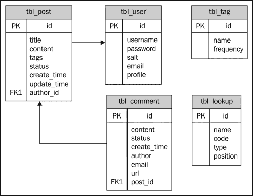

这张图片是直接从 example demo 博客中复制的。请注意，这里缺少了两个链接。帖子表有一个`tags`字段，它是存储原始标签的区域，而不是`tags`表的键外键。此外，`comment`中的`author`字段实际上应该是`user`表的键外键。无论如何，我们不会涵盖实际的数据库生成，但我建议你自己动手做。Yii 网站上的博客教程为完全的新手提供了所有相关说明。

在本节中接下来，我们将看到使用 Yii 获取一个能够操作我们数据库的工作用户界面的简单性。

## 步骤 2 – 从你的应用程序链接到数据库

一旦你在某个数据库管理系统（如 MySQL 或 SQLite）中设计和物理创建数据库，你就可以配置你的应用程序以指向这个数据库了。由`./yiic webapp`命令生成的骨架应用程序需要配置以指向这个数据库。为此，你需要在位于`protected/config/main.php`的根`config`文件中设置一个`db`组件。这里有一个包含组件数组的部分。以下是在同一服务器上 MySQL 数据库的设置。当你生成应用程序时，你将找到已经存在的注释模板：

```php
/protected/config/main.php

'components'=>array(
    /* other components */
    'db'=>array(
        'connectionString' => 'mysql:host=localhost;dbname=DB_NAME,
        'emulatePrepare' => true,
        'username' => YOUR_USERNAME,
        'password' => YOUR_PASSWORD,
        'charset' => 'utf8',
    ),
    /* other components */
),
```

这是一个默认组件，包含`CDbConnection`类，并且将被我们稍后创建的所有 ActiveRecord 对象使用。与所有应用程序组件一样，所有配置参数都对应于组件类的公共属性；因此，你可以查看 API 文档以获取详细信息。

顺便说一句，你真的需要更多地了解主要的应用程序配置。在官方网站的*Yii definitive guide*中阅读有关内容，在**基础** | **应用程序** | **应用程序配置**部分。直接链接是[`www.yiiframework.com/doc/guide/1.1/en/basics.application#application-configuration`](http://www.yiiframework.com/doc/guide/1.1/en/basics.application#application-configuration)。

只需记住，所有配置参数都是 `CWebApplication` 对象的属性，您可以在 API 文档中了解相关信息；直接链接是 [`www.yiiframework.com/doc/api/1.1/CWebApplication`](http://www.yiiframework.com/doc/api/1.1/CWebApplication)。

## 第 3 步 – 自动生成代码

现在我们已经将应用链接到了一个完全构建的数据库，我们可以开始使用 Yii 的最大特点之一：自动代码生成。要开始，需要两种类型的代码生成：

+   根据您数据库中的表生成一个模型类

+   运行 CRUD 生成器，它接受一个模型并设置相应的控制器以及一组用于基本列表、创建、查看、更新和从表中删除的视图

### 控制台方式

自动代码生成有两种方法。最初，只有 `yiic` 工具被用来创建骨架应用。对于自动代码生成功能，您将使用 `yiic shell index.php` 命令，这将弹出一个命令行界面，在那里您可以运行用于建模和脚手架的子命令。

```php
$ /usr/local/yii/framework/yiic shell index.php
Yii Interactive Tool v1.1 (based on Yiiv1.1.13)
Please type 'help' for help. Type 'exit' to quit.
>> model Post tbl_post
 generate models/Post.php
 unchanged fixtures/tbl_post.php
 generate unit/PostTest.php
The following model classes are successfully generated:
 Post
If you have a 'db' database connection, you can test these models now with:
 $model=Post::model()->find();
 print_r($model);

>> crud Post
 generate PostController.php
 generate PostTest.php
mkdir /var/www/app/protected/views/post
 generate create.php
 generate update.php
 generate index.php
 generate view.php

```

如您所见，这是一个快速简单的方法来执行 `model` 和 `crud` 操作。`model` 命令只生成两个文件：

+   对于您的实际模型类

+   对于单元测试

`crud` 命令创建您的控制器和视图文件。

### Gii

对于一些人来说，控制台工具可能是首选选项，但对于喜欢使用图形工具的开发者，现在有一个解决方案，称为 **Gii**。

要使用 Gii，需要在主 `config` 文件中将其开启：`protected/config/main.php`。您会找到相应的模板，但默认情况下它是被注释掉的。只需取消注释，设置您的密码，并决定允许哪些主机访问。配置看起来是这样的：

```php
'gii'=>array(
    'class'=>'system.gii.GiiModule',
    'password'=>'giiPassword',

    // If removed, Gii defaults to localhost only.
    // Edit carefully to taste.
    'ipFilters'=>array('127.0.0.1','::1'),

    // For development purposes,
    // a wildcard will allow access from anywhere.
    // 'ipFilters'=>array('*'),
),
```

一旦 Gii 配置完成，您可以通过在应用 URL 后面加上 `?r=gii` 来访问它，例如，`http://www.example.com/index.php?r=gii`。它将开始提示输入在 `config` 文件中设置的密码。输入后，它将显示生成器的列表。如果数据库未在 `config` 文件中设置，当您尝试使用它时，您将看到一个错误。

Gii 中最基本的生成器是模型生成器。它会要求您从数据库中选择一个表名以及用于 `PHP` 类的名称。

注意，我们可以指定一个表名前缀，当生成模型类名时，这个前缀将被忽略。例如，博客演示的用户表是`tbl_user`，其中`tbl_`是一个前缀。这个特性存在是为了支持某些设置，尤其是在共享主机环境中非常常见，在这种环境中，单个数据库包含几个不同应用的表。在这样的环境中，通常会在表名前加上前缀以避免命名冲突，并便于找到与特定应用相关的表。因此，这些前缀在应用程序本身中没有任何意义，Gii 提供了一种自动忽略它们的方法。模型类名是通过明显的规则从剩余的表名构建的：

+   下划线被转换为大写字母

+   类名首字母也被转换为大写

将你的应用程序启动的第一步是为数据库中所有实体表生成模型。像桥接表这样的东西不需要模型，因为它们只是将两个实体相互关联，而不是作为一个独立的事物。桥接表用于在模型之间生成关系，这些关系在模型类的`relations`方法中表达。

对于博客演示，基本模型有用户（User）、帖子（Post）、评论（Comment）、标签（Tag）和查找（Lookup）。

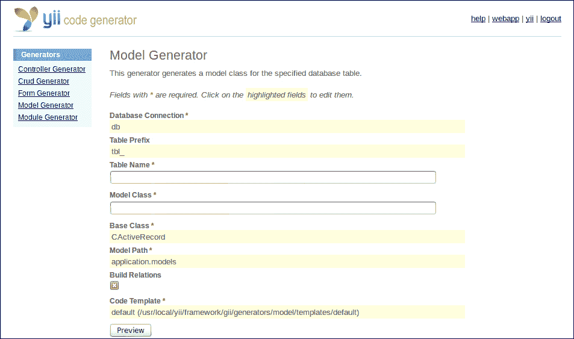

框架搭建的第二阶段是为这些模型中的每一个生成 CRUD 代码。这将创建一个控制器和一系列视图模板。控制器（例如，`PostController`）将处理与给定模型相关的路由到操作。视图文件代表列出和查看实体所需的一切，以及创建和更新单个实体所需的表单。

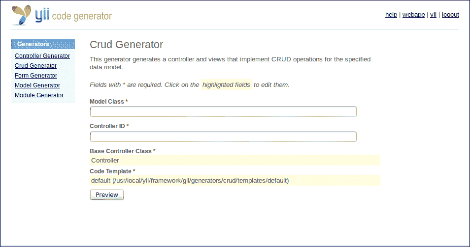

对于所有生成器，你将从一个表单开始，为**模型生成器**页面填写**表名**字段，或者为**CRUD 生成器**页面填写**模型类**字段。之后，你必须点击**预览**按钮，这将显示将要创建的文件。最后，你必须点击**生成**按钮以执行操作。

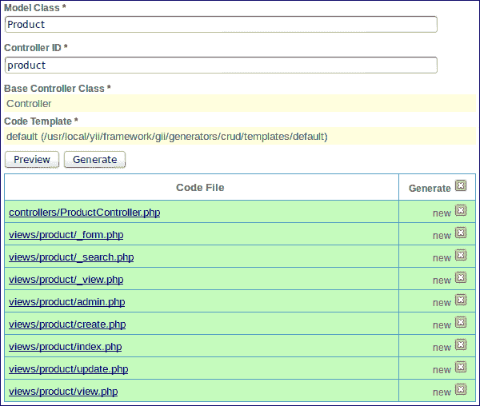

## 第 4 步 – 查看 Yii 的组件

既然你已经看到了这里创建的基本内容，让我们更深入地看看这些组件。

### 模型

Yii 的模型只是扩展`CModel`基类的 PHP 类。框架已经包含了`CModel`的两个辅助子类：`CFormModel`和`CActiveRecord`。

虽然`CFormModel`只是用户提交的 HTML 表单概念的语义包装，但`CActiveRecord`是一个 ActiveRecord 设计模式的完整实现。

这是一种在数据库驱动应用程序中广为人知且常用的模式。Yii 在这个领域从 Ruby 的 Rails 框架中获得了许多灵感，Rails 框架被认为是最优秀的 ActiveRecord 实现之一。与任何其他设计模式（甚至是 MVC）一样，您可以在 Ralph Johnson 所著的《设计模式：可复用面向对象软件元素》这本书中了解它。

为了简化，ActiveRecord 是一种面向对象的模式，它要求数据库表与类之间进行一对一映射（例如，`tbl_post` 到 `Post` 模型，`tbl_comment` 到 `Comment` 模型）。在其原始定义中，ActiveRecord 并不是一对一映射（一个类可以使用任意数量的表来存储数据），但 Yii 中的 ActiveRecords 以这种方式工作。

模型类的实例将具有与表中的字段相对应的属性，以及与数据库事务相对应的方法，例如保存、删除和不同的查找选项：

```php
$post->title = 'Post Title';
$post->body = 'Post body content';
$post->save();

```

几乎我们所有的模型都将继承自 `CActiveRecord` 类。

在 Yii 博客演示中，如果我们查看 `Post` 模型，我们会看到它包含了基于数据库约束的每个字段的规则。它知道哪些字段是整数或基于文本的，以及长度和空值要求。这些控制着 Yii 在尝试保存记录时将执行的验证。

```php
/* protected/models/Post.php */
public function rules()
{
    // NOTE: you should only define rules for those 
    //attributes that will receive user inputs.
    return array(
        array('title, content, status', 'required'),
        array('status', 'in', 'range'=>array(1,2,3)),
        array('title', 'length', 'max'=>128),
        array('tags', 'match', 
            'pattern'=>'/^[\w\s,]+$/', 
            'message'=>'Tags can only contain word characters.'),
        array('tags', 'normalizeTags'),
        array('title, status', 'safe', 'on'=>'search'),
    );
}
```

基于数据库表，Yii 还会设置任何它发现的任何外键关系。对于博客演示，一篇文章将有一个属于它的单个作者以及属于 `Post` 的多个评论。正如我们可以在以下示例中看到的那样，这些关系可能相当复杂。只需查看 `CActiveRecord.relations` 方法的官方文档（[`www.yiiframework.com/doc/api/1.1/CActiveRecord#relations-detail`](http://www.yiiframework.com/doc/api/1.1/CActiveRecord#relations-detail)）。评论已经被过滤，只显示已批准的评论，并检索具有特定排序顺序的评论。Yii 还允许统计关系，因此您可以获取相关项的计数，例如所有已批准评论的计数：

```php
public function relations()
{
    // NOTE: you may need to adjust the relation name and the related
    // class name for the relations automatically generated below.
    return array(
        'author' => array(self::BELONGS_TO, 'User', 'author_id'),
        'comments' => array(self::HAS_MANY, 'Comment', 'post_id',
            'condition'=>'comments.status='.Comment::STATUS_APPROVED,
            'order'=>'comments.create_timeDESC'),
        'commentCount' => array(self::STAT, 'Comment', 'post_id',
            'condition'=>'status='.Comment::STATUS_APPROVED),
    );
}
```

除了规则和关系之外，模型默认有一个用于属性的用户友好标签部分，这些标签默认比实际表名稍微干净一些，但可以根据您的应用程序需求进行更改：

```php
public function attributeLabels()
{
    return array(
        'id' => 'Id',
        'title' => 'Title',
        'content' => 'Content',
        'tags' => 'Tags',
        'status' => 'Status',
        'create_time' => 'Create Time',
        'update_time' => 'Update Time',
        'author_id' => 'Author',
    );
}
```

此外，还有一个搜索方法，它旨在用于列表页面。

请注意，此方法对模型的功能本身并不重要；它只是一个辅助方法。它返回一个 `CDataProvider` 实例，该实例被 Yii 中几乎所有的列表和表格小部件使用；因此，框架的作者决定将此方法包含在自动生成的模型中，以进一步减少编写脚手架代码的需求。开发者可以选择向小部件提供手工制作的数据提供者，或者使用其他辅助方法。

Yii 提供了用于显示和分页记录的控件，例如 `CGridView` 或 `CListView`。这些控件将使用搜索方法来创建用于此交互的数据提供者对象。同样，您可以使用此方法自定义检索记录的方式的行为。`Post` 模型已被设置为添加一些默认排序选项并忽略一些字段：

```php
public function search()
{
    $criteria=new CDbCriteria;
    $criteria->compare('title',$this->title,true);
    $criteria->compare('status',$this->status);
    return new CActiveDataProvider('Post', array(
        'criteria'=>$criteria,
        'sort'=>array(
            'defaultOrder'=>'status, update_time DESC',
        ),
    ));
}
```

### 控制器

控制器的任务是处理传入的请求，识别适当的行为方法，并最终渲染视图以返回给用户。当请求到达 Yii 时，URL 决定了哪个控制器和动作被调用。所有请求首先由您网站根目录下的 `index.php` 文件处理。该文件通过实例化 Yii 并引用您的配置文件来启动加载您的应用程序。然后，它查看 URL 的其余部分以确定哪个控制器应该运行。有一个名为 `r` 的路由参数被检查。适当的用法是 `index.php?r=controller/action`。

默认情况下，由 `./yiic webapp` 控制台工具生成的应用程序有一个 `SiteController` 控制器，该控制器处理标准动作，例如展示默认主页或处理登录/注销动作。当您不带任何 URL 参数启动应用程序时，将调用此控制器。

如果我们进一步阐述，那么实际上发生的情况是，当 Yii 收到未指定控制器的请求时，它将把这个请求转发到在 `defaultController` 配置参数中设置名称的控制器（见 [`www.yiiframework.com/doc/api/1.1/CWebApplication#defaultController-detail`](http://www.yiiframework.com/doc/api/1.1/CWebApplication#defaultController-detail)），其默认值是 `site`。

如您可能已经猜到的，如果请求没有指定动作，则将调用 `defaultAction`。当然，它不是定义为全局配置参数，而是在每个控制器中作为其类属性单独定义的（见 [`www.yiiframework.com/doc/api/1.1/CController#defaultAction-detail`](http://www.yiiframework.com/doc/api/1.1/CController#defaultAction-detail)）。`defaultAction` 属性的默认值是 `index`。

因此，由于在未提供 `r` 参数的情况下，site/index 是默认行为，所以访问 `www.yoursite.com` 等同于访问 `www.yoursite.com/index.php?r=site/index`。默认情况下，对于 `Post` 这样的模型，您可能会看到这样的路由：

+   `www.yoursite.com/index.php?r=post/index`

+   `www.yoursite.com/index.php?r=post/create`

…等等。

您可以看到，实际的博客演示并不遵循这个模式。相反，它的路径看起来像 `www.yoursite.com/posts` 和 `www.yoursite.com/post/create`。最终，您可以使用 Yii 创建任何类型的自定义 URL。在本书的后续部分，我们将探讨更改 URL 观看方式的方法，这些方法更干净，但仍然指向相同的内容。

如果你查看一下`protected/controllers/`中的一个控制器文件，你会看到它包含一些看起来像这样的方法：`actionCreate`、`actionIndex`、`actionUpdate`等等。这些名称的后半部分对应于 URL 中将要出现的操作。例如，在`PostController`中，`actionCreate`对应于 URL `index.php?r=post/create`。视图和更新操作期望一个额外的参数，用于指定实体的 ID。默认情况下，这个 URL 看起来像这样：`index.php?r=post/view&id=1`，其中`1`是单个帖子的主键 ID。

所有这些都意味着`actionLogin`、`actionLogout`以及 Gii 在`SiteController`为你生成的其他操作只是示例脚手架，如果你需要的话，你可以创建一个完全不同的控制器和操作结构。

为了更好地理解这些操作是如何工作的，让我们详细检查几个操作。对于大多数实体来说，最简单的操作之一是查看单个项目，因为它只做一件事，即响应 GET 请求并显示视图模板。其他操作更复杂，因为它们可以响应 GET 或 POST 操作。例如，如果方法是 GET，更新操作将简单地返回表单，但是当你向这个相同的操作提交数据时，它尝试保存项目并重定向到你到视图屏幕。

```php
public function actionView($id)
{
    $model=$this->loadModel($id);
    $this->render('view',array(
        'model'=>$model,
    ));
}
```

上述代码所做的首先是运行`loadModel()`方法，该方法位于控制器代码的底部。这个方法寻找一个名为`id`的 URL 参数，并使用 ActiveRecord 方法进行查找。如果找不到相应的记录，它将抛出 404 异常，这是合适的，因为 404 通常用于页面找不到的情况：

```php
public function loadModel($id)
{
    $model=Post::model()->findByPk($id);
    if($model===null)
        throw new CHttpException(
            404,
            'The requested page does not exist.'
        );
    return $model;
}
```

如果找到了模型，操作方法将继续，并且它剩下的唯一事情就是使用渲染函数将模型传递给视图：

```php
public function actionUpdate($id)
{
    $model=$this->loadModel($id);

    if (isset($_POST['Post']))
    {
        $model->attributes=$_POST['Post'];
        if ($model->save())
            $this->redirect(array('view','id'=>$model->id));
    }

    $this->render('update',array(
        'model'=>$model,
    ));
}
```

与查看（View）操作不同，更新（Update）操作执行两项任务。它将响应 HTTP GET 和 POST 请求。函数的中间部分仅与接收 POST 请求的条件相关，因此将被跳过。在常规 GET 请求的情况下，这看起来与查看的行为相同；它只是根据预期的 ID 参数加载模型，并使用该模型渲染一个视图文件。有趣的部分在于当你将更新视图中的表单提交回此操作时。在这种情况下，将加载旧模型状态，然后其属性将被 `$_POST` 数组中的值覆盖，该数组包含来自 HTML 表单的主体。在没有任何验证或模型类中设置的规则违反的情况下保存，请求随后将被转发到视图页面，以便查看新保存的项目版本。如果由于某种原因保存方法失败，代码将跳过并再次渲染更新表单。这里唯一的区别是，由于模型未能保存，它现在包含有关失败原因的信息。`$model->getErrors()` 将返回一个数组，其中包含阻止保存成功的错误。当再次渲染更新表单时，这些错误将出现在表单的顶部，使用户能够轻松纠正错误。

### 视图

Yii 的视图通常由至少两个部分组成。有一个主站 `layout.php` 视图，当调用控制器的 `render` 方法时，它是一个不同视图的包装器。这种做法的好处是，您的整体站点设计包含在一个地方，而单个视图只需要包含页面主体的相关内容。您还可以拥有一个或多个标准布局，例如两列或三列格式。您还可以通过 `beginContent` 方法在另一个布局中包含布局；请参阅 [`www.yiiframework.com/doc/api/1.1/CBaseController#beginContent-detail`](http://www.yiiframework.com/doc/api/1.1/CBaseController#beginContent-detail)。您可以在 `views/layouts` 中找到布局文件。您还可以为不同的控制器分配不同的布局；请参阅 [`www.yiiframework.com/doc/api/1.1/CController#layout-detail`](http://www.yiiframework.com/doc/api/1.1/CController#layout-detail)。所有其他视图都应该包含在与它们所属的控制器对应的文件夹中。默认情况下，只有两个文件夹：`layouts` 和 `site`。对于每个额外的模型，您的 CRUD 将创建另一个文件夹。

### 概述

到目前为止，我们已经讨论了我们的数据库设计以及如何为每个重要的或实体类表自动生成 ActiveRecord 模型。然后，我们使用 CRUD 生成器创建了控制器和视图。在这个阶段，我们应该有一个基本的数据库接口。不幸的是，这还不是一个完整的 Web 应用程序，因为我们没有编写数据库管理的用户界面，而是在构建一个博客。在这本书的后面，我们将介绍很多很棒的功能，但开始时一个非常重要的步骤是将认证过程更改为使用实际的用户表/模型。

### 用户认证

现在数据库已经配置好了，你想要采取的第一个步骤之一就是让网站使用你的用户表进行认证。这个控制功能包含在文件`protected/components/UserIdentity.php`中。默认情况下，这个文件有两个硬编码的用户账户/密码组合。用以下代码替换这个文件的内容：

```php
<?php
class UserIdentity extends CUserIdentity
{
    private $_id;

    public function authenticate()
    {
        $username=strtolower($this->username);
        $user=User::model()->find(
            'LOWER(username)=?',
            array($username)
        );
        if($user===null)
            $this->errorCode=self::ERROR_USERNAME_INVALID;
 else if(!$user->validatePassword($this->password))
            $this->errorCode=self::ERROR_PASSWORD_INVALID;
        else
        {
            $this->_id=$user->id;
            $this->username=$user->username;
            $this->errorCode=self::ERROR_NONE;
        }
        return $this->errorCode==self::ERROR_NONE;
    }

    public function getId()
    {
        return $this->_id;
    }
}
```

在这里看到的是标准的代码，用于通过存储在数据库中的登录/密码对来认证用户。如果你跟随代码，它最初看起来可能有些令人畏惧，但你很快会发现它执行以下操作：

1.  尝试在数据库中查找具有指定用户名的用户记录。

1.  如果没有记录具有此用户名的用户，它将错误代码设置为`ERROR_USERNAME_INVALID`并继续执行程序的末尾。

1.  如果用户存在，使用用户模型中定义的验证方法验证指定的密码。

1.  如果验证失败，将错误代码设置为`ERROR_PASSWORD_INVALID`并继续执行程序的末尾。

1.  如果验证成功，将错误代码设置为`ERROR_NONE`并继续执行程序的末尾。

1.  用户认证成功，如果错误代码是`ERROR_NONE`。

注意代码中高亮的那一行。这意味着我们需要修改用户模型。将以下两个函数放入其中：

```php
    public function validatePassword($password)
    {
        return crypt($password, $this->password)===$this->password;
    }

    public function hashPassword($password)
    {
 return crypt($password, $this->generateSalt());
    }
```

如我们之前所见，名为`validatePassword`的函数已在认证过程中使用。当新的用户模型保存到数据库时，应使用名为`hashPassword`的函数。

理念是这样的：我们不存储整个密码的明文。我们使用内置的 PHP 函数`crypt`对密码进行散列，并存储这些散列值。`crypt`的实现有一个非常重要且有用的特性。当我们传递给它作为第一个参数的期望密码，以及作为第二个参数的相同密码的已制作散列（这是加密的*盐*），它会生成与第二个参数相同的散列。这个特性正是`validatePassword()`函数所使用的。 

好的，现在关于盐的具体内容。对我们来说，你可以将盐视为一个特殊的字符串，它告诉`crypt`如何确切地加密提供的字符串。确切规则写在官方 PHP 文档的`crypt`函数中，可以在以下网站上找到：[`www.php.net/manual/en/function.crypt.php`](http://www.php.net/manual/en/function.crypt.php)。

因此，仍然需要一个需要实现的`generateSalt`函数。你可以直接使用以下实现：

```php
/**
 * Generate a random salt in the crypt(3) standard Blowfish format.
 *
 * @param int $cost Cost parameter from 4 to 31.
 *
 * @throws Exception on invalid cost parameter.
 * @return string A Blowfish hash salt for use in PHP's crypt()
 */
private function generateSalt($cost = 13)
{
    if (!is_numeric($cost) || $cost < 4 || $cost > 31) {
        throw new Exception(
            "cost parameter must be between 4 and 31"
        );
    }
    $rand = array();
    for ($i = 0; $i < 8; $i += 1) {
        $rand[] = pack('S', mt_rand(0, 0xffff));
    }
    $rand[] = substr(microtime(), 2, 6);
    $rand = sha1(implode('', $rand), true);
    $salt = '$2a$' . sprintf('%02d', $cost) . '$';
    $salt .= strtr(
        substr(base64_encode($rand), 0, 22), 
        array('+' => '.')
    );
    return $salt;
}
```

这样，你就有了使用当前该领域最佳实践完成的用户认证的完整实现。

然而，你应该注意这种实现的精确原因。

首先，我们不存储用户输入的密码。这是为了安全起见，以防密码数据库被恶意用户访问。

其次，我们使用相当硬核的 Blowfish 算法，运行速度非常慢。这是第二个预防措施，以防恶意用户尝试使用暴力破解法猜测密码，例如，以我们相同的方式加密一些任意的字符串，并将结果与数据库中的值进行比较。如果我们使用像 MD5 这样的快速算法，那么在现代高性能硬件上就会容易得多。

你可能想查看 Yii 网站上相关教程的详细描述，了解这里正在发生的事情。这个特定的认证方案在**初始原型** | **用户认证**的博客演示中描述。直接链接是[`www.yiiframework.com/doc/blog/1.1/en/prototype.auth`](http://www.yiiframework.com/doc/blog/1.1/en/prototype.auth)。

# 你需要了解的前 5 个功能

正如我们在上一节中看到的，快速设置基本 CRUD 操作的形式和视图很容易。然而，如果你更仔细地看，你会发现每个表单元素要么是文本框，要么是文本区域。这对于像`标题`和`正文`这样的字段来说是可以的，但不适用于其他事物，例如外键关系、日期字段，或者你可能想要使用更专业的小部件（如滑块）的值。这些替代输入选项至关重要，因为你显然不能期望你的用户通过知道他们想要的类别的主键来设置帖子的类别 ID，或者你想要使用的确切日期格式。

## 基本安全考虑

对于显示用户数据，运行它通过`CHtmlPurifier`过滤器：

```php
<?php $this->beginWidget('CHtmlPurifier'); ?>
<?php echo $model->content; ?>
<?php $this->endWidget(); ?>
```

当接收用户输入时，在单个字段上使用它的最简单方法如下所示，我们将在下一节中重新讨论这个话题：

```php
$p = new CHtmlPurifier();
$model->content = $p->purify($_POST['Model']['content']);
```

CSRF 选项进入`main.php`配置文件的组件部分：

```php
//protected/config/main.php
'components'=>array(
  'request'=>array(
    'enableCsrfValidation'=>true,
  ),
);
```

## 表单组件 – CHtml, CActiveForm, 和 Zii

`CHtml` 是输出 HTML 标签的基本辅助类。后来添加了 `CActiveForm` 以使其设置表单和将模型属性绑定到输入元素变得更加容易。此外，`CHtml` 和 `CActiveForm` 包含许多有用的辅助函数。Zii 是一组用于菜单、列表和网格元素等内容的控件。Zii 还提供了 jQuery UI 控件（如 Accordion、DatePicker、ProgressBar、Slider、Tabs 等）的包装器。让我们看看我们如何使用这些项目来增强 CRUD 表单。

CRUD 生成器创建的核心表单（`_form.php`）将被创建和更新操作使用。在 `views/{controller}/` 目录中，您将找到 `create.php`、`update.php` 和 `_form.php`。创建和更新操作分别渲染 `create.php` 和 `update.php`，但您会注意到这些实际上都是 `_form.php` 的包装器。在内部，它们都包含一个 `renderPartial()` 调用，该调用将模型传递给 `_form.php` 视图。

而 `render()` 包含了站点布局，`renderPartial()` 只生成指定模板的内容。

在构建表单时，请注意这一点。如果您需要在不同视图中重复使用模板，或者希望减小单个视图文件的大小，可以使用 `renderPartial` 来分离模板的各个部分。

当与 `_form.php` 一起工作时，另一个有用的提示是了解您是否处于创建或更新视图。这个判断可以通过检查模型属性 `isNewRecord` 来轻松完成，正如您将在表单提交按钮中看到的那样。根据您是添加新项目还是保存现有项目的更改，此按钮将显示不同的文本。

```php
echo CHtml::submitButton($model->isNewRecord ? 'Create' : 'Save');
```

假设我们有一个简单的博客系统。我们的帖子只有 `标题` 和 `内容` 对象，但我们可能还希望与分类实体有一个外键关系。如果我们只想有一个分类名称（以及一个用于引用的主键 ID），那么这个分类 CRUD 表单很简单。这个表单将直接生成，因为我们只需要一个用于分类名称的单行文本框。分类表单的核心将看起来像这样：

```php
<div class="row">
<?php 
    echo $form->labelEx($model,'name');
    echo $form->textField(
        $model, 'name',
        array('size'=>60,'maxlength'=>90)
    );
    echo $form->error($model,'name'); 
?>
</div>

<div class="row buttons">
<?php 
    echo CHtml::submitButton(
        $model->isNewRecord ? 'Create' : 'Save'
    );
?>
</div>
```

Yii 足够智能，知道主键不会显示为表单元素，因此表单中只有一个字段。我们可以立即使用这个 CRUD 来填充一些分类，用于 POST 表单。

接下来是 POST 表单，我们可能会想使用 HTML 的 `select` 元素，除非只有两个或三个选项，这时单选按钮可能更合适。

默认情况下，POST 表单看起来是这样的：

```php
<div class="row">
<?php 
    echo $form->labelEx($model,'category_id');
    echo $form->textField($model,'category_id');
    echo $form->error($model,'category_id');
?>
</div>

<div class="row">
<?php 
    echo $form->labelEx($model,'title');
    echo $form->textField(
        $model, 'title',
        array('size'=>60,'maxlength'=>120)
    );
    echo $form->error($model,'title');
?>
</div>

<div class="row">
<?php 
    echo $form->labelEx($model,'cotent');
    echo $form->textArea(
        $model, 'content',
        array('rows'=>6, 'cols'=>50)
    ); 
    echo $form->error($model,'content'); 
?>
</div>

<div class="row buttons">
<?php 
    echo CHtml::submitButton(
        $model->isNewRecord ? 'Create' : 'Save'
    );
?>
</div>
```

注意第一行只使用了 `textField` 来表示分类 ID (`category_id`)。这正是我们需要修复的。

您可以使用`CHtml`或`CActiveForm`来完成此操作，但只要`CActiveForm`中提供了该选项，我们就应该使用它。更改很简单。本质上，您只需要将`$form->textField`与`$form->dropDownList`进行交换。然而，这还不够。下拉列表需要一点更多信息。对于 Yii 来说，假设您想要相关模型的键值是安全的，但它无法知道哪个字段是实际显示字段。这就是我们使用静态`CHtml`辅助方法来设置关联数组的键和值，用于构建选择选项的地方。

最终产品如下所示：

```php
<?php 
    echo $form->dropDownList(
        $model,'category_id', 
        CHtml::listData(
            Category::model()->findAll(),
            'id', 'name'
        )
     );
?>
```

`CHtml::listData`期望一个模型数组。这无关紧要是如何检索的。如果您需要过滤这些项，您可以在将最终结果传递给此调用之前进行。接下来的两个参数是每个选项要使用的键和显示值。

现在，表单应该显示一个整洁的、包含所有可用分类的选框：

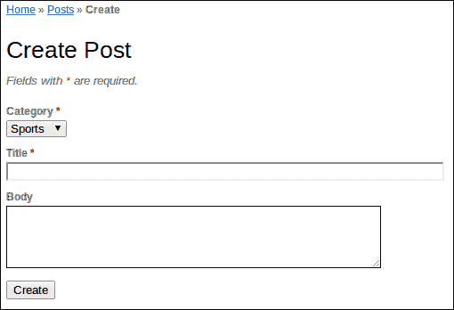

为了论证，让我们假设我们的帖子可以有一个发布日期字段，我们可以使用它来防止项目在期望日期之前显示在列表中。默认情况下，这将显示为`textField`，就像分类 ID 一样。将其替换为 jQuery UI DatePicker 的 Zii 包装器，命名为`CJuiDatePicker`，代码如下：

```php
// replace this:
<?php echo $form->textField($model, 'publish_date'); ?>

// with this:
<?php $this->widget('zii.widgets.jui.CJuiDatePicker',array(
            'model'=>$model,
            'attribute'=>'publish_date',
            'options'=>array(
                'showAnim'=>'fold',
            ),
            'htmlOptions'=>array(
                'style'=>'height:20px;'
            ),
        )); ?>
```

如果您想遵循 ActiveForm 样式，您必须指定如前述代码所示的`model`和`attribute`选项。为了简单地将日期值与表单一起传递，将模型和属性替换为与输入名称相对应的名称值。

不幸的是，我们在这里还没有完成`date`字段的设置。在网络上，日期总是个棘手的话题。很可能会出现的情况是，选择器提供的默认格式不是数据库想要存储的格式，或者它可能不是您应用程序所需的显示样式。在大多数情况下，您需要在服务器端处理这个问题，即在接收已提交的值和推送日期时。

至于显示不同的日期格式，这可以通过向选项数组中添加`dateFormat`元素来轻松处理。例如，默认值将是`03/16/2013`（本句撰写时的日期）。这个日期格式是`mm/dd/yy`。如果您不希望单数字值占用两列，而只使用年份的最后两位，请使用`m/d/y`。或者，如果您想要类似 MySQL 日期格式的样式，请使用`yy-mm-dd`。这将处理从选择器中选择时看到的值。

Yii 使用的日期格式规范在此处描述：[`www.unicode.org/reports/tr35/tr35-dates.html#Date_Format_Patterns`](http://www.unicode.org/reports/tr35/tr35-dates.html#Date_Format_Patterns)。这在`CDateFormatter`类的文档中也有提及。

然而，仍然有两个问题存在。

如果你没有遵循确切的 MySQL 格式，你希望在帖子后端在服务器端重新格式化日期。你无论如何都应该这样做，以确保用户仍然可以输入字段并提交他们自己的值。

这需要解决两个地方，因为这种表单可以以两种不同的方式提交，如前所述——在创建和更新时，因此日期转换必须添加到 `actionCreate` 和 `actionUpdate`。在任何情况下，代码都是相同的。在你进入 `if(isset($_POST)){}` 块之后，你可以预期这个字段可能已经被填写。

使用 PHP 的 `date` 函数和字符串转时间函数来修正你接收到的任何值：

```php
if (isset($_POST['Post2']))
{
    $model->attributes=$_POST['Post2'];
    $model->publish_date = date(
        'Y-m-d', 
        strtotime($model->publish_date)
    );
    if($model->save())
        $this->redirect(array('view','id'=>$model->id));
}
```

你需要解决的日期的第二个问题是与显示此字段的任何视图相关。这可能是一个更新表单，你希望字段以显示日期格式预先填充，或者是视图和列表屏幕。解决这个问题的最简单方法是，在渲染视图之前更改它。例如，默认的视图操作如下所示：

```php
public function actionView($id)
{
    $this->render('view',array(
        'model'=>$this->loadModel($id),
    ));
}
```

在调用渲染方法之前，我们需要更改模型，因此我们必须在添加日期格式修复的同时稍微调整一下。类似以下的内容应该可以解决问题：

```php
public function actionView($id)
{
    $model = $this->loadModel($id);
    $model->publish_date = date('m/d/Y', strtotime($model->publish_date));
    $this->render('view',array(
        'model'=>$model,
    ));
}
```

这实际上是我们保存提交值所执行的过程，只是方向相反。

注意，你可以将这个用于重新格式化日期的逻辑放在模型代码的更深层。每个 Yii 模型都有成对的特殊方法，`afterFind` 和 `beforeSave`，它们分别在模型从数据库中填充数据后或即将将更新数据保存到数据库时由 Yii 自动触发。利用这些方法，你根本不需要修改 `actionView` 方法，相反，你需要在你的帖子模型代码中添加以下内容：

```php
/**
 * For displaying the model on pages, 
 * we convert publishing date to 'MM/DD/YYYY' format.
 */
public function afterFind() 
{
    $this->publish_date = date('m/d/Y', strtotime($this->publish_date));
}

/**
 * Publish date of Post is being stored in the MySQL in 'YYYY-MM-DD' format.
*/
public function beforeSave() 
{
    $this->publish_date = date(
        'Y-m-d', 
        strtotime($this->publish_date)
    );
}
```

当然，这里有一个问题。在你设置这两个处理器之后，你将始终转换你的日期，即使你不想或不需要这样做。当转换由控制器执行时，它可以决定是否执行转换。

## 添加自定义视图

现在我们已经介绍了 CRUD 表单的基本工作原理，是时候看看如何构建更专业的界面了。除非你严格地制作一个数据库应用程序，否则基本 CRUD 功能可能不足以满足需求。有几种方法可以做到这一点。每个页面都需要在控制器中作为一个操作，但控制器不需要与特定模型紧密绑定。你是否在现有控制器中工作取决于新的视图是否真正适用于一个实体。

例如，如果你允许用户提交进入待处理状态的帖子，并且必须在发布之前由管理员批准，你可能想要一个列出这些待处理帖子并具有查看和批准按钮的页面。将这样的页面保持在 `PostController` 中是有意义的。

在我们深入探讨这个流程之前，有一些事情需要说明。如果我们向我们的`Post`模型添加一个已批准的字段，它将默认显示在`_form.php`文件中。我们希望将其从非管理员用户那里隐藏，并使用复选框输入元素来代替默认插入的文本字段。由于我们还没有讨论过使用适当的用户访问角色，我们将依靠标准的 Yii 用户账户来管理这个字段的权限。在本节稍后，我们将回到这个例子，并使用基于角色的访问检查。

在 MySQL 中，你可以将已批准字段设置为`approved tinyint(1) default 0`。这样，当不向非管理员用户显示此字段时，帖子将默认为 0（未批准）。此外，当将输入字段更改为复选框时，它将使用 0 和 1 的值。

```php
<?php
//quick and dirty hide for non-admin users
if (Yii::app()->user->name == 'admin') {
    echo CHtml::openTag('div', array('class' => 'row'));
        echo $form->labelEx($model,'approved');
        echo $form->checkBox($model,'approved');
        echo $form->error($model,'approved');
    echo CHtml::closeTag('div');
}
?>
```

默认情况下，`PostController`包含一个索引页面，这是一个通用、可分页的列表。要创建仅处理特定类型帖子的页面，我们首先向`PostController`添加一个新操作。假设我们的`Post`模型也包含一个已批准属性，我们可以使用这个属性来生成传递给待处理视图模板的模型过滤列表。

在`PostController`中，如果我们想让这个列表看起来像索引列表但带有过滤器，最简单的方法是复制索引操作，重命名它，并添加一些过滤。我们甚至可以使用相同的视图脚本，但最好也复制这个脚本。因此，`protected/views/post/index.php`应该复制到`protected/views/post/pending.php`。这些视图有面包屑和菜单选项，你可能希望它们看起来不同，所以保持这些文件不同是最有意义的。

```php
public function actionPending()
{
    $dataProvider=new CActiveDataProvider('Post');
    $criteria = new CDbCriteria;
    $criteria->condition = 'approved=0';
    $dataProvider->criteria = $criteria;
    $this->render('pending',array(
        'dataProvider'=>$dataProvider,
    ));
}
```

在这种情况下，视图模板正在使用一个名为`CListView`的 Zii 小部件，该小部件使用`CActiveDataProvider`获取相关模型，并自动处理诸如分页等问题。在视图模板中，它看起来像这样：

```php
<?php $this->widget('zii.widgets.CListView', array(
  'dataProvider'=>$dataProvider,
  'itemView'=>'_view',
)); ?>
```

然后每个项目都通过`_view.php`模板进行渲染，该模板可以根据不同内容类型的需求进行修改或复制。默认情况下，Yii 视图非常简单，通常只按行或表格列出属性。即使是实际用于通过`actionView`显示单个实体的`view.php`模板，也只是在 HTML 表中显示每个字段。

对于带有操作按钮的记录行列表，管理员界面有更好的显示效果。它使用`CGridView`而不是`CListView`，而不是`CListView`。它还提供了在字段（显示表中的列）上搜索的能力，以及一个更复杂的先进搜索表单。

```php
Yii::app()->clientScript->registerScript('search', "
$('.search-button').click(function(){
    $('.search-form').toggle();
    return false;
});
$('.search-form form').submit(function(){
    $('#post-grid').yiiGridView('update', {
        data: $(this).serialize()
    });
    return false;
});
");
?>

<h1>Manage Posts</h1>

<p>
You may optionally enter a comparison operator (<b>&lt;</b>, <b>&lt;=</b>, <b>&gt;</b>, <b>&gt;=</b>, <b>&lt;&gt;</b>
or <b>=</b>) at the beginning of each of your search values to specify how the comparison should be done.
</p>

<?php echo CHtml::link('Advanced Search','#',array('class'=>'search-button')); ?>
<div class="search-form" style="display:none">
<?php $this->renderPartial('_search',array(
  'model'=>$model,
)); ?>
</div><!-- search-form -->

<?php $this->widget('zii.widgets.grid.CGridView', array(
    'id'=>'post-grid',
    'dataProvider'=>$model->search(),
    'filter'=>$model,
    'columns'=>array(
        'id',
        'cat_id',
        'title',
        'body',
        'approved',
        array(
            'class'=>'CButtonColumn',
        ),
    ),
)); ?>
```

假设你并不关心待处理帖子视图的高级搜索。我们可以将`admin.php`脚本复制到`pending.php`（而不是像之前提到的那样将`index.php`复制到`pending.php`）。此操作使用`$model->search()`方法获取此小部件的数据提供程序。目前，我们可以忽略这部分。我们稍后会回到它。

在 `CGridView` 小部件中需要注意的一点是列列表。你可以选择你想显示的字段。在许多情况下，你可能不想显示所有字段，或者你可能希望它们以不同的方式显示。如果实际的帖子 ID 不重要，我们可以移除该项。由于分类 ID 作为数字并不能告诉我们太多，我们可以轻松地使其显示给定 ID 的名称字段。我们还想更改的另一件事是最后一列。`CButtonColumn` 默认为我们提供三个按钮：`查看`、`更新`和`删除`。我们试图构建的表单旨在允许管理员批准待处理的帖子，因此我们确实需要一个用于批准的动作按钮。我们可能也在其他地方有这个选项，比如查看和更新屏幕，所以保留这些按钮可能是有意义的。无论如何，我们必须自定义 `CGridView` 列表以及 `CButtonColumn` 本身。

```php
<?php $this->widget('zii.widgets.grid.CGridView', array(
  'id'=>'post-pending-grid',
  'dataProvider'=>$model->search(),
  'columns'=>array(
    array(
      'name'=>'cat_id',
      'value'=>'$data->category->name',
    ),
    'title',
    array(
      'class'=>'CButtonColumn',
 'template'=>'{approve} {view} {update} {delete}',
 'buttons'=>array(
 'approve' => array(
 'url'=>'', //need to set this
          'imageUrl'=>Yii::app()->request->baseUrl
            .'/images/approve.png',
        ),
      ),
    ),
  ),
)); ?>
```

这里最重要的就是高亮显示的行。`buttons` 属性告诉小部件为这个网格生成哪些按钮。在这里，我们手动定义了 `approve` 按钮。任何 `CGridView` 都可以免费获得三个按钮：`更新`、`查看`和`删除`。`template` 属性告诉小部件以何种顺序和哪些按钮进行渲染。因此，如果你配置了一些自定义按钮，就像我们用 `approve` 所做的那样，那么你必须在 `template` 属性中提及它。每个按钮可以定义的参数的完整描述可以在 `CButtonColumn.buttons` 属性的文档中找到，请参阅 [`www.yiiframework.com/doc/api/1.1/CButtonColumn#buttons-detail`](http://www.yiiframework.com/doc/api/1.1/CButtonColumn#buttons-detail)。

注意，我们仍然需要正确配置 `approve` 按钮的 `url` 属性。

让我们为用户点击批准按钮时执行 AJAX 更新。它将向 `/post/approve` 端点发送请求，我们将在稍后创建该端点，并在之后更新网格。以下是我们的操作步骤：

```php
'buttons'=>array(
    'approve' => array(
        'imageUrl'=>Yii::app()->request->baseUrl.'/images/approve.png',
        'url'=>'Yii::app()->createUrl("post/approve", array("id"=>$data->id))',
 'options' => array(
 'ajax' => array(
 'type' => 'post',
 'url'=>'js:$(this).attr("href")',
 'success' => 'js:function(data) { $("#post-pending-grid"). yiiGridView('update'); }'
            )),
    ),
),
```

之后，我们在 `PostController` 中编写最简单的端点：

```php
public function actionApprove($id)
{
    $model= Post::model()->findByPk($id);
    if (!$model)
        throw new CHttpException(404);

    $model->approved = 1;
    $model->save();
}
```

这只是将帖子的批准状态更改为 `true` 值并保存。注意，我们通常需要检查是否得到了正确的帖子 ID，如果没有，则抛出异常。

对于列出待处理帖子，我们执行以下操作：

```php
public function actionPending()
{
    $model=new Post('search');
    $model->unsetAttributes();  // clear any default values
 $model->approved = 0;
    if(isset($_GET['Post']))
        $model->attributes=$_GET['Post'];

    $this->render('pending',array(
        'model'=>$model,
    ));
}
```

此表将只显示帖子的分类名称和帖子的标题。在你将此特定模型实例的 `approved` 字段设置为零后，它将用作网格视图的过滤器。

## 扩展

Yii 的另一个伟大功能和 Yii 社区的功能是用户贡献的扩展库，你可以在 Yii 网站上找到这些扩展库（[`www.yiiframework.com/extensions/`](http://www.yiiframework.com/extensions/)）。目前有超过 1,100 个扩展，使得添加专用功能变得容易。扩展类别包括授权、缓存、日期和时间、文件系统、邮件、安全、用户界面、验证等。在本节中，我们将查看几个非常好的扩展。

### TinyMCE

到目前为止最受欢迎的扩展是 **tinymce**。正如你可能猜到的，这是一个针对 **TinyMCE** ([`www.tinymce.com/`](http://www.tinymce.com/)) WYSIWYG 编辑器的包装器。它附加到文本区域输入，并提供在 HTML 视图和预览模式之间的切换，其中样式会显示为发布时的样子。用户可以获得控制，例如字体选择/颜色、文本对齐、粗体/斜体/下划线等。

要使用 TinyMCE 扩展，你首先下载并将其解压到`protected/extensions`目录中。之后，只需替换`_form.php`中通常调用`textArea`的单行，使用以下内容，这将提供完整的控件集：

```php
<?php $this->widget('application.extensions.tinymce.ETinyMce', array(
            'model'=>$model,
            'attribute'=>'content',
            'editorTemplate'=>'full',
            'htmlOptions'=>array('rows'=>6, 'cols'=>50, 'class'=>'tinymce')
)); ?>
```

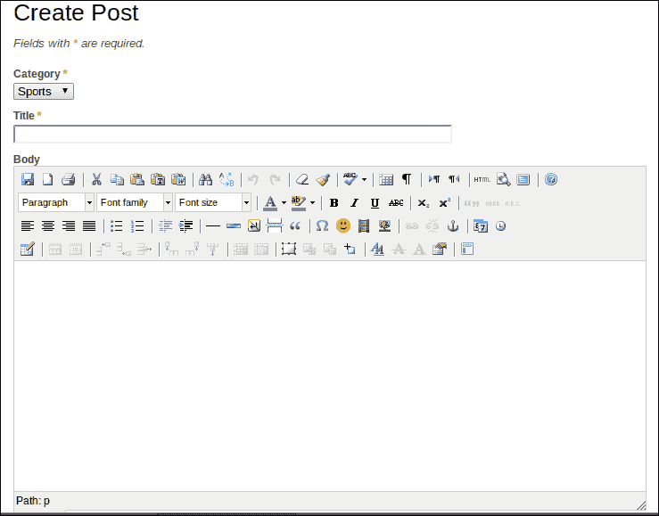

### MbMenu

今天大多数网站上非常受欢迎的另一个功能是下拉菜单。**MbMenu**提供了一个针对默认 Yii `CMenu`类的扩展，使得将其集成到现有项目中变得容易。要开始，再次，你只需要下载并提取扩展到`protected/extensions`文件夹中。主站菜单在`protected/views/layout/main.php`中配置，因此我们必须去那里进行更改。

默认情况下，菜单看起来是这样的：

```php
<div id="mainmenu">
  <?php $this->widget('zii.widgets.CMenu',array(
    'items'=>array(
      array(
        'label'=>'Home', 
        'url'=>array('/site/index')
      ),
      array(
        'label'=>'About', 
        'url'=>array('/site/page', 'view'=>'about')
      ),
      array(
        'label'=>'Contact', 
        'url'=>array('/site/contact')
      ),
      array(
        'label'=>'Login', 
        'url'=>array('/site/login'), 
        'visible'=>Yii::app()->user->isGuest
      ),
      array(
        'label'=>'Logout ('.Yii::app()->user->name.')',
        'url'=>array('/site/logout'), 
        'visible'=>!Yii::app()->user->isGuest
      )
    ),
  )); ?>
</div><!-- mainmenu -->
```

要使用 MbMenu，我们必须将小部件更改为`application.extensions.mbmenu.MbMenu`。然后我们可以在单个菜单项内嵌套数组，遵循默认的`CMenu`格式。以我们的例子为例，我们可能首先想要添加一个指向帖子索引列表的帖子菜单项。使用旧的`CMenu`方式，我们只需这样做：

```php
<div id="mainmenu">
  <?php $this->widget('zii.widgets.CMenu',array(
    'items'=>array(
      array(
        'label'=>'Home', 
        'url'=>array('/site/index')
      ),
 array(
 'label'=>'Posts', 
 'url'=>array('/post/index')
 ),
      array(
        'label'=>'About', 
        'url'=>array('/site/page', 'view'=>'about')
      ),
      array(
        'label'=>'Contact', 
        'url'=>array('/site/contact')
      ),
      array(
        'label'=>'Login', 
        'url'=>array('/site/login'), 
        'visible'=>Yii::app()->user->isGuest
      ),
      array(
        'label'=>'Logout ('.Yii::app()->user->name.')',
        'url'=>array('/site/logout'), 
        'visible'=>!Yii::app()->user->isGuest
      )
    ),
  )); ?>
</div><!-- mainmenu -->
```

现在，假设我们想要添加一些 CRUD 操作和挂起列表作为子菜单项。它看起来会像以下这样：

```php
<div id="mainMbMenu">
<?php
  $this->widget('application.extensions.mbmenu.MbMenu', array(
    'items'=>array(
      array(
        'label'=>'Home', 
        'url'=>array('/site/index')
      ),
      array(
       'label'=>'Posts', 
       'url'=>array('/post/index'),
       'items'=>array(
          array(
            'label'=>'All Posts', 
            'url'=>array('/post/index')
          ),
          array(
            'label'=>'Add Post', 
            'url'=>array('/post/create'), 
            'visible'=>!Yii::app()->user->isGuest
          ),
          array(
            'label'=>'Pending', 
            'url'=>array('/post/pending'), 
            'visible'=>Yii::app()->user->name=='admin'
          ),
        ),
      ),
      array(
        'label'=>'About', 
        'url'=>array('/site/page', 'view'=>'about')
      ),
      array(
        'label'=>'Contact', 
        'url'=>array('/site/contact')
      ),
      array(
        'label'=>'Login', 
        'url'=>array('/site/login'), 
        'visible'=>Yii::app()->user->isGuest
      ),
      array(
        'label'=>'Logout ('.Yii::app()->user->name.')',
        'url'=>array('/site/logout'), 
        'visible'=>!Yii::app()->user->isGuest
      )
    ),
  )); ?>
</div><!-- mainmenu -->
```

注意，这个小部件有自己的 CSS，因此包装器`div`元素的 ID 应该从`mainmenu`更改为`mainMbMenu`。此外，我们不希望非管理员用户看到挂起列表的菜单选项，或者非认证用户看到创建帖子的链接，因此我们必须指定可见条件。

### Yii-User 和 Yii-User-Management

这两个扩展是最受欢迎的扩展之一。**Yii-User**提供了用户注册以及与此过程相关的所有问题的机制，例如确认电子邮件、重置密码和用户资料。**Yii-User-Management**提供了更多相同的功能，但还包括组、用户间消息和用户角色。

### Yii-Shop

Yii-Shop 是一个功能齐全、国际化的购物车扩展。它处理不同类型的具有变体的产品，包括税费计算、运输和支付方式，以及发票和送货单。

### Cal

这是一个基于 jQuery 的日历扩展。使用它来创建和安排将在全尺寸日历上显示的事件。

### Fancybox

谁不喜欢那些模态弹出图像查看器呢？这个非常适合用于看起来很酷的图像画廊。它是一个位于[`fancyapps.com/fancybox/`](http://fancyapps.com/fancybox/)的第三方应用**Fancybox**的包装器。

### 其他优秀扩展

对于 Yii 来说，有如此多的优秀扩展可用，并且大部分扩展与前面提到的两个示例一样容易安装和使用。在下一节中，我们将讨论另一个优秀的扩展，它使得处理基于 Web 的应用程序中最重要的问题之一变得容易，即访问权限。

## 基于角色的访问控制

几十年来，在软件应用中的一种常见做法是将特定操作的权限分配给通用角色。用户可以被授予一个或多个角色，通过这些角色，他们将能够执行某些功能。以博客为例，一般注册用户可能会被赋予一个如访客的角色。这个角色将关联到一组有限的可能操作。例如，访客可能只能为帖子创建评论，但不能创建帖子本身。另一个角色可能会分配给少数被允许创建帖子的用户。这可以被称为**帖子创建者**。角色通常描述了预期的行为，即使它们从未作为网站的一部分公开可见，它们也有助于简化管理或程序方面的操作。最后，一个顶级角色可能类似于管理员，它可能会处理诸如启用新用户或批准帖子之类的事情。总的来说，将特定操作的权限授予用户角色的这个过程被称为**基于角色的访问控制**（**RBAC**），在 Yii 中非常重要。

### SRBAC

开始使用基于角色的访问控制的最简单方法之一是这款广受欢迎的扩展，称为**SRBAC**（[`www.yiiframework.com/doc/guide/1.1/en/basics.module`](http://www.yiiframework.com/doc/guide/1.1/en/basics.module)）。这个扩展提供了一个图形界面来配置角色、任务和操作。操作被分配给任务，任务被分配给角色，最后，角色被分配给用户。在最低级别，操作与一个动作是一对一的映射。例如，查看帖子是帖子控制器中的`actionView`。`PostView`是创建来映射此动作的操作。同样，对于`PostController`中的所有动作都会创建操作。默认情况下，SRBAC 还会为每个控制器设置两个任务。对于帖子，这些任务将是`PostViewing`和`PostAdministrating`。查看和索引是只读操作，因此它们通常被合并到`PostViewing`中，而创建、更新、删除和管理更适合放在`PostAdministering`中。你总是可以为一些更重要的任务保留管理权限，例如删除或只是管理，但你可能还想创建另一个任务，如`PostCreating`，以适应严格只读和实际创建/编辑内容之间的中间状态。

要使用特定控制器与 SRBAC 一起使用，需要进行一些修改。首先，我们必须配置这个扩展，这与前面的示例略有不同。这是一个较旧的扩展，遵循一个较少使用的安装模式。它不是放在`protected/extensions`文件夹中，而是根据文档说明，应将其放在`protected/modules`中，该文件夹默认不存在，但可以创建（[`www.yiiframework.com/doc/guide/1.1/en/basics.module`](http://www.yiiframework.com/doc/guide/1.1/en/basics.module)）。

接下来，需要对`protected/config/main.php`中的主配置文件进行一些简单的修改。在`import`部分，添加一行以包含`application.modules.srbac.controllers.SBaseController`。

在模块部分，你可以找到 Gii 的配置，添加以下内容：

```php
'srbac' => array(
  'userclass'=>'User',
  'userid'=>'id',
  'username'=>'username',
  'delimeter'=>'@',
  'debug'=>true,
  'pageSize'=>10,
  'superUser' =>'Authority',
  'css'=>'srbac.css',
  'layout'=>
  'application.views.layouts.main',
  'notAuthorizedView'=> 'srbac.views.authitem.unauthorized',
  'alwaysAllowed'=>array(
    'SiteLogin','SiteLogout','SiteIndex','SiteAdmin',
    'SiteError', 'SiteContact'),
  'userActions'=>array('Show','View','List'),
  'listBoxNumberOfLines' => 15,
  'imagesPath' => 'srbac.images',
  'imagesPack'=>'noia',
  'iconText'=>true,
  'header'=>'srbac.views.authitem.header',
  'footer'=>'srbac.views.authitem.footer',
  'showHeader'=>true,
  'showFooter'=>true,
  'alwaysAllowedPath'=>'srbac.components',
)
```

这些是 SRBAC 文档中表达的一些标准设置。这里需要注意的几点是，你必须确切指定你的用户类和用户名字段。你会在列表的顶部找到它们。此外，你可以在`alwaysAllowed`项中设置始终允许执行的操作。如果你想让匿名用户看到你的`PostIndex`页面，这将很有用。最后要注意的是`debug`选项。在你正确配置了角色后，将此选项设置为`false`非常重要。最重要的是，你需要将权限角色分配给一个用户，因为这是唯一允许管理 SRBAC 的角色。如果你在分配该角色之前将其设置为`false`，你将无法进一步配置 SRBAC 规则。如果情况如此，你可以将其重置为`true`。

在你的`main.php`配置的`components`部分，你必须将`authManager`项设置为 SRBAC：

```php
'authManager'=>array(
  'class'=>'application.modules.srbac.components.SDbAuthManager',
  'connectionID'=>'db',
  'itemTable'=>'authitem',
  'assignmentTable'=>'authassignment',
  'itemChildTable'=>'authitemchild',
),
```

SRBAC 使用三个数据库表来存储规则；角色、任务和操作将进入项目表。项目子表处理角色和任务、任务和操作之间的关系。分配表将角色与用户关联。这些表将在安装过程中创建，这将发生在你第一次尝试访问 SRBAC 时。

一旦你在`modules`文件夹中安装了 SRBAC 模块，并在`main.php`中设置了配置选项，你就可以访问你的网站`index.php?r=srbac`，你应该会被带到安装界面。这个界面会显示设置摘要，并在底部有一个安装按钮。这个操作将在你的应用程序中使用 SRBAC 时创建必要的表。

要为特定的控制器设置规则，你必须首先对控制器文件进行一些修改。不再扩展`Controller`，现在必须扩展`SBaseController`。通过依赖高级控制器，动作请求时的权限检查被从你作为开发者的角度抽象出来。这变成了一件你不需要思考的事情，而且不会让你的代码变得杂乱无章：

```php
class PostController extends SBaseController
```

在你的控制器顶部，在`public $layout`设置下，你需要设置一些快速变量定义以避免在视图中的问题：

```php
public $layout='//layouts/column2';
public $breadcrumbs;
public $menu;
```

最后，你可以移除`filters`和`accessRules`方法：

```php
/**
 * @return array action filters
 */
public function filters()
{
    return array(
        'accessControl', // perform access control for CRUD operations
        'postOnly + delete', // we only allow deletion via POST request
    );
}

/**
 * Specifies the access control rules.
 * This method is used by the 'accessControl' filter.
 * @return array access control rules
 */
public function accessRules()
{
    return array(
        array('allow',  // allow all users to perform 'index' and 'view' actions
            'actions'=>array('index','view'),
            'users'=>array('*'),
        ),
        array('allow', // allow authenticated user to perform 'create' and 'update' actions
            'actions'=>array('create','update'),
            'users'=>array('@'),
        ),
        array('allow', // allow admin user to perform 'admin' and 'delete' actions
            'actions'=>array('admin','delete', 'pending'),
            'users'=>array('admin'),
        ),
        array('deny',  // deny all users
            'users'=>array('*'),
        ),
    );
}
```

现在，你可以回到 SRBAC。如果你转到**管理 AuthItems**部分，你应该看到一个**自动创建 AuthItems**的链接。这个页面会显示你可以用来自动生成任务和操作的控制器。通过点击列表中控制器旁边的灯泡图标，你应该在右侧看到一个它可以创建的所有操作的列表以及两个默认任务，它想要为你设置的。你可以选择性地选择项目或选择**全选**。对于任务，你可以选择查看和管理这两个标准任务，或者坚持这些，添加更多，或者为你的控制器创建完全独特的任务。

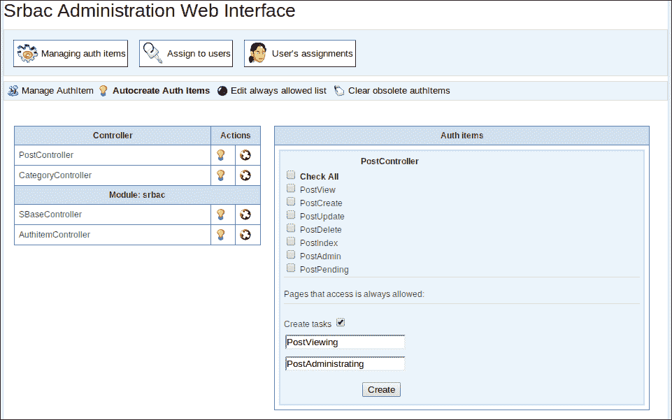

在自动生成你的任务和操作后，你将想要设置一些角色。回到主要的**Auth Items**屏幕，找到**创建**按钮。在这里，你可以创建自定义任务和操作，但你将发现这最适用于简单地创建角色。将下拉菜单改为角色，给它起个名字，然后点击下面的**创建**。注意，在添加另一个角色之前，你必须点击左侧的**创建**。

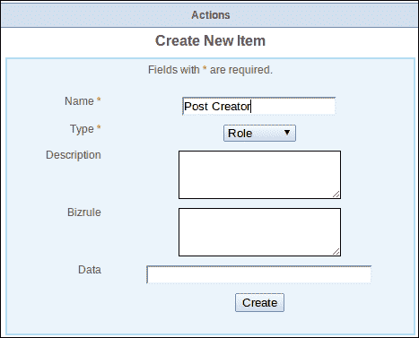

到目前为止，我们可以转到**分配角色给用户**部分。这是一个简单、图形化的方式来添加和移除分配。

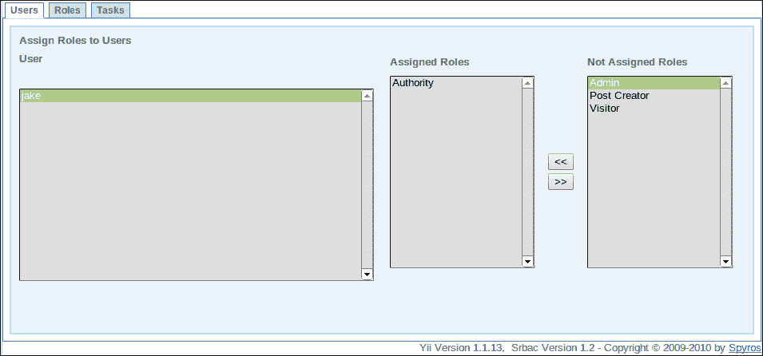

几个点击就能将操作分配给任务，任务分配给角色，角色分配给用户。确保在您在`main.php`配置文件中关闭 SRBAC 调试模式之前，至少将权限角色添加给一个用户，如前所述。

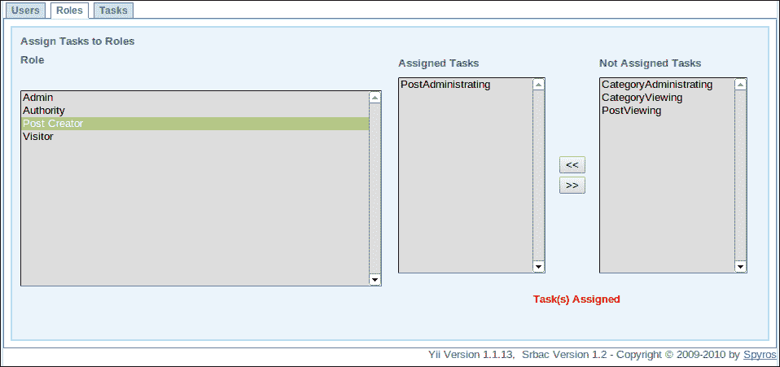

SRBAC 在更多情况下都很有用，而不仅仅是管理控制器操作。当我们之前设置下拉菜单时，我们限制了待处理菜单选项只对管理员用户可见：

```php
array(
  'label'=>'Pending', 
  'url'=>array('/post/pending'), 
  'visible'=>Yii::app()->user->name=='admin'
),
```

现在我们有了角色，我们可以根据角色设置这个限制：

```php
array(
  'label'=>'Pending', 
  'url'=>array('/post/pending'),
  'visible'=>Yii::app()->user->checkAccess('Admin')
),
```

在我们的代码中的任何位置，我们都可以检查当前用户是否有特定的授权分配。这可能是一个角色、任务或操作。这很重要，因为当用户访问他们不应该使用的应用程序部分时，仅仅显示拒绝访问的消息是不够的。更好的是，他们根本找不到链接。

# 你应该了解的人和地方

最后，让我们看看我们可以在哪里找到更多关于 Yii 框架及其社区的信息。

## Yii 网站

框架网站是阅读更多关于 Yii 的第一位地方。它的网址是[`www.yiiframework.com`](http://www.yiiframework.com)。与任何软件工具一样，API 文档部分在你开发过程中将非常有价值。论坛提供了获取特定问题的帮助的极好资源。有许多教程，以及一个包含示例的 wiki 可以查看。网站上还列出了最好的外部资源，所以这绝对应该是你的第一站。

## API

Yii API 文档可能是网络上最漂亮、最易用的文档。网址是[`www.yiiframework.com/doc/api/`](http://www.yiiframework.com/doc/api/)。如果你打算认真使用 Yii，你绝对应该将其添加到书签中，因为你将需要它很多。

## 教程和指南

+   Yii 网站有许多优秀的教程。除了 API 本身之外，最好的资源之一是位于[`www.yiiframework.com/doc/guide/`](http://www.yiiframework.com/doc/guide/)的《 definitive guide》。这个指南非常详尽，涵盖了所有重要主题，并包含了许多重要的提示和代码示例。

+   我们基于的博客演示在 Yii 网站教程部分有详细讨论。网址是[`www.yiiframework.com/doc/blog/`](http://www.yiiframework.com/doc/blog/)。

+   Wiki 上有很多独立的示例和代码片段，这些片段可能会很有用 ([`www.yiiframework.com/wiki/`](http://www.yiiframework.com/wiki/))。

+   如果你在 wiki 中找不到你想要做的示例，论坛也是一个寻找先前解决问题的解决方案的好资源。随着 Yii 的日益流行，论坛越来越活跃。这是一个获取你问题答案的好地方。

+   最全面的 Yii 教程之一是由 Larry Ullman 完成的。他撰写了一本关于 Yii 的优秀书籍，并选择在其网站上公开发布大部分内容 [`www.larryullman.com/series/learning-the-yii-framework/`](http://www.larryullman.com/series/learning-the-yii-framework/)。

+   Jeffrey Winesett 还制作了一套优秀的屏幕录像教程，以帮助您在 [`www.yiiframework.com/screencasts/`](http://www.yiiframework.com/screencasts/) 开始学习。

## IRC

您可以在 Freenode 的 `#Yii` 频道找到 Yii 社区。

## Twitter

通过关注 `@YiiFramework` 来跟踪框架的更新和变化。

## Facebook

Yii 甚至进入了 Facebook 世界，为所有与 Yii 相关的主题创建了一个群组 ([`www.facebook.com/groups/61355672149/`](https://www.facebook.com/groups/61355672149/))。

在撰写本文时，已有数千名成员。
