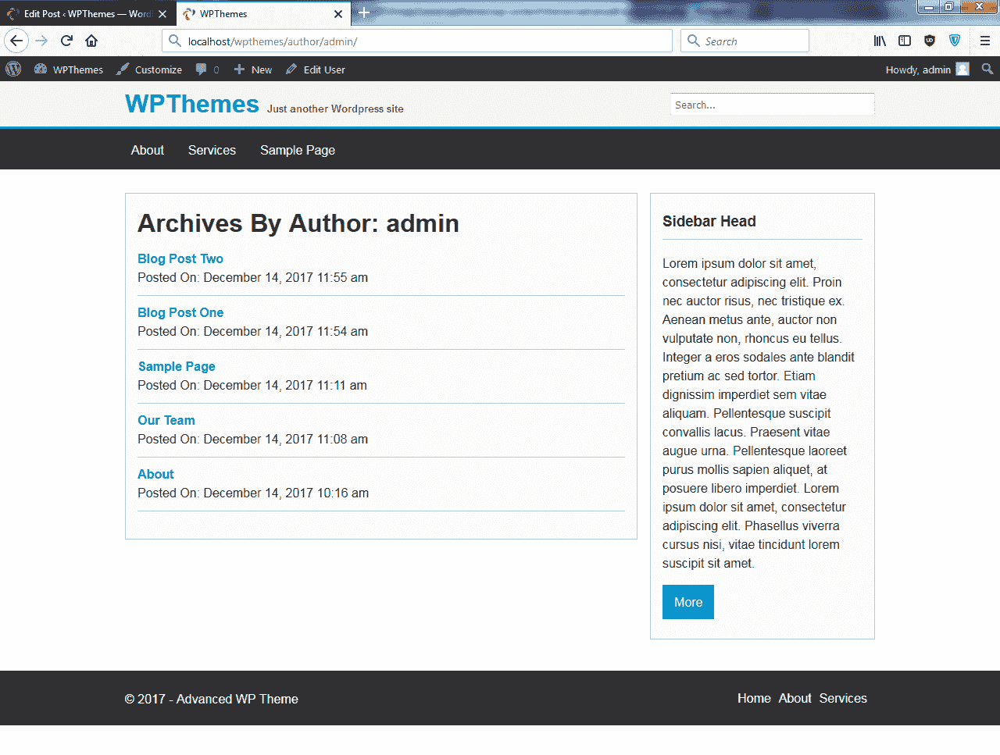
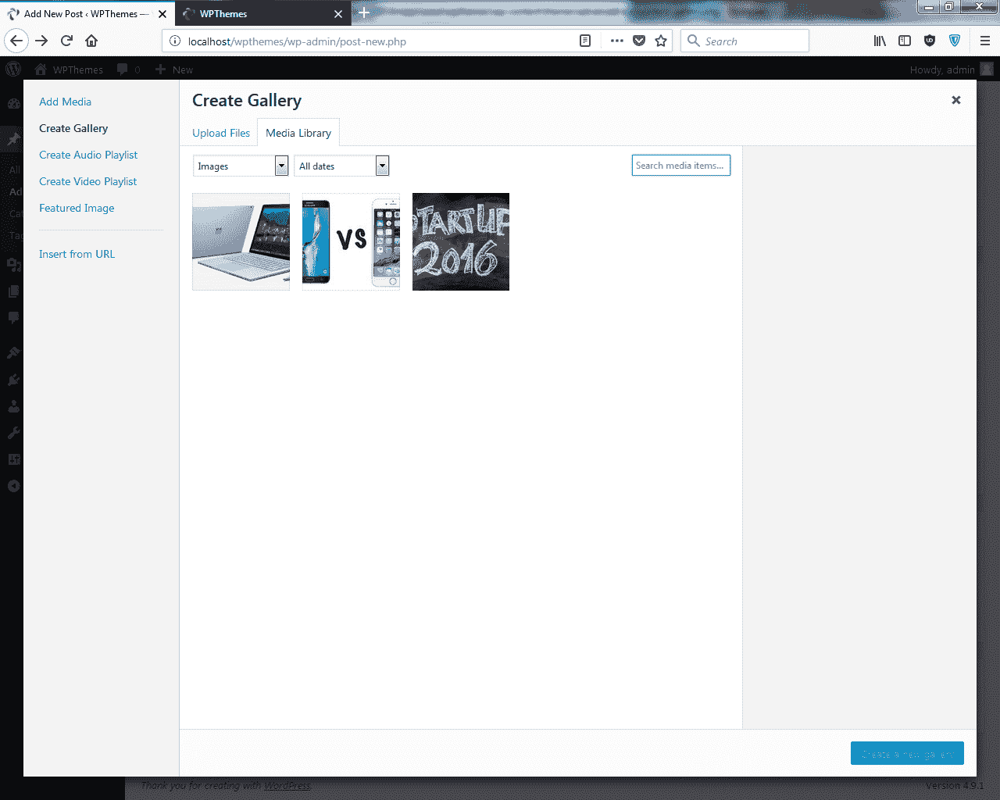
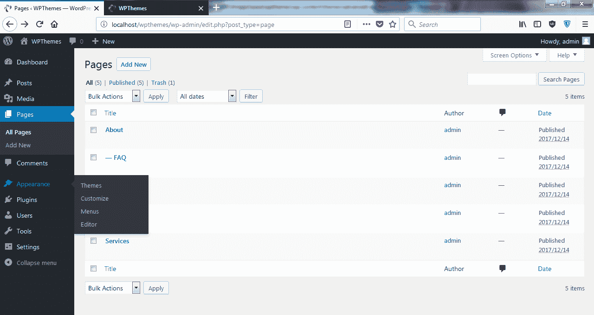

# 第二章：构建 WordPress 主题

在本章中，我们将深入了解并湿脚。在前一章中，我们介绍了基础知识，但现在我们将使用一些更高级的概念来构建 WordPress 主题。以下是我们将涵盖的概念：

+   自定义模板页面

+   归档页面

+   帖子格式

+   自定义主页

让我们快速看一下这个项目：


在前面的图片中，你可以看到 WordpressDev 主页和一些我们将要实现的组件，例如展示组件。你还可以看到三个框组件。

# 帖子格式

当你访问博客页面时，你可以看到我们有多种帖子类型：

+   图库帖子

+   链接帖子

+   A 面帖子

+   普通博客帖子

在下面的屏幕截图中，你可以看到图库帖子以及链接帖子：


这就是 A 面帖子的样子：


这就是一篇普通博客帖子的样子：


当我们点击“阅读更多”时，它会带我们到一个单独的页面，在那里我们有评论表单和定制的评论界面，如下面的图片所示：


我们现在将看到如何创建自定义布局；例如，下面的屏幕截图所示的关于页面，其布局称为公司，其中电话号码显示在`div`类中：


现在让我们点击帖子或页面，然后点击关于：


你会看到我们有默认模板和公司布局在模板选项中：


现在我们将看到如何为有父级的页面创建子菜单；例如，我们的关于页面有两个子页面，常见问题和我们的团队，如下面的屏幕截图所示：


现在让我们看看归档列表。转到博客页面并点击一个分类，例如技术：


我们可以看到页面显示了所有关于技术的帖子。如果我们点击用户名并点击它，它将显示该作者的帖子，如下面的图片所示，这是归档页面的自定义布局：


让我们继续搜索。我们有一个特殊的主题或布局，正如你在下面的屏幕截图中所看到的：


我们会比第一章更深入地探讨。

# 使用 HTML 和 CSS 创建设计

让我们看看如何创建我们的主题，但在我们进入 WordPress 之前，我们将首先绘制并使用 HTML 和 CSS 创建设计。

通常，当我们构建 WordPress 主题、Drupal 或 Joomla 主题时，你通常可以使用静态 HTML 和 CSS 首先创建设计。

# 构建 HTML 主体

如以下截图所示，我们有一个名为`advanced-wp-html`的空文件夹，我们将在其中创建几个文件。首先，我们将创建一个`index.html`文件，然后我们将创建我们的样式表，它将只是`style.css`。

让我们用 Sublime 编辑器打开这两个文件。在`index.html`文件中，添加我们的核心 HTML 标记，如下面的代码块所示：

```php
<!DOCTYPE html>
<html>
<head>
   <title></title>
</head>
<body>

</body>
</html>
```

我们将更新代码，如下所示：

```php
<!DOCTYPE html>
<html>
<head>
   <title>Advanced WP Theme</title>
</head>
<body>
   <header>
      <div class="container">
         <h1>Advanced Wordpress Theme</h1>
      </div>
   </header>
</body>
</html>
```

这里，我们有“高级 WP 主题”作为标题，并添加了一个到我们的样式表的链接，并放置了一个`href`属性，它将指向`style.css`。然后在 body 中，我们创建了一个带有标题的标记。由于我们使用 HTML5 语法，我们使用了`<header>`标签，并创建了一个带有`container`类的`<div>`。在`container`类内部，我们有一个`<h1>`标签，上面写着“高级 Wordpress 主题”；当然，当我们实际创建 WordPress 主题时，这将动态的，你将能够在管理区域中更改它，但现在我们只是在这里放一些静态文本。

现在，在`<h1>`标签之后，我们将有一个另一个`div`类，并给它一个`h_right`类作为右侧标题。这就是我们的搜索表单将要放置的地方，所以现在我们只是放一个`<form>`标签和一个`<input>`标签，如下面的代码块所示。我们将给它一个`placeholder`，并说“搜索...”：

```php
<div class="h_right">
   <form>
      <input type="text" placeholder="Search...">
   </form>
</div>
```

现在，让我们在`</header>`标签下方创建我们的导航，如下面的代码块所示：

```php
<nav class="nav main-nav">
   <div class="container">
      <ul>
      <li><a href="index.html">Home</a></li>
      <li><a href="about.html">About</a></li>
      <li><a href="#">Services</a></li>
      </ul>
   </div>
</nav>
```

如您所见，我们使用了一个带有`nav`类的`<nav>`标签，并给它添加了`main-nav`。接下来，我们添加了一个带有`class="container"`的`<div>`，只是为了将所有内容移动到中心。然后，在内部，我们放置了一个带有一些`<li>`标签和一些链接的`<ul>`。我们添加了“首页”、“关于”和“服务”。然而，由于我们实际上不会有“服务”页面，我们将有一个“关于”页面，这样我们就可以在内部页面上使用它。所以，“首页”将是博客帖子，“关于”将只是一个普通页面。

接下来，让我们在`</nav>`标签之后添加以下代码：

```php
<div class="container content">
   <div class="main block">
      <article class="post">
         <p class="meta">Posted at 11:00 on May 9 by admin</p>
      </article>
   </div>
```

这里，我们添加了一个带有`container`类和`content`类的`div`元素。然后，在内部，我们添加了另一个带有`class="main block"`的`div`元素。在这里，`block`是一个我们可以在整个网站上使用的类，我们也可以用它来设置小工具；它只是会有一些填充和边框。

现在在这个`div`内部，我们有我们的主要帖子；所以每个帖子都有一个带有`post`类的`<article>`标签。我们添加了一个带有`meta`类的段落。这就是放置诸如帖子日期和作者姓名等内容的区域。当我们实际构建 WordPress 主题时，格式可能会有一些变化；现在我们只是说“发布于 5 月 9 日 11:00，由 admin 发布”。所以它看起来会是这样。

我们还需要一个标题。为此，放一个`<h2>`标签，并说“博客帖子 1”，如下面的代码所示：

```php
<article class="post">
   <h2>Blog Post 1</h2>
   <p class="meta">Posted at 11:00 on May 9 by admin</p>
</article>
```

现在，让我们快速添加一些内容。我们将访问[www.lipsum.com](http://www.lipsum.com)并点击生成 Lorem Ipsum。


我们将复制并粘贴一些内容，然后添加一些段落标签。接下来，我们需要的是`Read More`按钮。我们将添加一个链接；我们将给它一个`button`类，如下面的代码块所示：

```php
   <a class="button" href="#">Read More</a>
</article>
```

然后，我们将整个文章帖子复制并粘贴两次。如果我们想查看它，请打开`index.html`文件。


您可以从前面的屏幕截图看到，它看起来还不是很好看。所以，现在我们将添加一个页脚。为此，让我们进入最后一个`<div>`标签并输入以下代码：

```php
<footer class="main-footer">
   <div class="container">
   <div class="f_left">
      <p>&amp;copy; 2017 - Advanced WP Theme</p>
   </div>
   <div class="f_right">
      <ul>
      <li><a href="index.html">Home</a></li>
      <li><a href="about.html">About</a></li>
      <li><a href="#">Services</a></li>
      </ul>
   </div>
   </div>
</footer>
```

在这里，我们添加了一个带有`"main-footer"`类的`<footer>`标签；我们还有一个它的容器。在容器中，我们有页脚的左侧和右侧；所以我们添加了`<div class="f_left">`和`f_right`。因此，在左侧，我们将有一个包含版权信息的段落，而在右侧，我们将有一个另一个菜单。为此，我们然后从上面复制了`<ul>`并将其粘贴。这已经足够了，对于 HTML 的标记。现在让我们重新加载文件：


我们在这里有一个页脚；它看起来很糟糕，这是因为我们没有添加样式。接下来，我们将看到如何添加 CSS。

# 添加 CSS

现在，我们将看到添加 CSS 如何使我们的页面看起来好很多。我们已经创建了`style.css`；让我们向其中添加 body，如下面的代码块所示：

```php
body{
    font-family: Arial;
    color: #333;
    margin:0;
    padding:0;
}
```

在这里，我们只是添加了`Arial`字体；文字颜色将是深灰色。我们设置了主体边距为`0`和填充为`0`。

让我们从无序列表的几个核心样式开始。我想移除边距和填充，使用以下代码：

```php
ul{
    margin:0;
    padding:0;
}
```

现在，让我们添加链接或`a`标签，如下面的代码所示：

```php
a{
    color:#009acd;
    text-decoration:none;
}
a:hover{
    color:#333;
}
.container{
    width:960px;
    margin:auto;
    overflow:auto;
}
header{
    background: #f4f4f4;
    padding:10px;
    border-bottom: 3px solid #009acd;
}
```

在这里，我们添加了浅蓝色，颜色代码为`009acd`，并将`text-decoration`设置为`none`。我们还需要一个悬停颜色；在这种情况下，悬停颜色将是深灰色。接下来，我们有`container`，它将所有内容都居中。我们设置了宽度为`960`，并将`margin`设置为`auto`。`overflow`设置为`auto`。我们有一个带有浅灰色背景的`header`；我们设置了页眉的填充为`10px`和`border-bottom`为`3px solid`，并且它也是同样的浅蓝色颜色。

现在，让我们添加带有边距和填充为`0`的`header h1`：

```php
header h1{
    margin:0;
    padding:0;
    color:#009acd;
    float:left;
}
```

如您所见，我们还将颜色设置为浅蓝色，并希望将其浮动到左侧。

然后，我们也想让`<h1>`成为一个链接。为此，我们将进入`index.html`文件并将它包裹在`a`标签中，如下面的代码块所示：

```php
<header>
   <div class="container">
      <h1>
         <a href="index.html">Advanced Wordpress Theme</a>
      </h1>
```

接下来，我们将创建带有浅蓝色颜色的`header`、`h1`和`a`。文本装饰设置为`none`，如以下代码块所示：

```php
header h1 a{
    color:#009acd;
    text-decoration:none;
}
```

现在让我们添加一个标语或口号，因为 WordPress 默认有一个这样的选项。所以直接在 `<h1>` 标签内，我们将一个标语放在一个 `<small>` 标签中，内容为 `Another Wordpress Theme`：

```php
<h1>
   <a href="index.html">Advanced Wordpress Theme</a>
   <small>Another Wordpress Theme</small>
</h1>
```

让我们使用以下代码来设置样式：

```php
header small{
    color:#666;
    margin-left:1px;
    font-size: 13px;
}
```

我们已经添加了 `header` `small`，并给它设置了深灰色。我们将 `margin-left` 设置为 `1px` 的边距，并将 `font-size` 设置为 `13px`。

现在为页眉的右侧添加以下代码：

```php
header .h_right{
    float:right;
}
```

我们有 `header .h_right`，并将它浮动到右侧。

现在，由于它有一个输入，我们将设置输入的样式。为此，我们将输入以下代码：

```php
header .h_right input[type="text"]{
    width:250px;
    padding:5px;
    margin-top:5px;
}
```

在这里，我们输入了 `type="text"` 并设置宽度为 `250px`。我们还设置了 `padding` 为 `5px`，以及 `margin-top` 为 `5px`。

让我们保存它并看一下：


我们可以看到我们的页眉。

接下来，我们将处理导航。我们想要有一个主要的 `nav` div 来处理高度、背景颜色和类似的定制；然而，我们确实想要有一个普通的 `nav` 类来处理浮动，这样我们的页脚菜单就可以将列表项浮动，等等。所以现在我们不会为那个添加任何内容。我们想要做 `nav` 元素的 `li`。我们将确保我们有那个。你可以在我们输入的代码中看到，我们有 `nav` 类和 `main-nav`。现在，我们将列表项浮动到左侧，并输入 `display:inline`，并在右侧设置 `15px` 的填充：

```php
nav.nav li{
    float:left;
    display:inline;
    padding-right:15px;
}
```

接下来，我们将添加 `nav.nav a`，并确保将文本装饰设置为 `none`：

```php
nav.nav a{
    text-decoration:none;
}
```

现在让我们来做 `main-nav`：

```php
nav.main-nav{
    height:45px;
    overflow:hidden;
    background:#333;
    color:#fff;
    padding-top:7px;
}
```

在这里，我们将高度设置为 `45px`，`overflow` 设置为 `hidden`，并将背景设置为深灰色。文字颜色将是白色，`padding-top` 设置为 `7px`。

现在我们来添加 `main-nav li`:

```php
nav.main-nav li{
    height:40px;
    line-height:40px;
}
```

我们将高度设置为 `40px`，并将 `line-height` 设置为 `40px`。接下来，我们将添加 `a` 标签：

```php
nav.main-nav a{
    color:#fff;
    text-decoration:none;
    padding:8px;
}
```

在这里，我们将颜色设置为白色，`text-decoration` 设置为 `none`，并将 `padding` 设置为 `8px`。

现在我们需要悬停状态：

```php
nav.main-nav a:hover{
    color:#009acd;
}
```

在这里，我们有 `nav.main-nava:hover`，并将悬停 `color` 设置为浅蓝色。

我们将保存这个，并查看我们的导航：


正如你所见，整个高亮区域都有一个 `content` 类，我们只想把它向下推一点，并设置所有文本的行高：

```php
.content{
    margin-top:30px;
    line-height:1.5em;
}
```

我们有 `.content`，`margin-top` 设置为 `30px`，`line-height` 设置为 `1.5em`。

现在我们将包括一个侧边栏，因为我们之前还没有这样做。为此，让我们打开 `index.html` 文件并添加以下代码：

```php
<div class="side">
   <div class="block">
   <h3>Sidebar Head</h3>
   <p>Lorem ipsum dolor sit amet, consectetur adipiscing elit. 
   Nam vel diam hendrerit erat fermentum aliquet sed eget arcu.</p>
   <a class="button">More</a>
   </div>
</div>
```

我们将侧边栏放在了`</div>`标签的下方。我们添加了一个带有`side`类的`div class`，还添加了一个内部名为`block`的`<div>`标签。侧边栏中的每个元素都应该有一个`block`类。然后我们有一个`<h3>`标签，上面写着`Sidebar Head`，我们还放置了一个段落，其中包含我们抓取的一些文本。然后，在这个下面，我们放置了一个按钮，或者一个格式像按钮的链接。现在我们可以看到我们的侧边栏了。

让我们回到`style.css`文件。在这里，我们将输入`.main`，并将其左浮动，并为其设置宽度为`65%`。然后，让我们为侧边栏添加宽度为`30%`，并将其右浮动。接下来，对于块样式，我们将设置浅灰色边框，为`1px`实线。我们还将添加一些内边距`5px 15px 25px 15px`，并将背景设置为非常浅的灰色和`overflow`设置为`hidden`。对于块中的`h3`，我们将设置`border-bottom`，这将为浅灰色，实线为`1px`；我们还将设置底部内边距为`10px`：

```php
.main{
    float:left;
 width:65%;
}

.side{
    width:30%;
    float:right;
}

.block{
    border:#ccc 1px solid;
    padding:5px 15px 25px 15px;
    background:#fcfcfc;
    overflow:hidden;
}

.block h3{
    border-bottom:#ccc solid 1px;
    padding-bottom:10px;
}
```

让我们看看这个。你可以看到现在我们有了主区域和侧边栏：


接下来，让我们添加文章。我们将放置一个带有`post`类的`article`标签，并添加`border-bottom`、`margin-bottom`和`padding-bottom`，如下所示：

```php
article.post{
    border-bottom: #ccc solid 1px;
    margin-bottom:10px;
    padding-bottom:20px;
}
```

现在，让我们为以下图像中突出显示的元区域设置样式；我们将为其添加蓝色背景：


要做到这一点，让我们输入以下代码：

```php
article.post .meta{
    background:#009acd;
    color:#fff;
    padding:7px;
}

.button{
    background:#009acd;
    color:#fff;
    padding:10px 15px;
    display:inline-block;
}
```

我们输入了`article.post .meta`，并设置了内边距为`7px`。我们还添加了`button`类，并将内边距设置为`10px 15px`。我们还将其显示为内联块。现在让我们看看：


这看起来相当不错。

现在，让我们添加页脚。我们将输入`footer`，给它`.main-footer`类，并在顶部设置`40px`的边距。我们将使所有内容居中，并给它一个深灰色背景。我们将设置`color`为白色，高度为`60px`，`padding-top:10px`和`overflow`为`auto`。

接下来，我们将添加页脚的左右两侧。为此，我们将进入`footer.main-footer .f_left`，并使用左浮动，然后对右侧做同样的事情，给它一个右浮动：

```php
footer.main-footer{
    margin-top:40px;
    text-align:center;
    background:#333;
    color:#fff;
    height:60px;
    padding-top:10px;
    overflow:auto;
}

footer.main-footer .f_left{
    float:left;
}

footer.main-footer .f_right{
    float:right;
}
```

我们现在将转到菜单。我们将使用内联显示的`ul`，然后我们有`li`，如下所示：

```php
footer.main-footer li{
    float:left;
    padding-right:10px;
    list-style:none;
}
```

对于`li`，我们设置了`float:left`，将`padding-right`设置为`10px`，并将`list-style`设置为`none`。

最后，我们将链接的颜色设置为白色。现在，让我们看看：


我们只想将页脚向下推一点。为此，输入以下代码：

```php
footer.main-footer .f_right{
    float:right;
    margin-top:15px;
}
```

现在，看看它：


这看起来相当不错；这是一个非常简单的设计，我们不想做得太过分，因为这个的主要目的是让你熟悉创建 WordPress 主题的语法，而不是创建一个伟大的设计。所以现在我们完成了 HTML 和 CSS，我们可以继续创建我们的 WordPress 主题。

# 创建 WordPress 主题

现在我们将把我们的 HTML 模板转换成一个 WordPress 主题。我在这里有一个全新的 WordPress 安装，只有默认的 twentysixteen 主题。我们将进入 WordPress 文件夹，`wp-content`，然后在`themes`文件夹中，我们将创建一个新的文件夹并命名为`advanced-wp`。

这里我们将创建一个`style.css`文件和一个`index.php`文件。

现在让我们打开样式表。在这里，我们将首先放置我们的声明，这样 WordPress 就能看到这个主题。我们将设置`Theme Name`为`Advanced WP`并为`Author`输入一个值。接下来我们将添加`Author URI`、一个描述和一个版本：

```php
/*
    Theme Name: Advanced WP
    Author: Brad Traversy
    Author URI: http://eduonix.com
    Description: Advanced Wordpress Theme
    Version: 1.0
*/
```

现在我们项目文件中也有一个截图，所以我们将添加那个。

让我们转到`C:`。由于我使用的是 AMPPS，我将进入我的`www`文件夹，然后转到`wpthemes\content\themes`，然后转到`advanced-wp`。我们将继续粘贴名为`screenshot.png`的图片到这里。如果我们去 WordPress 的后端，然后转到外观和主题，你可以看到我们有了 AdvancedWP 主题：


我们现在将激活这个功能。如果我们去前端并重新加载，我们只看到一个空白白色页面，就像这里显示的那样：


让我们在这里添加样式。从 HTML 模板中打开`style.css`文件。我们将复制所有代码并将其直接粘贴到样式表中。

我们将保存这个文件，然后在`index.php`文件中，我们将从`index.html`文件中复制所有内容并将其粘贴到`index.php`中：

保存并重新加载前端。我们会看到所有的 HTML 和静态 HTML：


但是我们看不到样式表，因为我们没有将其放到正确的位置。所以让我们更新代码如下。我们将移除`style.css`。我们将打开一些`php`标签，并使用`bloginfo`，然后我们只需放入`stylesheet_url`：

```php
<head>
   <title>Advanced WP Theme</title>
   <link rel="stylesheet" href="<?php bloginfo('stylesheet_url'); ?>">
</head>
```

让我们保存并重新加载：


你可以看到现在 CSS 正在被读取。我们在这里看到的所有内容只是`index.php`文件中的静态内容，实际上还不是来自 WordPress。所以让我们在这里做一些事情。

最好的做法是从顶部开始，逐步向下工作。在 HTML 标签中，我们将放置 `language_attributes()` 函数。我们将使用 `php bloginfo` 更新 `<title>` 标签，并在其中放入 `name`。我们还将添加 `meta charset` 字符集 `<meta>` 标签。我们可以使用 `bloginfo()` 函数，并传递 `charset`。接下来，我们想要输入 `wp_head()` 函数，因此我们将添加 `<?php wp_head(); ?>`。使用 `<meta>` 标签添加 `viewport` 函数，其名称为 `viewport`。我们将设置 `content` 属性为 `width=device-width`。然后，我们将 `initial-scale` 设置为 `1.0`；这有助于主题的响应性：

```php
<!DOCTYPE html>
<html>
<head>
   <meta charset="<?php bloginfo('charset'); ?>">
   <meta name="viewport" content="width=device-width, initial-scale=1.0">
   <title><?php bloginfo('name'); ?></title>
   <link rel="stylesheet" href="<?php bloginfo('stylesheet_url'); ?>">
   <?php wp_head(); ?>
</head>
```

现在在 `<body>` 标签中，我们需要 `body_class()` 函数。

对于标志或标题，我们将移除静态文本并添加 `php bloginfo` 与名称。接下来，我们将添加标语，使其动态化使用 `bloginfo`，然后我们可以传递 `'description'`：

```php
<body <?php body_class(); ?>>
   <header>
      <div class="container">
         <h1>
            <a href="index.html">
            <?php bloginfo('name'); ?>
            </a>
            <small><?php bloginfo('description'); ?></small>
         </h1>
         <div class="h_right">
            <form>
               <input type="text" name="s" placeholder="Search...">
            </form>
         </div>
    </div>
 </header>
```

现在搜索表单相当简单。我们只需将 `<form>` 标签添加一些内容。我们将使用 `method="get"` 更新它，然后是 `action`，这是提交的地方，我们将输入 `php` 并使用 `esc_url()` 函数。然后，我们将传递 `home_url` 和 `/`。然后，在输入中，我们将添加一个 `name` 属性并将其设置为 `s`：

```php
<h1>
   <a href="index.html">
      <?php bloginfo('name'); ?>
   </a>
   <small><?php bloginfo('description'); ?></small>
</h1>
<div class="h_right">
   <form method="get" action="<?php esc_url(home_url('/')); ?>">
   <input type="text" name="s" placeholder="Search...">
   </form>
</div>
```

大概就是这样。其余的将由 WordPress 处理。让我们保存并查看到目前为止的情况：


我们有我们的标志，它来自 WordPress，标语也是一样。我们实际上还不能测试搜索功能，因为我们这里没有动态内容。现在你会看到顶部有空白区域；这是因为我们还没有 `wp_footer()` 函数，它将把管理员菜单放在那里。我们将在下一步添加这个函数。

让我们回到代码中，在 `</footer>` 标签之后添加 `wp_footer()`：

```php
      </div>
   </footer>
   <?php wp_footer(); ?>
</body>
</html>
```

让我们保存并重新加载：


现在你可以看到我们的管理员栏。

让我们回到上面，处理菜单。我们将下滑到我们的 `nav` 菜单处，移除整个 `<ul>` 标签和所有的 `<li>` 标签。我们首先创建一个名为 `args` 的变量，并将其设置为 `array`，然后将参数传递给 `wp_nav_menu()` 函数。目前我们只有一个参数，即菜单的位置。所以我们将输入 `theme_location` 并将其设置为 `primary`。接下来，我们将输入 `wp_nav_menu` 并传递 `args`：

```php
<nav class="nav main-nav">
   <div class="container">
   <?php
       $args = array(
           'theme_location' => 'primary'
       );
   ?>

   <?php wp_nav_menu($args); ?>
   </div>
</nav>
```

如果我们去查看，我们会发现它在这里是工作的：


然而，我们想在函数文件中指定主题中不同的菜单位置，我们有两个。所以让我们去创建一个新的文件。我们将将其保存为 `functions.php`，并设置一个用于主题支持的功能。

我们将定义一个以`adv`为前缀的函数，然后是`_theme_support`。我们所有的自定义函数都将有`adv`前缀。接下来，我们将注册`nav menus`。我们将传递一个数组并放置我们的不同位置；我们有`primary`，我们将将其设置为可读的名称，因此我们输入`Primary Menu`，然后我们将在`footer`中添加另一个，现在我们先把它放一边：

```php
<?php
    // Theme Support
    function adv_theme_support(){
        // Nav Menus
        register_nav_menus(array(
            'primary' => __('Primary Menu'),
            'footer' => __('Footer Menu')
        ));
    }
```

现在在函数下面，我们将添加`add_action`和`after_setup_theme`，然后我们要运行的函数是`adv_theme_support`：

```php
add_action('after_setup_theme', 'adv_theme_support');
```

让我们保存这个并重新加载：


你可以看到我们的菜单现在在这里。如果我们点击它，你会看到 URL 发生变化，但你不会看到任何内容变化，因为所有这些都仍然是静态 HTML，但我们确实有我们的菜单。现在，默认情况下，我们拥有的每个页面都会显示在这里。你的页面可能实际上会有所不同；你可能没有“我们的团队”，因为在这里我之前对这个 WordPress 站点做了一些工作，所以你的链接可能略有不同。现在如果你查看“外观”，你会看到我们没有“菜单”选项。

```php
// Nav Menus
register_nav_menus(array(
    'primary' => __('Primary Menu'),
    'footer'  => __('Footer Menu')
 ));
```

自从我们在`functions`文件中添加了`register_nav_menus`之后，如果我们现在重新加载，你会看到一个“菜单”链接。点击这个链接，你会看到在“主题位置”我们有“主要”和“页脚”，因为我们已经在`functions`文件中添加了它们。

让我们检查“主要菜单”，在菜单名称中我们只输入“主菜单”，你可以放置你想要的任何页面。我们只保留一个未勾选的，我们保留“我们的团队”未勾选；然后点击“添加到菜单”。然后，点击“保存菜单”：


现在如果我们去前端，你会看到我们只有“关于”和“样本页面”：


现在我将创建几个页面，这样你就有和我一样的页面。所以我们有一个“关于”页面，上面只写着“这是关于页面”。

对于“我们的团队”页面，我们将选择“关于”的父级，并更新它：


现在让我们创建一个名为`FAQ`的新页面。我们将选择“关于”的父级，你稍后会看到我们为什么要这样做：


然后，我们将创建另一个名为“服务”的页面，这个页面没有父级。接下来让我们按照以下方式将“服务”添加到菜单中。我们暂时不会添加“FAQ”或“我们的团队”。我们将看看我们如何使用子菜单，但我们稍后再做：


我们将保存设置，然后你的菜单应该看起来像这样：


我们已经有了导航栏、页眉、搜索框，以及所有的样式都已经完成。在下一节中，我们将继续前进并开始创建我们的主要博客文章循环。

# 显示博客文章

我们创建了主题并添加了页眉和导航栏。现在页面上所有的这些内容都是动态的，并且与 WordPress 集成，但这所有的一切都只是静态 HTML。

让我们回到我们的`index.php`页面，并向下到我们有的`container content` div，以及不同的博客帖子。我们有三个带有博客帖子的`article`标签；我们将删除其中的两个。

然后，我们将缩短段落，使其变得更短，这样我们就可以在页面或视图中显示全部内容。我们想在`main block` div 中编写，并创建我们的帖子循环。

首先，我们必须检查帖子，为此，我们将输入`if(have_posts)`，然后我们必须在`</article>`标签结束之后结束它。我们还将添加一个`else`语句。如果没有帖子，我们将输入`php echo`，使用`wpautop()`函数，我们可以在这里放置我们想要的文本。在这种情况下，我们输入`'抱歉，没有找到帖子'`。然后，我们将创建我们的`while`循环，然后在`</article>`标签下面结束这个`while`循环：

```php
<div class="container content">
   <div class="main block">
      <?php if(have_posts()) : ?>
         <?php while(have_posts()) : the_post(); ?>
            <article class="post">
            <h2><?php the_title(); ?></h2>
            <p class="meta">Posted at 11:00 on May 9 by admin
            </p>
            <?php the_content(); ?>
            <a class="button" href="#">Read More</a>
            </article>
         <?php endwhile; ?>
      <?php else : ?>
         <?php echo wpautop('Sorry, no posts were found'); ?>
      <?php endif; ?>
 </div>
```

因此，它将遍历帖子，并为每一个找到的帖子输出这个内容。现在为了使其动态化，我们将使用`php the_title()`并替换段落为`php the_content()`，正如前面代码块所示。我们将保存这个文件，并重新加载：


现在我们处于“关于”页面；让我们回到“主页”页面，我们还没有为其创建链接。当我们点击 WPThemes 时，它应该带我们到“主页”页面，但如果我们现在点击它，它会带我们到`index.html`页面，所以我们需要修复这个问题。

我们将使用以下代码更新`index.html`文件：

```php
<a href="<?php echo home_url('/'); ?>">
   <?php bloginfo('name'); ?>
```

现在如果我们重新加载并点击 WPThemes，我们会得到这个：


如果我们查看帖子，我们会得到“博客帖子一”和“博客帖子二”。现在你可能没有这些帖子；你可能有一个“Hello World”；如果它显示出来，那就没问题。如果你想使你的内容与我的相匹配，请继续创建两个帖子，一个作为“博客帖子一”——我只是在里面放了一些示例内容——然后“博客帖子二”类似地：


你也可以创建一些分类，它们实际上并不重要。我们并不是真正处理具体的内容，只是作为一个示例内容：


如您所见，元信息仍然是静态的，阅读更多按钮也是如此。当我们点击这个按钮时，它不会做任何事情。所以让我们在下一个修复它。回到我们的帖子循环中，在`<p class="meta">`处，我们将进行以下更改以使其看起来更动态：

```php
<p class="meta">
Posted at
<?php the_time(); ?>
by
admin</p>
<?php the_content(); ?>
<a class="button" href="#">Read More</a>
```

由于我们需要更具体，对于日期和时间我们使用`the_time()`。如果我们保持这样，让我们看看它会给我们什么：


它只给出了时间，上午 11:55。我想同时显示日期，所以我们将格式化这个日期。然而，我们只想通过添加一些参数来完成这个操作。我们添加了`F j`，`Y`，然后对于时间，我们将添加`g:i a`：

```php
<?php the_time('F j, Y g:i a'); ?>
```

这涉及到`php date`函数的参数。

如果你不知道如何格式化时间，你可以访问[php.net](http://php.net)并搜索`date`函数，这样应该会给出所有的格式化选项。

现在如果重新加载页面，它会显示日期、月份、日、年和时间：


现在我们还想要获取创建文章的用户名。为此，我们只需在代码中添加`<?php the_author(); ?>`，如下面的代码块所示：

```php
<?php the_time('F j, Y g:i a'); ?>
by
<?php the_author(); ?></p>
<?php the_content(); ?>
```

如果我们现在重新加载页面，你可以看到我们仍然得到“admin”，因为那是实际用户的名称。现在我们想要能够点击作者名称，然后链接到该用户所有存档的文章。这也很容易做到。我们只需要添加一个链接，如下所示。在链接内部，我们输入`php echo get_author_posts_url()`，然后传递`get_the_author_meta()`和`ID`：

```php
<a href="<?php echo get_author_posts_url(
get_the_author_meta('ID')); ?>">
<?php the_author(); ?>
</a>
```

让我们保存这个文件，然后如果重新加载页面，你可以看到现在它已经变成了一个链接。我们因为颜色看不到它——我们需要更改 CSS——但如果我点击它，它会将我们带到地址栏中的用户名，即`auth/author/`加上用户名；它会显示该用户的所有文章：


让我们快速进入 CSS 看看我们的`meta`类在哪里。我们将添加`article.post .meta`到其中，并将`color`设置为白色，如下所示：

```php
article.post .meta{
    background:#009acd;
    color:#fff;
    padding:7px;
}

article.post .meta a{
   color:#fff;
}
```

所以现在问题已经解决了。


现在我们也可以获取到文章所属的分类。为此，我们需要回到`index.php`文件并更新代码，如下面的代码块所示：

```php
</a>
| Posted In 
<?php
    $categories = get_the_category();
    $separator = ", ";
    $output = '';

    if($categories){
        foreach($categories as $category){
            $output .= '<a href="'.get_category_link($category->term_id).'">'.
            $category->cat_name.'</a>'.$separator;
        }
    }

    echo trim($output, $separator);
?>
</p>
```

在我们刚刚做的作者结束`</a>`标签的右边，我们将放入一个竖线`|`字符，然后打开一些`php`标签。在`php`标签之前，我们将输入`发布在`，然后我们可以放置所有类别。为了做到这一点，我们将设置一个`categories`变量并将其设置为`get_the_category()`。现在这将给我们一个包含这个帖子所在的所有类别的数组。我们不能直接取这个数组并显示它，所以我们必须遍历它。在我们这样做之前，我们将创建一个名为`separator`的变量，并用逗号和空格分隔它。然后，我们将初始化一个名为`output`的变量，并将其暂时设置为空。接下来，我们将检查类别。为此，我们将输入`if($categories)`，然后我们将使用一个`foreach`循环，循环`($categories as $category)`。接下来，我们将向那个`output`变量追加内容，使用`.=`。现在为了使每个类别都有一个链接，我们将使用`href`。为了在这里进行一些连接，我们将使用点，然后添加`get_category_link()`。我们需要传递一个参数，我们将使用那个`$category`变量并调用`term_id`。然后我们将回到我们的字符串双引号之后，再次连接，并输入`$category->cat_name`，用`</a>`标签关闭它。我知道连接可能会有些混乱，所以我们需要一个分隔符。然后，在`if`语句之后，我们将使用`echo`并将这个包裹在`trim()`函数中，使其看起来更整洁；然后我们将输入`output`，第二个参数将是`separator`。

让我们保存一下，看看我们会得到什么。现在你可以看到它说在商业类别中发布：


这个是发布在“未分类”中的：


现在如果我们点击商业，它会带我们到`category/business`，你可以看到这里只有这一篇帖子；这是商业类别中的唯一一篇。

所以这工作得非常完美。

现在我们不希望文本太短，并且“阅读更多”按钮能够正常工作。所以我们将转到放置内容的地方，为了使其更短，我们只需将其更改为`the_excerpt();`，如图所示：

```php
</p>
<?php the_excerpt(); ?>
<a class="button" href="#">Read More</a>
```

如果我们现在看，文本变得短多了：


现在，默认情况下我认为是 55 个单词，但我们可以更改这个：

让我们转到`functions.php`文件并添加`excerpt_length()`函数。我们在这里需要做的只是返回一个数字；让我们说我们想要`25`。然后我们只需要创建一个过滤器，所以我们会说`add_filter`；`add_action`意味着你正在添加一些内容，而`add_filter`意味着你正在更改一些内容。我们想要`excerpt_length`，所以我们将添加`set_excerpt_length`，并且我们也会使用`adv`前缀：

```php
// Excerpt Length
function adv_set_excerpt_length(){
    return 25;
}
```

让我们保存并重新加载：


现在你可以看到我们得到了 25 个字符的长度。现在，为了使“阅读更多”按钮正常工作，这相当简单。我们将向下到我们放置链接的地方，并更新代码，如图所示：

```php
</p>
<?php the_excerpt(); ?>

<a class="button" href="<?php the_permalink(); ?>">
Read More</a>
```

我们将重新加载并点击“阅读更多”。这带我们到那个特定的帖子：


接下来，我们将展示如何添加评论表单以及如何将特色图片添加到我们的帖子中。

# 创建单个帖子并添加图片

现在，我们将看看如何创建单个帖子。如果我们现在点击“阅读更多”，它将带我们到单个帖子，但这不是我们想要的，我们想要改变这个。此外，我们还想有在帖子中添加特色图片的能力，也称为缩略图。让我们从缩略图开始。我们首先进入 `functions.php` 文件，并需要启用我们主题的支持。为此，我们将进入 `adv_theme_support()` 函数并添加一个 `Featured Image Support` 注释。接下来，我们将进入 `add_theme_support()` 函数，并传入 `post-thumbnails`，如下所示：

```php
// Theme Support
function adv_theme_support(){
    // Featured Image Support
    add_theme_support('post-thumbnails');
```

让我们保存这个，然后转到，比如说 `Blog Post One`，你会看到我们有了特色图片块：

我们将点击“设置特色图片”并上传一些文件：


你应该有一个名为 `_images` 的文件夹，里面放了一些图片。

让我们选择 `phones.jpg` 图片并点击“设置特色图片”，如下面的截图所示：


接下来，我们将将其设置为“技术”类别并点击更新：


现在，让我们转到 `Blog Post Two` 并点击“设置特色图片”，然后点击“上传”，然后，抓取 `surface.jpg` 图片。现在让我们点击更新。

如果我们前往前端并重新加载，你将看不到图片；实际上，我们必须将其添加到我们的主题中。

所以让我们去 `index.php` 并找出你想要放置图片的位置。在这种情况下，我们将在 `the_excerpt()` 的上方放置它，如下面的代码块所示：

```php
<?php if(has_post_thumbnail()) : ?>
   <div class="post-thumbnail">
      <?php the_post_thumbnail(); ?>
   </div>
<?php endif; ?>
<?php the_excerpt(); ?>
```

首先，我们将检查图片，为此，我们将添加 `<?php if(has_post_thumbnail()) : ?>`。然后我们将创建一个带有 `post-thumbnail` 类的 `<div>` 标签。然后我们将添加 `<?php the_post_thumbnail(); ?>`。

让我们保存这个，返回，并重新加载。

现在你可以看到我们有了图片。它们有点太大，所以让我们去我们的 CSS 并编辑代码。我们将进入我们的文章样式部分，并添加 `article .post-thumbnail`。然后，我们将设置图片的 `width` 为 `100%`。现在它占用了 100% 的 div，但比例完全失调。所以我们将添加 `height` 并将其设置为 `auto`，如下面的代码块所示：

```php
article .post-thumbnail img{
    width:100%;
    height:auto;
}
```

重新加载，现在你可以看到它们适合了。


现在看起来不错了！

现在我们想要进入单个文章页面。为此，我们将创建一个新的文件，并将其保存为 `single.php`。我们只需输入单词 `TEST`。现在，如果我们回到我们的单个文章并重新加载，你会看到我们得到 TEST，因为现在这个页面已经覆盖了单个文章的 `index.php` 页面。你还可以看到主页仍然显示，只是在查看单个文章时：


让我们复制 `index.php` 文件中的所有内容。现在我们将将其拆分为一个头部文件和一个底部文件，因为我们还没有这样做，而且这是你通常想要在 WordPress 主题中做的。所以我们将创建一个新文件，并将其保存为 `header.php`，然后，我们将创建另一个名为 `footer.php` 的文件。

在我们的 `index.php` 文件中，我们将确定我们要将哪些内容带到头文件中。所以，我们想要实际的头部和导航。

让我们从 `<nav>` 开始，然后向上操作。我们将删除所有内容，并将其粘贴到头文件中。

现在，在 `index.php` 的底部，我们将从结束的 `</html>` 标签开始选择，直到 `<footer>` 开始的地方。我们将剪切这部分，并将其放入我们的底部文件，如图所示：

```php
  <footer class="main-footer">
     <div class="container">
        <div class="f_left">
           <p>&amp;copy; 2017 - Advanced WP Theme</p>
        </div>
        <div class="f_right">
           <ul>
              <li><a href="index.html">Home</a></li>
              <li><a href="about.html">About</a></li>
              <li><a href="#">Services</a></li>
           </ul>
        </div>
     </div>
  </footer>
  <?php wp_footer(); ?>
</body>
</html>
```

现在如果我们将我们的 `index.php` 文件保存为当前状态，并尝试查看它，你可以看到它全部混乱了：


所以在顶部，我们将说 `get_header()`：

```php
<?php get_header(); ?>
```

当然，在底部，我们将添加 `get_footer()`：

```php
<?php get_footer(); ?>
```

如果我们现在返回，一切都会恢复正常：


现在，我们将从 `index.php` 中取出所有内容，包括 `get_header()` 和 `get_footer()`，然后将其粘贴到 `single.php` 中。

我们将保存这个文件，然后如果我们去查看单个文章，我们会得到之前的内容：


让我们更改一些内容。我们想要更改的一件事是，我们想要显示所有内容。所以我们将 `the_excerpt()` 设置回 `the_content()`：

```php
<?php endif; ?>
<?php the_content(); ?>
```

如果我们现在重新加载，我们会得到所有内容。

此外，我们不想显示“阅读更多”链接，所以我们将删除它：

```php
<a class="button" href="<?php the_permalink(); ?>">Read More</a>
```

现在，重新加载，你会看到链接已经消失了。所以现在我们只剩下一个单独的文章。

现在存档页面应该可以正常工作。如果我们点击“商业”，它会显示所有商业文章；如果我们点击“管理员”，它会显示所有由管理员创建的文章；同样，搜索也应该可以工作。如果我们搜索`Lorem`，两篇文章应该会显示出来。

现在，所有像搜索、分类和用户存档页面这样的东西都可以实际自定义；我们可以使它们与主文章风格不同。这就是我们接下来要做的。

# 创建自定义存档页面

让我们创建自定义存档页面。现在如果我们点击其中一个分类，它将带我们到一个分类存档。

如果我们点击管理员，用户名，它将带我们到作者存档。还有其他一些。我们也可以按日期存档，按标签存档，等等。所以让我们进入我们的`themes`文件夹。我们将创建一个新文件，并将其保存为`archive.php`，然后打开它。

现在如果我们回到页面并点击一个分类，你会看到它是空的，因为它正在查看`archive.php`页面。我们将复制`index.php`页面中的内容，并将其粘贴到`archive.php`中。

我想这些页面要简单得多。我们不需要元数据，也不需要图片；基本上我们只需要标题和日期。所以让我们去到有`<article>`标签的地方，并移除整个部分。

我们将用`<div>`标签替换这部分，并给它一个`archive-post`类。我们将输入`<h4>`；然后插入一个链接，它将跳转到`the_permalink()`，然后我们有`the_title()`。接下来，我们将放置一个段落，上面写着`Posted On: <?php the_time`，我们将传递与之前相同的格式化选项：

```php
<?php while(have_posts()) : the_post(); ?>
   <div class="archive-post">
   <h4>
   <a href="<?php the_permalink(); ?>">
      <?php the_title(); ?>
   </a>
   </h4>
   <p>Posted On: <?php the_time('F j, Y g:i a'); ?></p>
   </div>
<?php endwhile; ?>
```

现在让我们看看这个：


让我们快速更新一下样式表。我们将添加`.archive-post`类，并在底部设置浅灰色边框，`1px solid`，以及`padding-bottom:10px`。我们还会在`margin-bottom`上添加`10px`。然后对于`h4`和段落，我们将移除边距和填充：

```php
.archive-post{
    border-bottom: #ccc 1px solid;
    padding-bottom:10px;
    margin-bottom:10px;
}

.archive-post h4, .archive-post p{
    margin:0;
    padding:0;
}
```

现在我们将需要根据存档的类型有不同的标题。所以让我们回到`archive.php`，并在`main block` div 下面添加以下代码：

```php
<div class="main block">
   <h1 class="page-header">
      <?php
        if(is_category()){
          single_cat_title();
        } else if(is_author()){
          the_post();
          echo 'Archives By Authors: ' .get_the_author();
          rewind_posts();
        } else if(is_tag()){
          single_tag_title();
        } else if(is_day()){
          echo 'Archives By Day: ' .get_the_date();
        } else if(is_month()){
          echo 'Archives By Month: ' .get_the_date('F Y');
        } else if(is_year()){
          echo 'Archives By Year: ' .get_the_date('Y');
        } else {
          echo 'Archives';
        }
```

这里，我们将使用一些非常有用的 WordPress 函数。我们使用`is_category()`，如果是一个分类存档，就会发生这种情况，然后我们只需使用这个`single_cat_title()`函数，它可以给我们提供分类名称。然后我们查看它是否是一个作者，然后输出`Archives By Author: `，作者的名字，和`the_post()`。我们还会使用`rewind_posts()`，如果是一个标签，我们实际上可以提供`tag_title()`；如果是按天，我们可以说`'Archives By Day: '`然后只说`get_the_date()`。我们也可以为`Month`和`Year`做同样的事情。如果都不是这些，那么它就会简单地显示`Archives`。让我们保存这个，然后返回并重新加载：



现在你可以看到我们得到了`Archives By Author: admin`。如果我们回到一个帖子并点击分类，它会给我们分类名称。所以就是这样工作的。我们希望搜索也有同样的视图。

为了搜索某物，我们将创建一个新文件，并将其命名为`search.php`。

我们将复制`archive.php`中的内容，并将其粘贴到`search.php`文件中。我们将移除不需要的部分，然后我们只说`Search Results`：

```php
<?php get_header(); ?>

<div class="container content">
   <div class="main block">
      <h1 class="page-header">
         Search Results
      </h1>

      <?php if(have_posts()) : ?>
      <?php while(have_posts()) : the_post(); ?>
         <div class="archive-post">
         <h4>
         <a href="<?php the_permalink(); ?>">
            <?php the_title(); ?>
         </a>
         </h4>
         <p>Posted On: <?php the_time('F j, Y g:i a'); ?></p>
         </div>
      <?php endwhile; ?>
      <?php else: ?>
         <?php echo wpautop('Sorry, no posts were found'); ?>
   <?php endif; ?>
</div>
```

为了确保搜索功能确实工作正常，让我们在`Blog Post Two`中输入单词`Hello`：


现在如果我们回到前端并搜索`Hello`，会出现`Blog Post Two`：


所以这成功了！

现在我们想在菜单中添加一个指向主页的链接，所以让我们来做这件事。要做到这一点，让我们转到“菜单”，然后是“自定义链接”。对于 URL，我们将添加`localhost/wpthemes`，然后对于链接文本，我们只说“主页”。点击“添加到菜单”按钮，将其放在这里的最上面，并保存它。


如果我们返回并重新加载，你可以看到一个“主页”链接。

接下来，我们将查看内容类型，以及如何放置像画廊、侧边内容链接这样的内容。

# 不同的帖子格式

现在我们来看看一些不同的事情。我们将查看帖子类型或帖子格式。目前，如果我们查看我们的主题，我们只有基本一种帖子类型，那就是标准的博客帖子。我们还可以有像画廊、链接、图片和引用状态更新这样的内容，我们可以以不同的方式格式化这些不同类型的帖子。我们现在将看看如何做到这一点，如何将这些添加到我们的主题中。此外，我们还将查看一个名为`get_template_part()`的函数，它允许我们停止重复自己。例如，如果我们查看我们的首页，我们有`while (have_posts())`，然后我们只是在输出帖子。我们在存档、`search.php`等地方观察到相同的情况。所以我们想要一个能阻止我们反复重复的东西。我知道这些文件都有一些小的变化，但我们可以将这些变化实现在一个特定的内容文件中。最好的办法就是直接跳进去给你展示。

让我们去`index.php`看看`while`循环里面的所有内容：

```php
<?php while(have_posts()) : the_post(); ?>
   <article class="post">
      <h2><?php the_title(); ?></h2>
      <p class="meta">
      Posted at
      <?php the_time('F j, Y g:i a'); ?>
      by
      <a href="<?php echo get_author_posts_url(
         get_the_author_meta('ID')); ?>">
      <?php the_author(); ?>
      </a> |
      Posted In 
      <?php
         $categories = get_the_category();
         $separator = ", ";
         $output = '';

         if($categories){
             foreach($categories as $category){
                $output .= '<a href="'.
                    get_category_link($category->
                    term_id).'">'.$category->cat_name.
                    '</a>'.$separator;
             }
         }
         echo trim($output, $separator);
      ?>
      </p>
      <?php if(has_post_thumbnail()) : ?>
         <div class="post-thumbnail">
            <?php the_post_thumbnail(); ?>
         </div>
      <?php endif; ?>
      <?php the_excerpt(); ?>

      <a class="button" href="<?php the_permalink();?>">
       Read More</a>
   </article>
<?php endwhile; ?>
```

我们将抓取`post`循环中的所有内容；基本上，从`<article>`标签到结束的`</article>`标签之间的所有内容。我们将剪切这部分内容，粘贴到一个新文件中，并将其保存为`content.php`。我们将保存这个文件，回到首页，然后在其位置输入`<?php`，然后我们将使用`get_template_part()`。然后我们将传递我们刚刚创建的文件的名称，即`content`。让我们保存这个文件，并确保`content.php`也被保存：

```php
<?php if(have_posts()) : ?>
   <?php while(have_posts()) : the_post(); ?>
      <?php get_template_part('content'); ?>
   <?php endwhile; ?>
```

现在如果我们重新加载，看起来完全一样，这正是我们想要的。

让我们看看`archive.php`。你可以在存档文件中看到相同的内容。我们的想法是将`while`循环中的所有内容都放入内容文件中。所以让我们剪切高亮部分：

```php
<?php if(have_posts()) : ?>
   <?php while(have_posts()) : the_post(); ?>
      <div class="archive-post">
 <h4>
 <a href="<?php the_permalink(); ?>">
 <?php the_title(); ?>
 </a>
 </h4>
 <p>Posted On: <?php the_time('F j, Y g:i a'); ?></p>
 </div>
   <?php endwhile; ?>
<?php else : ?>
   <?php echo wpautop('Sorry, no posts were found'); ?>
<?php endif; ?>
```

去到`content.php`。现在这与我们为常规博客帖子所拥有的内容略有不同。所以我们可以做的是使用条件并检查我们是否得到了存档或搜索结果页面。要做到这一点，我们将使用`<?php`和一个`if`语句。我们还将使用一个`else`语句：

```php
<?php if(is_search() || is_archive()) : ?>
   <div class="archive-post">
      <h4>
      <a href="<?php the_permalink(); ?>">
         <?php the_title(); ?>
      </a>
      </h4>
      <p>Posted On: <?php the_time('F j, Y g:i a'); ?></p>
   </div>
<?php else : ?>

<?php endif; ?>
```

对于`if`语句，我们将输入`if(is _search())`。这意味着如果我们在一个搜索结果页面上，如果我们搜索某个内容并且它出现了，它是在检查我们是否在这个页面上。我们也可以检查它是否在分类或存档中——不仅仅是分类，而是任何类型的存档。所以让我们也输入`is_archive()`。如果这是真的，那么我们只想输出我们从存档帖子页面复制的代码。接下来，我们将抓取`<article>`标签中的所有代码，并将其粘贴到`else`中，如图所示：

```php
<?php if(is_search() || is_archive()) : ?>
   <div class="archive-post">
      <h4>
      <a href="<?php the_permalink(); ?>">
         <?php the_title(); ?>
      </a>
      </h4>
      <p>Posted On: <?php the_time('F j, Y g:i a'); ?></p>
   </div>
<?php else : ?>
   <article class="post">
      <h2><?php the_title(); ?></h2>
      <p class="meta">
      Posted at
      <?php the_time('F j, Y g:i a'); ?>
      by
      <a href="<?php echo get_author_posts_url(
         get_the_author_meta('ID')); ?>">
      <?php the_author(); ?>
      </a> |
      Posted In 
      <?php
         $catagories = get_the_catagory();
         $separator = ", ";
         $output = '';

         if($categories){
             foreach($catagories as $catagory){
                $output .= '<a href="'.
                    get_category_link($category->
                    term_id).'">'.$category->cat_name.
                    '</a>'.$separator;
             }
         }
         echo trim($output, $separator);
      ?>
      </p>
      <?php if(has_post_thumbnail()) : ?>
         <div class="post-thumbnail">
            <?php the_post_thumbnail(); ?>
         </div>
      <?php endif; ?>
      <?php the_excerpt(); ?>

      <a class="button" href="<?php the_permalink();?>">
       Read More</a>
   </article>
<?php endif; ?>
```

让我们保存这个文件，然后在`archive.php`中，我们还想包含`index.php`文件中的内容。所以我们将复制并粘贴，如图所示，并保存它：

```php
<?php if(have_posts()) : ?>
   <?php while(have_posts()) : the_post(); ?>
      <?php get_template_part('content'); ?>
   <?php endwhile; ?>
```

现在如果我们重新加载搜索页面，它应该看起来完全一样。

为了确保它来自内容文件，我们只需输入`TEST`然后重新加载。让我们现在看看：


它没有给我们 TEST。哦，这是因为我们没有在搜索中放入它。我们只把它放在了存档中，所以让我们先测试一下。

现在如果我们点击分类名称，你可以看到我们得到 TEST。就像我们在存档中做的那样，我们将复制并把它放在`search`页面中：

```php
<?php if(have_posts()) : ?>
   <?php while(have_posts()) : the_post(); ?>
      <?php get_template_part('content'); ?>
   <?php endwhile; ?>
<?php else : ?>
   <?php echo wpautop('Sorry, no posts were found'); ?>
<?php endif; ?>
```

这与之前看到的代码完全相同。我们只需将其粘贴进去。然后，如果我们进行搜索，现在我们得到 TEST：


所以我们知道这是从`content`页面在这个条件中来的。我们将保存这个，一切就绪。

现在我们也可以在`single.php`文件中实现我们的`content.php`文件，因为如果我们看看`single`，我们有很多与`index.php`文件中相同的内容。我们有一个`<article>`标签。唯一的不同之处在于我们在博客滚动中使用的是摘要；此外，我们还有一个在`single.php`文件中没有的`Read More`链接。所以我们将从`<article>`标签复制到结束的`</article>`标签，将其粘贴到`get _template_part()`中，并保存。现在如果我们去`single`页面，我们就失去了单篇文章的格式。所以我们将进入`content.php`页面，并添加一些条件，以便在需要的地方进行不同的处理：

```php
<?php if(is_single()) : ?>
   <?php the_content(); ?>
<?php else : ?>
   <?php the_excerpt(); ?>
<?php endif; ?>
```

例如，在`the_excerpt()`中，我们想输入`<?php if`。我们可以输入`if(is_single)`；如果是单篇文章，那么我们想使用`the_content()`，如果不是，那么我们想使用`the_excerpt()`。所以我们将代码粘贴进去，然后删除旧代码。所以让我们回到单篇文章页面，重新加载，我们看到现在内容已经回来了。

我们还想要去掉`Read More`链接。所以让我们找到它的位置，实际上我们甚至不需要做另一个条件判断。我们可以直接抓取它并粘贴到`the_excerpt()`下面，如图中所示代码块：

```php
   <?php else : ?>
      <?php the_excerpt(); ?>
      <a class="button" href="<?php the_permalink(); ?>">Read More</a>
   <?php endif; ?>
</article>
```

所以`Read More`链接将不再在单篇文章页面上显示。

你可以看到我们如何避免重复。现在，在`archive.php`中的`while`循环内，我们只有这一行：

```php
<?php get_template_part('content'); ?>
```

我们在其他页面——`search`、`single`和`index`上看到的是同样的事情。现在我们将进入帖子格式。所以，让我们添加一个画廊类型。

首先，让我们去我们的`functions.php`文件。我们需要启用我们想要使用的不同格式。

在`register_nav_menus()`下面，我们可以添加`Post Format Support`和`add _theme_support()`。我们还想添加`post-formats`。然后第二个参数将是我们想要格式的类型数组。我们将选择三种；我们将选择`aside`、`gallery`和`link`：

```php
//Nav Menus
register_nav_menus(array(
    'primary' => __('Primary Menu'),
    'footer'  => __('Footer Menu')
));
//Post Format Support
add_theme_support('post-formats', array('aside', 'gallery', 'link'));
```

如果我们查看文档，支持的格式如下截图所示：


我们使用`aside`、`gallery`和`link`，但我们还有图片、引言、状态、音频和聊天。你可能想看看那个。让我们保存这个，因为我们已经把它放那里了，如果我们去我们的帖子并说添加新帖子，你现在会看到我们有一个格式框在旁边，我们可以选择我们想要为帖子选择的格式：


现在按照现在的样子，它不会做任何不同的事情。所以让我们做一些不同的事情。

我们会说“示例旁白”并抓取一些内容。我们只需将此内容复制粘贴过来。


我们将选择`aside`作为格式，`Business`作为类别，然后点击发布。

现在如果我们去我们的前端并重新加载，你可以看到我们有我们的`aside`，但它和这些帖子没有区别：


这个目的是让它以不同的方式显示。

现在，我们可以通过在`index.php`这样的地方，也就是我们放置`get_template_part()`的地方，传递一个`get_post_format()`的第二个参数来实现这一点，如下面的代码块所示：

```php
<?php get_template_part('content', get_post_format()); ?>
```

这是一个函数，它将允许它看到它是哪种类型的帖子格式。我们将用第二个参数替换所有的`get_template_part()`。我们将去`archive.php`并粘贴`<?php get_template_part('content', get_post_format()); ?>`。让我们为`search.php`和`single.php`做同样的事情。

现在，对于每种格式，我们将创建一个内容文件。所以让我们说新建文件，并将其保存为`content-aside.php`。

我们还将创建`content-gallery.php`和，最后，`content-link.php`。

现在，有了这些不同的文件，我们可以让我们的格式看起来不同。所以让我们从`content-aside.php`文件开始。这将非常简单。它将有一个`<article>`标签。我们将给它一个`post`类和`post-aside`。我们不想有任何图片或其他东西。我们只想实际的内容、作者和日期。我们将它放在一个带有`well`类的`<div>`标签中，这是一个 bootstrap 类，然后在里面，我们使用一个`<small>`标签和`the_author()`。你可以把它想象成像状态更新一样。让我们放一个`@`符号，然后，`<?php the_date(); ?>`。然后直接在它下面，我们放`the_content()`：

```php
<article class="post post-aside">
   <div class="well">
   <small><?php the_author(); ?>@<?php the_date(); ?></small>
   <?php the_content(); ?>
   </div>
</article>
```

现在我们将保存它。如果我们返回并重新加载，你可以看到帖子已经改变，因为它来自这个 `content-aside` 文件：


现在我想要让它看起来更好一些。所以我们将进入我们的样式表。我们将向下到我们有的 `article` 东西，让我们说 `article.post-aside`。实际上，我们不想做核心元素。我们想要 `small`，我们只想通过添加 `font-weight: bold` 来使文本加粗。我们还想格式化 `well`。此外，我们将背景从灰色改为浅蓝色，通过添加 `#e0eefc`。我们还想添加一些填充：

```php
article.post-aside small{
    font-weight: bold;
}

article.post-aside .well{
    background:#e0eefc;
    padding:10px;
}
```

现在你可以看到它格式化得不同：


所以这解决了 `aside` 的问题。现在让我们来做链接。为此，我们将进入 `content-link.php`，复制 `content-aside` 中的内容，并按以下代码块更新代码：

```php
<article class="post post-link">
  <div class="well">
    <a href="<?php echo get_the_content(); ?>"><?php echo   
    the_title();     
    ?></a>
  </div>
</article>
```

我们将添加链接，并保留 `well` 类，但这将有所不同！

现在如果我们回到我们的帖子，并点击添加新帖子，这次我们将选择链接作为格式，然后，作为标题，我们将添加 `在 Eduonix 获取出色的网络开发课程`。然后，在文本区域，我们只想放一个链接就足够了。我们将说发布并返回页面并重新加载。现在你可以看到我们有一个链接，它指向 [eduonix.com](https://www.eduonix.com/)：


我们希望格式化一下，让它看起来更好一些。所以我们会回到我们的样式表中，并说 `.post-link`：

```php
article.post-link  .well{
    background: #f4f4f4;
    padding:10px;
}
```

实际上，我们只想 `well`。我们将说背景，这将只是浅灰色，然后我们输入 `padding:10px`。所以现在我们有一个格式化的链接。

我们有常规帖子，我们有旁白内容或状态更新，还有链接。所以我们将最后查看的是相册。为此，让我们转到 `content-gallery.php`；这实际上将非常简单。我们将说 `<article class="post post-gallery">` 并输入 `<h2>` 标签使用 `the_title()`，然后，我们只想使用 `the_content()`；就这样：

```php
<article class="post post-gallery">
<h2><?php the_title(); ?></h2>
<?php the_content(); ?>
</article>
```

现在我们将转到添加新帖子。然后我们将转到添加媒体，然后创建相册。



这里有一些图片，但我们还想上传更多，你应该在你的文件中有这些图片。我们将上传一些图片，如下所示：


没问题。我们只需点击所有这些图片，然后点击创建新相册。然后你想要确保所有这些都在里面。为了检查它们，点击插入相册并确保在格式框内选择了相册：


我们会在类别框中选择娱乐，然后点击发布。让我们回到页面并重新加载，这就是我们的相册：


如果我们要编辑它，我们可以返回去，你可以选择铅笔图标来编辑。现在，它们目前链接到附件页面，但我想它们实际上应该链接到媒体文件。所以你可以看到当你点击它们时，它只是会跳转到图片文件：


你可以更改这个。你可以让它跳转到页面，或者如果你想要的话，也可以实现某种类型的轻量级插件，但我们不会深入那个话题。现在，我想去我的`style.css`文件，并添加一些样式。我们会说`article.post-gallery`，并添加一个深色背景。我们将`color`设置为白色。我们还会添加一些填充，比如`5px 10px`，然后`margin-top`将是`5px`：

```php
article.post-gallery{
    background: #333;
    color:#fff;
    padding: 5px 10px;
    margin-top:5px;
}
```

让我们保存这个并重新加载。


所以，现在我们可以发布一个相册了！

# 页面、自定义模板和子导航

现在我们将从帖子转移到页面。如果我们访问“关于”页面，你可以看到它的格式就像一个帖子，这绝对不是我们想要的。

我们只想页面有标题，我们不想有元数据、阅读更多，以及类似的东西。所以为了改变所有这些，我们必须创建一个新文件并将其保存为`page.php`。

现在我如果回到那个页面并重新加载，它就是一个空白的白色页面。它正在查找这个文件来解析它。

首先，我会从`index`页面抓取我们有的内容，粘贴到`page.php`中，然后只更改一些内容。我们想要`while`循环，我们不会使用`get_template_part()`，所以我们可以去掉它。我们想要一个`<article>`标签，并给它一个`page`类。让我们也放一个`<h2>`标签。这是标题将放置的地方，所以我们会说`<?php the_title(); ?>`，然后在这个标题下面，我们将放置`the_content()`：

```php
<?php get_header(); ?>

<div class="container content">
   <div class="main block">
      <?php if(have_posts()): ?>
         <?php while(have_posts()) : the_post(); ?>
            <article class="page">
 <h2><?php the_title(); ?></h2>
 <?php the_content(); ?>
 </article>
        <?php endwhile; ?>
      <?php else : ?>
         <?php echo wpautop('Sorry, no posts found.'); ?>
      <?php endif; ?>
   </div>

   <div class="side">
      <div class="block">
      <h3>Sidebar Head</h3>
      <p>Lorem ipsum dolor sit amet, consectetur adipiscing elit, 
       sed do eiusmod tempor incididunt ut 
       labore et dolore magna aliqua. Ut enim ad minim veniam, quis 
       nostrud exercitation 
       ullamco laboris nisi ut aliquip ex ea commodo consequat.</p>
      <a class="button">More</a>
      </div>
   </div>
</div>

<?php get_footer(); ?>
```

好的，非常简单，保存它，让我们转到“关于”页面，现在我们有一个非常简单的“关于”页面。

如果我们转到“服务”，我们会发现它使用的是相同的格式；即使是“样本页面”也使用相同的格式。现在我想向你展示我们实际上可以为某些页面创建页面模板。例如，让我们以“关于”页面为例。如果我创建一个新文件，将其保存为`page-about.php`，然后输入`ABOUT`并保存并重新加载，我们得到`ABOUT`：


现在这不会在每个页面上出现；你可以看到“服务”出现了，“样本页面”，它只适用于“关于”页面。所以它使用的是 URL 中向上的 slug。我们也可以说页面`services`，这也会起作用。你会这样做，当你想在“关于”页面上放置一些你不想在其他任何地方放置的东西时。

现在，我们只需将`page.php`中的内容复制到`page-about.php`中，然后在`the_content()`上方直接放置一个带有`well`类的`<div>`标签，然后我们只需输入`公司电话`：

```php
<article class="page">
<h2><?php the_title(); ?></h2>
<div class="well">Company Phone: 555-555-5555</div>
<?php the_content(); ?>
</article>
```

现在，回到“关于”页面，你可以看到那里有公司电话：


所以，它不在“服务”上，也不在“样本页面”或其他任何页面上。你可以这样做，但我认为当你想在某些页面上有特定的样式或内容时，更好的做法是使用一个模板。我将删除`page-about`文件。我只是想向你展示这是可能的。所以，我们删除了它，现在我们将创建一个模板。让我们创建一个新文件，并将其保存为`company-template.php`。我们将复制`page.php`文件中的内容，并将其粘贴到`company-template.php`文件中。

现在在顶部，我们想要添加一个声明或注释。实际上，这需要放在`php`标签中。接下来，我们将说“模板名称”并命名为“公司布局”。我们在这里想要做的只是直接在`the_title()`下面放置电话号码；然而，我会把它放在一个带有`phone`类的段落标签中，我们将放置一个`1-800-555-5555`号码：

```php
<?php
/*
 Template Name: Company Layout
*/
?>
<?php get_header(); ?>

<div class="container content">
   <div class="main block">
      <?php if(have_posts()): ?>
         <?php while(have_posts()) : the_post(); ?>
            <article class="page">
            <h2><?php the_title(); ?></h2>
            <p class="phone">1-800-555-5555</p>
            <?php the_content(); ?>
            </article>
```

现在保存这个。让我们快速进入样式表，并为`phone`类添加一个样式。你可能也会这样做，但只是为了给你一个例子，展示你可以为某些页面定制模板。让我们给它一个背景，`border`，`padding`，并使字体加粗：

```php
.phone{
    background:#f4f4f4;
    border: 1px solid #ccc;
    padding:8px;
    font-weight: bold;
}
```


现在我们已经创建好了，让我们进入我们的页面，点击“关于”，然后在“模板”下选择“公司布局”。我们将更新它，重新加载，现在你可以看到我们有了电话号码：


我实际上想在它前面放一些文字。我们可以说是“联系我们”：


如果我们进入“服务”，你将看不到它，因为我们没有选择那个模板。然而，我实际上确实希望它在“服务”中使用，所以我们将简单地进入“服务”页面并选择“公司布局”。现在，这也应该有电话号码：


所以接下来我想向你展示的是我们如何创建一个子菜单。我的意思是，如果我们有，比如说，“关于”页面，父页面，在其中我们有一个子页面——我在“关于”页面下放了一个常见问题解答页面和我们的团队页面。现在我的目标是让“关于”页面上有子页面的链接，这不仅仅适用于“关于”页面，任何有子页面的页面都适用。为了实现这一点，我们需要做很多事情。让我们进入`page.php`文件，并将“公司布局”从“关于”页面中移除。所以，它不应该再有电话号码了。

在`page.php`中，让我们直接在`<article>`标签下面写上`<?php wp_list_pages(); ?>`，如下面的代码块所示：

```php
<article class="page">
<?php wp_list_pages(); ?>
<h2><?php the_title(); ?></h2>
<p class="phone">1-800-555-5555</p>
<?php the_content(); ?>
</article>
```

让我们看看这会做什么：


我们可以看到，它列出了我们 WordPress 网站上所有的页面，这显然不是我们想要的。暂时不要注意样式，因为我们在获得功能之后会处理它。我们只想获取“关于”页面及其子页面。所以我们将去`page.php`文件，并在`wp_list_pages()`上方说`<?php`。我们将创建一个名为`args`的变量并将其设置为数组。然后我们将说`child_of`。现在没有核心函数可以获取父级，所以我们将实际创建一个名为`get_top_parent()`的函数。然后我们还想说`title_li`并将其设置为空。我稍后会解释这一点，但现在，我们将我们的`args`变量直接放在`wp_list_pages()`中：

```php
<article class="page">
<?php
 $args = array(
 'child_of' => get_top_parent(),
 'title_li' => ''
 );
?>
<?php wp_list_pages($args); ?>
<h2><?php the_title(); ?></h2>
<p class="phone">1-800-555-5555</p>
<?php the_content(); ?>
</article>
```

如果我们继续重新加载，我们会得到一个错误，因为没有名为`get_top_parent()`的函数。所以让我们进入`functions.php`文件，在底部创建一个名为`get_top_parent()`的函数。我们将通过说`global $post`使`post`对象对我们可用。然后，我们将说`if($post->post_parent)`，并创建一个名为`$ancestors`的变量并将其设置为`get_post_ancestors()`。然后我们将`$post->ID`传递进去。现在我们将说`return $ancestors`，我们想要`0`索引；然后在`if`语句下，说`return $post->ID`：

```php
function get_top_parent(){
    global $post;
    if($post->post_parent){
        $ancestors = get_post_ancestors($post->ID);
        return $ancestors[0];
    }

    return $post->ID;
}
```

现在保存并重新加载：


现在你可以看到，我们只获取了“关于”页面的子页面，即常见问题解答和我们的团队。现在我们还想让“关于”链接也显示在这里，因为我们可以去常见问题解答，但除非我们使用主菜单，否则我们无法返回“关于”页面。所以让我们回到`page.php`文件，并在`<article>`标签内部创建一个`<ul>`标签。在`<ul>`标签上方，我们将创建一个`<nav>`标签，并给它添加`nav`和`sub-nav`两个类。现在在`<ul>`标签下方，我会放置一个`<span>`标签，并给它添加`parent-link`类。在里面，我们将放置一个`<a>`标签，它将跳转到`<?php echo get_the_permalink(); ?>`。我们将在那里传递`get_top_parent()`函数。然后，对于链接文本，我们将说`<?php echo the_title(); ?>`：

```php
<nav class="nav sub-nav">
 <ul>
 <span class="parent-link"><a href="<?php echo 
 get_the_permalink(get_top_parent()); ?>"><?php
 echo get_the_title(get_top_parent()); ?></a>
 </span>
      <?php
          $args = array(
              'child_of' => get_top_parent(),
              'title_li' => ''
          );
      ?>
      <?php wp_list_pages($args); ?>
   </ul>
</nav>
```

让我们保存并查看：


现在我们只有“关于”这一项。我们可以使用这里的菜单进行导航。然而，如果我们去“示例页面”或任何其他页面，它仍然会有这个链接，即使没有子链接。所以，我们将在`functions.php`文件中创建另一个简短的功能，并命名为`page_is_parent`。然后，我们将说`global $post`并将`$pages`设置为`get_pages()`，在这里，我们将说`'child_of='`并将帖子 ID 连接起来。接下来，我们将说`return`，然后，我们想要页面的数量，所以我们将`count($pages)`：

```php
function page_is_parent(){
    global $post;

    $pages = get_pages('child_of='.$post->ID);
    return count($pages);
}
```

如果页面数量大于零，那么我们知道它是一个父页面。所以让我们回到`page.php`文件，并在`<nav>`标签上方放置一个`if`语句，它将在`<nav>`标签下方结束。我们将检查它是否是一个父页面`page_is_parent()`，或者是否有任何子页面`$post->post_parent is > 0`，然后我们将执行以下操作：

```php
<?php if(page_is_parent() || $post->post_parent > 0): ?>
<nav class="nav sub-nav">
   <ul>
      <span class="parent-link"><a href="<?php echo 
          get_the_permalink(get_top_parent()); ?>"><?php
           echo get_the_title(get_top_parent()); ?></a>
      </span>
      <?php
          $args = array(
              'child_of' => get_top_parent(),
              'title_li' => ''
          );
      ?>
      <?php wp_list_pages($args); ?>
   </ul>
</nav>
<?php endif; ?>
```

让我们保存它，然后回到样本页面。我们可以看到菜单现在消失了，但如果我们转到“关于”，它仍然存在，因为它有子页面。

因此，一切都在正常工作。

现在我只想调整显示效果；我想让它移动并看起来更好。为此，让我们进入我们的样式表，并说 `.sub-nav`。然后，我们在顶部添加一些边距，将其浮动到右边，并设置为 `300px` 宽。然后我们将 `ul` 浮动到右边。接下来，父链接，在这个例子中是“关于”；我们将这个链接浮动到左边，使其变为黑色、加粗，并在右边添加边框。然后，我们将父链接设置为黑色，并使用 `current_page_item`，因为无论我们处于哪个页面，我们希望它都是加粗的：

```php
.sub-nav{
  margin-top:10px;
  float:right;
  width:300px;
}

.sub-nav ul{
  float:right;
}

.sub-nav .parent-link{
  font-weight: bold;
  color:#000;
  float:left;
  margin-right:20px;
  padding-right:20px;
  border-right:1px solid #009acd;
}

.sub-nav .parent-link a{
  font-weight: bold;
  color:#000;
}

.sub-nav .current_page_item{
  font-weight: bold;
}
```

让我们保存并看看效果如何：


您可以看到我们有“关于”，如果我们转到“常见问题”，它仍然保持加粗；如果我们转到“我们的团队”，甚至那个也是加粗的。这看起来要好得多。

接下来，我们将清除浮动。为此，我们将进入 `page.php` 文件，并在 `</nav>` 下面添加 `<div class="clr">`。然后，我们将进入我们的样式表，并添加 `.clr` 并说 `clear:both`：

```php
.clr{
    clear:both;
}
```

因此，现在我们看到它位于页面标题上方：


在本节中，我们做了很多工作。

我们设置了我们的页面，并看到了如何创建自定义页面、自定义模板，以及如何创建子导航。在下一节中，我们将讨论小部件。

# 与主题小部件一起工作

在本节中，我们将探讨小部件。

目前，我们有一个侧边栏，但这只是我们 php 文件中的静态内容。因此，我们希望这些内容来自小部件系统。此外，我们还应该能够在侧边栏中添加多个小部件。现在，在博客页面和任何其他页面上，这将是除了我们稍后创建的定制主页之外的唯一小部件。然而，我们将在我们的 `functions` 文件中添加这些位置。

因此，让我们打开 `functions.php` 文件，并直接在 `after_theme_setup` 动作下面；这将用于设置小部件位置。我们将创建一个函数，命名为 `init_widgets()`，它将接受一个 `id`；然后，我们将说 `register_sidebar`。尽管这个函数名为 `register_sidebar`，但它用于所有小部件位置，而不仅仅是侧边栏。它接受一个数组，并需要提供一个 `name`；这个名称是“侧边栏”，但它可以是任何名称。然后，我们还会说 `before_widget` 和 `after_widget`。此外，我们还会说 `before_title` 和 `after_title` 的小部件：

```php
add_action('after_setup_theme', 'adv_theme_support');

//Widget Locations
function init_widgets($id){
 register_sidebar(array(
 'name' => 'Sidebar',
 'id' => 'sidebar',
 'before_widget' => '',
 'after_widget' => '',
 'before_title' => '',
 'after_title' => ''
 ));
}
```

因此，基本上，这些将是我们要用的 HTML 标签。如果我们说 `index.php` 并查看侧边栏，它有一个带有 `block` 类的 `<div>`：

```php
<div class="side">
   <div class="block">
   <h3>Sidebar Head</h3>
```

现在我不想在 `functions.php` 中添加这个 `div` 元素；所以让我们在 `index.php` 中添加它，并使用 `<div class="block">`。让我们还添加一个名为 `side-widget` 的类，并在小部件之后关闭那个 `</div>` 元素。对于标题，我将使用 `<h3>`：

```php
'before_widget' => '<div class="block side-widget">',
'after_widget'  => '</div>',
'before_title'  => '<h3>',
'after_title'   => '</h3>'
```

让我们保存这个，然后进入`index.php`。我们将从这个`side` div 元素中移除所有内容，并检查该位置是否有小部件。为此，我们将输入`if(is_active_sidebar)`，然后传递小部件 ID，即`sidebar`。然后我们输入`<?php dynamic_sidebar(); ?>`并传递 ID，`sidebar`：

```php
<div class="side">
   <?php if(is_active_sidebar('sidebar')) : ?>
 <?php dynamic_sidebar('sidebar'); ?>
 <?php endif; ?>
</div>
```

如果我们看索引页面，什么都没有，因为我们还没有添加任何小部件：


现在，我们需要替换所有的静态侧边栏代码。让我们复制它；我们从`archive.php`开始。然后，我们直接粘贴进去。我们转到`page.php`。当然，你不需要在所有这些页面（`search`、`single`和`company-template`）上都有侧边栏，但我们会的。

现在，我们回到我们的后端，然后进入“外观”：



现在看看，那里没有小部件。我们需要初始化它，所以回到`functions.php`，然后在`init_widgets()`下面，我们需要输入`add_action()`。现在我们想要使用的钩子是`widgets_init`，然后我们只需要输入我们函数的名称，即`init_widgets`：

```php
add_action('widgets_init', 'init_widgets');
```

让我们回到我们的后端，重新加载，现在在“外观”下，你应该能够进入“小部件”：


现在，我们将添加一个自定义文本小部件，我们只输入标题；我们说“我的文本小部件”。然后，我在内容中粘贴一句话或两句话，然后点击保存：


现在回到我们的前端并重新加载：


所以，这个是从文本小部件来的。

我们也在这里添加一个按钮，只是为了看起来更好。我们还要放两个换行符。你可以在自定义文本小部件中放入任何你喜欢的：


现在，我们还可以做的一件事是添加某种动态小部件，比如，比如说，`Categories`。

让我们把那个分类小部件放入侧边栏，然后保存。我们去看看：


我想让它看起来更好一些，我们可以用 CSS 来实现这一点。让我们去底部，输入`.side-widget`。我将添加`margin-bottom: 20px`，这样它会稍微向下移动。然后，为了做列表项，我们输入`list-style:none`；我们给它`line-height`为`2.1em`，并且对于`border-bottom`，我们使用灰色进行点划线：

```php
.side-widget{
    margin-bottom: 20px;
}

.side-widget li{
    list-style: none;
    line-height: 2.1em;
    border-bottom: 1px dotted #ccc;
}
```

保存这个。

现在，它看起来好多了：


我们也可以添加，比如说，`Recent Posts`，并将其更改为`3`：


我们实际上没有为相册添加标题。所以，我们就叫它“照片相册”：


现在，我将把其余的小部件添加到`functions.php`中，或者说是其余的小部件位置，尽管我们不会在本节中这样做。在下一节中，我们将使用这些小部件创建一个自定义主页。

我们将直接在`init_widgets()`下面，复制粘贴四次。所以是“侧边栏”，然后我们将进入“展示”区域并更改类名。然后我们将有“盒子 1”、“盒子 2”和“盒子 3”。这将有一个`box`和`box1`的类。我实际上会用`box`和`box1`替换这两个。在下一个`register_sidebar`中，我们将`name`更改为“盒子 2”，并在最后的`register_sidebar`中将`name`更改为`3`。保存它，现在如果我们回到小部件区域，我们可以看到我们现在有了那些小部件。至少，我们有位置。如果我们现在把它们放进去，什么也不会发生，因为我们没有在模板中设置它们。

# 自定义主页

现在，我们将创建一个自定义主页，然后添加到我们添加的位置的小部件。

让我们创建一个新文件，并将其保存为`front-page.php`。如果我们重新加载主页，它会完全变空白，因为它正在查看`front-page.php`文件。所以我会复制`page.php`中的内容，并将其粘贴到`front-page.php`中。

现在，让我们重新加载：


这看起来不太好，因为我们只是用页面格式显示了文章。所以让我们进入页面，创建两个新页面。我们将称其中一个为“主页”；我们只需说“这是主页”，点击发布，然后类似地创建一个名为“博客”的新页面并发布：


现在，我们将进入设置，然后进入阅读：


在“您的首页显示”中，我们将设置一个静态页面；对于“主页”，我们将选择“主页”；对于“文章页面”，我们将选择“博客”，然后保存。

现在，我们将进入外观，然后进入菜单：


让我们勾选“博客”，点击“添加到菜单”。我们将将其放在“关于”和“服务”之间，然后保存。现在如果我们返回并重新加载，我们会得到主页，如果我们点击“博客”，它将带我们到博客：


所以，这就是我们处理它的方法。现在我们想要让它看起来有点不同，我想有一个展示小部件。此外，我想去掉侧边栏，并在这个内容下面有三个盒子以及三个不同的小部件。让我们去`front-page.php`并去掉高亮显示的以下代码块中的`main`类，因为那是限制这个宽度的地方：

```php
<div class="container content">
   <div class="main block">
      <?php while(have_posts()) : the_post(); ?>
```

然后，我们将完全去掉这个`side` div 元素：

```php
  </div>

  <div class="side">
 <?php if(is_active_sidebar('sidebar')) : ?>
 <?php dynamic_sidebar('sidebar'); ?>
 <?php endif; ?>
 </div>
</div>

<?php get_footer(); ?>
```

我们现在来看看；没有更多的侧边栏：


让我们创建我们的展示小部件，看看它将去哪里；就在`<div class="container content">`下面。我将从`index.php`复制，并抓取以下代码块中显示的代码。我们将粘贴进去，然后我们只想将 ID 从`sidebar`更改为`showcase`；我们也会对`dynamic_sidebar()`做同样的事情。所以，这就处理了展示小部件：

```php
<?php if(is_active_sidebar('showcase')) : ?>
   <?php dynamic_sidebar('showcase'); ?>
<?php endif; ?>
```

现在，我们还想在我们的三个框中添加一些内容，我们将它们放在最后一个`div`元素的正上方。所以我会复制三次。这个将是`box1`、`box2`和`box3`。我们将保存这个：

```php
<?php if(is_active_sidebar('box1')) : ?>
   <?php dynamic_sidebar('box1'); ?>
<?php endif; ?>

<?php if(is_active_sidebar('box2')) : ?>
   <?php dynamic_sidebar('box2'); ?>
<?php endif; ?>

<?php if(is_active_sidebar('box2')) : ?>
   <?php dynamic_sidebar('box2'); ?>
<?php endif; ?>
</div>
```

现在让我们转到后台，到外观，然后是小工具：


我们将文本直接放入展示区，然后在内容文本框中粘贴一些代码；好吧，不是一些代码，而是一些 HTML。我们将保存这个。

现在我们将抓取另一段文本，将其放入 1 号框中，并在其中输入一个标题，比如说`1 号框标题`。然后我将在其中粘贴一些示例文本。让我们为 2 号框和 3 号框做同样的事情。

让我们做一些不同的事情。我们将抓取最近的文章小工具并将其放入其中，并将标题设置为`最新新闻`：


我们将保存这个，转到前端，并重新加载。现在我们有了小工具。

它们看起来不太好，我们需要对它们进行样式设计。所以让我们去`style.css`。我们首先粘贴展示区的样式。我们将给它一个背景，`40px`的填充和`margin-bottom`，并将所有内容居中对齐。让我们对`h1`也做同样的事情：

```php
.showcase{
  background:#e0eefc;
  padding:40px;
  margin-bottom:30px;
  text-align: center;
}

.showcase h1{
  text-align: center;
}
```

现在对于`box`类，我们将其设置为`32%`的宽度，`float:left`；然后对于`h3`，我们将其居中，添加背景和一些填充：

```php
.box{
  width:32%;
  float:left;
  padding:0 6px;
}

.box h3{
  text-align: center;
  background:#009acd;
  padding:5px;
  color:#fff;
}
```

让我们保存并重新加载：


这是我们的主页。你可以看到我们有最新新闻；我们可以点击那里并访问不同的帖子。这里有画廊和博客帖子，为了使这个页面看起来更好，我会去修改我们放置`side-widget li`的地方，并添加`.box li`：

```php
.side-widget li, .box li{
    list-style: none;
    line-height: 2.1em;
    border-bottom: 1px dotted #ccc;
}
```

现在看起来好多了。所以让我们实际上将可显示的文章数量设置为`3`。

这不是最好的外观，但这个项目的重点不是设计或风格，或者创建一些美丽的东西，而是让你熟悉创建 WordPress 主题的功能。

我们将有一个额外的部分，那就是评论部分，因为现在在我们的博客中，如果我们访问一个常规帖子，没有评论功能。

# 评论功能

在本节中，我们将添加自定义评论功能。

让我们打开`single.php`文件，直接在`endif`下面。我们将输入`<?php comments_template(); ?>`：

```php
   <?php endif; ?>

   <?php comments_template(); ?>
</div>
```

让我们保存并重新加载。现在我们有了评论部分：


假设我们点击“精彩帖子”，然后点击“发表评论”，它就起作用了！

现在从功能上讲，这会工作，但它看起来不太好，所以我想要展示如何定制它。

我们将创建一个新页面，或者一个新文件，并将其命名为`comments.php`。如果我们现在返回并重新加载，你会看到这里没有任何内容，它正在从这个文件中读取；如果我们输入`Test`并重新加载，我们会得到 Test：


所以，如何定制我们想要的功能取决于我们。

在文档中实际上有一些有用的代码，位于[`codex.wordpress.org/Function_Reference/wp_list_comments`](https://codex.wordpress.org/Function_Reference/wp_list_comments)，针对我们的`wp_list_comments`，这正是我们想要的。

在`comments.php`文件中输入以下代码：

```php
<?php $args = array(
        'walker'            => null,
        'max_depth'         => '',
        'style'             => 'ul',
        'callback'          => null,
        'end-callback'      => null,
        'type'              => 'all',
        'reply_text'        => 'Reply',
        'page'              => '',
        'per_page'          => '',
        'avatar_size'       => 32,
        'reverse_top_level' => null,
        'reverse_children'  => '',
        'format'            => 'html5', // or 'xhtml' if no 'HTML5' theme 
                                        // support
        'short_ping'        => false,   // @since 3.6
        'echo'              => true     // boolean, default is true
); ?>

<?php wp_list_comments($args, $comments); ?>
```

让我们先放一个`<h2>`标签，并说“评论”。

我们可以创建一个参数数组。我会取这个。显然，我们不需要大多数这些东西，但保留它们不会伤害我们；你会看到很多都被设置为 null，以防你以后想更改任何东西。我会将`avatar_size`改为`80`，让它稍微大一点。其余的我们可以保留。这些参数现在将被插入到`wp_list_comments()`函数中。接下来，我们将传递`args`和`comments`。这样，我们就处理了评论。现在我们需要表单，它也可以接受一些参数。

从底部我取这段代码，粘贴进去；它只需要一个`php`标签。我们将设置另一个参数数组，`comments_args`；实际上让我们称它为`form_args`，然后更改`comments_args`为`form_args`。让我们设置提交按钮的标签，你希望在`title_reply`字段中输入的内容，评论后，`comment_notes_after`，然后是`comment_field`本身；在这种情况下，它们给你一个带有`comment-form-comment`类的段落作为标签。我认为我们在这里实际上不需要更改任何东西。对于文本区域，我们将添加一些属性；我们将设置`cols`为`45`和`rows`为`8`：

```php
<?php
$form_args = array(
        // change the title of send button 
        'label_submit'=>'Send',
        // change the title of the reply section
        'title_reply'=>'Write a Reply or Comment',
        // remove "Text or HTML to be displayed after the set of comment 
        // fields"
        'comment_notes_after' => '',
        // redefine your own textarea (the comment body)
        'comment_field' => '<p class="comment-form-comment">
        <label for="comment">' . _x( 'Comment', 'noun' ) . '</label>
        <br /><textarea id="comment" name="comment" cols="45" rows="8" aria-required="true">
        </textarea></p>',
); ?>

comment_form($form_args);
```

我们将保存并重新加载。这是好的：


其余的我们将用 CSS 来完成。

我们现在将转到`style.css`。让我们拉到最底部，粘贴这段代码；这将用于`comment-body`，我们将给它一个`border`、`margin`和`padding`。我们还想包含元信息，这个区域在这里，头像，然后是日期和所有这些；让我们粘贴进去：

```php
.comment-body{
  border:#ccc 1px solid;
  margin-bottom:10px;
  padding:20px 10px;
}
```

我们将添加一个深色背景，一些填充，对于图片，我会将其浮动到左边，添加时间和一些边距。接下来，我们将格式化回复链接，使其看起来像一个按钮，然后是表单本身：

```php
.comment-meta{
  background:#333;
  color:#fff;
  padding:10px;
  overflow:auto;
}

.comment-meta img{
  float:left;
  margin-right:10px;
}

.comment-meta time{
  margin-left:12px;
}
```

对于表单输入和文本区域，我们只需将宽度设置为`100%`，并添加一些填充、边框等：

```php
.comment-reply-link{
   background:#009acd;
   color:#fff;
   display:inline-block;
   padding:10px 15px;
}

.comment-form input,.comment-form textarea{
   width:100%;
   padding:3px;
   border:#ccc 1px solid;
   margin-bottom:20px;
}

.comment-form input{
   height:30px;
}
```

让我们保存并重新加载，我们可以看到它看起来好多了：


让我们在这里输入一些内容。如果我们未登录，那么我们还有姓名、电子邮件和网站字段：


我认为这看起来相当不错。它看起来比默认的更好。让我们说“这是一篇很好的文章”，然后点击发送：


由于我们没有登录，它只是说它正在等待审核，这是好的；它工作得很好！

# 摘要

太棒了！所以基本上就是这样。这个项目的目的并不是构建一个美丽的主题，而是真正让你熟悉我们需要创建语法、不同函数以及类似事物所需的不同文件。

我们看到了不同的文章格式，并使用 HTML 和 CSS 创建了设计。通过学习如何显示博客文章、单篇文章、自定义存档页面和不同的文章格式，我们创建了一个 WordPress 主题。我们还看到了如何将图片添加到文章中，并处理了页面、自定义模板和子导航。我们还围绕主题小工具、自定义主页和评论功能进行了工作。

因此，希望你喜欢这一章。

在我们接下来的章节中，我们将构建一个用于照片画廊的 WordPress 主题。
