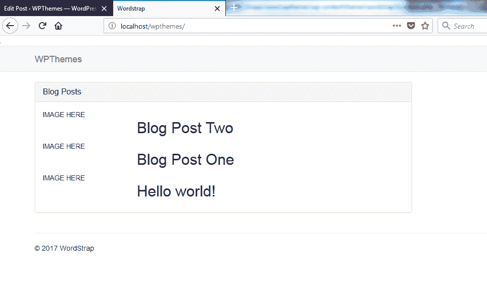

# 第四章：构建 Twitter Bootstrap WordPress 主题

在本章中，我们将集成 Bootstrap 与 WordPress。我们之前创建的模板的外观相当简单。我们没有追求一些壮观的设计。这个项目的目标是让你看到我们如何将 Bootstrap 和 WordPress 结合起来，并使用它来构建更多 WordPress 的 Bootstrap 主题。

在本章中，我们将涵盖以下主题：

+   构建 Bootstrap 主题

+   处理文章循环

+   实现导航栏

+   添加搜索栏和单篇文章页面

+   探索评论功能

那么，让我们来构建一个 Twitter Bootstrap WordPress 主题。

# 构建 Bootstrap 主题

在我们之前创建的模板中，我们有一个标准的 Bootstrap 导航栏，你可以看到我们有一个下拉菜单：


我们实现下拉功能的方式是使用 `wp-bootstrap-navwalker` 类，如以下截图所示：[www.github.com/twittem/wp-bootstrap-navwalker](http://www.github.com/twittem/wp-bootstrap-navwalker)：


这是将 Bootstrap 导航栏与下拉功能集成到 WordPress 中最常见且可能也是最容易的方法。让我们来实现它。

如前所述，我们在 WordPress 页面上有搜索框。我们在 `header` 文件中有一些自定义代码，允许我们使用搜索框并使其正确工作，这对文章和页面都适用。

例如，如果我输入 `lorem` 并点击搜索按钮，它将返回包含单词 *lorem* 的所有内容：


如果我们进入后台，我们可以看到我们有一些之前创建的文章：


我们在主页上也有它的特色图片：


这是我们在后台作为特色图片选择的相同图片：


如果我们点击首页上的标题或“阅读更多”按钮，它将带我们到一个包含较大图片的内部页面：


你会看到评论位于页面底部，以及评论表单：


现在在右侧，我们有一个如下所示的侧边栏小部件：


我们实际上对一些核心小部件进行了一些调整，以便我们可以使用 Bootstrap 列表组。我们将调整以下小部件：分类、近期文章和近期评论。这样做是为了使它们与 Bootstrap 主题相匹配。

让我们开始构建我们的 WordPress Bootstrap 主题：

1.  前往 `localhost/wpthemes/`。

我们可以看到的是一个没有任何文章的默认 WordPress 安装。因此，我们从零开始。

1.  在 Sublime Text 编辑器中，我们有侧边栏，可以查看 WordPress 项目根目录，在`themes`文件夹中，我们可以看到我们有一些默认主题：


1.  现在在`themes`文件夹中创建一个新的文件夹，命名为`wordstrap`：


1.  接下来，我们将为它创建一个`style.css`文件。此文件也像是一个清单文件。

1.  我们需要添加我们的注释，然后添加一个名为`Theme Name`的`Wordstrap`。然后我们需要添加`Author`名称、`Author URI`、`Description`和`Version`，如下面的代码块所示：

```php
      /*
      Theme Name: Wordstrap
      Author: Brad Traversy
      Author URI: http://eduonix.com
      Description: Simple Bootstrap Theme For Wordpress
      Version: 1.0
      */
```

1.  保存它，然后让我们创建一个`index.php`文件。

1.  如果我们转到外观 | 主题，我们可以看到我们现在有了这个 wordstrap 主题：


1.  现在，我们将一个图像文件放在`theme`文件夹中。你可以从你的项目文件中取任何图像。非常简单，让我们继续重新加载。我们有 wordstrap 主题，它非常简单。

1.  现在，让我们进入`index.php`并添加一些基本的 HTML 标签：`<head>`、`<title>`和`<body>`。我们将添加`Wordstrap`作为标题：

```php
      <!DOCTYPE html>
      <html>
      <head>
         <title>Wordstrap</title>
      </head>
      <body>

      </body>
      </html>
```

1.  接下来，我们需要 Bootstrap。让我们继续前进并获取它。转到[`getbootstrap.com/`](https://getbootstrap.com/)并下载它：


1.  打开下载的 ZIP 文件和我们的`theme`文件夹。

1.  现在，在`wordstrap`文件夹内创建一个`css`文件夹。我们将现在将`bootstrap.css`文件移动过来。

1.  然后，我们将创建一个`js`文件夹并将`bootstrap.js`文件移动过来。

1.  现在，让我们回到`index.php`文件并包含几个`<link>`标签。为此，我们将添加以下代码：

```php
      <!DOCTYPE html>
      <html>
      <head>
         <title>Wordstrap</title>
         <link rel="stylesheet" href="">
      </head>
```

1.  现在，我们将进入`css`文件夹和`bootstrap.css`。接下来，我们还想确保包含主样式表。为此，Bootstrap 提供了一个我们可以使用的函数。我们将添加`stylesheet`然后是`href`。我们还可以添加一些`php`标签，添加`bloginfo`，这里我们只想放入`stylesheet_url`。现在它将带来所有系统样式表：

```php
      <!DOCTYPE html>
      <html>
      <head>
         <title>Wordstrap</title>
         <link rel="stylesheet" href="./css/bootstrap.css">
         <link rel="stylesheet" href="<?php 
            bloginfo('stylesheet_url'); ?>">
      </head>
      <body>
```

1.  现在，我们想要获取一个导航栏。

因此，在 Bootstrap 网站上，让我们转到组件然后是 navbar：


1.  让我们复制以下截图所示的整个代码示例：


1.  我们将把它粘贴到`index.php`文件的`body`部分。

1.  保存它，然后让我们继续激活主题。

1.  现在，让我们转到前端并重新加载：


它看起来像这样是因为它没有看到`bootstrap.css`文件。

1.  让我们看看源代码。你可以看到前端正在查看`/css/bootstrap`，但实际上这个文件在`themes`文件夹中：


1.  为了解决这个问题，我们将回到`index.php`。让我们更新`<link>`标签的代码如下：

```php
      <link rel="stylesheet" href="<?php 
         bloginfo('template_directory'); ?>/css/bootstrap.css">
      <link rel="stylesheet" href="<?php 
         bloginfo('stylesheet_url'); ?>">
```

1.  我们将保存它，返回，并查看它是否工作：


1.  为了稍微改变导航栏，我们将缩进 `<nav>` 标签。

1.  现在，我们将大量删除代码。首先，我们将删除 `fluid`；我们希望它只是 `container`：

```php
      <div class="container">
```

1.  我们将删除我们不需要的注释。

1.  然后，我们有 `navbar-header` 类。这个按钮是为了响应式设计。所以当它在移动设备或一般较小的屏幕上时，我们将有一个可以点击的按钮，然后显示菜单，所以我们将保留所有这些内容：

```php
      <div class="navbar-header">
         <button type="button" class="navbar-toggle collapsed" 
           data-toggle="collapse" data-target="#bs-example-navbar-
           collapse-1" aria-expanded="false">
```

1.  对于品牌，让我们稍微改变一下代码。我们希望它反映我们在 WordPress 中的网站名称。我们将添加 `<?php bloginfo(); ?>` 并传递 `name`。对于 `href`，我们将添加 `<?php bloginfo(); ?>` 链接并放入 `url`：

```php
      <a class="navbar-brand" href="<?php bloginfo('url'); ?>">
       <?php bloginfo('name'); ?></a>
```

1.  然后，我们有 `<ul>` 标签，我们将在这里实现 `wp-nav-walker` 类。为此，我们只需移除整个 `<ul>`。

1.  然后，我们有我们的表单，即搜索表单。它将几乎完全重做，所以我们将从 `<form>` 标签中移除所有内容。

1.  然后，我们将移除带有 `nav navbar-nav navbar-right` 类的整个 `<ul>`。

1.  这里是整个 `nav`：

```php
      <nav class="navbar navbar-default">
      <div class="container">

      <div class="navbar-header">
      <button type="button" class="navbar-toggle collapsed" 
       data-toggle="collapse" data-target="#bs-example-navbar-
       collapse-1" aria-expanded="false">
         <span class="sr-only">Toggle navigation</span>
         <span class="icon-bar"></span>
         <span class="icon-bar"></span>
         <span class="icon-bar"></span>
      </button>
      <a class="navbar-brand" href="<?php bloginfo('url'); ?>">
      <?php bloginfo('name'); ?>
      </a>
      </div>

      <div class="collapse navbar-collapse" 
       id="bs-example-navbar-collapse-1">

      <form class="navbar-form navbar-left">

      </form>

      </div>
      </div>
      </nav>
```

1.  我们现在暂时不处理这个，看看它是什么样子：


如您所见，它非常基础。我们只有我们的品牌，我们稍后会实现 `walker-nav` 或 `nav-walker` 类；但让我们继续添加一些基本的 HTML。

1.  我们将在 `</nav>` 结束标签下方创建一个 `<div>` 标签，并给它一个类名为 `container`，同时添加 `index`。我们还将添加一行，因为我们将使用 Bootstrap 的网格系统。在 `row` 类内部，我们将使用 `col-md-8` 添加一个列，这将是一个 8 列的 div，我们还将有一个 4 列的 div，这将是一个侧边栏：

```php
      <div class="container index">
         <div class="row">
            <div class="col-md-8">

            </div>
            <div class="col-md-4">

            </div>
         </div>
      </div>
```

1.  所以在 8 列的 div 内，我们将使用 `class="panel"` 和 `panel-default` 添加一个面板：

```php
      <div class="col-md-8">
        <div class="panel panel-default">

      </div>
```

1.  接下来，我们将添加 `panel-heading`，在 `panel-heading` 中我们将有一个 `<h3>` 标签。我们将给它一个类名为 `panel-title`，并且给它标题 `Blog Posts`：

```php
      <div class="panel panel-default">
         <div class="panel-heading">
 <h3 class="panel-title">Blog Posts</h3>
         </div>
      </div>
```

1.  现在，在标题 `</div>` 下方，我们将添加 `panel-body` div。为此，我们想要一个名为 `panel-body` 的 `div class`。然后我们将使用 `if(have_posts())` 添加文章循环，并使用以下代码块中显示的简写语法：

```php
         <h3 class="panel-title">Blog Posts</h3>
      </div>
      <div class="panel-body">
 <?php if(have_posts()): ?>

 <?php endif; ?>
      </div>
```

1.  然后，我们将添加如下代码块所示的 `while` 循环：

```php
      <?php if(have_posts()): ?>
         <?php while(have_posts()) : the_post(); ?>

 <?php endwhile; ?>
      <?php endif; ?>
```

1.  接下来，我们将添加两个列，一个用于图片，另一个用于所有数据。所以让我们添加一个名为 `row` 的类，然后我们将添加一个 `div class`，其值为 `col-md-3`。接下来，我们将添加 `IMAGE HERE` 并使用 `col-md-9` 添加九列。然后我们将使用 `<h2>` 添加 `the_title()`：

```php
<?php while(have_posts()) : the_post(); ?>
   <div class="row">
 <div class="col-md-3">
 IMAGE HERE
 </div>
 <div class="col-md-9">
 <h2><?php echo the_title(); ?></h2>
 </div>
```

1.  让我们保存一下：


如您所见，我们有一个 3 列的 div 用于放置图片，然后是一个 9 列的内容。我们将回头添加所有内容，但让我们先添加侧边栏代码。

# 添加侧边栏

这将是一个部件区域，为此，我们首先需要创建一个`functions.php`文件。我们需要注册我们想要的部件，这将只是侧边栏：

1.  在`index.php`文件中，紧挨着`div class`的地方，我们将添加`<?php`。然后我们将使用`if(is_active_sidebar)`来检查这里是否有一个活跃的部件，并且如果需要实际的部件位置（这将是一个`sidebar`）：

```php
      <div class="col-md-4">
         <?php if(is_active_sidebar('sidebar')) : ?>
      </div>
```

1.  接下来，我们将添加`<?php dynamic_sidebar(); ?>`。我们还需要位置，这个位置是`sidebar`。它不必称为`sidebar`；你可以称它为你想要的任何名字：

```php
      <?php if(is_active_sidebar('sidebar')) : ?>
         <?php dynamic_sidebar('sidebar'); ?>
      <?php endif; ?>
```

现在让我们保存一下。

# 添加页脚

现在让我们快速添加页脚：

1.  在`container` div 下面，我们将创建另一个容器。在这个容器中我们将放置一条水平线以及`<footer>`标签。在`<footer>`内部我们将有一个段落和版权信息：

```php
      <div class="container">
         <hr>
         <footer>
            <p>&copy; 2017 WordStrap</p>
         </footer>
      </div>
```

1.  现在，我们还想包含两个东西：我们想要 jQuery 和 Bootstrap JavaScript 文件。我们将 JavaScript 文件放置在结束的`</div>`下面，如下面的代码所示。我们将粘贴 jQuery 脚本，它只是**CDN**（**内容分发网络**），以及`bootstrap.js`。我们还将使用`<?php bloginfo('template_directory'); ?>`，就像我们处理`css`文件时一样：

```php
         </div>
         <script src="img/jquery-1.12.0.min.js">
         </script>
         <script src="img/bootstrap.js">
         </script>
      </body>
      </html>
```

1.  让我们保存一下并重新加载：


# 头部和页脚

现在，让我们将这个分成一个头部文件、一个页脚文件以及`index.php`：

1.  从`index.php`文件中，我们将从顶部向下抓取代码，直到`</nav>`的结尾。

1.  让我们创建一个新的文件，命名为`header.php`。我们将把之前抓取的代码粘贴到这个头部文件中并保存。

1.  在`index.php`中的相应位置，我们将使用`get_header()`打开一组`php`标签：

```php
 <?php get_header(); ?>
         <div class="container index">
```

我们的页面看起来将完全一样。

1.  然后，我们将对`footer`做同样的事情。我们将从这个`container`开始抓取代码，直到非常底部，从`<div class="container">`到关闭的`</html>`标签：

```php
      <div class="container">
         <hr>
         <footer>
            <p>&copy; 2017 WordStrap</p>
         </footer>
     </div>
     <script src="img/jquery-1.12.0.min.js">
     </script>
     <script src="img/bootstrap.js">
     </script>
     </body>
     </html>
```

创建一个`footer`文件，粘贴抓取的内容，并保存。

1.  在`index.php`中，我们将添加`get_footer()`：

```php
      <?php get_footer(); ?>
```

1.  好的，现在它应该看起来完全一样。这使事情变得稍微整洁一些。

# 帖子循环

所以到目前为止，我们继续设置了我们的核心模板，核心主题，包括`index`、`header`和`footer`文件。我们已实现了主要帖子循环，但我们没有其他东西。我们只有标题；我们需要修复这个问题。

但在我们这样做之前，我们需要确保我们实际上可以添加图片到我们的帖子中。

这是因为现在如果我们去尝试添加一个新的帖子，我们没有特色图片区域：


# 特色图片区域

为了让特色图片区域显示，我们需要创建一个`functions.php`文件：

1.  让我们创建一个新的文件，并命名为`functions.php`。然后让我们创建一个名为`theme_setup()`的函数。现在，让我们添加一个注释`特色图片支持`，并添加`add_theme_support()`，其值为`post-thumbnails`：

```php
      <?php

      function theme_setup(){
          // Featured Image Support
          add_theme_support('post-thumbnails');
      }
```

1.  在函数声明下方，我们将放置 `add_action()` 并传递我们想要的钩子，它将是 `after_setup_theme`。然后我们将放置我们想要使用的函数，即 `theme_setup`：

```php
      add_action('after_setup_theme', 'theme_setup');
```

1.  让我们保存并刷新：


现在你可以看到我们有一个特色图片区域。

# 创建类别

1.  所以让我们先创建几个类别，然后再添加文章。让我们添加“技术”、“食品”、“娱乐”和“商业”类别，如下面的截图所示：


1.  我们现在只选择技术类别，并将标题设置为“博客文章一”。我们将像之前一样从 Lorem Ipsum 网站复制一些文本，并将其粘贴进来：


1.  现在我们需要选择一个特色图片：


1.  我们可以选择任何图片。在这种情况下，我选择了一张微软 Surface 的图片。点击“设置特色图片”然后发布：


1.  返回并刷新页面：


你可以看到文章，但它看起来不太好。所以让我们再加一个。

1.  同样，我们将添加“博客文章二”，粘贴一些文本，让我们选择“食品”类别，然后上传一张图片。我们将选择汉堡图片并点击发布。

1.  我们现在有几篇文章可以工作：



我们在这里遇到了一个问题，因为我们把图片放在了文章的独立列中，而有些文章可能没有图片。例如，Hello world 文章就没有图片。所以我们需要有一种条件语句，如果这篇文章有图片，我们就以某种方式格式化它，然后放置一个 else 语句；如果没有图片，我们将以不同的方式格式化。

# 格式化文章

1.  让我们进入我们的 `index.php` 文件。你可以看到我们的循环和行：

```php
      <?php while(have_posts()) : the_post(); ?>
         <div class="row">
            <div class="col-md-3">
               IMAGE HERE
            </div>
            <div class="col-md-9">
               <h2><?php echo the_title(); ?></h2>
            </div>
         </div>
      <?php endwhile; ?>
```

1.  在 `row` div 的右边，我们将检查是否有图片使用 `if(has_post_thumbnail())`，在 `</div>` 结束的地方添加 `<?php else : ?>` 和 `<?php endif; ?>`。

```php
      <div class="row">
         <?php if(has_post_thumbnail()): ?>
         <div class="col-md-3">
            IMAGE HERE
         </div>
         <div class="col-md-9">
            <h2><?php echo the_title(); ?></h2>
         </div>
         <?php else : ?>

         <?php endif; ?>
```

1.  如果有缩略图，它将显示三列和九列，如果没有缩略图，我们希望它是十二列全宽。为此我们将使用：

```php
      <?php else: ?>
         <div class="col-md-12">
 IMAGE HERE
 </div>
      <?php endif; ?>
```

1.  我们将从带有缩略图的文章开始。我们将移除文本“此处显示图片”。然后我们创建一个具有 `post-thumbnail` 类的 `div`，然后我们可以使用 `the_post_thumbnail()`：

```php
      <div class="col-md-3">
         <div class="post-thumbnail">
         <?php the_post_thumbnail(); ?>
         </div>
```

1.  让我们看看到目前为止的情况：


所以它显示了图片，它们非常大，但这没关系，功能是有的。

# 将文章包裹在 `<article>` 标签中

让我们将文章包裹在 `<article>` 标签中：

1.  在 `while` 循环中直接添加 `<article>`，给它一个 `post` 类，并在结束 `</div>` 后结束它：

```php
 <article class="post">
         <div class="row">
            <?php if(has_post_thumbnail()): ?>
               <div class="col-md-3">
                  <div class="post-thumbnail">
                  <?php the_post_thumbnail(); ?>
                  </div>
               </div>
               <div class="col-md-9">
                  <h2><?php echo the_title(); ?></h2>
               </div>
          <?php else : ?>
             <div class="col-md-12">

             </div>
          <?php endif; ?>
      </div>
      </article>
```

1.  现在，打开 `style.css` 文件并添加 `article.post img`。我们将设置 `width` 为 `100%`。它将是其容器的 100%。我们还将设置 `height` 为 `auto`，并使用 `margin-top:30px`。

```php
      article.post img{
          width:100%;
          height:auto;
          margin-top:30px;
      }
```

1.  现在如果我们重新加载页面，我们会得到这个：


看起来好多了。

1.  现在，让我们回到 `index.php` 文件。我们希望标题是一个链接。让我们直接跳到 `<h2>` 标签，并使用 `echo the_permalink()` 放入一个 `<a>` 标签。这应该是一个链接到那个帖子的链接：

```php
      <h2>
         <a href="<?php echo the_permalink(); ?>">
            <?php echo the_title(); ?>
         </a>
      </h2>
```

1.  现在，在 `<h2>` 标签下，我们将放置元数据。我们将在一个段落中添加它，并给它一个 `meta` 类。然后我们将添加“发布于”并使用 `the_time()` 函数获取时间。我们将使用“在”然后添加 `the_date()`。我们将打开一些 `<strong>` 标签，并使用 `the_author()` 函数添加作者的名字，这应该是一个函数：

```php
      </h2>

      <p class="meta">
      Posted At
      <?php the_time(); ?> on 
      <?php the_date(); ?> by 
      <strong><?php the_author(); ?></strong>
      </p>
```

1.  让我们确保它正常工作：


你可以看到它告诉我们时间、日期，以及作者。此外，这是一个链接，所以如果我点击它，它会带我们到那个页面或帖子。

# 添加帖子内容

现在我们想要的是摘要或内容，但不是全部。我们将使用 `excerpt` 类而不是 `content`，因为那样会截断内容。让我们开始吧！

1.  我们希望仍然在九列的 `div` 中，所以我们将进入段落标签并添加 `<div class="excerpt">`。然后我们将添加 `<?php echo get_the_excerpt(); ?>`：

```php
      </p>

      <div class="excerpt">
      <?php echo get_the_excerpt(); ?>
      </div>
```

1.  让我们看看它是否有效：


看起来不错！

# 添加“阅读更多”按钮

现在，我们还需要一个“阅读更多”按钮：

1.  我们将直接在摘要类下面，使用 Bootstrap 类的 `btn` 和 `btn-default`。然后我们将使用 `href` 并将其设置为 `the_permalink()`。对于文本，我们将说“阅读更多”，对于箭头符号，我们可以使用 `&raquo;`。我们还将在这个类上方添加一个换行符：

```php
      <br>
      <a class="btn btn-default" href="<?php the_permalink(); ?>">
      Read More &raquo;
      </a>
```

1.  重新加载并看看效果：


# 处理没有图片的帖子

所以现在我们想要处理那些没有图片的帖子。目前“Hello World”帖子没有图片，它没有显示出来，因为我们还没有在那儿添加任何代码。所以现在让我们检查缩略图：

1.  这个 `div` 是放置没有图片的帖子代码的地方：

```php
      <div class="col-md-12">
         <h2>
            <a href="<?php echo the_permalink(); ?>">
            <?php echo the_title(); ?>
            </a>
         </h2>

         <p class="meta">
         Posted at
         <?php the_time(); ?> on 
         <?php the_date(); ?> by 
         <strong><?php the_author(); ?></strong>
         </p>

        <div class="excerpt">
        <?php echo get_the_excerpt(); ?>
        </div>
        <br>
        <a class="btn btn-default" href="<?php 
          the_permalink(); ?>">
        Read More &raquo;
        </a>
```

1.  现在我们可以有没有图片的帖子，而不仅仅是空空间：


如果我们没有使用条件语句，那么这就会在图片应该出现的地方留下一个空空间。

# 添加一些样式

现在我们将添加一点 CSS 来让帖子看起来更好一些：

1.  让我们去 `style.css` 文件，并使用 `article.post` 为每个帖子的底部添加一个边框。边框将是灰色，`solid`，`1px` 宽。此外，让我们使用 `padding-bottom: 20px` 和 `margin-bottom: 30px` 添加一些内边距：

```php
      article.post{
          border-bottom: #ccc solid 1px;
          padding-bottom: 20px;
          margin-bottom: 30px;
      }
```

1.  让我们添加最后一个文章或帖子。我们不想为它添加边框。我们将添加`article.post`并使用`last-child`来定位最后一个，并将`border-bottom`设置为`none`：

```php
      article.post:last-child{
          border-bottom:none;
      }
```

1.  对于元数据，我们将使用`article.post .meta`添加一些样式，并给它一个浅灰色背景。我们还将添加一些填充，`8px`和`12px`。让我们添加一个颜色；我们将使用深灰色。

让我们保存它并重新加载：


现在看起来好多了。

在下一节中，我们将看到如何使用`custom-walker`类设置 navbar。

# 实现 Navbar

我们现在将看到如何使用`wp-bootstrap-navwalker`在 WordPress 主题中实现 Bootstrap navbar。这是一个非常流行的脚本，它将集成 navbar，以便你可以创建子项等。

# 显示菜单

1.  前往[www.github.com/twittem/wp-bootstrap-navwalker](http://www.github.com/twittem/wp-bootstrap-navwalker)，我们将直接下载 ZIP 文件。打开 ZIP 文件，你会看到一个包含 PHP 文件的文件夹：


1.  让我们打开我们的项目文件夹。我们将把 PHP 文件复制到我们的文件夹中。

1.  打开`functions.php`文件，我们想要包含`wp_bootstrap_navwalker.php`文件，如下所示：

```php
      <?php

      require_once('wp-bootstrap-navwalker.php');

      function theme_setup(){
          // Featured Image Support
          add_theme_support('post-thumbnails');
      }

      add_action('after_setup_theme', 'theme_setup');
```

正如你所见，我们使用了`require_once()`与`wp_bootstrap_navwalker.php`。保存它。

1.  返回 GitHub 页面，我们将处理其用法。我们想在 navbar 中使用`wp_nav_menu()`函数。为此，让我们复制高亮部分：


1.  进入我们的`header`文件，其中包含 navbar，进入包含`collapse`类的`div`，我们将粘贴以下代码块中的代码：

```php
      <div class="collapse navbar-collapse" 
        id="bs-example-navbar-collapse-1">
         <?php
            wp_nav_menu( array(
            'theme_location' => 'primary',
            'depth' => 2,
            'container' => 'div',
            'container_class' => 'collapse navbar-collapse',
            'container_id' => 'bs-example-navbar-collapse-1',
            'menu_class' => 'nav navbar-nav',
            'fallback_cb' => 'WP_Bootstrap_Navwalker::fallback',
            'walker' => new WP_Bootstrap_Navwalker(),
          ));
       ?>
       <form class="navbar-form navbar-left">

       </form>
       </div>
```

1.  这基本上为我们定义了一组选项。我们不需要所有这些。我们将去掉一些东西。以下是更新后的代码：

```php
      wp_nav_menu( array(
          'theme_location' => 'primary',
          'depth'          => 2,
          'container'      => false,
          'menu_class'     => 'nav navbar-nav',
          'fallback_cb'    => 'wp_bootstrap_navwalker::fallback',
          'walker'         => new wp_bootstrap_navwalker())
      );
```

我们有`theme_location`，它是`primary`，`depth`是`2`。我们将`container`设置为`false`。移除引号，`container_class`或`container_id`。现在保存它。

1.  现在回到`functions.php`。现在让我们通过添加以下代码来注册我们的导航菜单：

```php
 // Nav Menus
 register_nav_menus(array(
 'primary' => __('Primary Menu')
 ));
      }

      add_action('after_setup_theme', 'theme_setup');
```

在这个`theme_setup`中，我们有`register_nav_menus()`，它将接受一个数组，将被命名为`primary`。然后我们将它设置为`__()`，然后可读的名称将是`Primary Menu`。我们将保存它。

1.  让我们回到后台，点击外观。你会看到菜单选项：


1.  现在创建一个名为“关于”的额外页面并点击发布。让我们再创建一个，命名为“我们的团队”：


1.  返回菜单页面，让我们看看这个菜单。让我们创建一个新的菜单并命名为“关于”：


1.  确保你检查了主菜单选项，然后保存它：


1.  前往我们的前端并重新加载。你现在会看到我们有了菜单，并且它工作正常：


1.  现在让我们测试下拉功能。我们只需要选择“示例页面”和“我们的团队”，并将它们放在“关于”下面，如下面的截图所示：


1.  保存菜单，返回，现在我们有一个下拉菜单：


所以你可以看到实现导航栏是多么简单，这绝对是你可以在其他项目中使用的东西，任何 Bootstrap WordPress 主题。

# 设置侧边栏

现在我们来设置侧边栏，以便我们可以添加侧边栏小工具：

1.  在 `add_action()` 下的 `functions.php` 文件中，我们将创建一个名为 `init_widgets()` 的函数，它将接受一个 `id`。我们将添加 `register_sidebar()`，它将接受一个 `array`。然后我们有一系列选项，所以让我们添加 `'name' => 'Sidebar'` 和 `'id' => 'sidebar'`。

```php
      // Widget Locations
      function init_widgets($id){
          register_sidebar(array(
              'name' => 'Sidebar',
              'id'   => 'sidebar'
          ));
      }
```

我们还可以在这里包含其他内容；例如，我们可以添加 `'before_widget'`：

```php
      'id' => 'sidebar',
      'before_widget' => '<div class="panel panel-default">'
```

现在这样做的作用是允许我们在小工具渲染之前插入代码。我们需要这样做，因为我们希望小工具在 Bootstrap 面板内渲染，所以我们需要包含面板类。我们可以看到一个具有 `panel` 类的 `div`，还有 `panel-default`。

1.  然后添加 `'after_widget'`，它将只是两个结束 div 标签：

```php
'after_widget' => '</div></div>',
```

我们现在也有能力在标题前后添加内容。

1.  要使用这个功能，我们将使用 `'before_title'`，这将包含一个具有 `panel-heading` 类的 div。我们还想包含 `<h3>` 标签，并给它一个 `panel-title` 类：

```php
      'before_title' => '<div class="panel-heading">
        <h3 class="panel-title">',
```

1.  最后，我们将添加 `'after_title'` 并结束 `</h3>` 和 `</div>`，然后我们还想开始 `panel-body` 类：

```php
      'after_title' => '</h3></div><div class="panel-body">'
```

1.  现在我们需要添加一个动作，所以我们将放置 `add_action()`。钩子将是 `widgets_init`，函数为 `init_widgets`：

```php
      add_action('widgets_init', 'init_widgets');
```

1.  保存它。如果我们现在进入后端并重新加载页面，你应该现在在“外观”下有“小工具”选项，也应该看到“侧边栏”：


1.  现在让我们将“分类”包含进来，然后点击保存：


1.  让我们看看这些是否渲染：


所以现在我们有我们的分类，你可以看到现在我们还有围绕它的面板。

1.  让我们也将“最近的文章”包含进来，将显示的文章数改为 `3`，并将“最近评论”包含进来：


1.  现在我们来看看我们的页面：


现在它们就在那里了！现在我们有一个问题，因为我想要分类以列表组的形式显示，这比这个格式更好。它们去掉了项目符号，添加了一些填充，并添加了一些边框。所以我们需要在我们的`theme`文件夹内创建这些小部件的自己的版本。

1.  在`theme`文件夹内，我们将创建另一个名为`widgets`的文件夹。我们将通过文件管理器进入这个文件夹。现在转到`wp-includes` | `widgets`。你将在这里看到所有的核心小部件文件：


1.  我们想要获取分类、最近的评论和最近的帖子。我们将复制（确保不要剪切，而是复制）并将它们粘贴到我们的`widgets`文件夹中。

1.  现在我们从分类开始。让我们通过 Sublime Text 打开它。在这里我们将更改类名：在前面加上一个`_`然后是`Custom`。

```php
      class WP_Widget_Categories_Custom extends WP_Widget {
```

1.  接下来，我们将更改`<ul>`和`<li>`标签的类名。我们将添加 Bootstrap 类。为此，我们将向`<ul>`标签添加`class="list-group"`：

```php
      <ul class="list-group">
```

1.  现在我们还希望列表项具有`list-group-item`类，但按照这种方式设置，我们无法从内部访问列表项标签。所以我们需要在`functions.php`文件中进行一些定制。

所以让我们打开`function.php`文件，到达底部，首先添加一个注释：`向分类的 li 添加'list-group-item'`，这样我们就能知道它是做什么的。然后我们添加函数`add_new_class_list_categories()`：

```php
      // Adds 'list-group-item' to categories li
      function add_new_class_list_categories(){
```

1.  我们将通过添加`$list = str_replace()`来传递一个变量，然后我们添加`cat-item`，这是原始的类名，但我们要更改它。现在我们仍然希望它具有`cat-item`类，因为它需要这个类，但我们还希望添加`list-group-item class`。然后我们只需要返回列表。

```php
      function add_new_class_list_categories($list){
      $list = str_replace('cat-item', 'cat-item list-group-item', 
        $list);
      return $list;
```

1.  现在我们将添加`add_filter()`而不是添加动作。基本上，动作用于添加某些内容，而过滤器用于更改某些内容。所以让我们使用`add_filter('wp_list_categories')`然后放置我们函数的名称：

```php
      add_filter('wp_list_categories', 
        'add_new_class_list_categories');
```

1.  我们还没有摆脱这些小部件；我们必须注册它们。所以在做之前，我们需要在顶部包含它们或使用`require`。所以我们将添加`require_once()`。它将是`widgets`文件夹，然后我们只需要包含每个小部件。我们将使用`class-wp-widget-categories.php`：

```php
      require_once('widgets/class-wp-widget-categories.php');
```

1.  我们不妨包括所有这些。所以我们将获取最近的帖子以及最近的评论：

```php
      require_once('widgets/class-wp-widget-recent-posts.php');
      require_once('widgets/class-wp-widget-recent-comments.php');
```

现在我们需要注册。

1.  在底部，我们将添加`function wordstrap_register_widgets()`。我们还需要类名，所以我们添加`'WP_Widget_Recent_Posts_Custom'`。下一个将是`'WP_Widget_Recent_Comments_Custom'`。最后一个将是添加`'WP_Widget_Categories_Custom'`：

```php
      //Register Widgets
      function wordstrap_register_widgets(){
          register_widget('WP_Widget_Recent_Posts_Custom');
          register_widget('WP_Widget_Recent_Comments_Custom');
          register_widget('WP_Widget_Categories_Custom');
      }
```

1.  现在我们添加另一个`add_action()`，这将是`'widgets_init'`，然后我们只需要函数名：

```php
      add_action('widgets_init', 'wordstrap_register_widgets');
```

1.  让我们保存并重新加载页面：


1.  我们得到一个错误：无法声明类`Recent_Posts`。所以让我们验证一下我们的代码：

```php
      class WP_Widgets_Recent_Posts_Customs extends WP_Widget {
      class WP_Widgets_Recent_Comments_Customs extends WP_Widget {
```

所以这些也应该有`_Custom`。现在重新加载页面：


所以我们现在已经注册了所有小工具，并且分类现在有了`list-item`类，看起来不错。我们还想将这些类添加到最近帖子中，以及最近评论，这样我们就不会看到项目符号，而是看起来像分类一样。

1.  所以让我们去我们的`class-wp-widget-recent-posts.php`小工具文件，并找到`<ul>`标签。我们只需添加一个`list-group`类，然后`<li>`标签将有一个`list-group-item`类：

```php
 <ul class="list-group">
      <?php foreach ( $r->posts as $recent_post ) : ?>
         <li class="list-group-item">
```

让我们重新加载页面；看起来不错！


1.  现在，让我们转到`class-wp-widget-recent-comments.php`。我们将给`<ul>`添加一个`list-group`类，然后对于`<li>`标签，我们将添加一个`list-group-item`类：

```php
      $output .= '<ul class="list-group" id="recentcomments">';
      if(is_array($comments) && $comments){
      $post_ids = array_unique(wp_list_pluck($comments, 'comment_post_ID'));
      _prime_post_caches($post_ids, strpos(get_option('permalink_structure'), 
      '%category'), false);
      foreach((array) $comments as $comment){
          $output .= '<li class="list-group-item recentcomments">';
```

保存，重新加载，就这样：


所以现在我们有一些自定义小工具。如果你想，你可以让小工具看起来完全不同，这只会影响当你加载主题时的小工具，这样你就不会编辑任何核心 WordPress 代码。我们已经设置了导航栏以及侧边栏小工具。

# 添加搜索栏和单个帖子页面

所以让我们开始吧。

# 处理搜索框

去我们的`header`文件，找到文件底部的空表单，并给它添加一些内容。我们首先会添加一个方法，这个方法是`get`。我们实际上可以改变类从左到右。我们还需要添加一个操作。为此，我们将使用`php`标签并添加`echo esc_url()`。

这是因为我们想要检查和转义 URL。我们将使用`home_url`并加上一个`/`：

```php
<form method="get" class="navbar-form navbar-right" 
 role="search" action="<?php echo esc_url(home_url('/')); ?>">
```

基本上，我们只是提交到主页 URL。

1.  现在关于字段，我们只想为搜索添加一个字段，但让我们添加一个标签。所以我们将添加`<label for="navbar-search"`并给它一个`sr-only`类。接下来，让我们添加`<?php _e('Search')`，这只是对`_e`的本地化。然后我们需要`textdomain`的第二个参数。然后关闭那些`php`标签，并在`</label>`标签下添加`<div class="form-group">`。在 div 类中我们将有一个输入框。我们将给它一个类型为`text`的类，并给它一个`form-control`类，这是一个 Bootstrap 类。让我们添加一个名为`s`的搜索名称，并给它一个`id`为`navbar-search`：

```php
      <label for="navbar-search" class="sr-only">
      <?php _e('Search', 'textdomain'); ?></label>
      <div class="form-group">
      <input type="text" class="form-control" name="s" 
        id="navbar-search">
      </div>
```

1.  然后我们需要提交。所以我们将添加一个类型为`submit`的按钮，并给它一个`btn`和`btn-default`的类：

```php
      <button type="submit" class="btn btn-default">
      <?php _e('Search', 'textdomain'); ?>
      </button>
```

让我们保存它。

现在，让我们搜索`lorem`，它给出了这些结果：


你也可以尝试搜索单词`one`或`two`。

现在我们有了搜索栏，我们最后需要做的是单个帖子。

# 处理单个帖子页面

1.  让我们在主题根目录下创建一个文件，并将其保存为`single.php`。

1.  现在在创建这个文件时，如果我们点击这些博客文章中的任何一个，它将完全为空，因为它会自动查看`single.php`页面。

1.  现在，我们将复制`index.php`文件中的所有内容，并将其粘贴到`single.php`文件中。保存并重新加载页面；它看起来与索引页完全一样：


1.  让我们进去并更改一些内容。首先，让我们删除`if(has_post_thumbnail())`。现在向下到说 else 的地方，并从那里剪切到实际的`if`语句。

    我们还将删除`endif`，因为我们将以不依赖于图片是否存在的方式来格式化它。

1.  我们想要图片，所以我们将将其放在下面，直接在结束的`</h2>`标签下方：

```php
      <?php if(has_post_thumbnail()): ?>
         <div class="post-thumbnail">
            <?php the_post_thumbnail(); ?>
         </div>
      <?php endif; ?>
```

1.  我们将添加缩略图或特色图片，如果有的话。让我们保存并看看它看起来像什么：


1.  现在我们有了大图片，让我们在它下面也添加一个换行符`<br>`。

```php
      <?php endif; ?>
      <br>
```

我们不想要“阅读更多”，我们想要完整的内容而不是摘录。

1.  所以让我们去掉“阅读更多”，而不是使用`get_the_excerpt()`，我们使用`the_content()`。我们还将删除`echo`。让我们也将类更改为`content`：

```php
      <div class="content">
      <?php the_content(); ?>
      </div>
```

1.  保存并重新加载：


现在它也渲染了 HTML。所以这就是单页。

接下来，我们还将处理评论功能。

# 评论功能

我们最后需要做的是在我们的单篇帖子页面添加一些评论功能：

1.  让我们进入`single.php`并向下。我们想要在面板体中完成，所以它就在那里显示。

1.  让我们创建一个评论模板并添加`comments_template()`：

```php
         <?php endif; ?>
         <?php comments_template(); ?>
      </div>
```

1.  我们将保存并创建一个新文件。我们将将其保存为`comments.php`。

这需要在你的`theme`文件夹中，然后如果我们在这里输入一些内容，我们将说`TEST`。

1.  如果我们保存并重新加载，你可以看到我们得到了 TEST：


现在，让我们创建一个带有`comments`类的`div`，并添加`<?php if(have_comments); ?>`。

1.  我们还添加了带有`comments_title`类的标题`<h3>`。我们将添加`if(get_comments_number() == 1)`。我们这样做是因为如果只有一个评论，我们应该得到单数评论，如果有多个，那么它应该说是评论。

1.  因此，我们正在检查是否有一个评论，如果有，那么我们将`echo get_comments_number()`，然后只是连接单词`Comment`。然后我们将添加一个`else`，并在末尾这里添加一个`Comments`：

```php
      <div class="comments">
      <?php if(have_comments()): ?>
         <h3 class="comments-title">
         <?php
             if(get_comments_number() == 1){
                 echo get_comments_number(). ' Comment';
             } else {
                 echo get_comments_number(). ' Comments';
             }
         ?>
         </h3>
```

所以那将是标题。

1.  然后在`</h3>`标签下，我们将有一个`<ul>`标签，给它一个`row`和`comment-list`类。我们将添加`wp_list_comments()`，这将传递一个数组。我们还将使用头像，所以让我们添加`avatar_size`并将其设置为`90`。我们还有一个`callback`，我们也要创建。

为了这个，我们将添加`add_theme_comments`，这将放在`functions.php`文件中。

```php
      <ul class="row comment-list">
      <?php
          wp_list_comments(array(
              'avatar_size' => 90,
              'callback'    => 'add_theme_comments'
          ));
      ?>
      </ul>
```

1.  现在，我们有几个大块的代码需要使用：

```php
      <?php if(!comments_open() && '0' != get_comments_number() && 
        post_type_supports(get_post_type(), 'comments')) : ?>
         <p class="no-comments"><?php _e('Comments are closed.', 
          'dazzling'); ?>
         </p>
      <?php endif; ?>
      </div>
```

上述代码将检查评论是否已关闭，如果是，则我们可以留下一个简短的注释。

1.  现在，让我们进入这个`div`下面，并添加一条水平线。然后我们需要创建我们的评论参数并创建表单：

```php
      <hr>
      <?php
          $comments_args = array(
          // change the title of send button
          'label_submit'=>'Send',
          // change the title of the reply section
          'title_reply'=>'Write a Reply or Comment',
          // remove "Text or HTML to be displayed after the set of comment 
          //fields"
          'comment_notes_after'=>'',
          // redefine your own textarea (the comment body)
          'comment_field'=>'<p class="comment-form-comment">
          <label for="comment">' ._x('Comment', 'noun') . '</label><br/>
          <textarea class="form-control" id="comment" name="comment" 
           aria-required="true">
          </textarea></p>',
          );
      comment_form($comments_args);
```

我们有一个名为`comment_args`的变量，它被设置为包含许多不同值的数组。你可以有你的提交按钮标签、回复标题、注释和类似的东西。然后在代码文件中，我们还在调用`comment_form()`函数并传递这些参数。

1.  保存并重新加载。现在如果我们去检查，你可以看到这里有一个表单。让我们试着添加一些内容：


1.  点击发送：


1.  现在在这里发生的事情是，它正在寻找我们指定的回调。它就在`add_theme_comments`中，如所示：

```php
      <?php 
          wp_list_comments(array(
              'avatar_size' => 90,
              'callback' => 'add_theme_comments'
          ));
      ?>
```

它正在寻找回调但找不到。所以让我们进入`functions.php`并修复它。

1.  我们将按照所示粘贴代码：

```php
      // Add Comments
      function add_theme_comments($comment, $args, $depth){
          $GLOBALS['comment'] = $comment;
          extract($args, EXTR_SKIP);

          if('div' == $args['style']){
              $tag = 'div';
              $add_below = 'comment';
          } else {
              $tag = 'li class="well comment-item"';
              $add_below = 'div-comment';
          }
```

所以我们有一个名为`add_theme_comments()`的函数，它应该与你的回调相匹配。然后我们传递`comment`、`args`和`depth`。正如你所见，我们在下面添加了一些标签和类，以便我们可以进行样式化。

1.  现在，我们还会发布一些其他内容。为此，让我们添加以下代码：

```php
      <<?php echo $tag ?>
      <?php comment_class(empty($args['has_children']) ? '' : 'parent') ?> 
        id="comment-<?php comment_ID() ?>">
      <?php if('div' != $args['style']) : ?>
      <div id="div-comment-<?php comment_ID() ?>" class="comment-body">
      <?php endif; ?>

      <div class="col-md-2">
      <div class="comment-author vcard">
      <?php if($args['avatar_size'] != 0) 
        echo get_avatar($comment, $args['avatar_size']); ?>
      <?php printf(__('<cite class="fn">%s</cite>'), 
         get_comment_author_link()); ?>
      </div>
      </div>

      <div class="col-md-10">
      <?php if($comment->comment_approved =='0') : ?>
      <em class="comment-awaiting-moderation">
      <?php _e('Your comment is awaiting moderation.'); ?></em>
      <br/>
      <?php endif; ?>

      <div class="comment-meta commentmetadata">
      <a href="<?php echo htmlspecialchars(get_comment_link
         ($comment->comment_ID)); ?>">
      <?php
         printf(__('%1$s at %2$s'), get_comment_date(), get_comment_time()); ?></a>
      <?php edit_comment_link(__('(Edit)'), ' ', ''); ?>
      </div>
      <?php comment_text(); ?>

      <div class="reply">
      <?php comment_reply_link(array_merge($args, array
       ( 'add_below' => $add_below, 'depth' => 
         $depth, 'max_depth' => $args['max_depth'] )));
      ?>
      </div>
      </div>

     <?php if('div' != $args['style']) : ?>
     </div>
     <?php endif; ?>
     <?php
     }
```

你可以从 WordPress 文档中获取代码（[`codex.wordpress.org/Function_Reference/wp_list_comments`](https://codex.wordpress.org/Function_Reference/wp_list_comments)）。


所以这段代码将给你正确的功能。

1.  让我们继续保存代码并看看会发生什么：

>>

1.  现在，让我们打开`style.css`和名为`comment-item`的类。所以在代码中我们添加`.comment-item`并将`overflow`设置为`auto`。我们还将添加`comment-list`并将`list-style`设置为`none`和`margin`设置为`0`。然后我们将其标记为重要并将`padding`设置为`0`：

```php
      .comment-list{
          list-style: none;
          margin:0 !important;
          padding:0 !important;
      }

      .comment-item{
          overflow:auto;
      }
```

看起来相当不错。我们可以回复并留下评论，这真的很棒。所以这就完成了，我们已经完成。现在我们有一个带有 Bootstrap 的 WordPress 主题，你可以将其用作基础主题来创建其他 Bootstrap 主题。你可以使用`navbar-walker`，这非常有帮助。

# 摘要

太棒了！在本章中，我们看到了如何构建一个 Twitter Bootstrap WordPress 主题。我们处理了如分类、最近的文章和最近的评论等小工具，使它们与 Bootstrap 主题相匹配。

我们还处理了帖子循环，并为其包含了元数据。我们了解了如何设置导航栏以及侧边栏小工具。我们还添加了搜索框并构建了单页。我们还处理了评论功能——评论部分和表单。我希望你喜欢这一章。
