# 第二章：设置项目 MVC 结构和环境

在上一章中，我们总结了 Phalcon 最常见的部分。接下来，我们将尝试为我们的项目设置“Hello world”页面。在本章中，我们将涵盖以下主题：

+   MVC 简介——什么是 MVC？

+   MVC 结构

+   创建配置文件和引导

+   准备初始 DI 接口和路由

+   在模块中使用路由组件

+   创建基本布局

# 什么是 MVC？

我非常确信，如果您正在阅读这本书，您已经熟悉 MVC 模式，但对于初学者，我们将尝试用几句话解释它。

MVC 被定义为一种架构模式，代表模型-视图-控制器；它主要用于 Web 开发，但在需要 **图形用户界面**（**GUI**）的软件中得到了广泛应用。为了使这个介绍快速，让我们解释这些组件：

+   **模型**：这通常用作数据库表的抽象层和验证，但也可以用于处理应用程序中的任何类型的逻辑。

+   **视图**：通常，视图代表控制器将要渲染的模板（可以是 HTML 文件）。

+   **控制器**：在 Web 应用程序中，控制器处理所有 HTTP 请求并发送适当的响应。此响应可以表示渲染模板、输出 JSON 数据等。

### 注意

对于确切定义，我建议您查看维基百科上 MVC 模式的页面 [`code.tutsplus.com/tutorials/mvc-for-noobs--net-10488`](http://code.tutsplus.com/tutorials/mvc-for-noobs--net-10488))。

让我们快速看一下新闻/博客应用程序的 MVC 示例，假设用户将请求 `http://www.learning-phalcon.localhost/article/list`。为了匹配此 URL，我们需要实现路由组件，但我们将在这接下来的章节中介绍。

## 模型

如前所述，模型是数据库表的抽象层，并且很可能在 99% 的情况下，您会为此目的使用它。在这个例子中，我们将扩展具有一些内置方法（如 `find` 方法）的 `Phalcon\Mvc\Model` 组件。默认情况下，此方法将返回名为 `article` 的表中找到的所有记录。

假设我们拥有以下 MySQL 表结构：

```php
CREATE TABLE IF NOT EXISTS `article` (
  `id` int(11) NOT NULL AUTO_INCREMENT,
  `article_short_title` varchar(255) COLLATE utf8_unicode_ci NOT NULL,
  `article_long_title` varchar(255) COLLATE utf8_unicode_ci NOT NULL,
  `article_slug` varchar(255) COLLATE utf8_unicode_ci NOT NULL,
  `article_description` text COLLATE utf8_unicode_ci NOT NULL,
  PRIMARY KEY (`id`),
  KEY `id` (`id`)
) ENGINE=InnoDB DEFAULT CHARSET=utf8 COLLATE=utf8_unicode_ci AUTO_INCREMENT=1;
```

对于这个表，我们的模型看起来会是这样：

```php
<?php
namespace \App\Core\Models\Article;

class Article extends \Phalcon\Mvc\Model
{
  protected $id;
  protected $article_short_title;
  protected $article_long_title;
  protected $article_slug;
  protected $article_description;

  public function getId()
  {
    return $this->id;
  }

  public function getArticleShortTitle()
  {
    return $this->article_short_title;
  }

  public function getArticleLongTitle()
  {
    return $this->article_long_title;
  }

  public function getArticleSlug()
  {
    return $this->article_slug;
  }

  public function getArticleDescription()
  {
    return $this->article_description;
  }

  public function setId($id)
  {
    $this->id = $id;
  }

  public function setArticleShortTitle($article_short_title)
  {
    $this->article_short_title = $article_short_title;
  }

  public function setArticleLongTitle($article_long_title)
  {
    $this->article_long_title = $article_long_title;
  }

  public function setArticleSlug($article_slug)
  {
    $this->article_slug = $article_slug;
  }

  public function setArticleDescription($article_description)
  {
    $this->article_description = $article_description;
  }
}
```

如果我们需要重写默认的 `find` 方法，我们可以在我们的模型中创建一个。例如：

```php
public static function find($parameters = null)
{
  return parent::find($parameters);
}
```

## 视图

让我们考虑以下 PHP/HTML 模板作为我们的视图：

```php
<div class="list">
  <?php foreach ($articles as $article) {?>
    <article>
      <h1><?php echo $article->getArticleShortTitle();?></h1>
      <p><?php echo $article->getArticleLongTitle() ?></p>
      <a href="<?php echo $article->getArticleSlug(); ?>">Read more</a>
    </article>
  <?php } ?>
</div>
```

### 小贴士

`$article` 是我们模型的一个实例。这就是为什么我们可以从它调用我们的获取器。

## 控制器

控制器将处理请求并将信息发送到模型中的适当方法。在这个例子中，控制器将扩展 `\Phalcon\Mvc\Controller` 组件：

```php
<?php
namespace App\Frontend\Controllers;
use \App\Core\Models\Article;

class ArticleController extends \Phalcon\Mvc\Controller
{
  public function listAction()
  {
    $articles = Article::find();
    $this->view->setVar('articles', $articles);
  }
}
```

如您所见，我们创建了一个名为`listAction`的公共方法，它从模型中调用`find`方法，并将结果分配给我们的`view`组件。您可能已经注意到控制器的命名空间中包含`Frontend`一词。这是因为我们将使用多模块应用程序。（我们将在本章后面的部分讨论这一点。）

通过这种方式，我们将结束对 MVC 或 Phalcon MVC 的简要介绍。接下来，我们将讨论 MVC 应用程序的文件夹结构。

# MVC 结构

这个主题（就像许多其他主题一样）相当敏感。它取决于您的经验有多少，以及您习惯如何构建项目。在 Web 应用程序中，大多数时候我们都有模型、视图（模板）、控制器和资源（图像、JavaScript 文件和样式表）。基于这一点，我喜欢以下结构，因为它易于理解文件的位置及其用途。

对于单模块应用程序，我们可以有以下结构：

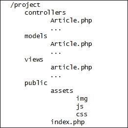

对于多模块应用程序，我们可以有以下结构：

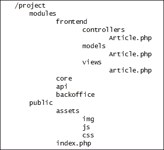

如您所见，了解一个文件的具体用途及其所在位置相当简单。最终，您应该选择适合您需求的架构，但请记住，如果您将在团队中工作，它应该足够直观，以便任何新成员都能理解。

# 为我们的项目创建结构

现在，我们将为我们的项目创建结构。在第一章中，我们创建了`/var/www/learning-phalcon.localhost`文件夹。如果您有其他位置，请前往那里并创建以下目录结构：

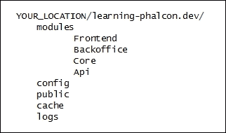

接下来，让我们创建一个名为`index.php`的文件，该文件将处理我们的应用程序。这个文件将是我们的 Web 服务器的默认文件：

```php
<?php

header('Content-Type: text/html; charset=utf-8');
mb_internal_encoding("UTF-8");

require_once __DIR__.'/../modules/Bootstrap.php';

$app = new Bootstrap('frontend');
$app->init();
?>
```

在前两行中，我们设置了头部和内部编码为 UTF-8。如果您打算使用特殊字符/变音符号，这是一个好习惯。在第四行中，我们包含了一个名为`Bootstrap.php`的文件。这个文件是项目的引导文件，我们将在接下来的几分钟内创建其内容。在下一行中，我们使用默认模块（`frontend`）创建一个新的 Bootstrap 实例，并初始化它。

我们需要找到一种方法来自动加载应用程序中的任何文件，而无需手动包含它。我们将利用`\Phalcon\Loader`组件，该组件将在命名空间中注册所有我们的模块。在`config`文件夹中，我们将创建一个名为`loader.php`的新文件，其内容如下：

```php
<?php

$loader = new \Phalcon\Loader();

$loader->registerNamespaces(array(
    'App\Core'       => __DIR__ . '/../modules/Core/',
    'App\Frontend'   => __DIR__ . '/../modules/Frontend/',
    'App\Api'        => __DIR__ . '/../modules/Api/',
    'App\Backoffice' => __DIR__ . '/../modules/Backoffice/',
));

$loader->register();
?>
```

## PSR

PSR 是一组在 PHP 开发中使用的标准，由一组人支持，即**PHP 框架互操作性小组**。这些标准包括以下内容：

+   自动加载标准

+   基本编码标准

+   编码风格指南

+   日志接口

`Phalcon\Loader` 组件符合 PSR-4 ([`github.com/php-fig/fig-standards/blob/master/accepted/PSR-4-autoloader.md`](https://github.com/php-fig/fig-standards/blob/master/accepted/PSR-4-autoloader.md))，它帮助我们按需加载所需的文件。这样，我们提高了应用程序的速度。同时，你可以在官方文档（[`docs.phalconphp.com/en/latest/reference/loader.html`](http://docs.phalconphp.com/en/latest/reference/loader.html)）中找到更多关于这个组件的信息。

# 创建配置文件和 Bootstrap

几乎任何应用程序都有一些将被重用的常量（数据库凭证、SMTP 凭证等）。对于我们的应用程序，我们将创建一个全局配置文件。这个文件将是 `\Phalcon\Config` 组件的一个实例。切换到 `config` 目录并创建它，内容如下：

```php
<?php

return new \Phalcon\Config(array(
    'application' => array(
        'name' => 'Learning Phalcon'
    ),
    'root_dir' => __DIR__.'/../',
    'redis' => array(
        'host' => '127.0.0.1',
        'port' => 6379,
    ),
    'session' => array(
        'unique_id' => 'learning_phalcon',
        'name' => 'learning_phalcon',
        'path' => 'tcp://127.0.0.1:6379?weight=1'
    ),
    'view' => array(
        'cache' => array(
            'dir' => __DIR__.'/../cache/volt/'
        )
    ),
));
```

`Phalcon\Config` 组件简化了我们应用程序中配置数据的访问。默认情况下，数据以对象形式返回（例如，我们可以通过 `$config->application->name path` 访问应用程序名称），但它也提供了一个魔法方法来以数组形式返回数据——`$config->toArray()`。如果你使用 `$config->toArray()`，那么你将使用 `$config['application']['name']` 语法来访问应用程序名称。关于这个组件的另一个有趣的事实是，我们可以使用 `$config->merge($new_config)` 语法将另一个数组合并到其中。

现在我们有了自动加载器和配置，让我们设置我们的 Bootstrap 文件。为此，在 `modules` 文件夹中创建一个名为 `Bootstrap.php` 的文件，并包含以下内容：

```php
<?php
   class Bootstrap extends \Phalcon\Mvc\Application
{
    private $modules;
    private $default_module = 'frontend';

    public function __construct($default_module)
    {
        $this->modules = array(
            'core' => array(
                'className' => 'App\Core\Module',
                'path' => __DIR__ . '/Core/Module.php'
            ),
            'api' => array(
                'className' => 'App\Api\Module',
                'path' => __DIR__ . '/Api/Module.php'
            ),
            'frontend' => array(
                'className' => 'App\Frontend\Module',
                'path' => __DIR__ . '/Frontend/Module.php'
            ),
            'backoffice' => array(
                'className' => 'App\Backoffice\Module',
                'path' => __DIR__ . '/Backoffice/Module.php'
            ),
        );

        $this->default_module = $default_module;
    }

    private function _registerServices()
    {
        $default_module = $this->default_module;
        $di             = new \Phalcon\DI\FactoryDefault();
        $config         = require __DIR__.'/../config/config.php';
        $modules        = $this->modules;

        include_once __DIR__.'/../config/loader.php';
        include_once __DIR__.'/../config/services.php';
        include_once __DIR__.'/../config/routing.php';

        $this->setDI($di);
    }

    public function init()
    {
        $debug = new \Phalcon\Debug();
        $debug->listen();

        $this->_registerServices();
        $this->registerModules($this->modules);

        echo $this->handle()->getContent();
    }
}
```

我们的 Bootstrap 文件扩展了 `\Phalcon\Mvc\Application` ([`docs.phalconphp.com/en/latest/reference/applications.html`](http://docs.phalconphp.com/en/latest/reference/applications.html))，这使我们能够访问 `registerModules()` 方法。类构造函数注册了所有我们的模块并设置了默认模块。`_registerServices()` 方法初始化 DI 并包含我们应用程序所需的文件。最后，`init()` 方法初始化应用程序。在这里，我们使用了 `\Phalcon\Debug` 组件，因为我们需要在任何时间都能调试应用程序。这不应该在生产环境中启用。

到目前为止，我们创建了文件夹结构、配置文件、自动加载器和 Bootstrap。我们将进一步创建服务、路由和前端模块文件。

# 准备初始 DI 接口和路由器

在 Bootstrap 中，我们没有两个文件：`services.php` 和 `routing.php`。`services.php` 文件将包含我们应用程序将使用的全局服务信息，而 `routing.php` 文件将包含我们的路由信息。让我们首先在我们的 `config` 文件夹中创建一个名为 `services.php` 的文件，并包含以下内容：

```php
<?php
use \Phalcon\Logger\Adapter\File as Logger;

$di['session'] = function () use ($config) {

    $session = new \Phalcon\Session\Adapter\Redis(array(
        'uniqueId' => $config->session->unique_id,
        'path' => $config->session->path,
        'name' => $config->session->name
    ));

    $session->start();

    return $session;
};

$di['security'] = function () {
    $security = new \Phalcon\Security();
    $security->setWorkFactor(10);

    return $security;
};

$di['redis'] = function () use ($config) {
    $redis = new \Redis();
    $redis->connect(
        $config->redis->host,
        $config->redis->port
    );

    return $redis;
};

$di['url'] = function () use ($config, $di) {
    $url = new \Phalcon\Mvc\Url();

    return $url;
};

$di['voltService'] = function($view, $di) use ($config) {

    $volt = new \Phalcon\Mvc\View\Engine\Volt($view, $di);

    if (!is_dir($config->view->cache->dir)) {
        mkdir($config->view->cache->dir);
    }

    $volt->setOptions(array(
        "compiledPath" => $config->view->cache->dir,
        "compiledExtension" => ".compiled",
        "compileAlways" => true
    ));

    return $volt;
};

$di['logger'] = function () {
    $file = __DIR__."/../logs/".date("Y-m-d").".log";
    $logger = new Logger($file, array('mode' => 'w+'));

    return $logger;
};

$di['cache'] = function () use ($di, $config) {

    $frontend = new \Phalcon\Cache\Frontend\Igbinary(array(
        'lifetime' => 3600 * 24
    ));

    $cache = new \Phalcon\Cache\Backend\Redis($frontend, array(
        'redis' => $di['redis'],
        'prefix' => $config->application->name.':'
    ));

    return $cache;
};
```

`$di` 变量是可用的，因为我们已经在 Bootstrap 的 `_registerServices()` 方法中初始化了它。`$di` 是 `\Phalcon\DI\FactoryDefault()` 的一个实例。让我们尝试理解我们设置的每个组件：

+   `$di['session']` 默认情况下是可用的，但我们覆盖它，因为我们想使用 Redis 来存储我们的会话。

+   `$di['security']` 默认情况下是可用的，但我们覆盖它，因为我们想设置比默认值更高的工作因子。我们将使用此组件来加密我们的密码。

+   `$di['redis']` 连接到 Redis 服务器。我们传递来自我们的配置文件的参数。`\Redis` 类已经可用，因为我们已经在第一章中安装了它（`php5-redis`）。

+   `$di['url']` 默认情况下是可用的。我们之所以覆盖它，是为了与 Phalcon 的旧版本保持向后兼容。在过去，如果没有定义，我就无法访问它。自从 Phalcon 1.3 版本以来，它按预期工作。

+   `$di['voltService']` 是一个自定义的 DI 组件，我们将用它来使用 Volt 模板引擎（你很快就会了解 Volt）。

+   `$di['logger']` 是一个自定义的 DI 组件，它使用 `\Phalcon\Logger\Adapter\File`。我们将使用它来记录不同的错误/警告。

+   `$di['cache']` 也是一个自定义的 DI 组件，它使用 Igbinary 作为前端缓存，并使用 Redis 作为后端。如果您没有 Igbinary，您需要通过以下命令安装它：`sudo pecl install igbinary`。请注意，在安装 Igbinary 之后，您可能需要重新安装 `php5-redis`。

由于我们将使用一些在 Phalcon 中默认不可用的组件，我们需要从 `phalcon/incubator` （[`github.com/phalcon/incubator`](https://github.com/phalcon/incubator)） 安装它们。**Incubator** 是由社区开发的一系列组件的集合，这些组件可能或可能不会包含在 Phalcon 的核心中。我们现在需要的组件之一是 `\Phalcon\Cache\Backend\Redis`。

我们将使用 **Composer** ([`getcomposer.org`](https://getcomposer.org)/) 来管理我们的包依赖。要在 `learning-phalcon.localhost` 文件夹中安装 composer，请执行以下命令：

```php
$ curl -s http://getcomposer.org/installer | php

```

现在，你应该在你的根目录中有一个名为 `composer.phar` 的新文件。接下来，让我们通过执行以下命令来安装 `phalcon/incubator`：

```php
$ php composer.phar require phalcon/incubator dev-master

```

这将安装其他依赖项，如 Swift Mailer，因此可能需要几分钟才能完成。如果您检查文件夹结构，您将看到已创建一个名为 `vendor` 的新目录。这是 composer 的默认安装文件夹，所有包都将驻留在此。

然而，这还不够。为了自动加载来自 vendor 的文件，我们需要对我们的 `public/index.php` 文件进行一些小的修改，通过添加 composer 的自动加载器。新的 `index.php` 文件应该看起来像这样：

```php
<?php
header('Content-Type: text/html; charset=utf-8');
mb_internal_encoding("UTF-8");

require_once __DIR__.'/../vendor/autoload.php';
require_once __DIR__.'/../modules/Bootstrap.php';

$app = new Bootstrap('frontend');
$app->init();
```

# 在模块中使用路由组件

我们将继续本章，通过为我们的应用程序创建路由。为此，切换到`config`目录，并创建一个名为`routing.php`的文件，内容如下：

```php
<?php

$di['router'] = function() use ($default_module, $modules, $di, $config) {

    $router = new \Phalcon\Mvc\Router(false);
    $router->clear();

    $moduleRouting = __DIR__.'/../apps/'.ucfirst($default_module).'/Config/routing.php';

    if (file_exists($moduleRouting) && is_file($moduleRouting)) {
        $router = include $moduleRouting;
    } else {
        $router->add('#^/(|/)$#', array(
            'module' => $default_module,
            'controller' => 'index',
            'action' => 'index',
        ));

        $router->add('#^/([a-zA-Z0-9\_]+)[/]{0,1}$#', array(
            'module' => $default_module,
            'controller' => 1,
        ));

        $router->add('#^/{0,1}([a-zA-Z0-9\_]+)/([a-zA-Z0-9\_]+)(/.*)*$#', array(
            'module' => $default_module,
            'controller' => 1,
            'action' => 2,
            'params' => 3,
        ));
    }

    return $router;
};
```

在此文件中，我们使用了`\Phalcon\Mvc\Router`组件。我们检查模块是否有任何路由信息，如果有，就加载它；如果没有，就创建默认的路由规则。如果你一直跟随着我们，你应该有以下的目录结构：

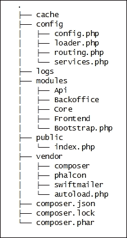

在第一章中，我们已创建并启用了 Web 服务器的配置文件。此外，我们还编辑了主机文件，并且`www.learning-phalcon.localhost`指向我们的本地主机（`127.0.0.1`）。让我们尝试在我们的浏览器中访问`http://www.learning-phalcon.localhost`。

### 小贴士

请使用`http://`。否则，Chrome 以及其他浏览器可能无法访问此 URL，因为`.dev`不是一个注册的顶级域名。

如果你成功访问了应用程序，你应该会看到一个类似于以下截图的错误页面：

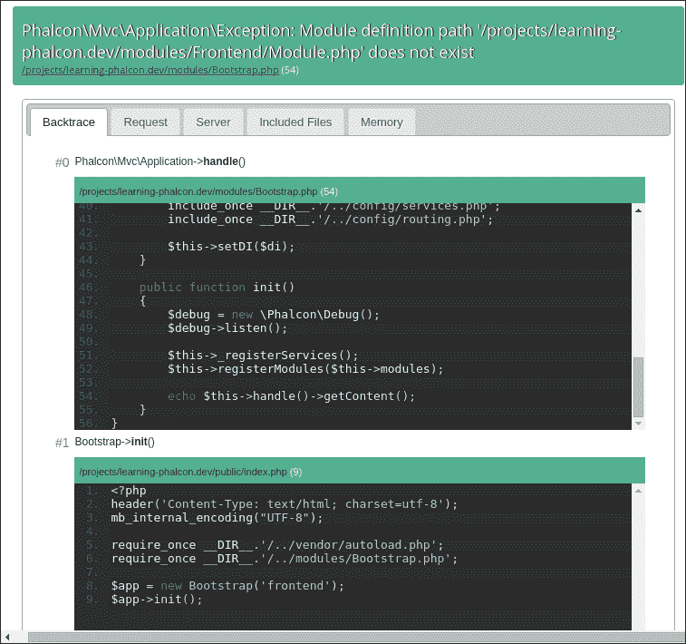

让我们通过创建我们`Frontend`模块所需的文件来修复这个错误。转到`modules/Frontend`文件夹，并创建一个名为`Module.php`的文件，内容如下：

```php
<?php
namespace App\Frontend;

use Phalcon\Mvc\ModuleDefinitionInterface;

class Module implements ModuleDefinitionInterface
{
    /**
     * Registers the module auto-loader
     */
    public function registerAutoloaders(\Phalcon\DiInterface di = null) {}

    /**
     * Registers the module-only services
     *
     * @param Phalcon\DI $di
     */
    public function registerServices(\Phalcon\DiInterface $di)
    {
        $config = include __DIR__ . "/Config/config.php";
        $di['config'] = $config;
        include __DIR__ . "/Config/services.php";
    }
}
```

现在，将此文件复制到每个模块，并更改命名空间。例如，位于`Api`模块中的`Module.php`文件应该有`App\Api`的命名空间。现在，你的模块目录结构应该如下所示：

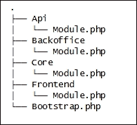

如果你刷新页面，你会得到另一个错误，显示`Phalcon\DI\Exception: Service 'view' was not found in the dependency injection container`。这是因为每个模块都将有自己的`config`文件夹，我们需要在那里创建文件。转到`modules/Frontend/`目录，并创建一个名为`Config`的新文件夹，首字母大写。

### 注意

我们使用大写字母，因为它在命名空间内更容易阅读和加载。

现在，在`modules/Frontend/Config/`目录下创建一个名为`config.php`的文件，内容如下：

```php
<?php
$config = require __DIR__.'/../../../config/config.php';
$module_config = array(
    'application' => array(
        'controllersDir' => __DIR__ . '/../Controllers/',
        'modelsDir' => __DIR__ . '/../Models/',
        'viewsDir' => __DIR__ . '/../Views/',
        'baseUri' => '/',
        'cryptSalt' => '5up3r5tr0n6p@55',
        'publicUrl' => 'http://www.learning-phalcon.localhost'
    ));

$config->merge($module_config);
return $config;
```

在第一行，我们将全局配置文件的内容赋值给`$config`变量。然后，我们设置模块配置，并将这些信息合并到我们的全局`$config`变量中。接下来，让我们在同一文件夹（`modules/Frontend/Config/`）中创建路由和服务文件：

`services.php：`

```php
<?php

$di['dispatcher'] = function () use ($di) {
    $eventsManager = $di->getShared('eventsManager');

    $dispatcher = new \Phalcon\Mvc\Dispatcher();
    $dispatcher->setEventsManager($eventsManager);
    $dispatcher->setDefaultNamespace('App\Frontend\Controllers');

    return $dispatcher;
};

$di['url']->setBaseUri(''.$config->application->baseUri.'');

$di['view'] = function () {

    $view = new \Phalcon\Mvc\View();
    $view->setViewsDir(__DIR__ . '/../Views/Default/');
    $view->registerEngines(array(
        ".volt" => 'voltService'
    ));

    return $view;
};
```

在`services.php`文件中，我们覆盖了 DI 的 URL 和分发器组件，并创建了一个自定义视图服务，该服务将使用我们在全局服务文件（`config/services.php`）中声明的`voltService`。

`routing.php：`

```php
<?php
$router = new \Phalcon\Mvc\Router(false);
$router->clear();

$router->add('/', array(
    'module' => 'frontend',
    'controller' => 'index',
    'action' => 'index'
));

return $router;
```

我们需要在这里的 `routing.php` 文件，因为我们将要为我们的前端模块创建自定义路由。接下来我们需要的是控制器。通常来说，创建一个基础文件，并让其他所有文件都扩展这个基础文件是一个好的实践。这样你将避免代码重复。当然，你也可以使用其他方法的 traits，但在这个项目中，我们将大部分时间使用基础文件。

因此，让我们在 `modules/Frontend/` 中创建 `Controllers` 目录，并在 `modules/Frontend/Controllers/` 目录中创建一个空白的基础控制器：

```php
$ cd modules/Frontend/
$ mkdir Controllers
$ touch Controllers/BaseController.php

```

现在，将以下内容放入 `BaseController.php` 文件中：

```php
<?php
namespace App\Frontend\Controllers;

class BaseController extends \Phalcon\Mvc\Controller
{

}
```

接下来，在这里创建另一个名为 `IndexController.php` 的文件，并包含以下内容：

```php
<?php
namespace App\Frontend\Controllers;

class IndexController extends BaseController
{
    public function indexAction()
    {

    }
}
```

如果你检查 `routing.php` 文件，你会注意到默认路由指向索引控制器 → 索引动作。在 Phalcon 中，标准是任何控制器都应该有 `Controller` 后缀，任何与路由匹配的公共动作都应该有 `Action` 后缀。

让我们看看我们的 `modules/Frontend` 目录结构。它应该正好是这样的：

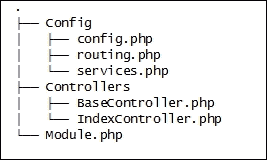

如果你尝试刷新 `http://www.learning-phalcon.localhost` 上的页面，你会看到一个空白页面。这是完全正常的。接下来，让我们将 `Controllers` 和 `Config` 文件夹从我们的 `Frontend` 模块复制到每个剩余的模块（`Api`、`Core` 和 `Backoffice`）。在我们复制文件后，我们需要更改命名空间，并将与前端相关的内容替换为新模块的名称。

例如，在我们将文件复制到 `Api` 模块之后，我们需要做以下操作：

1.  在 `Controllers/` 文件夹中将 `App\Frontend\Controllers` 命名空间替换为 `App\Api\Controllers`。

1.  在 `Config/routing.php` 中将单词 "`frontend`" 替换为单词 "`api`"。

1.  在 `services.php` 中将 `\App\Frontend\Controllers` 替换为 `App\Api\Controllers`。

1.  将模块名的小写形式附加到 `config.php` 文件中的 `baseUri` 键上。结果应该是 `'baseUri' => '/api/'`。

完成后，新的目录结构应该是这样的：

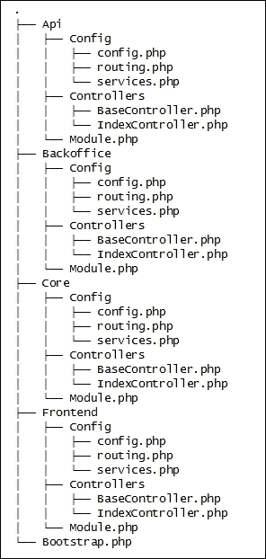

# 创建基本布局

现在，是时候稍微关注一下布局（模板）了。我们将使用 twitter-bootstrap 进行 CSS 和 jQuery。然后，我们将创建第一个视图，以便结束这一章。

导航到 `public/folder` 并创建一个名为 `assets` 的文件夹。然后，进入 `assets` 并创建一个名为 `default` 的文件夹：

```php
$ cd public
$ mkdir -p assets/default

```

我正在使用 Bower ([`bower.io/`](http://bower.io/)) 作为我的资产包管理器。它对于 PHP 包来说就像是 composer。

如果你没有安装 Bower 并且不想使用它，你需要在你的 `public/default/assets` 文件夹中创建一个名为 `bower_components` 的文件夹，并从 GitHub 克隆 twitter-bootstrap 仓库。你还需要下载 jQuery 并将其解压到 `bower_components` 文件夹中。

```php
$ cd public/default/assets/bower_components
$ git clone https://github.com/twbs/bootstrap.git

```

如果你拥有 Bower，那么只需前往`public/default/assets`文件夹并安装 twitter Bootstrap：

```php
$ cd public/default/assets
$ bower install bootstrap

```

这将自动安装 jQuery，因为 Bootstrap 需要 jQuery，而 Bower 足够智能，能够检查依赖项。

在不久的将来，我们还需要一些自定义的 JavaScript、CSS 文件和图片。我们需要在 public/assets/default 文件夹中创建这些目录，并且我们还将创建两个名为`lp.js`和`lp.css`的空文件。你的 public 文件夹的目录结构应该是这样的：

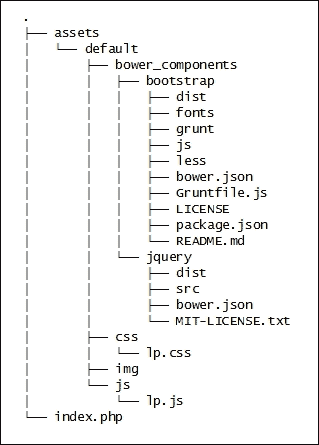

让我们回到我们的`frontend`模块。导航到`modules/Frontend`并创建一个名为`Views`的文件夹。然后，在`Views`文件夹中，创建另一个名为`Default`的文件夹：

```php
$ cd modules/Frontend
$ mkdir -p Views/Default

```

记住，我们正在使用 Volt ([`docs.phalconphp.com/en/latest/reference/volt.html`](http://docs.phalconphp.com/en/latest/reference/volt.html)) 作为我们的模板引擎。我们在第一章中已经讨论了 Volt 的语法，随着我们继续前进，我们将更深入地探讨这个主题，但会在适当的时候。现在，我们只想完成我们的项目结构，并为前端模块渲染一个示例布局。

这样我们可以确保到目前为止我们做的一切都符合预期。在`services.php`的依赖注入中，我们将文件扩展名.volt 分配给了我们的模板引擎。因此，我们将要创建的所有视图都将具有.volt 扩展名。让我们创建主布局。导航到`modules/Frontend/Views/Default`并创建一个名为`layout.volt`的新文件，内容如下：

```php
<!DOCTYPE html>
<html lang="en">
<head>
<meta charset="utf-8">
<meta http-equiv="X-UA-Compatible" content="IE=edge">
<meta name="viewport" content="width=device-width, initial-scale=1">
<title>Learning Phalcon</title>

{{ stylesheetLink('../assets/default/bower_components/bootstrap/dist/css/bootstrap.min.css') }}
{{ stylesheetLink('../assets/default/css/lp.css') }}

<!--[if lt IE 9]>
      <script src="img/html5shiv.min.js"></script>
      <script src="img/respond.min.js"></script>
<![endif]-->
</head>
<body>
    
    <h1>Main layout</h1>
    

    {{ javascriptInclude("../assets/default/bower_components/jquery/dist/jquery.min.js") }}
    {{ javascriptInclude("../assets/default/bower_components/bootstrap/dist/js/bootstrap.min.js") }}
    {{ javascriptInclude("../assets/default/js/lp.js") }}
     
</body>
</html>
```

正如我们之前提到的，我们现在不会讨论 volt 的语法。为了渲染模板，还需要执行一个额外的步骤。我们需要创建一个名为`index`的新文件夹；然后，在`index`文件夹中，我们还需要创建一个名为`index.volt`的文件。这将与`IndexController` → `IndexAction`相匹配。

```php
$ cd modules/Frontend/Views/Default
$ mkdir index
$ cd index
$ touch index.volt

```

`index.volt`文件的内容如下：

```php


I did it !


```

我们前端模块的最终目录结构应该是这样的：

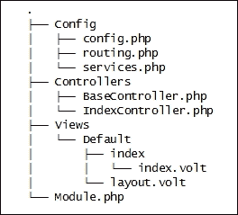

现在，让我们尝试刷新页面`http://www.learning-phalcon.localhost`。如果你看到以下截图中的页面，那么你就成功了！

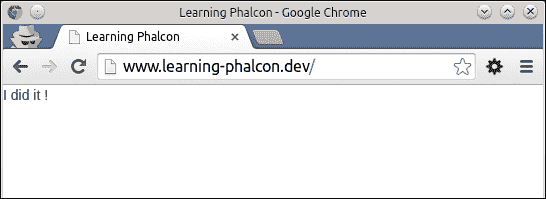

# 摘要

在本章中，我们学习了 MVC 的基础知识，为我们的项目创建了文件夹结构，并了解了一些关于如何使用 DI 组件、路由组件和视图组件的方法。我们还创建了视图，并从前端模块渲染了第一个页面。

在接下来的章节中，我们将学习 Phalcon 的 ORM 和 ODM，并且我们会继续添加功能，直到我们拥有一个功能齐全的在线报纸网站。
