# 第三章. 学习 Phalcon 的 ORM 和 ODM

现在你已经对 Phalcon 的内部结构有了一些了解，我们也拥有了我们的项目结构，我们可以继续进行更严肃的事情——数据库。在本章中，我们将涵盖以下主题：

+   SQL 和 NoSQL 数据库之间的主要区别

+   学习如何连接到数据库

+   ORM/ODM CRUD 操作（创建、读取、更新和删除）和事务

+   了解 ORM 的一般缺点，以及我们如何通过缓存方法来提高性能

# SQL 和 NoSQL 数据库之间的主要区别

MySQL 很棒！它是一个功能强大的关系型数据库管理系统（RDBMS），拥有很大的市场份额，并得到了一个庞大社区的支持。它是开源的（尽管存在企业版），而且几乎每个 PHP 应用程序都将它作为主要的数据库系统。

但有时候，你会注意到 MySQL 并不足以满足你的需求。也许你听说过人们谈论 MongoDB、CouchDB、Cassandra 等等。在我们的项目中，我们将使用 MongoDB，所以我将谈谈它。

通常，当你想要开发实时分析、缓存和日志；存储大数据，如评论或点赞；以及处理许多其他情况时，你会使用 NoSQL 系统，如 MongoDB。

SQL 数据库和 NoSQL 数据库之间的一些区别如下：

+   NoSQL 不是关系型的

+   NoSQL 不可靠；或者说，在复杂系统中使用它并不安全，因为它不支持事务

+   关系型数据库需要一个具有定义属性的架构来存储数据，但 NoSQL 数据库通常允许自由流动的操作

在我们的项目后期，我们将主要使用 MongoDB 进行日志和评论。我们已经在第一章中安装了 MongoDB。

让我们看看一些使用示例：

| SQL | MongoDB |
| --- | --- |
| `SELECT a,b FROM users` | `$db->users->find([], ["a" => 1, "b" => 1]);` |
| `SELECT * FROM users WHERE age=33` | `$db->users->find(["age" => 33]);` |

在官方 PHP 网站上，你可以查看完整的 SQL 到 MongoDB 映射图表（[`php.net/manual/ro/mongo.sqltomongo.php`](http://php.net/manual/ro/mongo.sqltomongo.php)）。

# 连接到数据库

在上一章中，我们添加了全局配置文件和每个模块的配置文件。为了能够连接到数据库，我们首先需要在配置文件中添加一些行。

让我们回顾一下我们的目录结构：

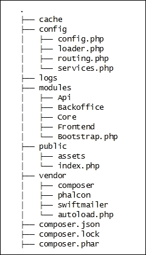

为了连接到数据库，我们需要创建它。创建一个名为`learning_phalcon`的数据库。你可以使用以下命令行快速完成此操作：

```php
$ mysql -u YOURUSERNAME -p -e 'create database learning_phalcon;'

```

打开全局配置文件（`config/config.php`），并添加以下行：

```php
    'database' => array(
        'adapter'  => 'Mysql',
        'host'     => 'localhost',
        'username' => 'Input your username here',
        'password' => 'Input your password here',
        'dbname'   => 'learning_phalcon',
    ),
```

现在我们已经有了数据库的配置参数，我们必须创建一个服务。打开全局服务文件（`config/service.php`），并添加以下行：

```php
$di['db'] = function () use ($config) {

    return new \Phalcon\Db\Adapter\Pdo\Mysql(array(
        "host" => $config->database->host,
        "username" => $config->database->username,
        "password" => $config->database->password,
        "dbname" => $config->database->dbname,
        "options" => array(
            \PDO::MYSQL_ATTR_INIT_COMMAND => "SET NAMES 'UTF8'",
            \PDO::ATTR_CASE => \PDO::CASE_LOWER,
            \PDO::MYSQL_ATTR_USE_BUFFERED_QUERY => true,
            \PDO::ATTR_PERSISTENT => true
        )
    ));
};
```

现在我们可以保存并关闭此文件。接下来，我们将在数据库中创建一个名为`article`的表，并将一条样本记录插入到这个表中：

```php
USE learning_phalcon;

CREATE TABLE IF NOT EXISTS `article` (
`id` int(11) NOT NULL AUTO_INCREMENT,
`article_short_title` varchar(255) COLLATE utf8_unicode_ci NOT NULL,
`article_long_title` varchar(255) COLLATE utf8_unicode_ci NOT NULL,
`article_slug` varchar(255) COLLATE utf8_unicode_ci NOT NULL,
`article_description` text COLLATE utf8_unicode_ci NOT NULL,
PRIMARY KEY (`id`),
KEY `id` (`id`)
) ENGINE=InnoDB DEFAULT CHARSET=utf8 COLLATE=utf8_unicode_ci AUTO_INCREMENT=1 ;

INSERT INTO `learning_phalcon`.`article` (
`id` ,
`article_short_title` ,
`article_long_title` ,
`article_slug` ,
`article_description`
)
VALUES (
NULL ,  'Test article short title',  'Test article long title',  'test-article-short-title',  'Test article description'
);

```

为了测试数据库连接，我们将使用我们的`Frontend`和`Core`模块。在`Core`模块中，我们将为文章表创建一个模型。根据上一章，`Frontend`模块的目录结构应该如下所示：

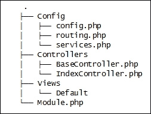

对于`Core`模块，结构应该如下所示：

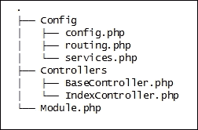

我们将在一个名为`Models`的新文件夹中创建`article`表的模型。在`modules`/`Core`下创建`Models`目录：

```php
$ cd modules/Core
$ mkdir Models

```

在`Models`目录下，创建两个新的文件：`Base.php`和`Article.php`。我们现在将查看这些文件：

+   `Base.php`的内容如下：

    ```php
    <?php
    namespace App\Core\Models;

    class Base extends \Phalcon\Mvc\Model
    {

    }
    ```

+   `Article.php`的内容如下：

    ```php
    <?php
    namespace App\Core\Models;

    class Article extends \Phalcon\Mvc\Model
    {
        protected $id;
        protected $article_short_title;
        protected $article_long_title;
        protected $article_slug;
        protected $article_description;

        public function setId($id)
        {
            $this->id = $id;
            return $this;
        }

        public function setArticleShortTitle($article_short_title)
        {
            $this->article_short_title = $article_short_title;
            return $this;
        }

        public function setArticleLongTitle($article_long_title)
        {
            $this->article_long_title = $article_long_title;
            return $this;
        }

        public function setArticleSlug($article_slug)
        {
            $this->article_slug = $article_slug;
            return $this;
        }

        public function setArticleDescription($article_description)
        {
            $this->article_description = $article_description;
            return $this;
        }

        public function getId()
        {
            return $this->id;
        }

        public function getArticleShortTitle()
        {
            return $this->article_short_title;
        }

        public function getArticleLongTitle()
        {
            return $this->article_long_title;
        }

        public function getArticleSlug()
        {
            return $this->article_slug;
        }

        public function getArticleDescription()
        {
            return $this->article_description;
        }
    }
    ```

我个人喜欢尽可能干净地工作。我们将使用一个中间文件——管理器——来处理所有复杂的逻辑。这意味着你不会在控制器中使用模型，也不会通过添加查询或其他类型的数据来修改模型。模型应该尽可能干净。另一方面，有些人喜欢将复杂的逻辑移动到模型中。这是你的选择，但在这本书中，我们将使用管理器。话虽如此，让我们为文章创建管理器：

1.  前往`modules/Core/`并创建一个名为`Managers`的文件夹：

    ```php
    $ cd modules/Core/
    $ mkdir Managers

    ```

1.  创建两个名为`BaseManager.php`和`ArticleManager.php`的新文件，并添加以下内容：

    +   `BaseManager.php`文件将被放置在`modules/Core/Managers/`下：

        ```php
        <?php
        namespace App\Core\Managers;

        class BaseManager extends \Phalcon\Mvc\User\Module
        {
        }
        ```

    +   `ArticleManager.php`文件将被放置在`modules/Core/Managers/`下：

        ```php
        <?php
        namespace App\Core\Managers;

        use App\Core\Models\Article;

        class Article extends Base
        {
            public function find($parameters = null)
            {
                return Article::find($parameters);
            }
        }
        ```

`Core`模块的新目录结构现在应该如下所示：

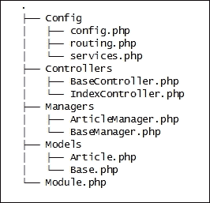

到目前为止一切顺利！让我们尝试使用这个管理器来列出`Article`表中的记录。为此，我们首先需要将其声明为一个服务。为此，请执行以下步骤：

1.  打开全局服务文件（`config/service.php`），并添加以下内容：

    ```php
    $di['core_article_manager'] = function() {
        return new App\Core\Managers\ArticleManager();
    };
    ```

    我们将使用`frontend`模块来完成这个测试。

1.  导航到`Frontend`目录，编辑`modules/Frontend/Config/routing.php`文件，并添加以下内容：

    ```php
    $router->add('#^/articles[/]{0,1}$#', array(
        'module' => 'frontend',
        'controller' => 'article',
        'action' => 'list'
    ));

    $router->add('#^/articles/([a-zA-Z0-9\-]+)[/]{0,1}$#', array(
        'module' => 'frontend',
        'controller' => 'article',
        'action' => 'read',
        'slug' => 1
    ));
    ```

    第一个路由模式将把对`http://www.learning-phalcon.localhost/articles`的任何请求指向`frontend`模块、`article`控制器和`listAction`操作。

    第二种模式将指向文章控制器中的不同操作，命名为`readAction`，并将 slug 参数传递给此操作。

1.  接下来，我们将创建`article`控制器和模板。导航到`modules/Frontend/Controllers`，并创建一个名为`ArticleController.php`的文件，内容如下：

    ```php
    <?php
    namespace App\Frontend\Controllers;

    class ArticleController extends BaseController
    {
        public function listAction()
        {
            $article_manager = $this->getDI()->get('core_article_manager');
            $this->view->articles = $article_manager->find();
        }
    }
    ```

    在`listAction`中，我们从 DI 获取`article`管理器，并将`find()`方法的结果分配给名为`articles`的视图变量。

1.  现在，让我们为这个操作创建一个模板。导航到 `modules/Frontend/Views/Default`，并创建一个名为 `article` 的新目录：

    ```php
    $ cd modules/Frontend/Views/Default
    $ mkdir article

    ```

1.  在 `article` 文件夹中，创建一个名为 `list.volt` 的文件，并将其内容添加如下：

    ```php
    
    
     <ul>
     
     <li><a href="{{ url('article/' ~ article.getArticleSlug()) }}">{{ article.getArticleShortTitle() }}</a></li>
     
     </ul>
    

    ```

`Frontend` 目录结构应如下所示：

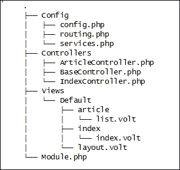

如果你一切都按照书中的步骤来做，那么你已经准备好了。现在你可以访问 `http://www.learning-phalcon.localhost/articles`，你应该能看到如这里所示的文章测试内容：

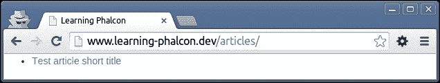

干得好！你现在已连接到数据库，并拥有了第一个模型和管理器。我们将继续本章，进行数据操作、验证以及简单的 MySQL 和 MongoDB 查询。

# ORM/ODM 操作（创建、更新、删除、事务和验证）

在我们继续之前，让我们通过添加一些列来使我们的文章表变得更加复杂。我们将添加三个额外的列：`is_published`、`created_at` 和 `updated_at`。

`is_published` 字段将是一个布尔类型（在 MySQL 中，它将具有 0 或 1 的值），而 `created_at` 和 `updated_at` 字段将具有 `datetime` 类型。它们将保存有关我们的文章何时创建以及何时更新的信息。你可以使用以下代码修改 `article` 表并添加这些字段：

```php
ALTER TABLE `article` ADD `is_published` BOOLEAN NOT NULL DEFAULT FALSE ,
ADD `created_at` DATETIME NOT NULL ,
ADD `updated_at` DATETIME NULL DEFAULT NULL ;

```

我们还需要对我们的 `Article` 模型进行修改，并添加这些新字段的获取器和设置器。打开 `modules/Core/Models/Article.php` 文件，并添加以下内容：

```php
    protected $is_published;
    protected $created_at;
    protected $updated_at;

    public function setIsPublished($is_published)
    {
        $this->is_published = $is_published;
        return $this;
    }

    public function setCreatedAt($created_at)
    {
        $this->created_at = $created_at;
        return $this;
    }

    public function setUpdatedAt($updated_at)
    {
        $this->updated_at = $updated_at;
        return $this;
    }

    public function getIsPublished()
    {
        return $this->is_published;
    }

    public function getCreatedAt()
    {
        return $this->created_at;
    }

    public function getUpdatedAt()
    {
        return $this->created_at;
    }
```

由于我们将会使用的大部分 CRUD 操作将由 `Backoffice` 模块处理，因此我们将按照前端模块的方式设置此模块。此模块的实际开发将在本书的后续章节中进行。目前，我们将为 `Article` 表启用快速简单的 CRUD 操作。

让我们回顾一下 `Backoffice` 目录结构。到目前为止，你应该有以下结构：

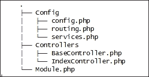

为了使其功能正常，我们需要做以下事情：

+   添加路由信息

+   创建控制器和操作

+   创建视图

## 添加路由信息

编辑全局路由文件 `config/routing.php`，并添加以下内容：

```php
foreach ($modules as $moduleName => $module){
    if ($default_module == $moduleName) {
    continue;
}

$moduleRouting = __DIR__.'/../modules/'.ucfirst($moduleName).'/Config/routing.php';
    include $moduleRouting;
}
```

从 `Backoffice` 模块的 `modules/Backoffice/Config/routing.php` 中删除（或覆盖）路由文件，并添加一个包含以下内容的新文件：

```php
<?php

$router->add('#^/backoffice(|/)$#', array(
    'module' => 'backoffice',
    'controller' => 'index',
    'action' => 'index',
));

$router->add('#^/backoffice/([a-zA-Z0-9\_]+)[/]{0,1}$#', array(
    'module' => 'backoffice',
    'controller' => 1,
));

$router->add('#^/backoffice[/]{0,1}([a-zA-Z0-9\_]+)/([a-zA-Z0-9\_]+)(/.*)*$#', array(
    'module' => 'backoffice',
    'controller' => 1,
    'action' => 2,
    'params' => 3,
));
```

## 创建控制器和操作

导航到 `modules/Backoffice/Controllers/`，创建一个名为 `ArticleController.php` 的新文件，并包含以下内容：

```php
<?php
namespace App\Backoffice\Controllers;

class ArticleController extends BaseController
{
    public function indexAction()
    {
      return $this->dispatcher->forward(['action' => 'list']);
    }

    public function listAction()
    {
        $article_manager      = $this->getDI()->get('core_article_manager');
        $this->view->articles = $article_manager->find();
    }
}
```

## 创建视图

从 `Frontend` 复制视图。我们将在第七章 The Backoffice Module (Part 1) 中对其进行适配，*后端模块（第一部分）*：

```php
$ cd modules/Backoffice
$ cp -r ../Frontend/Views .

```

现在，让我们修改一下视图，以便我们可以有一个漂亮的`Backoffice`模块。转到`modules/Backoffice/Views/`，打开`layout.volt`文件，并做出以下更改。

查找以下行：

```php
<title>Learning Phalcon</title>
```

将其替换为以下行：

```php
<title>Backoffice - Learning Phalcon</title>
```

在`public/assets/default/css/`中创建一个名为`lp.backoffice.css`的新文件，并将以下内容添加到其中：

```php
body              { padding-top: 50px; }
.sub-header       { padding-bottom: 10px; border-bottom: 1px solid #eee; }
.navbar-fixed-top { border: 0; }
.sidebar          { display: none; }

@media (min-width: 768px) {
  .sidebar {position: fixed;top: 51px;bottom: 0;left: 0;z-index: 1000;display: block;padding: 20px;overflow-x: hidden;overflow-y: auto;background-color: #f5f5f5;border-right: 1px solid #eee;}
}

.nav-sidebar          { margin-right: -21px; margin-bottom: 20px; margin-left: -20px; }
.nav-sidebar > li > a { padding-right: 20px; padding-left: 20px; }
.nav-sidebar > .active > a,
.nav-sidebar > .active > a:hover,
.nav-sidebar > .active > a:focus { color: #fff; background-color: #428bca; }

.main { padding: 20px; }
@media (min-width: 768px) {
  .main { padding-right: 40px; padding-left: 40px; }
}
.main .page-header { margin-top: 0; }
```

然后，我们在`layout.volt`文件中包含前面的文件。我们通过查找以下行来完成此操作：

```php
{{ stylesheetLink('../assets/default/css/lp.css') }}
```

我们将其替换为以下行：

```php
{{ stylesheetLink('../assets/default/css/lp.backoffice.css') }}
```

在相同的`layout.volt`文件中，删除以下代码片段：

```php

<h1>I did it !</h1>

```

在`<body>`和`</body>`标签之间添加以下内容：

```php
    <nav class="navbar navbar-inverse navbar-fixed-top" role="navigation">
      <div class="container-fluid">
        <div class="navbar-header">
          <button type="button" class="navbar-toggle collapsed" data-toggle="collapse" data-target="#navbar" aria-expanded="false" aria-controls="navbar">
            <span class="sr-only">Toggle navigation</span>
            <span class="icon-bar"></span>
            <span class="icon-bar"></span>
            <span class="icon-bar"></span>
          </button>
          <a class="navbar-brand" href="#">Learning Phalcon</a>
        </div>
        <div id="navbar" class="navbar-collapse collapse">
          <ul class="nav navbar-nav navbar-right">
            <li><a href="#">Sign out</a></li>
          </ul>
        </div>
      </div>
    </nav>

    <div class="container-fluid">
      <div class="row">
        <div class="col-sm-3 col-md-2 sidebar">
          <ul class="nav nav-sidebar">
            <li class="active"><a href="{{ url('article/list') }}">Articles <span class="sr-only">(current)</span></a></li>
            <li><a href="#">Other menu item</a></li>
          </ul>
        </div>
        <div class="col-sm-9 col-sm-offset-3 col-md-10 col-md-offset-2 main">
          
          <h1 class="page-header">Dashboard</h1>
          <h2 class="sub-header">Section title</h2>
          <div class="table-responsive">

          </div>
          
        </div>
      </div>
    </div>
```

我们已经编辑完`layout.volt`文件，但我们需要进行一个额外的更改。打开`modules/Backoffice/Views/Default/article/list.volt`，并用以下代码替换其内容：

```php
 
<h1 class="page-header">Articles</h1>
<h2 class="sub-header">List</h2>
<div class="table-responsive">

    <table class="table table-striped">
        <thead>
            <tr>
                <th>#</th>
                <th>Title</th>
                <th>Is published</th>
                <th>Created at</th>
                <th>Updated at</th>
                <th>Options</th>
            </tr>
        </thead>
        <tbody>
        
            <tr>
                <td>{{ article.getId() }}</td>
                <td>{{ article.getArticleShortTitle() }}</td>
                <td>{{ article.getIsPublished() }}</td>
                <td>{{ article.getCreatedAt() }}</td>
                <td>{{ article.getUpdatedAt() }}</td>
                <td>
                    <a href="{{ url('article/edit/' ~ article.getId()) }}">Edit</a> |
                    <a href="{{ url('article/delete/' ~ article.getId()) }}">Delete</a> |
                </td>
            </tr>
        
        </tbody>
    </table>

</div>

```

在所有这些更改之后，新的目录结构应该看起来如下所示：

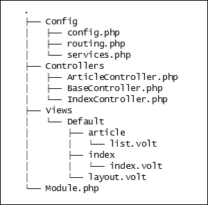

让我们在浏览器中打开`http://www.learning-phalcon.localhost/backoffice/article/list`。如果一切顺利，您应该能够看到新的`Backoffice`布局和我们的测试文章，列表如下所示：

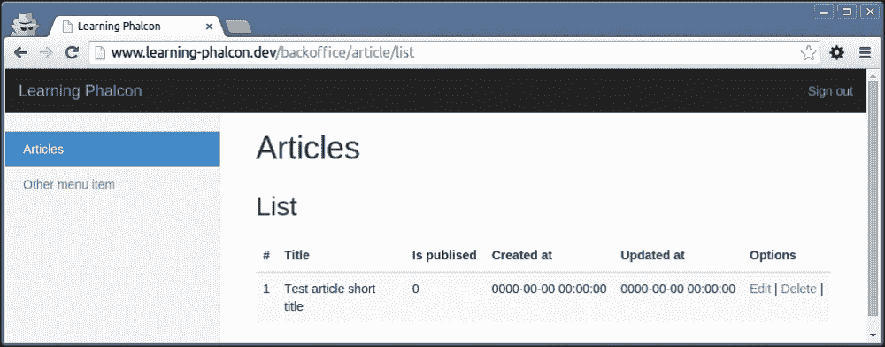

现在我们有了 UI，您可以开始学习 Phalcon 的 ORM。您需要知道 Phalcon 提供了三种与数据库交互的方式：

+   使用 ORM

+   使用 PHQL

+   使用原始 SQL

我们将在本章中学习所有这些。让我们从 ORM 开始。

# 使用 ORM 进行 CRUD 操作

通过使用 ORM，实际上您在代码中几乎不需要编写任何 SQL。一切都是面向对象的，并且使用模型来执行操作。第一个，也是最基本，的操作是检索数据。在以前的日子里，您会这样做：

```php
$result = mysql_query("SELECT * FROM article");
```

我们模型所扩展的类是`Phalcon\Mvc\Model`。这个类内置了一些非常有用的方法，例如`find()`、`findFirst()`、`count()`、`sum()`、`maximum()`、`minimum()`、`average()`、`save()`、`create()`、`update()`和`delete()`。

## CRUD – 读取数据

我们已经在`article`管理器中调用`Article::find()`时使用了`find()`方法。默认情况下，此方法将返回`article`表中的所有记录，并按自然顺序排序。它还接受一个带有参数的数组。以下代码示例将解释这一点：

```php
$article_slug = "test-article-short-title";

$result = Article::find(
    [
        "article_slug = :article_slug:",
        "bind" => ["article_slug" => $article_slug]
        "order" => "created_at DESC",
        "limit" => 1
    ]
);
```

在前面的示例中，我们正在搜索包含`test-article-short-title`文章短标题的记录。我们按`created_at`字段降序绑定数据，并限制返回的行数为一条。参数数组的第一个键始终应该是条件。绑定参数是避免 SQL 注入的好做法。我建议您始终使用它。

`Article::find()`的结果是一个对象数组。这意味着如果我们需要遍历结果，我们可以这样做：

```php
foreach ($result as $article) {
    echo $article->getTitle();
}
```

让我们在`article`表中添加两条新记录，这样您就可以亲眼看到正在发生的事情：

```php
INSERT INTO  `learning_phalcon`.`article` (`id` ,`article_short_title` ,`article_long_title` ,`article_slug` ,`article_description` ,`is_published` ,`created_at` ,`updated_at`)
VALUES (NULL ,  'Test article short title 2',  'Test article long title 2',  'test-article-short-title-2',  'Test article description 2',  '0',  '2014-12-14 05:13:26', NULL);

INSERT INTO  `learning_phalcon`.`article` (`id` ,`article_short_title` ,`article_long_title` ,`article_slug` ,`article_description` ,`is_published` ,`created_at` ,`updated_at`)
VALUES (NULL ,  'Test article short title 3',  'Test article long title 3',  'test-article-short-title-3',  'Test article description 3',  '0',  '2014-12-14 05:13:26', NULL);
```

如果你现在访问`http://www.learning-phalcon.localhost/backoffice/article/list`，你应该能够看到新记录，如本截图所示：

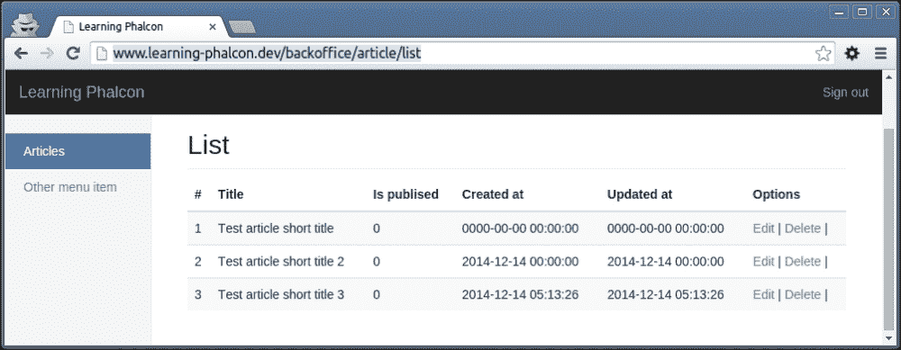

接下来，我们将进行一些排序测试。为了参考，前一个截图显示的默认顺序是自然顺序，ID 为 1、2 和 3。请记住这一点，因为我们将在接下来的几行中引用这些 ID。

打开`article`控制器`modules/Backoffice/Controllers/ArticleController.php`，然后删除以下行：

```php
$this->view->articles = $article_manager->find();
```

现在添加以下行，这将按创建日期降序排列文章：

```php
$articles = $article_manager->find([
   'order' => 'created_at DESC'
]);
$this->view->articles = $articles;
```

如果你刷新`http://www.learning-phalcon.localhost/backoffice/article/list`页面，你会看到记录的顺序不同。你应该看到的顺序是：3、2 和 1。

随意练习并尝试按不同的列排序，并添加限制。

另一个有用的方法是`findFirst()`。此方法接受与`find()`相同的参数，但结果将是一个`Article`模型的实例；这意味着你不需要在记录之间迭代：

```php
$article = Article::findFirst();
echo $article->getTitle();
```

一些有用的方法是魔术方法，`findBy*()`和`findFirstBy*()`。例如，如果你需要通过 slug 搜索文章，你可以使用这些魔术方法这样做：

```php
$articles = Article::findByArticleSlug('test-article-short-title');
foreach ($articles as $article) {
    echo $article->getId();
}

$article = Article:;findFirstByArticleSlug('test-article-short-title');
echo $article->getId();
```

## CRUD – 创建数据

使用 ORM 创建数据比听起来容易。我们将利用模型。记住我告诉你的——我喜欢尽可能保持模型干净。这就是为什么我们大多数时候都会创建并使用管理器。在`modules/Core/Managers/ArticleManager.php`中打开`article`管理器，并添加以下代码：

```php
    public function create($data)
    {
        $article = new Article();
        $article->setArticleShortTitle($data['article_short_title']);
        $article->setArticleLongTitle($data['article_long_title']);
        $article->setArticleDescription($data['article_description']);
        $article->setArticleSlug($data['article_slug']);
        $article->setIsPublished(0);
        $article->setCreatedAt(new \Phalcon\Db\RawValue('NOW()'));

        if (false === $article->create()) {
            foreach ($article->getMessages() as $message) {
                $error[] = (string) $message;
            }
            throw new \Exception(json_encode($error));
        }
        return $article;
    }
```

接下来，我们将在控制器中添加一个虚拟的`createAction`方法。打开`modules/Backoffice/Controllers/ArticleController.php`，并添加以下内容：

```php
    public function createAction()
{
  $this->view->disable();
  $article_manager = $this->getDI()->get('core_article_manager');

        try {
            $article = $article_manager->create([]);
            echo $article->getArticleShortTitle(), " was created.";
        } catch (\Exception $e) {
            echo $e->getMessage();
        }
    }
```

当你访问`http://www.learning-phalcon.localhost/backoffice/article/create`时，你会看到一些错误，类似于本截图所示：

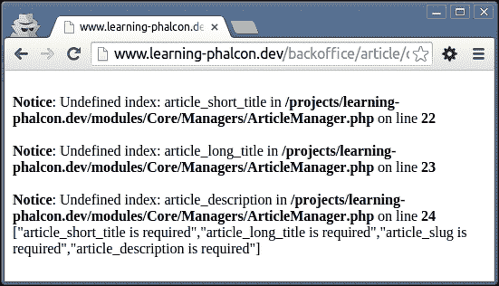

这很正常，因为我们没有向我们的`create()`方法传递任何参数。通过向创建方法添加这些参数来修改`createAction`方法：

```php
$article = $article_manager->create([
    'article_short_title' => 'Test article short title 5',
    'article_long_title' => 'Test article long title 5',
    'article_description' => 'Test article description 5',
    'article_slug' => 'test-article-short-title-5'
]);
```

如果我们刷新`http://www.learning-phalcon.localhost/backoffice/article/create`页面，我们应该会看到一个类似于以下所示的成功消息：

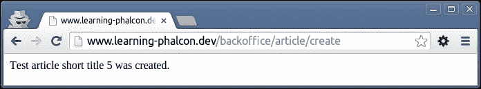

### 小贴士

每次你刷新这个页面，数据库中都会插入一条新记录。你可以访问`http://www.learning-phalcon.localhost/backoffice/article/list`来查看新记录。

让我们快速分析一下`create()`方法：

我们实例化`Article`模型，并使用为其编写的 setter 分配值。然后，我们调用内置的`create()`方法来创建数据。如果有任何错误，我们读取它们，并使用这些错误抛出异常（JSON 编码），否则我们返回新创建的对象。

### 小贴士

你也可以使用`save()`方法代替`create()`。

如果你有一个大表（有数十个列），当你创建对象时，你可能想使用内置的`assign()`方法，而不是通过每个列的设置器来分配。你可以使用键值数组来做这件事，其中键是列的名称，例如：

```php
$article = $article_manager->create([
    'article_short_title' => 'Test article short title 5',
    'article_long_title' => 'Test article long title 5',
    'article_description' => 'Test article description 5',
    'article_slug' => 'test-article-short-title-5'
]);

// create() method from manager:

$article = new Article();
$article->assign($data);
$article->create();
```

你可能会想知道为什么`created_at`被分配了`\Phalcon\Db\RawValue('NOW()')`。好吧，无论何时你需要分配数据库驱动程序特定的/内置数据，你都需要使用`\Phalcon\Db\RawValue()`。

在我们的例子中，我们使用它来调用`NOW()` MySQL 函数，该函数返回当前日期和时间。如果你正在处理日期敏感数据，我建议你使用 PHP 日期而不是依赖于任何数据库时间戳。

## CRUD – 更新数据

更新数据就像创建数据一样简单。我们唯一需要做的是找到我们想要更新的记录。打开`文章`管理器，并添加以下代码：

```php
    public function update($id, $data)
    {
        $article = Article::findFirstById($id);

        if (!$article) {
            throw new \Exception('Article not found', 404);
        }

        $article->setArticleShortTitle($data['article_short_title']);
        $article->setUpdatedAt(new \Phalcon\Db\RawValue('NOW()'));

        if (false === $article->update()) {
            foreach ($article->getMessages() as $message) {
                $error[] = (string) $message;
            }
            throw new \Exception(json_encode($error));
        }
        return $article;
    }
```

如你所见，我们正在将一个新的变量`$id`传递给`update`方法，并搜索 ID 等于`$id`变量值的文章。为了举例，这个方法现在只会更新文章标题和`updated_at`字段。

接下来，我们将创建一个新的虚拟方法，就像我们为文章创建的那样，名为`create`。打开`modules/Backoffice/Controllers/ArticleController.php`，并添加以下代码：

```php
    public function updateAction($id)
    {
        $this->view->disable();

        $article_manager = $this->getDI()->get('core_article_manager');

        try {
            $article = $article_manager->update($id, [
                'article_short_title' => 'Modified article 1'
            ]);
            echo $article->getId(), " was updated.";
        } catch (\Exception $e) {
            echo $e->getMessage();
        }
    }
```

如果你现在访问`http://www.learning-phalcon.localhost/backoffice/article/update/1`，你应该能看到**1 已更新**的响应。返回到文章列表，你会看到新的标题，并且**更新**列将有一个新的值。

## CRUD – 删除数据

删除数据更容易，因为我们不需要做更多的事情，只需调用内置的`delete()`方法。打开`文章`管理器，并添加以下代码：

```php
    public function delete($id)
    {
        $article = Article::findFirstById($id);

        if (!$article) {
            throw new \Exception('Article not found', 404);
        }

        if (false === $article->delete()) {
            foreach ($article->getMessages() as $message) {
                $error[] = (string) $message;
            }
            throw new \Exception(json_encode($error));
        }

        return true;
    }
```

我们将再次创建一个虚拟方法来删除记录。打开`modules/Backoffice/Controllers/ArticleControllers.php`，并添加以下代码：

```php
    public function deleteAction($id)
{
  $this->view->disable();
  $article_manager = $this->getDI()->get('core_article_manager');

        try {
            $article_manager->delete($id);
            echo "Article was deleted.";
        } catch (\Exception $e) {
            echo $e->getMessage();
        }
    }
```

要测试这个，只需访问`http://www.learning-phalcon.localhost/backoffice/article/delete/1`。如果一切顺利，你应该会看到**文章已被删除**的消息。返回到文章列表，你将看不到 ID 为`1`的文章了。

这四个基本方法是：创建、读取、更新和删除。在本书的后面部分，我们将大量使用这些方法。

### 小贴士

如果你需要/想要，可以使用 Phalcon 开发者工具自动生成 CRUD。更多信息请查看[`github.com/phalcon/phalcon-devtools`](https://github.com/phalcon/phalcon-devtools)。

# 使用 PHQL

个人而言，我不是 PHQL 的粉丝。我更喜欢使用 ORM 或原始查询。但如果你觉得用它很舒服，请随意使用。PHQL 与编写原始 SQL 查询非常相似。主要区别在于您需要传递一个模型而不是表名，并使用模型管理器服务或直接调用 `\Phalcon\Mvc\Model\Query` 类。以下是一个类似于内置 `find()` 方法的示例：

```php
public function find()
{
    $query = new \Phalcon\Mvc\Model\Query("SELECT * FROM App\Core\Models\Article", $this->getDI());
    $articles = $query->execute();
return $articles;
}
```

要使用模型管理器，我们需要注入这个新服务。打开全局服务文件，`config/service.php`，并添加以下代码：

```php
$di['modelsManager'] = function () {
    return new \Phalcon\Mvc\Model\Manager();
};
```

现在我们将使用 `modelsManager` 服务重写 `find()` 方法：

```php
public function find()
{
    $query = $this->modelsManager->createQuery("SELECT * FROM App\Core\Models\Article");
    $articles = $query->execute();

    return $articles;
}
```

如果我们需要绑定参数，方法可以像这样：

```php
public function find()
{
    $query = $this->modelsManager->createQuery("SELECT * FROM App\Core\Models\Article WHERE id = :id:");
    $articles = $query->execute(array(
        'id' => 2
    ));
    return $articles;
}
```

### 注意

在我们的项目中，我们不会使用 PHQL。如果您对此感兴趣，您可以在官方文档中找到更多信息，请参阅[`docs.phalconphp.com/en/latest/reference/phql.html`](http://docs.phalconphp.com/en/latest/reference/phql.html)。

# 使用原始 SQL

有时，使用原始 SQL 是执行复杂查询的唯一方法。让我们看看自定义 `find()` 方法和自定义 `update()` 方法将如何看起来：

```php
<?php

use Phalcon\Mvc\Model\Resultset\Simple as Resultset;

class Article extends Base
{
    public static function rawFind()
    {

        $sql     = "SELECT * FROM robots WHERE id > 0";
        $article = new self();

        return new Resultset(null, $article, $article->getReadConnection()->query($sql));
    }

    public static function rawUpdate()
    {
        $sql = "UPDATE article SET is_published = 1";
        $this->getReadConnection()->execute($sql);
    }
}
```

如您所见，`rawFind()` 方法返回一个 `\Phalcon\Mvc\Model\Resultset\Simple` 实例。`rawUpdate()` 方法仅执行查询（在本例中，我们将标记所有文章为已发布）。您可能已经注意到了 `getReadConnection()` 方法。当您需要遍历大量数据或，例如，使用主从连接时，此方法非常有用。以下是一个示例代码片段：

```php
<?php
class Article extends Base
{
    public function initialize()
    {
        $this->setReadConnectionService('a_slave_db_connection_service'); // By default is 'db'
        $this->setWriteConnectionService('db');
    }
}
```

### 注意

与模型一起工作可能是一件复杂的事情。我们无法在这本书中涵盖所有内容，但我们将使用许多常见技术来实现我们项目的这部分。请抽出一点时间，了解更多关于与模型一起工作的信息，请参阅[`docs.phalconphp.com/en/latest/reference/models.html`](http://docs.phalconphp.com/en/latest/reference/models.html)。

# 数据库事务

如果您需要执行多个数据库操作，那么在大多数情况下，您需要确保每个操作都成功，以保持数据完整性。良好的数据库架构并不总是足以解决潜在的一致性问题。这就是您应该使用事务的情况。以下是一个虚拟钱包的例子，它可以表示为以下几个表所示。

`User` 表看起来如下：

| ID | NAME |
| --- | --- |
| 1 | 约翰·多伊 |

`Wallet` 表看起来如下：

| ID | USER_ID | BALANCE |
| --- | --- | --- |
| 1 | 1 | 5000 |

`Wallet transactions` 表看起来如下：

| ID | WALLET_ID | AMOUNT | DESCRIPTION |
| --- | --- | --- | --- |
| 1 | 1 | 5000 | 奖励信用 |
| 2 | 1 | -1800 | 苹果商店 |

我们如何创建一个新用户，向其钱包充值，然后作为购买行为的后果扣除金额？这可以通过使用事务的三种方式实现：

+   手动事务

+   隐式事务

+   独立事务

## 手动事务示例

当我们只使用一个连接且事务不是很复杂时，手动事务是有用的。例如，如果在更新操作期间发生任何错误，我们可以回滚更改而不影响数据完整性：

```php
<?php
class UserController extends Phalcon\Mvc\Controller
{
    public function saveAction()
    {
        $this->db->begin();

        $user = new User();
        $user->name = "John Doe";

        if (false === $user->save() {
            $this->db->rollback();
            return;
        }

        $wallet = new Wallet();
        $wallet->user_id = $user->id;
        $wallet->balance = 0;

        if (false === $wallet->save()) {
            $this->db->rollback();
            return;
        }

        $walletTransaction = new WalletTransaction();
        $walletTransaction->wallet_id = $wallet->id;
        $walletTransaction->amount = 5000;
        $walletTransaction->description = 'Bonus credit';

        if (false === $walletTransaction1->save()) {
            $this->db->rollback();
            return;
        }

        $walletTransaction1 = new WalletTransaction();
        $walletTransaction1->wallet_id = $wallet->id;
        $walletTransaction1->amount = -1800;
        $walletTransaction1->description = 'Apple store';

        if (false === $walletTransaction1->save()) {
            $this->db->rollback();
            return;
        }

        $this->db->commit();
    }
}
```

## 隐式事务示例

当我们需要在相关表/现有关系上执行操作时，隐式事务非常有用：

```php
<?php
class UserController extends Phalcon\Mvc\Controller
{
    public function saveAction()
    {
        $walletTransactions[0] = new WalletTransaction();
        $walletTransactions[0]->wallet_id = $wallet->id;
        $walletTransactions[0]->amount = 5000;
        $walletTransactions[0]->description = 'Bonus credit';

        $walletTransactions[1] = new WalletTransaction();
        $walletTransactions[1]->wallet_id = $wallet->id;
        $walletTransactions[1]->amount = -1800;
        $walletTransactions[1]->description = 'Apple store';

        $wallet = new Wallet();
        $wallet->user_id = $user->id;
        $wallet->balance = 0;
        $wallet->transactions = $walletTransactions;

        $user = new User();
        $user->name = "John Doe";
        $user->wallet = $wallet;
    }
}
```

## 独立事务示例

独立事务总是在单独的连接中执行，并且需要一个事务管理器：

```php
<?php

use Phalcon\Mvc\Model\Transaction\Manager as TxManager,
    Phalcon\Mvc\Model\Transaction\Failed as TxFailed;

class UserController extends Phalcon\Mvc\Controller
{
    public function saveAction()
    {
      try {
    $manager     = new TxManager();
    $transaction = $manager->get();

    $user = new User();
    $user->setTransaction($transaction);
    $user->name = "John Doe";

    if ($user->save() == false) {
        $transaction->rollback("Cannot save user");
    }

    $wallet = new Wallet();
    $wallet->setTransaction($transaction);
    $wallet->user_id = $user->id;
    $wallet->balance = 0;

    if ($wallet->save() == false) {
        $transaction->rollback("Cannot save wallet");
    }

    $walletTransaction = new WalletTransaction();
    $walletTransaction->setTransaction($transaction);;
    $walletTransaction->wallet_id = $wallet->id;
    $walletTransaction->amount = 5000;
    $walletTransaction->description = 'Bonus credit';

    if ($walletTransaction1->save() == false) {
        $transaction->rollback("Cannot create transaction");
    }

    $walletTransaction1 = new WalletTransaction();
    $walletTransaction1->setTransaction($transaction);
    $walletTransaction1->wallet_id = $wallet->id;
    $walletTransaction1->amount = -1800;
    $walletTransaction1->description = 'Apple store';

    if ($walletTransaction1->save() == false) {
        $transaction->rollback("Cannot create transaction");
    }

    $transaction->commit();

      } catch(TxFailed $e) {
    echo "Error: ", $e->getMessage();
      }
}
```

# ODM/MongoDB

我们不会过多地讨论 ODM。它主要支持与 ORM 相同的行为。CRUD 操作可以像我们使用 ORM 时一样进行。当然，在这里我们不能使用事务，因为 MongoDB 不是一个事务型数据库。

另一个重要的事情是我们需要将变量声明为公共的，而不是受保护的，就像我们在文章模型中做的那样。这是在 Phalcon 版本 1.3.4 中的情况，但在版本 2.0 中，事情可能会有所变化。

一个很大的不同点在于我们传递给`find()`方法的参数。假设我们为 ORM 使用了以下类似代码：

```php
Article::find([
    'article_slug' => 'test-article-title'
]);
```

对于 ODM，我们需要这样做：

```php
Article::find([
    [
        'article_slug' => 'test-article-title'
    ]
]);
```

### 注意

请阅读更多关于这些差异的信息，请参阅[`docs.phalconphp.com/en/latest/reference/odm.html`](http://docs.phalconphp.com/en/latest/reference/odm.html) 和 [`php.net/manual/ro/mongo.sqltomongo.php`](http://php.net/manual/ro/mongo.sqltomongo.php)。

由于我们稍后将会使用 MongoDB，因此现在我们只需设置连接。打开`config/services.php`全局服务文件，并添加以下代码：

```php
$di['mongo'] = function() {
    $mongo = new MongoClient();
    return $mongo->selectDB("bitpress");
};

$di['collectionManager'] = function(){
    return new Phalcon\Mvc\Collection\Manager();
};
```

# ORM – 缺点和缓存

如果你正在开发小型到中型项目，或者如果你与一个由超过三个开发者组成的大团队一起工作，那么使用 ORM——通常来说——是一个好主意。这是因为首先，它迫使你遵循一些规则，其次，开发将会更快。

让我们以`SELECT * FROM article`查询为例。使用原始查询，MySQL 日志将返回以下内容：

```php
141214 23:35:53    572 Connect  root@localhost on
      572 Query  select @@version_comment limit 1
      572 Query  SELECT DATABASE()
      572 Init DB  learning_phalcon
      572 Query  SELECT * FROM article
      572 Quit
```

通过使用 ORM 和`find()`方法，你的 MySQL 日志将看起来像以下这样：

```php
141214 23:37:26    490 Query  SELECT IF(COUNT(*)>0, 1 , 0) FROM `INFORMATION_SCHEMA`.`TABLES` WHERE `TABLE_NAME`='article'
      490 Query  DESCRIBE `article`
      490 Query  SELECT `article`.`id`, `article`.`article_short_title`, `article`.`article_long_title`, `article`.`article_slug`, `article`.`article_description`, `article`.`is_published`, `article`.`created_at`, `article`.`updated_at` FROM `article` ORDER BY `article`.`created_at` DESC
```

ORM 首先检查表是否存在。然后执行表的`describe`操作，之后执行我们需要的查询。我并不是说 ORM 的逻辑是错误的。我只是试图指出完成一项工作所需的操作数量。当你有多个表之间的关系时，事情会变得相当混乱，你可能会得到数百个查询来返回仅 10 条记录的数据。

为了避免每次查询数据库服务器，我们可以使用自动缓存方法。Phalcon 接受一个名为`cache`的参数，该参数可以通过`find()`方法传递。要启用缓存，我们需要一个`modelsCache`服务。打开`config/services.php`全局服务文件并添加以下代码：

```php
$di['modelsCache'] = $di['cache'];
```

现在，让我们通过添加缓存键来修改 `modules/Backoffice/Controllers/ArticleController.php` 中的 `listAction` 函数。最终的函数如下：

```php
public function listAction() {
    $article_manager = $this->getDI()->get('core_article_manager');

    $articles = $article_manager->find([
        'order' => 'created_at DESC',
        'cache' => [
            'key' => 'articles',
            'lifetime' => 3600
        ]
    ]);

    $this->view->articles = $articles;
}
```

缓存键包含两部分：`key` 是键名，而 `lifetime` 代表以秒为单位的时间。就是这样！在接下来的一个小时里，你的数据库将不再被查询。这是一个简单的例子，我建议你注意你正在缓存什么类型的数据以及缓存多长时间。此外，使缓存失效可能变得复杂且非常困难。我们将在接下来的章节中探讨缓存，你将能够看到更多有趣的内容。

### 小贴士

和往常一样，请花些时间阅读官方文档[`docs.phalconphp.com/en/latest/reference/models-cache.html`](http://docs.phalconphp.com/en/latest/reference/models-cache.html)，这样你可以了解更多关于缓存数据的信息。

# 摘要

在本章中，你了解了 ORM 和 ODM 的一般知识以及如何使用内置的主要方法执行 CRUD 操作。你还了解了数据库事务和 ORM 缓存，以及如何使用 PHQL 或原始 SQL 查询。

在下一章中，我们将开始开发我们的数据库架构，你将了解更多关于 ORM 的内容。我们将创建表单并实现验证。我们还将开发一个 CLI 应用程序来帮助我们更快地测试代码。
