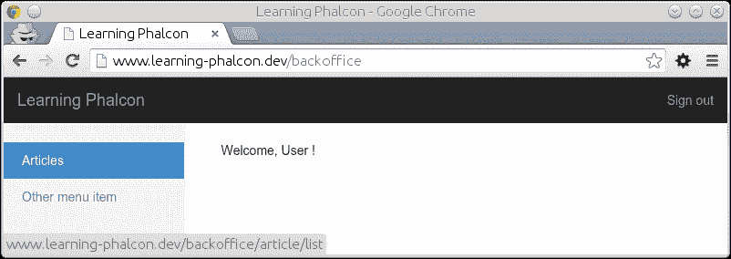
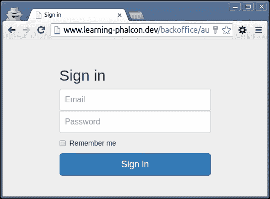

# 第六章。资产、认证和 ACL

我们将在这个章节中使用我们的`Backoffice`模块，因为它将是我们将要开发的第二个模块。

在本章中，我们将涵盖以下主题：

+   资产管理

+   开发认证系统

+   使用**访问控制列表**（**ACL**）组件保护应用程序

# 资产管理

在进一步之前，我想向你介绍 Phalcon 的资产管理器。当你需要处理大量资产时（通常，CSS 文件、图像和 JavaScript 文件），这是一个非常有用的组件。该服务应该已经可用，并且你可以通过 DI 使用以下命令访问它：

```php
$manager = $this->assets;

```

否则，你可以使用以下命令：

```php
$manager = $this->getDI()->get('assets');

```

### 注意

我听说有些人抱怨在安装后，这个服务不存在。如果你使用 Phalcon 版本 1.3.*（你应该使用），那么你不会有任何问题。如果你使用较旧版本，你可能需要将此服务注入到 DI 中：

```php
$di->set('assets', function () {
    return new Phalcon\Assets\Manager();
}, true);
```

现在，让我们打开后台办公室的主布局并进行一些更改。打开`modules/Backoffice/Views/Default/layout.volt`，并移除所有包含`stylesheetLink`和`javascriptInclude`的行。

现在，在`<head>`和`</head>`部分之间，添加以下代码：

```php
{{ assets.outputCss('headerCss') }}

```

在`</body>`关闭标签之前：

```php
{{ assets.outputJs('footerJs') }}
 
```

`outputJs`和`outputCss`方法包含两个参数（`headerCss`和`footerJs`）。这些参数是我们将在接下来的几分钟内构建的资产集合的名称。我添加了两个块（`css`和`javascripts`），因为我们可能想要为某个页面添加一些特殊资源。

现在，我们将修改`BaseController.php`文件，并添加资产。打开`Backoffice/Controllers/BaseController.php`，并附加以下代码：

```php
<?php
namespace App\Backoffice\Controllers;

class BaseController extends \Phalcon\Mvc\Controller
{
    public function afterExecuteRoute()
    {
        $this->buildAssets();
    }

    /**
     * Build the collection of assets
     */
    private function buildAssets()
    {
        $assets_dir = __DIR__.'/../../../public/assets/';

        $this->assets
            ->collection('headerCss')
            ->addCss($assets_dir.'default/bower_components/bootstrap/dist/css/bootstrap.min.css')
            ->addCss($assets_dir.'default/css/lp.backoffice.css')
            ->setTargetPath('assets/default/prod/backoffice.css')
            ->setTargetUri('../assets/default/prod/backoffice.css')
            ->join(true)
            ->addFilter(new \Phalcon\Assets\Filters\Cssmin());

        $this->assets
            ->collection('footerJs')
            ->addJs($assets_dir.'default/bower_components/jquery/dist/jquery.min.js')
            ->addJs($assets_dir.'default/bower_components/bootstrap/dist/js/bootstrap.min.js')
            ->addJs($assets_dir.'default/js/lp.js')
            ->setTargetPath('assets/default/prod/backoffice.js')
            ->setTargetUri('../assets/default/prod/backoffice.js')
            ->join(true)
            ->addFilter(new \Phalcon\Assets\Filters\Jsmin());
    }
}
```

你可以看到新的私有方法`buildAssets()`，其中我们创建资产组并使用特殊的过滤器来压缩它们。之后，我们在`afterExecuteRoute()`中调用此方法。如果你想，你可以通过扩展`Phalcon\Assets\FilterInterface`类来创建自己的自定义过滤器。请注意，输出将进入一个名为`prod`的新文件夹。我们必须创建此目录并赋予它适当的权限：

```php
$ cd public/assets/default
$ mkdir prod && chmod 777 prod
```

如果你处理很多资产，你可能想要在`config`数组或类似的地方保存一个列表。如果你使用来自 CDN 的资产，你需要传递一些特殊的参数，例如以下内容。

```php
$js->addJs('cnd.mysite.com/jquery.js', true, false);
// An external resource that does not need filtering.
```

在检查结果之前，我们需要做两件事。首先，从`IndexController`类中的`indexAction()`移除任何内容。最终的`IndexController.php`文件应该看起来像这样：

```php
<?php
namespace App\Backoffice\Controllers;

class IndexController extends BaseController
{
    public function indexAction()
    {
    }
}
```

然后，打开位于`Backoffice/Views/Default/index/index.volt`的`IndexAction()`模板，从中移除任何内容，并将其代码附加到其中：

```php


Welcome, User !


```

就这样了。你现在应该能够访问`http://www.learning-phalcon.localhost/backoffice`，结果应该与以下截图显示的完全相同：



图 1

这基本上就是关于资产管理的内容，这是一个简单、强大且有用的工具。

### 注意

你可以在官方文档中看到自定义过滤器的示例 [`docs.phalconphp.com/en/latest/reference/assets.html#assets-management`](http://docs.phalconphp.com/en/latest/reference/assets.html#assets-management)。

# 开发认证系统

在你的应用程序中，总有一些部分需要受到保护。在本节中，我们将实现一个基于我们在前几章中创建的用户表的认证系统，并且我们将使用 Phalcon 的 ACL 组件。

我们不会重新发明轮子，所以部分 HTML 代码是从官方 Bootstrap 网站上获取的 ([`getbootstrap.com`](http://getbootstrap.com))。此外，你还可以在很久以前我开发的一个插件中找到部分 PHP 代码，该插件可以在 [`github.com/calinrada/PhalconUserPlugin`](https://github.com/calinrada/PhalconUserPlugin) 找到。话虽如此，让我们开始开发我们的认证系统。

## 数据库结构

我们将为用户添加几个更多表，并根据在 [`github.com/phalcon/incubator/tree/master/Library/Phalcon/Acl/Adapter`](https://github.com/phalcon/incubator/tree/master/Library/Phalcon/Acl/Adapter) 找到的示例创建新的 ACL 表，因为我们将会使用数据库适配器。孵化器页面包含 SQLite 数据库的结构，但我们将会“转换”它以适应 MySQL。新的 `user_*` 表的提取方式如下：

```php
CREATE TABLE IF NOT EXISTS `user_failed_logins` (
 `id` int(11) NOT NULL AUTO_INCREMENT,
 `user_id` int(11) DEFAULT NULL,
 `ip_address` char(15) CHARACTER SET utf8 COLLATE utf8_unicode_ci NOT NULL,
 `attempted` int(11) unsigned NOT NULL,
 PRIMARY KEY (`id`),
 KEY `usersId` (`user_id`)
) ENGINE=InnoDB DEFAULT CHARSET=utf8 AUTO_INCREMENT=1 ;

CREATE TABLE IF NOT EXISTS `user_remember_tokens` (
 `id` int(11) NOT NULL AUTO_INCREMENT,
 `user_id` int(11) NOT NULL,
 `token` char(32) CHARACTER SET utf8 COLLATE utf8_unicode_ci NOT NULL,
 `user_agent` varchar(255) CHARACTER SET utf8 COLLATE utf8_unicode_ci DEFAULT NULL,
 `created_at` int(11) NOT NULL,
 PRIMARY KEY (`id`),
 KEY `token` (`token`),
 KEY `user_id` (`user_id`)
) ENGINE=InnoDB DEFAULT CHARSET=utf8 COLLATE=utf8_bin AUTO_INCREMENT=1 ;

CREATE TABLE IF NOT EXISTS `user_success_logins` (
 `id` int(11) NOT NULL AUTO_INCREMENT,
 `user_id` int(11) NOT NULL,
 `ip_address` char(15) CHARACTER SET utf8 COLLATE utf8_unicode_ci NOT NULL,
 `user_agent` varchar(255) CHARACTER SET utf8 COLLATE utf8_unicode_ci NOT NULL,
 `created_at` datetime NOT NULL,
 PRIMARY KEY (`id`),
 KEY `usersId` (`user_id`)
) ENGINE=InnoDB  DEFAULT CHARSET=utf8 COLLATE=utf8_bin AUTO_INCREMENT=1 ;

ALTER TABLE `user_failed_logins`
 ADD CONSTRAINT `user_failed_logins_ibfk_1` FOREIGN KEY (`user_id`) REFERENCES `user` (`id`) ON DELETE CASCADE ON UPDATE NO ACTION;

ALTER TABLE `user_remember_tokens`
 ADD CONSTRAINT `user_remember_tokens_ibfk_1` FOREIGN KEY (`user_id`) REFERENCES `article_translation` (`id`) ON DELETE CASCADE ON UPDATE NO ACTION;

ALTER TABLE `user_success_logins`
 ADD CONSTRAINT `user_success_logins_ibfk_1` FOREIGN KEY (`user_id`) REFERENCES `user` (`id`) ON DELETE CASCADE ON UPDATE NO ACTION;

```

新的 `acl_*` 表可以看起来像这样：

```php
CREATE TABLE IF NOT EXISTS `acl_access_list` (
  `roles_name` varchar(32) COLLATE utf8_unicode_ci NOT NULL,
  `resources_name` varchar(32) COLLATE utf8_unicode_ci NOT NULL,
  `access_name` varchar(32) COLLATE utf8_unicode_ci NOT NULL,
  `allowed` smallint(3) NOT NULL,
  PRIMARY KEY (`roles_name`,`resources_name`,`access_name`)
) ENGINE=InnoDB DEFAULT CHARSET=utf8 COLLATE=utf8_unicode_ci;

CREATE TABLE IF NOT EXISTS `acl_resources` (
  `name` varchar(32) CHARACTER SET utf8 COLLATE utf8_unicode_ci NOT NULL,
  `description` varchar(255) CHARACTER SET utf8 COLLATE utf8_unicode_ci DEFAULT NULL,
  PRIMARY KEY (`name`)
) ENGINE=InnoDB DEFAULT CHARSET=latin1;

CREATE TABLE IF NOT EXISTS `acl_resources_accesses` (
  `resources_name` varchar(32) COLLATE utf8_unicode_ci NOT NULL,
  `access_name` varchar(32) COLLATE utf8_unicode_ci NOT NULL,
  PRIMARY KEY (`resources_name`,`access_name`)
) ENGINE=InnoDB DEFAULT CHARSET=utf8 COLLATE=utf8_unicode_ci;

CREATE TABLE IF NOT EXISTS `acl_roles` (
  `name` varchar(32) CHARACTER SET utf8 COLLATE utf8_unicode_ci NOT NULL,
  `description` varchar(255) CHARACTER SET utf8 COLLATE utf8_unicode_ci DEFAULT NULL,
  PRIMARY KEY (`name`)
) ENGINE=InnoDB DEFAULT CHARSET=latin1;

CREATE TABLE IF NOT EXISTS `acl_roles_inherits` (
  `roles_name` varchar(32) CHARACTER SET utf8 COLLATE utf8_unicode_ci NOT NULL,
  `roles_inherit` varchar(32) CHARACTER SET utf8 COLLATE utf8_unicode_ci NOT NULL,
  PRIMARY KEY (`roles_name`,`roles_inherit`)
) ENGINE=InnoDB DEFAULT CHARSET=latin1;
```

## 模型

现在我们有了数据库结构，我们需要为新建的 `user_*` 表生成模型。目前，没有必要用完整的模型填满页面，因为它们现在将只包含获取器和设置器。我们模型的简化版本（不包含获取器和设置器）如下：

```php
<?php
namespace App\Core\Models;
class UserFailedLogins extends Base
{
    public function getSource()
    {
        return 'user_failed_logins';
    }
}

<?php
namespace App\Core\Models;
class UserSuccessLogins extends Base
{
    public function getSource()
    {
        return 'user_success_logins';
    }
}

<?php
namespace App\Core\Models;
class UserRememberTokens extends Base
{
    public function getSource()
    {
        return 'user_remember_tokens';
    }
}
```

你可以自己添加获取器和设置器，或者查看本章的源代码。

接下来，我们将向用户模型添加关系，以便我们可以快速访问这些新表中的数据。打开 `App\Core\Models\User.php` 并将以下代码追加到 `initialize()` 方法中：

```php
$this->hasMany('id', 'App\Core\Models\UserFailedLogins', 'user_id', array(
    'alias' => 'failedLogins',
    'foreignKey' => array(
    'action' => \Phalcon\Mvc\Model\Relation::ACTION_CASCADE
    )
));

$this->hasMany('id', 'App\Core\Models\UserSuccessLogins', 'user_id', array(
    'alias' => 'successLogins',
    'foreignKey' => array(
    'action' => \Phalcon\Mvc\Model\Relation::ACTION_CASCADE
    )
));

$this->hasMany('id', 'App\Core\Models\UserRememberTokens', 'user_id', array(
    'alias' => 'rememberTokens',
    'foreignKey' => array(
    'action' => \Phalcon\Mvc\Model\Relation::ACTION_CASCADE
    )
));
```

关于 `acl_*` 表，目前我们不需要创建任何模型。`acl` 数据库适配器将处理它们的大部分数据。我们也可以手动添加数据或为其创建一个任务。我们已经有数据库表和模型。接下来，我们将创建一个与它们交互的认证组件。

要做到这一点，请导航到 `modules/Core/ 目录` 并创建一个名为 `Security` 的新文件夹：

```php
$ cd modules/Core
$ mkdir Security

```

在 `security` 文件夹中，创建一个名为 `Auth.php` 的新文件，并添加以下内容：

```php
<?php
namespace App\Core\Security;

use App\Core\Models\User,
    App\Core\Models\UserRememberTokens,
    App\Core\Models\UserSuccessLogins,
    App\Core\Models\UserFailedLogins;

class Auth extends \Phalcon\Mvc\User\Component
{
    /**
     * Checks the user credentials
     *
     * @param  array  $credentials
     * @return boolean
     */
    public function check($credentials)
    {
        $user = User::findFirstByUserEmail(strtolower($credentials['email']));
        if ($user == false) {
            $this->registerUserThrottling(null);
            throw new \Exception('Wrong email/password combination');
        }

        if (!$this->security->checkHash($credentials['password'], $user->getUserPassword())) {
                $this->registerUserThrottling($user->getId());
                throw new \Exception('Wrong email/password combination');
        }

        $this->checkUserFlags($user);
        $this->saveSuccessLogin($user);

        if (isset($credentials['remember'])) {
            $this->createRememberEnviroment($user);
        }

        $this->setIdentity($user);
    }

    /**
     * Set identity in session
     *
     * @param object $user
     */
    private function setIdentity($user)
    {
        $st_identity = [
            'id'    => $user->getId(),
            'email' => $user->getUserEmail(),
            'name'  => $user->getUserFirstName().' '.$user->getUserLastName(),
            'roles' => [
                'Administrator'
            ]
        ];

        $this->session->set('identity', $st_identity);
    }

    /**
     * Login user - normal way
     *
     * @param  App\Core\Forms\UserSigninForm $form
     * @return \Phalcon\Http\ResponseInterface
     */
    public function signin($form)
    {
        if (!$this->request->isPost()) {
            if ($this->hasRememberMe()) {
                return $this->loginWithRememberMe();
            }
        } else {
            if ($form->isValid($this->request->getPost()) == false) {
                foreach ($form->getMessages() as $message) {
                    $this->flashSession->error($message->getMessage());
                }
            } else {
                $this->check([
                    'email'    => $this->request->getPost('email'),
                    'password' => $this->request->getPost('password'),
                    'remember' => $this->request->getPost('remember')
                ]);

                $redirect = $this->getDI()->get('config')->auth->redirect;

                return $this->response->redirect($redirect->success);
            }
        }

        return false;
    }

    /**
     * Creates the remember me environment settings the related cookies and generating tokens
     */
    public function saveSuccessLogin($user)
    {
        $successLogin = new UserSuccessLogins();
        $successLogin->setUserId($user->getId());
        $successLogin->setIpAddress($this->request->getClientAddress());
        $successLogin->setUserAgent($this->request->getUserAgent());

        if (!$successLogin->save()) {
            $messages = $successLogin->getMessages();
            throw new \Exception($messages[0]);
        }
    }

    /**
     * Implements login throttling
     * Reduces the efectiveness of brute force attacks
     *
     * @param int $user_id
     */
    public function registerUserThrottling($user_id)
    {
        $failedLogin = new UserFailedLogins();
        $failedLogin->setUserId($user_id == null ? new \Phalcon\Db\RawValue('NULL') : $user_id);
        $failedLogin->setIpAddress($this->request->getClientAddress());
        $failedLogin->setAttempted(time());
        $failedLogin->save();

        $attempts = UserFailedLogins::count([
            'ip_address = ?0 AND attempted >= ?1',
            'bind' => [
                $this->request->getClientAddress(),
                time() - 3600 * 6
            ]
        ]);

        switch ($attempts) {
            case 1:
            case 2:
                // no delay
            break;
            case 3:
            case 4:
                sleep(2);
            break;
            default:
                sleep(4);
            break;
        }
    }

    /**
     * Check if the user is signed in
     *
     * @return boolean
     */
    public function isUserSignedIn()
    {
        $identity = $this->getIdentity();

        if (is_array($identity)) {
            if (isset($identity['id'])) {
                return true;
            }
        }

        return false;
    }

    /**
     * Checks if the user is banned/inactive/suspended
     *
     * @param App\Core\Models\User $user
     */
    public function checkUserFlags($user)
    {
        if (false === $user->getUserIsActive()) {
            throw new \Exception('The user is inactive');
        }
    }

    /**
     * Returns the current identity
     *
     * @return array
     */
    public function getIdentity()
    {
        return $this->session->get('identity');
    }

    /**
     * Removes the user identity information from session
     */
    public function remove()
    {
        if ($this->cookies->has('RMU')) {
            $this->cookies->get('RMU')->delete();
        }

        if ($this->cookies->has('RMT')) {
            $this->cookies->get('RMT')->delete();
        }

        $this->session->remove('identity');
    }

    public function getUser()
    {
        $identity = $this->session->get('identity');

        if (isset($identity['id'])) {
            $user = User::findFirstById($identity['id']);
            if ($user == false) {
                throw new \Exception('The user does not exist');
            }

            return $user;
        }

        return false;
    }

}
```

### 注意

请注意，由于代码量较大，这不是完整的代码。请查看本章的源代码。你可以看到这个文件是扩展`\Phalcon\Mvc\User\Component`的，这意味着我们已经有访问 DI 的权限，因此我们不需要注入任何服务，因为它们已经可用。

让我们分析一下`Auth`组件中的几个方法：

+   `registerUserThrottling($user_id)`: 这个方法记录任何带有时间戳的失败登录尝试，并检查来自特定 IP 的用户尝试次数。如果尝试次数超过三次，我们将延迟响应。这是一个简单的方法来减少暴力攻击的有效性。

+   `checkUserFlags($user)`: 这个方法检查用户是否活跃。在这里，你可以添加其他检查，例如，检查用户是否被禁止或暂时停用。

+   `saveSuccessLogin($user)`: 这个方法保存用户的所有成功登录记录，包含用户 ID、IP、用户代理以及日期和时间。

+   `createRememberEnviroment($user)`: 这个方法（请查看第六章的源代码）创建我们将保存在数据库和一些 cookie 中的令牌。如果这个操作成功，下次我们可以使用这些信息自动登录用户。

+   `setIdentity($user)`: 这个方法简单地保存一个包含当前认证用户信息的数组到会话中。我们可以通过使用`getIdentity()`方法或直接从会话中调用`$session->get('identity')`来检索这些信息。

+   `check($credentials)`: 这个方法是最重要的。在这里，我们首先检查我们数据库中是否有任何用户注册了提供的电子邮件。如果用户存在，我们使用`checkHash()`安全组件比较他们的密码与提供的密码。之后，我们检查用户是否活跃，保存成功的登录记录，创建`记住我`环境，然后通过调用`setIdentity()`方法将用户信息保存在会话中。

+   `signin($form)`: 我们使用这个方法通过表单登录用户（我们将在不久后创建这个表单）。如果表单有效，我们调用`check()`方法验证凭据。其余的方法相当容易理解。

我们已经有了`Auth`组件，但目前它还不可用。我们需要将其添加到我们的依赖注入（DI）中。打开`modules/Backoffice/Config/services.php`文件并添加以下代码：

```php
$di['auth'] = function () use ($di) {
    return new App\Core\Security\Auth();
};
```

然后，打开`config.php`文件并将以下代码追加到`$module_config`数组中：

```php
    'auth' => array(
        'redirect' => array(
            'success' => 'index/index',
            'failure' => 'auth/signin',
        ),
    ),
```

组件现在已激活，我们可以使用它了。我们将为登录操作创建模板、表单和控制器。导航到`modules/Backoffice/Controllers`并创建一个名为`AuthController.php`的新文件，内容如下：

```php
<?php
namespace App\Backoffice\Controllers;

use App\Core\Forms\UserSigninForm;

class AuthController extends BaseController
{
    public function signinAction()
    {
        $form = new UserSigninForm();

        if ($this->request->isPost()) {
            try {
                $this->auth->signin($form);
            } catch (\Exception $e) {
                $this->flash->error($e->getMessage());
            }
        }

        $this->view->signinForm = $form;
    }

    public function signoutAction()
    {
        $this->auth->remove();

        return $this->response->redirect('auth/signin');
    }
}
```

我们还没有`UserSinginForm`。导航到`modules/Core/`目录并创建一个名为`Forms`的新文件夹：

```php
$ cd modules/Core
$ mkdir Forms

```

在`Forms`目录下，创建一个名为`UserSigninForm.php`的新文件，内容如下：

```php
<?php
namespace App\Core\Forms;

use Phalcon\Forms\Form;
use Phalcon\Forms\Element\Text;
use Phalcon\Forms\Element\Password;
use Phalcon\Forms\Element\Submit;
use Phalcon\Forms\Element\Check;
use Phalcon\Forms\Element\Hidden;
use Phalcon\Validation\Validator\PresenceOf;
use Phalcon\Validation\Validator\Email;
use Phalcon\Validation\Validator\Identical;

class UserSigninForm extends Form
{
    public function initialize()
    {
        $email = new Text('email', array(
            'placeholder' => 'Email',
        ));

        $email->addValidators(array(
            new PresenceOf(array(
                'message' => 'The e-mail is required',
            )),
            new Email(array(
                'message' => 'The e-mail is not valid',
            )),
        ));

        $this->add($email);

        //Password
        $password = new Password('password', array(
            'placeholder' => 'Password',
        ));

        $password->addValidator(
            new PresenceOf(array(
                'message' => 'The password is required',
            ))
        );

        $this->add($password);

        //Remember
        $remember = new Check('remember', array(
            'value' => 'yes',
        ));

        $remember->setLabel('Remember me');

        $this->add($remember);

        //CSRF (Cross-Site Request Forgery)
        $csrf = new Hidden('csrf');

        $csrf->addValidator(
            new Identical(array(
                'value' => $this->security->getSessionToken(),
                'message' => 'CSRF validation failed',
            ))
        );

        $this->add($csrf);

        $this->add(new Submit('signin', array(
            'class' => 'btn btn-lg btn-primary btn-block',
        )));
    }
}
```

您可能已经注意到我们正在使用**CSRF**字段来防止**跨站请求伪造**攻击。如果您对此一无所知，请花几分钟时间阅读有关它的内容。[`www.owasp.org/index.php/Cross-Site_Request_Forgery_(CSRF)_Prevention_Cheat_Sheet`](https://www.owasp.org/index.php/Cross-Site_Request_Forgery_(CSRF)_Prevention_Cheat_Sheet)。

接下来，我们将创建模板。我们将使用[`getbootstrap.com/examples/signin/`](http://getbootstrap.com/examples/signin/)上的示例模板，但我们将根据我们的需求对其进行调整。由于我们的主要模板`layout.volt`包含仅对认证用户可用的信息，我们将克隆此模板并清理它，以便我们可以将其用于登录操作和其他需要简单模板的操作。导航到`modules/Backoffice/Views/Default/`，通过将其重命名为`layout_simple.volt`来复制`layout.volt`文件：

```php
$ cd modules/Backoffice/Views/Default/
$ cp layout.volt layout_simple.volt

```

然后，从`layout_simple.volt`中删除代码，并追加新的清理代码：

```php
<!DOCTYPE html>
<html lang="en">
<head>
<meta charset="utf-8">
<meta http-equiv="X-UA-Compatible" content="IE=edge">
<meta name="viewport" content="width=device-width, initial-scale=1">
<title>Learning Phalcon</title>

{{ assets.outputCss('headerCss') }}


<!--[if lt IE 9]>
      <script src="img/html5shiv.min.js"></script>
      <script src="img/respond.min.js"></script>
<![endif]-->
</head>
<body>
    <div class="container-fluid">
      <div class="row">
        <div class="col-sm-12 main">
          

          
        </div>
      </div>
    </div>

    {{ assets.outputJs('footerJs') }}
     
</body>
</html>
```

最后一步是创建`signingAction()`的模板。导航到`modules/Backoffice/Views/Default`，创建一个名为`auth`的新文件夹。之后，在`auth`文件夹中，创建一个名为`signin.volt`的文件，内容如下：

```php

Sign in

 {{ assets.outputCss('signin') }}



<form class="form-signin" method="post" action="">
 {{ content() ~ flashSession.output() }}
 <h2 class="form-signin-heading">Sign in</h2>
 <label for="inputEmail" class="sr-only">Email address</label>
 {{ signinForm.render('email', {'class':'form-control', 'required':true, 'autofocus':true, 'type':'email'}) }}
 <label for="inputPassword" class="sr-only">Password</label>
 {{ signinForm.render('password', {'class':'form-control', 'required':true}) }}
 <div class="checkbox">
 <label>
 {{ signinForm.render('remember') }} Remember me
 </label>
 </div>
 {{ signinForm.render('signin', {'value':'Sign in'}) }}
 {{ signinForm.render('csrf', {'value':security.getToken()}) }}
</form>



```

`signin.volt`模板扩展了新创建的`layout_simple.volt`。注意新的`css`块。我们添加了一个名为`signin`的新`css`组。我们将在几分钟后启用它。`{{ content() ~ flashSession.output() }}`行是一个连接，因为`flashSession`组件在`content()`文件中没有返回。所以，如果我们只输出`content()`方法，`flashSession`消息将不会被看到。

模板缺少一个`css`文件。我们需要创建它并将其添加到我们的`assets`集合中。为此，导航到`public/assets/default/css/`，并创建一个名为`lp.backoffice.signin.css`的新文件，内容如下：

```php
body {
  padding-top: 40px;
  padding-bottom: 40px;
  background-color: #eee;
}

.form-signin {
  max-width: 330px;
  padding: 15px;
  margin: 0 auto;
}

.form-signin .form-signin-heading,
.form-signin .checkbox {
  margin-bottom: 10px;
}

.form-signin .checkbox {
  font-weight: normal;
}

.form-signin .form-control {
  position: relative;
  height: auto;
  -webkit-box-sizing: border-box;
     -moz-box-sizing: border-box;
          box-sizing: border-box;
  padding: 10px;
  font-size: 16px;
}

.form-signin .form-control:focus {
  z-index: 2;
}

.form-signin input[type="email"] {
  margin-bottom: -1px;
  border-bottom-right-radius: 0;
  border-bottom-left-radius: 0;
}

.form-signin input[type="password"] {
  margin-bottom: 10px;
  border-top-left-radius: 0;
  border-top-right-radius: 0;
}
```

然后，我们将此文件添加到我们的`assets`集合中。打开`modules/Backoffice/Controllers/BaseController.php`，并将以下代码追加到`buildAssets()`方法中：

```php
$this->assets
 ->collection('signin')
 ->addCss($assets_dir.'default/css/lp.backoffice.signin.css')
 ->setTargetPath('assets/default/prod/backoffice.signin.css')
 ->setTargetUri('../assets/default/prod/backoffice.signin.css')
 ->addFilter(new \Phalcon\Assets\Filters\Cssmin());

```

这就足够了。我们的`Backoffice`模块尚未受保护，但实际上我们可以执行`signin`操作。使用您的浏览器，访问`http://www.learning-phalcon.localhost/backoffice/auth/signin`，您应该能够看到以下截图所示的精确结果：



**登录**页面

如果您已经有了用户名，您可以尝试登录。如果没有，您可以使用我们在第四章中创建的任务创建一个新用户，*数据库架构、模型和 CLI 应用程序*：

```php
$ php modules/cli.php user create John Doe john.doe@learning-phalcon.localhost myPassw0rd 1 Barcelona 1985-03-25

```

这将创建一个用户，其电子邮件地址为 `john.doe@learning-phalcon.localhost`，密码为 `myPassw0rd`。您可以使用这些详细信息来测试表单。成功后，您将被重定向到索引页面，失败时，您将看到一些错误消息。

现在我们已经有一个完全功能的认证系统，我们可以保护整个应用程序。为此，我们将使用 Phalcon 的 `Acl` 组件。

# 使用 ACL 组件保护应用程序

当您有不同角色的用户时，ACL 非常有用。例如，管理员应该有无限访问权限，但编辑员只能访问文章部分。我们已经有 Acl 的数据库结构，所以我们只需要创建一些关系。首先，我们将创建一个名为 `user_roles` 的新中间表，该表将包含每个用户角色的信息。一个用户可以有多个角色。

```php
CREATE TABLE IF NOT EXISTS `user_role` (
 `user_id` int(11) NOT NULL,
 `role` varchar(32) CHARACTER SET utf8 COLLATE utf8_unicode_ci NOT NULL,
 UNIQUE KEY `user_id_2` (`user_id`,`role`),
 KEY `role` (`role`)
) ENGINE=InnoDB DEFAULT CHARSET=latin1;

ALTER TABLE `user_role`
 ADD CONSTRAINT `user_role_ibfk_2` FOREIGN KEY (`role`) REFERENCES `acl_roles` (`name`) ON DELETE CASCADE ON UPDATE CASCADE,
 ADD CONSTRAINT `user_role_ibfk_1` FOREIGN KEY (`user_id`) REFERENCES `user` (`id`) ON DELETE CASCADE ON UPDATE NO ACTION;

```

我们还可以做的一件事是删除 `user_group` 表，因为我们不再使用它了。

1.  删除 `modules/Core/Models/UserGroup.php` 文件。

1.  从 `User.php` 中删除此代码：

    ```php
    $this->hasOne('user_group_id', 'App\Core\Models\UserGroups', 'id', array(
     'alias' => 'group',
     'reusable' => true,
    ));

    ```

1.  从 `user` 表中删除列并删除 `user_group` 表：

    ```php
    ALTER TABLE `user` DROP FOREIGN KEY `user_ibfk_1` ;
    ALTER TABLE  `user` DROP  `user_group_id` ;
    DROP TABLE user_group;

    ```

1.  通过导航到 `Core/Managers/UserManager.php` 更新用户 `create()` 方法，并删除以下代码行：

    ```php
    $user_group_id = $this->findFirstGroupByName($user_group_name)->getId();
    $user->setUserGroupId($user_group_id);

    ```

1.  在 `create()` 方法中，将 `param $user_group_name = 'User'` 替换为 `$user_role = 'Guest'`。（我们将在不久后实现此功能。）

现在，让我们从 `user_role` 和 `acl_roles` 创建模型。记住，我不会写下获取器和设置器，只写重要的内容。

```php
<?php
namespace App\Core\Models;

class UserRole extends Base
{
    public function initialize()
    {
        $this->belongsTo('user_id', 'App\Core\Models\User', 'id', array(
            'foreignKey' => true,
            'reusable' => true,
            'alias' => 'user',
        ));

        $this->belongsTo('user_role', 'App\Core\Models\AclRoles', 'name', array(
            'foreignKey' => true,
            'reusable' => true,
            'alias' => 'role',
        ));
    }
}
```

```php
<?php

namespace App\Core\Models;

class AclRoles extends Base
{
// Nothing important here for now, just getters and setters
}
```

为了将现有角色分配给用户，我们需要对 `UserManager.php` 中的 `create()` 方法进行一些修改。新方法应如下所示：

```php
    public function create($data, $user_role = 'Guest')
    {
        $security = $this->getDI()->get('security');

        $user = new User();
        $user->setUserFirstName($data['user_first_name']);
        $user->setUserLastName($data['user_last_name']);
        $user->setUserEmail($data['user_email']);
        $user->setUserPassword($security->hash($data['user_password']));
        $user->setUserIsActive($data['user_is_active']);

        $o_acl_role  = AclRoles::findFirstByName($user_role);

        if (!$o_acl_role) {
            throw new \Exception("Role $user_role does not exists");
        };

        $o_user_role[0] = new UserRole();
        $o_user_role[0]->setUserRole($user_role);

        $user->roles = $o_user_role;

        $profile = new UserProfile();
        $profile->setUserProfileLocation($data['user_profile_location']);
        $profile->setUserProfileBirthday($data['user_profile_birthday']);

        $user->profile = $profile;

        return $this->save($user);
    }
```

我们将 `$o_user_role` 定义为对象数组集合的原因是用户和角色之间的关系是一对多。我们还需要修改 `UserTask.php` 中的 `createAction()` 方法。打开位于 `modules/Tasks/UserTask.php` 的文件，并按以下方式追加用户的角色：

```php
$user = $manager->create(array(
 'user_first_name' => $params[0],
 'user_last_name' => $params[1],
 'user_email' => $params[2],
 'user_password' => $params[3],
 'user_is_active' => $params[4],
 'user_profile_location' => $params[5],
 'user_profile_birthday' => $params[6],
), 'Guest');

```

我们将默认使用 `Guest`。稍后，我们将创建一个方法来为用户添加和删除角色。现在，我们将实现安全检查。切换到 `modules/Core/Security` 文件夹，创建一个包含以下内容的文件：

```php
<?php
namespace App\Core\Security;

class Acl extends \Phalcon\Mvc\User\Plugin
{
    public function beforeDispatch(\Phalcon\Events\Event $event, \Phalcon\Mvc\Dispatcher $dispatcher)
    {
        $controller = $dispatcher->getControllerName();
        $action     = $dispatcher->getActionName();
        $redirect   = $this->getDI()->get('config')->auth->redirect;

        if ($controller == 'auth' && $action == 'signin') {
            return true;
        }

        $account = $this->auth->getIdentity();

        if (!$account) {
            if ($this->getDI()->get('auth')->hasRememberMe()) {
                return $this->getDI()->get('auth')->loginWithRememberMe();
            }
        }

        if (!is_array($account) || !array_key_exists('roles', $account)) {

            $this->view->disable();
            $this->response->setStatusCode(403, 'Forbidden');
            $this->flashSession->error('You are not allowed to access this section');
            return $this->response->redirect($redirect->failure);
        }

        $acl = $this->getDI()->get('acl');

        foreach ($account['roles'] as $role) {
            if ($acl->isAllowed($role, $controller, $action) == \Phalcon\Acl::ALLOW) {
                return true;
            }
        }

        $this->view->disable();
        $this->response->setStatusCode(403, 'Forbidden');
        return $this->response->redirect($redirect->failure);
    }
}
```

基本上，使用 `beforeDispatch()` 方法，我们检查用户请求的内容，是否已认证，以及他们拥有的角色是否允许他们访问某个资源。我们需要启用 `Acl` 服务并将 `Acl` 附加到事件管理器。在 `config/services.php`（全局）中添加 `Acl` 服务的设置：

```php
$di['acl'] = function () use ($di) {
    $acl = new \Phalcon\Acl\Adapter\Database([
        'db' => $di['db'],
        'roles' => 'acl_roles',
        'rolesInherits' => 'acl_roles_inherits',
        'resources' => 'acl_resources',
        'resourcesAccesses' => 'acl_resources_accesses',
        'accessList' => 'acl_access_list',
    ]);

    $acl->setDefaultAction(\Phalcon\Acl::DENY);

    return $acl;
};
```

然后，用以下代码更新分发器：

```php
$di['dispatcher'] = function () use ($di) {
    $eventsManager = $di->getShared('eventsManager');

    $eventsManager->attach('dispatch', new App\Core\Security\Acl($di));

    $dispatcher = new \Phalcon\Mvc\Dispatcher();
    $dispatcher->setEventsManager($eventsManager);
    $dispatcher->setDefaultNamespace("App\Backoffice\Controllers");

    return $dispatcher;
};
```

我们还需要更新 `Auth.php` 中的 `setIdentity()` 方法。用以下代码替换它以从数据库中获取用户角色：

```php
private function setIdentity($user)
{
    $roles = [];
    foreach ($user->roles as $role) {
      $roles[] = $role->getUserRole();
    }

    $st_identity = [
      'id'    => $user->getId(),
      'email' => $user->getUserEmail(),
      'name'  => $user->getUserFirstName().' '.$user->getUserLastName(),
      'roles' => $roles
    ];

    $this->session->set('identity', $st_identity);
}
```

如果你严格按照步骤操作，并且一切都按照书本上的方法来做，你应该能够访问 `http://www.learning-phalcon.localhost/backoffice/`；浏览器将会将你重定向到 **登录** 页面（也就是我们之前看到的 **登录** 页面）。

我们几乎就要结束这一章了。接下来我们将创建一个处理 `Acl` 的任务，并且在未来当我们需要修改某人的权限时，我们会使用这个任务。让我们看看一个简单的 `Acl` 任务可以是什么样的。

切换到 `modules/Tasks` 并创建一个名为 `AclTask.php` 的新文件，内容如下：

```php
<?php
class AclTask extends BaseTask
{
    /**
     *
     * @var \Phalcon\Acl\Adapter\Database
     */
    private $acl;

    public function __construct()
    {
        $this->acl = $this->getDI()->get('acl');
    }

    /**
     * @Description("Install the initial(default) acl resources")
     */
    public function initAction()
    {
        $roles = array(
            'Administrator' => new \Phalcon\Acl\Role('Administrator'),
            'Guest' => new \Phalcon\Acl\Role('Guest'),
        );

        foreach ($roles as $role) {
            $this->acl->addRole($role);
        }

        $userResources = array(
            'index' => array('index'),
        );

        foreach ($userResources as $resource => $actions) {
            //$this->acl->addResource(new \Phalcon\Acl\Resource($resource), $actions);
            foreach ($actions as $action) {
                $this->acl->allow('Administrator', $resource, $action);
            }
        }

        $this->consoleLog('Default resources created');
    }
}
```

我们只创建了一个名为 `initAction()` 的方法，它将创建两个默认的 acl 角色：`管理员` 和 `访客`。管理员将能够访问一切，而访客角色将无法访问任何内容。运行此任务：

```php
$ php modules/cli.php acl init

```

现在你应该能够在数据库中看到已经插入的两个角色的记录。如果你看到了它们，你可以导航到 `user_role` 表，为你的用户插入一个 `管理员` 角色，然后尝试登录，然后删除 `管理员` 角色并添加 `访客` 角色。我们将在下一章中为这个任务添加更多方法。

# 摘要

在这一章中，你学习了资产管理以及访问控制列表。我们还为我们的应用程序开发了一个认证系统。我们将继续我们的旅程，开发 `Backoffice` 模块，在那里你将了解更多关于表单、Volt 和模型的知识。
