# 第一章. 设置环境

你即将开始一段旅程——这是一段漫长的旅程，你将学习如何使用 PHP 编写 Web 应用程序。然而，首先，你需要设置你的环境，这在某些时候已被证明是棘手的。这项任务包括安装 PHP 7，这本书的首选语言；MySQL，我们将用于一些章节的数据库；Nginx，将允许我们通过浏览器可视化我们的应用程序的 Web 服务器；以及 Composer，最受欢迎的 PHP 依赖关系管理工具。我们将使用 Vagrant 并在三个不同的平台上完成所有这些：Windows、OS X 和 Ubuntu。

在本章中，你将了解：

+   使用 Vagrant 设置开发环境

+   在主要平台上手动设置环境

# 使用 Vagrant 设置环境

不久前，每次你为一家新公司开始工作时，你都会在最初的几天里花很多时间来设置你的新环境——也就是说，在你的新电脑上安装所有必要的工具以便能够编码。这非常令人沮丧，因为尽管要安装的软件是相同的，但总是会有一些失败或缺失的地方，你将花费较少的时间来提高生产力。

## 介绍 Vagrant

幸运的是，人们试图解决这个问题。首先，我们有虚拟机，这是你电脑内的计算机仿真。有了这个，我们可以在 MacBook 中运行 Linux，这允许开发者共享环境。这是一个好的步骤，但它仍然有一些问题；例如，VMs 在移动到不同环境时相当大，如果开发者想要进行更改，他们必须将相同的更改应用到组织中的所有现有虚拟机上。

经过一番深思熟虑，一群工程师提出了解决这些问题的方案，我们得到了**Vagrant**。这款惊人的软件允许你通过简单的配置文件来管理虚拟机。想法很简单：一个配置文件指定了我们需要从在线可用的一组基本虚拟机中选择哪一个，以及你希望如何自定义它——也就是说，你希望在启动机器时运行哪些命令——这被称为“配置”。你可能会从公共仓库中获得 Vagrant 配置，如果这个配置有任何更改，你可以获取这些更改并重新配置你的机器。很简单，对吧？

## 安装 Vagrant

如果你还没有安装 Vagrant，安装它相当简单。你需要访问 Vagrant 下载页面[`www.vagrantup.com/downloads.html`](https://www.vagrantup.com/downloads.html)并选择你正在使用的操作系统。执行安装程序，它不需要任何额外的配置，然后你就可以开始了。

## 使用 Vagrant

使用 Vagrant 相当简单。最重要的部分是`Vagrantfile`文件。此文件包含我们想要使用的基镜像的名称以及我们想要应用的其余配置。以下内容是为了获取具有 PHP 7、MySQL、Nginx 和 Composer 的 Ubuntu 虚拟机所需的配置。将其保存为`Vagrantfile`在本书示例的目录根中。

```php
VAGRANTFILE_API_VERSION = "2"

Vagrant.configure(VAGRANTFILE_API_VERSION) do |config|
  config.vm.box = "ubuntu/trusty32"
  config.vm.network "forwarded_port", guest: 80, host: 8080
  config.vm.provision "shell", path: "provisioner.sh"
end
```

如您所见，文件相当小。基本镜像的名称是`ubuntu/trusty32`，发送到我们的端口`8080`的消息将被重定向到虚拟机的端口`80`，配置将基于`provisioner.sh`脚本。您需要创建此文件，它将包含我们需要的不同组件的所有设置。这就是您需要添加到该文件中的内容：

```php
#!/bin/bash

sudo apt-get install python-software-properties -y
sudo LC_ALL=en_US.UTF-8 add-apt-repository ppa:ondrej/php -y
sudo apt-get update
sudo apt-get install php7.0 php7.0-fpm php7.0-mysql -y
sudo apt-get --purge autoremove -y
sudo service php7.0-fpm restart

sudo debconf-set-selections <<< 'mysql-server mysql-server/root_password password root'
sudo debconf-set-selections <<< 'mysql-server mysql-server/root_password_again password root'
sudo apt-get -y install mysql-server mysql-client
sudo service mysql start

sudo apt-get install nginx -y
sudo cat > /etc/nginx/sites-available/default <<- EOM
server {
    listen 80 default_server;
    listen [::]:80 default_server ipv6only=on;

    root /vagrant;
    index index.php index.html index.htm;

    server_name server_domain_or_IP;

    location / {
        try_files \$uri \$uri/ /index.php?\$query_string;
    }

    location ~ \.php\$ {
        try_files \$uri /index.php =404;
        fastcgi_split_path_info ^(.+\.php)(/.+)\$;
        fastcgi_pass unix:/var/run/php/php7.0-fpm.sock;
        fastcgi_index index.php;
        fastcgi_param SCRIPT_FILENAME \$document_root\$fastcgi_script_name;
        include fastcgi_params;
    }
}
EOM
sudo service nginx restart
```

文件看起来相当长，但我们将用它做很多事情。在文件的第一部分，我们将添加必要的仓库以便能够获取 PHP 7，因为它不包括在官方的仓库中，然后安装它。然后，我们将尝试安装 MySQL 服务器和客户端。由于我们无法使用 Vagrant 手动引入它，因此在此配置中我们将设置 root 密码。由于这是一个开发机器，这并不是真正的问题，但您完成之后可以随时更改密码。最后，我们将安装和配置 Nginx 以监听端口`8080`。

要启动虚拟机，您需要在`Vagrantfile`所在的同一目录下执行以下命令：

```php
$ vagrant up

```

第一次执行时，它将花费一些时间，因为它需要从仓库下载镜像，然后执行`provisioner.sh`文件。输出应该类似于以下内容，然后是更多的输出消息：

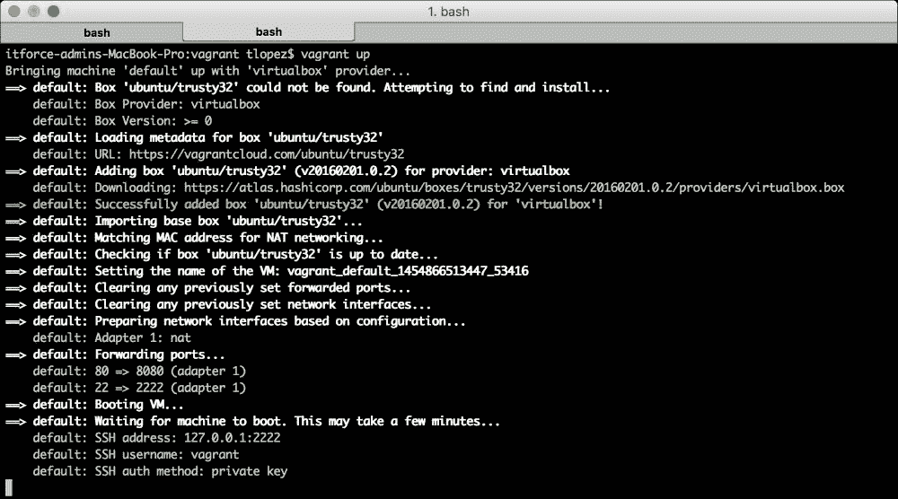

为了访问您的新虚拟机，请在包含您的`Vagrantfile`文件的同一目录下运行以下命令：

```php
$ vagrant ssh

```

Vagrant 将启动到虚拟机的 SSH 会话，这意味着您已经进入了虚拟机。您可以执行任何您会用 Ubuntu 系统命令行执行的操作。要退出，只需按*Ctrl* + *D*。

从您的笔记本电脑共享文件到虚拟机非常简单；只需将它们移动或复制到包含您的`Vagrantfile`文件的同一目录，它们就会“神奇地”出现在您的虚拟机的`/vagrant`目录中。它们将同步，所以您在虚拟机中进行的任何更改都会反映在您的笔记本电脑上的文件中。

当您有一个 Web 应用程序并且想要通过 Web 浏览器测试它时，请记住我们将转发端口。这意味着为了访问您的虚拟机的端口`80`（Web 应用程序的常用端口），您需要将浏览器指向端口`8080`；以下是一个示例：`http://localhost:8080`。

# 在 OS X 上设置环境

如果你不太相信 Vagrant 并且更喜欢使用 Mac 开发 PHP 应用程序，这部分内容就是为你准备的。根据你的 OS X 版本，在 Mac 上安装所有必要的工具可能有点棘手。在撰写本书时，Oracle 没有发布一个可以在 El Capitan 上通过命令行使用的 MySQL 客户端，所以我们将描述如何安装另一个可以完成类似工作的工具。

## 安装 PHP

如果这是你第一次使用 Mac 开发任何类型的应用程序，你将不得不从安装 Xcode 开始。你可以在 App Store 中免费找到这个应用程序：

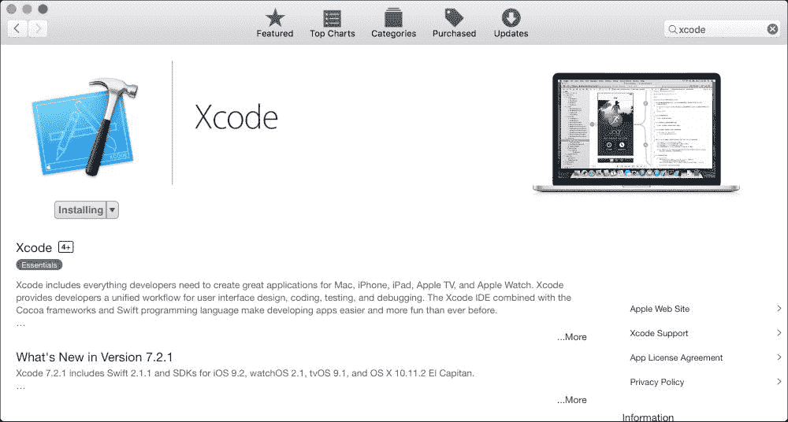

对于 Mac 用户来说，另一个不可或缺的工具是 Brew。这是 OS X 的包管理器，将帮助我们几乎无痛地安装 PHP。要安装它，请在你的命令行上运行以下命令：

```php
$ ruby -e "$(curl -fsSL https://raw.githubusercontent.com/Homebrew/install/master/install)"

```

如果你已经安装了 Brew，你可以通过运行这两个命令来确保一切正常：

```php
$ brew doctor
$ brew update

```

现在是时候使用 Brew 安装 PHP 7 了。为此，你只需要运行一个命令，如下所示：

```php
$ brew install homebrew/php/php70

```

结果应该如下所示：

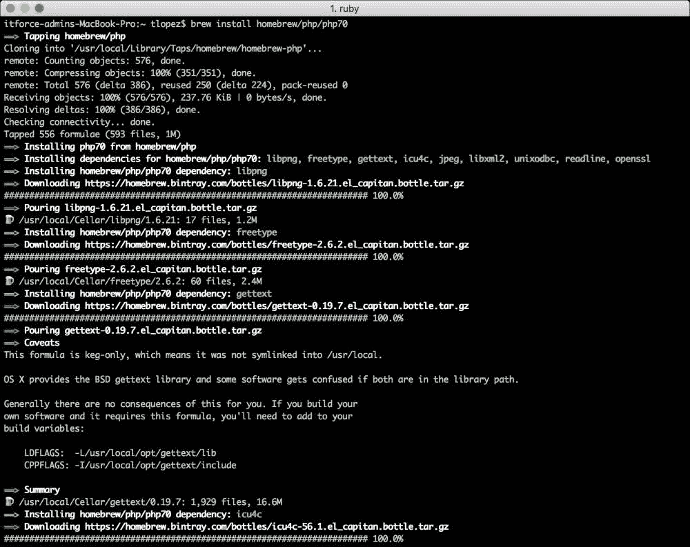

确保通过执行此命令将二进制文件添加到你的 `PATH` 环境变量中：

```php
$ export PATH="$(brew --prefix homebrew/php/php70)/bin:$PATH"

```

你可以通过使用 `$ php –v` 命令询问你的系统正在使用哪个版本的 PHP 来检查你的安装是否成功。

## 安装 MySQL

如本节开头所指出的，MySQL 对于 Mac 用户来说有点棘手。你需要下载 MySQL 服务器安装程序和 MySQL Workbench 作为客户端。MySQL 服务器安装程序可以在 [`dev.mysql.com/downloads/mysql/`](https://dev.mysql.com/downloads/mysql/) 找到。你应该会找到一个不同的选项列表，如下所示：

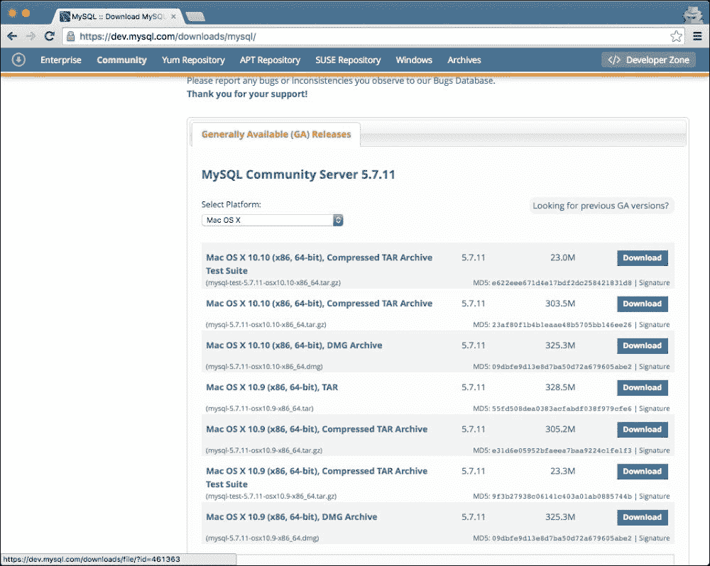

最简单的方法是下载 **DMG 存档**。你将需要使用你的 Oracle 账户登录；如果你没有，你可以创建一个。之后，下载将开始。与任何 DMG 包一样，只需双击它，然后按照选项进行操作——在这种情况下，只需一直点击 **下一步**。请注意，因为过程结束时，你将收到类似以下的消息：

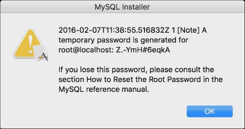

记下它；否则，你可能需要重置根密码。下一个是 MySQL Workbench，你可以在 [`www.mysql.com/products/workbench/`](http://www.mysql.com/products/workbench/) 找到它。过程是相同的；你将被要求登录，然后你会得到一个 DMG 文件。点击 **下一步** 直到安装向导结束。一旦完成，你可以启动应用程序；它应该看起来像这样：

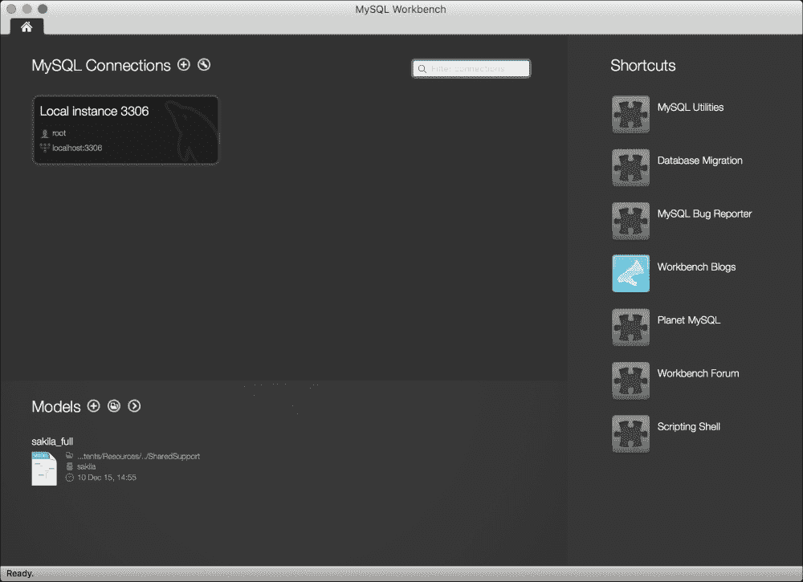

## 安装 Nginx

为了安装 Nginx，我们将使用 Brew，就像我们安装 PHP 一样。命令如下：

```php
$ brew install nginx

```

如果你想让 Nginx 在你启动笔记本电脑时启动，请运行以下命令：

```php
$ ln -sfv /usr/local/opt/nginx/*.plist ~/Library/LaunchAgents

```

如果你需要更改 Nginx 的配置，你将在 `/usr/local/etc/nginx/nginx.conf` 文件中找到它。你可以更改一些事情，比如 Nginx 监听哪个端口或你的代码所在的根目录（默认目录是 `/usr/local/Cellar/nginx/1.8.1/html/`）。记得使用 `sudo nginx` 命令重新启动 Nginx 以应用更改。

## 安装 Composer

安装 Composer 与使用 `curl` 命令下载一样简单；使用以下两个命令将二进制文件移动到 `/usr/local/bin/`：

```php
$ curl -sS https://getcomposer.org/installer | php
$ mv composer.phar /usr/local/bin/composer

```

# 在 Windows 上设置环境

虽然基于个人观点选择立场并不太专业，但开发者之间众所周知，使用 Windows 作为开发机器可能会非常困难。当涉及到安装所有软件时，它们证明非常棘手，因为安装模式始终与 OS X 和 Linux 系统大不相同，而且经常会出现依赖或配置问题。此外，命令行与 Unix 系统有不同的解释器，这使得事情变得更加复杂。这就是为什么大多数开发者会建议你如果只有一台 Windows 机器可用，就使用带有 Linux 的虚拟机。

然而，为了公平起见，PHP 7 是一个例外。安装它出奇地简单，所以如果你真的很熟悉 Windows 并且不想使用 Vagrant，这里有一个简短的说明，告诉你如何设置你的环境。

## 安装 PHP

为了安装 PHP 7，你首先需要从官方网站下载安装程序。为此，请访问 [`windows.php.net/download`](http://windows.php.net/download)。选项应该类似于以下截图：

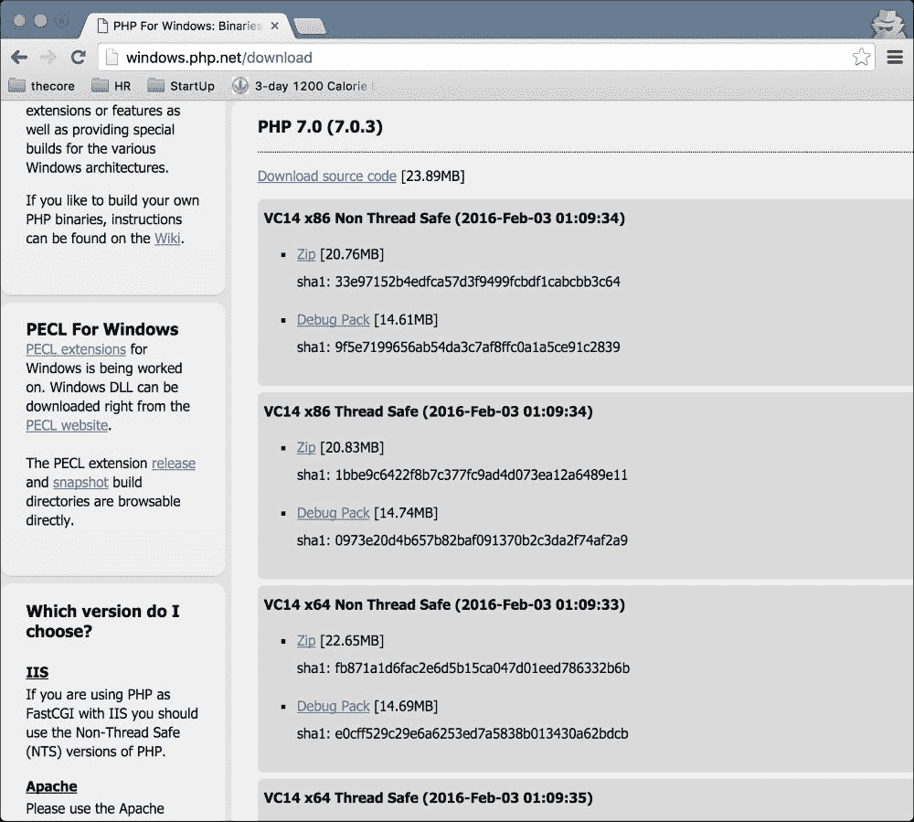

对于 Windows 32 位，选择**x86 Thread Safe**，对于 64 位，选择**x64 Thread Safe**。下载后，将其解压缩到 `C:\php7`。是的，就是这样！

## 安装 MySQL

安装 MySQL 稍微复杂一些。从 [`dev.mysql.com/downloads/installer/`](http://dev.mysql.com/downloads/installer/) 下载安装程序并执行它。在接受许可协议后，你会得到一个类似于以下窗口：

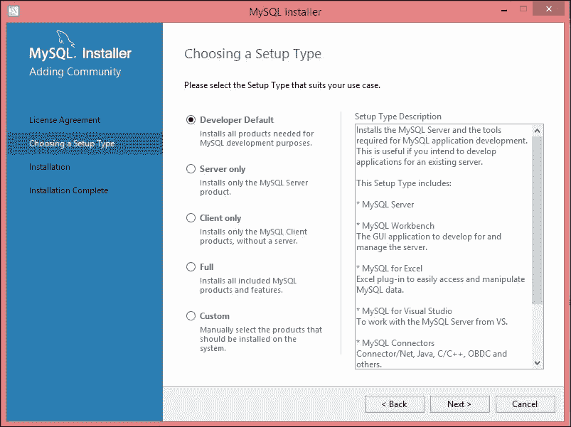

为了本书的目的——实际上对于任何开发环境——你应该选择第一个选项：**开发者默认**。继续前进，保留所有默认选项，直到你得到一个类似以下窗口：

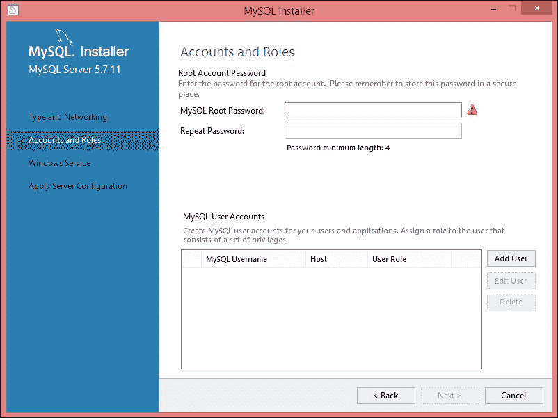

根据你的偏好，你可以只为 root 用户设置一个密码，这对于开发机器来说已经足够了，或者你可以通过点击**添加用户**来添加一个额外的用户。确保设置正确的名称、密码和权限。一个名为 `test` 的具有管理员权限的用户应该看起来像以下截图：

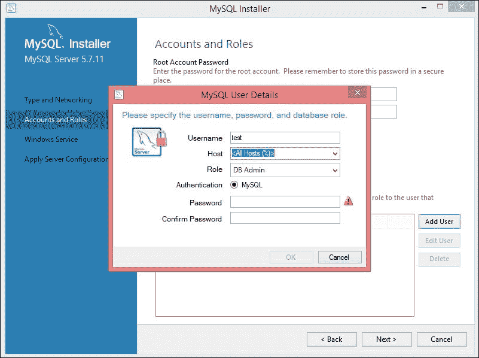

对于安装过程的其余部分，你可以选择所有默认选项。

## 安装 Nginx

Nginx 的安装几乎与 PHP 7 的安装相同。首先，从[`nginx.org/en/download.html`](http://nginx.org/en/download.html)下载 ZIP 文件。在撰写本文时，可用的版本如下：

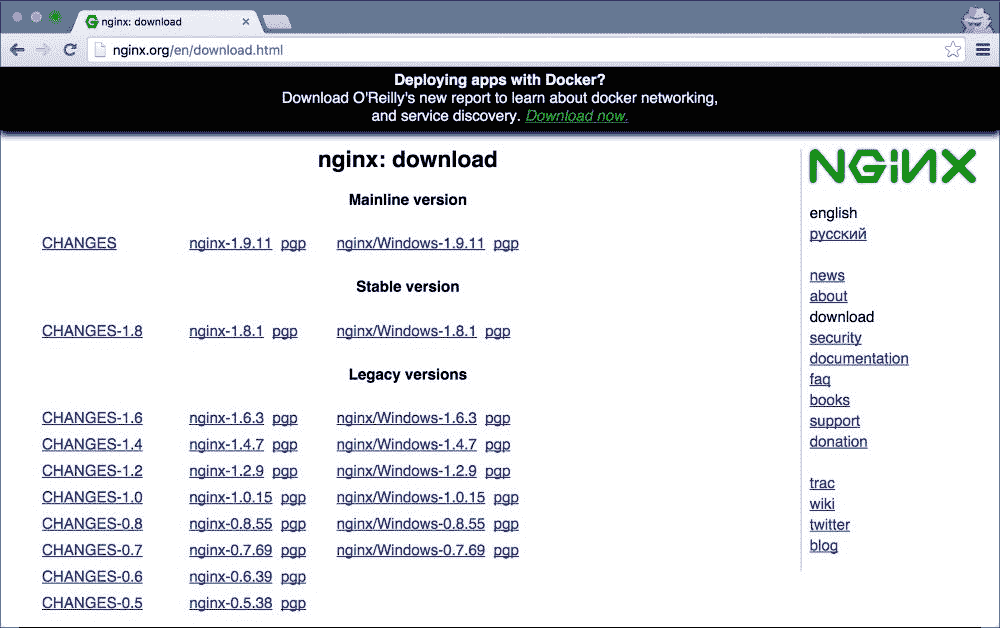

您可以安全地下载主线版本 1.9.10 或更高版本，如果它是稳定的话。一旦文件下载完成，在`C:\nginx`中解压它，然后运行以下命令以启动 Web 服务器：

```php
$ cd nginx
$ start nginx

```

## 安装 Composer

要完成设置，我们需要安装 Composer。要进行自动安装，只需从[`getcomposer.org/Composer-Setup.exe`](https://getcomposer.org/Composer-Setup.exe)下载安装程序。下载后，执行它以在您的系统上安装 Composer 并更新您的`PATH`环境变量。

# 在 Ubuntu 上设置环境

在 Ubuntu 上设置环境是最简单的三个平台之一。实际上，您可以从*使用 Vagrant 设置环境*部分获取`provisioner.sh`脚本并在您的笔记本电脑上执行它。这应该就可以了。然而，以防您已经安装了一些工具或者您想要对正在发生的事情有更多的控制感，我们将详细说明每个步骤。

## 安装 PHP

在本节中需要考虑的唯一事情是删除系统上任何之前的 PHP 版本。为此，您可以运行以下命令：

```php
$ sudo apt-get -y purge php.*

```

下一步是添加必要的仓库以获取正确的 PHP 版本。添加和更新它们的命令如下：

```php
$ sudo apt-get install python-software-properties
$ sudo LC_ALL=en_US.UTF-8 add-apt-repository ppa:ondrej/php -y
$ sudo apt-get update

```

最后，我们需要安装 PHP 7 以及 MySQL 的驱动程序。为此，只需执行以下三个命令：

```php
$ sudo apt-get install php7.0 php7.0-fpm php7.0-mysql -y
$ sudo apt-get --purge autoremove -y
$ sudo service php7.0-fpm start

```

## 安装 MySQL

手动安装 MySQL 可能略不同于 Vagrant 脚本。由于我们可以与控制台交互，我们不需要事先指定 root 密码；相反，我们可以强制 MySQL 提示输入密码。运行以下命令，并记住安装程序将要求你输入密码：

```php
$ sudo apt-get -y install mysql-server mysql-client

```

完成后，如果您需要启动 MySQL 服务器，可以使用以下命令：

```php
$ sudo service mysql start

```

## 安装 Nginx

您需要知道的第一件事是，您只能有一个 Web 服务器监听相同的端口。由于端口`80`是 Web 应用的默认端口，如果您在 Ubuntu 机器上运行 Apache，您将无法启动一个监听相同端口`80`的 Nginx Web 服务器。为了解决这个问题，您可以更改 Nginx 或 Apache 的端口，停止 Apache 或卸载它。无论如何，Nginx 的安装命令如下：

```php
$ sudo apt-get install nginx –y

```

现在，您需要启用 Nginx 上的一个站点。这些站点位于`/etc/nginx/sites-available`目录下。那里已经有一个文件，`default`，您可以安全地将其替换为以下内容：

```php
server {
    listen 80 default_server;
    listen [::]:80 default_server ipv6only=on;

    root /var/www/html;
    index index.php index.html index.htm;

    server_name server_domain_or_IP;

    location / {
        try_files $uri $uri/ /index.php?$query_string;
    }

    location ~ \.php$ {
        try_files $uri /index.php =404;
        fastcgi_split_path_info ^(.+\.php)(/.+)$;
        fastcgi_pass unix:/var/run/php/php7.0-fpm.sock;
        fastcgi_index index.php;
        fastcgi_param SCRIPT_FILENAME $document_root$fastcgi_script_name;
        include fastcgi_params;
    }
}
```

此配置基本上将您的 Web 应用程序的根目录指向`/var/www/html`目录。您可以选择您喜欢的选项，但请确保它具有正确的权限。它还监听端口`80`，您可以使用您喜欢的端口进行更改；只需记住，当您尝试通过浏览器访问您的应用程序时。最后，要应用所有更改，请运行以下命令：

```php
$ sudo service nginx restart

```

### 小贴士

**下载示例代码**

您可以从您的账户中下载此书的示例代码文件[`www.packtpub.com`](http://www.packtpub.com)。如果您在其他地方购买了这本书，您可以访问[`www.packtpub.com/support`](http://www.packtpub.com/support)并注册，以便将文件直接通过电子邮件发送给您。

您可以通过以下步骤下载代码文件：

+   使用您的电子邮件地址和密码登录或注册我们的网站。

+   将鼠标指针悬停在顶部的**支持**标签上。

+   点击**代码下载与勘误表**。

+   在**搜索**框中输入书籍名称。

+   选择您想要下载代码文件的书籍。

+   从下拉菜单中选择您购买此书的来源。

+   点击**代码下载**。

文件下载完成后，请确保使用最新版本的软件解压或提取文件夹：

+   Windows 系统使用 WinRAR / 7-Zip

+   Mac 系统使用 Zipeg / iZip / UnRarX

+   Linux 系统使用 7-Zip / PeaZip

# 摘要

在本章中，您学习了如何轻松地使用 Vagrant 设置开发环境。如果您还没有被说服，您仍然有机会手动设置所有工具。无论哪种方式，现在您都可以开始下一章的工作。

在下一章中，我们将探讨使用 PHP 的 Web 应用程序的概念，从使用的协议到 Web 服务器如何处理请求，从而为以下章节奠定基础。
