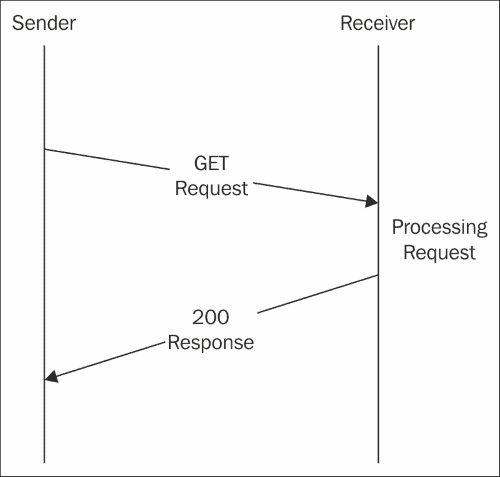
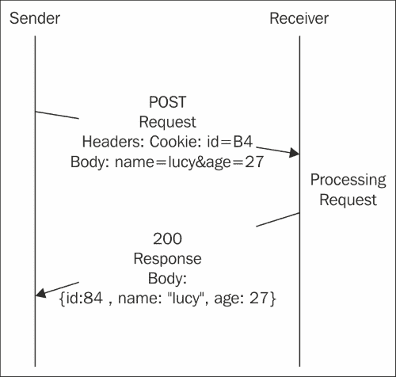
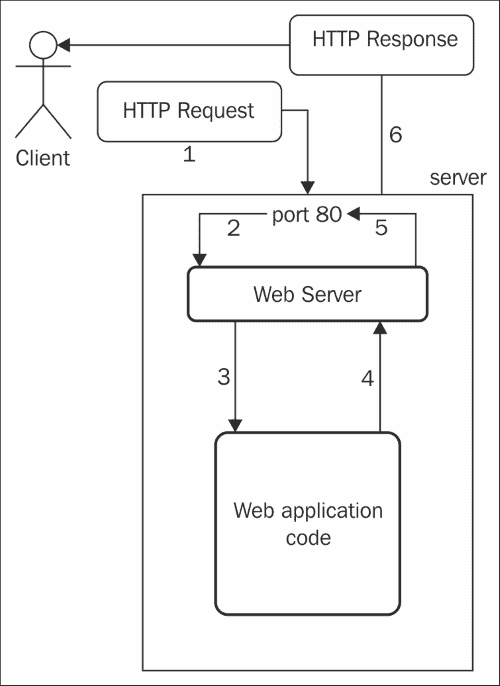

# 第二章：PHP 网络应用

网络应用在我们的生活中很常见，并且通常非常用户友好；用户不需要了解它们在幕后是如何工作的。然而，作为一个开发者，你需要了解你的应用程序是如何内部工作的。

在本章中，你将学习以下内容：

+   HTTP 以及网络应用如何使用它

+   网络应用以及如何构建一个简单的应用

+   网络服务器以及如何启动你的 PHP 内置网络服务器

# HTTP 协议

如果你查看 RFC2068 标准[`tools.ietf.org/html/rfc2068`](https://tools.ietf.org/html/rfc2068)，你会看到其描述几乎是无穷无尽的。幸运的是，你至少需要了解有关此协议的信息，其长度要短得多。

**HTTP**代表**超文本传输协议**。与其他任何协议一样，目标是允许两个实体或节点相互通信。为了实现这一点，消息需要以双方都能理解的方式进行格式化，并且实体必须遵循一些预先设定的规则。

## 一个简单的例子

下面的图显示了非常基本的消息交换：



一个简单的 GET 请求

如果你不懂这张图中的所有元素，请不要担心；我们很快就会描述它们。在这个表示中，有两个实体：**发送者**和**接收者**。发送者向接收者发送一条消息。这条开始通信的消息被称为请求。在这种情况下，消息是一个 GET 请求。接收者接收消息，处理它，并生成第二条消息：响应。在这种情况下，响应显示 200 状态码，意味着请求已成功处理。

HTTP 是无状态的；也就是说，它独立地处理每个请求，与之前的任何请求无关。这意味着，在这个请求和响应序列之后，通信就结束了。任何新的请求都不会意识到这个特定的消息交换。

## 消息的部分

一个 HTTP 消息包含几个部分。我们只定义其中最重要的部分。

### URL

消息的 URL 是消息的目的地。请求将包含接收者的 URL，而响应将包含发送者的。

如你所知，URL 可以包含额外的参数，称为查询字符串。当发送者想要添加额外数据时使用它。例如，考虑这个 URL：`http://myserver.com/greeting?name=Alex`。这个 URL 包含一个参数：`name`，其值为`Alex`。它不能作为`http://myserver.com/greeting` URL 的一部分来表示，因此发送者选择将其添加到 URL 的末尾。你稍后会发现，这并不是我们向消息中添加额外信息的唯一方式。

### HTTP 方法

HTTP 方法是消息的动词。它标识了发送者想要通过此消息执行哪种类型的操作。最常见的是 GET 和 POST。

+   **GET**：这是询问接收者某事，接收者通常会发送此信息。最常见的情况是请求一个网页，接收者将响应请求页面的 HTML 代码。

+   **POST**：这意味着发送者想要执行一个将更新接收者所持数据的操作。例如，发送者可以要求接收者更新其个人资料名称。

还有其他方法，例如**PUT**、**DELETE**或**OPTION**，但在 Web 开发中它们的使用较少，尽管它们在 REST API 中扮演着至关重要的角色，这将在第九章*构建 REST API*中解释。

### 主体

尽管请求消息也可以包含它，但主体部分通常存在于响应消息中。消息的主体包含消息本身的内容；例如，如果用户请求了一个网页，响应的主体将包含表示此页面的 HTML 代码。

很快，我们将讨论请求也可以包含主体，这用于在请求中发送额外信息，例如表单参数。

主体可以包含任何格式的文本；它可以是一个表示网页的 HTML 文本，纯文本，图像内容，JSON 等等。

### 头部

HTTP 消息的头部是接收者为了理解消息内容所需的元数据。有很多头部，你将在本书中看到一些。

头部由键值对的映射组成。以下可能是一个请求的头部：

```php
Accept: text/html
Cookie: name=Richard
```

这个请求告诉接收者（即服务器），它将接受文本作为 HTML，这是表示网页的常见方式；并且它有一个名为 Richard 的 cookie。

### 状态码

状态码存在于响应中。它使用数字代码标识请求的状态，以便浏览器和其他工具知道如何响应。例如，如果我们尝试访问一个不存在的 URL，服务器应该回复状态码 404。这样，浏览器就知道发生了什么，甚至不需要查看响应的内容。

常见的状态码有：

+   **200**：请求成功

+   **401**：未授权；用户没有查看此资源的权限

+   **404**：页面未找到

+   **500**：内部服务器错误；服务器端发生了错误，无法恢复

## 一个更复杂的示例

以下图显示了 POST 请求及其响应：



一个更复杂的 POST 请求

在这个消息交换中，我们可以看到另一个重要的方法 POST 正在发挥作用。在这种情况下，发送者试图发送一个请求以更新某个实体的数据。消息包含一个值为**84**的 cookie ID，这可能标识了要更新的实体。它还包含在主体中的两个参数：`name`和`age`。这是接收者需要更新的数据。

### 小贴士

**提交网页表单**

将参数作为体的一部分表示是提交表单时发送信息的一种常见方式，但并非唯一方式。你可以在 URL 中添加查询字符串，在消息体中添加 JSON，等等。

响应的状态码为 200，表示请求已成功处理。此外，响应还包含一个体，这次格式化为 JSON，它表示更新实体的新状态。

# Web 应用

也许你已经注意到，在前面的章节中，我使用了不太直观的发送者和接收者术语，因为它们并不代表你可能知道的具体场景，而是以通用方式代表所有这些场景。选择这种术语的主要原因是为了尝试将 HTTP 与 Web 应用分开。你将在本书的结尾看到，HTTP 不仅仅用于网站。

如果你正在阅读这本书，你已经知道什么是 Web 应用了。或者，也许你通过其他术语了解它，比如网站或网页。让我们尝试给出一些定义。

**网页**是一个包含内容的单个文档。它包含链接，可以打开具有不同内容的其他网页。

**网站**是一组通常位于同一服务器上并相互关联的网页。

**Web 应用**是运行在客户端（通常是浏览器）上的一小块软件，并与*服务器*进行通信。服务器是一台远程机器，它接收来自客户端的请求，处理它们，并生成响应。这个响应将返回到客户端，通常由浏览器渲染以显示给用户。

尽管这超出了本书的范围，你可能想知道，不仅浏览器可以作为客户端，生成请求并将它们发送到服务器；服务器也可以是主动向浏览器发送消息的一方。

那么，网站和 Web 应用之间有什么区别呢？嗯，Web 应用可以是更大网站中具有特定功能的小部分。此外，并不是所有的网站都是 Web 应用，因为 Web 应用总是执行某些操作，而网站只是显示信息。

## HTML、CSS 和 JavaScript

Web 应用由浏览器渲染，以便用户可以看到其内容。为此，服务器需要发送页面或文档的内容。文档使用 HTML 来描述其元素及其组织方式。元素可以是链接、按钮、输入字段等等。一个简单的网页示例如下：

```php
<!DOCTYPE html>
<html lang="en">
<head>
  <meta charset="UTF-8">
  <title>Your first app</title>
</head>
<body>
 <a id="special" class="link" href="http://yourpage.com">Your page</a>
 <a class="link" href="http://theirpage.com">Their page</a>
</body>
</html>
```

让我们关注高亮显示的代码。正如你所见，我们正在描述两个具有一些属性的 `<a>` 链接。这两个链接都有一个类、一个目的地和一段文本。第一个链接还包含一个 ID。将此代码保存到名为 `index.html` 的文件中并执行它。你会看到默认浏览器如何打开一个包含两个链接的非常简单的页面。

如果我们想要添加一些样式，或者改变链接的颜色、大小和位置，我们需要添加 CSS。CSS 描述了 HTML 元素是如何显示的。有几种方法可以包含 CSS，但最好的方法是将它放在一个单独的文件中，然后从 HTML 中引用它。让我们更新以下代码的`<head>`部分：

```php
<head>
  <meta charset="UTF-8">
  <title>Your first app</title>
 <link rel="stylesheet" type="text/css" href="mystyle.css">
</head>
```

现在，让我们在同一个文件夹中创建一个新的`mystyle.css`文件，包含以下内容：

```php
.link {
    color: green;
    font-weight: bold;
}

#special {
    font-size: 30px;
}
```

这个 CSS 文件包含两个样式定义：一个用于`link`类，一个用于`special` ID。类样式将应用于两个链接，因为它们都定义了这个类，并且将它们设置为绿色和粗体。增加链接字体的 ID 样式只应用于第一个链接。

最后，为了给我们的网页添加行为，我们需要添加 JS 或 JavaScript。JS 是一种编程语言，它本身就需要一本整本书来介绍，实际上，有很多种。如果你想尝试一下，我们推荐免费的在线书籍《Eloquent JavaScript》，作者是*Marijn Haverbeke*，你可以在[`eloquentjavascript.net/`](http://eloquentjavascript.net/)找到它。与 CSS 一样，最好的方法是将它放在一个单独的文件中，然后从 HTML 中引用它。更新以下高亮代码的`<body>`部分：

```php
<body>
  <a id="special" class="link" href="http://yourpage.com">Your page</a>
  <a class="link" href="http://theirpage.com">Their page</a>
 <script src="img/myactions.js"></script>
</body>
```

现在，创建一个包含以下内容的`myactions.js`文件：

```php
document.getElementById("special").onclick = function() {
    alert("You clicked me?");
}
```

JS 文件添加了一个函数，当点击`special`链接时将被调用。这个函数只是弹出一个警告框。你可以保存所有更改并刷新浏览器，看看现在看起来如何以及链接的行为如何。

### 注意

**包含 JS 的不同方式**

你可能会注意到，我们在`<head>`部分的末尾包含了 CSS 文件引用，在`<body>`部分的末尾包含了 JS。实际上，你可以在`<head>`和`<body>`中包含 JS；只需记住，脚本一旦被包含就会立即执行。如果你的脚本引用了尚未定义的字段或其他稍后将被包含的 JS 文件，JS 将失败。

恭喜！你刚刚编写了你的第一个网页。不觉得有什么了不起？那么，你正在阅读正确的书籍！在本书中，你将有机会使用更多的 HTML、CSS 和 JS，尽管本书特别关注 PHP。

# 网服务器

因此，现在是时候学习那些著名的网服务器了。网服务器不过是在机器上运行的一块软件，并监听来自特定端口的请求。通常，这个端口是`80`，但可以是任何可用的其他端口。

## 它们是如何工作的

以下图表表示了服务器端的请求-响应流程：



服务器端的请求-响应流程

网服务器的任务是路由外部请求到正确的应用程序，以便它们可以被处理。一旦应用程序返回响应，网服务器将发送这个响应到客户端。让我们仔细看看所有这些步骤：

1.  客户端，即浏览器，发送一个请求。这可以是任何类型——GET 或 POST——只要它是有效的即可。

1.  服务器接收到的请求指向一个端口。如果在这个端口上有 Web 服务器监听，那么 Web 服务器将接管情况。

1.  Web 服务器决定哪个 Web 应用程序——通常是一个文件系统中的文件——需要处理请求。为了做出决定，Web 服务器通常会考虑 URL 的路径；例如，`http://myserver.com/app1/hi`会尝试将请求传递给`app1`应用程序，无论它在文件系统中的位置如何。然而，另一种情况是`http://app1.myserver.com/hi`，它也会指向同一个应用程序。规则非常灵活，至于如何设置，取决于 Web 服务器和用户。

1.  Web 应用程序在收到 Web 服务器的请求后，生成一个响应并将其发送回 Web 服务器。

1.  Web 服务器将响应发送到指定的端口。

1.  最终，响应到达客户端。

## PHP 内置服务器

有一些功能强大的 Web 服务器支持高流量，如 Apache 或 Nginx，它们安装和管理相对简单。然而，本书的目的在于使用更简单的东西：PHP 内置服务器。使用它的原因是，你将不需要额外的包安装、配置和烦恼，因为 PHP 自带。只需一条命令，你就可以在你的机器上运行一个 Web 服务器。

### 注意

**生产级 Web 服务器**

注意，PHP 内置的 Web 服务器适用于测试目的，但强烈建议不要在生产环境中使用它。如果你必须设置一个需要公开的 Web 服务器，并且你的应用程序是用 PHP 编写的，我强烈建议你选择以下经典之一：Apache ([`httpd.apache.org`](http://httpd.apache.org)) 或 Nginx ([`www.nginx.com`](https://www.nginx.com))。两者几乎可以在任何服务器上运行，都是免费的，易于安装和配置，更重要的是，拥有庞大的社区，他们将支持你解决可能遇到的几乎所有问题。

最后，动手实践！让我们尝试使用内置服务器创建我们的第一个网页。为此，在你的`工作区`目录内创建一个`index.php`文件——例如，`Documents/workspace/index.php`。这个文件的内容应该是：

```php
<?php
echo 'hello world';
```

现在，打开你的命令行，进入你的`工作区`目录，可能需要运行`cd Documents/workspace`命令，然后运行以下命令：

```php
$ php -S localhost:8000

```

命令行会提示你一些信息，其中最重要的是监听什么，应该是如指定的那样`localhost:8000`，以及如何停止它，通常是通过按*Ctrl* + *C*。不要关闭命令行，因为它也会停止 Web 服务器。

现在，让我们打开一个浏览器并转到`http://localhost:8000`。你应该会在一个白色页面上看到一个**hello world**消息。太好了，成功了！如果你感兴趣，你可以检查你的命令行，你会看到你通过浏览器发送的每个请求的日志条目。

那么，它究竟是如何工作的呢？好吧，如果你再次查看之前的图示，`php -S`命令启动了一个 Web 服务器——在我们的例子中，监听端口`8000`而不是`80`。此外，PHP 知道 Web 应用程序代码将在你启动 Web 服务器的同一目录：你的`workspace`。还有更多具体的选项，但默认情况下，PHP 会尝试在你的`workspace`中执行`index.php`文件。

## 将事物组合在一起

让我们尝试将我们的第一个项目（包含其 CSS 和 JS 文件的`index.html`）作为内置服务器的一部分。为此，你只需要打开命令行，转到这些文件所在的目录，并使用`php -S localhost:8000`启动 Web 服务器。如果你在浏览器中检查`localhost:8000`，你应该会看到预期的两个链接页面。

现在，让我们将新的`index.php`文件移动到同一个目录。你不需要重新启动你的 Web 服务器；PHP 会自动知道这些更改。转到你的浏览器并刷新页面。你现在应该看到**hello world**消息而不是链接。这里发生了什么？

如果你没有更改默认选项，PHP 将始终尝试在启动 Web 服务器的目录中找到一个`index.php`文件。如果没有找到，PHP 将尝试找到一个`index.html`文件。之前，我们只有`index.html`文件，所以 PHP 未能找到`index.php`。现在，它能够找到它的第一个选项，`index.php`，它将加载它。

如果我们想从浏览器中查看我们的`index.html`文件，我们可以在 URL 中指定它，例如`http://localhost:8000/index.html`。如果 Web 服务器注意到你正在尝试访问一个特定的文件，它将尝试加载该文件而不是默认选项。

最后，如果我们尝试访问不在我们的文件系统上的文件，Web 服务器将返回一个状态码为 404 的响应——也就是说，未找到。如果我们打开浏览器中的**开发者工具**部分并转到**网络**部分，我们可以看到这个代码。

### 小贴士

**开发者工具是你的朋友**

作为一名 Web 开发者，你会发现浏览器中的开发者工具是极其有用的工具之一。它因浏览器而异，但所有的大牌浏览器，如 Chrome 或 Firefox，都有这个工具。熟悉如何使用它非常重要，因为它允许你从客户端调试你的应用程序。

我将在本书的进程中向你介绍一些这些工具。

# 摘要

在本章中，你学习了 HTTP 是什么以及 Web 应用程序如何使用它来与服务器交互。你现在还知道 Web 服务器是如何工作的，以及如何使用 PHP 启动一个轻量级的内置服务器。最后，你迈出了构建你的第一个 Web 应用程序的第一步。恭喜你！

在下一章中，我们将探讨 PHP 的基础知识，以便您开始构建简单的应用程序。
