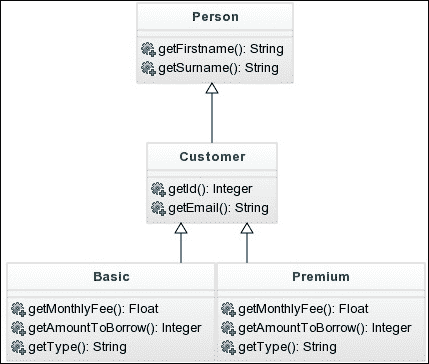

# 第四章：使用 OOP 创建整洁的代码

当应用程序开始增长，表示更复杂的数据结构变得必要。当你想要将特定行为与数据关联时，原始类型如整数、字符串或数组就不够了。半个多世纪以前，计算机科学家开始使用对象的概念来指代在现实生活中表示属性和功能封装的概念。

现在，面向对象编程（OOP）是使用最广泛的编程范式之一，你可能会很高兴地知道 PHP 支持它。了解 OOP 不仅仅是了解语言的语法，而是了解何时以及如何使用它。但不要担心，在本章和一些实践之后，你将成为一个自信的 OOP 开发者。

在本章中，你将学习以下内容：

+   类和对象

+   可见性、静态属性和方法

+   命名空间

+   自动加载类

+   继承、接口和特性

+   处理异常

+   设计模式

+   匿名函数

# 类和对象

**对象**是现实生活元素的表示。每个对象都有一些属性，这些属性将其与其他相同类的其他对象区分开来，并且能够执行一系列操作。**类**是定义对象外观和功能的定义，就像对象的模式一样。

让我们以我们的书店为例，并思考它包含的真实的对象类型。我们存储书籍，并允许人们在它们可用时取走它们。我们可以考虑两种类型的对象：书籍和客户。我们可以定义这两个类如下：

```php
<?php

class Book {
}

class Customer {
}
```

类是通过关键字`class`定义的，后跟一个有效的类名——它遵循任何其他 PHP 标签（如变量名）的相同规则，以及一段代码块。但如果我们想要一个特定的书籍，即对象`Book`——或者`Book`类的实例——我们必须实例化它。要实例化一个对象，我们使用关键字`new`后跟类名。我们将实例分配给一个变量，就像它是一个原始类型一样：

```php
$book = new Book();
$customer = new Customer();
```

你可以创建你需要的任何数量的实例，只要将它们分配给不同的变量：

```php
$book1 = new Book();
$book2 = new Book();
```

## 类属性

首先，让我们思考一下书籍的特性：它们有一个标题、一个作者和一个 ISBN。它们也可以是可用或不可用的。请在`Book.php`文件内编写以下代码：

```php
<?php

class Book {
 public $isbn;
 public $title;
 public $author;
 public $available;
}
```

```php
public; we will explain what it means when talking about visibility in the next section. For now, just think of properties as variables inside the class. We can use these variables in objects. Try adding this code at the end of the Book.php file:
```

```php
$book = new Book();
$book->title = "1984";
$book->author = "George Orwell";
$book->available = true;
var_dump($book);
```

打印对象会显示其每个属性的值，方式类似于数组打印其键的方式。你可以看到属性在打印时有一个类型，但我们没有明确定义这个类型；相反，变量取了分配的值的类型。这正好与正常变量一样工作。

当创建多个对象实例并为其属性赋值时，每个对象将有自己的值，因此你不会覆盖它们。下面的代码片段展示了这是如何工作的：

```php
$book1 = new Book();
$book1->title = "1984";
$book2 = new Book();
$book2->title = "To Kill a Mockingbird";
var_dump($book1, $book2);
```

## 类方法

**方法**是在类内部定义的函数。像函数一样，方法接收一些参数并执行一些操作，可选地返回一个值。方法的优势在于它们可以使用调用它们的对象的属性。因此，在两个不同的对象中调用相同的方法可能会有两个不同的结果。

尽管通常将 HTML 与 PHP 混合使用不是一个好主意，但为了学习的目的，让我们在我们的`Book`类中添加一个方法，该方法返回书籍，就像我们已存在的`printableTitle`函数一样：

```php
<?php

class Book {
    public $isbn;
    public $title;
    public $author;
    public $available;

 public function getPrintableTitle(): string {
 $result = '<i>' . $this->title
 . '</i> - ' . $this->author;
 if (!$this->available) {
 $result .= ' <b>Not available</b>';
 }
 return $result;
 }
}
```

与属性一样，我们在函数的开始处添加关键字`public`，但除此之外，其余部分看起来就像一个普通函数。另一个特殊之处在于使用`$this`：它代表对象本身，允许你访问该对象的属性和方法。注意我们是如何引用标题、作者和可用的属性的。

您还可以通过其函数之一更新当前对象的价值。让我们使用可用的属性作为一个整数，显示可用的单位数量，而不是仅仅是一个布尔值。有了这个，我们可以允许多个客户借阅同一本书的不同副本。让我们添加一个方法，给客户一本书的副本，更新可用的单位数量：

```php
public function getCopy(): bool {
    if ($this->available < 1) {
        return false;
    } else {
        $this->available--;
        return true;
    }
}
```

在这个先前的方法中，我们首先检查我们是否至少有一个可用的单位。如果没有，我们返回`false`以让他们知道操作未成功。如果我们有客户的一个单位，我们减少可用的单位数量，然后返回`true`，让他们知道操作成功。让我们看看如何使用这个类：

```php
<?php
$book = new Book();
$book->title = "1984";
$book->author = "George Orwell";
$book->isbn = 9785267006323;
$book->available = 12;

if ($book->getCopy()) {
    echo 'Here, your copy.';
} else {
    echo 'I am afraid that book is not available.';
}
```

这段代码会打印什么？正是，**这里，你的副本**。但是属性`available`的值会是什么？它将是 11，这是`getCopy`调用的结果。

## 类构造函数

你可能已经注意到，实例化`Book`类并设置所有值似乎很麻烦。如果我们类的属性有 30 个而不是 4 个呢？好吧，希望你永远不会这样做，因为这非常不好。尽管如此，有一种方法可以减轻这种痛苦：**构造函数**。

构造函数是在创建类的新实例时调用的函数。它们看起来像普通方法，但它们的名称总是`__construct`，并且它们没有`return`语句，因为它们总是必须返回新实例。让我们看看一个例子：

```php
public function __construct(int $isbn, string $title, string $author, int $available) {
    $this->isbn = $isbn;
    $this->title = $title;
    $this->author = $author;
    $this->available = $available;
}
```

构造函数接收四个参数，然后将其中一个参数的值分配给实例的每个属性。要实例化`Book`类，我们使用以下方法：

```php
$book = new Book("1984", "George Orwell", 9785267006323, 12);
```

这个对象与我们手动设置每个属性值的对象完全相同。但这个看起来更干净，对吧？这并不意味着你不能手动设置这个对象的新值，它只是帮助你构建新的对象。

由于构造函数仍然是函数，因此它可以使用默认参数。想象一下，在创建对象时，单位数量通常为 0，然后图书管理员会在有可用时添加单位。我们可以将默认值设置为构造函数的`$available`参数，这样如果我们创建对象时不发送单位数量，对象将以默认值实例化：

```php
public function __construct(
    int $isbn,
    string $title,
    string $author,
    int $available = 0
) {
    $this->isbn = $isbn;
    $this->title = $title;
    $this->author = $author;
    $this->available = $available;
}
```

我们可以使用前面的构造函数以两种不同的方式：

```php
$book1 = new Book("1984", "George Orwell", 9785267006323, 12);
$book2 = new Book("1984", "George Orwell", 9785267006323);
```

`$book1`将设置可用的单位数量为`12`，而`$book2`将设置为默认值 0。但不要相信我；自己试试看！

## 魔法方法

有一个特殊的方法组，它们的行为与普通方法不同。这些方法被称为**魔法方法**，它们通常是由类或对象的交互触发的，而不是由调用触发的。您已经看到了其中之一，即类的构造函数`__construct`。此方法不是直接调用的，而是在使用`new`创建新实例时使用的。您可以通过它们以`__`开头轻松识别魔法方法。以下是一些最常用的魔法方法：

+   `__toString`: 当我们尝试将对象转换为字符串时，将调用此方法。它不接受任何参数，并期望返回一个字符串。

+   `__call`: 这是当您尝试在不存在的方法的类上调用方法时，PHP 调用的方法。它通过参数获取方法名称作为字符串和调用中使用的参数列表作为数组。

+   `__get`: 这是`__call`属性版本。它通过参数获取用户试图通过属性访问的名称，并且可以返回任何内容。

您可以使用`__toString`方法替换我们`Book`类中的当前`getPrintableTitle`方法。为此，只需按以下方式更改方法名称：

```php
public function __toString() {
    $result = '<i>' . $this->title . '</i> - ' . $this->author;
    if (!$this->available) {
        $result .= ' <b>Not available</b>';
    }
    return $result;
}
```

```php
book and then casts it to a string, invoking the __toString method:
```

```php
$book = new Book(1234, 'title', 'author');
$string = (string) $book; // title - author Not available
```

如其名所示，这些是魔法方法，所以它们的功能大多数时候看起来像魔法。出于明显的原因，我们个人鼓励开发者使用构造函数以及可能`__toString`，但请注意何时使用其余部分，因为您可能会使您的代码对不熟悉它的人来说非常不可预测。

# 属性和方法可见性

到目前为止，我们在`Book`类中定义的所有属性和方法都被标记为`public`。这意味着它们对任何人或更确切地说，从任何地方都是可访问的。这被称为属性或方法的**可见性**，并且有三种类型的可见性。从更严格到更宽松的顺序如下：

+   `private`: 此类型允许只有同一类的成员可以访问。如果 A 和 B 是类 C 的实例，A 可以访问 B 的属性和方法。

+   `protected`: 此类型允许同一类的成员和从该类继承的类的实例访问。您将在下一节中看到继承。

+   `public`：此类指代一个可以从任何地方访问的属性或方法。任何来自类外部的类或一般代码都可以访问它。

为了展示一些示例，让我们首先在我们的应用程序中创建第二个类。将其保存到`Customer.php`文件中：

```php
<?php

class Customer {
    private $id;
    private $firstname;
    private $surname;
    private $email;

    public function __construct(
        int $id,
        string $firstname,
        string $surname,
        string $email
    ) {
        $this->id = $id;
        $this->firstname = $firstname;
        $this->surname = $surname;
        $this->email = $email;
    }
}
```

这个类代表一个客户，其属性包括书店通常了解的客户的一般信息。但出于安全原因，我们不能让每个人都了解我们客户的个人信息，所以我们把每个属性都设置为`private`。

到目前为止，我们一直在同一个`Book.php`文件中添加创建对象的代码，但既然现在有两个类，似乎很自然地让这些类留在各自的文件中，并在一个单独的文件中创建和操作对象。让我们把这个第三个文件命名为`init.php`。为了实例化给定类的对象，PHP 需要知道类在哪里。为此，只需使用`require_once`包含该文件即可。

```php
<?php

require_once __DIR__ . '/Book.php';
require_once __DIR__ . '/Customer.php';

$book1 = new Book("1984", "George Orwell", 9785267006323, 12);
$book2 = new Book("To Kill a Mockingbird", "Harper Lee", 9780061120084, 2);

$customer1 = new Customer(1, 'John', 'Doe', 'johndoe@mail.com');
$customer2 = new Customer(2, 'Mary', 'Poppins', 'mp@mail.com');
```

你不需要每次都包含文件。一旦你包含了它们，PHP 就会知道在哪里找到类，即使你的代码在不同的文件中。

### 注意

**类的约定**

当与类一起工作时，你应该知道有一些约定，每个人都试图遵循以确保代码整洁且易于维护。其中最重要的如下：

+   每个类都应该在一个与类名相同的文件中，并带有`.php`扩展名

+   类名应该使用驼峰式命名法，即每个单词的首字母大写，其余部分小写

+   一个文件应该只包含一个类的代码

+   在类内部，你应该首先放置属性，然后是构造函数，最后是其他方法

为了展示可见性是如何工作的，让我们尝试以下代码：

```php
$book1->available = 2; // OK
$customer1->id = 3; // Error!
```

我们已经知道`Book`类对象的属性是公开的，因此可以从外部编辑。但当我们尝试从`Customer`中更改值时，PHP 会抱怨，因为它的属性是私有的。

## 封装

当与对象一起工作时，你必须知道并应用的一个重要概念是**封装**。封装试图将对象的数据与其方法组合在一起，以尝试隐藏对象的内部结构。简单来说，如果你说一个对象的属性是私有的，并且唯一更新它们的方式是通过公共方法，那么你就是在使用封装。

使用封装的原因是为了让开发者更容易修改类的内部结构，而不会直接影响到使用该类的外部代码。例如，想象一下我们的`Customer`类，现在有两个属性来定义其姓名——`firstname`和`surname`——需要更改。从现在起，我们只有一个包含两者的属性名。如果我们直接访问其属性，我们应该更改所有这些访问！

相反，如果我们把属性设置为私有，并启用两个公共方法，`getFirstname`和`getSurname`，即使我们必须更改类的内部结构，我们也可以只更改这两个方法的实现——这只有一个地方——而使用我们类的其余代码将不会受到影响。这个概念也被称为**信息隐藏**。

实现这个想法的最简单方法是将类的所有属性都设置为私有，并为每个属性启用两个方法：一个将获取当前值（也称为**获取器**），另一个将允许你设置新值（称为**设置器**）。这至少是最常见和简单的方法来封装数据。

但让我们更进一步：在定义一个类时，考虑你想让用户能够更改和检索的数据，并且只为它们添加设置器和获取器。例如，客户可能会更改他们的电子邮件地址，但一旦创建，他们的名字、姓氏和 ID 就保持不变。类的新的定义如下所示：

```php
<?php

class Customer {
    private $id;
    private $name;
    private $surname;
    private $email;

    public function __construct(
        int $id,
        string $firstname,
        string $surname,
        string $email
    ) {
        $this->id = $id;
        $this->firstname = $firstname;
        $this->surname = $surname;
        $this->email = $email;
    }

 public function getId(): id {
 return $this->id;
 }
 public function getFirstname(): string {
 return $this->firstname;
 }
 public function getSurname(): string {
 return $this->surname;
 }
 public function getEmail(): string {
 return $this->email;
 }
 public function setEmail(string $email) {
 $this->email = $email;
 }
}
```

另一方面，我们的书籍几乎保持不变。唯一可能的变化是可用的单元数量。但我们通常一次拿或添加一本书，而不是设置具体的单元数量，因此这里的设置器并不是很有用。我们已经有了一个`getCopy`方法，当可能时取一个副本；让我们添加一个`addCopy`方法，以及其余的获取器：

```php
<?php

class Book {
    private $isbn;
    private $title;
    private $author;
    private $available;

    public function __construct(
        int $isbn,
        string $title,
        string $author,
        int $available = 0
    ) {
        $this->isbn = $isbn;
        $this->title = $title;
        $this->author = $author;
        $this->available = $available;
    }
 public function getIsbn(): int {
 return $this->isbn;
 }
 public function getTitle(): string {
 return $this->title;
 }
 public function getAuthor(): string {
 return $this->author;
 }
 public function isAvailable(): bool {
 return $this->available;
 }

    public function getPrintableTitle(): string {
        $result = '<i>' . $this->title . '</i> - ' . $this->author;
        if (!$this->available) {
            $result .= ' <b>Not available</b>';
        }
        return $result;
    }

    public function getCopy(): bool {
        if ($this->available < 1) {
            return false;
        } else {
            $this->available--;
            return true;
        }
    }

 public function addCopy() {
 $this->available++;
 }
}
```

当你的应用程序中的类数量以及随之而来的类之间的关系数量增加时，将这些类以图表的形式表示出来是有帮助的。我们可以称这个图表为类的 UML 图，或者简单地称为层次树。我们两个类的层次树看起来如下所示：


我们只显示公共方法，因为受保护的或私有的方法不能从类外部调用，因此对于只想外部使用这些类的开发者来说，它们并不有用。

# 静态属性和方法

到目前为止，所有的属性和方法都与特定的实例相关联；因此，两个不同的实例可以为相同的属性有不同的值。PHP 允许你将属性和方法与类本身相关联，而不是与对象相关联。这些属性和方法使用关键字`static`定义。

```php
private static $lastId = 0;
```

将前面的属性添加到`Customer`类中。这个属性显示了分配给用户的最后一个 ID，这对于知道应该分配给新用户的 ID 是有用的。让我们将我们类的构造函数修改如下：

```php
public function __construct(
    int $id,
    string $name,
    string $surname,
    string $email
) {
 if ($id == null) {
 $this->id = ++self::$lastId;
 } else {
 $this->id = $id;
 if ($id > self::$lastId) {
 self::$lastId = $id;
 }
 }
    $this->name = $name;
    $this->surname = $surname;
    $this->email = $email;
}
```

注意，当引用静态属性时，我们不使用变量 `$this`。相反，我们使用 `self::`，它不是绑定到任何实例，而是绑定到类本身。在这个最后的构造函数中，我们有两种选择。我们要么提供一个非空的 ID 值，要么用 null 代替。当接收到的 ID 为 null 时，我们使用静态属性 `$lastId` 来知道最后一个使用的 ID，将其增加 1，并将其分配给属性 `$id`。如果我们插入的最后一个 ID 是 5，这将更新静态属性为 6，然后将其分配给实例属性。下次我们创建一个新的客户时，`$lastId` 静态属性将是 6。相反，如果我们作为参数的一部分得到一个有效的 ID，我们将其分配，并检查分配的 `$id` 是否大于静态的 `$lastId`。如果是，我们更新它。让我们看看我们如何使用它：

```php
$customer1 = new Customer(3, 'John', 'Doe', 'johndoe@mail.com');
$customer2 = new Customer(null, 'Mary', 'Poppins', 'mp@mail.com');
$customer3 = new Customer(7, 'James', 'Bond', '007@mail.com');
```

在前面的例子中，`$customer1` 指定他的 ID 是 3，可能是因为他是一位现有客户，并希望保持相同的 ID。这设置了他的 ID 和最后一个静态 ID 都是 3。当创建第二个客户时，我们没有指定 ID，因此构造函数将取最后一个 ID，增加 1，并将其分配给客户。所以 `$customer2` 将有 ID 4，最新的 ID 也将是 4。最后，我们的秘密特工知道他想要什么，所以他强迫系统将 ID 设置为 7。最新的 ID 也将更新为 7。

静态属性和方法的好处之一是，我们不需要对象就可以使用它们。你可以通过指定类的名称，然后是 `::`，以及属性/方法的名称来引用静态属性或方法。当然，如果可见性规则允许你这样做，这在当前情况下是不允许的，因为属性是私有的。让我们添加一个公共静态方法来检索最后一个 ID：

```php
public static function getLastId(): int {
    return self::$lastId;
}
```

你可以从代码的任何地方使用类名或现有的实例来引用它：

```php
Customer::getLastId();
$customer1::getLastId();
```

# 命名空间

你知道你不能有两个具有相同名称的类，因为 PHP 在创建新对象时不知道应该引用哪一个。为了解决这个问题，PHP 允许使用 **命名空间**，它们在文件系统中充当路径。这样，你可以拥有你需要的任何数量的具有相同名称的类，只要它们都定义在不同的命名空间中。值得注意的是，尽管命名空间和文件路径通常会是相同的，但这是由开发者强制执行的，而不是由语言强制执行的；你实际上可以使用与文件系统无关的任何命名空间。

指定命名空间必须在文件中做的第一件事。为了做到这一点，使用 `namespace` 关键字后跟命名空间。命名空间的每个部分都由 `\` 分隔，就像它是不同的目录一样。如果你没有指定命名空间，则类将属于基础命名空间，或根。在两个文件的开头——`Book.php` 和 `Customer.php`——添加以下内容：

```php
<?php

namespace Bookstore\Domain;
```

上一行代码将我们类的命名空间设置为 `Bookstore\Domain`。我们类的完整名称因此是 `Bookstore\Domain\Book` 和 `Bookstore\Domain\Customer`。如果你尝试从浏览器访问 `init.php` 文件，你会看到一个错误，说找不到 `Book` 或 `Customer` 类。但我们不是已经包含了这些文件吗？这是因为 PHP 认为你正在尝试从根目录访问 `\Book` 和 `\Customer`。不要担心，有几种方法可以修正这个问题。

一种方法是在引用类时指定类的完整名称，即使用 `$customer = new Bookstore\Domain\Book();` 而不是 `$book = new Book();`。但这听起来并不实用，对吧？

另一种方法是将 `init.php` 文件归属到 `BookStore\Domain` 命名空间。这意味着 `init.php` 内部所有类的引用都将带有 `BookStore\Domain` 前缀，你将能够使用 `Book` 和 `Customer`。这种解决方案的缺点是，你不能轻易地引用其他命名空间中的类，因为任何类的引用都将带有该命名空间的前缀。

最佳解决方案是使用关键字 `use`。这个关键字允许你在文件的开头指定一个完整的类名，然后在文件的其余部分使用类的简单名称。让我们看看一个例子：

```php
<?php

use Bookstore\Domain\Book;
use Bookstore\Domain\Customer;

require_once __DIR__ . '/Book.php';
require_once __DIR__ . '/Customer.php';
//...
```

在前面的文件中，每次我们引用 `Book` 或 `Customer` 时，PHP 会知道我们实际上想要使用完整的类名，即在其前面加上 `Bookstore\Domain\` 前缀。这种解决方案允许你在引用这些类时拥有干净的代码，同时，如果需要的话，也能引用其他命名空间中的类。

但如果你想在同一个文件中包含两个具有相同名称的不同类呢？如果你设置了两个 `use` 语句，PHP 将不知道选择哪一个，所以我们仍然面临之前的问题！为了解决这个问题，你可以每次引用任何类时都使用完整的类名——带有命名空间——或者你可以使用别名。

假设我们有两个 `Book` 类，第一个在 `Bookstore\Domain` 命名空间中，第二个在 `Library\Domain` 命名空间中。为了解决冲突，你可以这样做：

```php
use Bookstore\Domain\Book;
use Library\Domain\Book as LibraryBook;

```

关键字 `as` 为该类设置了一个别名。在那个文件中，每次你引用 `LibraryBook` 类时，实际上你引用的是 `Library\Domain\Book` 类。而当你引用 `Book` 时，PHP 将只使用来自 `Bookstore` 的那个。问题解决了！

# 类的自动加载

如你所知，为了使用一个类，你需要包含定义它的文件。到目前为止，我们一直是手动包含这些文件的，因为我们只有几个类，并且在一个文件中使用它们。但当我们使用多个文件中的多个类时会发生什么呢？肯定有更聪明的方法，对吧？确实有。**自动加载**来拯救我们！

自动加载是 PHP 的一个特性，它允许你的程序根据一组预定义的规则自动搜索和加载文件。每次当你引用 PHP 不认识的类时，它都会询问 **自动加载器**。如果自动加载器能够确定该类所在的文件，它将加载该文件，并且程序的执行将继续正常进行。如果它不能，PHP 将停止执行。

那么，自动加载器是什么？它不过是一个接收类名作为参数的 PHP 函数，并且它被期望加载一个文件。实现自动加载有两种方式：要么使用 `__autoload` 函数，要么使用 `spl_autoload_register`。 

## 使用 __autoload 函数

定义一个名为 `__autoload` 的函数告诉 PHP 该函数是它必须使用的自动加载器。你可以实现一个简单的解决方案：

```php
function __autoload($classname) {
    $lastSlash = strpos($classname, '\\') + 1;
    $classname = substr($classname, $lastSlash);
    $directory = str_replace('\\', '/', $classname);
    $filename = __DIR__ . '/' . $directory . '.php';
    require_once($filename);
}
```

我们的意图是将所有 PHP 文件都放在 `src` 目录中，即源目录。在这个目录内部，目录树将模拟类的命名空间树，除了第一个部分 `BookStore`，它作为一个命名空间是有用的，但作为一个目录则不是必要的。这意味着我们的 `Book` 类，全称 `BookStore\Domain\Book`，将位于 `src/Domain/Book.php`。

为了实现这一点，我们的 `__autoload` 函数尝试使用 `strpos` 找到反斜杠 `\` 的第一个出现位置，然后使用 `substr` 从该位置提取到文件末尾。实际上，这仅仅移除了命名空间的第一部分，`BookStore`。之后，我们将所有的 `\` 替换为 `/`，这样文件系统就能理解路径了。最后，我们将当前目录、类名作为目录以及 `.php` 扩展名连接起来。

在尝试之前，请记住创建 `src/Domain` 目录并将两个类移动到其中。同时，为了确保我们在测试自动加载器，请将以下内容保存为你的 `init.php` 文件，并访问 `http://localhost:8000/init.php`：

```php
<?php

use Bookstore\Domain\Book;
use Bookstore\Domain\Customer;

function __autoload($classname) {
    $lastSlash = strpos($classname, '\\') + 1;
    $classname = substr($classname, $lastSlash);
    $directory = str_replace('\\', '/', $classname);
    $filename = __DIR__ . '/src/' . $directory . '.php'
    require_once($filename);
}

$book1 = new Book("1984", "George Orwell", 9785267006323, 12);
$customer1 = new Customer(5, 'John', 'Doe', 'johndoe@mail.com');
```

浏览器现在不再抱怨，也没有显式的 `require_once`。同时记住，`__autoload` 函数只需要定义一次，而不是在每个文件中。所以从现在开始，当你想要使用你的类时，只要类位于一个遵循约定的命名空间和文件中，你只需要定义 `use` 语句。比以前干净多了，对吧？

## 使用 spl_autoload_register 函数

`__autoload` 解决方案看起来相当不错，但有一个小问题：如果我们的代码非常复杂，我们不仅仅只有一个约定，我们需要多个 `__autoload` 函数的实现？因为我们不能定义两个同名函数，我们需要一种方法告诉 PHP 保留自动加载器的可能实现列表，这样它就可以尝试所有这些实现，直到找到一个有效的。

这就是 `spl_autoload_register` 的作用。你定义你的自动加载函数并使用一个有效的名称，然后调用 `spl_autoload_register` 函数，将你的自动加载函数名称作为参数传递。你可以根据你代码中的不同自动加载器多次调用这个函数。实际上，即使你只有一个自动加载器，使用这个系统也比使用 `__autoload` 更好，因为它使其他人将来添加新自动加载器更容易：

```php
function autoloader($classname) {
    $lastSlash = strpos($classname, '\\') + 1;
    $classname = substr($classname, $lastSlash);
    $directory = str_replace('\\', '/', $classname);
    $filename = __DIR__ . '/' . $directory . '.php';
    require_once($filename);
}
spl_autoload_register('autoloader');

```

# 继承

我们将面向对象范式视为复杂数据结构的万能药，尽管我们已经展示了我们可以定义具有属性和方法的对象，看起来很漂亮，也很高级，但这并不是我们不能用数组解决的问题。封装是使对象比数组更有用的一项特性，但它们的真正力量在于继承。

## 介绍继承

面向对象编程中的继承是指将类的实现从父类传递给子类的功能。是的，类可以有父类，而技术上将这一特性称为一个类 *继承* 自另一个类。当我们扩展一个类时，我们会获得所有未定义为私有的属性和方法，子类可以像使用自己的属性和方法一样使用它们。限制是，一个类只能从一个父类继承。

为了举例说明，让我们考虑我们的 `Customer` 类。它包含属性 `firstname`、`surname`、`email` 和 `id`。客户实际上是一种特定类型的人，他/她在我们的系统中注册，因此可以借阅书籍。但我们的系统中可能有其他类型的人，如图书管理员或访客。他们都会有一些对所有人的共同属性，即 `firstname` 和 `surname`。因此，如果我们创建一个 `Person` 类，并使 `Customer` 类从它继承，那就很有意义了。层次结构树将如下所示：


注意 `Customer` 如何与 `Person` 相连。`Person` 中的方法在 `Customer` 中没有定义，因为它们是从扩展中隐含的。现在按照我们的约定，将新类保存在 `src/Domain/Person.php` 中：

```php
<?php

namespace Bookstore\Domain;

class Person {
    protected $firstname;
    protected $surname;

    public function __construct(string $firstname, string $surname) {
        $this->firstname = $firstname;
        $this->surname = $surname;
    }

    public function getFirstname(): string {
        return $this->firstname;
    }

    public function getSurname(): string {
        return $this->surname;
    }
}
```

```php
Customer class by removing the duplicate properties and its getters:
```

```php
<?php

namespace Bookstore\Domain;

class Customer extends Person {
    private static $lastId = 0;
    private $id;
    private $email;

    public function __construct(
        int $id,
        string $name,
        string $surname,
        string $email
    ) {
        if (empty($id)) {
            $this->id = ++self::$lastId;
        } else {
            $this->id = $id;
            if ($id > self::$lastId) {
                self::$lastId = $id;
            }
        }
        $this->name = $name;
        $this->surname = $surname;
        $this->email = $email;
    }

    public static function getLastId(): int {
        return self::$lastId;
    }

    public function getId(): int {
        return $this->id;
    }

    public function getEmail(): string {
        return $this->email;
    }

    public function setEmail($email): string {
        $this->email = $email;
    }
}
```

注意新关键字 `extends`；它告诉 PHP 这个类是 `Person` 类的子类。由于 `Person` 和 `Customer` 都在同一个命名空间中，你不需要添加任何 `use` 语句，但如果它们不在同一个命名空间中，你应该让它知道如何找到父类。这段代码运行正常，但我们可以看出，这里有一些代码重复。`Customer` 类的构造函数正在做与 `Person` 类构造函数相同的工作！我们将会尽快修复这个问题。

为了从子类中引用父类的方法或属性，你可以使用`$this`，就像属性或方法在同一个类中一样。实际上，你可以说它实际上就是。但 PHP 允许你在子类中重新定义已经在父类中存在的方法。如果你想引用父类的实现，你不能使用`$this`，因为 PHP 将调用子类中的那个。要强制 PHP 使用父类的方法，请使用关键字`parent::`而不是`$this`。按照以下方式更新`Customer`类的构造函数：

```php
public function __construct(
    int $id,
    string $firstname,
    string $surname,
    string $email
) {
 parent::__construct($firstname, $surname);
    if (empty($id)) {
        $this->id = ++self::$lastId;
    } else {
        $this->id = $id;
        if ($id > self::$lastId) {
            self::$lastId = $id;
        }
    }
    $this->email = $email;
}
```

这个新的构造函数并没有复制代码。相反，它调用父类`Person`的构造函数，传递`$firstname`和`$surname`，并让父类做它已经知道如何做的事情。我们避免了代码重复，并且在此基础上，我们还使得对`Person`构造函数的任何未来更改都变得更加容易。如果我们需要更改`Person`构造函数的实现，我们只需在一个地方更改，而不是在所有子类中更改。

## 覆盖方法

如前所述，当我们从一个类扩展时，我们得到父类的所有方法。这是隐式的，所以它们实际上并没有在子类的类中写下来。如果你实现了一个具有相同签名和/或名称的另一个方法会发生什么？你将*覆盖方法*。

由于我们不需要这个功能在我们的类中，我们只需在我们的`init.php`文件中添加一些代码来展示这种行为，然后你可以简单地删除它。让我们定义一个类`Pops`，一个从父类扩展的类`Child`，以及它们两个中的`sayHi`方法：

```php
class Pops {
    public function sayHi() {
        echo "Hi, I am pops.";
    }
}

class Child extends Pops{
 public function sayHi() {
 echo "Hi, I am a child.";
 }
}

$pops = new Pops();
$child = new Child();
echo $pops->sayHi(); // Hi, I am pops.
echo $child->sayHi(); // Hi, I am Child.
```

突出的代码显示该方法已被覆盖，因此当我们从子类的角度调用它时，我们将使用它而不是从其父类继承来的那个。但如果我们还想引用继承来的那个呢？你可以始终使用关键字`parent`来引用它。让我们看看它是如何工作的：

```php
class Child extends Pops{
    public function sayHi() {
        echo "Hi, I am a child.";
 parent::sayHi();
    }
}

$child = new Child();
echo $child->sayHi(); // Hi, I am Child. Hi I am pops.
```

现在子类在对自己和他父亲都说`hi`。这似乎非常简单和方便，对吧？但是有一个限制。想象一下，就像现实生活中，这个孩子非常害羞，他不会对每个人都打招呼。我们可以尝试将方法的可见性设置为受保护的，但看看会发生什么：

```php
class Child extends Pops{
 protected function sayHi() {
        echo "Hi, I am a child.";
    }
}
```

尝试这段代码时，即使没有尝试实例化它，你也会得到一个关于该方法访问级别的致命错误。原因是当覆盖时，方法必须至少与继承的方法有相同的可见性。这意味着如果我们继承了一个受保护的，我们可以用另一个受保护的或公共的来覆盖它，但不能用私有的来覆盖。

## 抽象类

记住，每次只能从一个父类扩展。这意味着`Customer`只能从`Person`扩展。但如果我们想使这个层次树更复杂，我们可以创建从`Customer`扩展的子类，这些类也将隐式地从`Person`扩展。让我们创建两种类型的客户：基本和高级。这两种客户将具有来自`Customer`和`Person`的相同属性和方法，以及我们在每个中实现的新方法。

将以下代码保存为`src/Domain/Customer/Basic.php`：

```php
<?php

namespace Bookstore\Domain\Customer;

use Bookstore\Domain\Customer;

class Basic extends Customer {
    public function getMonthlyFee(): float {
        return 5.0;
    }

    public function getAmountToBorrow(): int {
        return 3;
    }

    public function getType(): string {
        return 'Basic';
    }
}
```

以下代码作为`src/Domain/Customer/Premium.php`：

```php
<?php

namespace Bookstore\Domain\Customer;

use Bookstore\Domain\Customer;

class Premium extends Customer {
    public function getMonthlyFee(): float {
        return 10.0;
    }

    public function getAmountToBorrow(): int {
        return 10;
    }

    public function getType(): string {
        return 'Premium';
    }
}
```

在前两个代码中需要注意的事项是，我们从两个不同的类中扩展了`Customer`，这是完全合法的——我们可以从不同命名空间中的类扩展。有了这个添加，`Person`的层次树将如下所示：



我们在这两个类中定义了相同的方法，但它们的实现是不同的。这种方法的目的是在不了解每次是哪一个的情况下，无差别地使用这两种类型的客户。例如，我们可以在`init.php`中暂时有以下代码。记住，如果你没有导入`Customer`类，请添加`use`语句。

```php
function checkIfValid(Customer $customer, array $books): bool {
    return $customer->getAmountToBorrow() >= count($books);
}
```

前面的函数会告诉我们一个给定的客户是否可以借阅数组中的所有书籍。注意，该方法类型提示为`Customer`，但没有指定具体是哪一个。这将接受任何是`Customer`实例或从`Customer`扩展的类的对象，即`Basic`或`Premium`。看起来很合理，对吧？那么让我们试试看：

```php
$customer1 = new Basic(5, 'John', 'Doe', 'johndoe@mail.com');
var_dump(checkIfValid($customer1, [$book1])); // ok
$customer2 = new Customer(7, 'James', 'Bond', 'james@bond.com');
var_dump(checkIfValid($customer2, [$book1])); // fails
```

第一次调用按预期工作，但第二次调用失败，即使我们发送了一个`Customer`对象。问题在于父类不知道任何`getAmountToBorrow`方法！而且，我们依赖于子类始终实现该方法看起来也很危险。解决方案在于使用抽象类。

**抽象类**是一个不能实例化的类。它的唯一目的是确保其子类被正确实现。将类声明为抽象是通过使用关键字`abstract`，然后是正常类的定义来完成的。我们还可以指定子类必须实现的方法，而不在父类中实现它们。这些方法被称为抽象方法，并且使用关键字`abstract`在开头定义。当然，其余的正常方法也可以保留在那里，并将由其子类继承：

```php
<?php
abstract class Customer extends Person {
//...
 abstract public function getMonthlyFee();
 abstract public function getAmountToBorrow();
 abstract public function getType();
//...
}
```

上述抽象解决了两个问题。首先，我们将无法发送 `Customer` 类的任何实例，因为我们不能实例化它。这意味着 `checkIfValid` 方法将要接受的所有对象都只能是 `Customer` 的子类。另一方面，声明抽象方法迫使所有扩展该类的子类实现它们。通过这种方式，我们确保所有对象都将实现 `getAmountToBorrow`，并且我们的代码是安全的。

新的层次结构树将在 `Customer` 中定义三个抽象方法，并为其子类省略它们。虽然我们在子类中实现了它们，但它们由 `Customer` 强制执行，并且由于抽象的存在，我们确信所有从它扩展的类都必须实现它们，这样做是安全的。让我们看看这是如何完成的：


在最后的新添加中，你的 `init.php` 文件应该会失败。原因是它试图实例化 `Customer` 类，但现在它是抽象的，所以你不能。实例化一个具体的类，即一个非抽象的类，来解决这个问题。

# 接口

**接口** 是一个 OOP 元素，它将一组函数声明分组，但不实现它们，即它指定了名称、返回类型和参数，但没有代码块。接口与抽象类不同，因为它们根本不能包含任何实现，而抽象类可以混合方法定义和实现。接口的目的是声明一个类可以做什么，但不是如何做。

从我们的代码中，我们可以识别出接口的潜在用途。客户有一个预期的行为，但它的实现取决于客户类型。因此，`Customer` 可以是一个接口而不是一个抽象类。但是，由于接口不能实现任何函数，也不能包含属性，我们必须将具体的代码从 `Customer` 类移动到其他地方。目前，让我们将其移动到 `Person` 类。按照以下方式编辑 `Person` 类：

```php
<?php

namespace Bookstore\Domain;

class Person {

 private static $lastId = 0;
 protected $id;
    protected $firstname;
    protected $surname;
 protected $email;

 public function __construct(
 int $id,
 string $firstname,
 string $surname,
 string $email
 ) {
 $this->firstname = $firstname;
 $this->surname = $surname;
 $this->email = $email;

 if (empty($id)) {
 $this->id = ++self::$lastId;
 } else {
 $this->id = $id;
 if ($id > self::$lastId) {
 self::$lastId = $id;
 }
 }
 }

    public function getFirstname(): string {
        return $this->firstname;
    }
    public function getSurname(): string {
        return $this->surname;
    }
 public static function getLastId(): int {
 return self::$lastId;
 }
 public function getId(): int {
 return $this->id;
 }
 public function getEmail(): string {
 return $this->email;
 }
}
```

### 注意

**使事情比必要的更复杂**

接口非常有用，但万事万物都有其合适的时间和地点。由于我们的应用程序由于其教学性质而非常简单，实际上没有它们的真正位置。前一个部分中已经定义的抽象类是我们场景的最佳方法。但只是为了展示接口是如何工作的，我们将调整我们的代码以适应它们。

不要担心，因为我们将要引入的大多数代码，一旦我们在第五章“使用数据库”（Chapter 5）和第六章“适应 MVC”（Chapter 6）中引入数据库和 MVC 模式后，将被更好的实践所取代。

当编写自己的应用程序时，不要试图使事情比必要的更复杂。看到开发者试图在一个非常简单的场景中展示他们所有技能而编写非常复杂的代码是一种常见的模式。只使用必要的工具来留下干净、易于维护的代码，当然，这样的代码应该按预期工作。

使用以下内容更改`Customer.php`的内容：

```php
<?php

namespace Bookstore\Domain;

interface Customer {
    public function getMonthlyFee(): float;
    public function getAmountToBorrow(): int;
    public function getType(): string;
}
```

注意，接口与抽象类非常相似。区别在于它是用关键字`interface`定义的，并且它的方法没有`abstract`这个词。接口不能被实例化，因为它们的实现方式与抽象类不同。你可以用它们做的唯一一件事就是创建一个类来实现它们。

*实现*一个接口意味着实现其中定义的所有方法，就像我们扩展抽象类时一样。它具有扩展抽象类的所有好处，例如属于那个类型——在类型提示时很有用。从开发者的角度来看，使用实现接口的类就像编写一个合同：你确保你的类将始终拥有接口中声明的那些方法，无论实现如何。正因为如此，接口只关心公共方法，这是其他开发者可以使用的那些方法。你需要在代码中做的唯一改变是将关键字`extends`替换为`implements`：

```php
class Basic implements Customer {
```

那么，为什么有人会使用接口，如果我们总能使用一个不仅强制实现方法，还允许继承代码的抽象类呢？原因在于你只能从一个类扩展，但你可以在同一时间实现多个实例。想象一下，如果你还有一个定义付款人的接口。这可以识别出有支付能力的人，无论是什么。将以下代码保存到`src/Domain/Payer.php`：

```php
<?php

namespace Bookstore\Domain;

interface Payer {
    public function pay(float $amount);
    public function isExtentOfTaxes(): bool;
}
```

现在基本客户和高级客户都可以实现这两个接口。基本客户将看起来如下：

```php
//...
use Bookstore\Domain\Customer; 
use Bookstore\Domain\Person;

class Basic extends Person implements Customer {
    public function getMonthlyFee(): float {
//...
```

高级客户也会以同样的方式改变：

```php
//...
use Bookstore\Domain\Customer; 
use Bookstore\Domain\Person;

class Premium extends Person implements Customer {
    public function getMonthlyFee(): float {
//...
```

你应该看到这段代码将不再工作。原因是尽管我们实现了第二个接口，但方法并没有实现。将这两个方法添加到基本客户类中：

```php
public function pay(float $amount) {
    echo "Paying $amount.";
}

public function isExtentOfTaxes(): bool {
    return false;
}
```

将这两个方法添加到高级客户类中：

```php
public function pay(float $amount) {
    echo "Paying $amount.";
}

public function isExtentOfTaxes(): bool {
    return true;
}
```

如果你知道所有客户都必须是付款人，你甚至可以让`Customer`接口继承自`Payer`接口：

```php
interface Customer extends Payer {
```

这个改变根本不影响我们类的使用。其他开发者会看到我们的基本客户和高级客户继承自`Payer`和`Customer`，因此它们包含所有必要的方法。这些接口是独立的，或者它们相互扩展，这不会影响太多。

接口只能从其他接口扩展，类只能从其他类扩展。唯一混合它们的方式是一个类实现一个接口，但类不扩展接口，接口也不扩展类。但从类型提示的角度来看，它们可以互换使用。

为了总结本节内容并使事情清晰，让我们展示在所有新添加之后层次树的样子。与抽象类一样，接口中声明的方法显示在接口中，而不是在实现它的每个类中。


## 多态

**多态**是面向对象编程的一个特性，它允许我们与实现相同接口的不同类一起工作。它是面向对象编程的美丽之处之一。它允许开发者创建一个复杂的类和层次树系统，但提供了简单的工作方式。

假设我们有一个函数，给定一个付款人，检查它是否免税，并使其支付一定金额的钱。这段代码并不关心付款人是客户、图书管理员还是与书店无关的人。它唯一关心的是付款人是否有支付的能力。这个函数可以是这样的：

```php
function processPayment(Payer $payer, float $amount) {
    if ($payer->isExtentOfTaxes()) {
        echo "What a lucky one...";
    } else {
        $amount *= 1.16;
    }
    $payer->pay($amount);
}
```

您可以将基本客户或高级客户发送到这个功能，行为会有所不同。但是，由于两者都实现了`Payer`接口，提供的两个对象都是有效的类型，并且两者都能够执行所需的操作。

`checkIfValid`函数接受一个客户和一个书籍列表。我们已经看到发送任何类型的客户都会使函数按预期工作。但是，如果我们发送一个从`Payer`扩展的`Librarian`类的对象会发生什么？由于`Payer`不了解`Customer`（情况正好相反），函数会抱怨，因为类型提示没有完成。

PHP 附带的一个有用特性是检查一个对象是否是特定类或接口的实例。使用它的方法是指定变量后跟关键字`instanceof`和类或接口的名称。它返回一个布尔值，如果对象来自扩展或实现指定类的类，则为`true`，否则为`false`。让我们看看一些例子：

```php
$basic = new Basic(1, "name", "surname", "email");
$premium = new Premium(2, "name", "surname", "email");
var_dump($basic instanceof Basic); // true
var_dump($basic instanceof Premium); // false
var_dump($premium instanceof Basic); // false
var_dump($premium instanceof Premium); // true
var_dump($basic instanceof Customer); // true
var_dump($basic instanceof Person); // true
var_dump($basic instanceof Payer); // true
```

记得为每个类或接口添加所有的`use`语句，否则 PHP 会理解指定的类名在文件的作用域内。

# 特型

到目前为止，您已经了解到从类扩展可以使您继承代码（属性和方法实现），但它有一个限制，即每次只能从一个类扩展。另一方面，您可以使用接口从同一个类实现多个行为，但您不能以这种方式继承代码。为了填补这个差距，即能够从多个地方继承代码，您有特型。

**特质**是允许你同时从多个来源重用代码的机制，或者说“继承”，或者说复制粘贴代码。特质，作为抽象类或接口，不能被实例化；它们只是包含可以由其他类使用的功能的功能容器。

如果你记得，我们在`Person`类中有些代码用于管理 ID 的分配。这段代码实际上并不属于个人，而是属于一个 ID 系统，该系统可以被其他需要用 ID 进行标识的实体使用。从`Person`类中提取这种功能的一种方法——我们并不是说这是最好的方法，但为了看到特质的实际应用，我们选择了这种方法——是将它移动到一个特质中。

要定义一个特质，就像定义一个类一样做，只是用关键字`trait`代替`class`。定义其命名空间，添加所需的`use`语句，声明其属性并实现其方法，并将所有内容放在遵循相同约定的文件中。将以下代码添加到`src/Utils/Unique.php`文件中：

```php
<?php

namespace Bookstore\Utils;

trait Unique {
    private static $lastId = 0;
    protected $id;

 public function setId(int $id) {
        if (empty($id)) {
            $this->id = ++self::$lastId;
        } else {
            $this->id = $id;
            if ($id > self::$lastId) {
                self::$lastId = $id;
            }
        }
    }

    public static function getLastId(): int {
        return self::$lastId;
    }
    public function getId(): int {
        return $this->id;
    }
}
```

注意，命名空间与通常不同，因为我们把这段代码存储在不同的文件中。这是一个关于约定的问题，但你完全可以根据每个案例考虑更好的文件结构。在这种情况下，我们认为这个特质并不代表像客户和书籍那样的“业务逻辑”，而是一个用于管理 ID 分配的实用工具。

我们包含了与 ID 相关的所有代码，包括属性、获取器和构造函数中的代码。由于特质不能被实例化，我们不能添加构造函数。相反，我们添加了一个`setId`方法，其中包含代码。当构造使用此特质的新实例时，我们可以调用此`setId`方法来根据用户提供的参数设置 ID。

`Person`类也需要做出改变。我们必须删除所有与 ID 相关的引用，并且必须以某种方式定义该类正在使用特质。为此，我们使用关键字`use`，就像在命名空间中一样，但要在类内部。让我们看看它将是什么样子：

```php
<?php

namespace Bookstore\Domain;

use Bookstore\Utils\Unique;

class Person {
 use Unique;

    protected $firstname;
    protected $surname;
    protected $email;

    public function __construct(
        int $id,
        string $firstname,
        string $surname,
        string $email
    ) {
        $this->firstname = $firstname;
        $this->surname = $surname;
        $this->email = $email;
 $this->setId($id);
    }

    public function getFirstname(): string {
        return $this->firstname;
    }
    public function getSurname(): string {
        return $this->surname;
    }
    public function getEmail(): string {
        return $this->email;
    }
    public function setEmail(string $email) {
        $this->email = $email;
    }
}
```

我们添加了`use Unique;`语句，让类知道它正在使用特质。我们删除了与 ID 相关的一切，即使在构造函数中也是如此。我们仍然将 ID 作为构造函数的第一个参数，但我们要求特质的`setId`方法为我们做所有事情。注意，我们用`$this`来引用该方法，就像该方法在类内部一样。更新后的层次结构树将如下所示（注意，我们没有添加所有不涉及最近更改的类或接口的方法，以使图表尽可能小和可读）：


让我们看看它是如何工作的，即使它以你可能预期的这种方式进行。将以下代码添加到你的`init.php`文件中，包含必要的`use`语句，并在浏览器中执行：

```php
$basic1 = new Basic(1, "name", "surname", "email");
$basic2 = new Basic(null, "name", "surname", "email");
var_dump($basic1->getId()); // 1
var_dump($basic2->getId()); // 2
```

上述代码创建了两个客户实例。第一个客户有一个特定的 ID，而第二个客户让系统为它选择一个 ID。结果是第二个基本客户的 ID 为 2。这是预期的，因为两个客户都是基本的。但如果客户类型不同会发生什么呢？

```php
$basic = new Basic(1, "name", "surname", "email");
$premium = new Premium(null, "name", "surname", "email");
var_dump($basic->getId()); // 1
var_dump($premium->getId()); // 2
```

ID 仍然相同。这是预期的，因为特性包含在 `Person` 类中，所以静态属性 `$lastId` 将在 `Person` 类的所有实例之间共享，包括 `Basic` 和 `Premium` 客户。如果你使用 `Basic` 和 `Premium` 客户端的特性而不是 `Person`（但你不应这样做），你会得到以下结果：

```php
var_dump($basic->getId()); // 1
var_dump($premium->getId()); // 1
```

每个类都将有自己的静态属性。所有 `Basic` 实例将共享相同的 `$lastId`，与 `Premium` 实例的 `$lastId` 不同。这应该清楚地表明，特性中的静态成员与使用它们的类相关联，而不是特性本身。这也可以从以下代码的测试中反映出来，该代码使用我们原始的场景，其中特性从 `Person` 使用：

```php
$basic = new Basic(1, "name", "surname", "email");
$premium = new Premium(null, "name", "surname", "email");
var_dump(Person::getLastId()); // 2
var_dump(Unique::getLastId()); // 0
var_dump(Basic::getLastId()); // 2
var_dump(Premium::getLastId()); // 2
```

如果你善于发现问题，你可能会开始思考关于特性使用的一些潜在问题。如果我们使用包含相同方法的两个特性会发生什么？或者如果你使用一个包含已在类中实现的方法的特性会发生什么？

理想情况下，你应该避免遇到这类情况；它们是可能存在不良设计的警告信号。但既然总会有些特殊情况，让我们看看一些孤立示例，看看它们会如何表现。

当特性和类实现相同的方法时，这种情况很简单。在类中显式实现的方法具有更高的优先级，其次是特性中实现的方法，最后是从父类继承的方法。让我们看看它是如何工作的。以以下特性和类定义为例：

```php
<?php

trait Contract {
    public function sign() {
        echo "Signing the contract.";
    }
}

class Manager {
    use Contract;

    public function sign() {
        echo "Signing a new player.";
    }
}
```

两个都实现了 `sign` 方法，这意味着我们必须应用之前定义的优先级规则。类中定义的方法比特性中的方法具有更高的优先级，所以在这种情况下，执行的方法将是类中的方法：

```php
$manager = new Manager();
$manager->sign(); // Signing a new player.
```

最复杂的情况是，一个类使用两个具有相同方法的特点。没有规则可以自动解决冲突，所以你必须显式地解决它。查看以下代码：

```php
<?php

trait Contract {
    public function sign() {
        echo "Signing the contract.";
    }
}

trait Communicator {
    public function sign() {
        echo "Signing to the waitress.";
    }
}

class Manager {
 use Contract, Communicator;
}

$manager = new Manager();
$manager->sign();
```

上述代码抛出一个致命错误，因为两个特性实现了相同的方法。要选择你想要使用的方法，你必须使用操作符 `insteadof`。要使用它，声明你想要使用的特性和方法，然后是 `insteadof` 和你想要拒绝使用的特性。可选地，使用关键字 `as` 添加一个别名，就像我们使用命名空间一样，这样你就可以使用两个方法：

```php
class Manager {
 use Contract, Communicator {
 Contract::sign insteadof Communicator;
 Communicator::sign as makeASign;
 }
}

$manager = new Manager();
$manager->sign(); // Signing the contract.
$manager->makeASign(); // Signing to the waitress.
```

你可以看到我们决定使用`Contract`方法而不是`Communicator`方法，但添加了别名，以便两种方法都可以使用。希望你能看到，即使冲突也可以解决，并且存在一些特定的情况，除了处理它们之外没有其他事情可做；一般来说，它们看起来像是一个坏信号——不是字面意义上的。

# 处理异常

无论你的应用程序设计得多简单直观，用户都会有不恰当的使用或仅仅是随机的连接错误，你的代码必须准备好处理这些场景，以便用户体验尽可能好。我们把这些场景称为**异常**：语言中的一个元素，用于标识一个不符合预期的案例。

## try…catch 块

当你认为必要时，你的代码可以手动抛出异常。例如，从`Unique`特质中获取`setId`方法。多亏了类型提示，我们强制 ID 必须是数字，但这只是第一步。如果有人尝试设置一个负数的 ID 会发生什么？目前的代码允许它通过，但根据你的偏好，你可能希望避免这种情况。那将是一个异常发生的好地方。让我们看看我们如何添加这个检查和随后的异常：

```php
public function setId($id) {
    if ($id < 0) {
 throw new \Exception('Id cannot be negative.');
    }
    if (empty($id)) {
        $this->id = ++self::$lastId;
    } else {
        $this->id = $id;
        if ($id > self::$lastId) {
            self::$lastId = $id;
        }
    }
}
```

如你所见，异常是`exception`类的对象。记住，除非你想要在文件顶部使用`use Exception;`包含它，否则需要在类名前添加反斜杠。`Exception`类的构造函数接受一些可选参数，其中第一个是异常的消息。`Exception`类的实例本身并不做任何事情；它们必须被抛出才能被程序注意到。

让我们尝试强制我们的程序抛出这个异常。为了做到这一点，让我们尝试创建一个 ID 为负数的客户。在你的`init.php`文件中，添加以下内容：

```php
$basic = new Basic(-1, "name", "surname", "email");
```

如果你现在在浏览器中尝试，PHP 将抛出一个致命错误，表示存在未捕获的异常，这是预期的行为。对于 PHP 来说，异常是它无法恢复的东西，所以它会停止执行。这远非理想，因为你希望只是向用户显示一个错误消息，并让他们再次尝试。

你可以——并且应该——使用`try…catch`块来捕获异常。你将可能抛出异常的代码放入`try`块中，如果发生异常，PHP 将跳转到`catch`块。让我们看看它是如何工作的：

```php
public function setId(int $id) {
 try {
        if ($id < 0) {
            throw new Exception('Id cannot be negative.');
        }
        if (empty($id)) {
            $this->id = ++self::$lastId;
        } else {
            $this->id = $id;
            if ($id > self::$lastId) {
                self::$lastId = $id;
            }
        }
 } catch (Exception $e) {
 echo $e->getMessage();
 }
}
```

```php
catch block. Calling the getMessage method on an exception instance will give us the message—the first argument when creating the object. But remember that the argument of the constructor is optional; so, do not rely on the message of the exception too much if you are not sure how it is generated, as it might be empty.
```

注意，在抛出异常之后，`try`块内的其他代码将不会执行；PHP 会直接跳转到`catch`块。此外，该块会接收到一个参数，即抛出的异常。在这里，类型提示是强制性的——你很快就会明白原因。将参数命名为`$e`是一个广泛使用的约定，尽管使用不具描述性的变量名并不是一个好的实践。

有一点批评性的看法，到目前为止，在这个例子中使用异常并没有看到任何真正的优势。一个简单的`if…else`块就能完成同样的工作，对吧？但异常的真正力量在于它们能够在方法之间传播。也就是说，如果在`setId`方法上抛出的异常没有被捕获，它将会传播到方法被调用的任何地方，这样我们就可以在那里捕获它。这非常有用，因为代码的不同地方可能需要以不同的方式处理异常。为了看到这是如何完成的，让我们从`setId`中移除插入的`try…catch`，并将以下代码片段放入你的`init.php`文件中，代替它：

```php
try {
    $basic = new Basic(-1, "name", "surname", "email");
} catch (Exception $e) {
    echo 'Something happened when creating the basic customer: '
        . $e->getMessage();
}
```

前面的例子展示了捕获传播的异常是多么有用：我们可以更具体地了解发生了什么，因为我们知道当异常抛出时用户正在尝试做什么。在这种情况下，我们知道我们正在尝试创建客户，但这个异常可能是在尝试更新现有客户的 ID 时抛出的，这将需要一个不同的错误消息。

## `finally`块

在处理异常时，你可以使用第三个块：`finally`块。这个块是在`try…catch`块之后添加的，它是可选的。事实上，`catch`块也是可选的；限制是`try`之后必须至少跟有一个。所以你可以有这三种情况：

```php
// scenario 1: the whole try-catch-finally
try {
    // code that might throw an exception
} catch (Exception $e) {
    // code that deals with the exception
} finally {
    // finally block
}

// scenario 2: try-finally without catch
try {
    // code that might throw an exception
} finally {
    // finally block
}

// scenario 3: try-catch without finally
try {
    // code that might throw an exception
} catch (Exception $e) {
    // code that deals with the exception
}
```

```php
init.php file:
```

```php
function createBasicCustomer($id)
{
    try {
        echo "\nTrying to create a new customer.\n";
        return new Basic($id, "name", "surname", "email");
    } catch (Exception $e) {
        echo "Something happened when creating the basic customer: "
            . $e->getMessage() . "\n";
    } finally {
        echo "End of function.\n";
    }
}

createBasicCustomer(1);
createBasicCustomer(-1);
```

如果你尝试这样做，你的浏览器将显示以下输出——记得显示页面的源代码以看到它格式得很好：


结果可能不是你所预期的。第一次调用函数时，我们能够无问题地创建对象，这意味着我们执行了`return`语句。在一个正常的函数中，这应该是结束的地方，但由于我们处于`try…catch…finally`块中，我们仍然需要执行`finally`代码！第二个例子看起来更直观，从`try`跳到`catch`，然后到`finally`块。

`finally`块在处理像数据库连接这样的昂贵资源时非常有用。在第五章“使用数据库”中，你将看到如何使用它们。根据连接的类型，你将需要在使用后关闭它，以便其他用户可以连接。`finally`块用于关闭这些连接，无论函数是否抛出异常。

## 捕获不同类型的异常

异常已经被证明是有用的，但还有一个重要的特性要展示：捕获不同类型的异常。正如你所知道的那样，异常是 `Exception` 类的实例，并且像任何其他类一样，它们可以被扩展。从该类扩展的主要目标是创建不同类型的异常，但我们不会在其中添加任何逻辑——尽管你当然可以。让我们创建一个从 `Exception` 扩展的类，并标识与无效 ID 相关的异常。将此代码放入 `src/Exceptions/InvalidIdException.php` 文件中：

```php
<?php

namespace Bookstore\Exceptions;

use Exception;

class InvalidIdException extends Exception {
    public function __construct($message = null) {
        $message = $message ?: 'Invalid id provided.';
        parent::__construct($message);
    }
}
```

`InvalidIdException` 类从 `Exception` 类扩展，因此它可以被抛出。该类的构造函数接受一个可选参数 `$message`。它内部的以下两行代码很有趣：

+   `?:` 运算符是条件运算符的简短版本，其工作方式如下：如果左边的表达式不评估为 `false`，则返回该表达式，否则返回右边的表达式。我们在这里想要使用用户给出的消息，或者在没有提供任何消息的情况下使用默认消息。有关更多信息和使用方法，你可以访问 PHP 文档 [`php.net/manual/en/language.operators.comparison.php`](http://php.net/manual/en/language.operators.comparison.php)。

+   `parent::__construct` 将调用父类的构造函数，即 `Exception` 类的构造函数。正如你所知道的那样，这个构造函数将异常的消息作为第一个参数。你可以争论，因为我们是从 `Exception` 类扩展的，所以我们实际上不需要调用任何函数，因为我们可以直接编辑类的属性。避免这样做的原因是让父类管理自己的属性。想象一下，由于某种原因，在 PHP 的未来版本中，`Exception` 改变了消息属性的名字。如果你直接修改它，你将不得不在代码中做相应的更改，但如果你使用构造函数，你就不必担心。内部实现比外部接口更可能发生变化。

我们可以使用这个新的异常代替通用的异常。在你的 `Unique` 特性中按照以下方式替换它：

```php
throw new InvalidIdException('Id cannot be a negative number.');
```

你可以看到我们仍在发送消息：这是因为我们想要更加具体。但即使没有消息，异常也能正常工作。再次尝试你的代码，你会看到没有任何变化。

现在想象一下，我们有一个非常小的数据库，我们不允许超过 50 个用户。我们可以创建一个新的异常来标识这种情况，比如说，作为 `src/Exceptions/ExceededMaxAllowedException.php`：

```php
<?php

namespace Bookstore\Exceptions;

use Exception;

class ExceededMaxAllowedException extends Exception {
    public function __construct($message = null) {
        $message = $message ?: 'Exceeded max allowed.';
        parent::__construct($message);
    }
}
```

让我们修改我们的特性，以便检查这种情况。当设置 ID 时，如果这个 ID 大于 50，我们可以假设我们已经达到了用户数量的最大值：

```php
public function setId(int $id) {
        if ($id < 0) {
            throw new InvalidIdException(
                'Id cannot be a negative number.'
            );
        }
        if (empty($id)) {
            $this->id = ++self::$lastId;
        } else {
            $this->id = $id;
            if ($id > self::$lastId) {
                self::$lastId = $id;
            }
        }
 if ($this->id > 50) {
 throw new ExceededMaxAllowedException(
 'Max number of users is 50.'
 );
 }
    }
```

现在先前的函数抛出了两种不同的异常：`InvalidIdException`和`ExceededMaxAllowedException`。在捕获它们时，你可能希望根据捕获到的异常类型以不同的方式行事。还记得你必须在`catch`块中声明一个参数吗？嗯，你可以根据需要添加尽可能多的`catch`块，在每个块中指定不同的异常类。代码可能看起来像这样：

```php
function createBasicCustomer(int $id)
{
    try {
        echo "\nTrying to create a new customer with id $id.\n";
        return new Basic($id, "name", "surname", "email");
 } catch (InvalidIdException $e) {
        echo "You cannot provide a negative id.\n";
 } catch (ExceededMaxAllowedException $e) {
        echo "No more customers are allowed.\n";
    } catch (Exception $e) {
        echo "Unknown exception: " . $e->getMessage();
    }
}

createBasicCustomer(1);
createBasicCustomer(-1);
createBasicCustomer(55);
```

如果你尝试这段代码，你应该看到以下输出：


注意，这里我们捕获了三种异常：我们定义的两个新异常和通用的一个。这样做的原因是，可能存在其他代码块抛出与我们定义的类型不同的异常，我们需要定义一个带有通用`Exception`类的`catch`块来捕获它，因为所有异常都将从这个类扩展出来。当然，这完全是可选的，如果你不这样做，异常将只是被传播。

请记住`catch`块的顺序。PHP 会尝试按照你定义的顺序使用`catch`块。所以，如果你的第一个`catch`是针对`Exception`的，那么其余的块将永远不会被执行，因为所有异常都从这个类扩展出来。尝试以下代码：

```php
try {
    echo "\nTrying to create a new customer with id $id.\n";
    return new Basic($id, "name", "surname", "email");
} catch (Exception $e) {
    echo 'Unknown exception: ' . $e->getMessage() . "\n";
} catch (InvalidIdException $e) {
    echo "You cannot provide a negative id.\n";
} catch (ExceededMaxAllowedException $e) {
    echo "No more customers are allowed.\n";
}
```

浏览器返回的结果始终来自第一个`catch`：


# 设计模式

开发者早在互联网出现之前就已经开始编写代码了，他们一直在多个不同的领域工作，而不仅仅是网页应用。正因为如此，很多人已经不得不面对类似的场景，带着之前尝试修复同样问题的经验。简而言之，这意味着几乎可以肯定，有人已经设计了一种很好的解决你现在面临问题的方法。

已经有很多书籍被写出来，试图将常见问题的解决方案分组，也称为**设计模式**。设计模式不是你可以复制粘贴到程序中的算法，展示如何一步一步地修复某个问题，而是一系列食谱，以启发式的方式向你展示如何寻找答案。

如果你想要成为一名专业开发者，研究它们是必不可少的，这不仅是为了解决问题，也是为了与其他开发者沟通。在讨论你的程序设计时，得到一个像“这里你可以使用工厂”这样的答案是非常常见的。知道工厂是什么，而不是每次有人提到它时都解释模式，可以节省很多时间。

正如我们所说，有整本书都在讨论设计模式，我们强烈建议您看看其中的一些。本节的目标是向您展示什么是设计模式以及如何使用它。此外，我们还将向您展示一些在编写 Web 应用程序时使用 PHP 的常见设计模式，不包括 MVC 模式，我们将在第六章，*适应 MVC*中学习。

除了书籍之外，您还可以访问开源项目**DesignPatternsPHP**，网址为[`designpatternsphp.readthedocs.org/en/latest/README.html`](http://designpatternsphp.readthedocs.org/en/latest/README.html)。那里有很好的集合，并且它们是用 PHP 实现的，因此您更容易适应。

## 工厂

**工厂**是创建型设计模式之一，这意味着它允许您创建对象。您可能会想，我们不需要这样的东西，因为创建一个对象就像使用`new`关键字、类及其参数一样简单。但是让用户这样做是有危险的，原因有很多。除了使用`new`进行单元测试时增加的难度（您将在第七章中学习单元测试），*测试 Web 应用程序*），我们的代码中还会增加很多耦合。

当我们讨论封装时，您了解到隐藏类的内部实现是更好的做法，您可以将构造函数视为其中的一部分。原因是用户需要始终知道如何创建对象，包括构造函数的参数是什么。如果我们想改变构造函数以接受不同的参数怎么办？我们需要逐个检查所有创建对象的地方并更新它们。

使用工厂的另一个原因是管理继承自超类或实现相同接口的不同类。正如您所知，多态性使得您可以使用一个对象，而无需知道它实例化的具体类，只要您知道正在实现的接口。可能发生的情况是，您的代码需要实例化一个实现接口的对象并使用它，但该对象的实际类可能根本不重要。

想想我们的书店例子。我们有两种类型的客户：基本和高级。但在大多数代码中，我们并不真正关心特定实例是哪种类型的客户。事实上，我们应该编写我们的代码以使用实现`Customer`接口的对象，而无需了解具体的类型。所以，如果我们决定将来添加一个新类型，只要它实现了正确的接口，我们的代码将无问题地工作。但是，如果是这种情况，当我们需要创建一个新的客户时，我们无法实例化一个接口，所以让我们使用工厂模式。将以下代码添加到`src/Domain/Customer/CustomerFactory.php`中：

```php
<?php

namespace Bookstore\Domain\Customer;

use Bookstore\Domain\Customer;

class CustomerFactory {
    public static function factory(
        string $type,
        int $id,
        string $firstname,
        string $surname,
        string $email
    ): Customer {
        switch ($type) {
            case 'basic':
                return new Basic($id, $firstname, $surname, $email);
            case 'premium':
                return new Premium($id, $firstname, $surname, $email);
        }
    }
}
```

之前代码中的工厂由于不同的原因并不理想。首先，我们使用了一个`switch`语句，并为所有现有的客户类型添加了一个情况。两种类型并不算多，但如果我们有 19 种呢？让我们尝试使这个工厂方法更加动态。

```php
public static function factory(
        string $type,
        int $id,
        string $firstname,
        string $surname,
        string $email
    ): Customer {
 $classname = __NAMESPACE__ . '\\' . ucfirst($type);
 if (!class_exists($classname)) {
 throw new \InvalidArgumentException('Wrong type.');
 }
 return new $classname($id, $firstname, $surname, $email);
}
```

是的，你可以在 PHP 中做我们之前代码中所做的那样。动态实例化类，即使用变量的内容作为类的名称，是 PHP 如此灵活……以及危险的原因之一。使用不当，它会使你的代码难以阅读和维护，所以对此要小心。还要注意常量`__NAMESPACE__`，它包含当前文件的作用域。

现在这个工厂看起来更简洁，而且它也非常灵活。你可以添加更多客户类型，只要它们在正确的命名空间内并实现了接口，那么在工厂的这一侧以及工厂的使用上就无需做任何更改。

为了使用它，让我们更改我们的`init.php`文件。你可以移除所有的测试，只留下自动加载的代码。然后，添加以下内容：

```php
CustomerFactory::factory('basic', 2, 'mary', 'poppins', 'mary@poppins.com');
CustomerFactory::factory('premium', null, 'james', 'bond', 'james@bond.com');
```

工厂设计模式可以像你需要的那样复杂。它有不同的变体，每一种都有其合适的时间和地点，但总体思想始终相同。

## 单例

如果有人对设计模式或一般意义上的 Web 开发有一些经验，他们看到这个章节的标题时，可能会开始拔自己的头发并声称单例是设计模式中最糟糕的例子。但请耐心听我说。

当解释接口时，我添加了一条关于开发者倾向于使他们的代码过于复杂，仅仅是为了能够使用他们所知道的所有工具的注释。使用设计模式就是这种情况之一。它们已经非常著名，人们声称对它们的良好使用与优秀开发者直接相关，因此每一个学习它们的人都会试图在绝对任何地方使用它们。

单例模式可能是 PHP 在 Web 开发中使用的设计模式中最臭名昭著的一个。这个模式有一个非常具体的目的，当这种情况发生时，这个模式证明是非常有用的。但这个模式实现起来如此简单，以至于开发者不断地试图在各个地方添加单例，使他们的代码变得难以维护。正因为如此，人们称其为反模式，一种应该避免而不是使用的模式。

我确实同意这个观点，但我仍然认为你应该非常熟悉这个设计模式。即使你应该避免过度使用它，人们仍然到处都在使用它，他们无数次地提到它，所以你应该处于一个可以同意他们或者有足够的理由来阻止他们使用的位置。话虽如此，让我们看看单例模式的目的是什么。

这个想法很简单：当你想让一个类始终只有一个唯一实例时，就使用单例。每次，无论在哪里使用这个类，它都必须是通过同一个实例来使用。原因是避免有太多重资源的实例，或者保持始终相同的状态——全局。例如，数据库连接或配置处理器。

想象一下，为了运行我们的应用程序，我们需要一些配置，比如数据库的凭证、特殊端点的 URL、查找库或重要文件的目录路径等等。当你收到一个请求时，你首先做的事情是从文件系统中加载这个配置，然后将其存储为数组或其他数据结构。将以下代码保存为你的`src/Utils/Config.php`文件：

```php
<?php

namespace Bookstore\Utils;

use Bookstore\Exceptions\NotFoundException;

class Config {
    private $data;

    public function __construct() {
    $json = file_get_contents(__DIR__ . '/../../config/app.json');
        $this->data = json_decode($json, true);
    }

    public function get($key) {
        if (!isset($this->data[$key])) {
            throw new NotFoundException("Key $key not in config.");
        }
        return $this->data[$key];
    }
}
```

正如你所见，这个类使用了一个新的异常。在`src/Utils/NotFoundException.php`下创建它：

```php
<?php

namespace Bookstore\Exceptions;

use Exception;

class NotFoundException extends Exception {
}
```

此外，这个类读取一个文件，`config/app.json`。你可以在其中添加以下 JSON 映射：

```php
{
  "db": {
    "user": "Luke",
    "password": "Skywalker"
  }
}
```

为了使用这个配置，让我们将以下代码添加到你的`init.php`文件中。

```php
$config = new Config();
$dbConfig = $config->get('db');
var_dump($dbConfig);
```

这看起来是一个读取配置的好方法，但请注意高亮的那一行。我们实例化了`Config`对象，因此，我们读取一个文件，将其内容从 JSON 转换为数组，并存储它。如果文件包含的行数是六行而不是数百行，你应该注意到实例化这个类是非常昂贵的。

你不希望在每次从配置中请求一些数据时都读取文件并将它们转换成数组。这太昂贵了！但当然，你肯定需要在代码的很多地方使用配置数组，你不能把这个数组带到任何地方。如果你理解了静态属性和方法，你可以争论说在对象内部实现一个静态数组应该可以解决这个问题。你只需实例化一次，然后只需调用一个静态方法，该方法将访问一个已经填充的静态属性。理论上，我们跳过了实例化，对吧？

```php
<?php

namespace Bookstore\Utils;

use Bookstore\Exceptions\NotFoundException;

class Config {
 private static $data;

    public function __construct() {
        $json = file_get_contents(__DIR__ . '/../config/app.json');
 self::$data = json_decode($json, true);
    }

 public static function get($key) {
 if (!isset(self::$data[$key])) {
            throw new NotFoundException("Key $key not in config.");
        }
 return self::$data[$key];
    }
}
```

这看起来是个好主意，但非常危险。你怎么能绝对确定数组已经被填充了呢？而且你怎么能确保，即使使用静态上下文，用户也不会一次又一次地实例化这个类呢？这就是单例模式派上用场的地方。

实现单例意味着以下要点：

1.  将类的构造函数设为私有，这样绝对没有人可以从类外部实例化该类。

1.  创建一个名为`$instance`的静态属性，它将包含一个自身的实例——也就是说，在我们的`Config`类中，`$instance`属性将包含`Config`类的实例。

1.  创建一个名为`getInstance`的静态方法，它将检查`$instance`是否为 null，如果是，它将使用私有构造函数创建一个新的实例。无论如何，它都会返回`$instance`属性。

让我们看看单例类会是什么样子：

```php
<?php

namespace Bookstore\Utils;

use Bookstore\Exceptions\NotFoundException;

class Config {
    private $data;
 private static $instance;

 private function __construct() {
        $json = file_get_contents(__DIR__ . '/../config/app.json');
        $this->data = json_decode($json, true);
    }

 public static function getInstance(){
 if (self::$instance == null) {
 self::$instance = new Config();
 }
 return self::$instance;
 }

    public function get($key) {
        if (!isset($this->data[$key])) {
            throw new NotFoundException("Key $key not in config.");
        }
        return $this->data[$key];
    }
}
```

如果你现在运行这段代码，它会抛出一个错误，因为这个类的构造函数是私有的。第一个成就解锁！让我们正确地使用这个类：

```php
$config = Config::getInstance();
$dbConfig = $config->get('db');
var_dump($dbConfig);
```

这能让你信服吗？这确实证明是非常方便的。但是，我必须强调这一点：当你使用这种设计模式时，要非常小心，因为它有非常、非常具体的用例。避免陷入在所有地方都实现它的陷阱！

# 匿名函数

**匿名函数**，或称为**lambda 函数**，是没有名称的函数。由于它们没有名称，为了能够调用它们，我们需要将它们存储为变量。一开始可能会觉得有些奇怪，但这个想法其实很简单。在这个阶段，我们实际上并不需要任何匿名函数，所以让我们直接将代码添加到`init.php`中，然后再将其删除：

```php
$addTaxes = function (array &$book, $index, $percentage) {
    $book['price'] += round($percentage * $book['price'], 2);
};
```

前面的匿名函数被分配给变量`$addTaxes`。它期望三个参数：`$book`（一个作为引用的数组）、`$index`（未使用）和`$percentage`。该函数将税费添加到书籍的价格键上，四舍五入到两位小数（`round`是 PHP 的本地函数）。不要在意参数`$index`，在这个函数中它没有被使用，但被迫按照我们将要使用它的方式使用，正如你将看到的。

你可以将一系列书籍作为一个数组实例化，遍历它们，然后每次调用这个函数。一个例子可能是以下这样：

```php
$books = [
    ['title' => '1984', 'price' => 8.15],
    ['title' => 'Don Quijote', 'price' => 12.00],
    ['title' => 'Odyssey', 'price' => 3.55]
];
foreach ($books as $index => $book) {
 $addTaxes($book, $index, 0.16);
}
var_dump($books);
```

为了使用该函数，你只需像调用`$addTaxes`包含要调用的函数名称一样调用它。函数的其他部分就像是一个普通函数一样工作：它接收参数，它可以返回一个值，并且它有一个作用域。以这种方式定义它的好处是什么？一个可能的应用是将其用作**可调用对象**。可调用对象是一种变量类型，用于标识 PHP 可以调用的函数。你将这个可调用变量作为参数发送，接收它的函数可以调用它。以 PHP 的内置函数`array_walk`为例。它接收一个数组、一个可调用对象和一些额外的参数。PHP 将迭代数组，并对每个元素调用可调用函数（就像`foreach`循环一样）。因此，你可以用以下方式替换整个循环：

```php
array_walk($books, $addTaxes, 0.16);
```

`array_walk`接收的可调用对象需要至少接受两个参数：数组的当前元素的值和索引，因此我们之前被迫实现的`$index`参数。它还可以可选地接受额外的参数，这些参数将是发送给`array_walk`的额外参数——在这种情况下，是 0.16 作为`$percentage`。

实际上，在 PHP 中，可调用的不仅仅是匿名函数。你可以发送普通函数甚至类方法。让我们看看如何做到：

```php
function addTaxes(array &$book, $index, $percentage) {
    if (isset($book['price'])) {
        $book['price'] += round($percentage * $book['price'], 2);
    }
}

class Taxes {
    public static function add(array &$book, $index, $percentage)
    {
        if (isset($book['price'])) {
            $book['price'] += round($percentage * $book['price'], 2);
        }
    }
    public function addTaxes(array &$book, $index, $percentage)
    {
        if (isset($book['price'])) {
            $book['price'] += round($percentage * $book['price'], 2);
        }
    }
}

// using normal function
array_walk($books, 'addTaxes', 0.16);
var_dump($books);

// using static class method
array_walk($books, ['Taxes', 'add'], 0.16);
var_dump($books);

// using class method
array_walk($books, [new Taxes(), 'addTaxes'], 0.16);
var_dump($books);
```

在前面的例子中，你可以看到我们如何将每种情况用作可调用对象。对于普通方法，只需发送方法名称作为字符串。对于类的静态方法，发送一个包含类名称的数组，以 PHP 能理解的方式（要么是包括命名空间的全名，要么是在之前添加`use`关键字），以及方法名称，两者都作为字符串。要使用类的普通方法，你需要发送一个包含该类实例和方法名称作为字符串的数组。

好的，所以匿名函数可以用作可调用对象，就像任何其他函数或方法一样。那么它们有什么特别之处呢？其中之一是匿名函数是变量，因此它们具有变量所具有的所有优点——或者缺点。这包括作用域——也就是说，函数是在作用域内定义的，一旦这个作用域结束，函数将不再可访问。如果你的函数非常特定于那部分代码，并且你不想在其他地方重用它，这可能会很有用。此外，由于它是无名的，你不会与任何其他现有函数发生冲突。

使用匿名函数的另一个好处是继承父作用域的变量。当你定义一个匿名函数时，你可以使用关键字`use`指定定义它的作用域中的某些变量，并在函数内部使用它。变量的值将是它在声明函数时的值，即使后来被更新也是如此。让我们看一个例子：

```php
$percentage = 0.16;
$addTaxes = function (array &$book, $index) use ($percentage) {
    if (isset($book['price'])) {
        $book['price'] += round($percentage * $book['price'], 2);
    }
};
$percentage = 100000;
array_walk($books, $addTaxes);
var_dump($books);
```

上述例子展示了如何使用关键字`use`。即使我们在定义函数后更新`$percentage`，结果也会显示税率仅为 16%。这很有用，因为它让你不必在想要使用函数`$addTaxes`的任何地方都发送`$percentage`。如果确实有需要使用已更新变量值的场景，你可以像在普通函数的参数中那样，将它们声明为引用：

```php
$percentage = 0.16;
$addTaxes = function (array &$book, $index) use (&$percentage) {
    if (isset($book['price'])) {
        $book['price'] += round($percentage * $book['price'], 2);
    }
};

array_walk($books, $addTaxes, 0.16);
var_dump($books);

$percentage = 100000;
array_walk($books, $addTaxes, 0.16);
var_dump($books);
```

在这个最后的例子中，第一个`array_walk`使用了原始值 0.16，因为那时变量的值仍然是这个。但在第二次调用时，`$percentage`已经改变，这影响了匿名函数的结果。

# 摘要

在本章中，你已经学习了什么是面向对象编程，以及如何将其应用于我们的 Web 应用程序以创建易于维护的清晰代码。你还知道了如何正确地管理异常，最常用的设计模式，以及何时使用匿名函数。

在下一章中，我们将解释如何使用数据库来管理你的应用程序数据，这样你就可以完全将数据与代码分离。
