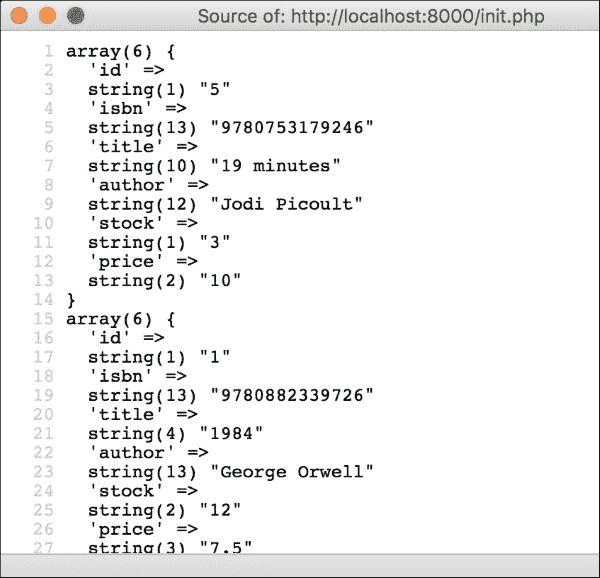
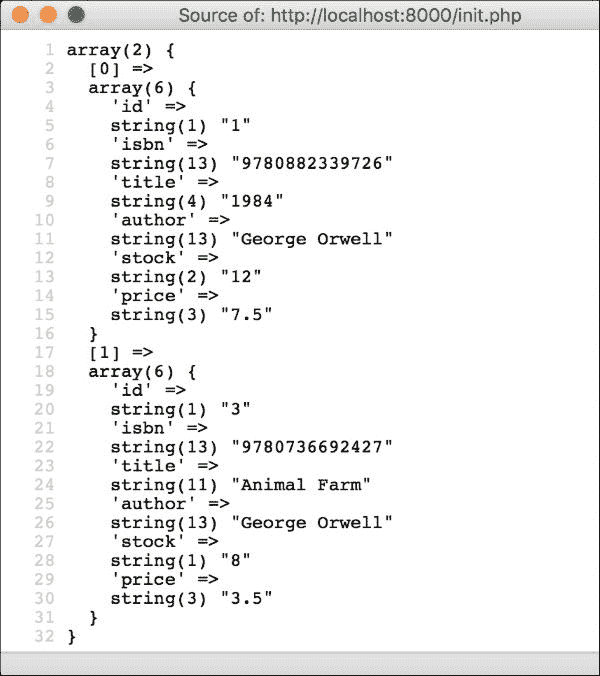

## 第六章：索引

索引，是键的同义词，是那些不需要像其他键那样有特殊行为的字段，但它们在我们的查询中非常重要。因此，我们将要求 MySQL 对这些字段做一些工作，以便在通过此字段进行查询时表现更好。你还记得在添加外键时 MySQL 添加了额外的键到表中吗？那些也是索引。

考虑应用程序将如何使用数据库。我们希望向我们的客户展示书籍目录，但我们肯定不能一次性展示所有书籍。客户将想要过滤结果，而最常见的一种过滤方式是指定他们正在寻找的书籍标题。从这个角度来看，我们可以得出结论，标题将被频繁用于过滤书籍，因此我们希望为这个字段添加索引。让我们通过以下代码添加索引：

```php
mysql> ALTER TABLE book ADD INDEX (title);
Query OK, 0 rows affected (0.01 sec)
Records: 0  Duplicates: 0  Warnings: 0

```

记住，所有其他键也提供了索引。书籍、客户和销售、ISBN 和电子邮件的 ID 已经建立了索引，因此在这里添加另一个索引是没有必要的。此外，尽量不要为每个字段都添加索引，因为这样做会导致**过度索引**，这会使某些类型的查询比没有索引时还要慢！

# 插入数据

我们已经创建了完美的表来存储我们的数据，但到目前为止它们是空的。现在是时候填充它们了。我们推迟了这个时刻，因为当表中有数据时更改表比它们为空时更困难。

为了插入这些数据，我们将使用`INSERT INTO`命令。此命令将包含表名、你想要填充的字段以及每个字段的值。请注意，你可以选择不指定字段的值，这样做有不同的原因，如下所述：

+   该字段有一个默认值，并且我们很高兴为这个特定的行使用它

+   即使该字段没有显式的默认值，该字段也可以接受 null 值；因此，如果不指定该字段，MySQL 将自动在此插入 null 值

+   该字段是主键，并且是自增的，我们希望让 MySQL 为我们获取下一个 ID

有不同的原因可能导致`INSERT INTO`命令失败：

+   如果你没有指定字段的值，并且 MySQL 无法提供有效的默认值

+   如果提供的值不是字段的数据类型，并且 MySQL 无法找到有效的转换

+   如果你指定了要设置字段的值，但你未能提供值

+   如果你提供了一个带有 ID 的外键，但该 ID 在引用的表中不存在

让我们看看如何添加行。让我们从我们的`customer`表开始，添加一个`basic`和一个`premium`，如下所示：

```php
mysql> INSERT INTO customer (firstname, surname, email, type)
 -> VALUES ("Han", "Solo", "han@tatooine.com", "premium");
Query OK, 1 row affected (0.00 sec)

mysql> INSERT INTO customer (firstname, surname, email, type)
 -> VALUES ("James", "Kirk", "enter@prise", "basic");
Query OK, 1 row affected (0.00 sec)

```

注意，MySQL 会显示一些返回信息；在这种情况下，它显示影响了一行，即我们插入的那一行。我们没有提供 ID，所以 MySQL 只是添加了列表中的下一个 ID。由于这是我们第一次添加数据，MySQL 使用了 ID 1 和 2。

让我们尝试欺骗 MySQL 并添加另一个客户，重复我们在上一节中设置为唯一的电子邮件地址字段：

```php
mysql> INSERT INTO customer (firstname, surname, email, type)
 -> VALUES ("Mr", "Spock", "enter@prise", "basic");
ERROR 1062 (23000): Duplicate entry 'enter@prise' for key 'email'

```

返回了一个带有错误代码和错误信息的错误，当然，行没有被插入。错误信息通常包含足够的信息，以便理解问题及其解决方法。如果不是这样，我们总是可以尝试使用错误代码在互联网上搜索，并注意官方文档或其他用户对此有何评论。

如果您需要向同一表中引入多行，并且它们包含相同的字段，则有一个简短的命令版本，您可以在其中指定字段，然后为每行提供值组。让我们看看在向我们的`book`表添加书籍时如何使用它，如下所示：

```php
mysql> INSERT INTO book (isbn,title,author,stock,price) VALUES
 -> ("9780882339726","1984","George Orwell",12,7.50),
 -> ("9789724621081","1Q84","Haruki Murakami",9,9.75),
 -> ("9780736692427","Animal Farm","George Orwell",8,3.50),
 -> ("9780307350169","Dracula","Bram Stoker",30,10.15),
 -> ("9780753179246","19 minutes","Jodi Picoult",0,10);
Query OK, 5 rows affected (0.01 sec)
Records: 5  Duplicates: 0  Warnings: 0

```

与客户一样，我们不会指定 ID，让 MySQL 选择合适的 ID。注意，现在受影响的行数是`5`，因为我们插入了五行。

我们如何利用我们在表中定义的显式默认值？嗯，我们可以用与处理主键相同的方式来做这件事：不要在字段列表或值列表中指定它们，MySQL 将直接使用默认值。例如，我们为`book.stock`字段定义了一个默认值`1`，这对于`book`表和`stock`字段来说是一个有用的表示法。让我们使用这个默认值添加另一行，如下所示：

```php
mysql> INSERT INTO book (isbn,title,author,price) VALUES
 -> ("9781416500360", "Odyssey", "Homer", 4.23);
Query OK, 1 row affected (0.00 sec)

```

现在我们有了书籍和客户，让我们添加一些关于客户借阅书籍的历史数据。为此，使用`book`和`customer`的数字 ID，如下面的代码所示：

```php
mysql> INSERT INTO borrowed_books(book_id,customer_id,start,end)
 -> VALUES
 -> (1, 1, "2014-12-12", "2014-12-28"),
 -> (4, 1, "2015-01-10", "2015-01-13"),
 -> (4, 2, "2015-02-01", "2015-02-10"),
 -> (1, 2, "2015-03-12", NULL);
Query OK, 3 rows affected (0.00 sec)
Records: 3  Duplicates: 0  Warnings: 0

```

# 查询数据

花了相当多的时间，但我们终于到达了与数据库最激动人心——也是最有用——的部分：查询数据。查询数据是指要求 MySQL 从指定的表中返回行，并可选择通过一组规则过滤这些结果。您也可以选择获取特定的字段而不是整个行。为了查询数据，我们将使用`SELECT`命令，如下所示：

```php
mysql> SELECT firstname, surname, type FROM customer;
+-----------+---------+---------+
| firstname | surname | type    |
+-----------+---------+---------+
| Han       | Solo    | premium |
| James     | Kirk    | basic   |
+-----------+---------+---------+
2 rows in set (0.00 sec)

```

查询数据的一种最简单的方法是在`SELECT`之后指定感兴趣的字段，并使用`FROM`关键字指定表。由于我们没有在查询中添加任何过滤器——通常称为条件——所以我们得到了所有这些行。有时，这可能是期望的行为，但最常见的事情是向查询中添加条件，以检索我们需要的行。使用`WHERE`关键字来实现这一点。

```php
mysql> SELECT firstname, surname, type FROM customer
 -> WHERE id = 1;
+-----------+---------+---------+
| firstname | surname | type    |
+-----------+---------+---------+
| Han       | Solo    | premium |
+-----------+---------+---------+
1 row in set (0.00 sec)

```

添加条件与我们在 PHP 中创建布尔表达式时非常相似。我们将指定字段名、运算符和值，MySQL 将只检索返回此表达式的`true`的行。在这种情况下，我们要求具有 ID 1 的客户，MySQL 返回了一行：具有确切 ID 为 1 的那一行。

常见的查询需求是获取以某些文本开头的书籍。由于我们只想匹配字符串的一部分，因此不能使用您所知的任何比较运算符来构造这个表达式，例如 `=` 和 `<` 或 `>`。为此，MySQL 有一个 `LIKE` 运算符，它接受一个可以包含通配符的字符串。通配符是一个代表规则的字符，可以匹配符合规则后的任意数量的字符。例如，`%` 通配符代表任意数量的字符，因此使用 `1%` 字符串将匹配以 1 开头并跟随后续任意数量或字符的任何字符串，例如 `1984` 或 `1Q84`。让我们考虑以下示例：

```php
mysql> SELECT title, author, price FROM book
 -> WHERE title LIKE "1%";
+------------+-----------------+-------+
| title      | author          | price |
+------------+-----------------+-------+
| 1984       | George Orwell   |   7.5 |
| 1Q84       | Haruki Murakami |  9.75 |
| 19 minutes | Jodi Picoult    |    10 |
+------------+-----------------+-------+
3 rows in set (0.00 sec)

```

我们请求了所有标题以 `1` 开头的书籍，并得到了三行。您可以想象这个运算符有多有用，尤其是在我们实现应用程序中的搜索工具时。

与 PHP 一样，MySQL 也允许您添加逻辑运算符——即接受操作数并执行逻辑运算的运算符，结果返回布尔值。最常用的逻辑运算符与 PHP 一样是 `AND` 和 `OR`。`AND` 在两个表达式都为 `true` 时返回 `true`，而 `OR` 在任一操作数为 `true` 时返回 `true`。让我们考虑以下示例：

```php
mysql> SELECT title, author, price FROM book
 -> WHERE title LIKE "1%" AND stock > 0;
+------------+-----------------+-------+
| title      | author          | price |
+------------+-----------------+-------+
| 1984       | George Orwell   |   7.5 |
| 1Q84       | Haruki Murakami |  9.75 |
+------------+-----------------+-------+
2 rows in set (0.00 sec)

```

这个例子与上一个例子非常相似，但我们添加了一个额外的条件。我们请求了所有以 `1` 开头的标题以及是否有库存。这就是为什么一本书没有显示，因为它不满足这两个条件。您可以使用逻辑运算符添加所需数量的条件，但请注意 `AND` 运算符的优先级高于 `OR`。如果您想改变这个优先级，您总是可以用括号将表达式括起来，就像在 PHP 中一样。

到目前为止，我们在查询数据时检索了特定的字段，但我们可以请求给定表中的所有字段。为此，我们只需在 `SELECT` 中使用 `*` 通配符。让我们通过以下代码选择所有客户的字段：

```php
mysql> SELECT * FROM customer \G
*************************** 1\. row ***************************
 id: 1
firstname: Han
 surname: Solo
 email: han@tatooine.com
 type: premium
*************************** 2\. row ***************************
 id: 2
firstname: James
 surname: Kirk
 email: enter@prise
 type: basic
2 rows in set (0.00 sec)

```

您可以检索的信息不仅仅是字段。例如，您可以使用 `COUNT` 来检索满足给定条件的行数，而不是检索所有列。这种方法比检索所有列然后再计数要快，因为您通过减少响应的大小来节省时间。让我们考虑一下它将如何看起来：

```php
mysql> SELECT COUNT(*) FROM borrowed_books
 -> WHERE customer_id = 1 AND end IS NOT NULL;
+----------+
| COUNT(*) |
+----------+
|        1 |
+----------+
1 row in set (0.00 sec)

```

正如您所注意到的，响应显示 `1`，这意味着只有一个借阅的书籍满足条件。然而，检查一下条件；您会注意到我们使用了另一个熟悉的逻辑运算符：`NOT`。`NOT` 取反表达式，就像 PHP 中的 `!` 一样。请注意，我们不用等号来与空值比较。在 MySQL 中，您必须使用 `IS` 而不是等号来与 `NULL` 进行比较。因此，第二个条件会在借阅的书籍有一个非空的结束日期时得到满足。

让我们通过在查询数据时添加两个更多功能来完成这个部分。第一个功能是能够指定返回行的顺序。要做到这一点，只需使用关键字`ORDER BY`后跟你想排序的字段名称。你也可以指定是否想要以升序排序，这是默认的，或者以降序排序，可以通过附加`DESC`来实现。另一个功能是使用`LIMIT`和要检索的行数来限制返回的行数。现在，运行以下代码：

```php
mysql> SELECT id, title, author, isbn FROM book
 -> ORDER BY title LIMIT 4;
+----+-------------+-----------------+---------------+
| id | title       | author          | isbn          |
+----+-------------+-----------------+---------------+
|  5 | 19 minutes  | Jodi Picoult    | 9780753179246 |
|  1 | 1984        | George Orwell   | 9780882339726 |
|  2 | 1Q84        | Haruki Murakami | 9789724621081 |
|  3 | Animal Farm | George Orwell   | 9780736692427 |
+----+-------------+-----------------+---------------+
4 rows in set (0.00 sec)

```

# 使用 PDO

到目前为止，我们已经与 MySQL 一起工作过，你对它能做什么已经有了一个很好的了解。然而，手动连接到客户端并执行查询并不是我们的目标。我们想要实现的是，我们的应用程序可以自动利用数据库。为了做到这一点，我们将使用一组 PHP 附带类，允许你从代码中连接到数据库并执行查询。

**PHP 数据对象**（**PDO**）是连接到数据库并允许你与之交互的类。这是 PHP 开发者处理数据库的流行方式，尽管还有其他方式，我们在这里不会讨论。PDO 允许你与不同的数据库系统一起工作，所以你不仅限于 MySQL。在接下来的章节中，我们将考虑如何使用这个类连接到数据库、插入数据以及检索数据。

## 连接到数据库

为了连接到数据库，将凭证（即用户名和密码）与代码分开存储在配置文件中是一个好习惯。我们已经有这个文件，即`config/app.json`，因为我们之前与`Config`类一起工作过。让我们为我们的数据库添加正确的凭证。如果你有默认的配置，配置文件应该看起来像这样：

```php
{
  "db": {
    "user": "root",
    "password": ""
  }
}
```

开发者通常会指定与连接相关的其他信息，例如主机、端口或数据库名称。这取决于你的应用程序是如何安装的，MySQL 是否运行在不同的服务器上，等等，至于你希望在代码和配置文件中保留多少信息，这取决于你。

为了连接到数据库，我们需要从`PDO`类实例化一个对象。这个类的构造函数期望三个参数：**数据源名称**（**DSN**），它是一个表示要使用哪种数据库的字符串；用户的名称；以及密码。我们已经从`Config`类中获得了用户名和密码，但我们仍然需要构建 DSN。

MySQL 数据库的一种格式是`<database type>:host=<host>;dbname=<schema name>`。由于我们的数据库系统是 MySQL，它运行在同一个服务器上，模式名称是`bookstore`，DSN 将是`mysql:host=127.0.0.1;dbname=bookstore`。让我们看看我们将如何将所有这些放在一起：

```php
$dbConfig = Config::getInstance()->get('db');
$db = new PDO(
 'mysql:host=127.0.0.1;dbname=bookstore',
 $dbConfig['user'],
 $dbConfig['password']
);
$db->setAttribute(PDO::ATTR_DEFAULT_FETCH_MODE, PDO::FETCH_ASSOC);
```

注意，我们还将从`PDO`实例调用`setAttribute`方法。此方法允许你设置一些选项到连接；在这种情况下，它设置了从 MySQL 返回的结果的格式。此选项强制 MySQL 返回键为字段名的数组，这比默认的基于字段顺序返回数字键的方式更有用。设置此选项现在将影响使用`$db`实例执行的所有查询，而不是每次执行查询时设置选项。

## 执行查询

从你的数据库中检索数据的最简单方法是使用`query`方法。此方法接受查询作为字符串，并返回一个作为数组的行列表。让我们考虑一个例子：在数据库连接初始化之后写入以下内容——例如，在`init.php`文件中：

```php
$rows = $db->query('SELECT * FROM book ORDER BY title');
foreach ($rows as $row) {
    var_dump($row);
}
```

这个查询试图获取数据库中的所有书籍，并按标题排序。这可能是`getAllBooks`函数的内容，该函数在我们显示目录时使用。每一行都是一个数组，包含所有字段作为键和数据作为值。

如果你将应用程序运行在你的浏览器上，你将得到以下结果：



当我们想要检索数据时，`query`函数很有用，但为了执行插入行的查询，PDO 提供了`exec`函数。此函数也期望第一个参数为字符串，定义要执行的查询，但它返回一个布尔值，指定执行是否成功。一个很好的例子是尝试插入书籍。输入以下内容：

```php
$query = <<<SQL
INSERT INTO book (isbn, title, author, price)
VALUES ("9788187981954", "Peter Pan", "J. M. Barrie", 2.34)
SQL;
$result = $db->exec($query);
var_dump($result); // true
```

这段代码还使用了一种新的字符串表示方法：heredoc。我们将字符串放在`<<<SQL`和`SQL;`之间，这两者都在不同的行上，而不是用引号。这种方法的优点是能够用制表符或任何其他空白字符在多行中编写字符串，而 PHP 会尊重这一点。我们可以构建易于阅读的查询，而不是将它们写在单行上或者需要连接不同的字符串。请注意，`SQL`是一个表示字符串开始和结束的标记，但你也可以使用你认为是的任何文本。

第一次使用此代码运行应用程序时，查询将成功执行，因此，结果将是布尔值`true`。然而，如果你再次运行它，它将返回`false`，因为我们插入的 ISBN 相同，但我们将其限制设置为唯一。

了解查询失败是有用的，但如果我们知道原因会更好。`PDO`实例有一个`errorInfo`方法，它返回一个包含最后错误信息的数组。键`2`包含描述，所以我们可能更经常使用它。用以下代码更新之前的代码：

```php
$query = <<<SQL
INSERT INTO book (isbn, title, author, price)
VALUES ("9788187981954", "Peter Pan", "J. M. Barrie", 2.34)
SQL;
$result = $db->exec($query); 
var_dump($result); // false
$error = $db->errorInfo()[2];
var_dump($error); // Duplicate entry '9788187981954' for key 'isbn'
```

结果是查询失败，因为 ISBN 条目重复。现在，我们可以为我们的客户或仅用于调试目的构建更有意义的错误消息。

## 预处理语句

前两个函数在你需要运行总是相同的快速查询时非常有用。然而，在第二个例子中，你可能注意到查询字符串并不很有用，因为它总是插入相同的书籍。虽然确实可以通过变量替换这些值，但这不是好的做法，因为这些变量通常来自用户端，可能包含恶意代码。总是先清理这些值会更好。

PDO 提供了准备语句的能力——即参数化的查询。你可以指定将改变查询的字段参数，然后为这些参数分配值。让我们首先考虑以下示例：

```php
$query = 'SELECT * FROM book WHERE author = :author';
$statement = $db->prepare($query);
$statement->bindValue('author', 'George Orwell');
$statement->execute();
$rows = $statement->fetchAll();
var_dump($rows);
```

查询本身是一个普通的查询，只是它使用`:author`而不是我们想要查找的作者字符串。这是一个参数，我们将使用前缀`:`来识别它们。`prepare`方法将查询作为参数接收并返回一个`PDOStatement`实例。这个类包含多个方法来绑定值、执行语句、获取结果等。在这段代码中，我们只使用了其中三个，如下所示：

+   `bindValue`：它接受两个参数：查询中描述的参数名称和要分配的值。如果你提供了一个不在查询中的参数名称，这将抛出异常。

+   `execute`：这将发送查询到 MySQL，并用提供的值替换参数。如果有任何参数没有分配值，该方法将抛出异常。与它的兄弟`exec`一样，`execute`将返回一个布尔值，指定查询是否成功执行。

+   `fetchAll`：如果这是一个`SELECT`查询，这将从 MySQL 检索数据。作为一个查询，`fetchAll`将返回所有行的数组列表。

如果你尝试这段代码，你会注意到结果与使用`query`时非常相似；然而，这次代码要动态得多，因为你可以为任何需要的作者重用它。



除了使用`bindValue`方法外，还有另一种方法可以将值绑定到查询的参数。你可以准备一个数组，其中键是参数的名称，值是你想要分配给它的值，然后你可以将其作为`execute`方法的第一个参数发送。这种方法非常有用，因为你通常已经准备好了这个数组，不需要多次调用`bindValue`及其内容。添加以下代码以进行测试：

```php
$query = <<<SQL
INSERT INTO book (isbn, title, author, price)
VALUES (:isbn, :title, :author, :price)
SQL;
$statement = $db->prepare($query);
$params = [
    'isbn' => '9781412108614',
    'title' => 'Iliad',
    'author' => 'Homer',
    'price' => 9.25
];
$statement->execute($params);
echo $db->lastInsertId(); // 8

```

在这个最后的例子中，我们创建了一本几乎包含所有参数的新书，但我们没有指定 ID，这是期望的行为，因为我们希望 MySQL 为我们选择一个有效的 ID。然而，如果你想知道插入行的 ID 会发生什么？好吧，你可以查询具有相同 ISBN 的 MySQL 中的书籍，返回的行将包含 ID，但这似乎很麻烦。相反，PDO 有一个 `lastInsertId` 方法，它返回由主键插入的最后一个 ID，这样我们就避免了额外的查询。

# 连接表

尽管查询 MySQL 很快，尤其是在它与我们的 PHP 应用程序在同一服务器上时，我们仍然应该尝试减少将要执行的查询数量，以提高我们应用程序的性能。到目前为止，我们只从一个表中查询数据，但这很少是情况。想象一下，你想检索关于借阅书籍的信息：该表只包含 ID 和日期，所以如果你查询它，你不会得到非常有意义的数据，对吧？一种方法是对 `borrowed_books` 中的数据进行查询，并根据返回的 ID，通过过滤我们感兴趣的 ID 来查询 `book` 和 `customer` 表。然而，这种方法至少需要向 MySQL 发出三个查询，并在 PHP 中进行大量的数组操作。这似乎应该有更好的选择！

在 SQL 中，你可以执行 **连接查询**。连接查询是一种通过公共字段连接两个或更多表，从而允许你从这些表中检索数据，减少所需查询数量的查询。当然，连接查询的性能不如普通查询，但如果你有正确的键和关系定义，这个选项比单独查询要好得多。

为了连接表，你需要使用公共字段将它们链接起来。外键在这个问题中非常有用，因为你知道这两个字段是相同的。让我们看看我们如何查询与借阅书籍相关的所有重要信息：

```php
mysql> SELECT CONCAT(c.firstname, ' ', c.surname) AS name,
 ->     b.title,
 ->     b.author,
 ->     DATE_FORMAT(bb.start, '%d-%m-%y') AS start,
 ->     DATE_FORMAT(bb.end, '%d-%m-%y') AS end
 -> FROM borrowed_books bb
 ->     LEFT JOIN customer c ON bb.customer_id = c.id
 ->     LEFT JOIN book b ON b.id = bb.book_id
 -> WHERE bb.start >= "2015-01-01";
+------------+---------+---------------+----------+----------+
| name       | title   | author        | start    | end      |
+------------+---------+---------------+----------+----------+
| Han Solo   | Dracula | Bram Stoker   | 10-01-15 | 13-01-15 |
| James Kirk | Dracula | Bram Stoker   | 01-02-15 | 10-02-15 |
| James Kirk | 1984    | George Orwell | 12-03-15 | NULL     |
+------------+---------+---------------+----------+----------+
3 rows in set (0.00 sec)

```

在这个最后的查询中引入了几个新概念。特别是当我们进行连接查询时，因为我们连接了不同表的字段，可能会出现两个表有相同字段名的情况，MySQL 需要我们区分它们。我们将通过在字段名前添加表名来区分两个不同表的两个字段。想象一下，如果我们想区分客户 ID 和书籍 ID，我们应该使用 `customer.id` 和 `book.id`。然而，每次都写表名会让我们的查询变得冗长。

MySQL 具有通过在表的真正名称旁边写入别名来向表添加别名的功能，就像我们在 `borrowed_books` (`bb`)、`customer` (`c`) 或 `book` (`b`) 中所做的那样。一旦添加了别名，您就可以使用它来引用此表，允许我们编写类似 `bb.customer_id` 而不是 `borrowed_books.customer_id` 的内容。即使字段在其他任何地方都没有重复，将表作为字段写入也是良好的实践，因为连接表会使知道每个字段来自哪里变得有些混乱。

在连接表时，您需要在 `FROM` 子句中使用 `LEFT JOIN`，然后是表名、可选的别名以及连接两个表的字段。有不同的连接类型，但让我们关注对我们最有用的类型。**左连接**将第一个表（定义中的左侧表）的每一行取出来，并在右侧表中搜索等效字段。一旦找到，它将像是一个整体一样连接这两行。例如，当将 `borrowed_books` 与 `customer` 连接时，对于每一行 `borrowed_books`，MySQL 将在 `customer` 中搜索一个与当前 `customer_id` 匹配的 ID，然后它将像它们是一个大表一样将此行的所有信息添加到我们的当前行 `borrowed_books` 中。由于 `customer_id` 是外键，我们可以确定总会有一个客户与之匹配。

您可以连接多个表，MySQL 将从左到右解决它们；也就是说，它将首先将前两个表作为一个整体连接起来，然后尝试将这个结果与第三个表连接起来，依此类推。这正是我们在示例中所做的：我们首先将 `borrowed_books` 与 `customer` 连接起来，然后将这两个连接起来。

正如您所注意到的，字段也有别名。有时，我们不仅仅是获取一个字段；一个例子是我们如何使用 `COUNT(*)` 来获取查询匹配的行数。然而，当检索此信息时，列的标题也是 `COUNT(*)`，这并不总是有用的。在其他时候，我们使用了具有冲突字段名的两个表，这会使一切变得混乱。当这种情况发生时，只需像我们对表名所做的那样给字段添加别名即可；`AS` 是可选的，但它有助于理解您正在做什么。

让我们现在转到查询中日期的使用。一方面，我们将首次使用 `DATE_FORMAT`。它接受日期/时间/日期时间值和带有格式的字符串。在这种情况下，我们使用了 `%d-%m-%y`，这意味着日-月-年，但我们也可以使用 `%h-%i-%s` 来指定小时-分钟-秒或任何其他组合。

还要注意我们在 `WHERE` 子句中比较日期的方式。对于相同类型的两个日期或时间值，您可以使用比较运算符，就像它们是数字一样。在这种情况下，我们将执行 `bb.start >= "2015-01-01"`，这将给我们从 2015 年 1 月 1 日起借阅的书籍。

关于这个复杂查询的最后一件事是`CONCAT`函数的使用。我们不想返回两个字段，一个用于名字，一个用于姓氏，我们想要得到全名。为此，我们将使用这个函数连接字段，将我们想要的字符串作为函数的参数发送，并得到连接后的字符串。正如你所看到的，你可以发送字段和用单引号括起来的字符串。

好吧，如果你完全理解了这个查询，你应该对自己感到满意；这是我们本章中将要看到的最为复杂的查询。我们希望你能感受到数据库系统是多么强大，并且从现在开始，你将尽可能在数据库端而不是 PHP 端处理数据。如果你设置了正确的索引，它将表现得更好。

# 分组查询

我们将要讨论的查询的最后一个特性是`GROUP BY`子句。这个子句允许您使用一个公共字段将同一表的行分组。例如，假设我们只想通过一个查询知道每位作者有多少本书。尝试以下操作：

```php
mysql> SELECT
 -> author,
 -> COUNT(*) AS amount,
 -> GROUP_CONCAT(title SEPARATOR ', ') AS titles
 -> FROM book
 -> GROUP BY author
 -> ORDER BY amount DESC, author;
+-----------------+--------+-------------------+
| author          | amount | titles            |
+-----------------+--------+-------------------+
| George Orwell   |      2 | 1984, Animal Farm |
| Homer           |      2 | Odyssey, Iliad    |
| Bram Stoker     |      1 | Dracula           |
| Haruki Murakami |      1 | 1Q84              |
| J. M. Barrie    |      1 | Peter Pan         |
| Jodi Picoult    |      1 | 19 minutes        |
+-----------------+--------+-------------------+
5 rows in set (0.00 sec)

```

`GROUP BY`子句，始终在`WHERE`子句之后，获取一个字段——或者多个，用逗号分隔——并将具有该字段相同值的所有行视为一个整体。因此，按作者选择将分组包含相同作者的所有行。这个特性可能看起来不太有用，但 MySQL 中有几个函数可以利用它。在这个例子中：

+   `COUNT(*)`在带有`GROUP BY`的查询中使用，显示该字段分组了多少行。在这种情况下，我们将用它来知道每位作者有多少本书。实际上，它总是这样工作的；然而，对于没有`GROUP BY`的查询，MySQL 将整个行集视为一个组。

+   `GROUP_CONCAT`与我们在前面讨论的`CONCAT`类似。唯一的区别是这次函数将连接一个组中所有行的字段。如果您没有指定`SEPARATOR`，MySQL 将使用单个逗号。然而，在我们的情况下，我们需要一个逗号和一个空格来使其可读，所以我们添加了`SEPARATOR ', '`在末尾。请注意，您可以在`CONCAT`中添加您需要的任何要连接的内容，分隔符将仅按行分隔连接。

即使这不是关于分组的，请注意我们添加的`ORDER`子句。我们按两个字段而不是一个字段排序。这意味着 MySQL 将按`amount`字段对所有行进行排序；请注意，这是一个别名，但您也可以在这里使用它。然后，MySQL 将按`title`字段对具有相同`amount`值的每一组行进行排序。

在我们已经介绍了`SELECT`查询可以包含的所有重要子句之后，还有一件事需要记住：MySQL 期望查询的子句始终以相同的顺序排列。如果你写了一个相同的查询但改变了这个顺序，你会得到一个错误。顺序如下：

1.  `SELECT`

1.  `FROM`

1.  `WHERE`

1.  `GROUP BY`

1.  `ORDER BY`

# 更新和删除数据

我们已经对插入和检索数据有了相当多的了解，但如果应用程序只能做到这一点，它们将非常静态。根据我们的需要编辑这些数据使应用程序变得动态，并给用户带来价值。在 MySQL 以及大多数数据库系统中，你有两个命令来更改数据：`UPDATE` 和 `DELETE`。让我们详细讨论它们。

## 更新数据

在 MySQL 中更新数据时，最重要的是有一个你想要更新的行的唯一引用。为此，主键非常有用；然而，如果你有一个没有主键的表，这在大多数情况下不应该发生，你仍然可以根据其他字段更新行。除了引用之外，你还需要新值，当然还有要更新的表名和字段。让我们看看一个非常简单的例子：

```php
mysql> UPDATE book SET price = 12.75 WHERE id = 2;
Query OK, 1 row affected (0.00 sec)
Rows matched: 1  Changed: 1  Warnings: 0

```

在这个 `UPDATE` 查询中，我们将 ID 为 2 的书的售价设置为 `12.75`。`SET` 子句不需要指定仅一个更改；你可以在用逗号分隔的情况下指定同一行的多个更改——例如，`SET price = 12.75, stock = 14`。此外，请注意 `WHERE` 子句，其中我们指定了要更改的行。MySQL 根据这些条件获取此表的所有行，就像它是一个 `SELECT` 查询一样，并将更改应用于这些行集。

MySQL 将返回的内容非常重要：匹配的行数和更改的行数。第一个是匹配 `WHERE` 子句条件的行数。第二个指定了可以更改的行数。有不同原因不更改一行——例如，当行已经具有相同的值时。为了看到这一点，让我们再次运行相同的查询：

```php
mysql> UPDATE book SET price = 12.75 WHERE id = 2;
Query OK, 0 rows affected (0.00 sec)
Rows matched: 1  Changed: 0  Warnings: 0

```

现在相同的行显示有 `1` 行匹配，这是预期的，但 `0` 行被更改。原因是我们已经将这本书的价格设置为 `12.75`，所以 MySQL 现在不需要对此做任何事情。

如前所述，`WHERE` 子句是此查询中最重要的部分。很多时候，我们发现一些开发者运行先验无辜的 `UPDATE` 查询，结果却因为遗漏了 `WHERE` 子句而改变了整个表；因此，MySQL 会将整个表匹配为有效的更新行。这通常不是开发者的意图，而且这种情况并不愉快，所以请务必确保你总是提供一组有效的条件。首先写下返回你需要编辑的行的 `SELECT` 查询是一个好习惯，一旦你确定条件与所需的行集匹配，你就可以编写 `UPDATE` 查询。

然而，有时影响多行是预期的场景。想象一下，我们正经历艰难时期，需要提高我们所有书籍的价格。我们决定将价格提高 16%，即当前价格的 1.16 倍。我们可以运行以下查询来执行这些更改：

```php
mysql> UPDATE book SET price = price * 1.16;
Query OK, 8 rows affected (0.00 sec)
Rows matched: 8  Changed: 8  Warnings: 0

```

这个查询不包含任何`WHERE`子句，因为我们想要匹配所有的书籍。此外，请注意，`SET`子句使用`price`字段来获取当前的价格值，这是完全有效的。最后，请注意匹配并更改的行数，这是`8`——这个表的整个行集。

为了完成这个子节，让我们考虑如何使用 PHP 通过 PDO 执行`UPDATE`查询。一个非常常见的场景是我们想要将现有书籍的副本添加到我们的库存中。给定一个书籍 ID 和一个可选的书籍数量——默认情况下，这个值将是 1——我们将通过这些副本增加这本书的库存值。在`init.php`文件中编写这个函数：

```php
function addBook(int $id, int $amount = 1): void {
    $db = new PDO(
        'mysql:host=127.0.0.1;dbname=bookstore',
        'root',
        ''
    );

    $query = 'UPDATE book SET stock = stock + :n WHERE id = :id';
    $statement = $db->prepare($query);
    $statement->bindValue('id', $id);
    $statement->bindValue('n', $amount);

    if (!$statement->execute()) {
        throw new Exception($statement->errorInfo()[2]);
    }
}
```

有两个参数：`$id`和`$amount`。第一个始终是必需的，而第二个可以省略，默认值为 1。函数首先准备一个类似于本节第一个查询的查询，其中我们增加了指定书籍的库存量，然后绑定这两个参数到语句中，并最终执行查询。如果发生某些情况并且`execute`返回`false`，我们将抛出一个包含 MySQL 错误消息内容的异常。

这个函数在我们购买更多股票或顾客归还书籍时非常有用。我们甚至可以通过给`$amount`提供一个负值来用它来移除书籍，但这是一种非常不好的做法。原因是即使我们强制股票字段为无符号，将其设置为负值也不会触发任何错误，只会显示警告。MySQL 不会将行设置为负值，但`execute`调用将返回`true`，而我们却不会知道。更好的做法是创建一个名为`removeBook`的第二个方法，并首先验证要移除的书籍数量是否低于或等于当前库存。

## 外键行为

在更新或删除行时需要管理的一个棘手问题是当我们更新的行是其他地方外键的一部分。例如，我们的`borrowed_books`表包含客户和书籍的 ID，正如你所知道的那样，MySQL 强制这些 ID 始终有效并且存在于这些相应的表中。那么，如果我们更改`book`表上书籍本身的 ID 会发生什么？或者更糟糕的是，如果我们从`book`中移除了一本书，并且`borrowed_books`表中有一行引用了这个 ID，会发生什么？

MySQL 允许你设置当这些场景之一发生时的期望反应。这必须在添加外键时定义；因此，在我们的情况下，我们首先需要删除现有的外键，然后再次添加。要删除或丢弃一个键，你需要知道这个键的名称，我们可以使用`SHOW CREATE TABLE`命令找到它，如下所示：

```php
mysql> SHOW CREATE TABLE borrowed_books \G
*************************** 1\. row ***************************
 Table: borrowed_books
Create Table: CREATE TABLE `borrowed_books` (
 `book_id` int(10) unsigned NOT NULL,
 `customer_id` int(10) unsigned NOT NULL,
 `start` datetime NOT NULL,
 `end` datetime DEFAULT NULL,
 KEY `book_id` (`book_id`),
 KEY `customer_id` (`customer_id`),
 CONSTRAINT `borrowed_books_ibfk_1` FOREIGN KEY (`book_id`) REFERENCES `book` (`id`),
 CONSTRAINT `borrowed_books_ibfk_2` FOREIGN KEY (`customer_id`) REFERENCES `customer` (`id`)
) ENGINE=InnoDB DEFAULT CHARSET=latin1
1 row in set (0.00 sec)

```

我们想要删除的两个外键是`borrowed_books_ibfk_1`和`borrowed_books_ibfk_2`。让我们使用`ALTER TABLE`命令来移除它们，就像我们之前做的那样：

```php
mysql> ALTER TABLE borrowed_books
 -> DROP FOREIGN KEY borrowed_books_ibfk_1;
Query OK, 4 rows affected (0.02 sec)
Records: 4  Duplicates: 0  Warnings: 0

mysql> ALTER TABLE borrowed_books
 -> DROP FOREIGN KEY borrowed_books_ibfk_2;
Query OK, 4 rows affected (0.01 sec)
Records: 4  Duplicates: 0  Warnings: 0

```

现在，我们需要再次添加外键。命令的格式将与添加时相同，但需要附加新的期望行为。在我们的情况下，如果我们从表中删除客户或书籍，我们希望从 `borrowed_books` 中删除引用这些书籍和客户的行；因此，我们需要使用 `CASCADE` 选项。让我们考虑它们会是什么样子：

```php
mysql> ALTER TABLE borrowed_books
 -> ADD FOREIGN KEY (book_id) REFERENCES book (id)
 -> ON DELETE CASCADE ON UPDATE CASCADE,
 -> ADD FOREIGN KEY (customer_id) REFERENCES customer (id)
 -> ON DELETE CASCADE ON UPDATE CASCADE;
Query OK, 4 rows affected (0.01 sec)
Records: 4  Duplicates: 0  Warnings: 0

```

注意，我们可以为这两种操作定义 `CASCADE` 行为：在更新和删除行时。除了 `CASCADE` 之外，还有其他选项——例如 `SET NULL`，它将外键列设置为 `NULL`，允许删除原始行，或者默认的 `RESTRICT`，它拒绝更新/删除命令。

## 删除数据

删除数据几乎与更新相同。你需要提供一个 `WHERE` 子句来匹配你想要删除的行。同样，就像更新数据时一样，强烈建议在执行 `DELETE` 命令之前，首先构建一个 `SELECT` 查询来检索你想要删除的行。不要认为你在这种方法上浪费时间；俗话说，量两次，切一次。删除行后，并不总是可能恢复数据！

让我们尝试通过观察我们之前设置的 `CASCADE` 选项的行为来删除一本书。为此，我们首先通过以下查询获取现有的借阅书籍列表：

```php
mysql> SELECT book_id, customer_id FROM borrowed_books;
+---------+-------------+
| book_id | customer_id |
+---------+-------------+
|       1 |           1 |
|       4 |           1 |
|       4 |           2 |
|       1 |           2 |
+---------+-------------+
4 rows in set (0.00 sec)

```

有两本不同的书，`1` 和 `4`，每本书都被借阅了两次。让我们尝试删除 ID 为 4 的书籍。首先，构建一个查询，例如 `SELECT * FROM book WHERE id = 4`，以确保 `WHERE` 子句中的条件是适当的。一旦你确定，执行以下查询：

```php
mysql> DELETE FROM book WHERE id = 4;
Query OK, 1 row affected (0.02 sec)

```

正如你所注意到的，我们只指定了 `DELETE FROM` 命令，后面跟着表名和 `WHERE` 子句。MySQL 告诉我们影响了 `1` 行，考虑到我们之前执行的 `SELECT` 语句，这是有道理的。

如果我们回到我们的 `borrowed_books` 表并查询现有的记录，我们会注意到引用 ID 为 4 的书籍的所有行都消失了。这是因为当我们从 `book` 表中删除它们时，MySQL 注意到了外键引用，检查了在删除时需要做什么——在这种情况下，`CASCADE`——然后也删除了 `borrowed_books` 中的行。看看下面的例子：

```php
mysql> SELECT book_id, customer_id FROM borrowed_books;
+---------+-------------+
| book_id | customer_id |
+---------+-------------+
|       1 |           1 |
|       1 |           2 |
+---------+-------------+
2 rows in set (0.00 sec)

```

# 使用事务

在前面的部分中，我们再次强调了确保更新或删除查询包含期望的匹配行集的重要性。尽管这始终适用，但有一种方法可以撤销你刚刚所做的更改，那就是使用 **事务**。

事务是一个状态，MySQL 跟踪你在数据中做出的所有更改，以便在需要时能够撤销所有更改。你需要显式地开始一个事务，并且在关闭与服务器的连接之前，你需要提交你的更改。这意味着 MySQL 不会真正执行这些更改，直到你告诉它这样做。如果在事务期间你想撤销更改，你应该回滚而不是提交。

PDO 允许你通过三个函数来完成这个操作：

+   `beginTransaction`: 这将开始事务。

+   `commit`: 这将提交你的更改。请注意，如果你没有提交并且 PHP 脚本结束或者你显式地关闭了连接，MySQL 将会拒绝你在这次事务中做出的所有更改。

+   `rollBack`: 这将回滚在这次事务中做出的所有更改。

在你的应用程序中，事务的一个可能用途是在你需要执行多个查询，并且所有这些查询都必须成功，否则整个查询集不应该被执行的情况下。这将是将销售添加到数据库的情况。记住，我们的销售存储在两个表中：一个用于销售本身，另一个用于与这次销售相关的书籍列表。当你添加一个新的时，你需要确保所有书籍都添加到这个数据库中；否则，销售将被破坏。你应该执行所有查询，检查它们的返回值。如果任何一个返回 `false`，整个销售应该被回滚。

让我们在 `init.php` 文件中创建一个 `addSale` 函数来模拟这种行为。内容应该如下所示：

```php
function addSale(int $userId, array $bookIds): void {
    $db = new PDO(
        'mysql:host=127.0.0.1;dbname=bookstore',
        'root',
        ''
    );

 $db->beginTransaction();
    try {
        $query = 'INSERT INTO sale (customer_id, date) '
            . 'VALUES(:id, NOW())';
        $statement = $db->prepare($query);
        if (!$statement->execute(['id' => $userId])) {
            throw new Exception($statement->errorInfo()[2]);
        }
        $saleId = $db->lastInsertId();

        $query = 'INSERT INTO sale_book (book_id, sale_id) '
            . 'VALUES(:book, :sale)';
        $statement = $db->prepare($query);
        $statement->bindValue('sale', $saleId);
        foreach ($bookIds as $bookId) {
            $statement->bindValue('book', $bookId);
            if (!$statement->execute()) {
                throw new Exception($statement->errorInfo()[2]);
            }
        }

 $db->commit();
    } catch (Exception $e) {
 $db->rollBack();
        throw $e;
    }
}
```

这个函数相当复杂。它接受客户 ID 和书籍列表作为参数，因为我们假设销售日期是当前日期。我们首先要做的事情是连接到数据库，实例化 `PDO` 类。紧接着，我们将开始事务，这个事务只在这个函数的执行过程中持续。一旦开始事务，我们将打开一个 `try…catch` 块，它将包含函数的其余代码。原因是如果我们抛出一个异常，`catch` 块将捕获它，回滚事务并传播异常。`try` 块内的代码只是首先添加销售，然后迭代书籍列表，并将它们也插入到数据库中。在所有时候，我们都会检查 `execute` 函数的响应，如果它是 `false`，我们将抛出一个包含错误信息的异常。

让我们尝试使用这个函数。编写以下代码尝试为三本书添加销售；然而，其中一本不存在，就是 ID 为 200 的那本：

```php
try {
    addSale(1, [1, 2, 200]);
} catch (Exception $e) {
    echo 'Error adding sale: ' . $e->getMessage();
}
```

这段代码将输出错误信息，抱怨不存在这本书。如果你在 MySQL 中检查，`sales` 表中将没有行，因为当抛出异常时函数已经回滚。

最后，让我们尝试以下代码。这个代码将添加三本有效的书籍，以确保查询总是成功的，并且`try`块可以一直执行到末尾，在那里我们将提交更改：

```php
try {
    addSale(1, [1, 2, 3]);
} catch (Exception $e) {
    echo 'Error adding sale: ' . $e->getMessage();
}
```

测试一下，你就会看到在你的浏览器上没有打印出任何消息。然后，前往你的数据库以确保有一个新的`sales`行，并且有三本书与之关联。

# 摘要

在本章中，我们学习了数据库的重要性以及如何在我们的 Web 应用程序中使用它们：从使用 PDO 设置连接到按需创建和获取数据，再到构建满足我们需求的更复杂的查询。有了所有这些，我们的应用程序现在看起来比完全静态时更有用得多。

在下一章中，我们将发现如何通过**模型-视图-控制器**（**MVC**）应用 Web 应用程序最重要的设计模式。当你以这种方式组织应用程序时，你的代码将变得更加清晰。
