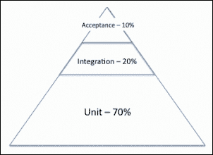
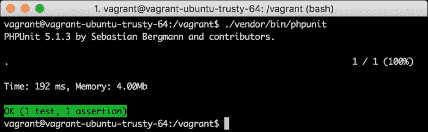
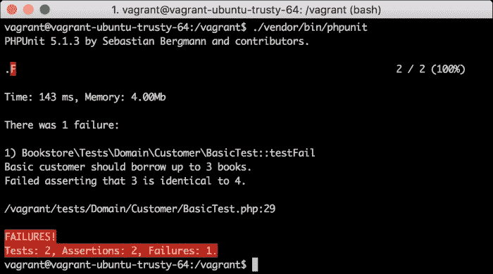
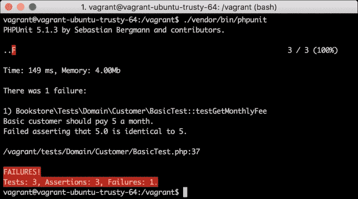
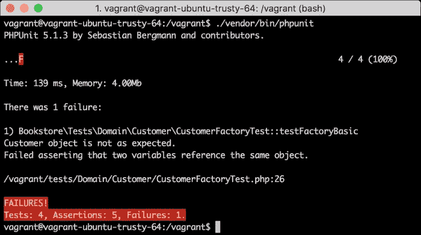
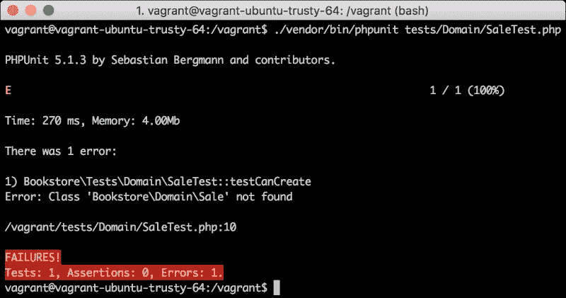
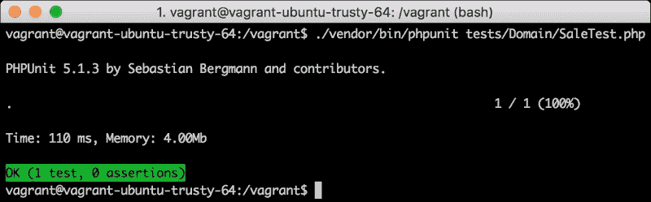

# 第七章：测试 Web 应用程序

当你谈论应用程序时，你很可能已经听说过“bug”这个词。像“我们在应用程序中发现了这样的 bug，…”然后是一些非常不希望出现的行为这样的句子比你想象的要常见。编写代码并不是开发者的唯一任务；测试同样至关重要。你不应该发布未经测试的应用程序版本。然而，你能想象每次修改一行代码时都必须测试整个应用程序吗？那将是一场噩梦！

嗯，我们不是第一个遇到这个问题的人，所以幸运的是，开发者已经找到了一个相当好的解决方案来解决这个问题。事实上，他们找到了不止一个解决方案，使测试成为了一个非常热门的讨论话题。甚至测试开发者已经变成了一个相当常见的角色。在本章中，我们将向你介绍测试代码的一种方法：单元测试。

在本章中，你将了解：

+   单元测试的工作原理

+   配置 PHPUnit 以测试你的代码

+   使用断言、数据提供者和模拟编写测试

+   编写单元测试时的好习惯和坏习惯

# 测试的必要性

当你在一个项目上工作时，你很可能不是唯一一个会使用这段代码的开发者。即使在你是唯一一个会修改它的案例中，如果你在创建它几周后进行修改，你很可能不会记得所有受这段代码影响的地方。好吧，让我们假设你是唯一一个开发者，你的记忆力是超乎常人的；你能否验证对常用对象（如请求）的更改始终按预期工作？更重要的是，你愿意每次进行微小更改时都这样做吗？

## 测试类型

当你在编写应用程序、修改现有代码或添加新功能时，获得良好的*反馈*非常重要。你怎么知道你得到的反馈是否足够好？它应该实现 AEIOU 原则：

+   **自动化**: 获取反馈应该尽可能不痛苦。通过运行一条命令来获取反馈总是比手动测试应用程序更可取。

+   **广泛性**: 我们应该尽可能覆盖尽可能多的用例，包括在编写代码时难以预见的边缘情况。

+   **即时性**: 你应该尽快得到它。这意味着你在引入更改后立即得到的反馈要比你的代码在生产环境中得到的反馈要好得多。

+   **开放性**: 结果应该是透明的，而且，测试应该让我们了解其他开发者如何集成或操作代码。

+   **实用性**: 它应该回答诸如“这个更改会起作用吗？”、“它会不会意外地破坏应用程序？”或“有没有不正常工作的边缘情况？”等问题。

因此，尽管一开始这个概念相当奇怪，但测试你的代码的最佳方式是…用更多的代码。没错！我们将编写代码，目的是测试我们应用程序的代码。为什么？因为这是我们已知的最能满足所有 AEIU 原则的方法，并且它有以下优点：

+   我们可以通过在命令行或我们喜欢的 IDE 中运行一个命令来执行测试。没有必要不断地通过浏览器手动测试你的应用程序。

+   我们只需要编写一次测试。一开始，可能会有些痛苦，但一旦代码编写完成，你就不需要反复重复它了。这意味着经过一些工作后，我们将能够轻松地测试每一个单独的情况。如果我们不得不手动测试，包括所有用例和边缘情况，那将是一场噩梦。

+   你不需要整个应用程序都运行正常才能知道你的代码是否工作。想象一下你正在编写你的路由器：为了知道它是否工作，你必须等到你的应用程序在浏览器中工作。相反，你可以在完成课程后立即编写测试并运行它们。

+   在编写测试时，你将获得关于哪些测试失败的反馈。当路由器的特定功能不工作以及失败的原因时，这非常有用，这比在浏览器上收到 500 错误要好得多。

我们希望到现在你已经接受了编写测试是不可或缺的想法。虽然这很简单，但问题是我们知道几种不同的方法。我们是编写测试来测试整个应用程序，还是测试特定部分？我们在测试时是否要隔离测试区域？我们是否希望在测试时与数据库或其他外部资源交互？根据你的回答，你将决定你想编写哪种类型的测试。让我们讨论开发者一致同意的三个主要方法：

+   **单元测试**：这些测试具有非常集中的范围。它们的目的是测试单个类或方法，将它们从其他代码中隔离出来。以你的`Sale`域类为例：它有关书籍添加的一些逻辑，对吧？一个单元测试可能只是实例化一个新的销售，向对象添加书籍，并验证书籍数组是否有效。由于它们的范围缩小，单元测试非常快，因此你可以轻松地拥有几个不同功能的不同场景，覆盖你所能想象的所有边缘情况。它们也是隔离的，这意味着我们不会太关心我们应用程序的所有部分是如何集成的。相反，我们将确保每个部分都工作得非常好。

+   **集成测试**：这些测试的范围更广。它们的目的是验证你的应用程序的所有部件是否能够协同工作，因此它们的范围不仅限于一个类或函数，而是包括一组类或整个应用程序。如果我们不想使用真实的数据库或依赖其他外部 Web 服务，仍然有一些隔离。在我们应用程序中的一个例子是模拟一个`Request`对象，将其发送到路由器，并验证响应是否符合预期。

+   **验收测试**：这些测试的范围更广。它们试图从用户的角度测试整个功能。在 Web 应用程序中，这意味着我们可以启动一个浏览器并模拟用户会进行的点击，每次都在浏览器中断言响应。是的，所有这些都可以通过代码来实现！正如你所想象的那样，这些测试运行起来较慢，因为它们的范围更广，而且与浏览器一起工作也会使它们变慢很多。

那么，有了所有这些测试类型，你应该编写哪一个呢？答案是全部都要。技巧在于知道何时以及每种类型应该编写多少。一种好的方法是编写大量的单元测试，覆盖你代码中的所有内容，然后编写较少的集成测试来确保你的应用程序的所有组件都能协同工作，最后编写验收测试，但只测试应用程序的主要流程。以下测试金字塔图展示了这个想法：



原因很简单：你真正的反馈将来自你的单元测试。一旦你完成编写，它们就会告诉你是否因为你的更改而搞错了什么，因为执行单元测试既简单又快捷。一旦你知道所有你的类和函数都按预期工作，你需要验证它们能否协同工作。然而，为此，你不需要再次测试所有边缘情况；你已经在编写单元测试时这样做过了。在这里，你需要编写仅几个集成测试来确认所有部件都能正确通信。最后，为了确保代码不仅能够工作，用户体验也是预期的，我们将编写验收测试来模拟用户遍历不同的视图。在这里，测试非常慢，并且只有在流程完成之后才可能进行，因此反馈来得较晚。我们将添加验收测试以确保主要流程正常工作，但不需要像集成和单元测试那样测试每一个单独的场景。

## 单元测试和代码覆盖率

现在你已经知道了什么是测试，为什么我们需要它们，以及我们有哪几种测试类型，我们将把本章的剩余部分集中在编写好的单元测试上，因为它们将是占据你大部分时间的测试。

正如我们之前解释的，单元测试的想法是确保一段代码（通常是一个类或方法）按预期工作。由于一个方法包含的代码量应该很小，运行测试应该几乎不需要时间。利用这一点，我们将运行多个测试，试图覆盖尽可能多的用例。

如果你不是第一次听说单元测试，你可能知道**代码覆盖率**的概念。这个概念指的是我们的测试执行的代码量，即测试代码的百分比。例如，如果你的应用程序有 10,000 行代码，而你的测试总共测试了 7,500 行代码，那么你的代码覆盖率是 75%。有一些工具会在你的代码上显示标记，以指示某一行是否被测试，这在确定你的应用程序哪些部分没有被测试以及警告你更改它们可能更危险时非常有用。

然而，代码覆盖率是一把双刃剑。为什么是这样呢？这是因为开发者往往会沉迷于代码覆盖率，目标是达到 100%的覆盖率。然而，你应该意识到代码覆盖率只是一个结果，而不是你的目标。你的目标是编写单元测试，以验证某些代码片段的所有用例，以便每次你不得不更改此代码时都让你感到更安全。这意味着对于给定的方法，可能只写一个测试是不够的，因为相同的行在不同的输入值下可能表现不同。然而，如果你的重点是代码覆盖率，写一个测试就会满足它，你可能不需要再写更多的测试。

# 集成 PHPUnit

编写测试是一个你可以自己完成的任务；你只需要编写当条件不满足时抛出异常的代码，然后在你需要的时候运行脚本。幸运的是，其他开发者对这种手动过程并不满意，所以他们实现了工具来帮助我们自动化这个过程并获得良好的反馈。在 PHP 中最常用的工具是**PHPUnit**。PHPUnit 是一个框架，它提供了一套工具，使我们能够以更简单的方式编写测试，能够自动运行测试，并向开发者提供有用的反馈。

为了使用 PHPUnit，传统上，我们在我们的笔记本电脑上安装它。这样做，我们将框架的类添加到包含 PHP 路径的路径中，并将可执行文件添加到运行测试的路径中。这并不理想，因为我们强迫开发者在他们的发展机器上安装一个额外的工具。如今，Composer（参考第六章，*适应 MVC*，以刷新你的记忆）帮助我们包括 PHPUnit 作为项目的依赖项。这意味着运行 Composer（你肯定会这样做，以获取其余的依赖项），也会得到 PHPUnit。然后，将以下内容添加到`composer.json`中：

```php
{
//...
    "require": {
        "monolog/monolog": "¹.17",
        "twig/twig": "¹.23"
    },
 "require-dev": {
 "phpunit/phpunit": "5.1.3"
 },
    "autoload": {
        "psr-4": {
            "Bookstore\\": "src"
        }
    }
}
```

注意，这个依赖项是以`require-dev`的方式添加的。这意味着只有在开发环境中，我们才会下载这个依赖项，但在我们部署到生产环境的应用程序中，它不会成为一部分，因为我们不需要在那里运行测试。要获取依赖项，像往常一样，运行`composer update`。

另一种方法是全局安装 PHPUnit，这样你开发环境中的所有项目都可以使用它，而不是每次都本地安装。你可以在[`akrabat.com/global-installation-of-php-tools-with-composer/`](https://akrabat.com/global-installation-of-php-tools-with-composer/)上阅读有关如何使用 Composer 全局安装工具的说明。

## phpunit.xml 文件

PHPUnit 需要一个`phpunit.xml`文件来定义我们想要运行测试的方式。这个文件定义了一系列规则，比如测试在哪里，测试在测试什么代码，等等。在你的根目录中添加以下文件：

```php
<?xml version="1.0" encoding="UTF-8"?>

<phpunit backupGlobals="false"
         backupStaticAttributes="false"
         colors="true"
         convertErrorsToExceptions="true"
         convertNoticesToExceptions="true"
         convertWarningsToExceptions="true"
         processIsolation="false"
         stopOnFailure="false"
         syntaxCheck="false"
 bootstrap="vendor/autoload.php"
>
<testsuites>
<testsuite name="Bookstore Test Suite">
<directory>./tests/</directory>
</testsuite>
</testsuites>
<filter>
<whitelist>
<directory>./src</directory>
</whitelist>
</filter>
</phpunit>
```

这个文件定义了很多东西。以下是最重要的解释：

+   将`convertErrorsToExceptions`、`convertNoticesToExceptions`和`convertWarningsToExceptions`设置为`true`会使你的测试在出现 PHP 错误、警告或通知时失败。目标是确保你的代码在边缘情况下不包含小错误，这些错误总是潜在问题的来源。

+   `stopOnFailure`告诉 PHPUnit 在出现失败的测试时是否应该继续执行剩余的测试。在这种情况下，我们希望运行所有测试，以了解有多少测试失败以及为什么。

+   `bootstrap`定义了在开始运行测试之前我们应该执行哪个文件。最常见的使用方法是包含自动加载器，但你也可以包含一个初始化一些依赖项的文件，例如数据库或配置读取器。

+   `testsuites` 定义了 PHPUnit 将查找测试的目录。在我们的例子中，我们定义了`./tests`，如果我们有其他目录的话，我们还可以添加更多。

+   `whitelist`定义了包含我们正在测试的代码的目录列表。这可以用来生成与代码覆盖率相关的输出。

当使用 PHPUnit 运行测试时，只需确保你从`phpunit.xml`文件所在的目录运行命令。我们将在下一节中向你展示如何操作。

## 你的第一个测试

好的，准备工作和技术理论就到这里；让我们写一些代码。我们将为基本的客户编写测试，这是一个具有少量逻辑的领域对象。首先，我们需要重构`Unique`特质，因为它在将我们的应用程序与 MySQL 集成后仍然包含一些不必要的代码。我们谈论的是分配下一个可用 ID 的能力，现在这由自增字段处理。移除它，代码如下：

```php
<?php

namespace Bookstore\Utils;

trait Unique {
    protected $id;

    public function setId(int $id) {
        $this->id = $id;
    }

    public function getId(): int {
        return $this->id;
    }
}
```

测试将位于 `tests/` 目录中。目录结构应该与 `src/` 目录中的结构相同，这样更容易识别每个测试应该在哪里。文件和类名需要以 `Test` 结尾，这样 PHPUnit 才知道一个文件包含测试。了解这一点后，我们的测试应该在 `tests/Domain/Customer/BasicTest.php` 中，如下所示：

```php
<?php

namespace Bookstore\Tests\Domain\Customer;

use Bookstore\Domain\Customer\Basic;
use PHPUnit_Framework_TestCase;

class BasicTest extends PHPUnit_Framework_TestCase {
    public function testAmountToBorrow() {
        $customer = new Basic(1, 'han', 'solo', 'han@solo.com');

 $this->assertSame(
            3,
            $customer->getAmountToBorrow(),
            'Basic customer should borrow up to 3 books.'
        );
    }
}
```

如您所注意到的，`BasicTest` 类继承自 `PHPUnit_Framework_TestCase`。所有测试类都必须从这个类继承。这个类提供了一套方法，允许你进行断言。在 PHPUnit 中，断言只是对一个值进行的检查。断言可以是与其他值的比较，对值的某些属性的验证，等等。如果断言不成立，测试将被标记为失败，并向开发者输出适当的错误消息。示例显示了使用 `assertSame` 方法的断言，它将比较两个值，期望它们完全相同。第三个参数是断言失败时将显示的错误消息。

此外，请注意，以 `test` 开头的函数名是使用 PHPUnit 执行的。在这个例子中，我们有一个唯一的测试名为 `testAmountToBorrow`，它实例化了一个基本客户并验证客户可以借阅的书籍数量为 3。在下一节中，我们将向您展示如何运行此测试并从中获取反馈。

可选地，如果你在方法的 DocBlock 中添加了 `@test` 注解，可以使用任何函数名，如下所示：

```php
/**
 * @test
 */
public function thisIsATestToo() {
  //...
}
```

## 运行测试

为了运行你编写的测试，你需要执行 Composer 生成的 `vendor/bin` 中的脚本。请记住，始终从项目的根目录运行，以便 PHPUnit 可以找到你的 `phpunit.xml` 配置文件。然后，输入 `./vendor/bin/phpunit`。



当执行此程序时，我们将得到测试给出的反馈。输出显示我们有一个测试（一个方法）和一个断言，以及这些是否令人满意。这正是你每次运行测试时希望看到的结果，但你可能会得到比预期更多的失败测试。让我们通过添加以下测试来查看它们：

```php
public function testFail() {
    $customer = new Basic(1, 'han', 'solo', 'han@solo.com');

    $this->assertSame(
        4,
        $customer->getAmountToBorrow(),
        'Basic customer should borrow up to 3 books.'
    );
}
```

此测试将失败，因为我们正在检查 `getAmountToBorrow` 是否返回 4，但你知道它总是返回 3。让我们运行测试并查看我们得到什么样的输出。



我们可以快速注意到输出不好，因为红色。它显示我们有一个失败，指向失败的类和测试方法。反馈指出失败类型（因为 3 不等于 4）以及可选的错误消息，我们在调用 `assert` 方法时添加了它。

# 编写单元测试

让我们开始深入了解 PHPUnit 为我们提供的所有功能，以便编写测试。我们将将这些功能分为不同的子部分：设置测试、断言、异常和数据提供者。当然，您不需要在每次编写测试时都使用所有这些工具。

## 测试的开始和结束

PHPUnit 为您提供了在每个类中的测试中设置共同场景的机会。为此，您需要使用`setUp`方法，如果存在，则每次执行此类测试时都会执行。调用`setUp`和`test`方法的类实例是相同的，因此您可以使用类的属性来保存上下文。一个常见的用途是创建我们将用于测试的对象，如果这个对象始终相同的话。例如，在`tests/Domain/Customer/BasicTest.php`中编写以下代码：

```php
<?php

namespace Bookstore\Tests\Domain\Customer;

use Bookstore\Domain\Customer\Basic;
use PHPUnit_Framework_TestCase;

class BasicTest extends PHPUnit_Framework_TestCase {
    private $customer;

 public function setUp() {
 $this->customer = new Basic(
 1, 'han', 'solo', 'han@solo.com'
 );
 }

    public function testAmountToBorrow() {
        $this->assertSame(
            3,
            $this->customer->getAmountToBorrow(),
            'Basic customer should borrow up to 3 books.'
        );
    }
}
```

当调用`testAmountToBorrow`时，`$customer`属性已经通过`setUp`方法的执行而初始化。如果类中有多个测试，`setUp`方法会在每次测试时执行。

尽管使用较少，但在测试执行后清理场景的另一种方法是`tearDown`。它的工作方式相同，但会在执行此类的每个测试之后执行。可能的用途包括清理数据库数据、关闭连接、删除文件等。

## 断言

您已经了解了断言的概念，所以让我们只列出本节中最常见的断言。对于完整的列表，我们建议您访问官方文档[`phpunit.de/manual/current/en/appendixes.assertions.html`](https://phpunit.de/manual/current/en/appendixes.assertions.html)，因为它相当详尽；然而，说实话，您可能不会使用其中很多。

我们将看到的第一个断言类型是布尔断言，即检查一个值是`true`还是`false`。这些方法非常简单，如`assertTrue`和`assertFalse`，它们期望一个参数，即要断言的值，以及可选的失败时显示的文本。在同一个`BasicTest`类中，添加以下测试：

```php
public function testIsExemptOfTaxes() {
 $this->assertFalse(
 $this->customer->isExemptOfTaxes(),
 'Basic customer should be exempt of taxes.'
 );
}
```

此测试确保基本客户永远不会免税。注意，我们可以通过以下方式执行相同的断言：

```php
$this->assertSame(
    $this->customer->isExemptOfTaxes(),
    false,
    'Basic customer should be exempt of taxes.'
);
```

另一组断言将是比较断言。最著名的是`assertSame`和`assertEquals`。您已经使用了第一个，但您确定其含义吗？让我们添加另一个测试并运行它：

```php
public function testGetMonthlyFee() {
 $this->assertSame(
 5,
 $this->customer->getMonthlyFee(),
 'Basic customer should pay 5 a month.'
 );
}
```

测试的结果显示在以下屏幕截图中：



测试失败了！原因是`assertSame`等同于使用身份比较，即不使用类型转换。`getMonthlyFee`方法的结果始终是浮点数，我们将它与一个整数进行比较，所以它永远不会相同，正如错误信息所告诉我们的。将断言更改为`assertEquals`，它使用相等性进行比较，这样测试就会通过。

当与对象一起工作时，我们可以使用断言来检查给定的对象是否是预期类的实例。在这样做的时候，请记住发送类的全名，因为这是一个相当常见的错误。更好的是，你可以使用`::class`获取类名，例如，`Basic::class`。在`tests/Domain/Customer/CustomerFactoryTest.php`中添加以下测试：

```php
<?php

namespace Bookstore\Tests\Domain\Customer;

use Bookstore\Domain\Customer\CustomerFactory;
use PHPUnit_Framework_TestCase;

class CustomerFactoryTest extends PHPUnit_Framework_TestCase {
    public function testFactoryBasic() {
        $customer = CustomerFactory::factory(
            'basic', 1, 'han', 'solo', 'han@solo.com'
        );

 $this->assertInstanceOf(
Basic::class,
 $customer,
 'basic should create a Customer\Basic object.'
 );
    }
}
```

此测试使用`customer`工厂创建客户。由于客户类型是`basic`，结果应该是一个`Basic`实例，这是我们使用`assertInstanceOf`进行测试的。第一个参数是预期的类，第二个参数是我们正在测试的对象，第三个参数是错误信息。此测试还帮助我们注意比较断言与对象的行为。让我们创建一个预期的基本`customer`对象，并将其与工厂的结果进行比较。然后，按照以下方式运行测试：

```php
$expectedBasicCustomer = new Basic(1, 'han', 'solo', 'han@solo.com');

$this->assertSame(
    $customer,
    $expectedBasicCustomer,
    'Customer object is not as expected.'
);
```

此测试的结果如下所示：



测试失败是因为当你使用身份比较来比较两个对象时，你实际上是在比较对象引用，只有当两个对象是完全相同的实例时，它们才会相同。如果你创建了具有相同属性的两个对象，它们将是相等的，但永远不会相同。为了修复测试，请按以下方式更改断言：

```php
$expectedBasicCustomer = new Basic(1, 'han', 'solo', 'han@solo.com');

$this->assertEquals(
    $customer,
    $expectedBasicCustomer,
    'Customer object is not as expected.'
);
```

现在我们来编写`sale`域对象的测试，在`tests/Domain/SaleTest.php`。这个类非常容易测试，并允许我们使用一些新的断言，如下所示：

```php
<?php

namespace Bookstore\Tests\Domain\Customer;

use Bookstore\Domain\Sale;
use PHPUnit_Framework_TestCase;

class SaleTest extends PHPUnit_Framework_TestCase {
    public function testNewSaleHasNoBooks() {
        $sale = new Sale();

 $this->assertEmpty(
 $sale->getBooks(),
 'When new, sale should have no books.'
 );
    }

    public function testAddNewBook() {
        $sale = new Sale();
        $sale->addBook(123);

 $this->assertCount(
 1,
 $sale->getBooks(),
 'Number of books not valid.'
 );
 $this->assertArrayHasKey(
 123,
 $sale->getBooks(),
 'Book id could not be found in array.'
 );
        $this->assertSame(
            $sale->getBooks()[123],
            1,
            'When not specified, amount of books is 1.'
        );
    }
}
```

我们在这里添加了两个测试：一个确保对于一个新的`sale`实例，与之关联的书籍列表为空。为此，我们使用了`assertEmpty`方法，它接受一个数组作为参数，并断言它是空的。第二个测试是在销售中添加一本书，然后确保书籍列表具有正确的内容。为此，我们将使用`assertCount`方法，它验证数组（即第二个参数）具有与提供的第一个参数一样多的元素。在这种情况下，我们期望书籍列表只有一个条目。此测试的第二个断言是使用`assertArrayHasKey`方法验证书籍数组是否包含一个特定的键，即书籍的 ID。在`assertArrayHasKey`方法中，第一个参数是键，第二个参数是数组。最后，我们将使用已知的`assertSame`方法检查插入的书籍数量是否为 1。

尽管这两个新的断言方法有时很有用，但最后一个测试的所有三个断言都可以用一个 `assertSame` 方法来替换，比较整个书籍数组与期望的一个，如下所示：

```php
$this->assertSame(
    [123 => 1],
    $sale->getBooks(),
    'Books array does not match.'
);
```

如果我们不测试类在添加多本书时的行为，那么 `sale` 领域对象的测试套件将是不够的。在这种情况下，使用 `assertCount` 和 `assertArrayHasKey` 会使测试变得不必要地长，所以让我们通过以下代码比较数组与期望的一个：

```php
public function testAddMultipleBooks() {
    $sale = new Sale();
    $sale->addBook(123, 4);
    $sale->addBook(456, 2);
    $sale->addBook(456, 8);

    $this->assertSame(
        [123 => 4, 456 => 10],
        $sale->getBooks(),
        'Books are not as expected.'
    );
}
```

## 预期异常

有时候，一个方法预期会在某些意外的使用情况下抛出异常。当这种情况发生时，你可以在测试中捕获这个异常，或者利用 PHPUnit 提供的另一个工具：**预期异常**。为了标记一个测试期望一个特定的异常，只需添加 `@expectedException` 注解，后跟异常的全名。可选地，你可以使用 `@expectedExceptionMessage` 来断言异常的消息。让我们向我们的 `CustomerFactoryTest` 类添加以下测试：

```php
/**
 * @expectedException \InvalidArgumentException
 * @expectedExceptionMessage Wrong type.
 */
public function testCreatingWrongTypeOfCustomer() {
    $customer = CustomerFactory::factory(
        'deluxe', 1, 'han', 'solo', 'han@solo.com'

   );
}
```

在这个测试中，我们将尝试使用我们的工厂创建一个豪华客户，但由于这种类型的客户不存在，我们将得到一个异常。期望的异常类型是 `InvalidArgumentException`，错误信息是 "类型错误"。如果你运行测试，你会看到它们通过。

如果我们定义了一个期望的异常，但这个异常从未被抛出，测试将失败；预期异常只是另一种断言类型。为了看到这种情况发生，将以下内容添加到你的测试中并运行它；你将得到一个失败，PHPUnit 将会抱怨说它期望异常，但它从未被抛出：

```php
/**
 * @expectedException \InvalidArgumentException
 */
public function testCreatingCorrectCustomer() {
    $customer = CustomerFactory::factory(
        'basic', 1, 'han', 'solo', 'han@solo.com'
    );
}
```

## 数据提供者

如果你思考一下测试的流程，大多数时候，我们用一个输入调用一个方法并期望得到一个输出。为了覆盖所有边缘情况，我们自然会用一组输入和期望的输出重复相同的操作。PHPUnit 给我们提供了这样做的能力，从而减少了大量的重复代码。这个特性被称为**数据提供**。

数据提供者是在 `test` 类中定义的一个公共方法，它返回一个具有特定模式的数组。数组的每个条目代表一个测试，键是测试的名称——可选地，你可以使用数字键——值是测试需要的参数。一个测试将声明它需要一个数据提供者，使用 `@dataProvider` 注解，当执行测试时，数据提供者会注入测试方法需要的参数。让我们通过一个例子来使它更容易理解。在你的 `CustomerFactoryTest` 类中编写以下两个方法：

```php
public function providerFactoryValidCustomerTypes() {
    return [
        'Basic customer, lowercase' => [
            'type' => 'basic',
            'expectedType' => '\Bookstore\Domain\Customer\Basic'
        ],
        'Basic customer, uppercase' => [
            'type' => 'BASIC',
            'expectedType' => '\Bookstore\Domain\Customer\Basic'
        ],
        'Premium customer, lowercase' => [
            'type' => 'premium',
            'expectedType' => '\Bookstore\Domain\Customer\Premium'
        ],
        'Premium customer, uppercase' => [
            'type' => 'PREMIUM',
            'expectedType' => '\Bookstore\Domain\Customer\Premium'
        ]
    ];
}

/**
 * @dataProvider providerFactoryValidCustomerTypes
 * @param string $type
 * @param string $expectedType
 */
public function testFactoryValidCustomerTypes(
 string $type,
 string $expectedType
) {
    $customer = CustomerFactory::factory(
        $type, 1, 'han', 'solo', 'han@solo.com'
    );
    $this->assertInstanceOf(
        $expectedType,
        $customer,
        'Factory created the wrong type of customer.'
    );
}
```

这里的测试是`testFactoryValidCustomerTypes`，它期望两个参数：`$type`和`$expectedType`。测试使用它们通过工厂创建一个客户并验证结果的类型，这是我们通过硬编码类型已经做到的。测试还声明它需要`providerFactoryValidCustomerTypes`数据提供者。这个数据提供者返回一个包含四个条目的数组，这意味着测试将使用四组不同的参数执行四次。每个测试的名称是每个条目的键——例如，“基本客户，小写”。如果测试失败，这会非常有用，因为它将作为错误消息的一部分显示。每个条目是一个包含两个值的映射，`type`和`expectedType`，它们是`test`方法参数的名称。这些条目的值是`test`方法将获得的值。

重要的是，我们编写的代码将与我们四次编写`testFactoryValidCustomerTypes`时相同，每次都硬编码`$type`和`$expectedType`。现在想象一下，如果`test`方法包含数十行代码，或者我们想要用数十个数据集重复相同的测试；你看到它的强大之处了吗？

# 使用双倍进行测试

到目前为止，我们测试了相当孤立的类；也就是说，它们与其他类没有太多交互。尽管如此，我们也有一些使用多个类的类，例如控制器。我们能对这些交互做些什么呢？单元测试的想法是测试一个特定的方法，而不是整个代码库，对吧？

PHPUnit 允许你模拟这些依赖项；也就是说，你可以提供看起来与测试类需要的依赖项相似但不需要这些类代码的假对象。这样做的目的是提供一个虚拟实例，类可以使用并调用其方法，而不会产生这些调用可能产生的副作用。以模型为例：如果控制器使用真实模型，那么每次调用其方法时，模型都会访问数据库，这使得测试变得非常不可预测。

如果我们使用模拟作为模型，控制器可以按需调用其方法，而不会产生任何副作用。更好的是，我们可以对模拟接收到的参数进行断言，或者强制它返回特定的值。让我们看看如何使用它们。

## 使用依赖注入（DI）注入模型

我们首先需要理解的是，如果我们使用`new`在控制器内部创建对象，我们将无法对其进行模拟。这意味着我们需要注入所有依赖项——例如，使用依赖注入器。我们将为所有依赖项执行此操作，但有一个例外：模型。在本节中，我们将测试`BookController`类的`borrow`方法，因此我们将展示这个方法需要的变化。当然，如果你想测试其余的代码，你应该将这些相同的更改应用到其余的控制器上。

首件事是在我们的`index.php`文件中将`BookModel`实例添加到依赖注入器中。由于这个类也有一个依赖项，即`PDO`，因此使用相同的依赖注入器来获取它的实例，如下所示：

```php
$di->set('BookModel', new BookModel($di->get('PDO')));
```

现在，在`BookController`类的`borrow`方法中，我们将更改模型的新实例化为以下内容：

```php
public function borrow(int $bookId): string {
 $bookModel = $this->di->get('BookModel');

    try {
//...
```

## 自定义 TestCase

当编写单元测试套件时，通常会有一个自定义的`TestCase`类，所有测试都从这个类扩展。这个类始终从`PHPUnit_Framework_TestCase`扩展，所以我们仍然得到所有的断言和其他方法。由于所有测试都必须导入这个类，让我们更改我们的自动加载器，使其能够识别来自`tests`目录的命名空间。之后，运行`composer update`，如下所示：

```php
"autoload": {
    "psr-4": {
 "Bookstore\\Tests\\": "tests",
        "Bookstore\\": "src"
    }
}
```

通过这个更改，我们将告诉 Composer，所有以`Bookstore\Tests`开头的命名空间都将位于`tests`目录下，其余的将遵循之前的规则。

让我们现在添加我们的自定义`TestCase`类。我们现在需要的唯一助手方法是创建 mock 的方法。这并不是真的必要，但它使事情更干净。在`tests/AbstractTestClase.php`中添加以下类：

```php
<?php

namespace Bookstore\Tests;

use PHPUnit_Framework_TestCase;
use InvalidArgumentException;

abstract class AbstractTestCase extends PHPUnit_Framework_TestCase {
    protected function mock(string $className) {
        if (strpos($className, '\\') !== 0) {
            $className = '\\' . $className;
        }

        if (!class_exists($className)) {
            $className = '\Bookstore\\' . trim($className, '\\');

            if (!class_exists($className)) {
                throw new InvalidArgumentException(
                    "Class $className not found."
                );
            }
        }

        return $this->getMockBuilder($className)
            ->disableOriginalConstructor()
            ->getMock();
    }
}
```

这种方法以类的名称命名，并试图确定该类是否是`Bookstore`命名空间的一部分。当我们模拟自己的代码库中的对象时，这将非常有用，因为我们不必每次都写`Bookstore`。在确定真正的完整类名之后，它使用 PHPUnit 的 mock 构建器来创建一个实例，然后返回它。

更多助手！这次，它们是为控制器准备的。每个控制器都将始终需要相同的依赖项：记录器、数据库连接、模板引擎和配置读取器。了解这一点后，让我们从所有覆盖控制器的测试都将扩展的`ControllerTestCase`类开始。这个类将包含一个`setUp`方法，它创建所有常见的 mock 并设置在依赖注入器中。将其添加为你的`tests/ControllerTestCase.php`文件，如下所示：

```php
<?php

namespace Bookstore\Tests;

use Bookstore\Utils\DependencyInjector;
use Bookstore\Core\Config;
use Monolog\Logger;
use Twig_Environment;
use PDO;

abstract class ControllerTestCase extends AbstractTestCase {
    protected $di;

    public function setUp() {
        $this->di = new DependencyInjector();
        $this->di->set('PDO', $this->mock(PDO::class));
        $this->di->set('Utils\Config', $this->mock(Config::class));
        $this->di->set(
            'Twig_Environment',
            $this->mock(Twig_Environment::class)
        );
        $this->di->set('Logger', $this->mock(Logger::class));
    }
}
```

## 使用 mock

好吧，我们已经足够了解助手了；让我们开始测试。这里的难点是如何与 mock 互动。当你创建一个 mock 时，你可以添加一些期望值和返回值。方法如下：

+   `expects`：这个指定了 mock 的方法被调用的次数。你可以发送`$this->never()`、`$this->once()`或`$this->any()`作为参数来指定 0 次、1 次或任何调用。

+   `method`：这个用于指定我们正在讨论的方法。它期望的参数只是方法的名称。

+   `with`：这是一个用于设置模拟在调用时将接收的参数期望的方法。例如，如果模拟的方法预期得到`basic`作为第一个参数和`123`作为第二个参数，则`with`方法将被调用为`with("basic", 123)`。这个方法不是必需的，但如果设置了它，PHPUnit 将在模拟的方法没有接收到预期的参数时抛出一个错误，因此它作为一个断言工作。

+   `will`：用于定义模拟将返回的内容。最常用的两种用法是`$this->returnValue($value)`或`$this->throwException($exception)`。这个方法也不是必需的，如果没有调用，模拟将始终返回 null。

让我们添加第一个测试来看看它会如何工作。将以下代码添加到`tests/Controllers/BookControllerTest.php`文件中：

```php
<?php

namespace Bookstore\Tests\Controllers;

use Bookstore\Controllers\BookController;
use Bookstore\Core\Request;
use Bookstore\Exceptions\NotFoundException;
use Bookstore\Models\BookModel;
use Bookstore\Tests\ControllerTestCase;
use Twig_Template;

class BookControllerTest extends ControllerTestCase {
    private function getController(
        Request $request = null
    ): BookController {
        if ($request === null) {
            $request = $this->mock('Core\Request');
        }
        return new BookController($this->di, $request);
    }

    public function testBookNotFound() {
        $bookModel = $this->mock(BookModel::class);
 $bookModel
 ->expects($this->once())
 ->method('get')
 ->with(123)
 ->will(
 $this->throwException(
 new NotFoundException()
 )
 );
        $this->di->set('BookModel', $bookModel);

        $response = "Rendered template";
        $template = $this->mock(Twig_Template::class);
 $template
 ->expects($this->once())
 ->method('render')
 ->with(['errorMessage' => 'Book not found.'])
 ->will($this->returnValue($response));
 $this->di->get('Twig_Environment')
 ->expects($this->once())
 ->method('loadTemplate')
 ->with('error.twig')
 ->will($this->returnValue($template));

        $result = $this->getController()->borrow(123);

        $this->assertSame(
            $result,
            $response,
            'Response object is not the expected one.'
        );
    }
}
```

测试的第一件事是创建`BookModel`类的模拟。然后，它添加了一个这样的期望：`get`方法将被调用一次，带有一个参数`123`，并且会抛出`NotFoundException`。这在测试试图模拟我们在数据库中找不到书籍的场景时是有意义的。

测试的第二部分包括添加模板引擎的期望。这稍微复杂一些，因为涉及到两个模拟。`Twig_Environment`的`loadTemplate`方法预期会被调用一次，使用`error.twig`作为模板名称。这个模拟应该返回`Twig_Template`，这又是一个模拟。这个第二个模拟的`render`方法预期会被调用一次，使用正确的错误消息，并返回一个硬编码的字符串。定义了所有依赖项之后，我们只需要调用控制器的`borrow`方法并期望得到一个响应。

记住，这个测试不仅仅只有一个断言，而是有四个：`assertSame`方法和三个模拟期望。如果其中任何一个没有完成，测试将失败，所以我们可以说这个方法相当稳健。

在我们的第一次测试中，我们验证了当找不到书籍时的场景是有效的。还有两个场景也会失败：当没有足够的书籍副本可以借阅，以及当尝试保存借阅的书籍时出现数据库错误。然而，你现在可以看到，它们都共享一段模拟模板的代码。让我们将这段代码提取到一个`protected`方法中，当给定模板名称时，该方法会生成模拟。将参数发送到模板，并接收预期的响应。运行以下代码：

```php
protected function mockTemplate(
    string $templateName,
    array $params,
    $response
) {
    $template = $this->mock(Twig_Template::class);
    $template
        ->expects($this->once())
        ->method('render')
        ->with($params)
        ->will($this->returnValue($response));
    $this->di->get('Twig_Environment')
        ->expects($this->once())
        ->method('loadTemplate')
        ->with($templateName)
        ->will($this->returnValue($template));
}

public function testNotEnoughCopies() {
    $bookModel = $this->mock(BookModel::class);
    $bookModel
        ->expects($this->once())
        ->method('get')
        ->with(123)
        ->will($this->returnValue(new Book()));
 $bookModel
 ->expects($this->never())
 ->method('borrow');
    $this->di->set('BookModel', $bookModel);

    $response = "Rendered template";
    $this->mockTemplate(
        'error.twig',
        ['errorMessage' => 'There are no copies left.'],
        $response
    );

    $result = $this->getController()->borrow(123);

    $this->assertSame(
        $result,
        $response,
        'Response object is not the expected one.'
    );
}

public function testErrorSaving() {
    $controller = $this->getController();
    $controller->setCustomerId(9);

    $book = new Book();
    $book->addCopy();
    $bookModel = $this->mock(BookModel::class);
    $bookModel
        ->expects($this->once())
        ->method('get')
        ->with(123)
        ->will($this->returnValue($book));
    $bookModel
        ->expects($this->once())
        ->method('borrow')
        ->with(new Book(), 9)
        ->will($this->throwException(new DbException()));
    $this->di->set('BookModel', $bookModel);

    $response = "Rendered template";
    $this->mockTemplate(
        'error.twig',
        ['errorMessage' => 'Error borrowing book.'],
        $response
    );

    $result = $controller->borrow(123);

    $this->assertSame(
        $result,
        $response,
        'Response object is not the expected one.'
    );
}
```

这里唯一的创新之处在于当我们期望`borrow`方法永远不会被调用时。因为我们不期望它被调用，所以没有必要使用`with`或`will`方法。如果代码实际上调用了这个方法，PHPUnit 将标记测试为失败。

我们已经测试并发现所有可能失败的场景都已经失败。现在让我们添加一个测试，其中用户可以成功借阅一本书，这意味着我们将从数据库返回有效的书籍和客户信息，`save`方法将被正确调用，模板将获取所有正确的参数。测试如下：

```php
public function testBorrowingBook() {
    $controller = $this->getController();
    $controller->setCustomerId(9);

    $book = new Book();
    $book->addCopy();
    $bookModel = $this->mock(BookModel::class);
    $bookModel
        ->expects($this->once())
        ->method('get')
        ->with(123)
        ->will($this->returnValue($book));
    $bookModel
        ->expects($this->once())
        ->method('borrow')
        ->with(new Book(), 9);
    $bookModel
        ->expects($this->once())
        ->method('getByUser')
        ->with(9)
        ->will($this->returnValue(['book1', 'book2']));
    $this->di->set('BookModel', $bookModel);

    $response = "Rendered template";
    $this->mockTemplate(
        'books.twig',
        [
            'books' => ['book1', 'book2'],
            'currentPage' => 1,
            'lastPage' => true
        ],
        $response
    );

    $result = $controller->borrow(123);

    $this->assertSame(
        $result,
        $response,
        'Response object is not the expected one.'
    );
}
```

所以这就是全部了。你已经写下了在这本书中你需要编写的一个最复杂的测试。你对它有什么看法？好吧，由于你没有太多的测试经验，你可能对结果相当满意，但让我们进一步分析一下。

# 数据库测试

这将是本章中最具争议的部分。当涉及到数据库测试时，存在不同的观点。我们应该使用数据库吗？我们应该使用开发数据库还是内存中的数据库？解释如何模拟数据库或为每个测试准备一个新的数据库超出了本书的范围，但我们将尝试在这里总结一些技术：

+   我们将模拟数据库连接，并将期望写入模型与数据库之间的所有交互。在我们的案例中，这意味着我们将注入一个`PDO`对象的模拟。由于我们将手动编写查询，我们可能会引入错误的查询。模拟连接并不能帮助我们检测这个错误。如果我们使用 ORM 而不是手动编写查询，这个解决方案会很好，但我们将把这个话题从书中排除。

+   对于每个测试，我们将创建一个新的数据库，在其中添加我们为特定测试想要的数据。这种方法可能需要很多时间，但它确保你将针对真实数据库进行测试，并且没有可能使我们的测试失败的不预期的数据；也就是说，测试是完全隔离的。在大多数情况下，这将是首选的方法，即使它可能不是性能最快的。为了解决这个不便，我们将创建内存数据库。

+   对现有数据库进行的测试。通常，在测试开始时，我们启动一个事务，在测试结束时回滚，这样数据库就不会有任何变化。这种方法模拟了一个真实场景，我们可以找到各种数据，我们的代码应该始终按预期行为。然而，使用共享数据库总有一些副作用；例如，如果我们想对数据库模式进行更改，我们必须在运行测试之前将这些更改应用到数据库中，但其他使用数据库的应用程序或开发者可能还没有准备好这些更改。

为了保持事情简单，我们将尝试实现第二和第三种选项的混合。我们将使用现有的数据库，但在每个测试开始事务后，我们将清理所有涉及的表。这似乎需要 `ModelTestCase` 来处理。将以下内容添加到 `tests/ModelTestCase.php`：

```php
<?php

namespace Bookstore\Tests;

use Bookstore\Core\Config;
use PDO;

abstract class ModelTestCase extends AbstractTestCase {
    protected $db;
    protected $tables = [];

    public function setUp() {
        $config = new Config();

        $dbConfig = $config->get('db');
        $this->db = new PDO(
            'mysql:host=127.0.0.1;dbname=bookstore',
            $dbConfig['user'],
            $dbConfig['password']
        );
        $this->db->beginTransaction();
        $this->cleanAllTables();
    }

    public function tearDown() {
        $this->db->rollBack();
    }

    protected function cleanAllTables() {
        foreach ($this->tables as $table) {
            $this->db->exec("delete from $table");
        }
    }
}
```

`setUp` 方法使用与 `config/app.yml` 文件中找到的相同凭据创建数据库连接。然后，我们将开始一个事务并调用 `cleanAllTables` 方法，该方法遍历 `$tables` 属性中的表并删除它们的所有内容。`tearDown` 方法回滚事务。

### 注意

**从 ModelTestCase 扩展**

如果您编写一个扩展此类的测试，需要实现 `setUp` 或 `tearDown` 方法，请始终记住调用父类的这些方法。

让我们为 `BookModel` 类的 `borrow` 方法编写测试。此方法使用书籍和客户，因此我们希望清理包含它们的表。创建 `test` 类并将其保存到 `tests/Models/BookModelTest.php`：

```php
<?php

namespace Bookstore\Tests\Models;

use Bookstore\Models\BookModel;
use Bookstore\Tests\ModelTestCase;

class BookModelTest extends ModelTestCase {
    protected $tables = [
        'borrowed_books',
        'customer',
        'book'
    ];
    protected $model;

    public function setUp() {
        parent::setUp();

        $this->model = new BookModel($this->db);
    }
}
```

注意我们如何也覆盖了 `setUp` 方法，调用了父类中的方法，并创建了所有测试都将使用的模型实例，这样做是安全的，因为我们不会保留任何上下文。在添加测试之前，让我们向 `ModelTestCase` 添加一些额外的辅助工具：一个用于根据参数数组创建书籍对象的方法，以及两个用于在数据库中保存书籍和客户的方法。运行以下代码：

```php
protected function buildBook(array $properties): Book {
    $book = new Book();
    $reflectionClass = new ReflectionClass(Book::class);

    foreach ($properties as $key => $value) {
        $property = $reflectionClass->getProperty($key);
        $property->setAccessible(true);
        $property->setValue($book, $value);
    }

    return $book;
}

protected function addBook(array $params) {
    $default = [
        'id' => null,
        'isbn' => 'isbn',
        'title' => 'title',
        'author' => 'author',
        'stock' => 1,
        'price' => 10.0,
    ];
    $params = array_merge($default, $params);

    $query = <<<SQL
insert into book (id, isbn, title, author, stock, price)
values(:id, :isbn, :title, :author, :stock, :price)
SQL;
    $this->db->prepare($query)->execute($params);
}

protected function addCustomer(array $params) {
    $default = [
        'id' => null,
        'firstname' => 'firstname',
        'surname' => 'surname',
        'email' => 'email',
        'type' => 'basic'
    ];
    $params = array_merge($default, $params);

    $query = <<<SQL
insert into customer (id, firstname, surname, email, type)
values(:id, :firstname, :surname, :email, :type)
SQL;
    $this->db->prepare($query)->execute($params);
}
```

正如您所注意到的，我们为所有字段添加了默认值，因此我们不必每次想要保存一本书/客户时都定义整个实体。相反，我们只需发送相关的字段并将它们与默认值合并。

此外，请注意，`buildBook` 方法使用了一个新概念，**反射**，来访问实例的私有属性。这超出了本书的范围，但如果您对此感兴趣，可以在[`php.net/manual/en/book.reflection.php`](http://php.net/manual/en/book.reflection.php)上阅读更多内容。

我们现在准备开始编写测试。有了所有这些辅助工具，添加测试将会非常简单且清晰。`borrow` 方法有不同的使用场景：尝试借阅数据库中不存在的书籍，尝试使用未注册的客户，以及成功借阅书籍。让我们按照以下方式添加它们：

```php
/**
 * @expectedException \Bookstore\Exceptions\DbException
 */
public function testBorrowBookNotFound() {
    $book = $this->buildBook(['id' => 123]);
    $this->model->borrow($book, 123);
}

/**
 * @expectedException \Bookstore\Exceptions\DbException
 */
public function testBorrowCustomerNotFound() {
    $book = $this->buildBook(['id' => 123]);
    $this->addBook(['id' => 123]);

    $this->model->borrow($book, 123);
}

public function testBorrow() {
    $book = $this->buildBook(['id' => 123, 'stock' => 12]);
    $this->addBook(['id' => 123, 'stock' => 12]);
    $this->addCustomer(['id' => 123]);

    $this->model->borrow($book, 123);
}
```

感到印象深刻吗？与控制器测试相比，这些测试要简单得多，主要是因为它们的代码只执行一个动作，但也得益于添加到 `ModelTestCase` 中的所有方法。一旦您需要与其他对象一起工作，例如 `sales`，您可以将 `addSale` 或 `buildSale` 添加到这个相同的类中，使事情更简洁。

# 测试驱动开发

你可能已经意识到，在谈论开发应用程序时，没有一种独特的方法。这本书的范围不包括展示所有这些方法——而且在你读完这些行的时候，可能已经融入了更多的技术——但有一种方法在编写好的、可测试的代码时非常有用：**测试驱动开发**（**TDD**）。

这种方法包括在编写代码之前先编写单元测试。然而，想法并不是一次性编写所有测试，然后再编写类或方法，而是以渐进的方式完成。让我们通过一个例子来简化这个过程。假设你的`Sale`类尚未实现，我们唯一知道的是我们必须能够添加书籍。将`src/Domain/Sale.php`文件重命名为`src/Domain/Sale2.php`或直接删除它，这样应用程序就不会知道它的存在。

### 注意

**所有这些冗长是否必要？**

在这个例子中，你会注意到我们将执行大量的步骤来得到一个非常简单的代码片段。确实，对于这个例子来说，步骤太多了，但有时候这个数量是合适的。找到这些时刻需要经验，所以我们建议你先从简单的例子开始练习。最终，这会变得自然而然。

TDD 的机制包括以下四个步骤：

1.  为尚未实现的功能编写一个测试。

1.  运行单元测试，它们应该失败。如果它们没有失败，那么要么是你的测试错误，要么你的代码已经实现了这个功能。

1.  编写最少的代码以使测试通过。

1.  再次运行单元测试。这次，它们应该通过。

我们没有`sale`域对象，所以首先，正如我们应该从小事做起，然后逐步过渡到大事，我们需要确保我们可以实例化`sale`对象。在`tests/Domain/SaleTest.php`中编写以下单元测试，因为我们将会用 TDD 的方式编写所有现有的测试；你可以删除这个文件中的现有测试。

```php
<?php

namespace Bookstore\Tests\Domain;

use Bookstore\Domain\Sale;
use PHPUnit_Framework_TestCase;

class SaleTest extends PHPUnit_Framework_TestCase {
    public function testCanCreate() {
        $sale = new Sale();
    }
}
```

运行测试以确保它们失败。为了运行一个特定的测试，你可以在运行 PHPUnit 时指定测试文件，如下面的脚本所示：



好的，它们失败了。这意味着 PHP 找不到要实例化的对象。现在，让我们编写最少的代码来使这个测试通过。在这种情况下，创建一个类就足够了，你可以通过以下代码行来完成：

```php
<?php

namespace Bookstore\Domain;

class Sale {
}
```

现在，运行测试以确保没有错误。



这很简单，对吧？所以，我们需要重复这个过程，每次添加更多功能。让我们专注于销售所包含的书籍；当创建时，书籍列表应该是空的，如下所示：

```php
public function testWhenCreatedBookListIsEmpty() {
    $sale = new Sale();

    $this->assertEmpty($sale->getBooks());
}
```

运行测试以确保它们失败——它们确实会失败。现在，在类中编写以下方法：

```php
public function getBooks(): array {
return [];
}
```

现在，如果你运行...等等，什么？我们正在强制`getBooks`方法始终返回一个空数组？这不是我们需要的实现——也不是我们应得的——那么我们为什么要这样做呢？原因是步骤 3 的措辞：“编写最少的代码以使测试通过。”我们的测试套件应该足够广泛，能够检测这类问题，这是我们确保它的方法。这次，我们将故意编写糟糕的代码，但下次，我们可能无意中引入了一个错误，我们的单元测试应该能够尽快检测到它。运行测试；它们将通过。

现在，让我们讨论下一个功能。当向列表中添加一本书时，我们应该看到这本书的数量为 1。测试应该如下：

```php
public function testWhenAddingABookIGetOneBook() {
    $sale = new Sale();
    $sale->addBook(123);

    $this->assertSame(
        $sale->getBooks(),
        [123 => 1]
    );
}
```

这个测试非常有用。它不仅迫使我们实现`addBook`方法，还帮助我们修复了`getBooks`方法——因为它现在硬编码为始终返回一个空数组。由于`getBooks`方法现在期望两个不同的结果，我们不能再欺骗测试了。类的新代码如下：

```php
class Sale {
    private $books = [];

    public function getBooks(): array {
        return $this->books;
    }

    public function addBook(int $bookId) {
        $this->books[123] = 1;
    }
}
```

我们可以编写的一个新测试是允许你一次添加多本书，将数量作为第二个参数。测试看起来可能如下：

```php
public function testSpecifyAmountBooks() {
    $sale = new Sale();
    $sale->addBook(123, 5);

    $this->assertSame(
        $sale->getBooks(),
        [123 => 5]
    );
}
```

现在，测试没有通过，所以我们需要修复它们。让我们重构`addBook`方法，使其能够接受第二个参数作为数量：

```php
public function addBook(int $bookId, int $amount = 1) {
    $this->books[123] = $amount;
}
```

我们想要添加的下一个功能是相同的书籍调用方法多次，同时跟踪添加的书籍总数。测试可以如下：

```php
public function testAddMultipleTimesSameBook() {
    $sale = new Sale();
    $sale->addBook(123, 5);
    $sale->addBook(123);
    $sale->addBook(123, 5);

    $this->assertSame(
        $sale->getBooks(),
        [123 => 11]
    );
}
```

这个测试将失败，因为当前的执行不会添加所有数量，而是保留最后一个。让我们通过执行以下代码来修复它：

```php
public function addBook(int $bookId, int $amount = 1) {
    if (!isset($this->books[123])) {
        $this->books[123] = 0;
    }
    $this->books[123] += $amount;
}
```

好吧，我们几乎完成了。我们还需要添加最后一个测试，这个测试是关于能够添加多本不同书籍的能力。测试如下：

```php
public function testAddDifferentBooks() {
    $sale = new Sale();
    $sale->addBook(123, 5);
    $sale->addBook(456, 2);
    $sale->addBook(789, 5);

    $this->assertSame(
        $sale->getBooks(),
        [123 => 5, 456 => 2, 789 => 5]
    );
}
```

这个测试失败是因为我们的实现中硬编码了书籍 ID。如果我们没有这样做，测试就已经通过了。那么让我们修复它；运行以下代码：

```php
public function addBook(int $bookId, int $amount = 1) {
    if (!isset($this->books[$bookId])) {
        $this->books[$bookId] = 0;
    }
    $this->books[$bookId] += $amount;
}
```

我们完成了！看起来熟悉吗？这是我们在第一次实现中写的相同代码，除了其余的属性。你现在可以用之前的`sale`域对象替换它，这样你就有了所有需要的功能。

## 理论与实际

如前所述，这是一个相当长且冗长的过程，很少有经验丰富的开发者从头到尾遵循，但大多数人都会鼓励人们遵循。为什么是这样呢？当你首先编写所有代码，然后留到最后一刻编写单元测试时，有两个问题：

+   首先，在太多的情况下，开发者足够懒惰，以至于跳过测试，告诉自己代码已经工作得很好，所以没有必要编写测试。你已经知道测试的一个目标是要确保未来的更改不会破坏当前的功能，所以这不是一个有效的理由。

+   其次，代码编写之后的测试通常测试的是代码本身而不是功能。想象一下，你有一个最初旨在执行某个操作的方法。在编写方法之后，由于错误或设计不良，我们可能无法完美地执行该操作；相反，我们可能会做太多或者遗漏一些边缘情况。当我们编写代码之后的测试时，我们会测试我们看到的方法，而不是原始功能是什么！

如果你强迫自己先编写测试然后再编写代码，你就能确保始终有测试，并且它们能够测试代码的预期功能，从而得到一个按预期执行且完全覆盖的代码。此外，通过分小段进行，你可以快速获得反馈，不必等待数小时才能知道你编写的所有测试和代码是否合理。尽管这个想法很简单并且很有道理，但许多新手开发者发现很难实施。

经验丰富的开发者已经编写代码多年，因此他们已经将所有这些知识内化了。这就是为什么他们中的一些人更喜欢在开始编写代码之前先写几个测试，或者反过来，先编写代码然后再测试，因为他们认为这样更有效率。然而，如果他们有什么共同点的话，那就是他们的应用程序总是充满了测试。

# 摘要

在本章中，你学习了使用单元测试测试代码的重要性。你现在知道如何配置 PHPUnit 在你的应用程序上，以便你不仅可以运行测试，还可以获得良好的反馈。你对如何正确编写单元测试有了很好的了解，现在，你在应用程序中引入更改时会更安全。

在下一章中，我们将研究一些现有的框架，你可以在每次开始一个应用程序时使用这些框架而不是自己编写。这样，你不仅节省了时间和精力，而且其他开发者也能轻松地加入你并理解你的代码。
