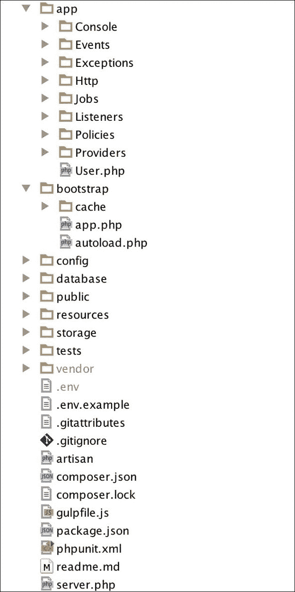
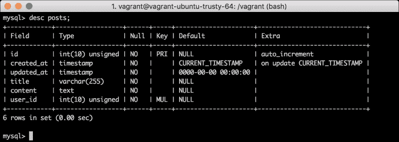
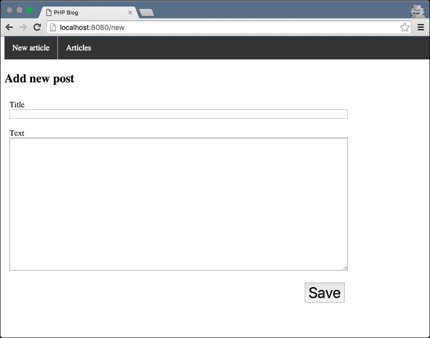
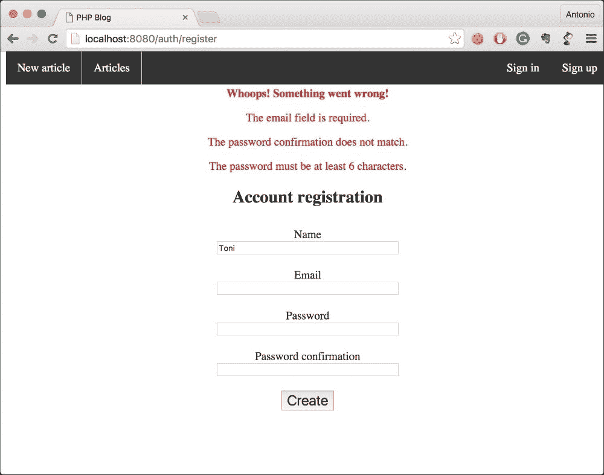
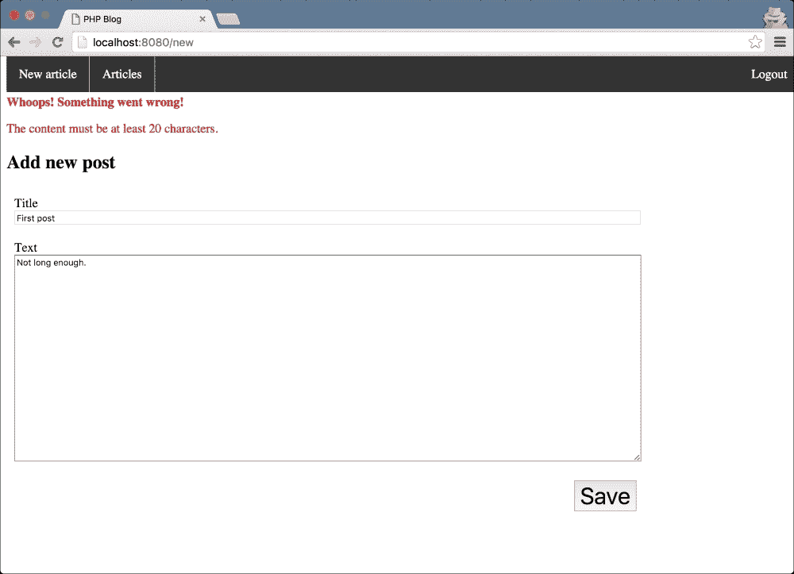
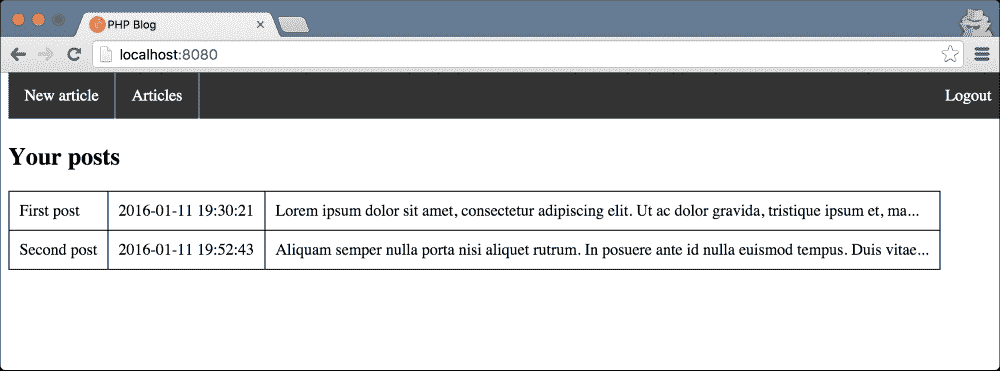
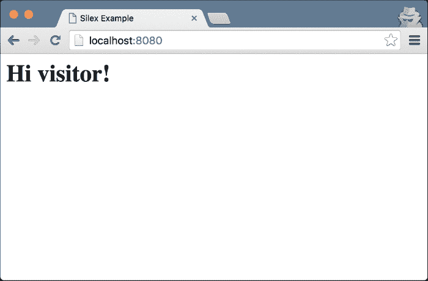
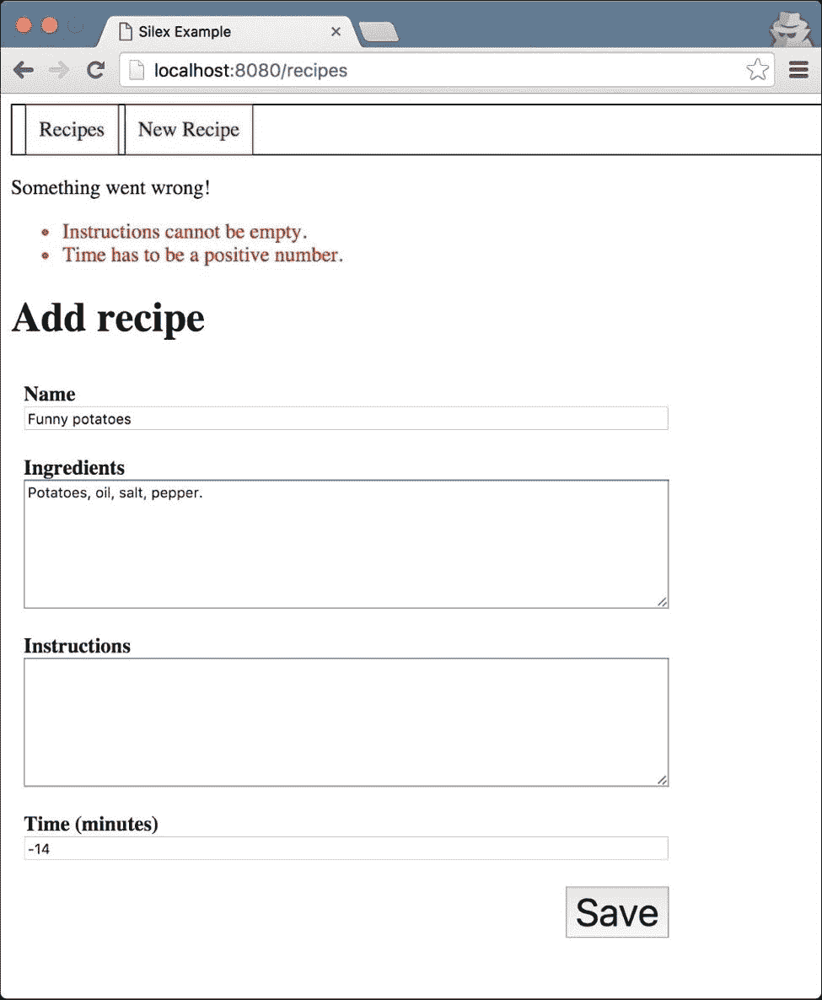

# 第八章。使用现有的 PHP 框架

就像你用 PHP 编写框架一样，其他人也在做同样的事情。人们很快意识到整个框架也是可重用的。当然，对某人是肉的人对另一个人来说是毒药，正如 IT 世界中的许多其他例子一样，大量的框架开始出现。你永远不会听说其中大多数，但其中一些框架获得了相当多的用户。

在我们编写的时候，有四到五个主要的框架是大多数 PHP 开发者所熟知的：**Symfony**和**Zend Framework**是上一代 PHP 的主要角色，但 Laravel 也在其中，为那些需要较少特性的开发者提供了一个轻量级且快速的框架。由于这本书的性质，我们将重点关注最新的框架，**Silex**和**Laravel**，因为它们足够快，可以在一章中学习——至少它们的基础是。

在本章中，你将学习以下内容：

+   框架的重要性

+   框架的其他特性

+   使用 Laravel

+   使用 Silex 编写应用程序

# 审查框架

在第六章《适应 MVC》中，我们只是简要介绍了使用 MVC 设计模式的框架概念。实际上，我们没有解释什么是框架；我们只是开发了一个非常简单的框架。如果你在寻找一个定义，这里就是：框架是你选择用来构建程序的结构。让我们更详细地讨论这个问题。

## 框架的目的

当你编写一个应用程序时，如果你使用 MVC 设计模式，你需要添加你的模型、视图和控制器，我们强烈建议你这样做。这三个元素，加上完成你视图的 JavaScript 和 CSS 文件，是使你的应用程序与其他应用程序区分开来的因素。你无法跳过编写它们。

另一方面，有一组类，尽管你需要它们来正确运行你的应用程序，但它们对所有其他应用程序都是通用的，或者至少非常相似。这些类的例子包括我们在`src/Core`目录中拥有的，比如路由器、配置读取器等等。

框架的目的明确且必要：它们为你的应用程序添加一些结构，并连接其不同元素。在我们的例子中，它帮助我们路由 HTTP 请求到正确的控制器，连接到数据库，并生成动态 HTML 作为响应。然而，必须努力实现的是框架的可重用性。如果你每次开始一个应用程序时都必须编写框架，那会好吗？

因此，为了使框架有用，它必须易于在不同的环境中重用。这意味着框架必须从源下载，并且必须易于安装。下载并安装依赖项？看来 Composer 又要派上用场了！尽管这在几年前相当不同，但现在，所有主要框架都可以使用 Composer 安装。我们将在稍后向您展示如何操作。

## 框架的主要部分

如果我们将我们的框架开源，以便其他开发者可以使用它，我们需要以直观的方式组织我们的代码。我们需要尽可能减少学习曲线；没有人愿意花几周时间来学习如何使用一个框架。

作为在 Web 应用程序中实际使用的 MVC 设计模式，大多数框架都会将模型、视图和控制器这三个层次分别放在三个不同的目录中。根据框架的不同，它们可能会位于`src/`目录下，尽管将视图放在这个目录之外是很常见的，就像我们自己的做法一样。然而，大多数框架都会给你足够的灵活性来决定每个层次放置的位置。

以前，框架中其余的类通常都放在一个单独的目录中——例如，`src/Core`。将它们与你的代码分开是很重要的，这样你就不会无意中混淆代码并修改核心类，从而搞乱整个框架。更好的是，这一代 PHP 框架通常将核心组件作为独立的模块来整合，这些模块将通过 Composer 来要求。这样做，框架的`composer.json`文件将要求所有不同的组件，如路由器、配置、数据库连接、日志记录器、模板引擎等，Composer 将在`vendor/`目录中下载它们，并通过自动生成的自动加载器使它们可用。

在不同的代码库中分离不同的组件有许多好处。首先，它允许不同的开发团队以隔离的方式使用不同的组件进行工作。由于代码足够分离，不会相互影响，因此维护它们也更容易。最后，它允许最终用户为其应用程序选择要获取哪些组件，以尝试自定义框架，排除那些未使用的重型组件。

框架要么是组织成独立的模块，要么是所有内容都在一起；然而，总是有相同的常见组件，它们是：

+   **路由器**：这是一个类，给定一个 HTTP 请求，找到正确的控制器，实例化它并执行它，然后返回 HTTP 响应。

+   **请求处理**：这包含了一些方法，允许你访问参数、cookies、headers 等。这通常由路由器使用，并发送到控制器。

+   **配置处理器**：这允许你获取正确的配置文件，读取它，并使用其内容来配置其他组件。

+   **模板引擎**：它将 HTML 与控制器中的内容合并，以便在响应中渲染模板。

+   **记录器**：它将错误或其他我们认为重要的消息添加到日志文件中。

+   **依赖注入器**：它管理你的类需要的所有依赖项。也许框架没有依赖注入器，但它有类似的东西——即服务定位器——它试图以类似的方式帮助你。

+   **编写和运行单元测试的方式**：大多数框架都包含 PHPUnit，但社区中还有更多选择。

# 框架的其他特性

尽管我们已经在上一节中描述了框架的一些特性，但大多数框架的功能远不止这些，即使这些功能已经足够构建简单的应用程序，就像你之前自己做的那样。然而，大多数 Web 应用程序还有更多常见的特性，因此框架试图为每个特性实现通用的解决方案。多亏了这一点，我们不需要在那些几乎所有中大型 Web 应用程序都需要实现的功能上重新发明轮子。我们将尝试描述一些最有用的特性，以便你在选择框架时有一个更好的想法。

## 身份验证和角色

大多数网站强制用户进行身份验证才能执行某些操作。这样做的原因是让系统知道尝试执行特定操作的用户是否有权这样做。因此，管理用户及其角色是你在所有 Web 应用程序中可能最终要实现的事情。问题是当太多的人试图攻击你的系统以获取其他用户的信息或以他人的身份执行操作时，这被称为**冒充**。正因为如此，你的身份验证和授权系统应该尽可能安全——这是一项永远都不容易的任务。

几个框架包括一种相当安全的方式来管理用户、权限和会话。大多数情况下，你可以通过配置文件来管理这些，可能是指定凭据到一个数据库，框架可以在其中添加用户数据、你自定义的角色和一些其他自定义设置。缺点是每个框架都有自己的配置方式，因此你将不得不深入研究你当前使用的框架的文档。尽管如此，这还是比你自己实现它节省更多时间。

## ORM

**对象关系映射（ORM**）是一种将数据库或任何其他数据存储中的数据转换为对象的技术。主要目标是尽可能地将业务逻辑与数据库的结构分离，并减少代码的复杂性。当使用 ORM 时，你很可能永远不会在 MySQL 中编写查询；相反，你将使用方法链。在幕后，ORM 将在每次方法调用时编写查询。

使用 ORM 既有好的一面也有不好的一面。一方面，你不必总是记住所有的 SQL 语法，只需记住正确的调用方法，如果你与一个可以自动完成方法的 IDE 一起工作，这可能会更容易。将你的代码从存储系统的类型中抽象出来也是一件好事，因为尽管这并不常见，但你可能以后想改变它。如果你使用 ORM，你可能只需要更改连接的类型，但如果你编写原始查询，你将不得不做很多工作来迁移你的代码。

使用 ORM 的潜在缺点可能是，使用方法链编写复杂的查询可能相当困难，你最终可能需要手动编写它们。你也会受到 ORM 的支配，以便加快查询的性能，而当你手动编写它们时，你可以选择在查询时更好地使用什么和如何使用。最后，面向对象编程（OOP）的纯粹主义者相当多抱怨的是，使用 ORM 会让你的代码充满大量的虚拟对象，类似于你已知的领域对象。

正如你所见，使用对象关系映射（ORM）并不总是容易的决定，但如果你选择使用它，大多数大型框架都包含一个。在你决定是否在你的应用程序中使用 ORM 时，请花些时间；如果你决定使用，请明智地选择哪一个。你可能会发现你需要一个与框架提供的 ORM 不同的 ORM。

## 缓存

书店是一个很好的例子，可以帮助描述缓存功能。它有一个数据库，每次有人列出所有书籍或请求特定一本书的详细信息时都会查询这个数据库。大多数时候，与书籍相关的信息将是相同的；唯一的变化是书籍的库存有时会变化。我们可以这样说，我们的系统有更多的读取操作而不是写入操作，其中读取意味着查询数据，写入意味着更新它。在这种类型的系统中，每次都访问数据库似乎是一种时间和资源的浪费，因为我们知道大多数时候，我们会得到相同的结果。如果我们对检索到的数据进行一些昂贵的转换，这种感觉会加剧。

**缓存层**允许应用程序在比数据库更快的存储系统中存储临时数据，通常是在内存中而不是在磁盘上。尽管缓存系统变得越来越复杂，但它们通常允许你通过键值对存储数据，就像在数组中一样。

策略不是为了节省时间和资源，而访问数据库获取我们知道与上次访问时相同的数据。实现方式可能大相径庭，但主要流程如下：

1.  你试图首次访问某些数据。我们询问缓存是否存在某个键，它不存在。

1.  你查询数据库，获取结果。在处理它——也许将其转换为你的领域对象——之后，你将结果存储在缓存中。键将与步骤 1 中使用的相同，而值将是您生成的对象/数组/JSON。

1.  你试图再次访问同一份数据。你询问缓存该键是否存在；这里，它存在，因此你根本不需要访问数据库。

这看起来很简单，但缓存的主要问题在于我们需要使某个键失效时。我们应该如何以及何时进行操作？有几个值得注意的方法：

+   你将为缓存中的键值对设置一个过期时间。在此时间过后，缓存将自动移除键值对，因此你需要再次查询数据库。尽管这个系统可能适用于某些应用程序，但对我们来说并不适用。如果库存在缓存过期之前变为 0，用户将看到他们无法借阅或购买的书。

+   数据永远不会过期，但每次我们在数据库中做出更改时，我们都会确定哪些缓存中的键受到此更改的影响，然后清除它们。这是理想的，因为数据将保留在缓存中，直到它不再有效，无论是 2 秒还是 3 周。缺点是，根据你的数据结构，确定这些键可能是一项艰巨的任务。如果你遗漏了删除其中的一些，你的缓存中将会出现损坏的数据，这非常难以调试和检测。

你可以看到缓存是一把双刃剑，所以我们建议你仅在必要时使用它，而不仅仅是因为你的框架自带它。与 ORM 一样，如果你对你框架提供的缓存系统不满意，使用另一个系统不应该很难。实际上，你的代码不应该知道你正在使用哪个缓存系统，除非在创建连接对象时。

## 国际化

英语并不是唯一的语言，你希望你的网站尽可能易于访问。根据你的目标，将你的网站翻译成其他语言也是一个好主意，但你怎么做呢？我们希望你现在没有回答：“复制粘贴所有模板并翻译它们”。这太低效了；当你在模板中做一点改动时，你需要将改动复制到每个地方。

有一些工具可以与控制器和/或模板引擎集成，以翻译字符串。你通常会为每种语言保留一个文件，在其中添加所有需要翻译的字符串及其翻译。这种格式中最常见的是 PO 文件，其中包含原始翻译的键值对映射。稍后，你将调用一个 `translate` 方法，发送原始字符串，它将根据你选择的语言返回翻译后的字符串。

在编写模板时，每次你想显示一个字符串时调用翻译可能会感到疲倦，但最终你将只有一个模板，这比任何其他选项都更容易维护。

通常，国际化与国际上使用的框架紧密相关；然而，如果你有机会使用你选择的系统，请特别注意其性能、它使用的翻译文件以及它如何管理带参数的字符串——也就是说，我们如何请求系统翻译像“Hello %s, who are you?”这样的消息，其中“%s”需要每次都注入。

# 框架的类型

现在你已经对框架能为你提供什么有了相当多的了解，你就可以决定你想使用哪种类型的框架了。为了做出这个决定，了解可用的框架类型可能会有所帮助。这种分类并不是官方的，只是我们提供的一些指导，以帮助你更容易做出选择。

## 完整且健壮的框架

这种类型的框架包含了一个完整的包。它包含了我们之前讨论的所有功能，因此它将允许你开发非常完整的应用程序。通常，这些框架允许你通过仅使用几个配置文件来轻松创建应用程序，这些配置文件定义了诸如如何连接到数据库、你需要什么类型的角色或你是否想使用缓存等内容。除此之外，你只需添加你的控制器、视图和模型，这可以为你节省大量时间。

这些框架的问题在于学习曲线。鉴于它们包含的所有功能，你需要花费相当多的时间来学习如何使用每个框架，这通常并不愉快。事实上，大多数寻找网络开发者的公司都要求你有使用他们使用的框架的经验；否则，对他们来说这将是一个糟糕的投资。

在选择这些框架时，你还应该考虑它们是否以模块化结构构建或是一个庞大的单体。在前一种情况下，你将能够选择使用哪些模块，这提供了很大的灵活性。另一方面，如果你必须使用所有这些模块，即使你并不使用所有功能，这也可能使你的应用程序变慢。

## 轻量级且灵活的框架

即使是在开发小型应用程序时，你也希望使用一个框架来节省大量时间和痛苦，但你应该避免使用大型框架，因为它们对于你真正需要的功能来说处理起来会过于复杂。在这种情况下，你应该选择一个轻量级框架，它包含非常少的功能，类似于我们在前几章中实现的那样。

这些框架的好处是，尽管你获得了基本功能，如路由，但你完全自由地实现适合你特定应用的登录系统、缓存层或国际化系统。实际上，你可以使用这个作为基础构建一个更完整的框架，然后添加所有需要的补充，使其完全定制化。

正如你所注意到的，这两种类型都有其优缺点。每次选择正确的类型将取决于你的需求、你可以投入的时间以及你对每种类型的经验。

# 知名框架概述

你已经对框架能提供什么以及有哪些类型有了很好的了解。现在，是时候回顾一些最重要的框架了，这样你就可以了解从哪里开始寻找你的下一个 PHP 网络应用程序。请注意，随着 PHP 7 的发布，将会有相当多的新或改进的 PHP 框架。尽量保持跟进！

## Symfony 2

在过去的 10 年中，Symfony 一直是开发者最喜欢的框架之一。在对其版本 2 进行自我革新之后，Symfony 进入了模块化框架的世代。实际上，发现其他项目使用 Symfony 2 组件与其他框架混合是很常见的，因为你只需在你的 Composer 文件中添加模块名称即可使用它。

你可以通过执行一个命令来使用 Symfony 2 开始应用程序。Symfony 2 为你创建所有目录、空配置文件等，一切准备就绪。你也可以从命令行添加空控制器。它们使用 Doctrine 2 作为 ORM，这可能是 PHP 现在能提供的最可靠的 ORM 之一。对于模板引擎，你会发现 Twig，这是我们框架中使用的相同工具。

通常，这是一个非常吸引人的框架，背后有一个庞大的社区提供支持；此外，许多公司也在使用它。至少检查一下模块列表总是值得的，以防你不想使用整个框架，但想利用其中的一些部分。

## Zend Framework 2

第二大 PHP 框架，至少从去年开始，就是 Zend Framework 2。与 Symfony 一样，它也已经存在很长时间了。同样，像任何其他现代框架一样，它是用面向对象的方式构建的，试图实现用于 Web 应用程序的所有良好设计模式。它由多个组件组成，您可以在其他项目中重用，例如他们知名的认证系统。它缺少一些元素，例如模板引擎——通常他们会混合 PHP 和 HTML——以及 ORM，但您可以轻松地集成您喜欢的那些。

为了发布 Zend Framework 3，目前正在进行大量工作，它将支持 PHP 7、性能改进和一些其他新组件。我们建议您密切关注；它可能是一个不错的选择。

## 其他框架

尽管 Symfony 和 Zend Framework 是两大主要玩家，但在过去的几年里，越来越多的 PHP 框架出现了，发展迅速，带来了更多有趣的功能。像 CodeIgniter、Yii、PHPCake 等名字，一旦您开始浏览 PHP 项目，就会变得熟悉起来。由于其中一些比 Symfony 和 Zend Framework 出现得晚，它们实现了一些其他框架没有的新功能，例如与 JavaScript 和 jQuery 相关的组件、与 Selenium 的 UI 测试集成等。

尽管仅仅因为您可能会从其中一个或另一个中确切地得到您需要的东西，所以多样化总是好事，但在选择框架时也要明智。社区在这里扮演着重要角色，因为如果您有任何问题，它将帮助您解决问题，或者您可以帮助随着每个新的 PHP 版本而演变的框架。

# Laravel 框架

尽管 Symfony 和 Zend Framework 已经很长时间一直是主要玩家，但在过去的几年里，第三个框架开始崭露头角，其受欢迎程度增长如此之快，以至于如今它已成为开发者最喜欢的框架。简洁、优雅的代码和高开发速度是这个“工匠框架”的杀手锏。在本节中，您将一瞥 Laravel 能做什么，并迈出创建一个非常简单的应用程序的第一步。

## 安装

Laravel 附带了一套命令行工具，这将使您的生活更加轻松。因此，建议您全局安装它，而不是按项目安装——也就是说，将 Laravel 作为您环境中的另一个程序。您仍然可以通过运行以下命令使用 Composer 来完成此操作：

```php
$ composer global require "laravel/installer"

```

此命令应将 Laravel 安装程序下载到`~/.composer/vendor`。为了能够在命令行中使用可执行文件，您需要运行类似以下命令：

```php
$ sudo ln -s ~/.composer/vendor/bin/laravel /usr/bin/laravel

```

现在，您可以使用`laravel`命令。为了确保一切顺利，只需运行以下命令：

```php
$ laravel –version

```

如果一切顺利，这将输出已安装的版本。

## 项目设置

是的，我们知道。每个教程都是从创建博客开始的。然而，我们正在构建 Web 应用程序，这是我们能够采取的添加一些价值的简单方法。那么，让我们开始吧；在你想添加应用程序的任何地方执行以下命令：

```php
$ laravel new php-blog

```

此命令将输出类似于 Composer 所做的事情，简单来说，因为它使用 Composer 来获取依赖项。几秒钟后，应用程序可能会告诉你一切安装成功，你现在可以开始了。

Laravel 创建了一个包含大量内容的新的`php-blog`目录。你应该有一个类似于以下截图所示的目录结构：



让我们设置数据库。你应该做的第一件事是使用正确的数据库凭据更新`.env`文件。更新`DB_DATABASE`值为你自己的；以下是一个示例：

```php
DB_HOST=localhost
DB_DATABASE=php_blog
DB_USERNAME=root
DB_PASSWORD=
```

你还需要创建`php_blog`数据库。只需一个命令即可完成，如下所示：

```php
$ mysql -u root -e "CREATE SCHEMA php_blog"

```

使用 Laravel，你有一个迁移系统；也就是说，你将所有的数据库模式更改保存在`database/migrations`下，这样任何使用你代码的其他人都可以快速设置他们的数据库。第一步是运行以下命令，这将为`blogs`表创建一个迁移文件：

```php
$ php artisan make:migration create_posts_table --create=posts

```

打开生成的文件，它应该类似于`database/migrations/<日期>_create_posts_table.php`。`up`方法定义了具有自增 ID 和时间戳字段的 blogs 表。我们希望添加一个标题，帖子的内容以及创建它的用户 ID。将`up`方法替换为以下内容：

```php
public function up()
{
    Schema::create('posts', function (Blueprint $table) {
 $table->increments('id');
 $table->timestamps();
 $table->string('title');
 $table->text('content');
 $table->integer('user_id')->unsigned();
 $table->foreign('user_id')
 ->references('id')->on('users');
    });
}
```

在这里，标题将是一个字符串，而内容是文本。区别在于这些字段的长度，字符串是一个简单的`VARCHAR`，而文本是一个`TEXT`数据类型。对于用户 ID，我们定义了`INT UNSIGNED`，它引用了`users`表的`id`字段。Laravel 在创建项目时已经定义了`users`表，所以你不必担心。如果你对此感兴趣，请检查`database/migrations/2014_10_12_000000_create_users_table.php`文件。你会注意到一个用户由一个 ID、一个名称、唯一的电子邮件和密码组成。

到目前为止，我们只是编写了迁移文件。为了应用它们，你需要运行以下命令：

```php
$ php artisan migrate

```

如果一切如预期进行，你现在应该有一个类似于以下内容的`blogs`表：



为了完成所有准备工作，我们需要为我们的`blogs`表创建一个模型。此模型将扩展自**Illuminate\Database\Eloquent\Model**，这是 Laravel 使用的 ORM。要自动生成此模型，请运行以下命令：

```php
$ php artisan make:model Post

```

模型的名称应该与数据库表的名称相同，但使用单数形式。运行此命令后，你可以在`app/Post.php`中找到空的模型。

## 添加第一个端点

让我们添加一个快速端点，以便了解路由的工作方式和如何将控制器与模板链接。为了避免数据库访问，让我们构建添加新帖子的视图，该视图将显示一个表单，允许用户添加带有标题和文本的新帖子。让我们先添加路由和控制器。打开 `app/Http/routes.php` 文件，并添加以下内容：

```php
Route::group(['middleware' => ['web']], function () {
 Route::get('/new', function () {
 return view('new');
 });
});
```

这三条非常简单的行表示，对于 `/new` 端点，我们希望回复 `new` 视图。稍后我们将在控制器中使事情变得复杂，但现在让我们专注于视图。

Laravel 使用 Blade 作为模板引擎而不是 Twig，但它们的工作方式非常相似。它们也可以从其他模板扩展定义布局。你的布局位置在 `resources/views/layouts`。在这个目录下创建一个 `app.blade.php` 文件，内容如下：

```php
<!DOCTYPE html>
<html lang="en">
<head>
    <title>PHP Blog</title>
 <link rel="stylesheet" href="{{ URL::asset('css/layout.css') }}" type="text/css">
 @yield('css')
</head>
<body>
<div class="navbar">
    <ul>
        <li><a href="/new">New article</a></li>
        <li><a href="/">Articles</a></li>
    </ul>
</div>
<div class="content">
@yield('content')
</div>
</body>
</html>
```

这是一个普通的布局，包含标题、一些 CSS 和在主体中的 `ul` 列表，这些列表将用作导航栏。除了应该已经熟悉的 HTML 代码之外，这里有两个重要的元素需要注意：

+   要定义一个块，Blade 使用 `@yield` 注解后跟块名称。在我们的布局中，我们定义了两个块：`css` 和 `content`。

+   有一个功能允许你在模板中构建 URL。我们想在 `public/css/layout.css` 中包含 CSS 文件，所以我们将使用 `URL::asset` 来构建这个 URL。包含 JS 文件也很有帮助。

如你所见，我们包含了 `layout.css` 文件。CSS 和 JS 文件存储在 `public` 目录下。在你的 `public/css/layout.css` 中创建它，内容如下：

```php
.content {
    position: fixed;
    top: 50px;
    width: 100%
}
.navbar ul {
    position: fixed;
    top: 0;
    width: 100%;
    list-style-type: none;
    margin: 0;
    padding: 0;
    overflow: hidden;
    background-color: #333;
}
.navbar li {
    float: left;
    border-right: 1px solid #bbb;
}
.navbar li:last-child {
    border-right: none;
}
.navbar li a {
    display: block;
    color: white;
    text-align: center;
    padding: 14px 16px;
    text-decoration: none;
}
.navbar li a:hover {
    background-color: #111;
}
```

现在，我们可以专注于我们的视图。模板存储在 `resources/views`，和布局一样，它们需要 `.blade.php` 文件扩展名。在 `resources/views/new.blade.php` 中创建你的视图，内容如下：

```php
@extends('layouts.app')

@section('css')
    <link rel="stylesheet" href="{{ URL::asset('css/new.css') }}" type="text/css">
@endsection

@section('content')
    <h2>Add new post</h2>
    <form method="post" action="/new">
        <div class="component">
            <label for="title">Title</label>
            <input type="text" name="title"/>
        </div>
        <div class="component">
            <label>Text</label>
            <textarea rows="20" name="content"></textarea>
        </div>
        <div class="component">
            <button type="submit">Save</button>
        </div>
    </form>
@endsection
```

语法非常直观。这个模板扩展自布局模板，并定义了两个部分或块：`css` 和 `content`。包含的 CSS 文件遵循与上一个相同的格式。你可以在 `public/css/new.css` 中创建它，内容类似于以下：

```php
label {
    display: block;
}
input {
    width: 80%;
}
button {
    font-size: 30px;
    float: right;
    margin-right: 20%;
}
textarea {
    width: 80%;
}
.component {
    padding: 10px;
}
```

模板的其他部分只是定义了一个指向相同 URL 的 POST 表单，包含标题和文本字段。一切准备就绪，可以在浏览器中测试它！尝试访问 `http://localhost:8080/new` 或你选择的端口号。你应该会看到以下截图类似的内容：



## 管理用户

如前所述，用户认证和授权是大多数框架包含的功能之一。Laravel 通过提供用户模型和注册认证控制器，使我们的生活变得非常简单。使用它们相当容易：你只需要添加指向已存在控制器的路由，并添加视图。让我们开始吧。

在这里你需要考虑五个路由。其中两个属于注册步骤，一个用于获取表单，另一个用于提交用户提供的表单信息。其余三个与认证部分相关：一个用于获取表单，一个用于提交表单，还有一个用于登出。这五个路由都包含在`Auth\AuthController`类中。在你的`routes.php`文件中添加以下路由：

```php
// Registration routes...
Route::get('auth/register', 'Auth\AuthController@getRegister');
Route::post('auth/register', 'Auth\AuthController@postRegister');

// Authentication routes...
Route::get('/login', 'Auth\AuthController@getLogin');
Route::post('login', 'Auth\AuthController@postLogin');
Route::get('logout', 'Auth\AuthController@getLogout');
```

注意我们是如何定义这些路由的。与之前我们创建的不同，这些路由的第二个参数是一个字符串，它包含了控制器类名和方法名的连接。这是一种更好的创建路由的方式，因为它将逻辑分离到了一个可以稍后重用和/或单元测试的不同类中。

如果你对这个控制器感兴趣，你可以浏览其代码。你将发现一个复杂的设计，其中路由将调用的函数实际上是`AuthController`类使用的两个特质的一部分：`RegistersUsers`和`AuthenticatesUsers`。检查这些方法将帮助你理解幕后发生了什么。

每个`get`路由都期望渲染一个视图。对于用户的注册，我们需要在`resources/views/auth/register.blade.php`中创建一个模板，对于登录视图，我们需要在`resources/views/auth/login.blade.php`中创建一个模板。一旦我们向正确的 URL 发送正确的 POST 参数，我们就可以添加我们认为必要的任何内容。

### 用户注册

让我们从注册表单开始；这个表单需要四个 POST 参数：姓名、电子邮件、密码和密码确认，正如路由所说明的，我们需要将其提交到`/auth/register`。模板可能看起来像以下这样：

```php
@extends('layouts.app')

@section('css')
    <link rel="stylesheet" href="{{ URL::asset('css/register.css') }}" type="text/css">
@endsection

@section('content')
    <h2>Account registration</h2>

    <form method="post" action="/auth/register">
        {{ csrf_field() }}
        <div class="component">
            <label for="name">Name</label>
 <input type="text" name="name" 
 value="{{ old('name') }}" />
        </div>
        <div class="component">
            <label>Email</label>
 <input type="email" name="email"
 value="{{ old('email') }}"/>
        </div>
        <div class="component">
            <label>Password</label>
            <input type="password" name="password" />
        </div>
        <div class="component">
            <label>Password confirmation</label>
            <input type="password" name="password_confirmation" />
        </div>
        <div class="component">
            <button type="submit">Create</button>
        </div>
    </form>
@endsection
```

这个模板与新建帖子表单非常相似：它扩展了布局，添加了一个 CSS 文件，并用表单填充了内容区域。这里的新增功能是使用`old`函数，它会在表单无效并再次显示给用户时检索之前请求提交的值。

在我们尝试之前，我们需要添加一个`register.css`文件，其中包含此表单的样式。一个简单的例子可能如下：

```php
div.content {
    text-align: center;
}
label {
    display: block;
}
input {
    width: 250px;
}
button {
    font-size: 20px;
}
.component {
    padding: 10px;
}
```

最后，我们应该编辑布局以在菜单中添加一个指向注册和登录页面的链接。这就像在`ul`标签的末尾添加以下`li`元素一样简单：

```php
<li class="right"><a href="/auth/register">Sign up</a></li>
<li class="right"><a href="/login">Sign in</a></li>
```

还需要在`layout.css`的末尾添加`right`类的样式：

```php
div.alert {
    color: red;
}
```

为了使事情更加有用，我们可以添加提交表单时出错的信息。Laravel 将错误闪存到会话中，并且可以通过`errors`模板变量访问它们。由于这是所有表单的共同点，而不仅仅是注册表单，我们可以将其添加到`app.blade.php`布局中，如下所示：

```php
<div class="content">
 @if (count($errors) > 0)
 <div class="alert">
 <strong>Whoops! Something went wrong!</strong>
 @foreach ($errors->all() as $error)
 <p>{{ $error }}</p>
 @endforeach
 </div>
 @endif
@yield('content')
```

在这段代码中，我们将使用 Blade 的`@if`条件语句和`@foreach`循环。语法与 PHP 相同；唯一的区别是`@`前缀。

现在，我们已经准备好出发了。启动您的应用程序，点击菜单右侧的注册链接。尝试提交表单，但留一些字段为空，这样我们就可以注意错误是如何显示的。结果应该类似于以下内容：



我们应该自定义的一件事是注册成功后用户将被重定向到哪个位置。在这种情况下，我们可以将他们重定向到登录页面。为了实现这一点，您需要更改`AuthController`的`$redirectTo`属性的值。到目前为止，我们只有新帖子页面，但稍后，您可以通过以下方式添加任何您想要的路径：

```php
protected $redirectPath= '/new;
```

### 用户登录

除了注册之外，用户的登录还有一些变化。我们不仅需要添加登录视图，还应该修改布局中的菜单，以便确认已认证的用户，移除注册链接，并添加一个注销链接。正如之前提到的，模板必须保存在`resources/views/auth/login.blade.php`。表单需要一个电子邮件和密码，以及可选的用于*记住我*功能的复选框。以下是一个示例：

```php
@extends('layouts.app')

@section('css')
    <link rel="stylesheet" href="{{ URL::asset('css/register.css') }}" type="text/css">
@endsection

@section('content')
    <h2>Login</h2>

    <form method="POST" action="/login">
        {!! csrf_field() !!}
        <div class="component">
            <label>Email</label>
            <input type="email" name="email"
                   value="{{ old('email') }}">
        </div>
        <div class="component">
            <label>Password</label>
            <input type="password" name="password">
        </div>
        <div class="component">
            <input class="checkbox" type="checkbox" name="remember">                
            Remember Me
        </div>
        <div class="component">
            <button type="submit">Login</button>
        </div>
    </form>
@endsection
```

布局需要稍作修改。在我们显示注册和登录用户链接的地方，现在我们需要检查是否已经有一个用户已经认证；如果是这样，我们最好显示一个注销链接。您可以通过`Auth::user()`方法从视图中获取已认证的用户。如果结果不为空，这意味着用户已成功认证。使用以下代码更改两个链接：

```php
<ul>
    <li><a href="/new">New article</a></li>
    <li><a href="/">Articles</a></li>
 @if (Auth::user() !== null)
 <li class="right">
 <a href="/logout">Logout</a>
 </li>
 @else
 <li class="right">
 <a href="/auth/register">Sign up</a>
 </li>
 <li class="right">
 <a href="/login">Sign in</a>
 </li>
 @endif
</ul>
```

### 受保护的路由

用户管理会话的最后一部分可能是最重要的。在验证用户时，主要目标之一是授权他们访问某些内容——也就是说，允许他们访问未经认证的用户无法访问的某些页面。在 Laravel 中，您可以通过仅添加`auth`中间件来定义以这种方式受保护的哪些路由。使用以下代码更新新帖子路由：

```php
Route::get('/new', ['middleware' => 'auth', function () {
    return view('new');
}]);
```

一切准备就绪！在注销后尝试访问新帖子页面；您将被自动重定向到登录页面。你能感受到框架有多强大吗？

## 在模型中设置关系

正如我们之前提到的，Laravel 附带了一个 ORM，即 Eloquent ORM，这使得处理模型变得非常容易。在我们的简单数据库中，我们为帖子定义了一个表，并且已经为用户定义了另一个表。帖子包含拥有它的用户的 ID——即`user_id`。使用表名的单数形式后跟`_id`是一个好习惯，这样 Eloquent 就会知道在哪里查找。这就是我们关于外键所做的一切。

我们还应该在模型侧提及此关系。根据关系的类型（一对一、一对多或多对多），代码会有所不同。在我们的情况下，我们有一个一对多关系，因为一个用户可以有多个帖子。在 Laravel 中，我们需要更新`Post`和`User`模型。`User`模型需要指定它有多个帖子，因此您需要添加一个`posts`方法，内容如下：

```php
public function posts() {
    return $this->hasMany('App\Post');
}
```

此方法表示用户模型有多个帖子。在`Post`中需要做的另一个更改类似：我们需要添加一个`user`方法来定义关系。该方法应类似于以下内容：

```php
public function user() {
    return $this->belongsTo('App\User');
}
```

它看起来很少，但这正是我们需要的全部配置。在下一节中，您将看到使用这两个模型保存和查询是多么容易。

## 创建复杂控制器

尽管本节标题提到了复杂控制器，但请注意，我们可以用很少的代码创建完整且强大的控制器。让我们先添加管理帖子创建的代码。这个控制器需要链接到以下路由：

```php
Route::post('/new', 'Post\PostController@createPost');
```

如您所想象，现在我们需要创建包含`createPost`方法的`Post\PostController`类。控制器应存储在`app/Http/Controllers`中，如果可以按文件夹组织，那就更好了。将以下类保存到`app/Http/Controllers/Post/PostController.php`：

```php
<?php

namespace App\Http\Controllers\Post;

use App\Http\Controllers\Controller;
use Illuminate\Http\Request;
use Illuminate\Support\Facades\Auth;
use Illuminate\Support\Facades\Validator;
use App\Post;

class PostController extends Controller {

    public function createPost(Request $request) {

    }
}
```

到目前为止，从这个类中我们可以注意到的只有两件事：

+   控制器从`App\Http\Controllers\Controller`类扩展，该类包含所有控制器的一些通用辅助函数。

+   控制器的方法定义了用户请求的`Illuminate\Http\Request`参数。此对象将包含诸如已提交的参数、cookie 等信息。这与我们在自己的应用程序中创建的类似。

在这类控制器中，我们首先需要检查提交的参数是否正确。为此，我们将使用以下代码：

```php
public function createPost(Request $request) {
 $validator = Validator::make($request->all(), [
 'title' => 'required|max:255',
 'content' => 'required|min:20',
 ]);

 if ($validator->fails()) {
 return redirect()->back()
 ->withInput()
 ->withErrors($validator);
    }
}
```

我们首先创建了一个验证器。为此，我们使用了`Validator::make`函数，并传递了两个参数：第一个参数包含请求中的所有参数，第二个参数是一个包含预期字段及其约束的数组。请注意，我们期望有两个必填字段：`title`和`content`。在这里，第一个字段最长可达 255 个字符，第二个字段至少需要 20 个字符长。

一旦创建了`validator`对象，我们可以使用`fails`方法检查用户提交的数据是否符合要求。如果它返回`true`——即验证失败——我们将使用`redirect()->back()`将用户重定向回上一页。为此调用，我们将添加两个额外的调用：`withInput`将发送提交的值以便我们可以再次显示它们，而`withErrors`将以与`AuthController`相同的方式发送错误。

在这一点上，如果帖子无效，显示之前提交的标题和文本将有助于用户。为此，使用视图中的已知`old`方法：

```php
{{--...--}}
    <input type="text" name="title" 
 value="{{ old('title') }}"/>
</div>
<div class="component">
    <label>Text</label>
    <textarea rows="20" name="content">
 {{ old('content') }}
    </textarea>
{{--...--}}
```

在这一点上，我们已经开始测试控制器在帖子不匹配所需验证时的行为。如果你遗漏了任何参数或它们的长度不正确，你将得到一个类似于以下错误页面的错误：



现在我们来添加保存帖子的逻辑，以防它是有效的。如果你还记得我们之前应用中与模型的交互，你将会很高兴地发现在这里与他们一起工作是多么容易。看看下面的内容：

```php
public function createPost(Request $request) {
    $validator = Validator::make($request->all(), [
        'title' => 'required|max:255',
        'content' => 'required|min:20',
    ]);

    if ($validator->fails()) {
        return redirect()->back()
            ->withInput()
            ->withErrors($validator);
    }

 $post = new Post();
 $post->title = $request->title;
 $post->content = $request->content;

 Auth::user()->posts()->save($post);

 return redirect('/new');
}
```

我们首先将创建一个`post`对象，设置标题和内容来自请求值。然后，给定`Auth::user()`的结果，它给我们当前认证的用户模型实例，我们将通过`posts()->save($post)`保存我们刚刚创建的帖子。如果我们想不包含用户信息保存帖子，我们可以使用`$post->save()`。实际上，就是这样。

让我们快速添加另一个端点来检索给定用户的帖子列表，这样我们就可以看看 Eloquent ORM 如何使我们轻松地获取数据。添加以下路由：

```php
Route::get('/', ['middleware' => 'auth', function () {
    $posts = Auth::user()
        ->posts()
        ->orderBy('created_at')
        ->get();
    return view('posts', ['posts' => $posts]);
}]);
```

我们检索数据的方式与我们保存数据的方式非常相似。我们需要一个模型的实例——在这个例子中，是经过身份验证的用户——然后我们将添加一系列方法调用，这些调用将内部生成要执行的查询。在这种情况下，我们将按创建日期排序请求帖子。为了向视图发送信息，我们需要传递第二个参数，它将是一个参数名称和值的数组。

将以下模板添加为`resources/views/posts.blade.php`，它将显示经过身份验证的用户作为表格的帖子列表。注意我们将在以下代码中使用`$post`对象，它是一个模型的实例：

```php
@extends('layouts.app')

@section('css')
    <link rel="stylesheet" href="{{ URL::asset('css/posts.css') }}" type="text/css">
@endsection

@section('content')
    <h2>Your posts</h2>

    <table>
    @foreach ($posts as $post)
        <tr>
 <td>{{ $post->title }}</td>
 <td>{{ $post->created_at }}</td>
 <td>{{ str_limit($post->content, 100) }}</td>
        </tr>
    @endforeach
    </table>
@endsection
```

帖子列表最终显示出来。结果应该类似于以下屏幕截图：



## 添加测试

在很短的时间内，我们创建了一个允许你从头开始注册、登录、创建和列出帖子的应用程序。我们将通过讨论如何使用 PHPUnit 测试你的 Laravel 应用程序来结束本节。

在 Laravel 中编写测试非常容易，因为它与 PHPUnit 有非常好的集成。已经有一个`phpunit.xml`文件，一个定制的`TestCase`类，定制的断言，以及许多辅助器来测试数据库。它还允许你测试路由，通过模拟 HTTP 请求而不是测试控制器来测试。我们将在测试创建新帖子时访问所有这些功能。

首先，我们需要删除`tests/ExampleTest.php`，因为它测试了主页，由于我们对其进行了修改，它将失败。不要担心；这是一个帮助开发者开始测试的示例测试，让它失败根本不是问题。

现在，我们需要创建我们的新测试。为此，我们可以手动添加文件或使用命令行并运行以下命令：

```php
$ php artisan make:test NewPostTest

```

此命令创建了一个`tests/NewPostTest.php`文件，它继承自`TestCase`。如果你打开它，你会注意到其中已经有一个虚拟测试，你也可以将其删除。无论如何，你可以运行 PHPUnit 来确保一切通过。你可以像我们之前做的那样做，如下所示：

```php
$ ./vendor/bin/phpunit

```

我们可以添加的第一个测试是尝试添加新帖子，但通过 POST 参数传递的数据无效的情况。在这种情况下，我们应该期望响应包含错误和旧数据，以便用户可以编辑它而不是重写一切。将以下测试添加到`NewPostTest`类中：

```php
<?php

class NewPostTest extends TestCase
{
    public function testWrongParams() {
        $user = factory(App\User::class)
            ->make(['email' => 'test@user.laravel']);

        $this->be($user);

        $this->call(
            'POST',
            '/new',
            ['title' => 'the title', 'content' => 'ojhkjhg']
        );

        $this->assertSessionHasErrors('content');
        $this->assertHasOldInput();
    }
}
```

在测试中，我们首先可以注意到使用工厂创建了一个`user`实例。你可以在`make`调用中传递一个包含任何你想要设置的参数的数组；否则，将使用默认值。在获取到`user`实例后，我们将将其发送到`be`方法，让 Laravel 知道我们希望该用户成为本次测试的授权用户。

一旦我们为测试设置了前提条件，我们将使用`call`辅助方法来模拟真实的 HTTP 请求。我们必须向此方法发送 HTTP 方法（在这种情况下，POST）、请求的路由，以及可选的参数。请注意，`call`方法返回响应对象，以防你需要它。

我们将发送一个标题和内容，但第二个内容不够长，因此我们预计会出现一些错误。Laravel 自带了几个定制的断言，尤其是在测试这类响应时。在这种情况下，我们可以使用其中两个：`assertSessionHasErrors`，它检查会话中是否存在任何闪存错误（特别是针对内容参数的错误），以及`assertHasOldInput`，它检查响应中是否包含旧数据以便将其显示给用户。

我们想要添加的第二个测试是用户提交有效数据的情况，以便我们可以将帖子保存到数据库中。这个测试比较复杂，因为我们需要与数据库交互，这通常不是一个愉快的体验。然而，Laravel 为我们提供了足够的工具来帮助我们完成这项任务。首先也是最重要的是让 PHPUnit 知道我们希望在每次测试中使用数据库事务。然后，我们需要将认证用户持久化到数据库中，因为帖子有一个指向它的外键。最后，我们应该断言帖子已正确保存到数据库中。将以下代码添加到`NewPostTest`类中：

```php
use DatabaseTransactions;

//...

public function testNewPost() {
    $postParams = [
        'title' => 'the title',
        'content' => 'In a place far far away.'
    ];

    $user = factory(App\User::class)
        ->make(['email' => 'test@user.laravel']);
 $user->save();

    $this->be($user);

    $this->call('POST', '/new', $postParams);

 $this->assertRedirectedTo('http://localhost/new');
 $this->seeInDatabase('posts', $postParams);
}
```

`DatabaseTransactions` 特性将使测试在开始时启动一个事务，然后在测试完成后回滚，这样我们就不会在数据库中留下测试数据。将认证用户保存到数据库也是一个简单的任务，因为工厂的结果是用户模型的一个实例，我们只需调用它的 `save` 方法。

`assertRedirectedTo` 断言将确保响应包含有效的头信息，将用户重定向到指定的 URL。更有趣的是，`seeInDatabase` 将验证在 `posts` 表中存在一个实体，这是第一个参数，具有数组中提供的数据，这是第二个参数。

有很多断言，但正如你可以注意到的，它们非常有用，将可能是一个长测试的代码减少到非常少的行数。我们建议你访问官方文档以获取完整的列表。

# Silex 微框架

在尝试了 Laravel 可以提供给你的东西之后，你很可能不想再听到关于极简微框架的消息。尽管如此，我们认为了解多个框架是好的。你可以了解不同的方法，更加灵活，每个人都会希望你在他们的团队中。

我们选择 Silex 是因为它是一个微框架，这与 Laravel 非常不同，而且它也是 Symfony 家族的一部分。通过这个 Silex 介绍，你将学习如何使用你的第二个框架，这是一个完全不同类型的框架，你将更接近了解 Symfony，它是大玩家之一。

微框架的好处是什么？嗯，它们提供了最基本的东西——也就是说，一个路由器、一个简单的依赖注入器、请求助手等等，但这就是全部了。你有足够的空间去选择和构建你真正需要的东西，包括外部库甚至你自己的库。这意味着你可以为每个不同的项目定制一个框架。实际上，Silex 提供了一系列内置的服务提供者，你可以非常容易地集成它们，从模板引擎到日志记录或安全性。

## 安装

这里没有新闻。Composer 会为你做所有的事情，就像它在 Laravel 中做的那样。在你的新项目根目录下，在命令行中执行以下命令，以便将 Silex 包含到你的 `composer.json` 文件中：

```php
$ composer require silex/silex

```

你可能需要更多的依赖项，但让我们在需要的时候再添加它们。

## 项目设置

Silex 的最重要的类是 `Silex\Application`。这个类从 **Pimple**（一个轻量级的依赖注入器）扩展而来，管理几乎所有的事情。你可以像使用数组一样使用它，因为它实现了 `ArrayAccess` 接口，或者你可以调用它的方法来添加依赖项、注册服务等等。首先要做的是在你的 `public/index.php` 文件中实例化它，如下所示：

```php
<?php

use Silex\Application;

require_once __DIR__ . '/../vendor/autoload.php';

$app = new Application();

```

### 管理配置

我们喜欢做的第一件事是加载配置。我们可以做一些非常简单的事情，比如包含一个包含 PHP 或 JSON 内容的文件，但让我们利用一个服务提供商，`ConfigServiceProvider`。让我们通过以下行使用 Composer 添加它：

```php
$ composer require igorw/config-service-provider

```

这个服务允许我们拥有多个配置文件，每个环境一个。想象一下，如果我们想要有两个环境，`prod`和`dev`，这意味着我们需要两个文件：一个在`config/prod.json`中，一个在`config/dev.json`中。`config/dev.json`文件看起来会像这样：

```php
{
  "debug": true,
  "cache": false,
  "database": {
    "user": "dev",
    "password": ""
  }
}
```

`config/prod.json`文件看起来会像这样：

```php
{
  "debug": false,
  "cache": true,
  "database ": {
    "user": "root",
    "password": "fsd98na9nc"
  }
}
```

为了在开发环境中工作，你需要通过运行以下命令来设置环境变量的正确值：

```php
export APP_ENV=dev

```

`APP_ENV`环境变量将告诉我们我们处于哪个环境。现在，是时候使用这个服务提供商了。为了通过读取当前环境的配置文件来注册它，请将以下行添加到你的`index.php`文件中：

```php
$env = getenv('APP_ENV') ?: 'prod';
$app->register(
    new Igorw\Silex\ConfigServiceProvider(
        __DIR__ . "/../config/$env.json"
    )
);
```

我们在这里做的第一件事是从环境变量中获取环境。默认情况下，我们将其设置为`prod`。然后，我们通过传递正确的配置文件路径从`$app`对象中调用`register`来添加`ConfigServiceProvider`的实例。从现在起，`$app`“数组”将包含三个条目：`debug`、`cache`和`db`，它们包含配置文件的内容。我们将能够在访问`$app`时访问它们，这将在大多数地方发生。

### 设置模板引擎

另一个方便的服务提供商是 Twig。你可能还记得，Twig 是我们自己框架中使用的模板引擎，实际上它是由开发 Symfony 和 Silex 的人开发的。你也已经知道如何使用 Composer 添加依赖项；只需运行以下命令：

```php
$ composer require twig/twig

```

为了注册服务，我们需要在我们的`public/index.php`文件中添加以下行：

```php
$app->register(
    new Silex\Provider\TwigServiceProvider(),
    ['twig.path' => __DIR__ . '/../views']
);
```

此外，创建`views/`目录，我们将稍后存储我们的模板。现在，你可以通过访问`$app['twig']`来获取`Twig_Environment`实例。

### 添加日志记录器

我们现在要注册的最后一个是日志记录器。这次，我们将使用的是**Monolog**库，你可以通过以下方式来包含它：

```php
$ composer require monolog/monolog

```

注册服务的最快方式是只提供日志文件的路径，可以按照以下方式操作：

```php
$app->register(
    new Silex\Provider\MonologServiceProvider(),
    ['monolog.logfile' => __DIR__ . '/../app.log']
);
```

如果你想要向这个服务提供商添加更多信息，比如你想要保存的日志级别、日志名称等，你可以将它们与日志文件一起添加到数组中。查看[`silex.sensiolabs.org/doc/providers/monolog.html`](http://silex.sensiolabs.org/doc/providers/monolog.html)以获取可用参数的完整列表。

就像模板引擎一样，从现在起，你可以通过访问`$app['monolog']`从`Application`对象中访问`Monolog\Logger`实例。

## 添加第一个端点

是时候看看 Silex 中的路由器是如何工作的了。我们希望为主页添加一个简单的端点。正如我们之前提到的，`$app` 实例可以管理几乎所有事情，包括路由。在 `public/index.php` 文件末尾添加以下代码：

```php
$app->get('/', function(Application $app) {
    return $app['twig']->render('home.twig');
});
```

这是一种类似于 Laravel 添加路由的方式。我们调用了 `get` 方法，因为它是一个 GET 端点，我们传递了路由字符串和 `Application` 实例。正如我们在这里提到的，`$app` 也是一个依赖注入器——实际上，它扩展自一个：Pimple——因此您几乎可以在任何地方看到 `Application` 实例。匿名函数的结果将是我们将发送给用户的响应——在这种情况下，是一个渲染的 Twig 模板。

目前，这还不能解决问题。为了让 Silex 知道您已经完成了应用程序的设置，您需要在 `public/index.php` 文件的最后调用 `run` 方法。请记住，如果您需要在此文件中添加其他内容，它必须在此行之前：

```php
$app->run();
```

您已经使用过 Twig，所以我们不会在这方面花费太多时间。首先需要添加的是 `views/home.twig` 模板：

```php



    <h1>Hi visitor!</h1>

```

现在，正如您可能已经猜到的，我们将添加 `views/layout.twig` 模板，如下所示：

```php
<html>
<head>
    <title>Silex Example</title>
</head>
<body>


</body>
</html>
```

尝试访问您应用程序的主页；您应该得到以下结果：



## 访问数据库

对于本节，我们将编写一个端点来为我们的菜谱创建菜谱。按照以下顺序运行以下 MySQL 查询以设置 `cookbook` 数据库并创建空的 `recipes` 表：

```php
mysql> CREATE SCHEMA cookbook;
Query OK, 1 row affected (0.00 sec)
mysql> USE cookbook;
Database changed
mysql> CREATE TABLE recipes(
 -> id INT UNSIGNED NOT NULL AUTO_INCREMENT PRIMARY KEY,
 -> name VARCHAR(255) NOT NULL,
 -> ingredients TEXT NOT NULL,
 -> instructions TEXT NOT NULL,
 -> time INT UNSIGNED NOT NULL);
Query OK, 0 rows affected (0.01 sec)

```

Silex 没有提供任何 ORM 集成，因此您需要手动编写 SQL 查询。然而，有一个 Doctrine 服务提供者，它提供了一个比 PDO 更简单的接口，所以让我们尝试将其集成。要安装此服务，请运行以下命令：

```php
$ composer require "doctrine/dbal:~2.2"

```

现在，我们已经准备好注册服务提供者。与其他服务一样，在路由定义之前将以下代码添加到您的 `public/index.php` 文件中：

```php
$app->register(new Silex\Provider\DoctrineServiceProvider(), [
    'dbs.options' => [
        [
            'driver'    => 'pdo_mysql',
            'host'      => '127.0.0.1',
            'dbname'    => 'cookbook',
            'user'      => $app['database']['user'],
            'password'  => $app['database']['password']
        ]
    ]
]);
```

在注册时，您需要提供数据库连接的选项。其中一些选项将与环境无关，例如驱动程序或甚至主机，但一些选项将来自配置文件，例如 `$app['database']['user']`。从现在开始，您可以通过 `$app['db']` 访问数据库连接。

数据库设置完成后，让我们添加允许我们添加和检索菜谱的路由。与 Laravel 一样，您可以指定匿名函数，就像我们已经做的那样，或者一个控制器和要执行的方法。用以下三个路由替换当前的路由：

```php
$app->get(
    '/',
    'CookBook\\Controllers\\RecipesController::getAll'
);
$app->post(
    '/recipes',
    'CookBook\\Controllers\\RecipesController::create'
);
$app->get(
    '/recipes',
    'CookBook\\Controllers\\RecipesController::getNewForm'
);
```

如您所观察到的，将会有一个新的控制器，`CookBook\Controllers\RecipesController`，它将被放置在 `src/Controllers/RecipesController.php` 中。这意味着您需要更改 Composer 中的自动加载器。使用以下内容编辑您的 `composer.json` 文件：

```php
"autoload": {
    "psr-4": {"CookBook\\": "src/"}
}
```

现在，让我们添加控制器类，如下所示：

```php
<?php

namespace CookBook\Controllers;

class Recipes {

}
```

我们将添加的第一个方法是`getNewForm`方法，它将只渲染添加新食谱的页面。这个方法看起来类似这样：

```php
public function getNewForm(Application $app): string {
    return $app['twig']->render('new_recipe.twig');
}
```

这个方法将只渲染`new_recipe.twig`模板。这个模板的一个例子可能如下所示：

```php



    <h1>Add recipe</h1>
    <form method="post">
        <div>
            <label for="name">Name</label>
            <input type="text" name="name"
                   value="{{ name is defined ? name : "" }}" />
        </div>
        <div>
            <label for="ingredients">Ingredients</label>
            <textarea name="ingredients">
                {{ ingredients is defined ? ingredients : "" }}
            </textarea>
        </div>
        <div>
            <label for="instructions">Instructions</label>
            <textarea name="instructions">
                {{ instructions is defined ? instructions : "" }}
            </textarea>
        </div>
        <div>
            <label for="time">Time (minutes)</label>
            <input type="number" name="time"
                   value="{{ time is defined ? time : "" }}" />
        </div>
        <div>
            <button type="submit">Save</button>
        </div>
    </form>

```

这个模板发送菜名、配料、说明以及准备这道菜所需的时间。获取这个表单的端点需要获取响应对象以提取这些信息。同样，我们可以通过在方法定义中指定它来获取`Application`实例作为参数，我们也可以获取`Request`实例。访问 POST 参数就像通过发送参数名称调用`get`方法一样简单，或者调用`$request->request->all()`以获取所有参数作为数组。添加以下方法，该方法检查所有数据是否有效，如果无效则重新渲染表单，并发送提交的数据和错误：

```php
public function create(Application $app, Request $request): string {
    $params = $request->request->all();
    $errors = [];

    if (empty($params['name'])) {
        $errors[] = 'Name cannot be empty.';
    }
    if (empty($params['ingredients'])) {
        $errors[] = 'Ingredients cannot be empty.';
    }
    if (empty($params['instructions'])) {
        $errors[] = 'Instructions cannot be empty.';
    }
    if ($params['time'] <= 0) {
        $errors[] = 'Time has to be a positive number.';
    }

    if (!empty($errors)) {
        $params = array_merge($params, ['errors' => $errors]);
        return $app['twig']->render('new_recipe.twig', $params);
    }
}
```

`layout.twig`模板也需要进行编辑，以便显示返回的错误。我们可以通过执行以下操作来完成：

```php
{# ... #}

    <p>Something went wrong!</p>
    <ul>
    
        <li>{{ error }}</li>
    
    </ul>


{# ... #}
```

到目前为止，你已经开始尝试访问`http://localhost/recipes`，填写表单时留一些空白，提交，然后得到带有错误的表单。它应该看起来类似这样（带有一些额外的 CSS 样式）：



控制器的后续部分应该允许我们将正确数据作为新食谱存储到数据库中。为此，创建一个单独的类，例如`CookBook\Models\RecipeModel`，会是一个好主意；然而，为了加快速度，让我们将以下几行代码添加到控制器中。记住，我们有 Doctrine 服务提供者，所以没有必要直接使用 PDO：

```php
$sql = 'INSERT INTO recipes (name, ingredients, instructions, time) '
    . 'VALUES(:name, :ingredients, :instructions, :time)';
$result = $app['db']->executeUpdate($sql, $params);

if (!$result) {
    $params = array_merge($params, ['errors' => $errors]);
    return $app['twig']->render('new_recipe.twig', $params);
}

return $app['twig']->render('home.twig');
```

Doctrine 在获取数据时也很有帮助。要看到它的工作，请检查第三个也是最后一个方法，我们将从中获取所有食谱以供用户查看：

```php
public function getAll(Application $app): string {
 $recipes = $app['db']->fetchAll('SELECT * FROM recipes');
    return $app['twig']->render(
        'home.twig',
        ['recipes' => $recipes]
    );
}
```

只用一行代码，我们就执行了一个查询。它没有 Laravel 的 Eloquent ORM 那么干净，但至少比使用原始 PDO 要简洁得多。最后，你可以使用以下内容更新你的`home.twig`模板，以便显示我们从数据库中检索到的食谱：

```php



    <h1>Hi visitor!</h1>
    <p>Check our recipes!</p>
    <table>
        <th>Name</th>
        <th>Time</th>
        <th>Ingredients</th>
        <th>Instructions</th>
    
        <tr>
            <td>{{ recipe.name }}</td>
            <td>{{ recipe.time }}</td>
            <td>{{ recipe.ingredients }}</td>
            <td>{{ recipe.instructions }}</td>
        </tr>
    
    </table>

```

# Silex 与 Laravel 对比

尽管我们在本章开始之前做了一些类似的比较，但现在是我们回顾我们说过的话，并将其与你自己注意到的进行比较的时候了。Laravel 属于那种允许你用很少的工作就能创造出伟大事物的框架类型。它包含了作为网络开发者你将需要的所有组件。它之所以能如此迅速地成为年度最受欢迎的框架，肯定有一些很好的理由！

另一方面，Silex 是一个微框架，它本身几乎不做任何事情。它只是你可以构建所需框架的骨架。它已经提供了很多服务提供者，我们甚至没有讨论到一半；我们建议你访问[`silex.sensiolabs.org/doc/providers.html`](http://silex.sensiolabs.org/doc/providers.html)以获取完整列表。然而，如果你愿意，你总是可以用 Composer 添加其他依赖并使用它们。如果你出于某种原因不再喜欢你所使用的 ORM 或模板引擎，或者社区中出现了一个新的、更好的版本，切换它们应该很容易。另一方面，当与 Laravel 一起工作时，你可能会坚持使用它自带的功能。

每个框架都有其适用的场合，我们鼓励你保持开放的心态，接受所有可能的选择，保持最新，并时不时地探索新的框架或技术。

# 摘要

在本章中，你了解到了解一些最重要的框架是多么重要。你还学习了两个著名框架的基础：Laravel 和 Silex。现在，你准备好使用你的框架，或者为你的下一个应用使用这两个框架。有了这些，你也有能力轻松地理解任何其他类似的框架。

在下一章中，我们将学习什么是 REST API 以及如何使用 Laravel 编写一个。这将扩展你的技能集，并在你需要决定在设计和应用编写时采取哪种方法时提供更多灵活性。
