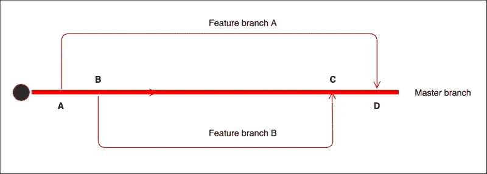
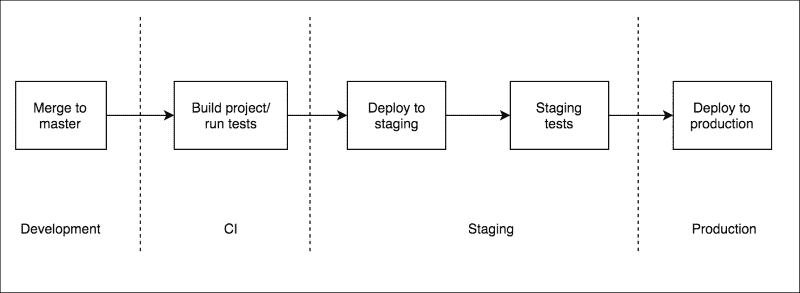
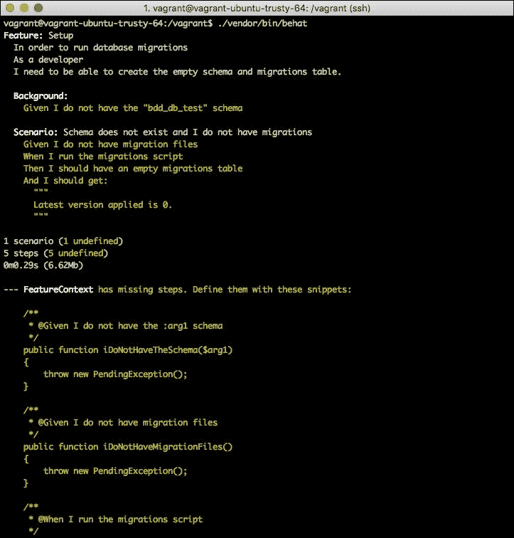
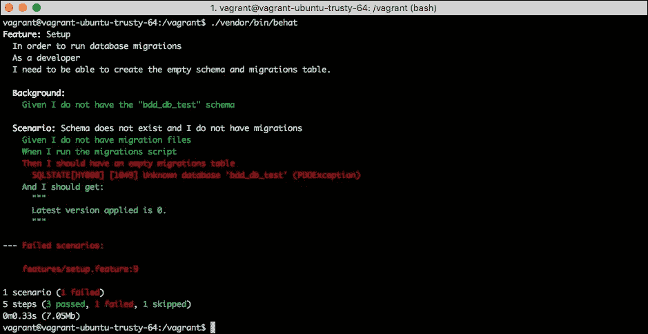
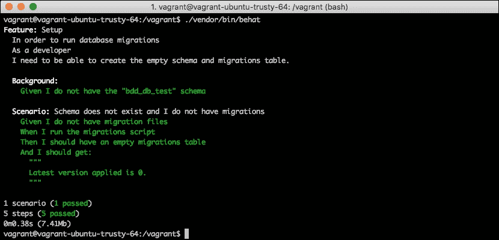

# 第十章. 行为测试

在第七章中，*测试网络应用*，你学习了如何编写单元测试以独立方式测试代码的小片段。尽管这是必须的，但仅靠它并不能确保你的应用按预期工作。你的测试范围可能非常小，即使你测试的算法是有意义的，它也可能不是业务要求你创建的内容。

为了给业务方面增加这一级别的安全性，接受测试应运而生，以补充已经存在的单元测试。同样，BDD（行为驱动开发）起源于 TDD（测试驱动开发），目的是基于这些接受测试编写代码，试图让业务和经理们参与到开发过程中。由于 PHP 是网络开发者的最爱之一，因此找到强大的工具来实现 BDD 项目是顺理成章的。你将会对**Behat**和**Mink**这两个目前最受欢迎的 BDD 框架所能做到的事情感到惊喜。

在本章中，你将了解：

+   接受测试和 BDD

+   使用 Gherkin 编写特性

+   使用 Behat 实现和运行测试

+   使用 Mink 针对浏览器编写测试

# 行为驱动开发

我们已经在第七章中，*测试网络应用*，介绍了我们可以用来使我们的应用无 bug 的工具，例如自动化测试。我们描述了单元测试是什么以及它们如何帮助我们实现目标，但这远远不够。在本节中，我们将描述创建真实世界应用的过程，单元测试为何不足，以及我们可以在这一生命周期中包含哪些其他技术来成功完成任务——在这种情况下，行为测试。

## 介绍持续集成

自己开发一个小型网络应用和成为由开发者、经理、市场营销人员等组成的大团队的一员，共同围绕同一个大型网络应用工作，这两者之间存在着巨大的差异。为成千上万的或数百万用户使用的应用工作具有明显的风险：如果你搞砸了，会有大量的不满意的受影响用户，这可能导致销售额下降、合作伙伴关系终止等。

从这个场景中，你可以想象，当人们不得不在生产环境中进行任何更改时，他们会感到害怕。在这样做之前，他们会确保一切运行得非常完美。因此，所有影响生产中网络应用的变化都伴随着一个繁重的过程，包括大量的各种测试。

有些人认为，通过减少他们部署到生产环境的次数，可以降低失败的风险，最终导致他们每隔几个月发布一次，其中包含无数的变化。

现在，想象一下一次性发布两三个月的代码更改结果，但在生产中神秘地失败了：你知道从哪里开始寻找问题的原因吗？如果你的团队能够做出完美的发布，但最终结果并不是市场需要的，你可能会浪费几个月的工作！

尽管有不同方法，并不是所有公司都使用它们，但让我们尝试描述过去几年中最著名的一种：**持续集成**（**CI**）。这个想法是经常集成小块工作，而不是偶尔集成大块工作。当然，发布仍然是系统中的约束，这意味着它需要大量的时间和资源。CI 试图尽可能自动化这个过程，减少你需要投入的时间和资源。这种方法有很多好处，如下所述：

+   发布并不需要很长时间，而且没有整个团队专注于发布，因为这是自动完成的。

+   你可以逐个发布更改。如果有什么失败，你知道确切的变化是什么以及从哪里开始查找错误。如果你需要，甚至可以轻松地撤销更改。

+   由于你发布得如此频繁，你可以从每个人那里快速获得反馈。如果你需要，你可以及时更改你的计划，而不是等待几个月才能获得任何反馈，浪费你在这个发布上所付出的所有努力。

这个想法看起来很完美，但我们如何实施它呢？首先，让我们关注这个过程的手动部分：使用**版本控制系统**（**VCS**）开发功能。以下图表展示了一种非常常见的方法：



如我们之前提到的，版本控制系统（VCS）允许开发者对同一代码库进行工作，跟踪每个人所做的所有更改，并帮助解决冲突。VCS 通常允许你拥有不同的分支；也就是说，你可以从主开发线分叉出来，继续工作而不会干扰它。之前的图表展示了如何使用分支来编写新功能，可以解释如下：

+   **A**：一个团队需要开始工作在功能 A 上。他们从 master 创建一个新的分支，在这个分支中，他们将添加这个功能的全部更改。

+   **B**：另一个团队也需要开始工作在一个功能上。他们从 master 创建一个新的分支，就像之前一样。此时，他们并没有意识到第一个团队正在做什么，因为他们是在自己的分支上做的。

+   **C**：第二个团队完成了他们的工作。没有其他人更改 master，所以他们可以立即合并他们的更改。此时，CI 过程将启动发布过程。

+   **D**: 第一个团队完成了功能。为了将其合并到主分支，他们需要首先将他们的分支与主分支的新更改进行 rebase，并解决可能出现的任何冲突。分支越老，你遇到冲突的机会就越大，所以你可以想象，更小、更快的功能更受欢迎。

现在，让我们看看这个过程自动化的部分是如何的。以下图表显示了从合并到主分支到生产部署的所有步骤：



在你将代码合并到主分支之前，你处于开发环境。CI 工具将监听你项目主分支上的所有更改，并对每个更改触发一个作业。这个作业将负责在必要时构建项目，然后运行所有测试。如果有任何错误或测试失败，它将通知每个人，触发此作业的团队应该负责修复它。此时，主分支被认为是不可靠的。

如果所有测试都通过，CI 工具将部署你的代码到预发布环境。预发布环境尽可能地模拟生产环境；也就是说，它有相同的服务器配置、数据库结构等等。一旦应用程序在这里，你就可以运行所有需要的测试，直到你确信可以继续部署到生产环境。随着你进行小的更改，你不需要手动测试所有内容。相反，你可以测试你的更改和应用程序的主要用例。

## 单元测试与验收测试

我们说过，CI 的目标是尽可能自动化流程。然而，我们仍然需要在预发布环境中手动测试应用程序，对吧？验收测试来拯救！

编写单元测试很好，也是必须的，但它们只是以隔离的方式测试代码的小部分。即使你的整个单元测试套件都通过了，你也不能确定你的应用程序是否真的工作，因为你可能没有正确地整合所有部分，因为你缺少功能，或者你构建的功能并不是业务需要的。验收测试测试特定用例的整个流程。

如果你的应用程序是一个网站，验收测试可能会启动一个浏览器并模拟用户操作，例如点击和输入，以断言页面返回预期的结果。是的，从几行代码中，你可以以自动化的方式执行之前手动进行的所有测试。

现在，假设你为应用程序的所有功能编写了验收测试。一旦代码进入预发布环境，CI 工具可以自动运行所有这些测试，并确保新代码不会破坏任何现有功能。你甚至可以使用你需要的任何数量的不同浏览器来运行它们，以确保你的应用程序在所有浏览器中都能正常工作。如果测试失败，CI 工具将通知负责的团队，他们必须修复它。如果所有测试都通过，CI 工具可以自动将你的代码部署到生产环境。

如果验收测试测试的是业务真正关心的内容，那么我们为什么还需要编写单元测试呢？保持验收测试和单元测试都有几个原因；实际上，你应该有比验收测试多得多的单元测试。

+   单元测试检查代码的小片段，这使得它们比验收测试快几个数量级，验收测试是对浏览器进行整个流程的测试。这意味着你可以用几秒钟或几分钟的时间运行所有的单元测试，但运行所有的验收测试将需要更长的时间。

+   编写覆盖所有可能用例组合的验收测试几乎是不可能的。编写覆盖特定方法或代码片段的高比例用例的单元测试相对容易。你应该有大量的单元测试，尽可能多地测试边缘情况，但只有一些验收测试测试主要用例。

那么何时应该运行每种类型的测试呢？由于单元测试运行速度更快，它们应该在部署的第一阶段执行。只有当我们知道它们都通过后，我们才愿意花费时间部署到预发布环境并运行验收测试。

## TDD 与 BDD

在第七章《测试 Web 应用程序》中，你学习了 TDD 或测试驱动开发是首先编写单元测试然后编写代码的实践，目的是编写可测试和更干净的代码，并确保你的测试套件始终保持最新。随着验收测试的出现，TDD 演变为 BDD 或行为驱动开发。

BDD 与 TDD 非常相似，因为你应该先编写测试，然后编写使这些测试通过的代码。唯一的区别是，在 BDD 中，我们编写指定代码期望行为的测试，这些测试可以转化为验收测试。尽管这始终取决于具体情况，但你应该编写测试验收测试，测试应用程序的非常具体的一部分，而不是包含多个步骤的长用例。与 TDD 一样，使用 BDD，你希望得到快速的反馈，如果你编写了一个广泛的测试，你将不得不编写大量的代码才能使其通过，这不是 BDD 想要实现的目标。

## 编写业务测试

验收测试和 BDD 的整个目的是确保您的应用程序按预期工作，而不仅仅是您的代码。因此，验收测试不应由开发者编写，而应由业务本身编写。当然，您不能期望经理和主管学习如何编码以创建验收测试，但有一系列工具允许您将简单的英语指令或**行为规范**转换为验收测试的代码。当然，这些指令必须遵循某些模式。行为规范有以下部分：

+   一个标题，简要但非常清晰地描述了行为规范覆盖的用例。

+   一个叙事，它具体说明了谁执行测试，业务价值是什么，以及预期的结果是什么。通常叙事的格式如下：

    ```php
    In order to <business value>
    As a <stakeholder>
    I want to <expected outcome>
    ```

+   一组场景，它描述了我们想要覆盖的每个特定用例的描述和步骤。每个场景都有一个描述和一系列在 `Given`-`When`-`Then` 格式下的指令；我们将在下一节中对此进行更多讨论。一个常见的模式是：

    ```php
    Scenario: <short description>
    Given <set up scenario>
    When <steps to take>
    Then <expected outcome>
    ```

在接下来的两个部分中，我们将发现两个 PHP 工具，您可以使用它们来理解行为场景并将它们作为验收测试运行。

# 使用 Behat 进行 BDD

我们将要介绍的第一款工具是 Behat。Behat 是一个 PHP 框架，可以将行为场景转换为验收测试，然后运行它们，提供类似于 PHPUnit 的反馈。其理念是将每个步骤在英语中与执行某些操作或断言某些结果的 PHP 函数中的场景相匹配。

在本节中，我们将尝试为我们应用程序添加一些验收测试。该应用程序将是一个简单的数据库迁移脚本，它将允许我们跟踪我们将添加到我们的模式中的更改。想法是每次您想要更改数据库时，您都会在迁移文件上编写更改，然后执行脚本。应用程序将检查最后一次执行的迁移是什么，并将执行新的迁移。我们将首先编写验收测试，然后按照 BDD 的建议逐步引入代码。

为了在您的开发环境中安装 Behat，您可以使用 Composer。命令如下：

```php
$ composer require behat/behat

```

Behat 实际上并不附带任何一组断言函数，因此您必须通过编写条件语句和抛出异常来实现自己的函数，或者您可以集成任何提供这些函数的库。开发者通常选择 PHPUnit 来完成这项工作，因为他们已经习惯了它的断言。然后，您可以通过以下方式将其添加到项目中：

```php
$ composer require phpunit/phpunit

```

与 PHPUnit 类似，Behat 需要知道你的测试套件位于何处。你可以有一个配置文件来声明这一点和其他配置选项，这与 PHPUnit 的 `phpunit.xml` 配置文件类似，或者你可以遵循 Behat 设置的约定并跳过配置步骤。如果你选择第二个选项，你可以使用以下命令让 Behat 为你创建文件夹结构和 PHP `test` 类：

```php
$ ./vendor/bin/behat --init

```

运行此命令后，你应该有一个 `features/bootstrap/FeatureContext.php` 文件，这是你需要添加 PHP 函数匹配场景步骤的地方。关于这一点，我们稍后会详细说明，但首先，让我们了解一下如何编写行为规范，以便 Behat 能够理解它们。

## 介绍 Gherkin 语言

Gherkin 是行为规范必须遵循的语言，或者更准确地说，是格式。使用 Gherkin 命名，每个行为规范都是一个 **特性**。每个特性都添加到 `features` 目录中，并且应该有 `.feature` 扩展名。特性文件应该以 `Feature` 关键字开头，后面跟着标题和叙述，格式与我们之前提到的相同——即 *为了（In order to）–作为（As a）–我需要（I need to）* 结构。实际上，Gherkin 只会打印这些行，但保持一致性将有助于你的开发者和业务人员了解他们试图实现的目标。

我们的应用程序将有两个特性：一个用于设置我们的数据库，以便迁移工具能够工作；另一个用于向数据库添加迁移时的正确行为。将以下内容添加到 `features/setup.feature` 文件中：

```php
Feature: Setup
  In order to run database migrations
  As a developer
  I need to be able to create the empty schema and migrations table.
```

然后，将以下特性定义添加到 `features/migrations.feature` 文件中：

```php
Feature: Migrations
  In order to add changes to my database schema
  As a developer
  I need to be able to run the migrations script
```

## 定义场景

特性的标题和叙述实际上并没有做更多的事情，只是向运行测试的人提供信息。真正的工作是在场景中完成的，场景是一组特定的用例，包含一系列要执行的步骤和一些断言。只要它们代表同一特性的不同用例，你就可以在每个特性文件中添加任意多的场景。例如，对于 `setup.feature`，我们可以添加几个场景：一个场景是用户第一次运行脚本，因此应用程序需要设置数据库；另一个场景是用户之前已经执行过脚本，因此应用程序不需要经过设置过程。

由于 Behat 需要将用纯英语编写的场景转换为 PHP 函数，你将不得不遵循一些约定。实际上，你会发现它们与我们已经在行为规范部分提到的是非常相似的。

### 编写 Given-When-Then 测试用例

一个场景必须以 `Scenario` 关键词开始，后面跟着对该场景覆盖的用例的简要描述。然后，你需要添加步骤和断言的列表。Gherkin 允许你使用四个关键词来完成这个任务：`Given`、`When`、`Then` 和 `And`。实际上，当涉及到代码时，它们都有相同的意义，但它们为你的场景添加了很多语义价值。让我们考虑一个例子；在你的 `setup.feature` 文件末尾添加以下场景：

```php
Scenario: Schema does not exist and I do not have migrations
  Given I do not have the "bdd_db_test" schema
  And I do not have migration files
  When I run the migrations script
  Then I should have an empty migrations table
  And I should get:
    """
    Latest version applied is 0.
    """
```

这个场景测试当我们没有任何模式信息并运行迁移脚本时会发生什么。首先，它描述了场景的状态：*Given 我没有 bdd_db_test 模式 And 我没有迁移文件*。这两行将翻译成每个方法，将删除模式和所有迁移文件。然后，场景描述了用户将执行的操作：*When 我运行迁移脚本*。最后，我们为这个场景设定期望：*Then 我应该有一个空的迁移表 And 我应该得到已应用最新版本是 0.*。

通常情况下，相同的步骤总是以相同的关键词开始——也就是说，*我运行迁移脚本* 总是以 `When` 为前缀。`And` 关键词是一个特殊的词，因为它匹配所有三个关键词；它的唯一目的是使步骤尽可能英语友好；尽管如此，如果你愿意，你也可以写 *Given 我没有迁移文件*。

在这个例子中，还有一个需要注意的事项是使用参数作为步骤的一部分。*And 我应该得到* 这一行后面跟着一个由 `"""` 包围的字符串。PHP 函数将获取这个字符串作为参数，因此你可以使用一个独特的步骤定义——即函数——来应对各种情况，只需使用不同的字符串即可。

### 重复使用场景的部分

对于一个特定的特性，你通常总是从同一个场景开始的情况很常见。例如，`setup.feature` 有一个场景，我们可以运行迁移脚本而没有任何迁移文件，但我们还会添加另一个场景，我们想要运行迁移脚本并带有一些迁移文件，以确保它会应用所有这些文件。这两个场景有一个共同点：它们都没有设置数据库。

Gherkin 允许你定义一些步骤，这些步骤将应用于该特性的所有场景。你可以使用 `Background` 关键词和一系列步骤，通常是 `Given`。在 `feature` 叙述和 `scenario` 定义之间添加这两行：

```php
Background:
  Given I do not have the "bdd_db_test" schema
```

现在，你可以从现有的场景中移除第一个步骤，因为 `Background` 会处理它。

## 编写步骤定义

到目前为止，我们使用 Gherkin 语言编写了特性，但我们还没有考虑每个场景中的任何步骤是如何翻译成实际代码的。最容易的方法是让 Behat 运行验收测试；由于步骤尚未定义，Behat 会打印出你需要添加到`FeatureContext`类中的所有函数。要运行测试，只需执行以下命令：

```php
$ ./vendor/bin/behat

```

以下截图显示了如果你没有步骤定义应该得到的输出：



正如你所注意到的，Behat 抱怨了一些缺失的步骤，然后以黄色打印出你可以用来实现它们的方法。将它们复制并粘贴到你的自动生成的`features/bootstrap/FeatureContext.php`文件中。以下`FeatureContext`类已经实现了所有这些：

```php
<?php

use Behat\Behat\Context\Context;
use Behat\Behat\Context\SnippetAcceptingContext;
use Behat\Gherkin\Node\PyStringNode;

require_once __DIR__ . '/../../vendor/phpunit/phpunit/src/Framework/Assert/Functions.php';

class FeatureContext implements Context, SnippetAcceptingContext
{
    private $db;
    private $config;
    private $output;

    public function __construct() {
        $configFileContent = file_get_contents(
            __DIR__ . '/../../config/app.json'
        );
        $this->config = json_decode($configFileContent, true);
    }

    private function getDb(): PDO {
        if ($this->db === null) {
            $this->db = new PDO(
                "mysql:host={$this->config['host']}; "
                    . "dbname=bdd_db_test",
                $this->config['user'],
                $this->config['password']
            );
        }

        return $this->db;
    }

    /**
     * @Given I do not have the "bdd_db_test" schema
     */
    public function iDoNotHaveTheSchema()
    {
        $this->executeQuery('DROP SCHEMA IF EXISTS bdd_db_test');
    }

    /**
     * @Given I do not have migration files
     */
    public function iDoNotHaveMigrationFiles()
    {
        exec('rm db/migrations/*.sql > /dev/null 2>&1');
    }

    /**
     * @When I run the migrations script
     */
    public function iRunTheMigrationsScript()
    {
        exec('php migrate.php', $this->output);
    }

    /**
     * @Then I should have an empty migrations table
     */
    public function iShouldHaveAnEmptyMigrationsTable()
    {
        $migrations = $this->getDb()
            ->query('SELECT * FROM migrations')
            ->fetch();
        assertEmpty($migrations);
    }

    private function executeQuery(string $query)
    {
        $removeSchemaCommand = sprintf(
            'mysql -u %s %s -h %s -e "%s"',
            $this->config['user'],
            empty($this->config['password'])
                ? '' : "-p{$this->config['password']}",
            $this->config['host'],
            $query
        );

        exec($removeSchemaCommand);
    }
}
```

正如你所注意到的，我们从`config/app.json`文件中读取了配置。这是应用程序将使用的相同配置文件，它包含数据库的凭据。我们还实例化了一个`PDO`对象来访问数据库，以便我们可以添加或删除表，或者查看脚本做了什么。

步骤定义是一组带有注释的方法。这个注释是一个注解，因为它以`@`开头，基本上是一个与在特性中定义的纯英文步骤匹配的正则表达式。每个步骤都有自己的实现：要么删除数据库或迁移文件，要么执行迁移脚本，或者检查迁移表的内容。

### 步骤参数化

在前面的`FeatureContext`类中，我们故意遗漏了`iShouldGet`方法。正如你可能记得的，这个步骤有一个以`"""`包围的字符串参数。这个方法的实现如下所示：

```php
/**
 * @Then I should get:
 */
public function iShouldGet(PyStringNode $string)
{
    assertEquals(implode("\n", $this->output), $string);
}
```

注意正则表达式不包含字符串。这发生在使用`"""`的长字符串时。此外，参数是一个`PyStringNode`实例，它比普通字符串复杂一些。然而，不用担心；当你与字符串比较时，PHP 会寻找`__toString`方法，它只是打印字符串的内容。

## 运行特性测试

在前面的章节中，我们使用 Behat 编写了验收测试，但我们还没有写一行代码。在运行它们之前，请添加`config/app.json`配置文件，包含你的数据库用户的凭据，以便`FeatureContext`构造函数可以找到它，如下所示：

```php
{
  "host": "127.0.0.1",
  "schema": "bdd_db_test",
  "user": "root",
  "password": ""
}
```

现在，让我们运行验收测试，预期它们会失败；否则，我们的测试将完全无效。输出应该类似于以下内容：



如预期的那样，`Then`步骤失败了。让我们实现必要的最小代码，以便使测试通过。首先，将自动加载器添加到你的`composer.json`文件中，并运行`composer update`：

```php
"autoload": {
    "psr-4": {
        "Migrations\\": "src/"
    }
}
```

我们希望实现一个包含设置数据库、运行迁移等必要辅助函数的`Schema`类。目前，这个特性只关注数据库的设置——也就是说，创建数据库、添加空的迁移表以跟踪所有添加的迁移，以及获取最新已注册为成功的迁移的能力。将以下代码添加为`src/Schema.php`：

```php
<?php

namespace Migrations;

use Exception;
use PDO;

class Schema {

    const SETUP_FILE = __DIR__ . '/../db/setup.sql';
    const MIGRATIONS_DIR = __DIR__ . '/../db/migrations/';

    private $config;
    private $connection;

    public function __construct(array $config)
    {
        $this->config = $config;
    }

    private function getConnection(): PDO
    {
        if ($this->connection === null) {
            $this->connection = new PDO(
                "mysql:host={$this->config['host']};"
                    . "dbname={$this->config['schema']}",
                $this->config['user'],
                $this->config['password']
            );
        }

        return $this->connection;
    }
}
```

尽管本章的重点是编写验收测试，但让我们回顾一下实现的不同方法：

+   构造函数和`getConnection`只是读取`config/app.json`中的配置文件，并实例化了`PDO`对象。

+   `createSchema`执行了`CREATE SCHEMA IF NOT EXISTS`，所以如果模式已经存在，它将不会做任何事情。我们使用`exec`而不是`PDO`来执行命令，因为`PDO`总是需要使用现有的数据库。

+   `getLatestMigration`将首先检查迁移表是否存在；如果不存在，我们将使用`setup.sql`创建它，然后获取最后一个成功的迁移。

我们还需要添加`migrations/setup.sql`文件，其中包含创建迁移表的查询，如下所示：

```php
CREATE TABLE IF NOT EXISTS migrations(
  version INT UNSIGNED NOT NULL,
  `time` TIMESTAMP NOT NULL DEFAULT CURRENT_TIMESTAMP,
  status ENUM('success', 'error'),
  PRIMARY KEY (version, status)
);
```

最后，我们需要添加`migrate.php`文件，这是用户将执行的那个文件。这个文件将获取配置，实例化`Schema`类，设置数据库，并检索最后一个应用的迁移。运行以下代码：

```php
<?php

require_once __DIR__ . '/vendor/autoload.php';

$configFileContent = file_get_contents(__DIR__ . '/config/app.json');
$config = json_decode($configFileContent, true);

$schema = new Migrations\Schema($config);

$schema->createSchema();

$version = $schema->getLatestMigration();
echo "Latest version applied is $version.\n";
```

你现在可以再次运行测试了。这次，输出应该类似于这个截图，其中所有步骤都是绿色的：



既然我们的验收测试已经通过，我们需要添加剩余的测试。为了加快速度，我们将添加所有场景，然后我们将实现必要的代码使它们通过，但最好是一次添加一个场景。`setup.feature`的第二个场景可能看起来如下（记住，特性包含一个`Background`部分，其中我们清理数据库）：

```php
Scenario: Schema does not exists and I have migrations
  Given I have migration file 1:
    """
    CREATE TABLE test1(id INT);
    """
  And I have migration file 2:
    """
    CREATE TABLE test2(id INT);
    """
  When I run the migrations script
  Then I should only have the following tables:
    | migrations |
    | test1      |
    | test2      |
  And I should have the following migrations:
    | 1 | success |
    | 2 | success |
  And I should get:
    """
    Latest version applied is 0.
    Applied migration 1 successfully.
    Applied migration 2 successfully.
    """
```

这个场景很重要，因为它在步骤定义中使用了参数。例如，`我有迁移文件`步骤被呈现了两次，每次都使用不同的迁移文件编号。这个步骤的实现如下：

```php
/**
 * @Given I have migration file :version:
 */
public function iHaveMigrationFile(
    string $version,
    PyStringNode $file
) {
    $filePath = __DIR__ . "/../../db/migrations/$version.sql";
    file_put_contents($filePath, $file->getRaw());
}
```

这个方法的注释，它是一个正则表达式，使用了`:version`作为通配符。任何以`Given I have migration file`开头，后面跟其他内容的步骤都将匹配这个步骤定义，而“其他内容”部分将作为字符串接收为`$version`参数。

在这里，我们引入了另一种类型的参数：表。`然后我应该只有以下表`步骤定义了一个两行一列的表，而`然后我应该有以下迁移`部分发送了一个两行两列的表。新步骤的实现如下：

```php
/**
 * @Then I should only have the following tables:
 */
public function iShouldOnlyHaveTheFollowingTables(TableNode $tables) {
    $tablesInDb = $this->getDb()
        ->query('SHOW TABLES')
        ->fetchAll(PDO::FETCH_NUM);

    assertEquals($tablesInDb, array_values($tables->getRows()));
}

/**
 * @Then I should have the following migrations:
 */
public function iShouldHaveTheFollowingMigrations(
    TableNode $migrations
) {
    $query = 'SELECT version, status FROM migrations';
    $migrationsInDb = $this->getDb()
        ->query($query)
        ->fetchAll(PDO::FETCH_NUM);

    assertEquals($migrations->getRows(), $migrationsInDb);
}
```

表格作为 `TableNode` 参数接收。此类包含一个 `getRows` 方法，该方法返回在功能文件中定义的行数组。

我们还希望添加的另一个功能是 `features/migrations.feature`。此功能将假设用户已经设置了数据库，因此我们将添加一个包含此步骤的 `Background` 部分。我们将添加一个场景，其中迁移文件编号不连续，在这种情况下，应用程序应停止在最后一个连续的迁移文件处。另一个场景将确保当出现错误时，应用程序不会继续迁移过程。该功能应类似于以下内容：

```php
Feature: Migrations
  In order to add changes to my database schema
  As a developer
  I need to be able to run the migrations script

  Background:
    Given I have the bdd_db_test

  Scenario: Migrations are not consecutive
    Given I have migration 3
    And I have migration file 4:
      """
      CREATE TABLE test4(id INT);
      """
    And I have migration file 6:
      """
      CREATE TABLE test6(id INT);
      """
    When I run the migrations script
    Then I should only have the following tables:
      | migrations |
      | test4      |
    And I should have the following migrations:
      | 3 | success |
      | 4 | success |
    And I should get:
      """
      Latest version applied is 3.
      Applied migration 4 successfully.
      """

  Scenario: A migration throws an error
    Given I have migration file 1:
      """
      CREATE TABLE test1(id INT);
      """
    And I have migration file 2:
      """
      CREATE TABLE test1(id INT);
      """
    And I have migration file 3:
      """
      CREATE TABLE test3(id INT);
      """
    When I run the migrations script
    Then I should only have the following tables:
      | migrations |
      | test1      |
    And I should have the following migrations:
      | 1 | success |
      | 2 | error   |
    And I should get:
      """
      Latest version applied is 0.
      Applied migration 1 successfully.
      Error applying migration 2: Table 'test1' already exists.
      """
```

没有任何新的 Gherkin 功能。两个新的步骤实现如下：

```php
/**
* @Given I have the bdd_db_test
*/
public function iHaveTheBddDbTest()
{
    $this->executeQuery('CREATE SCHEMA bdd_db_test');
}

/**
 * @Given I have migration :version
 */
public function iHaveMigration(string $version)
{
    $this->getDb()->exec(
        file_get_contents(__DIR__ . '/../../db/setup.sql')
    );

    $query = <<<SQL
INSERT INTO migrations (version, status)
VALUES(:version, 'success')
SQL;
    $this->getDb()
        ->prepare($query)
        ->execute(['version' => $version]);
}
```

现在，是时候添加必要的实现来使测试通过。只需要两个更改。第一个是在 `Schema` 类中的 `applyMigrationsFrom` 方法，它将尝试应用给定版本号的迁移文件。如果迁移成功，它将在迁移表中添加一行，其中包含成功添加的新版本。如果迁移失败，我们将在迁移表中添加一条失败记录，然后抛出异常，以便脚本知道这一点。最后，如果迁移文件不存在，返回值将是 `false`。将以下代码添加到 `Schema` 类中：

```php
public function applyMigrationsFrom(int $version): bool
{
    $filePath = self::MIGRATIONS_DIR . "$version.sql";

    if (!file_exists($filePath)) {
        return false;
    }

    $connection = $this->getConnection();
    if ($connection->exec(file_get_contents($filePath)) === false) {
        $error = $connection->errorInfo()[2];
        $this->registerMigration($version, 'error');
        throw new Exception($error);
    }

    $this->registerMigration($version, 'success');
    return true;
}

private function registerMigration(int $version, string $status)
{
    $query = <<<SQL
INSERT INTO migrations (version, status)
VALUES(:version, :status)
SQL;
    $params = ['version' => $version, 'status' => $status];

    $this->getConnection()->prepare($query)->execute($params);
}
```

另一个缺失的部分在 `migrate.php` 脚本中。我们需要从最新版本开始调用新创建的 `applyMigrationsFrom` 方法，直到我们得到一个 `false` 值或异常。我们还想打印出有关正在发生的事情的信息，以便用户了解添加了哪些迁移。在 `migrate.php` 脚本的末尾添加以下代码：

```php
do {
    $version++;

    try {
        $result = $schema->applyMigrationsFrom($version);
        if ($result) {
            echo "Applied migration $version successfully.\n";
        }
    } catch (Exception $e) {
        $error = $e->getMessage();
        echo "Error applying migration $version: $error.\n";
        exit(1);
    }
} while ($result);
```

现在，运行测试，voilà！它们都通过了。您现在有一个管理数据库迁移的库，您有 100% 的把握它工作正常，多亏了您的验收测试。

# 使用 Mink 在浏览器中进行测试

到目前为止，我们已经能够为脚本编写验收测试，但你们大多数人阅读这本书是为了编写漂亮且闪亮的网络应用程序。那么，如何利用验收测试呢？现在是时候介绍本章的第二个 PHP 工具：Mink。

Mink 实际上是 Behat 的一个扩展，它添加了与网络浏览器测试相关的几个步骤的实现。例如，如果您将 Mink 添加到您的应用程序中，您将能够添加 Mink 将启动浏览器并按请求进行点击或输入的场景，这将为您节省大量手动测试的时间和精力。然而，首先，让我们看看 Mink 如何实现这一点。

## 网络驱动程序类型

Mink 使用网络驱动程序——即具有 API 的库，允许你与浏览器交互。你可以发送命令，例如 *转到这个页面*，*点击这个链接*，*用这个文本填充这个输入字段*，等等，网络驱动程序会将这些转换为针对你的浏览器的正确指令。有几个网络驱动程序，每个都采用不同的方法实现。这就是为什么根据网络驱动程序，你将有一些功能或另一些功能。

根据它们的工作方式，网络驱动程序可以分为两组：

+   **无头浏览器**：这些驱动程序实际上并没有启动浏览器；它们只是尝试模拟一个。它们实际上请求网页并渲染 HTML 和 JavaScript 代码，因此它们知道页面看起来如何，但它们不会显示它。它们有一个巨大的好处：它们易于安装和管理，并且由于它们不需要构建图形表示，它们非常快。缺点是它们在 CSS 和一些 JavaScript 功能方面有严重的限制，尤其是 AJAX。

+   **启动真实浏览器的网络驱动程序**：这些网络驱动程序可以做到几乎任何事情，比无头浏览器强大得多。问题是它们可能有点难以安装，并且非常、非常慢——就像一个真实用户试图通过场景一样慢。

那么，你应该选择哪一个呢？像往常一样，这取决于你的应用程序。如果你有一个不大量使用 CSS 和 JavaScript 的应用程序，并且它对你的业务不是至关重要的，你可以使用无头浏览器。相反，如果该应用程序是你的业务基石，你需要绝对确信所有 UI 功能都能按预期工作，你可能想要选择启动浏览器的网络驱动程序。

## 使用 Goutte 安装 Mink

在本章中，我们将使用 **Goutte**，这是一个由参与开发 **Symfony** 的同一批人编写的无头网络驱动程序，为 GitHub 的仓库页面添加一些验收测试。你的项目所需的组件将是 Behat、Mink 和 Goutte 驱动程序。使用以下命令通过 Composer 添加它们：

```php
$ composer require behat/behat
$ composer require behat/mink-extension
$ composer require behat/mink-goutte-driver

```

现在，执行以下命令以让 Behat 创建基本目录结构：

```php
$ ./vendor/bin/behat –init

```

我们将对 `FeatureContext` 类所做的唯一更改是它扩展的地方。这次，我们将使用 `MinkContext` 以获取所有与网络测试相关的步骤定义。`FeatureContext` 类应该看起来像这样：

```php
<?php

use Behat\MinkExtension\Context\MinkContext;

require __DIR__ . '/../../vendor/autoload.php';

class FeatureContext extends MinkContext {
}
```

Mink 还需要一些配置，以便让 Behat 知道我们想要使用哪个网络驱动程序或我们的测试的基础 URL 是什么。将以下信息添加到 `behat.yml` 文件中：

```php
default:
  extensions:
    Behat\MinkExtension:
      base_url: "https://github.com"
      sessions:
        default_session:
          goutte: ~
```

使用这个配置，我们让 Behat 知道我们正在使用 Mink 扩展，Mink 将在所有会话中使用 Goutte（如果需要，实际上可以定义具有不同 Web 驱动的不同会话），并且这些测试的基础 URL 是 GitHub 的。Behat 已经被指示在执行它的同一目录中查找 `behat.yml` 文件，所以我们不需要做任何事情。

## 与浏览器的交互

现在，让我们看看魔法。如果你知道如何使用步骤，用 Mink 编写验收测试就像玩游戏一样。首先，在 `feature/search.feature` 中添加以下功能：

```php
Feature: Search
  In order to find repositories
  As a website user
  I need to be able to search repositories by name

  Background:
    Given I am on "/picahielos"
    And I follow "Repositories"

  Scenario: Searching existing repository
    When I fill in "zap" for "q"
    And I press "Search"
    Then I should see "picahielos/zap"

  Scenario: Searching non-existing repository
    When I fill in "yolo" for "q"
    And I press "Search"
    Then I should not see "picahielos/yolo"
```

首先要注意的是，我们有一个 `Background` 部分。这个部分假设用户访问了 [`github.com/picahielos`](https://github.com/picahielos) 页面并点击了 **Repositories** 链接。使用 *我跟随* 加上一些字符串相当于尝试找到这个字符串的链接并点击它。

第一个场景使用了 *当我用 <value> 填充 <field>* 步骤，这基本上是尝试在页面上找到输入字段（你可以指定 ID 或名称），并为你输入值。在这种情况下，`q` 字段是搜索栏，我们输入了 `zap`。然后，类似于点击链接，*我按下 <button>* 行将尝试通过名称、ID 或值找到按钮，并点击它。最后，*然后我应该看到* 后跟一个字符串将断言可以在页面上找到给定的字符串。简而言之，测试启动了一个浏览器，访问指定的 URL，点击 **Repositories** 链接，搜索 `zap` 仓库，并断言可以找到它。以类似的方式，第二个场景尝试找到一个不存在的仓库。

如果你运行测试，它们应该通过，但你不会看到任何浏览器。记住，Goutte 是一个无头浏览器 Web 驱动。然而，检查这些测试的执行速度；在我的笔记本电脑上，它不到 3 秒钟！你能想象有人在这么短的时间内手动执行这两个测试吗？

最后一点：在办公桌附近放一张预定义的 Mink 步骤表是非常方便的事情；你可以在[`blog.lepine.pro/images/2012-03-behat-cheat-sheet-en.pdf`](http://blog.lepine.pro/images/2012-03-behat-cheat-sheet-en.pdf)找到一张。正如你所见，我们没有写一行代码，但仍然有两个测试确保网站按预期工作。此外，如果你需要添加更复杂的步骤，不用担心；你仍然可以像 Behat 之前那样实现你的步骤定义，同时利用 Mink 提供的 Web 驱动接口。我们建议你查阅官方文档，以查看你可以用 Mink 做的所有事情的完整列表。

# 摘要

在这一章的结尾，你学习了协调业务与应用程序的重要性。为此，你了解了 BDD 是什么以及如何使用 Behat 和 Mink 在你的 PHP Web 应用程序中实现它。这也让你能够使用 Web 驱动程序测试 UI，而这之前你无法使用单元测试和 PHPUnit 做到。现在，你可以确保你的应用程序不仅没有错误和漏洞，而且能够满足业务需求。

恭喜你完成了这本书的阅读！你开始时是一个没有经验的开发者，但现在你能够用 PHP 编写简单和复杂的网站以及 REST API，并且对良好的测试实践有广泛的知识。你甚至与几个著名的 PHP 框架合作过，所以你准备好要么用它们开始一个新项目，要么加入使用其中之一的公司。

现在，你可能想知道：接下来我该做什么？你已经了解了理论——好吧，至少是其中的一部分——所以我们建议你大量练习。你可以通过多种方式来做这件事：创建自己的应用程序，加入一个正在从事开源项目的团队，或者为一家公司工作。尽量跟上语言或工具和框架的新版本，时不时地发现一个新的框架，并且永远不要停止阅读。扩展你的技能集总是一个好主意！

如果你对于接下来阅读什么感到没有主意，这里有一些提示。我们没有过多地涉及前端部分，所以你可能对阅读关于 CSS 和 JavaScript 的内容感兴趣。在过去的几年中，JavaScript 已经成为主角，所以不要错过它。如果你对后端方面以及如何正确管理应用程序更感兴趣，尝试发现新技术，例如类似于 Jenkins 的持续集成工具。最后，如果你更倾向于关注理论“科学”方面，你可以阅读关于如何用《代码大全》*Code Complete*，*Steve McConnell*编写高质量代码，或者如何使用《设计模式：可复用面向对象软件元素》*Design Patterns: Elements of Reusable Object-Oriented Software*，*Erich Gamma, John Vlissides, Ralph Johnson, and Richard Helm*，四人帮的书籍来有效地利用设计模式。

在开发过程中，始终享受乐趣并保持愉快。永远都要这样！
