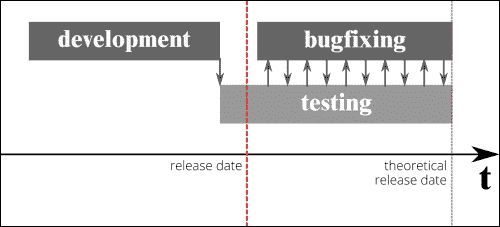
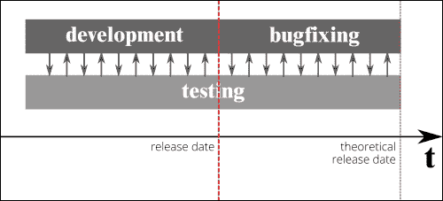

# 第一章. 测试心态

这本书的写作目的是教授如何结合使用**Codeception**和**Yii 2**。通过使用这两个优秀的框架，我证实了测试最终可以成为任何人都会欣赏去做的事情，而不是将其视为开发中一个奇特且不太清晰的附录。

因此，第一章试图解决几个很少被触及但希望给您带来理解和必要的推动去学习和采用测试的方面，并在更大范围内推广测试作为一种改进开发的方法论。

在本章中，您将了解到测试的原因以及为什么测试应该被纳入到项目中，而不是作为事后考虑。

您还将看到开始测试时会发生什么：短期和长期内隐含和显性的好处，例如对测试心态的改变、改进组件规格的能力、架构、设计和实现选择，以及重构、重新分配和代码的整体质量。

为了解释为什么测试如此重要，我还会简要地探讨过程中的组织部分，其中**测试驱动开发**（**TDD**）和**行为驱动开发**（**BDD**）将与现代项目管理技术（如敏捷和 XP）相结合，在一个多技能、自我组织的团队中进行解释。

您还将看到如何改善和重组整个团队环境，以帮助分享知识和加快工作流程。

本章分为以下三个部分：

+   理解测试的重要性

+   项目管理的涉及

+   获得测试心态

# 理解测试的重要性

自从我以专业方式开始从事质量保证和测试以来，我从未面临过“什么是测试？”这个问题。

我必须诚实地说，但在大学期间，测试并不是任何课程的一部分。我不确定最近是否有所改变，以及所教授的内容是否对商业世界有任何重要性或相关性。

在这本书中，我尝试结合使用一个优秀的 PHP 框架 Yii 2 及其版本 2 和 Codeception 测试套件来展示开发和测试的实用性。我将从实际对团队有益的角度展示每个主题，同时从更高的视角展示工作的规划和组织。在这本书的各章节中，我会来回切换，试图清晰地理解您将要工作的细节和工作的范围，从测试的角度来看整体目标。

但是，在我们开始这段旅程之前，什么是有效的测试？谷歌工程总监詹姆斯·惠特克的话对此给出了很好的答案：

> "尽管质量无法在产品中测试出来，但同样明显的是，没有测试，就不可能开发出高质量的产品。"

测试的某些方面与开发完全融合在一起，以至于两者实际上无法区分，而在其他时候，它又是如此独立，以至于开发者甚至没有意识到这种情况正在发生。

在整个项目生命周期中，你从想法开始，将其转化为功能或故事，将它们分解为任务。然后你进入执行这些任务的阶段，希望最终得到一个成品。

在我们的开发过程中，我们试图在各个阶段都加入一定程度的质量，无论是通过“检查”页面加载，还是通过进行一些更智能和深入的测试，即使不是自动化的。

Atlassian 的 QA 团队负责人 Penny Wyatt 指出，那些没有执行质量保证或将其留给团队自行执行小型自动化任务（例如单元测试）的团队，故事拒绝率最高，这意味着一个故事在完成之后因为功能错误或缺失而需要重新打开。我们谈论的是 100%的拒绝率。

当这种情况发生时，我们就处于一个不得不回到开发中去修复我们所做的工作的状态。这并非唯一的情况：与之相伴的，还有晚发现的错误和缺陷，以及修复它们，可能是软件开发中最昂贵的任务之一。在大多数情况下，已经证明它们的成本远远高于最初预防的成本。不幸的是，软件开发很少没有缺陷，这一点始终应该牢记在心。

作为开发者和管理者，我们应该有的一个目标是将缺陷的发生率降低到经济可接受的水平，这样做也减少了与之相关的风险。

作为实际例子，一个大型网站可能会有数千个软件错误，但由于 99%的网站内容显示正确，它仍然具有经济可行性。对于一个猎鹰火箭或一级方程式赛车，如此高的缺陷率是不可接受的：一个错误放置的部件可能也会危及人们的生命。

缺陷减少的另一个隐含目标是投资于团队合作。一个开发者引入的错误可能会对其他团队成员的工作产生连锁反应，总体上，对代码库和其他同事工作的信任度也会受到影响。在本章和随后的章节中，我们将通过介绍一些项目管理概念以及它如何在不同层面上确保质量来更详细地讨论这一方面。

最后，可能也是一个同样重要的方面是，如何通过示例使用测试来记录代码。这一点很少被讨论或引起开发者的注意，但我们将看到测试如何以比 PHP 文档注释更精确的方式描述我们实现的功能。我并不是说文档注释没有用，恰恰相反：在 NetBeans 或 PHPStorm 等现代**集成开发环境**（**IDE**）中，自动完成和代码提示是提高发现底层框架所需时间的绝佳方式，而不需要查阅参考手册。测试实际上可以，并且应该提供开发者可能需要的帮助，当他们在尝试组合和使用尚不为人知的接口时。

当与由小型自发团队工作的开源软件合作时，如果能够提供文档而不需要大量努力，这可能是快速和持续交付的关键。

但我们如何确保在强加给团队的约束条件下能够满足交付？为了解释这一点，我们不得不快速转向项目管理，其中一些讨论和使用的实践就源于此。

# 涉及项目管理

如果你曾经参与过软件开发规划阶段，或者如果你曾经担任过项目经理，你应该清楚地知道，有三个基本变量你可以利用来管理项目：

+   时间

+   质量

+   成本

在大多数理论和实践描述的商业场景中，利益相关者决定修复两个变量，将第三个变量留给团队来估算。换句话说：

> *时间、质量和成本...选择两个。*

事实上，通常发生的情况是时间和成本最终被设定在项目之外，从而留下质量作为开发者唯一可以操作的变量。

你可能已经体验过，降低质量并不能消除工作，它只会推迟它。关于缺陷率的我们之前提到的，降低质量实际上可能会在长期内增加成本，如果不造成短期内的很多问题，那么技术债务可能会失控。

### 注意

术语**技术债务**被引入作为一种隐喻，指的是不良设计、架构或开发选择在代码库中的后果。已经有一些书籍专门写来对抗那些不是旨在管理它的不良实践。

现今不太被谈论的敏捷方法之一，**极限编程**（**XP**），引入了，如果不是暴露了，方程中的一个新变量：**范围**。

通过明确范围，它执行以下操作：

+   创建一种安全的方式来适应

+   提供一种协商的方式

+   给我们一个工具来控制请求和需求

从 XP（极限编程）的角度来看，在分解阶段之后，我们不得不进入一个估计每个单独任务的阶段，并且基于预算，你只需不断添加或删除任务。

这次讨论提出了一个目前在社区中广泛讨论的问题，因为估计任务并不像人们想象的那样简单。我们很快就会深入探讨这个问题，因为我看到太多人对这个话题的理解有误。

## 估计任务

正如我们所见，任务的估计一直被认为是项目交付路径安排的基本原则之一。这在敏捷方法中尤其有效，因为它们使用固定时间迭代，并计算在给定冲刺中可以适应的功能和任务数量，并通过燃尽图等工具在每个迭代中进行调整。

### 注意

如果你曾在敏捷环境中工作过，这应该很容易理解，如果你没有，那么通过阅读在线免费提供的关于 SCRUM 的书籍或文章，你可以获得很多信息。

很遗憾，尽管估计如此重要，似乎没有人真正深入研究过它：有很多文章警告说，软件开发任务的估计总是偏离 2 到 3 倍。那么，我们是否应该接受我们不会在估计上变得更好的事实，或者这背后还有更多东西？

“估计不起作用”的论点可能也不正确，最近，#NoEstimates 这个标签在网络上引发了一些讨论，这可能值得在这里包括。

事实上，估计是有效的。唯一通常被忽视的细节是，估计接近实际花费的时间，这取决于开发者的知识程度和环境控制的程度。

事实上，现实是双重的：一方面，我们的估计会随着经验的增加而变得更好，另一方面，如果我们的道路上未知因素减少，我们的估计将更接近现实。

这在项目管理中众所周知，被称为“不确定性锥”。

我们真正需要做的是承认并揭露所有会增加我们估计风险和不确定性的方面，同时试图隔离那些我们知道将需要特定时间的事情。

例如，为了创建我们将要实现的功能的工作原型而设定一个固定时间的研究期，为未来的计算设定了先例，同时需要考虑人为因素。

尽管估计在软件开发和项目管理从业务角度来看特别重要，但我们在这本书中不会再涉及它们。我更愿意关注开发工作流程的更多实际方面。

## 测试方法

极限编程试图强调对缺陷减少的投资。为了做到这一点，它引入了两个基本原则：**双重检查**和**缺陷成本增加（DCI）**。

仔细检查*就是软件测试。我们知道一个特定的功能应该如何工作，这可以通过一个测试来表示。当实现这样的功能时，我们以准确定的方式知道我们所做的是正确的*。

### 注意

极限编程利用价值观、原则和实践来概述方法论的核心结构：简而言之，你选择描述团队特性的价值观；你遵守某些原则，这些原则将引导你使用特定的实践。

原则可以被认为是价值观和实践之间的桥梁，为在比“但每个人都这么做”更具体的事物上使用实践提供了正当理由。

**DCI**的另一个原则可以用来提高测试的成本效益。DCI 所陈述的是以下内容：

|    | *"越早发现缺陷，修复成本就越低。" |    |
| --- | --- | --- |
|    | --*肯特·贝克* |

为了通过一个例子使这一点更加清晰，如果你在开发多年后发现一个缺陷，可能需要花费大量时间来调查代码最初打算做什么以及最初是在什么背景下开发的。相反，如果你在实现时立即发现缺陷，修复的成本将是最小的。显然，这甚至没有考虑到一个严重缺陷可能对我们代码库的关键部分造成的所有隐藏成本和风险；例如，考虑安全和隐私。

不仅等待时间越长，修正缺陷就越困难，而且成本也会增加，并有可能留下许多残余缺陷。

这意味着，首先，我们需要有更短的反馈周期，以便我们可以连续发现尽可能多的缺陷；其次，我们不得不采用不同的实践，以帮助我们尽可能保持成本和质量不变。

快速且频繁地发现缺陷的想法已经被正式化为**持续集成**（**CI**），这需要引入自动化测试以避免成本失控。这种实践在极限编程之外也获得了很大的动力，并且目前被许多组织广泛使用，无论采用哪种项目管理方法。我们将在第九章消除自动化带来的压力中更详细地了解如何在我们的工作流程和开发中引入 CI 和自动化。

这些实践完全反对像以下图中所示的那样以瀑布方式工作的想法：

水瀑布工作流程中的交付路径

在瀑布模型中，我们有一些可能影响我们工作质量的因素的组合：在大多数情况下，规格不是一开始就设定，也不会在任何时候冻结。这意味着我们很可能不会生产出业务所要求的产品。

换句话说，你会在开发完成后才开始测试，这显然太晚了，正如前图所示：你将无法在发布日期前及时捕捉到任何缺陷。不幸的是，尽管瀑布模型可能感觉自然，但其有效性已经被多次证明是错误的，我不会在这个话题上投入更多时间。

### 注意

值得注意的是，“瀑布”这个定义，尽管没有具体使用这个术语，是由温斯顿·W·罗伊斯在 1970 年正式提出的，当时他在描述一个有缺陷且无法工作的软件管理模式。

自从敏捷方法的出现，XP 也是其中一部分，人们一直在努力尽早引入测试。

记住，测试和开发一样重要，因此很明显，我们需要将其视为一等公民。

你可能会遇到的一种常见情况是，即使你在代码库开发的同时开始测试，也可能引发比所需或可以解决的问题更多的问题。结果情况仍然会产生大量的问题和技术债务，这些债务不会适合在交付路径中，正如以下图所示：

在敏捷环境中，交付路径

团队的目标是消除所有开发后的测试，并将测试资源转移到开始阶段。如果你有如压力测试或负载测试这样的测试形式，它们在开发结束时可以突出显示缺陷，尝试将它们纳入开发周期。尝试持续和自动地运行这些测试。

转变为一个在开始时就包含测试的工作流程会暴露出两个主要问题：技术债务的积累以及开发人员和测试人员被视为两个独立实体的固有问题。别忘了，在开发之后仍将有一些测试需要执行，并且显然需要第三方来完成，但无论如何，让我们强调我们的努力是尽可能减少它。

正如我将会不断提醒你的，测试不是别人的问题。相反，通过这本书，我旨在为开发者提供所有可以让他/她首先成为测试者的工具。对于这个问题有不同方法，我们将在本章末尾简要讨论，当谈到测试心态时。

### 引入测试驱动开发

如果你曾经带着测试意识进行开发，你可能已经欣赏到从一开始就做对是至关重要的。那么，我们需要测试什么呢？

在过去的几年里，已经创建了各种方法，为开发者提供了一套规则，以解决如何在开发周期中包含测试。

第一也是最著名的，是**测试驱动开发**。

在你的团队中采用 TDD 作为实践的主要目标是实现测试优先的心态，这通过红-绿-重构的概念来实现。你首先实现测试，这些测试不应该通过（红色状态），然后实现被测试的接口，以便测试通过（绿色状态），最后根据需要重构接口以改进测试所强调的内容。

我们已经从管理的角度看到了使用这种方法的好处，但这对开发者的影响更为直接。实际上，TDD 允许你实现软件开发中所教授的内容，即接口不应该受实现的影响。并且，作为次要影响，正如我们所看到的，它提供了一种记录接口本身的方法。

通过首先实现测试，你关注的是方法、类和接口应该如何被团队内部或外部的人使用。这被称为**黑盒测试**，这意味着我们的测试应该完全不了解实现细节。这带来了隐含的好处，即允许实现随着时间的推移而改变。

### 小贴士

如果你对这个主题感兴趣，你可能值得探索**设计规范**（**DbC**）的规范，它允许你在特定的面向对象编程语言中以更正式的方式描述接口。一个不错的起点可能是在[`c2.com/cgi/wiki?DesignByContract`](http://c2.com/cgi/wiki?DesignByContract)。

不幸的是，TDD 试图关注正在开发的功能的原子部分，但它未能提供一个更广泛的视角，包括测试了什么、测试了多少，或者，更好的是，测试的内容对业务和产品本身是否有任何相关性。

再次强调，XP 为了获得双重检查的全部好处，引入了以下两组测试：

+   另一套从程序员角度编写的代码

+   另一套从用户角度编写的代码

在第一种情况下，它允许程序员彻底测试系统的所有组件，而在后者情况下，则是整个系统的操作。

从某种意义上说，后者可以被视为**行为驱动开发**（**BDD**）以更正式的方式所描述的内容。我们将在第二章 *为测试做准备*中更详细地介绍 BDD。

BDD 试图弥补 TDD 在整体范围上的不足，并将注意力转向项目的行为方面。BDD 实际上是 TDD 的一种演变，但需要对工作组织和交付方式进行一些改变，这在某些环境中可能相当困难，尤其是在不重新评估整个工作流程的情况下。

使用 BDD（行为驱动开发），你可以在多个层面上定义要测试的内容以及如何测试，使用一种定义良好、面向业务的语言——**通用语言**，这种语言是从**领域驱动设计**（**DDD**）中借用的，并由团队的所有成员共享，无论是技术性的还是非技术性的。对于本章的范围，可以说 BDD 引入了故事和场景的概念，赋予开发者正式描述应用程序的用户视角和功能的能力。测试应该使用用户故事的标准敏捷框架来编写：“作为[角色]，我想[功能]以便[好处]。”验收标准应以场景的形式编写，并作为类实现：“给定[初始上下文]，当[事件发生]时，然后[确保某些结果]。”

## 测试计划

因此，从软件开发的角度来看，规划测试是至关重要的，而在不太久远的几年里，已经出现了几种从规划角度改进测试的解决方案，它们提供了更详细和紧凑的方式来定义所谓的测试计划。

在以测试为导向的环境中，测试计划应为你提供在任何级别上测试什么和测试多少的方向和指示。此外，测试计划应该是向各种利益相关者公开的，其可见性不应局限于开发的范围内。因此，我们的责任是维护并确保这份文档在整个项目生命周期中保持活跃。

在实践中，我很少看到这种情况发生，因为测试计划从未被正式化，或者如果被正式化，它们太长且难以维护，从其最初构思以来寿命非常短暂。

例如，**属性-组件-能力**（**ACC**）是由谷歌创建的，旨在解决测试计划一直面临的一些主要问题，尤其是其可维护性。你可以在[`code.google.com/p/test-analytics/`](https://code.google.com/p/test-analytics/)找到有关 ACC 和谷歌测试分析软件的更多信息。

ACC 测试计划简短且紧凑，整个项目都试图实现可以在几分钟内创建的测试计划，这些计划能够自我描述，对项目中的任何人都是有价值的。

对于每个组件，你有一系列的能力，这些能力可以用一个或多个属性来描述；例如，“安全”、“快速”或“用户友好”。此外，每个能力和组件都与一个相对风险水平相关联。这两者结合起来，可以帮助你理解什么是最重要的测试内容，以及你的测试应该有多彻底。

## 生成测试

显然，规划测试只是开始。一旦你进入实施阶段，你可以选择这本书，它提供了如何使用可用的工具来创建测试的知识。

关于这个方面，我无法告诉你更多。你可能只需要阅读所有内容，但应该强调的是，在编写测试时，你必须牢记一些基本原则。

优秀的测试应具备以下三个重要特征：

+   **可重复性**：测试必须是确定的。这确保测试不依赖于外部因素问题。

+   **简洁性**：只测试一件事。测试越小，就越容易控制。

+   **独立性**：测试应该独立执行。测试之间不应存在依赖关系。这也有助于测试和代码的调试。

一旦你掌握了如何从架构角度接近项目，一旦你理解了测试计划的工作原理以及你真正需要测试的内容，你就可以开始实施测试，与他们讨论，并在同事的帮助下改进工具和你的使用方式。

# 获得测试思维模式

因此，到目前为止，我们已经看到了测试在当前开发实践中的重要性，我们也看到了从项目管理角度围绕开发本身的所有方面，但我们仍然不知道要成为一名优秀的测试员需要什么。

寻找了解测试的开发者尤其困难，网上有很多讨论这个问题：如果这么难，我们难道不能做得更好吗？我们如何让开发者首先成为测试员，尤其是当你真正希望开发者从代码发布的最初就负责代码质量时？

我倾向于同意这样一个普遍观点，即测试员或了解测试的开发者需要三个基本要素：*思维模式*、*技能集*和*知识*。

那么，你该如何着手获取或提高这三个基本方面呢？

即使你能阅读所有关于测试的书籍并收听所有相关的播客，尽管这些会给你提供大量关于如何测试事物以及各种测试套件和框架如何工作的技能集，但你仅凭这些是无法成为一名测试员的。

当然，实践可以帮助你很多，但总的来说，质量思维模式和测试知识可能是最难获得的。

知识部分来自于对产品的更高视角，既包括技术方面，也包括业务端。介绍项目分解和为即将在我们的软件中引入的功能进行的提案可以是这个过程的起点。

质量思维模式可能是最棘手的，因为它最终会融入软件开发的所有方面，从技术角度来看，需要所有相关方的积极参与，首先是开发者。

如前所述，在质量方面没有固定的定义。你可以在项目中投入多少质量没有上限。因此，在任何项目中你可以进行多少测试也没有限制。

从我所见证的情况来看，除了成为一名优秀的开发者之外，还有两个要求可以加快成为一名优秀测试员的过程：其中一个来自环境，另一个来自我们自身。

我认为环境因素可能是获得我们所说的正确测试心态的关键，而达到这一点可能应该是任何决定质量有价值的公司优先考虑的事情，并且是可以衡量的。

当然，有一个可以进行测试指导的人总是效果最好：通过模仿和辩论可能是最好的团队导向工具。即使你的团队中没有测试员，你可能也注意到在开发中，像结对编程或代码审查这样的实践可以大大帮助团队跟上所需实践和知识。

让我们更详细地看看这在实际中意味着什么，同时记住在应用实践和方法论方面没有一劳永逸的解决方案，你的任务是根据手头的资源进行实验和调整。

## 从无测试文化开始——一种实用方法

在这一系列关于如何在团队或项目中引入测试的实践例子中，我们将假设一些不可或缺的要求，以帮助你取得进展。

在这个特定的情况下，我们将假设你在一个团队中工作。理想的情况是拥有至少三个人的团队。

### 注意

如果你与不到三个人一起工作，或者你是一个独立开发者，大多数技术和实践可能带来的成本可能会高于预期的收益。

一个测试计划和合理的工作流程组织（尽量保持简单）不仅会在需要时为在大团队中工作提供坚实的基础，而且还能为你提供快速交付质量的工具。

首先，你需要来自业务和直接管理者的支持；说到直接和间接经验，没有这些你将无法取得任何进展。公司的业务方面需要理解测试是什么，就像本章开头所描述的那样，测试的价值，以及它能带来的所有好处。网上有大量的文档可以帮助你构建商业案例。

其次，你需要具备一些测试技能。这本书应该涵盖这部分内容——希望做得相当好——而且还有许多其他书籍可以教你更多关于测试的理论知识，无论在线上关于这个主题的资源有多少。

### 注意

你可以在网上找到一些不错的文章，如下所示：

+   *单元测试：为什么麻烦？* 可在 [`soundsoftware.ac.uk/unit-testing-why-bother/`](http://soundsoftware.ac.uk/unit-testing-why-bother/) 查阅

+   *Airbnb 的测试* 可在 [`nerds.airbnb.com/testing-at-airbnb/`](http://nerds.airbnb.com/testing-at-airbnb/) 查阅

一旦你有了这个，你就可以开始采取行动。

大多数人可能会发现自己处于这样的情况：完全没有测试文化。这里你有两个选择：要么采取自下而上的方法，从 TDD（测试驱动开发）入门，要么采取自上而下的方法，从更高的视角出发。

无论哪种方式，你都需要开始制定一个紧凑的测试计划来遵守。以 ACC 的方法为例，你首先将应用程序/项目/库分解成模块（组件），每个模块将由功能（能力）组成。每个功能都将有一个特定的属性。从那里，你应该有一个足够紧凑的表示，说明你试图实现什么。在此基础上，你可以开始分配相对风险等级，这将用于确定测试方法的优先级，即测试什么和测试多少。

最终的测试计划应由所有利益相关者签署，并尽可能频繁地更新，以定义项目的目标本身。这份文件越正式越好，因为它将成为项目的名片。

如许多人所强调的，直接的目标是开始在开发者中培养测试文化。定义你的工作范围，无论是测试还是开发，都要谨慎行事，评估风险和成本，并利用这些因素来决定如何进行测试。

幸运的是，如果你发现自己正在使用 Yii 和 Codeception 进行工作，你应该可以避免一些头痛，不必将不同的框架组合在一起，也不必浪费太多时间来实验一个可行的解决方案。

在团队层面，当测试经验既不广泛也不稳固时，可以引入一些额外的实践来帮助避免瓶颈或让所有知识都集中在一个人身上，例如结对编程和代码审查。

一些公司，如 Atlassian，引入了测试工程师，他们可以从指导和质量保证的角度帮助团队。他们在开发周期中的干预最终被限制在更有限的参与中，即在任务开始之前和完成之前。尽管如此，他们的角色是基本的，因为他们成为了测试基础设施、工具和要采用的实践的守护者，而开发者则成长为一名能够几乎涵盖测试所有方面的全面测试人员，而不需要太多支持。

# 摘要

在本章中，我们涵盖了与测试直接相关但并非严格必要的许多方面，尽管如果你想要理解为什么选择这本书，以及是否需要继续阅读它是基本的。

你已经看到了测试的重要性，一些项目管理方法，如何估算任务以及它包含的内容，你还看到了不同的测试方法，如 TDD 和 BDD，这些将成为许多剩余章节的基础。最后，我尝试给出一个关于获得成为测试大师所需测试心态的想法。

在第二章中，*准备测试工具*，我们将开始准备本书剩余部分将要使用的工具，了解 Yii 2 的基础知识，并通过概述我们的测试计划来应用本章所学。
