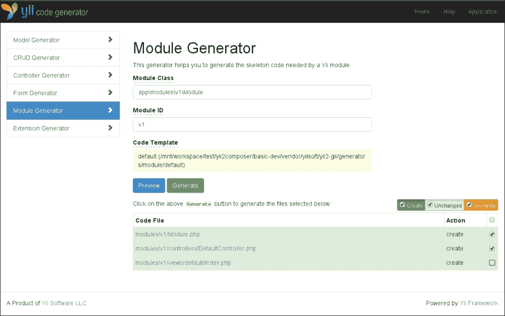

# 第六章。测试 API – PHPBrowser 来拯救

我们现在将深入研究功能测试。在上一章中，我们创建了处理用户模型的初始步骤，但现在我们将创建处理用户的 REST 接口。

在我们开始担心 REST 接口及其测试之前，我们将分析 Yii 基本应用程序中已经可用的内容，并在此基础上扩展主题，创建更多精彩的内容。

因此，本章分为三个部分，难度逐渐增加，所以请保持警惕，并随时多次回顾，直到你理解每个部分，它们是：

+   Yii 2 的功能测试

+   REST 接口的功能测试

+   使用 Yii 2 创建 RESTful Web 服务

# Yii 2 的功能测试

正如你在第三章中看到的，*进入 Codeception*，我们在基本应用程序中预加载了一些基本的函数测试。

让我们开始深入挖掘，一旦你掌握了所需的知识，我们就会继续进行 REST 接口的测试。

如你所知，基本应用程序由几个页面、登录系统和联系表单组成。

功能测试几乎涵盖了所有内容，所以让我们开始看看我们有哪些文件以及它们的内容。

## 理解和改进现有的 CEPTs

包含在 `codeception/functional/HomeCept.php` 中的测试非常容易理解。多亏了 Codeception 使用的语法，你可以轻松理解测试的意图，所以让我们分解一下，看看每一部分的作用：

```php
$I = new FunctionalTester($scenario);
```

你将首先初始化将在其中执行测试的演员。Yii 使用与 Codeception 文档和指南中官方使用的名称略有不同，即 `TestGuy`，所以当你遇到 Yii 之外的其他文档时，请记住这一点。

### 小贴士

记住，你可以随意命名演员，他们的配置可以在套件 YAML 文件中找到，对于功能测试，它位于 `tests/codeception/functional.suite.yml`。

此类位于与其他功能测试相同的文件夹中，并且通过运行 `codecept build` 自动生成：

```php
$I->wantTo('ensure that home page works');
```

第一步是简洁但详细地声明测试的范围；这将帮助你和非技术人员了解出了什么问题，以及测试是否有效地以强烈和全面的方式执行了其预期要执行的操作。`wantTo()` 方法应该只调用一次，因为任何后续调用都将覆盖之前设置的值：

```php
$I->amOnPage(Yii::$app->homeUrl);
```

我们的测试需要一个起点；`amOnPage()` 方法除了加载实际测试将进行的给定 URL 外，什么都不做：

```php
$I->see('My Company');
$I->seeLink('About');
```

在 Codeception 中，断言是通过 `see*` 和 `dontSee*` 动作执行的，确保特定的文本或链接在页面中存在或不存在。

这些操作可以根据需要描述得尽可能详细，在前面的示例中，使用`see('My Company')`我们只是检查文本是否存在于标记中，而不是特定的标签中，而`seeLink('About')`则等同于编写`see('About', 'a')`。我们很快就会看到，我们可以向`seeLink()`传递第二个参数，这将允许我们检查链接应指向的 URL。

与页面的交互，如触发、使用`click()`点击链接、使用`fillField()`、`checkOption()`、`submitForm()`等填充字段，这些都是 Codeception 功能测试所能做到的。任何更复杂的事情都必须仔细重新评估，因为你实际上可能需要将其移动到验收测试中：

```php
$I->click('About');
$I->see('This is the About page.');
```

在前面的行中，我们触发了“关于”页面的链接，并期望结果页面包含特定的副本。这个特定的测试只是说明了使用链接在我们的应用程序中导航的要点，因为它可以像前面描述的那样使用`seeLink('About', '/about')`完成，并且可以将关于页面的任何断言留在其自己的测试中。

我们不妨将测试扩展得更多一些，使其与我们试图测试的内容更相关；我们想要确保存在的功能部分是什么，没有它们我们可以认为页面“非功能”？在我们的例子中，我们谈论的是页面的标题（因为它已经被处理过），菜单，以及我们总是希望在那里出现的任何其他链接：

```php
$I = new FunctionalTester($scenario);
$I->wantTo('ensure that home page works');
$I->amOnPage(Yii::$app->homeUrl);
```

开始是相同的，但然后我们确保页面的标题包含我们期望的内容：

```php
$I->expect('the title to be set correctly');
$I->seeInTitle('My Yii Application');
```

下一个部分确保菜单包含所有必要的链接到各个页面：

```php
$I->expectTo('see all the links of the menu');
$I->seeLink('Home', '/');
$I->seeLink('About', '/about');
$I->seeLink('Login', '/login');
$I->seeLink('Contact', '/contact');
```

你必须记住，链接不是严格检查的；这意味着如果你有`$I->seeLink('Something', '/something')`，它将匹配任何包含`Something`的链接；例如，它可以是指`Something Else`的任何`href`属性，如`/something/else`，甚至`http://something.com`。

在我们的情况下，这显然使检查主页链接的相关性变得有些不相关，所以我们很可能会获取当前的 URL，并以下述方式对其进行检查：

```php
$url = $I->grabFromCurrentUrl();
$I->seeLink('Home', $url);
```

有不同的方法可以抓取要在测试的其余部分动态重用的内容，例如`grabAttributeFrom()`、`grabCookie()`、`grabResponse()`等。再次强调，如果你的 IDE 不支持代码提示，你的`FunctionalTester`类将包含这些方法的详细信息。

我们可以为指向主页的任何其他链接做同样的事情：

```php
$I->expectTo('see a self-referencing link to my company homepage');
$I->seeLink('My Company', $url);
```

对于其余的链接，检查我们的路由是否配置良好也可能很有用；例如，你需要检查控制器的名称是否没有显示：

```php
$I->dontSeeLink('About', 'site/about');
$I->dontSeeLink('Login', 'site/login');
$I->dontSeeLink('About', 'site/contact');
```

我们最后想要确保的是，`Home`链接被标记为选中。

对于这个测试，我们需要使用一个非常具体的选择器，因为标识我们链接状态的激活类位于实际锚点的父级中，而且没有简单的方法可以断言这一点，所以使用 XPath 表达式特别有用：

```php
$I->expectTo('see the link of the homepage as selected');
$I->seeElement('//li[@class="active"]/a[contains(.,"Home")]');
```

大多数需要上下文选择器的可用方法，如 `click()`、`see()` 和 `seeElement()`，可以接受此参数的多种格式，主要是作为 CSS 选择器、XPath 查询或定位器，这些都是 Codeception 提供的特定对象。

在其最简单的形式中，选择器可以只是一个简单的单词或句子，这意味着“找到这个单词/句子首次出现的地方”。如您之前所见，`see("Something")` 将返回第一个包含 `Something` 作为其值的元素（例如，`Something Else`）。

CSS 选择器可能是你更熟悉的一种，但对于更复杂的内容，XPath 通常更胜一筹。

在上述示例中，XPath 查询 `//li[@class="active"]/a[contains(.,"Home")]` 可以按以下方式阅读：

+   在任何级别找到所有的 `li` 节点（`//li`）

+   通过特定的类属性过滤它们（`[@class="active"]`）；请注意，这是字面意义和区分大小写的

+   在这些中找到直接的子节点 `a` 节点（`/a`）

+   如果它们包含特定的文本，则过滤它们（`[contains(.,"Home")]`）

### 注意

XPath 2.0 自 2010 年 12 月以来一直是 W3C 建议的标准，您可以在 [`www.w3.org/TR/xpath20/`](http://www.w3.org/TR/xpath20/) 上了解更多信息。

定位器可以简化在您的 DOM 中编写更复杂查询的过程，并允许您通过 OR 组合 CSS 和 XPath 查询：

```php
use \Codeception\Util\Locator;

$I->see('Title', Locator::combine('h1','h2','h3'));
```

通过前面的声明，我们可以检查任何 `h1`、`h2` 或 `h3` 标签中是否存在 `Title` 字符串。

另一个可能有用的功能是定位器中可用的一种方法，您可以使用它通过 `tabIndex` 浏览页面：

```php
<?php
use \Codeception\Util\Locator;

$I->fillField(Locator::tabIndex(1), 'davert');
$I->fillField(Locator::tabIndex(2) , 'qwerty');
$I->click('Login');
```

### 注意

上述示例是故意从定位器的文档页面中选取的，该页面可在 [`codeception.com/docs/reference/Locator`](http://codeception.com/docs/reference/Locator) 找到。

## 编写可重用的页面交互

测试表单可能是任何开发人员和测试人员可能做过的最艰巨的任务之一。如果您将表单视为跨越多个页面的多个单选和复选问题的问卷，您会感受到这种痛苦。

您可以清楚地看到使用功能测试自动化的直接好处。

可用的两个示例，`LoginCept.php` 和 `ContactCept.php`，是一个很好的起点。让我们更仔细地看看 `LoginCept.php`；如果您浏览测试的内容，您会立即注意到 `fillField()` 方法从未被调用，取而代之的是以下命令：

```php
$loginPage = LoginPage::openBy($I);

$I->see('Login', 'h1');
$I->amGoingTo('try to login with empty credentials');
$loginPage->login('', '');

```

实际上，页面是跨测试重用组件的最简单方法之一。在同一个测试中多次重复执行的操作可能被提取并放入页面中，就像我们在测试中使用的页面一样：

```php
namespace tests\codeception\_pages;

use yii\codeception\BasePage;

/**
 * Represents login page
 * @property \AcceptanceTester|\FunctionalTester $actor
 */
class LoginPage extends BasePage
{
    public $route = 'site/login';

    /**
     * @param string $username
     * @param string $password
     */
    public function login($username, $password)
    {
        $this->actor->fillField(
            'input[name="LoginForm[username]"]', $username
        );
        $this->actor->fillField(
            'input[name="LoginForm[password]"]', $password
        );
        $this->actor->click('login-button');
    }
}
```

所需的只有与之关联的路由，然后你可以实现所需的方法，以实现任何需要的功能，在先前的案例中就是登录过程。

在 `Page` 类中，`$this->actor` 是对当前在测试中使用的演员的引用。

你有两种使用页面的方式；第一种是立即打开页面并将其与当前演员关联，就像之前在 `LoginPage::openBy($I)` 中看到的那样，否则，你可以在需要时简单地调用其构造函数并加载页面（也可以使用不同的参数）：

```php
$loginPage = new LoginPage($I);
$loginPage->getUrl();
```

现在，正如你在与单元测试一起工作时所看到的，能够保持数据库内容处于受控状态是非常有用的。而且， fixtures 再次为我们提供了帮助，甚至在这里。

## 实现固定装置

在 第四章 中，*使用 PHPUnit 进行隔离组件测试*，你看到了如何实现一个固定装置。在功能测试中，可以使用相同的类；唯一的区别是，Codeception 的 PHPBrowser 及其底层基础设施不知道如何加载固定装置，因此使用 Codeception 的每个框架，如 Yii 所做的那样，需要提供桥梁来填补这个差距。

高级应用为 `FixtureHelper` 提供了实现，它实现了 Codeception `Module` 类并从 `FixtureTrait` 导入方法：

```php
<?php

namespace tests\codeception\_support;

use tests\codeception\fixtures\UserFixture;
use Codeception\Module;
use yii\test\FixtureTrait;

/**
 * This helper is used to populate database with needed 
 * fixtures before any tests should be run.
 * For example - populate database with demo login user 
 * that should be used in acceptance and functional tests.
 * All fixtures will be loaded before suite will be
 * started and unloaded after it.
 */
class FixtureHelper extends Module
{

    /**
     * Redeclare visibility because Codeception includes
     * all public methods that not starts from "_"
     * and not excluded by module settings, in actor class.
     */
    use FixtureTrait {
        loadFixtures as protected;
        fixtures as protected;
        globalFixtures as protected;
        unloadFixtures as protected;
        getFixtures as protected;
        getFixture as public;
    }

    /**
     * Method called before any suite tests run. 
     * Loads User fixture login user
     * to use in acceptance and functional tests.
     * @param array $settings
     */
    public function _beforeSuite($settings = [])
    {
        $this->loadFixtures();
    }

    /**
     * Method is called after all suite tests run
     */
    public function _afterSuite()
    {
        $this->unloadFixtures();
    }

    /**
     * @inheritdoc
     */
    public function fixtures()
    {
        return [
            'user' => [
                'class' => UserFixture::className(),
                'dataFile' => '@tests/codeception/fixtures/data/init_login.php',
            ],
        ];
    }
}
```

上述代码相当简单，唯一重要的是在 `FixtureHelper` 中实现 `fixtures()` 方法，该方法返回处理模型及其包含我们想要在数据库中的所有行的数据文件的列表。与高级应用中找到的原始代码的唯一区别是导入 `getFixture()` 方法作为公共的，我们将在稍后看到为什么这样做。

以下代码是针对 `init_login.php` 文件的：

```php
<?php

return [
    'basic' => [
        'username' => 'user',
        'authkey' => uniqid(),
        'password' => Yii::$app->security->generatePasswordHash(
            'something'
        ),
    ],
];
```

由于我们已将特性 `getFixture()` 作为公共的导入，我们可以通过 `$I->getFixture('user')` 以类似我们在单元测试中所做的方式访问固定装置。

### 提示

如果需要加载额外的固定装置，你可以类似地公开 `FixtureTrait` 特性中的 `loadFixtures()` 方法，并在你的测试中直接使用它。

最后一步是在 Codeception 配置中加载模块：

```php
# tests/codeception/functional.suite.yml

modules:
    enabled:
      - ...
      - tests\codeception\_support\FixtureHelper
```

在运行 `codecept build` 之后，当在 `_beforeSuite()` 和 `_afterSuite()` 方法中运行测试时，固定装置将被自动加载。

## 功能测试的陷阱

一句话建议是，官方文档中关于功能测试以及不能测试的内容有很多信息。

最重要的是了解用于执行测试的底层技术；PHPBrowser 实际上是一个强大的工具，但整个功能测试不依赖于像正常客户端-服务器情况那样存在的 Web 服务器，因此你的应用程序和功能测试将在相同的内存空间中运行。

### 提示

通常情况下，内存会在`_after()`方法执行期间被清理，但请记住，如果您看到任何测试失败，请记住在开始怀疑自己的理智之前，单独执行测试文件。

# 对 REST 接口的功能测试

到目前为止，您已经看到了已经实现的内容，可以开箱即用的功能，以及一些额外的功能，如固定装置。

现在让我们看看测试 REST 接口涉及什么；Codeception 中可用的默认功能测试是由 PHPBrowser 执行的，与之交互的接口相当有限，只能用来处理和与由 Web 服务器输出的标记进行交互。Codeception 提供的 REST 模块是我们所希望的。

仅举几个可用的功能为例，您将拥有设置和读取头部的函数，例如`seeHttpHeader()`和`haveHttpHeader()`，以及调用针对我们接口的 HTTP 请求的特定方法，例如`sendGET()`、`sendPUT()`和`sendOPTIONS()`。

特别针对我们的用户接口，我们的测试将分为两部分：

+   对实际功能——认证和与应用程序的交互进行的测试

+   一些额外的测试以确保我们公开了正确的端点

现在，考虑到这一点，让我们开始查看配置部分；在`functional.suite.yml`文件中，只需添加 REST 模块并按照以下代码进行配置：

```php
# tests/codeception/functional.suite.yml

modules:
    enabled:

      - Filesystem
      - Yii2
      - REST
      - tests\codeception\_support\FixtureHelper
    config:
        Yii2:
            configFile: 'codeception/config/functional.php'
        PhpBrowser:
            url: 'http://basic-dev.yii2.sandbox'
        REST:
            url: 'http://basic-dev.yii2.sandbox/v1/'

```

最后一行非常重要，因为我们最终将只通过指定端点来调用，而不需要命名模块基本路径。显然，如果您需要测试多个 REST 端点，您需要相应地调整。

现在，我们再次需要运行`codecept build`命令，以便在开始运行测试之前准备好一切。这个命令，如之前所见，将合并所有模块的方法到我们的 actor 类中（在这种情况下是`FunctionalTester`）。

让我们使用以下命令生成我们的新测试文件：

```php
$ cd tests/
$ ../vendor/bin/codecept generate:cept functional UserAPICept
Test was created in UserAPICept.php

```

现在我们有了文件，我们可以开始实现我们的测试：

```php
<?php
// tests/codeception/functional/UserAPICept.php

$I = new FunctionalTester($scenario);
$I->wantTo('test the user REST API');
```

我们从初始化`FunctionalTester`和定义测试范围开始文件。

## 定义 API 端点

现在是时候实现我们的 API 端点测试了，我们需要定义这些测试将是什么样子，并做出我们的架构决策，如果在此之前还没有做出这些决策。

我们希望提供给与我们的 API 交互的客户的基礎交互能力是获取用户信息，并具有修改信息的能力，特别是更改密码的能力。

客户通常会知道用户名和密码。由于我们的更新方法将利用用户的 ID，我们需要找到一种方法让客户提前获取它。根据您决定使用的认证协议类型，您可以选择在认证发生后立即返回它，否则您需要找到不同的方法。

正如你稍后将会看到的，你将使用可用的最简单的认证方法，即 HTTP 基本认证，这意味着我们所有的请求都需要在头中发送用户名和密码。通过这样做，我们显然不能在响应中返回用户 ID，因为这应该包含对调用的答案，而不是认证头，因此我们可以决定提供一个“按用户名搜索”的端点。这将清楚地使用户名成为数据库中的唯一字段，但这不是一个问题，而是一个如果你提供用户创建界面时需要考虑的问题。

现在，我们有以下端点需要测试：

+   `GET users/search/<username>`：这个端点用于检索用户的 ID。

+   `GET users/<id>`：这个端点用于检索与用户关联的任何其他信息。

+   `PUT users/<id>`：这个端点用于更新密码。

## 实现 API 测试

由于我们的密码在 fixtures 中以加密形式传递，我们需要在测试中硬编码它们，以便正确地进行认证。

这不是一种好的做法，因为我们将会使维护变得更加困难。另一方面，如果事情变得更加复杂，我们可能想要重构代码并找到一个更好、更统一的解决方案：

```php
$userFixtures = $I->getFixture('user');
$user = $userFixtures['basic'];
$userPassword = 'something';
```

现在我们已经了解了一些关于用户的基本信息，我们可以尝试获取其 ID 并检查其认证是否完全有效：

```php
$I->amGoingTo('authenticate to search for my own user');
$I->amHttpAuthenticated($user['username'], $userPassword);
$I->sendGET('users/search/'.$user['username']);
```

第一步是准备请求，它由`Authorization`头和实际请求组成。我们不需要显式生成`Authorization`头，因为我们有一个由`amHttpAuthenticated()`提供的抽象，它会为我们完成这项工作。

然后将头与 GET 请求一起发送到我们的端点；注意 URL 省略了通常用于前缀 API 的`/v1/`部分：

```php
$I->seeResponseCodeIs(200);
$I->seeResponseIsJson();
$I->seeResponseContains($user['username']);
$I->seeResponseContains('password');
$I->seeResponseContains('id');
```

一旦我们发送了请求，我们就可以开始分析响应并对它进行各种断言：

```php
$userId = $I->grabDataFromJsonResponse('id');
```

最后，我们从响应中获取用户 ID，以便之后可以重用它。

下一步是获取用户自己的信息，已知他们的 ID，这看起来特别简单易行：

```php
$I->amGoingTo('ensure I can fetch my own information while being authenticated');
$I->amHttpAuthenticated($user['username'], $userPassword);
$I->sendGET('users/'.$userId);
$I->seeResponseCodeIs(200);
$I->seeResponseIsJson();
$I->seeResponseContains($user['username']);
$I->seeResponseContains('password');
$I->seeResponseContains('id');
```

作为最后一步，我们保留了更新密码和确保新密码按预期工作的测试：

```php
$I->amGoingTo('update my own password');
$I->amHttpAuthenticated($user['username'], $userPassword);
$newPassword = 'something else';
$I->sendPUT(
    'users/' . $userId,
    ['password' => $newPassword, 'authkey' => 'updated']
);
$I->seeResponseIsJson();
$I->seeResponseContains('true');
$I->seeResponseCodeIs(200);

$I->amGoingTo('check my new password works');
$I->amHttpAuthenticated($user['username'], $newPassword);
$I->sendHEAD('users/'.$userId);
$I->seeResponseIsJson();
$I->seeResponseContains($user['username']);
$I->seeResponseCodeIs(200);
```

### 注意

请注意，由于测试的长度，我们将把它们全部放在一个文件中，因为这不会影响它们的可读性，但你当然可以将它们分成更多的 CEST 文件，以更简洁和逻辑的方式聚合它们。

这应该是你需要了解的所有内容。我们可以检查在这个阶段，没有任何测试会通过，并在章节结束时，我们将确保所有测试最终都能通过。

### 注意

还要注意，没有必要每次都调用`amHttpAuthenticated()`来发送认证头，因为它在 CEPT 文件中的第一次调用后将被缓存，并且只有在需要更新头时才需要。

现在我们已经看到编写功能测试是多么容易，我可以将创建额外测试的任务留给你。如果你想，你可以先检查其他接口是否未被暴露，例如请求所有用户的列表以及检索或更改他们的密码的能力。

在本章的下一节中，我们将通过查看 Yii 2 提供的一些新特性来关注事物的实现方面。

# 使用 Yii 2 创建 RESTful Web 服务

需要记住的是，根据定义，REST Web 服务是一种无状态服务，这将在我们测试事物和处理我们需要 POST 或 GET 的信息时产生一些要求。

Yii 2 版本带来的重大进步体现在内置的 REST 类上，这些类可以立即提供第三方实现曾经提供的解决方案。

这意味着我们将不得不对我们迄今为止所取得的成果进行一些修改；应用程序的 REST 部分将作为一个独立的模块来开发，这将使我们能够扩展它并包含其逻辑。因此，路由也将相应地重新排列。

在查看 Yii REST 功能能够做什么之前，我们首先需要快速了解 Yii 中的模块，我们将使用它来开发要测试的 API。

## 在 Yii 中编写模块化代码

如果你自从开始使用 Yii 以来从未使用过模块，那么我认为现在是时候了。目前，模块的使用非常简单直接，并且它们将帮助你保持代码在架构上的良好组织，并与其他应用程序组件分离。

模块是包含模型、视图、控制器和其他软件组件的独立软件单元，一旦安装到主应用程序中，最终用户就可以访问控制器。因此，模块被认为是微型应用程序，唯一的区别是它们不能独立存在。例如，论坛或管理区域可以开发为模块。

模块也可以由子模块组成；一个论坛可能有一个包含所有逻辑和接口以管理和定制主论坛模块的管理子模块。

模块的结构可能相当复杂；我总是强烈建议在决定将所有内容都放在同一个模块下之前进行架构分析，就像你需要质疑将所有代码都放在同一个控制器下的选择一样。始终牢记，你应该能够在一年后理解你的代码。

## 使用 Gii 创建模块

使用 Yii 模块开发 REST 接口是实现 API 版本化的最简单方法。这样，我们可以轻松地切换并制作 API 的改进版本，同时仍然以最小的维护支持旧版本，直到完全弃用。

因此，我们将从创建模块开始，使用 Gii 代码生成器的 Web 界面。如果您跳过了一些页面，该配置在第四章中可用，*使用 PHPUnit 进行隔离组件测试*，您在那里看到了如何使用它创建模型。

现在，我们将看到如何创建一个模块，以及这在生成代码方面意味着什么。

因此，前往 Gii 应用程序，在我的情况下是`http://basic.yii2.sandbox/gii`，如果配置了登录，请登录，然后单击**模块生成器**按钮。

我们必须填写的只有两个字段：

+   **模块类**：这代表模块的主要命名空间类名，将被设置为`app\modules\v1\Module`。

+   **模块 ID**：这将（自动）设置为`v1`。

看看下面的截图：



Gii 代码生成工具中的模块生成页面

您可以通过取消选择相关的复选框来避免创建视图，因为我们不需要它。我们将对已生成的内容进行更多修改。

准备好后，单击**生成**按钮。

### 备注

如果您的应用程序最终比这里更复杂，您仍然有一些选择。

您可以简单地调整模块的路由，正如在[`www.yiiframework.com/doc-2.0/guide-runtime-routing.html#adding-rules-dynamically`](http://www.yiiframework.com/doc-2.0/guide-runtime-routing.html#adding-rules-dynamically)文档中所述。

否则，您可以在模块内创建一个模块（例如，一个名为`api`的容器模块，它将包含各种版本作为模块，如`v1`、`v2`等）。只需记住在创建时正确命名空间即可。这通常是我在代码组织方面推荐的方法。

下一步是配置模块以便使用它，然后我们将看到如何将其转换为 REST 模块。

## 在 Yii 2 中使用模块

现在我们已经准备好了模块的基本代码，我们需要看看我们如何使用它。

理想情况下，创建的模块可以立即使用，无需太多麻烦，这在您希望创建可重用和当然模块化代码的环境中非常有帮助。

真正需要的唯一步骤是指导 Yii 存在一个新的模块，然后它将负责在正确的时间自动加载和调用我们的模块控制器。

因此，让我们转到位于`/config/web.php`的配置文件，并添加以下代码：

```php
// /config/web.php

$config = [
    // ...
    'modules' => [
        'v1' => [
            'class' => 'app\modules\v1\Module',
        ],
    ],
    // ...
];
```

这样，您就准备就绪了。为了将新创建的模块转换为 REST 控制器，需要一些额外的更改，我们将立即探讨。

## 将我们的控制器转换为 REST 控制器

这个备受期待的 Yii 2 功能让您能够以清晰和简单的方式创建 REST 接口。

我们将要继承的 REST 控制器将处理我们的模型，无需太多配置，即使需要配置，也是相当直接且容易记住的。

我们的第一步是创建`UserController`，它将处理`User`模型。

让我们先定义命名空间和我们将在新控制器中使用的基本类：

```php
// /modules/v1/controllers/UserController.php

namespace app\modules\v1\controllers;

use app\models\User;
use yii\rest\ActiveController;
```

如我们明显看到的，我们将使用`User`模型，并在其之上使用 REST `ActiveController`。这个控制器是魔法发生的地方，我们将在稍后展示它是如何工作的。

现在，让我们实现实际的类：

```php
// /modules/v1/controllers/UserController.php

class UserController extends ActiveController
{
    public $modelClass = 'app\models\User';
}
```

在这一点上，你需要做的只是定义 REST 控制器将要管理的模型类，然后就可以了。

`yii\rest\ActiveController`是处理 Active Records 模型（如我们的`User`模型）的控制器。如果你要管理自定义类（非活动记录），这些类不连接到数据库或连接到自定义数据源（例如，在线服务），你可以使用`ActiveController`继承的类，即`yii\rest\Controller`。

`ActiveController`的美丽之处在于它提供了已经实现并立即可用的操作，包括：

+   `index`，通过`GET`或`HEAD`访问，返回模型及其（数据库绑定）属性的列表

+   `view`，通过`GET`和`HEAD`访问，返回单个模型的详细信息

+   `create`，只能通过`POST`访问，并允许你创建一个新的模型

+   `update`，通过`PUT`或`PATCH`访问，并执行其名称所表示的操作

+   `delete`，用于删除模型，可以使用`DELETE`调用

+   `OPTIONS`，最后，你可以调用它来查看所有允许的 HTTP 方法

在你可以自己实现的操作中，你将处理原始模型，这些模型默认以 XML 和 JSON 格式渲染（取决于随请求发送的`Accept`头）。

我们知道我们需要修改公开端点的列表，我们将在稍后展示如何做到这一点。

在达到那里之前，还有一些其他问题需要先解决，特别是访问凭证，因为我们不希望任何人未经认证就能访问我们的端点。

## 添加访问检查和安全层

你可能已经问过自己如何防止未经认证的用户使用应用程序的某些端点。例如，我们可能只想在客户端认证并授权的情况下，允许客户端访问用户端点。

授权和认证发生在两个不同的阶段。

授权在控制器级别通过简单地重写`checkAccess()`方法并执行适当的检查来完成，这可能包括确定用户是否已认证以及他/她是否活跃，如果用户模型中存在此标志的话。

在我们的情况下，我们可以在控制器中简单地添加以下方法：

```php
// /modules/v1/controllers/UserController.php

public function checkAccess($action, $model = null, $params = [])
{
    if (\Yii::$app->user->isGuest) {
        throw new UnauthorizedHttpException;
    }
}
```

这意味着如果用户是访客，我们将引发一个`401`响应。

Yii 会自动在每次请求中调用该方法，正如我们可以在其父类`\yii\rest\ActiveController`中的`actions()`方法中看到的那样：

```php
class ActiveController extends Controller
{
    // ...

    public function actions()
    {
        return [
            'index' => [
                'class' => 'yii\rest\IndexAction',
                'modelClass' => $this->modelClass,
                'checkAccess' => [$this, 'checkAccess'],
            ],
            // ...
        ];
    }

    // ...
}
```

相反，认证是以完全不同的方式进行的，并且取决于实现和你在应用程序中想要实现的安全级别。

就其本身而言，如果你没有深入接触这个参数，你有不同的可能性，它们是：

+   **HTTP 基本认证**：这基本上是你通过使用 htpasswd 并相应地配置 Apache 所拥有的相同认证方式，是可用的最简单的一种，但需要将用户名和密码以每个请求的头部信息发送。这要求通信通过 HTTPS 进行，这是显而易见的。

+   **查询参数**：在这里，客户端已经拥有一个访问令牌，它将以查询参数的形式发送到服务器，作为`https://server.com/users?access-token=xxxxxxx`，如果你没有能力在请求中发送额外的令牌，这相当方便。

有一些其他方法，它们结合了不同的技术以及非对称和对称加密或不同类型的手 shake 来认证客户端。其中最著名的一个，尽管可能很复杂，是**OAuth 2**，由于它被视为一个框架而不是一个定义良好的协议，因此有不同的实现。大多数知名的社会网站，如 Google、Twitter、Facebook 等，都实现了它。它的维基百科页面，可在[`en.wikipedia.org/wiki/OAuth`](http://en.wikipedia.org/wiki/OAuth)找到，提供了一些有用的链接和参考资料，可以帮助你进一步探索。

由于加密和认证协议超出了本书的范围，我决定使用最简单的解决方案，这无论如何都会给我们足够的提示，告诉我们如何在需要实现更健壮或更复杂的解决方案时着手。

### 构建认证层

由于 Yii 默认使用会话，这会违反 RESTful 服务器无状态约束（根据 Fielding 论文[`www.ics.uci.edu/~fielding/pubs/dissertation/rest_arch_style.htm#sec_5_1_3`](http://www.ics.uci.edu/~fielding/pubs/dissertation/rest_arch_style.htm#sec_5_1_3)），我们希望在模块的`init()`方法中禁用会话：

```php
// /modules/v1/Module.php

public function init()
{
    parent::init();
    // custom initialization code goes here
    // disable the user session
    \Yii::$app->user->enableSession = false;
}
```

在 Yii 中，实际的认证是通过可用的认证器行为完成的。

Yii 提供了四种不同的认证器，它们是：

+   `HttpBasicAuth`：这用于 HTTP 基本认证，我们将在这里使用

+   `QueryParamAuth`：这用于查询参数认证

+   `HttpBearerAuth`：这用于 OAuth 和类似方法

+   `CompositeAuth`：这是一种使用多个级联认证方法的方式

再次打开我们的`UserController`，让我们定义我们想要使用的方法：

```php
// /modules/v1/controllers/UserController.php

public function behaviors()
{
    $behaviors = parent::behaviors();

    $behaviors['authenticator'] = [
        'class' => HttpBasicAuth::className(),
    ];

    return $behaviors;
}
```

如果你针对这个实现运行测试，你将遇到问题，使它们通过；默认实现将使用`findIdentityByAccessToken()`并使用头部的`$username`部分作为访问令牌。所以，实际上并没有进行密码检查。

HTTP 基本认证定义了，除了你的请求外，你还需要发送一个包含`'Basic '.base64($username.':'.$password);`的`Authorization`头。

如在`HttpBasicAuth`类的文档[`github.com/yiisoft/yii2/blob/master/framework/filters/auth/HttpBasicAuth.php#L55`](https://github.com/yiisoft/yii2/blob/master/framework/filters/auth/HttpBasicAuth.php#L55)中所述，你需要覆盖`$auth`属性，以便以你想要的方式执行密码认证。

正如你所看到的，`findIdentityByAccessToken()`不是我们需要的那个方法，我们也有单元测试明确地说明了这一点。解决这个问题的最佳方式是在以下方式中直接在行为的定义中添加我们的认证器方法：

```php
// modules/v1/controllers/UserController.php    

public function behaviors()
{
    $behaviors = parent::behaviors();

    $behaviors['authenticator'] = [
        'class' => HttpBasicAuth::className(),
        'auth' => function ($username, $password) {
                /** @var User $user */
                $user = User::findByUsername($username);
                if ($user && $user->validatePassword($password)) {
                    return $user;
                }
            }
    ];

    return $behaviors;
}
```

如文档中所述，`auth`属性应该是一个函数，它期望`$username`和`$password`作为实际参数，并在认证验证通过时返回用户身份。

使用这种方法，我们认证和授权方案的实现应该就完成了。

## 修改现有操作

现在我们已经限制了其他用户的访问，我们需要重新实现视图和更新操作，以便只允许当前登录的用户查看他/她的详细信息，并允许他/她更新密码。如果你已经开始实现这些操作，这还不够，因为父类`yii\rest\Controller`已经实现了所有默认操作，所以我们需要重新定义它们的配置，这发生在`actions()`方法中：

```php
public function actions()
{
    $actions = parent::actions();
    unset($actions['view'], $actions['update']);
    return $actions;
}
```

一旦我们取消这两个操作的设置，我们的覆盖方法将自动被选中，无需做太多其他事情：

```php
public function actionView($id)
{
    if ($id == Yii::$app->user->getId()) {
        return User::findOne($id);
    }
    throw new ForbiddenHttpException;
}
```

视图操作只是对用户的 ID 进行检查，并返回 403 错误，而更新操作可以类似于以下代码：

```php
public function actionUpdate($id)
{
    if (! Yii::$app->request->isPut) {
        return new HttpRequestMethodException();
    }

    /** @var User $user */
    $user = User::findIdentity($id);

    if (Yii::$app->request->post('password') !== null) {
        $user->setPassword(Yii::$app->request->post('password'));
    }

    return $user->save();
}
```

在更新中，我们只允许更改密码，之后我们返回`save`方法的价值。我们本可以返回一个更全面的状态，但对我们来说，这已经足够好了。

### 注意

实际上，如果请求不是 PUT，我们就不需要添加检查，因为当前内部实现默认就限制了它。我们将在第八章中看到，如何使用覆盖率报告信息来解决这个问题，即*分析测试信息*。

## 添加带有参数的新端点

在我们完成所有这些之后，如果我们尝试在`UserAPICept`上运行测试，我们将看到它将在第一个`sendGET('user/search')`命令时立即失败。

实现`actionSearch()`新方法不会有问题，并且可以按以下方式实现：

```php
public function actionSearch($username)
{
    /** @var User $user */
    $user = User::findByUsername($username);
    if ($user && $user->id === Yii::$app->user->getId()) {
        return $user;
    }
    throw new ForbiddenHttpException;
}
```

重要的是要注意我们将如何定制路由以“合规”的方式添加这个新操作。

切换到位于 `config/web.php` 的配置文件，让我们首先将搜索操作添加到允许的方法列表中：

```php
'only' => ['view', 'update', 'search', 'options']
```

用于创建路由的 `UrlRule` 类公开了一些你可以配置的变量，既可以扩展也可以完全重新定义模式和令牌的结构。首先是 `extraPatterns` 和 `patterns`。令牌可以在模式中使用，并代表传递给操作的参数。

在 Yii 术语中，一个模式是由允许的 HTTP 方法、实际要识别的资源结构以及要调用的相应操作组成的元组。以下是一个示例：

```php
'GET search/{username}' => 'search'
```

令牌是一个或多个参数，它可以像正则表达式一样复杂。在先前的示例中，`{username}` 是一个令牌，可以按照以下代码所示进行定义：

```php
'{username}' => '<username:\\w+>'
```

我们最终的规则列表将最终看起来像以下代码：

```php
// config/web.php

'rules' => [
    [
        'class' => 'yii\rest\UrlRule',
        'controller' => 'v1/user',
        'tokens' => [
            '{id}' => '<id:\\d[\\d,]*>',
            '{username}' => '<username:\\w+>'
        ],
        'extraPatterns' => [
            'GET search/{username}' => 'search',
        ],
        'only' => ['view', 'update', 'search', 'options']
    ],
    '/' => 'site/index',
    '<action:\w+>' => 'site/<action>',
    '<controller:\w+>/<id:\d+>' => '<controller>/view',
    '<controller:\w+>/<action:\w+>/<id:\d+>' => '<controller>/<action>',
    '<controller:\w+>/<action:\w+>' => '<controller>/<action>',
]
```

首先要注意的是，我们不得不重新定义所有令牌，而不是像我们在 `extraPatterns` 中所做的那样添加它们。

在规则列表中，我们首先定义了 REST 接口规则，然后是其他任何规则，因为规则是从上到下读取的，第一个找到的匹配规则将被捕获。这意味着特定的规则必须放在顶部，而通用的捕获所有规则则放在底部。

上述配置将被传递给 `urlManager`，如官方指南[`www.yiiframework.com/doc-2.0/guide-runtime-routing.html#using-pretty-urls`](http://www.yiiframework.com/doc-2.0/guide-runtime-routing.html#using-pretty-urls)中所述：

```php
'urlManager' => [
    'enablePrettyUrl' => true,
    'showScriptName' => false,
    'enableStrictParsing' => true,
    'rules' => [ ... ]
]
```

现在，我们可以使用以下命令来检查测试是否通过：

```php
../vendor/bin/codecept run functional UserAPICept.php
Codeception PHP Testing Framework v2.0.8
Powered by PHPUnit 4.5-ge3692ba by Sebastian Bergmann and contributors.

Functional Tests (1) ------------------------------------------------
Trying to test the user REST API (UserAPICept)                     Ok
---------------------------------------------------------------------

Time: 9.8 seconds, Memory: 14.50Mb

OK (1 test, 18 assertions)

```

# 摘要

在本章中，你看到了许多内容，例如如何编写基本的功能测试、如何测试 REST 接口以及实现方面的内容。鉴于这里浓缩的知识量，你可能以后会再次阅读本章，给自己足够的时间更详细地实验单个功能，并适应你的喜好。

在下一章中，你将看到如何为你的接口创建验收测试，这将克服使用 PHPBrowser 的一些限制。
