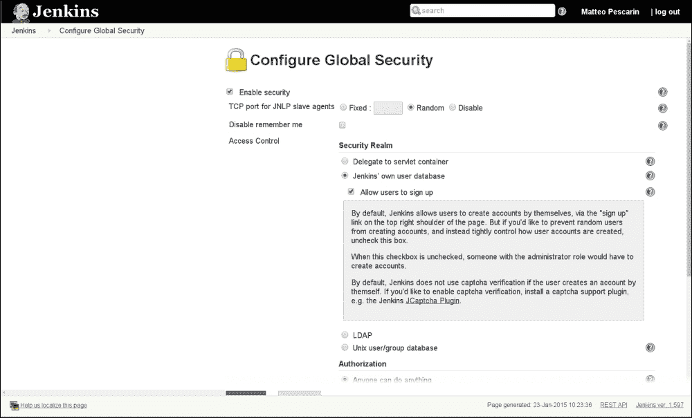
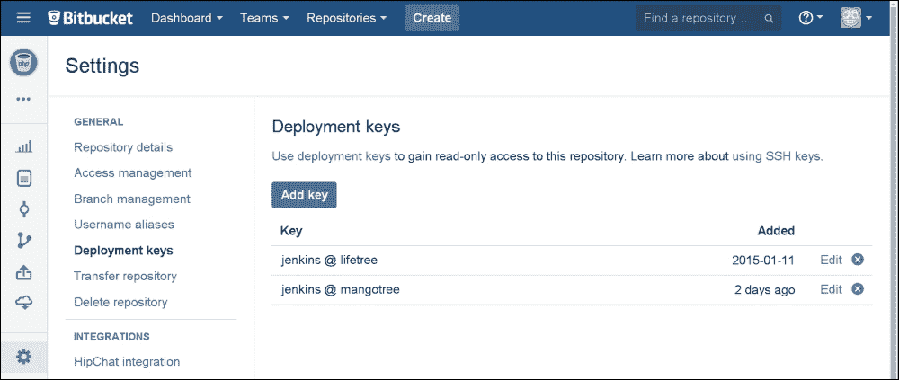
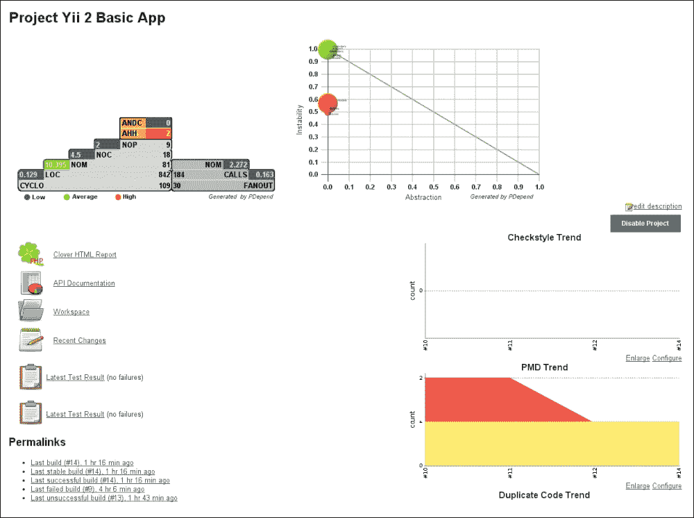

# 第九章. 利用自动化消除压力

到目前为止，我们已经涵盖了测试实践中几乎每个方面的内容。我们学习了在测试的所有级别（单元、功能、验收）上可以使用 Codeception 做些什么。我们还涵盖了如何通过考虑架构选择和长期考虑来改进和调试测试的额外资源。

简而言之，在本章中，我们将采取最终一步，这在当今被认为是最佳实践：持续集成。

我们将了解什么是持续集成系统，以及我们有哪些选择。我们还将开始使用 Jenkins。

在本章中，我们将讨论我们需要安装和配置的所有内容。我们将运行我们的构建，并为我们的项目获得所需的自动化水平。我们将涵盖以下主题：

+   自动化构建过程

+   创建所需的构建文件

+   配置 Jenkins 构建

+   展望未来

# 自动化构建过程

在规划和实施测试时，你应该始终考虑两个方面的因素。首先，100% 的代码覆盖率并不能帮助你消除出现或引入错误的可能性，这意味着探索性手动测试始终是必要的，并且它必须在编写初始测试计划草案时考虑进去。其次，到目前为止，我们为这样一个小型项目生成的所有测试和报告都可以由更改代码的任何人手动运行。

当你的代码规模开始增长，你开始支持数百个类和多方面的前端功能时，当你的代码存活超过第一个月，并且不止一个开发者需要反复访问它时，所有与测试及其工作方式或可以从它们中提取的信息相关的知识将变得越来越难以维护。最糟糕的是，很可能没有人会不费吹灰之力地使用它。

在这里，你有两个选择：接受你的测试最终会被遗忘的命运，没有人会知道已经覆盖了什么以及还需要覆盖什么，或者通过强制某种形式的自动化代码修订来开始自动化所有这些，这可能会触发报告和电子邮件来警告可能发生或已经发生的问题。

## 介绍持续集成系统

**极限编程**（**XP**）引入了**持续集成**（**CI**）的概念。如今，它被许多公司作为其 QA 流程的一部分使用，无论采用何种实践。

频繁集成是否比持续集成更好，我更愿意将这个问题留到讨论之外。两者之间的主要区别在于集成的频率。在此基础上，CI 被构想为 TDD 的一部分，并且专门针对在将任何功能合并到活动分支之前运行测试。这样做是为了确保新功能不会破坏现有功能。

类似于 Jenkins（以前称为 Hudson）、Bamboo、CruiseControl 和 Travis 这样的系统，是为了在发货前将不同开发者的工作集成和测试而创建的。这也确保了达到一定的质量标准，以避免在代码库中引入不一致性，并且可以将结果报告给开发者。

这些软件系统执行了众多任务。它们被设计成可以支持任何编程语言和测试框架。

通常，它们被构建成提供一种灵活的方式来定义你的集成工作流程：代码检出、准备、构建（通常包括测试和其他质量保证相关的任务）、报告发布、工件创建，最终部署。所有这些步骤都可以在系统内部或通过各种类型的脚本进行控制。例如，你可以在 Travis、Bamboo 或 Jenkins 中使用 Ant 或 Maven。除了基本功能外，这些系统中通常还提供了一些插件，用于扩展集成第三方应用程序、库和服务的功能。

在深入了解我们选择的持续集成系统的配置细节之前，我们可能首先想看看有哪些可用的选项以及我们如何进行选择。

## 可用系统

有许多 CI 系统，其中许多是为特定的编程语言专门创建的；因此，它们只能执行一组有限的操作。

系统越复杂，准备它按照我们的期望运行所需的时间就越长，但你将能够执行所需的所有功能，并且你还可以根据项目需求逐个开启或关闭它们。

最著名的系统是 Jenkins。它是一个开源系统 ([`jenkins-ci.org`](http://jenkins-ci.org))。它在 2011 年从 Hudson 分支出来，之后与 Oracle 发生争议。它是一个用 Java 编写的 CI 系统，并作为 CruiseControl 的替代品而流行起来。它一直被视为最多功能化的 CI 系统。这也得益于其庞大的社区，为各种功能提供了数百种不同的插件。

我看到的 Jenkins 的唯一问题，除了配置之外，就是托管它，尽管安装和维护对我来说一直都很简单。

您可能无法自己托管系统，因此您可能想寻找提供托管解决方案的东西。Bamboo 是另一个选择，据说如果您从 Jenkins 迁移，它特别简单。它还提供了与其他 Atlassian 产品（如 Jira、BitBucket、HipChat 等）开箱即用的集成。

作为一种选择，我们将研究 Jenkins，安装所需的插件，然后使用 Apache Ant 脚本创建构建。

## 安装和配置 Jenkins

关于 Jenkins 的安装没有太多可说的。正如安装页面所示，它是跨兼容的，可以在 Windows、Linux、Unix 和 Docker 等操作系统上运行。更多信息，请查看[`wiki.jenkins-ci.org/display/JENKINS/Installing+Jenkins`](https://wiki.jenkins-ci.org/display/JENKINS/Installing+Jenkins)。

### 注意

重要的是要记住，它唯一的依赖项是 Java，因此您应该有 JDK 和 JRE 的最新版本。

大多数发行版已经打包了 Jenkins，并提供了他们的官方软件包仓库，从而解决了大多数依赖性问题。

在 *nix 系统上的安装将创建其自己的专用用户 `Jenkins`，该用户将用于执行通过其界面运行的所有操作。永远不要以超级用户身份运行 Jenkins。这可能会引起安全问题。项目将被检出到的工 作空间通常位于 `/var/lib/jenkins/home/workspace`，如果出现问题，您可以手动检查。

当 Jenkins 启动时，它将监听端口 `8080`（不总是这样，如果有的话，请务必阅读安装后的说明，或者使用 Linux 上的 `netstat -ltn` 检查已打开的端口），并且可以通过网页浏览器访问。

### 小贴士

如果您想将您的服务暴露给更广泛的受众，那么您可能需要安装一个代理，以便从端口 `80` 以您想要的任何主机名提供服务。我们不会涉及这个方面，但 Jenkins 提供了额外的文档，说明如何实现这一点。

因此，让我们在我们的浏览器中打开 `http://<yourhostname>:8080`，并开始配置基本设置。

### 理解 Jenkins 组织结构

在这样做之前，您可能需要了解 Jenkins 的组织结构。如果您已经对它有经验，那么您可能想跳到下一节。

您只需要关注两个部分：

+   job 列表

+   管理面板

第一个通常是您通常会到达的地方，也是您大部分时间将在此处工作的地方。

在 Jenkins 术语中，一个 **job** 是在特定项目中需要执行的一组特定的规则和操作。您可以为同一项目设置不同的 job，它们执行稍微不同或完全不同的操作，并且这些可以按顺序触发。

**构建**是执行作业的过程。我们将介绍这一点，并看看通过配置作业的各个方面，我们可以通过单个构建实现什么。构建可以导致创建一个或多个工件，部署构建结果到某个地方，或者在 Jenkins 内部或外部触发其他作业或进程。

在安装 Jenkins 后，你需要立即修复其安全性，除非你将是唯一访问它的人，并且安装它的服务器将没有外部访问，那么导航到`http://jenkins:8080/configureSecurity/`可能更好。

你可以设置你想要的任何身份验证系统，使用 PAM、LDAP 或其内部用户数据库。我们将使用后者，但请记住，如果你愿意做一点更强大或更互联的事情，可能需要遵循额外的步骤。大多数界面表单都有几个小的信息按钮，你可以使用它们来显示一些信息，如下面的截图所示：



**配置全局安全**页面的视图，带有打开的信息框

需要你稍微思考的第二个方面是 Jenkins 将如何访问和检查你的仓库。

任何主要的在线仓库提供商，如 GitHub 和 BitBucket，都会让你创建一个所谓的**部署密钥**，它用于对仓库的只读访问。

对于更复杂的事情，比如合并和推送你的分支，你需要为它设置自己的用户，如下面的截图所示：



BitBucket 中部署密钥设置页面，可通过每个仓库的设置访问

如果你有多于一个由不同地方托管的仓库，那么你需要为 Jenkins 设置所需数量的凭证。这可以通过访问`http://jenkins:8080/credential-store/`（或**首页** | **凭证** | **全局凭证**）来完成。正如你所见，幕后有很多内容，所以请随意探索并阅读文档以了解所需内容。通常，从设置全局凭证开始可能就足够了，但在某些情况下可能需要非全局配置。

为了做到这一点，我们首先需要为用户`jenkins`创建 SSH 密钥对。

```php
peach ~ $ sudo -s
root peach # su jenkins -
jenkins peach $ cd ~
jenkins ~ $ pwd
/var/lib/jenkins
jenkins ~ $ ssh-keygen
Generating public/private rsa key pair.
Enter file in which to save the key (/var/lib/jenkins/.ssh/id_rsa):
Enter passphrase (empty for no passphrase):
Enter same passphrase again:
Your identification has been saved in /var/lib/jenkins/.ssh/id_rsa.
Your public key has been saved in /var/lib/jenkins/.ssh/id_rsa.pub.
The key fingerprint is:
ff:be:b1:ee:c2:69:82:96:00:e4:9d:dd:67:cf:1e:d7 jenkins@mangotree
The key's randomart image is:
+---[RSA 2048]----+
|                 |
|                 |
| . . o. .        |
|+ . *.oo  .      |
|.o o .o+S. E     |
|+ o   .+o        |
|+*. . o.         |
|+. . .           |
|                 |
+-----------------+

```

现在你已经拥有了你的 SSH 密钥，你需要获取公钥，它存储在`/var/lib/jenkins/.ssh/id_rsa.pub`，然后将其作为部署密钥复制到你的仓库中。你可以使用以下命令将其复制到剪贴板：

```php
root jenkins # xclip -sel clip < /var/lib/jenkins/.ssh/id_rsa.pub

```

这是通过`root`用户完成的，因为`jenkins`用户在其环境中不会设置 X 显示，这很可能会引起这里显示的错误：

```php
No protocol specified
Error: Can't open display: :0

```

### 小贴士

如果你在一个无头服务器上，那么你不会有太多选择。你可以将文件`scp`到你的本地机器，或者`cat`文件然后手动将其粘贴到浏览器中。

现在您已经设置了部署密钥，需要回到 Jenkins 并导航到凭据存储。一旦到达那里，将用户名设置为`jenkins`（这是系统用户名），并将私钥设置为`From the Jenkins master ~/.ssh`。

以下部分将涵盖额外插件的安装和作业的配置。

### 安装所需的插件

现在您已经完成了 Jenkins 的基本配置，需要安装所需的插件，以确保一切按预期工作。

这个部分通常由 Jenkins 轻松处理。有一个专门针对 Jenkins 上 PHP 项目的项目。您可以在[`jenkins-php.org`](http://jenkins-php.org)找到它。该项目不仅列出了以下插件，还列出了一个可在 Jenkins 上使用的元插件，它将下载所有所需的插件。

+   **Checkstyle**：这是用于处理 Checkstyle 格式的 PHP_CodeSniffer 日志文件

+   **Clover PHP**：这是用于处理 PHPUnit 的 Clover XML 日志文件

+   **Crap4J**：这是用于处理 PHPUnit 的 Crap4J XML 日志文件

+   **DRY**：这是用于处理 PMD-CPD 格式的 phpcpd 日志文件

+   **HTML Publisher**：这是用于发布由 phpDox 生成的文档

+   **JDepend**：这是用于处理 JDepend 格式的 PHP_Depend 日志文件

+   **Plot**：这是用于处理 phploc CSV 输出的

+   **PMD**：这是用于处理 PMD 格式的 PHPMD 日志文件

+   **Violations**：这是用于处理各种日志文件

+   **xUnit**：这是用于处理 PHPUnit 的 JUnit XML 日志文件

上述列表来自[`jenkins-php.org/installation.html`](http://jenkins-php.org/installation.html)，未来可能会有所变化，请记住这一点。

如果您导航到**管理 Jenkins** | **管理插件**，然后可以搜索插件`php`并选择**安装无需重启**。当您处于安装页面时，选择**安装完成后重启 Jenkins 且没有作业运行时**选项（有时安装页面不会自动刷新，因此您可能需要刷新页面；即使您离开此页面，也会安装插件列表）。

现在，您需要安装这些插件所需的工具，因此打开`composer.json`文件，然后在`require-dev`部分添加以下内容：

```php
// composer.json
"phploc/phploc": "@stable",
"pdepend/pdepend": "@stable",
"phpmd/phpmd": "@stable",
"sebastian/phpcpd": "@dev",
"yiisoft/yii2-coding-standards": "*",
"theseer/phpdox": "@stable"
```

现在，运行`composer update`以有效安装这些插件。

# 创建所需的构建文件

构建配置的一部分将存储在 Jenkins 中，但它主要用于发布报告和文档（如果需要的话）。我们在第八章中看到了如何运行各种脚本的实际配置，*分析测试信息*。这位于 `build.xml` 文件中。这个默认名称可以被 Jenkins 自动识别。这可以进行配置，但除非你已经有一个同名文件，否则这样做是没有意义的。

构建文件应该位于项目仓库的根目录，并且应该具有有效的 XML 格式。

我们将用来编写构建文件的语言是 Apache Ant。对于这个问题，有更复杂的解决方案，如 Maven，或者更定制的解决方案，如 Phing，但我仍然更喜欢 Ant。这是因为它简单且灵活（它很冗长，但一旦编写，就没有多少可说的）。它还允许你运行任何非特定于特定语言的任何东西。

我们将通过从 `jenkins-php` 项目（可在 [`jenkins-php.org/automation.html`](http://jenkins-php.org/automation.html) 获取）复制基本结构来创建构建文件，然后通过在下几段中解释的修正来修改它。我将把 Composer、Yii 和 Codeception 的功能分别放在单独的文件中，而主功能（来自 `jenkins-php`）将保持不变。

## 理解基本的 Ant 结构

Ant 非常简单，因为它是一系列指令的集合。XML 的根是一个 `<project>` 标签，它包含一系列 `<target>` 标签，这些标签可以从 Jenkins 作业中调用，你可以选择 `<property>` 选项来定义属性，然后选择 `<include>` 语句来包含单独的文件。

目标没有默认名称，但主要目标通常称为 `build`。它附带一系列依赖项，这些依赖项会依次触发其他目标。

每个指令都有一系列额外的属性和标签，并且这些可以嵌套在其中。用户贡献的指令也可以单独下载（并且大多数 Linux 发行版都在单独的包中提供了常见的指令）。这可以帮助你在手动创建这些指令时节省精力。例如，你可以用它来归档和打包一组文件，这些文件通常是实际命令行工具的包装器。

### 注意

记住，Ant 不是一个命令式编程语言，所以如果你想扩展和修改该语言，请检查其文档。

核心 Ant 指令的文档可在 [`ant.apache.org/manual/`](http://ant.apache.org/manual/) 在线获取，这可能是理解它的良好起点。

## 调整 build.xml 文件

与您从`jenkins-php`复制的文件相比，我们将保留大部分目标，尽管`phpunit`目标可以安全删除。这是因为我们将切换到专门针对 Codeception 的自定义目标。其余的更改将在单独的文件中进行，并且将在之后进行讨论。

需要做的最重要的更改与您希望这些程序工作的文件夹有关。每个命令都接受不同的参数，因此请包含您想要的所有目录。让我们开始修改第一个目标，它将对所有指定的文件进行语法检查：

```php
<target name="lint" description="Perform syntax check of sourcecode files">
    <apply executable="php" failonerror="true">
        <arg value="-l" />

 <fileset dir="${basedir}/models">
 <include name="**/*.php" />
 <modified />
 </fileset>
 <fileset dir="${basedir}/modules">
 <include name="**/*.php" />
 <modified />
 </fileset>
 <fileset dir="${basedir}/controllers">
 <include name="**/*.php" />
 <modified />
 </fileset>
 <fileset dir="${basedir}/tests">
 <include name="**/*.php" />
 <modified />
 </fileset>
    </apply>
</target>
```

接下来，我们可以将我们的代码目录添加到 phploc 中，这样我们就可以了解我们项目的复杂度：

```php
<target name="phploc-ci"
        depends="prepare"
        description="Measure project size using PHPLOC and log result in CSV and XML format. Intended for usage within a continuous integration environment.">
    <exec executable="${toolsdir}phploc">
        <arg value="--count-tests" />
        <arg value="--log-csv" />
        <arg path="${basedir}/build/logs/phploc.csv" />
        <arg value="--log-xml" />
        <arg path="${basedir}/build/logs/phploc.xml" />
 <arg path="${basedir}/models" />
 <arg path="${basedir}/controllers" />
 <arg path="${basedir}/modules" />
 <arg path="${basedir}/tests" />
    </exec>
</target>
```

pdepend 在定义新目录时使用不同的语法；正如您所看到的，如果您需要做出更改，您将需要手动调用命令的帮助：

```php
<target name="pdepend"
        depends="prepare"
        description="Calculate software metrics using PHP_Depend and log result in XML format. Intended for usage within a continuous integration environment.">
    <exec executable="${toolsdir}pdepend">
        <arg value="--jdepend-xml=${basedir}/build/logs/jdepend.xml" />
        <arg value="--jdepend-chart=${basedir}/build/pdepend/dependencies.svg" />
        <arg value="--overview-pyramid=${basedir}/build/pdepend/overview-pyramid.svg" />
        <arg path="${basedir}/models,${basedir}/controllers,${basedir}/modules,${basedir}/tests" />
    </exec>
</target>
```

接下来是 PHP 混乱检测（PHPMD），它将帮助我们保持代码整洁。再次强调，语法与之前的不同：

```php
<target name="phpmd-ci"
        depends="prepare"
        description="Perform project mess detection using PHPMD and log result in XML format. Intended for usage within a continuous integration environment.">
    <exec executable="${toolsdir}phpmd">
        <arg path="${basedir}/models,${basedir}/controllers,${basedir}/modules" />
        <arg value="xml" />
        <arg path="${basedir}/build/phpmd.xml" />
        <arg value="--reportfile" />
        <arg path="${basedir}/build/logs/pmd.xml" />
    </exec>
</target>
```

PHP 代码检查器（PHPCS）也可以作为代码检查的额外且更重要的一步。正如解释的那样，我们还需要指定特定的 Yii 编码标准：

```php
<target name="phpcs-ci"
        depends="prepare"
        description="Find coding standard violations using PHP_CodeSniffer and log result in XML format. Intended for usage within a continuous integration environment.">
    <exec executable="${toolsdir}phpcs" output="/dev/null">
        <arg value="--report=checkstyle" />
        <arg value="--report-file=${basedir}/build/logs/checkstyle.xml" />
        <arg value="--standard=${basedir}/vendor/yiisoft/yii2-coding-standards/Yii2/ruleset.xml" />
        <arg value="--extensions=php" />
        <arg value="--ignore=autoload.php" />
 <arg path="${basedir}/models" />
 <arg path="${basedir}/controllers" />
 <arg path="${basedir}/modules" />
 <arg path="${basedir}/tests" />
    </exec>
</target>
```

最后一个是 PHP 复制粘贴检测器（PHPCPD），它确实如其标签所示：

```php
<target name="phpcpd-ci"
        depends="prepare"
        description="Find duplicate code using PHPCPD and log result in XML format. Intended for usage within a continuous integration environment.">
    <exec executable="${toolsdir}phpcpd">
        <arg value="--log-pmd" />
        <arg path="${basedir}/build/logs/pmd-cpd.xml" />
 <arg path="${basedir}/models" />
 <arg path="${basedir}/controllers" />
 <arg path="${basedir}/modules" />
    </exec>
</target>
```

如您可能已经注意到的，我粘贴的一些目标是`-ci`目标。这些目标是 Jenkins 生成所有必要报告所必需的。我们将选择这些目标，并在我们的构建中发布它们。请记住，也要在其他目标上镜像这些更改；我在这里排除了它们以避免冗余。

除了这些更改之外，值得注意的是，我选择了 Yii 2 CheckStyle 规则集来验证语法。这一步对于维护整体代码风格以及与框架开发者和跨团队使用的风格保持同步非常有用。

现在我们已经做出了基本更改，让我们转到 Composer、Yii 和 Codeception 文件。

## 准备构建环境

默认调用的`build`命令有一个依赖链，将依次触发`prepare`目标，运行一些构建的其他目标，运行测试，然后使用 phpDox 生成所需的文档。

`prepare`目标依赖于`clean`目标。这两个步骤将清理环境，生成所需的文件夹结构以容纳后续步骤将产生的结果，并设置一些属性以避免两次调用目标。

例如，`prepare`目标在最后设置了以下属性：

```php
<property name="prepare.done" value="true"/>
```

当前的目标定义是：

```php
<target name="prepare"
        unless="prepare.done"
        depends="clean, composer.composer, yii.migrate-all"
        description="Prepare for build">
```

现在已经很明显，*除非*设置了属性，否则我们可以执行目标的内联内容。`clean`目标也会发生同样的事情。

在这两个目标中，我们需要更新每次作业运行时清理和重新创建的目录列表。至少，你应该有以下目录，你也可以为`clean`包括任何与你的项目相关的其他目录。

```php
<target name="clean"
        unless="clean.done"
        description="Cleanup build artifacts">
 <delete dir="${basedir}/runtime/*"/>
 <delete dir="${basedir}/web/assets/*"/>
 <delete dir="${basedir}/vendor"/>
 <delete dir="${basedir}/build/api"/>
 <delete dir="${basedir}/build/logs"/>
 <delete dir="${basedir}/build/pdepend"/>
 <delete dir="${basedir}/build/phpdox"/>
 <delete dir="${basedir}/tests/codeception/_output"/>
    <property name="clean.done" value="true"/>
</target>
```

对于`prepare`，以下目录将被重新创建：

```php
<target name="prepare"
        unless="prepare.done"
        depends="clean, composer.composer, yii.migrate-all"
        description="Prepare for build">
    <mkdir dir="${basedir}/build/api"/>
 <mkdir dir="${basedir}/build/logs"/>
 <mkdir dir="${basedir}/build/pdepend"/>
 <mkdir dir="${basedir}/build/phpdox"/>
 <mkdir dir="${basedir}/tests/codeception/_output"/>
    <property name="prepare.done" value="true"/>
</target>
```

## 添加所需的配置设置

在我们开始添加自定义文件之前，我们需要添加一些配置文件，这些文件中的一些可执行文件（即 phpmd 和 PHPDox）期望在`/build`目录中。

`jenkins-php`项目将提供大部分这些配置文件，并且可以从[`jenkins-php.org/configuration.html`](http://jenkins-php.org/configuration.html)复制。

在 phpmd 的情况下，你可以调整循环复杂度阈值的级别。

```php
    <!-- build/phpmd.xml -->
    <rule ref="rulesets/codesize.xml/CyclomaticComplexity">
        <priority>1</priority>
        <properties>
            <property name="reportLevel" value="7" />
        </properties>
    </rule>
```

默认值通常是`10`，但建议的值是`5`。

对于 PHPDox，情况稍微复杂一些。当前的配置并不特别灵活，所以我决定走最长可能的路线，即使用以下命令生成骨架文件：

```php
$ vendor/bin/phpdox --skel > build/phpdox.xml

```

这创建了一个包含所有文档选项的文件，然后我创建了自定义的配置文件：

```php
<?xml version="1.0" encoding="utf-8" ?>
<!-- build/phpdox.xml -->
<phpdox  silent="false">
    <project name="Yii2" source="${basedir}/.." workdir="${basedir}/phpdox">

        <collector publiconly="false">
            <include mask="${phpDox.project.source}/models/*.php" />
            <include mask="${phpDox.project.source}/modules/*.php" />
            <include mask="${phpDox.project.source}/controllers/*.php" />
            <include mask="${phpDox.project.source}/vendor/yiisoft/yii2/*.php" />
        </collector>

        <generator output="${basedir}/api">
            <build engine="html" enabled="true">
                <file extension="html" />
            </build>
        </generator>

    </project>
</phpdox>
```

不论我如何努力，我目前使用的版本（0.7）存在一个 bug，导致它在从 Jenkins 运行时崩溃。这个问题已经在当前的 dev-master 版本中修复，但这给我带来了其他问题。我非常确信，当下一个版本发布时，你应该不会有问题。在我们的情况下，从非工作测试的角度来看，文档并不是那么关键。

## 在 Ant 中添加 Composer、Yii 和 Codeception 支持

现在我们需要集成准备我们的应用程序进行测试所需的变化。我们将使用 Composer 来安装所需的依赖项，并使用 Yii 来运行所需的迁移。之后，我们需要支持 Codeception，因为它是运行测试的主要工具。

正如我们在`prepare`的定义中看到的，目标是依赖于`clean`、`composer.composer`和`yii.migrate-all`。

第一个目标是来自[`github.com/shrikeh/ant-phptools`](https://github.com/shrikeh/ant-phptools)的，它为 Composer 提供了一个包装器。它不是最好的，但它是快速搜索中唯一出现的一个。这个包做得相当不错，并且依赖于一个名为`composer.properties`的属性文件，项目作者提供了一个示例。

### 小贴士

在 Ant 脚本中，有一些内置属性是可访问的，这有助于理解，例如，当前目录，并以更可分发的方式构建适当的路径。这可以在[`ant.apache.org/manual/properties.html`](http://ant.apache.org/manual/properties.html)找到。

调用`composer.composer`目标将安装 Composer，如果指定目录中未找到，并使用它来更新所有依赖项。我更希望它清除依赖项的安装目录，然后运行`composer install`。不幸的是，这是安装`composer.lock`中定义的依赖项的唯一方法，而不是更新它们。

### 小贴士

如果您对`composer.lock`和`composer.json`之间的差异有任何疑问，请随时退后一步，快速浏览第二章，*为测试做准备*。

我已经将`composer.xml`和`composer.properties`文件放在了`/build`目录中，并在`build.xml`中定义的项目开头添加了以下内容。

```php
<include file="${basedir}/build/composer.xml" as="composer"/>
```

现在，我们可以将`composer.composer`的依赖项添加到`prepare`目标中定义的目标列表中，而不会出现任何问题。

第二步是将数据库重置到我们可以使用的状态，我们将通过重新运行所有迁移并应用所有缺失的迁移来实现这一点。

为了这个，我创建了一个简单的 Ant 项目。您可以将它放在您的`/build`目录中，您可以从[`github.com/ThePeach/Yii2-Ant`](https://github.com/ThePeach/Yii2-Ant)下载它。该项目为运行迁移的 Yii CLI 界面提供了一个包装器。

我不会深入这个项目的细节，因为它很简单，可以很容易地理解。

我们可以像在早期的 Composer 项目中那样包含它，如下所示：

```php
<!-- build.xml -->
<include file="${basedir}/build/yii.xml" as="yii"/>
```

您可以通过调用现成的目标`migrate-all`来调用它，就像我们在`build.xml`中为`prepare`的依赖项所做的那样，或者按照您想要的方式调用`migrate` MacroDef：

```php
<migrate exec="${yii.script}" action="down"/>
<migrate exec="${yii.script}" action="up"/>
<migrate exec="${yii.tests.script}" action="down"/>
<migrate exec="${yii.tests.script}" action="up"/>
```

### 注意

Ant 必须扩展其基本语法，这定义了新的任务，如 MacroDef。您可以在官方 Apache Ant 文档中了解更多信息，该文档可在[`ant.apache.org/manual/Tasks/macrodef.html`](https://ant.apache.org/manual/Tasks/macrodef.html)找到。

`migrate`操作将始终将`all`作为参数传递给`yii`脚本，这对于我们想要实现的目标来说已经足够了，但这一点可以改进。

以类似的方式添加了 Codeception。您可以从我创建的存储库中获取副本，该存储库位于[`github.com/ThePeach/CodeCeption-Ant`](https://github.com/ThePeach/CodeCeption-Ant)。

此 Ant 项目提供了一个名为`run-tests`的主要目标，您可以在不担心太多参数的情况下执行它。您还可以在运行时动态传递一些参数来微调 Codeception 的调用，例如`codeception.suites`和`codeception.options`。

```php
$ ant -Dcodeception.suites=unit -Dcodeception.options=--coverage-html build

```

如果未设置，这些将分别分配空值和`--xml --coverage-xml --coverage-html`。

# 配置 Jenkins 构建

配置构建的最简单方法是从`jenkins-php`项目模板开始。您始终可以单独导入它，并在以后将其与自己的项目集成。

在`jenkins-php`网站上可用的**集成**页面（[`jenkins-php.org/integration.html`](http://jenkins-php.org/integration.html)）将解释如何导入项目。请记住根据您的配置调整参数。

现在转到仪表板，点击新的项目**jenkins-php**，然后从菜单中选择**配置**。

如果您从未使用过 Jenkins，那么配置页面的长度可能会让您有些害怕。然而，您只需要记住三个部分，我们现在将介绍它们。

## 通用构建设置

通用构建设置包含构建的启用/禁用开关设置、保留多少构建、何时丢弃构建以及仓库配置等设置。

如果您使用 Git，那么您将能够配置几乎任何东西，例如能够合并分支、提交并推送集成更改等。

我们只需指定分支为`*/master`，并将部署密钥设置为之前在代码库提供商处保存的值。

## 构建设置

当决定要运行什么时，您只需要关注构建设置；在这里，您指定目标名称和任何附加选项。

在我们的案例中，这是`build`，通过点击**高级**，我们可以将`codeception.suites=unit`填入**属性**字段。这将允许我们在不等待很长时间的情况下运行测试构建。

## 构建后设置

这是配置中最长的部分。所有将在构建仪表板中发布报告的步骤，例如将文档链接到各个部分、选择所需的阈值以决定是否标记作业失败等，都定义在这里。

这里定义的默认阈值相当高，所以您不必担心太多。

我们需要做的唯一更改是关于 Codeception 生成的报告，它将提供 JUnit XML 报告、Clover XML 报告以及 HTML 格式的覆盖率。

在配置页面的末尾，您将找到一个标题为**发布 Clover PHP 覆盖率报告**的部分，在这里更新 Clover XML 报告路径为`tests/codeception/_output/coverage.xml`，并将**发布 HTML 报告**更新为`tests/codeception/_output/coverage/`。如果您点击**高级面板**，那么您将能够修改阈值，并可以使用它们来决定您需要从测试中获得多少覆盖率。

在此步骤之后，您将看到**发布 xUnit 测试结果报告**，在这里将`PHPUnit-3.x 模式`更改为`tests/codeception/_output/report.xml`。像之前一样，在下一步中，您可以配置失败测试的阈值。默认情况下，不应该有任何失败的测试。因此，所有字段都将设置为 0。除非您想生活在耻辱中，否则不要更改此设置。

## 执行作业

让我们测试一切，并检查它是否按预期工作。保存配置，然后点击**立即构建**来执行作业。

一旦完成，您可以回到构建页面，然后您将看到以下图表：



项目仪表板概览

列表右侧的大多数图表都是快速了解触发失败构建原因的方法。

由 PDepend 生成的两个图表，显示在最上方，分别是所谓的**概览金字塔**和**抽象不稳定性图表**。它们都显示了关于您项目的有趣统计数据，您可以根据这些数据在性能、可扩展性和可维护性方面做出一些决策。

### 小贴士

PDepend 文档提供了关于这两个图表的更多信息，我强烈推荐阅读以下资源：

+   [概览金字塔](http://pdepend.org/documentation/handbook/reports/overview-pyramid.html)

+   [抽象不稳定性图表](http://pdepend.org/documentation/handbook/reports/abstraction-instability-chart.html)

到目前为止，你应该已经拥有了前进并实施、改进和精通测试以及自动化项目的所有工具。

# 展望未来

如果你已经到达这个阶段，那么你可能需要考虑一些额外的因素。

正如我们所看到的，自动化结合了大量的报告工具、测试套件和其他项目，以帮助您理解、改进和分析您的项目。

自动化的最大抱怨之一是它执行所有测试的速度。

有一些技术可以将执行这些测试所需的时间减半。虽然 Jenkins 和 `jenkins-php` 通过执行 `build-parallel` 提供了并行运行目标的目标，但 Codeception 的情况略有不同，你需要通过扩展我们之前创建的 Ant 项目来采取不同的路线。Codeception 使用 robo-paracept 来并行化测试。

如果你想了解更多关于 Codeception 的信息，那么在 [`codeception.com/docs/12-ParallelExecution`](http://codeception.com/docs/12-ParallelExecution) 有一个不错的文章。你会注意到它将通过标记测试组并聚合它们来运行，这样 Paracept 就能够并行执行。

# 摘要

你已经看到了关于自动化所需了解的大部分内容。这个话题相当广泛，我们已经涵盖了 Jenkins，它的运作方式以及如何配置它。我们学习了如何使用 Ant 来决定要做什么，以及如何驱动构建。我们还查看了构建生成的内容，并在 Jenkins 仪表板上显示。
