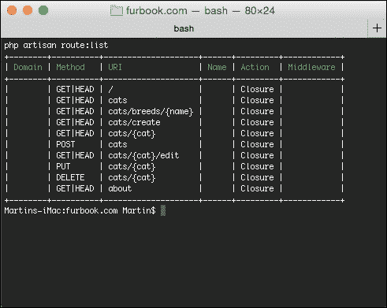

# 第六章：名为 Artisan 的命令行伴侣

在最后几章中，我们使用了 Artisan 来执行各种任务，例如运行数据库迁移。然而，正如我们将在本章中看到的，Laravel 的命令行工具具有更强大的功能，可以用来运行和自动化各种任务。在接下来的页面中，你将学习 Artisan 如何帮助你：

+   检查和交互你的应用程序

+   提高应用程序的整体性能

+   编写你自己的命令

在这次 Artisan 功能之旅结束时，你将了解它如何成为你项目中的不可或缺的伴侣。

# 跟踪最新变化

Laravel 不断添加新功能。如果你首次安装它已经过去几天了，尝试从你的终端运行一个 `composer update` 命令。你应该能看到 Laravel 及其依赖的最新版本正在下载。既然你已经在终端里了，了解最新功能只需一个命令：

```php
$ php artisan changes

```

这可以让你免于上网查找变更日志或阅读 GitHub 上漫长的提交历史。它还可以帮助你了解你之前不知道的功能。你还可以通过输入以下命令来找出你正在运行的 Laravel 版本：

```php
$ php artisan --version
Laravel Framework version 5.0.16

```

所有 Artisan 命令都必须从你的项目根目录运行。

### 注意

通过使用 Artisan Anywhere 这样的简短脚本，它可以在 [`github.com/antonioribeiro/artisan-anywhere`](https://github.com/antonioribeiro/artisan-anywhere) 找到，你也可以从项目的任何子目录中运行 Artisan。

# 检查和交互你的应用程序

使用 `route:list` 命令，你可以一目了然地看到你的应用程序将响应哪些 URL，它们的名称是什么，以及是否有任何中间件被注册来处理请求。这可能是熟悉别人构建的 Laravel 应用程序的最快方式。

要显示包含所有路由的表格，你只需输入以下命令：

```php
$ php artisan route:list

```

例如，以下是我们构建在 第三章，*你的第一个应用程序* 中应用程序的样子：



### 注意

在某些应用程序中，你可能会看到 `/{v1}/{v2}/{v3}/{v4}/{v5}` 被附加到特定的路由上。这是因为开发者已经注册了一个具有隐式路由的控制器，Laravel 将尝试匹配并将最多五个参数传递给控制器。

## 玩转内部结构

在开发应用程序时，你有时需要运行短期的、一次性的命令来检查数据库的内容，向其中插入一些数据，或检查 Eloquent 查询的语法和结果。你可以这样做的一种方法是通过创建一个临时路由，该路由使用闭包来触发这些操作。然而，这不太实用，因为它要求你在代码编辑器和你的网络浏览器之间来回切换。

为了使这些小更改更容易，Artisan 提供了一个名为 `tinker` 的命令，该命令启动应用程序并允许你与之交互。只需输入以下命令：

```php
$ php artisan tinker

```

这将启动一个类似于运行 `php -a` 命令时获得的 **Read-Eval-Print Loop** (**REPL**)，该命令启动一个交互式 shell。在这个 REPL 中，你可以在应用程序的上下文中输入 PHP 命令并立即看到它们的输出：

```php
> $cat = 'Garfield';
> App\Cat::create(['name' => $cat,'date_of_birth' => new DateTime]);
> echo App\Cat::whereName($cat)->get();
[{"id":"4","name":"Garfield 2","date_of_birth":…}]
> dd(Config::get('database.default'));

```

Laravel 5 版本利用了 PsySH，这是一个针对 PHP 的 REPL，它提供了一个更强大的 shell，支持键盘快捷键和历史记录。

## 关闭引擎

不论是因为你正在升级数据库还是等待将关键错误的修复推送到生产环境，你可能希望手动暂停你的应用程序以避免向访客提供损坏的页面。你可以通过输入以下命令来完成此操作：

```php
$ php artisan down

```

这将使你的应用程序进入 **维护** 模式。你可以通过编辑位于 `resources/views/errors/503.blade.php` 的模板文件来确定当用户以这种方式访问你的应用程序时显示什么内容（因为维护模式向客户端发送 `503 Service Unavailable` 的 HTTP 状态码）。要退出维护模式，只需运行以下命令：

```php
$ php artisan up

```

## 微调你的应用程序

对于每个传入的请求，Laravel 都必须加载许多不同的类，这可能会减慢你的应用程序，尤其是如果你没有使用 PHP 加速器，如 **APC**、**eAccelerator** 或 **XCache**。为了减少磁盘 I/O 并从每个请求中节省宝贵的时间，你可以运行以下命令：

```php
$ php artisan optimize

```

这将修剪并合并许多常见的类到一个位于 `storage/framework/compiled.php` 内的文件中。`optimize` 命令是你可以，例如，包含在部署脚本中的内容。

默认情况下，如果 `app.debug` 设置为 `true`，Laravel 不会编译你的类。你可以通过在命令中添加 `--force` 标志来覆盖此设置，但请注意，这将使错误信息更难以阅读。

## 缓存路由

除了缓存类映射以改善应用程序的响应时间外，你还可以缓存应用程序的路由。这是你可以包含在你的部署过程中的另一项内容。命令？只需输入以下内容：

```php
$ php artisan route:cache

```

缓存路由的优势是，由于路由已经被预编译，你的应用程序会稍微快一点。然而，由于路由过程现在引用一个缓存文件，任何新添加的路由都不会被解析。你需要通过再次运行 `route:cache` 命令来重新缓存它们。因此，这不适合开发阶段，因为路由可能会频繁更改。

## 生成器

Laravel 5 随带各种命令来生成不同类型的文件。在整个书中，我们已经使用了一些（即用于生成新的迁移文件），但还有其他一些。如果你在 `make` 命名空间下运行 `$ php artisan list`，你将找到以下条目：

+   `make:command`

+   `make:console`

+   `make:controller`

+   `make:event`

+   `make:middleware`

+   `make:migration`

+   `make:model`

+   `make:provider`

+   `make:request`

这些命令在你的 Laravel 应用程序适当的位置创建一个存根文件，其中包含你开始使用的样板代码。这节省了键位，从头开始创建这些文件。所有这些命令都需要指定一个名称，如下所示：

```php
$ php artisan make:model Cat

```

这将在 `app/Cat.php` 创建一个名为 `Cat` 的 Eloquent 模型类，以及一个相应的迁移来创建 `cats` 表。如果你在创建模型时不需要创建迁移（例如，如果表已经存在），则可以按照以下方式传递 `--no-migration` 选项：

```php
$ php artisan make:model Cat --no-migration

```

一个新的模型类看起来像这样：

```php
<?php namespace App;
use Illuminate\Database\Eloquent\Model;
class Cat extends Model {
  //
}
```

从这里，你可以定义自己的属性和方法。

其他命令可能有选项。最好的检查方法是命令名称后附加 `--help`，如下所示：

```php
$ php artisan make:command --help

```

你会发现这个命令有 `--handler` 和 `--queued` 选项来修改创建的类存根。

# 滚出你自己的 Artisan 命令

在这个阶段，你可能正在考虑编写自己的定制命令。正如你将看到的，使用 Artisan 做这件事出奇地简单。如果你使用过 Symfony 的 Console 组件，你会很高兴地知道 Artisan 命令只是它的一个扩展，语法稍微更丰富一些。这意味着各种助手将提示输入，显示进度条，或格式化表格，所有这些都可以在 Artisan 中使用。

我们将要编写的命令取决于我们在 第三章 中构建的应用程序，*你的第一个应用程序*。它将允许你将数据库中现有的所有猫记录导出为带或不带标题行的 CSV 文件。如果没有指定输出文件，命令将简单地以格式化的表格形式将所有记录输出到屏幕上。

## 创建命令

创建命令只需要两个步骤。首先，你需要创建命令本身，然后你需要手动注册它。

我们可以使用以下命令来创建我们之前看到的控制台命令：

```php
$ php artisan make:console ExportCatsCommand

```

这将在 `app/Console/Commands` 内部生成一个类。然后我们需要将此命令注册到控制台内核，位于 `app/Console/Kernel.php`：

```php
protected $commands = ['App\Console\Commands\ExportCatsCommand',];
```

如果你现在运行 `php artisan`，你应该看到一个名为 `command:name` 的新命令。这个命令目前还没有做任何事情。然而，在我们开始编写功能之前，让我们简要地看看它是如何内部工作的。

## 命令的结构

在新创建的命令类内部，你会找到为你生成的某些代码。我们将遍历不同的属性和方法，看看它们的目的。

前两个属性是命令的名称和描述。这里没有什么激动人心的，这只是当你运行 Artisan 时将在命令行中显示的信息。冒号用于命名空间命令，如下所示：

```php
protected $name = 'export:cats';

protected $description = 'Export all cats';
```

然后你会找到 `fire` 方法。这是当你运行特定命令时被调用的方法。从那里，你可以检索传递给命令的参数和选项，或者运行其他方法。

```php
public function fire()
```

最后，有两个方法负责定义传递给命令的参数或选项列表：

```php
protected function getArguments() { /* Array of arguments */ }
protected function getOptions() { /* Array of options */ }
```

每个参数或选项都可以有一个名称、一个描述和一个默认值，这个默认值可以是强制性的或可选的。此外，选项可以有快捷方式。

要理解参数和选项之间的区别，考虑以下命令，其中选项以两个连字符为前缀：

```php
$ command --option_one=value --option_two -v=1 argument_one argument_two

```

在这个例子中，`option_two` 没有值；它仅用作标志。`-v` 标志只有一个连字符，因为它是一个快捷方式。在你的控制台命令中，你需要验证用户提供的任何选项和参数值（例如，如果你期望一个数字，以确保传递的值实际上是一个数值）。

可以使用 `$this->argument($arg)` 获取参数，而选项——没错——使用 `$this->option($opt)`。如果这些方法没有接收任何参数，它们将简单地返回完整的参数列表。你通过它们的名称来引用参数和选项，即 `$this->argument('argument_name');`。

## 编写命令

我们将首先编写一个方法，从数据库中检索所有猫并将它们作为数组返回：

```php
protected function getCatsData() {
  $cats = App\Cat::with('breed')->get();
  foreach ($cats as $cat) {
    $output[] = [
      $cat->name,
      $cat->date_of_birth,
      $cat->breed->name,
    ];
  }
  return $output;
}
```

这里不应该有任何新内容。我们本可以使用 `toArray()` 方法，它将 Eloquent 集合转换为数组，但我们必须扁平化数组并排除某些字段。

然后我们需要定义我们的命令期望的参数和选项：

```php
protected function getArguments() {
  return [
    ['file', InputArgument::OPTIONAL, 'The output file', null],
  ];
}
```

要指定额外的参数，只需向数组中添加一个具有相同参数的额外元素：

```php
return [
  ['arg_one', InputArgument::OPTIONAL, 'Argument 1', null],
  ['arg_two', InputArgument::OPTIONAL, 'Argument 2', null],
];

```

选项的定义方式类似：

```php
protected function getOptions() {
  return [
    ['headers', 'h', InputOption::VALUE_NONE, 'Display headers?',
    null],
  ];
}

```

最后一个参数是如果未指定，参数和选项应该具有的默认值。在这两种情况下，我们希望它是 `null`。

最后，我们编写 `fire` 方法的逻辑：

```php
public function fire() {
  $output_path = $this->argument('file');

  $headers = ['Name', 'Date of Birth', 'Breed'];
  $rows = $this->getCatsData();

  if ($output_path) {
    $handle = fopen($output_path, 'w');
      if ($this->option('headers')) {
        fputcsv($handle, $headers);
      }
      foreach ($rows as $row) {
        fputcsv($handle, $row);
      }
      fclose($handle);

  } else {
        $table = $this->getHelperSet()->get('table');
        $table->setHeaders($headers)->setRows($rows);
        $table->render($this->getOutput());
    }
}
```

虽然这个方法的大部分内容相对简单，但也有一些新特性。第一个是使用`$this->info()`方法，它将一条信息性消息写入输出。如果您需要以不同颜色显示错误消息，可以使用`$this->error()`方法。

在代码的下方，您将看到一些用于生成表格的函数。正如我们之前提到的，Artisan 命令扩展了 Symfony 控制台组件，因此继承了所有其辅助函数。这些可以通过`$this->getHelperSet()`访问。然后只需传递表格的标题和行数组，并调用`render`方法即可。

要查看我们命令的输出，我们将运行以下命令：

```php
$ php artisan export:cats
$ php artisan export:cats --headers file.csv

```

# 安排命令

传统上，如果您想要一个命令定期运行（每小时、每天、每周等），那么您必须在基于 Linux 的环境中设置 Cron 作业，或者在 Windows 环境中设置计划任务。然而，这也有一些缺点。它要求用户具有服务器访问权限并熟悉创建此类计划。此外，在基于云的环境中，应用程序可能不在单个机器上托管，或者用户可能没有创建 Cron 作业的权限。Laravel 的创建者认为这可以改进，并想出了一个表达性良好的安排 Artisan 任务的方法。

您的计划定义在`app/Console/Kernel.php`中，并且由于您的计划定义在这个文件中，它具有额外的优势，即存在于源控制中。

如果您打开 Kernel 类文件，您将看到一个名为`schedule`的方法。Laravel 默认提供这个方法作为示例：

```php
$schedule->command('inspire')->hourly();
```

如果您以前设置过 Cron 作业，您会看到这比 crontab 等价物更容易阅读：

```php
0 * * * * /path/to/artisan inspire
```

在代码中指定任务也意味着我们可以轻松地更改要运行的控制台命令，而无需更新 crontab 条目。

默认情况下，计划命令不会运行。要这样做，您需要一个单独的 Cron 作业，每分钟运行一次调度程序：

```php
* * * * * php /path/to/artisan schedule:run 1>> /dev/null 2>&1
```

当调度程序运行时，它将检查任何与计划匹配的作业，然后运行它们。如果没有匹配的计划，则在该次运行中不运行任何命令。

您可以自由地安排您想要的任何数量的命令，并且有各种表达性和描述性的方法来安排它们：

```php
$schedule->command('foo')->everyFiveMinutes();
$schedule->command('bar')->everyTenMinutes();
$schedule->command('baz')->everyThirtyMinutes();
$schedule->command('qux')->daily();
```

您还可以指定一个时间来运行计划中的命令：

```php
$schedule->command('foo')->dailyAt('21:00');
```

或者，您还可以创建更频繁的计划命令：

```php
$schedule->command('foo')->weekly();
$schedule->command('bar')->weeklyOn(1, '21:00');
```

第二个示例中的第一个参数是日期，其中`0`代表星期日，`1`到`6`代表星期一到星期六，第二个参数是时间，同样以 24 小时制指定。您还可以明确指定运行计划命令的日期：

```php
$schedule->command('foo')->mondays();
$schedule->command('foo')->tuesdays();
$schedule->command('foo')->wednesdays();
// And so on
$schedule->command('foo')->weekdays();
```

如果您有一个可能运行时间较长的命令，那么您可以防止它重叠：

```php
$schedule->command('foo')->everyFiveMinutes() ->withoutOverlapping();

```

除了计划，你还可以指定计划命令应在哪个环境下运行，如下面的命令所示：

```php
$schedule->command('foo')->weekly()->environments('production');

```

你可以使用这个功能在生产环境中运行命令，例如，定期存档数据或运行报告。

默认情况下，如果启用维护模式，计划命令不会执行。这种行为可以很容易地覆盖：

```php
$schedule->command('foo')->weekly()->evenInMaintenanceMode();
```

## 查看计划命令的输出

对于一些计划命令，你可能希望以某种方式查看输出，无论是通过电子邮件、记录到磁盘上的文件，还是发送回调到预定义的 URL。在 Laravel 中，所有这些场景都是可能的。

要通过以下命令通过电子邮件发送作业的输出：

```php
$schedule->command('foo')->weekly()
         ->emailOutputTo('someone@example.com'); 

```

如果你希望将作业的输出写入磁盘上的文件，这也很简单：

```php
$schedule->command('foo')->weekly()->sendOutputTo($filepath);

```

你也可以在作业运行后 ping 一个 URL：

```php
$schedule->command('foo')->weekly()->thenPing($url);

```

这将向指定的 URL 发送一个`GET`请求，此时你可以向你的聊天客户端发送消息，通知你命令已运行。

最后，你可以将前面的命令链式调用以发送多个通知：

```php
$schedule->command('foo')->weekly()
         ->sendOutputTo($filepath)
         ->emailOutputTo('someone@example.com');

```

然而，请注意，如果你希望同时发送电子邮件，你必须先将输出发送到文件。

# 摘要

在本章中，你学习了 Artisan 如何以不同的方式协助你在开发、调试和部署过程中的工作。我们还看到了如何轻松构建自定义 Artisan 命令并适应你的需求。

如果你相对较新于命令行，你将一瞥命令行工具的力量。另一方面，如果你是命令行的资深用户，并且使用其他编程语言编写过脚本，你一定能欣赏 Artisan 的简洁性和表达性。

在下一章中，我们将探讨 Laravel 为我们提供的安全应用程序的功能，以及用户认证和授权。
