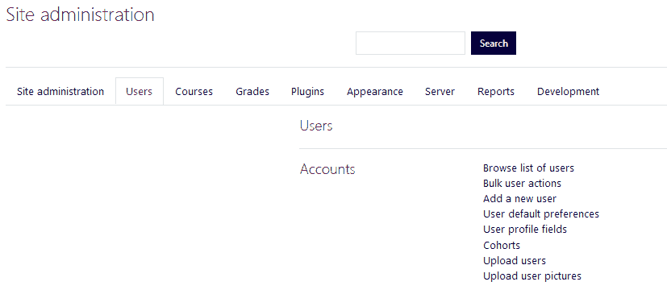
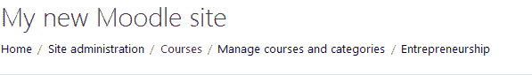
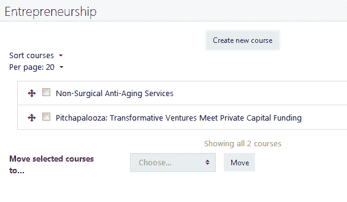
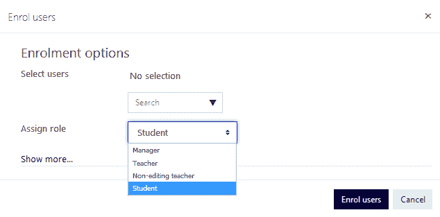
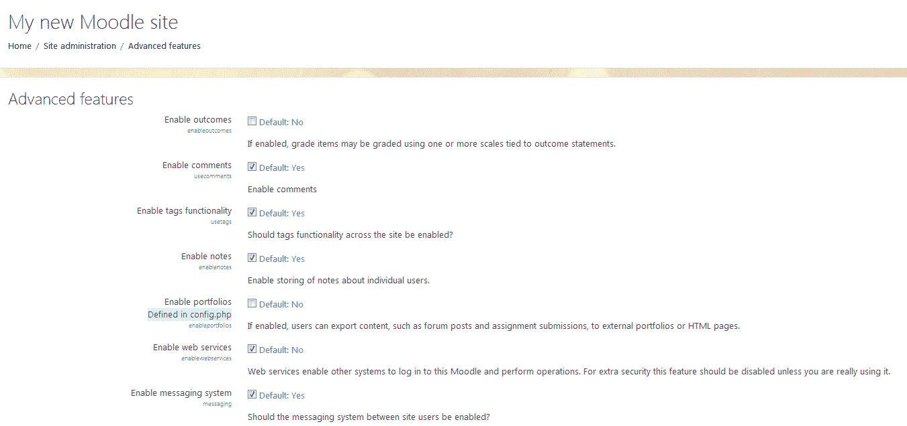
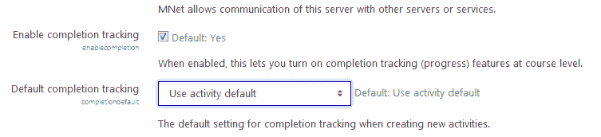
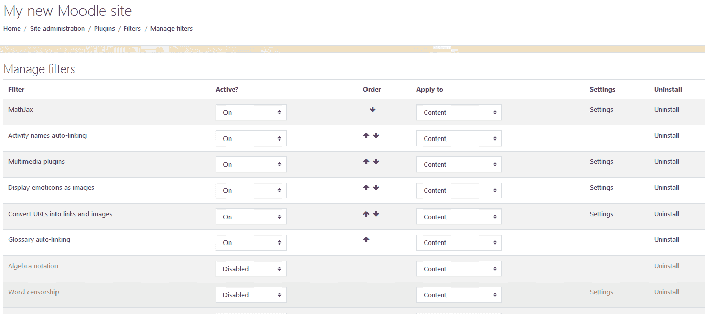
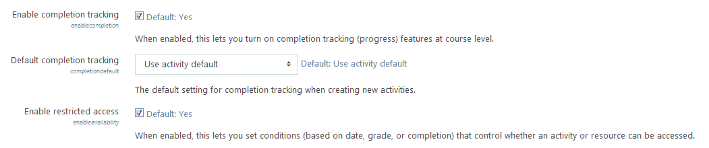

# 第一章：准备构建一个典范的 Moodle 课程

所以，您想要构建一个优秀的 Moodle 课程？或者也许想要改进您已有的课程？您来对地方了。我们希望帮助您充分利用 Moodle 所能提供的一切，同时为您的学习者创造更多吸引人和用户友好的体验。同时，我们还想确保您的工作不会比必要的更辛苦。我们将帮助您避免走弯路，并集中精力在最需要的地方投入时间。

在继续之前，请记住，本书的主要目标是帮助您将教学设计原则融入您的 Moodle 课程中。这不是一本 Moodle 食谱书，也不是一本包含详尽步骤指南的书。

我想花一点时间指出，本书使用的是 Boost 主题，这是 Moodle 3.5 的默认主题。如果您使用 MoodleCloud，您可能使用的是 Moodlecloud 主题，它与 Clean 主题非常不同。它更接近 Moodle 3.x 及更高版本的 Clean 主题。所以，有一个警告。Moodlecloud 主题与 Boost 非常不同，如果您在寻求 Clean 主题的指导，可能会感到沮丧。功能是相同的，但外观非常不同。

设计良好的 Moodle 课程包含的不仅仅是课程壳中的内容。课程设计过程始于一个配置最优的 Moodle 站点和对 Moodle 平台提供的机遇的理解。

在本章中，我们将讨论以下内容：

+   从课程设计者的角度探讨 Moodle 的优势

+   在您设置 Moodle 站点时，可用的资源来支持您

+   实施本书后面提出的想法所需的站点设置

# Moodle 的优势

我们将从问题“为什么选择 Moodle？”开始。它能为课程设计者、培训师和教育工作者提供什么？首先，作为我们自己也是教育工作者，我们可以说，Moodle 围绕教学理想或教育哲学构建的事实使其非常出色。更具体地说，Moodle 的设计是由受维果茨基、帕帕特等教育理论家启发的建构主义教学法驱动的。建构主义是一种教育观点，它依赖于人们通过在社交环境中构建文本、媒体或其他类似项目等人工制品的过程来创造知识。简而言之，这意味着 Moodle 的创造者马丁·道吉亚马斯（Martin Dougiamas）是基于人们有机会与他人构建、分享、协作和学习的理念来构建 Moodle 的。在我们讨论 Moodle 的功能时，我们将看到许多体现这一哲学的方式。

在今天这个分布式通信的世界里，人们通过他们的移动设备相互连接，并使用社交媒体进行沟通和协作，Moodle 最初的社会建构主义基础比以往任何时候都更有意义。

我们甚至可以说，在我们的社交媒体世界中，意义和现实往往被悬置，直到它们被社交媒体的存在所验证。这不再是一个导致现实社会建构的相对假设的过程，而是一个更直接的说法：事物不存在，直到它被我们的群体（在社交媒体上）所验证。这可能听起来有些严厉，但这就是我们引导我们的技术带我们走的道路，尽管我们声称生活在一个重视个人主义的世界中，但在教育、社区或企业方面，我们并不信任它。因此，Moodle 在当前这个时代再次绝对完美。

你可以在 Moodle 文档或 Moodle 文档维基中了解更多关于 Moodle 背后的教学法和哲学：[`docs.moodle.org/en/Pedagogy`](http://docs.moodle.org/en/Pedagogy%20and%20http://docs.moodle.org/en/Philosophy) 和 [`docs.moodle.org/en/Philosophy`](http://docs.moodle.org/en/Pedagogy%20and%20http://docs.moodle.org/en/Philosophy)。

尽管 Moodle 拥有坚实的教学基础，但它不会将你限制在一种教学方法上，这也是 Moodle 的另一个优点。在如何构建和交付课程方面，它提供了多种选择。实际上，我们正是利用这种灵活性作为本书组织的基础，各章节专注于 Moodle 的一些更常见的使用方式。有些方式高度依赖于社会建构主义策略，而有些则不那么依赖。如果你想创建一个自主学习的、以内容驱动的课程，Moodle 可以做到这一点。如果你需要促进基于群体的、以学生为中心的课程，Moodle 同样可以做到。同样，如果你想提供一个非常结构化、线性的课程，或者在光谱的另一端管理一个社区，我们认为你会发现 Moodle 非常适应。

# 开始使用 Moodle

为了充分利用这本书，你需要以教师（至少）的身份访问。在这个角色中，你将能够添加和编辑活动和资源，以便你可以尝试所提出的思想。拥有网站管理员权限很有帮助，但不是必需的。

如果你目前无法访问 Moodle 网站，或者缺乏课程编辑权限，那么你有几个选择。我们无法详细描述每个选项，但我们可以引导你找到资源，帮助你填补这些空白。

第一个选择是将您的 Moodle 站点设置和托管外包出去。如果您没有设置和管理 Web 服务器的经验，但需要您的 Moodle 站点能够在网络上可用，那么这个选择可能最适合您。Moodle Docs 网站提供了关于选择托管服务的全面讨论，可以在[`docs.moodle.org/en/Finding_and_Selecting_A_Web_Host`](http://docs.moodle.org/en/Finding_and_Selecting_A_Web_Host)找到。根据此页面概述，最适合您的选择将取决于您管理服务器和 Moodle 或其他学习管理系统方面的经验水平。同时，也需要权衡诸如成本和您偏好的 Moodle 支持水平等因素。我们建议寻找 Moodle 合作伙伴，因为他们是经过认证的服务提供商，具有高水平和丰富的经验。此外，每个 Moodle 合作伙伴都会将其收入的百分比捐献给 Moodle HQ，这笔资金反过来用于补偿那些使 Moodle 得以实现的开发者。

第二个选择是选择基于云的选项，即 MoodleCloud，这是一个由 Moodle 的开发者构建的非常易于使用的托管选项。如果您刚开始使用，MoodleCloud 是个不错的选择，因为您可以拥有多达 50 名参与者（教师和学生），并且可以设置您想要的任何数量的个人课程。它是一个很好的“沙盒”，您可以在这里探索 Moodle 丰富的资源和活动，并尝试不同的模式。您有高达 200 MB 的存储空间，50 个用户，并且可以使用 BigBlueButton 最多有 10 个网络研讨会参与者。以下截图显示了您在 MoodleCloud 网站上注册时将看到的菜单，网址为[`moodlecloud.com`](https://moodlecloud.com)：

第三个选择是在您自己的服务器或托管平台上安装自己的 Moodle 站点。有关完整说明，Moodle Docs 再次提供了一个很好的资源，可以在[`docs.moodle.org/en/Installing_Moodle`](http://docs.moodle.org/en/Installing_Moodle)的安装 Moodle 页面找到。

在您自己设置和管理网站时，有优点也有缺点，但对于某些人来说，这样做是一个不错的选择。例如，如果您自己设置和管理网站，通常的现金成本会较低，但您可能需要花费更多时间自行寻找解决方案。在安装插件或进行代码修改时，您也将拥有更多的自由和灵活性，尽管这是一个很好的功能，但您也有可能操作不当的风险。自己设置和管理网站的另一个缺点是，您可能受到规模的限制。如果您的组织有大量课程和用户，那么尝试独自完成所有工作可能会非常耗时。Moodle 更新和升级相当频繁，插件也经常发生变化。在不担心 Moodle 更新和插件升级的情况下管理课程和用户就已经足够耗时了。

如果您只是想尝试 Moodle 而不需要将您的网站提供给其他人，您可能会喜欢本地安装选项。使用本地安装，您基本上是在您的个人计算机上设置一个 Moodle 服务器。这个选项的优势在于，您拥有一个完全功能性的 Moodle 网站，您可以完全控制。此外，它很容易设置，如果您想进行实验，几乎没有风险会破坏您整个组织的课程或丢失数据。此外，如果您在某个时候喜欢您所创建的内容，您可以将单个课程或整个网站转移到托管在网上的网站上。

这种安排的最大缺点是，由于网站将不会公开可用，因此分享您所做的工作或让其他人参与测试将会更加困难。

对于本地安装，您可以选择 Mac 或 Windows 软件包。Windows 软件包可在[`download.moodle.org/windows/`](http://download.moodle.org/windows/)找到，Mac 版本可在[`download.moodle.org/macosx/`](http://download.moodle.org/macosx/)找到。无论您使用哪个平台，您都希望安装最新的稳定版本（即 `MOODLE_35_STABLE`）。开发版本很有趣，但您更有可能遇到错误。Linux 版本可在[`docs.moodle.org/35/en/Installing_Moodle`](https://docs.moodle.org/35/en/Installing_Moodle)找到。

最后，除了 MoodleCloud 之外，还有许多免费的 Moodle 主机选项可供选择。这些选项通常限制您只能使用单个课程或限制管理员权限，但对于初学者来说可能是一个不错的选择。尽管在大多数情况下，您将比本地安装提供的控制力更少，但这些选项确实提供了允许您将课程提供给其他人的优势。

您可以在[`docs.moodle.org/en/Free_Moodle`](http://docs.moodle.org/en/Free_Moodle)找到免费 Moodle 主机提供商的完整列表。

# 准备您的 Moodle 工作空间

如果您刚刚建立了第一个 Moodle 网站，那么您需要为接下来的章节活动做一些准备工作。如果您正在使用现有的 Moodle 网站，您可能想回顾这里提供的信息，以确保您有所有需要的内容来跟随。如果您是教师且无法创建额外的账户，请不要担心，因为 Moodle 提供了“切换角色到...”功能，允许您从学生的角度查看课程活动。

您需要完成以下任务：

1.  创建至少两个用户账户，一个将被分配为教师角色，另一个将被分配为学生角色

1.  创建一个新的课程外壳用于开发和测试

1.  在新课程外壳中为第一步创建的账户分配角色

现在，我们不会重复网络上和印刷品中丰富的详细管理员文档，我们只会指导您到每个活动列表中 ADMINISTRATION 块中的相应选项。我们还将提供相关文档的链接。对于这些管理任务和其他任务的更深入讨论，我们鼓励您投资于为 Moodle 管理员设计的培训。

# 创建用户账户

要创建您的两个用户账户，请前往网站管理菜单，默认情况下位于屏幕左侧，导航到“用户 | 账户”后点击“添加新用户”。然后，输入新用户账户所需的信息，并点击“创建用户”。以下截图显示了屏幕中间的导航栏。再次强调，我正在使用 Boost 主题，但您可能会注意到，字体颜色不是明亮的橙色，而是深紫色。

我在这本书中为可读性自定义了字体颜色：

您可以在[`docs.moodle.org/en/Add_a_new_user`](https://docs.moodle.org/en/Add_a_new_user)找到有关此内容的文档，或者在不确定的情况下，接受默认设置也是可以接受的。

# 创建一个新的课程外壳

现在，让我们创建一个课程外壳，以便我们的新用户可以通过以下步骤参与课程：

1.  前往“网站管理”

1.  点击“课程”

1.  点击“**管理课程和分类**”

1.  点击“创建新课程”按钮

1.  输入您新课程所需的信息

1.  点击“保存更改”

创建新课程后，您的课程将出现在菜单中的课程列表中，如下截图所示：

当我们开始设计您的课程时，我们将重新审视许多课程设置，但在此期间如果您需要更多信息，您可以在[`docs.moodle.org/26/en/Course_settings`](http://docs.moodle.org/26/en/Course_settings)找到。以下截图显示了如何添加新课程：

# 分配课程角色

当你完成创建课程外壳后，你将被提示将用户注册到课程中。转到你的课程块，然后转到参与者，然后点击“注册用户”。要分配课程角色，请执行以下步骤：

1.  要添加或注册你的教师账户，请点击“注册用户”按钮

1.  从屏幕顶部的角色列表中选择“教师”

1.  点击教师账户右侧的“注册”按钮以完成过程

1.  点击“完成注册用户”以关闭窗口。为你的学生账户重复此过程，角色设置为“学生”：

    

# 为课程设计者设置的站点

在我们将讨论转向 Moodle 课程设计的具体细节以及新创建的课程外壳之前，我们想在站点管理菜单中花更多的时间。

# 课程格式

如果你还没有机会探索站点管理菜单，首先你应该知道，虽然有很多“技术性”设置，但也有许多不那么技术性的设置，这些设置会影响课程设计者、教师和学生的网站使用体验。事实上，我们建议对于任何 Moodle 网站，至少应该有两个人审查网站设置：首先，一个专注于技术需求的系统管理员，其次，一个专注于影响那些提供和接收教学设置的教务技术专家。

从“站点管理”菜单中，点击“高级功能”。你将找到一个长长的选项列表：

在本节中，我们将介绍我们对一些最广泛适用的教学设置的推荐，以及一些我们鼓励你根据你组织的独特需求探索和考虑的其他设置。

你将不得不完成以下任务：

1.  启用过滤器，以便某些项目，如链接和视频，将自动出现在你的课程中

1.  点击“启用完成跟踪”以便学生可以跟踪他们在课程中的进度

1.  点击“启用剽窃插件”以便你可以配置剽窃插件，如[Turnitin.com](https://www.turnitin.com/)：

# 启用过滤器

在课程创建者的管理设置列表中，首先是过滤器。用非技术性术语来说，过滤器扫描你所写的内容，并应用规则以实现整洁的效果，例如自动创建链接或嵌入媒体。

要查看可用的过滤器完整列表，请转到站点管理菜单，然后转到插件 | 过滤器 | 管理过滤器。你将看到一个类似于以下截图的页面：

在这个页面上，我们建议启用或打开以下过滤器：

+   活动名称自动链接

+   术语自动链接

+   多媒体插件

如其名称所暗示的，活动名称自动链接和术语自动链接过滤器提供类似的功能。活动名称自动链接过滤器会在课程中其他地方提及活动名称时自动创建链接。例如，假设你在课程中有一个名为`Course Guide`的文件，并希望在论坛帖子中引用该指南。如果没有启用自动链接，你将需要复制指南的链接以包含在帖子中。然而，启用自动链接后，只要你按课程中文件或活动名称的准确拼写输入名称，Moodle 就会自动为你生成链接。这不仅为你节省了时间，而且也提高了学生使用性和导航性。

术语自动链接会在课程中其他地方使用术语时自动创建课程术语表中的条目链接。因此，如果学生在处理课程内容或阅读论坛帖子时遇到不熟悉的单词，他们可以快速点击链接，并在指尖获得其定义。更好的是，这些过滤器不仅适用于学生生成的内容，也适用于教师创建的内容。

在你开启自动链接之前，务必提前通知其他教师和课程设计师，因为这样做可能会导致意外的链接。在测验中突然出现的术语链接可能会引起特别的关注。当然，要意识到这些过滤器可以在课程级别和测验中禁用，但最好提前让教师了解这一点。最后，你不必将这些过滤器设置为开启，而是可以选择设置为关闭，但使其可用，并允许教师随时开启。

在此管理过滤器页面上的多媒体插件过滤器也应该被启用。多媒体插件过滤器可以识别到多媒体文件（如 MP3、MP4 或 MOV 文件）的链接，并自动呈现相应的播放器。使用此过滤器，如果你链接一个 MPR 文件，将自动显示音频播放器，允许学生播放文件而不是下载它。

想要了解更多关于这些以及其他可用过滤器的信息，请访问[`docs.moodle.org/en/Managing_filters`](http://docs.moodle.org/en/Managing_filters)。

# 启用完成跟踪

完成跟踪和条件活动是在 Moodle 2.0 版本中引入的，并迅速被添加到我们的功能启用列表中。完成跟踪和条件活动功能允许你将课程页面变成学生的清单。当在课程级别实施时，每个活动旁边都会出现一个复选框，学生可以在完成任务或查看内容后将其标记为完成。此功能有助于学生保持课程进度，并且可以非常具有激励性：

完成跟踪功能非常灵活。您可以根据学生提交作业或在一个论坛中发表指定数量的回复来设置标准。当满足性能标准时，应用程序会自动指示任务完成。此功能使学生在课程中的进度跟踪变得更加容易。

要启用完成跟踪，请执行以下步骤：

1.  前往站点管理菜单并选择高级功能

1.  滚动到高级功能页面，直到找到“启用完成跟踪”

1.  在其旁边勾选复选框以启用它

1.  点击页面底部的“保存更改”按钮

在 Moodle Docs 网站上了解更多关于完成跟踪的信息，请访问[`docs.moodle.org/en/Activity_completion`](http://docs.moodle.org/en/Activity_completion)。

# 启用条件活动

条件活动功能使教师或课程设计者能够根据定义的标准或条件限制对活动或资源的访问。例如，您可以在学生完成一项活动并达到一定的成绩或完成日期之前，允许他们访问活动或资源，如下面的截图所示：

此功能还可以用于根据个别学习者的表现定制指令，或将游戏化元素添加到您的 Moodle 课程中。此功能提供了许多可能性；要了解更多信息，请访问[`docs.moodle.org/en/Conditional_activities`](http://docs.moodle.org/en/Conditional_activities)。

启用条件访问设置位于完成跟踪设置下方，操作步骤如下：

1.  前往站点管理菜单并选择高级功能

1.  滚动到高级功能页面，直到找到“限制访问”

1.  在其旁边勾选复选框以启用它

1.  点击页面底部的“保存更改”按钮

# 设计有效课程以促进学生成功

容易在新应用、多媒体和创建评估的新方式中迷失。这样做使我们远离教育和培训的目的，即能够证明学习目标的实现。因此，首要指令，所有教育计划中的关键组织原则，需要是课程学习目标或成果。

专注于学习成果使我们的任务清晰、简单且愉快。随着我们通过本书和创建高效 Moodle 课程的步骤，我们将不断回溯到我们在开始时确定的学习目标，并将这些目标映射到我们的教学材料（内容）和活动上，包括评估。这意味着在地方社会层面更加活跃。

# 摘要

在本章中，我们为构建一个优秀、设计精良的 Moodle 课程奠定了基础。我们首先回顾了设置你的 Moodle 站点的选项和资源。然后，我们创建了用户账户和用于未来章节活动的课程。最后但同样重要的是，我们在“站点管理”菜单中更改了一些重要设置，以为我们课程提供额外的功能。

在下一章中，我们将退后一步，专注于学习理论和教学设计概念，这些概念将指导你规划课程的结构。通过这样做，你将学习如何将课程设计与你的整体学习目标相一致。我们还将考虑你将实施的评估类型，以便评估学习目标是否已经实现。
