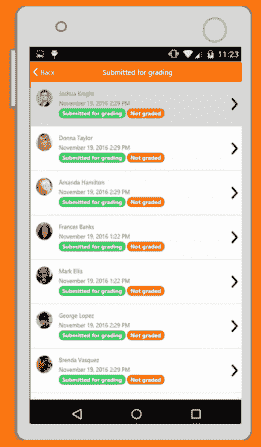
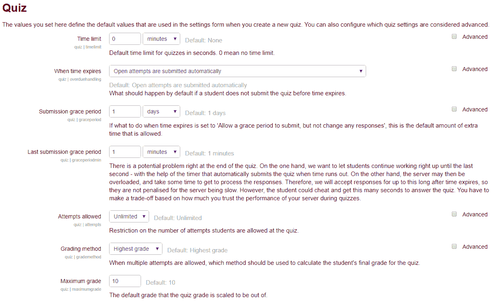
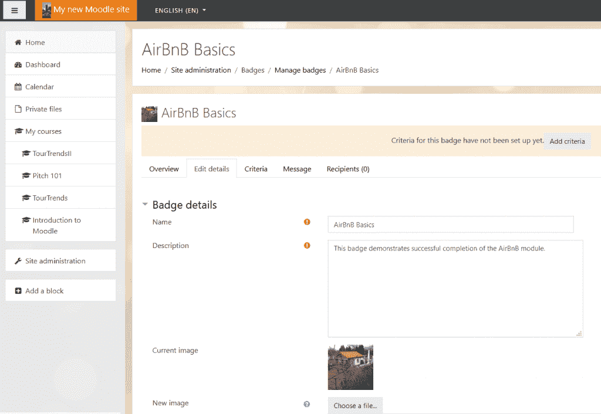
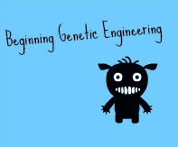
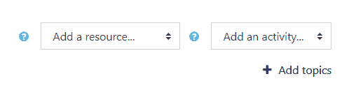
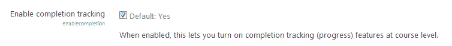
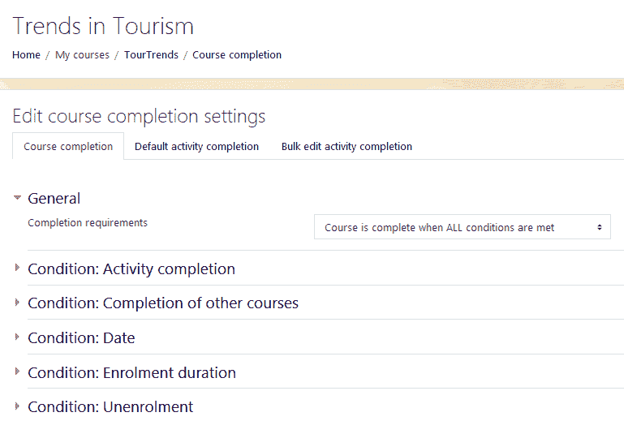
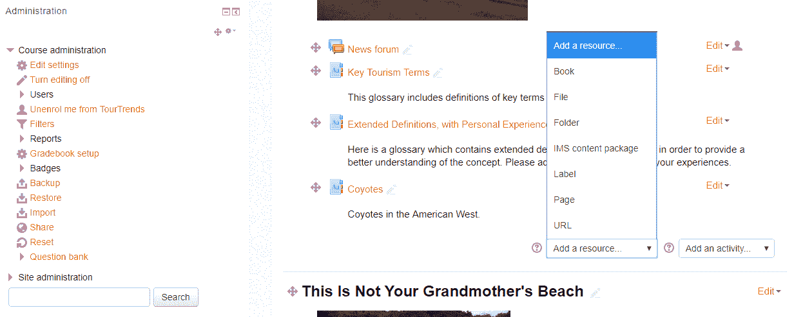
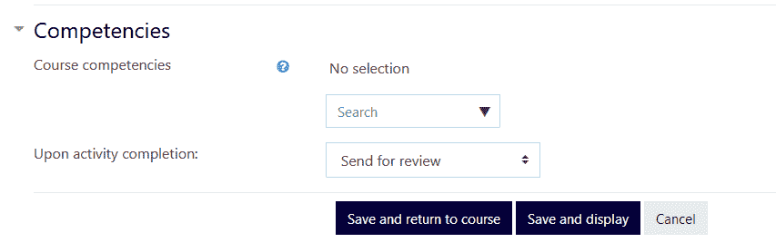

# 第五章：设计自定步调的自学课程

能够在任何时间、任何地点，以自己的节奏学习一门课程，这使得在线课程非常受欢迎。虽然许多课程由讲师主导，可能涉及与其他学生的广泛互动，但也有许多课程是自学导向的，包含自我评分和自适应评估，这些评估不需要与讲师或其他学生互动。

使用 Moodle，你可以创建独立、自定步调和自学的课程，这些课程可以在许多环境和各种目的中使用。它们可能是所有员工必须参加的短期培训课程，用于安全、健康或合规性目的。它们也可能是关于某些主题的复习课程，或为广泛受众或仅为了乐趣而创建的课程。

在本章中，你将学习如何为所有自定步调的自学课程开发一致的外观和感觉。我们将回顾你可能会发现有用的插件、资源和活动。然后，我们将学习如何在单个课程级别上设置课程，并回顾添加资源、活动和评估的最佳方式。我们还将讨论如何确保学生能够跟踪他们的进度，以及如何在课程完成后自动生成定制证书。最后，我们将学习如何设置**徽章**，构建它们，并启用社交媒体，以便学生可以展示它们。

在本章中，我们将讨论以下主题：

+   配置自定步调自学课程的全球设置

+   选择理想的插件、活动、资源和评估

+   跟踪进度和检查成绩

+   设计定制、自动生成的证书

+   集成徽章和社交媒体

+   制定有效的评估策略

+   开发自定步调的自学

# 自定步调的自学

自定步调的自学意味着你的学生是在独立工作，他们不会与讲师或其他学生进行任何直接互动。因此，在 Moodle 中，你将不需要在你的课程网站上包含一些元素。例如，你不需要论坛和需要讲师评分的活动。

同时，如果学生是在独立工作，你可能需要包含自助元素。你肯定需要像进度追踪器这样的工具，帮助学生了解他们在课程中的位置，并确保你的教学材料、活动和评估非常清晰地结合在一起。你可以内置一些活动，如低风险的自我评分测验，以保持学生的参与和动力。保持学生的动力至关重要，因为自定步调的课程需要学生自我激励，而没有教师或导师提供外部结构。

您可以在国家学术转型中心页面的“*五个成功课程重构原则*”文章中了解更多关于如何构建自动化反馈以激励学生的信息，该文章位于[`www.thencat.org/PlanRes/R2R_PrinCR.htm`](http://www.thencat.org/PlanRes/R2R_PrinCR.htm)。

自定步调的独立学习课程在长度、范围、复杂性和“赌注”方面可能会有很大的差异。有些可以在不到一小时的时间内完成，而有些可能旨在一个学期内完成。它们可以由学院、大学、公司、非营利组织、零售商和其他需要提供教育课程和培训的组织提供。随着移动友好界面的出现，例如 Moodle 的响应式皮肤，这些皮肤旨在在各种平板电脑、智能手机和笔记本电脑上工作，自定步调的独立学习课程比以往任何时候都更加方便。

这里是一个示例，展示了课程在您的智能手机上的样子：

智能手机上显示的课程

它们是为清晰展示和易于访问的内容而设计的。在选择图形时，请确保考虑到一些学生将使用手机来上课，并确保它们是智能手机友好的。

# 配置课程 – 全局设置

您可以使课程越一致，效果越好。第一次学生上课时可能会有一定的学习曲线，但如果第二个课程具有相同的看起来、感觉和功能，那么学生更有可能感到更有信心。学生的用户体验非常重要。

我们可以通过在“网站管理”中配置课程来确保我们的课程保持一致性，这将确保我们应用的设置是网站范围的，本质上也是全局的。因此，让我们从查看配置全局设置的最佳方式开始吧。

# 主题选择

如果您的学生使用包括笔记本电脑、台式计算机、智能手机和平板电脑在内的各种设备访问您的课程，您可能希望选择一个响应式主题，该主题可以在设备之间“流动”。响应式主题将在多个设备上适当地显示。

本节向您展示如何开始为您的独立学习课程开发理想的外观和感觉。课程设计的基本要素是选择一个主题，这可能会显得有些奇怪；然而，在这种情况下，选择主题对于许多原因至关重要，从课程在多个设备上显示到易于导航。

**Boost** 主题是为 Moodle 3.2 发布的，并在 Moodle 3.4 中作为核心主题提供。它被高度推荐，因为它可以自动在多个设备上显示，并且包含非常少的格式化/样式。让我们选择 Boost 主题，并按以下方式配置设置：

1.  从网站管理菜单中，点击外观。

1.  点击主题。

1.  点击主题设置。

1.  在“主题设置”屏幕上，点击所有菜单项的默认选择。确保选中“默认：是”复选框以启用设备检测。

1.  点击“保存更改”按钮。

更多关于 Boost 主题的信息，您可以访问以下 URL 的 Moodle 文档页面：[网站：https://docs.moodle.org/35/en/Boost_theme](https://docs.moodle.org/35/en/Boost_theme)。

如果您正在使用 MoodleCloud，您可能希望使用**MoodleCloud**主题，该主题也是响应式的。请注意，对于这门课程，我一直在使用 MoodleCloud 主题，它与**Clean**主题非常相似。

要更改您的主题，请转到站点管理 | 外观 | 主题 | 主题选择器：

1.  点击您希望更改的类型旁边的“选择主题”按钮。

1.  滚动查看可用主题的预览，并点击“使用主题”按钮选择主题。

1.  下一屏幕将提供有关主题的信息。点击“继续”。

# 活动

当我们配置课程并设置全局设置时，让我们看看 Moodle 中的活动。

您将使用的多数活动将使用默认设置。然而，有一些可能需要定制，例如测验、书籍和徽章。

# 测验

由于默认设置可能不适合您的组织，您可能希望更改一些选项。当您在测验活动中进行更改时，您设置的值将成为全局使用的默认值。按照以下步骤配置测验插件：

1.  在“站点管理”菜单中，点击“插件”。

1.  点击“活动模块”。

1.  点击“测验”。

1.  在“测验”屏幕上，查看不同的选项。您可能希望更新设置，例如时间限制（秒）设置，并限制学生尝试固定次数（而不是保持默认设置，即无限次数）。

1.  点击“保存更改”按钮。

以下截图显示了测验选项屏幕：

查看站点管理菜单中的其他一些插件。请记住，我们可能不会使用所有选项。更多信息，请参阅 Moodle 文档（[`docs.moodle.org/35/en/Main_page`](https://docs.moodle.org/35/en/Main_page)）中的 Moodle 3.5。

# 书籍

书籍插件是创建学生在线文本的好方法。

要配置书籍插件，请按照以下步骤操作：

1.  在“站点管理”菜单中，点击“插件”。

1.  点击“活动模块”。

1.  点击“书籍”。

1.  在“书籍”屏幕上，设置章节格式化选项。我们推荐使用数字。

# 徽章

在 Moodle 3.4 中扩展的徽章对于激励学生完成课程非常有用。当学生完成涉及技能和总结性评估的学习模块后，他们可以开始进行课程评估。您可以将课程设置为当学生达到目标时自动生成徽章。然后，他们可以在“背包”或 Facebook 等社交媒体网站上展示徽章。Mozilla 的 OpenBadges 项目包括一个徽章背包，其中可以展示徽章。

让我们为课程配置徽章。记住，我们正在全局启用徽章功能。您也可以通过以下步骤为单个课程配置和上传徽章：

1.  在网站管理菜单中，点击徽章。

1.  点击徽章设置。

1.  在徽章设置屏幕上，输入您的组织名称或颁发机构的名称。然后，包括您的电子邮件地址。确保选中“启用连接到外部背包”和“启用课程徽章”。

1.  点击保存更改。

要添加徽章，请执行以下步骤：

1.  在网站管理菜单中，点击徽章。

1.  点击管理徽章，然后点击添加新徽章按钮。

1.  在徽章详情屏幕上，输入徽章的名称和描述。然后上传一张图片。这将是要显示的徽章图片。图片应该是`.jpeg`或`.gif`格式，且大小不超过 200 x 200 像素。

1.  点击创建徽章：

您可以在 Mozilla Open Badges 项目中了解更多关于徽章的信息，网址为[`openbadges.org/`](http://openbadges.org/)。您还可以在[backpack.openbadges.org](http://backpack.openbadges.org)注册一个背包，在那里您可以展示您的徽章。

要为您的徽章创建一个独特的设计，其中包含您自己的照片，您可以使用免费的在线照片编辑工具，如 PicMonkey ([`www.picmonkey.com/`](http://www.picmonkey.com/))，这是一个易于使用的基于云的程序，无需注册。

以下是一个相当随意的示例，大约花费了五分钟时间使用 PicMonkey 创建：

PicMonkey 提供了一系列元素，允许您上传和修改您自己的照片或使用库存元素创建您自己的设计。

要管理单个课程内的徽章，请执行以下步骤：

1.  在课程管理菜单中，点击徽章。

1.  点击管理徽章。

1.  点击您想要编辑的徽章名称。在徽章详情屏幕上，您将看到以下选项卡：概览、编辑详情、标准、消息和接收者。在每个屏幕上输入颁发徽章的标准。

1.  点击保存更改。

# 日历

假设所有个人都在特定日期开始课程，如果课程需要超过一周左右的时间来完成，那么创建一个日历可能不是一个坏主意。例如，你可能提供为期一个月的课程，学生可以在每个月的开始就着手进行。

让我们使用以下步骤设置一个为期 1 个月的课程日历。（注意，默认为 3 周，但你可以将其更改为 1 个月）：

1.  前往站点管理菜单。

1.  点击外观。

1.  点击日历。

1.  将查看天数修改为 1 个月。你也可以更改事件前瞻的默认设置。默认为 10 个事件。

1.  点击屏幕底部的保存更改。

# 课程级别配置

现在你已经在该站点级别配置了课程，你需要配置课程级别的元素，并确保它们适合自我节奏的独立学习。因此，前往课程管理菜单。

# 课程设置

让我们来看看课程设置。我们想要确保课程以“任何时间/任何地点/任何节奏”的方式安排。以下是最理想的课程设置：

1.  点击你的课程，前往右上角的齿轮箱。

1.  点击编辑设置。

1.  从下拉菜单中选择**课程格式**中的主题格式。在此过程中，请至少添加两个更多主题（除了将成为你课程单元的那些主题）。你将使用其中一个主题作为整个课程中使用的教学材料。另一个主题将包括练习测试/考试/测验。添加主题位于页面底部：

1.  在外观部分，选择是以向学生显示成绩册。

1.  在完成跟踪部分，将启用完成跟踪设置为是。

1.  在分组部分，确保不要包括分组。因此，选择无分组。

1.  点击保存更改。

# 课程完成

在自我节奏课程中，课程完成非常重要。结合活动完成，课程完成允许学生跟踪他们的课程进度。以下是最理想的设置：

1.  在站点管理菜单中，点击高级功能。

1.  点击启用完成跟踪，这将允许你在课程级别打开完成跟踪（进度）功能：

1.  根据主题，课程完成链接将出现在齿轮菜单或导航块中。在 Boost 中，它位于齿轮菜单中。

1.  在课程中，你需要启用活动完成以使**课程完成**功能。你还有其他选项，如截图所示：

1.  在其他设置中，你可以选择默认设置或根据自己的偏好添加自己的条件。

1.  点击保存更改。

# 资源

将您的资源围绕主题组织。对于学生在整个课程中都会使用的资源，创建一个主题并将其命名为“课程材料”。其他资源可以添加到每个主题中。请注意，您可以添加书籍、文件、文件夹、IMS 内容包、标签、页面或 URL：

要选择资源，请执行以下步骤：

1.  在主页菜单中，点击您的课程

1.  选择添加活动或资源

# 书籍

您已经配置了书籍资源，使其在所有课程中保持一致的外观和感觉。现在，对于每个单独的课程，您可以添加可以组合并作为书籍展示的 HTML 文件。您甚至可以允许学生下载它们。要配置书籍资源，请执行以下步骤：

1.  在您的课程页面上，点击添加活动或资源

1.  选择书籍

1.  在添加新书籍的屏幕上，添加名称和描述

1.  在编辑章节的屏幕上，将内容输入到内容框中

1.  点击保存更改

您可以通过添加材料来更新和更改书籍及其内容。

# 资源

让我们从资源开始。在理解了您的主题并定义了每个主题的学习成果后，是时候收集和组织您的资源了。对于自学课程，您可以考虑使用本节中描述的资源类型。

通常，要添加资源，请点击添加活动或资源。检查下拉菜单或简单地拖放到课程区域即可。

# 资源 – 文件

使用文件资源添加资源非常有效。确保您的文件格式是学生能够下载的。例如，上传 PDF 文件而不是 Microsoft Word 文档是个好主意。

演示（幻灯片）可以上传为 PDF，以避免在使用 Keynote 或 PowerPoint 时出现版本和兼容性问题。

您的演示文稿的脚本和笔记可以上传为 PDF 或 HTML 格式。如果您的学生视力不佳，HTML 是一个不错的选择，因为屏幕阅读软件使用 HTML。

音频文件/播客可以直接上传或通过 SoundCloud（或 YouTube）等服务托管。允许下载 MP3 通常是个好主意，因为学生可能希望下载文件并在他们的 MP3 播放器或智能手机上播放。

# 资源 – 网址

如果文件大小很大，通常首先创建演示文稿/课程内容，然后将它们上传到基于云的托管服务是个好主意。如果您这样做，您可能需要能够以不同的格式创建您的演示文稿。

以下各节是关于多种不同类型演示的指南。

# 录制网络直播/演示

创建有声演示的一种流行方法是使用屏幕捕获软件，在制作演示时录制音频。然后您可以将演示文稿保存并上传到多个网站，如 YouTube、Flickr 和 UStream。使用屏幕捕获软件的优点是质量通常较高，并且具有相当大的灵活性。缺点是学习曲线可能很陡峭，软件许可可能很昂贵。

对于高质量的音频，请务必投资一个好的耳机麦克风。避免使用电脑的内置麦克风。当您使用耳机录制时，请务必检查设置，确保它们没有默认为内置麦克风。

**CamStudio** ([`www.camstudio.org`](http://www.camstudio.org)) 是一款免费的开源程序，可以记录屏幕动作和音频，并将它们保存为 AVI 文件。然后将其转换为 SWF（Flash）。这款软件程序存在明显的局限性（即，Flash 文件不会在所有设备和平台上播放）。

Screencast-o-matic 是一款基于云的软件应用，允许您上传您的演示文稿，并在浏览过程中录制音频，将整个演示文稿保存为 MP4 文件，然后您可以将其上传到 YouTube。对于这款产品，请访问 [Screencast-o-matic](https://screencast-o-matic.com/).

QuickTime（Mac 内置）包含屏幕录制功能，可以录制整个屏幕或部分屏幕，带或不带音频，或仅音频。

以下是一些免费的屏幕录制产品（其中一些功能有限）。我们只包括那些包含音频的产品，如下所示：

+   **ActivePresenter**：对于这款产品，请访问 [`atomisystems.com/activepresenter/free-edition/`](http://atomisystems.com/activepresenter/free-edition/)。这款产品可以保存多种格式的屏幕录制。

+   **BB FlashBack Express**：对于这款产品，请访问 [`www.bbsoftware.co.uk/`](http://www.bbsoftware.co.uk/)。这款产品可以将屏幕录制保存为 Flash 或 AVI 格式，可以“一键”上传到 YouTube。

+   **Jing**：对于这款产品，请访问 [`www.techsmith.com/jing.html`](http://www.techsmith.com/jing.html)。Jing 不支持音频，但它是一种非常简单方便的方式，用于创建屏幕截图和视频，然后上传。Jing 适用于 Mac 和 Windows 操作系统。

+   **ScreenPresso**：对于这款产品，请访问 [`www.screenpresso.com/featuresall`](http://www.screenpresso.com/featuresall)。这款产品是便携式的，也就是说，您不需要下载它。它可能不包括音频。它非常适合屏幕截图和仅录制屏幕的一部分。

+   **Camtasia Studio 8**：对于此产品，请访问[`www.techsmith.org`](http://www.techsmith.org)。Camtasia 是一个非常强大且灵活的产品。它可以制作出非常高质量的屏幕捕获并保持高质量。您还可以针对不同的宽高比进行优化，这对于考虑可能使用智能手机和平板电脑的用户来说很重要。它适用于 Windows 和 Mac。您可以下载免费试用版。

# 制作和分享演示文稿

在您的课程中包含演示文稿有许多选项，您可以自己制作或从其他网站嵌入。

# 仅音频

您可能处于需要创建高质量音频文件的情况，也许以后还要将其与演示文稿同步。

这是一种避免低质量音频的好方法。如果您的用户听力受损并使用辅助语音到文本软件，高质量的音频非常重要。即使他们不这样做，开发一个脚本和课程大纲以在创建屏幕录像时提供也是一个好主意。这样，您将遵循 UDL 的实践，并符合 ADA 指南。

要下载和安装音频工具，请执行以下步骤：

1.  在[`audacity.sourceforge.net/`](http://audacity.sourceforge.net/)下载 Audacity。Audacity 适用于 Mac 和 Windows。

1.  选择 Audacity 安装程序选项，因为它将引导您完成整个过程。如果您没有权限，您可能需要下载 ZIP 文件。

1.  为了将 AVI 文件转换为 MP3 文件，您需要下载一个编码器。Windows 上的 LAME MP3 编码器可以在[`lame1.buanzo.com.ar/#lamewindl`](http://lame1.buanzo.com.ar/#lamewindl)找到。

1.  如果您对下载/安装 Audacity 或 LAME 有任何疑问，请阅读[`manual.audacityteam.org/o/man/faq_installation_and_plug_ins.html`](http://manual.audacityteam.org/o/man/faq_installation_and_plug_ins.html)上的手册。

1.  要共享音频文件，请使用 MP3 编码器对其进行优化，然后上传到 Webspace，或在[`www.soundcloud.com`](http://www.soundcloud.com)上开设账户。您还可以通过 YouTube 分享音频。

# 仅演示文稿

在创建您的演示文稿时，不要忘记创建脚本或笔记。您可以将这些内容作为笔记或单独的文件提供。如果您的演示文稿非常注重图形且包含很少的解释性文本，这样做尤为重要。您还可以使用以下选项避免屏幕上出现过多文本：

1.  您可以将 PowerPoint（或其他演示软件）文件转换为 PDF 文件，然后上传到您拥有的服务器空间

1.  您可以将 PDF 文件上传到学习管理系统（Moodle）中的讨论论坛，或在您公司的存储库（例如，Google Docs）中共享。

1.  您可以将您的演示文稿上传到 SlideShare，网址为[`www.slideshare.net/`](http://www.slideshare.net/)

# 活动和评估

当你构建课程时，你需要配置设置，以便它们自动评分评估，并允许学生以自定步调的独立学习环境完成课程。本节描述了各种易于实施的活动，因为它们易于创建，且对学习者来说简单易懂。这些是自我评分活动。

# 选择

选择活动可以轻松配置为自定步调的自学。通过能力进行配置：

执行以下步骤：

1.  在添加新选择页面，向下滚动到**能力**

1.  点击活动完成

1.  选择在活动完成后，选择“提交审查”或“完成能力”

# 测验

测验是自动化课程中另一个很好的活动。现在，让我们按照以下步骤为这些新用户账户提供一个课程来工作：

1.  在添加新测验页面，点击活动完成

1.  选择当条件满足时显示活动为完成

1.  你可能希望选择“学生可以手动标记活动为完成”

# 证书

如果你已从 Moodle 插件库中安装了证书插件，Moodle 允许你生成证书。你可以配置它们以包含课程名称、学生的姓名、分数和其他重要信息。证书是一个第三方插件，如果你的 Moodle 站点没有它，你可能需要安装它。

现在，按照以下步骤添加证书：

1.  在活动菜单中，点击证书。

1.  在添加新证书页面，填写所需字段。

1.  使用不同的字段和选项配置证书。

1.  在活动完成菜单中，选择当条件满足时显示活动为完成。满足条件取决于掌握的合格分数。

# 成就和动力

Moodle 为自定步调独立学习的学生提供了广泛的选项，以展示他们的成就。我们推荐使用证书和徽章，因为获得、发放和展示它们的过程可以自动化。

通过设定目标并奖励实现目标的人来激发动力是徽章和证书的核心。

在徽章的情况下，存在一定的游戏化元素，这鼓励学生之间相互竞争，以获得徽章，并在各自的技能和兴趣方面成为最佳。我们已经讨论了徽章和证书，回顾它们并提醒自己，它们在课程进行中和完成后都有激励作用。

# 摘要

在本章中，我们学习了开发并配置课程以进行自定步调独立学习的最佳方法，这对于想要在任何时间、任何地点以自己的节奏学习的学生来说非常理想。

我们学习了如何配置全局设置，以便您的课程具有一致的外观和感觉。然后，我们转向课程层面，确定了最适合您课程的资源类型和活动。接着，我们讨论了如何配置它们以便实现自动化。

最后，我们探讨了通过首先展示成就证书，然后通过在课程中添加轻微的徽章游戏元素来激励学生、增加他们对课程的参与度以及鼓励课程完成的方法。

在下一章中，我们将指导您开发基于班级的课程，并实现师生互动。我们将仔细研究如何配置您的课程，并确定哪些资源、活动和评估最适合您的基于班级的课程。
