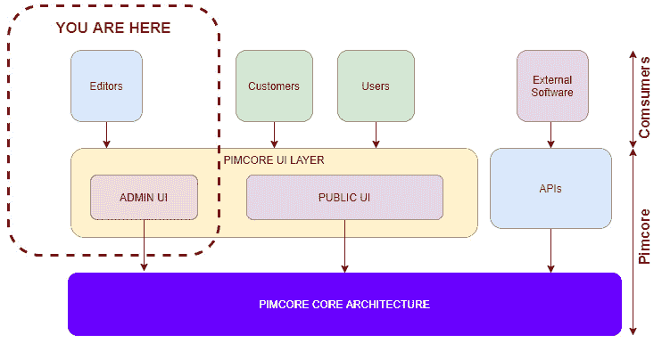
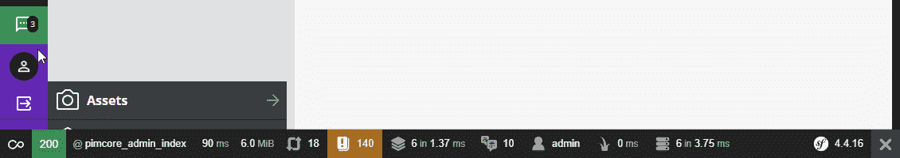
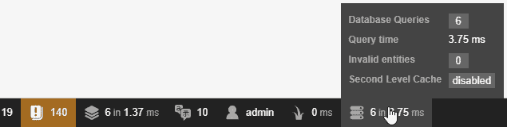
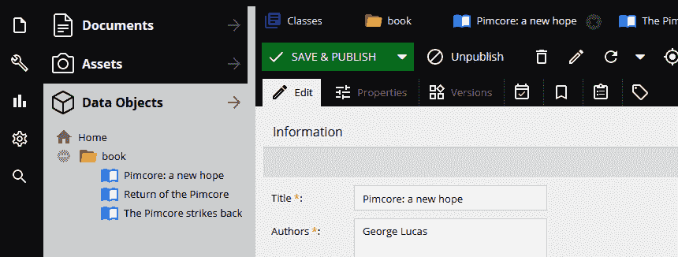
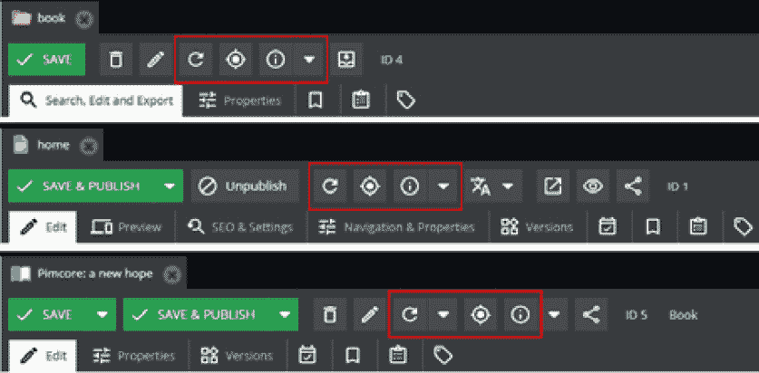
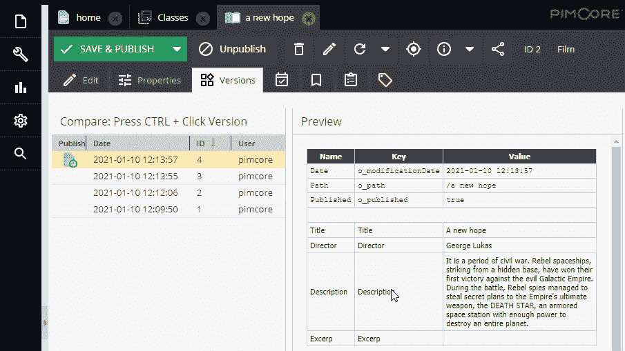

# 第三章：*第三章*：开始使用 Pimcore 管理界面

在本章中，我们将检查 Pimcore 管理界面的所有组件和菜单，这是你进行网站管理所需的大部分操作的控制室。通过阅读本书，你将能够从头开始构建网站。

为了完成你的网站，Pimcore 允许你创建捆绑包、修改核心组件，或者覆盖构成网站的大部分部分（从控制器到模型，从视图到路由规则等）。所有这些方面将在本书的后续章节中进行探讨，但你在学习如何作为用户在网页界面中导航之前，无法处理这些主题。

尤其是在本章中，我们将发现配置你的网站最有用的工具以及它们在管理页面上的位置。

在本章中，我们将涵盖以下主题：

+   理解 Pimcore 架构

+   探索 UI 组件

+   与网格组件一起工作

+   检查菜单

因此，让我们从对 Pimcore 架构的简要介绍开始。

# 技术要求

要跟随本章的教程，你不需要一个正在运行的 Pimcore 实例。你可以直接阅读本章，但如果你想要实践，你可以打开 Pimcore 并跟随操作。

你在这里需要做的只是遵循*第二章**，设置你的 Pimcore 开发环境*中的说明，来安装一个空的 Pimcore 实例。

完成这些后，你只需打开浏览器并输入 http://localhost，在用户界面中导航即可。

# 理解 Pimcore 架构

在本节中，我们将查看 Pimcore 架构的简化概述，特别关注我们在本章讨论中将重点关注的架构部分。

在以下图中，我们可以查看 Pimcore 架构，并了解在本章中我们将重点关注 Pimcore 的哪个部分：

图 3.1：Pimcore 架构

如前图所示，我们探索 Pimcore 的旅程的起点由包含文本“**你在这里**”的虚线矩形表示。

只是为了了解 Pimcore 在所有部分是如何组成的，让我们看看图中的每个方面；即使我们看到的是 Pimcore 架构的简化版本，我们仍然可以识别出平台的所有重要部分。我们不会对每个部分进行详细说明，但我们仍然可以快速描述它们。

**PIMCORE UI LAYER** 是用户界面层，即所有与用户交互的入口点。在里面我们可以识别出两个更进一步的方面，**ADMIN UI** 和 **PUBLIC UI**：这种公共和私有的划分是必要的，以保持与管理的相关服务，仅对具有管理角色的用户可用，与公共的解耦。

**APIs** 指的是第三方软件可以通过它访问 Pimcore 的层，与之功能和数据进行交互；迭代的可能性很多，例如导入数据、更新数据、导出数据、创建内容等。在这个层内访问所有这些操作都是可能的，使用通信协议，如 REST API 或 GraphQL，它们在这个 Pimcore 的部分公开其服务。

最后，**PIMCORE 核心架构**是包含业务逻辑层、数据模型、数据库访问的数据访问层、创建 HTML 页面的模板引擎的层——换句话说，这是 Pimcore 的核心。在本书中，我们将这部分称为 **Pimcore 管理员**、**管理页面**，甚至在某些情况下称为 **Pimcore 仪表板**。

让我们开始我们的 Pimcore 管理之旅，从 UI 组件开始。

# 探索 UI 组件

Pimcore 是一个庞大的环境，由同样重要且广泛的框架（Symfony）支持，这可能会有些令人困惑，尤其是对于 Pimcore 新手来说。但就像所有漫长的旅程一样，我们必须从第一步开始。这是我们的第一步。让我们登录管理面板。

首先，我们需要访问 Pimcore 管理界面；为此，我们必须通过访问页面 [yoursite.com/admin/](http://www.yoursite.com/admin/) 登录管理页面。这是我们面临的第一屏，Pimconaut，Pimcore 的吉祥物欢迎我们：

![Figure 3.2: Pimcore Administration Login Page (the image on this page changes from time to time)

![img/Figure_3.02_B1073.jpg]

图 3.2：Pimcore 管理登录页面（此页面的图片会不时更改）

登录后，我们将进入管理页面，Pimcore 控制室。在下一张截图，我们将看到控制室的外观：

![Figure 3.3 – Pimcore administration

![img/Figure_3.03_B1073.jpg]

图 3.3 – Pimcore 管理

如我们所见，Pimcore 仪表板被分为四个部分，本节将讨论这些部分：

1.  侧边栏菜单

1.  左侧边栏

1.  主框架

1.  右侧边栏

让我们逐一查看。

## 侧边栏菜单

侧边栏菜单是您看到的左侧最黑的条。它包含两部分：

+   顶部第一部分包含平台开发和配置所需的所有操作，从语言到路由规则，再到研究和创建对象。

+   第二部分，在底部，包含有关系统和用户的信息、通知以及 Pimcore 标志。

正在侧边栏的下部上方，可以看到 Symfony 标志。Symfony 是 Pimcore 开发的 PHP 框架；换句话说，其引擎。在 Pimcore 上所做的所有操作都通过这个框架进行。当您点击 Symfony 标志时，页面的底部将出现另一个细长的工具栏，如以下截图所示：

图 3.4：Symfony 工具栏

这个新菜单包含一些关于系统的基本信息，例如内存使用情况、当前用户、缓存使用情况或数据库查询。将鼠标悬停在其上时，将出现一些弹出窗口，显示附加信息，如以下截图所示：

图 3.5：Symfony 工具栏和附加细节

当点击项目时，会加载一个新页面，其中包含关于系统每个部分的更详细信息。如果您需要比这更多的系统信息，您可以点击工具栏中的一个条目，将打开一个页面，其中包含有关缓存、日志、事件、例程以及 Pimcore 所使用的所有其他 Symfony 部分的更多信息。

## 左侧边栏

总是在左侧，紧邻菜单侧边栏，有一个第二个侧边栏；这个侧边栏包含对文档、资产和数据对象的快捷方式。我们将在以下章节中讨论它们，但它们是我们将在创建美丽的 Pimcore 网站时最常用的功能。

## 主框架

主框架是 Pimcore 管理界面的中心面板。所有需要更改的元素都加载在这里。换句话说，这是打开与菜单项相关内容的地点。以下是在动作中的主框架截图：

图 3.6：Pimcore 管理界面部分标签页已打开

如前一个截图所示，有一些文档已打开，每个文档都在一个单独的标签页中。换句话说，主框架是我们将在 Pimcore 的工作中打开的所有配置窗口的容器。

## 右侧边栏

主框架右侧的侧边栏是一个可以移动左侧侧边栏组件的地方。这可以通过点击箭头（见 *图 3.3*）轻松完成。这种布局在您需要同时处理多个项目并希望保持控制时非常有用。例如，您可能想要浏览页面，同时让产品准备好在页面上使用。因此，您可以使用右侧工具栏来显示数据对象。我们将在 *第五章**，探索对象和类* 中学习如何使用数据对象来建模产品实体。

Pimcore 允许更改侧边栏配置，包括通过添加菜单项，这对于快速访问特定功能通常很有用。例如，在电子商务的情况下，可能需要为订单或客户提供快捷方式。这些定制功能的示例可以在官方 Pimcore 网站上看到：[`demo.pimcore.fun/admin/`](https://demo.pimcore.fun/admin/)。

在对菜单的简要介绍之后，我们可以详细查看我们刚刚列出的所有元素，从 Pimcore 仪表板的主要组件——主框架开始。从侧边栏（或菜单条目）打开的任何对象都在主框架内作为一个新标签打开。换句话说，主框架是所有编辑标签的容器，用户可以逐个或全部关闭，就像通常在浏览器中做的那样。

现在我们已经熟悉了 UI 组件，我们可以更进一步，开始详细分析其他部分，例如网格组件和菜单。在下一节中，我们将继续查看网格组件，在那里我们将花费大部分时间来处理 Pimcore 数据。

# 使用网格组件

在本节中，我们将详细分析网格组件的工作原理。我们将发现如何执行简单的活动，如搜索。此外，我们还将了解工具栏上每个主要按钮的功能。

首先，让我们看一下下面的屏幕截图，看看网格在使用时的样子：

图 3.7：网格组件

如前一个屏幕截图所示，这个组件中至少有四个感兴趣的点：

1.  已经见过的带有打开实体的第一个标签栏

1.  用于主要操作的按钮工具栏

1.  特定文档的第二标签栏

1.  打开的文档

我们已经列出了构成*图 3.7*中看到的网格组件的元素，因此现在我们可以更详细地描述它们，从第一个开始。

## 第一个标签栏

我们已经看到这个第一个元素，它不需要进一步解释；如果需要，可以参考*主框架*部分。

## 工具栏

现在让我们看看工具栏，以及其中的一些操作按钮。

根据我们正在修改的对象类型，以及在某些情况下根据文档本身的发布状态，这个工具栏中可能有不同的按钮。换句话说，工具栏根据您正在编辑的元素（即文档或对象）及其发布状态而变化。例如，如果我们正在编辑一个网页，根据它是否已发布或尚未发布，我们将看到**保存**和**保存并发布**按钮，或者**保存并发布**和**取消发布**按钮。

下面的屏幕截图显示了一个用于不同对象的工具栏——对于一个文件夹、一个网页，然后是不同状态下的对象：

图 3.8：编辑文件夹、网页和不同状态下的对象时显示的工具栏

如您在前一个屏幕截图中所见，顶部工具栏中的按钮数量不同——这是因为操作会根据我们正在编辑的对象类型动态变化。

例如，**SAVE & PUBLISH**按钮始终出现在必须使可见的所有元素中，例如网页或对象。对于其他内部使用的元素，如文件夹，它不可见，因为它不是必需的。

在*图 3.8*中，您可以在一个红色矩形内看到一些按钮。这三个按钮始终存在于工具栏中，如下所示（从左到右）：

+   **Reload**：重新加载文档（不是整个页面）。

+   **Show in tree**：当您点击此按钮时，Pimcore 会识别并选择左侧树文件中的当前对象。

+   **Info**：此按钮打开一个包含有关我们正在编辑的文档的一些信息的模态窗口。

现在我们已经看到了网格组件的第二个元素，让我们继续到下一个部分，并分析我们列出的四个元素中的第三个：第二个标签栏。

## 第二个标签栏

在工具栏下方还有一个标签栏，其中包含可变数量的标签，每个标签将显示我们正在编辑的对象的一组属性。此外，在这种情况下，正如我们刚才看到的标签栏一样，标签的数量和类型会根据对象及其修改时的状态而变化。

根据我们正在编辑的元素，无论是网页、对象还是文件夹，标签的数量及其含义都会变化。例如，如*图 3.8*所示，如果我们正在编辑网页，我们将有**SEO & Settings**和**Preview**标签，而如果我们正在编辑对象，我们可以看到**Properties**标签。

在这两种情况下，都有一个**版本**标签；如果我们打开这个标签，内容将会显示，如这个屏幕截图所示：

图 3.9：对象的版本标签

从这个屏幕截图中我们可以看到，**版本**标签的内容正是我们预期的：关于对象所做的所有更改的信息，更改的日期以及谁做的更改。通过点击任何版本，您可以查看文档之前的状态，通过选择两个（*Ctrl* + 点击）您可以看到两个版本之间的差异。

在本节中，我们还描述了我们列表的第三个元素，第二个标签栏。我们可以继续到我们列表的第四个和最后一个项目，即打开的文档。

## 打开的文档

这是显示打开的标签内容的部分。正如您所想象的那样，它是整个组件中最大的部分，因为它包含修改和配置文档所需的所有属性和操作。

例如，如*图 3.9*所示，版本标签将此组件分为两部分：在左侧的表格中显示了文档所做的所有更改，而在右侧则显示了所选更改的预览。

因此，每个标签将根据文档和我们要编辑的内容包含不同的布局和属性。

在本节中，我们详细了解了组成网格组件的各个部分，这是处理文档的基本工具。本章的最后一部分将专门介绍菜单，我们现在将对其进行探索。

# 检查菜单

现在我们将处理菜单，由于我们在这里找到的大量操作，它们通常扮演着非常重要的角色。我们无法逐一详细查看它们，因此我们将限制自己讨论每个菜单的范围以及我们可以使用其中找到的项目做什么。这对于在 Pimcore 界面中移动并学习下一章我们将学到的课程至关重要。

以下截图显示了所有菜单：

![Figure_3.10: The Pimcore menus]

![Figure_3.10_B1073.jpg]

图 3.10：Pimcore 菜单

从左到右，菜单如下：

+   **文件**

+   **工具**

+   **营销**

+   **设置**

+   **搜索**

点击菜单项将在主框架中打开一个配置页面作为新标签页。然而，有些菜单项包含子菜单（通过项目右侧的箭头可识别），当鼠标悬停在项目上时会出现。

正如我们所说，无法描述所有菜单中每个项目的功能，因此现在让我们看看我们可以在其中找到的主要命令。

## 文件

文件菜单，正如我们通常所知，包含打开文档（各种类型）、关闭所有打开的标签、导航到 Pimcore 网站阅读官方文档或显示 Pimcore 信息模态的操作。此外，还有仪表板页面的快捷方式，在那里我们可以找到一些图表，显示上一时期所做的更改数量，或最后修改的元素列表。

## 工具

在此菜单中，我们可以找到一些有用的网站管理工具，例如重定向、网站语言管理或发送的电子邮件，以及发送测试电子邮件的能力。除此之外，还有其他辅助功能，如笔记和有用的数据库管理页面链接。在此菜单中，还有一些关于系统的信息，例如缓存状态或正在使用的 PHP 版本。

## 营销

此菜单专用于营销管理，包括搜索引擎优化、统计报告、配置分析工具（如 Google Tag Manager 和 Google Analytics）等功能，这些工具对于从事网络营销的你们来说，了解其监控网站访问的重要性。

## 设置

在这个菜单中，我们可以找到配置我们网站所需的所有操作。例如，可以创建和修改文档类型、对象的通用属性，还可以管理用户及其角色，配置系统的所有部分（时区、默认语言、电子邮件设置等），创建静态路由，以及管理缓存或翻译。

正如我们所预料的，这是最重要的菜单之一，但不需要记住它确切包含哪些项目，我们只需要记住，在这里我们可以找到我们将在网站上从管理角度必须进行的几乎所有配置。通过实践和经验，我们将能够记住各个菜单的所有功能，尽管现在这可能看起来像是一个遥远的目标。

为了理解甚至一个菜单项中可以隐藏多少东西，这里展示了**系统设置**页面：

![图 3.11：系统设置页面

![img/Figure_3.11_B1073.jpg]

图 3.11：系统设置页面

如我们所见，每个部分都可以通过点击**+**来展开，从而访问该部分的配置参数。

## 搜索

最后，在这个最后一个菜单中，您可以找到通用搜索功能的快捷键，以及针对网站某些元素（如资产、文档和数据对象）的特定搜索功能的快捷键。

在本节中，我们了解了 Pimcore 中每个菜单的功能以及可用的众多特性。虽然无法逐一描述，但我们仍讨论了书中最重要的项目，并将探索我们未描述的所有菜单项的乐趣留给了您。

# 摘要

在阅读本章后，您现在知道如何在 Pimcore 管理 UI 内部移动，在那里您可以找到 Pimcore 治理最重要的工具。我们讨论了各个菜单的动作，如何使用网格组件，以及管理 UI 的主要元素。到目前为止，这已经是一大堆信息了，但对于理解下一章我们将学习的内容是至关重要的。

现在我们已经了解了如何导航 Pimcore 最重要的功能，我们可以继续下一步，即学习如何使用 Pimcore 创建文档。
