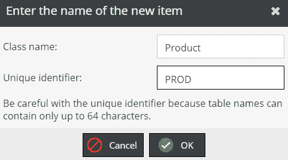
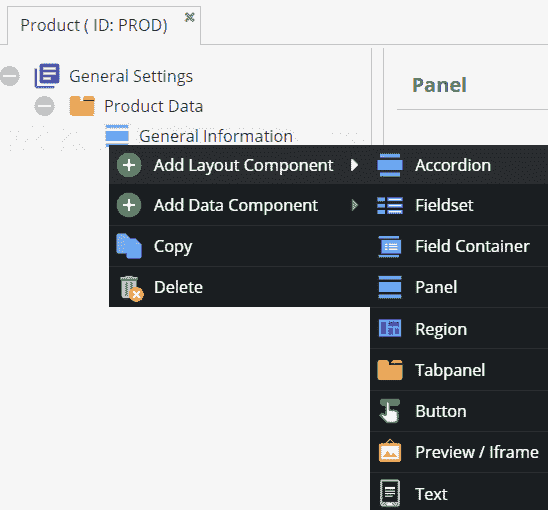
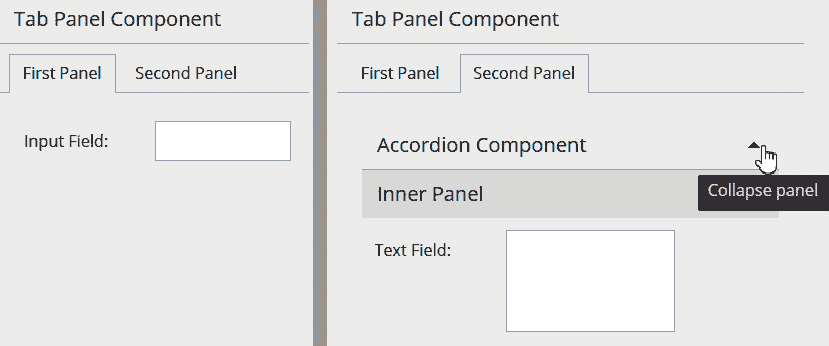
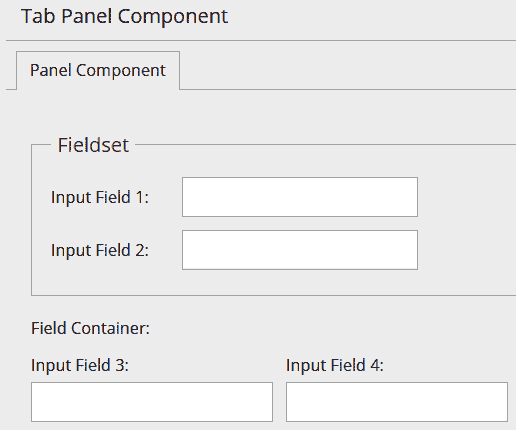
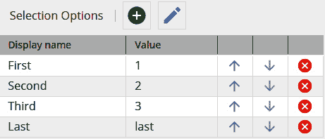
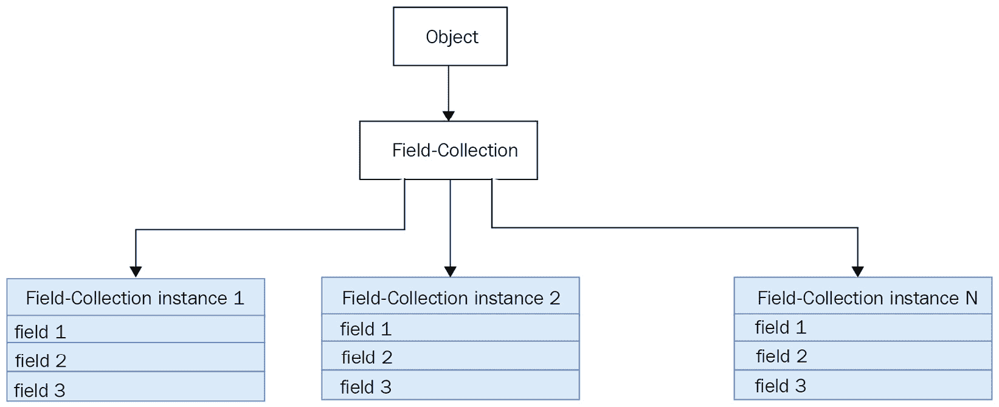
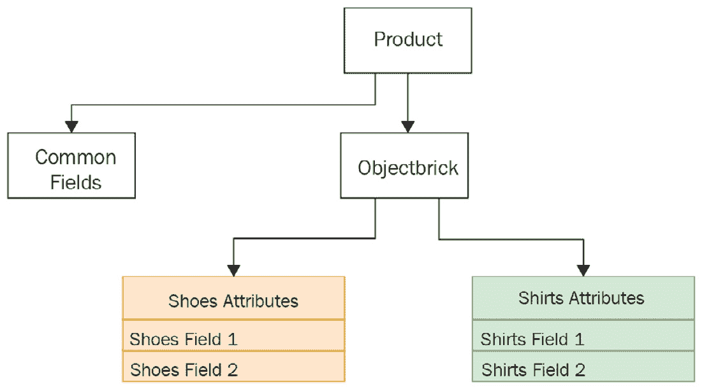
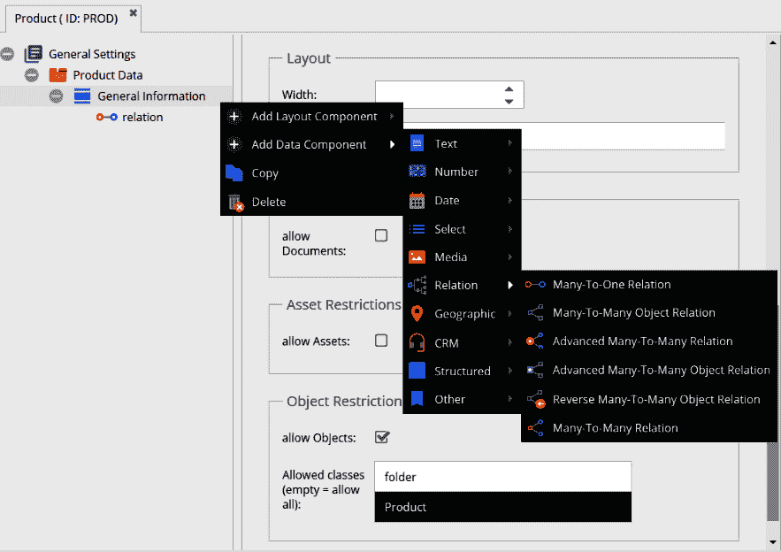

# 第五章：*第五章*：探索对象和类

在本章中，我们将看到 Pimcore 为我们提供的主要功能之一：通过创建类和对象定义每个项目的个人和完全定制的数据集的可能性。

使用 Pimcore 的一个主要优势是您可以通过用户界面完成所有操作，无需编写任何代码或定义复杂的数据库结构，您可以在任何时候更改或添加新属性。Pimcore 将完成所有魔法，您无需担心在数据库上运行风险性迁移。此外，您还可以导出和导入所有类定义，以便在不同项目之间共享，无需每次都重新发明轮子。

在以下章节中，我们将介绍类配置，重点关注可以添加到其中的各种字段类型，以及如何通过数据输入具体查看这些类的操作。如果我们激发了您的兴趣，只需通读本章，了解使用 Pimcore 创建和更新类是多么简单。章节结构组织如下：

+   什么是类？

+   创建和编辑类定义

+   发现相关字段类型

+   理解和建立关系

+   执行数据输入

到本章结束时，您将了解如何创建 Pimcore 类以及如何正确配置它们以充分利用其潜力。

# 技术要求

正如您在*第四章*中做的那样，*在 Pimcore 中创建文档*，运行与本章相关的演示所需要做的只是导航到官方书库中的`5\. 对象和类`文件夹并启动 Docker 环境。

要做到这一点，只需遵循以下说明：

1.  使用以下命令运行 Docker：

    ```php
    docker-compose up
    ```

1.  然后，为了恢复您本地机器上的所有设置，只需打开一个新的 shell 并输入以下命令：

    ```php
    docker-compose exec php bash restore.sh
    ```

1.  导航到[`localhost/admin`](http://localhost/admin)并使用您的 admin/pimcore 凭据登录。

您可以通过以下链接访问官方书库以获取源代码：

[`github.com/PacktPublishing/Modernizing-Enterprise-CMS-using-Pimcore/tree/main/5.%20Object%20and%20Classes`](https://github.com/PacktPublishing/Modernizing-Enterprise-CMS-using-Pimcore/tree/main/5.%20Object%20and%20Classes)

现在，您已准备好导航演示以发现与本章相关的所有方面。

# 什么是类？

在本节中，您将了解在 Pimcore 中类是什么以及它如何有助于管理任何类型的数据。在面向对象编程的背景下，一个**类**由一组适合表示概念的数据（或属性）、影响值的方法以及实例化该类的对象的行为组成。

Pimcore 类反映了这个定义，但不仅如此。在接下来的章节中，我们将更好地了解这些类是如何工作的，以及它们如何简化我们在数据集开发上的工作。特别是，我们将看到尽管名称如此，Pimcore 并不仅限于产品信息管理；此外，你将发现定义类根本不需要编写任何代码。

## 设计不同的概念

如我们所知，Pimcore 的主要功能之一是产品信息管理，因此我们倾向于认为一切围绕 `Product` 类的定义展开。当然，这通常是正确的，但不应将其视为限制。

考虑一个基本的电子商务结构：将会有一个 `Product` 类，正如我们所期望的，但也许我们想要对产品进行分类；我们可以考虑创建一个 `Category` 类来链接到产品，而不是在每个产品中重复分类的属性。我们可以在产品材料或其他属性上应用相同的推理，根据需要逐步增加结构的复杂性。那么，如果我们需要为我们的电子商务网站实现商店定位器呢？我们只需要创建一个 `Store` 类！

为了更通用，我们可以通过创建相应的类来设计每种不同类型的概念。也就是说，你可以很容易地理解如何简单地设计 CMS 的数据集。你只需要定义文章、作者等类的类，并开始插入你的数据。更好的是，你可以做到这一点而不需要编写任何一行代码。

## 无需编写代码

你可能会认为定义这些类需要大量的代码开发或数据库工程，但你错了。你只需要定义你的类及其属性，Pimcore 将完成所有魔法。更具体地说，我们可以说我们对每个类进行的每个操作都会影响定义这些类本身所需的几个 PHP 文件。

`definition` 文件包含表示类字段的复杂数组结构，所有关于视觉方面的信息，如宽度、高度或 CSS 规则，以及这些字段的空間组织。这个文件包含所有类属性定义，因此可以用来恢复类本身。

`class` 文件以类本身命名，包含所有获取器、设置器和其他常见方法，这些方法使我们能够操作将要实例化类的对象。这个类可以在项目中引用，并用于访问类属性以及创建或更新类实例。

这些类都带有灵活且针对每个类的专用数据库表以及它们之间的关系。再次强调，所有这些都在幕后发生，所以你永远不必担心这一点；你所需要做的就是定义反映你需求的结构。

在本节中，我们发现了类是什么以及任何人都可以配置它，而无需任何代码开发知识。在下一节中，我们将看到如何创建和编辑类定义。

# 创建和编辑类定义

现在我们已经了解了基本定义，在本节中，我们准备创建我们的第一个类。要打开类定义面板，请通过**设置** | **数据对象** | **类**。现在，我们可以点击左侧的**添加**按钮。在下面的屏幕截图中，我们可以看到出现的类创建弹出模态框：



图 5.1：创建新类

在出现的弹出窗口中，我们必须定义以下内容：

+   **类名**：我们类的名称。请注意避免空格。

+   **唯一标识符**：一个用于唯一标识类的短字符串。如果我们省略标识符，则将应用第一个可用的整数 ID。此标识符不能再次更新。

点击**确定**，类将被创建。

现在我们需要定义类的常规设置。我们将列出所有这些设置，解释它们的含义以及如何正确配置它们。请记住，所有设置都是可选的，并且某些设置可能对您的项目没有用。

在下面的屏幕截图中，我们可以看到这些设置与合理的值：


图 5.2：常规设置

让我们现在描述我们在前面的屏幕截图中看到的每个属性：

+   **描述**：这只是对你类的描述。它没有其他含义。在远程协作的情况下，这可能有助于传达类的目的。

+   `Pimcore\Model\DataObject\Concrete` 类，它包含所有类的通用方法。

+   **实现接口**：您希望类实现的接口的逗号分隔列表。

+   **使用（特性）**：在 PHP 中，特性是代码重用的机制，它允许减少单继承带来的某些限制。在 Pimcore 中，我们可以使用特性来实现先前接口的方法。

+   `Pimcore\Model\DataObject\Listing\Concrete` 类。

+   **列出使用（特性）**：正如我们刚才提到的，特性是用于实现接口方法的 PHP 编程范式。同样的概念也适用于类列表。

+   `AbstractProductLinkGenerator` 类实现了 `LinkGeneratorInterface` 接口。链接生成器将接收引用的对象以及根据上下文提供的附加数据。

+   **预览 URL**：预览 URL 对于直接在类定义上生成对象的动态 URL 很有用。您可以使用占位符来表示您类中定义的每个属性，以及常见的属性，如对象 ID 或键。此功能在最新版本中已弃用，建议使用**链接提供器类**。

+   **图标**：您可以从图标列表中选择您类的自定义图标。如果您愿意，还有链接图标的可能性，提供图标本身的路径。建议使用 SVG 文件。

+   **分组**：此属性对于将类分组到类定义树中的文件夹中是必要的。具有相同前缀词的类会自动分组，即使没有明确提供分组也是如此。

+   **允许继承**：如果勾选此属性，将以树状结构方式启用对象之间的继承。子对象可以是同一类的实例或不同类的对象。如果子对象属于与父对象相同的类，它们将自动继承父对象的所有数据值，并可以覆盖它们。

+   **允许变体**：对象变体是一种特殊的继承。变体的类不能选择；它必须与父对象相同。我们必须注意，默认情况下，变体被排除在列表查询之外。

+   **在树中显示变体**：此属性允许您在对象树中看到变体。如果未启用，变体仅在对象编辑模态中的适当标签中显示。

+   **显示应用程序日志标签**：如果启用，**应用程序日志**标签将显示在对象编辑模态中。在该标签中，可以读取与对象相关的最终创建的日志事件。

+   **启用网格锁定**：这允许您在对象网格视图中锁定某些列。

+   **加密数据**：此属性启用了对存储类信息表中的对象数据的加密的可能性。

+   **系统属性可见性**：这允许您选择在网格视图和搜索视图中默认显示哪些属性。这些属性是**Id**、**Key**、**Path**、**Published**、**Creation Date**和**Modification date**。这些属性对于网格筛选很有用。

+   **复合索引**：Pimcore 允许您在存储类对象信息的表中创建自定义索引。您可以选择索引名称和参与其中的类属性。

在填写了这些类属性后，您必须点击**保存**按钮以应用它们。

在本节中，您学习了如何创建 Pimcore 类。然后，您发现了类的设置，以及如何根据您的特定需求正确填写这些属性。此外，您还看到了如何启用类继承。在下一节中，我们将介绍可以附加到类上的所有不同类型的组件。

# 发现相关字段类型

在上一节中，我们创建了我们的第一个类。创建的类就像一个空盒子，比如说，我们刚刚确定了形状和尺寸。在本节中，我们将看到如何对我们的类进行建模，定义布局组件和所有不同种类的属性。这些概念对于根据您的需求正确配置类至关重要。特别是，我们将描述两种不同类型的属性：

+   布局组件

+   数据组件

让我们在下一节中看看这两种类型的组件。

## 布局组件

布局组件使我们能够通过空间来组织类属性。为了更好地理解这些组件的实用性，让我们思考一下网站结构。没有任何规则禁止将所有网站信息垂直放置在页面上。所有文本、输入字段、图片和相关链接，只是依次列出。当然，创建起来很容易，但用户的阅读体验相当混乱，不是吗？

可能最好将常见信息分组在不同的标签页中，或者创建一个带有输入字段的框，用户必须填写所需信息。图片可以分组到右侧的画廊中，或者我们可能想要展开或折叠某些信息。

好吧，类布局组件就是为了这个目的而设计的。您必须至少添加一个布局组件到类中，才能允许添加类属性；要添加布局组件，只需在您的类定义中的**常规设置**上右键单击。

让我们看看所有组件的共同特征以及每个组件的具体属性：

+   **名称**：组件名称仅会在类定义面板中显示。

+   **区域**：与父布局组件结合使用，可以用于在不同位置定位组件，使用**北**、**西**、**中心**、**东**和**南**。

+   **标题**：组件标题将在类的对象实例中显示。标题的位置和样式取决于特定的组件。

+   **宽度**：组件在对象编辑模式中的宽度。

+   **高度**：组件在对象编辑模式中的高度。

+   **可折叠**：如果启用，这将使组件可由用户折叠。

+   **折叠**：如果启用，则在对象打开时默认折叠组件。

+   **CSS 样式**：同意为组件编写自定义 CSS 样式规则，例如边距或浮动位置。

+   **边框**：为元素添加边框。

我们现在可以具体看看每种布局组件。在下面的截图中，我们可以看到所有不同类型的布局组件：




图 5.3：添加布局组件

让我们在下一节中描述每个组件的属性，如图表所示。

### Tabpanel

此组件允许您在内部分组不同的面板。每个面板将作为对象编辑模态中的标签。除了常见属性外，对于 Tabpanel，您可以指定 **Tab Position** 属性。这允许您选择将标签放置在哪个位置；可能的值是 **top**（默认）、**left**、**right** 和 **bottom**。

### 面板

一个简单的组件，允许您在其中添加属性。此组件可以嵌套在其他组件内部，如 Tabpanel 和 Region，并位于不同的位置。

对于此组件，我们可以指定以下附加属性：

+   **布局**：如果选择 **Fit** 选项，面板内的所有字段将适应屏幕尺寸。

+   **标签宽度**：设置面板标签的宽度。

+   **图标**：允许选择一个自定义图标，该图标将显示在标签的左侧。

### 折叠面板

与面板组件类似，此组件旨在根据需要折叠和展开。这个概念通常用于网站开发，以便用户隐藏或显示一些可能有用或无用的额外信息。对于此组件，没有额外的属性可以添加。

在以下截图中，您将看到面板和折叠面板之间的区别：



图 5.4：面板和折叠面板

如前几张截图所示，面板在 **Tab Panel Component** 内部上方放置。折叠面板包含其他布局和数据组件，并且可以折叠或展开。

### 区域

此组件旨在仅包含其他布局组件。如果您在某个区域内部添加面板，您可以按照之前提到的五个固定位置来组织它们。请注意，您必须指定一个固定区域高度，否则您的区域将不会显示。至于面板，您可以选择一个自定义图标。

### Fieldset

此组件仅允许您在其中添加一些数据组件，并通过顶部标签将它们分组，并用一个小边框包围。您可以使用它来分组一系列相似的字段，如果一起显示则更有意义。唯一可以设置的特定属性是标签宽度。

### Field Container

Field Container 的行为类似于 Fieldset。主要区别在于您可以通过正确选择 **Layout** 属性来选择是否垂直或水平分组字段。

在以下截图中，您可以看到 **Fieldset** 和 **Field Container** 之间的区别：



图 5.5：Fieldset 和 Field Container

如前一张截图所示，**Fieldset** 内的数据组件是垂直分组在一个框内的。**Field Container** 没有设计边框，内部组件可以水平分组。

### 按钮

允许您在对象编辑模态中添加自定义按钮。按钮的处理程序必须在组件定义中定义。

### 文本

此组件只是一个静态文本框，可以在对象编辑模态中显示。框内的 HTML 文本可以直接在类定义中定义，或者你可以在**自定义渲染类**属性中指定类命名空间来生成动态文本。

### 预览/Iframe

此组件仅允许我们在对象编辑模态中渲染自定义 Iframe。Iframe 的 URL 必须是扩展了`Pimcore\Controller\FrontendController`类的控制器中的相对 URL。

现在我们已经发现了布局组件的所有选项，让我们来看看数据组件。

## 数据组件

数据组件是类的具体属性。有大量的可用属性，分为不同的主要类型，允许你根据需要建模你的类。在下面的截图中，你可以看到所有类型的数据组件的全景：


图 5.6：添加数据组件

如前一个截图所示，有 10 种主要的数据组件类型，它们包含不同数量的组件。每种组件类型和每个属性都有其特定的属性，但所有数据组件都有一组共同的属性，我们在这里进行解释：

+   **名称**: 属性的名称。它不能包含空格或特殊字符，因为这是将在数据库表列和 PHP 类中使用的名称。

+   **标题**: 将在对象编辑模态中显示的属性的标签。

+   **工具提示**: 用于解释属性含义的建议文本，以帮助用户。

+   **必填字段**: 如果勾选，则使属性成为必填项。如果所有必填字段均未填写，则对象无法发布。

+   **索引**: 如果勾选，将在数据库表中为字段创建索引。

+   **唯一**: 如果勾选，则在数据库表中创建唯一约束。

+   **不可编辑**: 如果勾选，则属性变为只读。

+   **不可见**: 如果勾选，则该属性在对象编辑模态中不可见。

+   **在网格视图中可见**: 如果勾选，则该属性在类的预定义网格中显示。

+   **在搜索结果中可见**: 如果勾选，则该属性在类的专用搜索模态中可见并可搜索。

+   **CSS 样式**: 就像布局组件一样，同意为组件编写自定义 CSS 样式规则，例如边距或浮动位置。

+   **宽度**: 组件的像素宽度。

+   **高度**: 组件的像素高度。

+   **默认值**: 许多字段类型都提供了定义默认值的可能性。如果为字段键入了任何值，则默认值将被保存。如果启用了类的继承，则此值将持久保存在数据库中，以供其子类使用。

+   `\Pimcore\Model\DataObject\ClassDefinition\DefaultValueGeneratorInterface` 类，并且当你打开对象以执行默认值计算时，它会被调用一次。

现在您已经了解了各种数据组件的常见属性，我们将专注于每个特定的组件组，以描述它们的特性。

### 文本组件

这种组件包含基本的文本输入字段。所有这些组件都非常相似，并且共享我们之前提到的所有常见属性，但也有一些区别：

+   **输入**组件是最简单的文本字段。由于它旨在只包含一行，因此无法设置输入高度。我们确实可以显示字符计数并添加正则表达式验证。

+   **Textarea** 组件与上一个组件相当相似，但允许您指定文本的高度。作为输入组件，它可以显示字符计数，但我们不能添加正则表达式。

+   **WYSIWYG** 组件，正如著名的缩写所暗示的，允许您插入和编辑 HTML 格式的文本。您可以通过在组件定义中提供 CKEditor 配置来自定义编辑器配置。

+   **密码**组件是一个隐藏输入字符的输入文本。列长度不能选择，因为内容总是使用所选算法进行散列。

+   **输入数量值**字段由值和度量单位组成。我们将在以下关于数值字段的章节中深入探讨这一概念。

### 数字组件

本节包含一些简单的数值属性。

**数字**组件是最简单的数值字段。可以定义数据库列的小数位数和输入值的小数精度。值可以限制为仅整数或仅无符号。我们还可以指定最小和最大值。

**Slider** 组件存储一个数值，但它通过滑动光标来选择值。通过指定最小-最大值和增量步长，可以定义此滑动组件。

如前所述，**数量值**组件允许将度量单位附加到数值字段，从而可以定义诸如价格、重量等概念。要定义您的单位，只需通过**设置** | **数据对象** | **数量值**，然后简单地添加您需要的单位。单位可以随时添加和删除，并且每个操作都会自动保存在数据库中。在下面的屏幕截图中，您将看到**数量值**定义面板：

![图 5.7：数量值单位]


图 5.7：数量值单位

如您在屏幕截图中所见，可以使用静态转换因子或通过定义转换服务类将不同的单位相关联；第二种选项对于需要公式的转换可能很有用，例如温度转换。

### 日期组件

这些组件旨在包含日期和时间值。数据库中的日期可以存储为时间戳或日期字符串。

### 选择组件

这种组件允许您定义不同类型的下拉列表。其中一些带有预定义选项，例如**国家**、**语言**和**用户**。相反，我们有三种自定义下拉列表类型可以定义。对于**布尔选择**，我们无法定义下拉列表值，但可以自定义两个状态标签。**选择**是这个组中最常见的组件。下拉列表值可以随时添加、删除和排序。值可以是数字或字符串。在下一张屏幕截图中，您将看到**选择**选项是如何定义的：



图 5.8：选择值

正如您所看到的，我们可以定义值和显示名称。或者，您也可以定义一个自定义类，为您的字段提供动态选项。**多选**组件的行为与上一个组件相同，不同之处在于我们可以在对象中选择多个值。

### 媒体组件

这套组件使我们能够在我们的类对象中显示媒体文件。我们可以链接内部资产或外部图像，创建相册，并显示视频预览。

我们将在*第六章*中深入探讨这部分内容，*使用数字资产管理*。

### 关系组件

这些组件用于在不同类之间建立关系，或将类对象链接到文档或资产。请注意，对于资产关系，资产预览不会像之前提到的组件组那样在对象中显示。所有类型的关联可以是多对一或多对多。对于多对多对象关系，我们可以选择在关系框中显示哪些字段。我们还可以使用**高级关系组件**来向关系添加自定义元数据字段。

我们将在本章下一节中查看关系细节。

### 地理组件

这些特定类型的字段使我们能够在渲染的地图上搜索和标记。您可以在地图上添加简单的地理点或绘制线条和多边形。所有点的纬度和经度都存储在数据库中。

### CRM 组件

这些组件旨在在 Pimcore 中注册客户信息。我们必须注意，几乎所有这些组件，例如电子邮件，都有一个固定的字段名，因此不可能在同一个类中多次添加此类组件。

### 其他组件

本节包含了一组混合组件。

有一些简单的组件，如**复选框**和**颜色**，或者**链接**到外部网站。然后我们可以引用**加密字段**组件，该组件允许在生成并正确配置了密钥的情况下，在数据库中存储加密值。

我们已经提到了除了`Pimcore\Model\DataObject\ClassDefinition\CalculatorClassInterface`接口之外的所有组件，它可以根据其他对象的值动态计算字段的值。计算出的值不会存储在数据库中，但每次打开对象和每次调用特定的 getter 时都会进行计算。

总结本节，我们描述了所有不同类型的组件。首先，我们介绍了所有数据组件的常见属性。然后，我们列出了不同类型的组件，并为每个组件指定了可能的附加属性。在下一节中，我们将描述一种特定类型的数据组件，即结构化组件。

## Structured Components

这些特定的组件是为了扩展类定义而设计的，通过定义可以附加到类对象上的属性组来定义结构或模式。

在未来的章节中，我们将看到一些这些组件在实际的产品信息管理和主数据管理功能中的应用。在本节中，我们将描述这些组件及其设计用于何时使用。

### Field-Collection

最常用的组件是**Field-Collection**。你可以像我们为类解释的那样定义你的字段集合。只需通过**设置** | **数据对象** | **Field-Collection**，通过添加布局和数据组件简单地创建一个新的字段集合。

在你的类定义中，**Field-Collection**组件可以允许一个或多个不同的**Field-Collection**类型。在类对象实例中，你可以动态添加多个定义的字段集合实例，以多次添加相同的属性组。这种组件在具有可以在不同对象中出现不同基数（cardinality）的特定属性时非常有用。在下图中，你可以看到一个概述**Field-Collection**如何工作的模式：



图 5.9：Field-Collection

正如前图所示，我们可以在类定义中添加一个**Field-Collection**组件。正如我们为类定义所做的那样，在**Field-Collection**定义中，我们可以添加一组布局和数据组件。在类对象中，你可以添加一个或多个相同的**Field-Collection**实例。

### Objectbricks

与**Field-Collection**不同，**Objectbricks**可以在不更改类定义的情况下扩展对象。

想象一家想要存储其产品信息的时尚公司。我们可以很容易地想象衬衫和鞋子会有不同的属性。当然，我们可以为衬衫和鞋子创建两个不同的类，但你需要为两个类之间不共享的属性定义冗余字段。

使用**Objectbricks**，我们只需创建一组小的属性集来描述特定字段，并允许我们的类动态添加这些砖块。正如其名所示，类对象可以由添加到公共属性中的一个或多个砖块组成。

与类和**字段集合**类似，只需通过**设置** | **数据对象** | **Objectbricks**来定义它们。**Objectbricks**在父对象和子对象之间是可继承的。

在以下图中，您可以看到一个模式，说明**Objectbricks**是如何工作的：



图 5.10：Objectbricks

如前图所示，我们可以在类定义中添加**Objectbricks**组件。在类实例中，我们可以附加一个或多个砖块，以向对象本身添加特定的组件集，为对象提供分类。

### 本地化字段

我们可能还需要定义应在对象内翻译成多种语言的属性，例如多语言网站的标题和描述。使用**本地化字段**组件，我们只需在内部插入子组件并配置**系统设置**中的语言。在以下屏幕截图中，我们可以看到组件在对象上的渲染方式：


图 5.11：本地化字段

如您所见，为每个定义的语言在组件中添加了一个特定的标签页。

### 块

**块**组件充当其他数据组件的简单容器。类似于**字段集合**，可以创建无限数量的块元素。块数据被序列化到一个单独的数据库列中。因此，如果计划查询数据，则此容器类型不合适。

### 表格

另外两个相当简单的组件是`TEXT`字段，列值由管道字符分隔。结构化表格遵循相同的原则，但行和列始终是固定的并且有名称。

### 分类存储

最最终和最复杂的组件是**分类存储**。该组件允许您定义一个分层键值对结构，以便动态地向类对象实例添加属性组。要定义**分类存储**组件，请通过**设置** | **数据对象** | **分类存储**。为了正确创建分类存储，我们必须定义以下内容：

+   **键定义**：为您的分类存储定义键。所有基本数据组件都可用于此目的。对于每个键，我们可以选择它是否应该是必填的或可编辑的，以及其他标准属性。

+   **组**：选择一个或多个键来定义组。在组内，您可以定义哪些键是必填的，并定义顺序。

+   **组集合**：不同的组可以被组合成集合。在对象编辑模式中，我们可以添加一个或多个定义好的集合。

现在您已经发现了各种数据组件，在下一节中，我们将重点关注关系，深入探讨组件定义并提供关系的一个具体示例。

# 理解和建立关系

在本节中，我们将深入探讨如何在 Pimcore 中将对象与其他实体相关联。正如我们在上一节中看到的，第一步是在我们的类中添加适当的字段来配置两个类之间的关系，或者类与其他实体（如文档或资产）之间的关系。在这里，您将看到所有不同类型的关联组件：



图 5.12：关系组件

如您所见，存在两种主要的不同类型的关联字段，允许关联对象、文档或资产的通用关系字段，以及针对对象类的特定关系字段。对于每种类型，我们可以建立多对一关系、多对多关系或高级多对多关系。最后一种关系允许您定义可以附加到关系实例的一些附加元数据字段。

在接下来的几节中，我们将重点关注两种主要的关联组件类型，如下所示：

+   **通用关系**：对象实例与其他实体之间的关系（这可能包括另一个对象或资产或文档的实例）。

+   **对象关系**：对象实例之间的特定关系。

让我们看看这些不同类型关系的详细信息。

## 通用关系

**通用关系**字段允许对象实例与其他先前创建的实体之间的关系，这些实体可以是其他对象、文档或资产。我们无法决定我们想在对象上显示相关实体的哪些属性。对于多对一关系，仅显示实体路径；对于多对多关系，显示 ID 和实体类型作为附加信息。

此外，我们还可以对关系属性提供一些限制，特别是以下内容：

+   对于文档，我们可以指定哪些类型可以在关系中。如果没有选择，则允许所有类型。

+   对于资产，我们可以指定哪些类型可以在关系中。如果没有选择特定的类型，则允许所有类型。还有为可以通过对象直接上传的资产定义上传路径的可能性。

+   对于对象，我们可以指定哪些类可以在关系中。如果没有选择特定的类，则允许所有类。

在下一节中，我们将重点关注另一种类型的关联组件，即专门用于关联对象的组件。

## 对象关系

这种关系严格限于对象之间的关系。至于之前的一组，有可能将关系限制在一或多个类中。主要区别在于我们可以在对象元素的关系中选出我们想要显示的字段。但如果选择了多个类，则只能选择涉及类之间的公共字段。

对于高级关系，我们可以为每个关系定义特定的元数据字段。这些字段可以是基本数据类型之一（**文本**、**数字**、**布尔值**或**选择**），并将添加在原始对象字段之后。另一个特定的组件是**反向多对多对象关系**。此组件只能在之前配置了**多对多对象关系**的情况下工作。

在下一节中，我们将通过一个具体示例来了解如何实际使用关系组件来连接不同类别的对象。

## 关系的实例化示例

为了提供一个具体的例子，考虑产品和类别。我们可以在`Product`类和`Category`类之间指定一个直接关系，并在`Category`类中指定一个与直接关系相关的反向关系。让我们首先创建一个`Product`类。遵循这里给出的步骤：

1.  对于第一个组件，添加一个名为`Product Data`的 tabpanel。

1.  创建一个名为`General Information`的面板，作为之前创建的 tabpanel 组件的子组件。

1.  添加一个产品标题的输入字段，然后保存你的类。

1.  创建`Category`类。

1.  然后创建`Product`类。在这里，创建一个新的面板并添加`code`和`name`字段，然后保存该类。

1.  现在，回到产品类，并添加一个多对多关系组件来关联`Product`和`Category`类。

1.  在关系上，指定你想显示**code**和**name**属性，然后再次保存该类。

1.  现在，我们可以向`Category`类添加一个反向关系组件。要添加此组件，我们只需定义原始关系的类和字段。将此组件设置为不可编辑，以使反向关系完全自动。

在下面的屏幕截图中，我们可以看到最终结果：


图 5.13：反向多对多对象关系

在前面的屏幕截图中，你可以看到配置的组件是如何出现的。在左侧，我们可以看到在类配置树中出现的组件。在右侧，有一些定义组件的特定设置。在最上面，我们可以看到将`Product`类与`Category`类关联的多对多关系组件。在底部，显示了反向关系。

在本节中，你学习了如何将类与其他实体关联起来。在下一节中，我们将看到这些定义的关系如何在对象数据录入中体现。

# 执行数据录入

在本节中，我们将检查类定义如何在具体对象实例中体现，发现如何创建 Pimcore 对象并执行数据录入以填写它们的信息。我们将看到如何轻松创建文件夹和对象，如何将它们关联起来，以及如何创建对象变体。然后我们将发现添加新属性或编辑一些现有属性是多么容易和快速，同时注意最后一点以避免数据丢失。

## 创建文件夹和对象

在 Pimcore 中，与你的想象不同，文件夹只是我们无法添加自定义属性的一个通用基类的实例。创建文件夹不是强制性的；把它看作是帮助你在 PC 桌面语义上组织对象的一个辅助功能。不同的文件夹可以嵌套在树结构中。要创建你的第一个文件夹，请遵循这里给出的步骤：

1.  在主左面板上打开**数据对象**部分，然后右键点击**首页**元素。

1.  选择`首页`是一个具有`1`的特殊文件夹对象。这个组件不能被删除，它将是整个树结构的根元素。

1.  话虽如此，让我们创建一个`Products`文件夹和一个`Categories`文件夹。再次强调，这种命名只是为了区分概念，但不是强制性的。你可以在一个唯一的文件夹内创建所有对象，或者作为`首页`组件的直接子元素。

1.  右键点击创建的文件夹以在其中添加对象，选择类并添加对象名称。请注意，这些名称只是出现在树结构中的键，必须在同一文件夹内是唯一的，但它们与任何类数据属性完全无关。

1.  基于这些信息，让我们创建一个`Product`对象。如之前在类定义中定义的，可以填写产品标题的输入字段。由于我们需要先创建分类，因此目前还不能进行分类的关系。

1.  复制之前的操作，在专用文件夹中添加几个分类对象，并填写它们的信息。你会看到由于我们有一个反向关系，将无法选择相关产品。

1.  切换回产品，在关系组件中点击搜索按钮以选择创建的分类，并保存产品。

1.  刷新分类对象，看看产品关系如何显示。结果如下图所示：


图 5.14：对象关系

在前面的图中，我们可以清楚地看到对象是如何相互关联的。正如你在直接关系组件中看到的那样，我们在组件配置中要求的分类属性在关系中显示。

在下一节中，你将学习继承是如何工作的以及如何添加对象变体。

## 添加对象变体

如果在类定义中启用，可以为创建的对象添加变体。要创建一个变体，只需右键单击之前创建的对象，选择**添加变体**，并输入变体名称。

变体继承所有父属性的所有值。正如您将在以下屏幕截图中看到的那样，继承的值以只读形式出现，但可以在变体上覆盖值：


图 5.15：对象变体

变体在对象树结构中像其他对象一样出现，但对于每个对象，可以通过点击对象工具栏中的相反按钮轻松访问变体。

## 编辑类和对象

在**创建和编辑类定义**部分，我们看到了创建类并添加一些数据组件是多么容易。使用 Pimcore 的一个主要优点是，这可以增量完成，因为我们可以在任何时候添加新组件或编辑现有组件。

在类上的每一个操作都会反映在相应的 PHP 类中，尤其是在数据库表中。因此，编辑数据组件可能会很危险，在最坏的情况下，可能会导致数据丢失。显然，如果一个输入组件被转换成关系组件，或者一个复选框变成了图像组件，数据丢失是预期的。这并不是我们的重点，但我们将关注那些表面上看似安全但实际上并不安全的操作，因为它们可能导致数据不可逆的丢失。这些内容将在以下章节中介绍。

### 文本转数字

将数字组件转换为文本组件永远不会导致数据丢失，因为这仅仅是将数据库列从十进制转换为文本，而十进制值是文本列的有效输入。相反的流程则不适用。在这种情况下，我们有三种可能的情况：

+   如果字段值是一个有效的数字，数据将是安全的。

+   如果字段值是一个包含文本的混合数字，则只保留“数字”部分，删除遇到的首个字母或空白符之后的所有内容。

+   如果字段值是文本，转换后的值变为`0`。

现在我们来看看在不同类型的数字字段之间更改数据类型的风险。

### 数字到数量值

我们可能会认为这个操作没有风险，因为我们只是在我们的数值上附加一个度量单位，但这完全错误。

事实上，在对象表中，原始的数字列会被删除，不可避免地导致数据丢失，并且会创建两个新的列。特别是，给定一个“字段名”，我们有以下列：

+   `fieldname__value`

+   `fieldname__unit`

因此，不建议将数字组件修改为`QuantityValue`。

### 将组件移动到本地化字段

如果我们将组件移动到本地化字段，组件的数据将会丢失。这是因为数据库列从主对象表中删除，并在为每个定义的语言创建的特定本地化表中创建。

在本节中，我们描述了数据输入的不同方面。首先，你学习了如何在对象树中创建文件夹和对象，以及如何创建对象变体。然后，你发现了如何在类定义编辑过程中防止数据丢失，避免在更改组件类型时进行风险操作。

# 摘要

在本章中，我们学习了类的概念。在 Pimcore 中，一个类代表了一个概念的定义，例如产品或类别。我们可以添加布局和数据组件来建模我们的类，并在任何时间将其集成，同时添加或编辑它们的属性。

我们了解到定义一个类，不需要编写任何代码或创建数据库表，因为每次你在类上做出更改时，Pimcore 都会自动更新代码和数据库。

我们知道可以创建一个自定义的 PHP 类，该类可以被一个或多个类扩展；这可以用于在开发中添加类方法。按照同样的原则，可以定义规则为类字段提供默认值或计算特定类型组件的值。

我们还学习了如何通过特定类型的组件将不同的类关联起来，或链接资产和文档到类对象，以及如何定义类的继承规则。然后我们学习了数据输入以及它如何通过易于使用的 Pimcore 界面变得简单；类定义的任何更改都会立即反映在对象上；你只需要刷新即可。

在下一章中，我们将发现 DAM Pimcore 功能，以及它是如何帮助我们管理多媒体内容并为分发做准备。
