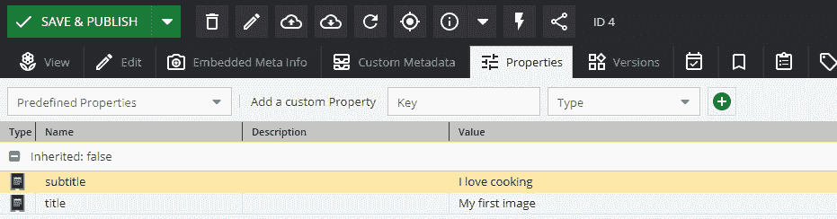

# 第十章：*第十章*: 创建 Pimcore 砖块

在上一章中，我们学习了如何使用 Pimcore 创建实体并渲染自定义网页。之前，在*第八章* *创建自定义 CMS 页面*中，我们发现了如何使用 Web 界面或自定义**模型视图控制器**（**MVC**）页面创建 CMS 页面。在两种情况下，我们都希望有一些可重用的组件，这些组件可以定义一次，并在每次使用时通过更改一些设置来使用。想想看，你可以将其拖放到任何网页上的联系表单小部件。嗯，在 Pimcore 中，这类可重用组件被称为**砖块**。

在本章中，我们将学习如何构建可重用的组件，这些组件可以放置在 CMS 或 MVC 页面上，而且还可以通过包在不同的项目之间移植。

这是我们的路线图：

+   创建一个包

+   理解砖块的工作原理

+   实现一个简单的砖块

+   实现联系表单砖块

+   实现幻灯片砖块

+   使用砖块和块构建通用模板

到本章结束时，你将学会如何创建自定义交互式小部件来组合页面。这对于满足你网站上用户的所有需求非常重要。

让我们开始探索砖块！

# 技术要求

就像前面的章节一样，这里有一个可以在我们的 GitHub 仓库中找到的演示：https://github.com/PacktPublishing/Modernizing-Enterprise-CMS-using-Pimcore/

要运行与本章相关的演示，你需要克隆它，然后导航到`Full Demo`文件夹并启动 Docker 环境。

要这样做，只需遵循以下说明：

1.  使用以下命令运行 Docker：

    ```php
    docker-compose up
    ```

1.  然后，为了从你的本地机器上恢复所有设置，请输入以下命令：

    ```php
    docker-compose exec php bash restore.sh
    ```

1.  导航到[`localhost/admin`](http://localhost/admin)并使用你的管理员/pimcore 凭据登录。

使用此设置，你将获得以下内容：

+   一个`BlogBundle`，在这里你可以找到本章产生的所有资源

+   一个完全工作的 Pimcore 实例，已安装数据和配置

这个项目是一个很好的参考，但毕竟我们在 Pimcore 上已经有很多实践经验了，你也可以从头开始一个项目，并尝试自己复制所有步骤。

# 创建一个包

在我们开始砖块之旅之前，我们必须学习如何创建一个包。在*第七章* *管理 Pimcore 站点*中，我们学习了如何安装来自供应商的包，但我们是怎样构建自己的呢？在本节中，我们将学习包的结构以及如何构建它。包对于创建一个可携带的功能集非常重要，你可以重用它或在网站之间分发。在我们的演示项目中，我们将创建一个自包含的博客包，你可以将其挑选并放置在你的任何网站上。

## 什么是包？

在前面的章节中，您已经使用了主应用程序的许多示例。这对于实现特定项目来说很好，但它并不便携。简单来说，一个包是一个包含源代码和模板的文件夹。您可以通过添加 composer 依赖项或使用本地文件夹来获取这个文件集。这使您可以将代码用于多个项目，或者简单地将复杂的应用程序划分为模块。为了简单起见，在这本书中，我们将使用 `bundles` 路径内的本地文件夹。每个子文件夹将托管不同的包。在本章中，我们将涵盖启动博客所需的所有内容，因此我们将创建一个 `BlogBundle`。这意味着我们将有一个包含所有与包相关的文件的 `/bundles/BlogBundle` 文件夹。这个文件集不是自动发现的；您必须在您的 `composer.json` 中添加特定的配置。在下一部分代码中，是博客包的配置：

```php
"autoload": {
    "psr-4": {
      "App\\": "src/",
      "BlogBundle\\": "bundles/BlogBundle/",
      "Pimcore\\Model\\DataObject\\": "var/classes/DataObject",
      "Pimcore\\Model\\Object\\": "var/classes/Object",
      "Website\\": "legacy/website/lib"
    }
  },
```

如您在前面的代码片段中所见，博客文件夹被添加到 `psr-4` 定义中，紧随标准 `src` 之后，它映射到 `App` 命名空间。在我们的情况下，我们将 `BlogBundle` 命名空间映射到 `bundles/BlogBundle/` 文件夹。当然，您可以玩转这个配置，创建自己的设置以适应您的需求。无论如何，我们建议将配置尽可能接近 Symfony 标准。

下面是一个包内文件夹和文件的列表：

+   `/bundles/BlogBundle`：这是包含所有包资源的包文件夹。包是自包含的，因此它包含所有资源（配置、主题等）和类。

+   `DependencyInjection`：此目录包含配置包的两个重要文件：`BlogExtension.php`（约定是去掉 `Bundle` 单词的包名称然后加上 `Extension.php`）和 `Configuration.php`。

+   `Document/Areabrick`：此文件夹用于 `Brick` 类；我们将在下一节中详细探讨。

+   `控制器`：此文件夹包含控制器。

+   `资源`：此目录包含以下子目录：

    a) `config`：您的 YAML 文件构建于此。

    b) `public`：在这里，您可以加载所有将在 `/bundles/{bundle name}/` 下发布的资源，因此如果您在这里添加一个名为 `script.js` 的文件，您将可以在 [`localhost/bundles/blog/script.js`](http://localhost/bundles/blog/script.js) 找到它。

    c) `视图`：您可以在其中创建一个包含每个控制器模板的子文件夹。此文件夹还包含 `Areas` 子文件夹，其中将包含所有的 `Brick` 模板。

现在是时候创建我们的第一个包了！

### 从命令行创建包

您可以通过使用命名约定手动创建文件和文件夹。这并不难，但在手动操作时很容易出错。幸运的是，我们有一个来自 Pimcore 的命令可以为我们完成这项工作。

在 Symfony 5 中，这不再是内置功能，因此我们必须从 Pimcore 安装一个包，然后我们可以使用控制台创建一个包骨架。

创建包非常简单，将在下一步骤中解释：

1.  使用以下命令进入您的 Docker 实例：

    ```php
     docker-compose exec php bash
    ```

1.  使用以下命令安装包生成器：

    ```php
    composer require pimcore/bundle-generator
    ```

    之前的命令将添加包并为其配置为常规控制台命令。

1.  导航到`config/bundles.php`并使用以下代码注册包：

    ```php
    <?php
    use Pimcore\Bundle\BundleGeneratorBundle\
    PimcoreBundleGeneratorBundle;
    return [
        PimcoreBundleGeneratorBundle::class => ['all' =>     true],
    ];
    ```

1.  运行以下命令：

    ```php
     bin/console pimcore:generate:bundle BlogBundle
    ```

    此操作将为您的包创建一系列文件夹和文件。运行此命令后的结果是创建包含所有基本子文件夹的包。

1.  此外，为了使包内容对应用程序可用，我们需要通过添加命名空间映射来更改我们的 composer 定义，如下例所示：

    ```php
    "psr-4": {
          "App\\": "src/",
          "BlogBundle\\": "bundles/BlogBundle/",
          …
        }
    ```

    在此步骤之后，您可能需要运行`chmod -R www-data.`以修复权限问题。在我们提供的 Docker 示例中，这是强制性的。

1.  现在，该包对系统可用，可以按照第三章中所述的说明启用和安装，*开始使用 Pimcore 管理 UI*。

在本节中，我们学习了如何组成一个包以及如何创建一个新的包。现在我们有了准备好的包，我们可以通过一些实际例子来开始讨论砖块。

# 理解砖块的工作原理

简而言之，砖块由一个类组成，该类取代了控制器和视图的位置。构建砖块与实现 MVC 页面没有太大区别。最重要的例外是，在这种情况下，我们没有路由部分，因为砖块被添加到现有页面中（不能独立运行）。在下图中，我们有一个解释砖块如何工作的架构图：


图 10.1：砖块的概念性架构

在前面的图中，我们可以看到页面（**我的页面**）可以托管许多砖块。每个砖块都由一个**类**和两个模板（**编辑**和**查看**）组成。

在接下来的章节中，我们将学习如何实现每个单独的组件，包括类和模板。

## 类的实现

砖块是`Pimcore\Extension\Document\Areabrick\AreabrickInterface`的一个实例，但为了方便起见，我们通常扩展`AbstractTemplateAreabrick`类，该类实现了接口并提供了一些有趣的方法。这些类可以手动加载或通过 YAML 文件自动加载。尽管将类添加到 YAML 文件中很简单，但这始终是一个额外的步骤。因此，我们通常更喜欢自动加载场景，这只需要我们使用默认文件夹（`Document/Areabrick`），我们将类放置在该文件夹中。您的类命名空间必须是`namespace BlogBundle\Document\Areabrick`。

下面的类实现了一个简单的砖块：

```php
class MyBrick extends AbstractTemplateAreabrick
{
    public function getName()
    {
        return 'The Brick Name';
    }
    public function getDescription()
    {
        return 'The Brick description';
    }
     public function getTemplateSuffix()
     {
          return static::TEMPLATE_SUFFIX_TWIG;
     }
}
```

正如您在前面的代码片段中所看到的，有一些方法必须实现，以提供您组件的信息。这些在代码中突出显示的方法如下：

+   `getName`：此方法返回砖块的名字（应该是唯一的）。

+   `getDescription`：此方法返回砖块的长描述，并在网页界面中显示，以使用户了解砖块的功能。

+   `getTemplateSuffix`：此方法用于定义模板扩展名（Twig 或 PHP）。要采用 Twig 模板而不是 PHP 模板，请使用`static::TEMPLATE_SUFFIX_TWIG`。

现在类部分已经准备好了，我们可以在下一节中看到如何设置模板。

## 模板化

通常，对于砖块类，模板遵循一个命名约定。它们必须位于视图文件夹（`Resources/views`）内的`Areas`文件夹中。每个砖块都必须有自己的文件夹，但文件夹名称必须使用脊椎式命名法（所有字母小写，单词之间用连字符分隔，因此`MyBrick`需要一个名为`my-brick`的文件夹）。视图模板的名称必须是`view.html.twig`。

一些砖块是完全所见即所得的，您只需输入数据就可以更改组件的行为。其他砖块将配置与渲染分离。在这些情况下，您可以配置一个编辑弹出窗口，它会提示输入数据。我们将在下一节的示例中详细说明配置。

在下一个方案中，我们总结了命名约定，并为每种情况添加了路径示例。**全局**场景是将砖块添加到主项目（应用文件夹）的选项，而**包**场景是将砖块添加到特定的包中：

+   **视图路径**:

    a) **全局**:

    ```php
    templates/views/Areas/{BrickID}/view.html.(php|twig)
    ```

    b) **包**:

    ```php
    {BundleLocation}/Resources/views/Areas/iframe/view.html.(php|twig)
    ```

+   **类**:

    a) **全局**:

    ```php
    src/Document/Areabrick/{BrickID}
    ```

    b) **包**:

    ```php
    {BundleLocation}/Document/Areabrick/{BrickID}
    ```

在本节中，我们学习砖块由什么组成。这对于理解命名约定和使用原则很重要。现在，是时候通过一些例子深入了解！在下一节中，我们将涵盖从简单到复杂使用的重要用例。

# 实现一个简单的砖块

在本节中，我们将实现我们的第一个砖块。因为本书的精神是使用真实世界的例子来学习，所以我们不会将其限制在“你好，世界”的例子中。在我们的第一个例子中，我们将创建一个可以多次放置在页面上的小部件，并可以重复使用。这个小部件将允许添加文本，选择标题类型（h1、h2 等），并输入文本。

为了完成这个目标，我们必须遵循以下步骤：

1.  创建一个文档并将其链接到控制器和模板文件。我们在*第四章*“在 Pimcore 中创建文档”和*第九章*“配置实体和渲染数据”中多次执行了这个步骤。这个文档将用于测试我们正在创建的砖块。

1.  在`/bundles/BlogBundle/Document/Areabrick`中创建一个名为`Heading.php`的文件。文件内容应如下所示：

    ```php
    class Header extends AbstractTemplateAreabrick
    {
        public function getName()
        {
            return 'Header';
        }
        public function getDescription()
        {
            return 'A component for rendering a Header';
        }
        public function getTemplateLocation()
        {
            return static::TEMPLATE_LOCATION_BUNDLE;
        }
    }
    ```

    提供的代码声明了一个名为`Header`的砖块，具有特定的描述。现在我们有了砖块定义，我们必须为它添加一个模板。这将是我们的下一步。

1.  在`/bundles/BlogBundle/Resources/views/Areas`中添加一个名为`view.html.twig`的模板。

1.  将以下代码添加到文件中：

    ```php
    
    {{pimcore_select('style', {
                "store" : [
                    ['h1', 'H1'],
                    ['h2', 'H2'],
                    ['h3', 'H3']
                ],
                "defaultValue" : "h1"
    })}}
    {{pimcore_input('text')}}

    
    <{{pimcore_select('style')}}>{{pimcore_input('text')}}<{{pimcore_select('style')}}>
    
    ```

    代码分为两个分支。第一个分支在编辑模式下被激活，显示一个选择组件，允许你选择标题类型（h1、h2 等）和文本；第二个分支的代码显示在标题中的数据包装文本。我们实现第一个砖块所需的所有工作已经完成；我们现在只需测试它。

1.  在*步骤 1*中创建的模板中，添加以下片段：

    ```php
    {{ pimcore_areablock("header")}}
    ```

    在编辑模式下，此可编辑将显示以下组件：

    ![图 10.2：可编辑组件]

    ](img/Figure_10.02_B17073.jpg)

    图 10.2：可编辑组件

    此组件只是一个占位符，将允许我们从砖块列表中选择一个砖块并将其放入页面中。我们将在下一步中这样做。

1.  点击加号按钮。它将显示以下菜单：![图 10.3：Areablock 的菜单]

    ](img/Figure_10.03_B17073.jpg)

    图 10.3：Areablock 的菜单

    如前一个屏幕截图所示，我们输入到类中的数据用于区分组件。实际上，我们选择了**标题**作为砖块名称，**用于渲染标题的组件**作为描述。

1.  点击框中的`My H1 text`：![图 10.4：标题砖块编辑]

    ](img/Figure_10.04_B17073.jpg)

    图 10.4：标题砖块编辑

1.  现在点击**预览**按钮或导航到页面。输出将是以下内容：

![图 10.5：砖块输出]

](img/Figure_10.05_B17073.jpg)

![图 10.5：砖块输出]

页面正确显示了我们所选择的文本。

这个第一个例子展示了在 Pimcore 中创建可重用组件是多么简单。实际上，我们可以在每个页面上使用标题砖块，使用户在需要时选择并配置它。你可以与**块**结合使用，允许用户选择一系列自定义元素或将其硬编码在模板中。此外，我们还可以使用交互式砖块。我们将在下一节中了解所有这些功能。

# 实现联系表单砖块

在这个例子中，我们将了解如何创建一个用户可以插入数据的交互式组件。为此，我们将创建一个联系表单。当填写详细信息并点击按钮时，将向固定收件人地址发送电子邮件。此小节还将介绍打开砖块编辑器以获取视图中未显示的参数的工作示例。按照以下步骤实现示例：

1.  首先，使用模板创建一个文档，并在可编辑的模板中放置一个 `areabrick`。在下一步中，我们将必须创建砖。

1.  在 `/bundles/BlogBundle/Document/Areabrick/` 中创建 `ContactForm.php` 文件。内容如下：

    ```php
    class ContactForm extends AbstractTemplateAreabrick
    {
        public function getName()
        {
            return 'ContactForm';
        }
        public function getDescription()
        {
            return 'ContactForm';
        }
        public function getTemplateLocation()
        {
            return static::TEMPLATE_LOCATION_BUNDLE;
        }
    }
    ```

1.  现在我们需要要求用户为联系表单添加收件人地址。在复杂场景中，您可能需要添加更多参数并对其进行组织。这可以通过实现特殊的 `EditableDialogBoxInterface` 接口来实现。在下一段代码中，我们可以看到必须添加的代码：

    ```php
    class ContactForm extends AbstractTemplateAreabrick implements EditableDialogBoxInterface
    {
      public function   getEditableDialogBoxConfiguration(Document\Editable   $area, ?Info $info): EditableDialogBoxConfiguration
        {
            $config = new EditableDialogBoxConfiguration();

            $config->setItems([
                'type' => 'tabpanel',
                'items' => [
                    [
                        'type' => 'panel',
                        'title' => 'Contact Form Settings',
                        'items' => [
                            [
                                'type' => 'input',
                                'label' => 'Email Recipient',
                                'name' => 'recipient'
                            ]

                ]
                ]
            ]]);
            return $config;
        }
    }
    ```

    实际上，配置是一个可以分组到容器中的项目数组。在我们的案例中，我们使用了选项卡面板，并将输入放置在其中。此数组将用于自动生成用户的输入表单。输入的数据将以常规可编辑的形式提供给用户，如下面的代码片段所示：

    ```php
    $recipient=$this->getDocumentEditable($info->getDocument(), 'input', 'recipient')->getData();
    ```

1.  创建 `view.html.twig` 文件。此文件将包含将显示给用户的全部内容。在下一个代码片段中，为了简洁，我们提供了一个简化的表单（完整的 bootstrap 示例在本书相关的源代码中）：

    ```php
    
      {{ alert }}
     

    <form id="contact-form" name="contact-form" method="POST">
       <input type="hidden" name="sendEmail" value="true"/>
       <input type="text" id="name" name="name" >
       <input type="text" id="email" name="email" >
       <input type="text" id="subject" name="subject" >
       <textarea type="text" id="message" name="message" >
       </textarea>
       <input type="submit" value="submit" />
    </form>
    ```

    模板包含一个警告消息，这是一个用于确认向用户发送电子邮件或显示错误的消息。表单包含从用户获取字段的输入和一个提交按钮。动作未指定，因此此表单将向页面本身提交数据。隐藏的输入 `sendEmail` 是一个将激活发送过程的标志。

1.  现在是时候在后台指定读取 POST 数据和发送真实电子邮件的逻辑了。下一个代码片段显示了要添加到砖类中的方法：

    ```php
    public function action(Info $info)
    {  
         $request=$info->getRequest();
         $id= $info->getEditable()->getName();
         $info->setParam('id', $id);
         $sendEmail=$request->get("sendEmail");
         if($sendEmail==$id)
         {
              $name=$request->get("name");
              $email=$request->get("email");
              $subject=$request->get("subject");
              $message=$request->get("message");

              //send an email here
              $sent= $this->sendEmail($name,$email,
              $subject,$message, $recipient);
              if($sent)
              {
                   $alert="the message is sent!";
              }
              else
              {
                   $alert="there was an error, try later";
              }
              $info->setParam('name',$name);
              $info->setParam('email',$email);
              $info->setParam('subject',$subject);
              $info->setParam('message',$message);
              $info->setParam('alert',$alert);

         }
         $recipient=$this->getDocumentEditable($info->
         getDocument(), 'input', 'recipient')->getData();
         $info->setParam('recipient',$recipient);        

    }
    ```

    之前的代码实现了获取参数并发送通知用户结果的逻辑。`$request=$info->getRequest();` 用于获取包含提交数据的 HTTP 请求，并使用 `get` 方法获取 `sendEmail` 标志的值，该标志激活发送过程。您可以通过使用参数将变量传递给视图，如下面的代码片段所示：

    ```php
    $info->setParam('recipient',$recipient);  
    ```

    现在所有组件都已就绪，可以测试我们的砖了。

1.  按照从 *实现简单砖* 部分的 *步骤 5-6* 添加砖到页面。现在页面上将有一个工作状态的联系表单组件。

1.  通过点击砖的工具栏中的铅笔图标打开设置：

    图 10.6：打开弹出窗口

1.  点击铅笔图标，将显示一个弹出窗口：

    图 10.7：输入收件人的弹出窗口

    您可以输入用作联系表单收件人的电子邮件地址。

1.  保存文档并打开本节 *步骤 1* 中创建的文档页面。将显示联系表单。

1.  用数据填写表单（它是一个联系表单，所以字段含义应该是自解释的）并点击**发送**。您应该会看到一个确认警报，如下面的截图所示：


](img/Figure_10.08_B17073.jpg)

图 10.8：发送后显示确认信息的联系表单

如您从本例中学到的那样，实现交互式小部件，如联系表单，相当简单。无论如何，当您在同一页面上有多个组件时，有一些技巧需要了解以避免冲突。我们将在下一节中解释这一点。

## 避免冲突

对于联系表单的例子，我们必须提出一个关于在具有多个砖块的页面上提交数据的问题。使用帖子方法，我们向服务器发送数据并在后端管理请求。这个程序非常简单，但它可能导致一些问题。事实上，考虑一下您在同一页面上有多个组件的情况。

在我们的例子中，如果我们将两个联系表单小部件放在同一页面上，点击发送将会触发两个动作。类似的情况也可能发生在具有相似字段名称的不同组件上。

为了避免此类冲突，请遵循以下故障排除步骤：

1.  为所有字段名称添加一个唯一的前缀（每个组件一个）。在我们的例子中，这可以是`cf`用于`ContactForm`，名称将是`cf-name`、`cf-sendEmail`等等。

1.  将实例名称作为触发值。这是使您的帖子独特所必需的。砖块类的动作方法（在*实现联系表单砖块*的*步骤 5*中创建）的更改如下：

    ```php
    …
    $id= $info->getEditable()->getName();
    $sendEmail=$request->get("cf-sendEmail");
    if($sendEmail==$id)
    {
    …
    ```

    现在只有当组件的名称与产生帖子的名称完全相同时，才会处理电子邮件发送过程。同一砖块的两种不同实例会产生不同的名称，因此您的动作只会被触发一次。

    最后一步是在视图模板文件中进行一个小改动（在*实现联系表单砖块*的*步骤 3*中创建）。我们将添加一个具有`cf-sendEmail`名称属性和从动作方法计算出的 ID 作为`value`的隐藏输入。将以下片段复制到您的视图文件中：

    ```php
    <input type="hidden" name="cf-sendEmail" value="{{id}}"/>
    ```

    此值将作为帖子参数发送回我们的动作方法，我们将将其与服务器端生成的值进行比较。如果它们不相等，帖子就不会与当前组件匹配，我们避免任何动作。

在本节中，我们学习了如何实现联系表单。我们刚刚完成的例子向我们展示了创建一个可重用的交互式砖块是多么简单。您不仅能够在您网站的任何页面上重用此组件，还可以将捆绑包复制到另一个网站，并免费获得此功能。在下一个例子中，我们将了解如何实现幻灯片，通过混合控制器和砖块来重用我们可能为 MVC 页面编写的代码。

# 实现幻灯片砖块

在本例中，我们将构建一个幻灯片小部件，可以用来显示图像轮播。这将非常简单，我们只需使用 bootstrap 和迄今为止学到的工具。实际上，我们将重用用于显示图像库的代码*第九章*，*配置实体和渲染数据*，但我们将将其集成到一个砖块中。为此，请按照以下步骤操作：

1.  首先，通过创建一个名为`Slideshow`的文件夹并上传一系列图像到其中来准备环境。我们应该使用宽图像（例如 1920x1080）。

1.  为每个图像打开图像设置，并将图像的标题和描述作为元数据添加。我们将在模板中使用它。

1.  通过单击工具栏上的**属性**选项卡按钮来访问属性面板。每个 Pimcore 实体（对象、文档和资产）都有一组键/值属性，可以用来动态扩展信息。我们将使用它们来为我们的图像添加元数据。在下一张截图中，我们可以看到一个有效的配置：

    图 10.9：图像属性

    上一张截图显示了属性表。我们添加了一个标题和副标题字段，并输入了一些值。

1.  创建一个缩略图预设。我们必须配置缩略图引擎，以便将上传的图像调整大小以匹配幻灯片组件期望的格式。用户可能会上传过大或比例错误的图像（例如，横向而不是纵向），但我们需要确保所有图像具有相同的高度，以便正确显示图像。我们需要裁剪上传的图像并使它们具有相同的格式。在我们的示例中，我们可以使用一个裁剪转换，该转换将生成只有 400 像素高的图像。为此，只需输入以下截图中的**宽度、高度**和**X、Y**设置：

    图 10.10：缩略图配置

1.  通过在砖块类文件夹中添加`SlideShow.php`来创建一个名为`SlideShow`的砖块（例如，`/bundles/BlogBundle/Document/Areabrick/SlideShow.php`）。

1.  在视图文件夹中创建一个模板文件（例如，`/bundles/BlogBundle/Resources/views/Areas/slide-show`）。请注意文件夹名称 - 它必须与砖块名称匹配，但要以小写形式呈现，单词之间用连字符分隔，因此`slide-show`将是`Slideshow`。

1.  现在将以下内容添加到模板中：

    ```php
    {{
         pimcore_renderlet('myGallery', {
               "controller" : "BlogBundle\\Controller\\
               SlideShowController::galleryAction",
               "title" : "Drag an asset folder here to get 
               a gallery",
               "height" : 400
         })
    }}
    ```

    上述代码添加了一个 Pimcore renderlet，允许用户将其拖放到文件夹上，并使用控制器来实现渲染逻辑。在我们的情况下，我们将使用`SlideShow`控制器中的画廊操作。我们正在使用一个包中的控制器，因此我们必须指定包名称。

1.  将`SlideShow`控制器添加到控制器文件夹中（例如，`/bundles/BlogBundle/Document/Controller/SlideShowController.php`）。初始内容应如下所示：

    ```php
    <?php
    namespace BlogBundle\Controller;
    use Pimcore\Controller\FrontendController;
    use Symfony\Component\HttpFoundation\Request;
    use Symfony\Component\HttpFoundation\Response;
    use Symfony\Component\Routing\Annotation\Route;
    use Sensio\Bundle\FrameworkExtraBundle\Configuration\Template;
    use Pimcore\Model\Asset;
    class SlideShowController extends FrontendController
    {
    }
    ```

1.  现在我们必须实现渲染视图的动作。这个动作将获取用户添加的文件夹，并将图像列表加载到视图中。在下面的代码片段中，我们有动作实现；将其取走并添加到你的控制器中：

    ```php
    public function galleryAction(Request $request)
    {
         $result=array();
         if ('asset' === $request->get('type')) {
              $asset = Asset::getById($request->
              get('id'));
              if ('folder' === $asset->getType()) {
                 $result['assets'] = $asset->
                  getChildren();
              }
         }
         return $result;
    }
    ```

    代码与我们在*第九章*，*配置实体和渲染数据*中使用的代码相同，因此无需更多解释。

1.  正确渲染的最后一步是创建一个名为`gallery`的视图，并将其放置在控制器相关的文件夹中（例如，`/bundles/BlogBundle/Resources/views/slide_show/gallery.twig`）。我们将使用的模板如下：

    ```php
    <div id="carouselExampleControls" ...>
      ... omitted bootstrap tags  
      
         
         
              
                   <div class="carousel-item  {{ active 
                    }}">
                      setWidth(600);
            $config->setItems([
                'type' => 'tabpanel',
                'items' => [
                    [
                        'type' => 'panel',
                        'title' => 'Column settings',
                        'items' => [
                            [
                                'type' => 'select',
                                'label' => 'Layout',
                                'name' => 'layout',
                                'config' => [
                                    'store' => [
                                        ['one.html.twig',                                     'One column'],
                                        ['two-50-50.html.                                    twig', 'Two column                                     50-50'],
                                        ['two-30-70.html.                                    twig', 'Tre column                                     30-70'],
                                    ]
                                ]
                            ]

                ]
                ]
            ]]);
            return $config;
        }
    ```

    注意，为了简单起见，我们使用了文件模板的名称作为选择项的值，这样项就可以简单地与内容相关联。

1.  类中的最后一步是读取配置参数并将其传递到视图中。为此，你只需将以下代码中的 `action` 方法实现添加到你的类中：

    ```php
    public function action(Info $info)
    {       
         $layout=$this->getDocumentEditable($info->
         getDocument(), 'select', 'layout')->getData(); 
         $info->setParam('layout',"@Blog/areas/
         container/templates/$layout");        
    }
    ```

    如从源代码中看到的，相对文件名被转换成完整路径并添加到属性包中。

1.  现在我们必须实现主视图模板。只需将以下代码添加到 `view.html.twig` 文件中：

    ```php
    <div class="container blog-container">
    
    
        <div class="blog-container-footer">
                CONTAINER
        <div>
    
    </div>
    ```

    上一段代码包含了基于动作中设置的变量创建的模板，并且简单地将其包裹在 bootstrap 容器中。此外，当你处于编辑模式时，它会在底部添加一个栏来帮助用户识别布局。

1.  现在我们必须实现砖模板。像往常一样，我们需要创建一个 `view.html.twig` 文件，但这次我们还将创建一个包含许多其他模板的文件夹，这些模板将被动态加载。因此，创建 `one.html.twig`、`two-50-50.html.twig` 和 `two-30-70.html.twig` 文件。最终结果如下：

    图 10.15：文件配置

1.  现在我们必须实现三个模板。为了简洁，我们在这里只报告一个案例：其他案例非常相似，可以在代码库中找到。下一段代码展示了两列的实现：

    ```php
    <div class="row">
        <div class="col-6 blog-col">
            {{ pimcore_areablock("content_50501")}}        
        </div>
         <div class="col-6 blog-col">
            {{ pimcore_areablock("content_50502")}}        
        </div>
    </div>
    ```

    正如你在前面的代码中看到的，有一个 bootstrap 行和两个列（`col-6`；`col-6` 表示相同的宽度）。在每一列内部，`areablock` 组件将允许你选择要添加到其中的组件。现在我们准备好在现实世界的例子中使用我们的通用模板了！

1.  在`/bundles/BlogBundle/Layout`中创建`layout.html.twig`文件，并添加以下代码片段：

    ```php
    {# SETTING THE IMAGE URL#}
    
    
     
      
        
       
    
    {# PRINT HEADER#}
    <header class="masthead" style="background-image: url({{imageurl}})">
        <div class="overlay"></div>
        <div class="container">
          <div class="row">
            <div class="col-lg-8 col-md-10 mx-auto">
              <div class="site-heading">
                <h1> {{ pimcore_input('headline', {'width':             540}) }}</h1>
                <span class="subheading"> {{ pimcore_            input('subheading', {'width': 700}) }}</span>
              </div>
            </div>
          </div>
        </div>
      </header>
    {# IMAGE INPUT #}
    
    {{  pimcore_relation("image",{
        "types": ["asset"],
        "subtypes": {
            "asset": [ "image"],
        },
        "classes": ["person"]
    }) }}
    
    ```

    这段代码将渲染一个参数化标题，该标题将放置在所有我们的页面上。您不希望在所有页面上都有它？没问题。您总是可以将此代码转换为砖块，并仅将其放置在您真正需要的地方。

1.  现在，创建一个模板。因为我们想创建一个带有水平带的标准化布局，所以我们只允许使用`Container`砖块。

1.  要做到这一点，只需在默认文件夹内创建一个名为`generic.html.twig`的文件，并将其添加到以下代码片段中：

    ```php
    
    
     
        {{ pimcore_areablock("content", {'allowed':['container']})}}
    
    ```

    之前的脚本定义了一个带有标题和将托管页面布局容器的区域块的页面结构。

1.  创建一个网页，并使用此过程*第 6 步*中创建的`generic.html.twig`模板。

1.  以编辑模式打开您创建的网页。您应该看到以下结果：

    图 10.16：将容器添加到页面

1.  完成此步骤后，组件将在页面上就绪。现在点击配置按钮，如图所示：

    图 10.17：打开设置

1.  到目前为止，用户可以使用编辑框选择布局，就像我们在上一节中看到的联系表单示例一样。此配置的结果如下弹出窗口：

    图 10.18：选择布局

    以下截图显示了允许我们创建任意多带的区域砖块。完成此步骤后，您应该得到以下结果：

    

    图 10.19：页面上的容器组件

1.  通过点击容器区域内的加号按钮（如图 10.19 所示）并选择列砖块，将列内容添加到其中。

1.  通过点击加号按钮并从组件菜单中选择项目，在右侧添加一个联系表单。

1.  在左侧列中添加一个标题组件，即我们在*实现简单砖块*部分创建的标题组件。然后在标题上方添加一个所见即所得编辑器。您应该得到以下截图所示的结果：

    图 10.20：带有联系表单和数据的网页

1.  现在通过点击顶部向下箭头（如图 10.20 所示）在之前的容器之后添加另一个容器。在此组件上添加幻灯片砖块。通过拖放图片进行配置，就像我们在本章幻灯片示例中所做的那样。下一张截图总结了您在此页面部分的工作：


图 10.21：本例中要获得的结果

在本节中，我们学习了如何创建一个能够适应大多数情况的模板。这个例子为我们提供了一个在现实场景中测试通用布局的好机会。这个模板，结合你能够创建的所有砖块，将涵盖最常见的场景，并将节省大量时间。

# 摘要

在本章中，我们继续使用 Pimcore CMS，通过发现砖块引擎，另一个创建动态网站的重要工具。通过创建砖块，可以轻松准备可重复使用的组件，网页编辑人员可以使用这些组件来组合任何网站，而无需向开发者请求定制。这种新的处理方式对于减少开发工作量、保持高质量标准和提高实现用户所需功能的速度非常重要。

更具体地说，我们通过实施现实世界的例子发现了砖块的工作原理。联系表单和幻灯片是你在项目中一定会重复使用的组件。此外，我们还学习了如何创建一个通用模板，使我们能够不写一行代码就生成任何页面布局。

在下一章中，我们将学习如何通过发现一些日常 Pimcore 使用的重要细节和解决方案来最终确定我们的网站。最重要的几点包括，我们将学习如何创建安装包的安装程序，以便在设置后轻松重新创建我们的类和内容，以及我们将学习如何创建 Pimcore 的多站点实例。
