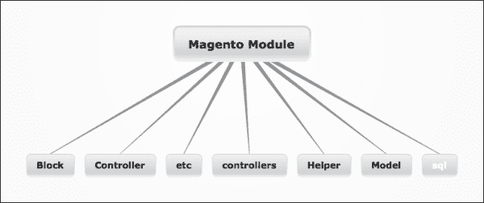
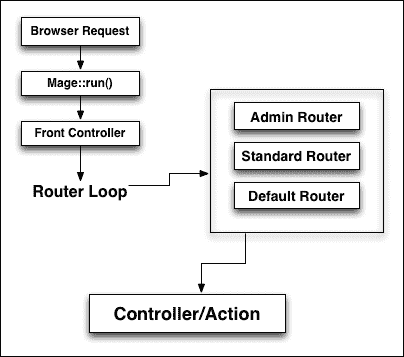
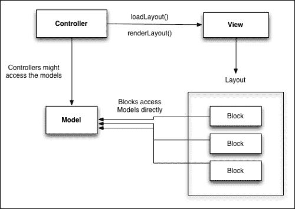
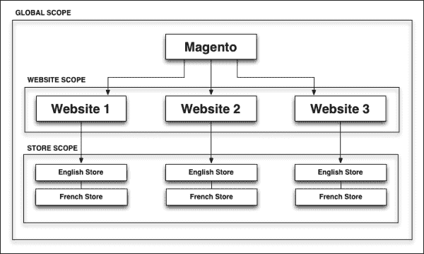
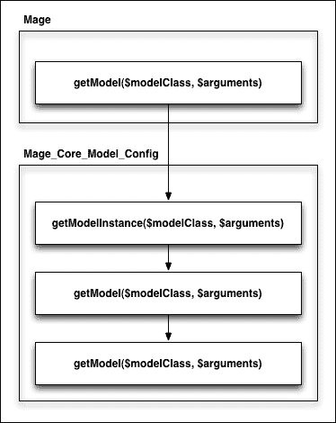
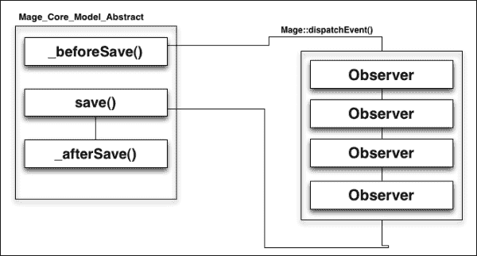

# 第一章. 开发者必备的 Magento 基础知识

在本章中，我们将介绍与 Magento 一起工作的基本概念。我们将学习 Magento 的结构，并探讨 Magento 灵活性的来源，即其模块化架构。

Magento 是一个灵活且强大的系统。不幸的是，这也增加了一些复杂性。目前，一个干净的 Magento 安装大约有 20,000 个文件和超过 1.2 百万行代码。

在所有这些功能和复杂性面前，Magento 对于新开发者来说可能会有些令人畏惧；但别担心。本章旨在为新开发者提供所有他们需要的基本概念和工具来使用和扩展 Magento，而在下一章中，我们将深入探讨 Magento 模型和数据收集。

# Zend Framework – Magento 的基础

如你所知，Magento 是市场上最强大的电子商务平台。你可能不知道的是，Magento 还是一个基于 **Zend Framework** 开发的面向对象（OO）PHP 框架。

### 注意

Zend Framework 2 自 2013 年以来就已经可用，但 Magento 仍然依赖于 Zend Framework 1.11。

这是 Zend 官方网站对框架的描述：

> *"我们设计 Zend Framework 时考虑了简洁性。为了提供一个轻量级、松散耦合的组件库，简化到提供每个人需要的 4/5 功能，并允许你自定义其他 20% 来满足你特定的业务需求。通过关注最常用的功能，我们保留了 PHP 编程的简化精神，同时大幅降低了学习曲线——以及你的培训成本——这样开发者可以快速上手。"*
> 
> [`files.zend.com/help/Zend-Server-5/zend_framework.htm`](http://files.zend.com/help/Zend-Server-5/zend_framework.htm)

那么，Zend Framework 究竟是什么呢？Zend Framework 是一个在 PHP 上开发的面向对象（OO）框架，实现了 **模型-视图-控制器**（MVC）范式。当 **Varien**（现在为 Magento Inc.）开始开发 Magento 时，他们决定基于 Zend 来开发，因为一些组件，其中一些如下：

+   `Zend_Cache`

+   `Zend_Acl`

+   `Zend_Locale`

+   `Zend_DB`

+   `Zend_Pdf`

+   `Zend_Currency`

+   `Zend_Date`

+   `Zend_Soap`

+   `Zend_Http`

总体而言，Magento 使用了大约 15 个不同的 Zend 组件。Varien 库直接扩展了之前提到的几个 Zend 组件。例如，`Varien_Cache_Core` 扩展自 `Zend_Cache_Core`。

使用 Zend Framework，Magento 考虑以下原则进行构建：

+   **可维护性**：通过使用代码池将核心代码与本地定制和第三方模块分开

+   **可升级性**：Magento 的模块化允许扩展和第三方模块独立于系统其他部分进行更新

+   **灵活性**：允许无缝定制并简化新功能的开发

虽然使用 Zend Framework 的经验或对其的理解不是开发 Magento 的要求，但至少对 Zend 组件、用法和交互有一些基本了解，在我们开始深入研究 Magento 核心时，这可能非常有价值的信息。

您可以在[`framework.zend.com/`](http://framework.zend.com/)了解更多关于 Zend Framework 的信息。

# Magento 的文件夹结构

Magento 的文件夹结构与其他 MVC 应用程序略有不同。让我们看看目录树，以及每个目录及其功能：

+   `app`：这个目录是 Magento 的核心，并细分为三个重要的子目录：

    +   `code`：这个目录包含我们所有应用程序代码，分为三个代码池，即核心、社区和本地。

    +   `design`：这个目录包含我们应用程序的所有模板和布局。

    +   `locale`：这个目录包含用于商店的所有翻译和电子邮件模板文件。

+   `js`：这个目录包含在 Magento 中使用的所有 JavaScript 库。

+   `media`：这个目录包含我们产品和 CMS 页面所用的所有图像和媒体文件，以及产品图像缓存。

+   `lib`：这个目录包含所有在 Magento 中使用的三方库（例如 Zend 和 PEAR）以及由 Magento 开发的自定义库，这些库位于`Varien`和`Mage`目录下。

+   `skin`：这个目录包含对应主题使用的所有 CSS、图像和 JavaScript。

+   `var`：这个目录包含我们的临时数据，例如缓存文件、索引锁定文件、会话、导入/导出文件，以及在企业版中，完整的页面缓存文件夹。

Magento 是一个模块化系统。这意味着应用程序，包括核心，被划分为更小的模块。因此，文件夹结构在组织每个模块中起着关键作用。一个典型的 Magento 模块文件夹结构可能看起来像这样：



让我们进一步审查每个文件夹：

+   `Block`：在 Magento 中，块形成控制器和视图之间的额外逻辑层。

+   `controllers`：这些由处理 web 服务器请求的动作组成。

+   `Controller`：这个目录下的类可以是抽象类，并且可以被`controllers`目录下的`controller`类扩展。

+   `etc`：在这个目录中，我们可以找到以 XML 文件形式存在的模块特定配置，例如`config.xml`和`system.xml`。

+   `Helper`：这个目录包含封装常见模块功能并使其对同一模块的类以及其他模块的类可用的辅助类。

+   `Model`：这个目录包含支持模块中的控制器与数据交互的模型。

+   `sql`：这些包含每个特定模块的安装和升级文件。

+   `data`：这个目录在 Magento 1.6 CE 中引入，其用法类似于 SQL 脚本，但数据脚本只关注插入数据。

正如我们将在本章后面看到的那样，Magento 大量使用工厂名称和工厂方法。这就是为什么文件夹结构如此重要的原因。

# 模块化架构

与大型应用程序不同，Magento 是由较小的模块构建的，每个模块都为 Magento 添加特定的功能。

这种方法的一个优点是能够轻松地启用和禁用特定模块的功能，以及通过添加新模块来添加新功能。

## 自动加载器

Magento 是一个由近 20,000 个文件组成的庞大框架。在应用程序启动时要求每个文件将使其运行极其缓慢且资源密集。因此，Magento 使用自动加载器类在每次调用工厂方法时包含文件。

那么，自动加载器究竟是什么呢？PHP5 包含一个名为 `__autoload()` 的函数。当实例化一个类时，`__autoload()` 函数会自动被调用。在这个函数内部，定义了自定义逻辑来解析类名并包含文件。

让我们更仔细地看看位于 `app/Mage.php` 的 Magento Bootstrap 代码：

```php
… 
Mage::register('original_include_path', get_include_path());
if (defined('COMPILER_INCLUDE_PATH')) {
    $appPath = COMPILER_INCLUDE_PATH;
    set_include_path($appPath . PS . Mage::registry('original_include_path'));
    include_once "Mage_Core_functions.php";
    include_once "Varien_Autoload.php";
} else {
    /**
     * Set include path
     */
    $paths[] = BP . DS . 'app' . DS . 'code' . DS . 'local';
    $paths[] = BP . DS . 'app' . DS . 'code' . DS . 'community';
    $paths[] = BP . DS . 'app' . DS . 'code' . DS . 'core';
    $paths[] = BP . DS . 'lib';

    $appPath = implode(PS, $paths);
    set_include_path($appPath . PS . Mage::registry('original_include_path'));
    include_once "Mage/Core/functions.php";
    include_once "Varien/Autoload.php";
}

Varien_Autoload::register();
```

Bootstrap 文件负责定义包含路径并初始化 Varien 自动加载器，该自动加载器反过来定义其自己的自动加载函数作为默认要调用的函数。让我们深入了解并看看 Varien 的自动加载函数在做什么：

```php
    /**
     * Load class source code
     *
     * @param string $class
     */
    public function autoload($class)
    {
        if ($this->_collectClasses) {
            $this->_arrLoadedClasses[self::$_scope][] = $class;
        }
        if ($this->_isIncludePathDefined) {
            $classFile =  COMPILER_INCLUDE_PATH . DIRECTORY_SEPARATOR . $class;
        } else {
            $classFile = str_replace(' ', DIRECTORY_SEPARATOR, ucwords(str_replace('_', ' ', $class)));
        }
        $classFile.= '.php';
        //echo $classFile;die();
        return include $classFile;
    }
```

`autoload` 类接受一个名为 `$class` 的单个参数，这是由工厂方法提供的别名。这个别名被处理以生成匹配的类名，然后被包含。

正如我们之前提到的，由于 Magento 从目录结构中派生其类名，因此 Magento 的目录结构非常重要。这是工厂方法背后的核心原则，我们将在本章后面进行回顾。

## 代码池

如前所述，在我们的 `app/code` 文件夹中，我们的应用程序代码被分为以下三个不同的目录，称为代码池：

+   `core`：这是提供基本功能的 Magento 核心模块所在的位置。在 Magento 开发者中有一条黄金法则，那就是在任何情况下都不要修改核心代码池下的任何文件。

+   `community`：这是第三方模块放置的位置。它们要么由第三方提供，要么通过 Magento Connect 安装。

+   `local`：这是所有为这个 Magento 实例开发的具体模块和代码所在的位置。

代码池识别模块的来源以及它们应该加载的顺序。如果我们再次查看 `Mage.php` Bootstrap 文件，我们可以看到代码池加载的顺序：

```php
    $paths[] = BP . DS . 'app' . DS . 'code' . DS . 'local';
    $paths[] = BP . DS . 'app' . DS . 'code' . DS . 'community';
    $paths[] = BP . DS . 'app' . DS . 'code' . DS . 'core';
    $paths[] = BP . DS . 'lib';
```

这意味着，对于每个类请求，Magento 将在 `local` 文件夹中查找，然后是社区和 `core` 文件夹，最后在 `lib` 文件夹中查找。

这也产生了一种有趣的行为，可以很容易地通过复制目录结构和匹配类名来覆盖核心和社区类。

### 小贴士

不言而喻，这是一个糟糕的做法，但了解这一点仍然很有用，以防万一有一天你必须处理利用这种行为的项目。

# 路由和请求流程

在深入探讨构成 Magento 不同部分的组件之前，了解这些组件如何相互作用以及 Magento 如何处理来自 Web 服务器的请求非常重要。

就像任何其他 PHP 应用程序一样，我们有一个单独的文件作为每个请求的入口点。在 Magento 的情况下，这个文件是`index.php`，负责加载`Mage.php`引导类并启动请求周期。

1.  服务器接收请求并通过调用引导文件`Mage.php`实例化 Magento。

1.  前端控制器被实例化和初始化。在控制器初始化期间，Magento 搜索网络路由并将它们实例化。

1.  然后，Magento 遍历每个路由器并调用 match。match 方法负责处理 URL 并生成相应的控制器和动作。

1.  实例化匹配的控制器和相应的动作。

路由在这个过程中特别重要。路由器对象被前端控制器用来将请求的 URL（路由）匹配到模块控制器和动作。默认情况下，Magento 附带以下路由器：

+   `Mage_Core_Controller_Varien_Router_Admin`

+   `Mage_Core_Controller_Varien_Router_Standard`

+   `Mage_Core_Controller_Varien_Router_Cms`

+   `Mage_Core_Controller_Varien_Router_Default`

动作控制器随后将加载并渲染布局，该布局反过来将加载相应的块、模型和模板。

让我们分析一下 Magento 将如何处理对分类页面的请求。我们将使用`http://localhost/catalog/category/view/id/10`作为示例。Magento URI 由三部分组成，即`FrontName/ControllerName/ActionName`。

因此，对于我们的示例 URL，分解如下：

+   `FrontName`: 这是一个目录

+   `ControllerName`: 这是一个分类

+   `ActionName`: 这是一个视图

让我们看看 Magento 路由器类`Mage_Core_Controller_Varien_Router_Standard`的 match 函数：

```php
public function match(Zend_Controller_Request_Http $request)
{
  …
   $path = trim($request->getPathInfo(), '/');
            if ($path) {
                $p = explode('/', $path);
            } else {
                $p = explode('/', $this->_getDefaultPath());
            }
  …
}
```

从前面的代码中，我们可以看到路由器首先尝试做的事情是将 URI 解析成数组。根据我们的示例 URL，相应的数组将类似于以下代码：

```php
$p = Array
(
    [0] => catalog
    [1] => category
    [2] => view
)
```

函数的下一部分将首先尝试检查请求是否指定了模块名称。如果没有，那么它将根据我们数组的第一个元素尝试确定模块名称。如果无法提供模块名称，则函数将返回 false。让我们看看这段代码：

```php
      // get module name
        if ($request->getModuleName()) {
            $module = $request->getModuleName();
        } else {
            if (!empty($p[0])) {
                $module = $p[0];
            } else {
                $module = $this->getFront()->getDefault('module');
                $request->setAlias(Mage_Core_Model_Url_Rewrite::REWRITE_REQUEST_PATH_ALIAS, '');
            }
        }
        if (!$module) {
            if (Mage::app()->getStore()->isAdmin()) {
                $module = 'admin';
            } else {
                return false;
            }
        }
```

接下来，`match` 函数将遍历每个可用的模块，并尝试使用以下代码匹配控制器和动作：

```php
…
        foreach ($modules as $realModule) {
            $request->setRouteName($this->getRouteByFrontName($module));

            // get controller name
            if ($request->getControllerName()) {
                $controller = $request->getControllerName();
            } else {
                if (!empty($p[1])) {
                    $controller = $p[1];
                } else {
                    $controller = $front->getDefault('controller');
                    $request->setAlias(
                        Mage_Core_Model_Url_Rewrite::REWRITE_REQUEST_PATH_ALIAS,
                        ltrim($request->getOriginalPathInfo(), '/')
                    );
                }
            }

            // get action name
            if (empty($action)) {
                if ($request->getActionName()) {
                    $action = $request->getActionName();
                } else {
                    $action = !empty($p[2]) ? $p[2] : $front->getDefault('action');
                }
            }

            //checking if this place should be secure
            $this->_checkShouldBeSecure($request, '/'.$module.'/'.$controller.'/'.$action);

            $controllerClassName = $this->_validateControllerClassName($realModule, $controller);
            if (!$controllerClassName) {
                continue;
            }

            // instantiate controller class
            $controllerInstance = Mage::getControllerInstance($controllerClassName, $request, $front->getResponse());

            if (!$controllerInstance->hasAction($action)) {
                continue;
            }

            $found = true;
            break;
        }
...
```

现在看起来代码很多！让我们进一步分解它。循环的第一部分将检查请求是否有控制器名称。如果没有设置，它将检查我们的参数数组（`$p`）的第二个值，并尝试确定控制器名称。然后，它将尝试对动作名称做同样的事情。

如果我们在循环中走到这一步，我们应该有一个模块名称、一个控制器名称和一个动作名称。现在，Magento 将使用这些名称尝试通过调用以下代码与控制器类名称进行匹配：

```php
$controllerClassName = $this->_validateControllerClassName($realModule, $controller);
```

这个函数不仅会生成一个匹配的类名，还会验证其存在。在我们的例子中，这个函数应该返回 `Mage_Catalog_CategoryController`。

既然我们现在有一个有效的类名，我们可以继续实例化我们的控制器对象。你可能已经注意到，到目前为止，我们还没有对我们的动作做任何事情，这正是我们循环中的下一步。

现在，我们的实例化控制器附带一个非常有用的函数，称为 `hasAction()`。本质上，这个函数所做的只是调用一个名为 `is_callable()` 的 PHP 函数，该函数将检查我们的当前控制器是否有一个与动作名称匹配的公共函数。在我们的例子中，这将是一个 `viewAction()`。

这种详尽的匹配过程和使用 `foreach` 循环的原因是，可能存在多个模块使用相同的 `frontName`：



现在，`http://localhost/catalog/category/view/id/10` 并不是一个非常用户友好的 URL。幸运的是，Magento 有自己的 URL 重写系统，允许我们使用 `http://localhost/books.html`。

让我们更深入地了解 URL 重写系统，看看 Magento 是如何从我们的 URL 别名中获取控制器和动作名称的。在我们的 `Varien/Front.php` 控制器调度函数中，Magento 将调用以下动作：

```php
Mage::getModel('core/url_rewrite')->rewrite();
```

在实际查看重写函数的内部工作原理之前，让我们先看看 `core/url_rewrite` 模型的结构：

```php
Array (
  ["url_rewrite_id"] => "10"
  ["store_id"]       => "1"
  ["category_id"]    => "10"
  ["product_id"]     => NULL
  ["id_path"]        => "category/10"
  ["request_path"]   => "books.html"
  ["target_path"]    => "catalog/category/view/id/10"
  ["is_system"]      => "1"
  ["options"]        => NULL
  ["description"]    => NULL
)
```

如我们所见，重写模块包含几个属性，但其中只有两个对我们特别感兴趣，即 `request_path` 和 `target_path`。简单来说，重写模块的工作是使用 `target_path` 的匹配值修改请求对象的路径信息。

# Magento 版本的 MVC

如果你熟悉传统的 MVC 实现，如 CakePHP 或 Symfony，你可能知道最常见的一种实现方式被称为基于约定的 MVC。在基于约定的 MVC 中，要添加一个新的模型，或者让我们说一个控制器，你只需要创建一个文件/类（遵循框架约定）；系统会自动将其拾取。

与此同时，Magento 使用基于配置的 MVC 模式，这意味着创建我们的文件/类是不够的；我们必须明确告诉 Magento 我们已经添加了一个新类，使用的是 XML 编写的配置文件。

每个 Magento 模块都有一个位于模块`etc/`目录下的`config.xml`文件，其中包含所有相关的模块配置。例如，如果我们想添加一个包含新模型的新模块，我们需要在配置文件中定义一个节点，告诉 Magento 在哪里可以找到我们的模型。以下是一个示例：

```php
<global>
…
<models>
     <group_classname>
          <class>Namespace_Modulename_Model</class>
     <group_classname>
</models>
...
</global>
```

虽然这看起来像是额外的工作，但它也给我们带来了巨大的灵活性和功能。例如，我们可以通过使用重写节点来重写另一个类：

```php
<global>
…
<models>
     <modulenamemodulename>
      <rewrite>
             <groupgroup_classname>Namespace_Modulename_Model</groupgroup_classname>
      </rewrite>
     <//modulename>
</models>
...
</global>
```

Magento 将加载所有`config.xml`文件并在运行时合并它们，创建一个单一的配置树。

此外，模块还可以有一个`system.xml`文件，该文件用于在 Magento 后端指定配置选项，最终用户可以使用这些选项来配置模块功能。一个`system.xml`文件的片段看起来如下所示：

```php
<config>
  <sections>
    <section_name translate="label">
      <label>Section Description</label>
      <tab>general</tab>
      <frontend_type>text</frontend_type>
      <sort_order>1000</sort_order>
      <show_in_default>1</show_in_default>
      <show_in_website>1</show_in_website>
      <show_in_store>1</show_in_store>
      <groups>
       <group_name translate="label">
         <label>Demo Of Config Fields</label>
         <frontend_type>text</frontend_type>
         <sort_order>1</sort_order>
         <show_in_default>1</show_in_default>
         <show_in_website>1</show_in_website>
         <show_in_store>1</show_in_store>  
   <fields>
          <field_name translate="label comment">
             <label>Enabled</label>
             <comment>
               <![CDATA[Comments can contain <strong>HTML</strong>]]>
             </comment>
             <frontend_type>select</frontend_type>
             <source_model>adminhtml/system_config_source_yesno</source_model>
             <sort_order>10</sort_order>
             <show_in_default>1</show_in_default>
             <show_in_website>1</show_in_website>
             <show_in_store>1</show_in_store>
          </field_name>
         </fields>
        </group_name>
       </groups>
    </section_name>
  </sections>
</config>
```

让我们逐一分析每个节点的功能：

+   `section_name`：这只是一个任意的名称，我们用它来识别我们的配置部分。在这个节点内部，我们将指定配置部分的全部字段和组。

+   `group`：正如其名所示，组用于分组配置选项并在手风琴部分中显示它们。

+   `label`：这定义了字段/部分/组上要使用的标题或标签。

+   `tab`：这定义了应显示该部分的标签页。

+   `frontend_type`：此节点允许我们指定用于自定义选项字段的渲染器。一些可用的选项如下：

    +   按钮

    +   复选框

    +   复选框

    +   日期

    +   文件

    +   隐藏

    +   图片

    +   标签

    +   链接

    +   多行

    +   多选

    +   密码

    +   单选按钮

    +   单选按钮

    +   选择

    +   提交

    +   文本区域

    +   文本

    +   时间

+   `sort_order`：这指定了字段、组或部分的位置。

+   `source_model`：某些类型的字段，如选择字段，可以从源模型中获取选项。Magento 已经在`Mage/Adminhtml/Model/System/Config/Source`下提供了几个有用的类。我们可以找到的一些类如下：

    +   `YesNo`

    +   `Country`

    +   `Currency`

    +   `AllRegions`

    +   `Category`

    +   `Language`

仅通过使用 XML，我们就可以在 Magento 后端直接为我们的模块构建复杂的配置选项，而无需担心设置模板、填充字段或验证数据。

Magento 还非常慷慨地提供了一套全面的表单字段验证模型，我们可以使用`<validate>`标签。在字段验证器中，我们有以下选项：

+   `validate-email`

+   `validate-length`

+   `validate-url`

+   `validate-select`

+   `validate-password`

与 Magento 的任何其他部分一样，我们可以扩展 `source_models`、`frontend_types` 和验证器，甚至创建新的。我们将在后面的章节中处理这个任务，我们将创建每种类型的新模型。现在，我们将探讨模型、视图、文件布局和控制器等概念。

## 模型

Magento 使用 ORM 方法，尽管我们仍然可以使用 `Zend_Db` 直接访问数据库。我们大多数时候将使用模型来访问我们的数据。对于这类任务，Magento 提供以下两种类型的模型：

+   **简单模型**：这些模型实现是将一个对象映射到一个表上，意味着我们的对象属性与每个字段匹配，我们的表结构

+   **实体属性值（EAV）模型**：这类模型用于描述具有动态属性数量的实体

Magento 将模型层分为两部分：一个处理业务逻辑的模型和一个处理数据库交互的资源。这种设计决策使 Magento 能够支持多个数据库平台，而无需更改模型内部的任何逻辑。

Magento ORM 使用 PHP 的一个魔法类方法来提供对对象属性的动态访问。在下一章中，我们将更详细地探讨模型、Magento ORM 和数据集合。

### 注意

Magento 模型不一定必须与数据库中的任何类型表或 EAV 实体相关联。观察者，我们将在后面进行审查，是这类 Magento 模型的完美例子。

## 视图

视图层是 Magento 真正与其他 MVC 应用程序区分开来的领域之一。与传统 MVC 系统不同，Magento 的视图层分为三个不同的组件：

+   **布局**：这些是定义块结构和属性（如名称和要使用的模板文件）的 XML 文件。每个 Magento 模块都有自己的布局文件集。

+   **块**：这些在 Magento 中用于通过将大部分逻辑移动到块中来减轻控制器负担。

+   **模板**：这些是包含所需 HTML 代码和 PHP 标签的 PHTML 文件。

布局为 Magento 前端提供了惊人的灵活性。每个模块都有自己的布局 XML 文件，告诉 Magento 在每个页面请求中包含和渲染什么。通过使用布局，我们可以移动、添加或从我们的商店中删除块，而不用担心改变任何其他东西，除了我们的 XML 文件。

## 解析布局文件

让我们检查一个 Magento 核心布局文件，在这种情况下，是 `catalog.xml` 文件：

```php
<layout version="0.1.0">
<default>
    <reference name="left">
        <block type="core/template" name="left.permanent.callout" template="callouts/left_col.phtml">
            <action method="setImgSrc"><src>images/media/col_left_callout.jpg</src></action>
            <action method="setImgAlt" translate="alt" module="catalog"><alt>Our customer service is available 24/7.Call us at (555) 555-0123.</alt></action>
            <action method="setLinkUrl"><url>checkout/cart</url></action>
        </block>
    </reference>
    <reference name="right">
        <block type="catalog/product_compare_sidebar" before="cart_sidebar" name="catalog.compare.sidebar" template="catalog/product/compare/sidebar.phtml"/>
        <block type="core/template" name="right.permanent.callout" template="callouts/right_col.phtml">
            <action method="setImgSrc"><src>images/media/col_right_callout.jpg</src></action>
            <action method="setImgAlt" translate="alt" module="catalog"><alt>Visit our site and save A LOT!</alt></action>
        </block>
    </reference>
    <reference name="footer_links">
        <action method="addLink" translate="label title" module="catalog" ifconfig="catalog/seo/site_map"><label>Site Map</label><url helper="catalog/map/getCategoryUrl" /><title>Site Map</title></action>
    </reference>
    <block type="catalog/product_price_template" name="catalog_product_price_template" />
</default>
```

布局块由三个主要的 XML 节点组成：

+   **处理**：每个页面请求将具有几个唯一的处理程序。布局使用这些处理程序来告诉 Magento 在每个页面上加载和渲染哪些块。最常用的处理程序是默认处理程序和 `[frontname]_[controller]_[action]` 处理程序。

+   默认处理程序特别有用，可以设置全局块，例如，在页眉块中向所有页面添加 CSS 或 JavaScript。

+   **参考**：`<reference>` 节点用于引用一个块。这对于指定嵌套块或修改已存在的块非常有用。在我们的例子中，我们可以看到如何在 `<reference name="left">` 内部指定新的子块。

+   **块**：`<block>` 节点用于加载我们的实际块。每个块节点可以有以下属性：

    +   `type`：这是实际块类的标识符。例如，`catalog/product_list` 指的是 `Mage_Catalog_Block_Product_List`。

    +   `name`：这是其他块用来引用此块的名字。

    +   `before/after`：这些属性可以用来定位块相对于其他块的位置。这两个属性都可以使用连字符作为值来指定模块应该出现在最顶部或最底部。

    +   `template`：这个属性决定了将用于渲染块的 `.phtml` 模板文件。

    +   `action`：每个块类型都有特定的动作，这些动作会影响前端功能。例如，`page/html_head` 块有添加 CSS 和 `js`（`addJs` 和 `addCss`）的动作。

    +   `as`：这用于指定我们将用于从模板调用块的唯一标识符。例如，通过使用 `getChildHtml('block_name')` 调用一个子块。

块是 Magento 实施的一个新概念，旨在减少控制器负载。它们基本上是数据资源，可以直接与需要操作数据的模型通信，然后将数据传递到视图中。

最后，我们有我们的 `.phtml` 文件。模板包含 HTML 和 PHP 标签，负责格式化和显示模型中的数据。让我们看看产品视图模板的一个片段：

```php
<div class="product-view">
...
    <div class="product-name">
        <h1><?php echo $_helper->productAttribute($_product, $_product->getName(), 'name') ?></h1>
    </div>
...           
    <?php echo $this->getReviewsSummaryHtml($_product, false, true)?>
    <?php echo $this->getChildHtml('alert_urls') ?>
    <?php echo $this->getChildHtml('product_type_data') ?>
    <?php echo $this->getTierPriceHtml() ?>
    <?php echo $this->getChildHtml('extrahint') ?>
...

    <?php if ($_product->getShortDescription()):?>
        <div class="short-description">
            <h2><?php echo $this->__('Quick Overview') ?></h2>
            <div class="std"><?php echo $_helper->productAttribute($_product, nl2br($_product->getShortDescription()), 'short_description') ?></div>
        </div>
    <?php endif;?>
...
</div> 
```

以下是一个显示 MVC 模型的图示：



## 控制器

Magento MVC 控制器被设计成瘦控制器。瘦控制器具有很少的业务逻辑，主要用于驱动应用程序请求。基本的 Magento 控制器动作只是加载和渲染布局：

```php
    public function viewAction()
    {
        $this->loadLayout();
        $this->renderLayout();
    }
```

从这里开始，块的工作是处理 *显示逻辑*，从我们的模型中获取数据，准备数据，并将其发送到视图中。

# 网站和商店作用域

Magento 的核心特性之一是能够通过单个 Magento 安装处理多个网站和商店。内部，Magento 将这些实例称为作用域。



产品、类别、属性和配置等某些元素的值是作用域特定的，并且在不同作用域中可能不同。这为 Magento 提供了巨大的灵活性。例如，一个产品可以在两个不同的网站上设置，具有不同的价格，但仍然共享其余的属性配置。

作为开发者，我们在处理配置时最常使用的作用域之一就是与配置一起工作。在 Magento 中可用的不同配置作用域如下：

+   **全局**：正如其名所示，这适用于所有作用域。

+   **网站**：这些由域名定义，由一个或多个商店组成。网站可以设置为共享客户数据或完全隔离。

+   **商店**：这些用于管理产品和类别，以及分组商店视图。商店还有一个根类别，允许我们为每个商店拥有分开的目录。

+   **商店视图**：通过使用商店视图，我们可以在商店前端设置多个语言。

Magento 中的配置选项可以在三个作用域（全局、网站和商店视图）上存储值。默认情况下，所有值都设置在全局作用域上。通过在我们的模块中使用 `system.xml`，我们可以指定配置选项可以设置的作用域。让我们回顾一下我们之前的 `system.xml` 文件：

```php
…
<field_name translate="label comment">
    <label>Enabled</label>
    <comment>
         <![CDATA[Comments can contain <strong>HTML</strong>]]>
     </comment>
     <frontend_type>select</frontend_type>
     <source_model>adminhtml/system_config_source_yesno</source_model>
     <sort_order>10</sort_order>
     <show_in_default>1</show_in_default>
     <show_in_website>1</show_in_website>
     <show_in_store>1</show_in_store>
</field_name>
…
```

# 工厂名称和函数

Magento 使用工厂方法来实例化模型、助手和块类。工厂方法是一种设计模式，它允许我们通过使用类别名而不是确切的类名来实例化对象。

Magento 实现了以下工厂方法：

+   `Mage::getModel()`

+   `Mage::getResourceModel()`

+   `Mage::helper()`

+   `Mage::getSingleton()`

+   `Mage::getResourceSingleton()`

+   `Mage::getResourceHelper()`

这些方法中的每一个都接受一个用于确定我们试图实例化的对象的实际类名的类别名。例如，如果我们想实例化一个产品对象，我们可以通过调用 `getModel()` 方法来实现：

```php
$product = Mage::getModel('catalog/product'); 
```

注意，我们传递了一个由 `group_classname`/`model_name` 组成的工厂名称。Magento 将解析为 `Mage_Catalog_Model_Product` 的实际类名。让我们更详细地看看 `getModel()` 的内部工作原理：

```php
public static function getModel($modelClass = '', $arguments = array())
    {
        return self::getConfig()->getModelInstance($modelClass, $arguments);
    }

getModel calls the getModelInstance from the Mage_Core_Model_Config class.

public function getModelInstance($modelClass='', $constructArguments=array())
{
    $className = $this->getModelClassName($modelClass);
    if (class_exists($className)) {
        Varien_Profiler::start('CORE::create_object_of::'.$className);
        $obj = new $className($constructArguments);
        Varien_Profiler::stop('CORE::create_object_of::'.$className);
        return $obj;
    } else {
        return false;
    }
}
```

作为回报，`getModelInstance()` 调用 `getModelClassName()` 方法，该方法接受一个类别名作为参数。然后，它尝试验证返回的类的存在性，如果类存在，它就创建该类的新实例并将其返回给我们的 `getModel()` 方法：

```php
public function getModelClassName($modelClass)
{
    $modelClass = trim($modelClass);
    if (strpos($modelClass, '/')===false) {
        return $modelClass;
    }
    return $this->getGroupedClassName('model', $modelClass);
}
```

`getModelClassName()` 方法调用 `getGroupedClassName()` 方法，实际上负责返回我们模型的实际类名。

`getGroupedClassName()` 方法接受两个参数，即 `$groupType` 和 `$classId`。`$groupType` 参数指的是我们试图实例化的对象的类型。目前，仅支持模型、块和助手。我们试图实例化的 `$classId` 如下：

```php
public function getGroupedClassName($groupType, $classId, $groupRootNode=null)
{
    if (empty($groupRootNode)) {
        $groupRootNode = 'global/'.$groupType.'s';
    }
    $classArr = explode('/', trim($classId));
    $group = $classArr[0];
    $class = !empty($classArr[1]) ? $classArr[1] : null;

    if (isset($this->_classNameCache[$groupRootNode][$group][$class])) {
        return $this->_classNameCache[$groupRootNode][$group][$class];
    }
    $config = $this->_xml->global->{$groupType.'s'}->{$group};
    $className = null;
    if (isset($config->rewrite->$class)) {
        $className = (string)$config->rewrite->$class;
    } else {
        if ($config->deprecatedNode) {
            $deprecatedNode = $config->deprecatedNode;
            $configOld = $this->_xml->global->{$groupType.'s'}->$deprecatedNode;
            if (isset($configOld->rewrite->$class)) {
                $className = (string) $configOld->rewrite->$class;
            }
        }
    }
    if (empty($className)) {
        if (!empty($config)) {
            $className = $config->getClassName();
        }
        if (empty($className)) {
            $className = 'mage_'.$group.'_'.$groupType;
        }
        if (!empty($class)) {
            $className .= '_'.$class;
        }
        $className = uc_words($className);
    }
    $this->_classNameCache[$groupRootNode][$group][$class] = $className;
    return $className;
}
```

如我们所见，`getGroupedClassName()` 实际上做了所有的工作。它获取我们的类别名目录/产品，并通过斜杠字符拆分字符串来创建一个数组。

然后，它加载 `Varien_Simplexml_Element` 的一个实例，并将我们数组中的第一个值（`group_classname`）传递给它。它还检查类是否已被重写，如果是，我们将使用相应的组名。

Magento 还使用了一个自定义版本的 `uc_words()` 函数，该函数会在需要时将类别名的分隔符和首字母大写。

最后，该函数将实际类名返回给 `getModelInstance()` 函数。在我们的示例案例中，这将返回 `Mage_Catalog_Model_Product`：



# 事件和观察者

事件和观察者模式可能是 Magento 中更有趣的特性之一，因为它允许开发者在应用程序流程的关键部分扩展 Magento。

为了提供更多灵活性和促进不同模块之间的交互，Magento 实现了一个 **事件**/**观察者** 模式。这种模式允许模块松散耦合。

该系统有两个部分，一个是带有对象和事件信息的 **事件** 分发，另一个是监听特定事件的 **观察者**：



## 事件分发

使用 `Mage::dispatchEvent()` 函数创建或分发事件。核心团队已经在核心的关键部分创建了几个事件。例如，模型抽象类 `Mage_Core_Model_Abstract` 在每次保存模型时都会调用两个受保护的函数：`_beforeSave()` 和 `_afterSave()`，在这些方法上分别触发两个事件。

```php
protected function _beforeSave()
{
    if (!$this->getId()) {
        $this->isObjectNew(true);
    }
    Mage::dispatchEvent('model_save_before', array('object'=>$this));
    Mage::dispatchEvent($this->_eventPrefix.'_save_before', $this->_getEventData());
    return $this;
}

protected function _afterSave()
{
    $this->cleanModelCache();
    Mage::dispatchEvent('model_save_after', array('object'=>$this));
    Mage::dispatchEvent($this->_eventPrefix.'_save_after', $this->_getEventData());
    return $this;
}
```

每个函数都会触发一个通用的 `model_save_after` 事件，然后基于正在保存的对象类型触发一个动态版本。这为我们通过观察者操作对象提供了广泛的可能性。

`Mage::dispatchEvent()` 方法接受两个参数，第一个是事件名称，第二个是观察者接收到的数据数组。我们可以在数组中传递值或对象。如果我们想操作对象，这会很有用。

为了了解事件系统的细节，让我们看看 `dispatchEvent()` 方法：

```php
public static function dispatchEvent($name, array $data = array())
{
    $result = self::app()->dispatchEvent($name, $data);
    return $result;
}
```

这个函数实际上是 App 核心类内部 `dispatchEvent()` 函数的一个别名，位于 `Mage_Core_Model_App`：

```php
public function dispatchEvent($eventName, $args)
{
    foreach ($this->_events as $area=>$events) {
        if (!isset($events[$eventName])) {
            $eventConfig = $this->getConfig()->getEventConfig($area, $eventName);
            if (!$eventConfig) {
                $this->_events[$area][$eventName] = false;
                continue;
            }
            $observers = array();
            foreach ($eventConfig->observers->children() as $obsName=>$obsConfig) {
                $observers[$obsName] = array(
                    'type'  => (string)$obsConfig->type,
                    'model' => $obsConfig->class ? (string)$obsConfig->class : $obsConfig->getClassName(),
                    'method'=> (string)$obsConfig->method,
                    'args'  => (array)$obsConfig->args,
                );
            }
            $events[$eventName]['observers'] = $observers;
            $this->_events[$area][$eventName]['observers'] = $observers;
        }
        if (false===$events[$eventName]) {
            continue;
        } else {
            $event = new Varien_Event($args);
            $event->setName($eventName);
            $observer = new Varien_Event_Observer();
        }

        foreach ($events[$eventName]['observers'] as $obsName=>$obs) {
            $observer->setData(array('event'=>$event));
            Varien_Profiler::start('OBSERVER: '.$obsName);
            switch ($obs['type']) {
                case 'disabled':
                    break;
                case 'object':
                case 'model':
                    $method = $obs['method'];
                    $observer->addData($args);
                    $object = Mage::getModel($obs['model']);
                    $this->_callObserverMethod($object, $method, $observer);
                    break;
                default:
                    $method = $obs['method'];
                    $observer->addData($args);
                    $object = Mage::getSingleton($obs['model']);
                    $this->_callObserverMethod($object, $method, $observer);
                    break;
            }
            Varien_Profiler::stop('OBSERVER: '.$obsName);
        }
    }
    return $this;
}
```

`dispatchEvent()` 方法实际上在 **事件**/**观察者** 模型上做了所有的工作：

1.  它获取 Magento 配置对象。

1.  然后，它遍历观察者的节点子代，检查定义的观察者是否正在监听当前事件。

1.  对于每个可用的观察者，事件分发尝试实例化观察者对象。

1.  最后，Magento 尝试调用映射到该特定事件的相应观察者函数。

## 观察者绑定

现在，分发事件只是方程的一部分。我们还需要告诉 Magento 哪个观察者正在监听每个事件。不出所料，观察者是通过 `config.xml` 文件指定的。正如我们之前看到的，`dispatchEvent()` 函数查询配置对象以获取可用的观察者。让我们看看一个示例 `config.xml` 文件：

```php
<events>
    <event_name>
        <observers>
            <observer_identifier>
                <class>module_name/observer</class>
                <method>function_name</method>
            </observer_identifier>
        </observers>
    </event_name>
</events>
```

事件节点可以在每个配置部分（admin、global、frontend 等）中指定，并且我们可以指定多个 `event_name` 子节点。`event_name` 节点必须与 `dispatchEvent()` 函数中使用的的事件名称匹配。

在每个 `event_name` 节点内部，我们有一个单独的观察者节点，它可以包含多个观察者，每个观察者都有一个唯一的标识符。

观察者节点有两个属性，`<class>`，它指向我们的观察者模型类，以及 `<method>`，它指向观察者类中的实际方法。让我们分析一个示例观察者类定义：

```php
class Namespace_Modulename_Model_Observer
{
    public function methodName(Varien_Event_Observer $observer)
    {
        //some code
    }
}
```

### 注意

观察者模型的一个有趣之处在于，它们并不扩展到任何其他 Magento 类。

# 摘要

在本章中，我们涵盖了关于 Magento 的许多重要和基本主题：

+   架构

+   文件夹结构

+   路由系统

+   MVC 模式

+   事件和观察者

+   配置范围

虽然乍一看可能觉得令人压倒，但这只是冰山一角。关于这些主题以及 Magento，还有很多东西要学习。本章的目的是让开发者了解平台的所有重要组件，从配置对象到事件/对象模式实现的方式。

Magento 是一个强大且灵活的系统，远不止是一个电子商务平台。核心团队投入了大量努力，使 Magento 成为一个强大的框架。

在后面的章节中，我们不仅将更详细地回顾所有这些概念，而且将通过构建我们自己的扩展来以实际的方式应用它们。
