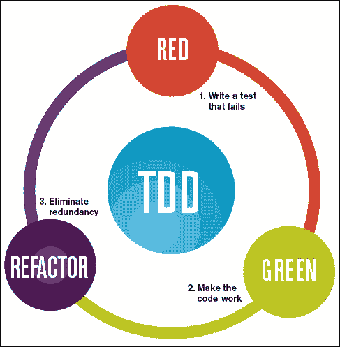
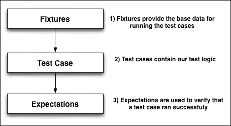

# 第六章. 测试与质量保证

到目前为止，我们已经涵盖了创建 Magento 扩展所需的全部步骤：

+   Magento 基础知识

+   前端开发

+   后端开发

+   扩展和使用 API

然而，我们在任何扩展或自定义代码的开发中遗漏了一个关键步骤：测试和质量保证。尽管 Magento 是一个复杂的平台，但它缺乏任何即插即用的测试。

因此，大多数的 Magento 开发者往往忽略了适当的测试和质量保证，要么是因为缺乏信息，要么是因为一些测试工具的高额开销，尽管可用于在 Magento 上运行适当测试的工具不多，但现有的工具质量非常高。

在本章中，我们将探讨可用于测试我们的 Magento 代码的不同选项，我们还将为我们的自定义扩展构建一些非常基本的测试。

因此，让我们回顾一下本章涵盖的主题：

+   可用于 Magento 的不同的测试框架和工具

+   测试我们 Magento 代码的重要性

+   如何设置、安装和使用 Ecomdev PHPUnit 扩展

+   如何设置、安装和使用 Magento Mink 来运行功能测试

# 测试 Magento

在我们开始编写任何测试之前，了解与测试相关的概念，尤其是每个可用的方法论，是非常重要的。

## 单元测试

单元测试背后的理念是为我们的代码的某些区域（单元）编写测试，以便我们可以验证代码按预期工作，并且函数返回预期的值。

|   | *"在计算机编程中，单元测试是一种方法，通过这种方法，可以测试单个源代码单元、一组一个或多个计算机程序模块及其相关的控制数据、使用程序和操作程序，以确定它们是否适合使用。"* |   |
| --- | --- | --- |
|   | --*维基百科* |

编写单元测试的另一个优点是，通过这样做，我们更有可能编写出易于测试的代码。

这意味着我们的代码倾向于被分解成更小但更专业的函数。随着我们继续编写更多的测试，我们开始构建一个测试套件，每次我们引入任何更改或功能时都可以运行我们的代码库；这被称为**回归测试**。

## 回归测试

回归测试主要是指在对现有测试套件进行代码更改后重新运行现有测试套件，以验证新功能没有引入新的错误。

|   | *"回归测试是一种软件测试类型，旨在在系统经过更改（如增强、补丁或配置更改）后，揭示现有功能和非功能区域中的新软件错误或回归。"* |   |
| --- | --- | --- |
|   | --*维基百科* |

在特定情况下，对于 Magento 商店或任何电子商务网站，我们希望对商店的关键功能进行回归测试，例如结账、客户注册、添加到购物车等。

## 功能测试

功能测试更关注于测试和验证应用程序根据特定输入返回适当的输出，而不是内部发生的事情。

|   | *"功能测试是一种黑盒测试，其测试用例基于正在测试的软件组件的规范。通过提供输入并检查输出来测试功能，很少考虑程序内部结构。"* |   |
| --- | --- | --- |
|   | --*维基百科* |

这对于我们这样的电子商务网站尤为重要，我们希望像顾客一样测试网站。

## 测试驱动开发

近年来获得流行并即将进入 Magento 的测试方法被称为**TDD**或**测试驱动开发**。

|   | *"测试驱动开发（TDD）是一种软件开发过程，它依赖于非常短的开发周期的重复：首先，开发者编写一个（最初失败的）自动化测试用例，该测试用例定义了期望的改进或新功能，然后生成最小的代码来通过该测试，最后将新代码重构到可接受的标准。"* |   |
| --- | --- | --- |
|   | --*维基百科* |

TDD 背后的基本概念是首先编写一个失败的测试，然后只编写足够的代码来通过测试；这产生了非常短的开发周期，有助于简化代码。

一种更完整的方法通常被称为**红-绿-重构循环**。其背后的理念如下：

+   **红色**：这会编写一小段测试代码——通常不超过几行

+   **绿色**：这会编写一小段生产代码——仅足够确保测试通过

+   **重构**：这清理了混乱并改进了代码。现在我们有了工作的测试，我们可以有信心地进行更改。

红绿重构循环的示意图如下：



理想情况下，您希望使用 TDD 在 Magento 中开发模块和扩展。我们之前省略了这一点，因为这将增加不必要的复杂性并使读者困惑。

对于一个从零开始的完整 TDD 与 Magento 教程，请参阅[`magedevguide.com/getting-started-with-tdd`](http://magedevguide.com/getting-started-with-tdd)。

# 工具和测试框架

如前所述，有几种框架和工具可用于测试 PHP 和 Magento 代码：

+   `Ecomdev_PHPUnit`：这个扩展非常出色。Ecomdev 的开发者创建了一个扩展，它将 PHPUnit 与 Magento 集成，并在不修改核心文件或影响数据库的情况下添加了针对 Magento 的特定断言。

+   `Magento_Mink`：Mink 是 Behat 框架的 PHP 库，允许你编写功能性和验收测试；Mink 还允许你编写模拟用户行为和浏览器交互的测试。

+   `Magento_TAF`：这代表**Magento 测试自动化框架**，是 Magento 提供的官方测试工具。它包括超过 1000 个功能测试，非常强大。不幸的是，它有一个主要的缺点；它有较大的开销和陡峭的学习曲线。

## 使用 PHPUnit 进行单元测试

在`Ecomdev_PHPUnit`之前，使用 PHPUnit 测试 Magento 存在问题，并且实际上并不实用。在可用的不同方法中，几乎都需要核心代码修改或让开发者跳过许多步骤来设置基本的 PHPUnits。

### 安装 Ecomdev_PHPUnit

安装`Ecomdev_PHPUnit`的最简单方法是直接从 GitHub 仓库获取副本。让我们在我们的控制台写下以下命令：

```php
git clone git://github.com/IvanChepurnyi/EcomDev_PHPUnit.git

```

现在，将文件复制到您的 Magento 根目录。

Composer 和 Modman 是可用的替代安装选项；有关每个选项的更多信息，请参阅[`magedevguide.com/module-managers`](http://magedevguide.com/module-managers)。

最后，我们需要设置配置以指示 PHPUnit 扩展使用哪个数据库；`local.xml.phpunit`是`Ecomdev_PHPUnit`添加的新文件，它包含所有扩展特定的配置并指定测试数据库的名称。

文件位置是`app/etc/local.xml.phpunit`：

```php
<?xml version="1.0"?>
<config>
    <global>
        <resources>
            <default_setup>
                <connection>
                   <dbname><![CDATA[magento_unit_tests]]></dbname>
                </connection>
            </default_setup>
        </resources>
    </global>
    <default>
        <web>
            <seo>
                <use_rewrites>1</use_rewrites>
            </seo>
            <secure>
                <base_url>[change me]</base_url>
            </secure>
            <unsecure>
                <base_url>[change me]</base_url>
            </unsecure>
            <url>
                <redirect_to_base>0</redirect_to_base>
            </url>
        </web>
    </default>
    <phpunit>
        <allow_same_db>0</allow_same_db>
    </phpunit>
</config>
```

你需要创建一个新的数据库来运行测试，并替换`local.xml.phpunit`文件中的示例配置值。

默认情况下，此扩展不允许你在同一数据库上运行测试。将测试数据库与开发和生产数据库分开，使我们能够有信心地运行测试。

### 设置我们扩展的配置

现在我们已经安装并设置了 PHPUnit 扩展，我们需要准备我们的礼品注册扩展以运行单元测试。这可以通过执行以下步骤来完成：

1.  打开`config.xml`文件中的`Giftregistry`扩展。

1.  将以下代码添加到位于`app/code/local/Mdg/Giftregistry/etc/config.xml`的此文件中：

    ```php
    …
    <phpunit>
            <suite>
                <modules>
                        <Mdg_Giftregistry/>
                </modules>
             </suite>
    </phpunit>
    …
    ```

这个新的配置节点允许 PHPUnit 扩展识别扩展并运行匹配的测试。

我们还需要在模块目录旁边创建一个名为`Test`的新目录，我们将使用它来放置所有测试文件。与之前的方法相比，使用`Ecomdev_PHPUnit`的一个优点是，此扩展遵循 Magento 标准。

这意味着我们必须在`Test`文件夹内保持相同的模块目录结构：

```php
Test/
Model/
Block/
Helper/
Controller/
Config/
```

根据每个测试用例的命名约定，类将被命名为以下形式：

```php
[Namespace]_[Module Name]_Test_[Group Directory]_[Entity Name]
```

每个测试类必须扩展以下三个基类之一：

+   `EcomDev_PHPUnit_Test_Case`：用于测试助手、模型和块

+   `EcomDev_PHPUnit_Test_Case_Config`：这是用来测试模块配置的

+   `EcomDev_PHPUnit_Test_Case_Controller`：这是用来测试布局渲染过程和控制器逻辑的

参考信息可在[`www.ecomdev.org/wp-content/uploads/2011/05/EcomDev_PHPUnit-0.2.0-Manual.pdf`](http://www.ecomdev.org/wp-content/uploads/2011/05/EcomDev_PHPUnit-0.2.0-Manual.pdf)找到。

### 测试用例的结构

在尝试创建我们的第一个测试之前，让我们先分解一下`Ecomdev_PHPUnit`提供的示例之一：

```php
<?php
class EcomDev_Example_Test_Model_Product extends EcomDev_PHPUnit_Test_Case
{
    /**
     * Product price calculation test
     *
     * @test
     * @loadFixture
     * @doNotIndexAll
     * @dataProvider dataProvider
     */
    public function priceCalculation($productId, $storeId)
    {
        $storeId = Mage::app()->getStore($storeId)->getId();
        $product = Mage::getModel('catalog/product')
            ->setStoreId($storeId)
            ->load($productId);
        $expected = $this->expected('%s-%s', $productId, $storeId);
        $this->assertEquals(
            $expected->getFinalPrice(),
            $product->getFinalPrice()
        );
        $this->assertEquals(
            $expected->getPrice(),
            $product->getPrice()
        );
    }
}
```

在示例测试类中，首先要注意的是注释：

```php
…
/**
     * Product price calculation test
     *
     * @test
     * @loadFixture
     * @doNotIndexAll
     * @dataProvider dataProvider
     */
…
```

这些注释由 PHPUnit 扩展用于识别哪个类函数是测试，并允许我们为每个测试设置特定的设置。让我们看看一些可用的注释：

+   `@test`：这标识了一个类函数作为 PHPUnit 测试

+   `@loadFixture`：这指定了固定数据的用法

+   `@loadExpectation`：这指定了期望的用法

+   `@doNotIndexAll`：通过添加这个注释，我们告诉 PHPUnit 测试在加载固定数据后不应运行任何索引

+   `@doNotIndex [index_code]`：通过添加这个注释，我们可以指示 PHPUnit 不要运行特定的索引

所以现在，你可能有点困惑。固定数据？期望？这些都是什么？

**固定数据**是代表数据库或配置实体的**另一种标记语言**（**YAML**）文件。

**期望**在不想在测试中硬编码值并且也在 YAML 值中指定时是有用的。

### 注意

更多关于 YAML 标记的信息，请参阅[`magedevguide.com/yaml`](http://magedevguide.com/yaml)。

因此，正如我们所看到的，固定数据为测试提供数据，而期望用于检查测试返回的结果是否是我们期望看到的。

固定数据和期望存储在每个`Test`类型目录中。按照前面的示例，我们会有一个名为`Product/`的新目录。在里面，我们需要为期望和我们的固定数据创建一个新的目录。

让我们看看修改后的文件夹结构：

```php
Test/
Model/    
    Product.php
    Product/
        expectations/
        fixtures/
Block/
Helper/
Controller/
Config/
```

下面的插图展示了固定数据、期望和测试用例的使用：



### 创建单元测试

对于我们的第一个单元测试，让我们创建一个非常基础的测试，以便我们可以测试我们之前创建的礼品登记模型。

如我们之前提到的，`Ecomdev_PHPUnit`使用一个单独的数据库来运行所有测试。为此，我们需要创建一个新的固定数据，它将为我们的测试用例提供所有数据：

1.  打开`Test/Model`文件夹。

1.  创建一个名为`Registry`的新文件夹。

1.  在`Registry`文件夹内，创建一个名为`fixtures`的新文件夹。

1.  在`app/code/local/Mdg/Giftregistry/Test/Model/fixtures/registryList.yaml`创建一个名为`registryList.yaml`的新文件，并将以下代码粘贴进去：

    ```php
    scope:
      website: # Initialize websites
        - website_id: 2
          code: default
          name: Test Website
          default_group_id: 2
      group: # Initializes store groups
        - group_id: 2
          website_id: 2
          name: Test Store Group
          default_store_id: 2
          root_category_id: 2 # Default Category
      store: # Initializes store views
        - store_id: 2
          website_id: 2
          group_id: 2
          code: default
          name: Default Test Store
          is_active: 1
    eav:
       customer_customer:
         - entity_id: 1
           entity_type_id: 3
           website_id: 2
           email: test@magentotest.com
           group_id: 2
           store_id: 2
           is_active: 1
       mdg_giftregistry_entity:
         - entity_id: 1
           customer_id: 1
           type_id: 2
           website_id: 2
           event_date: 12/12/2012
           event_country: Canada
           event_location: Dundas Square
           created_at: 21/12/2012
         - entity_id: 2
           customer_id: 1
           type_id: 3
           website_id: 2
           event_date: 01/01/2013
           event_country: Canada
           event_location: Eaton Center
           created_at: 21/12/2012
    ```

这可能看起来不像，但我们通过这个固定数据添加了很多信息，并创建了以下固定数据：

+   一个网站范围

+   一个商店组

+   一个商店视图

+   一个客户记录

+   两个礼品登记

使用固定数据，我们正在动态创建数据，这些数据将可用于我们的测试用例。这使我们能够在相同的数据上多次运行测试，并具有轻松更改它的灵活性。

现在，你可能想知道 PHPUnit 扩展是如何知道如何将测试用例与特定的固定数据配对的。

扩展加载固定数据有两种方式：一种是在注释中指定固定数据，如果没有指定固定数据名称，扩展会搜索与正在执行的测试用例函数同名的一个固定数据。

带着这些知识，让我们创建我们的第一个测试用例：

1.  导航到`Test/Model`文件夹。

1.  创建一个名为`Registry.php`的新测试类。

1.  将以下基础代码添加到位于`app/code/local/Mdg/Giftregistry/Test/Model/Registry.php`的此文件中：

    ```php
    <?php
    class Mdg_Giftregistry_Test_Model_Registry extends EcomDev_PHPUnit_Test_Case
    {
        /**
         * Listing available registries
         *
         * @test
         * @loadFixture
         * @doNotIndexAll
         * @dataProvider dataProvider
         */
        public function registryList()
        {

        }
    }
    ```

我们刚刚创建了基础函数，但还没有添加任何逻辑。在我们这样做之前，让我们看看实际上构成测试用例的是什么。

测试用例通过断言来评估和测试我们的代码。断言是测试用例从父`TestCase`类继承的特殊函数。在可用的默认断言中，我们有：

+   `assertEquals()`

+   `assertGreaterThan()`

+   `assertGreaterThanOrEqual()`

+   `assertLessThan()`

+   `assertLessThanOrEqual()`

+   `assertTrue()`

现在，如果我们想检查变量的值、搜索数组键、检查属性等，这些默认断言是非常好的。然而，仅使用这种类型的断言来测试 Magento 代码可能会很困难，甚至不可能。这就是`Ecomdev_PHPUnit`发挥作用的地方。

不仅这个扩展干净地集成了 PHPUnit 与 Magento，并遵循他们的标准，而且还向 PHPUnit 测试中添加了 Magento 特定的断言。让我们看看扩展添加的一些断言：

+   `assertEventDispatched()`

+   `assertBlockAlias()`

+   `assertModelAlias()`

+   `assertHelperAlias()`

+   `assertModuleCodePool()`

+   `assertModuleDepends()`

+   `assertConfigNodeValue()`

+   `assertLayoutFileExists()`

这些只是可用的断言中的一部分，正如你所见，它们为我们构建全面的测试提供了很多功能。

现在我们对 PHPUnit 测试用例的工作方式有了更多的了解，让我们继续创建我们的第一个 Magento `TestCase`类：

1.  导航到我们之前创建的`Registry.php`测试用例类。

1.  将以下代码添加到`registryList()`函数中。

    文件位置是`app/code/local/Mdg/Giftregistry/Test/Model/Registry.php`：

    ```php
        /**
         * Listing available registries
         *
         * @test
         * @loadFixture
         * @doNotIndexAll
         * @dataProvider dataProvider
         */
        public function registryList()
        {
            $registryList = Mage::getModel('mdg_giftregistry/entity')->getCollection();
            $this->assertEquals(
                2,
                $registryList->count()
            );
        }
    ```

这是一个非常基础的测试；我们唯一做的事情是加载一个登记集合——在这种情况下，所有可用的登记——然后运行一个断言来检查集合计数是否匹配。

然而，这并不很有用。如果我们能够只加载属于特定用户（我们的测试用户）的注册表，并检查集合大小，那就更好了。因此，让我们在位于`app/code/local/Mdg/Giftregistry/Test/Model/Registry.php`的文件中稍微更改一下代码：

```php
    /**
     * Listing available registries
     *
     * @test
     * @loadFixture
     * @doNotIndexAll
     * @dataProvider dataProvider
     */
    public function registryList()
    {
        $customerId = 1;
        $registryList = Mage::getModel('mdg_giftregistry/entity')
->getCollection()
->addFieldToFilter('customer_id', $customerId);
        $this->assertEquals(
            2,
            $registryList->count()
        );
    }
```

只需更改几行代码，我们就创建了一个测试，可以验证我们的注册集合是否正常工作，并且正确地链接到客户记录。

在您的 shell 中运行以下命令：

```php
$ phpunit

```

如果一切如预期进行，我们应该看到以下输出：

```php
PHPUnit 3.4 by Sebastian Bergmann
.
Time: 1 second
Tests: 1, Assertions: 1, Failures 0

```

您也可以运行`$ phpunit –colors`以获得更美观的输出。

现在，我们只需要一个测试来验证注册项是否正常工作：

1.  导航到我们之前创建的`Registry.php`测试用例类。

1.  将以下代码添加到位于`app/code/local/Mdg/Giftregistry/Test/Model/Registry.php`的`registryItemsList()`函数中：

    ```php
        /**
         * Listing available items for a specific registry
         *
         * @test
         * @loadFixture
         * @doNotIndexAll
         * @dataProvider dataProvider
         */
        public function registryItemsList()
        {
            $customerId = 1;
            $registry   = Mage::getModel('mdg_giftregistry/entity')
    ->loadByCustomerId($customerId);

            $registryItems = $registry->getItems();
            $this->assertEquals(
                3,
                $registryItems->count()
            );
        }
    ```

我们还需要为我们的新测试用例创建一个新的固定值：

1.  导航到`Test/Model`文件夹。

1.  打开`注册表`文件夹。

1.  在`app/code/local/Mdg/Giftregistry/Test/Model/fixtures`下创建一个名为`registryItemsList.yaml`的新文件：

    ```php
    scope:
      website: # Initialize websites
        - website_id: 2
          code: default
          name: Test Website
          default_group_id: 2
      group: # Initializes store groups
        - group_id: 2
          website_id: 2
          name: Test Store Group
          default_store_id: 2
          root_category_id: 2 # Default Category
      store: # Initializes store views
        - store_id: 2
          website_id: 2
          group_id: 2
          code: default
          name: Default Test Store
          is_active: 1
    eav:
       customer_customer:
         - entity_id: 1
           entity_type_id: 3
           website_id: 2
           email: test@magentotest.com
           group_id: 2
           store_id: 2
           is_active: 1
       mdg_giftregistry_entity:
         - entity_id: 1
           customer_id: 1
           type_id: 2
           website_id: 2
           event_date: 12/12/2012
           event_country: Canada
           event_location: Dundas Square
           created_at: 21/12/2012
       mdg_giftregistry_item:
         - item_id: 1
           registry_id: 1
           product_id: 1
         - item_id: 2
           registry_id: 1
           product_id: 2
         - item_id: 3
           registry_id: 1
           product_id: 3 
    ```

让我们运行我们的测试套件：

```php
$phpunit --colors

```

我们应该看到两个测试都通过：

```php
PHPUnit 3.4 by Sebastian Bergmann
.
Time: 4 second
Tests: 2, Assertions: 2, Failures 0

```

最后，让我们用适当的期望值替换我们的硬编码变量。

1.  导航到`Test/Model`模块文件夹。

1.  打开`注册表`文件夹。

1.  在`Registry`文件夹内，创建一个名为`expectations`的新文件夹。

1.  在`app/code/local/Mdg/Giftregistry/Test/Model/expectations/registryList.yaml`下创建一个名为`registryList.yaml`的新文件：

    ```php
    count: 2
    ```

难道不是很容易吗？嗯，它太容易了，我们将再次为`registryItemsList`测试用例做同样的事情：

1.  导航到`Test/Model`模块文件夹。

1.  打开`注册表`文件夹。

1.  在`expectations`文件夹内创建一个名为`registryItemsList.yaml`的新文件。

    文件位置是`app/code/local/Mdg/Giftregistry/Test/Model/expectations/registryItemsList.yaml`：

    ```php
    count: 3
    ```

最后，我们需要做的最后一件事是更新我们的测试用例类以使用期望。确保位于`app/code/local/Mdg/Giftregistry/Test/Model/Registry.php`的更新文件包含以下代码：

```php
<?php
class Mdg_Giftregistry_Test_Model_Registry extends EcomDev_PHPUnit_Test_Case
{
    /**
     * Product price calculation test
     *
     * @test
     * @loadFixture
     * @doNotIndexAll
     * @dataProvider dataProvider
     */
    public function registryList()
    {
        $customerId = 1;
        $registryList = Mage::getModel('mdg_giftregistry/entity')
                ->getCollection()
                ->addFieldToFilter('customer_id', $customerId);
        $this->assertEquals(
            $this->_getExpectations()->getCount(),$this->_getExpectations()->getCount(),
            $registryList->count()
        );
    }
    /**
     * Listing available items for a specific registry
     *
     * @test
     * @loadFixture
     * @doNotIndexAll
     * @dataProvider dataProvider
     */
    public function registryItemsList()
    {
        $customerId = 1;
        $registry   = Mage::getModel('mdg_giftregistry/entity')- >loadByCustomerId($customerId);

        $registryItems = $registry->getItems();
        $this->assertEquals(
            $this->_getExpectations()->getCount(),
            $registryItems->count()
        );
    }
}
```

唯一的改变是我们正在用期望值替换断言中的硬编码值。如果我们需要做出任何更改，我们不需要更改我们的代码；我们只需更新期望和固定值。

## 功能测试使用 Mink

到目前为止，我们已经学会了如何运行针对我们代码的单元测试。虽然单元测试对于测试我们代码的各个部分和逻辑非常棒，但当涉及到像 Magento 这样的大型应用程序时，从用户的角度进行测试非常重要。

### 注意

功能测试主要涉及黑盒测试，并不关心应用程序的源代码。

为了执行功能测试，我们可以使用 **Mink**。Mink 是一个简单的 PHP 库，可以虚拟化一个网络浏览器。Mink 使用不同的驱动程序工作；它支持以下驱动程序：

+   `GoutteDriver`：Goutte 是一个纯 PHP 无头浏览器，由 Symfony 框架的创建者编写

+   `SahiDriver`：Sahi 是一个新的 JS 浏览器控制器，它正在迅速取代 Selenium

+   `ZombieDriver`：这是一个用 Node.js 编写的浏览器模拟器，目前仅限于一个浏览器（Chromium）

+   `SeleniumDriver`：这是目前最受欢迎的浏览器驱动程序；原始版本依赖于第三方服务器来运行测试

+   `Selenium2Driver`：当前版本的 Selenium 在 Python、Ruby、Java 和 C# 中完全受支持

### Magento Mink 安装和设置

使用 Mink 与 Magento 结合非常简单，这要归功于 Johann Reinke，他创建了一个 Magento 扩展，该扩展简化了 Mink 与 Magento 的集成。

我们将使用 `modgit`，一个受 Modman 启发的模块管理器来安装此扩展。Modgit 允许我们直接从 GitHub 仓库部署 Magento 扩展，而无需创建符号链接。

使用三条命令即可安装 modgit：

```php
wget -O modgit https://raw.github.com/jreinke/modgit/master/modgit
chmod +x modgit
sudo mv modgit /usr/local/bin

```

难道不是很容易吗？现在，我们可以继续安装 Magento Mink，这要归功于 modgit，甚至更容易：

1.  导航到 Magento 根目录。

1.  运行以下命令：

    ```php
    modgit init
    modgit -e README.md clone mink https://github.com/jreinke/magento-mink.git

    ```

就这样；modgit 将直接从 GitHub 仓库为我们安装文件。

# 创建我们的第一个测试

Mink 测试也存储在 `Test` 文件夹中；让我们创建我们的 Mink 测试类的基骨架：

1.  导航到我们的模块根目录中的 `Test` 文件夹。

1.  创建一个名为 `Mink` 的新目录。

1.  在 `Mink` 目录中，创建一个新的 PHP 类，名为 `Registry.php`。

1.  在 `app/code/local/Mdg/Giftregistry/Test/Mink/Registry.php` 文件中复制以下代码，位于 `Registry.php` 文件：

    ```php
    <?php
    class Mdg_Giftregistry_Test_Mink_Registry extends JR_Mink_Test_Mink 
    {   
        public function testAddProductToRegistry()
        {
            $this->section('TEST ADD PRODUCT TO REGISTRY');
            $this->setCurrentStore('default');
            $this->setDriver('goutte');
            $this->context();

            // Go to homepage
            $this->output($this->bold('Go To the Homepage'));
            $url = Mage::getStoreConfig('web/unsecure/base_url');
            $this->visit($url);
            $category = $this->find('css', '#nav .nav-1-1 a');
            if (!$category) {
                return false;
            }

            // Go to the Login page
            $loginUrl = $this->find('css', 'ul.links li.last a');
            if ($loginUrl) {
                $this->visit($loginUrl->getAttribute('href'));
            }

            $login = $this->find('css', '#email');
            $pwd = $this->find('css', '#pass');
            $submit = $this->find('css', '#send2');

            if ($login && $pwd && $submit) {
                $email = 'user@example.com';
                $password = 'password';
                $this->output(sprintf("Try to authenticate '%s' with password '%s'", $email, $password));
                $login->setValue($email);
                $pwd->setValue($password);
                $submit->click();
                $this->attempt(
                    $this->find('css', 'div.welcome-msg'),
                    'Customer successfully logged in',
                    'Error authenticating customer'
                );
            }

            // Go to the category page
            $this->output($this->bold('Go to the category list'));
            $this->visit($category->getAttribute('href'));
            $product = $this->find('css', '.category-products li.first a');
            if (!$product) {
                return false;
            }

            // Go to product view
            $this->output($this->bold('Go to product view'));
            $this->visit($product->getAttribute('href'));
            $form = $this->find('css', '#product_registry_form');
            if ($form) {
                $addToCartUrl = $form->getAttribute('action');
                $this->visit($addToCartUrl);
                $this->attempt(
                    $this->find('css', '#btn-add-giftregistry'),
                    'Product added to gift registry successfully',
                    'Error adding product to gift registry'
                );
            }
        }
    }
    ```

只需第一眼就能看出，这个功能测试与我们之前构建的单元测试相当不同。尽管代码看起来很多，但实际上非常简单，之前的测试甚至被分解成代码块。让我们分析一下之前的测试做了什么：

1.  设置浏览器驱动程序和当前商店。

1.  前往主页并检查有效的分类链接。

1.  尝试以测试用户身份登录。

1.  前往一个 `分类` 页面。

1.  打开该分类中的第一个产品。

1.  尝试将产品添加到客户礼品登记中。

此测试做出了一些假设，并期望有一个有效的客户和现有的礼品登记。

在创建 Mink 测试时，我们必须注意以下几点：

+   每个测试类都必须扩展 `JR_Mink_Test_Mink`

+   每个测试函数都必须以 `test` 关键字开头

最后，我们唯一要做的就是运行我们的测试。我们可以通过进入命令行并运行以下命令来完成此操作：

```php
$ php shell/mink.php

```

如果一切顺利，我们应该看到以下类似输出：

```php
---------------------- SCRIPT START ---------------------------------
Found 1 file
-------------- TEST ADD PRODUCT TO REGISTRY -------------------------
Switching to store 'default'
Now using Goutte driver
----------------------------------- CONTEXT ------------------------------------
website: base, store: default
Cache info:
config            Disabled  N/A       Configuration
layout            Disabled  N/A       Layouts
block_html        Disabled  N/A       Blocks HTML output
translate         Disabled  N/A       Translations
collections       Disabled  N/A       Collections Data
eav               Disabled  N/A       EAV types and attributes
config_api        Disabled  N/A       Web Services Configuration
config_api2       Disabled  N/A       Web Services Configuration
ecomdev_phpunit   Disabled  N/A       Unit Test Cases

Go To the Homepage [OK]
Try to authenticate user@example.com with password password [OK]
Go to the category list [OK]
Go to product view [OK]
Product added to gift registry successfully

```

# 摘要

在本章中，我们学习了 Magento 测试的基础知识。本章的目的不是构建复杂的测试或深入研究，而是让我们有所尝试，并对我们可以如何测试我们的扩展有一个清晰的认识。

本章涵盖了几个重要主题，并了解到拥有适当的测试套件和工具可以让我们避免未来的麻烦，并提高代码质量。
