# 附录 B. 理解和设置我们的开发环境

在本附录中，我们将介绍运行 Magento 所涉及的技术堆栈，并学习如何为开发设置适当的环境。本附录将涵盖以下主题：

+   LAMP 虚拟机

+   设置和使用 VirtualBox

+   设置和使用 Vagrant

+   集成开发环境（IDEs）和版本控制系统

我们还将学习如何从头开始设置 LAMP 虚拟机，以及如何使用 Vagrant 和 Chef 完全自动化此过程。

# 从零开始搭建 LAMP

**LAMP** （**Linux, Apache, MySQL, and PHP**）是一套开源技术解决方案，用于构建 Web 服务器，并且是运行 Magento 的当前标准。

对于更详细的要求列表，请参阅 [www.magentocommerce.com/system-requirements](http://www.magentocommerce.com/system-requirements)。

### 注意

尽管 nginx 在 Magento 开发者中得到了更广泛的采用，但在撰写本书时，Apache2 仍然是社区接受的标准。我们将专注于与之合作。

作为开发者，设置和维护我们的开发环境存在多个挑战和细微差别，例如以下内容：

+   使开发环境和生产环境相匹配

+   在不同平台和团队成员之间保持一致的环境

+   设置新环境可能需要几个小时

+   并非所有开发者都具备独立设置 LAMP 服务器所需的知识或经验

我们可以通过 Oracle 的 VirtualBox ([www.virtualbox.org](http://www.virtualbox.org)) 来解决前两个问题。VirtualBox 是一个强大且广受欢迎的虚拟化引擎，它将允许我们创建虚拟机。虚拟机也可以在开发者和所有主要操作系统之间共享。

## 获取 VirtualBox

VirtualBox 是开源软件，并且支持所有平台。您可以直接从 [www.virtualbox.org/wiki/Downloads](http://www.virtualbox.org/wiki/Downloads) 下载。

现在，我们将继续设置一个 Linux 虚拟机。我们选择了 Ubuntu server 12.04.2 LTS，因为它易于使用并且支持广泛。首先，从 [www.ubuntu.com/download/server](http://www.ubuntu.com/download/server) 下载 ISO 文件；64 位或 32 位版本均可使用。

要创建一个新的 Linux 虚拟机，请执行以下步骤：

1.  启动 VirtualBox 管理器，然后在左上角点击 **新建** 按钮：

1.  将会弹出一个向导对话框，引导我们完成创建裸虚拟机的步骤。向导将要求我们提供设置虚拟机所需的基本信息：

    +   **VM 名称**：这定义了我们如何命名虚拟机；让我们命名为 `Magento_dev 01`

    +   **内存**：这是当我们的虚拟机启动时分配给客户操作系统的系统内存值，以便运行完整的 LAMP 服务器；建议至少 1 GB。

    +   **操作系统类型**：这是我们稍后要安装的操作系统类型；在我们的情况下，我们想选择**Linux/Ubuntu**，根据我们的选择，VirtualBox 将启用或禁用某些虚拟机选项

1.  接下来，我们需要指定一个虚拟硬盘。选择**现在创建虚拟硬盘**。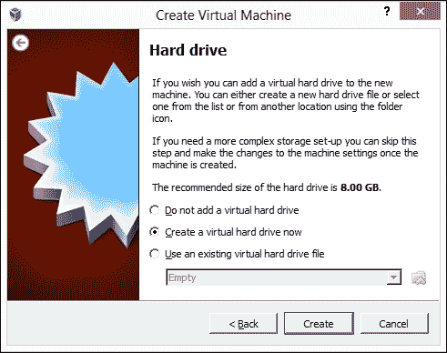

1.  可用的硬盘选项很多，但对于大多数用途，选择**VDI**（即**VirtualBox 磁盘镜像**）就足够了。这将在我们的主机操作系统上创建一个单独的文件。

1.  我们现在需要选择物理驱动器上的存储类型。我们有两个选项：

    +   **动态分配**：磁盘镜像将随着我们的客户操作系统上的文件和使用的增长而自动增长

    +   **固定大小**：此选项将从一开始就限制虚拟磁盘的大小

1.  接下来，我们需要指定虚拟硬盘的大小。我们希望根据我们计划使用的 Magento 安装数量来调整大小。

    ### 注意

    通常，我们希望为每个 Magento 安装保留至少 2 GB，如果我们在这个安装上运行数据库服务器，还需要额外的 3 GB。这并不是说所有这些空间都会立即使用，或者是否真的会使用，但一旦考虑了产品图像和缓存文件，Magento 安装可能会使用大量的磁盘空间。

1.  最后，我们只需点击**创建**按钮。

    ### 注意

    固定大小硬盘和动态分配硬盘之间的主要区别在于，固定大小硬盘将从一开始就在物理硬盘上预留空间，而动态分配硬盘将根据我们的客户操作系统上的文件和使用的增长而逐步增长，直到达到指定的限制。

新创建的虚拟机将出现在左侧导航菜单中，但在我们启动最近创建的虚拟机之前，我们需要做一些更改：

1.  选择我们新创建的虚拟机，然后点击顶部的**设置**按钮。

1.  打开**网络**菜单并选择**适配器 2**。我们希望将其设置为与主网络接口桥接的适配器。这将允许我们使用**SSH**远程连接。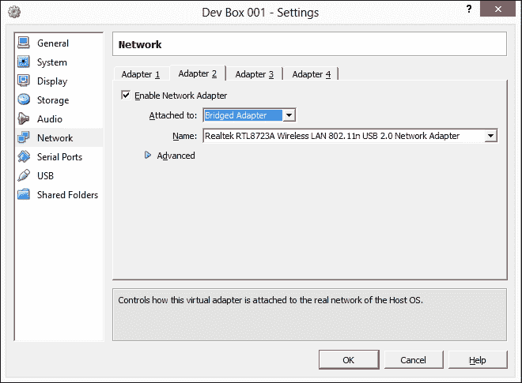

1.  前往**系统**菜单并更改**启动顺序**值，以便 CD/DVD-ROM 首先启动。

1.  在**存储**菜单中，选择一个空的 IDE 控制器，并挂载我们之前下载的 Ubuntu ISO 镜像。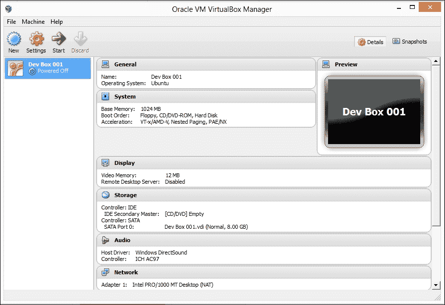

## 启动虚拟机

到目前为止，我们已经成功安装并配置了 VirtualBox 实例，现在我们准备首次启动新的虚拟机。为此，只需在左侧侧边栏中选择虚拟机，然后点击顶部的**启动**按钮。

将弹出一个新窗口，显示虚拟机的界面。Ubuntu 启动需要几分钟。

一旦 Ubuntu 启动完成，我们将看到两个菜单。第一个菜单允许我们选择语言，第二个是主菜单，提供几个选项。在我们的情况下，我们只想继续安装 **Ubuntu 服务器**：

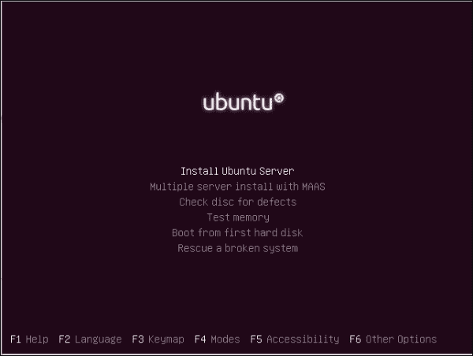

我们现在应该看到 Ubuntu 安装向导，它将要求我们输入语言和键盘设置。在为我们的国家和语言选择适当的设置后，安装程序将开始将所有必要的软件包加载到内存中。这可能需要几分钟。

Ubuntu 将继续配置我们的主要网络适配器，一旦自动配置完成，我们将被要求为虚拟机设置主机名。我们可以保留主机名为默认设置。

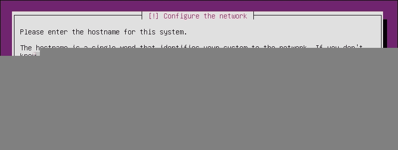

下一个屏幕将要求我们输入用户的完整姓名；在这个例子中，让我们使用 `Magento Developer`。

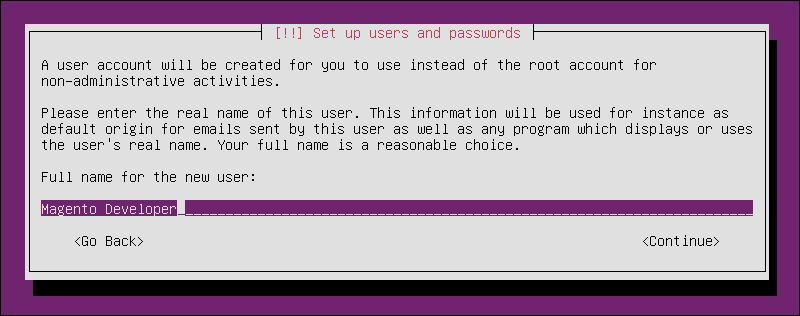

接下来，我们将被要求创建用户名和密码。让我们使用 `magedev` 作为我们的用户名。

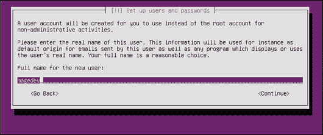

让我们将 `magento2013` 设置为我们的密码。

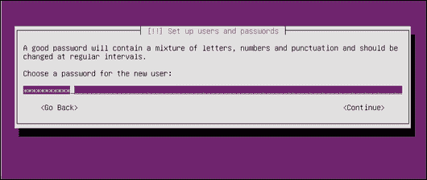

在接下来的屏幕上，我们将被要求确认密码并设置正确的时间区域。在输入正确的值后，安装向导将显示以下屏幕，询问我们的分区设置：

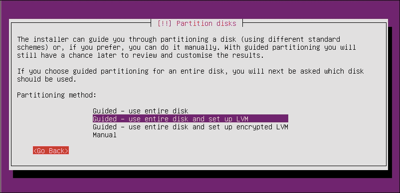

在我们的情况下，我们想选择 **引导 – 使用整个磁盘并设置 LVM**；让我们确认我们正在分区虚拟磁盘。

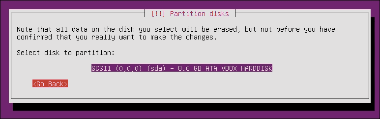

我们将再次被要求确认我们的更改；选择 **完成分区并将更改写入磁盘**。

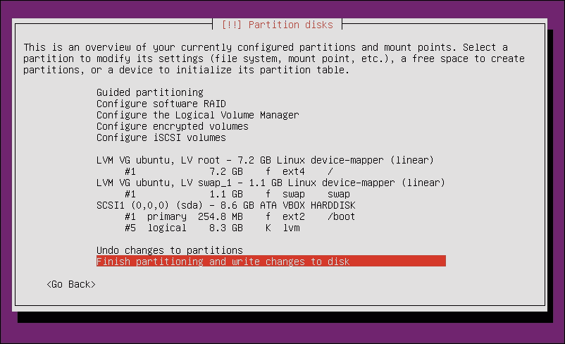

安装向导将要求我们选择要安装的预定义软件包；一个可用的选项是 **LAMP 服务器**。

虽然这非常方便，但我们不想安装 Ubuntu CD 预包装的 LAMP 服务器；我们将手动安装所有 LAMP 组件，以确保它们根据特定需求设置，并且与最新的补丁保持更新。

然而，为此，我们需要一个 SSH 服务器；从列表中选择 **OpenSSH 服务器** 并点击 **继续**。

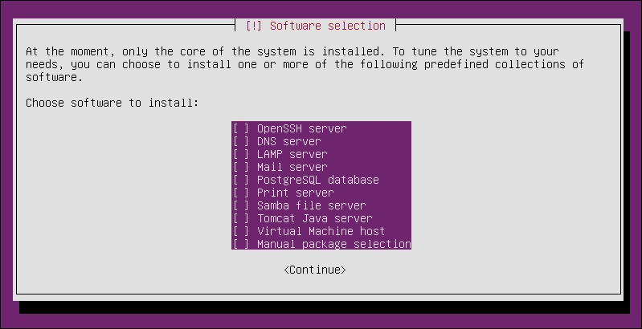

Ubuntu 的安装已完成，它将重新启动到我们新安装的虚拟机中。

我们几乎准备好继续安装剩余的环境，但首先，我们需要更新我们的包管理器仓库定义，登录到控制台，并运行以下命令：

```php
$ sudo apt-get update

```

**APT** 代表 **Advance Packaging Tool**，是大多数 Debian GNU/Linux 发行版中包含的核心库之一；`apt` 大大简化了在我们系统上安装和维护软件的过程。

一旦`apt-get`更新完所有仓库源，我们就可以继续安装 LAMP 服务器的其他组件。

## 安装 Apache2

Apache 是一个 HTTP 服务器。目前，它被用于托管 Web 上超过 60%的网站，并且是运行 Magento 商店的接受标准。网上有许多指南和教程，可以用来微调 Apache2 以提高 Magento 的性能。

安装 Apache 就像运行以下命令一样简单：

```php
$ sudo apt-get install apache2 -y

```

这将为我们安装 Apache2 及其所有必需的依赖项。如果一切安装正确，我们现在可以通过在浏览器中输入`http://192.168.36.1/`来测试它。

默认情况下，Apache 作为服务运行，可以使用以下命令进行控制：

```php
$ sudo apache2ctl stop 
$ sudo apache2ctl start 
$ sudo apache2ctl restart 

```

你现在应该看到带有**It Works!**信息的 Apache 默认网页。

## 安装 PHP

**PHP**是一种服务器端脚本语言，代表**PHP Hypertext Processor**。Magento 基于 PHP5 和 Zend 框架实现，我们需要安装 PHP 和一些额外的库来运行它。

让我们再次使用`apt-get`并运行以下命令以安装 PHP5 和所有必要的库：

```php
$ sudo apt-get install php5 php5-curl php5-gd php5-imagick php5-imap php5-mcrypt php5-mysql -y
$ sudo apt-get install php-pear php5-memcache -y
$ sudo apt-get install libapache2-mod-php5 -y

```

第一个命令不仅安装了 PHP5，还安装了 Magento 连接数据库和操作图像所需的额外包。

第二个命令将安装 PEAR，一个 PHP 包管理器，以及一个 PHP memcached 适配器。

### 注意

Memcached 是一个高性能、分布式内存缓存系统；这是 Magento 的一个可选缓存系统。

第三个命令安装并设置了 Apache 的 PHP5 模块。

我们可以通过运行以下命令来测试我们的 PHP 安装是否正常工作：

```php
$ php -v

```

## 安装 MySQL

MySQL 是许多 Web 应用程序中流行的数据库选择，Magento 也不例外。我们需要安装并设置 MySQL 作为开发栈的一部分：

```php
$ sudo apt-get install mysql-server mysql-client -y

```

在安装过程中，我们将被要求输入根密码；使用`magento2015`。一旦安装完成，我们应该有一个在后台运行的 MySQL 服务实例。我们可以通过尝试连接到 MySQL 服务器来测试它：

```php
$ sudo mysql -uroot -pmagento2015

```

如果一切安装正确，我们应该看到以下`mysql`服务器提示：

```php
mysql>

```

到目前为止，我们有一个完全功能的 LAMP 环境，不仅可以用于开发和工作在 Magento 网站上，还可以用于任何其他类型的 PHP 开发。

## 整合一切

到目前为止，我们已经有一个基本的 LAMP 环境正在运行。然而，为了与 Magento 一起工作，我们需要进行一些配置更改和额外的设置。

我们首先需要做的是创建一个存储我们的开发站点的文件的位置，因此我们将运行以下命令：

```php
$ sudo mkdir -p /srv/www/magento_dev/public_html/
$ sudo mkdir /srv/www/magento_dev/logs/
$ sudo mkdir /srv/www/magento_dev/ssl/

```

这将为我们的第一个 Magento 站点创建必要的文件夹结构。现在，我们需要检出最新的 Magento 版本。我们可以使用**SVN**快速获取文件。

我们需要在服务器上首先使用以下命令安装 SVN：

```php
$ sudo apt-get install subversion -y

```

安装程序完成后，打开 `magento_dev` 目录并运行 `svn` 命令以获取最新版本文件：

```php
$ cd /srv/www/magento_dev 
$ sudo svn export --force http://svn.magentocommerce.com/source/branches/1.9 public_html/

```

我们还需要修复我们新 Magento 复制的一些权限：

```php
$ sudo chown -R www-data:www-data public_html/
$ sudo chmod -R 755 public_html/var/ 
$ sudo chmod -R 755 public_html/media/ 
$ sudo chmod -R 755 public_html/app/etc/

```

接下来，我们需要为我们的 Magento 安装创建一个新的数据库。让我们打开我们的 `mysql` 命令行界面：

```php
$ sudo mysql -uroot -pmagento2015

```

一旦进入 mysql 命令行界面，我们可以使用 create 命令，该命令应跟在我们想要创建的实体类型（数据库或表）以及数据库名称之后，以创建一个新的数据库：

```php
mysql> create database magento_dev;

```

虽然我们可以使用 root 凭证访问我们的开发数据库，但这不是推荐的做法，因为它可能会危及单个站点，甚至整个数据库服务器。MySQL 账户根据我们想要的权限进行限制，以便创建一组具有仅限于我们工作数据库的权限的新凭据：

```php
mysql> GRANT ALL PRIVILEGES ON magento_dev.* TO 'mage'@'localhost' IDENTIFIED BY 'dev2015$#';

```

现在，我们需要正确设置 Apache2 并启用一些额外的模块；幸运的是，这个版本的 Apache 带有一组有用的命令：

+   `a2ensite`：此命令在 `site-available` 文件夹中的 `vhosts` 文件和 `sites-enabled` 文件夹之间创建符号链接，以便 Apache 服务器能够读取这些文件。

+   `a2dissite`：此命令将删除由 `a2ensite` 命令创建的符号链接。它实际上禁用了该站点。

+   `a2enmod`：此命令用于在 `mods-enabled` 目录和模块配置文件之间创建符号链接。

+   `a2dismod`：这将删除 `mods-enabled` 中的符号链接。此命令将防止模块被 Apache 加载。

Magento 使用 `mod_rewrite` 模块来生成 URL。`mod_rewrite` 模块使用基于规则的重写引擎在运行时重写请求 URL。

我们可以使用 `a2enmod` 命令启用 `mod_rewrite`：

```php
$ sudo a2enmod rewrite

```

下一步需要我们在 `site-available` 目录下创建一个新的虚拟主机文件：

```php
$ sudo nano /etc/apache2/sites-available/magento.localhost.com

```

`nano` 命令将打开一个 shell 文本编辑器，在那里我们可以设置虚拟域的配置：

```php
<VirtualHost *:80>
   ServerAdmin magento@locahost.com
   ServerName magento.localhost.com
   DocumentRoot /srv/www/magento_dev/public_html

   <Directory /srv/www/magento_dev/public_html/>
      Options Indexes FollowSymlinks MultiViews
      AllowOverride All
      Order allow,deny
      allow from all
   </Directory>
   ErrorLog /srv/www/magento_dev/logs/error.log
   LogLevel warn
</VirtualHost>
```

要保存新的虚拟主机文件，请按 *Ctrl* + *O*，然后按 *Ctrl* + *X*。虚拟主机文件将告诉 Apache 服务器在哪里可以找到站点文件以及应赋予它的权限。为了使新的配置更改生效，我们需要启用新站点并重新启动 Apache。我们可以使用以下命令来完成此操作：

```php
$ sudo a2ensite magento.localhost.com
$ sudo apache2ctl restart

```

我们几乎准备好安装 Magento 了。我们只需要在我们的主机系统主机文件中设置一个本地映射，以下是 Windows 和 Unix 的相应命令：

使用 Windows，我们可以执行以下操作：

1.  使用记事本打开 `C:\system32\drivers\etc\hosts` 文件。

1.  在此文件的末尾添加以下行：`192.168.36.1 magento.localhost.com`。

使用 Unix/Linux/OS X，我们可以执行以下操作：

1.  使用 nano 打开 `/etc/hosts`：

    ```php
    $ sudo nano /etc/hosts

    ```

1.  在此文件的末尾添加以下行：`192.168.36.1 magento.localhost.com`。

### 注意

如果你遇到在 `hosts` 文件上做出必要更改的问题，请参阅 [`www.magedevguide.com/hostfile-help`](http://www.magedevguide.com/hostfile-help)。

现在，我们可以在浏览器中打开 `http://magento.localhost.com` 来安装 Magento。在最后，我们应该能看到安装向导。按照向导的指示进行操作，你就可以开始使用了！

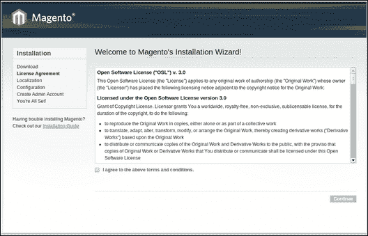

# 使用 Vagrant 运行

之前，我们使用虚拟机创建了一个 Magento 安装向导。虽然使用虚拟机可以给我们一个可靠的环境，但为每个 Magento 预发布安装设置 LAMP 仍然可能非常复杂。这对于没有在 Unix/Linux 环境中工作过经验的开发者来说尤其如此。

如果我们能够获得运行虚拟机的好处，同时拥有完全自动化的设置过程呢？如果我们能够即时创建和配置每个预发布网站的新虚拟机实例呢？

这可以通过结合使用 Vagrant 和 Chef 实现。我们可以创建一个自动化的虚拟机，而无需深入了解 Linux 或不同的 LAMP 组件。

### 注意

目前，Vagrant 支持 VirtualBox 4.0.x、4.1.x 和 4.2.x。

## 安装 Vagrant

你可以直接从 [downloads.vagrantup.com](http://downloads.vagrantup.com) 下载 Vagrant。此外，它的包和安装程序适用于多个平台。下载 Vagrant 后，运行安装文件。

一旦我们安装了 Vagrant 和 VirtualBox，启动基本虚拟机就像在终端或命令提示符中输入以下行一样简单，具体取决于你使用的操作系统：

```php
$ vagrant box add lucid32 http://files.vagrantup.com/lucid32.box
$ vagrant init lucid32
$ vagrant up

```

这些命令将启动一个新的带有 Ubuntu Linux 的 Vagrant 虚拟机。从这一点开始，我们可以像平常一样开始安装 LAMP 服务器。但为什么我们要花一个小时为每个项目配置和设置 LAMP 服务器，而我们可以使用 Chef 自动完成它呢？Chef 是一个用 Ruby 编写的配置管理工具，它可以集成到 Vagrant 中。

为了让开发者更容易开始使用 Magento，我在 GitHub 上创建了一个名为 `magento-vagrant` 的 Vagrant 仓库，其中包含了 Chef 所需的所有必要的 cookbooks 和食谱。`magento-vagrant` 仓库还包括一个新 cookbooks，它将负责特定的 Magento 设置和配置。

为了开始使用 `magento-vagrant`，你需要一个工作的 Git 复制。

在 Ubuntu 中，运行此命令：

```php
$ sudo apt-get install git-core -y

```

在 Windows 中，我们可以使用在 [`windows.github.com/`](http://windows.github.com/) 找到的原生工具来下载和管理我们的仓库。

不论你使用的是哪种操作系统，我们都需要将此仓库检查到我们的本地文件系统中。我们将使用 `C:/Users/magedev/Documents/mage-vagrant/` 来下载我们的仓库。在 `mage-vagrant` 文件夹中，我们将找到以下文件和目录：

+   `cookbooks`

+   `data_bags`

+   `Public`

+   `.vagrant`

+   `Vagrantfile`

`magento-vagrant`仓库包括我们开发环境每个组件的 cookbooks，一旦我们启动新的 VagrantBox，它们将自动安装。

现在只剩下设置我们的开发网站了。通过使用 Vagrant 和 Chef，将新的 Magento 网站添加到我们的 vagrant 安装中的过程已经简化。

在`data_bags`目录中，我们为 VagrantBox 中的每个 Magento 安装都有一个文件；默认仓库包含一个 Magento CE 1.7 的示例安装。

对于每个网站，我们需要创建一个新的 JSON 文件，包含 Chef 需要的所有设置。让我们看看`magento-vagrant`默认文件。

文件位置是`C:/Users/magedev/Documents/mage-vagrant/data_bags/sites/default.json`。以下是文件的内容：

```php
{
    "id": "default",
    "host": "magento.localhost.com",
    "repo": [
        "url": "svn.magentocommerce.com/source/branches/1.7",
        "revision": "HEAD"   
     ],
   "database": [
       "name": "magento_staging",
       "username": "magento",
       "passwod": "magento2015$"
   ]
}
```

这将自动使用来自 Magento 仓库的最新文件设置一个 Magento 安装。

将新网站添加到我们的 VagrantBox 中只是将一个新的 JSON 文件添加到相应的网站并重新启动 VagrantBox 的事情。

现在我们已经有一个运行的 Magento 安装，让我们来看看如何选择一个合适的**集成开发环境**（**IDE**）。

# 选择 IDE

选择合适的 IDE 主要是个人的开发者品味问题。然而，对于 Magento 开发者来说，选择合适的 IDE 可能是至关重要的。

对于 IDEs 的挑战主要来自 Magento 对工厂名称的广泛使用。这使得某些功能的实现变得困难，例如代码补全，也称为 IntelliSense。目前，有两个 IDE 在原生支持 Magento 方面表现出色：**NetBeans**和**PhpStorm**。

尽管 NetBeans 是开源软件并且已经存在很长时间了，但 PhpStorm 正在占据上风，并从 Magento 社区中获得更多的支持。

此外，最近发布的**Magicento**插件，这是一个专门创建来扩展和集成 Magento 到 PhpStorm 的插件，使其成为目前最佳的选择。

# 使用版本控制系统

Magento 代码库非常庞大，由超过 7,000 个文件和接近 150 万行代码组成。因此，使用版本控制系统不仅是一种良好的实践，而且是一种必需。

版本控制系统用于跟踪多个文件和多个开发者的更改。使用版本控制系统，我们可以获得非常强大的工具。

在可用的几个版本控制系统**（git、svn、mercurial）**中，Git 因其简单性和灵活性而值得特别注意。通过在 GitHub 上发布即将推出的 Magento 2 版本，这是一个 Git 托管服务，Magento 核心开发团队已经认识到 Git 在 Magento 社区中的重要性。

更多关于 Magento2 的信息，请参阅[`github.com/magento/magento2`](https://github.com/magento/magento2)。

GitHub 现在为 Magento 特别包含了一个 .`gitignore` 文件，该文件将忽略 Magento 核心中的所有文件，只跟踪我们自己的代码。

话虽如此，在处理我们的 Magento 项目时，我们需要注意以下几个版本控制的概念：

**分支**：这允许我们在不影响 trunk（稳定发布）的情况下工作新功能。

**合并**：这是用来将代码从一个地方移动到另一个地方的操作。通常，当代码准备好移动到生产环境时，我们会从我们的 trunk 中的开发分支进行合并。

**标签**：这是用来创建发布版本的快照。

# 摘要

在本附录中，我们学习了以下内容：

+   设置和使用 LAMP 环境

+   在多个平台上设置开发环境

+   创建和配置 Vagrant 虚拟机

+   使用 Chef 脚本

+   使用版本控制系统进行 Magento 开发

拥有一个合适的开发环境是开始进行 Magento 开发的第一步，也是我们 Magento 工具箱的一个组成部分。

现在我们已经设置好了开发环境并准备使用，是时候深入挖掘 Magento 的基本概念了。这些概念将为我们提供开发 Magento 所需的工具和知识。
