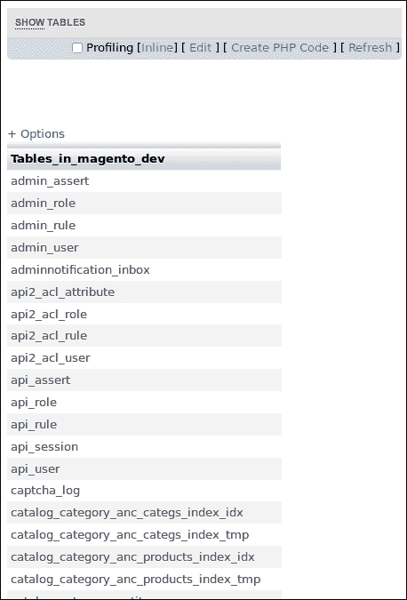
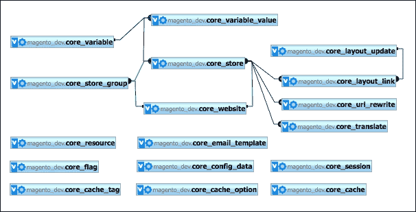
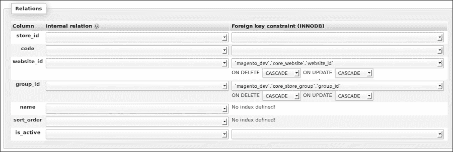
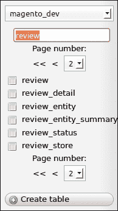
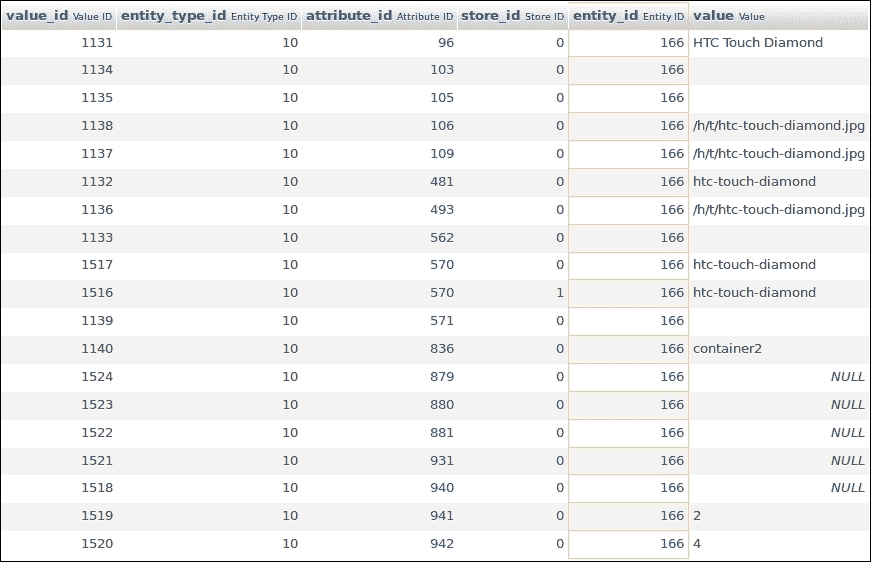
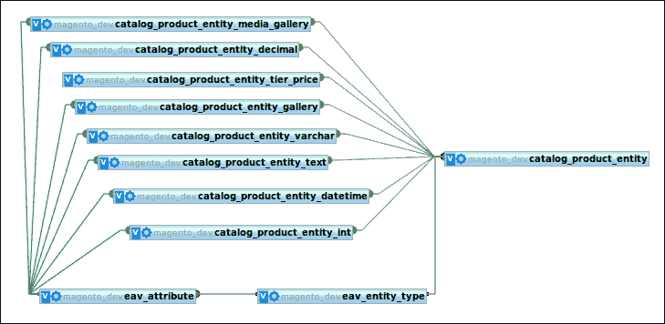
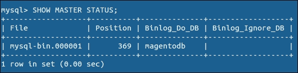
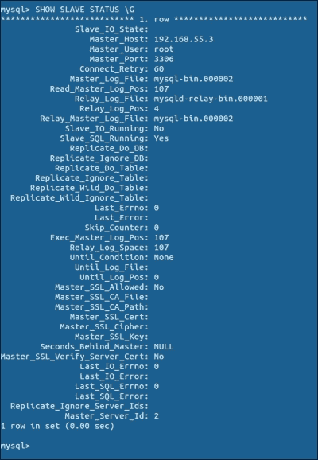
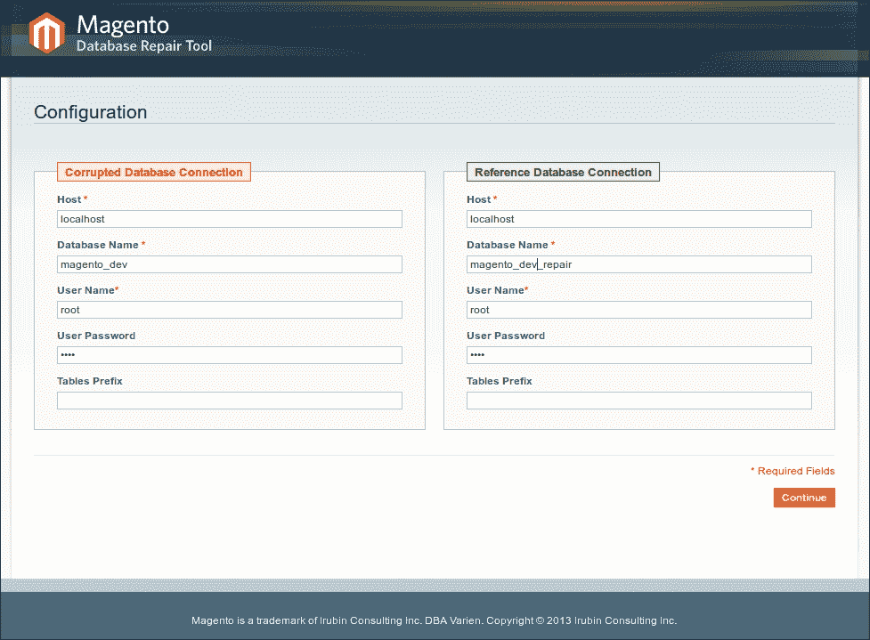

# 第五章：数据库概念

在本章中，我们将涵盖：

+   在表中找到你的方向

+   在 Magento 中创建数据库连接

+   使用平面表

+   使用 EAV 表

+   配置主/从设置

+   修复数据库

# 简介

Magento 有一个非常大的数据库模型来存储各种信息。有许多 Magento 模块。每个模块在数据库中都有自己的表。使用命名约定可以在数据库中提供良好的概览。一些模块使用平面数据库模型（每个实体一个表），而其他模块使用**EAV**（**实体属性值**）数据库模型。本章中的食谱将涵盖你在与数据库一起工作时需要了解的最重要的事情。

# 在表中找到你的方向

当你查看表时，你会意识到表的数目非常高。在一个标准安装中，有超过 300 个数据库表。需要一个结构化的命名约定来在这个表的迷宫中找到你的方向。

## 准备工作

在这个食谱中，我们将对数据库进行一些查询，以了解表及其用途。

在这里，你首先需要使用**phpMyAdmin**与你的数据库客户端建立连接。

## 如何操作...

在接下来的步骤中，我们将学习一些方法，帮助你熟悉 Magento 中的数据库模型：

1.  获取核心模块的列表。你可以在`app/code/core/Mage`文件夹中运行`ls –l`命令来做到这一点。这将给出以下输出：

    ```php
    drwxrwxr-x  7 www-data www-data Admin
    drwxrwxr-x  8 www-data www-data Adminhtml
    drwxrwxr-x  6 www-data www-data AdminNotification
    drwxrwxr-x  8 www-data www-data Api
    drwxrwxr-x  8 www-data www-data Api2
    drwxrwxr-x  7 www-data www-data Authorizenet
    drwxrwxr-x  5 www-data www-data Backup
    drwxrwxr-x  9 www-data www-data Bundle
    drwxrwxr-x  8 www-data www-data Captcha
    drwxrwxr-x  9 www-data www-data Catalog
    drwxrwxr-x  5 www-data www-data CatalogIndex
    drwxrwxr-x  7 www-data www-data CatalogInventory
    drwxrwxr-x  6 www-data www-data CatalogRule
    drwxrwxr-x  8 www-data www-data CatalogSearch
    drwxrwxr-x  7 www-data www-data Centinel
    drwxrwxr-x  9 www-data www-data Checkout
    drwxrwxr-x 10 www-data www-data Cms
    drwxrwxr-x  7 www-data www-data Compiler
    drwxrwxr-x  7 www-data www-data Connect
    drwxrwxr-x  7 www-data www-data Contacts
    ```

1.  在你的数据库上运行`SHOW TABLES`命令。这将在 phpMyAdmin 中给出以下结果：

1.  将表名的第一部分与模块列表进行比较。你会发现每个表的名字都是以模块的名字开头的。

1.  打开 phpMyAdmin 并导航到数据库的**设计器**选项卡。这个页面将渲染一个包含所有数据库表的数据库模式，这些表都在 Magento 中。

1.  你可以通过在左侧列中检查你想要看到的表来限制结果。取消选择所有表并选择核心表。这些表以`core_*`开头。这将给出核心表之间关系的概览，如下截图所示：

1.  在上一张截图，我们看到从`core_store`表开始有很多关系。让我们看看这个表的结构。你可以通过点击`core_store`表的`结构`选项卡中的**关系视图**链接来做到这一点。这将给出以下输出：

## 工作原理...

Magento 数据库就像任何带有表和它们之间关系的数据库一样。困难的是，有如此多的表使得简单的概览变得非常困难。

在工作过程中，你不需要知道数据库的整个结构。使用 phpMyAdmin 中的**设计器**选项，你可以显示你想要看到的表。

数据库中的大多数表都代表 Magento 中的实体。这些实体（模型）通过 Magento 框架与数据库连接。此框架使用集合在数据库上执行选择查询。这些集合将生成一个`Zend_Db_Statement`对象，该对象生成 SQL 查询。

这些集合的目的在于它们返回 Magento 模型的实例。一个 SQL 或 Zend DB 查询将返回包含数据的数组。

# 在 Magento 中创建数据库连接

Magento 使用资源来连接到数据库。默认情况下，Magento 使用一个连接与数据库交互。在这个连接中，模块的`config.xml`文件中声明了资源，以将模型与正确的表链接起来。

在这个菜谱中，我们将使用 Magento 连接来读取一些表，并学习如何配置第二个连接到另一个数据库，例如第三方系统。

## 准备工作

导航到我们在第四章“创建模块”中创建的`Packt_Helloworld`模块的`IndexController`。我们将测试`indexController`中的某些连接。

## 如何操作...

在以下步骤中，我们将解释如何在您的脚本中处理多个数据库连接：

1.  将以下代码粘贴到`indexAction`方法中：

    ```php
    $resource = Mage::getSingleton('core/resource');
    $connection = $resource->getConnection('core_read');

    $results = $connection->query('SELECT * FROM core_store')->fetchAll();

    Zend_Debug::dump($results);
    ```

    此查询将返回`core_store`表中的值数组。

1.  在前端重新加载`indexAction`方法。您将看到`core_store`表中的所有值，如下所示：

    ```php
    array(4) {
      [0] => array(7) {
        ["store_id"] => string(1) "0"
        ["code"] => string(5) "admin"
        ["website_id"] => string(1) "0"
        ["group_id"] => string(1) "0"
        ["name"] => string(5) "Admin"
        ["sort_order"] => string(1) "0"
        ["is_active"] => string(1) "1"
      }
      [1] => array(7) {
        ["store_id"] => string(1) "1"
        ["code"] => string(7) "default"
        ["website_id"] => string(1) "1"
        ["group_id"] => string(1) "1"
        ["name"] => string(7) "English"
        ["sort_order"] => string(1) "0"
        ["is_active"] => string(1) "1"
      }
    ...
    ```

1.  创建一个新的连接。例如，我们将对第二个 Drupal 数据库进行一些查询。将以下代码粘贴到`indexAction`方法中，并使用您的凭据修改连接参数：

    ```php
    $dbConfig = array(
        'host' => 'localhost',
        'dbname' => 'drupal',
        'username' => 'drupal_web',
        'password' => 'drupal_pwd',
    );
    $_resource = Mage::getSingleton('core/resource');

    //Create the connection
    $connection = $_resource->createConnection('drupalConnection', 'pdo_mysql', $dbConfig);
    $results = $connection->query('SELECT * FROM node')->fetchAll();

    Zend_Debug::dump($results);
    ```

1.  重新加载您的客户端，您将看到您之前查询的结果。前面的代码将使用 Magento 连接连接到外部数据库。

## 它是如何工作的...

Magento 中的数据库连接由`Mage_Core_Model_Resource`模型管理。通过使用**单例**模式加载类，连接在每次进程中进行一次。

要获取模型的一个实例，您可以使用`Mage::getModel()`函数，该函数返回对象的新实例。通过使用`Mage::getSingleton()`函数，返回第一个参数中给出的对象实例。然而，一旦模型被声明，Magento 不会创建一个新的实例，而是返回对象的现有实例。

# 处理平面表

在与数据库交互时，Magento 有两种类型的实体：**平面**实体和**EAV**实体。

平面表与表示数据库表列的字段一起工作。下一章中描述的 EAV 表将使用属性。在这个菜谱中，我们将专注于平面表。

## 准备工作

在本食谱中，我们将对扁平表进行一些示例查询。打开 `IndexController` 从 `Packt_Helloworld` 模块，并在其中创建一个 `flatAction()` 方法。此控制器操作将用于触发示例查询。

## 如何操作...

在下一组说明中，我们将向您展示数据库中的扁平表是如何与 Magento 模型关联的：

1.  查看评论表。您可以通过在 phpMyAdmin 表名中过滤它们来完成此操作。

1.  从 `review_detail` 表中获取所有数据。您可以通过单击表来完成此操作。

1.  通过在 Magento 代码中选择数据来打印相同的数据。为此，请将以下代码粘贴到您的 `flatAction` 方法中：

    ```php
    $resource = Mage::getSingleton('core/resource');
    $connection = $resource->getConnection('core_read');

    $results = $connection->query('SELECT * FROM review_detail')->fetchAll();

    Zend_Debug::dump($results);
    ```

    在执行此代码时，会返回一个值数组。

1.  我们可以通过处理 Magento 集合来获得相同的结果。您可以通过运行以下代码来完成此操作：

    ```php
    $reviews = Mage::getModel('review/review')->getCollection();

    foreach ($reviews as $_review) {
        Zend_Debug::dump($_review->debug());
    }
    ```

1.  此代码将产生相同的输出，但集合的数据来自对象，而不是直接来自数据库。这样做的原因是我们可以直接在对象上调用函数。

    ### 小贴士

    当与 Magento 数据库表一起工作时，建议使用集合而不是直接 SQL 查询。有关 Magento 集合的更多信息，请参阅第六章 *使用 Magento 集合* 的食谱，*数据库和模块*。

1.  在屏幕上打印评论的 URL。我们可以通过在 `review` 实体上调用 `getReviewUrl()` 函数来完成此操作。在每个循环中添加以下代码：

    ```php
    echo $_review->getReviewUrl().'<br/>';
    ```

1.  在重新加载页面时，您将看到所有评论的 URL 都被打印出来。URL 结构的逻辑是在 `Mage_Review_Model_Review` 类中完成的，它代表一个 `review` 实体。

## 工作原理...

在 Magento 中处理扁平表并不困难。当使用 Magento 框架时，一个扁平实体由以下部分组成：

+   **数据库表**：数据库表用于存储实体的信息。此数据库表可以与 Magento 数据库中的不同表相关联，例如与产品相关联。

+   **模型对象**：模型对象是一个类，在从数据库表加载一行时返回一个实例。此类可以具有具有业务逻辑的方法，例如本食谱中的 `getReviewUrl()` 函数。

+   **资源模型对象**：资源模型是一个将模型与数据库表连接起来的类。此类将处理例如 `save()` 方法。

+   **资源收集对象**：资源收集对象是一个类，它使得可以处理实体的 Magento 收集。

# 处理 EAV 表

EAV 表是一个数据库模型，用于 Magento 中的一些实体。在本食谱中，我们将探讨 Magento 中 EAV 实现的细节。

## 准备工作

EAV 模式用于 Magento 中的一些实体，如产品实体。在这个菜谱中，我们将使用 SQL 查询进行一些更新产品的查询。打开你的数据库客户端，并准备好运行一些复杂的查询。

## 如何做到这一点...

以下步骤展示了如何创建一个查询来返回 Magento EAV 模型的数据：

1.  Magento 的 EAV 实体在`eav_entity_type`表中声明。运行以下查询以查看哪些 EAV 实体可用：

    ```php
    SELECT * FROM eav_entity_type;

    ```

    记住`catalog_product`实体的 ID。

1.  要获取与产品相关的属性，我们必须查看`eav_attribute`表。要查看哪些属性与产品相关，我们必须运行以下查询：

    ```php
    SELECT * FROM eav_attribute WHERE entity_type_id = 10

    ```

    确保实体类型 ID 为`10`的是`catalog_product`。

1.  现在我们有了实体和属性，所以下一步是找出值。在后台找到一个产品并记住其 ID。例如，ID 为`166`的`HTC Touch Diamond`产品。

1.  通过运行以下查询从`catalog_product_entity`表中选择产品：

    ```php
    SELECT * FROM catalog_product_entity WHERE entity_id = 166;

    ```

1.  最后一个查询只会返回该产品的实体信息。要获取属性信息，如`name`，我们必须查看`value`表。对于`name`属性，`value`表是`catalog_product_entity_varchar`。运行以下查询以获取产品的所有`varchar`属性值：

    ```php
    SELECT * FROM catalog_product_entity_varchar WHERE entity_id = 166

    ```

1.  之前的查询给出了以下结果：

1.  通过这个结果，你可以识别出产品的名称。如果你查看行的属性 ID 并将属性 ID 与`eav_attribute`表中的 ID 匹配，你会看到这指的是`name`属性。

1.  要更新产品的名称，对以下行进行更新查询：

    ```php
    UPDATE catalog_product_entity_varchar SET value = 'HTC Touch Diamond sql' WHERE value_id = 1131;

    ```

    注意`value_id`值与之前结果中的值 ID 相匹配。

1.  在后端重新加载产品，你会看到产品的名称已更新。

## 它是如何工作的...

Magento 中的 EAV 实体在`eav_entity_type`表中声明，属性在`eav_attribute`表中声明。

与每个实体一样，每个 EAV 实体都有自己的基础表。在这个基础表中，主字段作为此表中的列声明。所有其他字段作为`eav_attribute`表中的属性声明。

每个属性都是特定类型的，如`int`、`varchar`、`date`、`time`、`decimal`和`text`。这些值存储的位置取决于实体类型，并在 Magento 的配置文件中声明。

以下截图显示了产品 EAV 表的结构：



## 还有更多...

并非所有 EAV 实体都通过实体使用多个表。例如，`sales_flat_*`表都是 EAV 表，但正如其名称所暗示的，它们是扁平的。这意味着实体的所有属性都设置在扁平表的单独列中。

在目录配置中，你有能力为分类和产品表启用 **Flat catalog** 选项。当此配置被启用时，Magento 将将所有数据从 EAV 表同步到 `catalog_flat_*` 表，并从那里加载数据。

当 **Flat catalog** 选项被启用时，你会获得更好的性能，因为在一个单独的表上执行 `select` 查询比从不同的表中获取数据要快。优点是更好的性能，但另一方面，对于大量产品和分类，可能会有一些缺点。

主数据将存储在 EAV 表中。这意味着在扁平表中存在同步。这个过程作为 **Magento 索引过程** 实现。当有大量产品和分类时，这个过程可能运行非常长。另一件事是，数据库的大小可能会爆炸，因为数据被存储了两次。

# 配置主/从设置

**数据库复制**用于当你想要扩展你的基础设施以服务更多请求时。有许多方法可以扩展数据库以设置复制。具体选择因情况而异。

在这个菜谱中，我们将使用一个通用设置来为我们的 Magento 店创建一个主/从设置。这个设置将使用一个主数据库服务器，所有 `write` 查询都将保存在这里。从数据库服务器（们）将用于 `read` 查询。数据库是应用程序扩展性中最困难的部分。

## 准备中

为了完成主/从设置，我们将使用两个不同的 MySQL 服务器。获取连接信息，如主机名、IP 地址、用户名和密码。

## 如何操作...

在这里，我们将设置 MySQL 中的主/从复制，并配置 Magento 使用此设置。请查看以下步骤：

### 设置主数据库

1.  使用 SSH 登录到服务器并打开 `/etc/mysql/my.cnf` 文件。

1.  在文件中查找 `bind-address` 部分，并将其注释掉。通过注释这一行，你可以使不同服务器之间建立连接成为可能：

    ```php
    #bind-address = 127.0.0.1

    ```

1.  将以下代码粘贴到 `[mysqld]` 部分的 `my.cnf` 文件中：

    ```php
    server-id = 1
    log_bin = /var/log/mysql/mysql-bin.log
    expire_logs_days = 10
    max_binlog_size = 100M
    binlog_do_db = magento_dev

    ```

1.  通过运行以下命令重启你的 MySQL 服务器：

    ```php
    sudo service mysql restart

    ```

1.  通过运行以下命令打开 MySQL shell。这将使用 root 用户进行登录：

    ```php
    mysql -u root -p 

    ```

1.  当你登录后，你必须运行以下查询：

    ```php
    GRANT ALL PRIVILEGES ON `magento_dev` . * TO `user_slave`@`%` WITH
    GRANT OPTION IDENTIFIED BY `password_slave`;
    FLUSH PRIVILEGES;

    ```

1.  运行以下命令以显示主数据库的状态：

    ```php
    USE magento_dev;
    FLUSH TABLES WITH READ LOCK;
    SHOW MASTER STATUS;

    ```

    上一段代码中的最后一个命令将给出以下输出：

    

    我们将在从设置中使用这些信息，所以请保留好。

1.  使用以下命令解锁表：

    ```php
    UNLOCK TABLES;
    quit;

    ```

    当你输入 `quit` 或 `exit` 命令时，你将返回到服务器的 shell。主数据库的设置已完成。

### 设置从数据库

1.  通过 SSH 登录到您的从服务器。这是一个不同于主服务器的不同服务器。

1.  使用以下命令打开 MySQL 命令行：

    ```php
    mysql –u root –p

    ```

1.  创建一个新的数据库 `magento_dev` 并将主数据库导入其中。

1.  在 `[mysqld]` 部分下 `etc/mysql/my.cnf` 文件中添加以下配置：

    ```php
    [mysqld]
    server-id = 2
    master-host = 192.168.56.3
    master-user = user_slave
    master-password = password_slave
    master-connect-retry = 60
    replicate-do-db = magento_dev

    ```

1.  使用以下命令重新启动 MySQL 服务器：

    ```php
    sudo service mysql restart

    ```

1.  在您的 MySQL 命令行中运行以下命令。请确保 `MASTER_LOG_FILE` 和 `MASTER_LOG_POST` 的值与您在运行 `SHOW MASTER STATUS` 命令时看到的值匹配：

    ```php
    CHANGE MASTER TO MASTER_HOST=`192.168.56.3`, MASTER_USER=`user_slave`, MASTER_PASSWORD=`password_slave`, MASTER_LOG_FILE=`mysql-bin.000001`, MASTER_LOG_POS=88;

    ```

1.  运行以下命令以启动从服务器：

    ```php
    START SLAVE; 

    ```

1.  通过运行以下命令来检查状态：

    ```php
    SHOW SLAVE STATUS \G

    ```

    输出将如下所示：



### 配置 Magento

现在，当 Master/Slave 设置的 MySQL 配置完成时，是时候配置 Magento 以使用此设置了。我们必须在 Magento 的 `app/etc/local.xml` 文件中配置此设置。在这里，我们将配置一个 `default_setup` 连接和一个 `default_read` 连接。为此，在 `<resources>` 标签下 `local.xml` 文件中添加以下 XML：

```php
<resources>
    <db>
        <table_prefix><![CDATA[]]></table_prefix>
    </db>
    <default_setup>
        <connection>
            <host><![CDATA[192.168.56.3]]></host>
            <username><![CDATA[user_master]]></username>
            <password><![CDATA[password_master]]></password>
            <dbname><![CDATA[magento_dev]]></dbname>
            <initStatements><![CDATA[SET NAMES utf8]]></initStatements>
            <model><![CDATA[mysql4]]></model>
            <type><![CDATA[pdo_mysql]]></type>
            <pdoType><![CDATA[]]></pdoType>
            <active>1</active>
        </connection>
    </default_setup>
    <default_read>
        <connection>
            <host><![CDATA[192.168.56.3]]></host>
            <username><![CDATA[user_slave]]></username>
            <password><![CDATA[password_slave]]></password>
            <dbname><![CDATA[magento_dev]]></dbname>
            <active>1</active>
        </connection>
    </default_read>
</resources>
```

清除您的缓存，您的 Magento 将使用此设置。

## 它是如何工作的...

当主数据库中的数据发生变化时，它必须与从数据库保持同步。为了建立这种同步，使用二进制日志文件在它们之间进行通信。

您必须确认在主数据库上已配置二进制日志。如果没有，您必须启用此功能并重新启动您的 MySQL 服务器。如果没有启用，则没有日志文件，因此服务器之间没有通信。这也是为什么从数据库的 `MASTER_LOG_FILE` 必须与主数据库上的 `MASTER_LOG_FILE` 匹配的原因。

如果设置完成，并且 Magento 配置已位于 `app/etc/local.xml` 文件中，则一切完成。Magento 足够智能，能够将 `write` 请求发送到主服务器，将 `read` 请求发送到从服务器。

# 修复数据库

有时会发生您的 Magento 数据库损坏或损坏的情况。这可能是由于各种原因造成的，例如黑客攻击或服务器崩溃。当数据库损坏并且您必须修复它时，来自 Magento 的数据库修复工具非常有帮助。

在本食谱中，我们将使我们的数据库损坏，并使用修复工具来修复它。

## 准备工作

为了做好准备，从 Magento 网站下载**数据库修复工具**（[`www.magentocommerce.com`](http://www.magentocommerce.com)），并将 PHP 文件放置在您的服务器根目录下。

## 如何操作...

以下步骤将向您展示如何使您的数据库损坏，并使用数据库修复工具来修复它：

1.  创建现有数据库的备份。

1.  创建一个空数据库作为参考数据库。让我们称它为 `magento_dev_repair`。

1.  在 `app/etc/local.xml` 文件中配置 Magento 以使用此数据库。

1.  清除缓存并运行 Magento。这将在此数据库中安装一个空的 Magento。

1.  使您的原始数据库损坏。您可以通过运行以下查询来实现，这些查询删除了一个外键和一个表：

    ```php
    ALTER TABLE core_store DROP FOREIGN KEY FK_CORE_STORE_GROUP_ID_CORE_STORE_GROUP_GROUP_ID;
    DROP TABLE catalog_product_index_price

    ```

1.  在浏览器中浏览到修复工具，并按照以下截图配置您的原始和参考数据库：

1.  提交表单后，脚本将修复您的数据库。在下一页，您将看到对您的原始数据库所做的更改。

1.  在`app/etc/local.xml`文件中切换数据库，以便 Magento 使用您原始的数据库。

1.  清除缓存后，您的商店即可正常运行。

## 它是如何工作的...

在运行数据库修复工具时，脚本将比较原始数据库与参考数据库。如果比较完成，脚本将使您的原始数据库结构与参考数据库的结构相同。

数据库修复工具仅修复数据库的结构问题。如果您丢失了一些数据，这不是恢复数据的正确工具。
