# 第七章. Magento 后端

在本章中，我们将涵盖以下主题：

+   注册后端控制器

+   扩展菜单

+   添加 ACL

+   扩展系统配置

+   从数据库表创建网格

+   添加客户属性

+   与源模型一起工作

# 简介

对于店主来说，后端是他们管理店铺中所有事物的接口。确保一切对心怀恶意访客的安全至关重要。标准 Magento 安装的后端可以通过多种方式扩展，因此每个人都可以通过自定义页面、配置、角色等方式对其进行扩展。

通过遵循 Magento 的配置模式，所有安全问题（匿名用户的访问、安全环境等）都由 Magento 的后端系统覆盖。本章中的食谱描述了您可以使用 Magento 扩展后端的最佳实践的所有方法。

# 注册后端控制器

我们首先将学习如何通过自定义控制器操作扩展后端。为此，我们必须创建一个受保护的控制器，以确保只有登录的后端用户才能看到此页面的内容。

当你想在你的后端添加一个额外的页面时，你需要一个后端控制器。这通常是在你使用自定义表单或概述时，你需要为你的模块使用的情况。

## 准备就绪

为了使测试管理员 URL 更容易，我们将从管理员 URL 中删除密钥（后端页面 URL 中的哈希）。您可以在 **系统** | **配置** | **管理员** | **安全** 中进行此配置。按照以下截图所示更改配置：

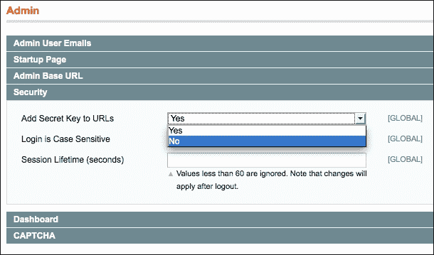

## 如何操作...

当你想在你的后端添加一个额外的页面时，你必须执行以下步骤：

1.  打开 `app/code/local/Packt/Helloworld/etc/config.xml` 文件，并在 `global` 标签下添加以下配置：

    ```php
    <admin>
      <routers>
        <adminhtml>
          <args>
            <modules>
              <helloworld before="Mage_Adminhtml">Packt_Helloworld_Adminhtml
              </helloworld>
            </modules>
          </args>
        </adminhtml>
      </routers>
    </admin>
    ```

    此配置将初始化 `Adminhtml` 模块，以便在 `Packt_Helloworld` 模块的文件夹中查找控制器。

1.  按照以下目录添加以下文件夹：

    +   `app/code/local/Packt/Helloworld/controllers/Adminhtml`

    +   `app/code/local/Packt/Helloworld/controllers/Adminhtml/Helloworld`

1.  在最后一个文件夹中，创建一个名为 `IndexController.php` 的文件，内容如下：

    ```php
    <?php
    class Packt_Helloworld_Adminhtml_Helloworld_IndexController extends Mage_Adminhtml_Controller_Action
    {
      public function indexAction()
      {

      }
    }
    ```

1.  确保你从 `Mage_Adminhtml_Controller_Action` 类扩展，以确保所有安全情况都得到覆盖。

1.  清除缓存，并通过访问 URL `http://magento-dev.local/index.php/admin/helloworld_index/` 导航到控制器。

    这将给你一个空白页面。这是正常的，因为操作是空的。

1.  在你的 `indexAction` 函数中添加以下代码，并重新加载页面。你会看到返回了一个空的后端页面：

    ```php
    $this->loadLayout();
    $this->renderLayout();
    ```

## 它是如何工作的...

前端控制器和后端控制器之间的区别在于父类。后端控制器扩展另一个类作为前端控制器。后端控制器始终扩展自`Mage_Adminhtml_Controller_Action`类。这个类为控制器添加了安全性，以确保只有经过身份验证的用户才能访问控制器操作。

当我们在`config.xml`文件中添加配置时，我们将使用我们的模块的`controllers/Adminhtml`文件夹扩展`Mage_Adminhtml`模块的`controllers`文件夹。使用`before="Mage_Adminhtml"`选项，Magento 将在模块的文件夹中查找控制器文件。稍后，它将在`Mage_Adminhtml`模块中查找。

### 小贴士

当你为你的模块创建后端控制器时，确保你在`controllers`文件夹中添加`Adminhtml/Modulename`文件夹，以避免与现有的`Mage_Adminhtml`控制器冲突。

## 还有更多...

在某些模块和教程中，你会找到以下配置来链接你的后端控制器：

```php
<admin>
  <routers>
    <helloworld>
      <use>admin</use>
      <args>
        <module>Packt_Helloworld</module>
        <frontName>helloworld</frontName>
      </args>
    </helloworld>
  </routers>
</admin>
```

不建议以这种方式进行配置，因为当你在同一模块中与前端和后端控制器一起工作时，这将会引发问题。

# 扩展菜单

在扩展后端时，确保用户可以轻松地导航到你的自定义页面是很重要的。你可以使用的唯一替代方案是使用你自己的项目扩展**管理员**菜单。使用 Magento 框架，可以在该菜单的每个级别添加菜单项。

## 准备工作

对于这个菜谱，我们唯一要做的任务是将正确的配置（位于`adminhtml.xml`文件中）添加到`Packt_Helloworld`模块的`etc`文件夹中。

## 如何操作...

以下步骤描述了如何向**管理员**菜单添加额外的菜单项：

1.  我们必须首先考虑的是，我们将在**管理员**菜单的哪个位置放置额外的菜单项。为此测试，我们将将其放在**系统**菜单下。记住系统 ID。我们必须使用它来进行菜单配置。

1.  第二件事是在`adminhtml.xml`文件中添加配置。在`config`标签下粘贴以下代码：

    ```php
    <menu>
      <system>
        <children>
          <helloworld translate="title" module="helloworld">
            <title>Helloworld</title>
            <sort_order>10</sort_order>
            <action>adminhtml/helloworld_index</action>
          </helloworld>
        </children>
      </system>
    </menu>
    ```

    ### 注意

    在`<helloworld>`标签中，你可以看到`translate`和`module`属性。当这些属性被设置时，标题将使用`helloworld`模块的帮助类进行翻译。

1.  清除缓存并重新加载后端。当悬停在系统菜单上时，你会看到显示了一个**HelloWorld**链接，如下截图所示：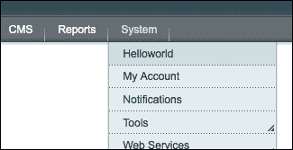

1.  要更改菜单项的位置，我们必须在配置中添加以下`sort_order`标签：

    ```php
    <sort_order>30</sort_order>
    ```

## 它是如何工作的...

Magento 的**管理员**菜单包含来自所有模块的所有菜单配置数据。标准菜单包含以下 10 个根项：

+   仪表板

+   销售

+   目录

+   移动

+   客户

+   促销

+   通讯录

+   报告

+   系统

当您想要将一个项作为根项的子项添加时，您必须使用这些标签在您的配置中，就像我们在本菜谱中所做的那样。这些菜单项的 ID 在 Magento `core`模块的配置 XML 文件中声明。

您可以轻松地向菜单中添加额外的根项，但您必须确保菜单不要太长。当根菜单太长时，它将导致小屏幕分辨率的布局问题。

# 添加 ACL

在之前的菜谱中，我们创建了一个后台控制器操作，您可以导航到它。然而，当您想要配置自定义管理员角色时，您不能限制特定角色的访问权限。在这个菜谱中，我们将为我们的后台页面创建一个**ACL（访问控制列表**）并配置一个具有限制性访问权限的角色。

## 准备工作

每个管理员用户都有一个角色。这些角色包含访问权限，因此您可以限制某些用户角色的访问。在这个菜谱中，我们将为角色添加额外的权限，以便我们可以配置之前创建的页面的访问权限。

## 如何操作...

以下步骤显示了您如何限制特定用户的后台页面访问权限：

1.  我们必须做的第一件事是检查哪些 ACL 可用。为了知道这一点，我们可以运行以下命令：

    ```php
    wiz admin-resources
    ```

1.  或者，我们可以导航到后端的**角色**页面。这位于**系统** | **权限** | **角色**。点击**添加新角色**并打开**资源**标签。这将列出后端中所有可用的 ACL。

1.  第二步是为它添加一个额外的 ACL（访问控制列表）。为此，我们可以在`adminhtml.xml`文件中的`<config>`标签下添加以下配置：

    ```php
    <acl>
      <resources>
        <all>
          <title>Allow Everything</title>
        </all>
        <admin>
          <children>
            <system>
              <children>
                <helloworld>
                  <title>Hellworld index page</title>
                  <sort_order>10</sort_order>
                </helloworld>
              </children>
            </system>
          </children>
        </admin>
      </resources>
    </acl>
    ```

1.  清除您的缓存并重新加载后端的**资源**页面。当您搜索`Helloworld`时，您将看到之前创建的 ACL 旁边有一个可用的复选框，如图所示：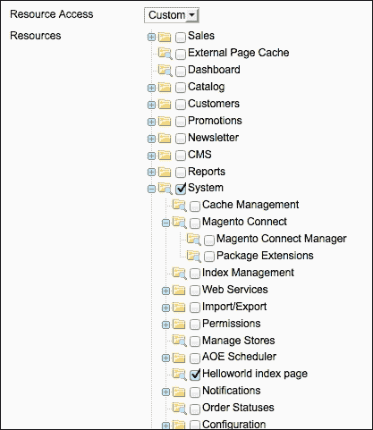

    到目前为止，我们的 ACL 正在工作。为了验证这一点，我们必须创建一个带有用户的角色并登录，以查看用户是否有访问页面的权限：

1.  在**系统** | **权限**下的**角色**页面创建一个新的角色。命名为`Test Helloworld`并勾选**Helloworld test**和**Manage Products** ACL。

1.  在**系统** | **权限**下的**用户**页面创建一个后台用户。填写表单并将用户添加到我们刚刚创建的角色中，如图所示：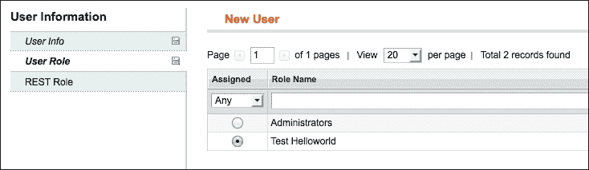

1.  以新用户身份登录，您将看到该用户只能访问我们在角色中配置的页面。

## 工作原理...

使用 ACL 系统，可以限制特定用户角色的后台页面。例如，产品经理只有管理产品、类别和促销规则的权利，而物流合作伙伴只有访问订单页面的权限。

### 小贴士

在 Magento 社区版中，无法限制对特定商店数据的访问。例如，物流合作伙伴只能看到 Store 1 的订单。限制基于控制器操作。

当你没有为页面创建 ACL 时，只有有权访问所有资源的角色才能访问该页面。在大多数情况下，这是管理员。对于其他角色，没有 ACL 无法访问页面。

# 扩展系统配置

当你想为你自己的模块保存一些配置参数时，你可以使用 Magento 配置表来保存你的配置。你可以在**系统**菜单下的**配置**中找到配置表单。在本菜谱中，我们将在系统配置中添加一个带有一些配置参数的配置页面。

## 准备工作

准备好扩展`Packt_Helloworld`模块并添加一些额外的配置。同时，连接到你的数据库，因为我们将需要查看一些表。

## 如何操作...

以下步骤描述了在**系统**下的**配置**页面中创建额外配置参数的流程。

1.  在`app/code/local/Packt/Helloworld/etc/`文件夹中创建以下文件：

    +   `system.xml`

    +   `adminhtml.xml`

1.  第二步是创建配置页面。我们将在新部分下的左侧列中创建一个新标签。为了创建名为`packt`的部分，我们必须在刚刚创建的`system.xml`文件中添加以下代码：

    ```php
    <tabs>
      <packt>
        <label>Packt</label>
        <sort_order>400</sort_order>
      </packt>
    </tabs>
    ```

1.  要添加一个配置页面，我们必须在`system.xml`文件的`global`标签下添加以下代码：

    ```php
    <sections>
      <helloworld translate="label" module="helloworld">
        <label>Helloworld</label>
        <tab>packt</tab>
        <sort_order>10</sort_order>
        <show_in_default>1</show_in_default>
        <show_in_website>1</show_in_website>
        <show_in_store>1</show_in_store>
        <groups>

        </groups>
      </helloworld>
    </sections>
    ```

1.  当你清除缓存并重新加载页面时，菜单中会出现带有**Helloworld**标签的**PACKT**部分，如下截图所示：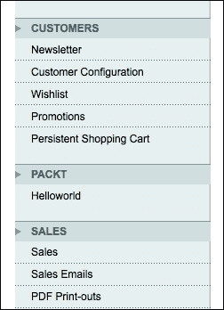

1.  当你点击链接时，你会看到一个 404 错误。这是因为我们还没有为这个配置部分创建 ACL。要添加 ACL，我们必须在第一步中创建的`adminhtml.xml`文件中添加以下代码：

    ```php
    <?xml version="1.0" encoding="UTF-8"?>
    <config>
      <acl>
        <resources>
          <all>
            <title>Allow Everything</title>
          </all>
          <admin>
            <children>
              <system>
                <children>
                  <config>
                    <children>
                      <helloworld translate="title" module="helloworld">
                        <title>Helloworld section</title>
                      </helloworld>
                    </children>
                  </config>
                </children>
              </system>
            </children>
          </admin>
        </resources>
      </acl>
    </config>
    ```

1.  我们必须确保 ACL 已添加。为了测试这一点，你必须清除你的缓存并转到**系统**|**权限**下的**角色**页面。在该页面上，点击**管理员**角色，打开**角色资源**选项卡，并将其更改为**自定义**。你将在列表中看到你的 ACL 条目，如下截图所示：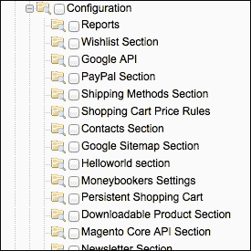

1.  当我们在列表中看到**Helloworld 部分**时，这意味着 ACL 已添加。不要保存角色，因为这只是为了验证 ACL 的添加。为了确保所有 ACL 设置都在后端会话中，我们必须通过注销然后重新登录来创建一个新的后端会话。

    ### 小贴士

    当创建 ACL 时，确保你的自定义 ACL 配置遵循你在放置页面的位置放置的 Magento XML 树。

1.  当您再次登录时，导航到配置页面，您将看到一个空页面。这是因为字段尚未添加到配置中。

1.  新的配置字段必须位于配置组中。要添加新组，我们必须在`system.xml`文件中添加一些配置。在`config/sections/helloworld`标签下添加以下代码：

    ```php
    <groups>
      <hellopage translate="label">
        <label>Hello page settings</label>
        <sort_order>1</sort_order>
        <show_in_default>1</show_in_default>
        <show_in_website>1</show_in_website>
        <show_in_store>1</show_in_store>
        <fields>

        </fields>
      </hellopage>
    </groups>
    ```

1.  在重新加载页面时，您将看不到任何内容，因为在`<fields>`标签中未定义任何字段。要添加字段（例如，`header_title`），我们必须在`<fields>`标签中添加以下代码：

    ```php
    <header_title translate="label">
      <label>Header title</label>
      <frontend_type>text</frontend_type>
      <sort_order>1</sort_order>
      <show_in_default>1</show_in_default>
      <show_in_website>1</show_in_website>
      <show_in_store>1</show_in_store>
    </header_title>
    ```

1.  清除缓存并重新加载页面后，您将在配置页面看到字段，如下面的截图所示：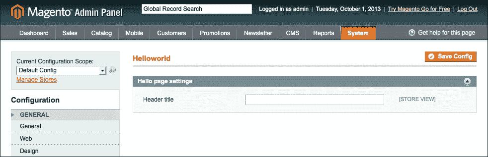

1.  在字段中输入值并保存配置。

1.  要查看值保存的位置，我们必须查看`core_config_data`表。运行以下查询以查看字段的记录：

    ```php
    SELECT * FROM core_config_data where path = 'helloworld/hellopage/header_title'
    ```

    此查询返回字段的全部值，如下面的截图所示：

    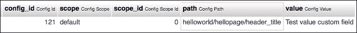

1.  要读取配置数据，我们可以使用`Mage::getStoreConfig('<path>')`函数。在我们的例子中，路径是`helloworld/hellopage/header_title`。您可以从`core_config_data`表的路径列或从模块的`system.xml`文件中确定路径。

## 工作原理...

Magento 配置保存在`core_config_data`表中。此表包含您可以在后端**系统** | **配置**中设置的配置值。

每个配置设置都可以在三个级别上进行配置：

+   全局配置

+   网站配置

+   存储视图配置

当您与多个商店一起工作时，此设置使得为每个商店视图保存配置值成为可能。您可以通过屏幕左上角的下拉字段切换范围，如下所示：

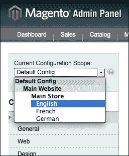

每个配置值的类型都存储在范围列中。此范围在每级都有不同的代码：

+   默认（用于全局配置）

+   网站（用于网站配置）

+   商店（用于商店）

对于每个配置字段，您可以在您的`system.xml`文件中配置范围。这是通过`use_in_store`、`use_in_website`和`use_in_default`标签完成的。

配置参数的配置路径设置在模块的`system.xml`文件中。在以下 XML 路径中，您可以确定值：

```php
config/sections/$1/groups/$2/fields/$3

```

当您将此 XML 路径转换为配置路径时，它将如下所示：

```php
$1/$2/$3
```

在此配方中，`$1`对应于`helloworld`，`$2`对应于`hellopage`，`$3`对应于`header_title`或`is_enabled`。

# 从数据库表创建网格

在上一章中，我们创建了一个与数据库表链接的 Magento 实体。在本配方中，我们将创建一个后端界面，以便后端用户可以在后端查看此表中的数据。

我们将创建一个概述，它将使用标准的 Magento 后端网格小部件。这个小部件在后台广泛使用，用于在网格中显示信息，例如**管理产品**页面。

## 准备工作

对于这个菜谱，我们必须配置后端控制器、菜单项、ACL 以及正确的`Block`文件来渲染网格输出。准备好扩展后端以使用自定义网格。

## 如何操作...

1.  我们必须做的第一件事是为我们的网格创建一个后端控制器。我们将基于订阅实体创建一个网格，因此我们将创建`SubscriptionController`。在`app/code/local/Packt/Helloworld/controllers/Adminhtml/Helloworld/`文件夹中创建一个`SubscriptionController.php`文件。

1.  在控制器中添加以下内容：

    ```php
    <?php
    class Packt_Helloworld_Adminhtml_Helloworld_SubscriptionController extends Mage_Adminhtml_Controller_Action
    {
      public function indexAction()
      {
        $this->loadLayout();

        $this->renderLayout();
      }
    }
    ```

1.  为控制器创建一个菜单项。当你将以下代码添加到模块的`adminhtml.xml`文件中时，它将在**客户**项下创建一个菜单项：

    ```php
    <menu>
      <customer>
        <children>
          <subscription translate="title" module="helloworld">
            <title>Helloworld subscriptions</title>
            <sort_order>10</sort_order>
            <action>adminhtml/helloworld_subscription</action>
          </subscription>
        </children>
      </customer>
    </menu>
    ```

1.  为控制器动作创建一个 ACL。这可以通过在`adminhtml.xml`文件中添加以下代码来完成，就像我们为菜单所做的那样。

    ```php
    <acl>
      <resources>
        <all>
          <title>Allow Everything</title>
        </all>
        <admin>
          <children>
            <customer>
              <children>
                <subscription>
                  <title>Hellworld subscriptions</title>
                  <sort_order>10</sort_order>
                </subscription>
              </children>
            </customer>
          </children>
        </admin>
      </resources>
    </acl>
    ```

1.  清除缓存并重新加载你的后端。现在菜单项在**客户**菜单下。当你导航到该页面时，你会看到一个空的后端页面。

    现在我们有一个与菜单链接的后端页面。在接下来的步骤中，我们将在页面中添加一个网格。为此，我们必须创建两个块。第一个块是包装器（标题、类）。第二个块是网格，我们将定义列。

1.  要创建包装块，创建`app/code/local/Packt/Helloworld/Block/Adminhtml`文件夹。在该文件夹中，创建一个包含以下内容的`Subscription.php`文件：

    ```php
    <?php
    class Packt_Helloworld_Block_Adminhtml_Subscription extends Mage_Adminhtml_Block_Widget_Grid_Container
    {
      public function __construct()
      {
        $this->_headerText = Mage::helper('helloworld')->__('Helloworld subscriptions');

        $this->_blockGroup = 'helloworld';
        $this->_controller = 'adminhtml_subscription';

        parent::__construct();
      }

      protected function _prepareLayout()
      {
        $this->_removeButton('add');

        return parent::_prepareLayout();
      }
    }
    ```

1.  在`app/code/local/Packt/Helloworld/Block/Adminhtml/Subscription`文件夹中创建一个包含`Grid.php`文件的文件夹。在该文件中，添加以下内容：

    ```php
    <?php
    class Packt_Helloworld_Block_Adminhtml_Subscription_Grid extends Mage_Adminhtml_Block_Widget_Grid
    {
      public function __construct()
      {
        parent::__construct();

        $this->setId('subscription_grid');
        $this->setDefaultSort('subscription_id');
        $this->setDefaultDir('DESC');
      }

      protected function _prepareCollection()
      {
        $collection = Mage::getModel('helloworld/subscription')->getCollection();
        $this->setCollection($collection);
        return parent::_prepareCollection();
      }

      protected function _prepareColumns()
      {
        $this->addColumn('subscription_id', array (
          'index' => 'subscription_id',
          'header' => Mage::helper('helloworld')->__('Subscription id'),
          'type' => 'number',
          'sortable' => true,
          'width' => '100px',
        ));

        $this->addColumn('firstname', array (
          'index' => 'firstname',
          'header' => Mage::helper('helloworld')->__('Firstname'),
          'sortable' => false,
        ));

        $this->addColumn('lastname', array (
          'index' => 'lastname',
          'header' => Mage::helper('helloworld')->__('Lastname'),
          'sortable' => false,
        ));

        $this->addColumn('email', array (
          'index' => 'email',
          'header' => Mage::helper('helloworld')->__('Email'),
          'sortable' => false,
        ));

        return parent::_prepareColumns();
      }

      public function getGridUrl()
      {
        return $this->getUrl('*/*/grid', array(
          '_current' => true,
        ));
      }
    }
    ```

1.  要将块添加到页面，在之前创建的控制器文件中的`indexAction()`函数中添加以下代码：

    ```php
    public function indexAction()
    {
      $this->loadLayout();

      $this->_addContent($this->getLayout()->createBlock('helloworld/adminhtml_subscription'));

      $this->renderLayout();
    }
    ```

1.  重新加载页面，你会得到以下输出：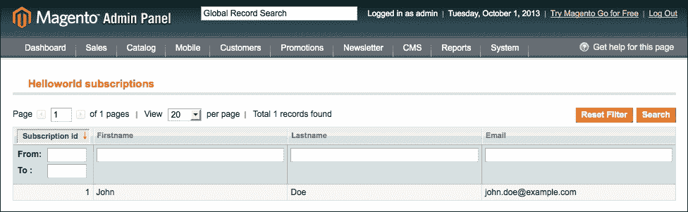

1.  要更改页面标题，我们需要进入包装块类。这是`app/code/local/Packt/Helloworld/Block/Adminhtml/Subscription.php`文件。在`__construct()`动作中的`$this->_headerText`变量包含页面的标题。

1.  现在，网格包含**订阅 ID**、**名**、**姓**和**电子邮件**。在`_prepareColumns()`中，我们将向网格添加更多列，以便显示数据库表的全部列。

1.  `created_at`字段的数据类型为`datetime`。当我们向`_prepareColumns()`函数中添加以下代码时，我们将看到带有日期过滤器的`created_at`列：

    ```php
    $this->addColumn('created_at', array (
      'index' => 'created_at',
      'header' => Mage::helper('helloworld')->__('Created At'),
      'type' => 'datetime',
      'sortable' => true,
      'width' => '150px',
    ));
    ```

1.  我们将添加的最后一个列是**状态**列。在这个列中，我们将向值添加一些 HTML 标记。为此，我们需要在`_prepareColumns()`函数中添加以下代码：

    ```php
    $this->addColumn('status', array (
      'index' => 'status',
      'header' => Mage::helper('helloworld')->__('Status'),
      'sortable' => true,
      'frame_callback' => array($this, 'prepareStatusLayout'),
      'width' => '150px',
    ));
    ```

1.  `frame_callback`列需要`prepareStatusLayout()`函数。在`grid`类中创建以下函数：

    ```php
    public function prepareStatusLayout($value)
    {
      $class = '';
      switch ($value) {
        case 'pending' :
          $class = 'grid-severity-notice';
          break;
        case 'approved' :
          $class = 'grid-severity-major';
          break;
        case 'declined' :
          $class = 'grid-severity-critical';
          break;
      }
      return '<span class="'.$class.'"><span>'.$value.'</span></span>';
    }
    ```

## 它是如何工作的...

后端网格是 Magento 中可用的后端小部件之一。其他广泛使用的小部件是表单或标签式左侧菜单。网格小部件是为了显示集合的内容而设计的，可以在列上进行排序和筛选。自动包含分页器，这可以防止在集合中有大量记录时出现内存不足异常。

网格的渲染是在`Mage_Adminhtml_Block_Widget_Grid`类中完成的。我们的网格直接扩展了这个类，并覆盖了需要自定义输出以适应我们实体的函数。

在`_prepareCollection()`函数中，我们初始化我们将要工作的集合。`_prepareColumns()`函数用于定义网格的列。在`_prepareColumns()`函数中，我们可以玩转列的定义。列定义是通过`$this->addColumn()`函数完成的。在这个函数中，我们将初始化一个包含列参数的数组。建议为每个列使用以下参数：

+   `header`（列标题）

+   `index`（数据库中的列）

+   `sortable`（当为真时，启用列的排序）

以下参数是可选的：

+   `width`（为列定义宽度）

+   `frame_callback`（调用一个函数来渲染单元格的值）

+   `type`（定义过滤器小部件，如数字、日期和时间、选项）

+   `options`（当类型为`options`时定义源模型）

# 添加客户属性

有时候，如果我们能像处理产品一样向客户添加属性，那就容易多了。这是可能的，但在后端没有添加属性的界面。我们必须使用一个模块来创建它，该模块将属性添加到`customer`对象中。在这个菜谱中，我们将添加一个`loyaltynumber`字段到客户。

## 准备就绪

要添加`customer`属性，唯一任务是创建一个添加属性的升级脚本。然后，我们必须在`form`表中链接属性。

## 如何做到这一点...

执行以下步骤以将`loyaltynumber`属性添加到您的客户对象中：

1.  第一步是创建升级脚本。在之前的章节中，我们在`app/code/local/Packt/Helloworld/sql/helloworld_setup`文件夹中创建了一个`install`和`upgrade`脚本。创建一个额外的安装脚本，命名为`upgrade-002-003.php`。

1.  要安装`customer`属性，在`install`脚本中添加以下代码：

    ```php
    <?php

    $installer = $this;

    $installer->startSetup();

    //Create the attribute "loyaltynumber" for the customer entity
    $installer->addAttribute('customer', 'loyaltynumber', array(
      'type' => 'varchar',
      'input' => 'text',
      'required' => false,
      'label' => 'Loyaltynumber',
      'visible' => true,
      'adminhtml_only' => true,
      'user_defined' => true,
    ));

    //Add the attribute to the backend forms
    //@todo

    $installer->endSetup();
    ```

    这将为`customer`实体添加一个`text`属性。

1.  之前的代码是为了创建客户的属性。在这个步骤中，我们将属性添加到后端的客户表单中。我们可以通过在`@todo`注释下添加以下代码来完成：

    ```php
    $loyaltyAttribute = Mage::getSingleton('eav/config')->getAttribute('customer', 'loyaltynumber');

    $loyaltyAttribute->setData('used_in_forms', array('adminhtml_customer'));

    $loyaltyAttribute->save();
    ```

1.  要执行升级脚本，将`config.xml`中的版本号从`0.0.2`更新到`0.0.3`。

1.  要运行脚本，请清除缓存并重新加载页面。当您在后台导航到客户时，您将看到属性已按以下截图所示添加到表单中：

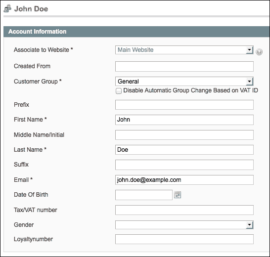

## 工作原理...

`customer`属性的安装方式与通过代码添加`product`属性相同。唯一的大区别是实体类型。将字段添加到客户的后台表单并不像添加产品那样简单。对于客户，要在表单中显示的字段存储在`eav_form_attribute`表中。

在渲染表单时，Magento 将从该表中获取数据，并根据属性中的配置渲染字段。客户地址是与客户实体相关的另一个 EAV 实体。向客户地址添加属性的方式与添加客户实体相同。

# 使用源模型

Magento 与许多下拉字段一起工作，您可以在应用程序的表单中选择这些字段。此外，我们还可以在我们的自定义字段中使用下拉字段。

下拉或多选字段总是有可以在该字段中选择选项。为了渲染这些选项，Magento 使用一个返回选项的类。这样的类被称为**源模型**。

在这个菜谱中，我们将了解 Magento 使用的源模型以及如何为自定义配置字段创建自定义源模型。

## 准备工作

对于这个菜谱，我们将创建一个与自定义配置字段链接的源模型。这是在`Packt_Helloworld`模块中完成的，我们将在本菜谱中扩展它。

## 如何操作...

以下步骤描述了如何为表单字段创建自己的源模型。

1.  我们必须首先创建的是一个下拉类型的配置字段。这与正常配置的语法相同。在`Packt_Helloworld`模块的`system.xml`文件中，在`<fields>`标签下添加以下配置：

    ```php
    <is_enabled translate="label">
      <label>Enabled</label>
      <frontend_type>select</frontend_type>
      <sort_order>10</sort_order>
      <show_in_default>1</show_in_default>
      <show_in_website>1</show_in_website>
      <show_in_store>1</show_in_store>
    </is_enabled>
    ```

1.  清除缓存并转到配置页面。您将看到有一个没有选项的下拉字段。要创建选项，我们必须将源模型链接到它。以下代码向字段添加了**是**/**否**选项。在`is_enabled`标签下添加此代码：

    ```php
    <source_model>adminhtml/system_config_source_yesno</source_model>
    ```

1.  要创建我们自己的源模型，我们必须创建一个`Model`实例。创建`Packt_Helloworld_Model_Source_Config_Relation`类。我们可以通过在`app/code/local/Packt/Helloworld/Model/Source/Config`文件夹中创建一个`Relation.php`文件来实现。将以下内容添加到该文件中：

    ```php
    <?php
    class Packt_Helloworld_Model_Source_Config_Relation
    {
      public function toOptionArray()
      {
        return array(
          array(
            'value' => null,
            'label'=>Mage::helper('helloworld')->__('--Please Select--'),
          ),
          array(
            'value' => 'bronze',
            'label'=>Mage::helper('helloworld')->__('Bronze'),
          ),
          array(
            'value' => 'silver',
            'label'=>Mage::helper('helloworld')->__('Silver'),
          ),
          array(
            'value' => 'gold',
            'label'=>Mage::helper('helloworld')->__('Gold'),
          ),
        );
      }
    }
    ```

1.  要将之前创建的源模型链接到块，我们必须更改`system.xml`文件中的`source_model`行。将行更改为以下内容：

    ```php
    <source_model>helloworld/source_config_relation</source_model>
    ```

1.  清除缓存后，您将看到字段的选项已根据源模型的输出更改，如图所示：

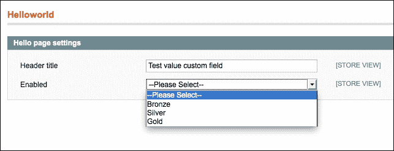

## 工作原理...

源模型是一个具有`toOptionArray()`函数的模型实例。此函数返回一个包含源数组中所有项目的数组。此数组具有以下格式：

```php
array(
  array(
    'value' => '0',
    'label' => 'Label option 0',
  ),
  array(
    'value' => '1',
    'label' => 'Label option 1',
  )
)
```

`value`键是下拉列表中`<option>`的值。`label`键是出现在下拉列表中的文本。

在这个配方中，我们为配置字段配置了一个源模型。我们还可以在以下情况下使用源模型：

+   后端的产品属性

+   后端中的客户属性

+   后端表单的附加信息

+   后端网格中的下拉筛选器

源模型的配置主要是在字段的配置中完成的。对于 EAV 表单，源模型的信息存储在数据库中的属性配置中。

当保存下拉或多选字段时，它总是保存在数据库的单个字段中。如果一个字段是下拉字段，则在该字段中存储一个值。当字段是多选字段时，所选值的逗号分隔列表将保存在该字段中。
