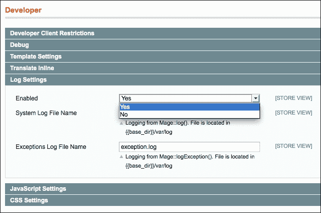
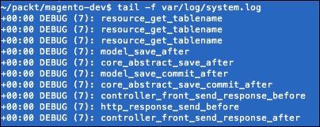
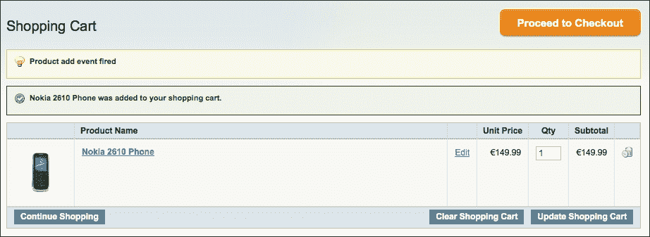
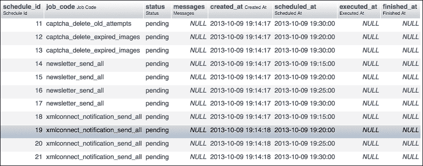
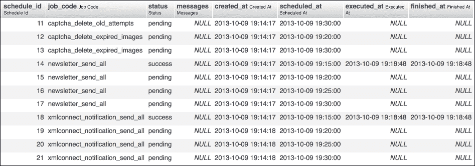
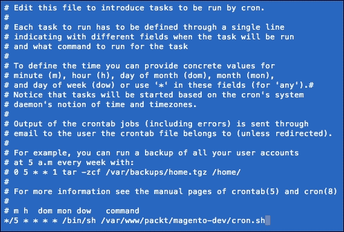
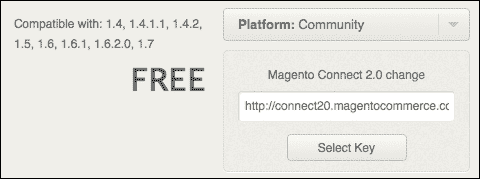
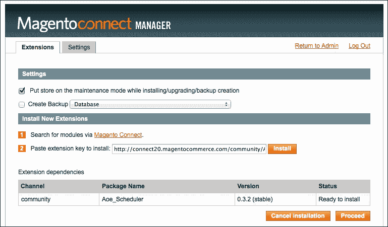
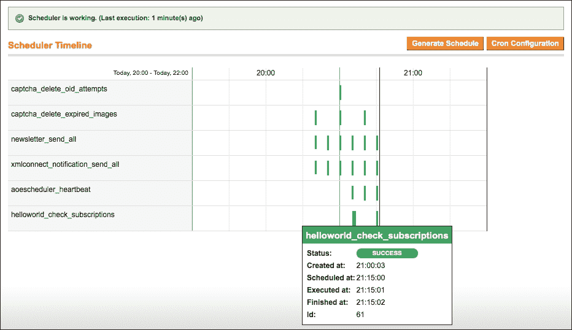

# 第八章。事件处理程序和计划任务

在本章中，我们将涵盖以下主题：

+   理解 Magento 事件类型

+   创建您自己的事件

+   添加事件监听器

+   计划任务的介绍

+   创建新的计划任务

+   测试您的新计划任务

# 简介

在 Magento 的电子商务流程中，当访客从您的商店购买东西时，会发生许多事件。他或她将产品添加到购物车，选择支付方式，登录等。

Magento 通过 `Mage::dispatchEvent()` 函数分发这些事件，您有机会挂钩到事件以执行您的工作。这就像在 JavaScript 中挂钩到点击事件一样。

观察者设计模式用于实现事件处理系统。在安装过程中发生事件，配置将调用观察者类中的正确函数来执行。

Magento 的计划任务系统建立在相同的设计模式之上。计划任务在配置中进行设置。当计划任务运行时，Magento 将检查时间段并执行与配置匹配的任务。

# 理解 Magento 事件类型

与事件监听器一起工作比重写核心类更好。在分析一个过程时，考虑如何操作以及是否可以与 Magento 事件一起工作是很重要的。

在我们能够这样做之前，我们必须查看哪些事件可用，它们何时被触发，以及事件中发送了哪些参数。

## 准备工作

在本食谱中，我们将探讨 Magento 事件系统的工作原理。我们将使用 Magento 日志系统来调试核心类，以查看哪些事件可用以及它们何时被触发。

## 如何操作...

按照以下说明操作以查看事件系统的工作情况：

1.  当调试某些内容时，建议您启用 Magento 日志。您可以通过在后台配置它来实现。导航到 **系统** | **配置** | **高级** | **开发者**。将 **启用** 参数配置如下所示：

    ### 小贴士

    您还可以在命令行工具中运行 wiz 命令 `wiz devel-logging yes` 以启用日志。

1.  Magento 事件通过 `Mage::dispatchEvent()` 函数分发。要调试此函数，我们必须编辑它。`Mage::dispatchEvent()` 函数将调用 `app/code/core/Mage/Core/Model/App.php` 文件中的 `dispatchEvent()` 函数。要编辑此文件，我们必须将其复制到 `app/code/local/Mage/Core/Model` 文件夹中。如果该文件夹不存在，则创建它并将文件复制进去。

1.  在该文件中，搜索 `dispatchEvent()` 函数。在该函数的第一行中，添加 `Mage::log($eventName);` 以在日志文件中打印事件名称。该函数的开始部分将类似于以下代码片段：

    ```php
    public function dispatchEvent($eventName, $args)
    {
     Mage::log($eventName);
      foreach ($this->_events as $area=>$events) {
        if (!isset($events[$eventName])) {
          $eventConfig = $this->getConfig()-
          >getEventConfig($area, $eventName);
          if (!$eventConfig) {
            $this->_events[$area][$eventName] = false;
            continue;
          }
          $observers = array();
          foreach ($eventConfig->observers->children() as 
          $obsName=>$obsConfig) {
                ...
    ```

1.  清除缓存并重新加载前端页面。

1.  看一下 `var/log/system.log` 文件。通过使用 `tail -f` 命令，你可以实时看到文件的变化。在命令行中，转到你的 Magento 安装目录并运行以下命令：

    ```php
    tail -f var/log/system.log

    ```

    这将给出以下输出：

    

1.  当重新加载新页面时，你会在 Magento 的日志文件中看到打印了许多事件。

1.  现在已经足够进行调试了。是时候移除文件 `app/code/local/Mage/Core/Model/App.php`。

## 它是如何工作的...

我们首先做的事情是启用 Magento 日志。这建议在开发环境中使用，因为所有的调试消息都打印在 `var/log/system.log` 文件中。

### 小贴士

PHP 警告和通知也会打印在这个文件中，因此在开发时查看它是有推荐的。

要打印调试消息，我们使用了 `Mage::log()` 函数。此函数的第一个参数是你想要调试的消息。如果参数是对象或数组，Magento 将在日志文件中打印变量的转储。

第二个参数是日志级别。当未指定时，使用错误级别 `DEBUG`。此参数需要一个数值。这些值在 `Zend_Log` 类的 `const` 变量中设置，如下所示：

+   `Zend_Log::EMERG`

+   `Zend_Log::ALERT`

+   `Zend_Log::CRIT`

+   `Zend_Log::ERR`

+   `Zend_Log::WARN`

+   `Zend_Log::NOTICE`

+   `Zend_Log::INFO`

+   `Zend_Log::DEBUG`

使用第三个参数，你可以配置一个文件，该文件位于 `var/log` 文件夹中，需要打印日志消息。当此参数为空时，默认文件 `system.log` 被使用。

第四个也是最后一个参数是一个布尔值，你可以强制始终打印日志消息（即使 Magento 的日志记录设置为关闭）。

当使用 `Mage::log()` 函数时，你将打印调试数据，而不会改变 PHP 进程的输出。

对于每一个在 Magento 中的请求，都会触发许多事件。因此，在 Magento 流程中集成和执行自定义代码有许多方法。

与事件一起工作比重写 Magento 的核心类要好。当你重写核心类时，在升级 Magento 或安装第三方模块时，你的代码可能会变得不兼容。

当你与事件一起工作时，你将在 Magento 上创建一个扩展，而不是在重写核心类时创建修改。

因此，考虑你希望在 Magento 中执行自定义代码的方式是好的。

## 参见

Magento 事件的完整列表可以在以下位置找到：[`www.magentocommerce.com/wiki/5_-_modules_and_development/reference/magento_events`](http://www.magentocommerce.com/wiki/5_-_modules_and_development/reference/magento_events)。

在处理自定义模块时，请确保这个列表不是完整的，因为它们可能有它们自己的事件。

# 创建自己的事件

当我们想要创建自己的事件时，我们必须使用自定义名称来触发它。在这个菜谱中，我们将学习事件是如何被触发的，以及我们可以使用我们将要传递的参数做什么。

## 准备工作

我们将创建一个事件，当访问者打开`Packt_Helloworld`模块的`helloAction()`函数时，该事件将被触发。在这个菜谱中，我们将基于在第四章、*创建模块*、第六章、*数据库和模块*和第七章、*Magento 后端*中创建的`Packt_Helloworld`模块进行扩展。如果您愿意，您可以安装起始文件。

## 如何操作...

以下步骤描述了我们可以如何触发我们自己的事件。

1.  打开`Packt_Helloworld`模块的`IndexController`。在这个控制器中，有一个`helloAction()`函数，我们将在这里工作以触发事件。

1.  要触发一个事件，使用`Mage::dispatchEvent()`函数。当我们更改`helloAction()`函数的代码为以下代码时，我们将触发一个名为`helloworld_register_visit`的事件：

    ```php
    public function helloAction()
    {
      $this->loadLayout();
      Mage::dispatchEvent('helloworld_register_visit');

      $this->renderLayout();
    }
    ```

1.  每次页面重新加载时，都会触发事件。因为没有添加监听器，所以不会发生任何事情。为了测试代码是否正常工作，您需要像在之前的菜谱中那样调试`Mage_Core_Model_App::dispatchEvent()`函数。您可以在文件`app/code/core/Mage/Core/Model/App.php`中找到这个函数。

1.  我们将要做的第二件事是为事件添加两个参数。例如，我们将向事件发送一个产品和分类。我们将使用第二个参数来发送参数。这个参数接受一个包含对象的键值数组。以下代码显示了如何向事件发送参数：

    ```php
    public function helloAction()
    {
      $this->loadLayout();

      $parameters = array(
        'product' => Mage::getModel('catalog/product')-
        >load(166),
        'category' => Mage::getModel('catalog/category')-
        >load(10),
      );

      Mage::dispatchEvent('helloworld_register_visit', 
      $parameters);

      $this->renderLayout();
    }
    ```

### 小贴士

确保产品分类 ID 存在于您的网店中。如果不存在，您可以使用您的网店中存在的另一个 ID。

## 它是如何工作的...

`Mage::dispatchEvent()`函数在 Magento 中触发一个事件。当这个函数被调用时，Magento 将查找配置并执行匹配的事件观察者函数，在 Magento 世界中也称为观察者。

您可以在任何您想要的上下文中使用`Mage::dispatchEvent()`函数，因此如果您需要，您需要决定将其放置在哪里。

# 添加事件观察者

当您想要挂钩到事件时，会使用事件监听器（观察者）。在之前的菜谱中，我们触发了一个事件。在这个菜谱中，我们将捕获事件并查看当事件在网站上发生时，我们如何执行自定义代码。

## 准备工作

对于这个菜谱，我们将添加两个事件观察者。第一个观察者将捕获我们在之前的菜谱中创建的事件。第二个事件监听器（观察者）将挂钩到产品的“添加到购物车”操作。

## 如何操作...

以下步骤描述了您可以使用事件观察者做什么：

1.  要监听`helloworld_register_edit`事件，我们必须向`Packt_Helloworld`模块的`config.xml`文件添加配置。在`<global>`标签下添加以下代码：

    ```php
    <events>
      <helloworld_register_visit>
        <observers>
          <register_visit>
            <type>singleton</type>
            <class>helloworld/observer</class>
            <method>registerVisit</method>
          </register_visit>
        </observers>
      </helloworld_register_visit>
    </events>
    ```

1.  我们刚刚配置了一个观察者，该观察者触发`helloworld/observer`类中的`registerVisit()`函数。我们必须创建`Packt_Helloworld_Model_Observer`类。创建文件`app/code/local/Packt/Helloworld/Model/Observer.php`，内容如下：

    ```php
    <?php
    class Packt_Helloworld_Model_Observer
    {
      public function registerVisit (Varien_Event_Observer
      $observer)
      {
        Mage::log('Registered');
      }
    }
    ```

1.  我们可以通过触发事件来测试事件观察者。事件在页面`http://magento-dev.local/helloworld/index/hello`上触发。导航到该文件并检查 Magento 日志文件（`var/log/system.log`）中的调试消息。

1.  观察者函数在 Magento 日志文件中打印调试消息。让我们看看我们与事件一起发送的参数。这些参数在函数中以`$observer`对象的形式发送。要获取产品和类别，将`registerVisit()`操作更改为以下代码以调试产品和类别：

    ```php
    public function registerVisit ($observer)
    {
      $product = $observer->getProduct();
      $category = $observer->getCategory();

      Mage::log($product->debug());
      Mage::log($category->debug());
    }
    ```

1.  在下一部分，我们将挂钩到“添加到购物车”事件。当用户将产品添加到购物车时，我们必须检查数量是否为奇数。如果不是，我们必须显示一个错误消息，说明产品不能添加到购物车。

1.  要做到这一点，我们必须为事件`checkout_cart_product_add_after`创建一个事件监听器（观察者）。我们通过在`Packt_Helloworld`模块的`config.xml`文件中添加以下代码来实现。在`<events>`标签下粘贴以下代码：

    ```php
    <checkout_cart_product_add_after>
      <observers>
        <check_cart_qty>
          <type>singleton</type>
          <class>helloworld/observer</class>
          <method>checkCartQty</method>
        </check_cart_qty>
      </observers>
    </checkout_cart_product_add_after>
    ```

1.  这将调用观察者类中的`checkCartQty()`函数。当事件被触发时，以下代码将显示一个通知消息：

    ```php
    public function checkCartQty ($observer)
    {
      Mage::getSingleton('checkout/session')-
      >addNotice('Product add event fired');
    }
    ```

1.  清除缓存并添加一个产品到购物车。当添加产品时，消息将出现在购物车页面，如下截图所示：

1.  现在，我们必须添加以下代码来检查数量是奇数还是偶数。此代码从观察者获取数量，并添加对奇数或偶数的检查：

    ```php
    public function checkCartQty ($observer)
    {
      if ($observer->getProduct()->getQty() % 2 == 0) {
        //Even
      } else {
        //Odd
      }
    }
    ```

1.  当数量为偶数时，我们必须显示一个通知。当数量为奇数时，我们必须取消“添加到购物车”操作并显示一条消息。我们可以通过抛出异常来实现。在事件观察者中，我们永远不能使用返回值。为了正确工作，检查函数将类似于以下代码：

    ```php
    public function checkCartQty (Varien_Event_Object $observer)
    {
      if ($observer->getProduct()->getQty() % 2 == 0) {
        //Even
        Mage::getSingleton('checkout/session')->addNotice('Even
        quantity added');
      } else {
        //Odd
        Mage::throwException('Quantity is odd. It needs to be
        even');
      }
    }
    ```

1.  清除缓存并添加一个数量为偶数和奇数的产品到购物车。您将看到奇数数量将导致错误消息。

## 它是如何工作的...

事件监听器（观察者）总是在`config.xml`文件中进行配置。当我们查看配置时，每个标签都有自己的用途：

```php
<events>
  <helloworld_register_visit>
    <observers>
      <register_visit>
        <type>singleton</type>
        <class>helloworld/observer</class>
        <method>registerVisit</method>
      </register_visit>
    </observers>
  </helloworld_register_visit>
</events>
```

`<events>`标签是定义事件根标签。根据需要执行的事件范围，`<events>`标签可以在`<global>`、`<frontend>`或`<admin>`标签下进行配置。

在`<events>`标签下，我们找到了`<helloworld_register_visit>`标签。标签的名称是将被观察的事件的名称。观察者在子标签中定义。

在`<helloworld_register_visit>`标签下，你可以看到一个`<observers>`子标签。在这个标签中，所有观察者都被声明。

在这个配方中，我们有一个`register_visit`观察者。在`<observers>`标签下声明的观察者需要有一个唯一名称。当使用现有名称时，你将覆盖现有观察者的配置。

观察者标签（`register_visit`）有以下子标签：

+   `<type>`：这是调用类的设计模式，通常是`singleton`或`model`

+   `<class>`：这是类的 Magento 路径

+   `<method>`：这是要执行的方法

前一个事件将在使用`dispatchEvent()`函数触发事件时执行配置的类和函数。

对于每个观察者函数，都会传递一个`$observer`对象。这个变量是`Varien_Event_Observer`类的实例。这个类扩展了`Varien_Object`类，并包含一些额外的与事件相关的函数。

事件观察者函数的返回参数将被忽略。当使用事件观察者时，你必须查看`Mage::dispatchEvent()`函数放置的上下文。

有时，它被放置在一个`try-catch`结构中，如本配方中的`checkout_cart_product_add_after`事件。在其他情况下，你可以像`model_save_before`事件那样更改传递的对象的值。

# 介绍 cron 作业

Cron 作业或计划任务是后台进程，使你的 Magento 网店保持运行。以下是一些 cron 作业的示例：

+   发送新闻通讯

+   重新计算下一天的目录促销规则

+   清理访客日志

+   发送产品库存和价格警报邮件

+   更新货币汇率

如果服务器上未配置 cron 作业，经过一段时间后，你将看到你的网店出现问题。

## 准备工作

在这个配方中，我们将学习如何在服务器上配置 cron 作业并验证它们是否正在运行。通过 SSH 连接到你的服务器，并准备好执行一些服务器配置。

## 如何做...

以下步骤描述了如何在你的服务器上配置 cron 作业：

1.  实际上，我们必须每五分钟配置一次 cron 作业。为此，执行以下命令：

    ```php
    /bin/sh /var/www/packt/magento-dev/cron.sh

    ```

    ### 小贴士

    为了避免权限问题，你必须以 Apache 用于服务 HTTP 请求的用户身份运行此命令。在我们的设置中，此用户是`www-data`。

1.  当你执行前面的命令时，数据库中的 cron 作业表将更新为最近的 cron 作业。在`cron_schedule`表中，你可以看到接下来 30 分钟的队列。在你的数据库客户端中运行以下命令以查看表的内容：

    ```php
    SELECT * from CRON_SCHEDULE;

    ```

    此查询将给出以下输出：

    

1.  在`scheduled_at`列中，您可以看到 cronjob 计划运行的时间。在`scheduled_at`时间之后运行`cron.sh`脚本后，我们必须再次运行查询。这将给出以下输出：

1.  要运行 cronjob，我们必须使用 Linux 服务器上的 crontab 文件。要配置它，我们必须切换到`www-data`用户。我们可以通过运行以下命令来完成此操作：

    ```php
    sudo su www-data

    ```

1.  接下来，我们必须配置 cronjob。我们可以通过运行`crontab -e`命令来完成此操作。这将打开一个文件，我们必须在其中放置以下截图所示的内容：

1.  保存文件后，cronjob 将每五分钟运行一次。

## 工作原理...

Magento 的 cron 脚本在 Magento 根目录下被称为`cron.sh`文件。这将通过**命令行界面**（**CLI**）执行`cron.php`文件。在这个`cron.php`文件中，启动了 Magento 应用程序并初始化了 cron 进程。

当 cron 进程初始化时，Magento 将查看`cron_schedule`表。所有具有过去`scheduled_at`字段的预定 cronjob 都将被执行。当一个任务开始时，`executed_at`字段将更新为当前时间戳。

当一个任务完成后，`finished_at`字段将更新为当前时间戳。同时，状态也将更新。当状态为错误时，消息字段将更新为错误信息。

当进程完成后，Magento 将为接下来的 30 分钟创建一个队列。根据配置文件，Magento 知道每次需要安排哪个 cronjob。

# 创建一个新的 cronjob

cronjob 在 Magento 模块的`config.xml`文件中定义。像这些文件中的每个配置一样，cronjob 配置很容易在我们的模块中扩展。在本教程中，我们将学习如何为 Magento 安装创建额外的 cronjob。

## 准备工作

执行 cronjob 的工作流程基本上与处理事件相同。我们必须在`config.xml`文件中配置一个观察者函数，该函数将在 cronjob 执行时被调用。

在`Packt_Helloworld`模块中，我们将创建一个 cronjob，该 cronjob 将在数据库中保存一些数据。

## 如何操作...

按照以下步骤进行，以查看配置额外 cronjob 所需的配置：

1.  我们必须在`config.xml`文件中创建一个 crontab 配置。以下配置将完成此操作。将以下内容粘贴到文件`app/code/local/Packt/Helloworld/etc/config.xml`中的`<config>`标签下：

    ```php
    <crontab>
      <jobs>
        <helloworld_check_subscriptions>
          <schedule>
            <cron_expr>* 10 * * *</cron_expr>
          </schedule>
          <run>
            <model>helloworld/observer::checkSubscriptions
            </model>
          </run>
        </helloworld_check_subscriptions>
      </jobs>
    </crontab>
    ```

1.  清除缓存并验证配置是否正常工作，请在您的终端中运行以下命令：

    ```php
    wiz config-get crontab/jobs

    ```

    此命令将列出配置中的所有 cronjob。

    如果`helloworld_check_subscriptions`代码在列表中，这意味着配置正在正常工作。

1.  当配置正确时，我们必须创建观察者函数。在`run`/`model`标签中，我们将调用`Packt_Helloworld_Model_Observer`类中的`cronListener()`动作。如果该类不存在，则创建它，并在其中添加`checkSubscriptions()`函数。该函数将类似于以下代码：

    ```php
    public function checkSubscriptions()
    {
      $subscription = Mage::getModel('helloworld/subscription');
      $subscription->setFirstname('Cron');
      $subscription->setLastname('Job');
      $subscription->setEmail('cron.job@example.com');
      $subscription->setMessage('Created by cronjob');

      $subscription->save();
    }
    ```

    当 cron 执行时，这将保存一个`subscription`实体到`subscriptions`表中。

## 它是如何工作的...

当你查看 cronjob 配置时，你首先看到的 XML 标签是 cronjob 代码。这必须在所有模块中是唯一的。如果它存在，你将覆盖现有标准 cronjob 的设置。

一个好的做法是以你用来注册模块模型（`helloworld`、`catalog`等）的名称开始 cronjob 代码。此代码后面跟着你想要执行的操作。

### 小贴士

cronjob 代码始终是小写字母。空格被下划线替换。

在更深的层次上，你可以看到`<schedule>`和`<run>`标签。

在`<schedule>`标签中，我们可以配置 cronjob 的间隔。此配置包含五个参数，代表以下配置：

+   分钟

+   小时

+   日期

+   月份

+   年份

类似于`0 10 * * *`的配置将在每天上午 10:00 运行。这意味着每个工作日、每个月、每天，在 10 小时和 0 分钟。

`<run>`标签仅初始化在 cron 需要执行时调用的观察者类和函数。无法向该函数发送参数。

# 测试你的新 cronjob

当你开发一个新的 cronjob 时，测试它并不那么容易。你不会等到 cron 执行，因为你将浪费很多时间。

在**Magento Connect**上有一个模块可以使 cronjob 的测试变得简单。此模块允许你从后台或命令行运行 cronjob。

它还向后台添加了一个视图，这是一个`cron_schedule`表的图形表示。

## 准备工作

我们将在我们的 Magento 安装上安装来自 Magento Connect 的模块。有关该模块的更多信息，请参阅：[`www.magentocommerce.com/magento-connect/aoe-scheduler.html`](http://www.magentocommerce.com/magento-connect/aoe-scheduler.html)。

## 如何操作...

以下步骤描述了模块测试 cronjob 的工作流程：

1.  通过从 Magento Connect 获取扩展密钥来安装模块。确保使用以下截图所示的**Magento Connect 2.0**密钥：

1.  在 Magento Connect Manager 中粘贴扩展密钥。导航到**系统** | **Magento Connect** | **Magento Connect Manager**，粘贴扩展密钥，然后点击以下截图所示的**安装**按钮：

1.  当你继续操作时，Magento Connect Manager 会将模块安装到安装目录。

    ### 小贴士

    有可能 Magento Connect Manager 无法安装该模块。如果真的如此，你可以使用网站 [`freegento.com/ddl-magento-extension.php`](http://freegento.com/ddl-magento-extension.php) 下载模块的已准备好粘贴的格式。

1.  当你返回到管理员界面时，你将看到在 **系统** 部分下添加了一个菜单项。当你导航到 **系统** | **调度器** | **调度配置** 时，你将看到所有可用 cron 作业的列表。

1.  要运行一个 cron 作业，你必须在网格中选择一个。之后，在网格上方的下拉菜单中选择 **立即运行**，然后点击 **提交**。这将直接运行你的 cron 作业。

1.  当你导航到 **系统** | **调度器** | **时间线视图** 时，你将在时间线上看到 cron 作业的信息，如下面的截图所示：

1.  在 Magento 根目录的 `shell` 文件夹中，该模块通过命令行添加了一个 shell 脚本来测试 cron 作业。这是 `scheduler.php` 文件，它有以下选项：

    +   action (`runNow` 或 `scheduleNow`)

    +   code (cron 作业代码)

1.  当你在 Magento 根目录下时，通过命令行运行我们的 cron 作业的命令如下：

    ```php
    php shell/scheduler.php -action runNow -code cronjob_code

    ```

1.  之前的命令直接运行了 cron 作业。当你想要使用当前时间戳来安排 cron 作业（这样它将在下一次 cron 运行时执行）时，我们必须使用 `scheduleNow` 动作。使用此选项时，命令看起来如下：

    ```php
    php shell/scheduler.php -action scheduleNow -code cronjob_code

    ```

## 它是如何工作的...

`Aoe_Scheduler` 模块向后台添加了一个界面，简化了测试 cron 作业的过程。它只是在 `cron_schedule` 表上的一个图形界面。

当你在模块中处理 cron 作业时，此模块推荐使用，可以节省大量时间。

该 shell 脚本被添加来通过命令行测试 cron 作业。确保当你通过 PHP CLI 运行 cron 作业或在浏览器中运行它时，使用的是其他 PHP 设置。Apache 请求使用 Apache php.ini 设置，而命令行 PHP 使用 PHP CLI 设置。
