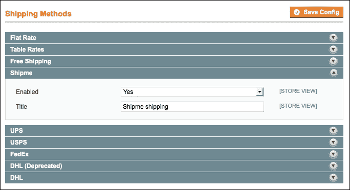
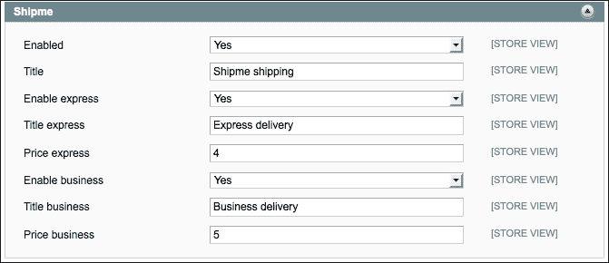
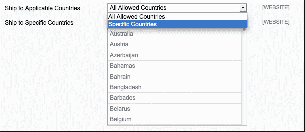
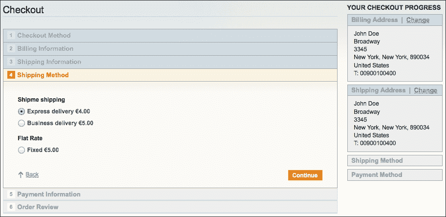
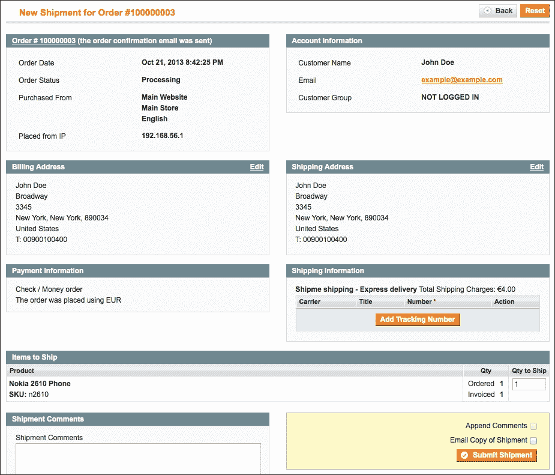
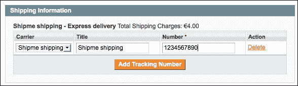

# 第九章。创建配送模块

在本章中，我们将涵盖以下主题：

+   初始化模块配置

+   编写适配器模型

+   扩展配送方法功能

+   在前端添加模块

# 简介

将订购的产品配送给客户是电子商务流程中的关键部分。在大多数情况下，店主与配送处理商有合同，每个人都有自己的业务规则。

在标准 Magento 中，以下配送处理程序得到支持：

+   DHL

+   FedEx

+   UPS

+   USPS

如果您的处理程序不在列表中，请查看 Magento Connect 上是否有可用的模块。如果没有，您可以配置标准配送方法，或者您可以创建自己的，我们将在本章中这样做。

# 初始化模块配置

在第四章“创建模块”中，我们学习了如何创建自定义模块。在本食谱中，我们将创建一个配送模块所需的文件，我们将使用本章的食谱扩展更多功能。

## 准备工作

使用 Magento 项目打开您的代码编辑器。同时，获取后端访问权限，我们将检查一些内容。

## 如何操作...

以下步骤描述了我们可以如何为配送模块创建配置：

1.  创建以下文件夹：

    +   `app/code/local/Packt/`

    +   `app/code/local/Packt/Shipme/`

    +   `app/code/local/Packt/Shipme/etc/`

    +   `app/code/local/Packt/Shipme/Model/`

    +   `app/code/local/Packt/Shipme/Model/Carrier`

1.  在`app/etc/modules`文件夹中创建一个名为`Packt_Shipme.xml`的模块文件，内容如下：

    ```php
    <?xml version="1.0"?>
    <config>
      <modules>
        <Packt_Shipme>
          <active>true</active>
          <codePool>local</codePool>
          <depends>
            <Mage_Shipping />
          </depends>
        </Packt_Shipme>
      </modules>
    </config>
    ```

1.  在`app/code/local/Packt/Shipme/etc/`文件夹中创建一个名为`config.xml`的文件，内容如下：

    ```php
    <?xml version="1.0" encoding="UTF-8"?>
    <config>

      <modules>
        <Packt_Shipme>
          <version>0.0.1</version>
        </Packt_Shipme>
      </modules>

      <global>
        <models>  
          <shipme>
            <class>Packt_Shipme_Model</class>
          </shipme>
        </models>
      </global>

      <default>
        <carriers>
          <shipme>
            <active>1</active>
            <model>shipme/carrier_shipme</model>
            <title>Shipme shipping</title>

            <express_enabled>1</express_enabled>
            <express_title>Express delivery</express_title>
            <express_price>4</express_price>

            <business_enabled>1</business_enabled>
            <business_title>Business delivery</business_title>
            <business_price>5</business_price>
          </shipme>
        </carriers>
      </default>

    </config>
    ```

1.  清除缓存，并在后端导航到**系统** | **配置** | **高级** | **禁用模块输出**。观察`Packt_Shipme`模块是否在列表中。

1.  到目前为止，模块已初始化并开始工作。现在，我们必须创建一个`system.xml`文件，我们将在此文件中放置配送模块的配置参数。创建文件`app/code/local/Packt/Shipme/etc/system.xml`。

1.  在此文件中，我们将为我们的配送模块创建配置参数。当您将以下代码粘贴到文件中时，您将在配送方法的配置中创建一个额外的组。在这个组中，我们可以为新配送方法设置设置：

    ```php
    <?xml version="1.0" encoding="UTF-8"?>
    <config>
      <sections>
        <carriers>
          <groups>
            <shipme translate="label" module="shipping">
              <label>Shipme</label>
              <sort_order>15</sort_order>
              <show_in_default>1</show_in_default>
              <show_in_website>1</show_in_website>
              <show_in_store>1</show_in_store>
              <fields>
                <!-- Define configuration fields below -->

                <active translate="label">
                  <label>Enabled</label>
                  <frontend_type>select</frontend_type>
                  <source_model>adminhtml/
                  system_config_source_yesno</source_model>
                  <sort_order>10</sort_order>
                  <show_in_default>1</show_in_default>
                  <show_in_website>1</show_in_website>
                  <show_in_store>1</show_in_store>
                </active>

                <title translate="label">
                  <label>Title</label>
                  <frontend_type>text</frontend_type>
                  <sort_order>20</sort_order>
                  <show_in_default>1</show_in_default>
                  <show_in_website>1</show_in_website>
                  <show_in_store>1</show_in_store>
                </title>

              </fields>
            </shipme>
          </groups>
        </carriers>
      </sections>
    </config>
    ```

1.  清除缓存，并在后端导航到配送方法配置页面。为此，导航到**系统** | **配置** | **销售** | **配送方法**。您将看到添加了一个额外的组，如下面的截图所示：

1.  您将看到有一个名为**Shipme**的新配送方法。我们将为此配置添加一些值。在模块的`<fields>`标签下添加以下代码：

    ```php
    <active translate="label">
      <label>Enabled</label>
      <frontend_type>select</frontend_type>
      <source_model>adminhtml/system_config_source_yesno</source_model>
      <sort_order>10</sort_order>
      <show_in_default>1</show_in_default>
      <show_in_website>1</show_in_website>
      <show_in_store>1</show_in_store>
    </active>

    <title translate="label">
      <label>Title</label>
      <frontend_type>text</frontend_type>
      <sort_order>20</sort_order>
      <show_in_default>1</show_in_default>
      <show_in_website>1</show_in_website>
      <show_in_store>1</show_in_store>
    </title>

    <express_enabled translate="label">
      <label>Enable express</label>
      <frontend_type>select</frontend_type>
      <source_model>adminhtml/system_config_source_yesno</source_model>
      <sort_order>30</sort_order>
      <show_in_default>1</show_in_default>
      <show_in_website>1</show_in_website>
      <show_in_store>1</show_in_store>
    </express_enabled>

    <express_title translate="label">
      <label>Title express</label>
      <frontend_type>text</frontend_type>
      <sort_order>40</sort_order>
      <show_in_default>1</show_in_default>
      <show_in_website>1</show_in_website>
      <show_in_store>1</show_in_store>
    </express_title>

    <express_price translate="label">
      <label>Price express</label>
      <frontend_type>text</frontend_type>
      <sort_order>50</sort_order>
      <show_in_default>1</show_in_default>
      <show_in_website>1</show_in_website>
      <show_in_store>1</show_in_store>
    </express_price>

    <business_enabled translate="label">
      <label>Enable business</label>
      <frontend_type>select</frontend_type>
      <source_model>adminhtml/system_config_source_yesno</source_model>
      <sort_order>60</sort_order>
      <show_in_default>1</show_in_default>
      <show_in_website>1</show_in_website>
      <show_in_store>1</show_in_store>
    </business_enabled>

    <business_title translate="label">
      <label>Title business</label>
      <frontend_type>text</frontend_type>
      <sort_order>70</sort_order>
      <show_in_default>1</show_in_default>
      <show_in_website>1</show_in_website>
      <show_in_store>1</show_in_store>
    </business_title>

    <business_price translate="label">
      <label>Price business</label>
      <frontend_type>text</frontend_type>
      <sort_order>80</sort_order>
      <show_in_default>1</show_in_default>
      <show_in_website>1</show_in_website>
      <show_in_store>1</show_in_store>
    </business_price>
    ```

1.  清除缓存并重新加载后端。你现在将看到以下截图所示的**Shipme – 快递**运输方法下的其他配置：



## 工作原理...

我们首先做的事情是创建初始化模块所需的必要文件。以下是需要初始化模块的文件：

+   `app/etc/modules/Packt_Shipme.xml`

+   `app/code/local/Packt/Shipme/etc/config.xml`

在第一个文件中，我们将使用`<active>`标签激活模块。`<codePool>`标签描述了该模块位于本地代码库中，代表`app/code/local/`文件夹。

在此文件中，还有一个`<depends>`标签。首先，这将检查`Mage_Shipping`模块是否已安装。如果没有安装，Magento 将抛出异常。如果模块可用，依赖关系将在`Mage_Shipping`模块之后加载此模块。这使得重写`Mage_Shipping`模块中的一些值成为可能。

在第二个文件`config.xml`中，我们配置了在这个模块中所需的所有内容。以下是需要配置的以下事项：

+   版本号（`0.0.1`）

+   模型

+   配置值的默认值

我们最后做的事情是创建一个`system.xml`文件，以便我们可以为运输模块创建自定义配置。

`system.xml`文件中的配置向运输方法配置中添加了一些额外的值，这些值在**系统** | **配置** | **销售** | **运输方法**菜单下的后端中可用。

在这个模块中，我们创建了一个新的运输处理器，称为`Shipme`。在这个处理器中，你可以配置两个运输选项：**快递**和**商务**。在`system.xml`文件中，我们创建了配置选项可见性、名称和价格的字段。

## 参考信息

在这个配方中，我们使用了模块的`system.xml`文件来创建配置值。你可以在*扩展系统配置*配方中找到有关信息，该配方来自第七章，*Magento 后端*。

# 在前端设置运输方法的标题

在上一个配方中初始化了一个新的运输模块。在上一个配方中我们所做的是为继续本配方中将要看到的业务部分做准备。我们将添加一个具有运输方法业务逻辑的模型。这个模型被称为**适配器**类，因为 Magento 要求为每个运输方法提供一个适配器类。这个类将扩展`Mage_Shipping_Model_Carrier_Abstract`类。

这个类将用于以下事项：

+   使运输方法可用

+   计算运输费用

+   在前端设置运输方法的标题

## 如何操作...

执行以下步骤以创建用于运输方法的适配器类：

1.  如果不存在，创建`app/code/local/Packt/Shipme/Model/Carrier`文件夹。

1.  在这个文件夹中，创建一个名为`Shipme.php`的文件，并将以下内容添加到其中：

    ```php
    <?php
    class Packt_Shipme_Model_Carrier_Shipme 
      extends Mage_Shipping_Model_Carrier_Abstract
      implements Mage_Shipping_Model_Carrier_Interface
    {
      protected $_code = 'shipme';

      public function collectRates
      (Mage_Shipping_Model_Rate_Request $request)
      {
        $result = Mage::getModel('shipping/rate_result');

        //Check if express method is enabled
        if ($this->getConfigData('express_enabled'))
        {
          $method = Mage::getModel
          ('shipping/rate_result_method');
          $method->setCarrier($this->_code);
          $method->setCarrierTitle
          ($this->getConfigData('title'));

          $method->setMethod('express');
          $method->setMethodTitle
          ($this->getConfigData('express_title'));

          $method->setCost
          ($this->getConfigData('express_price'));
          $method->setPrice
          ($this->getConfigData('express_price'));

          $result->append($method);
        }

        //Check if business method is enabled
        if ($this->getConfigData('business_enabled'))
        {
          $method = Mage::getModel
          ('shipping/rate_result_method');
          $method->setCarrier($this->_code);
          $method->setCarrierTitle
          ($this->getConfigData('title'));

          $method->setMethod('business');
          $method->setMethodTitle
          ($this->getConfigData('business_title'));

          $method->setCost
          ($this->getConfigData('business_price'));
          $method->setPrice
          ($this->getConfigData('business_price'));

          $result->append($method);
        }

        return $result;
      }

      public function isActive()
      {
        $active = $this->getConfigData('active');
        return $active==1 || $active=='true';
      }

      public function getAllowedMethods()
      {
        return array('shipme'=>$this->getConfigData('name'));
      }
    }
    ```

1.  保存文件并清除缓存；现在你的适配器模型已经创建。

## 它是如何工作的...

之前创建的类处理了所有需要的运输方法业务逻辑。因为这个适配器类是`Mage_Shipping_Model_Carrier_Abstract`类的扩展，我们可以覆盖一些方法来自定义标准业务逻辑。

我们覆盖的第一个方法是`isAvailable()`函数。在这个函数中，我们必须返回`true`或`false`来说明该模块是激活的。在我们的代码中，我们将根据系统配置字段`active`激活模块。

第二个方法是`collectRates()`函数。这个函数用于为每个运输方法设置正确的参数。对于每个运输方法，我们可以设置标题和价格。

该类实现了`Mage_Shipping_Model_Carrier_Interface`接口。在这个接口中，声明了两个函数：`isTrackingAvailable()`和`getAllowedMethods()`函数。

我们在适配器类中创建了`getAllowedMethods()`函数。`isTrackingAvailable()`函数在父类`Mage_Shipping_Model_Carrier_Abstract`中声明。

我们在**Shipme**运输方法下配置了两个选项。这些选项被称为**Express delivery**和**Business delivery**。我们将检查它们是否在配置中启用，并为每个选项设置配置的标题和价格。

最后要做的事情是返回正确的值。我们必须返回一个`Mage_Shipping_Model_Rate_Result`类的实例。我们创建了一个空的实例，当方法可用时，我们将附加方法。

要添加一个方法，我们必须使用`append($method)`函数。这个函数需要一个`Mage_Shipping_Model_Rate_Result_Method`类的实例，我们在两个`if`语句中创建了它。

# 扩展运输方法功能

当所有文件安装完成后，我们可以为运输方法添加更多功能。在这个菜谱中，我们将添加国家配置，并启用运输方法的跟踪代码。

## 如何操作...

执行以下步骤以跟踪代码和特定国家运输：

1.  打开适配器文件`app/code/local/Packt/Shipme/Model/Carrier/Shipme.php`。

1.  在此文件中添加以下函数以启用跟踪代码：

    ```php
    public function isTrackingAvailable() 
    {
      return true;
    }
    ```

    现在已为`Shipme`运输方法启用了跟踪代码。

1.  要启用特定国家的运输，我们必须在模块的`system.xml`文件中添加一些配置字段。将以下代码作为`<fields>`标签的子标签添加：

    ```php
    <sallowspecific translate="label">
      <label>Ship to Applicable Countries</label>
      <frontend_type>select</frontend_type>
      <sort_order>90</sort_order>
      <frontend_class>shipping-applicable-country</frontend_class>
      <source_model>adminhtml/system_config_source_shipping
      _allspecificcountries</source_model>
      <show_in_default>1</show_in_default>
      <show_in_website>1</show_in_website>
      <show_in_store>0</show_in_store>
    </sallowspecific>

    <specificcountry translate="label">
      <label>Ship to Specific Countries</label>
      <frontend_type>multiselect</frontend_type>
      <sort_order>100</sort_order>
      <source_model>adminhtml/system_config_source_country
      </source_model>
      <show_in_default>1</show_in_default>
      <show_in_website>1</show_in_website>
      <show_in_store>0</show_in_store>
      <can_be_empty>1</can_be_empty>
    </specificcountry>
    ```

1.  清除缓存并打开运输方法的配置页面。你会看到有两个新的配置选项。当你将**Ship to Applicable Countries**改为**Specific Countries**时，你可以选择多个国家，如以下截图所示：



## 它是如何工作的...

我们首先做的事情是启用为`Shipme`发货方式创建跟踪号码的可能性。我们覆盖了`isTrackingAvailable()`函数，它返回标准的`false`。通过返回`true`，我们启用了跟踪号码。

我们做的第二件事是启用特定国家的发货。我们配置了两个具有标准命名约定的字段。当我们在后端启用配置时，我们只能在发货地址位于所选国家之一时使用发货方式。

# 在前端添加模块

在这个菜谱中，我们将测试发货方式在前端是否出现。我们在之前的菜谱中准备了代码和配置，以便实现这一点。

## 如何操作...

在这个菜谱中，我们将检查配置并使用新的发货方式下订单：

1.  登录到管理面板。

1.  通过访问**系统** | **配置** | **销售** | **发货方式**导航到发货方式页面。

1.  检查**Shipme – 快递**方式的所有值是否正确。同时确保它已启用。

1.  保存配置。

1.  前往前端，将产品添加到购物车，并结账。

1.  填写账单和发货步骤的正确数据。

1.  在发货方式步骤中，将出现新的方法，如下截图所示：

1.  从列表中选择一个方法并点击**继续**按钮。

1.  在支付方式步骤中，选择**支票汇款**方法。

    ### 小贴士

    如果你看不到**支票汇款**支付方式，你必须在其系统配置中启用它。

1.  点击**继续**并下订单。你将看到成功页面。

1.  在后端，前往**销售** | **订单**并点击最新的订单。

1.  为了完成订单，我们必须为它创建一个发票以确认订单已付款。当你点击**发票**按钮时，你将被重定向到发票表单，你可以提交你的发票。

1.  当发票保存时，你会看到订单状态已变为**处理中**。当状态为**处理中**时，你可以点击**发货**按钮来创建发货。你将看到以下屏幕：

1.  当你点击**添加跟踪号码**按钮时，从下拉菜单中选择**Shipme 发货**选项，并添加一个跟踪号码，例如`1234567890`：

1.  当你点击**提交发货**按钮时，你的发货将被处理，订单状态将变为**完成**。

## 它是如何工作的...

在这个菜谱中，我们测试了本章中创建的发货方式。我们使用新的发货方式下订单，以检查一切是否按预期工作。
