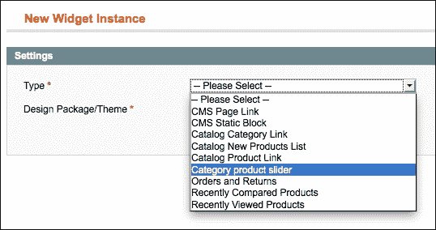
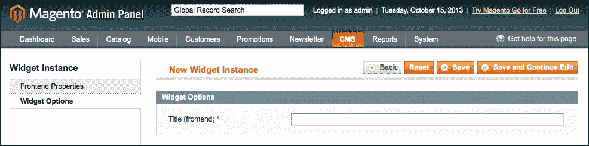
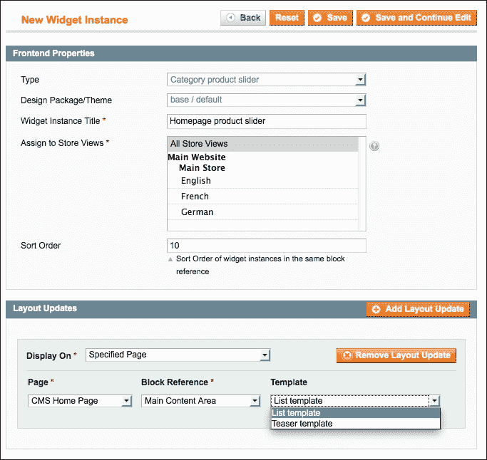
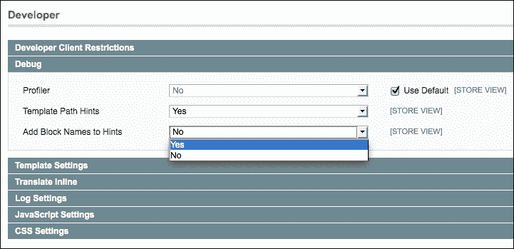
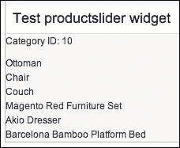
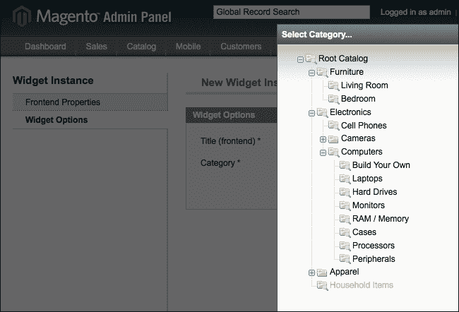
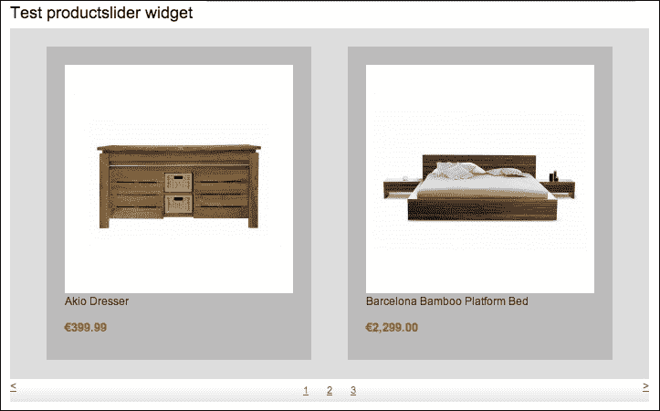

# 第十章。创建产品滑块小部件

在本章中，我们将涵盖以下主题：

+   创建一个空模块

+   注册帮助器和块

+   创建小部件配置文件

+   创建块和模板文件

+   创建自定义配置参数

+   完成主题设计

# 简介

Magento 小部件是前端中配置块的图形界面。对于每个小部件，都有一个可用的配置页面，您可以在其中设置该小部件所需的所有值。

配置完成后，您可以配置布局指令，以在多个前端位置显示小部件。

在这个菜谱中，我们将创建一个新的模块，在这个模块中我们将创建自己的小部件。我们将创建一个产品滑块，它将展示一个类别中的产品，我们可以在小部件中配置这些产品。

当我们为小部件完成了所需的配置后，我们将在前端完成其表示。我们将创建一个产品列表，我们将使用 jQuery 滑块脚本对其进行样式设计。

# 创建一个空模块

正如我们在上一章中做的那样，并在第四章中完全解释了，我们将创建创建空模块所需的所有文件，该模块将在后续章节中通过小部件配置进行扩展。

我们将从一个空的 Magento 模块开始，我们将在本菜谱中创建它。我们将创建所有必要的文件来初始化一个新模块，该模块可用于创建小部件。

## 准备工作

打开您的代码编辑器，准备创建一个名为`Packt_Productslider`的新模块。

## 如何做到这一点...

当您执行以下步骤时，您将创建一个空的`Packt_Productslider`模块：

1.  为该模块创建以下文件夹：

    +   `app/code/local/`

    +   `app/code/local/`

    +   `app/code/local/Packt/Productslider/`

    +   `app/code/local/Packt/Productslider/etc`

1.  在`app/etc`文件夹下的`modules`文件夹中创建模块文件`Packt_Productslider.xml`。

1.  将以下代码粘贴到其中：

    ```php
    <?xml version="1.0"?>
    <config>
      <modules>
        <Packt_Productslider>
          <active>true</active>
          <codePool>local</codePool>
          <depends>
            <Mage_Widget />
          </depends>
        </Packt_Productslider>
      </modules>
    </config>
    ```

1.  创建模块的配置文件。这是位于`app/code/local/Packt/Productslider`文件夹下的`etc`文件夹中的`config.xml`文件。

1.  将以下内容添加到文件中：

    ```php
    <?xml version="1.0" encoding="UTF-8"?>
    <config>
      <modules>
        <Packt_Productslider>
          <version>0.0.1</version>
        </Packt_Productslider>
      </modules>
    </config>
    ```

1.  清除缓存并检查模块是否已安装。您可以通过导航到配置页面，**系统** | **配置** | **高级** | **高级**，检查模块是否在列表中。或者，您可以在命令行中运行命令`wiz module-list`。

## 它是如何工作的...

我们刚刚创建了一个名为`Packt_Productslider`的新模块。这是一个自定义模块，因此我们在本地代码池中进行了配置。

实际上，这个模块什么也不做，但我们将扩展它在下个菜谱中。

# 注册帮助器和块

我们将创建的小部件模块将使用自定义块。为了在块和不同的配置中翻译字符串，我们需要配置一个帮助类。

## 准备工作

我们将初始化块和助手，并为我们的模块创建默认的助手，就像我们在第四章中做的那样，*创建模块*。

## 如何做...

以下步骤描述了如何为新模块配置助手和块。

1.  创建以下文件夹：

    +   `app/code/local/Packt/Productslider/Block`

    +   `app/code/local/Packt/Productslider/Helper`

1.  在模块的 `config.xml` 文件中，在 `<config>` 标签下添加以下配置：

    ```php
    <global>
      <blocks>
        <productslider>
          <class>Packt_Productslider_Block</class>
        </productslider>
      </blocks>
      <helpers>
        <productslider>
          <class>Packt_Productslider_Helper</class>
        </productslider>
      </helpers>
    </global>
    ```

1.  在 `app/code/local/Packt/Productslider/Helper` 下创建 `Data.php` 文件，并将以下内容粘贴到其中：

    ```php
    <?php
    class Packt_Productslider_Helper_Data extends Mage_Core_Helper_Abstract
    {

    }
    ```

1.  清除缓存，您的块和助手将被注册。

## 它是如何工作的...

在前面的代码中，我们使用名称 `productslider` 初始化了块和助手。使用此配置，可以使用如 `productslider/block_name` 的块名称。

助手也以 `productslider` 的名称注册。我们创建了一个默认助手，我们可以使用函数 `Mage::helper('productslider')` 来调用它。

# 创建部件配置文件

在这个菜谱中，我们将配置一个新的部件类型。我们必须创建一个新的配置文件，在其中我们将为部件类型初始化以下内容：

+   部件名称（在后台）

+   部件配置参数

+   部件块类型

+   部件模板（`.phtml` 文件）

## 准备工作

要测试部件配置，我们可以导航到后端 **CMS** 下的 **Widgets** 页面来管理部件实例。

## 如何做...

执行以下步骤以创建 `widget.xml` 配置文件。

1.  创建文件 `app/code/local/Packt/Productslider/etc/widget.xml`。

1.  将以下代码添加到该文件中：

    ```php
    <?xml version="1.0" encoding="UTF-8"?>
    <widgets>
      <category_product_slider type="catalog/product_list">
        <name>Category product slider</name>
        <description>Displays the products for a given category
        in a slider widget</description>
      </category_product_slider>
    </widgets>
    ```

1.  清除缓存并检查配置是否生效。

1.  在后台，导航到 **CMS** | **Widgets**，点击 **Add New Widget Instance** 按钮，并确认部件在列表中，如图所示：

1.  配置前端主题的部件，并转到下一页。

1.  您现在在部件配置页面。在 **Widget Options** 选项卡中，我们将创建我们自己的部件参数。

1.  要创建一个将在块中使用的标题字段，我们必须创建一个 `parameters` 标签，如下面的代码所示。将其粘贴到 `<category_product_slider>` 标签下。

    ```php
    <parameters>
        <title>
            <label>Title (frontend)</label>
            <type>text</type>
            <required>1</required>
            <visible>1</visible>
        </title>
    </parameters>
    ```

1.  清除缓存，重新加载后台页面，并转到 **Widget Options** 选项卡。您将看到有一个标题字段可用，如图所示：

1.  要显示一个类别的所有产品，我们必须创建一个可以从中选择类别的配置。我们将创建一个文本框，可以粘贴正确的类别 ID。要配置该字段，请在 `<parameters>` 标签下添加以下代码：

    ```php
    <category_id>
      <label>Category ID</label>
      <type>text</type>
      <required>1</required>
      <sort_order>20</sort_order>
      <visible>1</visible>
    </category_id>
    ```

1.  清除缓存并重新加载页面。您将看到配置表单中添加了第二个文本框。

## 它是如何工作的...

`widget.xml` 文件用于在 Magento 安装中定义小部件。在 Magento 中，所有小部件类型都在 `<widgets>` 配置标签下定义。

在此标签下，我们定义了一个名为 `category_product_slider` 的新小部件。在这个标签中，我们使用 `type` 属性定义了小部件将引用的 `Block` 类。在这种情况下，它是 `catalog/product_list`。这是用于渲染类别产品列表或网格的块。

在 `<category_product_slider>` 标签下，我们使用了以下配置标签：

+   `name`

+   `description`

+   `parameters`

`name` 标签用于在创建小部件时在下拉菜单中使用的 widget 类型名称。

`description` 标签用于信息。它不会在前端或后端显示。它仅用于为小部件提供信息。

在 `parameters` 标签中，我们定义了小部件的配置参数。在我们的例子中，这些是 `name` 和 `category_id`。

我们的字段只是文本字段，但我们可以利用其他输入字段，如下拉框和复选框。当与下拉框或多选框字段一起工作时，我们可以使用 `<source_model>` 标签定义一个源模型。

# 创建块和模板文件

在前面的章节中，我们学习了如何配置小部件。现在是时候展示小部件了。

我们将创建一个自定义块，在其中我们将编写一个查询，返回给定类别的产品，并在小部件配置页面上设置一个配置以使用两个模板文件。

## 准备工作

我们将进一步工作以创建我们自己的小部件实例。打开我们在前一个菜谱中创建的 `widget.xml` 文件。

## 如何操作...

以下步骤描述了如何为小部件实例配置一个自定义块和自定义模板。

1.  首先，我们将创建一个扩展 `Mage_Catalog_Block_Product_List` 类的块类。我们这样做是因为那个类的行为正是我们小部件所需要的。

1.  在 `app/code/local/Packt/Productslider/Block/Catalog/Product` 下创建 `List.php` 文件。

1.  向该文件添加以下内容以初始化我们将要配置的类和函数：

    ```php
    <?php
    class Packt_Productslider_Block_Catalog_Product_List
    extends Mage_Catalog_Block_Product_List
    implements Mage_Widget_Block_Interface
    {
      protected function _beforeToHtml()
      {
        parent::_beforeToHtml();
      }

      protected function _prepareLayout()
      {
        parent::_prepareLayout();
      }
    }
    ```

1.  配置使用我们之前创建的类的块。我们通过更改 `<category_product_slider>` 标签中的 `type` 属性来实现。将属性更改为 `productslider/catalog_product_list`。

1.  当块类创建完成后，是时候为该块创建模板了。在这个小部件中，我们将使用两个模板。第一个模板包含产品的图片、标题和价格。第二个模板只显示图片和“添加到购物车”按钮。

1.  在 `app/design/frontend/base/default/template/productslider` 文件夹下的 `category-product-slider` 文件夹中创建模板。

1.  创建文件夹并添加以下文件到该文件夹：

    +   `list.phtml`

    +   `teaser.phtml`

1.  在 `list.phtml` 文件中，添加以下内容：

    ```php
    <div class="block">
      <div class="block-title">
        <h2><?php echo $this->getTitle() ?></h2>
      </div>
      <div class="block-content">
        <p>Test of the list.phtml template</p>
      </div>
    </div>
    ```

1.  在 `teaser.phtml` 文件中，添加以下内容：

    ```php
    <div class="block">
      <div class="block-title">
        <h2><?php echo $this->getTitle() ?></h2>
      </div>
      <div class="block-content">
        <p>Teasers template</p>
      </div>
    </div>
    ```

1.  配置小部件配置页面，以便您可以选择模板。我们可以通过将以下内容添加为`<parameters>`标签的子标签来完成：

    ```php
    <template>
      <label>Frontend template</label>
      <type>select</type>
      <values>
        <list translate="label">
          <value>productslider/category-product-
          slider/list.phtml</value>
          <label>List template</label>
        </list>
        <teaser translate="label">
          <value>productslider/category-product-
          slider/teaser.phtml</value>
          <label>Teaser template</label>
        </teaser>
      </values>
      <sort_order>30</sort_order>
      <visible>1</visible>
    </template>
    ```

1.  清除缓存并转到小部件配置页面。当您点击**添加布局更新**时，您可以选择小部件将显示的页面。最后一个下拉菜单是您可以为小部件使用的模板，如下面的截图所示：

    ### 小贴士

    确保您选择正确的主题来配置小部件。我们将使用默认的/默认主题来配置小部件，所以请确保您的商店使用的是相同的主题。

1.  完成表单以在主页上放置小部件实例。

1.  当您清除缓存时，小部件将带有所选模板文件的内容出现在主页上。

1.  当您启用开发者提示时，您将看到我们之前创建的自定义块被使用，如下面的截图所示：

    ### 小贴士

    您可以通过在**系统** | **配置** | **高级**下的**调试**部分导航到**开发者**页面来在后台启用开发者提示。务必在网站或存储视图范围内进行配置。

    您还可以运行`wiz devel-showhints yes`命令来启用提示。

1.  我们最后要做的就是创建一个循环，显示产品的名称。将以下代码添加到`list.phtml`文件中：

    ```php
    <?php $_productCollection = $this->getLoadedProductCollection() ?>
    <div class="block">
      <div class="block-title">
        <h2><?php echo $this->getTitle() ?></h2>
      </div>
      <div class="block-content">
        <p><?php echo $this->__('Category ID: %s',
        $this->getCategoryId()) ?></p>
        <ul>
        <?php foreach ($_productCollection as $_product): ?>
        <li><?php echo $_product->getName() ?></li>
        <?php endforeach; ?>
        </ul>
      </div>
    </div>
    ```

1.  配置小部件以使用正确的模板和有效的类别 ID。之后，重新加载前端，您将看到以下截图所示的内容：

### 小贴士

您可以在后端导航到类别时找到类别 ID。导航到**目录** | **管理类别**，选择任何类别，您将看到名称附近的 ID。

## 它是如何工作的...

我们为小部件创建了一个自定义的块类。通过配置小部件的`type`属性，所有此类小部件实例都将使用类型为`productslider/catalog_product_list`的块。

当我们查看这个类时，我们看到这个类将扩展`Mage_Catalog_Block_Product_List`类，这是用于为类别渲染产品列表的块。我们使用这个类，这样我们就可以使用标准函数而不是编写自己的函数。

我们接下来要做的是使小部件可以选择两个模板。这是通过在配置小部件的`<template>`参数上完成的。

模板在配置小部件页面的**布局更新**部分进行配置。此表单是模板文件中布局 XML 配置的图形实现。

当我们保存小部件时，Magento 将在数据库中为小部件创建一个布局更新。此布局更新存储在`core_layout_update`表中。

当我们查看模板文件时，我们看到`$this->getTitle()`函数用于填充块的标题标签。此函数将输出为块的`title`参数设置的任何数据。

在配置中，我们创建了一个`<title>`配置，当块创建时将在后台执行`setData('title')`。

第二个配置参数是`<category_id>`字段。当在这个块上设置分类 ID 时，`$this->getLoadedProductCollection()`函数将返回给定分类 ID 的产品，这正是我们在这个情况下需要的。

# 创建自定义配置参数

小部件已创建。它在前端显示，并为给定的分类 ID 显示了正确的产品。

要配置分类 ID，我们必须从分类页面复制它并粘贴到文本框中。为了提高可用性，我们将在配置字段中创建一个自定义小部件，我们可以从弹出窗口中选择一个分类。

## 准备工作

为了做好准备，查看如何在后端为**目录分类链接**小部件配置分类。我们将为之前菜谱中创建的小部件配置相同的弹出窗口。

## 如何操作...

执行以下步骤，你可以创建一个自定义配置参数：

1.  当我们查看**目录分类链接**小部件时，我们看到它们使用一个自定义小部件来选择分类——我们将在我们的模块中做同样的事情。

1.  在`widget.xml`文件中，将`<category_id>`配置参数替换为以下代码：

    ```php
    <category_id>
      <label>Category</label>
      <type>label</type>
      <helper_block>

    <type>adminhtml/catalog_category_widget_chooser</type>
        <data>
          <button translate="open">
            <open>Select Category...</open>
          </button>
        </data>
      </helper_block>
      <required>1</required>
      <sort_order>20</sort_order>
      <visible>1</visible>
    </category_id>
    ```

1.  清除缓存并重新加载组件配置页面。当你点击配置参数按钮时，你会看到如下截图：

1.  当你选择一个分类，保存小部件，清除缓存，并重新加载主页，你会看到小部件显示了错误的产品。

1.  当你检查**选择分类…**按钮并导航到一些元素以上的隐藏字段时，你会看到其值类似于`category/<category_id>`。

1.  小部件需要分类 ID，即斜杠后面的数字。我们现在有了用于生成 URL 的分类路径。为了解决这个问题，我们可以执行以下操作：

    +   使用字符串函数从路径中获取 ID

    +   确保在组件配置页面设置了正确的 ID

1.  我们将采用第二种方法，因为它是最稳定的方法。

1.  要修复这个问题，我们必须更新在组件配置页面显示的分类小部件选择器中的某些代码。我们将创建一个新的类，该类扩展了当前的小部件选择器。我们将把这个类添加到`app/code/local/Packt/Productslider/Block/Adminhtml/Category`目录下的`Widget`文件夹中。

1.  在这个文件夹中，创建一个名为`Chooser.php`的文件，内容如下：

    ```php
    <?php
    class Packt_Productslider_Block_Adminhtml_Catalog_Category_Widget_Chooser extends Mage_Adminhtml_Block_Catalog_Category_Widget_Chooser
    {
        /**
         * Block construction
         * Defines tree template and init tree params
         */

      public function prepareElementHtml(Varien_Data_Form_Element_Abstract $element)
      {
        $uniqId = Mage::helper('core')->uniqHash($element-
        >getId());
        $sourceUrl = $this->getUrl('adminhtml/
        productslider_catalog_category_widget/chooser',
        array('uniq_id' => $uniqId, 'use_massaction' =>
        false));

        $chooser = $this->getLayout()-
        >createBlock('widget/adminhtml_widget_chooser')
          ->setElement($element)
          ->setTranslationHelper($this->getTranslationHelper())
          ->setConfig($this->getConfig())
          ->setFieldsetId($this->getFieldsetId())
          ->setSourceUrl($sourceUrl)
          ->setUniqId($uniqId);

        if ($element->getValue()) {
          $categoryId = $element->getValue();

          if ($categoryId) {
            $label = Mage::getSingleton('catalog/
            category')->load($categoryId)->getName();
            $chooser->setLabel($label);
          }
        }

        $element->setData('after_element_html',
        $chooser->toHtml());
        return $element;
      }

      public function getNodeClickListener()
      {
        if ($this->getData('node_click_listener')) {
          return $this->getData('node_click_listener');
        }
        if ($this->getUseMassaction()) {
          $js = '
            function (node, e) {
              if (node.ui.toggleCheck) {
                node.ui.toggleCheck(true);
              }
            }
          ';
        } else {
          $chooserJsObject = $this->getId();
          $js = '
            function (node, e) {
              '.$chooserJsObject.'.setElementValue
              (node.attributes.id);
              '.$chooserJsObject.'.setElementLabel(node.text);
              '.$chooserJsObject.'.close();
            }
          ';
        }
        return $js;
      }
    }
    ```

1.  在上一步中，我们创建了一个新的块类来处理所选分类的返回值。在这一步中，我们将配置配置页面使用新的块。在模块的`widget.xml`文件中，将`parameters/category_id/helper_block/type`标签从`adminhtml/catalog_category_widget_chooser`更改为`productslider/adminhtml_catalog_category_widget_chooser`。`widget.xml`文件现在将如下所示：

    ```php
    <?xml version="1.0" encoding="UTF-8"?>
    <widgets>
      <category_product_slider
      type="productslider/catalog_product_list">
        <name>Category product slider</name>
        <description>Displays the products for a given category
        in a slider widget</description>
        <parameters>
          <title>
            <label>Title (frontend)</label>
            <type>text</type>
            <required>1</required>
            <sort_order>10</sort_order>
            <visible>1</visible>
          </title>
          <category_id>
            <label>Category</label>
            <type>label</type>
            <helper_block>
              <type>productslider/adminhtml_catalog_category_
              widget_chooser</type>
              <data>
                <button translate="open">
                  <open>Select Category...</open>
                </button>
              </data>
            </helper_block>
            <required>1</required>
            <sort_order>20</sort_order>
            <visible>1</visible>
          </category_id>
          <template>
            <label>Frontend template</label>
            <type>select</type>
            <values>
              <list translate="label">
                <value>productslider/category-product-
                slider/list.phtml</value>
                <label>List template</label>
              </list>
              <teaser translate="label">
                <value>productslider/category-product-
    slider/teaser.phtml</value>
                <label>Teaser template</label>
              </teaser>
            </values>
            <sort_order>30</sort_order>
            <visible>1</visible>
          </template>
        </parameters>
      </category_product_slider>
    </widgets>
    ```

1.  我们需要一个自定义控制器操作来处理弹出窗口的 AJAX 调用。为了初始化模块的 admin 控制器，将以下代码添加到模块的`config.xml`文件中。将其粘贴为`<config>`标签的子标签：

    ```php
    <admin>
      <routers>
        <adminhtml>
          <args>
            <modules>
              <productslider before="Mage_Adminhtml">
              Packt_Productslider_Adminhtml</productslider>
            </modules>
          </args>
        </adminhtml>
      </routers>
    </admin>
    ```

1.  在`app/code/local/Packt/Productslider/Adminhtml/Productslider/Catalog`下的`Category`文件夹中，创建一个`WidgetController.php`文件，并在其中包含以下内容：

    ```php
    <?php
    require_once('Mage/Adminhtml/controllers/Catalog/Category/WidgetController.php');

    class Packt_Productslider_Adminhtml_Productslider_Catalog_Category_WidgetController extends Mage_Adminhtml_Catalog_Category_WidgetController
    {
      protected function _getCategoryTreeBlock()
      {
        return $this->getLayout()->createBlock('productslider/
        adminhtml_catalog_category_widget_chooser', '', array(
          'id' => $this->getRequest()->getParam('uniq_id'),
          'use_massaction' => $this->getRequest()
          ->getParam('use_massaction', false)
        ));
      }
    }
    ```

1.  清除缓存并加载配置页面。在弹出窗口中选择一个分类，并检查隐藏字段，就像我们在第 5 步中所做的那样。你会看到分类 ID 被设置为数字而不是路径。

1.  保存小部件，清除缓存，并重新加载主页。你会看到显示的是配置分类的正确产品。

## 它是如何工作的...

在这个配方中，我们创建了一个自定义配置参数。我们这样做是为了更好的用户体验。

首先，我们配置了一个现有的配置小部件，在点击字段时显示一个分类弹出窗口。这并不困难，因为唯一的工作量是在`widget.xml`文件中配置正确的设置。

但这个小部件并不是我们想要的。前端表示是好的，但在后台，返回了一个格式错误的分类 ID。

为了解决这个问题，我们创建了一个自定义配置字段，它扩展了之前的配置字段。我们只更改了必要的部分以格式化正确的输出。

因为小部件正在使用 AJAX 调用，我们不得不创建一个自定义控制器，它扩展了标准控制器以显示正确的块。在那个控制器中，我们包含了父控制器的相对路径，因为这个类不在 Magento 的自动加载器中。

## 还有更多...

我们在这个配方中配置了小部件参数，以展示如何为配置字段创建自定义 HTML 输出。

技术上，你可以用配置字段做最不可能的事情；然而，你需要知道的是，你必须在一个具有命名约定`<input name="parameter[<parameter_name>]" />`的输入字段中设置配置值。

将`<parameter_name>`标签替换为你的自定义参数名称，表单将像处理所有其他参数一样处理你的配置参数。

# 完成主题化

我们在前端制作的小部件不会邀请我们购买一些产品。它只是一个包含产品名称的分类列表。

在这个菜谱中，我们将完成小部件的主题设计。我们将创建一个 HTML 输出，显示给定产品的图片、名称和价格。

使用 jQuery 插件，我们将 HTML 输出转换为轮播图，以便我们可以滚动浏览产品。

## 准备工作

在互联网上搜索一个好的 jQuery 轮播插件。在这个菜谱中，我们将使用 [`caroufredsel.dev7studios.com/`](http://caroufredsel.dev7studios.com/)。

## 如何操作...

以下步骤描述了完成小部件的最后一系列操作：

1.  让我们生成一个适用于 jQuery 插件的良好 HTML。将以下代码添加到 `list.phtml` 模板中：

    ```php
    <?php $_productCollection = $this->getLoadedProductCollection() ?>
    <div class="block-image-slider">
      <div class="block-title">
        <h2><?php echo $this->getTitle() ?></h2>
      </div>
      <div class="productslider-container">
        <div id="productslider-<?php echo $this-
        >getCategoryId() ?>">
          <?php foreach ($_productCollection as $_product): ?>
          <div class="slider-item">
            <a href="<?php echo $_product->getProductUrl() ?>"
            title="<?php echo $this->stripTags($this->
            getImageLabel($_product, 'small_image'), 
            null, true)      ?>" class="carousel-image">
            helper('catalog/image')
            ->init($_product,'small_image')->resize(250); ?>"
            width="250" height="250" alt="<?php echo $this-
            >stripTags($this->getImageLabel($_product, 
            'small_image'), null, true) ?>" /></a>
            <div class="slider-item-content">
              <p>
                <?php echo $_product->getName() ?>
              </p>
              <?php echo $this->getPriceHtml($_product) ?>
             </div>
             </div>
          <?php endforeach; ?>
        </div>
        <div class="productslider-controls">
          <a id="btn-prev-<?php echo $this->getCategoryId() ?>"
          class="btn-prev" href="#">&lt;</a>
          <a id="btn-next-<?php echo $this->getCategoryId() ?>"
          class="btn-next" href="#">&gt;</a>
          <div id="pager-<?php echo $this->getCategoryId() ?>"
          class="pager"></div>
        </div>
      </div>
    </div>
    ```

1.  创建一个 CSS 文件以设置所需的样式。在 `skin/frontend/base/default` 下的 `css` 文件夹中添加一个 `productslider.css` 文件，内容如下：

    ```php
    .productslider-container {width:700px;background-color:#DDD;}

    .productslider-container .slider-item {width:250px;padding:20px;margin:20px;background-color:#BBB;float:left;clear:none;}

    .productslider-container .productslider-controls {overflow:hidden;}
    .productslider-container .productslider-controls .btn-prev {float:left;}
    .productslider-container .productslider-controls .btn-next {float:right;}
    .productslider-container .productslider-controls .pager {text-align: center;}
    .productslider-container .productslider-controls .pager a {margin:0 10px;}
    ```

1.  通过添加以下代码将 CSS 文件添加到 Magento 的头部。使用此代码，CSS 文件仅在页面上配置了小部件时才被添加。在 `_prepareLayout()` 函数中的 `app/code/local/Packt/Productslider/Block/Catalog/Product/List.php`：

    ```php
    protected function _prepareLayout()
    {
      $this->getLayout()->getBlock('head')->addCss('css/productslider.css');

      parent::_prepareLayout();
    }
    ```

1.  保存所有文件，清除缓存，并重新加载前端。你将看到一个样式化的输出，我们可以将其转换为滑块。

1.  下一步是将 jQuery 轮播脚本添加到产品列表中。我们将使用以下脚本 [`caroufredsel.dev7studios.com/`](http://caroufredsel.dev7studios.com/)。

1.  下载源文件，解压，并将文件夹和内容粘贴到 `skin/frontend/base/default/js` 文件夹中。

1.  通过更新 `app/code/local/Packt/Productslider/Block/Catalog/Product/List.php` 文件中的 `_prepareLayout()` 函数来链接 CSS 和 JavaScript 文件。用以下代码替换函数：

    ```php
    protected function _prepareLayout()
    {
      $this->getLayout()->getBlock('head')->addCss('css/productslider.css');

      $this->getLayout()->getBlock('head')->addItem('skin_js',
      'js/carouFredSel-6.2.1/jquery.carouFredSel-6.2.1-
      packed.js');

      parent::_prepareLayout();
    }
    ```

    ### 小贴士

    确保你的主题中启用了 jQuery。你可以在 第二章 *主题* 中找到有关说明。

1.  最后一步是为产品列表元素初始化脚本。将以下 JavaScript 代码添加到 `list.phtml` 模板的底部：

    ```php
    <script type="text/javascript">

    jQuery(document).ready(function(){
      jQuery("#productslider-<?php echo $this->
      getCategoryId() ?>").carouFredSel({
        width: '100%',
        prev: '#btn-prev-<?php echo $this->getCategoryId() ?>',
        next: '#btn-next-<?php echo $this->getCategoryId() ?>',
        pagination: '#pager-<?php echo $this->
        getCategoryId() ?>'
      });
    });

    </script>
    ```

1.  清除缓存并重新加载前端。你已经完成了，输出结果将如以下截图所示：



## 它是如何工作的...

在初始步骤中，我们为模板创建了一个良好的 HTML 输出。此输出为循环中的每个产品生成缩放图像、标题和价格。

为了主题化 HTML 输出，我们使用了一个 CSS 文件，该文件仅在为给定页面配置了小部件时才被包含。当所有块初始化时，会调用 `_prepareLayout()` 函数。在这个函数中，我们添加一个 CSS 文件，稍后添加一个 JavaScript 文件到网站的头部。

为了显示带有动画的产品滑块，我们添加了一些 JavaScript 代码，将滑块添加到产品列表中。
